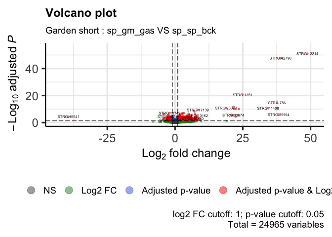
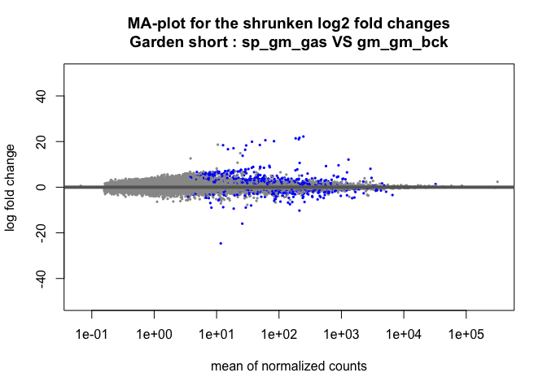

DE_Astroides_adult_gardenShort
================
Marc Meynadier
6/3/2022

``` r
# Differential expression on Kallisto data 

# Garden short 

# Packages and dependence
packageCheckClassic <- function(x){
  for( i in x ){
    #  require returns TRUE invisibly if it was able to load package
    if( ! require( i , character.only = TRUE ) ){
      #  If package was not able to be loaded then re-install
      install.packages( i , dependencies = TRUE )
      #  Load package after installing
      require( i , character.only = TRUE )
    }
  }
}

packageCheckClassic(c('DESeq2','devtools','BiocManager','ggplot2','ggrepel','markdown','RColorBrewer','genefilter','gplots','vegan','dplyr'))
```

    ## Le chargement a nécessité le package : DESeq2

    ## Le chargement a nécessité le package : S4Vectors

    ## Le chargement a nécessité le package : stats4

    ## Le chargement a nécessité le package : BiocGenerics

    ## 
    ## Attachement du package : 'BiocGenerics'

    ## Les objets suivants sont masqués depuis 'package:stats':
    ## 
    ##     IQR, mad, sd, var, xtabs

    ## Les objets suivants sont masqués depuis 'package:base':
    ## 
    ##     anyDuplicated, append, as.data.frame, basename, cbind, colnames,
    ##     dirname, do.call, duplicated, eval, evalq, Filter, Find, get, grep,
    ##     grepl, intersect, is.unsorted, lapply, Map, mapply, match, mget,
    ##     order, paste, pmax, pmax.int, pmin, pmin.int, Position, rank,
    ##     rbind, Reduce, rownames, sapply, setdiff, sort, table, tapply,
    ##     union, unique, unsplit, which.max, which.min

    ## 
    ## Attachement du package : 'S4Vectors'

    ## Les objets suivants sont masqués depuis 'package:base':
    ## 
    ##     expand.grid, I, unname

    ## Le chargement a nécessité le package : IRanges

    ## Le chargement a nécessité le package : GenomicRanges

    ## Le chargement a nécessité le package : GenomeInfoDb

    ## Le chargement a nécessité le package : SummarizedExperiment

    ## Le chargement a nécessité le package : MatrixGenerics

    ## Le chargement a nécessité le package : matrixStats

    ## 
    ## Attachement du package : 'MatrixGenerics'

    ## Les objets suivants sont masqués depuis 'package:matrixStats':
    ## 
    ##     colAlls, colAnyNAs, colAnys, colAvgsPerRowSet, colCollapse,
    ##     colCounts, colCummaxs, colCummins, colCumprods, colCumsums,
    ##     colDiffs, colIQRDiffs, colIQRs, colLogSumExps, colMadDiffs,
    ##     colMads, colMaxs, colMeans2, colMedians, colMins, colOrderStats,
    ##     colProds, colQuantiles, colRanges, colRanks, colSdDiffs, colSds,
    ##     colSums2, colTabulates, colVarDiffs, colVars, colWeightedMads,
    ##     colWeightedMeans, colWeightedMedians, colWeightedSds,
    ##     colWeightedVars, rowAlls, rowAnyNAs, rowAnys, rowAvgsPerColSet,
    ##     rowCollapse, rowCounts, rowCummaxs, rowCummins, rowCumprods,
    ##     rowCumsums, rowDiffs, rowIQRDiffs, rowIQRs, rowLogSumExps,
    ##     rowMadDiffs, rowMads, rowMaxs, rowMeans2, rowMedians, rowMins,
    ##     rowOrderStats, rowProds, rowQuantiles, rowRanges, rowRanks,
    ##     rowSdDiffs, rowSds, rowSums2, rowTabulates, rowVarDiffs, rowVars,
    ##     rowWeightedMads, rowWeightedMeans, rowWeightedMedians,
    ##     rowWeightedSds, rowWeightedVars

    ## Le chargement a nécessité le package : Biobase

    ## Welcome to Bioconductor
    ## 
    ##     Vignettes contain introductory material; view with
    ##     'browseVignettes()'. To cite Bioconductor, see
    ##     'citation("Biobase")', and for packages 'citation("pkgname")'.

    ## 
    ## Attachement du package : 'Biobase'

    ## L'objet suivant est masqué depuis 'package:MatrixGenerics':
    ## 
    ##     rowMedians

    ## Les objets suivants sont masqués depuis 'package:matrixStats':
    ## 
    ##     anyMissing, rowMedians

    ## Le chargement a nécessité le package : devtools

    ## Le chargement a nécessité le package : usethis

    ## Le chargement a nécessité le package : BiocManager

    ## Bioconductor version '3.14' is out-of-date; the current release version '3.15'
    ##   is available with R version '4.2'; see https://bioconductor.org/install

    ## 
    ## Attachement du package : 'BiocManager'

    ## L'objet suivant est masqué depuis 'package:devtools':
    ## 
    ##     install

    ## Le chargement a nécessité le package : ggplot2

    ## Le chargement a nécessité le package : ggrepel

    ## Le chargement a nécessité le package : markdown

    ## Le chargement a nécessité le package : RColorBrewer

    ## Le chargement a nécessité le package : genefilter

    ## 
    ## Attachement du package : 'genefilter'

    ## Les objets suivants sont masqués depuis 'package:MatrixGenerics':
    ## 
    ##     rowSds, rowVars

    ## Les objets suivants sont masqués depuis 'package:matrixStats':
    ## 
    ##     rowSds, rowVars

    ## Le chargement a nécessité le package : gplots

    ## 
    ## Attachement du package : 'gplots'

    ## L'objet suivant est masqué depuis 'package:IRanges':
    ## 
    ##     space

    ## L'objet suivant est masqué depuis 'package:S4Vectors':
    ## 
    ##     space

    ## L'objet suivant est masqué depuis 'package:stats':
    ## 
    ##     lowess

    ## Le chargement a nécessité le package : vegan

    ## Le chargement a nécessité le package : permute

    ## 
    ## Attachement du package : 'permute'

    ## L'objet suivant est masqué depuis 'package:devtools':
    ## 
    ##     check

    ## Le chargement a nécessité le package : lattice

    ## This is vegan 2.5-7

    ## Le chargement a nécessité le package : dplyr

    ## 
    ## Attachement du package : 'dplyr'

    ## L'objet suivant est masqué depuis 'package:Biobase':
    ## 
    ##     combine

    ## L'objet suivant est masqué depuis 'package:matrixStats':
    ## 
    ##     count

    ## Les objets suivants sont masqués depuis 'package:GenomicRanges':
    ## 
    ##     intersect, setdiff, union

    ## L'objet suivant est masqué depuis 'package:GenomeInfoDb':
    ## 
    ##     intersect

    ## Les objets suivants sont masqués depuis 'package:IRanges':
    ## 
    ##     collapse, desc, intersect, setdiff, slice, union

    ## Les objets suivants sont masqués depuis 'package:S4Vectors':
    ## 
    ##     first, intersect, rename, setdiff, setequal, union

    ## Les objets suivants sont masqués depuis 'package:BiocGenerics':
    ## 
    ##     combine, intersect, setdiff, union

    ## Les objets suivants sont masqués depuis 'package:stats':
    ## 
    ##     filter, lag

    ## Les objets suivants sont masqués depuis 'package:base':
    ## 
    ##     intersect, setdiff, setequal, union

``` r
#BiocManager::install('tximport', force = TRUE)
#BiocManager::install('apeglm')
#BiocManager::install('ashr')
#BiocManager::install("EnhancedVolcano")
#BiocManager::install('limma')
#devtools::install_github('cran/GMD')
if (!require(devtools)) install.packages("devtools")
devtools::install_github("yanlinlin82/ggvenn")
```

    ## Skipping install of 'ggvenn' from a github remote, the SHA1 (b7ff54ba) has not changed since last install.
    ##   Use `force = TRUE` to force installation

``` r
library('ggvenn')
```

    ## Le chargement a nécessité le package : grid

``` r
library('tximport')
library('apeglm')
library('ashr')
library('EnhancedVolcano')
```

    ## Registered S3 methods overwritten by 'ggalt':
    ##   method                  from   
    ##   grid.draw.absoluteGrob  ggplot2
    ##   grobHeight.absoluteGrob ggplot2
    ##   grobWidth.absoluteGrob  ggplot2
    ##   grobX.absoluteGrob      ggplot2
    ##   grobY.absoluteGrob      ggplot2

``` r
source_url("https://raw.githubusercontent.com/obigriffith/biostar-tutorials/master/Heatmaps/heatmap.3.R")
```

    ## ℹ SHA-1 hash of file is 015fc0457e61e3e93a903e69a24d96d2dac7b9fb

``` r
# Working environment 
scriptPath<-dirname(rstudioapi::getSourceEditorContext()$path)
setwd(scriptPath)
samples<-read.table('tximport_design_gardenShort.txt',header=T)
samplesBck<-read.table('tximport_design_gardenShort_bck.txt',header=T)
samplesGas<-read.table('tximport_design_gardenShort_gas.txt',header=T)
samplesGasSame<-read.table('tximport_design_gardenShort_gas_same.txt',header=T)
samplesGasDiff<-read.table('tximport_design_gardenShort_gas_diff.txt',header=T)
tx2gene<-read.table('tx2gene_adultTranscriptome',header=T)
candidateGenes<-read.csv('candidateGenes.csv',header=T,sep=',')
scriptPath <- sub("/[^/]+$", "", scriptPath)
scriptPath <- sub("/[^/]+$", "", scriptPath)
dataPath<-'/data/net/6_kallisto/adultTranscriptome/adult/5_gardenShort'
outputPath<-paste(scriptPath,'/output/DESeq2/adultTranscriptome/adult/5_gardenShort/',sep='')
wdPath<-paste(scriptPath,dataPath,sep='')
setwd(wdPath)

# Data importation - txImport
files<-paste0(samples$samples,'.tsv')
filesBck<-paste0(samplesBck$samples,'.tsv')
filesGas<-paste0(samplesGas$samples,'.tsv')
filesGasSame<-paste0(samplesGasSame$samples,'.tsv')
filesGasDiff<-paste0(samplesGasDiff$samples,'.tsv')
names(files)<-samples$samples
names(filesBck)<-samplesBck$samples
names(filesGas)<-samplesGas$samples
names(filesGasSame)<-samplesGasSame$samples
names(filesGasDiff)<-samplesGasDiff$samples
txi<-tximport(files = files,type='kallisto',tx2gene = tx2gene)
```

    ## Note: importing `abundance.h5` is typically faster than `abundance.tsv`

    ## reading in files with read_tsv

    ## 1 2 3 4 5 6 7 8 9 10 11 12 13 14 15 16 17 18 19 20 21 22 23 24 25 26 27 28 29 30 31 32 33 34 35 36 37 38 39 40 41 42 43 44 45 46 47 48 49 50 51 52 53 54 55 
    ## transcripts missing from tx2gene: 1
    ## summarizing abundance
    ## summarizing counts
    ## summarizing length

``` r
txiBck<-tximport(files = filesBck,type='kallisto',tx2gene = tx2gene)
```

    ## Note: importing `abundance.h5` is typically faster than `abundance.tsv`
    ## reading in files with read_tsv
    ## 1 2 3 4 5 6 7 8 9 
    ## transcripts missing from tx2gene: 1
    ## summarizing abundance
    ## summarizing counts
    ## summarizing length

``` r
txiGas<-tximport(files = filesGas,type='kallisto',tx2gene = tx2gene)
```

    ## Note: importing `abundance.h5` is typically faster than `abundance.tsv`
    ## reading in files with read_tsv
    ## 1 2 3 4 5 6 7 8 9 10 11 12 13 14 15 16 17 18 19 20 21 22 23 24 25 26 27 28 29 30 31 32 33 34 35 36 37 38 39 40 41 42 43 44 45 46 
    ## transcripts missing from tx2gene: 1
    ## summarizing abundance
    ## summarizing counts
    ## summarizing length

``` r
txiGasSame<-tximport(files = filesGasSame,type='kallisto',tx2gene = tx2gene)
```

    ## Note: importing `abundance.h5` is typically faster than `abundance.tsv`
    ## reading in files with read_tsv
    ## 1 2 3 4 5 6 7 8 9 10 11 12 13 14 15 16 17 18 19 
    ## transcripts missing from tx2gene: 1
    ## summarizing abundance
    ## summarizing counts
    ## summarizing length

``` r
txiGasDiff<-tximport(files = filesGasDiff,type='kallisto',tx2gene = tx2gene)
```

    ## Note: importing `abundance.h5` is typically faster than `abundance.tsv`
    ## reading in files with read_tsv
    ## 1 2 3 4 5 6 7 8 9 10 11 12 13 14 15 16 17 18 19 20 21 22 23 24 25 26 27 
    ## transcripts missing from tx2gene: 1
    ## summarizing abundance
    ## summarizing counts
    ## summarizing length

``` r
names(txi)
```

    ## [1] "abundance"           "counts"              "length"             
    ## [4] "countsFromAbundance"

``` r
head(txi$counts)
```

    ##                    abundance_adult_sept2018_gm_gm_bck_15941X28_trimmed
    ## TRINITY_DN0_c0_g1                                            1087.0000
    ## TRINITY_DN0_c0_g2                                             112.8410
    ## TRINITY_DN0_c1_g1                                              25.1139
    ## TRINITY_DN1_c0_g1                                            2988.0000
    ## TRINITY_DN1_c1_g1                                               0.0000
    ## TRINITY_DN10_c0_g1                                            584.8720
    ##                    abundance_adult_sept2018_gm_gm_bck_15941X46_trimmed
    ## TRINITY_DN0_c0_g1                                             757.0000
    ## TRINITY_DN0_c0_g2                                              73.0000
    ## TRINITY_DN0_c1_g1                                              16.1135
    ## TRINITY_DN1_c0_g1                                            2944.3000
    ## TRINITY_DN1_c1_g1                                               0.0000
    ## TRINITY_DN10_c0_g1                                            363.9040
    ##                    abundance_adult_sept2018_gm_gm_bck_15941X54_trimmed
    ## TRINITY_DN0_c0_g1                                            2283.0000
    ## TRINITY_DN0_c0_g2                                              65.0000
    ## TRINITY_DN0_c1_g1                                              19.1725
    ## TRINITY_DN1_c0_g1                                            2721.0000
    ## TRINITY_DN1_c1_g1                                               0.0000
    ## TRINITY_DN10_c0_g1                                            238.8070
    ##                    abundance_adult_sept2018_gm_gm_gas_15873X11_trimmed
    ## TRINITY_DN0_c0_g1                                              645.000
    ## TRINITY_DN0_c0_g2                                              204.109
    ## TRINITY_DN0_c1_g1                                               26.000
    ## TRINITY_DN1_c0_g1                                             2941.000
    ## TRINITY_DN1_c1_g1                                                0.000
    ## TRINITY_DN10_c0_g1                                             443.826
    ##                    abundance_adult_sept2018_gm_gm_gas_15873X16_trimmed
    ## TRINITY_DN0_c0_g1                                              648.000
    ## TRINITY_DN0_c0_g2                                              180.177
    ## TRINITY_DN0_c1_g1                                               33.000
    ## TRINITY_DN1_c0_g1                                             2430.790
    ## TRINITY_DN1_c1_g1                                                0.000
    ## TRINITY_DN10_c0_g1                                             399.192
    ##                    abundance_adult_sept2018_gm_gm_gas_15873X38_trimmed
    ## TRINITY_DN0_c0_g1                                             840.0000
    ## TRINITY_DN0_c0_g2                                             145.0000
    ## TRINITY_DN0_c1_g1                                              16.1688
    ## TRINITY_DN1_c0_g1                                            2930.0000
    ## TRINITY_DN1_c1_g1                                               0.0000
    ## TRINITY_DN10_c0_g1                                            268.7270
    ##                    abundance_adult_sept2018_gm_gm_gas_15941X11_trimmed
    ## TRINITY_DN0_c0_g1                                             844.0000
    ## TRINITY_DN0_c0_g2                                              92.4507
    ## TRINITY_DN0_c1_g1                                              22.0000
    ## TRINITY_DN1_c0_g1                                            3607.0000
    ## TRINITY_DN1_c1_g1                                               0.0000
    ## TRINITY_DN10_c0_g1                                            278.7220
    ##                    abundance_adult_sept2018_gm_gm_gas_15941X12_trimmed
    ## TRINITY_DN0_c0_g1                                             490.0000
    ## TRINITY_DN0_c0_g2                                              90.0000
    ## TRINITY_DN0_c1_g1                                              22.1137
    ## TRINITY_DN1_c0_g1                                            1479.0000
    ## TRINITY_DN1_c1_g1                                               0.0000
    ## TRINITY_DN10_c0_g1                                            223.2230
    ##                    abundance_adult_sept2018_gm_gm_gas_15941X26_trimmed
    ## TRINITY_DN0_c0_g1                                             974.0000
    ## TRINITY_DN0_c0_g2                                              61.7238
    ## TRINITY_DN0_c1_g1                                              20.5152
    ## TRINITY_DN1_c0_g1                                            3019.0000
    ## TRINITY_DN1_c1_g1                                               0.0000
    ## TRINITY_DN10_c0_g1                                            373.5150
    ##                    abundance_adult_sept2018_gm_gm_gas_15941X50_trimmed
    ## TRINITY_DN0_c0_g1                                            1004.0000
    ## TRINITY_DN0_c0_g2                                             134.1570
    ## TRINITY_DN0_c1_g1                                              28.2638
    ## TRINITY_DN1_c0_g1                                            2195.0000
    ## TRINITY_DN1_c1_g1                                               0.0000
    ## TRINITY_DN10_c0_g1                                            350.4150
    ##                    abundance_adult_sept2018_gm_pv_gas_15873X15_trimmed
    ## TRINITY_DN0_c0_g1                                             834.0000
    ## TRINITY_DN0_c0_g2                                             163.7540
    ## TRINITY_DN0_c1_g1                                              49.1437
    ## TRINITY_DN1_c0_g1                                            2019.7500
    ## TRINITY_DN1_c1_g1                                               0.0000
    ## TRINITY_DN10_c0_g1                                            350.0910
    ##                    abundance_adult_sept2018_gm_pv_gas_15873X23_trimmed
    ## TRINITY_DN0_c0_g1                                               643.00
    ## TRINITY_DN0_c0_g2                                               122.00
    ## TRINITY_DN0_c1_g1                                                12.00
    ## TRINITY_DN1_c0_g1                                              1943.00
    ## TRINITY_DN1_c1_g1                                                 0.00
    ## TRINITY_DN10_c0_g1                                              257.61
    ##                    abundance_adult_sept2018_gm_pv_gas_15873X46_trimmed
    ## TRINITY_DN0_c0_g1                                              967.000
    ## TRINITY_DN0_c0_g2                                              253.000
    ## TRINITY_DN0_c1_g1                                               20.000
    ## TRINITY_DN1_c0_g1                                             4394.000
    ## TRINITY_DN1_c1_g1                                                0.000
    ## TRINITY_DN10_c0_g1                                             401.447
    ##                    abundance_adult_sept2018_gm_pv_gas_15873X49_trimmed
    ## TRINITY_DN0_c0_g1                                              794.000
    ## TRINITY_DN0_c0_g2                                              158.000
    ## TRINITY_DN0_c1_g1                                               14.000
    ## TRINITY_DN1_c0_g1                                             2847.000
    ## TRINITY_DN1_c1_g1                                                0.000
    ## TRINITY_DN10_c0_g1                                             249.423
    ##                    abundance_adult_sept2018_gm_pv_gas_15873X50_trimmed
    ## TRINITY_DN0_c0_g1                                             340.0000
    ## TRINITY_DN0_c0_g2                                              77.7748
    ## TRINITY_DN0_c1_g1                                               9.1293
    ## TRINITY_DN1_c0_g1                                             889.5880
    ## TRINITY_DN1_c1_g1                                               0.0000
    ## TRINITY_DN10_c0_g1                                            236.4560
    ##                    abundance_adult_sept2018_gm_pv_gas_15941X14_trimmed
    ## TRINITY_DN0_c0_g1                                             625.0000
    ## TRINITY_DN0_c0_g2                                             132.6920
    ## TRINITY_DN0_c1_g1                                              35.8231
    ## TRINITY_DN1_c0_g1                                            1933.0000
    ## TRINITY_DN1_c1_g1                                               0.0000
    ## TRINITY_DN10_c0_g1                                            202.1640
    ##                    abundance_adult_sept2018_gm_pv_gas_15941X38_trimmed
    ## TRINITY_DN0_c0_g1                                            1028.0000
    ## TRINITY_DN0_c0_g2                                              52.0000
    ## TRINITY_DN0_c1_g1                                              26.1549
    ## TRINITY_DN1_c0_g1                                            2203.5300
    ## TRINITY_DN1_c1_g1                                               0.0000
    ## TRINITY_DN10_c0_g1                                            258.0750
    ##                    abundance_adult_sept2018_gm_sp_gas_15873X17_trimmed
    ## TRINITY_DN0_c0_g1                                              674.000
    ## TRINITY_DN0_c0_g2                                              171.634
    ## TRINITY_DN0_c1_g1                                               29.000
    ## TRINITY_DN1_c0_g1                                             2471.000
    ## TRINITY_DN1_c1_g1                                                0.000
    ## TRINITY_DN10_c0_g1                                             351.670
    ##                    abundance_adult_sept2018_gm_sp_gas_15873X37_trimmed
    ## TRINITY_DN0_c0_g1                                             1240.000
    ## TRINITY_DN0_c0_g2                                              159.887
    ## TRINITY_DN0_c1_g1                                               28.000
    ## TRINITY_DN1_c0_g1                                             2645.000
    ## TRINITY_DN1_c1_g1                                                0.000
    ## TRINITY_DN10_c0_g1                                             377.101
    ##                    abundance_adult_sept2018_gm_sp_gas_15941X10_trimmed
    ## TRINITY_DN0_c0_g1                                             976.0000
    ## TRINITY_DN0_c0_g2                                             102.0000
    ## TRINITY_DN0_c1_g1                                              29.3501
    ## TRINITY_DN1_c0_g1                                            4596.0000
    ## TRINITY_DN1_c1_g1                                               1.0000
    ## TRINITY_DN10_c0_g1                                            280.3350
    ##                    abundance_adult_sept2018_gm_sp_gas_15941X24_trimmed
    ## TRINITY_DN0_c0_g1                                             760.0000
    ## TRINITY_DN0_c0_g2                                              92.8085
    ## TRINITY_DN0_c1_g1                                              23.1783
    ## TRINITY_DN1_c0_g1                                            1165.0000
    ## TRINITY_DN1_c1_g1                                               0.0000
    ## TRINITY_DN10_c0_g1                                            244.2380
    ##                    abundance_adult_sept2018_gm_sp_gas_15941X25_trimmed
    ## TRINITY_DN0_c0_g1                                            1114.0000
    ## TRINITY_DN0_c0_g2                                             139.5830
    ## TRINITY_DN0_c1_g1                                              31.2676
    ## TRINITY_DN1_c0_g1                                            2609.0000
    ## TRINITY_DN1_c1_g1                                               0.0000
    ## TRINITY_DN10_c0_g1                                            398.2550
    ##                    abundance_adult_sept2018_gm_sp_gas_15941X44_trimmed
    ## TRINITY_DN0_c0_g1                                            1133.0000
    ## TRINITY_DN0_c0_g2                                              75.6340
    ## TRINITY_DN0_c1_g1                                              24.3566
    ## TRINITY_DN1_c0_g1                                            1388.0000
    ## TRINITY_DN1_c1_g1                                               0.0000
    ## TRINITY_DN10_c0_g1                                            252.6230
    ##                    abundance_adult_sept2018_gm_sp_gas_15941X57_trimmed
    ## TRINITY_DN0_c0_g1                                            1085.0000
    ## TRINITY_DN0_c0_g2                                             107.9690
    ## TRINITY_DN0_c1_g1                                              42.2181
    ## TRINITY_DN1_c0_g1                                            2283.0000
    ## TRINITY_DN1_c1_g1                                               0.0000
    ## TRINITY_DN10_c0_g1                                            609.8180
    ##                    abundance_adult_sept2018_pv_gm_gas_15873X12_trimmed
    ## TRINITY_DN0_c0_g1                                              571.000
    ## TRINITY_DN0_c0_g2                                              168.000
    ## TRINITY_DN0_c1_g1                                               27.000
    ## TRINITY_DN1_c0_g1                                             1276.000
    ## TRINITY_DN1_c1_g1                                                0.000
    ## TRINITY_DN10_c0_g1                                             279.036
    ##                    abundance_adult_sept2018_pv_gm_gas_15873X39_trimmed
    ## TRINITY_DN0_c0_g1                                             743.0000
    ## TRINITY_DN0_c0_g2                                             104.0000
    ## TRINITY_DN0_c1_g1                                              23.2666
    ## TRINITY_DN1_c0_g1                                            2627.0000
    ## TRINITY_DN1_c1_g1                                               0.0000
    ## TRINITY_DN10_c0_g1                                            393.8330
    ##                    abundance_adult_sept2018_pv_gm_gas_15873X40_trimmed
    ## TRINITY_DN0_c0_g1                                              592.000
    ## TRINITY_DN0_c0_g2                                               74.000
    ## TRINITY_DN0_c1_g1                                               14.000
    ## TRINITY_DN1_c0_g1                                             1225.000
    ## TRINITY_DN1_c1_g1                                                0.000
    ## TRINITY_DN10_c0_g1                                             218.479
    ##                    abundance_adult_sept2018_pv_gm_gas_15941X13_trimmed
    ## TRINITY_DN0_c0_g1                                             1060.000
    ## TRINITY_DN0_c0_g2                                              100.045
    ## TRINITY_DN0_c1_g1                                               17.000
    ## TRINITY_DN1_c0_g1                                             2124.000
    ## TRINITY_DN1_c1_g1                                                0.000
    ## TRINITY_DN10_c0_g1                                             341.324
    ##                    abundance_adult_sept2018_pv_gm_gas_15941X27_trimmed
    ## TRINITY_DN0_c0_g1                                              908.000
    ## TRINITY_DN0_c0_g2                                              175.000
    ## TRINITY_DN0_c1_g1                                               20.089
    ## TRINITY_DN1_c0_g1                                             3333.000
    ## TRINITY_DN1_c1_g1                                                0.000
    ## TRINITY_DN10_c0_g1                                             327.720
    ##                    abundance_adult_sept2018_pv_gm_gas_15941X45_trimmed
    ## TRINITY_DN0_c0_g1                                              927.000
    ## TRINITY_DN0_c0_g2                                              131.000
    ## TRINITY_DN0_c1_g1                                               27.000
    ## TRINITY_DN1_c0_g1                                             1615.310
    ## TRINITY_DN1_c1_g1                                                0.000
    ## TRINITY_DN10_c0_g1                                             308.444
    ##                    abundance_adult_sept2018_pv_pv_bck_15873X21_trimmed
    ## TRINITY_DN0_c0_g1                                             500.0000
    ## TRINITY_DN0_c0_g2                                             141.7750
    ## TRINITY_DN0_c1_g1                                              16.0743
    ## TRINITY_DN1_c0_g1                                            2813.8000
    ## TRINITY_DN1_c1_g1                                               0.0000
    ## TRINITY_DN10_c0_g1                                            316.4540
    ##                    abundance_adult_sept2018_pv_pv_bck_15941X47_trimmed
    ## TRINITY_DN0_c0_g1                                             874.0000
    ## TRINITY_DN0_c0_g2                                             134.0000
    ## TRINITY_DN0_c1_g1                                              27.0977
    ## TRINITY_DN1_c0_g1                                            2098.0000
    ## TRINITY_DN1_c1_g1                                               0.0000
    ## TRINITY_DN10_c0_g1                                            318.4040
    ##                    abundance_adult_sept2018_pv_pv_bck_15941X55_trimmed
    ## TRINITY_DN0_c0_g1                                              1334.00
    ## TRINITY_DN0_c0_g2                                               107.00
    ## TRINITY_DN0_c1_g1                                                22.00
    ## TRINITY_DN1_c0_g1                                              3120.83
    ## TRINITY_DN1_c1_g1                                                 0.00
    ## TRINITY_DN10_c0_g1                                              333.00
    ##                    abundance_adult_sept2018_pv_pv_gas_15873X14_trimmed
    ## TRINITY_DN0_c0_g1                                              717.000
    ## TRINITY_DN0_c0_g2                                              122.000
    ## TRINITY_DN0_c1_g1                                               14.000
    ## TRINITY_DN1_c0_g1                                             1902.760
    ## TRINITY_DN1_c1_g1                                                0.000
    ## TRINITY_DN10_c0_g1                                             291.096
    ##                    abundance_adult_sept2018_pv_pv_gas_15873X47_trimmed
    ## TRINITY_DN0_c0_g1                                              905.000
    ## TRINITY_DN0_c0_g2                                              108.839
    ## TRINITY_DN0_c1_g1                                               16.000
    ## TRINITY_DN1_c0_g1                                             1600.000
    ## TRINITY_DN1_c1_g1                                                0.000
    ## TRINITY_DN10_c0_g1                                             220.109
    ##                    abundance_adult_sept2018_pv_pv_gas_15873X48_trimmed
    ## TRINITY_DN0_c0_g1                                             1137.000
    ## TRINITY_DN0_c0_g2                                              118.490
    ## TRINITY_DN0_c1_g1                                               20.000
    ## TRINITY_DN1_c0_g1                                             2904.000
    ## TRINITY_DN1_c1_g1                                                0.000
    ## TRINITY_DN10_c0_g1                                             368.048
    ##                    abundance_adult_sept2018_pv_pv_gas_15941X15_trimmed
    ## TRINITY_DN0_c0_g1                                              1262.00
    ## TRINITY_DN0_c0_g2                                                91.00
    ## TRINITY_DN0_c1_g1                                                34.00
    ## TRINITY_DN1_c0_g1                                              1217.00
    ## TRINITY_DN1_c1_g1                                                 0.00
    ## TRINITY_DN10_c0_g1                                              271.98
    ##                    abundance_adult_sept2018_pv_pv_gas_15941X37_trimmed
    ## TRINITY_DN0_c0_g1                                             915.0000
    ## TRINITY_DN0_c0_g2                                             101.0000
    ## TRINITY_DN0_c1_g1                                              27.2292
    ## TRINITY_DN1_c0_g1                                            1159.0000
    ## TRINITY_DN1_c1_g1                                               0.0000
    ## TRINITY_DN10_c0_g1                                            243.1810
    ##                    abundance_adult_sept2018_pv_pv_gas_15941X58_trimmed
    ## TRINITY_DN0_c0_g1                                            1185.0000
    ## TRINITY_DN0_c0_g2                                              58.0000
    ## TRINITY_DN0_c1_g1                                              47.2034
    ## TRINITY_DN1_c0_g1                                            1557.0000
    ## TRINITY_DN1_c1_g1                                               0.0000
    ## TRINITY_DN10_c0_g1                                            215.0980
    ##                    abundance_adult_sept2018_sp_gm_gas_15873X13_trimmed
    ## TRINITY_DN0_c0_g1                                               824.00
    ## TRINITY_DN0_c0_g2                                               161.00
    ## TRINITY_DN0_c1_g1                                                25.00
    ## TRINITY_DN1_c0_g1                                              2715.00
    ## TRINITY_DN1_c1_g1                                                 0.00
    ## TRINITY_DN10_c0_g1                                              314.07
    ##                    abundance_adult_sept2018_sp_gm_gas_15873X44_trimmed
    ## TRINITY_DN0_c0_g1                                            1240.0000
    ## TRINITY_DN0_c0_g2                                             187.0000
    ## TRINITY_DN0_c1_g1                                              25.2066
    ## TRINITY_DN1_c0_g1                                            3593.0000
    ## TRINITY_DN1_c1_g1                                               0.0000
    ## TRINITY_DN10_c0_g1                                            341.8880
    ##                    abundance_adult_sept2018_sp_gm_gas_15873X45_trimmed
    ## TRINITY_DN0_c0_g1                                              917.000
    ## TRINITY_DN0_c0_g2                                              141.415
    ## TRINITY_DN0_c1_g1                                               23.000
    ## TRINITY_DN1_c0_g1                                             3064.860
    ## TRINITY_DN1_c1_g1                                                0.000
    ## TRINITY_DN10_c0_g1                                             307.904
    ##                    abundance_adult_sept2018_sp_gm_gas_15941X35_trimmed
    ## TRINITY_DN0_c0_g1                                            1319.0000
    ## TRINITY_DN0_c0_g2                                              84.2478
    ## TRINITY_DN0_c1_g1                                              28.0000
    ## TRINITY_DN1_c0_g1                                            3835.0000
    ## TRINITY_DN1_c1_g1                                               0.0000
    ## TRINITY_DN10_c0_g1                                            537.4110
    ##                    abundance_adult_sept2018_sp_gm_gas_15941X36_trimmed
    ## TRINITY_DN0_c0_g1                                             635.0000
    ## TRINITY_DN0_c0_g2                                              79.0000
    ## TRINITY_DN0_c1_g1                                              23.0863
    ## TRINITY_DN1_c0_g1                                            2666.5400
    ## TRINITY_DN1_c1_g1                                               0.0000
    ## TRINITY_DN10_c0_g1                                            356.2960
    ##                    abundance_adult_sept2018_sp_gm_gas_15941X49_trimmed
    ## TRINITY_DN0_c0_g1                                            1919.0000
    ## TRINITY_DN0_c0_g2                                              59.3251
    ## TRINITY_DN0_c1_g1                                              34.5338
    ## TRINITY_DN1_c0_g1                                            3723.9000
    ## TRINITY_DN1_c1_g1                                               0.0000
    ## TRINITY_DN10_c0_g1                                            396.8410
    ##                    abundance_adult_sept2018_sp_gm_gas_15941X56_trimmed
    ## TRINITY_DN0_c0_g1                                             942.0000
    ## TRINITY_DN0_c0_g2                                              85.0000
    ## TRINITY_DN0_c1_g1                                              22.1548
    ## TRINITY_DN1_c0_g1                                            1681.0000
    ## TRINITY_DN1_c1_g1                                               0.0000
    ## TRINITY_DN10_c0_g1                                            353.9530
    ##                    abundance_adult_sept2018_sp_sp_bck_15873X20_trimmed
    ## TRINITY_DN0_c0_g1                                              604.000
    ## TRINITY_DN0_c0_g2                                              100.000
    ## TRINITY_DN0_c1_g1                                               16.000
    ## TRINITY_DN1_c0_g1                                             3551.000
    ## TRINITY_DN1_c1_g1                                                0.000
    ## TRINITY_DN10_c0_g1                                             397.305
    ##                    abundance_adult_sept2018_sp_sp_bck_15941X48_trimmed
    ## TRINITY_DN0_c0_g1                                              574.000
    ## TRINITY_DN0_c0_g2                                              275.737
    ## TRINITY_DN0_c1_g1                                               27.000
    ## TRINITY_DN1_c0_g1                                             3897.000
    ## TRINITY_DN1_c1_g1                                                0.000
    ## TRINITY_DN10_c0_g1                                             293.778
    ##                    abundance_adult_sept2018_sp_sp_bck_15941X53_trimmed
    ## TRINITY_DN0_c0_g1                                              498.000
    ## TRINITY_DN0_c0_g2                                              113.731
    ## TRINITY_DN0_c1_g1                                               19.000
    ## TRINITY_DN1_c0_g1                                             4000.000
    ## TRINITY_DN1_c1_g1                                                0.000
    ## TRINITY_DN10_c0_g1                                             344.028
    ##                    abundance_adult_sept2018_sp_sp_gas_15873X10_trimmed
    ## TRINITY_DN0_c0_g1                                              592.000
    ## TRINITY_DN0_c0_g2                                              100.000
    ## TRINITY_DN0_c1_g1                                               15.000
    ## TRINITY_DN1_c0_g1                                             3227.000
    ## TRINITY_DN1_c1_g1                                                0.000
    ## TRINITY_DN10_c0_g1                                             368.787
    ##                    abundance_adult_sept2018_sp_sp_gas_15873X34_trimmed
    ## TRINITY_DN0_c0_g1                                              378.000
    ## TRINITY_DN0_c0_g2                                              121.600
    ## TRINITY_DN0_c1_g1                                               21.000
    ## TRINITY_DN1_c0_g1                                             3512.000
    ## TRINITY_DN1_c1_g1                                                1.000
    ## TRINITY_DN10_c0_g1                                             321.214
    ##                    abundance_adult_sept2018_sp_sp_gas_15873X36_trimmed
    ## TRINITY_DN0_c0_g1                                             633.0000
    ## TRINITY_DN0_c0_g2                                             122.0000
    ## TRINITY_DN0_c1_g1                                              23.1045
    ## TRINITY_DN1_c0_g1                                            2017.0000
    ## TRINITY_DN1_c1_g1                                               0.0000
    ## TRINITY_DN10_c0_g1                                            425.6230
    ##                    abundance_adult_sept2018_sp_sp_gas_15941X23_trimmed
    ## TRINITY_DN0_c0_g1                                              591.000
    ## TRINITY_DN0_c0_g2                                              153.000
    ## TRINITY_DN0_c1_g1                                               30.000
    ## TRINITY_DN1_c0_g1                                             2710.000
    ## TRINITY_DN1_c1_g1                                                0.000
    ## TRINITY_DN10_c0_g1                                             352.368
    ##                    abundance_adult_sept2018_sp_sp_gas_15941X43_trimmed
    ## TRINITY_DN0_c0_g1                                             1107.000
    ## TRINITY_DN0_c0_g2                                               79.000
    ## TRINITY_DN0_c1_g1                                               25.000
    ## TRINITY_DN1_c0_g1                                             1751.660
    ## TRINITY_DN1_c1_g1                                                0.000
    ## TRINITY_DN10_c0_g1                                             315.187
    ##                    abundance_adult_sept2018_sp_sp_gas_15941X9_trimmed
    ## TRINITY_DN0_c0_g1                                            676.0000
    ## TRINITY_DN0_c0_g2                                             95.0000
    ## TRINITY_DN0_c1_g1                                             30.3367
    ## TRINITY_DN1_c0_g1                                           1633.0000
    ## TRINITY_DN1_c1_g1                                              0.0000
    ## TRINITY_DN10_c0_g1                                           377.1480

``` r
dds<-DESeqDataSetFromTximport(txi,colData=samples,design= ~originSite_finalSite_experiment)
```

    ## Warning in DESeqDataSet(se, design = design, ignoreRank): some variables in
    ## design formula are characters, converting to factors

    ## using counts and average transcript lengths from tximport

``` r
ddsBck<-DESeqDataSetFromTximport(txiBck,colData=samplesBck,design= ~originSite_finalSite_experiment)
```

    ## Warning in DESeqDataSet(se, design = design, ignoreRank): some variables in
    ## design formula are characters, converting to factors

    ## using counts and average transcript lengths from tximport

``` r
ddsGas<-DESeqDataSetFromTximport(txiGas,colData=samplesGas,design= ~originSite_finalSite_experiment)
```

    ## Warning in DESeqDataSet(se, design = design, ignoreRank): some variables in
    ## design formula are characters, converting to factors

    ## using counts and average transcript lengths from tximport

``` r
ddsGasSame<-DESeqDataSetFromTximport(txiGasSame,colData=samplesGasSame,design= ~originSite_finalSite_experiment)
```

    ## Warning in DESeqDataSet(se, design = design, ignoreRank): some variables in
    ## design formula are characters, converting to factors

    ## using counts and average transcript lengths from tximport

``` r
ddsGasDiff<-DESeqDataSetFromTximport(txiGasDiff,colData=samplesGasDiff,design= ~originSite_finalSite_experiment)
```

    ## Warning in DESeqDataSet(se, design = design, ignoreRank): some variables in
    ## design formula are characters, converting to factors

    ## using counts and average transcript lengths from tximport

``` r
# pre-filtering
keep <- rowSums(counts(dds)) >= 10 
dds <- dds[keep,]
keep <- rowSums(counts(ddsBck)) >= 10 
ddsBck <- ddsBck[keep,]
keep <- rowSums(counts(ddsGas)) >= 10 
ddsGas <- ddsGas[keep,]
keep <- rowSums(counts(ddsGasSame)) >= 10 
ddsGasSame <- ddsGasSame[keep,]
keep <- rowSums(counts(ddsGasDiff)) >= 10 
ddsGasDiff <- ddsGasDiff[keep,]

# Differential expression analysis
dds<-DESeq(dds)
```

    ## estimating size factors
    ## using 'avgTxLength' from assays(dds), correcting for library size
    ## estimating dispersions
    ## gene-wise dispersion estimates
    ## mean-dispersion relationship
    ## final dispersion estimates
    ## fitting model and testing
    ## -- replacing outliers and refitting for 78 genes
    ## -- DESeq argument 'minReplicatesForReplace' = 7 
    ## -- original counts are preserved in counts(dds)
    ## estimating dispersions
    ## fitting model and testing

``` r
ddsBck<-DESeq(ddsBck)
```

    ## estimating size factors
    ## using 'avgTxLength' from assays(dds), correcting for library size
    ## estimating dispersions
    ## gene-wise dispersion estimates
    ## mean-dispersion relationship
    ## final dispersion estimates
    ## fitting model and testing

``` r
ddsGas<-DESeq(ddsGas)
```

    ## estimating size factors
    ## using 'avgTxLength' from assays(dds), correcting for library size
    ## estimating dispersions
    ## gene-wise dispersion estimates
    ## mean-dispersion relationship
    ## final dispersion estimates
    ## fitting model and testing
    ## -- replacing outliers and refitting for 88 genes
    ## -- DESeq argument 'minReplicatesForReplace' = 7 
    ## -- original counts are preserved in counts(dds)
    ## estimating dispersions
    ## fitting model and testing

``` r
ddsGasSame<-DESeq(ddsGasSame)
```

    ## estimating size factors
    ## using 'avgTxLength' from assays(dds), correcting for library size
    ## estimating dispersions
    ## gene-wise dispersion estimates
    ## mean-dispersion relationship
    ## final dispersion estimates
    ## fitting model and testing
    ## -- replacing outliers and refitting for 217 genes
    ## -- DESeq argument 'minReplicatesForReplace' = 7 
    ## -- original counts are preserved in counts(dds)
    ## estimating dispersions
    ## fitting model and testing

``` r
ddsGasDiff<-DESeq(ddsGasDiff)
```

    ## estimating size factors
    ## using 'avgTxLength' from assays(dds), correcting for library size
    ## estimating dispersions
    ## gene-wise dispersion estimates
    ## mean-dispersion relationship
    ## final dispersion estimates
    ## fitting model and testing
    ## -- replacing outliers and refitting for 175 genes
    ## -- DESeq argument 'minReplicatesForReplace' = 7 
    ## -- original counts are preserved in counts(dds)
    ## estimating dispersions
    ## fitting model and testing

``` r
cbind(resultsNames(dds))
```

    ##       [,1]                                                    
    ##  [1,] "Intercept"                                             
    ##  [2,] "originSite_finalSite_experiment_gm_gm_gas_vs_gm_gm_bck"
    ##  [3,] "originSite_finalSite_experiment_gm_pv_gas_vs_gm_gm_bck"
    ##  [4,] "originSite_finalSite_experiment_gm_sp_gas_vs_gm_gm_bck"
    ##  [5,] "originSite_finalSite_experiment_pv_gm_gas_vs_gm_gm_bck"
    ##  [6,] "originSite_finalSite_experiment_pv_pv_bck_vs_gm_gm_bck"
    ##  [7,] "originSite_finalSite_experiment_pv_pv_gas_vs_gm_gm_bck"
    ##  [8,] "originSite_finalSite_experiment_sp_gm_gas_vs_gm_gm_bck"
    ##  [9,] "originSite_finalSite_experiment_sp_sp_bck_vs_gm_gm_bck"
    ## [10,] "originSite_finalSite_experiment_sp_sp_gas_vs_gm_gm_bck"

``` r
gm_gm_gas_VS_gm_gm_bck<-results(dds, contrast=c("originSite_finalSite_experiment","gm_gm_gas","gm_gm_bck"), alpha = 0.05)
pv_pv_gas_VS_pv_pv_bck<-results(dds, contrast=c("originSite_finalSite_experiment","pv_pv_gas","pv_pv_bck"), alpha = 0.05)
sp_sp_gas_VS_sp_sp_bck<-results(dds, contrast=c("originSite_finalSite_experiment","sp_sp_gas","sp_sp_bck"), alpha = 0.05)
pv_gm_gas_VS_pv_pv_bck<-results(dds, contrast=c("originSite_finalSite_experiment","pv_gm_gas","pv_pv_bck"), alpha = 0.05)
sp_gm_gas_VS_sp_sp_bck<-results(dds, contrast=c("originSite_finalSite_experiment","sp_gm_gas","sp_sp_bck"), alpha = 0.05)
pv_gm_gas_VS_gm_gm_bck<-results(dds, contrast=c("originSite_finalSite_experiment","pv_gm_gas","gm_gm_bck"), alpha = 0.05)
sp_gm_gas_VS_gm_gm_bck<-results(dds, contrast=c("originSite_finalSite_experiment","sp_sp_gas","gm_gm_bck"), alpha = 0.05)
gm_pv_gas_VS_pv_pv_bck<-results(dds, contrast=c("originSite_finalSite_experiment","gm_pv_gas","pv_pv_bck"), alpha = 0.05)
gm_sp_gas_VS_sp_sp_bck<-results(dds, contrast=c("originSite_finalSite_experiment","gm_sp_gas","sp_sp_bck"), alpha = 0.05)
gm_pv_gas_VS_gm_gm_bck<-results(dds, contrast=c("originSite_finalSite_experiment","gm_pv_gas","gm_gm_bck"), alpha = 0.05)
gm_sp_gas_VS_gm_gm_bck<-results(dds, contrast=c("originSite_finalSite_experiment","gm_sp_gas","gm_gm_bck"), alpha = 0.05)
summary(gm_gm_gas_VS_gm_gm_bck)
```

    ## 
    ## out of 71230 with nonzero total read count
    ## adjusted p-value < 0.05
    ## LFC > 0 (up)       : 373, 0.52%
    ## LFC < 0 (down)     : 621, 0.87%
    ## outliers [1]       : 49, 0.069%
    ## low counts [2]     : 40024, 56%
    ## (mean count < 10)
    ## [1] see 'cooksCutoff' argument of ?results
    ## [2] see 'independentFiltering' argument of ?results

``` r
summary(pv_pv_gas_VS_pv_pv_bck)
```

    ## 
    ## out of 71230 with nonzero total read count
    ## adjusted p-value < 0.05
    ## LFC > 0 (up)       : 112, 0.16%
    ## LFC < 0 (down)     : 94, 0.13%
    ## outliers [1]       : 49, 0.069%
    ## low counts [2]     : 38644, 54%
    ## (mean count < 8)
    ## [1] see 'cooksCutoff' argument of ?results
    ## [2] see 'independentFiltering' argument of ?results

``` r
summary(sp_sp_gas_VS_sp_sp_bck)
```

    ## 
    ## out of 71230 with nonzero total read count
    ## adjusted p-value < 0.05
    ## LFC > 0 (up)       : 696, 0.98%
    ## LFC < 0 (down)     : 412, 0.58%
    ## outliers [1]       : 49, 0.069%
    ## low counts [2]     : 38644, 54%
    ## (mean count < 8)
    ## [1] see 'cooksCutoff' argument of ?results
    ## [2] see 'independentFiltering' argument of ?results

``` r
summary(pv_gm_gas_VS_pv_pv_bck)
```

    ## 
    ## out of 71230 with nonzero total read count
    ## adjusted p-value < 0.05
    ## LFC > 0 (up)       : 27, 0.038%
    ## LFC < 0 (down)     : 28, 0.039%
    ## outliers [1]       : 49, 0.069%
    ## low counts [2]     : 8286, 12%
    ## (mean count < 0)
    ## [1] see 'cooksCutoff' argument of ?results
    ## [2] see 'independentFiltering' argument of ?results

``` r
summary(sp_gm_gas_VS_sp_sp_bck)
```

    ## 
    ## out of 71230 with nonzero total read count
    ## adjusted p-value < 0.05
    ## LFC > 0 (up)       : 2399, 3.4%
    ## LFC < 0 (down)     : 2473, 3.5%
    ## outliers [1]       : 49, 0.069%
    ## low counts [2]     : 33129, 47%
    ## (mean count < 5)
    ## [1] see 'cooksCutoff' argument of ?results
    ## [2] see 'independentFiltering' argument of ?results

``` r
summary(pv_gm_gas_VS_gm_gm_bck)
```

    ## 
    ## out of 71230 with nonzero total read count
    ## adjusted p-value < 0.05
    ## LFC > 0 (up)       : 1544, 2.2%
    ## LFC < 0 (down)     : 1687, 2.4%
    ## outliers [1]       : 49, 0.069%
    ## low counts [2]     : 34507, 48%
    ## (mean count < 5)
    ## [1] see 'cooksCutoff' argument of ?results
    ## [2] see 'independentFiltering' argument of ?results

``` r
summary(sp_gm_gas_VS_gm_gm_bck)
```

    ## 
    ## out of 71230 with nonzero total read count
    ## adjusted p-value < 0.05
    ## LFC > 0 (up)       : 812, 1.1%
    ## LFC < 0 (down)     : 955, 1.3%
    ## outliers [1]       : 49, 0.069%
    ## low counts [2]     : 35886, 50%
    ## (mean count < 6)
    ## [1] see 'cooksCutoff' argument of ?results
    ## [2] see 'independentFiltering' argument of ?results

``` r
summary(gm_pv_gas_VS_pv_pv_bck)
```

    ## 
    ## out of 71230 with nonzero total read count
    ## adjusted p-value < 0.05
    ## LFC > 0 (up)       : 215, 0.3%
    ## LFC < 0 (down)     : 184, 0.26%
    ## outliers [1]       : 49, 0.069%
    ## low counts [2]     : 37265, 52%
    ## (mean count < 7)
    ## [1] see 'cooksCutoff' argument of ?results
    ## [2] see 'independentFiltering' argument of ?results

``` r
summary(gm_sp_gas_VS_sp_sp_bck)
```

    ## 
    ## out of 71230 with nonzero total read count
    ## adjusted p-value < 0.05
    ## LFC > 0 (up)       : 1903, 2.7%
    ## LFC < 0 (down)     : 2163, 3%
    ## outliers [1]       : 49, 0.069%
    ## low counts [2]     : 34507, 48%
    ## (mean count < 5)
    ## [1] see 'cooksCutoff' argument of ?results
    ## [2] see 'independentFiltering' argument of ?results

``` r
summary(gm_pv_gas_VS_gm_gm_bck)
```

    ## 
    ## out of 71230 with nonzero total read count
    ## adjusted p-value < 0.05
    ## LFC > 0 (up)       : 1845, 2.6%
    ## LFC < 0 (down)     : 2268, 3.2%
    ## outliers [1]       : 49, 0.069%
    ## low counts [2]     : 33129, 47%
    ## (mean count < 5)
    ## [1] see 'cooksCutoff' argument of ?results
    ## [2] see 'independentFiltering' argument of ?results

``` r
summary(gm_sp_gas_VS_gm_gm_bck)
```

    ## 
    ## out of 71230 with nonzero total read count
    ## adjusted p-value < 0.05
    ## LFC > 0 (up)       : 1016, 1.4%
    ## LFC < 0 (down)     : 1525, 2.1%
    ## outliers [1]       : 49, 0.069%
    ## low counts [2]     : 35886, 50%
    ## (mean count < 6)
    ## [1] see 'cooksCutoff' argument of ?results
    ## [2] see 'independentFiltering' argument of ?results

``` r
# Exploring the results

# Results gm_gm_gas VS gm_gm_bck

#MA-plot
DESeq2::plotMA(gm_gm_gas_VS_gm_gm_bck,ylim=c(-50,50),main="MA-plot for the shrunken log2 fold changes\nGarden short : gm_gm_gas VS gm_gm_bck")
```

<!-- -->

``` r
# Volcano plot
pCutoff = 0.05
FCcutoff = 1.0
EnhancedVolcano(data.frame(gm_gm_gas_VS_gm_gm_bck), lab = rownames(data.frame(gm_gm_gas_VS_gm_gm_bck)), x = 'log2FoldChange', y = 'padj',
                xlab = bquote(~Log[2]~ 'fold change'), ylab = bquote(~-Log[10]~adjusted~italic(P)),
                pCutoff = pCutoff, FCcutoff = FCcutoff, pointSize = 1.0, labSize = 2.0,
                title = "Volcano plot", subtitle = "Garden short : gm_gm_gas VS gm_gm_bck",
                caption = paste0('log2 FC cutoff: ', FCcutoff, '; p-value cutoff: ', pCutoff, '\nTotal = ', nrow(gm_gm_gas_VS_gm_gm_bck), ' variables'),
                legendLabels=c('NS','Log2 FC','Adjusted p-value', 'Adjusted p-value & Log2 FC'),
                legendPosition = 'bottom', legendLabSize = 14, legendIconSize = 5.0)
```

<!-- -->

``` r
# Results pv_pv_gas VS pv_pv_bck

#MA-plot
DESeq2::plotMA(pv_pv_gas_VS_pv_pv_bck,ylim=c(-50,50),main="MA-plot for the shrunken log2 fold changes\nGarden short : pv_pv_gas VS pv_pv_bck")
```

<!-- -->

``` r
# Volcano plot
EnhancedVolcano(data.frame(pv_pv_gas_VS_pv_pv_bck), lab = rownames(data.frame(pv_pv_gas_VS_pv_pv_bck)), x = 'log2FoldChange', y = 'padj',
                xlab = bquote(~Log[2]~ 'fold change'), ylab = bquote(~-Log[10]~adjusted~italic(P)),
                pCutoff = pCutoff, FCcutoff = FCcutoff, pointSize = 1.0, labSize = 2.0,
                title = "Volcano plot", subtitle = "Garden short : pv_pv_gas VS pv_pv_bck",
                caption = paste0('log2 FC cutoff: ', FCcutoff, '; p-value cutoff: ', pCutoff, '\nTotal = ', nrow(pv_pv_gas_VS_pv_pv_bck), ' variables'),
                legendLabels=c('NS','Log2 FC','Adjusted p-value', 'Adjusted p-value & Log2 FC'),
                legendPosition = 'bottom', legendLabSize = 14, legendIconSize = 5.0)
```

<!-- -->

``` r
# Results sp_sp_gas VS sp_sp_bck

#MA-plot
DESeq2::plotMA(sp_sp_gas_VS_sp_sp_bck,ylim=c(-50,50),main="MA-plot for the shrunken log2 fold changes\nGarden short : sp_sp_gas VS sp_sp_bck")
```

<!-- -->

``` r
# Volcano plot
EnhancedVolcano(data.frame(sp_sp_gas_VS_sp_sp_bck), lab = rownames(data.frame(sp_sp_gas_VS_sp_sp_bck)), x = 'log2FoldChange', y = 'padj',
                xlab = bquote(~Log[2]~ 'fold change'), ylab = bquote(~-Log[10]~adjusted~italic(P)),
                pCutoff = pCutoff, FCcutoff = FCcutoff, pointSize = 1.0, labSize = 2.0,
                title = "Volcano plot", subtitle = "Garden short : sp_sp_gas VS sp_sp_bck",
                caption = paste0('log2 FC cutoff: ', FCcutoff, '; p-value cutoff: ', pCutoff, '\nTotal = ', nrow(sp_sp_gas_VS_sp_sp_bck), ' variables'),
                legendLabels=c('NS','Log2 FC','Adjusted p-value', 'Adjusted p-value & Log2 FC'),
                legendPosition = 'bottom', legendLabSize = 14, legendIconSize = 5.0)
```

<!-- -->

``` r
# Results pv_gm_gas VS pv_pv_bck

#MA-plot
DESeq2::plotMA(pv_gm_gas_VS_pv_pv_bck,ylim=c(-50,50),main="MA-plot for the shrunken log2 fold changes\nGarden short : pv_gm_gas VS pv_pv_bck")
```

<!-- -->

``` r
# Volcano plot
EnhancedVolcano(data.frame(pv_gm_gas_VS_pv_pv_bck), lab = rownames(data.frame(pv_gm_gas_VS_pv_pv_bck)), x = 'log2FoldChange', y = 'padj',
                xlab = bquote(~Log[2]~ 'fold change'), ylab = bquote(~-Log[10]~adjusted~italic(P)),
                pCutoff = pCutoff, FCcutoff = FCcutoff, pointSize = 1.0, labSize = 2.0,
                title = "Volcano plot", subtitle = "Garden short : pv_gm_gas VS pv_pv_bck",
                caption = paste0('log2 FC cutoff: ', FCcutoff, '; p-value cutoff: ', pCutoff, '\nTotal = ', nrow(pv_gm_gas_VS_pv_pv_bck), ' variables'),
                legendLabels=c('NS','Log2 FC','Adjusted p-value', 'Adjusted p-value & Log2 FC'),
                legendPosition = 'bottom', legendLabSize = 14, legendIconSize = 5.0)
```

<!-- -->

``` r
# Results sp_gm_gas VS sp_sp_bck

#MA-plot
DESeq2::plotMA(sp_gm_gas_VS_sp_sp_bck,ylim=c(-50,50),main="MA-plot for the shrunken log2 fold changes\nGarden short : sp_gm_gas VS sp_sp_bck")
```

<!-- -->

``` r
# Volcano plot
EnhancedVolcano(data.frame(sp_gm_gas_VS_sp_sp_bck), lab = rownames(data.frame(sp_gm_gas_VS_sp_sp_bck)), x = 'log2FoldChange', y = 'padj',
                xlab = bquote(~Log[2]~ 'fold change'), ylab = bquote(~-Log[10]~adjusted~italic(P)),
                pCutoff = pCutoff, FCcutoff = FCcutoff, pointSize = 1.0, labSize = 2.0,
                title = "Volcano plot", subtitle = "Garden short : sp_gm_gas VS sp_sp_bck",
                caption = paste0('log2 FC cutoff: ', FCcutoff, '; p-value cutoff: ', pCutoff, '\nTotal = ', nrow(sp_gm_gas_VS_sp_sp_bck), ' variables'),
                legendLabels=c('NS','Log2 FC','Adjusted p-value', 'Adjusted p-value & Log2 FC'),
                legendPosition = 'bottom', legendLabSize = 14, legendIconSize = 5.0)
```

<!-- -->

``` r
# Results pv_gm_gas VS gm_gm_bck

#MA-plot
DESeq2::plotMA(pv_gm_gas_VS_gm_gm_bck,ylim=c(-50,50),main="MA-plot for the shrunken log2 fold changes\nGarden short : pv_gm_gas VS gm_gm_bck")
```

<!-- -->

``` r
# Volcano plot
EnhancedVolcano(data.frame(pv_gm_gas_VS_gm_gm_bck), lab = rownames(data.frame(pv_gm_gas_VS_gm_gm_bck)), x = 'log2FoldChange', y = 'padj',
                xlab = bquote(~Log[2]~ 'fold change'), ylab = bquote(~-Log[10]~adjusted~italic(P)),
                pCutoff = pCutoff, FCcutoff = FCcutoff, pointSize = 1.0, labSize = 2.0,
                title = "Volcano plot", subtitle = "Garden short : pv_gm_gas VS gm_gm_bck",
                caption = paste0('log2 FC cutoff: ', FCcutoff, '; p-value cutoff: ', pCutoff, '\nTotal = ', nrow(pv_gm_gas_VS_gm_gm_bck), ' variables'),
                legendLabels=c('NS','Log2 FC','Adjusted p-value', 'Adjusted p-value & Log2 FC'),
                legendPosition = 'bottom', legendLabSize = 14, legendIconSize = 5.0)
```

<!-- -->

``` r
# Results sp_gm_gas VS gm_gm_bck

#MA-plot
DESeq2::plotMA(sp_gm_gas_VS_gm_gm_bck,ylim=c(-50,50),main="MA-plot for the shrunken log2 fold changes\nGarden short : sp_gm_gas VS gm_gm_bck")
```

<!-- -->

``` r
# Volcano plot
EnhancedVolcano(data.frame(sp_gm_gas_VS_gm_gm_bck), lab = rownames(data.frame(sp_gm_gas_VS_gm_gm_bck)), x = 'log2FoldChange', y = 'padj',
                xlab = bquote(~Log[2]~ 'fold change'), ylab = bquote(~-Log[10]~adjusted~italic(P)),
                pCutoff = pCutoff, FCcutoff = FCcutoff, pointSize = 1.0, labSize = 2.0,
                title = "Volcano plot", subtitle = "Garden short : sp_gm_gas VS gm_gm_bck",
                caption = paste0('log2 FC cutoff: ', FCcutoff, '; p-value cutoff: ', pCutoff, '\nTotal = ', nrow(sp_gm_gas_VS_gm_gm_bck), ' variables'),
                legendLabels=c('NS','Log2 FC','Adjusted p-value', 'Adjusted p-value & Log2 FC'),
                legendPosition = 'bottom', legendLabSize = 14, legendIconSize = 5.0)
```

<!-- -->

``` r
# Results gm_pv_gas VS pv_pv_bck

#MA-plot
DESeq2::plotMA(gm_pv_gas_VS_pv_pv_bck,ylim=c(-50,50),main="MA-plot for the shrunken log2 fold changes\nGarden short : gm_pv_gas VS pv_pv_bck")
```

<!-- -->

``` r
# Volcano plot
EnhancedVolcano(data.frame(gm_pv_gas_VS_pv_pv_bck), lab = rownames(data.frame(gm_pv_gas_VS_pv_pv_bck)), x = 'log2FoldChange', y = 'padj',
                xlab = bquote(~Log[2]~ 'fold change'), ylab = bquote(~-Log[10]~adjusted~italic(P)),
                pCutoff = pCutoff, FCcutoff = FCcutoff, pointSize = 1.0, labSize = 2.0,
                title = "Volcano plot", subtitle = "Garden short : gm_pv_gas VS pv_pv_bck",
                caption = paste0('log2 FC cutoff: ', FCcutoff, '; p-value cutoff: ', pCutoff, '\nTotal = ', nrow(gm_pv_gas_VS_pv_pv_bck), ' variables'),
                legendLabels=c('NS','Log2 FC','Adjusted p-value', 'Adjusted p-value & Log2 FC'),
                legendPosition = 'bottom', legendLabSize = 14, legendIconSize = 5.0)
```

<!-- -->

``` r
# Results gm_sp_gas VS sp_sp_bck

#MA-plot
DESeq2::plotMA(gm_sp_gas_VS_sp_sp_bck,ylim=c(-50,50),main="MA-plot for the shrunken log2 fold changes\nGarden short : gm_sp_gas VS sp_sp_bck")
```

<!-- -->

``` r
# Volcano plot
EnhancedVolcano(data.frame(gm_sp_gas_VS_sp_sp_bck), lab = rownames(data.frame(gm_sp_gas_VS_sp_sp_bck)), x = 'log2FoldChange', y = 'padj',
                xlab = bquote(~Log[2]~ 'fold change'), ylab = bquote(~-Log[10]~adjusted~italic(P)),
                pCutoff = pCutoff, FCcutoff = FCcutoff, pointSize = 1.0, labSize = 2.0,
                title = "Volcano plot", subtitle = "Garden short : gm_sp_gas VS sp_sp_bck",
                caption = paste0('log2 FC cutoff: ', FCcutoff, '; p-value cutoff: ', pCutoff, '\nTotal = ', nrow(gm_sp_gas_VS_sp_sp_bck), ' variables'),
                legendLabels=c('NS','Log2 FC','Adjusted p-value', 'Adjusted p-value & Log2 FC'),
                legendPosition = 'bottom', legendLabSize = 14, legendIconSize = 5.0)
```

<!-- -->

``` r
# Results gm_pv_gas VS gm_gm_bck

#MA-plot
DESeq2::plotMA(gm_pv_gas_VS_gm_gm_bck,ylim=c(-50,50),main="MA-plot for the shrunken log2 fold changes\nGarden short : gm_pv_gas VS gm_gm_bck")
```

<!-- -->

``` r
# Volcano plot
EnhancedVolcano(data.frame(gm_pv_gas_VS_gm_gm_bck), lab = rownames(data.frame(gm_pv_gas_VS_gm_gm_bck)), x = 'log2FoldChange', y = 'padj',
                xlab = bquote(~Log[2]~ 'fold change'), ylab = bquote(~-Log[10]~adjusted~italic(P)),
                pCutoff = pCutoff, FCcutoff = FCcutoff, pointSize = 1.0, labSize = 2.0,
                title = "Volcano plot", subtitle = "Garden short : gm_pv_gas VS gm_gm_bck",
                caption = paste0('log2 FC cutoff: ', FCcutoff, '; p-value cutoff: ', pCutoff, '\nTotal = ', nrow(gm_pv_gas_VS_gm_gm_bck), ' variables'),
                legendLabels=c('NS','Log2 FC','Adjusted p-value', 'Adjusted p-value & Log2 FC'),
                legendPosition = 'bottom', legendLabSize = 14, legendIconSize = 5.0)
```

<!-- -->

``` r
# Results gm_sp_gas VS gm_gm_bck

#MA-plot
DESeq2::plotMA(gm_sp_gas_VS_gm_gm_bck,ylim=c(-50,50),main="MA-plot for the shrunken log2 fold changes\nGarden short : gm_sp_gas VS gm_gm_bck")
```

<!-- -->

``` r
# Volcano plot
EnhancedVolcano(data.frame(gm_sp_gas_VS_gm_gm_bck), lab = rownames(data.frame(gm_sp_gas_VS_gm_gm_bck)), x = 'log2FoldChange', y = 'padj',
                xlab = bquote(~Log[2]~ 'fold change'), ylab = bquote(~-Log[10]~adjusted~italic(P)),
                pCutoff = pCutoff, FCcutoff = FCcutoff, pointSize = 1.0, labSize = 2.0,
                title = "Volcano plot", subtitle = "Garden short : gm_sp_gas VS gm_gm_bck",
                caption = paste0('log2 FC cutoff: ', FCcutoff, '; p-value cutoff: ', pCutoff, '\nTotal = ', nrow(gm_sp_gas_VS_gm_gm_bck), ' variables'),
                legendLabels=c('NS','Log2 FC','Adjusted p-value', 'Adjusted p-value & Log2 FC'),
                legendPosition = 'bottom', legendLabSize = 14, legendIconSize = 5.0)
```

<!-- -->

``` r
# Principal Component Analysis

# Global
vsd = vst(dds,blind=T)

pcaData = plotPCA(vsd, intgroup="originSite_finalSite_experiment", 
                  returnData=TRUE)
percentVar = round(100 * attr(pcaData, "percentVar"))

ggplot(pcaData, aes(PC1, PC2, colour = originSite_finalSite_experiment)) + 
  geom_point(size = 5) + theme_bw() + 
  geom_point() +
  ggtitle("Principal Component Analysis of adult corals", subtitle = "sept2018 dataset") +
  theme(text = element_text(size=14),legend.text = element_text(size=12), legend.position = 'bottom') +
  xlab(paste0("PC1: ",percentVar[1],"% variance")) +
  ylab(paste0("PC2: ",percentVar[2],"% variance")) 
```

<!-- -->

``` r
# Background 
vsdBck = vst(ddsBck,blind=T)

pcaData = plotPCA(vsdBck, intgroup="originSite_finalSite_experiment", 
                  returnData=TRUE)
percentVar = round(100 * attr(pcaData, "percentVar"))

ggplot(pcaData, aes(PC1, PC2, colour = originSite_finalSite_experiment)) + 
  geom_point(size = 5) + theme_bw() + 
  scale_color_manual(values = c("#ff4040", "#00008B","#6495ED")) +
  geom_point() +
  ggtitle("Principal Component Analysis of adult corals", subtitle = "sept2018 dataset - Background subset") +
  theme(text = element_text(size=14),legend.text = element_text(size=12), legend.position = 'bottom') +
  xlab(paste0("PC1: ",percentVar[1],"% variance")) +
  ylab(paste0("PC2: ",percentVar[2],"% variance"))
```

<!-- -->

``` r
# Garden short - Same sites
vsdGasSame = vst(ddsGasSame,blind=T)

pcaData = plotPCA(vsdGasSame, intgroup="originSite_finalSite_experiment", 
                  returnData=TRUE)
percentVar = round(100 * attr(pcaData, "percentVar"))

ggplot(pcaData, aes(PC1, PC2, colour = originSite_finalSite_experiment)) + 
  geom_point(size = 5) + theme_bw() + 
  scale_color_manual(values = c("#ff4040", "#00008B","#6495ED")) +
  geom_point() +
  ggtitle("Principal Component Analysis of adult corals", subtitle = "sept2018 dataset - Garden short same sites") +
  theme(text = element_text(size=14),legend.text = element_text(size=12), legend.position = 'bottom') +
  xlab(paste0("PC1: ",percentVar[1],"% variance")) +
  ylab(paste0("PC2: ",percentVar[2],"% variance")) 
```

<!-- -->

``` r
# Garden short - Different sites
vsdGasDiff = vst(ddsGasDiff,blind=T)

pcaData = plotPCA(vsdGasDiff, intgroup="originSite_finalSite_experiment", 
                  returnData=TRUE)
percentVar = round(100 * attr(pcaData, "percentVar"))

ggplot(pcaData, aes(PC1, PC2, colour = originSite_finalSite_experiment)) + 
  geom_point(size = 5) + theme_bw() + 
  scale_color_manual(values = c("#F36161", "#AD1C03","#00008B","#6495ED")) +
  geom_point() +
  ggtitle("Principal Component Analysis of adult corals", subtitle = "sept2018 dataset - Garden short different sites") +
  theme(text = element_text(size=14),legend.text = element_text(size=10), legend.title = element_text(size=10),legend.position = 'bottom') +
  xlab(paste0("PC1: ",percentVar[1],"% variance")) +
  ylab(paste0("PC2: ",percentVar[2],"% variance")) 
```

<!-- -->

``` r
# Venn diagramm 

# gas VS bck diagramm 1
resOrdered_gm_gm_gas_VS_gm_gm_bck <- gm_gm_gas_VS_gm_gm_bck[order(gm_gm_gas_VS_gm_gm_bck$padj),]
resOrderedDF_gm_gm_gas_VS_gm_gm_bck <- as.data.frame(resOrdered_gm_gm_gas_VS_gm_gm_bck)
resOrderedDF_gm_gm_gas_VS_gm_gm_bck_venn <- filter(resOrderedDF_gm_gm_gas_VS_gm_gm_bck,padj < 0.05)
resOrderedDF_gm_gm_gas_VS_gm_gm_bck_venn <- list(rownames(resOrderedDF_gm_gm_gas_VS_gm_gm_bck_venn))
resOrderedDF_gm_gm_gas_VS_gm_gm_bck_venn <- unlist(resOrderedDF_gm_gm_gas_VS_gm_gm_bck_venn)

resOrdered_pv_pv_gas_VS_pv_pv_bck <- pv_pv_gas_VS_pv_pv_bck[order(pv_pv_gas_VS_pv_pv_bck$padj),]
resOrderedDF_pv_pv_gas_VS_pv_pv_bck <- as.data.frame(resOrdered_pv_pv_gas_VS_pv_pv_bck)
resOrderedDF_pv_pv_gas_VS_pv_pv_bck_venn <- filter(resOrderedDF_pv_pv_gas_VS_pv_pv_bck,padj < 0.05)
resOrderedDF_pv_pv_gas_VS_pv_pv_bck_venn <- list(rownames(resOrderedDF_pv_pv_gas_VS_pv_pv_bck_venn))
resOrderedDF_pv_pv_gas_VS_pv_pv_bck_venn <- unlist(resOrderedDF_pv_pv_gas_VS_pv_pv_bck_venn)

resOrdered_sp_sp_gas_VS_sp_sp_bck <- sp_sp_gas_VS_sp_sp_bck[order(sp_sp_gas_VS_sp_sp_bck$padj),]
resOrderedDF_sp_sp_gas_VS_sp_sp_bck <- as.data.frame(resOrdered_sp_sp_gas_VS_sp_sp_bck)
resOrderedDF_sp_sp_gas_VS_sp_sp_bck_venn <- filter(resOrderedDF_sp_sp_gas_VS_sp_sp_bck,padj < 0.05)
resOrderedDF_sp_sp_gas_VS_sp_sp_bck_venn <- list(rownames(resOrderedDF_sp_sp_gas_VS_sp_sp_bck_venn))
resOrderedDF_sp_sp_gas_VS_sp_sp_bck_venn <- unlist(resOrderedDF_sp_sp_gas_VS_sp_sp_bck_venn)

x = list('gm_gm_gas VS gm_gm_bck' = resOrderedDF_gm_gm_gas_VS_gm_gm_bck_venn, 'pv_pv_gas VS pv_pv_bck' = resOrderedDF_pv_pv_gas_VS_pv_pv_bck_venn, 'sp_sp_gas VS sp_sp_bck' = resOrderedDF_sp_sp_gas_VS_sp_sp_bck_venn)

ggvenn(
  x, 
  fill_color = c("#0073C2FF", "#EFC000FF", "#868686FF"),
  stroke_size = 0.5, set_name_size = 4
)
```

<!-- -->

``` r
# gas VS bck diagramm 2
resOrdered_pv_gm_gas_VS_pv_pv_bck <- pv_gm_gas_VS_pv_pv_bck[order(pv_gm_gas_VS_pv_pv_bck$padj),]
resOrderedDF_pv_gm_gas_VS_pv_pv_bck <- as.data.frame(resOrdered_pv_gm_gas_VS_pv_pv_bck)
resOrderedDF_pv_gm_gas_VS_pv_pv_bck_venn <- filter(resOrderedDF_pv_gm_gas_VS_pv_pv_bck,padj < 0.05)
resOrderedDF_pv_gm_gas_VS_pv_pv_bck_venn <- list(rownames(resOrderedDF_pv_gm_gas_VS_pv_pv_bck_venn))
resOrderedDF_pv_gm_gas_VS_pv_pv_bck_venn <- unlist(resOrderedDF_pv_gm_gas_VS_pv_pv_bck_venn)

resOrdered_sp_gm_gas_VS_sp_sp_bck <- sp_gm_gas_VS_sp_sp_bck[order(sp_gm_gas_VS_sp_sp_bck$padj),]
resOrderedDF_sp_gm_gas_VS_sp_sp_bck <- as.data.frame(resOrdered_sp_gm_gas_VS_sp_sp_bck)
resOrderedDF_sp_gm_gas_VS_sp_sp_bck_venn <- filter(resOrderedDF_sp_gm_gas_VS_sp_sp_bck,padj < 0.05)
resOrderedDF_sp_gm_gas_VS_sp_sp_bck_venn <- list(rownames(resOrderedDF_sp_gm_gas_VS_sp_sp_bck_venn))
resOrderedDF_sp_gm_gas_VS_sp_sp_bck_venn <- unlist(resOrderedDF_sp_gm_gas_VS_sp_sp_bck_venn)

resOrdered_pv_gm_gas_VS_gm_gm_bck <- pv_gm_gas_VS_gm_gm_bck[order(pv_gm_gas_VS_gm_gm_bck$padj),]
resOrderedDF_pv_gm_gas_VS_gm_gm_bck <- as.data.frame(resOrdered_pv_gm_gas_VS_gm_gm_bck)
resOrderedDF_pv_gm_gas_VS_gm_gm_bck_venn <- filter(resOrderedDF_pv_gm_gas_VS_gm_gm_bck,padj < 0.05)
resOrderedDF_pv_gm_gas_VS_gm_gm_bck_venn <- list(rownames(resOrderedDF_pv_gm_gas_VS_gm_gm_bck_venn))
resOrderedDF_pv_gm_gas_VS_gm_gm_bck_venn <- unlist(resOrderedDF_pv_gm_gas_VS_gm_gm_bck_venn)

resOrdered_sp_gm_gas_VS_gm_gm_bck <- sp_gm_gas_VS_gm_gm_bck[order(sp_gm_gas_VS_gm_gm_bck$padj),]
resOrderedDF_sp_gm_gas_VS_gm_gm_bck <- as.data.frame(resOrdered_sp_gm_gas_VS_gm_gm_bck)
resOrderedDF_sp_gm_gas_VS_gm_gm_bck_venn <- filter(resOrderedDF_sp_gm_gas_VS_gm_gm_bck,padj < 0.05)
resOrderedDF_sp_gm_gas_VS_gm_gm_bck_venn <- list(rownames(resOrderedDF_sp_gm_gas_VS_gm_gm_bck_venn))
resOrderedDF_sp_gm_gas_VS_gm_gm_bck_venn <- unlist(resOrderedDF_sp_gm_gas_VS_gm_gm_bck_venn)

x = list('pv_gm_gas\nVS       \npv_pv_bck' = resOrderedDF_pv_gm_gas_VS_pv_pv_bck_venn, 'sp_gm_gas VS sp_sp_bck' = resOrderedDF_sp_gm_gas_VS_sp_sp_bck_venn, 
         'pv_gm_gas VS gm_gm_bck' = resOrderedDF_pv_gm_gas_VS_gm_gm_bck_venn, 'sp_gm_gas\n        VS\ngm_gm_bck' = resOrderedDF_sp_gm_gas_VS_gm_gm_bck_venn)

ggvenn(
  x, 
  fill_color = c("#0073C2FF", "#EFC000FF", "#868686FF","#009E73"),
  stroke_size = 0.5, set_name_size = 4
)
```

<!-- -->

``` r
# gas VS bck diagramm 3
resOrdered_gm_pv_gas_VS_pv_pv_bck <- gm_pv_gas_VS_pv_pv_bck[order(gm_pv_gas_VS_pv_pv_bck$padj),]
resOrderedDF_gm_pv_gas_VS_pv_pv_bck <- as.data.frame(resOrdered_gm_pv_gas_VS_pv_pv_bck)
resOrderedDF_gm_pv_gas_VS_pv_pv_bck_venn <- filter(resOrderedDF_gm_pv_gas_VS_pv_pv_bck,padj < 0.05)
resOrderedDF_gm_pv_gas_VS_pv_pv_bck_venn <- list(rownames(resOrderedDF_gm_pv_gas_VS_pv_pv_bck_venn))
resOrderedDF_gm_pv_gas_VS_pv_pv_bck_venn <- unlist(resOrderedDF_gm_pv_gas_VS_pv_pv_bck_venn)

resOrdered_gm_sp_gas_VS_sp_sp_bck <- gm_sp_gas_VS_sp_sp_bck[order(gm_sp_gas_VS_sp_sp_bck$padj),]
resOrderedDF_gm_sp_gas_VS_sp_sp_bck <- as.data.frame(resOrdered_gm_sp_gas_VS_sp_sp_bck)
resOrderedDF_gm_sp_gas_VS_sp_sp_bck_venn <- filter(resOrderedDF_gm_sp_gas_VS_sp_sp_bck,padj < 0.05)
resOrderedDF_gm_sp_gas_VS_sp_sp_bck_venn <- list(rownames(resOrderedDF_gm_sp_gas_VS_sp_sp_bck_venn))
resOrderedDF_gm_sp_gas_VS_sp_sp_bck_venn <- unlist(resOrderedDF_gm_sp_gas_VS_sp_sp_bck_venn)

resOrdered_gm_pv_gas_VS_gm_gm_bck <- gm_pv_gas_VS_gm_gm_bck[order(gm_pv_gas_VS_gm_gm_bck$padj),]
resOrderedDF_gm_pv_gas_VS_gm_gm_bck <- as.data.frame(resOrdered_gm_pv_gas_VS_gm_gm_bck)
resOrderedDF_gm_pv_gas_VS_gm_gm_bck_venn <- filter(resOrderedDF_gm_pv_gas_VS_gm_gm_bck,padj < 0.05)
resOrderedDF_gm_pv_gas_VS_gm_gm_bck_venn <- list(rownames(resOrderedDF_gm_pv_gas_VS_gm_gm_bck_venn))
resOrderedDF_gm_pv_gas_VS_gm_gm_bck_venn <- unlist(resOrderedDF_gm_pv_gas_VS_gm_gm_bck_venn)

resOrdered_gm_sp_gas_VS_gm_gm_bck <- gm_sp_gas_VS_gm_gm_bck[order(gm_sp_gas_VS_gm_gm_bck$padj),]
resOrderedDF_gm_sp_gas_VS_gm_gm_bck <- as.data.frame(resOrdered_gm_sp_gas_VS_gm_gm_bck)
resOrderedDF_gm_sp_gas_VS_gm_gm_bck_venn <- filter(resOrderedDF_gm_sp_gas_VS_gm_gm_bck,padj < 0.05)
resOrderedDF_gm_sp_gas_VS_gm_gm_bck_venn <- list(rownames(resOrderedDF_gm_sp_gas_VS_gm_gm_bck_venn))
resOrderedDF_gm_sp_gas_VS_gm_gm_bck_venn <- unlist(resOrderedDF_gm_sp_gas_VS_gm_gm_bck_venn)

x = list('gm_pv_gas\nVS       \npv_pv_bck' = resOrderedDF_gm_pv_gas_VS_pv_pv_bck_venn, 'gm_sp_gas VS sp_sp_bck' = resOrderedDF_gm_sp_gas_VS_sp_sp_bck_venn, 
         'gm_pv_gas VS gm_gm_bck' = resOrderedDF_gm_pv_gas_VS_gm_gm_bck_venn, 'gm_sp_gas\n        VS\ngm_gm_bck' = resOrderedDF_gm_sp_gas_VS_gm_gm_bck_venn)

ggvenn(
  x, 
  fill_color = c("#0073C2FF", "#EFC000FF", "#868686FF","#009E73"),
  stroke_size = 0.5, set_name_size = 4
)
```

<!-- -->

``` r
# Candidate genes heatmap

# Global

listGenes <- candidateGenes$genes
listGenes2 <- which(rownames(vsd) %in% listGenes)
index <- which(listGenes %in% rownames(vsd))
candidateGenes2 <- candidateGenes[index, ] 
listProt <- candidateGenes2$pfam_annotation
listGenes3 <- candidateGenes2$genes

vsdCandidate <- vsd[listGenes3, ]

labColName <- c('gm_gm_bck','gm_gm_bck','gm_gm_bck','gm_gm_gas','gm_gm_gas','gm_gm_gas','gm_gm_gas','gm_gm_gas','gm_gm_gas',
                'gm_gm_gas','gm_pv_gas','gm_pv_gas','gm_pv_gas','gm_pv_gas','gm_pv_gas','gm_pv_gas','gm_pv_gas','gm_sp_gas',
                'gm_sp_gas','gm_sp_gas','gm_sp_gas','gm_sp_gas','gm_sp_gas','gm_sp_gas','pv_gm_gas','pv_gm_gas','pv_gm_gas',
                'pv_gm_gas','pv_gm_gas','pv_gm_gas','pv_pv_bck','pv_pv_bck','pv_pv_bck','pv_pv_gas','pv_pv_gas','pv_pv_gas',
                'pv_pv_gas','pv_pv_gas','pv_pv_gas','sp_gm_gas','sp_gm_gas','sp_gm_gas','sp_gm_gas','sp_gm_gas','sp_gm_gas',
                'sp_gm_gas','sp_sp_bck','sp_sp_bck','sp_sp_bck','sp_sp_gas','sp_sp_gas','sp_sp_gas','sp_sp_gas','sp_sp_gas',
                'sp_sp_gas')

colnames(vsdCandidate) <- labColName
rownames(vsdCandidate) <- listProt

topVarGenesVsd <- head(order(rowVars(assay(vsdCandidate)), decreasing=TRUE), 50 )
heatmap.2(assay(vsdCandidate)[topVarGenesVsd,], trace="none",scale="row",keysize=1.15,key.xlab = "",
          key.title = "none",
          col=colorRampPalette(rev(brewer.pal(11,"PuOr")))(255), cexRow=0.6, cexCol=0.7,density.info="none",
          xlab="sampling sites",ylab="genes",Colv=NA,margins = c(6, 7))
```

    ## Warning in heatmap.2(assay(vsdCandidate)[topVarGenesVsd, ], trace = "none", :
    ## Discrepancy: Colv is FALSE, while dendrogram is `both'. Omitting column
    ## dendogram.

``` r
main='Differential expression of 50 most expressed candidates genes\n\nGarden short'
title(main, cex.main = 0.7)
```

<!-- -->

``` r
# Background

vsd = vst(ddsBck,blind=T)

listGenes <- candidateGenes$genes
listGenes2 <- which(rownames(vsd) %in% listGenes)
index <- which(listGenes %in% rownames(vsd))
candidateGenes2 <- candidateGenes[index, ] 
listProt <- candidateGenes2$pfam_annotation
listGenes3 <- candidateGenes2$genes

vsdCandidate <- vsd[listGenes3, ]

labColName <- c('gm','gm','gm','pv','pv','pv','sp','sp','sp')

colnames(vsdCandidate) <- labColName
rownames(vsdCandidate) <- listProt

topVarGenesVsd <- head(order(rowVars(assay(vsdCandidate)), decreasing=TRUE), 50 )
heatmap.2(assay(vsdCandidate)[topVarGenesVsd,], trace="none",scale="row",keysize=1.15,key.xlab = "",
          key.title = "none",
          col=colorRampPalette(rev(brewer.pal(11,"PuOr")))(255), cexRow=0.6, cexCol=0.7,density.info="none",
          xlab="sampling sites",ylab="genes",Colv=NA,margins = c(6, 7))
```

    ## Warning in heatmap.2(assay(vsdCandidate)[topVarGenesVsd, ], trace = "none", :
    ## Discrepancy: Colv is FALSE, while dendrogram is `both'. Omitting column
    ## dendogram.

``` r
main='Differential expression of 50 most expressed candidates genes\n\nGarden short - Focus on bck'
title(main, cex.main = 0.7)
```

<!-- -->

``` r
# Garden short

vsd = vst(ddsGas,blind=T)

listGenes <- candidateGenes$genes
listGenes2 <- which(rownames(vsd) %in% listGenes)
index <- which(listGenes %in% rownames(vsd))
candidateGenes2 <- candidateGenes[index, ] 
listProt <- candidateGenes2$pfam_annotation
listGenes3 <- candidateGenes2$genes

vsdCandidate <- vsd[listGenes3, ]

labColName <- c('gm_gm_gas','gm_gm_gas','gm_gm_gas','gm_gm_gas','gm_gm_gas','gm_gm_gas',
                'gm_gm_gas','gm_pv_gas','gm_pv_gas','gm_pv_gas','gm_pv_gas','gm_pv_gas','gm_pv_gas','gm_pv_gas','gm_sp_gas',
                'gm_sp_gas','gm_sp_gas','gm_sp_gas','gm_sp_gas','gm_sp_gas','gm_sp_gas','pv_gm_gas','pv_gm_gas','pv_gm_gas',
                'pv_gm_gas','pv_gm_gas','pv_gm_gas','pv_pv_gas','pv_pv_gas','pv_pv_gas',
                'pv_pv_gas','pv_pv_gas','pv_pv_gas','sp_gm_gas','sp_gm_gas','sp_gm_gas','sp_gm_gas','sp_gm_gas','sp_gm_gas',
                'sp_gm_gas','sp_sp_gas','sp_sp_gas','sp_sp_gas','sp_sp_gas','sp_sp_gas',
                'sp_sp_gas')

colnames(vsdCandidate) <- labColName
rownames(vsdCandidate) <- listProt

topVarGenesVsd <- head(order(rowVars(assay(vsdCandidate)), decreasing=TRUE), 50 )
heatmap.2(assay(vsdCandidate)[topVarGenesVsd,], trace="none",scale="row",keysize=1.15,key.xlab = "",
          key.title = "none",
          col=colorRampPalette(rev(brewer.pal(11,"PuOr")))(255), cexRow=0.6, cexCol=0.7,density.info="none",
          xlab="sampling sites",ylab="genes",Colv=NA,margins = c(6, 7))
```

    ## Warning in heatmap.2(assay(vsdCandidate)[topVarGenesVsd, ], trace = "none", :
    ## Discrepancy: Colv is FALSE, while dendrogram is `both'. Omitting column
    ## dendogram.

``` r
main='Differential expression of 50 most expressed candidates genes\n\nGarden short - Focus on gas'
title(main, cex.main = 0.7)
```

<!-- -->

``` r
# Inferences statistics

vsd = vst(dds,blind=T)
count_tab_assay <- assay(vsd)
dist_tab_assay <- dist(t(count_tab_assay),method="euclidian")
adonis(data=samples,dist_tab_assay ~ originSite_finalSite_experiment, method="euclidian")
```

    ## 
    ## Call:
    ## adonis(formula = dist_tab_assay ~ originSite_finalSite_experiment,      data = samples, method = "euclidian") 
    ## 
    ## Permutation: free
    ## Number of permutations: 999
    ## 
    ## Terms added sequentially (first to last)
    ## 
    ##                                 Df SumsOfSqs MeanSqs F.Model      R2 Pr(>F)    
    ## originSite_finalSite_experiment  9    297026   33003  1.6421 0.24722  0.001 ***
    ## Residuals                       45    904439   20099         0.75278           
    ## Total                           54   1201465                 1.00000           
    ## ---
    ## Signif. codes:  0 '***' 0.001 '**' 0.01 '*' 0.05 '.' 0.1 ' ' 1

``` r
anova(betadisper(dist_tab_assay,samples$originSite_finalSite_experiment))
```

    ## Analysis of Variance Table
    ## 
    ## Response: Distances
    ##           Df Sum Sq Mean Sq F value Pr(>F)
    ## Groups     9   3099  344.33   1.523 0.1691
    ## Residuals 45  10174  226.08

``` r
# Exporting results
write.csv(resOrderedDF_gm_gm_gas_VS_gm_gm_bck, file = paste(scriptPath,'/data/net/7_deseq2/adultTranscriptome/adult/DESeq2_results_adult_gardenShort_gm_gm_gas_VS_gm_gm_bck.csv',sep=''))
write.csv(resOrderedDF_pv_pv_gas_VS_pv_pv_bck, file = paste(scriptPath,'/data/net/7_deseq2/adultTranscriptome/adult/DESeq2_results_adult_gardenShort_pv_pv_gas_VS_pv_pv_bck.csv',sep=''))
write.csv(resOrderedDF_sp_sp_gas_VS_sp_sp_bck, file = paste(scriptPath,'/data/net/7_deseq2/adultTranscriptome/adult/DESeq2_results_adult_gardenShort_sp_sp_gas_VS_sp_sp_bck.csv',sep=''))
write.csv(resOrderedDF_pv_gm_gas_VS_pv_pv_bck, file = paste(scriptPath,'/data/net/7_deseq2/adultTranscriptome/adult/DESeq2_results_adult_gardenShort_pv_gm_gas_VS_pv_pv_bck.csv',sep=''))
write.csv(resOrderedDF_sp_gm_gas_VS_sp_sp_bck, file = paste(scriptPath,'/data/net/7_deseq2/adultTranscriptome/adult/DESeq2_results_adult_gardenShort_sp_gm_gas_VS_sp_sp_bck.csv',sep=''))
write.csv(resOrderedDF_pv_gm_gas_VS_gm_gm_bck, file = paste(scriptPath,'/data/net/7_deseq2/adultTranscriptome/adult/DESeq2_results_adult_gardenShort_pv_gm_gas_VS_gm_gm_bck.csv',sep=''))
write.csv(resOrderedDF_sp_gm_gas_VS_gm_gm_bck, file = paste(scriptPath,'/data/net/7_deseq2/adultTranscriptome/adult/DESeq2_results_adult_gardenShort_sp_gm_gas_VS_gm_gm_bck.csv',sep=''))
write.csv(resOrderedDF_gm_pv_gas_VS_pv_pv_bck, file = paste(scriptPath,'/data/net/7_deseq2/adultTranscriptome/adult/DESeq2_results_adult_gardenShort_gm_pv_gas_VS_pv_pv_bck.csv',sep=''))
write.csv(resOrderedDF_gm_sp_gas_VS_sp_sp_bck, file = paste(scriptPath,'/data/net/7_deseq2/adultTranscriptome/adult/DESeq2_results_adult_gardenShort_gm_sp_gas_VS_sp_sp_bck.csv',sep=''))
write.csv(resOrderedDF_gm_pv_gas_VS_gm_gm_bck, file = paste(scriptPath,'/data/net/7_deseq2/adultTranscriptome/adult/DESeq2_results_adult_gardenShort_gm_pv_gas_VS_gm_gm_bck.csv',sep=''))
write.csv(resOrderedDF_gm_sp_gas_VS_gm_gm_bck, file = paste(scriptPath,'/data/net/7_deseq2/adultTranscriptome/adult/DESeq2_results_adult_gardenShort_gm_sp_gas_VS_gm_gm_bck.csv',sep=''))

sessionInfo()
```

    ## R version 4.1.2 (2021-11-01)
    ## Platform: x86_64-apple-darwin17.0 (64-bit)
    ## Running under: macOS Big Sur 10.16
    ## 
    ## Matrix products: default
    ## BLAS:   /Library/Frameworks/R.framework/Versions/4.1/Resources/lib/libRblas.0.dylib
    ## LAPACK: /Library/Frameworks/R.framework/Versions/4.1/Resources/lib/libRlapack.dylib
    ## 
    ## locale:
    ## [1] fr_FR.UTF-8/fr_FR.UTF-8/fr_FR.UTF-8/C/fr_FR.UTF-8/fr_FR.UTF-8
    ## 
    ## attached base packages:
    ## [1] grid      stats4    stats     graphics  grDevices utils     datasets 
    ## [8] methods   base     
    ## 
    ## other attached packages:
    ##  [1] EnhancedVolcano_1.12.0      ashr_2.2-54                
    ##  [3] apeglm_1.16.0               tximport_1.22.0            
    ##  [5] ggvenn_0.1.9                dplyr_1.0.8                
    ##  [7] vegan_2.5-7                 lattice_0.20-45            
    ##  [9] permute_0.9-7               gplots_3.1.1               
    ## [11] genefilter_1.76.0           RColorBrewer_1.1-3         
    ## [13] markdown_1.1                ggrepel_0.9.1              
    ## [15] ggplot2_3.3.5               BiocManager_1.30.16        
    ## [17] devtools_2.4.3              usethis_2.1.5              
    ## [19] DESeq2_1.34.0               SummarizedExperiment_1.24.0
    ## [21] Biobase_2.54.0              MatrixGenerics_1.6.0       
    ## [23] matrixStats_0.61.0          GenomicRanges_1.46.1       
    ## [25] GenomeInfoDb_1.30.1         IRanges_2.28.0             
    ## [27] S4Vectors_0.32.3            BiocGenerics_0.40.0        
    ## 
    ## loaded via a namespace (and not attached):
    ##   [1] plyr_1.8.6             splines_4.1.2          BiocParallel_1.28.3   
    ##   [4] digest_0.6.29          invgamma_1.1           htmltools_0.5.2       
    ##   [7] SQUAREM_2021.1         fansi_1.0.3            magrittr_2.0.3        
    ##  [10] memoise_2.0.1          cluster_2.1.2          tzdb_0.2.0            
    ##  [13] remotes_2.4.2          Biostrings_2.62.0      readr_2.1.2           
    ##  [16] annotate_1.72.0        extrafont_0.17         vroom_1.5.7           
    ##  [19] extrafontdb_1.0        bdsmatrix_1.3-4        prettyunits_1.1.1     
    ##  [22] colorspace_2.0-3       blob_1.2.2             xfun_0.30             
    ##  [25] callr_3.7.0            crayon_1.5.1           RCurl_1.98-1.6        
    ##  [28] survival_3.3-1         glue_1.6.2             gtable_0.3.0          
    ##  [31] zlibbioc_1.40.0        XVector_0.34.0         DelayedArray_0.20.0   
    ##  [34] proj4_1.0-11           pkgbuild_1.3.1         Rttf2pt1_1.3.10       
    ##  [37] maps_3.4.0             scales_1.2.0           mvtnorm_1.1-3         
    ##  [40] DBI_1.1.2              Rcpp_1.0.8.2           xtable_1.8-4          
    ##  [43] emdbook_1.3.12         bit_4.0.4              truncnorm_1.0-8       
    ##  [46] httr_1.4.2             ellipsis_0.3.2         farver_2.1.0          
    ##  [49] pkgconfig_2.0.3        XML_3.99-0.9           locfit_1.5-9.5        
    ##  [52] utf8_1.2.2             labeling_0.4.2         tidyselect_1.1.2      
    ##  [55] rlang_1.0.2            AnnotationDbi_1.56.2   munsell_0.5.0         
    ##  [58] tools_4.1.2            cachem_1.0.6           cli_3.2.0             
    ##  [61] generics_0.1.2         RSQLite_2.2.10         evaluate_0.15         
    ##  [64] stringr_1.4.0          fastmap_1.1.0          yaml_2.3.5            
    ##  [67] processx_3.5.2         knitr_1.37             bit64_4.0.5           
    ##  [70] fs_1.5.2               caTools_1.18.2         purrr_0.3.4           
    ##  [73] KEGGREST_1.34.0        nlme_3.1-155           ash_1.0-15            
    ##  [76] ggrastr_1.0.1          brio_1.1.3             compiler_4.1.2        
    ##  [79] rstudioapi_0.13        beeswarm_0.4.0         curl_4.3.2            
    ##  [82] png_0.1-7              testthat_3.1.2         tibble_3.1.6          
    ##  [85] geneplotter_1.72.0     stringi_1.7.6          ps_1.6.0              
    ##  [88] desc_1.4.1             ggalt_0.4.0            Matrix_1.4-0          
    ##  [91] vctrs_0.4.1            pillar_1.7.0           lifecycle_1.0.1       
    ##  [94] bitops_1.0-7           irlba_2.3.5            R6_2.5.1              
    ##  [97] KernSmooth_2.23-20     vipor_0.4.5            sessioninfo_1.2.2     
    ## [100] MASS_7.3-55            gtools_3.9.2           assertthat_0.2.1      
    ## [103] pkgload_1.2.4          rprojroot_2.0.2        withr_2.5.0           
    ## [106] GenomeInfoDbData_1.2.7 mgcv_1.8-39            parallel_4.1.2        
    ## [109] hms_1.1.1              coda_0.19-4            rmarkdown_2.13        
    ## [112] mixsqp_0.3-43          bbmle_1.0.24           numDeriv_2016.8-1.1   
    ## [115] ggbeeswarm_0.6.0
