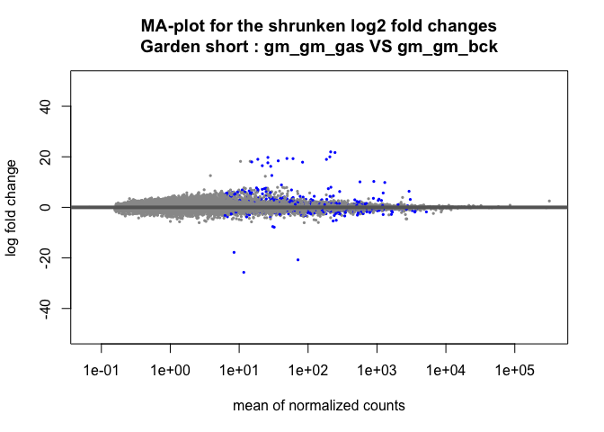
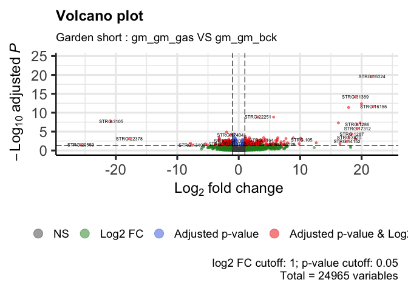
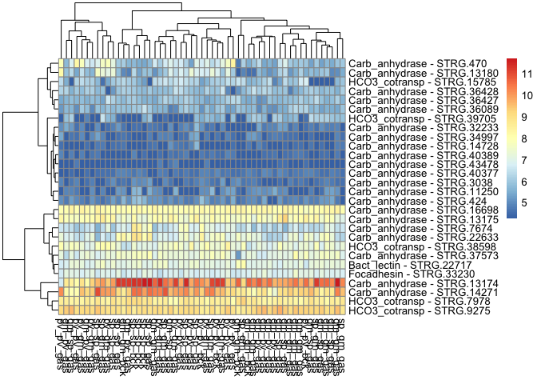

DE_Astroides_adult_gardenShort
================
Marc Meynadier
6/3/2022

``` r
# Differential expression on Kallisto data 

# Garden short 

# Packages and dependence
packageCheckClassic <- function(x){
  for( i in x ){
    #  require returns TRUE invisibly if it was able to load package
    if( ! require( i , character.only = TRUE ) ){
      #  If package was not able to be loaded then re-install
      install.packages( i , dependencies = TRUE )
      #  Load package after installing
      require( i , character.only = TRUE )
    }
  }
}

packageCheckClassic(c('DESeq2','devtools','BiocManager','ggplot2','ggrepel','markdown','RColorBrewer','genefilter','gplots','vegan','dplyr'))
```

    ## Le chargement a nécessité le package : DESeq2

    ## Le chargement a nécessité le package : S4Vectors

    ## Warning: le package 'S4Vectors' a été compilé avec la version R 4.1.3

    ## Le chargement a nécessité le package : stats4

    ## Le chargement a nécessité le package : BiocGenerics

    ## 
    ## Attachement du package : 'BiocGenerics'

    ## Les objets suivants sont masqués depuis 'package:stats':
    ## 
    ##     IQR, mad, sd, var, xtabs

    ## Les objets suivants sont masqués depuis 'package:base':
    ## 
    ##     anyDuplicated, append, as.data.frame, basename, cbind, colnames,
    ##     dirname, do.call, duplicated, eval, evalq, Filter, Find, get, grep,
    ##     grepl, intersect, is.unsorted, lapply, Map, mapply, match, mget,
    ##     order, paste, pmax, pmax.int, pmin, pmin.int, Position, rank,
    ##     rbind, Reduce, rownames, sapply, setdiff, sort, table, tapply,
    ##     union, unique, unsplit, which.max, which.min

    ## 
    ## Attachement du package : 'S4Vectors'

    ## Les objets suivants sont masqués depuis 'package:base':
    ## 
    ##     expand.grid, I, unname

    ## Le chargement a nécessité le package : IRanges

    ## Le chargement a nécessité le package : GenomicRanges

    ## Le chargement a nécessité le package : GenomeInfoDb

    ## Le chargement a nécessité le package : SummarizedExperiment

    ## Le chargement a nécessité le package : MatrixGenerics

    ## Le chargement a nécessité le package : matrixStats

    ## 
    ## Attachement du package : 'MatrixGenerics'

    ## Les objets suivants sont masqués depuis 'package:matrixStats':
    ## 
    ##     colAlls, colAnyNAs, colAnys, colAvgsPerRowSet, colCollapse,
    ##     colCounts, colCummaxs, colCummins, colCumprods, colCumsums,
    ##     colDiffs, colIQRDiffs, colIQRs, colLogSumExps, colMadDiffs,
    ##     colMads, colMaxs, colMeans2, colMedians, colMins, colOrderStats,
    ##     colProds, colQuantiles, colRanges, colRanks, colSdDiffs, colSds,
    ##     colSums2, colTabulates, colVarDiffs, colVars, colWeightedMads,
    ##     colWeightedMeans, colWeightedMedians, colWeightedSds,
    ##     colWeightedVars, rowAlls, rowAnyNAs, rowAnys, rowAvgsPerColSet,
    ##     rowCollapse, rowCounts, rowCummaxs, rowCummins, rowCumprods,
    ##     rowCumsums, rowDiffs, rowIQRDiffs, rowIQRs, rowLogSumExps,
    ##     rowMadDiffs, rowMads, rowMaxs, rowMeans2, rowMedians, rowMins,
    ##     rowOrderStats, rowProds, rowQuantiles, rowRanges, rowRanks,
    ##     rowSdDiffs, rowSds, rowSums2, rowTabulates, rowVarDiffs, rowVars,
    ##     rowWeightedMads, rowWeightedMeans, rowWeightedMedians,
    ##     rowWeightedSds, rowWeightedVars

    ## Le chargement a nécessité le package : Biobase

    ## Welcome to Bioconductor
    ## 
    ##     Vignettes contain introductory material; view with
    ##     'browseVignettes()'. To cite Bioconductor, see
    ##     'citation("Biobase")', and for packages 'citation("pkgname")'.

    ## 
    ## Attachement du package : 'Biobase'

    ## L'objet suivant est masqué depuis 'package:MatrixGenerics':
    ## 
    ##     rowMedians

    ## Les objets suivants sont masqués depuis 'package:matrixStats':
    ## 
    ##     anyMissing, rowMedians

    ## Le chargement a nécessité le package : devtools

    ## Le chargement a nécessité le package : usethis

    ## Le chargement a nécessité le package : BiocManager

    ## Bioconductor version '3.14' is out-of-date; the current release version '3.15'
    ##   is available with R version '4.2'; see https://bioconductor.org/install

    ## 
    ## Attachement du package : 'BiocManager'

    ## L'objet suivant est masqué depuis 'package:devtools':
    ## 
    ##     install

    ## Le chargement a nécessité le package : ggplot2

    ## Le chargement a nécessité le package : ggrepel

    ## Le chargement a nécessité le package : markdown

    ## Le chargement a nécessité le package : RColorBrewer

    ## Le chargement a nécessité le package : genefilter

    ## 
    ## Attachement du package : 'genefilter'

    ## Les objets suivants sont masqués depuis 'package:MatrixGenerics':
    ## 
    ##     rowSds, rowVars

    ## Les objets suivants sont masqués depuis 'package:matrixStats':
    ## 
    ##     rowSds, rowVars

    ## Le chargement a nécessité le package : gplots

    ## 
    ## Attachement du package : 'gplots'

    ## L'objet suivant est masqué depuis 'package:IRanges':
    ## 
    ##     space

    ## L'objet suivant est masqué depuis 'package:S4Vectors':
    ## 
    ##     space

    ## L'objet suivant est masqué depuis 'package:stats':
    ## 
    ##     lowess

    ## Le chargement a nécessité le package : vegan

    ## Le chargement a nécessité le package : permute

    ## 
    ## Attachement du package : 'permute'

    ## L'objet suivant est masqué depuis 'package:devtools':
    ## 
    ##     check

    ## Le chargement a nécessité le package : lattice

    ## This is vegan 2.6-2

    ## Le chargement a nécessité le package : dplyr

    ## 
    ## Attachement du package : 'dplyr'

    ## L'objet suivant est masqué depuis 'package:Biobase':
    ## 
    ##     combine

    ## L'objet suivant est masqué depuis 'package:matrixStats':
    ## 
    ##     count

    ## Les objets suivants sont masqués depuis 'package:GenomicRanges':
    ## 
    ##     intersect, setdiff, union

    ## L'objet suivant est masqué depuis 'package:GenomeInfoDb':
    ## 
    ##     intersect

    ## Les objets suivants sont masqués depuis 'package:IRanges':
    ## 
    ##     collapse, desc, intersect, setdiff, slice, union

    ## Les objets suivants sont masqués depuis 'package:S4Vectors':
    ## 
    ##     first, intersect, rename, setdiff, setequal, union

    ## Les objets suivants sont masqués depuis 'package:BiocGenerics':
    ## 
    ##     combine, intersect, setdiff, union

    ## Les objets suivants sont masqués depuis 'package:stats':
    ## 
    ##     filter, lag

    ## Les objets suivants sont masqués depuis 'package:base':
    ## 
    ##     intersect, setdiff, setequal, union

``` r
#BiocManager::install('tximport', force = TRUE)
#BiocManager::install('apeglm')
#BiocManager::install('ashr')
#BiocManager::install("EnhancedVolcano")
#BiocManager::install('limma')
#devtools::install_github('cran/GMD')
if (!require(devtools)) install.packages("devtools")
devtools::install_github("yanlinlin82/ggvenn")
```

    ## Skipping install of 'ggvenn' from a github remote, the SHA1 (b7ff54ba) has not changed since last install.
    ##   Use `force = TRUE` to force installation

``` r
library('ggvenn')
```

    ## Le chargement a nécessité le package : grid

``` r
library('tximport')
library('apeglm')
library('ashr')
library('EnhancedVolcano')
```

    ## Registered S3 methods overwritten by 'ggalt':
    ##   method                  from   
    ##   grid.draw.absoluteGrob  ggplot2
    ##   grobHeight.absoluteGrob ggplot2
    ##   grobWidth.absoluteGrob  ggplot2
    ##   grobX.absoluteGrob      ggplot2
    ##   grobY.absoluteGrob      ggplot2

``` r
source_url("https://raw.githubusercontent.com/obigriffith/biostar-tutorials/master/Heatmaps/heatmap.3.R")
```

    ## ℹ SHA-1 hash of file is 015fc0457e61e3e93a903e69a24d96d2dac7b9fb

``` r
# Working environment 
scriptPath<-dirname(rstudioapi::getSourceEditorContext()$path)
setwd(scriptPath)
samples<-read.table('tximport_design_gardenShort.txt',header=T)
samplesBck<-read.table('tximport_design_gardenShort_bck.txt',header=T)
samplesGas<-read.table('tximport_design_gardenShort_gas.txt',header=T)
samplesGasSame<-read.table('tximport_design_gardenShort_gas_same.txt',header=T)
samplesGasDiff<-read.table('tximport_design_gardenShort_gas_diff.txt',header=T)
tx2gene<-read.table('tx2gene_adultTranscriptome',header=T)
candidateGenes<-read.csv('candidateGenes.csv',header=T,sep=',')
scriptPath <- sub("/[^/]+$", "", scriptPath)
scriptPath <- sub("/[^/]+$", "", scriptPath)
dataPath<-'/data/net/6_kallisto/adultTranscriptome/adult/5_gardenShort'
outputPath<-paste(scriptPath,'/output/DESeq2/adultTranscriptome/adult/5_gardenShort/',sep='')
wdPath<-paste(scriptPath,dataPath,sep='')
setwd(wdPath)

# Data importation - txImport
files<-paste0(samples$samples,'.tsv')
filesBck<-paste0(samplesBck$samples,'.tsv')
filesGas<-paste0(samplesGas$samples,'.tsv')
filesGasSame<-paste0(samplesGasSame$samples,'.tsv')
filesGasDiff<-paste0(samplesGasDiff$samples,'.tsv')
names(files)<-samples$samples
names(filesBck)<-samplesBck$samples
names(filesGas)<-samplesGas$samples
names(filesGasSame)<-samplesGasSame$samples
names(filesGasDiff)<-samplesGasDiff$samples
txi<-tximport(files = files,type='kallisto',tx2gene = tx2gene)
```

    ## Note: importing `abundance.h5` is typically faster than `abundance.tsv`

    ## reading in files with read_tsv

    ## 1 2 3 4 5 6 7 8 9 10 11 12 13 14 15 16 17 18 19 20 21 22 23 24 25 26 27 28 29 30 31 32 33 34 35 36 37 38 39 40 41 42 43 44 45 46 47 48 49 50 51 52 53 54 55 
    ## transcripts missing from tx2gene: 1
    ## summarizing abundance
    ## summarizing counts
    ## summarizing length

``` r
txiBck<-tximport(files = filesBck,type='kallisto',tx2gene = tx2gene)
```

    ## Note: importing `abundance.h5` is typically faster than `abundance.tsv`
    ## reading in files with read_tsv
    ## 1 2 3 4 5 6 7 8 9 
    ## transcripts missing from tx2gene: 1
    ## summarizing abundance
    ## summarizing counts
    ## summarizing length

``` r
txiGas<-tximport(files = filesGas,type='kallisto',tx2gene = tx2gene)
```

    ## Note: importing `abundance.h5` is typically faster than `abundance.tsv`
    ## reading in files with read_tsv
    ## 1 2 3 4 5 6 7 8 9 10 11 12 13 14 15 16 17 18 19 20 21 22 23 24 25 26 27 28 29 30 31 32 33 34 35 36 37 38 39 40 41 42 43 44 45 46 
    ## transcripts missing from tx2gene: 1
    ## summarizing abundance
    ## summarizing counts
    ## summarizing length

``` r
txiGasSame<-tximport(files = filesGasSame,type='kallisto',tx2gene = tx2gene)
```

    ## Note: importing `abundance.h5` is typically faster than `abundance.tsv`
    ## reading in files with read_tsv
    ## 1 2 3 4 5 6 7 8 9 10 11 12 13 14 15 16 17 18 19 
    ## transcripts missing from tx2gene: 1
    ## summarizing abundance
    ## summarizing counts
    ## summarizing length

``` r
txiGasDiff<-tximport(files = filesGasDiff,type='kallisto',tx2gene = tx2gene)
```

    ## Note: importing `abundance.h5` is typically faster than `abundance.tsv`
    ## reading in files with read_tsv
    ## 1 2 3 4 5 6 7 8 9 10 11 12 13 14 15 16 17 18 19 20 21 22 23 24 25 26 27 
    ## transcripts missing from tx2gene: 1
    ## summarizing abundance
    ## summarizing counts
    ## summarizing length

``` r
names(txi)
```

    ## [1] "abundance"           "counts"              "length"             
    ## [4] "countsFromAbundance"

``` r
head(txi$counts)
```

    ##                    abundance_adult_sept2018_gm_gm_bck_15941X28_trimmed
    ## TRINITY_DN0_c0_g1                                            1087.0000
    ## TRINITY_DN0_c0_g2                                             112.8410
    ## TRINITY_DN0_c1_g1                                              25.1139
    ## TRINITY_DN1_c0_g1                                            2988.0000
    ## TRINITY_DN1_c1_g1                                               0.0000
    ## TRINITY_DN10_c0_g1                                            584.8720
    ##                    abundance_adult_sept2018_gm_gm_bck_15941X46_trimmed
    ## TRINITY_DN0_c0_g1                                             757.0000
    ## TRINITY_DN0_c0_g2                                              73.0000
    ## TRINITY_DN0_c1_g1                                              16.1135
    ## TRINITY_DN1_c0_g1                                            2944.3000
    ## TRINITY_DN1_c1_g1                                               0.0000
    ## TRINITY_DN10_c0_g1                                            363.9040
    ##                    abundance_adult_sept2018_gm_gm_bck_15941X54_trimmed
    ## TRINITY_DN0_c0_g1                                            2283.0000
    ## TRINITY_DN0_c0_g2                                              65.0000
    ## TRINITY_DN0_c1_g1                                              19.1725
    ## TRINITY_DN1_c0_g1                                            2721.0000
    ## TRINITY_DN1_c1_g1                                               0.0000
    ## TRINITY_DN10_c0_g1                                            238.8070
    ##                    abundance_adult_sept2018_gm_gm_gas_15873X11_trimmed
    ## TRINITY_DN0_c0_g1                                              645.000
    ## TRINITY_DN0_c0_g2                                              204.109
    ## TRINITY_DN0_c1_g1                                               26.000
    ## TRINITY_DN1_c0_g1                                             2941.000
    ## TRINITY_DN1_c1_g1                                                0.000
    ## TRINITY_DN10_c0_g1                                             443.826
    ##                    abundance_adult_sept2018_gm_gm_gas_15873X16_trimmed
    ## TRINITY_DN0_c0_g1                                              648.000
    ## TRINITY_DN0_c0_g2                                              180.177
    ## TRINITY_DN0_c1_g1                                               33.000
    ## TRINITY_DN1_c0_g1                                             2430.790
    ## TRINITY_DN1_c1_g1                                                0.000
    ## TRINITY_DN10_c0_g1                                             399.192
    ##                    abundance_adult_sept2018_gm_gm_gas_15873X38_trimmed
    ## TRINITY_DN0_c0_g1                                             840.0000
    ## TRINITY_DN0_c0_g2                                             145.0000
    ## TRINITY_DN0_c1_g1                                              16.1688
    ## TRINITY_DN1_c0_g1                                            2930.0000
    ## TRINITY_DN1_c1_g1                                               0.0000
    ## TRINITY_DN10_c0_g1                                            268.7270
    ##                    abundance_adult_sept2018_gm_gm_gas_15941X11_trimmed
    ## TRINITY_DN0_c0_g1                                             844.0000
    ## TRINITY_DN0_c0_g2                                              92.4507
    ## TRINITY_DN0_c1_g1                                              22.0000
    ## TRINITY_DN1_c0_g1                                            3607.0000
    ## TRINITY_DN1_c1_g1                                               0.0000
    ## TRINITY_DN10_c0_g1                                            278.7220
    ##                    abundance_adult_sept2018_gm_gm_gas_15941X12_trimmed
    ## TRINITY_DN0_c0_g1                                             490.0000
    ## TRINITY_DN0_c0_g2                                              90.0000
    ## TRINITY_DN0_c1_g1                                              22.1137
    ## TRINITY_DN1_c0_g1                                            1479.0000
    ## TRINITY_DN1_c1_g1                                               0.0000
    ## TRINITY_DN10_c0_g1                                            223.2230
    ##                    abundance_adult_sept2018_gm_gm_gas_15941X26_trimmed
    ## TRINITY_DN0_c0_g1                                             974.0000
    ## TRINITY_DN0_c0_g2                                              61.7238
    ## TRINITY_DN0_c1_g1                                              20.5152
    ## TRINITY_DN1_c0_g1                                            3019.0000
    ## TRINITY_DN1_c1_g1                                               0.0000
    ## TRINITY_DN10_c0_g1                                            373.5150
    ##                    abundance_adult_sept2018_gm_gm_gas_15941X50_trimmed
    ## TRINITY_DN0_c0_g1                                            1004.0000
    ## TRINITY_DN0_c0_g2                                             134.1570
    ## TRINITY_DN0_c1_g1                                              28.2638
    ## TRINITY_DN1_c0_g1                                            2195.0000
    ## TRINITY_DN1_c1_g1                                               0.0000
    ## TRINITY_DN10_c0_g1                                            350.4150
    ##                    abundance_adult_sept2018_gm_pv_gas_15873X15_trimmed
    ## TRINITY_DN0_c0_g1                                             834.0000
    ## TRINITY_DN0_c0_g2                                             163.7540
    ## TRINITY_DN0_c1_g1                                              49.1437
    ## TRINITY_DN1_c0_g1                                            2019.7500
    ## TRINITY_DN1_c1_g1                                               0.0000
    ## TRINITY_DN10_c0_g1                                            350.0910
    ##                    abundance_adult_sept2018_gm_pv_gas_15873X23_trimmed
    ## TRINITY_DN0_c0_g1                                               643.00
    ## TRINITY_DN0_c0_g2                                               122.00
    ## TRINITY_DN0_c1_g1                                                12.00
    ## TRINITY_DN1_c0_g1                                              1943.00
    ## TRINITY_DN1_c1_g1                                                 0.00
    ## TRINITY_DN10_c0_g1                                              257.61
    ##                    abundance_adult_sept2018_gm_pv_gas_15873X46_trimmed
    ## TRINITY_DN0_c0_g1                                              967.000
    ## TRINITY_DN0_c0_g2                                              253.000
    ## TRINITY_DN0_c1_g1                                               20.000
    ## TRINITY_DN1_c0_g1                                             4394.000
    ## TRINITY_DN1_c1_g1                                                0.000
    ## TRINITY_DN10_c0_g1                                             401.447
    ##                    abundance_adult_sept2018_gm_pv_gas_15873X49_trimmed
    ## TRINITY_DN0_c0_g1                                              794.000
    ## TRINITY_DN0_c0_g2                                              158.000
    ## TRINITY_DN0_c1_g1                                               14.000
    ## TRINITY_DN1_c0_g1                                             2847.000
    ## TRINITY_DN1_c1_g1                                                0.000
    ## TRINITY_DN10_c0_g1                                             249.423
    ##                    abundance_adult_sept2018_gm_pv_gas_15873X50_trimmed
    ## TRINITY_DN0_c0_g1                                             340.0000
    ## TRINITY_DN0_c0_g2                                              77.7748
    ## TRINITY_DN0_c1_g1                                               9.1293
    ## TRINITY_DN1_c0_g1                                             889.5880
    ## TRINITY_DN1_c1_g1                                               0.0000
    ## TRINITY_DN10_c0_g1                                            236.4560
    ##                    abundance_adult_sept2018_gm_pv_gas_15941X14_trimmed
    ## TRINITY_DN0_c0_g1                                             625.0000
    ## TRINITY_DN0_c0_g2                                             132.6920
    ## TRINITY_DN0_c1_g1                                              35.8231
    ## TRINITY_DN1_c0_g1                                            1933.0000
    ## TRINITY_DN1_c1_g1                                               0.0000
    ## TRINITY_DN10_c0_g1                                            202.1640
    ##                    abundance_adult_sept2018_gm_pv_gas_15941X38_trimmed
    ## TRINITY_DN0_c0_g1                                            1028.0000
    ## TRINITY_DN0_c0_g2                                              52.0000
    ## TRINITY_DN0_c1_g1                                              26.1549
    ## TRINITY_DN1_c0_g1                                            2203.5300
    ## TRINITY_DN1_c1_g1                                               0.0000
    ## TRINITY_DN10_c0_g1                                            258.0750
    ##                    abundance_adult_sept2018_gm_sp_gas_15873X17_trimmed
    ## TRINITY_DN0_c0_g1                                              674.000
    ## TRINITY_DN0_c0_g2                                              171.634
    ## TRINITY_DN0_c1_g1                                               29.000
    ## TRINITY_DN1_c0_g1                                             2471.000
    ## TRINITY_DN1_c1_g1                                                0.000
    ## TRINITY_DN10_c0_g1                                             351.669
    ##                    abundance_adult_sept2018_gm_sp_gas_15873X37_trimmed
    ## TRINITY_DN0_c0_g1                                             1240.000
    ## TRINITY_DN0_c0_g2                                              159.887
    ## TRINITY_DN0_c1_g1                                               28.000
    ## TRINITY_DN1_c0_g1                                             2645.000
    ## TRINITY_DN1_c1_g1                                                0.000
    ## TRINITY_DN10_c0_g1                                             377.101
    ##                    abundance_adult_sept2018_gm_sp_gas_15941X10_trimmed
    ## TRINITY_DN0_c0_g1                                             976.0000
    ## TRINITY_DN0_c0_g2                                             102.0000
    ## TRINITY_DN0_c1_g1                                              29.3501
    ## TRINITY_DN1_c0_g1                                            4596.0000
    ## TRINITY_DN1_c1_g1                                               1.0000
    ## TRINITY_DN10_c0_g1                                            280.3350
    ##                    abundance_adult_sept2018_gm_sp_gas_15941X24_trimmed
    ## TRINITY_DN0_c0_g1                                             760.0000
    ## TRINITY_DN0_c0_g2                                              92.8085
    ## TRINITY_DN0_c1_g1                                              23.1783
    ## TRINITY_DN1_c0_g1                                            1165.0000
    ## TRINITY_DN1_c1_g1                                               0.0000
    ## TRINITY_DN10_c0_g1                                            244.2380
    ##                    abundance_adult_sept2018_gm_sp_gas_15941X25_trimmed
    ## TRINITY_DN0_c0_g1                                            1114.0000
    ## TRINITY_DN0_c0_g2                                             139.5830
    ## TRINITY_DN0_c1_g1                                              31.2676
    ## TRINITY_DN1_c0_g1                                            2609.0000
    ## TRINITY_DN1_c1_g1                                               0.0000
    ## TRINITY_DN10_c0_g1                                            398.2550
    ##                    abundance_adult_sept2018_gm_sp_gas_15941X44_trimmed
    ## TRINITY_DN0_c0_g1                                            1133.0000
    ## TRINITY_DN0_c0_g2                                              75.6340
    ## TRINITY_DN0_c1_g1                                              24.3566
    ## TRINITY_DN1_c0_g1                                            1388.0000
    ## TRINITY_DN1_c1_g1                                               0.0000
    ## TRINITY_DN10_c0_g1                                            252.6230
    ##                    abundance_adult_sept2018_gm_sp_gas_15941X57_trimmed
    ## TRINITY_DN0_c0_g1                                            1085.0000
    ## TRINITY_DN0_c0_g2                                             108.9810
    ## TRINITY_DN0_c1_g1                                              42.2181
    ## TRINITY_DN1_c0_g1                                            2283.0000
    ## TRINITY_DN1_c1_g1                                               0.0000
    ## TRINITY_DN10_c0_g1                                            609.8180
    ##                    abundance_adult_sept2018_pv_gm_gas_15873X12_trimmed
    ## TRINITY_DN0_c0_g1                                              571.000
    ## TRINITY_DN0_c0_g2                                              168.000
    ## TRINITY_DN0_c1_g1                                               27.000
    ## TRINITY_DN1_c0_g1                                             1276.000
    ## TRINITY_DN1_c1_g1                                                0.000
    ## TRINITY_DN10_c0_g1                                             279.036
    ##                    abundance_adult_sept2018_pv_gm_gas_15873X39_trimmed
    ## TRINITY_DN0_c0_g1                                             743.0000
    ## TRINITY_DN0_c0_g2                                             104.0000
    ## TRINITY_DN0_c1_g1                                              23.2666
    ## TRINITY_DN1_c0_g1                                            2627.0000
    ## TRINITY_DN1_c1_g1                                               0.0000
    ## TRINITY_DN10_c0_g1                                            393.8330
    ##                    abundance_adult_sept2018_pv_gm_gas_15873X40_trimmed
    ## TRINITY_DN0_c0_g1                                              592.000
    ## TRINITY_DN0_c0_g2                                               74.000
    ## TRINITY_DN0_c1_g1                                               14.000
    ## TRINITY_DN1_c0_g1                                             1225.000
    ## TRINITY_DN1_c1_g1                                                0.000
    ## TRINITY_DN10_c0_g1                                             218.479
    ##                    abundance_adult_sept2018_pv_gm_gas_15941X13_trimmed
    ## TRINITY_DN0_c0_g1                                             1060.000
    ## TRINITY_DN0_c0_g2                                              100.045
    ## TRINITY_DN0_c1_g1                                               17.000
    ## TRINITY_DN1_c0_g1                                             2124.000
    ## TRINITY_DN1_c1_g1                                                0.000
    ## TRINITY_DN10_c0_g1                                             341.324
    ##                    abundance_adult_sept2018_pv_gm_gas_15941X27_trimmed
    ## TRINITY_DN0_c0_g1                                              908.000
    ## TRINITY_DN0_c0_g2                                              175.000
    ## TRINITY_DN0_c1_g1                                               20.089
    ## TRINITY_DN1_c0_g1                                             3333.000
    ## TRINITY_DN1_c1_g1                                                0.000
    ## TRINITY_DN10_c0_g1                                             327.720
    ##                    abundance_adult_sept2018_pv_gm_gas_15941X45_trimmed
    ## TRINITY_DN0_c0_g1                                              927.000
    ## TRINITY_DN0_c0_g2                                              131.000
    ## TRINITY_DN0_c1_g1                                               27.000
    ## TRINITY_DN1_c0_g1                                             1615.310
    ## TRINITY_DN1_c1_g1                                                0.000
    ## TRINITY_DN10_c0_g1                                             308.444
    ##                    abundance_adult_sept2018_pv_pv_bck_15873X21_trimmed
    ## TRINITY_DN0_c0_g1                                             500.0000
    ## TRINITY_DN0_c0_g2                                             141.7750
    ## TRINITY_DN0_c1_g1                                              16.0743
    ## TRINITY_DN1_c0_g1                                            2813.8000
    ## TRINITY_DN1_c1_g1                                               0.0000
    ## TRINITY_DN10_c0_g1                                            316.4540
    ##                    abundance_adult_sept2018_pv_pv_bck_15941X47_trimmed
    ## TRINITY_DN0_c0_g1                                             874.0000
    ## TRINITY_DN0_c0_g2                                             134.0000
    ## TRINITY_DN0_c1_g1                                              27.0977
    ## TRINITY_DN1_c0_g1                                            2098.0000
    ## TRINITY_DN1_c1_g1                                               0.0000
    ## TRINITY_DN10_c0_g1                                            318.4040
    ##                    abundance_adult_sept2018_pv_pv_bck_15941X55_trimmed
    ## TRINITY_DN0_c0_g1                                              1334.00
    ## TRINITY_DN0_c0_g2                                               107.00
    ## TRINITY_DN0_c1_g1                                                22.00
    ## TRINITY_DN1_c0_g1                                              3120.83
    ## TRINITY_DN1_c1_g1                                                 0.00
    ## TRINITY_DN10_c0_g1                                              333.00
    ##                    abundance_adult_sept2018_pv_pv_gas_15873X14_trimmed
    ## TRINITY_DN0_c0_g1                                              717.000
    ## TRINITY_DN0_c0_g2                                              122.000
    ## TRINITY_DN0_c1_g1                                               14.000
    ## TRINITY_DN1_c0_g1                                             1902.760
    ## TRINITY_DN1_c1_g1                                                0.000
    ## TRINITY_DN10_c0_g1                                             291.096
    ##                    abundance_adult_sept2018_pv_pv_gas_15873X47_trimmed
    ## TRINITY_DN0_c0_g1                                              905.000
    ## TRINITY_DN0_c0_g2                                              108.839
    ## TRINITY_DN0_c1_g1                                               16.000
    ## TRINITY_DN1_c0_g1                                             1600.000
    ## TRINITY_DN1_c1_g1                                                0.000
    ## TRINITY_DN10_c0_g1                                             220.109
    ##                    abundance_adult_sept2018_pv_pv_gas_15873X48_trimmed
    ## TRINITY_DN0_c0_g1                                             1137.000
    ## TRINITY_DN0_c0_g2                                              118.490
    ## TRINITY_DN0_c1_g1                                               20.000
    ## TRINITY_DN1_c0_g1                                             2904.000
    ## TRINITY_DN1_c1_g1                                                0.000
    ## TRINITY_DN10_c0_g1                                             368.048
    ##                    abundance_adult_sept2018_pv_pv_gas_15941X15_trimmed
    ## TRINITY_DN0_c0_g1                                              1262.00
    ## TRINITY_DN0_c0_g2                                                91.00
    ## TRINITY_DN0_c1_g1                                                34.00
    ## TRINITY_DN1_c0_g1                                              1217.00
    ## TRINITY_DN1_c1_g1                                                 0.00
    ## TRINITY_DN10_c0_g1                                              271.98
    ##                    abundance_adult_sept2018_pv_pv_gas_15941X37_trimmed
    ## TRINITY_DN0_c0_g1                                             915.0000
    ## TRINITY_DN0_c0_g2                                             101.0000
    ## TRINITY_DN0_c1_g1                                              27.2292
    ## TRINITY_DN1_c0_g1                                            1159.0000
    ## TRINITY_DN1_c1_g1                                               0.0000
    ## TRINITY_DN10_c0_g1                                            243.1810
    ##                    abundance_adult_sept2018_pv_pv_gas_15941X58_trimmed
    ## TRINITY_DN0_c0_g1                                            1185.0000
    ## TRINITY_DN0_c0_g2                                              58.0000
    ## TRINITY_DN0_c1_g1                                              47.2034
    ## TRINITY_DN1_c0_g1                                            1557.0000
    ## TRINITY_DN1_c1_g1                                               0.0000
    ## TRINITY_DN10_c0_g1                                            215.0980
    ##                    abundance_adult_sept2018_sp_gm_gas_15873X13_trimmed
    ## TRINITY_DN0_c0_g1                                               824.00
    ## TRINITY_DN0_c0_g2                                               161.00
    ## TRINITY_DN0_c1_g1                                                25.00
    ## TRINITY_DN1_c0_g1                                              2715.00
    ## TRINITY_DN1_c1_g1                                                 0.00
    ## TRINITY_DN10_c0_g1                                              314.07
    ##                    abundance_adult_sept2018_sp_gm_gas_15873X44_trimmed
    ## TRINITY_DN0_c0_g1                                            1240.0000
    ## TRINITY_DN0_c0_g2                                             187.0000
    ## TRINITY_DN0_c1_g1                                              25.2066
    ## TRINITY_DN1_c0_g1                                            3593.0000
    ## TRINITY_DN1_c1_g1                                               0.0000
    ## TRINITY_DN10_c0_g1                                            341.8880
    ##                    abundance_adult_sept2018_sp_gm_gas_15873X45_trimmed
    ## TRINITY_DN0_c0_g1                                              917.000
    ## TRINITY_DN0_c0_g2                                              141.415
    ## TRINITY_DN0_c1_g1                                               23.000
    ## TRINITY_DN1_c0_g1                                             3064.860
    ## TRINITY_DN1_c1_g1                                                0.000
    ## TRINITY_DN10_c0_g1                                             307.904
    ##                    abundance_adult_sept2018_sp_gm_gas_15941X35_trimmed
    ## TRINITY_DN0_c0_g1                                            1319.0000
    ## TRINITY_DN0_c0_g2                                              84.2478
    ## TRINITY_DN0_c1_g1                                              28.0000
    ## TRINITY_DN1_c0_g1                                            3835.0000
    ## TRINITY_DN1_c1_g1                                               0.0000
    ## TRINITY_DN10_c0_g1                                            537.4110
    ##                    abundance_adult_sept2018_sp_gm_gas_15941X36_trimmed
    ## TRINITY_DN0_c0_g1                                             635.0000
    ## TRINITY_DN0_c0_g2                                              79.0000
    ## TRINITY_DN0_c1_g1                                              23.0863
    ## TRINITY_DN1_c0_g1                                            2666.5400
    ## TRINITY_DN1_c1_g1                                               0.0000
    ## TRINITY_DN10_c0_g1                                            356.2960
    ##                    abundance_adult_sept2018_sp_gm_gas_15941X49_trimmed
    ## TRINITY_DN0_c0_g1                                            1919.0000
    ## TRINITY_DN0_c0_g2                                              59.3251
    ## TRINITY_DN0_c1_g1                                              34.5338
    ## TRINITY_DN1_c0_g1                                            3723.9000
    ## TRINITY_DN1_c1_g1                                               0.0000
    ## TRINITY_DN10_c0_g1                                            396.8410
    ##                    abundance_adult_sept2018_sp_gm_gas_15941X56_trimmed
    ## TRINITY_DN0_c0_g1                                             942.0000
    ## TRINITY_DN0_c0_g2                                              85.0000
    ## TRINITY_DN0_c1_g1                                              22.1548
    ## TRINITY_DN1_c0_g1                                            1681.0000
    ## TRINITY_DN1_c1_g1                                               0.0000
    ## TRINITY_DN10_c0_g1                                            353.9530
    ##                    abundance_adult_sept2018_sp_sp_bck_15873X20_trimmed
    ## TRINITY_DN0_c0_g1                                              604.000
    ## TRINITY_DN0_c0_g2                                              100.000
    ## TRINITY_DN0_c1_g1                                               16.000
    ## TRINITY_DN1_c0_g1                                             3551.000
    ## TRINITY_DN1_c1_g1                                                0.000
    ## TRINITY_DN10_c0_g1                                             397.305
    ##                    abundance_adult_sept2018_sp_sp_bck_15941X48_trimmed
    ## TRINITY_DN0_c0_g1                                              574.000
    ## TRINITY_DN0_c0_g2                                              275.737
    ## TRINITY_DN0_c1_g1                                               27.000
    ## TRINITY_DN1_c0_g1                                             3897.000
    ## TRINITY_DN1_c1_g1                                                0.000
    ## TRINITY_DN10_c0_g1                                             293.778
    ##                    abundance_adult_sept2018_sp_sp_bck_15941X53_trimmed
    ## TRINITY_DN0_c0_g1                                              498.000
    ## TRINITY_DN0_c0_g2                                              113.731
    ## TRINITY_DN0_c1_g1                                               19.000
    ## TRINITY_DN1_c0_g1                                             4000.000
    ## TRINITY_DN1_c1_g1                                                0.000
    ## TRINITY_DN10_c0_g1                                             344.028
    ##                    abundance_adult_sept2018_sp_sp_gas_15873X10_trimmed
    ## TRINITY_DN0_c0_g1                                              592.000
    ## TRINITY_DN0_c0_g2                                              100.000
    ## TRINITY_DN0_c1_g1                                               15.000
    ## TRINITY_DN1_c0_g1                                             3227.000
    ## TRINITY_DN1_c1_g1                                                0.000
    ## TRINITY_DN10_c0_g1                                             368.787
    ##                    abundance_adult_sept2018_sp_sp_gas_15873X34_trimmed
    ## TRINITY_DN0_c0_g1                                              378.000
    ## TRINITY_DN0_c0_g2                                              121.600
    ## TRINITY_DN0_c1_g1                                               21.000
    ## TRINITY_DN1_c0_g1                                             3512.000
    ## TRINITY_DN1_c1_g1                                                1.000
    ## TRINITY_DN10_c0_g1                                             321.214
    ##                    abundance_adult_sept2018_sp_sp_gas_15873X36_trimmed
    ## TRINITY_DN0_c0_g1                                             633.0000
    ## TRINITY_DN0_c0_g2                                             122.0000
    ## TRINITY_DN0_c1_g1                                              23.1045
    ## TRINITY_DN1_c0_g1                                            2017.0000
    ## TRINITY_DN1_c1_g1                                               0.0000
    ## TRINITY_DN10_c0_g1                                            425.6230
    ##                    abundance_adult_sept2018_sp_sp_gas_15941X23_trimmed
    ## TRINITY_DN0_c0_g1                                              591.000
    ## TRINITY_DN0_c0_g2                                              153.000
    ## TRINITY_DN0_c1_g1                                               30.000
    ## TRINITY_DN1_c0_g1                                             2710.000
    ## TRINITY_DN1_c1_g1                                                0.000
    ## TRINITY_DN10_c0_g1                                             352.368
    ##                    abundance_adult_sept2018_sp_sp_gas_15941X43_trimmed
    ## TRINITY_DN0_c0_g1                                             1107.000
    ## TRINITY_DN0_c0_g2                                               79.000
    ## TRINITY_DN0_c1_g1                                               25.000
    ## TRINITY_DN1_c0_g1                                             1751.660
    ## TRINITY_DN1_c1_g1                                                0.000
    ## TRINITY_DN10_c0_g1                                             315.187
    ##                    abundance_adult_sept2018_sp_sp_gas_15941X9_trimmed
    ## TRINITY_DN0_c0_g1                                            676.0000
    ## TRINITY_DN0_c0_g2                                             95.0000
    ## TRINITY_DN0_c1_g1                                             30.3367
    ## TRINITY_DN1_c0_g1                                           1633.0000
    ## TRINITY_DN1_c1_g1                                              0.0000
    ## TRINITY_DN10_c0_g1                                           377.1480

``` r
dds<-DESeqDataSetFromTximport(txi,colData=samples,design= ~originSite_finalSite_experiment)
```

    ## Warning in DESeqDataSet(se, design = design, ignoreRank): some variables in
    ## design formula are characters, converting to factors

    ## using counts and average transcript lengths from tximport

``` r
ddsBck<-DESeqDataSetFromTximport(txiBck,colData=samplesBck,design= ~originSite_finalSite_experiment)
```

    ## Warning in DESeqDataSet(se, design = design, ignoreRank): some variables in
    ## design formula are characters, converting to factors

    ## using counts and average transcript lengths from tximport

``` r
ddsGas<-DESeqDataSetFromTximport(txiGas,colData=samplesGas,design= ~originSite_finalSite_experiment)
```

    ## Warning in DESeqDataSet(se, design = design, ignoreRank): some variables in
    ## design formula are characters, converting to factors

    ## using counts and average transcript lengths from tximport

``` r
ddsGasSame<-DESeqDataSetFromTximport(txiGasSame,colData=samplesGasSame,design= ~originSite_finalSite_experiment)
```

    ## Warning in DESeqDataSet(se, design = design, ignoreRank): some variables in
    ## design formula are characters, converting to factors

    ## using counts and average transcript lengths from tximport

``` r
ddsGasDiff<-DESeqDataSetFromTximport(txiGasDiff,colData=samplesGasDiff,design= ~originSite_finalSite_experiment)
```

    ## Warning in DESeqDataSet(se, design = design, ignoreRank): some variables in
    ## design formula are characters, converting to factors

    ## using counts and average transcript lengths from tximport

``` r
# pre-filtering
keep <- rowSums(counts(dds)) >= 10 
dds <- dds[keep,]
keep <- rowSums(counts(ddsBck)) >= 10 
ddsBck <- ddsBck[keep,]
keep <- rowSums(counts(ddsGas)) >= 10 
ddsGas <- ddsGas[keep,]
keep <- rowSums(counts(ddsGasSame)) >= 10 
ddsGasSame <- ddsGasSame[keep,]
keep <- rowSums(counts(ddsGasDiff)) >= 10 
ddsGasDiff <- ddsGasDiff[keep,]

# Differential expression analysis
dds<-DESeq(dds)
```

    ## estimating size factors
    ## using 'avgTxLength' from assays(dds), correcting for library size
    ## estimating dispersions
    ## gene-wise dispersion estimates
    ## mean-dispersion relationship
    ## final dispersion estimates
    ## fitting model and testing
    ## -- replacing outliers and refitting for 77 genes
    ## -- DESeq argument 'minReplicatesForReplace' = 7 
    ## -- original counts are preserved in counts(dds)
    ## estimating dispersions
    ## fitting model and testing

``` r
ddsBck<-DESeq(ddsBck)
```

    ## estimating size factors
    ## using 'avgTxLength' from assays(dds), correcting for library size
    ## estimating dispersions
    ## gene-wise dispersion estimates
    ## mean-dispersion relationship
    ## final dispersion estimates
    ## fitting model and testing

``` r
ddsGas<-DESeq(ddsGas)
```

    ## estimating size factors
    ## using 'avgTxLength' from assays(dds), correcting for library size
    ## estimating dispersions
    ## gene-wise dispersion estimates
    ## mean-dispersion relationship
    ## final dispersion estimates
    ## fitting model and testing
    ## -- replacing outliers and refitting for 88 genes
    ## -- DESeq argument 'minReplicatesForReplace' = 7 
    ## -- original counts are preserved in counts(dds)
    ## estimating dispersions
    ## fitting model and testing

``` r
ddsGasSame<-DESeq(ddsGasSame)
```

    ## estimating size factors
    ## using 'avgTxLength' from assays(dds), correcting for library size
    ## estimating dispersions
    ## gene-wise dispersion estimates
    ## mean-dispersion relationship
    ## final dispersion estimates
    ## fitting model and testing
    ## -- replacing outliers and refitting for 220 genes
    ## -- DESeq argument 'minReplicatesForReplace' = 7 
    ## -- original counts are preserved in counts(dds)
    ## estimating dispersions
    ## fitting model and testing

``` r
ddsGasDiff<-DESeq(ddsGasDiff)
```

    ## estimating size factors
    ## using 'avgTxLength' from assays(dds), correcting for library size
    ## estimating dispersions
    ## gene-wise dispersion estimates
    ## mean-dispersion relationship
    ## final dispersion estimates
    ## fitting model and testing
    ## -- replacing outliers and refitting for 174 genes
    ## -- DESeq argument 'minReplicatesForReplace' = 7 
    ## -- original counts are preserved in counts(dds)
    ## estimating dispersions
    ## fitting model and testing

``` r
cbind(resultsNames(dds))
```

    ##       [,1]                                                    
    ##  [1,] "Intercept"                                             
    ##  [2,] "originSite_finalSite_experiment_gm_gm_gas_vs_gm_gm_bck"
    ##  [3,] "originSite_finalSite_experiment_gm_pv_gas_vs_gm_gm_bck"
    ##  [4,] "originSite_finalSite_experiment_gm_sp_gas_vs_gm_gm_bck"
    ##  [5,] "originSite_finalSite_experiment_pv_gm_gas_vs_gm_gm_bck"
    ##  [6,] "originSite_finalSite_experiment_pv_pv_bck_vs_gm_gm_bck"
    ##  [7,] "originSite_finalSite_experiment_pv_pv_gas_vs_gm_gm_bck"
    ##  [8,] "originSite_finalSite_experiment_sp_gm_gas_vs_gm_gm_bck"
    ##  [9,] "originSite_finalSite_experiment_sp_sp_bck_vs_gm_gm_bck"
    ## [10,] "originSite_finalSite_experiment_sp_sp_gas_vs_gm_gm_bck"

``` r
gm_gm_gas_VS_gm_gm_bck<-results(dds, contrast=c("originSite_finalSite_experiment","gm_gm_gas","gm_gm_bck"), alpha = 0.05)
pv_pv_gas_VS_pv_pv_bck<-results(dds, contrast=c("originSite_finalSite_experiment","pv_pv_gas","pv_pv_bck"), alpha = 0.05)
sp_sp_gas_VS_sp_sp_bck<-results(dds, contrast=c("originSite_finalSite_experiment","sp_sp_gas","sp_sp_bck"), alpha = 0.05)
pv_gm_gas_VS_pv_pv_bck<-results(dds, contrast=c("originSite_finalSite_experiment","pv_gm_gas","pv_pv_bck"), alpha = 0.05)
sp_gm_gas_VS_sp_sp_bck<-results(dds, contrast=c("originSite_finalSite_experiment","sp_gm_gas","sp_sp_bck"), alpha = 0.05)
pv_gm_gas_VS_gm_gm_bck<-results(dds, contrast=c("originSite_finalSite_experiment","pv_gm_gas","gm_gm_bck"), alpha = 0.05)
sp_gm_gas_VS_gm_gm_bck<-results(dds, contrast=c("originSite_finalSite_experiment","sp_sp_gas","gm_gm_bck"), alpha = 0.05)
gm_pv_gas_VS_pv_pv_bck<-results(dds, contrast=c("originSite_finalSite_experiment","gm_pv_gas","pv_pv_bck"), alpha = 0.05)
gm_sp_gas_VS_sp_sp_bck<-results(dds, contrast=c("originSite_finalSite_experiment","gm_sp_gas","sp_sp_bck"), alpha = 0.05)
gm_pv_gas_VS_gm_gm_bck<-results(dds, contrast=c("originSite_finalSite_experiment","gm_pv_gas","gm_gm_bck"), alpha = 0.05)
gm_sp_gas_VS_gm_gm_bck<-results(dds, contrast=c("originSite_finalSite_experiment","gm_sp_gas","gm_gm_bck"), alpha = 0.05)
summary(gm_gm_gas_VS_gm_gm_bck)
```

    ## 
    ## out of 70413 with nonzero total read count
    ## adjusted p-value < 0.05
    ## LFC > 0 (up)       : 380, 0.54%
    ## LFC < 0 (down)     : 635, 0.9%
    ## outliers [1]       : 48, 0.068%
    ## low counts [2]     : 39562, 56%
    ## (mean count < 10)
    ## [1] see 'cooksCutoff' argument of ?results
    ## [2] see 'independentFiltering' argument of ?results

``` r
summary(pv_pv_gas_VS_pv_pv_bck)
```

    ## 
    ## out of 70413 with nonzero total read count
    ## adjusted p-value < 0.05
    ## LFC > 0 (up)       : 111, 0.16%
    ## LFC < 0 (down)     : 94, 0.13%
    ## outliers [1]       : 48, 0.068%
    ## low counts [2]     : 38200, 54%
    ## (mean count < 8)
    ## [1] see 'cooksCutoff' argument of ?results
    ## [2] see 'independentFiltering' argument of ?results

``` r
summary(sp_sp_gas_VS_sp_sp_bck)
```

    ## 
    ## out of 70413 with nonzero total read count
    ## adjusted p-value < 0.05
    ## LFC > 0 (up)       : 684, 0.97%
    ## LFC < 0 (down)     : 403, 0.57%
    ## outliers [1]       : 48, 0.068%
    ## low counts [2]     : 36837, 52%
    ## (mean count < 7)
    ## [1] see 'cooksCutoff' argument of ?results
    ## [2] see 'independentFiltering' argument of ?results

``` r
summary(pv_gm_gas_VS_pv_pv_bck)
```

    ## 
    ## out of 70413 with nonzero total read count
    ## adjusted p-value < 0.05
    ## LFC > 0 (up)       : 27, 0.038%
    ## LFC < 0 (down)     : 28, 0.04%
    ## outliers [1]       : 48, 0.068%
    ## low counts [2]     : 8191, 12%
    ## (mean count < 0)
    ## [1] see 'cooksCutoff' argument of ?results
    ## [2] see 'independentFiltering' argument of ?results

``` r
summary(sp_gm_gas_VS_sp_sp_bck)
```

    ## 
    ## out of 70413 with nonzero total read count
    ## adjusted p-value < 0.05
    ## LFC > 0 (up)       : 2400, 3.4%
    ## LFC < 0 (down)     : 2480, 3.5%
    ## outliers [1]       : 48, 0.068%
    ## low counts [2]     : 32749, 47%
    ## (mean count < 5)
    ## [1] see 'cooksCutoff' argument of ?results
    ## [2] see 'independentFiltering' argument of ?results

``` r
summary(pv_gm_gas_VS_gm_gm_bck)
```

    ## 
    ## out of 70413 with nonzero total read count
    ## adjusted p-value < 0.05
    ## LFC > 0 (up)       : 1549, 2.2%
    ## LFC < 0 (down)     : 1693, 2.4%
    ## outliers [1]       : 48, 0.068%
    ## low counts [2]     : 34111, 48%
    ## (mean count < 6)
    ## [1] see 'cooksCutoff' argument of ?results
    ## [2] see 'independentFiltering' argument of ?results

``` r
summary(sp_gm_gas_VS_gm_gm_bck)
```

    ## 
    ## out of 70413 with nonzero total read count
    ## adjusted p-value < 0.05
    ## LFC > 0 (up)       : 810, 1.2%
    ## LFC < 0 (down)     : 948, 1.3%
    ## outliers [1]       : 48, 0.068%
    ## low counts [2]     : 35474, 50%
    ## (mean count < 6)
    ## [1] see 'cooksCutoff' argument of ?results
    ## [2] see 'independentFiltering' argument of ?results

``` r
summary(gm_pv_gas_VS_pv_pv_bck)
```

    ## 
    ## out of 70413 with nonzero total read count
    ## adjusted p-value < 0.05
    ## LFC > 0 (up)       : 228, 0.32%
    ## LFC < 0 (down)     : 186, 0.26%
    ## outliers [1]       : 48, 0.068%
    ## low counts [2]     : 35474, 50%
    ## (mean count < 6)
    ## [1] see 'cooksCutoff' argument of ?results
    ## [2] see 'independentFiltering' argument of ?results

``` r
summary(gm_sp_gas_VS_sp_sp_bck)
```

    ## 
    ## out of 70413 with nonzero total read count
    ## adjusted p-value < 0.05
    ## LFC > 0 (up)       : 1909, 2.7%
    ## LFC < 0 (down)     : 2165, 3.1%
    ## outliers [1]       : 48, 0.068%
    ## low counts [2]     : 34111, 48%
    ## (mean count < 6)
    ## [1] see 'cooksCutoff' argument of ?results
    ## [2] see 'independentFiltering' argument of ?results

``` r
summary(gm_pv_gas_VS_gm_gm_bck)
```

    ## 
    ## out of 70413 with nonzero total read count
    ## adjusted p-value < 0.05
    ## LFC > 0 (up)       : 1833, 2.6%
    ## LFC < 0 (down)     : 2275, 3.2%
    ## outliers [1]       : 48, 0.068%
    ## low counts [2]     : 32749, 47%
    ## (mean count < 5)
    ## [1] see 'cooksCutoff' argument of ?results
    ## [2] see 'independentFiltering' argument of ?results

``` r
summary(gm_sp_gas_VS_gm_gm_bck)
```

    ## 
    ## out of 70413 with nonzero total read count
    ## adjusted p-value < 0.05
    ## LFC > 0 (up)       : 1006, 1.4%
    ## LFC < 0 (down)     : 1500, 2.1%
    ## outliers [1]       : 48, 0.068%
    ## low counts [2]     : 34111, 48%
    ## (mean count < 6)
    ## [1] see 'cooksCutoff' argument of ?results
    ## [2] see 'independentFiltering' argument of ?results

``` r
# Exploring the results

# Results gm_gm_gas VS gm_gm_bck

#MA-plot
DESeq2::plotMA(gm_gm_gas_VS_gm_gm_bck,ylim=c(-50,50),main="MA-plot for the shrunken log2 fold changes\nGarden short : gm_gm_gas VS gm_gm_bck")
```

<!-- -->

``` r
# Volcano plot
pCutoff = 0.05
FCcutoff = 1.0
EnhancedVolcano(data.frame(gm_gm_gas_VS_gm_gm_bck), lab = rownames(data.frame(gm_gm_gas_VS_gm_gm_bck)), x = 'log2FoldChange', y = 'padj',
                xlab = bquote(~Log[2]~ 'fold change'), ylab = bquote(~-Log[10]~adjusted~italic(P)),
                pCutoff = pCutoff, FCcutoff = FCcutoff, pointSize = 1.0, labSize = 2.0,
                title = "Volcano plot", subtitle = "Garden short : gm_gm_gas VS gm_gm_bck",
                caption = paste0('log2 FC cutoff: ', FCcutoff, '; p-value cutoff: ', pCutoff, '\nTotal = ', nrow(gm_gm_gas_VS_gm_gm_bck), ' variables'),
                legendLabels=c('NS','Log2 FC','Adjusted p-value', 'Adjusted p-value & Log2 FC'),
                legendPosition = 'bottom', legendLabSize = 14, legendIconSize = 5.0)
```

<!-- -->

``` r
# Results pv_pv_gas VS pv_pv_bck

#MA-plot
DESeq2::plotMA(pv_pv_gas_VS_pv_pv_bck,ylim=c(-50,50),main="MA-plot for the shrunken log2 fold changes\nGarden short : pv_pv_gas VS pv_pv_bck")
```

<!-- -->

``` r
# Volcano plot
EnhancedVolcano(data.frame(pv_pv_gas_VS_pv_pv_bck), lab = rownames(data.frame(pv_pv_gas_VS_pv_pv_bck)), x = 'log2FoldChange', y = 'padj',
                xlab = bquote(~Log[2]~ 'fold change'), ylab = bquote(~-Log[10]~adjusted~italic(P)),
                pCutoff = pCutoff, FCcutoff = FCcutoff, pointSize = 1.0, labSize = 2.0,
                title = "Volcano plot", subtitle = "Garden short : pv_pv_gas VS pv_pv_bck",
                caption = paste0('log2 FC cutoff: ', FCcutoff, '; p-value cutoff: ', pCutoff, '\nTotal = ', nrow(pv_pv_gas_VS_pv_pv_bck), ' variables'),
                legendLabels=c('NS','Log2 FC','Adjusted p-value', 'Adjusted p-value & Log2 FC'),
                legendPosition = 'bottom', legendLabSize = 14, legendIconSize = 5.0)
```

<!-- -->

``` r
# Results sp_sp_gas VS sp_sp_bck

#MA-plot
DESeq2::plotMA(sp_sp_gas_VS_sp_sp_bck,ylim=c(-50,50),main="MA-plot for the shrunken log2 fold changes\nGarden short : sp_sp_gas VS sp_sp_bck")
```

<!-- -->

``` r
# Volcano plot
EnhancedVolcano(data.frame(sp_sp_gas_VS_sp_sp_bck), lab = rownames(data.frame(sp_sp_gas_VS_sp_sp_bck)), x = 'log2FoldChange', y = 'padj',
                xlab = bquote(~Log[2]~ 'fold change'), ylab = bquote(~-Log[10]~adjusted~italic(P)),
                pCutoff = pCutoff, FCcutoff = FCcutoff, pointSize = 1.0, labSize = 2.0,
                title = "Volcano plot", subtitle = "Garden short : sp_sp_gas VS sp_sp_bck",
                caption = paste0('log2 FC cutoff: ', FCcutoff, '; p-value cutoff: ', pCutoff, '\nTotal = ', nrow(sp_sp_gas_VS_sp_sp_bck), ' variables'),
                legendLabels=c('NS','Log2 FC','Adjusted p-value', 'Adjusted p-value & Log2 FC'),
                legendPosition = 'bottom', legendLabSize = 14, legendIconSize = 5.0)
```

<!-- -->

``` r
# Results pv_gm_gas VS pv_pv_bck

#MA-plot
DESeq2::plotMA(pv_gm_gas_VS_pv_pv_bck,ylim=c(-50,50),main="MA-plot for the shrunken log2 fold changes\nGarden short : pv_gm_gas VS pv_pv_bck")
```

<!-- -->

``` r
# Volcano plot
EnhancedVolcano(data.frame(pv_gm_gas_VS_pv_pv_bck), lab = rownames(data.frame(pv_gm_gas_VS_pv_pv_bck)), x = 'log2FoldChange', y = 'padj',
                xlab = bquote(~Log[2]~ 'fold change'), ylab = bquote(~-Log[10]~adjusted~italic(P)),
                pCutoff = pCutoff, FCcutoff = FCcutoff, pointSize = 1.0, labSize = 2.0,
                title = "Volcano plot", subtitle = "Garden short : pv_gm_gas VS pv_pv_bck",
                caption = paste0('log2 FC cutoff: ', FCcutoff, '; p-value cutoff: ', pCutoff, '\nTotal = ', nrow(pv_gm_gas_VS_pv_pv_bck), ' variables'),
                legendLabels=c('NS','Log2 FC','Adjusted p-value', 'Adjusted p-value & Log2 FC'),
                legendPosition = 'bottom', legendLabSize = 14, legendIconSize = 5.0)
```

<!-- -->

``` r
# Results sp_gm_gas VS sp_sp_bck

#MA-plot
DESeq2::plotMA(sp_gm_gas_VS_sp_sp_bck,ylim=c(-50,50),main="MA-plot for the shrunken log2 fold changes\nGarden short : sp_gm_gas VS sp_sp_bck")
```

<!-- -->

``` r
# Volcano plot
EnhancedVolcano(data.frame(sp_gm_gas_VS_sp_sp_bck), lab = rownames(data.frame(sp_gm_gas_VS_sp_sp_bck)), x = 'log2FoldChange', y = 'padj',
                xlab = bquote(~Log[2]~ 'fold change'), ylab = bquote(~-Log[10]~adjusted~italic(P)),
                pCutoff = pCutoff, FCcutoff = FCcutoff, pointSize = 1.0, labSize = 2.0,
                title = "Volcano plot", subtitle = "Garden short : sp_gm_gas VS sp_sp_bck",
                caption = paste0('log2 FC cutoff: ', FCcutoff, '; p-value cutoff: ', pCutoff, '\nTotal = ', nrow(sp_gm_gas_VS_sp_sp_bck), ' variables'),
                legendLabels=c('NS','Log2 FC','Adjusted p-value', 'Adjusted p-value & Log2 FC'),
                legendPosition = 'bottom', legendLabSize = 14, legendIconSize = 5.0)
```

<!-- -->

``` r
# Results pv_gm_gas VS gm_gm_bck

#MA-plot
DESeq2::plotMA(pv_gm_gas_VS_gm_gm_bck,ylim=c(-50,50),main="MA-plot for the shrunken log2 fold changes\nGarden short : pv_gm_gas VS gm_gm_bck")
```

<!-- -->

``` r
# Volcano plot
EnhancedVolcano(data.frame(pv_gm_gas_VS_gm_gm_bck), lab = rownames(data.frame(pv_gm_gas_VS_gm_gm_bck)), x = 'log2FoldChange', y = 'padj',
                xlab = bquote(~Log[2]~ 'fold change'), ylab = bquote(~-Log[10]~adjusted~italic(P)),
                pCutoff = pCutoff, FCcutoff = FCcutoff, pointSize = 1.0, labSize = 2.0,
                title = "Volcano plot", subtitle = "Garden short : pv_gm_gas VS gm_gm_bck",
                caption = paste0('log2 FC cutoff: ', FCcutoff, '; p-value cutoff: ', pCutoff, '\nTotal = ', nrow(pv_gm_gas_VS_gm_gm_bck), ' variables'),
                legendLabels=c('NS','Log2 FC','Adjusted p-value', 'Adjusted p-value & Log2 FC'),
                legendPosition = 'bottom', legendLabSize = 14, legendIconSize = 5.0)
```

<!-- -->

``` r
# Results sp_gm_gas VS gm_gm_bck

#MA-plot
DESeq2::plotMA(sp_gm_gas_VS_gm_gm_bck,ylim=c(-50,50),main="MA-plot for the shrunken log2 fold changes\nGarden short : sp_gm_gas VS gm_gm_bck")
```

<!-- -->

``` r
# Volcano plot
EnhancedVolcano(data.frame(sp_gm_gas_VS_gm_gm_bck), lab = rownames(data.frame(sp_gm_gas_VS_gm_gm_bck)), x = 'log2FoldChange', y = 'padj',
                xlab = bquote(~Log[2]~ 'fold change'), ylab = bquote(~-Log[10]~adjusted~italic(P)),
                pCutoff = pCutoff, FCcutoff = FCcutoff, pointSize = 1.0, labSize = 2.0,
                title = "Volcano plot", subtitle = "Garden short : sp_gm_gas VS gm_gm_bck",
                caption = paste0('log2 FC cutoff: ', FCcutoff, '; p-value cutoff: ', pCutoff, '\nTotal = ', nrow(sp_gm_gas_VS_gm_gm_bck), ' variables'),
                legendLabels=c('NS','Log2 FC','Adjusted p-value', 'Adjusted p-value & Log2 FC'),
                legendPosition = 'bottom', legendLabSize = 14, legendIconSize = 5.0)
```

<!-- -->

``` r
# Results gm_pv_gas VS pv_pv_bck

#MA-plot
DESeq2::plotMA(gm_pv_gas_VS_pv_pv_bck,ylim=c(-50,50),main="MA-plot for the shrunken log2 fold changes\nGarden short : gm_pv_gas VS pv_pv_bck")
```

<!-- -->

``` r
# Volcano plot
EnhancedVolcano(data.frame(gm_pv_gas_VS_pv_pv_bck), lab = rownames(data.frame(gm_pv_gas_VS_pv_pv_bck)), x = 'log2FoldChange', y = 'padj',
                xlab = bquote(~Log[2]~ 'fold change'), ylab = bquote(~-Log[10]~adjusted~italic(P)),
                pCutoff = pCutoff, FCcutoff = FCcutoff, pointSize = 1.0, labSize = 2.0,
                title = "Volcano plot", subtitle = "Garden short : gm_pv_gas VS pv_pv_bck",
                caption = paste0('log2 FC cutoff: ', FCcutoff, '; p-value cutoff: ', pCutoff, '\nTotal = ', nrow(gm_pv_gas_VS_pv_pv_bck), ' variables'),
                legendLabels=c('NS','Log2 FC','Adjusted p-value', 'Adjusted p-value & Log2 FC'),
                legendPosition = 'bottom', legendLabSize = 14, legendIconSize = 5.0)
```

<!-- -->

``` r
# Results gm_sp_gas VS sp_sp_bck

#MA-plot
DESeq2::plotMA(gm_sp_gas_VS_sp_sp_bck,ylim=c(-50,50),main="MA-plot for the shrunken log2 fold changes\nGarden short : gm_sp_gas VS sp_sp_bck")
```

<!-- -->

``` r
# Volcano plot
EnhancedVolcano(data.frame(gm_sp_gas_VS_sp_sp_bck), lab = rownames(data.frame(gm_sp_gas_VS_sp_sp_bck)), x = 'log2FoldChange', y = 'padj',
                xlab = bquote(~Log[2]~ 'fold change'), ylab = bquote(~-Log[10]~adjusted~italic(P)),
                pCutoff = pCutoff, FCcutoff = FCcutoff, pointSize = 1.0, labSize = 2.0,
                title = "Volcano plot", subtitle = "Garden short : gm_sp_gas VS sp_sp_bck",
                caption = paste0('log2 FC cutoff: ', FCcutoff, '; p-value cutoff: ', pCutoff, '\nTotal = ', nrow(gm_sp_gas_VS_sp_sp_bck), ' variables'),
                legendLabels=c('NS','Log2 FC','Adjusted p-value', 'Adjusted p-value & Log2 FC'),
                legendPosition = 'bottom', legendLabSize = 14, legendIconSize = 5.0)
```

<!-- -->

``` r
# Results gm_pv_gas VS gm_gm_bck

#MA-plot
DESeq2::plotMA(gm_pv_gas_VS_gm_gm_bck,ylim=c(-50,50),main="MA-plot for the shrunken log2 fold changes\nGarden short : gm_pv_gas VS gm_gm_bck")
```

<!-- -->

``` r
# Volcano plot
EnhancedVolcano(data.frame(gm_pv_gas_VS_gm_gm_bck), lab = rownames(data.frame(gm_pv_gas_VS_gm_gm_bck)), x = 'log2FoldChange', y = 'padj',
                xlab = bquote(~Log[2]~ 'fold change'), ylab = bquote(~-Log[10]~adjusted~italic(P)),
                pCutoff = pCutoff, FCcutoff = FCcutoff, pointSize = 1.0, labSize = 2.0,
                title = "Volcano plot", subtitle = "Garden short : gm_pv_gas VS gm_gm_bck",
                caption = paste0('log2 FC cutoff: ', FCcutoff, '; p-value cutoff: ', pCutoff, '\nTotal = ', nrow(gm_pv_gas_VS_gm_gm_bck), ' variables'),
                legendLabels=c('NS','Log2 FC','Adjusted p-value', 'Adjusted p-value & Log2 FC'),
                legendPosition = 'bottom', legendLabSize = 14, legendIconSize = 5.0)
```

<!-- -->

``` r
# Results gm_sp_gas VS gm_gm_bck

#MA-plot
DESeq2::plotMA(gm_sp_gas_VS_gm_gm_bck,ylim=c(-50,50),main="MA-plot for the shrunken log2 fold changes\nGarden short : gm_sp_gas VS gm_gm_bck")
```

<!-- -->

``` r
# Volcano plot
EnhancedVolcano(data.frame(gm_sp_gas_VS_gm_gm_bck), lab = rownames(data.frame(gm_sp_gas_VS_gm_gm_bck)), x = 'log2FoldChange', y = 'padj',
                xlab = bquote(~Log[2]~ 'fold change'), ylab = bquote(~-Log[10]~adjusted~italic(P)),
                pCutoff = pCutoff, FCcutoff = FCcutoff, pointSize = 1.0, labSize = 2.0,
                title = "Volcano plot", subtitle = "Garden short : gm_sp_gas VS gm_gm_bck",
                caption = paste0('log2 FC cutoff: ', FCcutoff, '; p-value cutoff: ', pCutoff, '\nTotal = ', nrow(gm_sp_gas_VS_gm_gm_bck), ' variables'),
                legendLabels=c('NS','Log2 FC','Adjusted p-value', 'Adjusted p-value & Log2 FC'),
                legendPosition = 'bottom', legendLabSize = 14, legendIconSize = 5.0)
```

<!-- -->

``` r
# Principal Component Analysis

# Global
vsd = vst(dds,blind=T)

pcaData = plotPCA(vsd, intgroup="originSite_finalSite_experiment", 
                  returnData=TRUE)
percentVar = round(100 * attr(pcaData, "percentVar"))

ggplot(pcaData, aes(PC1, PC2, fill = originSite_finalSite_experiment)) + 
  geom_point(color="black",pch=21, size=5) + theme_bw() +
  scale_fill_manual(values = c("#ff9999","#ffb380","#990000","#ff3300","#008000","#bfff80","#99ff99","#000099","#9999ff","#99ebff")) +
  #ggtitle("Principal Component Analysis of adult corals", subtitle = "may2018 dataset") +
  theme(text = element_text(size=14), legend.position = 'bottom') +
  theme(legend.title=element_blank()) +
  xlab(paste0("PC1: ",percentVar[1],"% variance")) +
  ylab(paste0("PC2: ",percentVar[2],"% variance")) 
```

<!-- -->

``` r
# Background 
vsdBck = vst(ddsBck,blind=T)

pcaData = plotPCA(vsdBck, intgroup="originSite_finalSite_experiment", 
                  returnData=TRUE)
percentVar = round(100 * attr(pcaData, "percentVar"))

ggplot(pcaData, aes(PC1, PC2, colour = originSite_finalSite_experiment)) + 
  geom_point(size = 5) + theme_bw() + 
  scale_color_manual(values = c("#ff4040", "#00008B","#6495ED")) +
  geom_point() +
  ggtitle("Principal Component Analysis of adult corals", subtitle = "sept2018 dataset - Background subset") +
  theme(text = element_text(size=14),legend.text = element_text(size=12), legend.position = 'bottom') +
  xlab(paste0("PC1: ",percentVar[1],"% variance")) +
  ylab(paste0("PC2: ",percentVar[2],"% variance"))
```

<!-- -->

``` r
# Garden short - Same sites
vsdGasSame = vst(ddsGasSame,blind=T)

pcaData = plotPCA(vsdGasSame, intgroup="originSite_finalSite_experiment", 
                  returnData=TRUE)
percentVar = round(100 * attr(pcaData, "percentVar"))

ggplot(pcaData, aes(PC1, PC2, colour = originSite_finalSite_experiment)) + 
  geom_point(size = 5) + theme_bw() + 
  scale_color_manual(values = c("#ff4040", "#00008B","#6495ED")) +
  geom_point() +
  ggtitle("Principal Component Analysis of adult corals", subtitle = "sept2018 dataset - Garden short same sites") +
  theme(text = element_text(size=14),legend.text = element_text(size=12), legend.position = 'bottom') +
  xlab(paste0("PC1: ",percentVar[1],"% variance")) +
  ylab(paste0("PC2: ",percentVar[2],"% variance")) 
```

<!-- -->

``` r
# Garden short - Different sites
vsdGasDiff = vst(ddsGasDiff,blind=T)

pcaData = plotPCA(vsdGasDiff, intgroup="originSite_finalSite_experiment", 
                  returnData=TRUE)
percentVar = round(100 * attr(pcaData, "percentVar"))

ggplot(pcaData, aes(PC1, PC2, colour = originSite_finalSite_experiment)) + 
  geom_point(size = 5) + theme_bw() + 
  scale_color_manual(values = c("#F36161", "#AD1C03","#00008B","#6495ED")) +
  geom_point() +
  ggtitle("Principal Component Analysis of adult corals", subtitle = "sept2018 dataset - Garden short different sites") +
  theme(text = element_text(size=14),legend.text = element_text(size=10), legend.title = element_text(size=10),legend.position = 'bottom') +
  xlab(paste0("PC1: ",percentVar[1],"% variance")) +
  ylab(paste0("PC2: ",percentVar[2],"% variance")) 
```

<!-- -->

``` r
# Venn diagramm 

# gas VS bck diagramm 1
resOrdered_gm_gm_gas_VS_gm_gm_bck <- gm_gm_gas_VS_gm_gm_bck[order(gm_gm_gas_VS_gm_gm_bck$padj),]
resOrderedDF_gm_gm_gas_VS_gm_gm_bck <- as.data.frame(resOrdered_gm_gm_gas_VS_gm_gm_bck)
resOrderedDF_gm_gm_gas_VS_gm_gm_bck_venn <- filter(resOrderedDF_gm_gm_gas_VS_gm_gm_bck,padj < 0.05)
resOrderedDF_gm_gm_gas_VS_gm_gm_bck_venn <- list(rownames(resOrderedDF_gm_gm_gas_VS_gm_gm_bck_venn))
resOrderedDF_gm_gm_gas_VS_gm_gm_bck_venn <- unlist(resOrderedDF_gm_gm_gas_VS_gm_gm_bck_venn)

resOrdered_pv_pv_gas_VS_pv_pv_bck <- pv_pv_gas_VS_pv_pv_bck[order(pv_pv_gas_VS_pv_pv_bck$padj),]
resOrderedDF_pv_pv_gas_VS_pv_pv_bck <- as.data.frame(resOrdered_pv_pv_gas_VS_pv_pv_bck)
resOrderedDF_pv_pv_gas_VS_pv_pv_bck_venn <- filter(resOrderedDF_pv_pv_gas_VS_pv_pv_bck,padj < 0.05)
resOrderedDF_pv_pv_gas_VS_pv_pv_bck_venn <- list(rownames(resOrderedDF_pv_pv_gas_VS_pv_pv_bck_venn))
resOrderedDF_pv_pv_gas_VS_pv_pv_bck_venn <- unlist(resOrderedDF_pv_pv_gas_VS_pv_pv_bck_venn)

resOrdered_sp_sp_gas_VS_sp_sp_bck <- sp_sp_gas_VS_sp_sp_bck[order(sp_sp_gas_VS_sp_sp_bck$padj),]
resOrderedDF_sp_sp_gas_VS_sp_sp_bck <- as.data.frame(resOrdered_sp_sp_gas_VS_sp_sp_bck)
resOrderedDF_sp_sp_gas_VS_sp_sp_bck_venn <- filter(resOrderedDF_sp_sp_gas_VS_sp_sp_bck,padj < 0.05)
resOrderedDF_sp_sp_gas_VS_sp_sp_bck_venn <- list(rownames(resOrderedDF_sp_sp_gas_VS_sp_sp_bck_venn))
resOrderedDF_sp_sp_gas_VS_sp_sp_bck_venn <- unlist(resOrderedDF_sp_sp_gas_VS_sp_sp_bck_venn)

x = list('gm_gm_gas VS gm_gm_bck' = resOrderedDF_gm_gm_gas_VS_gm_gm_bck_venn, 'pv_pv_gas VS pv_pv_bck' = resOrderedDF_pv_pv_gas_VS_pv_pv_bck_venn, 'sp_sp_gas VS sp_sp_bck' = resOrderedDF_sp_sp_gas_VS_sp_sp_bck_venn)

ggvenn(
  x, 
  fill_color = c("#0073C2FF", "#EFC000FF", "#868686FF"),
  stroke_size = 0.5, set_name_size = 4
)
```

<!-- -->

``` r
# gas VS bck diagramm 2
resOrdered_pv_gm_gas_VS_pv_pv_bck <- pv_gm_gas_VS_pv_pv_bck[order(pv_gm_gas_VS_pv_pv_bck$padj),]
resOrderedDF_pv_gm_gas_VS_pv_pv_bck <- as.data.frame(resOrdered_pv_gm_gas_VS_pv_pv_bck)
resOrderedDF_pv_gm_gas_VS_pv_pv_bck_venn <- filter(resOrderedDF_pv_gm_gas_VS_pv_pv_bck,padj < 0.05)
resOrderedDF_pv_gm_gas_VS_pv_pv_bck_venn <- list(rownames(resOrderedDF_pv_gm_gas_VS_pv_pv_bck_venn))
resOrderedDF_pv_gm_gas_VS_pv_pv_bck_venn <- unlist(resOrderedDF_pv_gm_gas_VS_pv_pv_bck_venn)

resOrdered_sp_gm_gas_VS_sp_sp_bck <- sp_gm_gas_VS_sp_sp_bck[order(sp_gm_gas_VS_sp_sp_bck$padj),]
resOrderedDF_sp_gm_gas_VS_sp_sp_bck <- as.data.frame(resOrdered_sp_gm_gas_VS_sp_sp_bck)
resOrderedDF_sp_gm_gas_VS_sp_sp_bck_venn <- filter(resOrderedDF_sp_gm_gas_VS_sp_sp_bck,padj < 0.05)
resOrderedDF_sp_gm_gas_VS_sp_sp_bck_venn <- list(rownames(resOrderedDF_sp_gm_gas_VS_sp_sp_bck_venn))
resOrderedDF_sp_gm_gas_VS_sp_sp_bck_venn <- unlist(resOrderedDF_sp_gm_gas_VS_sp_sp_bck_venn)

resOrdered_pv_gm_gas_VS_gm_gm_bck <- pv_gm_gas_VS_gm_gm_bck[order(pv_gm_gas_VS_gm_gm_bck$padj),]
resOrderedDF_pv_gm_gas_VS_gm_gm_bck <- as.data.frame(resOrdered_pv_gm_gas_VS_gm_gm_bck)
resOrderedDF_pv_gm_gas_VS_gm_gm_bck_venn <- filter(resOrderedDF_pv_gm_gas_VS_gm_gm_bck,padj < 0.05)
resOrderedDF_pv_gm_gas_VS_gm_gm_bck_venn <- list(rownames(resOrderedDF_pv_gm_gas_VS_gm_gm_bck_venn))
resOrderedDF_pv_gm_gas_VS_gm_gm_bck_venn <- unlist(resOrderedDF_pv_gm_gas_VS_gm_gm_bck_venn)

resOrdered_sp_gm_gas_VS_gm_gm_bck <- sp_gm_gas_VS_gm_gm_bck[order(sp_gm_gas_VS_gm_gm_bck$padj),]
resOrderedDF_sp_gm_gas_VS_gm_gm_bck <- as.data.frame(resOrdered_sp_gm_gas_VS_gm_gm_bck)
resOrderedDF_sp_gm_gas_VS_gm_gm_bck_venn <- filter(resOrderedDF_sp_gm_gas_VS_gm_gm_bck,padj < 0.05)
resOrderedDF_sp_gm_gas_VS_gm_gm_bck_venn <- list(rownames(resOrderedDF_sp_gm_gas_VS_gm_gm_bck_venn))
resOrderedDF_sp_gm_gas_VS_gm_gm_bck_venn <- unlist(resOrderedDF_sp_gm_gas_VS_gm_gm_bck_venn)

x = list('pv_gm_gas\nVS       \npv_pv_bck' = resOrderedDF_pv_gm_gas_VS_pv_pv_bck_venn, 'sp_gm_gas VS sp_sp_bck' = resOrderedDF_sp_gm_gas_VS_sp_sp_bck_venn, 
         'pv_gm_gas VS gm_gm_bck' = resOrderedDF_pv_gm_gas_VS_gm_gm_bck_venn, 'sp_gm_gas\n        VS\ngm_gm_bck' = resOrderedDF_sp_gm_gas_VS_gm_gm_bck_venn)

ggvenn(
  x, 
  fill_color = c("#0073C2FF", "#EFC000FF", "#868686FF","#009E73"),
  stroke_size = 0.5, set_name_size = 4
)
```

<!-- -->

``` r
# gas VS bck diagramm 3
resOrdered_gm_pv_gas_VS_pv_pv_bck <- gm_pv_gas_VS_pv_pv_bck[order(gm_pv_gas_VS_pv_pv_bck$padj),]
resOrderedDF_gm_pv_gas_VS_pv_pv_bck <- as.data.frame(resOrdered_gm_pv_gas_VS_pv_pv_bck)
resOrderedDF_gm_pv_gas_VS_pv_pv_bck_venn <- filter(resOrderedDF_gm_pv_gas_VS_pv_pv_bck,padj < 0.05)
resOrderedDF_gm_pv_gas_VS_pv_pv_bck_venn <- list(rownames(resOrderedDF_gm_pv_gas_VS_pv_pv_bck_venn))
resOrderedDF_gm_pv_gas_VS_pv_pv_bck_venn <- unlist(resOrderedDF_gm_pv_gas_VS_pv_pv_bck_venn)

resOrdered_gm_sp_gas_VS_sp_sp_bck <- gm_sp_gas_VS_sp_sp_bck[order(gm_sp_gas_VS_sp_sp_bck$padj),]
resOrderedDF_gm_sp_gas_VS_sp_sp_bck <- as.data.frame(resOrdered_gm_sp_gas_VS_sp_sp_bck)
resOrderedDF_gm_sp_gas_VS_sp_sp_bck_venn <- filter(resOrderedDF_gm_sp_gas_VS_sp_sp_bck,padj < 0.05)
resOrderedDF_gm_sp_gas_VS_sp_sp_bck_venn <- list(rownames(resOrderedDF_gm_sp_gas_VS_sp_sp_bck_venn))
resOrderedDF_gm_sp_gas_VS_sp_sp_bck_venn <- unlist(resOrderedDF_gm_sp_gas_VS_sp_sp_bck_venn)

resOrdered_gm_pv_gas_VS_gm_gm_bck <- gm_pv_gas_VS_gm_gm_bck[order(gm_pv_gas_VS_gm_gm_bck$padj),]
resOrderedDF_gm_pv_gas_VS_gm_gm_bck <- as.data.frame(resOrdered_gm_pv_gas_VS_gm_gm_bck)
resOrderedDF_gm_pv_gas_VS_gm_gm_bck_venn <- filter(resOrderedDF_gm_pv_gas_VS_gm_gm_bck,padj < 0.05)
resOrderedDF_gm_pv_gas_VS_gm_gm_bck_venn <- list(rownames(resOrderedDF_gm_pv_gas_VS_gm_gm_bck_venn))
resOrderedDF_gm_pv_gas_VS_gm_gm_bck_venn <- unlist(resOrderedDF_gm_pv_gas_VS_gm_gm_bck_venn)

resOrdered_gm_sp_gas_VS_gm_gm_bck <- gm_sp_gas_VS_gm_gm_bck[order(gm_sp_gas_VS_gm_gm_bck$padj),]
resOrderedDF_gm_sp_gas_VS_gm_gm_bck <- as.data.frame(resOrdered_gm_sp_gas_VS_gm_gm_bck)
resOrderedDF_gm_sp_gas_VS_gm_gm_bck_venn <- filter(resOrderedDF_gm_sp_gas_VS_gm_gm_bck,padj < 0.05)
resOrderedDF_gm_sp_gas_VS_gm_gm_bck_venn <- list(rownames(resOrderedDF_gm_sp_gas_VS_gm_gm_bck_venn))
resOrderedDF_gm_sp_gas_VS_gm_gm_bck_venn <- unlist(resOrderedDF_gm_sp_gas_VS_gm_gm_bck_venn)

x = list('gm_pv_gas\nVS       \npv_pv_bck' = resOrderedDF_gm_pv_gas_VS_pv_pv_bck_venn, 'gm_sp_gas VS sp_sp_bck' = resOrderedDF_gm_sp_gas_VS_sp_sp_bck_venn, 
         'gm_pv_gas VS gm_gm_bck' = resOrderedDF_gm_pv_gas_VS_gm_gm_bck_venn, 'gm_sp_gas\n        VS\ngm_gm_bck' = resOrderedDF_gm_sp_gas_VS_gm_gm_bck_venn)

ggvenn(
  x, 
  fill_color = c("#0073C2FF", "#EFC000FF", "#868686FF","#009E73"),
  stroke_size = 0.5, set_name_size = 4
)
```

<!-- -->

``` r
# Candidate genes heatmap

# Global

listGenes <- candidateGenes$genes
listGenes2 <- which(rownames(vsd) %in% listGenes)
index <- which(listGenes %in% rownames(vsd))
candidateGenes2 <- candidateGenes[index, ] 
listProt <- candidateGenes2$pfam_annotation
listGenes3 <- candidateGenes2$genes

vsdCandidate <- vsd[listGenes3, ]

labColName <- c('gm_gm_bck','gm_gm_bck','gm_gm_bck','gm_gm_gas','gm_gm_gas','gm_gm_gas','gm_gm_gas','gm_gm_gas','gm_gm_gas',
                'gm_gm_gas','gm_pv_gas','gm_pv_gas','gm_pv_gas','gm_pv_gas','gm_pv_gas','gm_pv_gas','gm_pv_gas','gm_sp_gas',
                'gm_sp_gas','gm_sp_gas','gm_sp_gas','gm_sp_gas','gm_sp_gas','gm_sp_gas','pv_gm_gas','pv_gm_gas','pv_gm_gas',
                'pv_gm_gas','pv_gm_gas','pv_gm_gas','pv_pv_bck','pv_pv_bck','pv_pv_bck','pv_pv_gas','pv_pv_gas','pv_pv_gas',
                'pv_pv_gas','pv_pv_gas','pv_pv_gas','sp_gm_gas','sp_gm_gas','sp_gm_gas','sp_gm_gas','sp_gm_gas','sp_gm_gas',
                'sp_gm_gas','sp_sp_bck','sp_sp_bck','sp_sp_bck','sp_sp_gas','sp_sp_gas','sp_sp_gas','sp_sp_gas','sp_sp_gas',
                'sp_sp_gas')

colnames(vsdCandidate) <- labColName
rownames(vsdCandidate) <- listProt

topVarGenesVsd <- head(order(rowVars(assay(vsdCandidate)), decreasing=TRUE), 50 )
heatmap.2(assay(vsdCandidate)[topVarGenesVsd,], trace="none",scale="row",keysize=1.15,key.xlab = "",
          key.title = "",
          col=colorRampPalette(rev(brewer.pal(11,"PuOr")))(255), cexRow=0.6, cexCol=0.7,density.info="none",
          xlab="sampling sites",ylab="genes",Colv=NA,margins = c(6, 7))
```

    ## Warning in heatmap.2(assay(vsdCandidate)[topVarGenesVsd, ], trace = "none", :
    ## Discrepancy: Colv is FALSE, while dendrogram is `both'. Omitting column
    ## dendogram.

``` r
main='Differential expression of 50 most expressed candidates genes\n\nGarden short'
title(main, cex.main = 0.7)
```

<!-- -->

``` r
# Background

listGenes <- candidateGenes$genes
listGenes2 <- which(rownames(vsdBck) %in% listGenes)
index <- which(listGenes %in% rownames(vsdBck))
candidateGenes2 <- candidateGenes[index, ] 
listProt <- candidateGenes2$pfam_annotation
listGenes3 <- candidateGenes2$genes

vsdCandidate <- vsdBck[listGenes3, ]

labColName <- c('gm','gm','gm','pv','pv','pv','sp','sp','sp')

colnames(vsdCandidate) <- labColName
rownames(vsdCandidate) <- listProt

topVarGenesVsd <- head(order(rowVars(assay(vsdCandidate)), decreasing=TRUE), 50 )
heatmap.2(assay(vsdCandidate)[topVarGenesVsd,], trace="none",scale="row",keysize=1.15,key.xlab = "",
          key.title = "",
          col=colorRampPalette(rev(brewer.pal(11,"PuOr")))(255), cexRow=0.6, cexCol=0.7,density.info="none",
          xlab="sampling sites",ylab="genes",Colv=NA,margins = c(6, 7))
```

    ## Warning in heatmap.2(assay(vsdCandidate)[topVarGenesVsd, ], trace = "none", :
    ## Discrepancy: Colv is FALSE, while dendrogram is `both'. Omitting column
    ## dendogram.

``` r
main='Differential expression of 50 most expressed candidates genes\n\nGarden short - Focus on bck'
title(main, cex.main = 0.7)
```

<!-- -->

``` r
# Garden short

vsdGas = vst(ddsGas,blind=T)

listGenes <- candidateGenes$genes
listGenes2 <- which(rownames(vsdGas) %in% listGenes)
index <- which(listGenes %in% rownames(vsdGas))
candidateGenes2 <- candidateGenes[index, ] 
listProt <- candidateGenes2$pfam_annotation
listGenes3 <- candidateGenes2$genes

vsdCandidate <- vsdGas[listGenes3, ]

labColName <- c('gm_gm_gas','gm_gm_gas','gm_gm_gas','gm_gm_gas','gm_gm_gas','gm_gm_gas',
                'gm_gm_gas','gm_pv_gas','gm_pv_gas','gm_pv_gas','gm_pv_gas','gm_pv_gas','gm_pv_gas','gm_pv_gas','gm_sp_gas',
                'gm_sp_gas','gm_sp_gas','gm_sp_gas','gm_sp_gas','gm_sp_gas','gm_sp_gas','pv_gm_gas','pv_gm_gas','pv_gm_gas',
                'pv_gm_gas','pv_gm_gas','pv_gm_gas','pv_pv_gas','pv_pv_gas','pv_pv_gas',
                'pv_pv_gas','pv_pv_gas','pv_pv_gas','sp_gm_gas','sp_gm_gas','sp_gm_gas','sp_gm_gas','sp_gm_gas','sp_gm_gas',
                'sp_gm_gas','sp_sp_gas','sp_sp_gas','sp_sp_gas','sp_sp_gas','sp_sp_gas',
                'sp_sp_gas')

colnames(vsdCandidate) <- labColName
rownames(vsdCandidate) <- listProt

topVarGenesVsd <- head(order(rowVars(assay(vsdCandidate)), decreasing=TRUE), 50 )
heatmap.2(assay(vsdCandidate)[topVarGenesVsd,], trace="none",scale="row",keysize=1.15,key.xlab = "",
          key.title = "",
          col=colorRampPalette(rev(brewer.pal(11,"PuOr")))(255), cexRow=0.6, cexCol=0.7,density.info="none",
          xlab="sampling sites",ylab="genes",Colv=NA,margins = c(6, 7))
```

    ## Warning in heatmap.2(assay(vsdCandidate)[topVarGenesVsd, ], trace = "none", :
    ## Discrepancy: Colv is FALSE, while dendrogram is `both'. Omitting column
    ## dendogram.

``` r
main='Differential expression of 50 most expressed candidates genes\n\nGarden short - Focus on gas'
title(main, cex.main = 0.7)
```

<!-- -->

``` r
# Inferences statistics

# Background
count_tab_assay <- assay(vsdBck)
dist_tab_assay <- dist(t(count_tab_assay),method="euclidian")
adonis(data=samplesBck,dist_tab_assay ~ originSite_finalSite_experiment, method="euclidian")
```

    ## 'adonis' will be deprecated: use 'adonis2' instead

    ## $aov.tab
    ## Permutation: free
    ## Number of permutations: 999
    ## 
    ## Terms added sequentially (first to last)
    ## 
    ##                                 Df SumsOfSqs MeanSqs F.Model      R2 Pr(>F)  
    ## originSite_finalSite_experiment  2     51802   25901  1.3573 0.31149  0.016 *
    ## Residuals                        6    114500   19083         0.68851         
    ## Total                            8    166302                 1.00000         
    ## ---
    ## Signif. codes:  0 '***' 0.001 '**' 0.01 '*' 0.05 '.' 0.1 ' ' 1
    ## 
    ## $call
    ## adonis(formula = dist_tab_assay ~ originSite_finalSite_experiment, 
    ##     data = samplesBck, method = "euclidian")
    ## 
    ## $coefficients
    ## NULL
    ## 
    ## $coef.sites
    ##                                       [,1]      [,2]      [,3]      [,4]
    ## (Intercept)                      173.08940 170.07038 228.52391 179.01966
    ## originSite_finalSite_experiment1 -28.04952 -28.47612 -61.93182  38.59865
    ## originSite_finalSite_experiment2  13.52479  16.29789  26.33755 -53.50693
    ##                                       [,5]      [,6]      [,7]      [,8]
    ## (Intercept)                      171.52680 170.65803 170.05893 170.96933
    ## originSite_finalSite_experiment1  37.51201  30.52877  41.66891  37.30378
    ## originSite_finalSite_experiment2 -57.07854 -52.40384  12.63335  19.21878
    ##                                       [,9]
    ## (Intercept)                      177.85033
    ## originSite_finalSite_experiment1  36.12965
    ## originSite_finalSite_experiment2  26.82365
    ## 
    ## $f.perms
    ##              [,1]
    ##    [1,] 0.9542697
    ##    [2,] 1.3752618
    ##    [3,] 1.0581117
    ##    [4,] 0.8085127
    ##    [5,] 1.3189618
    ##    [6,] 1.0301978
    ##    [7,] 1.0527776
    ##    [8,] 0.9299734
    ##    [9,] 0.8716024
    ##   [10,] 1.1327751
    ##   [11,] 0.9309019
    ##   [12,] 1.1176136
    ##   [13,] 0.9604874
    ##   [14,] 1.1711850
    ##   [15,] 1.2247777
    ##   [16,] 1.0649532
    ##   [17,] 1.1425652
    ##   [18,] 0.9881168
    ##   [19,] 0.9686239
    ##   [20,] 1.1059268
    ##   [21,] 1.0625920
    ##   [22,] 1.0430041
    ##   [23,] 0.9429621
    ##   [24,] 0.9096384
    ##   [25,] 1.0357792
    ##   [26,] 1.0139930
    ##   [27,] 0.9854630
    ##   [28,] 0.8863616
    ##   [29,] 1.2051212
    ##   [30,] 0.9948052
    ##   [31,] 0.9096384
    ##   [32,] 0.9713943
    ##   [33,] 0.8068196
    ##   [34,] 0.9162919
    ##   [35,] 0.8681001
    ##   [36,] 1.0160414
    ##   [37,] 0.9813622
    ##   [38,] 1.0723467
    ##   [39,] 0.7996183
    ##   [40,] 1.0970667
    ##   [41,] 1.1711850
    ##   [42,] 0.9948052
    ##   [43,] 0.9257888
    ##   [44,] 0.9314339
    ##   [45,] 0.9154627
    ##   [46,] 0.9257888
    ##   [47,] 1.0911397
    ##   [48,] 1.0570674
    ##   [49,] 1.1100560
    ##   [50,] 1.1154533
    ##   [51,] 1.0526099
    ##   [52,] 1.0617731
    ##   [53,] 1.1883655
    ##   [54,] 0.9947852
    ##   [55,] 0.9176328
    ##   [56,] 1.1130221
    ##   [57,] 0.9865815
    ##   [58,] 1.0160414
    ##   [59,] 1.0129767
    ##   [60,] 1.0587021
    ##   [61,] 1.0430041
    ##   [62,] 1.0911397
    ##   [63,] 0.9176328
    ##   [64,] 0.8336843
    ##   [65,] 1.2856428
    ##   [66,] 1.1867427
    ##   [67,] 1.0253623
    ##   [68,] 1.0307928
    ##   [69,] 0.9544812
    ##   [70,] 1.0587021
    ##   [71,] 0.8880830
    ##   [72,] 0.9126775
    ##   [73,] 0.9978286
    ##   [74,] 1.1364518
    ##   [75,] 0.9017209
    ##   [76,] 0.8396379
    ##   [77,] 0.8651450
    ##   [78,] 0.8966809
    ##   [79,] 0.8641972
    ##   [80,] 1.1618915
    ##   [81,] 0.8681001
    ##   [82,] 0.9893549
    ##   [83,] 0.9126775
    ##   [84,] 1.0844096
    ##   [85,] 1.0509623
    ##   [86,] 0.9623886
    ##   [87,] 0.8818693
    ##   [88,] 0.8625432
    ##   [89,] 1.0527776
    ##   [90,] 0.8880830
    ##   [91,] 1.0898241
    ##   [92,] 1.2822614
    ##   [93,] 0.9966342
    ##   [94,] 0.8767983
    ##   [95,] 0.9225588
    ##   [96,] 1.0706319
    ##   [97,] 1.2434855
    ##   [98,] 1.1380185
    ##   [99,] 1.0527776
    ##  [100,] 1.1210815
    ##  [101,] 1.0368729
    ##  [102,] 0.9881168
    ##  [103,] 0.8767983
    ##  [104,] 1.1130221
    ##  [105,] 0.9839161
    ##  [106,] 1.0031952
    ##  [107,] 0.9235331
    ##  [108,] 1.0706319
    ##  [109,] 1.0231758
    ##  [110,] 0.8810185
    ##  [111,] 1.0139930
    ##  [112,] 0.8085127
    ##  [113,] 1.1310402
    ##  [114,] 0.9400999
    ##  [115,] 1.0139930
    ##  [116,] 0.8085127
    ##  [117,] 1.0649532
    ##  [118,] 0.8374138
    ##  [119,] 0.9542697
    ##  [120,] 0.8202793
    ##  [121,] 0.8788165
    ##  [122,] 1.0255030
    ##  [123,] 1.0324890
    ##  [124,] 1.2646515
    ##  [125,] 0.8494841
    ##  [126,] 1.1159474
    ##  [127,] 1.3572466
    ##  [128,] 0.9827601
    ##  [129,] 0.9314616
    ##  [130,] 0.9839161
    ##  [131,] 0.9648819
    ##  [132,] 0.9400999
    ##  [133,] 0.8716024
    ##  [134,] 0.9814625
    ##  [135,] 0.8864756
    ##  [136,] 0.7981448
    ##  [137,] 0.9296928
    ##  [138,] 1.0822156
    ##  [139,] 1.0885043
    ##  [140,] 0.9888709
    ##  [141,] 0.8424587
    ##  [142,] 0.8966809
    ##  [143,] 1.1085761
    ##  [144,] 1.0250776
    ##  [145,] 0.9256073
    ##  [146,] 1.2286237
    ##  [147,] 0.9686239
    ##  [148,] 1.1244949
    ##  [149,] 1.1327751
    ##  [150,] 0.8663365
    ##  [151,] 0.8202793
    ##  [152,] 1.0228199
    ##  [153,] 0.9256813
    ##  [154,] 1.0357792
    ##  [155,] 1.0522534
    ##  [156,] 1.1163484
    ##  [157,] 1.1212014
    ##  [158,] 0.8490725
    ##  [159,] 1.3189618
    ##  [160,] 1.0911397
    ##  [161,] 0.9235331
    ##  [162,] 1.0960567
    ##  [163,] 0.9813622
    ##  [164,] 0.9225588
    ##  [165,] 1.0031952
    ##  [166,] 0.9947852
    ##  [167,] 1.1204139
    ##  [168,] 0.8546031
    ##  [169,] 1.1100560
    ##  [170,] 0.9118631
    ##  [171,] 1.1639461
    ##  [172,] 0.9309351
    ##  [173,] 0.9314339
    ##  [174,] 1.2651914
    ##  [175,] 1.0353853
    ##  [176,] 0.9434378
    ##  [177,] 1.0464888
    ##  [178,] 1.0970667
    ##  [179,] 0.8816999
    ##  [180,] 0.9839161
    ##  [181,] 0.9548962
    ##  [182,] 0.8202793
    ##  [183,] 1.1639461
    ##  [184,] 0.7936781
    ##  [185,] 1.1100560
    ##  [186,] 0.8767983
    ##  [187,] 1.0464888
    ##  [188,] 0.9832443
    ##  [189,] 0.9296928
    ##  [190,] 0.9888709
    ##  [191,] 1.1244949
    ##  [192,] 0.9425048
    ##  [193,] 1.0422875
    ##  [194,] 1.1364518
    ##  [195,] 0.8243603
    ##  [196,] 0.9865815
    ##  [197,] 0.8489548
    ##  [198,] 0.9827601
    ##  [199,] 0.8641972
    ##  [200,] 1.0581117
    ##  [201,] 0.9259434
    ##  [202,] 1.0228199
    ##  [203,] 0.9865815
    ##  [204,] 0.8009307
    ##  [205,] 0.9859768
    ##  [206,] 0.8864756
    ##  [207,] 1.0594535
    ##  [208,] 1.0587021
    ##  [209,] 1.0368729
    ##  [210,] 1.1639461
    ##  [211,] 0.9920191
    ##  [212,] 1.0353853
    ##  [213,] 0.9017209
    ##  [214,] 1.0620638
    ##  [215,] 1.0357792
    ##  [216,] 1.0066095
    ##  [217,] 1.1996986
    ##  [218,] 0.9370257
    ##  [219,] 0.9920191
    ##  [220,] 1.1403203
    ##  [221,] 1.0102377
    ##  [222,] 1.0594535
    ##  [223,] 0.8544545
    ##  [224,] 0.9487915
    ##  [225,] 1.1597484
    ##  [226,] 0.8009307
    ##  [227,] 0.9225588
    ##  [228,] 0.9827458
    ##  [229,] 1.0231758
    ##  [230,] 0.8663365
    ##  [231,] 1.3572466
    ##  [232,] 0.8489548
    ##  [233,] 0.9225588
    ##  [234,] 0.9027482
    ##  [235,] 0.9648819
    ##  [236,] 1.1118347
    ##  [237,] 1.0617731
    ##  [238,] 1.0229514
    ##  [239,] 0.8756682
    ##  [240,] 0.9966342
    ##  [241,] 0.9314616
    ##  [242,] 1.0154169
    ##  [243,] 0.9427522
    ##  [244,] 1.2646515
    ##  [245,] 0.8424587
    ##  [246,] 0.8009307
    ##  [247,] 1.1130221
    ##  [248,] 0.9815823
    ##  [249,] 1.0514182
    ##  [250,] 0.9814625
    ##  [251,] 1.0066095
    ##  [252,] 1.1130221
    ##  [253,] 0.9439532
    ##  [254,] 0.9046658
    ##  [255,] 1.1230319
    ##  [256,] 0.8882011
    ##  [257,] 0.8882011
    ##  [258,] 1.0317964
    ##  [259,] 0.9370257
    ##  [260,] 1.1206038
    ##  [261,] 0.8346998
    ##  [262,] 0.9309019
    ##  [263,] 0.9370257
    ##  [264,] 1.0117782
    ##  [265,] 0.8294860
    ##  [266,] 0.9815823
    ##  [267,] 0.9923624
    ##  [268,] 1.2856428
    ##  [269,] 0.9713943
    ##  [270,] 1.0350941
    ##  [271,] 0.7971214
    ##  [272,] 0.9827601
    ##  [273,] 1.3022692
    ##  [274,] 1.1163484
    ##  [275,] 1.0098076
    ##  [276,] 0.8863616
    ##  [277,] 1.0098076
    ##  [278,] 1.0353853
    ##  [279,] 1.0350941
    ##  [280,] 0.9948052
    ##  [281,] 1.0594535
    ##  [282,] 0.9429621
    ##  [283,] 0.8085127
    ##  [284,] 1.0231758
    ##  [285,] 0.9646562
    ##  [286,] 1.1985811
    ##  [287,] 1.0154169
    ##  [288,] 0.9255570
    ##  [289,] 0.8663365
    ##  [290,] 0.9239874
    ##  [291,] 1.0345427
    ##  [292,] 1.0885043
    ##  [293,] 0.9090186
    ##  [294,] 1.1867427
    ##  [295,] 0.9881168
    ##  [296,] 1.0139930
    ##  [297,] 0.9604874
    ##  [298,] 0.8641972
    ##  [299,] 1.0587021
    ##  [300,] 1.1514795
    ##  [301,] 1.1163484
    ##  [302,] 0.8544545
    ##  [303,] 0.7936781
    ##  [304,] 1.1402728
    ##  [305,] 0.9154627
    ##  [306,] 1.1639461
    ##  [307,] 0.9235331
    ##  [308,] 0.9443874
    ##  [309,] 0.9511126
    ##  [310,] 1.0389516
    ##  [311,] 1.1867427
    ##  [312,] 0.8788165
    ##  [313,] 0.8958159
    ##  [314,] 0.9096384
    ##  [315,] 1.1130221
    ##  [316,] 0.9888709
    ##  [317,] 0.8489548
    ##  [318,] 1.1118347
    ##  [319,] 0.9978286
    ##  [320,] 1.0229514
    ##  [321,] 0.7936781
    ##  [322,] 0.9683300
    ##  [323,] 1.0353853
    ##  [324,] 0.9443874
    ##  [325,] 0.8818693
    ##  [326,] 1.1425652
    ##  [327,] 0.8663365
    ##  [328,] 1.0544508
    ##  [329,] 0.9059268
    ##  [330,] 0.8823106
    ##  [331,] 0.9813622
    ##  [332,] 0.9813622
    ##  [333,] 0.9309019
    ##  [334,] 1.0117782
    ##  [335,] 0.9881168
    ##  [336,] 1.1118347
    ##  [337,] 1.0620638
    ##  [338,] 1.0003103
    ##  [339,] 1.0253623
    ##  [340,] 0.9542697
    ##  [341,] 1.0379447
    ##  [342,] 1.0723467
    ##  [343,] 0.9487915
    ##  [344,] 1.0594535
    ##  [345,] 0.8641972
    ##  [346,] 0.8975690
    ##  [347,] 0.9299734
    ##  [348,] 1.0712628
    ##  [349,] 1.0098076
    ##  [350,] 0.9434378
    ##  [351,] 0.8202793
    ##  [352,] 1.2646515
    ##  [353,] 0.7981448
    ##  [354,] 0.8374138
    ##  [355,] 1.1100560
    ##  [356,] 0.8818693
    ##  [357,] 1.0105344
    ##  [358,] 1.0422875
    ##  [359,] 1.1130221
    ##  [360,] 1.0129767
    ##  [361,] 0.9256073
    ##  [362,] 0.9017209
    ##  [363,] 1.1867427
    ##  [364,] 0.9813622
    ##  [365,] 0.9434378
    ##  [366,] 1.1204139
    ##  [367,] 0.8641972
    ##  [368,] 1.3752618
    ##  [369,] 1.0822156
    ##  [370,] 1.0066095
    ##  [371,] 0.9683300
    ##  [372,] 0.8716024
    ##  [373,] 0.9947852
    ##  [374,] 1.0054999
    ##  [375,] 1.0102377
    ##  [376,] 1.0105344
    ##  [377,] 0.8546031
    ##  [378,] 0.9686239
    ##  [379,] 0.8716024
    ##  [380,] 0.8767983
    ##  [381,] 0.8966809
    ##  [382,] 0.9888543
    ##  [383,] 0.9923624
    ##  [384,] 0.9854630
    ##  [385,] 0.8767983
    ##  [386,] 0.9257888
    ##  [387,] 1.1327751
    ##  [388,] 0.9646562
    ##  [389,] 0.8810185
    ##  [390,] 0.8967593
    ##  [391,] 1.0041930
    ##  [392,] 1.1514795
    ##  [393,] 1.3638702
    ##  [394,] 1.0347672
    ##  [395,] 1.0620638
    ##  [396,] 0.9245144
    ##  [397,] 1.1364518
    ##  [398,] 0.9948052
    ##  [399,] 0.9434378
    ##  [400,] 0.9844105
    ##  [401,] 1.1176136
    ##  [402,] 0.9257888
    ##  [403,] 0.7981448
    ##  [404,] 1.0105344
    ##  [405,] 0.9966342
    ##  [406,] 1.0822156
    ##  [407,] 0.9555823
    ##  [408,] 1.0139930
    ##  [409,] 1.0620638
    ##  [410,] 1.0260230
    ##  [411,] 0.9376288
    ##  [412,] 0.9948052
    ##  [413,] 1.2434855
    ##  [414,] 0.9713943
    ##  [415,] 0.8880830
    ##  [416,] 0.9487915
    ##  [417,] 0.9984171
    ##  [418,] 0.9713282
    ##  [419,] 0.8641972
    ##  [420,] 0.9162919
    ##  [421,] 0.9815823
    ##  [422,] 1.0255030
    ##  [423,] 0.8603622
    ##  [424,] 0.8494841
    ##  [425,] 1.0318517
    ##  [426,] 0.9069579
    ##  [427,] 0.9947868
    ##  [428,] 0.9620573
    ##  [429,] 0.8975690
    ##  [430,] 1.1985811
    ##  [431,] 0.9814625
    ##  [432,] 1.1030259
    ##  [433,] 0.8818693
    ##  [434,] 0.9256073
    ##  [435,] 0.9888709
    ##  [436,] 0.9256073
    ##  [437,] 0.9400999
    ##  [438,] 0.9978286
    ##  [439,] 1.1996986
    ##  [440,] 1.2646515
    ##  [441,] 1.0544508
    ##  [442,] 0.9096384
    ##  [443,] 0.9888709
    ##  [444,] 1.0105344
    ##  [445,] 1.3638702
    ##  [446,] 0.9309019
    ##  [447,] 0.9814625
    ##  [448,] 0.8651450
    ##  [449,] 0.9623886
    ##  [450,] 0.9299734
    ##  [451,] 0.9197306
    ##  [452,] 1.0522534
    ##  [453,] 0.9888709
    ##  [454,] 1.0368729
    ##  [455,] 1.0154169
    ##  [456,] 0.8882011
    ##  [457,] 1.0989788
    ##  [458,] 1.0522534
    ##  [459,] 1.0265120
    ##  [460,] 1.2051212
    ##  [461,] 1.2856428
    ##  [462,] 0.8880830
    ##  [463,] 0.9713943
    ##  [464,] 1.0265120
    ##  [465,] 1.0911397
    ##  [466,] 1.0586140
    ##  [467,] 1.2434855
    ##  [468,] 0.9069579
    ##  [469,] 0.8625432
    ##  [470,] 0.9827601
    ##  [471,] 0.9256073
    ##  [472,] 1.1374765
    ##  [473,] 0.9555823
    ##  [474,] 1.0989788
    ##  [475,] 0.8816999
    ##  [476,] 0.8492054
    ##  [477,] 0.8068196
    ##  [478,] 0.9257888
    ##  [479,] 1.1618915
    ##  [480,] 0.7936781
    ##  [481,] 0.8967593
    ##  [482,] 0.9429621
    ##  [483,] 0.8494841
    ##  [484,] 0.9017209
    ##  [485,] 0.9713282
    ##  [486,] 0.9923624
    ##  [487,] 0.9227184
    ##  [488,] 1.1085761
    ##  [489,] 1.0586140
    ##  [490,] 1.1460233
    ##  [491,] 0.9383440
    ##  [492,] 0.8988954
    ##  [493,] 0.8490725
    ##  [494,] 0.8544545
    ##  [495,] 1.2434855
    ##  [496,] 1.1403203
    ##  [497,] 0.9893549
    ##  [498,] 0.9827601
    ##  [499,] 0.8863616
    ##  [500,] 1.0544508
    ##  [501,] 0.9382539
    ##  [502,] 0.9259434
    ##  [503,] 1.1380185
    ##  [504,] 1.0260230
    ##  [505,] 0.8651450
    ##  [506,] 0.8641972
    ##  [507,] 1.0228199
    ##  [508,] 1.0586140
    ##  [509,] 0.9126775
    ##  [510,] 1.1126751
    ##  [511,] 1.1118347
    ##  [512,] 0.8009307
    ##  [513,] 0.8489548
    ##  [514,] 0.9201726
    ##  [515,] 1.0620638
    ##  [516,] 1.1425652
    ##  [517,] 0.9256813
    ##  [518,] 0.9487915
    ##  [519,] 1.0368729
    ##  [520,] 0.9542697
    ##  [521,] 1.0822156
    ##  [522,] 1.0844096
    ##  [523,] 0.9069579
    ##  [524,] 0.9429621
    ##  [525,] 1.0353853
    ##  [526,] 0.9947868
    ##  [527,] 1.1867427
    ##  [528,] 1.1159474
    ##  [529,] 0.9844105
    ##  [530,] 0.9511126
    ##  [531,] 0.9646562
    ##  [532,] 0.9016049
    ##  [533,] 0.9888543
    ##  [534,] 1.1059268
    ##  [535,] 0.9096384
    ##  [536,] 1.0154169
    ##  [537,] 0.9250027
    ##  [538,] 0.9309019
    ##  [539,] 0.8603622
    ##  [540,] 0.8603622
    ##  [541,] 1.0514182
    ##  [542,] 0.8703852
    ##  [543,] 0.9415719
    ##  [544,] 1.0244930
    ##  [545,] 0.9955095
    ##  [546,] 1.0430041
    ##  [547,] 0.9256073
    ##  [548,] 1.1212014
    ##  [549,] 0.8882011
    ##  [550,] 0.9256073
    ##  [551,] 0.9548962
    ##  [552,] 1.1883655
    ##  [553,] 1.0229514
    ##  [554,] 1.1689307
    ##  [555,] 1.0347672
    ##  [556,] 0.8068196
    ##  [557,] 0.9213458
    ##  [558,] 0.8975690
    ##  [559,] 0.9936255
    ##  [560,] 1.1374765
    ##  [561,] 0.9568230
    ##  [562,] 0.9429621
    ##  [563,] 0.8346998
    ##  [564,] 1.0350941
    ##  [565,] 1.0105344
    ##  [566,] 1.1985811
    ##  [567,] 0.9544812
    ##  [568,] 0.9439532
    ##  [569,] 0.9923624
    ##  [570,] 1.0649532
    ##  [571,] 0.8489548
    ##  [572,] 0.9227184
    ##  [573,] 0.8494841
    ##  [574,] 1.2822614
    ##  [575,] 1.0422875
    ##  [576,] 0.9648819
    ##  [577,] 1.1460233
    ##  [578,] 1.0898241
    ##  [579,] 0.9548962
    ##  [580,] 1.0350941
    ##  [581,] 0.8863616
    ##  [582,] 0.9881168
    ##  [583,] 1.0544508
    ##  [584,] 1.0255030
    ##  [585,] 1.0102377
    ##  [586,] 1.1319723
    ##  [587,] 1.1374765
    ##  [588,] 0.9309351
    ##  [589,] 0.9429621
    ##  [590,] 0.9296928
    ##  [591,] 1.0098076
    ##  [592,] 1.0260230
    ##  [593,] 0.9936255
    ##  [594,] 0.9844105
    ##  [595,] 1.1176136
    ##  [596,] 1.0620638
    ##  [597,] 1.0229514
    ##  [598,] 1.0066095
    ##  [599,] 1.2434855
    ##  [600,] 1.1402728
    ##  [601,] 0.9947852
    ##  [602,] 0.9511126
    ##  [603,] 1.0102377
    ##  [604,] 0.9620573
    ##  [605,] 0.8546031
    ##  [606,] 0.9235331
    ##  [607,] 0.9713943
    ##  [608,] 0.9646562
    ##  [609,] 0.9425048
    ##  [610,] 0.9415719
    ##  [611,] 0.9296928
    ##  [612,] 1.0911397
    ##  [613,] 1.0649532
    ##  [614,] 0.8863616
    ##  [615,] 1.1380185
    ##  [616,] 0.8484187
    ##  [617,] 0.9555823
    ##  [618,] 1.0317964
    ##  [619,] 1.1634324
    ##  [620,] 0.9648819
    ##  [621,] 0.9827601
    ##  [622,] 1.1460233
    ##  [623,] 1.0989788
    ##  [624,] 0.9947868
    ##  [625,] 1.0594535
    ##  [626,] 0.8009307
    ##  [627,] 1.2822614
    ##  [628,] 1.0965395
    ##  [629,] 0.9245144
    ##  [630,] 0.9865815
    ##  [631,] 0.9017209
    ##  [632,] 1.0345427
    ##  [633,] 0.9815823
    ##  [634,] 0.8816999
    ##  [635,] 1.1310402
    ##  [636,] 1.0649532
    ##  [637,] 1.0586140
    ##  [638,] 0.8009307
    ##  [639,] 0.9830841
    ##  [640,] 1.0527776
    ##  [641,] 0.9888543
    ##  [642,] 0.9827601
    ##  [643,] 0.7981448
    ##  [644,] 0.9400999
    ##  [645,] 0.8818693
    ##  [646,] 1.0464888
    ##  [647,] 0.8346998
    ##  [648,] 1.0139930
    ##  [649,] 0.9813059
    ##  [650,] 0.8489548
    ##  [651,] 1.1460233
    ##  [652,] 1.0422875
    ##  [653,] 1.0228199
    ##  [654,] 0.8716024
    ##  [655,] 0.8625432
    ##  [656,] 0.8489548
    ##  [657,] 1.1639461
    ##  [658,] 0.8294860
    ##  [659,] 0.9888709
    ##  [660,] 1.0966575
    ##  [661,] 0.9296928
    ##  [662,] 0.9984171
    ##  [663,] 1.1126751
    ##  [664,] 1.0970667
    ##  [665,] 0.9881168
    ##  [666,] 0.9544812
    ##  [667,] 1.0570674
    ##  [668,] 0.8490725
    ##  [669,] 0.8816999
    ##  [670,] 0.8703852
    ##  [671,] 0.8202793
    ##  [672,] 0.9683300
    ##  [673,] 0.9245144
    ##  [674,] 1.0357792
    ##  [675,] 1.2434855
    ##  [676,] 0.9439532
    ##  [677,] 1.3022692
    ##  [678,] 0.8484187
    ##  [679,] 0.8988954
    ##  [680,] 1.1085761
    ##  [681,] 0.9827458
    ##  [682,] 1.0514182
    ##  [683,] 0.9920191
    ##  [684,] 0.9544812
    ##  [685,] 0.8544545
    ##  [686,] 1.3752618
    ##  [687,] 0.9623886
    ##  [688,] 1.0723467
    ##  [689,] 1.0706319
    ##  [690,] 1.1720288
    ##  [691,] 1.0744374
    ##  [692,] 1.0253623
    ##  [693,] 0.9544812
    ##  [694,] 1.0326480
    ##  [695,] 0.8967593
    ##  [696,] 0.8489548
    ##  [697,] 0.8484187
    ##  [698,] 1.0581117
    ##  [699,] 0.9955095
    ##  [700,] 0.8880830
    ##  [701,] 0.8625432
    ##  [702,] 1.1212014
    ##  [703,] 1.0003103
    ##  [704,] 1.0105344
    ##  [705,] 0.9487915
    ##  [706,] 0.7971214
    ##  [707,] 1.2247777
    ##  [708,] 0.8068196
    ##  [709,] 0.9888543
    ##  [710,] 0.9133867
    ##  [711,] 0.8958159
    ##  [712,] 0.8484187
    ##  [713,] 0.9936255
    ##  [714,] 1.2434855
    ##  [715,] 1.0663378
    ##  [716,] 0.9309019
    ##  [717,] 1.1348310
    ##  [718,] 1.0071470
    ##  [719,] 0.9891308
    ##  [720,] 0.9830841
    ##  [721,] 1.0003103
    ##  [722,] 0.9827601
    ##  [723,] 1.1497685
    ##  [724,] 0.9154627
    ##  [725,] 1.0253623
    ##  [726,] 0.9580267
    ##  [727,] 0.9511126
    ##  [728,] 0.7971214
    ##  [729,] 0.8863616
    ##  [730,] 1.2856428
    ##  [731,] 0.9012175
    ##  [732,] 0.9865815
    ##  [733,] 1.0324890
    ##  [734,] 0.9827601
    ##  [735,] 0.8651450
    ##  [736,] 1.0347672
    ##  [737,] 0.9096384
    ##  [738,] 0.9259434
    ##  [739,] 1.0509623
    ##  [740,] 0.9400999
    ##  [741,] 1.0966575
    ##  [742,] 1.0326480
    ##  [743,] 0.8958159
    ##  [744,] 0.9059268
    ##  [745,] 1.0326480
    ##  [746,] 0.9713943
    ##  [747,] 0.8975690
    ##  [748,] 0.9296928
    ##  [749,] 0.8218370
    ##  [750,] 1.0255030
    ##  [751,] 1.0514182
    ##  [752,] 0.9854630
    ##  [753,] 1.1996986
    ##  [754,] 0.9434378
    ##  [755,] 0.9245144
    ##  [756,] 0.8975690
    ##  [757,] 0.9683300
    ##  [758,] 0.9936255
    ##  [759,] 1.0526099
    ##  [760,] 0.9827458
    ##  [761,] 0.9197306
    ##  [762,] 1.0255030
    ##  [763,] 1.0625920
    ##  [764,] 1.0154169
    ##  [765,] 1.1425652
    ##  [766,] 1.0822156
    ##  [767,] 0.9487915
    ##  [768,] 0.9213458
    ##  [769,] 0.8492054
    ##  [770,] 1.3752618
    ##  [771,] 1.0708013
    ##  [772,] 0.9544812
    ##  [773,] 1.1639461
    ##  [774,] 0.8988954
    ##  [775,] 1.0970667
    ##  [776,] 1.0347672
    ##  [777,] 1.0117782
    ##  [778,] 1.1364518
    ##  [779,] 1.2822614
    ##  [780,] 0.8810185
    ##  [781,] 1.1230319
    ##  [782,] 1.3638702
    ##  [783,] 1.0594535
    ##  [784,] 1.1130221
    ##  [785,] 0.8374138
    ##  [786,] 1.0965395
    ##  [787,] 0.9176328
    ##  [788,] 1.3189618
    ##  [789,] 1.0581117
    ##  [790,] 1.1639461
    ##  [791,] 0.9544812
    ##  [792,] 1.0663378
    ##  [793,] 1.0514182
    ##  [794,] 0.9257888
    ##  [795,] 0.8374138
    ##  [796,] 1.1867427
    ##  [797,] 0.9832443
    ##  [798,] 0.9861644
    ##  [799,] 1.3572466
    ##  [800,] 0.8336843
    ##  [801,] 0.8484187
    ##  [802,] 0.8958159
    ##  [803,] 1.0160414
    ##  [804,] 1.0301978
    ##  [805,] 0.9162919
    ##  [806,] 1.1126751
    ##  [807,] 1.0455687
    ##  [808,] 1.3189618
    ##  [809,] 0.9984171
    ##  [810,] 0.9429621
    ##  [811,] 0.9713282
    ##  [812,] 0.9844105
    ##  [813,] 1.0117782
    ##  [814,] 0.9400999
    ##  [815,] 1.0712628
    ##  [816,] 0.8068196
    ##  [817,] 1.0318517
    ##  [818,] 1.0317964
    ##  [819,] 0.9250027
    ##  [820,] 0.9646562
    ##  [821,] 0.8009307
    ##  [822,] 0.9225588
    ##  [823,] 0.9296928
    ##  [824,] 1.0989788
    ##  [825,] 0.9683300
    ##  [826,] 0.9439532
    ##  [827,] 0.9256073
    ##  [828,] 1.0041930
    ##  [829,] 0.9296928
    ##  [830,] 1.2856428
    ##  [831,] 1.2247777
    ##  [832,] 0.8716024
    ##  [833,] 1.0054999
    ##  [834,] 1.2389879
    ##  [835,] 0.9832443
    ##  [836,] 0.9978286
    ##  [837,] 1.0347672
    ##  [838,] 1.0003103
    ##  [839,] 0.9245144
    ##  [840,] 1.1230319
    ##  [841,] 0.9978286
    ##  [842,] 0.8489548
    ##  [843,] 0.8085127
    ##  [844,] 1.0326480
    ##  [845,] 0.9016049
    ##  [846,] 0.8489548
    ##  [847,] 1.0350941
    ##  [848,] 1.0989788
    ##  [849,] 1.0625920
    ##  [850,] 1.0253623
    ##  [851,] 0.9012175
    ##  [852,] 1.0625920
    ##  [853,] 1.0255030
    ##  [854,] 1.2051212
    ##  [855,] 0.9814625
    ##  [856,] 1.0989788
    ##  [857,] 0.7981448
    ##  [858,] 1.0464888
    ##  [859,] 0.9555823
    ##  [860,] 1.0318517
    ##  [861,] 1.0379447
    ##  [862,] 1.0649532
    ##  [863,] 1.3572466
    ##  [864,] 0.8816999
    ##  [865,] 1.0031952
    ##  [866,] 0.8988954
    ##  [867,] 0.9075683
    ##  [868,] 1.0706319
    ##  [869,] 1.1402728
    ##  [870,] 1.3572466
    ##  [871,] 1.1163484
    ##  [872,] 0.9936255
    ##  [873,] 0.9686239
    ##  [874,] 1.1159474
    ##  [875,] 1.0379447
    ##  [876,] 1.1163484
    ##  [877,] 0.9016049
    ##  [878,] 1.2856428
    ##  [879,] 0.9382539
    ##  [880,] 1.0031952
    ##  [881,] 0.9984171
    ##  [882,] 0.8975690
    ##  [883,] 0.9256813
    ##  [884,] 1.0244930
    ##  [885,] 0.8663365
    ##  [886,] 0.9259434
    ##  [887,] 1.0031952
    ##  [888,] 0.9813622
    ##  [889,] 1.1867427
    ##  [890,] 0.7735346
    ##  [891,] 0.7971214
    ##  [892,] 1.0031952
    ##  [893,] 0.9888709
    ##  [894,] 0.8009307
    ##  [895,] 0.8810185
    ##  [896,] 0.8703852
    ##  [897,] 0.8882011
    ##  [898,] 0.9201726
    ##  [899,] 0.9126775
    ##  [900,] 0.9861644
    ##  [901,] 0.8489548
    ##  [902,] 1.0031952
    ##  [903,] 1.3572466
    ##  [904,] 0.9839161
    ##  [905,] 1.1348310
    ##  [906,] 1.0620638
    ##  [907,] 1.1310402
    ##  [908,] 1.1497685
    ##  [909,] 0.9425048
    ##  [910,] 0.9296928
    ##  [911,] 0.9511126
    ##  [912,] 1.2286237
    ##  [913,] 1.0966575
    ##  [914,] 0.8544545
    ##  [915,] 1.1154533
    ##  [916,] 0.9239874
    ##  [917,] 1.1030259
    ##  [918,] 0.9604874
    ##  [919,] 1.0822156
    ##  [920,] 1.0265120
    ##  [921,] 0.9778211
    ##  [922,] 1.0587021
    ##  [923,] 0.7735346
    ##  [924,] 1.1204139
    ##  [925,] 1.0744374
    ##  [926,] 0.9601692
    ##  [927,] 0.9213458
    ##  [928,] 0.9778211
    ##  [929,] 1.1597484
    ##  [930,] 1.0898241
    ##  [931,] 0.9443874
    ##  [932,] 1.1319723
    ##  [933,] 0.9620573
    ##  [934,] 0.8882011
    ##  [935,] 1.0430041
    ##  [936,] 0.9815823
    ##  [937,] 0.9888709
    ##  [938,] 0.9126775
    ##  [939,] 0.9245144
    ##  [940,] 0.9415719
    ##  [941,] 0.9881168
    ##  [942,] 1.0522534
    ##  [943,] 0.8424587
    ##  [944,] 1.0544508
    ##  [945,] 1.0231758
    ##  [946,] 0.9118631
    ##  [947,] 0.9713943
    ##  [948,] 0.9256073
    ##  [949,] 0.9568230
    ##  [950,] 0.9827601
    ##  [951,] 0.8716024
    ##  [952,] 1.1327751
    ##  [953,] 0.9256073
    ##  [954,] 1.1634324
    ##  [955,] 0.9859768
    ##  [956,] 0.8546031
    ##  [957,] 0.8424587
    ##  [958,] 0.8079228
    ##  [959,] 0.8864756
    ##  [960,] 1.2646515
    ##  [961,] 0.9487915
    ##  [962,] 1.0577300
    ##  [963,] 0.9427522
    ##  [964,] 1.1597484
    ##  [965,] 0.8243603
    ##  [966,] 0.9299734
    ##  [967,] 1.1319723
    ##  [968,] 0.9819703
    ##  [969,] 1.3638702
    ##  [970,] 0.7936781
    ##  [971,] 1.3752618
    ##  [972,] 0.8336843
    ##  [973,] 1.0712628
    ##  [974,] 1.0368729
    ##  [975,] 1.1374765
    ##  [976,] 1.0129767
    ##  [977,] 0.9861644
    ##  [978,] 1.1154533
    ##  [979,] 1.2856428
    ##  [980,] 0.8494841
    ##  [981,] 1.0577300
    ##  [982,] 0.7996183
    ##  [983,] 0.9096384
    ##  [984,] 0.9382539
    ##  [985,] 1.0307928
    ##  [986,] 0.9947852
    ##  [987,] 0.8641972
    ##  [988,] 1.1210815
    ##  [989,] 1.1403203
    ##  [990,] 0.9383440
    ##  [991,] 1.1100560
    ##  [992,] 0.9947868
    ##  [993,] 1.0464888
    ##  [994,] 1.0244930
    ##  [995,] 0.8703852
    ##  [996,] 0.9250027
    ##  [997,] 1.0129767
    ##  [998,] 0.9646562
    ##  [999,] 0.9830841
    ## 
    ## $model.matrix
    ##   (Intercept) originSite_finalSite_experiment1 originSite_finalSite_experiment2
    ## 1           1                                1                                0
    ## 2           1                                1                                0
    ## 3           1                                1                                0
    ## 4           1                                0                                1
    ## 5           1                                0                                1
    ## 6           1                                0                                1
    ## 7           1                               -1                               -1
    ## 8           1                               -1                               -1
    ## 9           1                               -1                               -1
    ## 
    ## $terms
    ## dist_tab_assay ~ originSite_finalSite_experiment
    ## attr(,"variables")
    ## list(dist_tab_assay, originSite_finalSite_experiment)
    ## attr(,"factors")
    ##                                 originSite_finalSite_experiment
    ## dist_tab_assay                                                0
    ## originSite_finalSite_experiment                               1
    ## attr(,"term.labels")
    ## [1] "originSite_finalSite_experiment"
    ## attr(,"order")
    ## [1] 1
    ## attr(,"intercept")
    ## [1] 1
    ## attr(,"response")
    ## [1] 1
    ## attr(,".Environment")
    ## <environment: R_GlobalEnv>
    ## 
    ## attr(,"class")
    ## [1] "adonis"

``` r
anova(betadisper(dist_tab_assay,samplesBck$originSite_finalSite_experiment))
```

    ## Analysis of Variance Table
    ## 
    ## Response: Distances
    ##           Df Sum Sq Mean Sq F value Pr(>F)
    ## Groups     2 1617.4  808.68  1.0061   0.42
    ## Residuals  6 4822.8  803.79

``` r
# Garden short same sites
count_tab_assay <- assay(vsdGasSame)
dist_tab_assay <- dist(t(count_tab_assay),method="euclidian")
adonis(data=samplesGasSame,dist_tab_assay ~ originSite_finalSite_experiment, method="euclidian")
```

    ## 'adonis' will be deprecated: use 'adonis2' instead

    ## $aov.tab
    ## Permutation: free
    ## Number of permutations: 999
    ## 
    ## Terms added sequentially (first to last)
    ## 
    ##                                 Df SumsOfSqs MeanSqs F.Model      R2 Pr(>F)    
    ## originSite_finalSite_experiment  2     57653   28827  1.8059 0.18416  0.001 ***
    ## Residuals                       16    255404   15963         0.81584           
    ## Total                           18    313058                 1.00000           
    ## ---
    ## Signif. codes:  0 '***' 0.001 '**' 0.01 '*' 0.05 '.' 0.1 ' ' 1
    ## 
    ## $call
    ## adonis(formula = dist_tab_assay ~ originSite_finalSite_experiment, 
    ##     data = samplesGasSame, method = "euclidian")
    ## 
    ## $coefficients
    ## NULL
    ## 
    ## $coef.sites
    ##                                       [,1]      [,2]      [,3]      [,4]
    ## (Intercept)                      168.85113 173.33605 177.93896 188.25518
    ## originSite_finalSite_experiment1 -24.99523 -24.61817 -26.37652 -32.23646
    ## originSite_finalSite_experiment2  16.40466  15.15835  13.79297  22.26063
    ##                                       [,5]      [,6]      [,7]       [,8]
    ## (Intercept)                      173.84561 175.98483 171.57061 171.326230
    ## originSite_finalSite_experiment1 -19.17061 -28.80794 -22.03222   6.948176
    ## originSite_finalSite_experiment2  12.28335  19.18815  13.12631 -19.480539
    ##                                       [,9]      [,10]     [,11]     [,12]
    ## (Intercept)                      172.87644 165.454427 177.36416 188.56351
    ## originSite_finalSite_experiment1  14.51833   9.425911  14.95230  18.45047
    ## originSite_finalSite_experiment2 -24.70596 -19.814369 -27.38774 -32.33806
    ##                                      [,13]      [,14]     [,15]      [,16]
    ## (Intercept)                      193.82270 173.551962 176.45987 177.287831
    ## originSite_finalSite_experiment1  16.58031   3.198812  11.80947  15.329560
    ## originSite_finalSite_experiment2 -34.94605  23.844128  19.57094   9.685671
    ##                                       [,17]     [,18]      [,19]
    ## (Intercept)                      178.240451 168.75166 175.247693
    ## originSite_finalSite_experiment1   5.000507  12.61378  13.198489
    ## originSite_finalSite_experiment2  24.232297  11.08297   9.249213
    ## 
    ## $f.perms
    ##              [,1]
    ##    [1,] 1.0274499
    ##    [2,] 0.8773647
    ##    [3,] 1.1998506
    ##    [4,] 0.8991415
    ##    [5,] 0.7948555
    ##    [6,] 0.8629144
    ##    [7,] 0.8947810
    ##    [8,] 1.0975512
    ##    [9,] 1.0197753
    ##   [10,] 0.9025732
    ##   [11,] 0.9901574
    ##   [12,] 0.8741462
    ##   [13,] 0.9601786
    ##   [14,] 1.0379829
    ##   [15,] 0.9037682
    ##   [16,] 0.8789939
    ##   [17,] 0.9011003
    ##   [18,] 1.0107942
    ##   [19,] 1.1045162
    ##   [20,] 1.2055511
    ##   [21,] 1.0483586
    ##   [22,] 0.9628892
    ##   [23,] 1.5580025
    ##   [24,] 0.9724171
    ##   [25,] 1.0554285
    ##   [26,] 1.1638736
    ##   [27,] 0.8666239
    ##   [28,] 1.0384299
    ##   [29,] 1.2064776
    ##   [30,] 1.0104924
    ##   [31,] 1.1000096
    ##   [32,] 0.9197178
    ##   [33,] 0.9994347
    ##   [34,] 0.8341537
    ##   [35,] 1.1945294
    ##   [36,] 1.0630242
    ##   [37,] 0.9217389
    ##   [38,] 0.8401107
    ##   [39,] 0.8908559
    ##   [40,] 1.3091637
    ##   [41,] 1.0537618
    ##   [42,] 0.9849702
    ##   [43,] 0.9774517
    ##   [44,] 1.1416206
    ##   [45,] 1.0016197
    ##   [46,] 1.0142573
    ##   [47,] 0.9305088
    ##   [48,] 1.1985827
    ##   [49,] 1.0911112
    ##   [50,] 0.9320215
    ##   [51,] 0.9960437
    ##   [52,] 0.8813857
    ##   [53,] 0.8932720
    ##   [54,] 0.8996569
    ##   [55,] 1.1033419
    ##   [56,] 1.0601480
    ##   [57,] 1.2157705
    ##   [58,] 0.9436732
    ##   [59,] 0.9885112
    ##   [60,] 0.9810823
    ##   [61,] 0.8448710
    ##   [62,] 1.1080257
    ##   [63,] 1.0035478
    ##   [64,] 1.2386366
    ##   [65,] 1.0613789
    ##   [66,] 0.9974496
    ##   [67,] 1.1833324
    ##   [68,] 0.9836228
    ##   [69,] 0.9961735
    ##   [70,] 0.8929640
    ##   [71,] 1.0119599
    ##   [72,] 0.9404934
    ##   [73,] 1.1935382
    ##   [74,] 1.0022013
    ##   [75,] 0.9245640
    ##   [76,] 0.8600013
    ##   [77,] 0.9994121
    ##   [78,] 0.9451553
    ##   [79,] 1.0530859
    ##   [80,] 0.8957437
    ##   [81,] 1.1434450
    ##   [82,] 0.8723404
    ##   [83,] 0.9448110
    ##   [84,] 1.0323363
    ##   [85,] 0.8504773
    ##   [86,] 1.0441444
    ##   [87,] 1.0391629
    ##   [88,] 0.9625947
    ##   [89,] 1.3084963
    ##   [90,] 0.9282705
    ##   [91,] 1.0681730
    ##   [92,] 0.8818801
    ##   [93,] 0.9439220
    ##   [94,] 0.9877539
    ##   [95,] 0.9823654
    ##   [96,] 0.9285512
    ##   [97,] 1.0343572
    ##   [98,] 0.8545201
    ##   [99,] 1.1051070
    ##  [100,] 1.0632048
    ##  [101,] 1.0242928
    ##  [102,] 1.1790540
    ##  [103,] 0.9394788
    ##  [104,] 1.1618068
    ##  [105,] 1.0260819
    ##  [106,] 0.9081890
    ##  [107,] 1.2329382
    ##  [108,] 0.9403318
    ##  [109,] 1.0393973
    ##  [110,] 0.8998312
    ##  [111,] 0.9033629
    ##  [112,] 1.1417706
    ##  [113,] 1.1047448
    ##  [114,] 1.0793477
    ##  [115,] 1.0292752
    ##  [116,] 0.9934201
    ##  [117,] 0.8994228
    ##  [118,] 1.1158971
    ##  [119,] 1.0620296
    ##  [120,] 1.0318493
    ##  [121,] 0.8274873
    ##  [122,] 0.8957727
    ##  [123,] 1.1091897
    ##  [124,] 1.0479726
    ##  [125,] 1.2137226
    ##  [126,] 1.1195794
    ##  [127,] 1.2059085
    ##  [128,] 1.0287198
    ##  [129,] 1.2856788
    ##  [130,] 0.9923442
    ##  [131,] 0.8211425
    ##  [132,] 0.9053056
    ##  [133,] 0.8727461
    ##  [134,] 1.1438534
    ##  [135,] 0.9489076
    ##  [136,] 0.9700185
    ##  [137,] 1.2601139
    ##  [138,] 1.0777877
    ##  [139,] 0.9721645
    ##  [140,] 0.9860208
    ##  [141,] 1.0524099
    ##  [142,] 0.8836147
    ##  [143,] 0.9770090
    ##  [144,] 1.0394934
    ##  [145,] 0.8708621
    ##  [146,] 0.9870358
    ##  [147,] 0.9353804
    ##  [148,] 0.9688434
    ##  [149,] 1.0215496
    ##  [150,] 0.9397088
    ##  [151,] 1.0570996
    ##  [152,] 1.2491872
    ##  [153,] 0.9081965
    ##  [154,] 0.8757268
    ##  [155,] 0.9540148
    ##  [156,] 1.0317631
    ##  [157,] 1.0732883
    ##  [158,] 0.9133969
    ##  [159,] 1.0340414
    ##  [160,] 0.9592544
    ##  [161,] 0.9048882
    ##  [162,] 0.9964292
    ##  [163,] 1.0699957
    ##  [164,] 1.1311244
    ##  [165,] 0.7842059
    ##  [166,] 0.9449239
    ##  [167,] 0.8823509
    ##  [168,] 0.9902615
    ##  [169,] 0.9354073
    ##  [170,] 0.8035485
    ##  [171,] 0.9543992
    ##  [172,] 0.9760235
    ##  [173,] 1.0214308
    ##  [174,] 0.9969030
    ##  [175,] 0.9015774
    ##  [176,] 0.9694835
    ##  [177,] 1.0627950
    ##  [178,] 0.9111780
    ##  [179,] 0.9074503
    ##  [180,] 0.9334103
    ##  [181,] 0.9220251
    ##  [182,] 0.9556946
    ##  [183,] 1.3014717
    ##  [184,] 0.8401427
    ##  [185,] 0.9504507
    ##  [186,] 0.9447476
    ##  [187,] 0.9183184
    ##  [188,] 1.0062833
    ##  [189,] 0.9138283
    ##  [190,] 0.8871148
    ##  [191,] 0.9119334
    ##  [192,] 0.9480605
    ##  [193,] 1.3387123
    ##  [194,] 1.0108271
    ##  [195,] 0.9651839
    ##  [196,] 1.0030745
    ##  [197,] 0.9359638
    ##  [198,] 1.0684028
    ##  [199,] 1.1250184
    ##  [200,] 1.1355677
    ##  [201,] 0.9531160
    ##  [202,] 1.2164916
    ##  [203,] 0.9502166
    ##  [204,] 0.9771814
    ##  [205,] 1.0539031
    ##  [206,] 1.0577743
    ##  [207,] 1.1607851
    ##  [208,] 0.8618875
    ##  [209,] 1.1148954
    ##  [210,] 1.0330125
    ##  [211,] 0.9373170
    ##  [212,] 0.9120458
    ##  [213,] 0.8077646
    ##  [214,] 1.0093761
    ##  [215,] 1.0812847
    ##  [216,] 1.0308888
    ##  [217,] 0.9793021
    ##  [218,] 0.9577253
    ##  [219,] 0.8873435
    ##  [220,] 0.8319211
    ##  [221,] 1.0009186
    ##  [222,] 0.9030399
    ##  [223,] 0.9792187
    ##  [224,] 1.1209929
    ##  [225,] 0.9724536
    ##  [226,] 1.1104004
    ##  [227,] 0.8900128
    ##  [228,] 1.2796038
    ##  [229,] 1.0968578
    ##  [230,] 0.8769859
    ##  [231,] 1.0735701
    ##  [232,] 1.1145400
    ##  [233,] 0.9536468
    ##  [234,] 0.8517509
    ##  [235,] 0.9667165
    ##  [236,] 0.8796202
    ##  [237,] 0.9328511
    ##  [238,] 1.0092068
    ##  [239,] 1.2092769
    ##  [240,] 1.0399503
    ##  [241,] 0.9892888
    ##  [242,] 1.3059534
    ##  [243,] 0.9704961
    ##  [244,] 1.1414104
    ##  [245,] 0.8597811
    ##  [246,] 0.9804987
    ##  [247,] 0.9291948
    ##  [248,] 0.9545848
    ##  [249,] 0.9979251
    ##  [250,] 0.9021105
    ##  [251,] 1.2266692
    ##  [252,] 1.2494158
    ##  [253,] 1.1222097
    ##  [254,] 0.9936525
    ##  [255,] 1.1159905
    ##  [256,] 0.8555386
    ##  [257,] 1.0542399
    ##  [258,] 0.9161219
    ##  [259,] 0.9798852
    ##  [260,] 0.8559332
    ##  [261,] 0.8817485
    ##  [262,] 0.9387594
    ##  [263,] 0.9143907
    ##  [264,] 1.1001991
    ##  [265,] 1.0258108
    ##  [266,] 1.1468688
    ##  [267,] 0.9424429
    ##  [268,] 0.8586221
    ##  [269,] 1.0361882
    ##  [270,] 0.9984486
    ##  [271,] 0.9024020
    ##  [272,] 0.8867168
    ##  [273,] 1.0730275
    ##  [274,] 0.9481260
    ##  [275,] 1.0633336
    ##  [276,] 0.9771198
    ##  [277,] 1.0172739
    ##  [278,] 1.0556309
    ##  [279,] 0.9880497
    ##  [280,] 1.0235422
    ##  [281,] 0.8805032
    ##  [282,] 0.9516717
    ##  [283,] 1.2396402
    ##  [284,] 0.9073719
    ##  [285,] 1.2130363
    ##  [286,] 0.9019629
    ##  [287,] 0.8367683
    ##  [288,] 0.9097216
    ##  [289,] 0.8310903
    ##  [290,] 1.1954470
    ##  [291,] 0.9225234
    ##  [292,] 0.9385374
    ##  [293,] 0.8996365
    ##  [294,] 0.8999907
    ##  [295,] 1.0249972
    ##  [296,] 0.9184597
    ##  [297,] 0.9535518
    ##  [298,] 0.9998826
    ##  [299,] 1.0113908
    ##  [300,] 1.0730545
    ##  [301,] 0.9344846
    ##  [302,] 0.8202932
    ##  [303,] 1.2747461
    ##  [304,] 0.8345304
    ##  [305,] 1.2247203
    ##  [306,] 1.2012320
    ##  [307,] 1.0428592
    ##  [308,] 0.8324662
    ##  [309,] 0.9395431
    ##  [310,] 0.9792829
    ##  [311,] 1.0156018
    ##  [312,] 1.0273385
    ##  [313,] 1.1818982
    ##  [314,] 1.1566121
    ##  [315,] 0.8749717
    ##  [316,] 1.0859423
    ##  [317,] 1.1350213
    ##  [318,] 1.0311511
    ##  [319,] 0.9398007
    ##  [320,] 1.0249457
    ##  [321,] 1.1550681
    ##  [322,] 0.9963170
    ##  [323,] 0.9081512
    ##  [324,] 1.0547946
    ##  [325,] 0.9187565
    ##  [326,] 1.1803966
    ##  [327,] 0.9152923
    ##  [328,] 0.9691453
    ##  [329,] 1.1095835
    ##  [330,] 0.9047845
    ##  [331,] 1.0089660
    ##  [332,] 0.9472293
    ##  [333,] 0.9596222
    ##  [334,] 1.0286472
    ##  [335,] 0.9090228
    ##  [336,] 1.2162566
    ##  [337,] 0.9413638
    ##  [338,] 0.8936866
    ##  [339,] 1.0248601
    ##  [340,] 0.9993921
    ##  [341,] 0.9499546
    ##  [342,] 0.9990431
    ##  [343,] 0.9876139
    ##  [344,] 0.8977349
    ##  [345,] 0.9119505
    ##  [346,] 1.0188310
    ##  [347,] 0.9019884
    ##  [348,] 0.8254884
    ##  [349,] 1.0054031
    ##  [350,] 1.1051314
    ##  [351,] 1.1107367
    ##  [352,] 0.9063154
    ##  [353,] 0.9595026
    ##  [354,] 1.4219554
    ##  [355,] 0.9185483
    ##  [356,] 0.9987981
    ##  [357,] 0.9405096
    ##  [358,] 1.0677540
    ##  [359,] 0.9614864
    ##  [360,] 1.0528124
    ##  [361,] 1.0491801
    ##  [362,] 0.9867881
    ##  [363,] 0.9029119
    ##  [364,] 1.0802352
    ##  [365,] 0.9200647
    ##  [366,] 0.9318141
    ##  [367,] 1.2772723
    ##  [368,] 1.0489901
    ##  [369,] 0.8594726
    ##  [370,] 0.9552774
    ##  [371,] 1.0526432
    ##  [372,] 0.9090853
    ##  [373,] 1.0871003
    ##  [374,] 0.9235531
    ##  [375,] 1.0830032
    ##  [376,] 0.9126269
    ##  [377,] 1.1300697
    ##  [378,] 0.9876391
    ##  [379,] 1.0597144
    ##  [380,] 0.9678896
    ##  [381,] 1.1915800
    ##  [382,] 0.9315086
    ##  [383,] 1.1164642
    ##  [384,] 0.8282302
    ##  [385,] 0.9473383
    ##  [386,] 1.1550609
    ##  [387,] 0.8806558
    ##  [388,] 0.8937101
    ##  [389,] 0.9884713
    ##  [390,] 0.9054452
    ##  [391,] 0.8357638
    ##  [392,] 1.0629459
    ##  [393,] 0.9874663
    ##  [394,] 0.8634853
    ##  [395,] 1.0682768
    ##  [396,] 0.9666244
    ##  [397,] 1.2096484
    ##  [398,] 0.9352690
    ##  [399,] 0.9670311
    ##  [400,] 1.0435074
    ##  [401,] 0.9126258
    ##  [402,] 0.8272593
    ##  [403,] 1.1579154
    ##  [404,] 0.9655576
    ##  [405,] 1.2552002
    ##  [406,] 1.1178156
    ##  [407,] 0.8897058
    ##  [408,] 0.9861171
    ##  [409,] 1.1330568
    ##  [410,] 0.8343794
    ##  [411,] 0.9289021
    ##  [412,] 1.0293353
    ##  [413,] 0.8639971
    ##  [414,] 0.8460533
    ##  [415,] 1.0702594
    ##  [416,] 0.9414183
    ##  [417,] 1.0400801
    ##  [418,] 1.0157930
    ##  [419,] 1.0746921
    ##  [420,] 1.0657716
    ##  [421,] 0.9010425
    ##  [422,] 1.1366547
    ##  [423,] 1.0718726
    ##  [424,] 0.8832070
    ##  [425,] 0.8914020
    ##  [426,] 0.8395565
    ##  [427,] 1.0102049
    ##  [428,] 0.8703444
    ##  [429,] 0.8140014
    ##  [430,] 0.9689870
    ##  [431,] 0.9234864
    ##  [432,] 0.8340689
    ##  [433,] 0.9138631
    ##  [434,] 1.3249075
    ##  [435,] 1.0037262
    ##  [436,] 1.1076067
    ##  [437,] 0.9954037
    ##  [438,] 0.8704395
    ##  [439,] 1.0019588
    ##  [440,] 1.1364949
    ##  [441,] 0.8393497
    ##  [442,] 0.8614252
    ##  [443,] 0.9204194
    ##  [444,] 1.0707690
    ##  [445,] 0.9785624
    ##  [446,] 0.9149678
    ##  [447,] 1.1319753
    ##  [448,] 0.9818375
    ##  [449,] 1.1903259
    ##  [450,] 0.8454667
    ##  [451,] 1.1375731
    ##  [452,] 0.9777054
    ##  [453,] 0.8834258
    ##  [454,] 0.9851465
    ##  [455,] 0.9445165
    ##  [456,] 1.2129891
    ##  [457,] 1.0053249
    ##  [458,] 1.1251189
    ##  [459,] 0.8722731
    ##  [460,] 1.0142898
    ##  [461,] 0.9778257
    ##  [462,] 0.8871999
    ##  [463,] 1.1859034
    ##  [464,] 1.0287440
    ##  [465,] 0.8811534
    ##  [466,] 1.0242763
    ##  [467,] 0.9761569
    ##  [468,] 1.0040411
    ##  [469,] 1.0867038
    ##  [470,] 0.8815290
    ##  [471,] 0.9260990
    ##  [472,] 1.0647278
    ##  [473,] 0.8655162
    ##  [474,] 1.0579097
    ##  [475,] 1.0022193
    ##  [476,] 1.1987130
    ##  [477,] 0.9898993
    ##  [478,] 0.8984915
    ##  [479,] 1.0838226
    ##  [480,] 1.0152154
    ##  [481,] 1.1767582
    ##  [482,] 1.0057805
    ##  [483,] 1.0692805
    ##  [484,] 0.9482556
    ##  [485,] 1.1168451
    ##  [486,] 1.3290775
    ##  [487,] 1.0958779
    ##  [488,] 0.8548761
    ##  [489,] 1.0294110
    ##  [490,] 0.8717516
    ##  [491,] 1.1157587
    ##  [492,] 1.0413481
    ##  [493,] 1.0598385
    ##  [494,] 0.8822266
    ##  [495,] 0.9957029
    ##  [496,] 1.0172839
    ##  [497,] 1.1927812
    ##  [498,] 0.9456080
    ##  [499,] 0.8900731
    ##  [500,] 0.8744893
    ##  [501,] 1.0523818
    ##  [502,] 0.8315113
    ##  [503,] 1.1589762
    ##  [504,] 0.9052087
    ##  [505,] 0.9322122
    ##  [506,] 0.8391348
    ##  [507,] 0.9330583
    ##  [508,] 1.0608900
    ##  [509,] 0.7824319
    ##  [510,] 1.0827413
    ##  [511,] 1.2318650
    ##  [512,] 1.0396245
    ##  [513,] 1.2450136
    ##  [514,] 1.2367062
    ##  [515,] 1.2598726
    ##  [516,] 1.0329574
    ##  [517,] 0.8704721
    ##  [518,] 0.8429365
    ##  [519,] 0.9031039
    ##  [520,] 1.0924076
    ##  [521,] 0.9995995
    ##  [522,] 0.9633492
    ##  [523,] 1.0031351
    ##  [524,] 0.9564979
    ##  [525,] 0.9511840
    ##  [526,] 1.1999265
    ##  [527,] 0.8627661
    ##  [528,] 0.9002095
    ##  [529,] 0.8717249
    ##  [530,] 0.9959996
    ##  [531,] 0.9382262
    ##  [532,] 1.3737433
    ##  [533,] 0.9291410
    ##  [534,] 0.9446978
    ##  [535,] 0.8341814
    ##  [536,] 0.8761370
    ##  [537,] 1.3241183
    ##  [538,] 1.0213548
    ##  [539,] 0.9049424
    ##  [540,] 1.1356520
    ##  [541,] 0.9073537
    ##  [542,] 0.9197712
    ##  [543,] 1.1026328
    ##  [544,] 0.8703139
    ##  [545,] 1.2101408
    ##  [546,] 0.9111914
    ##  [547,] 0.7945078
    ##  [548,] 1.3455312
    ##  [549,] 1.1847057
    ##  [550,] 1.0594142
    ##  [551,] 1.0612801
    ##  [552,] 1.0370086
    ##  [553,] 1.0503896
    ##  [554,] 1.1524216
    ##  [555,] 0.8880362
    ##  [556,] 1.0151168
    ##  [557,] 0.9206421
    ##  [558,] 0.9928597
    ##  [559,] 1.0093783
    ##  [560,] 0.9065826
    ##  [561,] 1.0613974
    ##  [562,] 1.0897777
    ##  [563,] 1.2783835
    ##  [564,] 0.8923964
    ##  [565,] 0.8874071
    ##  [566,] 0.8774581
    ##  [567,] 1.0289638
    ##  [568,] 0.8315840
    ##  [569,] 0.8755702
    ##  [570,] 1.0735069
    ##  [571,] 1.1706432
    ##  [572,] 0.8418804
    ##  [573,] 1.1194132
    ##  [574,] 0.8901332
    ##  [575,] 1.0468047
    ##  [576,] 0.9397731
    ##  [577,] 0.9344744
    ##  [578,] 1.2411427
    ##  [579,] 1.0497286
    ##  [580,] 1.0700200
    ##  [581,] 1.2837903
    ##  [582,] 1.0940039
    ##  [583,] 0.8545718
    ##  [584,] 0.7904091
    ##  [585,] 0.9364980
    ##  [586,] 1.1854697
    ##  [587,] 0.8964982
    ##  [588,] 0.9907384
    ##  [589,] 0.9246174
    ##  [590,] 1.1624203
    ##  [591,] 0.8916743
    ##  [592,] 0.8523154
    ##  [593,] 0.9645293
    ##  [594,] 1.1227107
    ##  [595,] 0.9971753
    ##  [596,] 1.2797484
    ##  [597,] 1.0709283
    ##  [598,] 0.9460874
    ##  [599,] 0.9481053
    ##  [600,] 0.7943660
    ##  [601,] 0.8849738
    ##  [602,] 1.1711565
    ##  [603,] 0.9088560
    ##  [604,] 0.9137531
    ##  [605,] 0.8934855
    ##  [606,] 0.9260039
    ##  [607,] 0.8662330
    ##  [608,] 1.0695035
    ##  [609,] 0.8644932
    ##  [610,] 1.0213064
    ##  [611,] 0.9026126
    ##  [612,] 1.2003229
    ##  [613,] 1.0257732
    ##  [614,] 1.1399441
    ##  [615,] 0.8608752
    ##  [616,] 0.9626116
    ##  [617,] 1.0153312
    ##  [618,] 0.8967369
    ##  [619,] 0.9123521
    ##  [620,] 0.9787939
    ##  [621,] 1.0371412
    ##  [622,] 1.0129753
    ##  [623,] 1.0318398
    ##  [624,] 1.0771343
    ##  [625,] 1.0049544
    ##  [626,] 1.0624454
    ##  [627,] 0.9532882
    ##  [628,] 0.8619027
    ##  [629,] 1.0266177
    ##  [630,] 1.0026152
    ##  [631,] 0.9202042
    ##  [632,] 0.8672380
    ##  [633,] 0.8217361
    ##  [634,] 1.0508123
    ##  [635,] 1.0370345
    ##  [636,] 0.9529691
    ##  [637,] 1.0479805
    ##  [638,] 1.0094326
    ##  [639,] 1.0821211
    ##  [640,] 0.9579380
    ##  [641,] 1.0057547
    ##  [642,] 1.1451096
    ##  [643,] 1.0080250
    ##  [644,] 1.2775000
    ##  [645,] 1.1127617
    ##  [646,] 1.1516892
    ##  [647,] 0.9336309
    ##  [648,] 1.0536631
    ##  [649,] 0.8264543
    ##  [650,] 0.8480005
    ##  [651,] 1.0199994
    ##  [652,] 1.1095021
    ##  [653,] 0.9450993
    ##  [654,] 1.0309782
    ##  [655,] 1.0285319
    ##  [656,] 1.0392428
    ##  [657,] 0.9344403
    ##  [658,] 1.1992313
    ##  [659,] 0.8693213
    ##  [660,] 0.9708149
    ##  [661,] 0.8048843
    ##  [662,] 0.8147236
    ##  [663,] 1.0915995
    ##  [664,] 0.8668134
    ##  [665,] 0.8458466
    ##  [666,] 0.8555307
    ##  [667,] 1.3611826
    ##  [668,] 1.0176292
    ##  [669,] 0.9195132
    ##  [670,] 1.1857263
    ##  [671,] 0.8828077
    ##  [672,] 0.8481909
    ##  [673,] 0.8720229
    ##  [674,] 1.0229323
    ##  [675,] 0.9796271
    ##  [676,] 1.0183939
    ##  [677,] 0.9691646
    ##  [678,] 0.9998619
    ##  [679,] 1.0390349
    ##  [680,] 0.8825476
    ##  [681,] 0.9649040
    ##  [682,] 1.1527827
    ##  [683,] 0.8588656
    ##  [684,] 1.0571682
    ##  [685,] 1.0265469
    ##  [686,] 0.9688643
    ##  [687,] 1.1068775
    ##  [688,] 0.9238348
    ##  [689,] 0.9826663
    ##  [690,] 1.2028415
    ##  [691,] 1.1317489
    ##  [692,] 0.8150373
    ##  [693,] 1.1010279
    ##  [694,] 0.9324073
    ##  [695,] 1.1855979
    ##  [696,] 0.8771083
    ##  [697,] 0.9595265
    ##  [698,] 1.0035994
    ##  [699,] 1.0903368
    ##  [700,] 0.8672091
    ##  [701,] 1.1780883
    ##  [702,] 0.9291016
    ##  [703,] 0.9118866
    ##  [704,] 1.0178431
    ##  [705,] 1.1025311
    ##  [706,] 1.0700085
    ##  [707,] 1.0308036
    ##  [708,] 1.0782587
    ##  [709,] 0.9154852
    ##  [710,] 1.0309193
    ##  [711,] 0.9460996
    ##  [712,] 0.9234022
    ##  [713,] 0.8792844
    ##  [714,] 1.1578004
    ##  [715,] 0.9401294
    ##  [716,] 0.8478360
    ##  [717,] 1.1313298
    ##  [718,] 1.2190155
    ##  [719,] 0.9694279
    ##  [720,] 0.9709636
    ##  [721,] 1.2794419
    ##  [722,] 1.1500959
    ##  [723,] 1.0389150
    ##  [724,] 1.0493960
    ##  [725,] 0.9765844
    ##  [726,] 0.9934114
    ##  [727,] 0.9251747
    ##  [728,] 0.9556070
    ##  [729,] 0.9037267
    ##  [730,] 0.8804355
    ##  [731,] 0.9435059
    ##  [732,] 1.0422548
    ##  [733,] 1.4270894
    ##  [734,] 1.0871851
    ##  [735,] 1.1300371
    ##  [736,] 1.0413711
    ##  [737,] 0.8063703
    ##  [738,] 0.8394580
    ##  [739,] 1.0741716
    ##  [740,] 1.2337416
    ##  [741,] 0.8644243
    ##  [742,] 1.0265276
    ##  [743,] 1.0157416
    ##  [744,] 0.8417738
    ##  [745,] 0.9650909
    ##  [746,] 1.0094182
    ##  [747,] 0.8960716
    ##  [748,] 0.8514590
    ##  [749,] 0.8959898
    ##  [750,] 0.9260979
    ##  [751,] 1.0003612
    ##  [752,] 0.8347544
    ##  [753,] 0.8862194
    ##  [754,] 0.8473353
    ##  [755,] 0.8548179
    ##  [756,] 0.9452631
    ##  [757,] 0.8770697
    ##  [758,] 0.8686393
    ##  [759,] 0.9187618
    ##  [760,] 1.3831680
    ##  [761,] 1.1517532
    ##  [762,] 0.9421802
    ##  [763,] 0.8885276
    ##  [764,] 0.9240636
    ##  [765,] 0.9705281
    ##  [766,] 1.0930041
    ##  [767,] 1.0094444
    ##  [768,] 0.9331611
    ##  [769,] 0.9187811
    ##  [770,] 1.0446191
    ##  [771,] 0.9428439
    ##  [772,] 0.9615806
    ##  [773,] 0.9049232
    ##  [774,] 1.0329146
    ##  [775,] 1.1233835
    ##  [776,] 0.8764144
    ##  [777,] 1.1361099
    ##  [778,] 0.9728390
    ##  [779,] 1.2724235
    ##  [780,] 0.9377770
    ##  [781,] 1.1307700
    ##  [782,] 0.8974220
    ##  [783,] 0.9566030
    ##  [784,] 1.1255507
    ##  [785,] 0.9324287
    ##  [786,] 1.2986166
    ##  [787,] 0.9499333
    ##  [788,] 0.9132302
    ##  [789,] 0.8979733
    ##  [790,] 0.9322307
    ##  [791,] 0.9313624
    ##  [792,] 0.9250861
    ##  [793,] 1.0236871
    ##  [794,] 0.9613024
    ##  [795,] 0.9088019
    ##  [796,] 0.8991961
    ##  [797,] 1.0253410
    ##  [798,] 1.0090750
    ##  [799,] 0.8685722
    ##  [800,] 0.9876586
    ##  [801,] 1.4712028
    ##  [802,] 1.0475631
    ##  [803,] 1.2450810
    ##  [804,] 0.9335617
    ##  [805,] 1.0442827
    ##  [806,] 0.8690674
    ##  [807,] 1.0891057
    ##  [808,] 1.1656144
    ##  [809,] 1.0061383
    ##  [810,] 0.9627492
    ##  [811,] 0.9552709
    ##  [812,] 0.8731983
    ##  [813,] 1.1187307
    ##  [814,] 1.3155409
    ##  [815,] 0.8714626
    ##  [816,] 0.9907443
    ##  [817,] 1.1079650
    ##  [818,] 1.1381025
    ##  [819,] 0.9680948
    ##  [820,] 1.3052913
    ##  [821,] 0.9572340
    ##  [822,] 1.0018578
    ##  [823,] 1.2515783
    ##  [824,] 0.9026473
    ##  [825,] 1.0507566
    ##  [826,] 0.9461182
    ##  [827,] 0.8593089
    ##  [828,] 0.8717210
    ##  [829,] 1.0653906
    ##  [830,] 1.0177287
    ##  [831,] 1.1391914
    ##  [832,] 0.9123675
    ##  [833,] 0.9617823
    ##  [834,] 0.8761529
    ##  [835,] 0.9258917
    ##  [836,] 0.8854431
    ##  [837,] 1.2115159
    ##  [838,] 1.0112291
    ##  [839,] 0.8735583
    ##  [840,] 0.8998656
    ##  [841,] 1.0281763
    ##  [842,] 0.9252131
    ##  [843,] 0.9794291
    ##  [844,] 1.0149658
    ##  [845,] 0.8721614
    ##  [846,] 1.0676203
    ##  [847,] 1.0962790
    ##  [848,] 1.1033226
    ##  [849,] 0.8938721
    ##  [850,] 1.0464850
    ##  [851,] 0.8935186
    ##  [852,] 1.2520814
    ##  [853,] 1.0043289
    ##  [854,] 0.9052776
    ##  [855,] 1.1763303
    ##  [856,] 1.0117723
    ##  [857,] 1.0510730
    ##  [858,] 1.0894358
    ##  [859,] 0.9960554
    ##  [860,] 0.8378371
    ##  [861,] 1.0941234
    ##  [862,] 0.8876835
    ##  [863,] 1.0444447
    ##  [864,] 1.0593078
    ##  [865,] 1.1394655
    ##  [866,] 1.0873535
    ##  [867,] 0.9599211
    ##  [868,] 1.1511093
    ##  [869,] 0.8954905
    ##  [870,] 1.0987704
    ##  [871,] 0.8524644
    ##  [872,] 1.0154351
    ##  [873,] 1.0008880
    ##  [874,] 1.1021784
    ##  [875,] 0.9549165
    ##  [876,] 0.8555452
    ##  [877,] 0.9177853
    ##  [878,] 1.1220802
    ##  [879,] 0.8849971
    ##  [880,] 1.2246144
    ##  [881,] 1.0197215
    ##  [882,] 1.0977277
    ##  [883,] 1.2019786
    ##  [884,] 1.2369932
    ##  [885,] 0.9615208
    ##  [886,] 0.8718120
    ##  [887,] 0.9936193
    ##  [888,] 1.3939862
    ##  [889,] 1.0072261
    ##  [890,] 0.9842917
    ##  [891,] 0.8020835
    ##  [892,] 1.0512614
    ##  [893,] 0.9121251
    ##  [894,] 1.1644077
    ##  [895,] 1.0115296
    ##  [896,] 0.8572355
    ##  [897,] 1.0598399
    ##  [898,] 0.8653383
    ##  [899,] 0.8911742
    ##  [900,] 0.9152357
    ##  [901,] 1.0376251
    ##  [902,] 1.2399016
    ##  [903,] 0.9827009
    ##  [904,] 0.9508357
    ##  [905,] 0.8605308
    ##  [906,] 1.0552845
    ##  [907,] 0.9938384
    ##  [908,] 0.9687756
    ##  [909,] 0.9132879
    ##  [910,] 0.9798604
    ##  [911,] 0.9857808
    ##  [912,] 0.8818191
    ##  [913,] 0.9463366
    ##  [914,] 0.8690068
    ##  [915,] 0.8399978
    ##  [916,] 1.0475522
    ##  [917,] 0.9445681
    ##  [918,] 0.9327945
    ##  [919,] 1.1049169
    ##  [920,] 0.9043474
    ##  [921,] 0.9158554
    ##  [922,] 1.0446322
    ##  [923,] 0.9514892
    ##  [924,] 0.7891012
    ##  [925,] 1.0409702
    ##  [926,] 1.2643950
    ##  [927,] 0.9991956
    ##  [928,] 1.0382425
    ##  [929,] 1.0654405
    ##  [930,] 0.9312364
    ##  [931,] 0.9228319
    ##  [932,] 0.8942517
    ##  [933,] 0.9726900
    ##  [934,] 1.1054974
    ##  [935,] 0.9431333
    ##  [936,] 0.9408987
    ##  [937,] 0.8706545
    ##  [938,] 0.9608709
    ##  [939,] 0.8857734
    ##  [940,] 1.1429099
    ##  [941,] 0.9747735
    ##  [942,] 0.8613896
    ##  [943,] 1.0601063
    ##  [944,] 1.0406015
    ##  [945,] 0.9178691
    ##  [946,] 1.0459199
    ##  [947,] 0.9794168
    ##  [948,] 1.3117485
    ##  [949,] 0.9244395
    ##  [950,] 0.9715576
    ##  [951,] 1.0312360
    ##  [952,] 0.9386167
    ##  [953,] 1.0857596
    ##  [954,] 0.8417655
    ##  [955,] 0.8692170
    ##  [956,] 0.9709982
    ##  [957,] 1.1646172
    ##  [958,] 0.8914886
    ##  [959,] 1.0025662
    ##  [960,] 0.8712964
    ##  [961,] 0.9369964
    ##  [962,] 1.1696375
    ##  [963,] 0.9152609
    ##  [964,] 0.9588387
    ##  [965,] 1.0268678
    ##  [966,] 0.8877260
    ##  [967,] 1.0253326
    ##  [968,] 0.9187732
    ##  [969,] 0.8816910
    ##  [970,] 1.0292095
    ##  [971,] 0.9679217
    ##  [972,] 0.8931496
    ##  [973,] 0.9104313
    ##  [974,] 0.8942964
    ##  [975,] 1.3468473
    ##  [976,] 1.1817900
    ##  [977,] 0.8598810
    ##  [978,] 0.9860531
    ##  [979,] 0.8534788
    ##  [980,] 0.9303816
    ##  [981,] 0.9639225
    ##  [982,] 1.0956328
    ##  [983,] 1.0477410
    ##  [984,] 1.0920880
    ##  [985,] 0.8634818
    ##  [986,] 0.8907294
    ##  [987,] 0.8714096
    ##  [988,] 1.0039980
    ##  [989,] 1.0709116
    ##  [990,] 0.8400834
    ##  [991,] 1.0544005
    ##  [992,] 1.1861165
    ##  [993,] 0.9614701
    ##  [994,] 0.9375156
    ##  [995,] 1.0257823
    ##  [996,] 1.0594373
    ##  [997,] 1.2832819
    ##  [998,] 1.0977164
    ##  [999,] 1.0512211
    ## 
    ## $model.matrix
    ##    (Intercept) originSite_finalSite_experiment1
    ## 1            1                                1
    ## 2            1                                1
    ## 3            1                                1
    ## 4            1                                1
    ## 5            1                                1
    ## 6            1                                1
    ## 7            1                                1
    ## 8            1                                0
    ## 9            1                                0
    ## 10           1                                0
    ## 11           1                                0
    ## 12           1                                0
    ## 13           1                                0
    ## 14           1                               -1
    ## 15           1                               -1
    ## 16           1                               -1
    ## 17           1                               -1
    ## 18           1                               -1
    ## 19           1                               -1
    ##    originSite_finalSite_experiment2
    ## 1                                 0
    ## 2                                 0
    ## 3                                 0
    ## 4                                 0
    ## 5                                 0
    ## 6                                 0
    ## 7                                 0
    ## 8                                 1
    ## 9                                 1
    ## 10                                1
    ## 11                                1
    ## 12                                1
    ## 13                                1
    ## 14                               -1
    ## 15                               -1
    ## 16                               -1
    ## 17                               -1
    ## 18                               -1
    ## 19                               -1
    ## 
    ## $terms
    ## dist_tab_assay ~ originSite_finalSite_experiment
    ## attr(,"variables")
    ## list(dist_tab_assay, originSite_finalSite_experiment)
    ## attr(,"factors")
    ##                                 originSite_finalSite_experiment
    ## dist_tab_assay                                                0
    ## originSite_finalSite_experiment                               1
    ## attr(,"term.labels")
    ## [1] "originSite_finalSite_experiment"
    ## attr(,"order")
    ## [1] 1
    ## attr(,"intercept")
    ## [1] 1
    ## attr(,"response")
    ## [1] 1
    ## attr(,".Environment")
    ## <environment: R_GlobalEnv>
    ## 
    ## attr(,"class")
    ## [1] "adonis"

``` r
anova(betadisper(dist_tab_assay,samplesGasSame$originSite_finalSite_experiment))
```

    ## Analysis of Variance Table
    ## 
    ## Response: Distances
    ##           Df  Sum Sq Mean Sq F value Pr(>F)
    ## Groups     2   30.16  15.080  0.2174 0.8069
    ## Residuals 16 1109.88  69.367

``` r
# Garden short different sites
count_tab_assay <- assay(vsdGasDiff)
dist_tab_assay <- dist(t(count_tab_assay),method="euclidian")
adonis(data=samplesGasDiff,dist_tab_assay ~ originSite_finalSite_experiment, method="euclidian")
```

    ## 'adonis' will be deprecated: use 'adonis2' instead

    ## $aov.tab
    ## Permutation: free
    ## Number of permutations: 999
    ## 
    ## Terms added sequentially (first to last)
    ## 
    ##                                 Df SumsOfSqs MeanSqs F.Model      R2 Pr(>F)    
    ## originSite_finalSite_experiment  3     67163   22388  1.7215 0.18337  0.001 ***
    ## Residuals                       23    299105   13005         0.81663           
    ## Total                           26    366268                 1.00000           
    ## ---
    ## Signif. codes:  0 '***' 0.001 '**' 0.01 '*' 0.05 '.' 0.1 ' ' 1
    ## 
    ## $call
    ## adonis(formula = dist_tab_assay ~ originSite_finalSite_experiment, 
    ##     data = samplesGasDiff, method = "euclidian")
    ## 
    ## $coefficients
    ## NULL
    ## 
    ## $coef.sites
    ##                                         [,1]       [,2]       [,3]       [,4]
    ## (Intercept)                      152.9349329 156.045205 164.574029 158.551510
    ## originSite_finalSite_experiment1 -19.7114474 -18.488620 -20.461888 -24.606572
    ## originSite_finalSite_experiment2   0.7020857   2.385884  -4.091971   2.369452
    ## originSite_finalSite_experiment3   7.6321967   6.072836  14.967660  10.205964
    ##                                        [,5]       [,6]       [,7]      [,8]
    ## (Intercept)                      185.341793 155.597462 156.216271 155.22779
    ## originSite_finalSite_experiment1 -27.769006 -18.527118 -20.707719   1.11730
    ## originSite_finalSite_experiment2   4.188858   1.198132  -2.432017 -26.18219
    ## originSite_finalSite_experiment3   9.529282   7.772810  10.997541  12.07019
    ##                                        [,9]      [,10]      [,11]      [,12]
    ## (Intercept)                      157.284137 166.565872 163.763960 160.382742
    ## originSite_finalSite_experiment1   1.582252   4.453839   3.764738   2.762783
    ## originSite_finalSite_experiment2 -24.682777 -25.246111 -25.614354 -28.371039
    ## originSite_finalSite_experiment3  12.347336  12.567509  10.349184  13.173200
    ##                                       [,13]      [,14]     [,15]     [,16]
    ## (Intercept)                      159.601908 150.725373 160.63890 160.35870
    ## originSite_finalSite_experiment1   1.520669   4.828267  10.91577  10.47096
    ## originSite_finalSite_experiment2 -26.657215 -19.019311  10.87513  13.71955
    ## originSite_finalSite_experiment3   9.168164   4.703371 -31.19264 -30.34222
    ##                                      [,17]      [,18]      [,19]      [,20]
    ## (Intercept)                      170.64490 151.750449 159.848877 155.392063
    ## originSite_finalSite_experiment1  11.83203  11.121581  12.192998  10.352341
    ## originSite_finalSite_experiment2  11.45077   8.965076   5.932951   8.648987
    ## originSite_finalSite_experiment3 -32.36100 -27.484125 -27.644333 -27.361400
    ##                                       [,21]      [,22]      [,23]      [,24]
    ## (Intercept)                      156.164573 154.210586 157.136999 154.798000
    ## originSite_finalSite_experiment1   6.930927   5.068745   7.904986   9.700165
    ## originSite_finalSite_experiment2   5.986773   6.094542   8.314041   2.008160
    ## originSite_finalSite_experiment3   3.796566   4.975528   2.410287   5.856842
    ##                                       [,25]      [,26]       [,27]
    ## (Intercept)                      162.529902 192.200993 167.2774727
    ## originSite_finalSite_experiment1   8.406834  13.057263  12.6474120
    ## originSite_finalSite_experiment2   7.889578  10.212040  10.0923081
    ## originSite_finalSite_experiment3   7.066785   8.519116  -0.3119361
    ## 
    ## $f.perms
    ##              [,1]
    ##    [1,] 0.8997090
    ##    [2,] 0.9634951
    ##    [3,] 0.9366360
    ##    [4,] 1.1056271
    ##    [5,] 1.0872256
    ##    [6,] 0.9801489
    ##    [7,] 0.9400239
    ##    [8,] 1.0453073
    ##    [9,] 0.9947624
    ##   [10,] 0.9859308
    ##   [11,] 0.8940831
    ##   [12,] 1.1717944
    ##   [13,] 1.0567121
    ##   [14,] 1.0361355
    ##   [15,] 1.0275583
    ##   [16,] 1.0748914
    ##   [17,] 0.9514342
    ##   [18,] 0.9273515
    ##   [19,] 0.9313327
    ##   [20,] 0.9786319
    ##   [21,] 0.9354161
    ##   [22,] 1.0127824
    ##   [23,] 0.9835108
    ##   [24,] 1.0443991
    ##   [25,] 0.9111447
    ##   [26,] 1.0833390
    ##   [27,] 0.9040176
    ##   [28,] 0.9800838
    ##   [29,] 0.9310752
    ##   [30,] 0.8332250
    ##   [31,] 0.9164497
    ##   [32,] 0.9538526
    ##   [33,] 0.9637825
    ##   [34,] 1.0006182
    ##   [35,] 1.0163020
    ##   [36,] 0.9866085
    ##   [37,] 1.0088744
    ##   [38,] 0.9221203
    ##   [39,] 1.0263322
    ##   [40,] 1.1476784
    ##   [41,] 1.0641826
    ##   [42,] 0.9811072
    ##   [43,] 0.9602859
    ##   [44,] 1.0026591
    ##   [45,] 0.9564926
    ##   [46,] 1.0717409
    ##   [47,] 1.1067234
    ##   [48,] 1.0409864
    ##   [49,] 1.1126244
    ##   [50,] 1.1164766
    ##   [51,] 1.0690570
    ##   [52,] 0.9561353
    ##   [53,] 0.9893833
    ##   [54,] 1.0177586
    ##   [55,] 0.9878292
    ##   [56,] 0.9106358
    ##   [57,] 1.0234948
    ##   [58,] 1.0691240
    ##   [59,] 1.1026080
    ##   [60,] 1.0086406
    ##   [61,] 1.0243504
    ##   [62,] 1.0389597
    ##   [63,] 1.1856604
    ##   [64,] 1.0221289
    ##   [65,] 1.0896098
    ##   [66,] 1.1321758
    ##   [67,] 1.0397603
    ##   [68,] 1.0891637
    ##   [69,] 0.9859434
    ##   [70,] 1.1375260
    ##   [71,] 0.9832116
    ##   [72,] 1.0587784
    ##   [73,] 0.9748371
    ##   [74,] 0.8884006
    ##   [75,] 1.0468104
    ##   [76,] 0.9877005
    ##   [77,] 0.9291534
    ##   [78,] 0.9902690
    ##   [79,] 1.0199590
    ##   [80,] 0.9690350
    ##   [81,] 0.9676296
    ##   [82,] 0.9880744
    ##   [83,] 0.8943766
    ##   [84,] 1.0627552
    ##   [85,] 1.0061252
    ##   [86,] 1.1069205
    ##   [87,] 0.9533981
    ##   [88,] 1.0043415
    ##   [89,] 1.0605042
    ##   [90,] 1.1693155
    ##   [91,] 0.9488928
    ##   [92,] 1.0613334
    ##   [93,] 0.9929370
    ##   [94,] 1.0245417
    ##   [95,] 1.1186267
    ##   [96,] 1.0078558
    ##   [97,] 1.0006219
    ##   [98,] 1.0239977
    ##   [99,] 0.8909945
    ##  [100,] 0.9620439
    ##  [101,] 1.0817240
    ##  [102,] 1.2448327
    ##  [103,] 1.1277387
    ##  [104,] 1.0469747
    ##  [105,] 1.0506594
    ##  [106,] 1.0167009
    ##  [107,] 1.0057712
    ##  [108,] 0.8806426
    ##  [109,] 1.0164067
    ##  [110,] 1.0241935
    ##  [111,] 0.9331270
    ##  [112,] 1.0554868
    ##  [113,] 0.9800432
    ##  [114,] 1.0861668
    ##  [115,] 1.0423575
    ##  [116,] 0.9978779
    ##  [117,] 0.9235010
    ##  [118,] 1.0672852
    ##  [119,] 1.0091447
    ##  [120,] 1.0142295
    ##  [121,] 1.1694554
    ##  [122,] 1.1018935
    ##  [123,] 1.0010633
    ##  [124,] 1.0104807
    ##  [125,] 1.1624266
    ##  [126,] 0.8989204
    ##  [127,] 1.0492815
    ##  [128,] 0.9016291
    ##  [129,] 1.0469214
    ##  [130,] 0.9571695
    ##  [131,] 0.9808838
    ##  [132,] 0.9259518
    ##  [133,] 1.0735389
    ##  [134,] 1.0077493
    ##  [135,] 0.9599893
    ##  [136,] 0.8889416
    ##  [137,] 1.0179299
    ##  [138,] 0.9259886
    ##  [139,] 0.9102363
    ##  [140,] 1.0913035
    ##  [141,] 0.9084373
    ##  [142,] 1.0102229
    ##  [143,] 0.9239880
    ##  [144,] 0.9733823
    ##  [145,] 1.0967760
    ##  [146,] 1.0700946
    ##  [147,] 1.0615610
    ##  [148,] 1.0992223
    ##  [149,] 0.9370706
    ##  [150,] 1.0054358
    ##  [151,] 0.9300758
    ##  [152,] 0.9772773
    ##  [153,] 1.0050779
    ##  [154,] 1.0961937
    ##  [155,] 0.9439964
    ##  [156,] 1.2255814
    ##  [157,] 1.0082903
    ##  [158,] 1.0382572
    ##  [159,] 1.0257234
    ##  [160,] 1.0444186
    ##  [161,] 0.9861439
    ##  [162,] 1.0241120
    ##  [163,] 1.0890262
    ##  [164,] 1.0064093
    ##  [165,] 0.9577320
    ##  [166,] 0.9869903
    ##  [167,] 0.9575097
    ##  [168,] 1.0009048
    ##  [169,] 0.9490866
    ##  [170,] 1.0558092
    ##  [171,] 1.0004675
    ##  [172,] 0.9872904
    ##  [173,] 0.8842481
    ##  [174,] 1.0307383
    ##  [175,] 1.0984679
    ##  [176,] 0.9322430
    ##  [177,] 1.1468992
    ##  [178,] 1.1603868
    ##  [179,] 1.0177330
    ##  [180,] 1.0229518
    ##  [181,] 0.9416631
    ##  [182,] 1.0617438
    ##  [183,] 1.0805523
    ##  [184,] 0.9836414
    ##  [185,] 0.9474743
    ##  [186,] 0.9473382
    ##  [187,] 0.9154656
    ##  [188,] 0.9826521
    ##  [189,] 0.9617564
    ##  [190,] 0.8674683
    ##  [191,] 1.0743518
    ##  [192,] 1.1210015
    ##  [193,] 1.0486345
    ##  [194,] 0.9563834
    ##  [195,] 0.9123415
    ##  [196,] 1.0629680
    ##  [197,] 0.9367232
    ##  [198,] 1.0147923
    ##  [199,] 1.0963257
    ##  [200,] 1.0837305
    ##  [201,] 1.0087267
    ##  [202,] 0.8868376
    ##  [203,] 0.9339027
    ##  [204,] 1.0333924
    ##  [205,] 0.9401057
    ##  [206,] 0.8961859
    ##  [207,] 1.0495515
    ##  [208,] 1.0162746
    ##  [209,] 0.9473374
    ##  [210,] 0.9202344
    ##  [211,] 1.0246924
    ##  [212,] 0.9847908
    ##  [213,] 1.0977726
    ##  [214,] 0.8884700
    ##  [215,] 0.9066950
    ##  [216,] 0.9892820
    ##  [217,] 0.9717782
    ##  [218,] 1.0075676
    ##  [219,] 0.9968697
    ##  [220,] 1.0228910
    ##  [221,] 0.9827929
    ##  [222,] 1.0284972
    ##  [223,] 0.9700007
    ##  [224,] 0.9697631
    ##  [225,] 1.0638403
    ##  [226,] 1.0536186
    ##  [227,] 0.9587941
    ##  [228,] 1.0179752
    ##  [229,] 1.2000822
    ##  [230,] 1.0786979
    ##  [231,] 1.0065663
    ##  [232,] 1.1614429
    ##  [233,] 0.9931060
    ##  [234,] 1.0538729
    ##  [235,] 1.1204412
    ##  [236,] 0.9925908
    ##  [237,] 0.9501870
    ##  [238,] 0.9984945
    ##  [239,] 0.9737859
    ##  [240,] 0.9932374
    ##  [241,] 0.9518210
    ##  [242,] 1.0032491
    ##  [243,] 0.9447901
    ##  [244,] 0.9788485
    ##  [245,] 0.9837895
    ##  [246,] 1.2316774
    ##  [247,] 0.9504622
    ##  [248,] 0.9437082
    ##  [249,] 0.8816478
    ##  [250,] 0.9510093
    ##  [251,] 1.1342183
    ##  [252,] 1.0629385
    ##  [253,] 0.9791421
    ##  [254,] 0.9277868
    ##  [255,] 1.0821977
    ##  [256,] 1.0180039
    ##  [257,] 0.9738477
    ##  [258,] 1.0569701
    ##  [259,] 1.0080174
    ##  [260,] 0.9755608
    ##  [261,] 0.8904404
    ##  [262,] 1.0710597
    ##  [263,] 1.0601964
    ##  [264,] 1.3257710
    ##  [265,] 1.0018024
    ##  [266,] 1.0253725
    ##  [267,] 0.9953375
    ##  [268,] 0.9451799
    ##  [269,] 0.9463426
    ##  [270,] 0.9604077
    ##  [271,] 1.0478215
    ##  [272,] 0.9124008
    ##  [273,] 0.9485674
    ##  [274,] 0.9565886
    ##  [275,] 0.9896445
    ##  [276,] 0.9727942
    ##  [277,] 0.8853301
    ##  [278,] 1.0326599
    ##  [279,] 1.0331682
    ##  [280,] 0.9683561
    ##  [281,] 1.0701441
    ##  [282,] 0.9107432
    ##  [283,] 0.9544639
    ##  [284,] 0.9300452
    ##  [285,] 0.9722434
    ##  [286,] 1.0884316
    ##  [287,] 0.9943564
    ##  [288,] 1.0469237
    ##  [289,] 0.9977263
    ##  [290,] 1.0620555
    ##  [291,] 0.9947918
    ##  [292,] 0.9441334
    ##  [293,] 0.9705120
    ##  [294,] 0.9087366
    ##  [295,] 0.9222128
    ##  [296,] 1.0496484
    ##  [297,] 0.8940976
    ##  [298,] 1.0033508
    ##  [299,] 1.0359932
    ##  [300,] 0.9167459
    ##  [301,] 1.0790317
    ##  [302,] 1.0013267
    ##  [303,] 0.9945416
    ##  [304,] 0.9819801
    ##  [305,] 0.9789904
    ##  [306,] 0.9778762
    ##  [307,] 1.0520779
    ##  [308,] 0.9639392
    ##  [309,] 1.0185399
    ##  [310,] 0.9348396
    ##  [311,] 0.9773014
    ##  [312,] 1.0281460
    ##  [313,] 0.9861717
    ##  [314,] 0.9793421
    ##  [315,] 0.9777300
    ##  [316,] 1.0133161
    ##  [317,] 0.9761076
    ##  [318,] 0.9513442
    ##  [319,] 1.0791880
    ##  [320,] 1.0333338
    ##  [321,] 0.9486318
    ##  [322,] 0.9361244
    ##  [323,] 0.8950015
    ##  [324,] 1.1160139
    ##  [325,] 0.9548382
    ##  [326,] 1.0044310
    ##  [327,] 0.9267646
    ##  [328,] 1.0067949
    ##  [329,] 0.9953428
    ##  [330,] 0.9797241
    ##  [331,] 0.8990130
    ##  [332,] 0.9488580
    ##  [333,] 1.1284771
    ##  [334,] 0.9818327
    ##  [335,] 0.9459423
    ##  [336,] 0.9775431
    ##  [337,] 1.0050188
    ##  [338,] 0.9437301
    ##  [339,] 0.9471886
    ##  [340,] 0.9190414
    ##  [341,] 1.0130762
    ##  [342,] 0.9306990
    ##  [343,] 1.0353213
    ##  [344,] 1.0015324
    ##  [345,] 0.9285372
    ##  [346,] 0.9297278
    ##  [347,] 0.9178932
    ##  [348,] 0.9346902
    ##  [349,] 1.0788856
    ##  [350,] 0.9307928
    ##  [351,] 1.0301624
    ##  [352,] 1.0932898
    ##  [353,] 1.0348324
    ##  [354,] 0.9440107
    ##  [355,] 0.8807482
    ##  [356,] 1.0928256
    ##  [357,] 1.0394334
    ##  [358,] 1.0262582
    ##  [359,] 1.0629520
    ##  [360,] 0.9257556
    ##  [361,] 0.9133143
    ##  [362,] 0.9352207
    ##  [363,] 0.9551266
    ##  [364,] 0.9930115
    ##  [365,] 1.0740044
    ##  [366,] 1.0305937
    ##  [367,] 1.0313521
    ##  [368,] 1.0504386
    ##  [369,] 1.0700977
    ##  [370,] 0.9867199
    ##  [371,] 1.0786091
    ##  [372,] 0.9680960
    ##  [373,] 0.9876663
    ##  [374,] 0.9850931
    ##  [375,] 1.2796326
    ##  [376,] 0.9071996
    ##  [377,] 1.0801276
    ##  [378,] 0.9796070
    ##  [379,] 0.8761693
    ##  [380,] 0.9486700
    ##  [381,] 1.1475412
    ##  [382,] 1.0787582
    ##  [383,] 0.9733412
    ##  [384,] 0.9797802
    ##  [385,] 0.9240431
    ##  [386,] 0.9889474
    ##  [387,] 0.9293652
    ##  [388,] 1.0161421
    ##  [389,] 0.8928623
    ##  [390,] 1.0542339
    ##  [391,] 1.0352796
    ##  [392,] 0.8777699
    ##  [393,] 0.9589792
    ##  [394,] 0.9282980
    ##  [395,] 1.0194091
    ##  [396,] 0.9569827
    ##  [397,] 1.0588447
    ##  [398,] 0.9992661
    ##  [399,] 0.9705222
    ##  [400,] 0.9985957
    ##  [401,] 1.0667819
    ##  [402,] 1.0591265
    ##  [403,] 0.9104917
    ##  [404,] 0.8598348
    ##  [405,] 1.0580248
    ##  [406,] 0.9550517
    ##  [407,] 1.2283689
    ##  [408,] 1.1346202
    ##  [409,] 0.9939258
    ##  [410,] 0.9625838
    ##  [411,] 1.0885899
    ##  [412,] 0.9798206
    ##  [413,] 1.1325145
    ##  [414,] 0.9849487
    ##  [415,] 1.0866148
    ##  [416,] 0.9858485
    ##  [417,] 1.0599941
    ##  [418,] 1.0218173
    ##  [419,] 0.9878149
    ##  [420,] 0.9659762
    ##  [421,] 0.9508147
    ##  [422,] 0.9754211
    ##  [423,] 0.9960556
    ##  [424,] 1.0426218
    ##  [425,] 1.0444586
    ##  [426,] 1.0453214
    ##  [427,] 0.9332188
    ##  [428,] 0.9134881
    ##  [429,] 0.9335686
    ##  [430,] 0.9675572
    ##  [431,] 0.9575949
    ##  [432,] 1.0384634
    ##  [433,] 1.1310552
    ##  [434,] 0.8746194
    ##  [435,] 0.9009154
    ##  [436,] 0.9255208
    ##  [437,] 1.0382811
    ##  [438,] 0.9499091
    ##  [439,] 0.9818008
    ##  [440,] 0.9451439
    ##  [441,] 1.0126915
    ##  [442,] 1.1281699
    ##  [443,] 1.0462388
    ##  [444,] 1.0622867
    ##  [445,] 1.0778839
    ##  [446,] 0.9258183
    ##  [447,] 0.9457900
    ##  [448,] 0.9973276
    ##  [449,] 0.9935099
    ##  [450,] 1.0027084
    ##  [451,] 1.0726807
    ##  [452,] 1.1440183
    ##  [453,] 0.8043522
    ##  [454,] 1.0415456
    ##  [455,] 1.0120612
    ##  [456,] 1.1370012
    ##  [457,] 1.1828295
    ##  [458,] 0.9711798
    ##  [459,] 1.1166858
    ##  [460,] 1.2292031
    ##  [461,] 0.9430889
    ##  [462,] 0.9362887
    ##  [463,] 1.0297778
    ##  [464,] 1.0473950
    ##  [465,] 1.0517663
    ##  [466,] 0.9546553
    ##  [467,] 0.8905675
    ##  [468,] 1.0451908
    ##  [469,] 1.1074156
    ##  [470,] 0.9948816
    ##  [471,] 1.0102185
    ##  [472,] 0.9553399
    ##  [473,] 0.9586022
    ##  [474,] 1.0057213
    ##  [475,] 1.0036618
    ##  [476,] 0.9313943
    ##  [477,] 0.9337983
    ##  [478,] 0.9580809
    ##  [479,] 1.0459123
    ##  [480,] 1.2310471
    ##  [481,] 0.9026068
    ##  [482,] 0.9696346
    ##  [483,] 1.0257021
    ##  [484,] 0.9682459
    ##  [485,] 0.9871066
    ##  [486,] 1.0860860
    ##  [487,] 1.1435236
    ##  [488,] 1.0418460
    ##  [489,] 0.9850971
    ##  [490,] 0.9718107
    ##  [491,] 1.0035247
    ##  [492,] 1.0439753
    ##  [493,] 0.9780039
    ##  [494,] 1.1474140
    ##  [495,] 1.0651849
    ##  [496,] 1.1042090
    ##  [497,] 0.9247676
    ##  [498,] 0.9924483
    ##  [499,] 0.9668787
    ##  [500,] 1.1981566
    ##  [501,] 0.9782955
    ##  [502,] 1.0955104
    ##  [503,] 0.9145262
    ##  [504,] 0.9362613
    ##  [505,] 1.0475988
    ##  [506,] 0.9612371
    ##  [507,] 0.9862644
    ##  [508,] 0.9218756
    ##  [509,] 0.9385206
    ##  [510,] 1.0217247
    ##  [511,] 0.9945918
    ##  [512,] 1.0061697
    ##  [513,] 1.1016338
    ##  [514,] 1.0538701
    ##  [515,] 1.0451361
    ##  [516,] 1.0458372
    ##  [517,] 1.1042105
    ##  [518,] 0.9776782
    ##  [519,] 0.9999560
    ##  [520,] 1.0896603
    ##  [521,] 0.9307211
    ##  [522,] 0.9438555
    ##  [523,] 0.9732407
    ##  [524,] 0.9737722
    ##  [525,] 0.9497690
    ##  [526,] 0.8957567
    ##  [527,] 0.9464535
    ##  [528,] 0.9413927
    ##  [529,] 0.9389534
    ##  [530,] 0.9641916
    ##  [531,] 0.9739013
    ##  [532,] 0.9056756
    ##  [533,] 0.9226198
    ##  [534,] 0.8881228
    ##  [535,] 1.0118365
    ##  [536,] 0.9037113
    ##  [537,] 0.9977516
    ##  [538,] 0.9112388
    ##  [539,] 1.1639534
    ##  [540,] 1.0147296
    ##  [541,] 0.9660846
    ##  [542,] 0.9455350
    ##  [543,] 1.0565199
    ##  [544,] 1.1037203
    ##  [545,] 0.9608126
    ##  [546,] 1.0237238
    ##  [547,] 1.0092643
    ##  [548,] 0.9822557
    ##  [549,] 0.8717241
    ##  [550,] 1.0046513
    ##  [551,] 0.9803003
    ##  [552,] 0.9843686
    ##  [553,] 0.9825911
    ##  [554,] 0.8728499
    ##  [555,] 1.1032772
    ##  [556,] 1.0194931
    ##  [557,] 0.9619262
    ##  [558,] 0.9943955
    ##  [559,] 0.8899429
    ##  [560,] 0.9658292
    ##  [561,] 1.1302176
    ##  [562,] 1.0355882
    ##  [563,] 0.9930636
    ##  [564,] 0.9612639
    ##  [565,] 0.9516273
    ##  [566,] 0.9157492
    ##  [567,] 0.9514179
    ##  [568,] 0.9461448
    ##  [569,] 1.2105097
    ##  [570,] 0.8992880
    ##  [571,] 1.0341557
    ##  [572,] 0.9266886
    ##  [573,] 0.9056518
    ##  [574,] 1.1432037
    ##  [575,] 0.8691435
    ##  [576,] 1.0306648
    ##  [577,] 1.0178170
    ##  [578,] 0.9673809
    ##  [579,] 1.2126218
    ##  [580,] 0.9405013
    ##  [581,] 1.0193152
    ##  [582,] 1.0059240
    ##  [583,] 0.9325069
    ##  [584,] 1.0267898
    ##  [585,] 1.0122964
    ##  [586,] 1.0505741
    ##  [587,] 1.2383125
    ##  [588,] 1.0188129
    ##  [589,] 0.9646566
    ##  [590,] 1.0193837
    ##  [591,] 0.9038436
    ##  [592,] 1.0735190
    ##  [593,] 1.0246996
    ##  [594,] 0.9137429
    ##  [595,] 0.9428759
    ##  [596,] 0.9439188
    ##  [597,] 0.8897759
    ##  [598,] 1.0156995
    ##  [599,] 0.9994451
    ##  [600,] 0.9927322
    ##  [601,] 0.9351198
    ##  [602,] 0.9486990
    ##  [603,] 1.0775157
    ##  [604,] 0.9379280
    ##  [605,] 0.9787828
    ##  [606,] 1.0066201
    ##  [607,] 0.9597795
    ##  [608,] 0.9792206
    ##  [609,] 1.1895997
    ##  [610,] 0.9852660
    ##  [611,] 0.9789730
    ##  [612,] 0.8930743
    ##  [613,] 0.9900247
    ##  [614,] 0.9625499
    ##  [615,] 0.9088867
    ##  [616,] 1.0002390
    ##  [617,] 1.0431998
    ##  [618,] 1.0564881
    ##  [619,] 1.0863627
    ##  [620,] 1.0340903
    ##  [621,] 1.0192311
    ##  [622,] 1.0138905
    ##  [623,] 1.1031419
    ##  [624,] 0.9970463
    ##  [625,] 1.0660771
    ##  [626,] 1.0184005
    ##  [627,] 1.0367687
    ##  [628,] 1.0025080
    ##  [629,] 1.1036847
    ##  [630,] 0.8389278
    ##  [631,] 1.0622778
    ##  [632,] 1.1895384
    ##  [633,] 1.0041143
    ##  [634,] 0.9557789
    ##  [635,] 0.9806779
    ##  [636,] 1.0181683
    ##  [637,] 0.9361995
    ##  [638,] 1.0106553
    ##  [639,] 0.9989194
    ##  [640,] 0.9414085
    ##  [641,] 1.0009866
    ##  [642,] 1.0199205
    ##  [643,] 1.0438153
    ##  [644,] 1.0334713
    ##  [645,] 1.0460323
    ##  [646,] 1.0516731
    ##  [647,] 0.9366159
    ##  [648,] 0.9710269
    ##  [649,] 1.0535130
    ##  [650,] 0.9518472
    ##  [651,] 1.0593421
    ##  [652,] 1.0836381
    ##  [653,] 1.0248304
    ##  [654,] 0.9445676
    ##  [655,] 0.9486950
    ##  [656,] 0.9652727
    ##  [657,] 1.0544695
    ##  [658,] 1.1219484
    ##  [659,] 1.0885747
    ##  [660,] 0.9462192
    ##  [661,] 1.0599983
    ##  [662,] 0.9461281
    ##  [663,] 1.0656708
    ##  [664,] 0.9046724
    ##  [665,] 1.0136518
    ##  [666,] 0.9260616
    ##  [667,] 1.0160396
    ##  [668,] 0.9474299
    ##  [669,] 0.9373619
    ##  [670,] 1.1075520
    ##  [671,] 1.0043926
    ##  [672,] 0.9496351
    ##  [673,] 0.9377391
    ##  [674,] 0.9885993
    ##  [675,] 0.8638446
    ##  [676,] 1.0388345
    ##  [677,] 1.0267811
    ##  [678,] 0.8758651
    ##  [679,] 0.9724317
    ##  [680,] 1.0026877
    ##  [681,] 1.0248944
    ##  [682,] 1.0268225
    ##  [683,] 1.0194680
    ##  [684,] 0.9757797
    ##  [685,] 0.9844514
    ##  [686,] 0.8656885
    ##  [687,] 0.8292286
    ##  [688,] 0.9122692
    ##  [689,] 0.9745897
    ##  [690,] 0.9185637
    ##  [691,] 0.9784306
    ##  [692,] 0.9341270
    ##  [693,] 0.9776110
    ##  [694,] 1.0094581
    ##  [695,] 1.0219869
    ##  [696,] 1.0558175
    ##  [697,] 0.9504323
    ##  [698,] 0.9876389
    ##  [699,] 0.8885916
    ##  [700,] 0.9934340
    ##  [701,] 1.0772822
    ##  [702,] 1.0567057
    ##  [703,] 0.9688747
    ##  [704,] 0.8891150
    ##  [705,] 1.0280006
    ##  [706,] 1.2025964
    ##  [707,] 1.0585864
    ##  [708,] 0.9766683
    ##  [709,] 0.9756919
    ##  [710,] 0.9546342
    ##  [711,] 0.8806369
    ##  [712,] 0.9343043
    ##  [713,] 0.9252568
    ##  [714,] 1.0091773
    ##  [715,] 0.9505577
    ##  [716,] 0.9868963
    ##  [717,] 0.9779292
    ##  [718,] 0.9835344
    ##  [719,] 1.0086779
    ##  [720,] 0.9477754
    ##  [721,] 0.8913624
    ##  [722,] 1.0158820
    ##  [723,] 0.9825890
    ##  [724,] 1.0115500
    ##  [725,] 0.9576150
    ##  [726,] 1.0164958
    ##  [727,] 0.9999139
    ##  [728,] 0.9710473
    ##  [729,] 0.9216745
    ##  [730,] 1.1544534
    ##  [731,] 0.9702986
    ##  [732,] 0.9531515
    ##  [733,] 0.9208321
    ##  [734,] 0.9378029
    ##  [735,] 1.0371563
    ##  [736,] 1.0256232
    ##  [737,] 0.9907669
    ##  [738,] 0.9890924
    ##  [739,] 0.9821414
    ##  [740,] 0.9885045
    ##  [741,] 0.9478210
    ##  [742,] 0.9433089
    ##  [743,] 1.1532611
    ##  [744,] 0.9891996
    ##  [745,] 0.9417030
    ##  [746,] 0.9247082
    ##  [747,] 0.9443255
    ##  [748,] 0.9794678
    ##  [749,] 1.0891138
    ##  [750,] 0.9977500
    ##  [751,] 1.0544448
    ##  [752,] 1.1049868
    ##  [753,] 1.0767113
    ##  [754,] 1.0222764
    ##  [755,] 1.0529668
    ##  [756,] 0.9324520
    ##  [757,] 1.0478099
    ##  [758,] 1.0584545
    ##  [759,] 0.9635791
    ##  [760,] 0.9101481
    ##  [761,] 1.0754636
    ##  [762,] 1.0748166
    ##  [763,] 0.9602955
    ##  [764,] 1.0709853
    ##  [765,] 0.9537567
    ##  [766,] 0.9097117
    ##  [767,] 0.9904656
    ##  [768,] 0.9599371
    ##  [769,] 1.0258350
    ##  [770,] 0.9683156
    ##  [771,] 1.2218141
    ##  [772,] 0.9516218
    ##  [773,] 1.0006329
    ##  [774,] 0.9986529
    ##  [775,] 1.1888748
    ##  [776,] 0.9646444
    ##  [777,] 1.0719824
    ##  [778,] 1.1435323
    ##  [779,] 1.0319077
    ##  [780,] 0.9889037
    ##  [781,] 0.9041834
    ##  [782,] 0.8925662
    ##  [783,] 0.8960458
    ##  [784,] 0.9588447
    ##  [785,] 1.0103249
    ##  [786,] 0.9974095
    ##  [787,] 0.9707845
    ##  [788,] 0.9488496
    ##  [789,] 1.1633338
    ##  [790,] 0.9927515
    ##  [791,] 0.9692457
    ##  [792,] 0.9378822
    ##  [793,] 1.0108395
    ##  [794,] 0.9876117
    ##  [795,] 0.9543736
    ##  [796,] 0.9689116
    ##  [797,] 0.8531962
    ##  [798,] 0.9865890
    ##  [799,] 1.0566285
    ##  [800,] 0.9436310
    ##  [801,] 0.9021353
    ##  [802,] 1.1629237
    ##  [803,] 0.9060218
    ##  [804,] 1.0102809
    ##  [805,] 1.0428137
    ##  [806,] 0.9119569
    ##  [807,] 1.0952594
    ##  [808,] 1.1143707
    ##  [809,] 1.0187258
    ##  [810,] 1.0399582
    ##  [811,] 1.0148078
    ##  [812,] 0.9711464
    ##  [813,] 1.0702944
    ##  [814,] 0.9408526
    ##  [815,] 0.9831329
    ##  [816,] 0.9465065
    ##  [817,] 1.0898656
    ##  [818,] 0.9699481
    ##  [819,] 0.9944738
    ##  [820,] 1.0994937
    ##  [821,] 1.0556900
    ##  [822,] 0.9228548
    ##  [823,] 0.9952219
    ##  [824,] 0.9719836
    ##  [825,] 0.9149607
    ##  [826,] 1.0354541
    ##  [827,] 0.9533659
    ##  [828,] 1.0499548
    ##  [829,] 0.9566792
    ##  [830,] 1.0640381
    ##  [831,] 0.8658784
    ##  [832,] 1.0783724
    ##  [833,] 1.0559384
    ##  [834,] 0.9135648
    ##  [835,] 1.0457056
    ##  [836,] 0.9497353
    ##  [837,] 0.9971902
    ##  [838,] 1.0605485
    ##  [839,] 1.0640523
    ##  [840,] 1.0692186
    ##  [841,] 0.8734476
    ##  [842,] 0.8718685
    ##  [843,] 0.8547841
    ##  [844,] 0.9808308
    ##  [845,] 0.9125239
    ##  [846,] 0.9388684
    ##  [847,] 1.0995592
    ##  [848,] 1.1334167
    ##  [849,] 1.0882464
    ##  [850,] 0.9474846
    ##  [851,] 0.9549833
    ##  [852,] 1.0342799
    ##  [853,] 0.9378911
    ##  [854,] 0.9848490
    ##  [855,] 0.9242574
    ##  [856,] 1.0617181
    ##  [857,] 1.0171766
    ##  [858,] 1.0955932
    ##  [859,] 1.0929165
    ##  [860,] 0.9514310
    ##  [861,] 1.0587689
    ##  [862,] 0.9355114
    ##  [863,] 1.1228122
    ##  [864,] 1.0560758
    ##  [865,] 0.9718166
    ##  [866,] 1.0701216
    ##  [867,] 1.0776742
    ##  [868,] 0.8993791
    ##  [869,] 1.0528640
    ##  [870,] 0.9678659
    ##  [871,] 1.0070807
    ##  [872,] 0.9357282
    ##  [873,] 1.0824294
    ##  [874,] 0.9507437
    ##  [875,] 0.9591855
    ##  [876,] 1.0073050
    ##  [877,] 0.9628161
    ##  [878,] 1.0621078
    ##  [879,] 0.9748967
    ##  [880,] 1.1904434
    ##  [881,] 0.9643130
    ##  [882,] 0.9131405
    ##  [883,] 0.9992220
    ##  [884,] 0.8599880
    ##  [885,] 0.9062405
    ##  [886,] 1.0510157
    ##  [887,] 1.0821067
    ##  [888,] 1.0359221
    ##  [889,] 0.9668230
    ##  [890,] 0.9159346
    ##  [891,] 1.0386063
    ##  [892,] 1.1580191
    ##  [893,] 1.0491774
    ##  [894,] 0.9071933
    ##  [895,] 1.0752064
    ##  [896,] 0.9763202
    ##  [897,] 0.8986699
    ##  [898,] 1.0955423
    ##  [899,] 0.9005746
    ##  [900,] 0.9362161
    ##  [901,] 0.9490376
    ##  [902,] 1.0114423
    ##  [903,] 1.0025525
    ##  [904,] 1.0504531
    ##  [905,] 0.9005644
    ##  [906,] 0.9333266
    ##  [907,] 1.0041781
    ##  [908,] 0.8997186
    ##  [909,] 1.0337206
    ##  [910,] 0.9924922
    ##  [911,] 1.1155635
    ##  [912,] 1.0800167
    ##  [913,] 0.9885897
    ##  [914,] 0.9508346
    ##  [915,] 1.0049538
    ##  [916,] 1.1058512
    ##  [917,] 1.0382787
    ##  [918,] 1.0664657
    ##  [919,] 0.9505091
    ##  [920,] 1.0648674
    ##  [921,] 1.0953442
    ##  [922,] 1.0358596
    ##  [923,] 1.0179076
    ##  [924,] 0.9971927
    ##  [925,] 0.9664449
    ##  [926,] 0.8928341
    ##  [927,] 0.9537853
    ##  [928,] 0.8980599
    ##  [929,] 1.2024160
    ##  [930,] 1.0011067
    ##  [931,] 1.0413637
    ##  [932,] 1.0331505
    ##  [933,] 1.1308612
    ##  [934,] 1.0677486
    ##  [935,] 0.9966707
    ##  [936,] 0.9916298
    ##  [937,] 0.9000798
    ##  [938,] 1.0206230
    ##  [939,] 0.9060757
    ##  [940,] 0.9889655
    ##  [941,] 1.0529778
    ##  [942,] 0.9789814
    ##  [943,] 1.0031392
    ##  [944,] 0.9231540
    ##  [945,] 0.9051770
    ##  [946,] 1.2380684
    ##  [947,] 0.9458797
    ##  [948,] 0.9266593
    ##  [949,] 0.9612897
    ##  [950,] 1.0245613
    ##  [951,] 1.1474989
    ##  [952,] 0.9480591
    ##  [953,] 1.0194092
    ##  [954,] 1.0468463
    ##  [955,] 1.0734066
    ##  [956,] 1.0179993
    ##  [957,] 0.8794940
    ##  [958,] 0.9572840
    ##  [959,] 1.0593663
    ##  [960,] 1.0014310
    ##  [961,] 0.9740944
    ##  [962,] 1.0431286
    ##  [963,] 1.0997391
    ##  [964,] 1.0150773
    ##  [965,] 1.0796354
    ##  [966,] 1.2179907
    ##  [967,] 0.9903519
    ##  [968,] 1.0491434
    ##  [969,] 1.0061630
    ##  [970,] 1.0152010
    ##  [971,] 1.0076696
    ##  [972,] 1.0647788
    ##  [973,] 0.9738490
    ##  [974,] 1.0794062
    ##  [975,] 0.8828830
    ##  [976,] 1.0087677
    ##  [977,] 0.9632166
    ##  [978,] 0.9913865
    ##  [979,] 1.0749453
    ##  [980,] 1.0580614
    ##  [981,] 0.9281553
    ##  [982,] 0.8362387
    ##  [983,] 0.9889609
    ##  [984,] 0.9450699
    ##  [985,] 1.0112086
    ##  [986,] 0.9952459
    ##  [987,] 0.9682793
    ##  [988,] 1.0343456
    ##  [989,] 0.9778887
    ##  [990,] 0.9304463
    ##  [991,] 0.9094297
    ##  [992,] 0.9384365
    ##  [993,] 0.8967393
    ##  [994,] 1.0306788
    ##  [995,] 1.0216996
    ##  [996,] 1.0001566
    ##  [997,] 1.0406521
    ##  [998,] 1.0086958
    ##  [999,] 0.9547397
    ## 
    ## $model.matrix
    ##    (Intercept) originSite_finalSite_experiment1
    ## 1            1                                1
    ## 2            1                                1
    ## 3            1                                1
    ## 4            1                                1
    ## 5            1                                1
    ## 6            1                                1
    ## 7            1                                1
    ## 8            1                                0
    ## 9            1                                0
    ## 10           1                                0
    ## 11           1                                0
    ## 12           1                                0
    ## 13           1                                0
    ## 14           1                                0
    ## 15           1                                0
    ## 16           1                                0
    ## 17           1                                0
    ## 18           1                                0
    ## 19           1                                0
    ## 20           1                                0
    ## 21           1                               -1
    ## 22           1                               -1
    ## 23           1                               -1
    ## 24           1                               -1
    ## 25           1                               -1
    ## 26           1                               -1
    ## 27           1                               -1
    ##    originSite_finalSite_experiment2 originSite_finalSite_experiment3
    ## 1                                 0                                0
    ## 2                                 0                                0
    ## 3                                 0                                0
    ## 4                                 0                                0
    ## 5                                 0                                0
    ## 6                                 0                                0
    ## 7                                 0                                0
    ## 8                                 1                                0
    ## 9                                 1                                0
    ## 10                                1                                0
    ## 11                                1                                0
    ## 12                                1                                0
    ## 13                                1                                0
    ## 14                                1                                0
    ## 15                                0                                1
    ## 16                                0                                1
    ## 17                                0                                1
    ## 18                                0                                1
    ## 19                                0                                1
    ## 20                                0                                1
    ## 21                               -1                               -1
    ## 22                               -1                               -1
    ## 23                               -1                               -1
    ## 24                               -1                               -1
    ## 25                               -1                               -1
    ## 26                               -1                               -1
    ## 27                               -1                               -1
    ## 
    ## $terms
    ## dist_tab_assay ~ originSite_finalSite_experiment
    ## attr(,"variables")
    ## list(dist_tab_assay, originSite_finalSite_experiment)
    ## attr(,"factors")
    ##                                 originSite_finalSite_experiment
    ## dist_tab_assay                                                0
    ## originSite_finalSite_experiment                               1
    ## attr(,"term.labels")
    ## [1] "originSite_finalSite_experiment"
    ## attr(,"order")
    ## [1] 1
    ## attr(,"intercept")
    ## [1] 1
    ## attr(,"response")
    ## [1] 1
    ## attr(,".Environment")
    ## <environment: R_GlobalEnv>
    ## 
    ## attr(,"class")
    ## [1] "adonis"

``` r
anova(betadisper(dist_tab_assay,samplesGasDiff$originSite_finalSite_experiment))
```

    ## Analysis of Variance Table
    ## 
    ## Response: Distances
    ##           Df Sum Sq Mean Sq F value Pr(>F)
    ## Groups     3  262.6  87.545   0.582 0.6328
    ## Residuals 23 3460.0 150.433

``` r
# Exporting results
write.csv(resOrderedDF_gm_gm_gas_VS_gm_gm_bck, file = paste(scriptPath,'/data/net/7_deseq2/adultTranscriptome/adult/DESeq2_results_adult_gardenShort_gm_gm_gas_VS_gm_gm_bck.csv',sep=''))
write.csv(resOrderedDF_pv_pv_gas_VS_pv_pv_bck, file = paste(scriptPath,'/data/net/7_deseq2/adultTranscriptome/adult/DESeq2_results_adult_gardenShort_pv_pv_gas_VS_pv_pv_bck.csv',sep=''))
write.csv(resOrderedDF_sp_sp_gas_VS_sp_sp_bck, file = paste(scriptPath,'/data/net/7_deseq2/adultTranscriptome/adult/DESeq2_results_adult_gardenShort_sp_sp_gas_VS_sp_sp_bck.csv',sep=''))
write.csv(resOrderedDF_pv_gm_gas_VS_pv_pv_bck, file = paste(scriptPath,'/data/net/7_deseq2/adultTranscriptome/adult/DESeq2_results_adult_gardenShort_pv_gm_gas_VS_pv_pv_bck.csv',sep=''))
write.csv(resOrderedDF_sp_gm_gas_VS_sp_sp_bck, file = paste(scriptPath,'/data/net/7_deseq2/adultTranscriptome/adult/DESeq2_results_adult_gardenShort_sp_gm_gas_VS_sp_sp_bck.csv',sep=''))
write.csv(resOrderedDF_pv_gm_gas_VS_gm_gm_bck, file = paste(scriptPath,'/data/net/7_deseq2/adultTranscriptome/adult/DESeq2_results_adult_gardenShort_pv_gm_gas_VS_gm_gm_bck.csv',sep=''))
write.csv(resOrderedDF_sp_gm_gas_VS_gm_gm_bck, file = paste(scriptPath,'/data/net/7_deseq2/adultTranscriptome/adult/DESeq2_results_adult_gardenShort_sp_gm_gas_VS_gm_gm_bck.csv',sep=''))
write.csv(resOrderedDF_gm_pv_gas_VS_pv_pv_bck, file = paste(scriptPath,'/data/net/7_deseq2/adultTranscriptome/adult/DESeq2_results_adult_gardenShort_gm_pv_gas_VS_pv_pv_bck.csv',sep=''))
write.csv(resOrderedDF_gm_sp_gas_VS_sp_sp_bck, file = paste(scriptPath,'/data/net/7_deseq2/adultTranscriptome/adult/DESeq2_results_adult_gardenShort_gm_sp_gas_VS_sp_sp_bck.csv',sep=''))
write.csv(resOrderedDF_gm_pv_gas_VS_gm_gm_bck, file = paste(scriptPath,'/data/net/7_deseq2/adultTranscriptome/adult/DESeq2_results_adult_gardenShort_gm_pv_gas_VS_gm_gm_bck.csv',sep=''))
write.csv(resOrderedDF_gm_sp_gas_VS_gm_gm_bck, file = paste(scriptPath,'/data/net/7_deseq2/adultTranscriptome/adult/DESeq2_results_adult_gardenShort_gm_sp_gas_VS_gm_gm_bck.csv',sep=''))

sessionInfo()
```

    ## R version 4.1.2 (2021-11-01)
    ## Platform: x86_64-apple-darwin17.0 (64-bit)
    ## Running under: macOS Big Sur 10.16
    ## 
    ## Matrix products: default
    ## BLAS:   /Library/Frameworks/R.framework/Versions/4.1/Resources/lib/libRblas.0.dylib
    ## LAPACK: /Library/Frameworks/R.framework/Versions/4.1/Resources/lib/libRlapack.dylib
    ## 
    ## locale:
    ## [1] fr_FR.UTF-8/fr_FR.UTF-8/fr_FR.UTF-8/C/fr_FR.UTF-8/fr_FR.UTF-8
    ## 
    ## attached base packages:
    ## [1] grid      stats4    stats     graphics  grDevices utils     datasets 
    ## [8] methods   base     
    ## 
    ## other attached packages:
    ##  [1] EnhancedVolcano_1.12.0      ashr_2.2-54                
    ##  [3] apeglm_1.16.0               tximport_1.22.0            
    ##  [5] ggvenn_0.1.9                dplyr_1.0.9                
    ##  [7] vegan_2.6-2                 lattice_0.20-45            
    ##  [9] permute_0.9-7               gplots_3.1.3               
    ## [11] genefilter_1.76.0           RColorBrewer_1.1-3         
    ## [13] markdown_1.1                ggrepel_0.9.1              
    ## [15] ggplot2_3.3.6               BiocManager_1.30.18        
    ## [17] devtools_2.4.3              usethis_2.1.6              
    ## [19] DESeq2_1.34.0               SummarizedExperiment_1.24.0
    ## [21] Biobase_2.54.0              MatrixGenerics_1.6.0       
    ## [23] matrixStats_0.62.0          GenomicRanges_1.46.1       
    ## [25] GenomeInfoDb_1.30.1         IRanges_2.28.0             
    ## [27] S4Vectors_0.32.4            BiocGenerics_0.40.0        
    ## 
    ## loaded via a namespace (and not attached):
    ##   [1] plyr_1.8.7             splines_4.1.2          BiocParallel_1.28.3   
    ##   [4] digest_0.6.29          invgamma_1.1           htmltools_0.5.2       
    ##   [7] SQUAREM_2021.1         fansi_1.0.3            magrittr_2.0.3        
    ##  [10] memoise_2.0.1          cluster_2.1.3          tzdb_0.3.0            
    ##  [13] remotes_2.4.2          Biostrings_2.62.0      readr_2.1.2           
    ##  [16] annotate_1.72.0        extrafont_0.18         vroom_1.5.7           
    ##  [19] extrafontdb_1.0        bdsmatrix_1.3-6        prettyunits_1.1.1     
    ##  [22] colorspace_2.0-3       blob_1.2.3             xfun_0.31             
    ##  [25] callr_3.7.0            crayon_1.5.1           RCurl_1.98-1.6        
    ##  [28] survival_3.3-1         glue_1.6.2             gtable_0.3.0          
    ##  [31] zlibbioc_1.40.0        XVector_0.34.0         DelayedArray_0.20.0   
    ##  [34] proj4_1.0-11           pkgbuild_1.3.1         Rttf2pt1_1.3.10       
    ##  [37] maps_3.4.0             scales_1.2.0           mvtnorm_1.1-3         
    ##  [40] DBI_1.1.2              Rcpp_1.0.8.3           xtable_1.8-4          
    ##  [43] emdbook_1.3.12         bit_4.0.4              truncnorm_1.0-8       
    ##  [46] httr_1.4.3             ellipsis_0.3.2         farver_2.1.0          
    ##  [49] pkgconfig_2.0.3        XML_3.99-0.9           locfit_1.5-9.5        
    ##  [52] utf8_1.2.2             labeling_0.4.2         tidyselect_1.1.2      
    ##  [55] rlang_1.0.2            AnnotationDbi_1.56.2   munsell_0.5.0         
    ##  [58] tools_4.1.2            cachem_1.0.6           cli_3.3.0             
    ##  [61] generics_0.1.2         RSQLite_2.2.14         evaluate_0.15         
    ##  [64] stringr_1.4.0          fastmap_1.1.0          yaml_2.3.5            
    ##  [67] processx_3.5.3         knitr_1.39             bit64_4.0.5           
    ##  [70] fs_1.5.2               caTools_1.18.2         purrr_0.3.4           
    ##  [73] KEGGREST_1.34.0        nlme_3.1-157           ash_1.0-15            
    ##  [76] ggrastr_1.0.1          brio_1.1.3             compiler_4.1.2        
    ##  [79] rstudioapi_0.13        beeswarm_0.4.0         curl_4.3.2            
    ##  [82] png_0.1-7              testthat_3.1.4         tibble_3.1.7          
    ##  [85] geneplotter_1.72.0     stringi_1.7.6          ps_1.7.0              
    ##  [88] desc_1.4.1             ggalt_0.4.0            Matrix_1.4-1          
    ##  [91] vctrs_0.4.1            pillar_1.7.0           lifecycle_1.0.1       
    ##  [94] bitops_1.0-7           irlba_2.3.5            R6_2.5.1              
    ##  [97] KernSmooth_2.23-20     vipor_0.4.5            sessioninfo_1.2.2     
    ## [100] MASS_7.3-57            gtools_3.9.2.1         assertthat_0.2.1      
    ## [103] pkgload_1.2.4          rprojroot_2.0.3        withr_2.5.0           
    ## [106] GenomeInfoDbData_1.2.7 mgcv_1.8-40            parallel_4.1.2        
    ## [109] hms_1.1.1              coda_0.19-4            rmarkdown_2.14        
    ## [112] mixsqp_0.3-43          bbmle_1.0.25           numDeriv_2016.8-1.1   
    ## [115] ggbeeswarm_0.6.0
