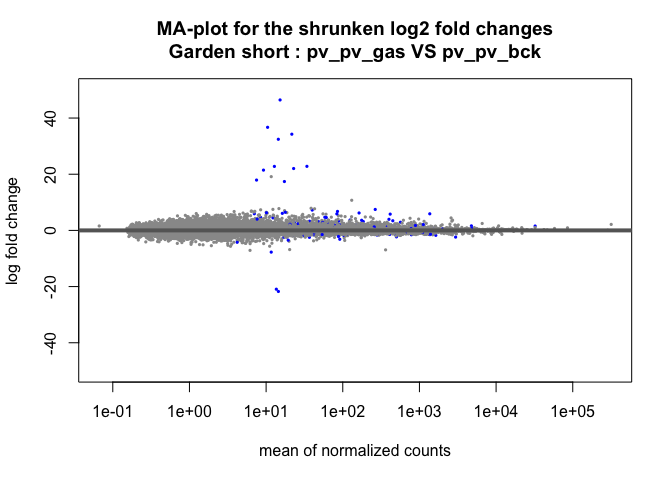
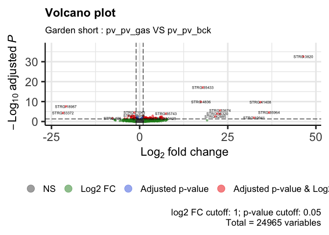
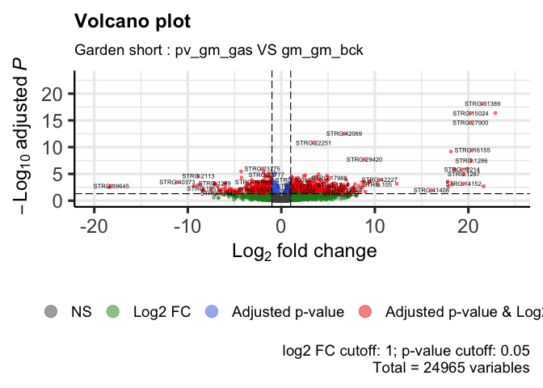
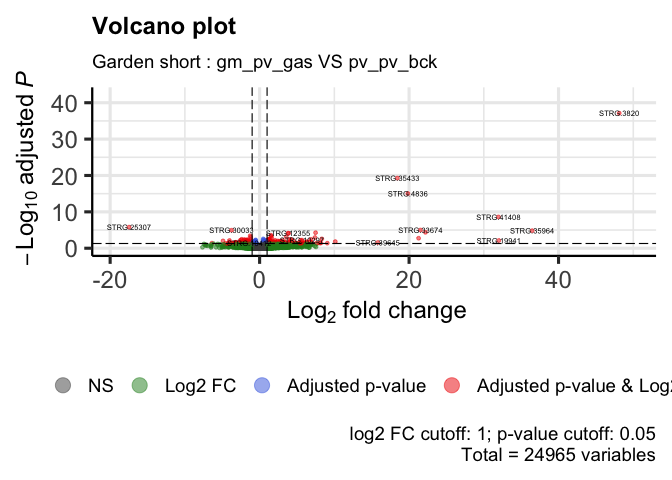
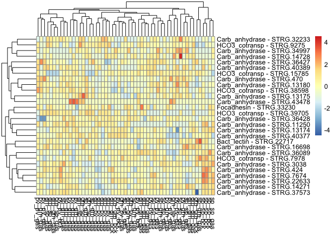

DE_Astroides_adult_gardenShort
================
Marc Meynadier
6/3/2022

``` r
# Differential expression on Kallisto data 

# Garden short 

# Packages and dependence
packageCheckClassic <- function(x){
  for( i in x ){
    #  require returns TRUE invisibly if it was able to load package
    if( ! require( i , character.only = TRUE ) ){
      #  If package was not able to be loaded then re-install
      install.packages( i , dependencies = TRUE )
      #  Load package after installing
      require( i , character.only = TRUE )
    }
  }
}

packageCheckClassic(c('DESeq2','devtools','BiocManager','ggplot2','ggrepel','markdown','RColorBrewer','genefilter','gplots','vegan','dplyr'))
```

    ## Le chargement a nécessité le package : DESeq2

    ## Le chargement a nécessité le package : S4Vectors

    ## Warning: le package 'S4Vectors' a été compilé avec la version R 4.1.3

    ## Le chargement a nécessité le package : stats4

    ## Le chargement a nécessité le package : BiocGenerics

    ## 
    ## Attachement du package : 'BiocGenerics'

    ## Les objets suivants sont masqués depuis 'package:stats':
    ## 
    ##     IQR, mad, sd, var, xtabs

    ## Les objets suivants sont masqués depuis 'package:base':
    ## 
    ##     anyDuplicated, append, as.data.frame, basename, cbind, colnames,
    ##     dirname, do.call, duplicated, eval, evalq, Filter, Find, get, grep,
    ##     grepl, intersect, is.unsorted, lapply, Map, mapply, match, mget,
    ##     order, paste, pmax, pmax.int, pmin, pmin.int, Position, rank,
    ##     rbind, Reduce, rownames, sapply, setdiff, sort, table, tapply,
    ##     union, unique, unsplit, which.max, which.min

    ## 
    ## Attachement du package : 'S4Vectors'

    ## Les objets suivants sont masqués depuis 'package:base':
    ## 
    ##     expand.grid, I, unname

    ## Le chargement a nécessité le package : IRanges

    ## Le chargement a nécessité le package : GenomicRanges

    ## Le chargement a nécessité le package : GenomeInfoDb

    ## Le chargement a nécessité le package : SummarizedExperiment

    ## Le chargement a nécessité le package : MatrixGenerics

    ## Le chargement a nécessité le package : matrixStats

    ## 
    ## Attachement du package : 'MatrixGenerics'

    ## Les objets suivants sont masqués depuis 'package:matrixStats':
    ## 
    ##     colAlls, colAnyNAs, colAnys, colAvgsPerRowSet, colCollapse,
    ##     colCounts, colCummaxs, colCummins, colCumprods, colCumsums,
    ##     colDiffs, colIQRDiffs, colIQRs, colLogSumExps, colMadDiffs,
    ##     colMads, colMaxs, colMeans2, colMedians, colMins, colOrderStats,
    ##     colProds, colQuantiles, colRanges, colRanks, colSdDiffs, colSds,
    ##     colSums2, colTabulates, colVarDiffs, colVars, colWeightedMads,
    ##     colWeightedMeans, colWeightedMedians, colWeightedSds,
    ##     colWeightedVars, rowAlls, rowAnyNAs, rowAnys, rowAvgsPerColSet,
    ##     rowCollapse, rowCounts, rowCummaxs, rowCummins, rowCumprods,
    ##     rowCumsums, rowDiffs, rowIQRDiffs, rowIQRs, rowLogSumExps,
    ##     rowMadDiffs, rowMads, rowMaxs, rowMeans2, rowMedians, rowMins,
    ##     rowOrderStats, rowProds, rowQuantiles, rowRanges, rowRanks,
    ##     rowSdDiffs, rowSds, rowSums2, rowTabulates, rowVarDiffs, rowVars,
    ##     rowWeightedMads, rowWeightedMeans, rowWeightedMedians,
    ##     rowWeightedSds, rowWeightedVars

    ## Le chargement a nécessité le package : Biobase

    ## Welcome to Bioconductor
    ## 
    ##     Vignettes contain introductory material; view with
    ##     'browseVignettes()'. To cite Bioconductor, see
    ##     'citation("Biobase")', and for packages 'citation("pkgname")'.

    ## 
    ## Attachement du package : 'Biobase'

    ## L'objet suivant est masqué depuis 'package:MatrixGenerics':
    ## 
    ##     rowMedians

    ## Les objets suivants sont masqués depuis 'package:matrixStats':
    ## 
    ##     anyMissing, rowMedians

    ## Le chargement a nécessité le package : devtools

    ## Le chargement a nécessité le package : usethis

    ## Le chargement a nécessité le package : BiocManager

    ## Bioconductor version '3.14' is out-of-date; the current release version '3.15'
    ##   is available with R version '4.2'; see https://bioconductor.org/install

    ## 
    ## Attachement du package : 'BiocManager'

    ## L'objet suivant est masqué depuis 'package:devtools':
    ## 
    ##     install

    ## Le chargement a nécessité le package : ggplot2

    ## Le chargement a nécessité le package : ggrepel

    ## Le chargement a nécessité le package : markdown

    ## Le chargement a nécessité le package : RColorBrewer

    ## Le chargement a nécessité le package : genefilter

    ## 
    ## Attachement du package : 'genefilter'

    ## Les objets suivants sont masqués depuis 'package:MatrixGenerics':
    ## 
    ##     rowSds, rowVars

    ## Les objets suivants sont masqués depuis 'package:matrixStats':
    ## 
    ##     rowSds, rowVars

    ## Le chargement a nécessité le package : gplots

    ## 
    ## Attachement du package : 'gplots'

    ## L'objet suivant est masqué depuis 'package:IRanges':
    ## 
    ##     space

    ## L'objet suivant est masqué depuis 'package:S4Vectors':
    ## 
    ##     space

    ## L'objet suivant est masqué depuis 'package:stats':
    ## 
    ##     lowess

    ## Le chargement a nécessité le package : vegan

    ## Le chargement a nécessité le package : permute

    ## 
    ## Attachement du package : 'permute'

    ## L'objet suivant est masqué depuis 'package:devtools':
    ## 
    ##     check

    ## Le chargement a nécessité le package : lattice

    ## This is vegan 2.6-2

    ## Le chargement a nécessité le package : dplyr

    ## 
    ## Attachement du package : 'dplyr'

    ## L'objet suivant est masqué depuis 'package:Biobase':
    ## 
    ##     combine

    ## L'objet suivant est masqué depuis 'package:matrixStats':
    ## 
    ##     count

    ## Les objets suivants sont masqués depuis 'package:GenomicRanges':
    ## 
    ##     intersect, setdiff, union

    ## L'objet suivant est masqué depuis 'package:GenomeInfoDb':
    ## 
    ##     intersect

    ## Les objets suivants sont masqués depuis 'package:IRanges':
    ## 
    ##     collapse, desc, intersect, setdiff, slice, union

    ## Les objets suivants sont masqués depuis 'package:S4Vectors':
    ## 
    ##     first, intersect, rename, setdiff, setequal, union

    ## Les objets suivants sont masqués depuis 'package:BiocGenerics':
    ## 
    ##     combine, intersect, setdiff, union

    ## Les objets suivants sont masqués depuis 'package:stats':
    ## 
    ##     filter, lag

    ## Les objets suivants sont masqués depuis 'package:base':
    ## 
    ##     intersect, setdiff, setequal, union

``` r
#BiocManager::install('tximport', force = TRUE)
#BiocManager::install('apeglm')
#BiocManager::install('ashr')
#BiocManager::install("EnhancedVolcano")
#BiocManager::install('limma')
#devtools::install_github('cran/GMD')
if (!require(devtools)) install.packages("devtools")
devtools::install_github("yanlinlin82/ggvenn")
```

    ## Skipping install of 'ggvenn' from a github remote, the SHA1 (b7ff54ba) has not changed since last install.
    ##   Use `force = TRUE` to force installation

``` r
library('ggvenn')
```

    ## Le chargement a nécessité le package : grid

``` r
library('tximport')
library('apeglm')
library('ashr')
library('EnhancedVolcano')
```

    ## Registered S3 methods overwritten by 'ggalt':
    ##   method                  from   
    ##   grid.draw.absoluteGrob  ggplot2
    ##   grobHeight.absoluteGrob ggplot2
    ##   grobWidth.absoluteGrob  ggplot2
    ##   grobX.absoluteGrob      ggplot2
    ##   grobY.absoluteGrob      ggplot2

``` r
source_url("https://raw.githubusercontent.com/obigriffith/biostar-tutorials/master/Heatmaps/heatmap.3.R")
```

    ## ℹ SHA-1 hash of file is 015fc0457e61e3e93a903e69a24d96d2dac7b9fb

``` r
# Working environment 
scriptPath<-dirname(rstudioapi::getSourceEditorContext()$path)
setwd(scriptPath)
samples<-read.table('tximport_design_gardenShort.txt',header=T)
samplesBck<-read.table('tximport_design_gardenShort_bck.txt',header=T)
samplesGas<-read.table('tximport_design_gardenShort_gas.txt',header=T)
samplesGasSame<-read.table('tximport_design_gardenShort_gas_same.txt',header=T)
samplesGasDiff<-read.table('tximport_design_gardenShort_gas_diff.txt',header=T)
tx2gene<-read.table('tx2gene_adultTranscriptome',header=T)
candidateGenes<-read.csv('candidateGenes.csv',header=T,sep=',')
scriptPath <- sub("/[^/]+$", "", scriptPath)
scriptPath <- sub("/[^/]+$", "", scriptPath)
dataPath<-'/data/net/6_kallisto/adultTranscriptome/adult/5_gardenShort'
outputPath<-paste(scriptPath,'/output/DESeq2/adultTranscriptome/adult/5_gardenShort/',sep='')
wdPath<-paste(scriptPath,dataPath,sep='')
setwd(wdPath)

# Data importation - txImport
files<-paste0(samples$samples,'.tsv')
filesBck<-paste0(samplesBck$samples,'.tsv')
filesGas<-paste0(samplesGas$samples,'.tsv')
filesGasSame<-paste0(samplesGasSame$samples,'.tsv')
filesGasDiff<-paste0(samplesGasDiff$samples,'.tsv')
names(files)<-samples$samples
names(filesBck)<-samplesBck$samples
names(filesGas)<-samplesGas$samples
names(filesGasSame)<-samplesGasSame$samples
names(filesGasDiff)<-samplesGasDiff$samples
txi<-tximport(files = files,type='kallisto',tx2gene = tx2gene)
```

    ## Note: importing `abundance.h5` is typically faster than `abundance.tsv`

    ## reading in files with read_tsv

    ## 1 2 3 4 5 6 7 8 9 10 11 12 13 14 15 16 17 18 19 20 21 22 23 24 25 26 27 28 29 30 31 32 33 34 35 36 37 38 39 40 41 42 43 44 45 46 47 48 49 50 51 52 53 54 55 
    ## transcripts missing from tx2gene: 1
    ## summarizing abundance
    ## summarizing counts
    ## summarizing length

``` r
txiBck<-tximport(files = filesBck,type='kallisto',tx2gene = tx2gene)
```

    ## Note: importing `abundance.h5` is typically faster than `abundance.tsv`
    ## reading in files with read_tsv
    ## 1 2 3 4 5 6 7 8 9 
    ## transcripts missing from tx2gene: 1
    ## summarizing abundance
    ## summarizing counts
    ## summarizing length

``` r
txiGas<-tximport(files = filesGas,type='kallisto',tx2gene = tx2gene)
```

    ## Note: importing `abundance.h5` is typically faster than `abundance.tsv`
    ## reading in files with read_tsv
    ## 1 2 3 4 5 6 7 8 9 10 11 12 13 14 15 16 17 18 19 20 21 22 23 24 25 26 27 28 29 30 31 32 33 34 35 36 37 38 39 40 41 42 43 44 45 46 
    ## transcripts missing from tx2gene: 1
    ## summarizing abundance
    ## summarizing counts
    ## summarizing length

``` r
txiGasSame<-tximport(files = filesGasSame,type='kallisto',tx2gene = tx2gene)
```

    ## Note: importing `abundance.h5` is typically faster than `abundance.tsv`
    ## reading in files with read_tsv
    ## 1 2 3 4 5 6 7 8 9 10 11 12 13 14 15 16 17 18 19 
    ## transcripts missing from tx2gene: 1
    ## summarizing abundance
    ## summarizing counts
    ## summarizing length

``` r
txiGasDiff<-tximport(files = filesGasDiff,type='kallisto',tx2gene = tx2gene)
```

    ## Note: importing `abundance.h5` is typically faster than `abundance.tsv`
    ## reading in files with read_tsv
    ## 1 2 3 4 5 6 7 8 9 10 11 12 13 14 15 16 17 18 19 20 21 22 23 24 25 26 27 
    ## transcripts missing from tx2gene: 1
    ## summarizing abundance
    ## summarizing counts
    ## summarizing length

``` r
names(txi)
```

    ## [1] "abundance"           "counts"              "length"             
    ## [4] "countsFromAbundance"

``` r
head(txi$counts)
```

    ##                    abundance_adult_sept2018_gm_gm_bck_15941X28_trimmed
    ## TRINITY_DN0_c0_g1                                            1087.0000
    ## TRINITY_DN0_c0_g2                                             112.8410
    ## TRINITY_DN0_c1_g1                                              25.1139
    ## TRINITY_DN1_c0_g1                                            2988.0000
    ## TRINITY_DN1_c1_g1                                               0.0000
    ## TRINITY_DN10_c0_g1                                            584.8720
    ##                    abundance_adult_sept2018_gm_gm_bck_15941X46_trimmed
    ## TRINITY_DN0_c0_g1                                             757.0000
    ## TRINITY_DN0_c0_g2                                              73.0000
    ## TRINITY_DN0_c1_g1                                              16.1135
    ## TRINITY_DN1_c0_g1                                            2944.3000
    ## TRINITY_DN1_c1_g1                                               0.0000
    ## TRINITY_DN10_c0_g1                                            363.9040
    ##                    abundance_adult_sept2018_gm_gm_bck_15941X54_trimmed
    ## TRINITY_DN0_c0_g1                                            2283.0000
    ## TRINITY_DN0_c0_g2                                              65.0000
    ## TRINITY_DN0_c1_g1                                              19.1725
    ## TRINITY_DN1_c0_g1                                            2721.0000
    ## TRINITY_DN1_c1_g1                                               0.0000
    ## TRINITY_DN10_c0_g1                                            238.8070
    ##                    abundance_adult_sept2018_gm_gm_gas_15873X11_trimmed
    ## TRINITY_DN0_c0_g1                                              645.000
    ## TRINITY_DN0_c0_g2                                              204.109
    ## TRINITY_DN0_c1_g1                                               26.000
    ## TRINITY_DN1_c0_g1                                             2941.000
    ## TRINITY_DN1_c1_g1                                                0.000
    ## TRINITY_DN10_c0_g1                                             443.826
    ##                    abundance_adult_sept2018_gm_gm_gas_15873X16_trimmed
    ## TRINITY_DN0_c0_g1                                              648.000
    ## TRINITY_DN0_c0_g2                                              180.177
    ## TRINITY_DN0_c1_g1                                               33.000
    ## TRINITY_DN1_c0_g1                                             2430.790
    ## TRINITY_DN1_c1_g1                                                0.000
    ## TRINITY_DN10_c0_g1                                             399.192
    ##                    abundance_adult_sept2018_gm_gm_gas_15873X38_trimmed
    ## TRINITY_DN0_c0_g1                                             840.0000
    ## TRINITY_DN0_c0_g2                                             145.0000
    ## TRINITY_DN0_c1_g1                                              16.1688
    ## TRINITY_DN1_c0_g1                                            2930.0000
    ## TRINITY_DN1_c1_g1                                               0.0000
    ## TRINITY_DN10_c0_g1                                            268.7270
    ##                    abundance_adult_sept2018_gm_gm_gas_15941X11_trimmed
    ## TRINITY_DN0_c0_g1                                             844.0000
    ## TRINITY_DN0_c0_g2                                              92.4507
    ## TRINITY_DN0_c1_g1                                              22.0000
    ## TRINITY_DN1_c0_g1                                            3607.0000
    ## TRINITY_DN1_c1_g1                                               0.0000
    ## TRINITY_DN10_c0_g1                                            278.7220
    ##                    abundance_adult_sept2018_gm_gm_gas_15941X12_trimmed
    ## TRINITY_DN0_c0_g1                                             490.0000
    ## TRINITY_DN0_c0_g2                                              90.0000
    ## TRINITY_DN0_c1_g1                                              22.1137
    ## TRINITY_DN1_c0_g1                                            1479.0000
    ## TRINITY_DN1_c1_g1                                               0.0000
    ## TRINITY_DN10_c0_g1                                            223.2230
    ##                    abundance_adult_sept2018_gm_gm_gas_15941X26_trimmed
    ## TRINITY_DN0_c0_g1                                             974.0000
    ## TRINITY_DN0_c0_g2                                              61.7238
    ## TRINITY_DN0_c1_g1                                              20.5152
    ## TRINITY_DN1_c0_g1                                            3019.0000
    ## TRINITY_DN1_c1_g1                                               0.0000
    ## TRINITY_DN10_c0_g1                                            373.5150
    ##                    abundance_adult_sept2018_gm_gm_gas_15941X50_trimmed
    ## TRINITY_DN0_c0_g1                                            1004.0000
    ## TRINITY_DN0_c0_g2                                             134.1570
    ## TRINITY_DN0_c1_g1                                              28.2638
    ## TRINITY_DN1_c0_g1                                            2195.0000
    ## TRINITY_DN1_c1_g1                                               0.0000
    ## TRINITY_DN10_c0_g1                                            350.4150
    ##                    abundance_adult_sept2018_gm_pv_gas_15873X15_trimmed
    ## TRINITY_DN0_c0_g1                                             834.0000
    ## TRINITY_DN0_c0_g2                                             163.7540
    ## TRINITY_DN0_c1_g1                                              49.1437
    ## TRINITY_DN1_c0_g1                                            2019.7500
    ## TRINITY_DN1_c1_g1                                               0.0000
    ## TRINITY_DN10_c0_g1                                            350.0910
    ##                    abundance_adult_sept2018_gm_pv_gas_15873X23_trimmed
    ## TRINITY_DN0_c0_g1                                               643.00
    ## TRINITY_DN0_c0_g2                                               122.00
    ## TRINITY_DN0_c1_g1                                                12.00
    ## TRINITY_DN1_c0_g1                                              1943.00
    ## TRINITY_DN1_c1_g1                                                 0.00
    ## TRINITY_DN10_c0_g1                                              257.61
    ##                    abundance_adult_sept2018_gm_pv_gas_15873X46_trimmed
    ## TRINITY_DN0_c0_g1                                              967.000
    ## TRINITY_DN0_c0_g2                                              253.000
    ## TRINITY_DN0_c1_g1                                               20.000
    ## TRINITY_DN1_c0_g1                                             4394.000
    ## TRINITY_DN1_c1_g1                                                0.000
    ## TRINITY_DN10_c0_g1                                             401.447
    ##                    abundance_adult_sept2018_gm_pv_gas_15873X49_trimmed
    ## TRINITY_DN0_c0_g1                                              794.000
    ## TRINITY_DN0_c0_g2                                              158.000
    ## TRINITY_DN0_c1_g1                                               14.000
    ## TRINITY_DN1_c0_g1                                             2847.000
    ## TRINITY_DN1_c1_g1                                                0.000
    ## TRINITY_DN10_c0_g1                                             249.423
    ##                    abundance_adult_sept2018_gm_pv_gas_15873X50_trimmed
    ## TRINITY_DN0_c0_g1                                             340.0000
    ## TRINITY_DN0_c0_g2                                              77.7748
    ## TRINITY_DN0_c1_g1                                               9.1293
    ## TRINITY_DN1_c0_g1                                             889.5880
    ## TRINITY_DN1_c1_g1                                               0.0000
    ## TRINITY_DN10_c0_g1                                            236.4560
    ##                    abundance_adult_sept2018_gm_pv_gas_15941X14_trimmed
    ## TRINITY_DN0_c0_g1                                             625.0000
    ## TRINITY_DN0_c0_g2                                             132.6920
    ## TRINITY_DN0_c1_g1                                              35.8231
    ## TRINITY_DN1_c0_g1                                            1933.0000
    ## TRINITY_DN1_c1_g1                                               0.0000
    ## TRINITY_DN10_c0_g1                                            202.1640
    ##                    abundance_adult_sept2018_gm_pv_gas_15941X38_trimmed
    ## TRINITY_DN0_c0_g1                                            1028.0000
    ## TRINITY_DN0_c0_g2                                              52.0000
    ## TRINITY_DN0_c1_g1                                              26.1549
    ## TRINITY_DN1_c0_g1                                            2203.5300
    ## TRINITY_DN1_c1_g1                                               0.0000
    ## TRINITY_DN10_c0_g1                                            258.0750
    ##                    abundance_adult_sept2018_gm_sp_gas_15873X17_trimmed
    ## TRINITY_DN0_c0_g1                                              674.000
    ## TRINITY_DN0_c0_g2                                              171.634
    ## TRINITY_DN0_c1_g1                                               29.000
    ## TRINITY_DN1_c0_g1                                             2471.000
    ## TRINITY_DN1_c1_g1                                                0.000
    ## TRINITY_DN10_c0_g1                                             351.669
    ##                    abundance_adult_sept2018_gm_sp_gas_15873X37_trimmed
    ## TRINITY_DN0_c0_g1                                             1240.000
    ## TRINITY_DN0_c0_g2                                              159.887
    ## TRINITY_DN0_c1_g1                                               28.000
    ## TRINITY_DN1_c0_g1                                             2645.000
    ## TRINITY_DN1_c1_g1                                                0.000
    ## TRINITY_DN10_c0_g1                                             377.101
    ##                    abundance_adult_sept2018_gm_sp_gas_15941X10_trimmed
    ## TRINITY_DN0_c0_g1                                             976.0000
    ## TRINITY_DN0_c0_g2                                             102.0000
    ## TRINITY_DN0_c1_g1                                              29.3501
    ## TRINITY_DN1_c0_g1                                            4596.0000
    ## TRINITY_DN1_c1_g1                                               1.0000
    ## TRINITY_DN10_c0_g1                                            280.3350
    ##                    abundance_adult_sept2018_gm_sp_gas_15941X24_trimmed
    ## TRINITY_DN0_c0_g1                                             760.0000
    ## TRINITY_DN0_c0_g2                                              92.8085
    ## TRINITY_DN0_c1_g1                                              23.1783
    ## TRINITY_DN1_c0_g1                                            1165.0000
    ## TRINITY_DN1_c1_g1                                               0.0000
    ## TRINITY_DN10_c0_g1                                            244.2380
    ##                    abundance_adult_sept2018_gm_sp_gas_15941X25_trimmed
    ## TRINITY_DN0_c0_g1                                            1114.0000
    ## TRINITY_DN0_c0_g2                                             139.5830
    ## TRINITY_DN0_c1_g1                                              31.2676
    ## TRINITY_DN1_c0_g1                                            2609.0000
    ## TRINITY_DN1_c1_g1                                               0.0000
    ## TRINITY_DN10_c0_g1                                            398.2550
    ##                    abundance_adult_sept2018_gm_sp_gas_15941X44_trimmed
    ## TRINITY_DN0_c0_g1                                            1133.0000
    ## TRINITY_DN0_c0_g2                                              75.6340
    ## TRINITY_DN0_c1_g1                                              24.3566
    ## TRINITY_DN1_c0_g1                                            1388.0000
    ## TRINITY_DN1_c1_g1                                               0.0000
    ## TRINITY_DN10_c0_g1                                            252.6230
    ##                    abundance_adult_sept2018_gm_sp_gas_15941X57_trimmed
    ## TRINITY_DN0_c0_g1                                            1085.0000
    ## TRINITY_DN0_c0_g2                                             108.9810
    ## TRINITY_DN0_c1_g1                                              42.2181
    ## TRINITY_DN1_c0_g1                                            2283.0000
    ## TRINITY_DN1_c1_g1                                               0.0000
    ## TRINITY_DN10_c0_g1                                            609.8180
    ##                    abundance_adult_sept2018_pv_gm_gas_15873X12_trimmed
    ## TRINITY_DN0_c0_g1                                              571.000
    ## TRINITY_DN0_c0_g2                                              168.000
    ## TRINITY_DN0_c1_g1                                               27.000
    ## TRINITY_DN1_c0_g1                                             1276.000
    ## TRINITY_DN1_c1_g1                                                0.000
    ## TRINITY_DN10_c0_g1                                             279.036
    ##                    abundance_adult_sept2018_pv_gm_gas_15873X39_trimmed
    ## TRINITY_DN0_c0_g1                                             743.0000
    ## TRINITY_DN0_c0_g2                                             104.0000
    ## TRINITY_DN0_c1_g1                                              23.2666
    ## TRINITY_DN1_c0_g1                                            2627.0000
    ## TRINITY_DN1_c1_g1                                               0.0000
    ## TRINITY_DN10_c0_g1                                            393.8330
    ##                    abundance_adult_sept2018_pv_gm_gas_15873X40_trimmed
    ## TRINITY_DN0_c0_g1                                              592.000
    ## TRINITY_DN0_c0_g2                                               74.000
    ## TRINITY_DN0_c1_g1                                               14.000
    ## TRINITY_DN1_c0_g1                                             1225.000
    ## TRINITY_DN1_c1_g1                                                0.000
    ## TRINITY_DN10_c0_g1                                             218.479
    ##                    abundance_adult_sept2018_pv_gm_gas_15941X13_trimmed
    ## TRINITY_DN0_c0_g1                                             1060.000
    ## TRINITY_DN0_c0_g2                                              100.045
    ## TRINITY_DN0_c1_g1                                               17.000
    ## TRINITY_DN1_c0_g1                                             2124.000
    ## TRINITY_DN1_c1_g1                                                0.000
    ## TRINITY_DN10_c0_g1                                             341.324
    ##                    abundance_adult_sept2018_pv_gm_gas_15941X27_trimmed
    ## TRINITY_DN0_c0_g1                                              908.000
    ## TRINITY_DN0_c0_g2                                              175.000
    ## TRINITY_DN0_c1_g1                                               20.089
    ## TRINITY_DN1_c0_g1                                             3333.000
    ## TRINITY_DN1_c1_g1                                                0.000
    ## TRINITY_DN10_c0_g1                                             327.720
    ##                    abundance_adult_sept2018_pv_gm_gas_15941X45_trimmed
    ## TRINITY_DN0_c0_g1                                              927.000
    ## TRINITY_DN0_c0_g2                                              131.000
    ## TRINITY_DN0_c1_g1                                               27.000
    ## TRINITY_DN1_c0_g1                                             1615.310
    ## TRINITY_DN1_c1_g1                                                0.000
    ## TRINITY_DN10_c0_g1                                             308.444
    ##                    abundance_adult_sept2018_pv_pv_bck_15873X21_trimmed
    ## TRINITY_DN0_c0_g1                                             500.0000
    ## TRINITY_DN0_c0_g2                                             141.7750
    ## TRINITY_DN0_c1_g1                                              16.0743
    ## TRINITY_DN1_c0_g1                                            2813.8000
    ## TRINITY_DN1_c1_g1                                               0.0000
    ## TRINITY_DN10_c0_g1                                            316.4540
    ##                    abundance_adult_sept2018_pv_pv_bck_15941X47_trimmed
    ## TRINITY_DN0_c0_g1                                             874.0000
    ## TRINITY_DN0_c0_g2                                             134.0000
    ## TRINITY_DN0_c1_g1                                              27.0977
    ## TRINITY_DN1_c0_g1                                            2098.0000
    ## TRINITY_DN1_c1_g1                                               0.0000
    ## TRINITY_DN10_c0_g1                                            318.4040
    ##                    abundance_adult_sept2018_pv_pv_bck_15941X55_trimmed
    ## TRINITY_DN0_c0_g1                                              1334.00
    ## TRINITY_DN0_c0_g2                                               107.00
    ## TRINITY_DN0_c1_g1                                                22.00
    ## TRINITY_DN1_c0_g1                                              3120.83
    ## TRINITY_DN1_c1_g1                                                 0.00
    ## TRINITY_DN10_c0_g1                                              333.00
    ##                    abundance_adult_sept2018_pv_pv_gas_15873X14_trimmed
    ## TRINITY_DN0_c0_g1                                              717.000
    ## TRINITY_DN0_c0_g2                                              122.000
    ## TRINITY_DN0_c1_g1                                               14.000
    ## TRINITY_DN1_c0_g1                                             1902.760
    ## TRINITY_DN1_c1_g1                                                0.000
    ## TRINITY_DN10_c0_g1                                             291.096
    ##                    abundance_adult_sept2018_pv_pv_gas_15873X47_trimmed
    ## TRINITY_DN0_c0_g1                                              905.000
    ## TRINITY_DN0_c0_g2                                              108.839
    ## TRINITY_DN0_c1_g1                                               16.000
    ## TRINITY_DN1_c0_g1                                             1600.000
    ## TRINITY_DN1_c1_g1                                                0.000
    ## TRINITY_DN10_c0_g1                                             220.109
    ##                    abundance_adult_sept2018_pv_pv_gas_15873X48_trimmed
    ## TRINITY_DN0_c0_g1                                             1137.000
    ## TRINITY_DN0_c0_g2                                              118.490
    ## TRINITY_DN0_c1_g1                                               20.000
    ## TRINITY_DN1_c0_g1                                             2904.000
    ## TRINITY_DN1_c1_g1                                                0.000
    ## TRINITY_DN10_c0_g1                                             368.048
    ##                    abundance_adult_sept2018_pv_pv_gas_15941X15_trimmed
    ## TRINITY_DN0_c0_g1                                              1262.00
    ## TRINITY_DN0_c0_g2                                                91.00
    ## TRINITY_DN0_c1_g1                                                34.00
    ## TRINITY_DN1_c0_g1                                              1217.00
    ## TRINITY_DN1_c1_g1                                                 0.00
    ## TRINITY_DN10_c0_g1                                              271.98
    ##                    abundance_adult_sept2018_pv_pv_gas_15941X37_trimmed
    ## TRINITY_DN0_c0_g1                                             915.0000
    ## TRINITY_DN0_c0_g2                                             101.0000
    ## TRINITY_DN0_c1_g1                                              27.2292
    ## TRINITY_DN1_c0_g1                                            1159.0000
    ## TRINITY_DN1_c1_g1                                               0.0000
    ## TRINITY_DN10_c0_g1                                            243.1810
    ##                    abundance_adult_sept2018_pv_pv_gas_15941X58_trimmed
    ## TRINITY_DN0_c0_g1                                            1185.0000
    ## TRINITY_DN0_c0_g2                                              58.0000
    ## TRINITY_DN0_c1_g1                                              47.2034
    ## TRINITY_DN1_c0_g1                                            1557.0000
    ## TRINITY_DN1_c1_g1                                               0.0000
    ## TRINITY_DN10_c0_g1                                            215.0980
    ##                    abundance_adult_sept2018_sp_gm_gas_15873X13_trimmed
    ## TRINITY_DN0_c0_g1                                               824.00
    ## TRINITY_DN0_c0_g2                                               161.00
    ## TRINITY_DN0_c1_g1                                                25.00
    ## TRINITY_DN1_c0_g1                                              2715.00
    ## TRINITY_DN1_c1_g1                                                 0.00
    ## TRINITY_DN10_c0_g1                                              314.07
    ##                    abundance_adult_sept2018_sp_gm_gas_15873X44_trimmed
    ## TRINITY_DN0_c0_g1                                            1240.0000
    ## TRINITY_DN0_c0_g2                                             187.0000
    ## TRINITY_DN0_c1_g1                                              25.2066
    ## TRINITY_DN1_c0_g1                                            3593.0000
    ## TRINITY_DN1_c1_g1                                               0.0000
    ## TRINITY_DN10_c0_g1                                            341.8880
    ##                    abundance_adult_sept2018_sp_gm_gas_15873X45_trimmed
    ## TRINITY_DN0_c0_g1                                              917.000
    ## TRINITY_DN0_c0_g2                                              141.415
    ## TRINITY_DN0_c1_g1                                               23.000
    ## TRINITY_DN1_c0_g1                                             3064.860
    ## TRINITY_DN1_c1_g1                                                0.000
    ## TRINITY_DN10_c0_g1                                             307.904
    ##                    abundance_adult_sept2018_sp_gm_gas_15941X35_trimmed
    ## TRINITY_DN0_c0_g1                                            1319.0000
    ## TRINITY_DN0_c0_g2                                              84.2478
    ## TRINITY_DN0_c1_g1                                              28.0000
    ## TRINITY_DN1_c0_g1                                            3835.0000
    ## TRINITY_DN1_c1_g1                                               0.0000
    ## TRINITY_DN10_c0_g1                                            537.4110
    ##                    abundance_adult_sept2018_sp_gm_gas_15941X36_trimmed
    ## TRINITY_DN0_c0_g1                                             635.0000
    ## TRINITY_DN0_c0_g2                                              79.0000
    ## TRINITY_DN0_c1_g1                                              23.0863
    ## TRINITY_DN1_c0_g1                                            2666.5400
    ## TRINITY_DN1_c1_g1                                               0.0000
    ## TRINITY_DN10_c0_g1                                            356.2960
    ##                    abundance_adult_sept2018_sp_gm_gas_15941X49_trimmed
    ## TRINITY_DN0_c0_g1                                            1919.0000
    ## TRINITY_DN0_c0_g2                                              59.3251
    ## TRINITY_DN0_c1_g1                                              34.5338
    ## TRINITY_DN1_c0_g1                                            3723.9000
    ## TRINITY_DN1_c1_g1                                               0.0000
    ## TRINITY_DN10_c0_g1                                            396.8410
    ##                    abundance_adult_sept2018_sp_gm_gas_15941X56_trimmed
    ## TRINITY_DN0_c0_g1                                             942.0000
    ## TRINITY_DN0_c0_g2                                              85.0000
    ## TRINITY_DN0_c1_g1                                              22.1548
    ## TRINITY_DN1_c0_g1                                            1681.0000
    ## TRINITY_DN1_c1_g1                                               0.0000
    ## TRINITY_DN10_c0_g1                                            353.9530
    ##                    abundance_adult_sept2018_sp_sp_bck_15873X20_trimmed
    ## TRINITY_DN0_c0_g1                                              604.000
    ## TRINITY_DN0_c0_g2                                              100.000
    ## TRINITY_DN0_c1_g1                                               16.000
    ## TRINITY_DN1_c0_g1                                             3551.000
    ## TRINITY_DN1_c1_g1                                                0.000
    ## TRINITY_DN10_c0_g1                                             397.305
    ##                    abundance_adult_sept2018_sp_sp_bck_15941X48_trimmed
    ## TRINITY_DN0_c0_g1                                              574.000
    ## TRINITY_DN0_c0_g2                                              275.737
    ## TRINITY_DN0_c1_g1                                               27.000
    ## TRINITY_DN1_c0_g1                                             3897.000
    ## TRINITY_DN1_c1_g1                                                0.000
    ## TRINITY_DN10_c0_g1                                             293.778
    ##                    abundance_adult_sept2018_sp_sp_bck_15941X53_trimmed
    ## TRINITY_DN0_c0_g1                                              498.000
    ## TRINITY_DN0_c0_g2                                              113.731
    ## TRINITY_DN0_c1_g1                                               19.000
    ## TRINITY_DN1_c0_g1                                             4000.000
    ## TRINITY_DN1_c1_g1                                                0.000
    ## TRINITY_DN10_c0_g1                                             344.028
    ##                    abundance_adult_sept2018_sp_sp_gas_15873X10_trimmed
    ## TRINITY_DN0_c0_g1                                              592.000
    ## TRINITY_DN0_c0_g2                                              100.000
    ## TRINITY_DN0_c1_g1                                               15.000
    ## TRINITY_DN1_c0_g1                                             3227.000
    ## TRINITY_DN1_c1_g1                                                0.000
    ## TRINITY_DN10_c0_g1                                             368.787
    ##                    abundance_adult_sept2018_sp_sp_gas_15873X34_trimmed
    ## TRINITY_DN0_c0_g1                                              378.000
    ## TRINITY_DN0_c0_g2                                              121.600
    ## TRINITY_DN0_c1_g1                                               21.000
    ## TRINITY_DN1_c0_g1                                             3512.000
    ## TRINITY_DN1_c1_g1                                                1.000
    ## TRINITY_DN10_c0_g1                                             321.214
    ##                    abundance_adult_sept2018_sp_sp_gas_15873X36_trimmed
    ## TRINITY_DN0_c0_g1                                             633.0000
    ## TRINITY_DN0_c0_g2                                             122.0000
    ## TRINITY_DN0_c1_g1                                              23.1045
    ## TRINITY_DN1_c0_g1                                            2017.0000
    ## TRINITY_DN1_c1_g1                                               0.0000
    ## TRINITY_DN10_c0_g1                                            425.6230
    ##                    abundance_adult_sept2018_sp_sp_gas_15941X23_trimmed
    ## TRINITY_DN0_c0_g1                                              591.000
    ## TRINITY_DN0_c0_g2                                              153.000
    ## TRINITY_DN0_c1_g1                                               30.000
    ## TRINITY_DN1_c0_g1                                             2710.000
    ## TRINITY_DN1_c1_g1                                                0.000
    ## TRINITY_DN10_c0_g1                                             352.368
    ##                    abundance_adult_sept2018_sp_sp_gas_15941X43_trimmed
    ## TRINITY_DN0_c0_g1                                             1107.000
    ## TRINITY_DN0_c0_g2                                               79.000
    ## TRINITY_DN0_c1_g1                                               25.000
    ## TRINITY_DN1_c0_g1                                             1751.660
    ## TRINITY_DN1_c1_g1                                                0.000
    ## TRINITY_DN10_c0_g1                                             315.187
    ##                    abundance_adult_sept2018_sp_sp_gas_15941X9_trimmed
    ## TRINITY_DN0_c0_g1                                            676.0000
    ## TRINITY_DN0_c0_g2                                             95.0000
    ## TRINITY_DN0_c1_g1                                             30.3367
    ## TRINITY_DN1_c0_g1                                           1633.0000
    ## TRINITY_DN1_c1_g1                                              0.0000
    ## TRINITY_DN10_c0_g1                                           377.1480

``` r
dds<-DESeqDataSetFromTximport(txi,colData=samples,design= ~originSite_finalSite_experiment)
```

    ## Warning in DESeqDataSet(se, design = design, ignoreRank): some variables in
    ## design formula are characters, converting to factors

    ## using counts and average transcript lengths from tximport

``` r
ddsBck<-DESeqDataSetFromTximport(txiBck,colData=samplesBck,design= ~originSite_finalSite_experiment)
```

    ## Warning in DESeqDataSet(se, design = design, ignoreRank): some variables in
    ## design formula are characters, converting to factors

    ## using counts and average transcript lengths from tximport

``` r
ddsGas<-DESeqDataSetFromTximport(txiGas,colData=samplesGas,design= ~originSite_finalSite_experiment)
```

    ## Warning in DESeqDataSet(se, design = design, ignoreRank): some variables in
    ## design formula are characters, converting to factors

    ## using counts and average transcript lengths from tximport

``` r
ddsGasSame<-DESeqDataSetFromTximport(txiGasSame,colData=samplesGasSame,design= ~originSite_finalSite_experiment)
```

    ## Warning in DESeqDataSet(se, design = design, ignoreRank): some variables in
    ## design formula are characters, converting to factors

    ## using counts and average transcript lengths from tximport

``` r
ddsGasDiff<-DESeqDataSetFromTximport(txiGasDiff,colData=samplesGasDiff,design= ~originSite_finalSite_experiment)
```

    ## Warning in DESeqDataSet(se, design = design, ignoreRank): some variables in
    ## design formula are characters, converting to factors

    ## using counts and average transcript lengths from tximport

``` r
# pre-filtering
keep <- rowSums(counts(dds)) >= 10 
dds <- dds[keep,]
keep <- rowSums(counts(ddsBck)) >= 10 
ddsBck <- ddsBck[keep,]
keep <- rowSums(counts(ddsGas)) >= 10 
ddsGas <- ddsGas[keep,]
keep <- rowSums(counts(ddsGasSame)) >= 10 
ddsGasSame <- ddsGasSame[keep,]
keep <- rowSums(counts(ddsGasDiff)) >= 10 
ddsGasDiff <- ddsGasDiff[keep,]

# Differential expression analysis
dds<-DESeq(dds)
```

    ## estimating size factors
    ## using 'avgTxLength' from assays(dds), correcting for library size
    ## estimating dispersions
    ## gene-wise dispersion estimates
    ## mean-dispersion relationship
    ## final dispersion estimates
    ## fitting model and testing
    ## -- replacing outliers and refitting for 77 genes
    ## -- DESeq argument 'minReplicatesForReplace' = 7 
    ## -- original counts are preserved in counts(dds)
    ## estimating dispersions
    ## fitting model and testing

``` r
ddsBck<-DESeq(ddsBck)
```

    ## estimating size factors
    ## using 'avgTxLength' from assays(dds), correcting for library size
    ## estimating dispersions
    ## gene-wise dispersion estimates
    ## mean-dispersion relationship
    ## final dispersion estimates
    ## fitting model and testing

``` r
ddsGas<-DESeq(ddsGas)
```

    ## estimating size factors
    ## using 'avgTxLength' from assays(dds), correcting for library size
    ## estimating dispersions
    ## gene-wise dispersion estimates
    ## mean-dispersion relationship
    ## final dispersion estimates
    ## fitting model and testing
    ## -- replacing outliers and refitting for 88 genes
    ## -- DESeq argument 'minReplicatesForReplace' = 7 
    ## -- original counts are preserved in counts(dds)
    ## estimating dispersions
    ## fitting model and testing

``` r
ddsGasSame<-DESeq(ddsGasSame)
```

    ## estimating size factors
    ## using 'avgTxLength' from assays(dds), correcting for library size
    ## estimating dispersions
    ## gene-wise dispersion estimates
    ## mean-dispersion relationship
    ## final dispersion estimates
    ## fitting model and testing
    ## -- replacing outliers and refitting for 220 genes
    ## -- DESeq argument 'minReplicatesForReplace' = 7 
    ## -- original counts are preserved in counts(dds)
    ## estimating dispersions
    ## fitting model and testing

``` r
ddsGasDiff<-DESeq(ddsGasDiff)
```

    ## estimating size factors
    ## using 'avgTxLength' from assays(dds), correcting for library size
    ## estimating dispersions
    ## gene-wise dispersion estimates
    ## mean-dispersion relationship
    ## final dispersion estimates
    ## fitting model and testing
    ## -- replacing outliers and refitting for 174 genes
    ## -- DESeq argument 'minReplicatesForReplace' = 7 
    ## -- original counts are preserved in counts(dds)
    ## estimating dispersions
    ## fitting model and testing

``` r
cbind(resultsNames(dds))
```

    ##       [,1]                                                    
    ##  [1,] "Intercept"                                             
    ##  [2,] "originSite_finalSite_experiment_gm_gm_gas_vs_gm_gm_bck"
    ##  [3,] "originSite_finalSite_experiment_gm_pv_gas_vs_gm_gm_bck"
    ##  [4,] "originSite_finalSite_experiment_gm_sp_gas_vs_gm_gm_bck"
    ##  [5,] "originSite_finalSite_experiment_pv_gm_gas_vs_gm_gm_bck"
    ##  [6,] "originSite_finalSite_experiment_pv_pv_bck_vs_gm_gm_bck"
    ##  [7,] "originSite_finalSite_experiment_pv_pv_gas_vs_gm_gm_bck"
    ##  [8,] "originSite_finalSite_experiment_sp_gm_gas_vs_gm_gm_bck"
    ##  [9,] "originSite_finalSite_experiment_sp_sp_bck_vs_gm_gm_bck"
    ## [10,] "originSite_finalSite_experiment_sp_sp_gas_vs_gm_gm_bck"

``` r
gm_gm_gas_VS_gm_gm_bck<-results(dds, contrast=c("originSite_finalSite_experiment","gm_gm_gas","gm_gm_bck"), alpha = 0.05)
pv_pv_gas_VS_pv_pv_bck<-results(dds, contrast=c("originSite_finalSite_experiment","pv_pv_gas","pv_pv_bck"), alpha = 0.05)
sp_sp_gas_VS_sp_sp_bck<-results(dds, contrast=c("originSite_finalSite_experiment","sp_sp_gas","sp_sp_bck"), alpha = 0.05)
pv_gm_gas_VS_pv_pv_bck<-results(dds, contrast=c("originSite_finalSite_experiment","pv_gm_gas","pv_pv_bck"), alpha = 0.05)
sp_gm_gas_VS_sp_sp_bck<-results(dds, contrast=c("originSite_finalSite_experiment","sp_gm_gas","sp_sp_bck"), alpha = 0.05)
pv_gm_gas_VS_gm_gm_bck<-results(dds, contrast=c("originSite_finalSite_experiment","pv_gm_gas","gm_gm_bck"), alpha = 0.05)
sp_gm_gas_VS_gm_gm_bck<-results(dds, contrast=c("originSite_finalSite_experiment","sp_sp_gas","gm_gm_bck"), alpha = 0.05)
gm_pv_gas_VS_pv_pv_bck<-results(dds, contrast=c("originSite_finalSite_experiment","gm_pv_gas","pv_pv_bck"), alpha = 0.05)
gm_sp_gas_VS_sp_sp_bck<-results(dds, contrast=c("originSite_finalSite_experiment","gm_sp_gas","sp_sp_bck"), alpha = 0.05)
gm_pv_gas_VS_gm_gm_bck<-results(dds, contrast=c("originSite_finalSite_experiment","gm_pv_gas","gm_gm_bck"), alpha = 0.05)
gm_sp_gas_VS_gm_gm_bck<-results(dds, contrast=c("originSite_finalSite_experiment","gm_sp_gas","gm_gm_bck"), alpha = 0.05)
summary(gm_gm_gas_VS_gm_gm_bck)
```

    ## 
    ## out of 70413 with nonzero total read count
    ## adjusted p-value < 0.05
    ## LFC > 0 (up)       : 380, 0.54%
    ## LFC < 0 (down)     : 635, 0.9%
    ## outliers [1]       : 48, 0.068%
    ## low counts [2]     : 39562, 56%
    ## (mean count < 10)
    ## [1] see 'cooksCutoff' argument of ?results
    ## [2] see 'independentFiltering' argument of ?results

``` r
summary(pv_pv_gas_VS_pv_pv_bck)
```

    ## 
    ## out of 70413 with nonzero total read count
    ## adjusted p-value < 0.05
    ## LFC > 0 (up)       : 111, 0.16%
    ## LFC < 0 (down)     : 94, 0.13%
    ## outliers [1]       : 48, 0.068%
    ## low counts [2]     : 38200, 54%
    ## (mean count < 8)
    ## [1] see 'cooksCutoff' argument of ?results
    ## [2] see 'independentFiltering' argument of ?results

``` r
summary(sp_sp_gas_VS_sp_sp_bck)
```

    ## 
    ## out of 70413 with nonzero total read count
    ## adjusted p-value < 0.05
    ## LFC > 0 (up)       : 684, 0.97%
    ## LFC < 0 (down)     : 403, 0.57%
    ## outliers [1]       : 48, 0.068%
    ## low counts [2]     : 36837, 52%
    ## (mean count < 7)
    ## [1] see 'cooksCutoff' argument of ?results
    ## [2] see 'independentFiltering' argument of ?results

``` r
summary(pv_gm_gas_VS_pv_pv_bck)
```

    ## 
    ## out of 70413 with nonzero total read count
    ## adjusted p-value < 0.05
    ## LFC > 0 (up)       : 27, 0.038%
    ## LFC < 0 (down)     : 28, 0.04%
    ## outliers [1]       : 48, 0.068%
    ## low counts [2]     : 8191, 12%
    ## (mean count < 0)
    ## [1] see 'cooksCutoff' argument of ?results
    ## [2] see 'independentFiltering' argument of ?results

``` r
summary(sp_gm_gas_VS_sp_sp_bck)
```

    ## 
    ## out of 70413 with nonzero total read count
    ## adjusted p-value < 0.05
    ## LFC > 0 (up)       : 2400, 3.4%
    ## LFC < 0 (down)     : 2480, 3.5%
    ## outliers [1]       : 48, 0.068%
    ## low counts [2]     : 32749, 47%
    ## (mean count < 5)
    ## [1] see 'cooksCutoff' argument of ?results
    ## [2] see 'independentFiltering' argument of ?results

``` r
summary(pv_gm_gas_VS_gm_gm_bck)
```

    ## 
    ## out of 70413 with nonzero total read count
    ## adjusted p-value < 0.05
    ## LFC > 0 (up)       : 1549, 2.2%
    ## LFC < 0 (down)     : 1693, 2.4%
    ## outliers [1]       : 48, 0.068%
    ## low counts [2]     : 34111, 48%
    ## (mean count < 6)
    ## [1] see 'cooksCutoff' argument of ?results
    ## [2] see 'independentFiltering' argument of ?results

``` r
summary(sp_gm_gas_VS_gm_gm_bck)
```

    ## 
    ## out of 70413 with nonzero total read count
    ## adjusted p-value < 0.05
    ## LFC > 0 (up)       : 810, 1.2%
    ## LFC < 0 (down)     : 948, 1.3%
    ## outliers [1]       : 48, 0.068%
    ## low counts [2]     : 35474, 50%
    ## (mean count < 6)
    ## [1] see 'cooksCutoff' argument of ?results
    ## [2] see 'independentFiltering' argument of ?results

``` r
summary(gm_pv_gas_VS_pv_pv_bck)
```

    ## 
    ## out of 70413 with nonzero total read count
    ## adjusted p-value < 0.05
    ## LFC > 0 (up)       : 228, 0.32%
    ## LFC < 0 (down)     : 186, 0.26%
    ## outliers [1]       : 48, 0.068%
    ## low counts [2]     : 35474, 50%
    ## (mean count < 6)
    ## [1] see 'cooksCutoff' argument of ?results
    ## [2] see 'independentFiltering' argument of ?results

``` r
summary(gm_sp_gas_VS_sp_sp_bck)
```

    ## 
    ## out of 70413 with nonzero total read count
    ## adjusted p-value < 0.05
    ## LFC > 0 (up)       : 1909, 2.7%
    ## LFC < 0 (down)     : 2165, 3.1%
    ## outliers [1]       : 48, 0.068%
    ## low counts [2]     : 34111, 48%
    ## (mean count < 6)
    ## [1] see 'cooksCutoff' argument of ?results
    ## [2] see 'independentFiltering' argument of ?results

``` r
summary(gm_pv_gas_VS_gm_gm_bck)
```

    ## 
    ## out of 70413 with nonzero total read count
    ## adjusted p-value < 0.05
    ## LFC > 0 (up)       : 1833, 2.6%
    ## LFC < 0 (down)     : 2275, 3.2%
    ## outliers [1]       : 48, 0.068%
    ## low counts [2]     : 32749, 47%
    ## (mean count < 5)
    ## [1] see 'cooksCutoff' argument of ?results
    ## [2] see 'independentFiltering' argument of ?results

``` r
summary(gm_sp_gas_VS_gm_gm_bck)
```

    ## 
    ## out of 70413 with nonzero total read count
    ## adjusted p-value < 0.05
    ## LFC > 0 (up)       : 1006, 1.4%
    ## LFC < 0 (down)     : 1500, 2.1%
    ## outliers [1]       : 48, 0.068%
    ## low counts [2]     : 34111, 48%
    ## (mean count < 6)
    ## [1] see 'cooksCutoff' argument of ?results
    ## [2] see 'independentFiltering' argument of ?results

``` r
# Exploring the results

# Results gm_gm_gas VS gm_gm_bck

#MA-plot
DESeq2::plotMA(gm_gm_gas_VS_gm_gm_bck,ylim=c(-50,50),main="MA-plot for the shrunken log2 fold changes\nGarden short : gm_gm_gas VS gm_gm_bck")
```

<!-- -->

``` r
# Volcano plot
pCutoff = 0.05
FCcutoff = 1.0
EnhancedVolcano(data.frame(gm_gm_gas_VS_gm_gm_bck), lab = rownames(data.frame(gm_gm_gas_VS_gm_gm_bck)), x = 'log2FoldChange', y = 'padj',
                xlab = bquote(~Log[2]~ 'fold change'), ylab = bquote(~-Log[10]~adjusted~italic(P)),
                pCutoff = pCutoff, FCcutoff = FCcutoff, pointSize = 1.0, labSize = 2.0,
                title = "Volcano plot", subtitle = "Garden short : gm_gm_gas VS gm_gm_bck",
                caption = paste0('log2 FC cutoff: ', FCcutoff, '; p-value cutoff: ', pCutoff, '\nTotal = ', nrow(gm_gm_gas_VS_gm_gm_bck), ' variables'),
                legendLabels=c('NS','Log2 FC','Adjusted p-value', 'Adjusted p-value & Log2 FC'),
                legendPosition = 'bottom', legendLabSize = 14, legendIconSize = 5.0)
```

<!-- -->

``` r
# Results pv_pv_gas VS pv_pv_bck

#MA-plot
DESeq2::plotMA(pv_pv_gas_VS_pv_pv_bck,ylim=c(-50,50),main="MA-plot for the shrunken log2 fold changes\nGarden short : pv_pv_gas VS pv_pv_bck")
```

<!-- -->

``` r
# Volcano plot
EnhancedVolcano(data.frame(pv_pv_gas_VS_pv_pv_bck), lab = rownames(data.frame(pv_pv_gas_VS_pv_pv_bck)), x = 'log2FoldChange', y = 'padj',
                xlab = bquote(~Log[2]~ 'fold change'), ylab = bquote(~-Log[10]~adjusted~italic(P)),
                pCutoff = pCutoff, FCcutoff = FCcutoff, pointSize = 1.0, labSize = 2.0,
                title = "Volcano plot", subtitle = "Garden short : pv_pv_gas VS pv_pv_bck",
                caption = paste0('log2 FC cutoff: ', FCcutoff, '; p-value cutoff: ', pCutoff, '\nTotal = ', nrow(pv_pv_gas_VS_pv_pv_bck), ' variables'),
                legendLabels=c('NS','Log2 FC','Adjusted p-value', 'Adjusted p-value & Log2 FC'),
                legendPosition = 'bottom', legendLabSize = 14, legendIconSize = 5.0)
```

<!-- -->

``` r
# Results sp_sp_gas VS sp_sp_bck

#MA-plot
DESeq2::plotMA(sp_sp_gas_VS_sp_sp_bck,ylim=c(-50,50),main="MA-plot for the shrunken log2 fold changes\nGarden short : sp_sp_gas VS sp_sp_bck")
```

<!-- -->

``` r
# Volcano plot
EnhancedVolcano(data.frame(sp_sp_gas_VS_sp_sp_bck), lab = rownames(data.frame(sp_sp_gas_VS_sp_sp_bck)), x = 'log2FoldChange', y = 'padj',
                xlab = bquote(~Log[2]~ 'fold change'), ylab = bquote(~-Log[10]~adjusted~italic(P)),
                pCutoff = pCutoff, FCcutoff = FCcutoff, pointSize = 1.0, labSize = 2.0,
                title = "Volcano plot", subtitle = "Garden short : sp_sp_gas VS sp_sp_bck",
                caption = paste0('log2 FC cutoff: ', FCcutoff, '; p-value cutoff: ', pCutoff, '\nTotal = ', nrow(sp_sp_gas_VS_sp_sp_bck), ' variables'),
                legendLabels=c('NS','Log2 FC','Adjusted p-value', 'Adjusted p-value & Log2 FC'),
                legendPosition = 'bottom', legendLabSize = 14, legendIconSize = 5.0)
```

<!-- -->

``` r
# Results pv_gm_gas VS pv_pv_bck

#MA-plot
DESeq2::plotMA(pv_gm_gas_VS_pv_pv_bck,ylim=c(-50,50),main="MA-plot for the shrunken log2 fold changes\nGarden short : pv_gm_gas VS pv_pv_bck")
```

<!-- -->

``` r
# Volcano plot
EnhancedVolcano(data.frame(pv_gm_gas_VS_pv_pv_bck), lab = rownames(data.frame(pv_gm_gas_VS_pv_pv_bck)), x = 'log2FoldChange', y = 'padj',
                xlab = bquote(~Log[2]~ 'fold change'), ylab = bquote(~-Log[10]~adjusted~italic(P)),
                pCutoff = pCutoff, FCcutoff = FCcutoff, pointSize = 1.0, labSize = 2.0,
                title = "Volcano plot", subtitle = "Garden short : pv_gm_gas VS pv_pv_bck",
                caption = paste0('log2 FC cutoff: ', FCcutoff, '; p-value cutoff: ', pCutoff, '\nTotal = ', nrow(pv_gm_gas_VS_pv_pv_bck), ' variables'),
                legendLabels=c('NS','Log2 FC','Adjusted p-value', 'Adjusted p-value & Log2 FC'),
                legendPosition = 'bottom', legendLabSize = 14, legendIconSize = 5.0)
```

<!-- -->

``` r
# Results sp_gm_gas VS sp_sp_bck

#MA-plot
DESeq2::plotMA(sp_gm_gas_VS_sp_sp_bck,ylim=c(-50,50),main="MA-plot for the shrunken log2 fold changes\nGarden short : sp_gm_gas VS sp_sp_bck")
```

<!-- -->

``` r
# Volcano plot
EnhancedVolcano(data.frame(sp_gm_gas_VS_sp_sp_bck), lab = rownames(data.frame(sp_gm_gas_VS_sp_sp_bck)), x = 'log2FoldChange', y = 'padj',
                xlab = bquote(~Log[2]~ 'fold change'), ylab = bquote(~-Log[10]~adjusted~italic(P)),
                pCutoff = pCutoff, FCcutoff = FCcutoff, pointSize = 1.0, labSize = 2.0,
                title = "Volcano plot", subtitle = "Garden short : sp_gm_gas VS sp_sp_bck",
                caption = paste0('log2 FC cutoff: ', FCcutoff, '; p-value cutoff: ', pCutoff, '\nTotal = ', nrow(sp_gm_gas_VS_sp_sp_bck), ' variables'),
                legendLabels=c('NS','Log2 FC','Adjusted p-value', 'Adjusted p-value & Log2 FC'),
                legendPosition = 'bottom', legendLabSize = 14, legendIconSize = 5.0)
```

<!-- -->

``` r
# Results pv_gm_gas VS gm_gm_bck

#MA-plot
DESeq2::plotMA(pv_gm_gas_VS_gm_gm_bck,ylim=c(-50,50),main="MA-plot for the shrunken log2 fold changes\nGarden short : pv_gm_gas VS gm_gm_bck")
```

<!-- -->

``` r
# Volcano plot
EnhancedVolcano(data.frame(pv_gm_gas_VS_gm_gm_bck), lab = rownames(data.frame(pv_gm_gas_VS_gm_gm_bck)), x = 'log2FoldChange', y = 'padj',
                xlab = bquote(~Log[2]~ 'fold change'), ylab = bquote(~-Log[10]~adjusted~italic(P)),
                pCutoff = pCutoff, FCcutoff = FCcutoff, pointSize = 1.0, labSize = 2.0,
                title = "Volcano plot", subtitle = "Garden short : pv_gm_gas VS gm_gm_bck",
                caption = paste0('log2 FC cutoff: ', FCcutoff, '; p-value cutoff: ', pCutoff, '\nTotal = ', nrow(pv_gm_gas_VS_gm_gm_bck), ' variables'),
                legendLabels=c('NS','Log2 FC','Adjusted p-value', 'Adjusted p-value & Log2 FC'),
                legendPosition = 'bottom', legendLabSize = 14, legendIconSize = 5.0)
```

<!-- -->

``` r
# Results sp_gm_gas VS gm_gm_bck

#MA-plot
DESeq2::plotMA(sp_gm_gas_VS_gm_gm_bck,ylim=c(-50,50),main="MA-plot for the shrunken log2 fold changes\nGarden short : sp_gm_gas VS gm_gm_bck")
```

<!-- -->

``` r
# Volcano plot
EnhancedVolcano(data.frame(sp_gm_gas_VS_gm_gm_bck), lab = rownames(data.frame(sp_gm_gas_VS_gm_gm_bck)), x = 'log2FoldChange', y = 'padj',
                xlab = bquote(~Log[2]~ 'fold change'), ylab = bquote(~-Log[10]~adjusted~italic(P)),
                pCutoff = pCutoff, FCcutoff = FCcutoff, pointSize = 1.0, labSize = 2.0,
                title = "Volcano plot", subtitle = "Garden short : sp_gm_gas VS gm_gm_bck",
                caption = paste0('log2 FC cutoff: ', FCcutoff, '; p-value cutoff: ', pCutoff, '\nTotal = ', nrow(sp_gm_gas_VS_gm_gm_bck), ' variables'),
                legendLabels=c('NS','Log2 FC','Adjusted p-value', 'Adjusted p-value & Log2 FC'),
                legendPosition = 'bottom', legendLabSize = 14, legendIconSize = 5.0)
```

<!-- -->

``` r
# Results gm_pv_gas VS pv_pv_bck

#MA-plot
DESeq2::plotMA(gm_pv_gas_VS_pv_pv_bck,ylim=c(-50,50),main="MA-plot for the shrunken log2 fold changes\nGarden short : gm_pv_gas VS pv_pv_bck")
```

<!-- -->

``` r
# Volcano plot
EnhancedVolcano(data.frame(gm_pv_gas_VS_pv_pv_bck), lab = rownames(data.frame(gm_pv_gas_VS_pv_pv_bck)), x = 'log2FoldChange', y = 'padj',
                xlab = bquote(~Log[2]~ 'fold change'), ylab = bquote(~-Log[10]~adjusted~italic(P)),
                pCutoff = pCutoff, FCcutoff = FCcutoff, pointSize = 1.0, labSize = 2.0,
                title = "Volcano plot", subtitle = "Garden short : gm_pv_gas VS pv_pv_bck",
                caption = paste0('log2 FC cutoff: ', FCcutoff, '; p-value cutoff: ', pCutoff, '\nTotal = ', nrow(gm_pv_gas_VS_pv_pv_bck), ' variables'),
                legendLabels=c('NS','Log2 FC','Adjusted p-value', 'Adjusted p-value & Log2 FC'),
                legendPosition = 'bottom', legendLabSize = 14, legendIconSize = 5.0)
```

<!-- -->

``` r
# Results gm_sp_gas VS sp_sp_bck

#MA-plot
DESeq2::plotMA(gm_sp_gas_VS_sp_sp_bck,ylim=c(-50,50),main="MA-plot for the shrunken log2 fold changes\nGarden short : gm_sp_gas VS sp_sp_bck")
```

<!-- -->

``` r
# Volcano plot
EnhancedVolcano(data.frame(gm_sp_gas_VS_sp_sp_bck), lab = rownames(data.frame(gm_sp_gas_VS_sp_sp_bck)), x = 'log2FoldChange', y = 'padj',
                xlab = bquote(~Log[2]~ 'fold change'), ylab = bquote(~-Log[10]~adjusted~italic(P)),
                pCutoff = pCutoff, FCcutoff = FCcutoff, pointSize = 1.0, labSize = 2.0,
                title = "Volcano plot", subtitle = "Garden short : gm_sp_gas VS sp_sp_bck",
                caption = paste0('log2 FC cutoff: ', FCcutoff, '; p-value cutoff: ', pCutoff, '\nTotal = ', nrow(gm_sp_gas_VS_sp_sp_bck), ' variables'),
                legendLabels=c('NS','Log2 FC','Adjusted p-value', 'Adjusted p-value & Log2 FC'),
                legendPosition = 'bottom', legendLabSize = 14, legendIconSize = 5.0)
```

<!-- -->

``` r
# Results gm_pv_gas VS gm_gm_bck

#MA-plot
DESeq2::plotMA(gm_pv_gas_VS_gm_gm_bck,ylim=c(-50,50),main="MA-plot for the shrunken log2 fold changes\nGarden short : gm_pv_gas VS gm_gm_bck")
```

<!-- -->

``` r
# Volcano plot
EnhancedVolcano(data.frame(gm_pv_gas_VS_gm_gm_bck), lab = rownames(data.frame(gm_pv_gas_VS_gm_gm_bck)), x = 'log2FoldChange', y = 'padj',
                xlab = bquote(~Log[2]~ 'fold change'), ylab = bquote(~-Log[10]~adjusted~italic(P)),
                pCutoff = pCutoff, FCcutoff = FCcutoff, pointSize = 1.0, labSize = 2.0,
                title = "Volcano plot", subtitle = "Garden short : gm_pv_gas VS gm_gm_bck",
                caption = paste0('log2 FC cutoff: ', FCcutoff, '; p-value cutoff: ', pCutoff, '\nTotal = ', nrow(gm_pv_gas_VS_gm_gm_bck), ' variables'),
                legendLabels=c('NS','Log2 FC','Adjusted p-value', 'Adjusted p-value & Log2 FC'),
                legendPosition = 'bottom', legendLabSize = 14, legendIconSize = 5.0)
```

<!-- -->

``` r
# Results gm_sp_gas VS gm_gm_bck

#MA-plot
DESeq2::plotMA(gm_sp_gas_VS_gm_gm_bck,ylim=c(-50,50),main="MA-plot for the shrunken log2 fold changes\nGarden short : gm_sp_gas VS gm_gm_bck")
```

<!-- -->

``` r
# Volcano plot
EnhancedVolcano(data.frame(gm_sp_gas_VS_gm_gm_bck), lab = rownames(data.frame(gm_sp_gas_VS_gm_gm_bck)), x = 'log2FoldChange', y = 'padj',
                xlab = bquote(~Log[2]~ 'fold change'), ylab = bquote(~-Log[10]~adjusted~italic(P)),
                pCutoff = pCutoff, FCcutoff = FCcutoff, pointSize = 1.0, labSize = 2.0,
                title = "Volcano plot", subtitle = "Garden short : gm_sp_gas VS gm_gm_bck",
                caption = paste0('log2 FC cutoff: ', FCcutoff, '; p-value cutoff: ', pCutoff, '\nTotal = ', nrow(gm_sp_gas_VS_gm_gm_bck), ' variables'),
                legendLabels=c('NS','Log2 FC','Adjusted p-value', 'Adjusted p-value & Log2 FC'),
                legendPosition = 'bottom', legendLabSize = 14, legendIconSize = 5.0)
```

<!-- -->

``` r
# Principal Component Analysis

# Global
vsd = vst(dds,blind=T)

pcaData = plotPCA(vsd, intgroup="originSite_finalSite_experiment", 
                  returnData=TRUE)
percentVar = round(100 * attr(pcaData, "percentVar"))

ggplot(pcaData, aes(PC1, PC2, colour = originSite_finalSite_experiment)) + 
  geom_point(size = 5) + theme_bw() + 
  geom_point() +
  ggtitle("Principal Component Analysis of adult corals", subtitle = "sept2018 dataset") +
  theme(text = element_text(size=14),legend.text = element_text(size=8), legend.title = element_text(size=8),legend.position = 'bottom') +
  xlab(paste0("PC1: ",percentVar[1],"% variance")) +
  ylab(paste0("PC2: ",percentVar[2],"% variance")) 
```

<!-- -->

``` r
# Background 
vsdBck = vst(ddsBck,blind=T)

pcaData = plotPCA(vsdBck, intgroup="originSite_finalSite_experiment", 
                  returnData=TRUE)
percentVar = round(100 * attr(pcaData, "percentVar"))

ggplot(pcaData, aes(PC1, PC2, colour = originSite_finalSite_experiment)) + 
  geom_point(size = 5) + theme_bw() + 
  scale_color_manual(values = c("#ff4040", "#00008B","#6495ED")) +
  geom_point() +
  ggtitle("Principal Component Analysis of adult corals", subtitle = "sept2018 dataset - Background subset") +
  theme(text = element_text(size=14),legend.text = element_text(size=12), legend.position = 'bottom') +
  xlab(paste0("PC1: ",percentVar[1],"% variance")) +
  ylab(paste0("PC2: ",percentVar[2],"% variance"))
```

<!-- -->

``` r
# Garden short - Same sites
vsdGasSame = vst(ddsGasSame,blind=T)

pcaData = plotPCA(vsdGasSame, intgroup="originSite_finalSite_experiment", 
                  returnData=TRUE)
percentVar = round(100 * attr(pcaData, "percentVar"))

ggplot(pcaData, aes(PC1, PC2, colour = originSite_finalSite_experiment)) + 
  geom_point(size = 5) + theme_bw() + 
  scale_color_manual(values = c("#ff4040", "#00008B","#6495ED")) +
  geom_point() +
  ggtitle("Principal Component Analysis of adult corals", subtitle = "sept2018 dataset - Garden short same sites") +
  theme(text = element_text(size=14),legend.text = element_text(size=12), legend.position = 'bottom') +
  xlab(paste0("PC1: ",percentVar[1],"% variance")) +
  ylab(paste0("PC2: ",percentVar[2],"% variance")) 
```

<!-- -->

``` r
# Garden short - Different sites
vsdGasDiff = vst(ddsGasDiff,blind=T)

pcaData = plotPCA(vsdGasDiff, intgroup="originSite_finalSite_experiment", 
                  returnData=TRUE)
percentVar = round(100 * attr(pcaData, "percentVar"))

ggplot(pcaData, aes(PC1, PC2, colour = originSite_finalSite_experiment)) + 
  geom_point(size = 5) + theme_bw() + 
  scale_color_manual(values = c("#F36161", "#AD1C03","#00008B","#6495ED")) +
  geom_point() +
  ggtitle("Principal Component Analysis of adult corals", subtitle = "sept2018 dataset - Garden short different sites") +
  theme(text = element_text(size=14),legend.text = element_text(size=10), legend.title = element_text(size=10),legend.position = 'bottom') +
  xlab(paste0("PC1: ",percentVar[1],"% variance")) +
  ylab(paste0("PC2: ",percentVar[2],"% variance")) 
```

<!-- -->

``` r
# Venn diagramm 

# gas VS bck diagramm 1
resOrdered_gm_gm_gas_VS_gm_gm_bck <- gm_gm_gas_VS_gm_gm_bck[order(gm_gm_gas_VS_gm_gm_bck$padj),]
resOrderedDF_gm_gm_gas_VS_gm_gm_bck <- as.data.frame(resOrdered_gm_gm_gas_VS_gm_gm_bck)
resOrderedDF_gm_gm_gas_VS_gm_gm_bck_venn <- filter(resOrderedDF_gm_gm_gas_VS_gm_gm_bck,padj < 0.05)
resOrderedDF_gm_gm_gas_VS_gm_gm_bck_venn <- list(rownames(resOrderedDF_gm_gm_gas_VS_gm_gm_bck_venn))
resOrderedDF_gm_gm_gas_VS_gm_gm_bck_venn <- unlist(resOrderedDF_gm_gm_gas_VS_gm_gm_bck_venn)

resOrdered_pv_pv_gas_VS_pv_pv_bck <- pv_pv_gas_VS_pv_pv_bck[order(pv_pv_gas_VS_pv_pv_bck$padj),]
resOrderedDF_pv_pv_gas_VS_pv_pv_bck <- as.data.frame(resOrdered_pv_pv_gas_VS_pv_pv_bck)
resOrderedDF_pv_pv_gas_VS_pv_pv_bck_venn <- filter(resOrderedDF_pv_pv_gas_VS_pv_pv_bck,padj < 0.05)
resOrderedDF_pv_pv_gas_VS_pv_pv_bck_venn <- list(rownames(resOrderedDF_pv_pv_gas_VS_pv_pv_bck_venn))
resOrderedDF_pv_pv_gas_VS_pv_pv_bck_venn <- unlist(resOrderedDF_pv_pv_gas_VS_pv_pv_bck_venn)

resOrdered_sp_sp_gas_VS_sp_sp_bck <- sp_sp_gas_VS_sp_sp_bck[order(sp_sp_gas_VS_sp_sp_bck$padj),]
resOrderedDF_sp_sp_gas_VS_sp_sp_bck <- as.data.frame(resOrdered_sp_sp_gas_VS_sp_sp_bck)
resOrderedDF_sp_sp_gas_VS_sp_sp_bck_venn <- filter(resOrderedDF_sp_sp_gas_VS_sp_sp_bck,padj < 0.05)
resOrderedDF_sp_sp_gas_VS_sp_sp_bck_venn <- list(rownames(resOrderedDF_sp_sp_gas_VS_sp_sp_bck_venn))
resOrderedDF_sp_sp_gas_VS_sp_sp_bck_venn <- unlist(resOrderedDF_sp_sp_gas_VS_sp_sp_bck_venn)

x = list('gm_gm_gas VS gm_gm_bck' = resOrderedDF_gm_gm_gas_VS_gm_gm_bck_venn, 'pv_pv_gas VS pv_pv_bck' = resOrderedDF_pv_pv_gas_VS_pv_pv_bck_venn, 'sp_sp_gas VS sp_sp_bck' = resOrderedDF_sp_sp_gas_VS_sp_sp_bck_venn)

ggvenn(
  x, 
  fill_color = c("#0073C2FF", "#EFC000FF", "#868686FF"),
  stroke_size = 0.5, set_name_size = 4
)
```

<!-- -->

``` r
# gas VS bck diagramm 2
resOrdered_pv_gm_gas_VS_pv_pv_bck <- pv_gm_gas_VS_pv_pv_bck[order(pv_gm_gas_VS_pv_pv_bck$padj),]
resOrderedDF_pv_gm_gas_VS_pv_pv_bck <- as.data.frame(resOrdered_pv_gm_gas_VS_pv_pv_bck)
resOrderedDF_pv_gm_gas_VS_pv_pv_bck_venn <- filter(resOrderedDF_pv_gm_gas_VS_pv_pv_bck,padj < 0.05)
resOrderedDF_pv_gm_gas_VS_pv_pv_bck_venn <- list(rownames(resOrderedDF_pv_gm_gas_VS_pv_pv_bck_venn))
resOrderedDF_pv_gm_gas_VS_pv_pv_bck_venn <- unlist(resOrderedDF_pv_gm_gas_VS_pv_pv_bck_venn)

resOrdered_sp_gm_gas_VS_sp_sp_bck <- sp_gm_gas_VS_sp_sp_bck[order(sp_gm_gas_VS_sp_sp_bck$padj),]
resOrderedDF_sp_gm_gas_VS_sp_sp_bck <- as.data.frame(resOrdered_sp_gm_gas_VS_sp_sp_bck)
resOrderedDF_sp_gm_gas_VS_sp_sp_bck_venn <- filter(resOrderedDF_sp_gm_gas_VS_sp_sp_bck,padj < 0.05)
resOrderedDF_sp_gm_gas_VS_sp_sp_bck_venn <- list(rownames(resOrderedDF_sp_gm_gas_VS_sp_sp_bck_venn))
resOrderedDF_sp_gm_gas_VS_sp_sp_bck_venn <- unlist(resOrderedDF_sp_gm_gas_VS_sp_sp_bck_venn)

resOrdered_pv_gm_gas_VS_gm_gm_bck <- pv_gm_gas_VS_gm_gm_bck[order(pv_gm_gas_VS_gm_gm_bck$padj),]
resOrderedDF_pv_gm_gas_VS_gm_gm_bck <- as.data.frame(resOrdered_pv_gm_gas_VS_gm_gm_bck)
resOrderedDF_pv_gm_gas_VS_gm_gm_bck_venn <- filter(resOrderedDF_pv_gm_gas_VS_gm_gm_bck,padj < 0.05)
resOrderedDF_pv_gm_gas_VS_gm_gm_bck_venn <- list(rownames(resOrderedDF_pv_gm_gas_VS_gm_gm_bck_venn))
resOrderedDF_pv_gm_gas_VS_gm_gm_bck_venn <- unlist(resOrderedDF_pv_gm_gas_VS_gm_gm_bck_venn)

resOrdered_sp_gm_gas_VS_gm_gm_bck <- sp_gm_gas_VS_gm_gm_bck[order(sp_gm_gas_VS_gm_gm_bck$padj),]
resOrderedDF_sp_gm_gas_VS_gm_gm_bck <- as.data.frame(resOrdered_sp_gm_gas_VS_gm_gm_bck)
resOrderedDF_sp_gm_gas_VS_gm_gm_bck_venn <- filter(resOrderedDF_sp_gm_gas_VS_gm_gm_bck,padj < 0.05)
resOrderedDF_sp_gm_gas_VS_gm_gm_bck_venn <- list(rownames(resOrderedDF_sp_gm_gas_VS_gm_gm_bck_venn))
resOrderedDF_sp_gm_gas_VS_gm_gm_bck_venn <- unlist(resOrderedDF_sp_gm_gas_VS_gm_gm_bck_venn)

x = list('pv_gm_gas\nVS       \npv_pv_bck' = resOrderedDF_pv_gm_gas_VS_pv_pv_bck_venn, 'sp_gm_gas VS sp_sp_bck' = resOrderedDF_sp_gm_gas_VS_sp_sp_bck_venn, 
         'pv_gm_gas VS gm_gm_bck' = resOrderedDF_pv_gm_gas_VS_gm_gm_bck_venn, 'sp_gm_gas\n        VS\ngm_gm_bck' = resOrderedDF_sp_gm_gas_VS_gm_gm_bck_venn)

ggvenn(
  x, 
  fill_color = c("#0073C2FF", "#EFC000FF", "#868686FF","#009E73"),
  stroke_size = 0.5, set_name_size = 4
)
```

<!-- -->

``` r
# gas VS bck diagramm 3
resOrdered_gm_pv_gas_VS_pv_pv_bck <- gm_pv_gas_VS_pv_pv_bck[order(gm_pv_gas_VS_pv_pv_bck$padj),]
resOrderedDF_gm_pv_gas_VS_pv_pv_bck <- as.data.frame(resOrdered_gm_pv_gas_VS_pv_pv_bck)
resOrderedDF_gm_pv_gas_VS_pv_pv_bck_venn <- filter(resOrderedDF_gm_pv_gas_VS_pv_pv_bck,padj < 0.05)
resOrderedDF_gm_pv_gas_VS_pv_pv_bck_venn <- list(rownames(resOrderedDF_gm_pv_gas_VS_pv_pv_bck_venn))
resOrderedDF_gm_pv_gas_VS_pv_pv_bck_venn <- unlist(resOrderedDF_gm_pv_gas_VS_pv_pv_bck_venn)

resOrdered_gm_sp_gas_VS_sp_sp_bck <- gm_sp_gas_VS_sp_sp_bck[order(gm_sp_gas_VS_sp_sp_bck$padj),]
resOrderedDF_gm_sp_gas_VS_sp_sp_bck <- as.data.frame(resOrdered_gm_sp_gas_VS_sp_sp_bck)
resOrderedDF_gm_sp_gas_VS_sp_sp_bck_venn <- filter(resOrderedDF_gm_sp_gas_VS_sp_sp_bck,padj < 0.05)
resOrderedDF_gm_sp_gas_VS_sp_sp_bck_venn <- list(rownames(resOrderedDF_gm_sp_gas_VS_sp_sp_bck_venn))
resOrderedDF_gm_sp_gas_VS_sp_sp_bck_venn <- unlist(resOrderedDF_gm_sp_gas_VS_sp_sp_bck_venn)

resOrdered_gm_pv_gas_VS_gm_gm_bck <- gm_pv_gas_VS_gm_gm_bck[order(gm_pv_gas_VS_gm_gm_bck$padj),]
resOrderedDF_gm_pv_gas_VS_gm_gm_bck <- as.data.frame(resOrdered_gm_pv_gas_VS_gm_gm_bck)
resOrderedDF_gm_pv_gas_VS_gm_gm_bck_venn <- filter(resOrderedDF_gm_pv_gas_VS_gm_gm_bck,padj < 0.05)
resOrderedDF_gm_pv_gas_VS_gm_gm_bck_venn <- list(rownames(resOrderedDF_gm_pv_gas_VS_gm_gm_bck_venn))
resOrderedDF_gm_pv_gas_VS_gm_gm_bck_venn <- unlist(resOrderedDF_gm_pv_gas_VS_gm_gm_bck_venn)

resOrdered_gm_sp_gas_VS_gm_gm_bck <- gm_sp_gas_VS_gm_gm_bck[order(gm_sp_gas_VS_gm_gm_bck$padj),]
resOrderedDF_gm_sp_gas_VS_gm_gm_bck <- as.data.frame(resOrdered_gm_sp_gas_VS_gm_gm_bck)
resOrderedDF_gm_sp_gas_VS_gm_gm_bck_venn <- filter(resOrderedDF_gm_sp_gas_VS_gm_gm_bck,padj < 0.05)
resOrderedDF_gm_sp_gas_VS_gm_gm_bck_venn <- list(rownames(resOrderedDF_gm_sp_gas_VS_gm_gm_bck_venn))
resOrderedDF_gm_sp_gas_VS_gm_gm_bck_venn <- unlist(resOrderedDF_gm_sp_gas_VS_gm_gm_bck_venn)

x = list('gm_pv_gas\nVS       \npv_pv_bck' = resOrderedDF_gm_pv_gas_VS_pv_pv_bck_venn, 'gm_sp_gas VS sp_sp_bck' = resOrderedDF_gm_sp_gas_VS_sp_sp_bck_venn, 
         'gm_pv_gas VS gm_gm_bck' = resOrderedDF_gm_pv_gas_VS_gm_gm_bck_venn, 'gm_sp_gas\n        VS\ngm_gm_bck' = resOrderedDF_gm_sp_gas_VS_gm_gm_bck_venn)

ggvenn(
  x, 
  fill_color = c("#0073C2FF", "#EFC000FF", "#868686FF","#009E73"),
  stroke_size = 0.5, set_name_size = 4
)
```

<!-- -->

``` r
# Candidate genes heatmap

# Global

listGenes <- candidateGenes$genes
listGenes2 <- which(rownames(vsd) %in% listGenes)
index <- which(listGenes %in% rownames(vsd))
candidateGenes2 <- candidateGenes[index, ] 
listProt <- candidateGenes2$pfam_annotation
listGenes3 <- candidateGenes2$genes

vsdCandidate <- vsd[listGenes3, ]

labColName <- c('gm_gm_bck','gm_gm_bck','gm_gm_bck','gm_gm_gas','gm_gm_gas','gm_gm_gas','gm_gm_gas','gm_gm_gas','gm_gm_gas',
                'gm_gm_gas','gm_pv_gas','gm_pv_gas','gm_pv_gas','gm_pv_gas','gm_pv_gas','gm_pv_gas','gm_pv_gas','gm_sp_gas',
                'gm_sp_gas','gm_sp_gas','gm_sp_gas','gm_sp_gas','gm_sp_gas','gm_sp_gas','pv_gm_gas','pv_gm_gas','pv_gm_gas',
                'pv_gm_gas','pv_gm_gas','pv_gm_gas','pv_pv_bck','pv_pv_bck','pv_pv_bck','pv_pv_gas','pv_pv_gas','pv_pv_gas',
                'pv_pv_gas','pv_pv_gas','pv_pv_gas','sp_gm_gas','sp_gm_gas','sp_gm_gas','sp_gm_gas','sp_gm_gas','sp_gm_gas',
                'sp_gm_gas','sp_sp_bck','sp_sp_bck','sp_sp_bck','sp_sp_gas','sp_sp_gas','sp_sp_gas','sp_sp_gas','sp_sp_gas',
                'sp_sp_gas')

colnames(vsdCandidate) <- labColName
rownames(vsdCandidate) <- listProt

topVarGenesVsd <- head(order(rowVars(assay(vsdCandidate)), decreasing=TRUE), 50 )
heatmap.2(assay(vsdCandidate)[topVarGenesVsd,], trace="none",scale="row",keysize=1.15,key.xlab = "",
          key.title = "",
          col=colorRampPalette(rev(brewer.pal(11,"PuOr")))(255), cexRow=0.6, cexCol=0.7,density.info="none",
          xlab="sampling sites",ylab="genes",Colv=NA,margins = c(6, 7))
```

    ## Warning in heatmap.2(assay(vsdCandidate)[topVarGenesVsd, ], trace = "none", :
    ## Discrepancy: Colv is FALSE, while dendrogram is `both'. Omitting column
    ## dendogram.

``` r
main='Differential expression of 50 most expressed candidates genes\n\nGarden short'
title(main, cex.main = 0.7)
```

<!-- -->

``` r
# Background

listGenes <- candidateGenes$genes
listGenes2 <- which(rownames(vsdBck) %in% listGenes)
index <- which(listGenes %in% rownames(vsdBck))
candidateGenes2 <- candidateGenes[index, ] 
listProt <- candidateGenes2$pfam_annotation
listGenes3 <- candidateGenes2$genes

vsdCandidate <- vsdBck[listGenes3, ]

labColName <- c('gm','gm','gm','pv','pv','pv','sp','sp','sp')

colnames(vsdCandidate) <- labColName
rownames(vsdCandidate) <- listProt

topVarGenesVsd <- head(order(rowVars(assay(vsdCandidate)), decreasing=TRUE), 50 )
heatmap.2(assay(vsdCandidate)[topVarGenesVsd,], trace="none",scale="row",keysize=1.15,key.xlab = "",
          key.title = "",
          col=colorRampPalette(rev(brewer.pal(11,"PuOr")))(255), cexRow=0.6, cexCol=0.7,density.info="none",
          xlab="sampling sites",ylab="genes",Colv=NA,margins = c(6, 7))
```

    ## Warning in heatmap.2(assay(vsdCandidate)[topVarGenesVsd, ], trace = "none", :
    ## Discrepancy: Colv is FALSE, while dendrogram is `both'. Omitting column
    ## dendogram.

``` r
main='Differential expression of 50 most expressed candidates genes\n\nGarden short - Focus on bck'
title(main, cex.main = 0.7)
```

<!-- -->

``` r
# Garden short

vsdGas = vst(ddsGas,blind=T)

listGenes <- candidateGenes$genes
listGenes2 <- which(rownames(vsdGas) %in% listGenes)
index <- which(listGenes %in% rownames(vsdGas))
candidateGenes2 <- candidateGenes[index, ] 
listProt <- candidateGenes2$pfam_annotation
listGenes3 <- candidateGenes2$genes

vsdCandidate <- vsdGas[listGenes3, ]

labColName <- c('gm_gm_gas','gm_gm_gas','gm_gm_gas','gm_gm_gas','gm_gm_gas','gm_gm_gas',
                'gm_gm_gas','gm_pv_gas','gm_pv_gas','gm_pv_gas','gm_pv_gas','gm_pv_gas','gm_pv_gas','gm_pv_gas','gm_sp_gas',
                'gm_sp_gas','gm_sp_gas','gm_sp_gas','gm_sp_gas','gm_sp_gas','gm_sp_gas','pv_gm_gas','pv_gm_gas','pv_gm_gas',
                'pv_gm_gas','pv_gm_gas','pv_gm_gas','pv_pv_gas','pv_pv_gas','pv_pv_gas',
                'pv_pv_gas','pv_pv_gas','pv_pv_gas','sp_gm_gas','sp_gm_gas','sp_gm_gas','sp_gm_gas','sp_gm_gas','sp_gm_gas',
                'sp_gm_gas','sp_sp_gas','sp_sp_gas','sp_sp_gas','sp_sp_gas','sp_sp_gas',
                'sp_sp_gas')

colnames(vsdCandidate) <- labColName
rownames(vsdCandidate) <- listProt

topVarGenesVsd <- head(order(rowVars(assay(vsdCandidate)), decreasing=TRUE), 50 )
heatmap.2(assay(vsdCandidate)[topVarGenesVsd,], trace="none",scale="row",keysize=1.15,key.xlab = "",
          key.title = "",
          col=colorRampPalette(rev(brewer.pal(11,"PuOr")))(255), cexRow=0.6, cexCol=0.7,density.info="none",
          xlab="sampling sites",ylab="genes",Colv=NA,margins = c(6, 7))
```

    ## Warning in heatmap.2(assay(vsdCandidate)[topVarGenesVsd, ], trace = "none", :
    ## Discrepancy: Colv is FALSE, while dendrogram is `both'. Omitting column
    ## dendogram.

``` r
main='Differential expression of 50 most expressed candidates genes\n\nGarden short - Focus on gas'
title(main, cex.main = 0.7)
```

<!-- -->

``` r
# Inferences statistics

# Background
count_tab_assay <- assay(vsdBck)
dist_tab_assay <- dist(t(count_tab_assay),method="euclidian")
adonis(data=samplesBck,dist_tab_assay ~ originSite_finalSite_experiment, method="euclidian")
```

    ## 'adonis' will be deprecated: use 'adonis2' instead

    ## $aov.tab
    ## Permutation: free
    ## Number of permutations: 999
    ## 
    ## Terms added sequentially (first to last)
    ## 
    ##                                 Df SumsOfSqs MeanSqs F.Model      R2 Pr(>F)  
    ## originSite_finalSite_experiment  2     51802   25901  1.3573 0.31149  0.013 *
    ## Residuals                        6    114500   19083         0.68851         
    ## Total                            8    166302                 1.00000         
    ## ---
    ## Signif. codes:  0 '***' 0.001 '**' 0.01 '*' 0.05 '.' 0.1 ' ' 1
    ## 
    ## $call
    ## adonis(formula = dist_tab_assay ~ originSite_finalSite_experiment, 
    ##     data = samplesBck, method = "euclidian")
    ## 
    ## $coefficients
    ## NULL
    ## 
    ## $coef.sites
    ##                                       [,1]      [,2]      [,3]      [,4]
    ## (Intercept)                      173.08940 170.07038 228.52391 179.01966
    ## originSite_finalSite_experiment1 -28.04952 -28.47612 -61.93182  38.59865
    ## originSite_finalSite_experiment2  13.52479  16.29789  26.33755 -53.50693
    ##                                       [,5]      [,6]      [,7]      [,8]
    ## (Intercept)                      171.52680 170.65803 170.05893 170.96933
    ## originSite_finalSite_experiment1  37.51201  30.52877  41.66891  37.30378
    ## originSite_finalSite_experiment2 -57.07854 -52.40384  12.63335  19.21878
    ##                                       [,9]
    ## (Intercept)                      177.85033
    ## originSite_finalSite_experiment1  36.12965
    ## originSite_finalSite_experiment2  26.82365
    ## 
    ## $f.perms
    ##              [,1]
    ##    [1,] 0.9947868
    ##    [2,] 0.9309019
    ##    [3,] 1.3189618
    ##    [4,] 0.9083440
    ##    [5,] 1.1230319
    ##    [6,] 1.0514182
    ##    [7,] 0.8494841
    ##    [8,] 0.9090186
    ##    [9,] 1.0301978
    ##   [10,] 0.9027482
    ##   [11,] 1.1176136
    ##   [12,] 0.9859768
    ##   [13,] 1.0455687
    ##   [14,] 1.0581117
    ##   [15,] 0.9096384
    ##   [16,] 1.1159474
    ##   [17,] 0.9978286
    ##   [18,] 0.9984171
    ##   [19,] 0.9425048
    ##   [20,] 0.9813622
    ##   [21,] 0.8625432
    ##   [22,] 0.9947852
    ##   [23,] 1.2389879
    ##   [24,] 0.9213458
    ##   [25,] 1.0347672
    ##   [26,] 0.9713943
    ##   [27,] 1.1985811
    ##   [28,] 0.9827458
    ##   [29,] 0.9443874
    ##   [30,] 0.8756682
    ##   [31,] 0.8966809
    ##   [32,] 0.8663365
    ##   [33,] 0.9819703
    ##   [34,] 0.9096384
    ##   [35,] 1.3638702
    ##   [36,] 0.9376288
    ##   [37,] 1.1159474
    ##   [38,] 1.0522534
    ##   [39,] 1.2286237
    ##   [40,] 1.0318517
    ##   [41,] 1.1639461
    ##   [42,] 1.0318517
    ##   [43,] 0.7971214
    ##   [44,] 0.9239874
    ##   [45,] 1.0102377
    ##   [46,] 0.8494841
    ##   [47,] 1.1163484
    ##   [48,] 1.1689307
    ##   [49,] 1.1364518
    ##   [50,] 0.9090186
    ##   [51,] 1.0347672
    ##   [52,] 0.9555823
    ##   [53,] 1.1130221
    ##   [54,] 0.9096384
    ##   [55,] 1.1374765
    ##   [56,] 0.9012175
    ##   [57,] 0.9686239
    ##   [58,] 1.2651914
    ##   [59,] 1.1867427
    ##   [60,] 1.1711850
    ##   [61,] 0.8958159
    ##   [62,] 0.9978286
    ##   [63,] 1.0326480
    ##   [64,] 1.0989788
    ##   [65,] 1.1212014
    ##   [66,] 0.9309019
    ##   [67,] 0.9235331
    ##   [68,] 0.9920191
    ##   [69,] 0.8494841
    ##   [70,] 1.1212014
    ##   [71,] 1.0324890
    ##   [72,] 0.9439532
    ##   [73,] 1.1230319
    ##   [74,] 0.8816999
    ##   [75,] 1.0970667
    ##   [76,] 1.0844096
    ##   [77,] 0.9854630
    ##   [78,] 1.0255030
    ##   [79,] 0.8492054
    ##   [80,] 1.0255030
    ##   [81,] 1.2856428
    ##   [82,] 1.1210815
    ##   [83,] 1.0966575
    ##   [84,] 1.3638702
    ##   [85,] 1.3572466
    ##   [86,] 0.9314616
    ##   [87,] 1.0228199
    ##   [88,] 0.7996183
    ##   [89,] 1.1618915
    ##   [90,] 1.1364518
    ##   [91,] 0.8788165
    ##   [92,] 0.8864756
    ##   [93,] 1.1380185
    ##   [94,] 1.1327751
    ##   [95,] 1.0586140
    ##   [96,] 0.9176328
    ##   [97,] 0.9382539
    ##   [98,] 1.1402728
    ##   [99,] 1.1460233
    ##  [100,] 1.3638702
    ##  [101,] 0.9891308
    ##  [102,] 1.0071470
    ##  [103,] 1.0617731
    ##  [104,] 1.0594535
    ##  [105,] 1.0105344
    ##  [106,] 0.9027482
    ##  [107,] 0.9239874
    ##  [108,] 0.9839161
    ##  [109,] 1.1711850
    ##  [110,] 0.9427522
    ##  [111,] 0.9309351
    ##  [112,] 1.3022692
    ##  [113,] 1.1059268
    ##  [114,] 1.1460233
    ##  [115,] 0.8625432
    ##  [116,] 0.8958159
    ##  [117,] 1.1402728
    ##  [118,] 0.9439532
    ##  [119,] 0.8756682
    ##  [120,] 0.8079228
    ##  [121,] 0.9176328
    ##  [122,] 1.0318517
    ##  [123,] 1.1996986
    ##  [124,] 0.8068196
    ##  [125,] 1.0229514
    ##  [126,] 1.0353853
    ##  [127,] 0.9309351
    ##  [128,] 0.9059268
    ##  [129,] 0.9984171
    ##  [130,] 1.0960567
    ##  [131,] 0.8810185
    ##  [132,] 0.9778211
    ##  [133,] 0.8967593
    ##  [134,] 0.9309351
    ##  [135,] 0.9923624
    ##  [136,] 1.1059268
    ##  [137,] 0.8816999
    ##  [138,] 1.0708013
    ##  [139,] 0.8085127
    ##  [140,] 1.0129767
    ##  [141,] 1.0255030
    ##  [142,] 0.9646562
    ##  [143,] 1.0255030
    ##  [144,] 1.0229514
    ##  [145,] 0.9383440
    ##  [146,] 0.9370257
    ##  [147,] 0.8966809
    ##  [148,] 1.1844199
    ##  [149,] 0.9434378
    ##  [150,] 0.9978286
    ##  [151,] 1.0307928
    ##  [152,] 1.0244930
    ##  [153,] 1.1402728
    ##  [154,] 1.0744374
    ##  [155,] 1.1597484
    ##  [156,] 0.9713282
    ##  [157,] 0.8641972
    ##  [158,] 1.1327751
    ##  [159,] 0.9947868
    ##  [160,] 0.9832443
    ##  [161,] 0.9069579
    ##  [162,] 0.9069579
    ##  [163,] 0.8484187
    ##  [164,] 0.9250027
    ##  [165,] 1.1319723
    ##  [166,] 0.9487915
    ##  [167,] 1.3752618
    ##  [168,] 1.0326480
    ##  [169,] 0.9197306
    ##  [170,] 0.9819703
    ##  [171,] 0.7996183
    ##  [172,] 1.1497685
    ##  [173,] 0.9083440
    ##  [174,] 0.8810185
    ##  [175,] 1.0966575
    ##  [176,] 0.9059268
    ##  [177,] 1.1126751
    ##  [178,] 1.1634324
    ##  [179,] 1.2247777
    ##  [180,] 0.8294860
    ##  [181,] 0.8085127
    ##  [182,] 1.1639461
    ##  [183,] 1.1059268
    ##  [184,] 1.0970667
    ##  [185,] 0.9255570
    ##  [186,] 0.7936781
    ##  [187,] 1.2247777
    ##  [188,] 0.8975690
    ##  [189,] 1.2434855
    ##  [190,] 0.9296928
    ##  [191,] 0.9830841
    ##  [192,] 0.8625432
    ##  [193,] 0.9713282
    ##  [194,] 0.9568230
    ##  [195,] 0.9948052
    ##  [196,] 1.1867427
    ##  [197,] 1.1711850
    ##  [198,] 1.0041930
    ##  [199,] 0.8818693
    ##  [200,] 1.3572466
    ##  [201,] 1.0228199
    ##  [202,] 1.0989788
    ##  [203,] 1.1126751
    ##  [204,] 1.0706319
    ##  [205,] 1.0071470
    ##  [206,] 1.1618915
    ##  [207,] 0.9813622
    ##  [208,] 1.0357792
    ##  [209,] 1.0250776
    ##  [210,] 1.0054999
    ##  [211,] 1.0066095
    ##  [212,] 1.0723467
    ##  [213,] 0.9984171
    ##  [214,] 0.9923624
    ##  [215,] 1.1059268
    ##  [216,] 0.9487915
    ##  [217,] 1.2247777
    ##  [218,] 1.0154169
    ##  [219,] 0.8681001
    ##  [220,] 0.9382539
    ##  [221,] 1.1030259
    ##  [222,] 0.9839161
    ##  [223,] 1.0102377
    ##  [224,] 0.9623886
    ##  [225,] 1.1680552
    ##  [226,] 0.8294860
    ##  [227,] 0.7996183
    ##  [228,] 0.9713282
    ##  [229,] 0.9096384
    ##  [230,] 1.0350941
    ##  [231,] 1.1689307
    ##  [232,] 0.8651450
    ##  [233,] 0.9623886
    ##  [234,] 1.1118347
    ##  [235,] 0.8494841
    ##  [236,] 0.9548962
    ##  [237,] 0.9075683
    ##  [238,] 1.2247777
    ##  [239,] 1.0129767
    ##  [240,] 1.0054999
    ##  [241,] 1.1597484
    ##  [242,] 0.8823106
    ##  [243,] 0.9069579
    ##  [244,] 0.9133867
    ##  [245,] 1.0317964
    ##  [246,] 0.9844105
    ##  [247,] 1.0102377
    ##  [248,] 0.8703852
    ##  [249,] 0.9819703
    ##  [250,] 1.0581117
    ##  [251,] 0.8788165
    ##  [252,] 0.8958159
    ##  [253,] 0.9096384
    ##  [254,] 1.2822614
    ##  [255,] 1.1244949
    ##  [256,] 0.7996183
    ##  [257,] 0.8603622
    ##  [258,] 0.9257888
    ##  [259,] 0.8492054
    ##  [260,] 1.0154169
    ##  [261,] 0.9984171
    ##  [262,] 0.9813059
    ##  [263,] 1.0160414
    ##  [264,] 1.0071470
    ##  [265,] 1.1689307
    ##  [266,] 1.0102377
    ##  [267,] 0.8882011
    ##  [268,] 0.9227184
    ##  [269,] 1.0357792
    ##  [270,] 1.0054999
    ##  [271,] 1.0844096
    ##  [272,] 1.1030259
    ##  [273,] 1.0347672
    ##  [274,] 1.1425652
    ##  [275,] 0.8810185
    ##  [276,] 1.0527776
    ##  [277,] 0.9511126
    ##  [278,] 0.8424587
    ##  [279,] 1.1364518
    ##  [280,] 0.9819703
    ##  [281,] 1.0577300
    ##  [282,] 0.9443874
    ##  [283,] 1.0231758
    ##  [284,] 0.9257888
    ##  [285,] 0.9017209
    ##  [286,] 1.0066095
    ##  [287,] 1.0154169
    ##  [288,] 0.9620573
    ##  [289,] 0.9250027
    ##  [290,] 1.2434855
    ##  [291,] 0.8544545
    ##  [292,] 1.0301978
    ##  [293,] 1.0577300
    ##  [294,] 0.9255570
    ##  [295,] 1.2286237
    ##  [296,] 0.9881168
    ##  [297,] 1.0620638
    ##  [298,] 1.0350941
    ##  [299,] 1.0960567
    ##  [300,] 0.9434378
    ##  [301,] 0.8603622
    ##  [302,] 0.9815823
    ##  [303,] 1.0317964
    ##  [304,] 0.9382539
    ##  [305,] 1.3022692
    ##  [306,] 1.1204139
    ##  [307,] 0.9259434
    ##  [308,] 0.9162919
    ##  [309,] 1.1380185
    ##  [310,] 1.2856428
    ##  [311,] 1.1380185
    ##  [312,] 0.8294860
    ##  [313,] 1.0231758
    ##  [314,] 1.0989788
    ##  [315,] 1.0031952
    ##  [316,] 0.9227184
    ##  [317,] 0.9984171
    ##  [318,] 1.1230319
    ##  [319,] 0.9601692
    ##  [320,] 0.9427522
    ##  [321,] 0.8788165
    ##  [322,] 1.0154169
    ##  [323,] 1.0970667
    ##  [324,] 1.0139930
    ##  [325,] 1.2051212
    ##  [326,] 1.1159474
    ##  [327,] 0.9978286
    ##  [328,] 0.9017209
    ##  [329,] 1.0712628
    ##  [330,] 0.9966342
    ##  [331,] 1.0326480
    ##  [332,] 1.0129767
    ##  [333,] 1.1680552
    ##  [334,] 0.9861644
    ##  [335,] 0.9604874
    ##  [336,] 0.9844105
    ##  [337,] 1.0708013
    ##  [338,] 1.1380185
    ##  [339,] 0.8625432
    ##  [340,] 0.9017209
    ##  [341,] 1.0708013
    ##  [342,] 0.9118631
    ##  [343,] 1.0706319
    ##  [344,] 0.8294860
    ##  [345,] 1.0509623
    ##  [346,] 0.9075683
    ##  [347,] 0.9947852
    ##  [348,] 0.8882011
    ##  [349,] 0.9891308
    ##  [350,] 1.0723467
    ##  [351,] 1.0706319
    ##  [352,] 0.9299734
    ##  [353,] 0.8810185
    ##  [354,] 1.0706319
    ##  [355,] 0.9154627
    ##  [356,] 0.9620573
    ##  [357,] 0.8336843
    ##  [358,] 0.8085127
    ##  [359,] 0.9854630
    ##  [360,] 0.9427522
    ##  [361,] 0.8756682
    ##  [362,] 0.8396379
    ##  [363,] 0.9923624
    ##  [364,] 0.7936781
    ##  [365,] 1.0625920
    ##  [366,] 0.9012175
    ##  [367,] 1.3022692
    ##  [368,] 0.9370257
    ##  [369,] 0.9814625
    ##  [370,] 1.1634324
    ##  [371,] 0.9259434
    ##  [372,] 1.0522534
    ##  [373,] 0.9814625
    ##  [374,] 0.9814625
    ##  [375,] 0.9947868
    ##  [376,] 0.9069579
    ##  [377,] 0.9162919
    ##  [378,] 1.1380185
    ##  [379,] 0.8489548
    ##  [380,] 1.1497685
    ##  [381,] 1.1163484
    ##  [382,] 0.9920191
    ##  [383,] 1.1230319
    ##  [384,] 1.0430041
    ##  [385,] 1.0031952
    ##  [386,] 0.9376288
    ##  [387,] 0.8625679
    ##  [388,] 0.9861644
    ##  [389,] 0.9891308
    ##  [390,] 0.9162919
    ##  [391,] 0.9881168
    ##  [392,] 1.0117782
    ##  [393,] 1.0966575
    ##  [394,] 1.1883655
    ##  [395,] 1.0031952
    ##  [396,] 0.9225588
    ##  [397,] 1.0160414
    ##  [398,] 1.1374765
    ##  [399,] 1.0570674
    ##  [400,] 1.2286237
    ##  [401,] 1.0960567
    ##  [402,] 0.9245144
    ##  [403,] 0.9382539
    ##  [404,] 1.0514182
    ##  [405,] 1.0965395
    ##  [406,] 0.8880830
    ##  [407,] 1.2389879
    ##  [408,] 0.9096384
    ##  [409,] 0.8970364
    ##  [410,] 1.1159474
    ##  [411,] 1.0368729
    ##  [412,] 1.0318517
    ##  [413,] 0.8863616
    ##  [414,] 1.0071470
    ##  [415,] 1.0231758
    ##  [416,] 0.9891308
    ##  [417,] 0.8967593
    ##  [418,] 1.0326480
    ##  [419,] 1.0970667
    ##  [420,] 1.0129767
    ##  [421,] 0.7936781
    ##  [422,] 0.9936255
    ##  [423,] 1.0054999
    ##  [424,] 1.0031952
    ##  [425,] 0.9299734
    ##  [426,] 1.0139930
    ##  [427,] 0.7981448
    ##  [428,] 0.9425048
    ##  [429,] 0.9400999
    ##  [430,] 1.1374765
    ##  [431,] 0.9069579
    ##  [432,] 1.1514795
    ##  [433,] 0.9299734
    ##  [434,] 1.0003103
    ##  [435,] 1.1210815
    ##  [436,] 0.9443874
    ##  [437,] 0.9920191
    ##  [438,] 1.1126751
    ##  [439,] 1.0324890
    ##  [440,] 0.9881168
    ##  [441,] 1.1159474
    ##  [442,] 0.9259434
    ##  [443,] 0.9947852
    ##  [444,] 0.9830841
    ##  [445,] 1.0098076
    ##  [446,] 1.0422875
    ##  [447,] 1.1100560
    ##  [448,] 1.0318517
    ##  [449,] 0.9832443
    ##  [450,] 0.9865815
    ##  [451,] 0.9881168
    ##  [452,] 0.9016049
    ##  [453,] 1.2247777
    ##  [454,] 0.9017209
    ##  [455,] 1.1425652
    ##  [456,] 0.9133867
    ##  [457,] 0.9083440
    ##  [458,] 0.8603622
    ##  [459,] 0.8068196
    ##  [460,] 1.1402728
    ##  [461,] 0.9923624
    ##  [462,] 1.0649532
    ##  [463,] 1.0509623
    ##  [464,] 0.9429621
    ##  [465,] 0.9425048
    ##  [466,] 1.1460233
    ##  [467,] 0.8818693
    ##  [468,] 1.0231758
    ##  [469,] 1.0003103
    ##  [470,] 0.9016049
    ##  [471,] 0.9376288
    ##  [472,] 0.9511126
    ##  [473,] 1.0464888
    ##  [474,] 1.0587021
    ##  [475,] 1.0706319
    ##  [476,] 1.0231758
    ##  [477,] 1.0129767
    ##  [478,] 1.1639461
    ##  [479,] 1.0041930
    ##  [480,] 1.1364518
    ##  [481,] 1.0649532
    ##  [482,] 1.0911397
    ##  [483,] 1.1689307
    ##  [484,] 0.9250027
    ##  [485,] 0.9296928
    ##  [486,] 0.8967593
    ##  [487,] 1.0307928
    ##  [488,] 0.9250027
    ##  [489,] 1.0885043
    ##  [490,] 1.1597484
    ##  [491,] 0.9017209
    ##  [492,] 0.9383440
    ##  [493,] 1.1126751
    ##  [494,] 0.8625432
    ##  [495,] 1.0031952
    ##  [496,] 1.0430041
    ##  [497,] 1.1883655
    ##  [498,] 1.1883655
    ##  [499,] 0.8202793
    ##  [500,] 1.1634324
    ##  [501,] 0.9245144
    ##  [502,] 0.9555823
    ##  [503,] 1.1159474
    ##  [504,] 1.3022692
    ##  [505,] 1.2646515
    ##  [506,] 0.8756682
    ##  [507,] 0.8958159
    ##  [508,] 1.1883655
    ##  [509,] 0.9227184
    ##  [510,] 1.0041930
    ##  [511,] 1.1618915
    ##  [512,] 0.9830841
    ##  [513,] 0.9683300
    ##  [514,] 0.9844105
    ##  [515,] 0.9296928
    ##  [516,] 0.9778211
    ##  [517,] 0.8816999
    ##  [518,] 0.8823106
    ##  [519,] 1.1159474
    ##  [520,] 1.0577300
    ##  [521,] 1.0844096
    ##  [522,] 0.8641972
    ##  [523,] 0.9227184
    ##  [524,] 0.9012175
    ##  [525,] 0.9544812
    ##  [526,] 0.9427522
    ##  [527,] 1.0712628
    ##  [528,] 1.0098076
    ##  [529,] 1.1597484
    ##  [530,] 1.0255030
    ##  [531,] 1.0071470
    ##  [532,] 0.8966809
    ##  [533,] 0.8864756
    ##  [534,] 1.2646515
    ##  [535,] 1.0594535
    ##  [536,] 0.9620573
    ##  [537,] 0.9947852
    ##  [538,] 0.8880830
    ##  [539,] 1.0129767
    ##  [540,] 1.1996986
    ##  [541,] 0.7981448
    ##  [542,] 0.9239874
    ##  [543,] 1.0031952
    ##  [544,] 1.0229514
    ##  [545,] 1.3189618
    ##  [546,] 0.9947852
    ##  [547,] 1.0260230
    ##  [548,] 0.9813059
    ##  [549,] 1.0102377
    ##  [550,] 0.9201726
    ##  [551,] 0.9415719
    ##  [552,] 1.1634324
    ##  [553,] 0.9400999
    ##  [554,] 0.8492054
    ##  [555,] 0.9376288
    ##  [556,] 0.7971214
    ##  [557,] 1.0649532
    ##  [558,] 1.0970667
    ##  [559,] 0.8756682
    ##  [560,] 1.1159474
    ##  [561,] 0.9936255
    ##  [562,] 0.9256073
    ##  [563,] 0.9713943
    ##  [564,] 0.8202793
    ##  [565,] 0.9176328
    ##  [566,] 1.1680552
    ##  [567,] 0.9555823
    ##  [568,] 0.9936255
    ##  [569,] 0.9176328
    ##  [570,] 1.3022692
    ##  [571,] 0.9069579
    ##  [572,] 0.9370257
    ##  [573,] 0.8009307
    ##  [574,] 0.8085127
    ##  [575,] 1.1867427
    ##  [576,] 1.1402728
    ##  [577,] 0.8880830
    ##  [578,] 1.1996986
    ##  [579,] 0.9154627
    ##  [580,] 0.9646562
    ##  [581,] 1.0898241
    ##  [582,] 0.9778211
    ##  [583,] 1.2286237
    ##  [584,] 1.0228199
    ##  [585,] 1.0031952
    ##  [586,] 0.8882011
    ##  [587,] 0.8079228
    ##  [588,] 0.9947868
    ##  [589,] 0.8484187
    ##  [590,] 1.0389516
    ##  [591,] 0.8966809
    ##  [592,] 1.0586140
    ##  [593,] 1.1059268
    ##  [594,] 0.8603622
    ##  [595,] 0.8641972
    ##  [596,] 0.9201726
    ##  [597,] 0.9197306
    ##  [598,] 1.0066095
    ##  [599,] 0.7996183
    ##  [600,] 1.0379447
    ##  [601,] 0.9881168
    ##  [602,] 1.0594535
    ##  [603,] 1.0430041
    ##  [604,] 1.0253623
    ##  [605,] 1.1206038
    ##  [606,] 0.8967593
    ##  [607,] 0.9552060
    ##  [608,] 1.1425652
    ##  [609,] 1.0102377
    ##  [610,] 1.2286237
    ##  [611,] 0.9126775
    ##  [612,] 1.3572466
    ##  [613,] 0.8396379
    ##  [614,] 1.1364518
    ##  [615,] 0.9646562
    ##  [616,] 0.9888709
    ##  [617,] 0.8818693
    ##  [618,] 0.9434378
    ##  [619,] 1.0244930
    ##  [620,] 0.9309019
    ##  [621,] 0.9548962
    ##  [622,] 1.0031952
    ##  [623,] 0.9544812
    ##  [624,] 1.0509623
    ##  [625,] 1.0154169
    ##  [626,] 0.8864756
    ##  [627,] 1.1030259
    ##  [628,] 0.9400999
    ##  [629,] 1.1204139
    ##  [630,] 1.0586140
    ##  [631,] 0.9542697
    ##  [632,] 0.9415719
    ##  [633,] 0.8816999
    ##  [634,] 1.0965395
    ##  [635,] 1.0822156
    ##  [636,] 0.8218370
    ##  [637,] 0.8970364
    ##  [638,] 0.8625679
    ##  [639,] 1.0430041
    ##  [640,] 0.9370257
    ##  [641,] 1.0455687
    ##  [642,] 0.9854630
    ##  [643,] 0.9250027
    ##  [644,] 0.8967593
    ##  [645,] 1.0154169
    ##  [646,] 1.0744374
    ##  [647,] 0.8009307
    ##  [648,] 0.9213458
    ##  [649,] 0.9227184
    ##  [650,] 0.8336843
    ##  [651,] 0.8544545
    ##  [652,] 1.0712628
    ##  [653,] 0.9299734
    ##  [654,] 0.9947868
    ##  [655,] 0.9197306
    ##  [656,] 1.1085761
    ##  [657,] 0.8294860
    ##  [658,] 0.9090186
    ##  [659,] 1.0345427
    ##  [660,] 1.1514795
    ##  [661,] 0.8396379
    ##  [662,] 0.9815823
    ##  [663,] 1.0102377
    ##  [664,] 0.9376288
    ##  [665,] 0.9299734
    ##  [666,] 0.8202793
    ##  [667,] 0.9027482
    ##  [668,] 1.0514182
    ##  [669,] 0.9309351
    ##  [670,] 0.7936781
    ##  [671,] 1.0154169
    ##  [672,] 0.7981448
    ##  [673,] 1.2286237
    ##  [674,] 0.9511126
    ##  [675,] 1.2822614
    ##  [676,] 1.3022692
    ##  [677,] 0.9439532
    ##  [678,] 0.9235331
    ##  [679,] 0.9814625
    ##  [680,] 1.2646515
    ##  [681,] 1.0509623
    ##  [682,] 1.0160414
    ##  [683,] 0.8489548
    ##  [684,] 0.8079228
    ##  [685,] 1.1210815
    ##  [686,] 0.9197306
    ##  [687,] 1.0455687
    ##  [688,] 0.8703852
    ##  [689,] 0.9256813
    ##  [690,] 0.9936255
    ##  [691,] 1.0586140
    ##  [692,] 0.9839161
    ##  [693,] 1.1639461
    ##  [694,] 0.9881168
    ##  [695,] 0.9296928
    ##  [696,] 0.8336843
    ##  [697,] 0.8625432
    ##  [698,] 0.9948052
    ##  [699,] 1.1425652
    ##  [700,] 0.9309351
    ##  [701,] 0.8863616
    ##  [702,] 1.2434855
    ##  [703,] 0.9544812
    ##  [704,] 0.9978286
    ##  [705,] 0.9154627
    ##  [706,] 0.9893549
    ##  [707,] 0.9580267
    ##  [708,] 1.1130221
    ##  [709,] 0.8336843
    ##  [710,] 1.2856428
    ##  [711,] 1.0301978
    ##  [712,] 0.9197306
    ##  [713,] 1.1310402
    ##  [714,] 1.1159474
    ##  [715,] 0.9978286
    ##  [716,] 0.9814625
    ##  [717,] 1.1154533
    ##  [718,] 1.1374765
    ##  [719,] 1.1212014
    ##  [720,] 0.8492054
    ##  [721,] 1.1374765
    ##  [722,] 1.1425652
    ##  [723,] 0.8490725
    ##  [724,] 1.0744374
    ##  [725,] 1.1618915
    ##  [726,] 1.0822156
    ##  [727,] 0.9176328
    ##  [728,] 1.0455687
    ##  [729,] 1.0744374
    ##  [730,] 1.0586140
    ##  [731,] 1.0885043
    ##  [732,] 0.8243603
    ##  [733,] 0.8544545
    ##  [734,] 1.0350941
    ##  [735,] 0.9778211
    ##  [736,] 1.0625920
    ##  [737,] 0.9830841
    ##  [738,] 1.0544508
    ##  [739,] 0.9259434
    ##  [740,] 0.9778211
    ##  [741,] 0.8202793
    ##  [742,] 0.8681001
    ##  [743,] 1.1154533
    ##  [744,] 0.8958159
    ##  [745,] 1.0422875
    ##  [746,] 0.7735346
    ##  [747,] 0.7971214
    ##  [748,] 0.8966809
    ##  [749,] 0.7735346
    ##  [750,] 1.1514795
    ##  [751,] 0.8767983
    ##  [752,] 1.0260230
    ##  [753,] 1.0265120
    ##  [754,] 0.8484187
    ##  [755,] 0.9245144
    ##  [756,] 0.9815823
    ##  [757,] 0.9648819
    ##  [758,] 1.0966575
    ##  [759,] 1.1618915
    ##  [760,] 0.7735346
    ##  [761,] 0.9947868
    ##  [762,] 0.9646562
    ##  [763,] 1.1689307
    ##  [764,] 0.9257888
    ##  [765,] 0.9016049
    ##  [766,] 0.8818693
    ##  [767,] 0.8396379
    ##  [768,] 0.9225588
    ##  [769,] 0.9201726
    ##  [770,] 0.9075683
    ##  [771,] 0.9309351
    ##  [772,] 0.8756682
    ##  [773,] 0.9075683
    ##  [774,] 1.0960567
    ##  [775,] 0.8243603
    ##  [776,] 1.1844199
    ##  [777,] 0.9255570
    ##  [778,] 1.0347672
    ##  [779,] 1.0368729
    ##  [780,] 0.8544545
    ##  [781,] 1.3638702
    ##  [782,] 0.8202793
    ##  [783,] 1.0244930
    ##  [784,] 0.9299734
    ##  [785,] 1.0885043
    ##  [786,] 1.1348310
    ##  [787,] 1.0526099
    ##  [788,] 0.8085127
    ##  [789,] 1.0117782
    ##  [790,] 1.2389879
    ##  [791,] 0.9778211
    ##  [792,] 1.2051212
    ##  [793,] 1.3638702
    ##  [794,] 0.9314339
    ##  [795,] 0.9923624
    ##  [796,] 1.1364518
    ##  [797,] 0.9604874
    ##  [798,] 1.1348310
    ##  [799,] 0.9814625
    ##  [800,] 1.1348310
    ##  [801,] 0.8970364
    ##  [802,] 0.8681001
    ##  [803,] 0.8294860
    ##  [804,] 0.8651450
    ##  [805,] 0.9888709
    ##  [806,] 1.2286237
    ##  [807,] 0.8202793
    ##  [808,] 0.9893549
    ##  [809,] 0.8788165
    ##  [810,] 0.9118631
    ##  [811,] 0.7936781
    ##  [812,] 0.9012175
    ##  [813,] 1.0509623
    ##  [814,] 0.9133867
    ##  [815,] 0.9314339
    ##  [816,] 0.9439532
    ##  [817,] 1.0301978
    ##  [818,] 1.1130221
    ##  [819,] 1.0885043
    ##  [820,] 0.7981448
    ##  [821,] 1.0723467
    ##  [822,] 0.9239874
    ##  [823,] 1.1244949
    ##  [824,] 1.0911397
    ##  [825,] 1.1159474
    ##  [826,] 1.0357792
    ##  [827,] 0.8068196
    ##  [828,] 1.0066095
    ##  [829,] 0.9552060
    ##  [830,] 1.1639461
    ##  [831,] 0.8494841
    ##  [832,] 0.9075683
    ##  [833,] 0.9017209
    ##  [834,] 0.9027482
    ##  [835,] 0.8484187
    ##  [836,] 1.2286237
    ##  [837,] 0.8085127
    ##  [838,] 0.9813059
    ##  [839,] 0.8958159
    ##  [840,] 0.9881168
    ##  [841,] 1.1212014
    ##  [842,] 1.1618915
    ##  [843,] 0.9830841
    ##  [844,] 0.9920191
    ##  [845,] 1.0844096
    ##  [846,] 1.0663378
    ##  [847,] 0.9487915
    ##  [848,] 1.2286237
    ##  [849,] 1.1319723
    ##  [850,] 0.9370257
    ##  [851,] 0.9259434
    ##  [852,] 0.7971214
    ##  [853,] 0.8823106
    ##  [854,] 1.0154169
    ##  [855,] 0.8346998
    ##  [856,] 0.9227184
    ##  [857,] 1.1996986
    ##  [858,] 0.9299734
    ##  [859,] 1.0154169
    ##  [860,] 1.0464888
    ##  [861,] 0.9376288
    ##  [862,] 1.1210815
    ##  [863,] 1.1100560
    ##  [864,] 1.1348310
    ##  [865,] 1.3572466
    ##  [866,] 0.9865815
    ##  [867,] 1.1364518
    ##  [868,] 0.9382539
    ##  [869,] 1.0353853
    ##  [870,] 1.2389879
    ##  [871,] 1.0229514
    ##  [872,] 0.9819703
    ##  [873,] 0.8818693
    ##  [874,] 0.9427522
    ##  [875,] 0.9400999
    ##  [876,] 0.8374138
    ##  [877,] 1.1374765
    ##  [878,] 0.9815823
    ##  [879,] 0.9083440
    ##  [880,] 0.9083440
    ##  [881,] 1.0071470
    ##  [882,] 1.1639461
    ##  [883,] 0.8818693
    ##  [884,] 0.9017209
    ##  [885,] 0.9245144
    ##  [886,] 0.8816999
    ##  [887,] 1.1154533
    ##  [888,] 0.9955095
    ##  [889,] 0.9118631
    ##  [890,] 1.1118347
    ##  [891,] 0.9861644
    ##  [892,] 1.0509623
    ##  [893,] 0.8625432
    ##  [894,] 0.9552060
    ##  [895,] 1.1374765
    ##  [896,] 1.0522534
    ##  [897,] 0.9429621
    ##  [898,] 0.9256813
    ##  [899,] 1.0253623
    ##  [900,] 0.8346998
    ##  [901,] 0.9059268
    ##  [902,] 1.1154533
    ##  [903,] 0.8336843
    ##  [904,] 1.0620638
    ##  [905,] 1.0527776
    ##  [906,] 0.8958159
    ##  [907,] 0.8641972
    ##  [908,] 0.8374138
    ##  [909,] 1.1163484
    ##  [910,] 1.2286237
    ##  [911,] 1.0041930
    ##  [912,] 0.9601692
    ##  [913,] 0.9201726
    ##  [914,] 0.9778211
    ##  [915,] 0.8218370
    ##  [916,] 1.0744374
    ##  [917,] 1.1720288
    ##  [918,] 1.0098076
    ##  [919,] 0.7936781
    ##  [920,] 0.9314616
    ##  [921,] 1.1059268
    ##  [922,] 0.9923624
    ##  [923,] 1.0265120
    ##  [924,] 1.3752618
    ##  [925,] 1.0509623
    ##  [926,] 0.8863616
    ##  [927,] 0.9370257
    ##  [928,] 0.8396379
    ##  [929,] 0.9382539
    ##  [930,] 0.8716024
    ##  [931,] 1.1425652
    ##  [932,] 1.0966575
    ##  [933,] 0.9936255
    ##  [934,] 0.9827601
    ##  [935,] 1.1310402
    ##  [936,] 0.8603622
    ##  [937,] 0.9881168
    ##  [938,] 0.9239874
    ##  [939,] 1.0265120
    ##  [940,] 1.0347672
    ##  [941,] 1.0570674
    ##  [942,] 1.0527776
    ##  [943,] 0.9984171
    ##  [944,] 1.1163484
    ##  [945,] 1.0625920
    ##  [946,] 1.0255030
    ##  [947,] 1.0586140
    ##  [948,] 1.1118347
    ##  [949,] 1.1711850
    ##  [950,] 0.9255570
    ##  [951,] 0.8544545
    ##  [952,] 1.0455687
    ##  [953,] 0.9819703
    ##  [954,] 0.8489548
    ##  [955,] 0.9978286
    ##  [956,] 0.9920191
    ##  [957,] 1.1100560
    ##  [958,] 0.8085127
    ##  [959,] 1.2389879
    ##  [960,] 1.0570674
    ##  [961,] 0.8243603
    ##  [962,] 1.0587021
    ##  [963,] 1.0527776
    ##  [964,] 0.9920191
    ##  [965,] 1.0353853
    ##  [966,] 0.9830841
    ##  [967,] 1.1327751
    ##  [968,] 0.8294860
    ##  [969,] 1.1634324
    ##  [970,] 1.0071470
    ##  [971,] 1.0455687
    ##  [972,] 0.8494841
    ##  [973,] 0.9646562
    ##  [974,] 0.8336843
    ##  [975,] 0.8079228
    ##  [976,] 0.8641972
    ##  [977,] 1.0350941
    ##  [978,] 1.0129767
    ##  [979,] 1.1996986
    ##  [980,] 0.9920191
    ##  [981,] 0.9888709
    ##  [982,] 0.9511126
    ##  [983,] 1.1118347
    ##  [984,] 1.3752618
    ##  [985,] 0.8079228
    ##  [986,] 1.0712628
    ##  [987,] 1.1348310
    ##  [988,] 1.0455687
    ##  [989,] 0.9309351
    ##  [990,] 0.9296928
    ##  [991,] 0.9201726
    ##  [992,] 0.9235331
    ##  [993,] 0.9245144
    ##  [994,] 0.8756682
    ##  [995,] 1.1634324
    ##  [996,] 0.9415719
    ##  [997,] 1.0228199
    ##  [998,] 1.0154169
    ##  [999,] 1.0581117
    ## 
    ## $model.matrix
    ##   (Intercept) originSite_finalSite_experiment1 originSite_finalSite_experiment2
    ## 1           1                                1                                0
    ## 2           1                                1                                0
    ## 3           1                                1                                0
    ## 4           1                                0                                1
    ## 5           1                                0                                1
    ## 6           1                                0                                1
    ## 7           1                               -1                               -1
    ## 8           1                               -1                               -1
    ## 9           1                               -1                               -1
    ## 
    ## $terms
    ## dist_tab_assay ~ originSite_finalSite_experiment
    ## attr(,"variables")
    ## list(dist_tab_assay, originSite_finalSite_experiment)
    ## attr(,"factors")
    ##                                 originSite_finalSite_experiment
    ## dist_tab_assay                                                0
    ## originSite_finalSite_experiment                               1
    ## attr(,"term.labels")
    ## [1] "originSite_finalSite_experiment"
    ## attr(,"order")
    ## [1] 1
    ## attr(,"intercept")
    ## [1] 1
    ## attr(,"response")
    ## [1] 1
    ## attr(,".Environment")
    ## <environment: R_GlobalEnv>
    ## 
    ## attr(,"class")
    ## [1] "adonis"

``` r
anova(betadisper(dist_tab_assay,samplesBck$originSite_finalSite_experiment))
```

    ## Analysis of Variance Table
    ## 
    ## Response: Distances
    ##           Df Sum Sq Mean Sq F value Pr(>F)
    ## Groups     2 1617.4  808.68  1.0061   0.42
    ## Residuals  6 4822.8  803.79

``` r
# Garden short same sites
count_tab_assay <- assay(vsdGasSame)
dist_tab_assay <- dist(t(count_tab_assay),method="euclidian")
adonis(data=samplesGasSame,dist_tab_assay ~ originSite_finalSite_experiment, method="euclidian")
```

    ## 'adonis' will be deprecated: use 'adonis2' instead

    ## $aov.tab
    ## Permutation: free
    ## Number of permutations: 999
    ## 
    ## Terms added sequentially (first to last)
    ## 
    ##                                 Df SumsOfSqs MeanSqs F.Model      R2 Pr(>F)    
    ## originSite_finalSite_experiment  2     57653   28827  1.8059 0.18416  0.001 ***
    ## Residuals                       16    255404   15963         0.81584           
    ## Total                           18    313058                 1.00000           
    ## ---
    ## Signif. codes:  0 '***' 0.001 '**' 0.01 '*' 0.05 '.' 0.1 ' ' 1
    ## 
    ## $call
    ## adonis(formula = dist_tab_assay ~ originSite_finalSite_experiment, 
    ##     data = samplesGasSame, method = "euclidian")
    ## 
    ## $coefficients
    ## NULL
    ## 
    ## $coef.sites
    ##                                       [,1]      [,2]      [,3]      [,4]
    ## (Intercept)                      168.85113 173.33605 177.93896 188.25518
    ## originSite_finalSite_experiment1 -24.99523 -24.61817 -26.37652 -32.23646
    ## originSite_finalSite_experiment2  16.40466  15.15835  13.79297  22.26063
    ##                                       [,5]      [,6]      [,7]       [,8]
    ## (Intercept)                      173.84561 175.98483 171.57061 171.326230
    ## originSite_finalSite_experiment1 -19.17061 -28.80794 -22.03222   6.948176
    ## originSite_finalSite_experiment2  12.28335  19.18815  13.12631 -19.480539
    ##                                       [,9]      [,10]     [,11]     [,12]
    ## (Intercept)                      172.87644 165.454427 177.36416 188.56351
    ## originSite_finalSite_experiment1  14.51833   9.425911  14.95230  18.45047
    ## originSite_finalSite_experiment2 -24.70596 -19.814369 -27.38774 -32.33806
    ##                                      [,13]      [,14]     [,15]      [,16]
    ## (Intercept)                      193.82270 173.551962 176.45987 177.287831
    ## originSite_finalSite_experiment1  16.58031   3.198812  11.80947  15.329560
    ## originSite_finalSite_experiment2 -34.94605  23.844128  19.57094   9.685671
    ##                                       [,17]     [,18]      [,19]
    ## (Intercept)                      178.240451 168.75166 175.247693
    ## originSite_finalSite_experiment1   5.000507  12.61378  13.198489
    ## originSite_finalSite_experiment2  24.232297  11.08297   9.249213
    ## 
    ## $f.perms
    ##              [,1]
    ##    [1,] 1.0032545
    ##    [2,] 1.1635890
    ##    [3,] 0.9616984
    ##    [4,] 0.8904166
    ##    [5,] 0.9952519
    ##    [6,] 1.2873393
    ##    [7,] 0.9171333
    ##    [8,] 1.2689739
    ##    [9,] 0.8387364
    ##   [10,] 0.8670069
    ##   [11,] 0.8605102
    ##   [12,] 1.0035720
    ##   [13,] 0.8869244
    ##   [14,] 0.9669594
    ##   [15,] 0.8546652
    ##   [16,] 0.9286803
    ##   [17,] 1.0234895
    ##   [18,] 0.9121422
    ##   [19,] 0.8810840
    ##   [20,] 0.7769569
    ##   [21,] 0.9253162
    ##   [22,] 0.8909931
    ##   [23,] 0.9066235
    ##   [24,] 1.0014222
    ##   [25,] 0.9758081
    ##   [26,] 0.8625388
    ##   [27,] 0.9522527
    ##   [28,] 1.2160557
    ##   [29,] 1.2244691
    ##   [30,] 1.0982016
    ##   [31,] 1.1205581
    ##   [32,] 0.9164569
    ##   [33,] 1.1751952
    ##   [34,] 0.9694809
    ##   [35,] 1.2867318
    ##   [36,] 0.9207849
    ##   [37,] 1.0315298
    ##   [38,] 1.0716784
    ##   [39,] 0.8546507
    ##   [40,] 1.6060100
    ##   [41,] 0.8874114
    ##   [42,] 0.9271135
    ##   [43,] 1.0521890
    ##   [44,] 0.8210509
    ##   [45,] 0.9926964
    ##   [46,] 1.1453627
    ##   [47,] 0.9326535
    ##   [48,] 1.3037297
    ##   [49,] 1.1126807
    ##   [50,] 0.9689289
    ##   [51,] 1.0354025
    ##   [52,] 1.2372714
    ##   [53,] 0.9299616
    ##   [54,] 0.9449253
    ##   [55,] 0.9124617
    ##   [56,] 1.0724629
    ##   [57,] 0.9118972
    ##   [58,] 0.9299086
    ##   [59,] 0.9806859
    ##   [60,] 1.0517704
    ##   [61,] 1.2229836
    ##   [62,] 1.0181379
    ##   [63,] 1.0396708
    ##   [64,] 1.1492051
    ##   [65,] 1.0952588
    ##   [66,] 1.0671242
    ##   [67,] 1.1184406
    ##   [68,] 0.9768925
    ##   [69,] 1.1534731
    ##   [70,] 1.0848791
    ##   [71,] 0.8598276
    ##   [72,] 0.8371521
    ##   [73,] 1.2567801
    ##   [74,] 1.0449768
    ##   [75,] 1.0097809
    ##   [76,] 0.8686386
    ##   [77,] 0.8188444
    ##   [78,] 0.9618054
    ##   [79,] 0.9094456
    ##   [80,] 0.9147553
    ##   [81,] 1.0146933
    ##   [82,] 0.9230533
    ##   [83,] 0.9896691
    ##   [84,] 0.9492045
    ##   [85,] 1.0500356
    ##   [86,] 1.1084373
    ##   [87,] 1.0318442
    ##   [88,] 1.0091156
    ##   [89,] 1.0105387
    ##   [90,] 1.0446294
    ##   [91,] 1.0408201
    ##   [92,] 0.8862700
    ##   [93,] 0.9427007
    ##   [94,] 0.9536595
    ##   [95,] 0.9428579
    ##   [96,] 1.0620712
    ##   [97,] 0.9319522
    ##   [98,] 1.0025813
    ##   [99,] 1.0549737
    ##  [100,] 1.0623899
    ##  [101,] 0.8839354
    ##  [102,] 1.0186279
    ##  [103,] 0.8414052
    ##  [104,] 0.9148520
    ##  [105,] 0.9029709
    ##  [106,] 1.0086155
    ##  [107,] 0.8360927
    ##  [108,] 0.9230451
    ##  [109,] 1.0003799
    ##  [110,] 1.0962301
    ##  [111,] 0.8700723
    ##  [112,] 1.0476437
    ##  [113,] 0.9891352
    ##  [114,] 0.9216105
    ##  [115,] 1.0342200
    ##  [116,] 1.0145925
    ##  [117,] 1.0451538
    ##  [118,] 0.9055916
    ##  [119,] 0.9413233
    ##  [120,] 0.9231786
    ##  [121,] 0.9828419
    ##  [122,] 0.9475234
    ##  [123,] 0.9115958
    ##  [124,] 1.1423866
    ##  [125,] 1.0716537
    ##  [126,] 0.9034164
    ##  [127,] 0.8806215
    ##  [128,] 0.9597920
    ##  [129,] 1.1254672
    ##  [130,] 1.0052164
    ##  [131,] 0.8626061
    ##  [132,] 0.8963380
    ##  [133,] 0.9251689
    ##  [134,] 0.9223291
    ##  [135,] 0.9855180
    ##  [136,] 0.8020004
    ##  [137,] 0.8692691
    ##  [138,] 1.0061901
    ##  [139,] 1.0589738
    ##  [140,] 1.0497142
    ##  [141,] 1.0231452
    ##  [142,] 1.0362388
    ##  [143,] 1.2408131
    ##  [144,] 1.0545061
    ##  [145,] 0.8903952
    ##  [146,] 1.0141660
    ##  [147,] 0.9254215
    ##  [148,] 0.9493331
    ##  [149,] 0.8552112
    ##  [150,] 1.0716188
    ##  [151,] 0.9007841
    ##  [152,] 1.1396611
    ##  [153,] 0.9370657
    ##  [154,] 1.3208933
    ##  [155,] 1.1963172
    ##  [156,] 0.9103512
    ##  [157,] 0.9371575
    ##  [158,] 0.9718984
    ##  [159,] 0.8379478
    ##  [160,] 0.9821569
    ##  [161,] 1.0062341
    ##  [162,] 0.9160796
    ##  [163,] 0.9992648
    ##  [164,] 1.0176793
    ##  [165,] 0.9500700
    ##  [166,] 0.7730524
    ##  [167,] 1.4080060
    ##  [168,] 0.9711870
    ##  [169,] 0.8570032
    ##  [170,] 0.8814982
    ##  [171,] 1.0022064
    ##  [172,] 0.8877498
    ##  [173,] 0.8620846
    ##  [174,] 0.9096064
    ##  [175,] 0.9785860
    ##  [176,] 0.9483001
    ##  [177,] 0.8916601
    ##  [178,] 0.9865505
    ##  [179,] 1.0035937
    ##  [180,] 0.8448249
    ##  [181,] 1.3839292
    ##  [182,] 0.8867307
    ##  [183,] 1.0881343
    ##  [184,] 0.9887433
    ##  [185,] 0.9642945
    ##  [186,] 0.8588506
    ##  [187,] 1.0847823
    ##  [188,] 0.8168318
    ##  [189,] 0.9834216
    ##  [190,] 0.9810247
    ##  [191,] 1.0837108
    ##  [192,] 0.9683756
    ##  [193,] 1.0067999
    ##  [194,] 0.8999225
    ##  [195,] 1.0694502
    ##  [196,] 0.9506777
    ##  [197,] 1.5587386
    ##  [198,] 0.8937788
    ##  [199,] 1.0193670
    ##  [200,] 0.8417708
    ##  [201,] 1.2228550
    ##  [202,] 1.0734580
    ##  [203,] 0.9638198
    ##  [204,] 1.0023609
    ##  [205,] 1.0084764
    ##  [206,] 0.9076423
    ##  [207,] 1.1020693
    ##  [208,] 0.9484926
    ##  [209,] 1.1372634
    ##  [210,] 0.9669660
    ##  [211,] 1.4470884
    ##  [212,] 0.9711809
    ##  [213,] 0.8420783
    ##  [214,] 0.9859864
    ##  [215,] 0.9154993
    ##  [216,] 0.9916761
    ##  [217,] 0.9313695
    ##  [218,] 1.0518081
    ##  [219,] 1.3005771
    ##  [220,] 0.9378950
    ##  [221,] 0.9668224
    ##  [222,] 1.0190807
    ##  [223,] 0.8318831
    ##  [224,] 1.0826309
    ##  [225,] 1.1889735
    ##  [226,] 0.8568225
    ##  [227,] 1.0622130
    ##  [228,] 0.8288201
    ##  [229,] 0.8833548
    ##  [230,] 0.8973147
    ##  [231,] 0.9473823
    ##  [232,] 1.0087968
    ##  [233,] 0.9850408
    ##  [234,] 0.8999211
    ##  [235,] 0.8431477
    ##  [236,] 0.9870991
    ##  [237,] 1.0596780
    ##  [238,] 0.9024313
    ##  [239,] 0.9682254
    ##  [240,] 1.0474251
    ##  [241,] 1.1284291
    ##  [242,] 0.8496177
    ##  [243,] 0.9085800
    ##  [244,] 0.9513635
    ##  [245,] 0.8618135
    ##  [246,] 0.9115324
    ##  [247,] 1.0840258
    ##  [248,] 0.9700916
    ##  [249,] 0.8779890
    ##  [250,] 0.8342956
    ##  [251,] 1.0375750
    ##  [252,] 1.5585070
    ##  [253,] 1.1260730
    ##  [254,] 0.8734847
    ##  [255,] 0.9113394
    ##  [256,] 0.9753092
    ##  [257,] 0.9756985
    ##  [258,] 0.9771180
    ##  [259,] 1.3290376
    ##  [260,] 1.0265492
    ##  [261,] 1.0220082
    ##  [262,] 1.2237044
    ##  [263,] 0.9577875
    ##  [264,] 0.8339555
    ##  [265,] 0.9261007
    ##  [266,] 0.9495511
    ##  [267,] 1.3575564
    ##  [268,] 0.9243084
    ##  [269,] 1.1632427
    ##  [270,] 0.8762955
    ##  [271,] 1.0651752
    ##  [272,] 1.0688435
    ##  [273,] 0.9231246
    ##  [274,] 0.9416032
    ##  [275,] 0.9110680
    ##  [276,] 1.0010557
    ##  [277,] 0.9225414
    ##  [278,] 0.9800265
    ##  [279,] 0.9354277
    ##  [280,] 0.9328562
    ##  [281,] 0.8446668
    ##  [282,] 1.2205404
    ##  [283,] 1.1324402
    ##  [284,] 1.0997328
    ##  [285,] 0.9247345
    ##  [286,] 1.1562535
    ##  [287,] 0.8362578
    ##  [288,] 1.0440618
    ##  [289,] 1.0089301
    ##  [290,] 1.0228990
    ##  [291,] 0.8992054
    ##  [292,] 1.2755183
    ##  [293,] 0.8357886
    ##  [294,] 1.0539953
    ##  [295,] 1.1085722
    ##  [296,] 1.1503133
    ##  [297,] 1.1965692
    ##  [298,] 0.9119389
    ##  [299,] 0.8850711
    ##  [300,] 0.9397397
    ##  [301,] 1.0973515
    ##  [302,] 1.0231321
    ##  [303,] 0.8660710
    ##  [304,] 0.9601608
    ##  [305,] 1.0563118
    ##  [306,] 0.9106476
    ##  [307,] 0.8932174
    ##  [308,] 1.4025410
    ##  [309,] 1.0756648
    ##  [310,] 0.9035533
    ##  [311,] 1.1428689
    ##  [312,] 0.9062770
    ##  [313,] 0.8525633
    ##  [314,] 0.9800362
    ##  [315,] 0.8601713
    ##  [316,] 0.8996950
    ##  [317,] 0.9269548
    ##  [318,] 1.2065239
    ##  [319,] 0.8296228
    ##  [320,] 1.2612369
    ##  [321,] 0.8796336
    ##  [322,] 0.8487066
    ##  [323,] 0.8343841
    ##  [324,] 1.0420790
    ##  [325,] 0.9918824
    ##  [326,] 1.0797396
    ##  [327,] 0.9598987
    ##  [328,] 0.9552029
    ##  [329,] 0.9943199
    ##  [330,] 0.8445948
    ##  [331,] 1.0281130
    ##  [332,] 1.0496176
    ##  [333,] 0.9715019
    ##  [334,] 0.9961753
    ##  [335,] 0.9172115
    ##  [336,] 0.9221767
    ##  [337,] 0.9665904
    ##  [338,] 1.0766057
    ##  [339,] 0.8699062
    ##  [340,] 0.8761551
    ##  [341,] 1.0779778
    ##  [342,] 0.9498194
    ##  [343,] 1.0187468
    ##  [344,] 1.0328184
    ##  [345,] 0.9519824
    ##  [346,] 1.0065137
    ##  [347,] 0.9159905
    ##  [348,] 1.2163895
    ##  [349,] 1.0445722
    ##  [350,] 1.0067330
    ##  [351,] 1.1726237
    ##  [352,] 0.8694653
    ##  [353,] 0.9756916
    ##  [354,] 1.0031848
    ##  [355,] 0.8605847
    ##  [356,] 0.9072898
    ##  [357,] 0.9100703
    ##  [358,] 0.9824525
    ##  [359,] 0.8450061
    ##  [360,] 0.9054682
    ##  [361,] 1.2543830
    ##  [362,] 0.8451331
    ##  [363,] 0.8707615
    ##  [364,] 1.0866103
    ##  [365,] 1.0723018
    ##  [366,] 0.9116468
    ##  [367,] 0.8690010
    ##  [368,] 0.9204945
    ##  [369,] 0.9693583
    ##  [370,] 1.1342613
    ##  [371,] 0.9879820
    ##  [372,] 1.1240436
    ##  [373,] 1.1113609
    ##  [374,] 0.9098494
    ##  [375,] 1.0498567
    ##  [376,] 0.9697228
    ##  [377,] 0.9787006
    ##  [378,] 0.9846185
    ##  [379,] 0.8376317
    ##  [380,] 0.9197180
    ##  [381,] 0.8830598
    ##  [382,] 1.1120253
    ##  [383,] 0.8917873
    ##  [384,] 0.9224706
    ##  [385,] 1.0872267
    ##  [386,] 1.0512079
    ##  [387,] 0.8862888
    ##  [388,] 1.0354737
    ##  [389,] 1.0146319
    ##  [390,] 0.9763847
    ##  [391,] 1.0470856
    ##  [392,] 1.0422408
    ##  [393,] 1.1585390
    ##  [394,] 0.9102028
    ##  [395,] 0.9053471
    ##  [396,] 1.0322433
    ##  [397,] 0.9914804
    ##  [398,] 0.9060575
    ##  [399,] 0.9482873
    ##  [400,] 0.9729850
    ##  [401,] 1.2038178
    ##  [402,] 1.0010639
    ##  [403,] 1.1557869
    ##  [404,] 1.1212514
    ##  [405,] 1.0400638
    ##  [406,] 1.0140593
    ##  [407,] 0.9097069
    ##  [408,] 1.0024357
    ##  [409,] 0.8911048
    ##  [410,] 1.1344506
    ##  [411,] 1.0465005
    ##  [412,] 0.8563290
    ##  [413,] 0.9666703
    ##  [414,] 0.8882009
    ##  [415,] 0.9454005
    ##  [416,] 0.9600991
    ##  [417,] 0.9064274
    ##  [418,] 1.0090192
    ##  [419,] 1.2133592
    ##  [420,] 0.9674639
    ##  [421,] 1.0986522
    ##  [422,] 1.0273209
    ##  [423,] 1.1494857
    ##  [424,] 0.9743705
    ##  [425,] 0.9678831
    ##  [426,] 1.2003343
    ##  [427,] 1.0156420
    ##  [428,] 1.1646393
    ##  [429,] 1.1333794
    ##  [430,] 1.1014596
    ##  [431,] 0.7928226
    ##  [432,] 0.7957044
    ##  [433,] 0.8305411
    ##  [434,] 1.1257176
    ##  [435,] 0.9334133
    ##  [436,] 0.9616031
    ##  [437,] 1.0288991
    ##  [438,] 1.0223545
    ##  [439,] 0.9653024
    ##  [440,] 1.2040499
    ##  [441,] 0.9930879
    ##  [442,] 0.9343859
    ##  [443,] 1.0719035
    ##  [444,] 0.9569942
    ##  [445,] 1.2608255
    ##  [446,] 0.9673519
    ##  [447,] 1.1513584
    ##  [448,] 0.8428449
    ##  [449,] 0.9406376
    ##  [450,] 0.8659252
    ##  [451,] 0.9037295
    ##  [452,] 0.9243614
    ##  [453,] 0.9088706
    ##  [454,] 1.0440701
    ##  [455,] 1.1144088
    ##  [456,] 1.1616457
    ##  [457,] 0.9563852
    ##  [458,] 0.8021132
    ##  [459,] 0.8717500
    ##  [460,] 1.0444412
    ##  [461,] 1.0428830
    ##  [462,] 1.2323171
    ##  [463,] 1.1280644
    ##  [464,] 0.9824095
    ##  [465,] 1.1261913
    ##  [466,] 0.9422619
    ##  [467,] 1.0829447
    ##  [468,] 0.9820265
    ##  [469,] 1.0089692
    ##  [470,] 1.0607239
    ##  [471,] 0.9720989
    ##  [472,] 0.9228251
    ##  [473,] 0.9639806
    ##  [474,] 1.0218587
    ##  [475,] 1.0428338
    ##  [476,] 1.0206295
    ##  [477,] 0.8093451
    ##  [478,] 1.0404874
    ##  [479,] 0.9879978
    ##  [480,] 0.9409007
    ##  [481,] 1.1841815
    ##  [482,] 0.9587126
    ##  [483,] 0.9202094
    ##  [484,] 1.0171182
    ##  [485,] 0.8722417
    ##  [486,] 0.9512457
    ##  [487,] 0.9113406
    ##  [488,] 0.9082290
    ##  [489,] 1.0277642
    ##  [490,] 1.4351164
    ##  [491,] 1.1483526
    ##  [492,] 0.9750293
    ##  [493,] 0.9350011
    ##  [494,] 1.0997970
    ##  [495,] 1.1485081
    ##  [496,] 0.9107005
    ##  [497,] 0.8851724
    ##  [498,] 1.0901476
    ##  [499,] 1.0715966
    ##  [500,] 0.8609247
    ##  [501,] 0.9186520
    ##  [502,] 0.8815598
    ##  [503,] 0.9651137
    ##  [504,] 0.8486377
    ##  [505,] 1.0530598
    ##  [506,] 1.1028982
    ##  [507,] 1.1866221
    ##  [508,] 0.9346680
    ##  [509,] 0.8291979
    ##  [510,] 1.0669056
    ##  [511,] 0.9462242
    ##  [512,] 0.9317604
    ##  [513,] 0.9303098
    ##  [514,] 0.8632289
    ##  [515,] 1.1919902
    ##  [516,] 1.0643893
    ##  [517,] 1.0783594
    ##  [518,] 0.8313066
    ##  [519,] 0.8261071
    ##  [520,] 0.8653987
    ##  [521,] 0.9482690
    ##  [522,] 1.0019683
    ##  [523,] 0.8438011
    ##  [524,] 1.1253053
    ##  [525,] 0.9301251
    ##  [526,] 0.9375914
    ##  [527,] 0.9266530
    ##  [528,] 0.8594620
    ##  [529,] 1.0320343
    ##  [530,] 0.9835521
    ##  [531,] 0.9380223
    ##  [532,] 0.9356227
    ##  [533,] 1.0911066
    ##  [534,] 0.9084855
    ##  [535,] 1.2713479
    ##  [536,] 1.0842573
    ##  [537,] 1.1073115
    ##  [538,] 0.9680168
    ##  [539,] 1.0549891
    ##  [540,] 0.8994178
    ##  [541,] 1.1440342
    ##  [542,] 0.9875581
    ##  [543,] 0.9871767
    ##  [544,] 0.9255182
    ##  [545,] 0.9151099
    ##  [546,] 0.8216896
    ##  [547,] 1.3262095
    ##  [548,] 0.8646607
    ##  [549,] 0.9289586
    ##  [550,] 0.9481593
    ##  [551,] 1.0199580
    ##  [552,] 0.9330015
    ##  [553,] 0.8932570
    ##  [554,] 1.1646770
    ##  [555,] 0.9381081
    ##  [556,] 0.8761743
    ##  [557,] 1.1468577
    ##  [558,] 0.9522535
    ##  [559,] 1.0608219
    ##  [560,] 1.0846968
    ##  [561,] 1.0610026
    ##  [562,] 0.9743898
    ##  [563,] 0.9713794
    ##  [564,] 0.8560779
    ##  [565,] 0.9886827
    ##  [566,] 1.1043461
    ##  [567,] 0.9272953
    ##  [568,] 0.8824179
    ##  [569,] 0.9167467
    ##  [570,] 0.9247600
    ##  [571,] 0.9647937
    ##  [572,] 1.0787925
    ##  [573,] 1.0517265
    ##  [574,] 0.9230546
    ##  [575,] 1.4490179
    ##  [576,] 0.9521894
    ##  [577,] 1.0880483
    ##  [578,] 1.0440158
    ##  [579,] 0.9711657
    ##  [580,] 0.8388529
    ##  [581,] 0.9653355
    ##  [582,] 0.9402596
    ##  [583,] 0.8747331
    ##  [584,] 1.0736986
    ##  [585,] 1.1066282
    ##  [586,] 0.9408689
    ##  [587,] 0.9226152
    ##  [588,] 0.8970511
    ##  [589,] 0.9036689
    ##  [590,] 0.8359944
    ##  [591,] 1.0585729
    ##  [592,] 0.8129277
    ##  [593,] 1.0643951
    ##  [594,] 1.1237443
    ##  [595,] 0.9561822
    ##  [596,] 1.0352824
    ##  [597,] 1.0836381
    ##  [598,] 1.0271204
    ##  [599,] 1.0975561
    ##  [600,] 0.9318428
    ##  [601,] 0.9633360
    ##  [602,] 0.9494826
    ##  [603,] 0.9769035
    ##  [604,] 0.8331334
    ##  [605,] 0.9072343
    ##  [606,] 0.9159882
    ##  [607,] 0.9377222
    ##  [608,] 1.1346839
    ##  [609,] 1.1731764
    ##  [610,] 0.8816026
    ##  [611,] 0.9502184
    ##  [612,] 0.9762183
    ##  [613,] 1.1367041
    ##  [614,] 0.8943040
    ##  [615,] 1.0605692
    ##  [616,] 1.0099185
    ##  [617,] 0.9592292
    ##  [618,] 1.0952861
    ##  [619,] 0.9605530
    ##  [620,] 0.8747351
    ##  [621,] 1.1707547
    ##  [622,] 0.8828567
    ##  [623,] 1.0085373
    ##  [624,] 0.8613632
    ##  [625,] 0.9786557
    ##  [626,] 0.7924233
    ##  [627,] 1.0550208
    ##  [628,] 1.2343074
    ##  [629,] 0.8147073
    ##  [630,] 1.0303166
    ##  [631,] 1.0213966
    ##  [632,] 0.9411090
    ##  [633,] 1.0181078
    ##  [634,] 0.8703470
    ##  [635,] 0.9910514
    ##  [636,] 0.9244014
    ##  [637,] 1.0320265
    ##  [638,] 0.8220386
    ##  [639,] 0.8754716
    ##  [640,] 0.9480352
    ##  [641,] 1.0573173
    ##  [642,] 0.9042580
    ##  [643,] 0.8700361
    ##  [644,] 0.9726922
    ##  [645,] 1.1390612
    ##  [646,] 0.9075121
    ##  [647,] 1.0074473
    ##  [648,] 0.9540173
    ##  [649,] 1.0353403
    ##  [650,] 1.1000019
    ##  [651,] 1.0120787
    ##  [652,] 1.3504126
    ##  [653,] 0.9393574
    ##  [654,] 1.0756075
    ##  [655,] 0.8872953
    ##  [656,] 1.1052553
    ##  [657,] 0.9245329
    ##  [658,] 0.9699039
    ##  [659,] 1.0816657
    ##  [660,] 0.8932443
    ##  [661,] 0.9594470
    ##  [662,] 1.2145014
    ##  [663,] 1.1224338
    ##  [664,] 1.0633034
    ##  [665,] 1.0344557
    ##  [666,] 0.8256998
    ##  [667,] 1.0968644
    ##  [668,] 1.0897055
    ##  [669,] 1.1046186
    ##  [670,] 0.8645116
    ##  [671,] 0.8540041
    ##  [672,] 0.9734993
    ##  [673,] 1.0450106
    ##  [674,] 1.0100689
    ##  [675,] 0.9772040
    ##  [676,] 0.9795564
    ##  [677,] 0.9826800
    ##  [678,] 0.9461368
    ##  [679,] 0.9701638
    ##  [680,] 0.9038906
    ##  [681,] 0.9441616
    ##  [682,] 0.9724501
    ##  [683,] 0.9292330
    ##  [684,] 0.9819568
    ##  [685,] 1.0068436
    ##  [686,] 1.1119930
    ##  [687,] 1.4399239
    ##  [688,] 1.0635120
    ##  [689,] 0.9268237
    ##  [690,] 1.1952057
    ##  [691,] 0.8832775
    ##  [692,] 0.9204219
    ##  [693,] 0.9938932
    ##  [694,] 0.9303790
    ##  [695,] 0.9415408
    ##  [696,] 1.0381409
    ##  [697,] 0.9215604
    ##  [698,] 0.9715623
    ##  [699,] 0.8890238
    ##  [700,] 0.9142741
    ##  [701,] 1.1023923
    ##  [702,] 1.0085484
    ##  [703,] 1.1809439
    ##  [704,] 0.8494447
    ##  [705,] 0.8862595
    ##  [706,] 0.8771881
    ##  [707,] 0.8810207
    ##  [708,] 0.9098933
    ##  [709,] 1.0677900
    ##  [710,] 0.9143253
    ##  [711,] 0.8549917
    ##  [712,] 1.0197532
    ##  [713,] 0.8702290
    ##  [714,] 1.0321733
    ##  [715,] 1.2059170
    ##  [716,] 0.9159955
    ##  [717,] 0.9597234
    ##  [718,] 0.9872341
    ##  [719,] 0.9216839
    ##  [720,] 0.9907342
    ##  [721,] 0.9285943
    ##  [722,] 0.8562202
    ##  [723,] 1.1187685
    ##  [724,] 1.0464346
    ##  [725,] 0.8982593
    ##  [726,] 0.8648611
    ##  [727,] 1.2486454
    ##  [728,] 0.9338646
    ##  [729,] 0.9346177
    ##  [730,] 1.0719047
    ##  [731,] 1.0974464
    ##  [732,] 0.9281220
    ##  [733,] 1.0751792
    ##  [734,] 1.1252060
    ##  [735,] 1.0662888
    ##  [736,] 0.9606777
    ##  [737,] 0.9306302
    ##  [738,] 0.9680553
    ##  [739,] 1.0964887
    ##  [740,] 0.9933257
    ##  [741,] 1.0664280
    ##  [742,] 0.9393967
    ##  [743,] 1.0300013
    ##  [744,] 1.0050789
    ##  [745,] 0.9385059
    ##  [746,] 0.9241794
    ##  [747,] 0.9411301
    ##  [748,] 1.2360590
    ##  [749,] 0.9727093
    ##  [750,] 0.9789426
    ##  [751,] 1.1120330
    ##  [752,] 1.0844491
    ##  [753,] 0.8310201
    ##  [754,] 0.9001507
    ##  [755,] 1.0076720
    ##  [756,] 0.9021630
    ##  [757,] 0.8887920
    ##  [758,] 0.8788626
    ##  [759,] 0.9724470
    ##  [760,] 0.9612328
    ##  [761,] 1.0598046
    ##  [762,] 1.2838109
    ##  [763,] 0.9251652
    ##  [764,] 1.0412187
    ##  [765,] 0.9877181
    ##  [766,] 1.1848385
    ##  [767,] 0.9680837
    ##  [768,] 1.1618012
    ##  [769,] 1.0214828
    ##  [770,] 0.8895082
    ##  [771,] 1.0640433
    ##  [772,] 0.8896181
    ##  [773,] 1.0163084
    ##  [774,] 0.9213885
    ##  [775,] 1.0527837
    ##  [776,] 0.9102648
    ##  [777,] 0.9051986
    ##  [778,] 1.0923209
    ##  [779,] 0.8473314
    ##  [780,] 0.9220908
    ##  [781,] 1.0701803
    ##  [782,] 0.8364084
    ##  [783,] 1.1370411
    ##  [784,] 0.9716158
    ##  [785,] 1.2360348
    ##  [786,] 1.0748708
    ##  [787,] 1.0454857
    ##  [788,] 0.9173902
    ##  [789,] 1.0242531
    ##  [790,] 0.9477529
    ##  [791,] 1.2421989
    ##  [792,] 0.9788514
    ##  [793,] 0.9949948
    ##  [794,] 0.9030954
    ##  [795,] 1.1192365
    ##  [796,] 0.9463536
    ##  [797,] 0.9638062
    ##  [798,] 0.9512328
    ##  [799,] 1.2223039
    ##  [800,] 1.2041294
    ##  [801,] 1.0098259
    ##  [802,] 1.1877205
    ##  [803,] 0.9890741
    ##  [804,] 1.0148575
    ##  [805,] 0.8642462
    ##  [806,] 0.8917773
    ##  [807,] 1.4404654
    ##  [808,] 0.9030574
    ##  [809,] 0.9430744
    ##  [810,] 0.9591562
    ##  [811,] 0.8793384
    ##  [812,] 0.9356606
    ##  [813,] 0.9069675
    ##  [814,] 1.1906506
    ##  [815,] 0.9767102
    ##  [816,] 1.0766578
    ##  [817,] 0.9880688
    ##  [818,] 1.0673906
    ##  [819,] 0.9223422
    ##  [820,] 1.2227893
    ##  [821,] 1.0100411
    ##  [822,] 1.2081543
    ##  [823,] 0.9790462
    ##  [824,] 0.9039125
    ##  [825,] 1.0310483
    ##  [826,] 0.8577499
    ##  [827,] 0.9702122
    ##  [828,] 0.8418788
    ##  [829,] 0.8817058
    ##  [830,] 1.0616918
    ##  [831,] 0.8316603
    ##  [832,] 0.9093107
    ##  [833,] 1.1460992
    ##  [834,] 0.8748871
    ##  [835,] 0.9857776
    ##  [836,] 1.0692906
    ##  [837,] 1.1645738
    ##  [838,] 0.9214721
    ##  [839,] 0.9143823
    ##  [840,] 0.8470481
    ##  [841,] 0.8070388
    ##  [842,] 1.1573405
    ##  [843,] 0.9412498
    ##  [844,] 1.1090483
    ##  [845,] 0.8527477
    ##  [846,] 0.9779114
    ##  [847,] 0.9572673
    ##  [848,] 1.3562784
    ##  [849,] 0.9472875
    ##  [850,] 0.9787127
    ##  [851,] 1.0106503
    ##  [852,] 0.8900211
    ##  [853,] 1.0761549
    ##  [854,] 1.1232821
    ##  [855,] 0.8680462
    ##  [856,] 1.1569680
    ##  [857,] 1.0141548
    ##  [858,] 0.9618596
    ##  [859,] 1.0793526
    ##  [860,] 0.8836524
    ##  [861,] 0.8910038
    ##  [862,] 0.8916744
    ##  [863,] 1.1933332
    ##  [864,] 1.0616338
    ##  [865,] 0.9455146
    ##  [866,] 0.9248265
    ##  [867,] 0.9863532
    ##  [868,] 0.8399969
    ##  [869,] 0.9892198
    ##  [870,] 0.8888365
    ##  [871,] 1.0079691
    ##  [872,] 0.9673460
    ##  [873,] 1.0181612
    ##  [874,] 0.9226977
    ##  [875,] 0.9251135
    ##  [876,] 0.9075366
    ##  [877,] 1.0845375
    ##  [878,] 0.9201009
    ##  [879,] 1.0055436
    ##  [880,] 0.9295573
    ##  [881,] 0.9016971
    ##  [882,] 0.8517918
    ##  [883,] 1.2280704
    ##  [884,] 1.0346395
    ##  [885,] 0.9345279
    ##  [886,] 0.9284663
    ##  [887,] 0.9788616
    ##  [888,] 0.8585017
    ##  [889,] 0.9448345
    ##  [890,] 1.0519553
    ##  [891,] 1.0060572
    ##  [892,] 1.1114621
    ##  [893,] 1.1490528
    ##  [894,] 0.8069584
    ##  [895,] 1.1068162
    ##  [896,] 1.0687944
    ##  [897,] 1.1393809
    ##  [898,] 0.9210625
    ##  [899,] 1.0093173
    ##  [900,] 0.9086499
    ##  [901,] 0.8536984
    ##  [902,] 0.8825668
    ##  [903,] 0.8953243
    ##  [904,] 1.0320261
    ##  [905,] 1.2512776
    ##  [906,] 1.1159337
    ##  [907,] 0.9851063
    ##  [908,] 0.9701564
    ##  [909,] 1.0385449
    ##  [910,] 1.0502453
    ##  [911,] 0.9323188
    ##  [912,] 0.9486741
    ##  [913,] 1.1259050
    ##  [914,] 0.8907844
    ##  [915,] 0.8432863
    ##  [916,] 1.0820332
    ##  [917,] 0.7828405
    ##  [918,] 1.0216120
    ##  [919,] 0.8073156
    ##  [920,] 1.0039341
    ##  [921,] 1.1517128
    ##  [922,] 0.9456887
    ##  [923,] 0.9374118
    ##  [924,] 1.0375380
    ##  [925,] 1.0296128
    ##  [926,] 1.2094673
    ##  [927,] 1.0521891
    ##  [928,] 0.9480543
    ##  [929,] 1.0442803
    ##  [930,] 0.9341422
    ##  [931,] 0.9728791
    ##  [932,] 1.0786429
    ##  [933,] 0.8607583
    ##  [934,] 1.0185981
    ##  [935,] 1.0744434
    ##  [936,] 0.8273037
    ##  [937,] 1.0755363
    ##  [938,] 0.9595314
    ##  [939,] 0.9543966
    ##  [940,] 1.2650463
    ##  [941,] 0.9164360
    ##  [942,] 1.1160193
    ##  [943,] 0.9434881
    ##  [944,] 1.0922916
    ##  [945,] 0.9404716
    ##  [946,] 1.3971323
    ##  [947,] 0.8735111
    ##  [948,] 0.9815304
    ##  [949,] 0.8476023
    ##  [950,] 1.2761264
    ##  [951,] 1.0487744
    ##  [952,] 1.0599375
    ##  [953,] 0.9613189
    ##  [954,] 1.2982198
    ##  [955,] 1.0293623
    ##  [956,] 0.9481485
    ##  [957,] 1.1580029
    ##  [958,] 1.3476751
    ##  [959,] 1.1395111
    ##  [960,] 1.0433437
    ##  [961,] 1.0557745
    ##  [962,] 1.1469776
    ##  [963,] 0.9660526
    ##  [964,] 1.0611807
    ##  [965,] 0.9576981
    ##  [966,] 1.0243591
    ##  [967,] 0.8962505
    ##  [968,] 0.9756288
    ##  [969,] 1.1153965
    ##  [970,] 1.0060649
    ##  [971,] 1.0218109
    ##  [972,] 1.1965404
    ##  [973,] 0.9174171
    ##  [974,] 1.0751143
    ##  [975,] 0.9096231
    ##  [976,] 1.0429182
    ##  [977,] 0.8654644
    ##  [978,] 0.8609276
    ##  [979,] 1.1143640
    ##  [980,] 1.0462400
    ##  [981,] 0.8933821
    ##  [982,] 0.8405204
    ##  [983,] 0.9810531
    ##  [984,] 0.9865931
    ##  [985,] 0.9964803
    ##  [986,] 0.9120140
    ##  [987,] 0.9244010
    ##  [988,] 1.3095651
    ##  [989,] 0.8691015
    ##  [990,] 1.0261478
    ##  [991,] 1.1795817
    ##  [992,] 0.8448017
    ##  [993,] 0.9509181
    ##  [994,] 1.0995451
    ##  [995,] 1.0247961
    ##  [996,] 1.0472392
    ##  [997,] 0.9806648
    ##  [998,] 0.9725605
    ##  [999,] 0.9244351
    ## 
    ## $model.matrix
    ##    (Intercept) originSite_finalSite_experiment1
    ## 1            1                                1
    ## 2            1                                1
    ## 3            1                                1
    ## 4            1                                1
    ## 5            1                                1
    ## 6            1                                1
    ## 7            1                                1
    ## 8            1                                0
    ## 9            1                                0
    ## 10           1                                0
    ## 11           1                                0
    ## 12           1                                0
    ## 13           1                                0
    ## 14           1                               -1
    ## 15           1                               -1
    ## 16           1                               -1
    ## 17           1                               -1
    ## 18           1                               -1
    ## 19           1                               -1
    ##    originSite_finalSite_experiment2
    ## 1                                 0
    ## 2                                 0
    ## 3                                 0
    ## 4                                 0
    ## 5                                 0
    ## 6                                 0
    ## 7                                 0
    ## 8                                 1
    ## 9                                 1
    ## 10                                1
    ## 11                                1
    ## 12                                1
    ## 13                                1
    ## 14                               -1
    ## 15                               -1
    ## 16                               -1
    ## 17                               -1
    ## 18                               -1
    ## 19                               -1
    ## 
    ## $terms
    ## dist_tab_assay ~ originSite_finalSite_experiment
    ## attr(,"variables")
    ## list(dist_tab_assay, originSite_finalSite_experiment)
    ## attr(,"factors")
    ##                                 originSite_finalSite_experiment
    ## dist_tab_assay                                                0
    ## originSite_finalSite_experiment                               1
    ## attr(,"term.labels")
    ## [1] "originSite_finalSite_experiment"
    ## attr(,"order")
    ## [1] 1
    ## attr(,"intercept")
    ## [1] 1
    ## attr(,"response")
    ## [1] 1
    ## attr(,".Environment")
    ## <environment: R_GlobalEnv>
    ## 
    ## attr(,"class")
    ## [1] "adonis"

``` r
anova(betadisper(dist_tab_assay,samplesGasSame$originSite_finalSite_experiment))
```

    ## Analysis of Variance Table
    ## 
    ## Response: Distances
    ##           Df  Sum Sq Mean Sq F value Pr(>F)
    ## Groups     2   30.16  15.080  0.2174 0.8069
    ## Residuals 16 1109.88  69.367

``` r
# Garden short different sites
count_tab_assay <- assay(vsdGasDiff)
dist_tab_assay <- dist(t(count_tab_assay),method="euclidian")
adonis(data=samplesGasDiff,dist_tab_assay ~ originSite_finalSite_experiment, method="euclidian")
```

    ## 'adonis' will be deprecated: use 'adonis2' instead

    ## $aov.tab
    ## Permutation: free
    ## Number of permutations: 999
    ## 
    ## Terms added sequentially (first to last)
    ## 
    ##                                 Df SumsOfSqs MeanSqs F.Model      R2 Pr(>F)    
    ## originSite_finalSite_experiment  3     67163   22388  1.7215 0.18337  0.001 ***
    ## Residuals                       23    299105   13005         0.81663           
    ## Total                           26    366268                 1.00000           
    ## ---
    ## Signif. codes:  0 '***' 0.001 '**' 0.01 '*' 0.05 '.' 0.1 ' ' 1
    ## 
    ## $call
    ## adonis(formula = dist_tab_assay ~ originSite_finalSite_experiment, 
    ##     data = samplesGasDiff, method = "euclidian")
    ## 
    ## $coefficients
    ## NULL
    ## 
    ## $coef.sites
    ##                                         [,1]       [,2]       [,3]       [,4]
    ## (Intercept)                      152.9349329 156.045205 164.574029 158.551510
    ## originSite_finalSite_experiment1 -19.7114474 -18.488620 -20.461888 -24.606572
    ## originSite_finalSite_experiment2   0.7020857   2.385884  -4.091971   2.369452
    ## originSite_finalSite_experiment3   7.6321967   6.072836  14.967660  10.205964
    ##                                        [,5]       [,6]       [,7]      [,8]
    ## (Intercept)                      185.341793 155.597462 156.216271 155.22779
    ## originSite_finalSite_experiment1 -27.769006 -18.527118 -20.707719   1.11730
    ## originSite_finalSite_experiment2   4.188858   1.198132  -2.432017 -26.18219
    ## originSite_finalSite_experiment3   9.529282   7.772810  10.997541  12.07019
    ##                                        [,9]      [,10]      [,11]      [,12]
    ## (Intercept)                      157.284137 166.565872 163.763960 160.382742
    ## originSite_finalSite_experiment1   1.582252   4.453839   3.764738   2.762783
    ## originSite_finalSite_experiment2 -24.682777 -25.246111 -25.614354 -28.371039
    ## originSite_finalSite_experiment3  12.347336  12.567509  10.349184  13.173200
    ##                                       [,13]      [,14]     [,15]     [,16]
    ## (Intercept)                      159.601908 150.725373 160.63890 160.35870
    ## originSite_finalSite_experiment1   1.520669   4.828267  10.91577  10.47096
    ## originSite_finalSite_experiment2 -26.657215 -19.019311  10.87513  13.71955
    ## originSite_finalSite_experiment3   9.168164   4.703371 -31.19264 -30.34222
    ##                                      [,17]      [,18]      [,19]      [,20]
    ## (Intercept)                      170.64490 151.750449 159.848877 155.392063
    ## originSite_finalSite_experiment1  11.83203  11.121581  12.192998  10.352341
    ## originSite_finalSite_experiment2  11.45077   8.965076   5.932951   8.648987
    ## originSite_finalSite_experiment3 -32.36100 -27.484125 -27.644333 -27.361400
    ##                                       [,21]      [,22]      [,23]      [,24]
    ## (Intercept)                      156.164573 154.210586 157.136999 154.798000
    ## originSite_finalSite_experiment1   6.930927   5.068745   7.904986   9.700165
    ## originSite_finalSite_experiment2   5.986773   6.094542   8.314041   2.008160
    ## originSite_finalSite_experiment3   3.796566   4.975528   2.410287   5.856842
    ##                                       [,25]      [,26]       [,27]
    ## (Intercept)                      162.529902 192.200993 167.2774727
    ## originSite_finalSite_experiment1   8.406834  13.057263  12.6474120
    ## originSite_finalSite_experiment2   7.889578  10.212040  10.0923081
    ## originSite_finalSite_experiment3   7.066785   8.519116  -0.3119361
    ## 
    ## $f.perms
    ##              [,1]
    ##    [1,] 0.8906900
    ##    [2,] 1.1830135
    ##    [3,] 1.1034326
    ##    [4,] 0.9439061
    ##    [5,] 0.9473858
    ##    [6,] 0.9578249
    ##    [7,] 0.9615102
    ##    [8,] 1.0842911
    ##    [9,] 1.1145763
    ##   [10,] 0.9685132
    ##   [11,] 1.0119390
    ##   [12,] 1.1088539
    ##   [13,] 1.0472897
    ##   [14,] 0.9452931
    ##   [15,] 1.0626308
    ##   [16,] 0.9855216
    ##   [17,] 1.0007609
    ##   [18,] 0.9350011
    ##   [19,] 1.0793338
    ##   [20,] 1.0104259
    ##   [21,] 0.9685397
    ##   [22,] 1.0092414
    ##   [23,] 0.9210842
    ##   [24,] 0.9655827
    ##   [25,] 1.0332168
    ##   [26,] 0.9586307
    ##   [27,] 1.0511028
    ##   [28,] 1.0739089
    ##   [29,] 1.0401994
    ##   [30,] 0.8962721
    ##   [31,] 1.0184137
    ##   [32,] 1.0291789
    ##   [33,] 1.0329753
    ##   [34,] 0.9857900
    ##   [35,] 1.0790925
    ##   [36,] 0.9403901
    ##   [37,] 0.9546041
    ##   [38,] 1.0413419
    ##   [39,] 1.0111555
    ##   [40,] 1.1075123
    ##   [41,] 1.0412766
    ##   [42,] 1.0231293
    ##   [43,] 0.9732417
    ##   [44,] 1.0878315
    ##   [45,] 1.0652741
    ##   [46,] 0.9364019
    ##   [47,] 1.0555537
    ##   [48,] 0.9245430
    ##   [49,] 1.0590824
    ##   [50,] 0.8838860
    ##   [51,] 0.9905389
    ##   [52,] 0.9411761
    ##   [53,] 1.0972728
    ##   [54,] 0.9372461
    ##   [55,] 0.9910074
    ##   [56,] 1.0006558
    ##   [57,] 0.9429434
    ##   [58,] 0.9578634
    ##   [59,] 1.0823033
    ##   [60,] 1.1237616
    ##   [61,] 0.9035316
    ##   [62,] 0.9201301
    ##   [63,] 1.1159056
    ##   [64,] 0.9946293
    ##   [65,] 0.8711027
    ##   [66,] 0.9155104
    ##   [67,] 1.0144861
    ##   [68,] 0.9490713
    ##   [69,] 1.0017519
    ##   [70,] 0.9211660
    ##   [71,] 1.0594278
    ##   [72,] 1.0512368
    ##   [73,] 1.0410153
    ##   [74,] 0.9825251
    ##   [75,] 0.9096610
    ##   [76,] 0.8982092
    ##   [77,] 1.0442050
    ##   [78,] 0.9560106
    ##   [79,] 1.0306316
    ##   [80,] 0.9954478
    ##   [81,] 0.9824295
    ##   [82,] 0.9572856
    ##   [83,] 0.8800254
    ##   [84,] 1.0280525
    ##   [85,] 1.0392114
    ##   [86,] 1.0501814
    ##   [87,] 1.0937962
    ##   [88,] 0.9706327
    ##   [89,] 0.9544638
    ##   [90,] 0.9221305
    ##   [91,] 1.0068887
    ##   [92,] 0.9452564
    ##   [93,] 1.1130079
    ##   [94,] 0.9345613
    ##   [95,] 1.1620656
    ##   [96,] 0.9985675
    ##   [97,] 0.9767376
    ##   [98,] 0.9479809
    ##   [99,] 1.0667063
    ##  [100,] 1.0118074
    ##  [101,] 0.9657986
    ##  [102,] 0.9774806
    ##  [103,] 0.9222612
    ##  [104,] 1.0562611
    ##  [105,] 0.9554478
    ##  [106,] 1.0004181
    ##  [107,] 0.9161941
    ##  [108,] 1.0266247
    ##  [109,] 1.0968931
    ##  [110,] 0.9455146
    ##  [111,] 0.9119203
    ##  [112,] 0.9993768
    ##  [113,] 0.9823442
    ##  [114,] 0.9600445
    ##  [115,] 1.0083704
    ##  [116,] 0.9343869
    ##  [117,] 0.9539390
    ##  [118,] 1.0032507
    ##  [119,] 0.9449591
    ##  [120,] 1.0178568
    ##  [121,] 0.9578904
    ##  [122,] 0.9155014
    ##  [123,] 0.8469697
    ##  [124,] 0.9230395
    ##  [125,] 1.1564608
    ##  [126,] 1.0275934
    ##  [127,] 1.0975466
    ##  [128,] 0.9946011
    ##  [129,] 1.1914188
    ##  [130,] 1.0387831
    ##  [131,] 1.1781409
    ##  [132,] 0.9952662
    ##  [133,] 1.0733103
    ##  [134,] 0.9346559
    ##  [135,] 1.0145476
    ##  [136,] 0.9365573
    ##  [137,] 0.9711845
    ##  [138,] 1.0407695
    ##  [139,] 1.0485049
    ##  [140,] 1.0294007
    ##  [141,] 0.9572068
    ##  [142,] 0.9279892
    ##  [143,] 1.0431916
    ##  [144,] 0.9119248
    ##  [145,] 1.0900019
    ##  [146,] 0.9502309
    ##  [147,] 0.9557016
    ##  [148,] 1.0434823
    ##  [149,] 1.1126285
    ##  [150,] 1.0122307
    ##  [151,] 0.9720791
    ##  [152,] 1.0088417
    ##  [153,] 0.9837569
    ##  [154,] 1.0073590
    ##  [155,] 0.8968054
    ##  [156,] 1.1313885
    ##  [157,] 0.9774552
    ##  [158,] 1.0006366
    ##  [159,] 1.0928031
    ##  [160,] 0.9267905
    ##  [161,] 1.0421848
    ##  [162,] 1.1075390
    ##  [163,] 1.0490103
    ##  [164,] 1.0158458
    ##  [165,] 0.9491601
    ##  [166,] 1.1534514
    ##  [167,] 0.8656955
    ##  [168,] 0.9642241
    ##  [169,] 1.0606603
    ##  [170,] 0.9260493
    ##  [171,] 1.0800321
    ##  [172,] 1.0683065
    ##  [173,] 0.9973075
    ##  [174,] 1.0263576
    ##  [175,] 1.0681922
    ##  [176,] 1.1367088
    ##  [177,] 0.9115051
    ##  [178,] 0.9774684
    ##  [179,] 0.8961054
    ##  [180,] 0.9891793
    ##  [181,] 0.9248175
    ##  [182,] 1.0597008
    ##  [183,] 1.0840549
    ##  [184,] 1.0672379
    ##  [185,] 0.9116548
    ##  [186,] 0.9354201
    ##  [187,] 1.1376371
    ##  [188,] 0.9876534
    ##  [189,] 1.2656996
    ##  [190,] 0.9602229
    ##  [191,] 1.0294208
    ##  [192,] 0.9062907
    ##  [193,] 1.0300734
    ##  [194,] 0.9635252
    ##  [195,] 0.9748504
    ##  [196,] 1.0469839
    ##  [197,] 0.9729118
    ##  [198,] 0.9011569
    ##  [199,] 0.9953352
    ##  [200,] 1.0755217
    ##  [201,] 1.1104680
    ##  [202,] 0.9554584
    ##  [203,] 1.0421570
    ##  [204,] 1.0495564
    ##  [205,] 0.9224038
    ##  [206,] 0.9707345
    ##  [207,] 0.9435348
    ##  [208,] 1.0501884
    ##  [209,] 0.9243932
    ##  [210,] 0.8996166
    ##  [211,] 0.8900710
    ##  [212,] 0.9106680
    ##  [213,] 0.8961735
    ##  [214,] 1.0571395
    ##  [215,] 0.8941130
    ##  [216,] 0.9528869
    ##  [217,] 1.0134216
    ##  [218,] 0.8597322
    ##  [219,] 1.0431241
    ##  [220,] 0.9444222
    ##  [221,] 0.9682573
    ##  [222,] 0.9956362
    ##  [223,] 0.9223172
    ##  [224,] 0.9401632
    ##  [225,] 1.1616127
    ##  [226,] 1.0866480
    ##  [227,] 1.0716455
    ##  [228,] 1.0253966
    ##  [229,] 0.9654575
    ##  [230,] 1.0039754
    ##  [231,] 0.9617084
    ##  [232,] 1.1307025
    ##  [233,] 0.9081711
    ##  [234,] 1.0597520
    ##  [235,] 0.9555264
    ##  [236,] 0.9409121
    ##  [237,] 1.0411991
    ##  [238,] 1.0791139
    ##  [239,] 1.0783565
    ##  [240,] 1.0076456
    ##  [241,] 1.1041802
    ##  [242,] 0.9692534
    ##  [243,] 0.8411606
    ##  [244,] 0.8958340
    ##  [245,] 1.0362004
    ##  [246,] 1.0548718
    ##  [247,] 1.0387982
    ##  [248,] 1.1423806
    ##  [249,] 0.9531532
    ##  [250,] 1.1243268
    ##  [251,] 0.9719253
    ##  [252,] 0.9660240
    ##  [253,] 0.8647859
    ##  [254,] 0.9466220
    ##  [255,] 1.0648834
    ##  [256,] 1.0901251
    ##  [257,] 0.9232110
    ##  [258,] 0.9697874
    ##  [259,] 1.0145450
    ##  [260,] 1.0193779
    ##  [261,] 0.8570555
    ##  [262,] 0.9492825
    ##  [263,] 0.9480956
    ##  [264,] 0.9025538
    ##  [265,] 0.9456257
    ##  [266,] 1.0219590
    ##  [267,] 0.9950533
    ##  [268,] 1.0256625
    ##  [269,] 0.9904417
    ##  [270,] 0.9238002
    ##  [271,] 0.8471621
    ##  [272,] 1.0249461
    ##  [273,] 1.0227159
    ##  [274,] 1.0035269
    ##  [275,] 0.9139077
    ##  [276,] 0.9667348
    ##  [277,] 1.0164254
    ##  [278,] 0.9999182
    ##  [279,] 1.1266122
    ##  [280,] 0.9509747
    ##  [281,] 1.1277867
    ##  [282,] 1.0216990
    ##  [283,] 0.9810455
    ##  [284,] 1.1282634
    ##  [285,] 1.1477786
    ##  [286,] 0.9816250
    ##  [287,] 0.9400742
    ##  [288,] 0.9934836
    ##  [289,] 1.0730526
    ##  [290,] 0.9483759
    ##  [291,] 0.9512802
    ##  [292,] 1.0073229
    ##  [293,] 0.9862518
    ##  [294,] 1.0987410
    ##  [295,] 1.0169313
    ##  [296,] 1.0505885
    ##  [297,] 1.1065198
    ##  [298,] 1.0059514
    ##  [299,] 1.0558976
    ##  [300,] 0.9355965
    ##  [301,] 0.9035579
    ##  [302,] 0.9724957
    ##  [303,] 1.0397635
    ##  [304,] 0.8803617
    ##  [305,] 1.1431164
    ##  [306,] 1.1115450
    ##  [307,] 1.0584767
    ##  [308,] 1.1578655
    ##  [309,] 1.0808229
    ##  [310,] 0.9662850
    ##  [311,] 0.9596729
    ##  [312,] 1.0051887
    ##  [313,] 1.0003391
    ##  [314,] 0.9755766
    ##  [315,] 0.9161467
    ##  [316,] 1.0421152
    ##  [317,] 1.0050782
    ##  [318,] 1.1508278
    ##  [319,] 1.0144861
    ##  [320,] 0.9406625
    ##  [321,] 1.1065083
    ##  [322,] 0.9978595
    ##  [323,] 0.9867007
    ##  [324,] 0.9540299
    ##  [325,] 0.9821506
    ##  [326,] 0.9775607
    ##  [327,] 1.0896820
    ##  [328,] 0.9887977
    ##  [329,] 0.9424482
    ##  [330,] 1.0484412
    ##  [331,] 0.9069155
    ##  [332,] 1.0420485
    ##  [333,] 1.0068229
    ##  [334,] 1.0589655
    ##  [335,] 1.0997889
    ##  [336,] 0.9521226
    ##  [337,] 1.0366539
    ##  [338,] 1.0561513
    ##  [339,] 0.9524839
    ##  [340,] 0.9824941
    ##  [341,] 1.0082516
    ##  [342,] 1.0922768
    ##  [343,] 0.9972048
    ##  [344,] 0.9792915
    ##  [345,] 1.2879648
    ##  [346,] 1.0226604
    ##  [347,] 1.0930450
    ##  [348,] 0.9715524
    ##  [349,] 0.9364602
    ##  [350,] 0.9601935
    ##  [351,] 1.0671201
    ##  [352,] 0.9612072
    ##  [353,] 0.9272719
    ##  [354,] 1.0316404
    ##  [355,] 1.0356066
    ##  [356,] 1.0071314
    ##  [357,] 0.9386149
    ##  [358,] 0.9676825
    ##  [359,] 1.0795715
    ##  [360,] 0.9531031
    ##  [361,] 1.0047383
    ##  [362,] 1.0766918
    ##  [363,] 1.0392944
    ##  [364,] 0.9670753
    ##  [365,] 1.0277005
    ##  [366,] 0.9104610
    ##  [367,] 0.8962126
    ##  [368,] 1.0445075
    ##  [369,] 0.9290601
    ##  [370,] 1.0218227
    ##  [371,] 1.0044499
    ##  [372,] 1.0894874
    ##  [373,] 1.0526042
    ##  [374,] 0.9487714
    ##  [375,] 0.8994353
    ##  [376,] 1.0464105
    ##  [377,] 1.0254524
    ##  [378,] 0.9733280
    ##  [379,] 0.9878264
    ##  [380,] 1.0787076
    ##  [381,] 1.0112291
    ##  [382,] 1.0130378
    ##  [383,] 1.1662655
    ##  [384,] 0.9185453
    ##  [385,] 1.0523303
    ##  [386,] 1.0110058
    ##  [387,] 1.0865067
    ##  [388,] 0.9504881
    ##  [389,] 0.9703785
    ##  [390,] 0.8997705
    ##  [391,] 0.9405818
    ##  [392,] 0.9148526
    ##  [393,] 0.9689281
    ##  [394,] 0.9891250
    ##  [395,] 1.0329915
    ##  [396,] 1.0027287
    ##  [397,] 1.0546745
    ##  [398,] 0.9484571
    ##  [399,] 1.0006100
    ##  [400,] 1.0182266
    ##  [401,] 0.8881916
    ##  [402,] 0.9980877
    ##  [403,] 1.0810943
    ##  [404,] 0.9843278
    ##  [405,] 0.9850549
    ##  [406,] 1.0148106
    ##  [407,] 1.0219500
    ##  [408,] 1.0109096
    ##  [409,] 0.9541442
    ##  [410,] 0.9144084
    ##  [411,] 0.9449878
    ##  [412,] 0.9556602
    ##  [413,] 1.1364822
    ##  [414,] 1.0731167
    ##  [415,] 0.9463609
    ##  [416,] 0.9792573
    ##  [417,] 0.9017991
    ##  [418,] 0.9438733
    ##  [419,] 0.9046411
    ##  [420,] 0.9873418
    ##  [421,] 0.9149184
    ##  [422,] 1.1073669
    ##  [423,] 0.9251683
    ##  [424,] 1.0257097
    ##  [425,] 1.0298082
    ##  [426,] 1.1027780
    ##  [427,] 1.0158607
    ##  [428,] 0.8900228
    ##  [429,] 1.0826937
    ##  [430,] 1.1449541
    ##  [431,] 1.0262525
    ##  [432,] 1.1025368
    ##  [433,] 1.0022396
    ##  [434,] 0.9740484
    ##  [435,] 0.9698482
    ##  [436,] 0.8962733
    ##  [437,] 0.9405535
    ##  [438,] 1.0814698
    ##  [439,] 0.9414902
    ##  [440,] 0.9642398
    ##  [441,] 1.0643373
    ##  [442,] 0.9397902
    ##  [443,] 1.0873177
    ##  [444,] 0.9115828
    ##  [445,] 1.0420197
    ##  [446,] 1.0790695
    ##  [447,] 0.9484138
    ##  [448,] 0.9378646
    ##  [449,] 1.0346750
    ##  [450,] 0.9260416
    ##  [451,] 0.9706029
    ##  [452,] 0.9472543
    ##  [453,] 0.9819706
    ##  [454,] 1.0548935
    ##  [455,] 1.0065958
    ##  [456,] 1.0301597
    ##  [457,] 1.0202770
    ##  [458,] 0.9299720
    ##  [459,] 0.8761028
    ##  [460,] 0.9976558
    ##  [461,] 1.0073918
    ##  [462,] 1.1289917
    ##  [463,] 0.9520335
    ##  [464,] 0.9840431
    ##  [465,] 1.0485441
    ##  [466,] 0.9335489
    ##  [467,] 1.0280860
    ##  [468,] 1.0026662
    ##  [469,] 0.9773916
    ##  [470,] 1.0676295
    ##  [471,] 1.0104419
    ##  [472,] 0.9966463
    ##  [473,] 0.9804254
    ##  [474,] 1.1186119
    ##  [475,] 1.1539161
    ##  [476,] 1.0027424
    ##  [477,] 0.8873789
    ##  [478,] 0.9492778
    ##  [479,] 0.9795968
    ##  [480,] 1.0611616
    ##  [481,] 0.9696914
    ##  [482,] 0.9803979
    ##  [483,] 1.0155919
    ##  [484,] 1.1733282
    ##  [485,] 1.0013794
    ##  [486,] 1.1855955
    ##  [487,] 0.9717666
    ##  [488,] 1.0596063
    ##  [489,] 1.0112524
    ##  [490,] 0.9151048
    ##  [491,] 1.1929967
    ##  [492,] 1.0644684
    ##  [493,] 0.9398038
    ##  [494,] 1.0395435
    ##  [495,] 0.9327638
    ##  [496,] 1.0782881
    ##  [497,] 0.9239584
    ##  [498,] 0.9807336
    ##  [499,] 1.0740891
    ##  [500,] 0.9105434
    ##  [501,] 1.0633997
    ##  [502,] 1.0114310
    ##  [503,] 0.9556210
    ##  [504,] 0.9330925
    ##  [505,] 0.8886039
    ##  [506,] 0.9643762
    ##  [507,] 1.1178684
    ##  [508,] 0.9043304
    ##  [509,] 1.0388563
    ##  [510,] 1.0272659
    ##  [511,] 0.9167405
    ##  [512,] 0.9953540
    ##  [513,] 1.1466587
    ##  [514,] 1.0263836
    ##  [515,] 0.8684550
    ##  [516,] 1.0510821
    ##  [517,] 1.0058827
    ##  [518,] 0.8378917
    ##  [519,] 0.9732214
    ##  [520,] 0.9827738
    ##  [521,] 0.9694936
    ##  [522,] 1.1195769
    ##  [523,] 0.9736048
    ##  [524,] 1.0639181
    ##  [525,] 0.8682655
    ##  [526,] 1.0777666
    ##  [527,] 0.9467552
    ##  [528,] 1.0250256
    ##  [529,] 1.0387461
    ##  [530,] 0.9953344
    ##  [531,] 1.2203365
    ##  [532,] 1.0219224
    ##  [533,] 0.9367729
    ##  [534,] 0.9990009
    ##  [535,] 1.0211316
    ##  [536,] 0.9132853
    ##  [537,] 0.9237817
    ##  [538,] 0.9335679
    ##  [539,] 0.9010513
    ##  [540,] 0.9360265
    ##  [541,] 0.9536349
    ##  [542,] 0.9320070
    ##  [543,] 0.8552174
    ##  [544,] 1.0763563
    ##  [545,] 0.9929898
    ##  [546,] 1.0928223
    ##  [547,] 1.0835627
    ##  [548,] 0.9523539
    ##  [549,] 1.0254701
    ##  [550,] 1.0838171
    ##  [551,] 1.0138188
    ##  [552,] 1.0402943
    ##  [553,] 0.9817905
    ##  [554,] 1.1172765
    ##  [555,] 0.8269285
    ##  [556,] 0.9677506
    ##  [557,] 0.9920931
    ##  [558,] 0.9436599
    ##  [559,] 1.1222734
    ##  [560,] 1.0285364
    ##  [561,] 1.0058124
    ##  [562,] 1.0362154
    ##  [563,] 1.1201412
    ##  [564,] 0.9621578
    ##  [565,] 1.0519664
    ##  [566,] 1.1127556
    ##  [567,] 0.9850025
    ##  [568,] 1.0015561
    ##  [569,] 1.0668143
    ##  [570,] 1.0805344
    ##  [571,] 1.0289434
    ##  [572,] 0.8818317
    ##  [573,] 1.0229863
    ##  [574,] 1.0006619
    ##  [575,] 0.9511810
    ##  [576,] 0.9534634
    ##  [577,] 0.9915976
    ##  [578,] 1.0198465
    ##  [579,] 0.9851562
    ##  [580,] 1.0435947
    ##  [581,] 1.0123831
    ##  [582,] 1.1193921
    ##  [583,] 0.8566128
    ##  [584,] 0.8954387
    ##  [585,] 0.9189572
    ##  [586,] 0.9789582
    ##  [587,] 1.0563899
    ##  [588,] 1.0005908
    ##  [589,] 0.9877682
    ##  [590,] 1.0071965
    ##  [591,] 0.9161598
    ##  [592,] 0.9884250
    ##  [593,] 1.0376114
    ##  [594,] 1.0169317
    ##  [595,] 0.8957750
    ##  [596,] 0.9991050
    ##  [597,] 0.9950011
    ##  [598,] 0.9652604
    ##  [599,] 0.9557729
    ##  [600,] 0.9946907
    ##  [601,] 1.0545873
    ##  [602,] 1.0129781
    ##  [603,] 1.1693396
    ##  [604,] 0.9593902
    ##  [605,] 1.1214522
    ##  [606,] 0.9446930
    ##  [607,] 1.0118932
    ##  [608,] 1.0350918
    ##  [609,] 1.0289320
    ##  [610,] 1.1556057
    ##  [611,] 1.0516425
    ##  [612,] 1.0105488
    ##  [613,] 1.0607942
    ##  [614,] 1.0502404
    ##  [615,] 1.1549762
    ##  [616,] 0.9008843
    ##  [617,] 1.1419782
    ##  [618,] 1.0346065
    ##  [619,] 0.9977064
    ##  [620,] 1.0402327
    ##  [621,] 0.9660461
    ##  [622,] 1.1083561
    ##  [623,] 0.8975674
    ##  [624,] 1.1399899
    ##  [625,] 1.0595434
    ##  [626,] 1.3090077
    ##  [627,] 0.9819077
    ##  [628,] 1.1410204
    ##  [629,] 1.1094172
    ##  [630,] 0.9696507
    ##  [631,] 0.9228849
    ##  [632,] 0.9680914
    ##  [633,] 1.2293656
    ##  [634,] 1.0997571
    ##  [635,] 1.0680630
    ##  [636,] 0.9917626
    ##  [637,] 0.9998716
    ##  [638,] 1.1434846
    ##  [639,] 1.1023755
    ##  [640,] 0.9708433
    ##  [641,] 0.9908254
    ##  [642,] 0.8847494
    ##  [643,] 1.0845595
    ##  [644,] 0.9467963
    ##  [645,] 1.2095493
    ##  [646,] 1.0526641
    ##  [647,] 1.1170525
    ##  [648,] 1.0553070
    ##  [649,] 0.9835862
    ##  [650,] 0.9901428
    ##  [651,] 0.9165767
    ##  [652,] 1.0148641
    ##  [653,] 0.9639212
    ##  [654,] 1.0844081
    ##  [655,] 1.1790372
    ##  [656,] 1.0646585
    ##  [657,] 0.9513876
    ##  [658,] 1.0081295
    ##  [659,] 0.9039949
    ##  [660,] 1.0569142
    ##  [661,] 1.0451367
    ##  [662,] 0.9584100
    ##  [663,] 0.9618958
    ##  [664,] 0.9282896
    ##  [665,] 0.8816665
    ##  [666,] 1.0200271
    ##  [667,] 1.1231223
    ##  [668,] 0.9447953
    ##  [669,] 0.9385486
    ##  [670,] 0.9503655
    ##  [671,] 1.1541152
    ##  [672,] 1.2255604
    ##  [673,] 0.9068977
    ##  [674,] 1.1083513
    ##  [675,] 1.0180331
    ##  [676,] 0.9951286
    ##  [677,] 1.0312821
    ##  [678,] 0.9426476
    ##  [679,] 1.0797587
    ##  [680,] 0.9327199
    ##  [681,] 1.0063705
    ##  [682,] 1.0535795
    ##  [683,] 1.2344389
    ##  [684,] 1.0215806
    ##  [685,] 1.0311326
    ##  [686,] 1.0042068
    ##  [687,] 1.0887101
    ##  [688,] 1.0494850
    ##  [689,] 1.0026639
    ##  [690,] 0.9520626
    ##  [691,] 0.9998411
    ##  [692,] 0.9784292
    ##  [693,] 1.0277903
    ##  [694,] 0.9057309
    ##  [695,] 1.2618963
    ##  [696,] 0.8335360
    ##  [697,] 0.9699358
    ##  [698,] 1.1409228
    ##  [699,] 1.0907850
    ##  [700,] 1.0591580
    ##  [701,] 0.9691870
    ##  [702,] 0.9516166
    ##  [703,] 0.9521992
    ##  [704,] 0.9041162
    ##  [705,] 0.9579590
    ##  [706,] 0.9961685
    ##  [707,] 0.9462095
    ##  [708,] 1.0490517
    ##  [709,] 1.0316695
    ##  [710,] 0.9876434
    ##  [711,] 1.0185865
    ##  [712,] 1.0908893
    ##  [713,] 1.0321127
    ##  [714,] 1.0864142
    ##  [715,] 1.0689811
    ##  [716,] 0.9761917
    ##  [717,] 0.9495825
    ##  [718,] 0.9972295
    ##  [719,] 1.1060029
    ##  [720,] 0.9637733
    ##  [721,] 1.2845913
    ##  [722,] 0.9380544
    ##  [723,] 1.0665258
    ##  [724,] 1.0093252
    ##  [725,] 1.0707954
    ##  [726,] 1.0496216
    ##  [727,] 0.8871398
    ##  [728,] 1.0293088
    ##  [729,] 0.9465008
    ##  [730,] 1.0044596
    ##  [731,] 1.0289252
    ##  [732,] 1.0158729
    ##  [733,] 0.9350389
    ##  [734,] 0.9150688
    ##  [735,] 1.0617154
    ##  [736,] 1.0436019
    ##  [737,] 1.0538419
    ##  [738,] 1.0379912
    ##  [739,] 1.1380465
    ##  [740,] 1.0925017
    ##  [741,] 1.0309735
    ##  [742,] 0.9667051
    ##  [743,] 0.9947030
    ##  [744,] 0.9854424
    ##  [745,] 1.0434663
    ##  [746,] 0.9051755
    ##  [747,] 0.9840078
    ##  [748,] 0.9254551
    ##  [749,] 1.0346677
    ##  [750,] 1.0610185
    ##  [751,] 1.0156406
    ##  [752,] 0.9962376
    ##  [753,] 0.8829809
    ##  [754,] 1.1212449
    ##  [755,] 1.0534624
    ##  [756,] 0.8734143
    ##  [757,] 1.0484068
    ##  [758,] 1.0336807
    ##  [759,] 0.9855454
    ##  [760,] 0.9540380
    ##  [761,] 0.9941710
    ##  [762,] 0.9478565
    ##  [763,] 1.0070891
    ##  [764,] 1.0783328
    ##  [765,] 0.9239796
    ##  [766,] 0.9812905
    ##  [767,] 0.9682102
    ##  [768,] 1.0237090
    ##  [769,] 1.0036096
    ##  [770,] 1.1115680
    ##  [771,] 0.9512851
    ##  [772,] 1.0252666
    ##  [773,] 0.9672829
    ##  [774,] 1.0133687
    ##  [775,] 1.0273313
    ##  [776,] 1.0290792
    ##  [777,] 0.8550872
    ##  [778,] 0.9951622
    ##  [779,] 1.0375460
    ##  [780,] 1.0708371
    ##  [781,] 0.9175144
    ##  [782,] 1.1989651
    ##  [783,] 1.1236040
    ##  [784,] 1.0869840
    ##  [785,] 0.8964071
    ##  [786,] 0.8551213
    ##  [787,] 1.0099942
    ##  [788,] 0.9702249
    ##  [789,] 0.9366098
    ##  [790,] 1.0330934
    ##  [791,] 0.9938292
    ##  [792,] 1.0391694
    ##  [793,] 0.9998316
    ##  [794,] 1.1143301
    ##  [795,] 0.9967119
    ##  [796,] 0.9728244
    ##  [797,] 1.0974215
    ##  [798,] 1.0580477
    ##  [799,] 1.0496974
    ##  [800,] 0.8970059
    ##  [801,] 0.9776209
    ##  [802,] 1.1690758
    ##  [803,] 0.9846710
    ##  [804,] 1.0011744
    ##  [805,] 0.9331875
    ##  [806,] 1.1184162
    ##  [807,] 1.0953505
    ##  [808,] 0.9438665
    ##  [809,] 1.0181102
    ##  [810,] 1.0055163
    ##  [811,] 1.0811779
    ##  [812,] 1.1722963
    ##  [813,] 1.0084050
    ##  [814,] 0.9721349
    ##  [815,] 1.0021805
    ##  [816,] 1.0449188
    ##  [817,] 0.8735877
    ##  [818,] 1.0407175
    ##  [819,] 0.9982121
    ##  [820,] 1.2950808
    ##  [821,] 1.0869297
    ##  [822,] 0.9782628
    ##  [823,] 1.0561907
    ##  [824,] 0.9414714
    ##  [825,] 1.1256332
    ##  [826,] 1.0881409
    ##  [827,] 0.8550196
    ##  [828,] 0.9061880
    ##  [829,] 1.1859377
    ##  [830,] 0.8959556
    ##  [831,] 1.0185832
    ##  [832,] 0.9906072
    ##  [833,] 0.9949480
    ##  [834,] 1.1138130
    ##  [835,] 1.1027754
    ##  [836,] 1.0149605
    ##  [837,] 0.9954168
    ##  [838,] 0.9005163
    ##  [839,] 0.9655989
    ##  [840,] 1.0639854
    ##  [841,] 1.0396797
    ##  [842,] 1.1078319
    ##  [843,] 0.9736845
    ##  [844,] 0.8926885
    ##  [845,] 0.9141845
    ##  [846,] 1.0580273
    ##  [847,] 0.9541856
    ##  [848,] 0.9918395
    ##  [849,] 0.9724693
    ##  [850,] 1.1107448
    ##  [851,] 1.1095818
    ##  [852,] 0.9995393
    ##  [853,] 1.0463819
    ##  [854,] 1.0011231
    ##  [855,] 1.0817665
    ##  [856,] 0.9993247
    ##  [857,] 1.0175455
    ##  [858,] 1.0108167
    ##  [859,] 1.1340721
    ##  [860,] 1.0641763
    ##  [861,] 0.9734435
    ##  [862,] 0.9774975
    ##  [863,] 0.9304885
    ##  [864,] 0.9796285
    ##  [865,] 0.9158709
    ##  [866,] 1.0076391
    ##  [867,] 0.9897609
    ##  [868,] 0.9219392
    ##  [869,] 0.9564277
    ##  [870,] 0.9872176
    ##  [871,] 1.0397282
    ##  [872,] 0.9630304
    ##  [873,] 0.9873378
    ##  [874,] 0.9487145
    ##  [875,] 0.9440471
    ##  [876,] 0.9315200
    ##  [877,] 0.9924744
    ##  [878,] 0.9968200
    ##  [879,] 0.9832137
    ##  [880,] 1.0498109
    ##  [881,] 1.0004629
    ##  [882,] 0.9559425
    ##  [883,] 0.9533184
    ##  [884,] 1.1065740
    ##  [885,] 1.1343288
    ##  [886,] 1.0421392
    ##  [887,] 1.0060265
    ##  [888,] 1.0378975
    ##  [889,] 1.0652907
    ##  [890,] 0.8758242
    ##  [891,] 1.0896378
    ##  [892,] 1.0954986
    ##  [893,] 0.8528280
    ##  [894,] 0.9809508
    ##  [895,] 1.0721836
    ##  [896,] 0.9819627
    ##  [897,] 1.0894933
    ##  [898,] 1.1328118
    ##  [899,] 0.8702095
    ##  [900,] 1.2389868
    ##  [901,] 0.9856033
    ##  [902,] 0.9690658
    ##  [903,] 1.0489653
    ##  [904,] 1.0837996
    ##  [905,] 1.0912386
    ##  [906,] 1.0422191
    ##  [907,] 0.9582365
    ##  [908,] 1.0112280
    ##  [909,] 1.0193356
    ##  [910,] 1.1919446
    ##  [911,] 1.1884209
    ##  [912,] 1.0006490
    ##  [913,] 1.0110517
    ##  [914,] 1.0445846
    ##  [915,] 1.0018000
    ##  [916,] 0.9851320
    ##  [917,] 1.0249514
    ##  [918,] 1.2747945
    ##  [919,] 0.9985054
    ##  [920,] 1.1234330
    ##  [921,] 0.9790252
    ##  [922,] 0.9967406
    ##  [923,] 0.9115024
    ##  [924,] 0.9113140
    ##  [925,] 0.9537845
    ##  [926,] 0.9631248
    ##  [927,] 1.0379376
    ##  [928,] 0.9919799
    ##  [929,] 0.9175689
    ##  [930,] 0.9805388
    ##  [931,] 1.0475613
    ##  [932,] 0.9988641
    ##  [933,] 0.9792813
    ##  [934,] 1.0360104
    ##  [935,] 0.9286359
    ##  [936,] 1.0166992
    ##  [937,] 1.0912289
    ##  [938,] 0.9450397
    ##  [939,] 0.8414577
    ##  [940,] 1.0185583
    ##  [941,] 1.0017493
    ##  [942,] 1.0797481
    ##  [943,] 0.9752639
    ##  [944,] 1.0084679
    ##  [945,] 1.0350898
    ##  [946,] 1.0144670
    ##  [947,] 0.9487198
    ##  [948,] 1.0085215
    ##  [949,] 1.0981313
    ##  [950,] 1.0717557
    ##  [951,] 1.0984365
    ##  [952,] 0.9974356
    ##  [953,] 0.9898312
    ##  [954,] 1.0372185
    ##  [955,] 0.9206134
    ##  [956,] 0.9560721
    ##  [957,] 0.9342314
    ##  [958,] 0.8813988
    ##  [959,] 0.9300853
    ##  [960,] 1.0868116
    ##  [961,] 0.9665169
    ##  [962,] 1.0177443
    ##  [963,] 0.9613560
    ##  [964,] 1.1273456
    ##  [965,] 0.9432166
    ##  [966,] 0.9228567
    ##  [967,] 1.1012340
    ##  [968,] 0.8629242
    ##  [969,] 1.0004731
    ##  [970,] 1.0838650
    ##  [971,] 1.0165760
    ##  [972,] 0.9251545
    ##  [973,] 1.1194318
    ##  [974,] 0.9344027
    ##  [975,] 0.9976241
    ##  [976,] 1.0643580
    ##  [977,] 0.9663402
    ##  [978,] 1.0850768
    ##  [979,] 1.0479883
    ##  [980,] 0.8990092
    ##  [981,] 0.8997485
    ##  [982,] 1.0429452
    ##  [983,] 0.9827122
    ##  [984,] 0.9348014
    ##  [985,] 1.0356764
    ##  [986,] 0.9833565
    ##  [987,] 1.0113231
    ##  [988,] 0.9974063
    ##  [989,] 0.9013831
    ##  [990,] 1.1115486
    ##  [991,] 1.0405173
    ##  [992,] 1.0454125
    ##  [993,] 1.0067235
    ##  [994,] 1.0547311
    ##  [995,] 1.0404503
    ##  [996,] 0.9141415
    ##  [997,] 1.1185971
    ##  [998,] 1.1358539
    ##  [999,] 1.1533080
    ## 
    ## $model.matrix
    ##    (Intercept) originSite_finalSite_experiment1
    ## 1            1                                1
    ## 2            1                                1
    ## 3            1                                1
    ## 4            1                                1
    ## 5            1                                1
    ## 6            1                                1
    ## 7            1                                1
    ## 8            1                                0
    ## 9            1                                0
    ## 10           1                                0
    ## 11           1                                0
    ## 12           1                                0
    ## 13           1                                0
    ## 14           1                                0
    ## 15           1                                0
    ## 16           1                                0
    ## 17           1                                0
    ## 18           1                                0
    ## 19           1                                0
    ## 20           1                                0
    ## 21           1                               -1
    ## 22           1                               -1
    ## 23           1                               -1
    ## 24           1                               -1
    ## 25           1                               -1
    ## 26           1                               -1
    ## 27           1                               -1
    ##    originSite_finalSite_experiment2 originSite_finalSite_experiment3
    ## 1                                 0                                0
    ## 2                                 0                                0
    ## 3                                 0                                0
    ## 4                                 0                                0
    ## 5                                 0                                0
    ## 6                                 0                                0
    ## 7                                 0                                0
    ## 8                                 1                                0
    ## 9                                 1                                0
    ## 10                                1                                0
    ## 11                                1                                0
    ## 12                                1                                0
    ## 13                                1                                0
    ## 14                                1                                0
    ## 15                                0                                1
    ## 16                                0                                1
    ## 17                                0                                1
    ## 18                                0                                1
    ## 19                                0                                1
    ## 20                                0                                1
    ## 21                               -1                               -1
    ## 22                               -1                               -1
    ## 23                               -1                               -1
    ## 24                               -1                               -1
    ## 25                               -1                               -1
    ## 26                               -1                               -1
    ## 27                               -1                               -1
    ## 
    ## $terms
    ## dist_tab_assay ~ originSite_finalSite_experiment
    ## attr(,"variables")
    ## list(dist_tab_assay, originSite_finalSite_experiment)
    ## attr(,"factors")
    ##                                 originSite_finalSite_experiment
    ## dist_tab_assay                                                0
    ## originSite_finalSite_experiment                               1
    ## attr(,"term.labels")
    ## [1] "originSite_finalSite_experiment"
    ## attr(,"order")
    ## [1] 1
    ## attr(,"intercept")
    ## [1] 1
    ## attr(,"response")
    ## [1] 1
    ## attr(,".Environment")
    ## <environment: R_GlobalEnv>
    ## 
    ## attr(,"class")
    ## [1] "adonis"

``` r
anova(betadisper(dist_tab_assay,samplesGasDiff$originSite_finalSite_experiment))
```

    ## Analysis of Variance Table
    ## 
    ## Response: Distances
    ##           Df Sum Sq Mean Sq F value Pr(>F)
    ## Groups     3  262.6  87.545   0.582 0.6328
    ## Residuals 23 3460.0 150.433

``` r
# Exporting results
write.csv(resOrderedDF_gm_gm_gas_VS_gm_gm_bck, file = paste(scriptPath,'/data/net/7_deseq2/adultTranscriptome/adult/DESeq2_results_adult_gardenShort_gm_gm_gas_VS_gm_gm_bck.csv',sep=''))
write.csv(resOrderedDF_pv_pv_gas_VS_pv_pv_bck, file = paste(scriptPath,'/data/net/7_deseq2/adultTranscriptome/adult/DESeq2_results_adult_gardenShort_pv_pv_gas_VS_pv_pv_bck.csv',sep=''))
write.csv(resOrderedDF_sp_sp_gas_VS_sp_sp_bck, file = paste(scriptPath,'/data/net/7_deseq2/adultTranscriptome/adult/DESeq2_results_adult_gardenShort_sp_sp_gas_VS_sp_sp_bck.csv',sep=''))
write.csv(resOrderedDF_pv_gm_gas_VS_pv_pv_bck, file = paste(scriptPath,'/data/net/7_deseq2/adultTranscriptome/adult/DESeq2_results_adult_gardenShort_pv_gm_gas_VS_pv_pv_bck.csv',sep=''))
write.csv(resOrderedDF_sp_gm_gas_VS_sp_sp_bck, file = paste(scriptPath,'/data/net/7_deseq2/adultTranscriptome/adult/DESeq2_results_adult_gardenShort_sp_gm_gas_VS_sp_sp_bck.csv',sep=''))
write.csv(resOrderedDF_pv_gm_gas_VS_gm_gm_bck, file = paste(scriptPath,'/data/net/7_deseq2/adultTranscriptome/adult/DESeq2_results_adult_gardenShort_pv_gm_gas_VS_gm_gm_bck.csv',sep=''))
write.csv(resOrderedDF_sp_gm_gas_VS_gm_gm_bck, file = paste(scriptPath,'/data/net/7_deseq2/adultTranscriptome/adult/DESeq2_results_adult_gardenShort_sp_gm_gas_VS_gm_gm_bck.csv',sep=''))
write.csv(resOrderedDF_gm_pv_gas_VS_pv_pv_bck, file = paste(scriptPath,'/data/net/7_deseq2/adultTranscriptome/adult/DESeq2_results_adult_gardenShort_gm_pv_gas_VS_pv_pv_bck.csv',sep=''))
write.csv(resOrderedDF_gm_sp_gas_VS_sp_sp_bck, file = paste(scriptPath,'/data/net/7_deseq2/adultTranscriptome/adult/DESeq2_results_adult_gardenShort_gm_sp_gas_VS_sp_sp_bck.csv',sep=''))
write.csv(resOrderedDF_gm_pv_gas_VS_gm_gm_bck, file = paste(scriptPath,'/data/net/7_deseq2/adultTranscriptome/adult/DESeq2_results_adult_gardenShort_gm_pv_gas_VS_gm_gm_bck.csv',sep=''))
write.csv(resOrderedDF_gm_sp_gas_VS_gm_gm_bck, file = paste(scriptPath,'/data/net/7_deseq2/adultTranscriptome/adult/DESeq2_results_adult_gardenShort_gm_sp_gas_VS_gm_gm_bck.csv',sep=''))

sessionInfo()
```

    ## R version 4.1.2 (2021-11-01)
    ## Platform: x86_64-apple-darwin17.0 (64-bit)
    ## Running under: macOS Big Sur 10.16
    ## 
    ## Matrix products: default
    ## BLAS:   /Library/Frameworks/R.framework/Versions/4.1/Resources/lib/libRblas.0.dylib
    ## LAPACK: /Library/Frameworks/R.framework/Versions/4.1/Resources/lib/libRlapack.dylib
    ## 
    ## locale:
    ## [1] fr_FR.UTF-8/fr_FR.UTF-8/fr_FR.UTF-8/C/fr_FR.UTF-8/fr_FR.UTF-8
    ## 
    ## attached base packages:
    ## [1] grid      stats4    stats     graphics  grDevices utils     datasets 
    ## [8] methods   base     
    ## 
    ## other attached packages:
    ##  [1] EnhancedVolcano_1.12.0      ashr_2.2-54                
    ##  [3] apeglm_1.16.0               tximport_1.22.0            
    ##  [5] ggvenn_0.1.9                dplyr_1.0.9                
    ##  [7] vegan_2.6-2                 lattice_0.20-45            
    ##  [9] permute_0.9-7               gplots_3.1.3               
    ## [11] genefilter_1.76.0           RColorBrewer_1.1-3         
    ## [13] markdown_1.1                ggrepel_0.9.1              
    ## [15] ggplot2_3.3.6               BiocManager_1.30.18        
    ## [17] devtools_2.4.3              usethis_2.1.6              
    ## [19] DESeq2_1.34.0               SummarizedExperiment_1.24.0
    ## [21] Biobase_2.54.0              MatrixGenerics_1.6.0       
    ## [23] matrixStats_0.62.0          GenomicRanges_1.46.1       
    ## [25] GenomeInfoDb_1.30.1         IRanges_2.28.0             
    ## [27] S4Vectors_0.32.4            BiocGenerics_0.40.0        
    ## 
    ## loaded via a namespace (and not attached):
    ##   [1] plyr_1.8.7             splines_4.1.2          BiocParallel_1.28.3   
    ##   [4] digest_0.6.29          invgamma_1.1           htmltools_0.5.2       
    ##   [7] SQUAREM_2021.1         fansi_1.0.3            magrittr_2.0.3        
    ##  [10] memoise_2.0.1          cluster_2.1.3          tzdb_0.3.0            
    ##  [13] remotes_2.4.2          Biostrings_2.62.0      readr_2.1.2           
    ##  [16] annotate_1.72.0        extrafont_0.18         vroom_1.5.7           
    ##  [19] extrafontdb_1.0        bdsmatrix_1.3-6        prettyunits_1.1.1     
    ##  [22] colorspace_2.0-3       blob_1.2.3             xfun_0.31             
    ##  [25] callr_3.7.0            crayon_1.5.1           RCurl_1.98-1.6        
    ##  [28] survival_3.3-1         glue_1.6.2             gtable_0.3.0          
    ##  [31] zlibbioc_1.40.0        XVector_0.34.0         DelayedArray_0.20.0   
    ##  [34] proj4_1.0-11           pkgbuild_1.3.1         Rttf2pt1_1.3.10       
    ##  [37] maps_3.4.0             scales_1.2.0           mvtnorm_1.1-3         
    ##  [40] DBI_1.1.2              Rcpp_1.0.8.3           xtable_1.8-4          
    ##  [43] emdbook_1.3.12         bit_4.0.4              truncnorm_1.0-8       
    ##  [46] httr_1.4.3             ellipsis_0.3.2         farver_2.1.0          
    ##  [49] pkgconfig_2.0.3        XML_3.99-0.9           locfit_1.5-9.5        
    ##  [52] utf8_1.2.2             labeling_0.4.2         tidyselect_1.1.2      
    ##  [55] rlang_1.0.2            AnnotationDbi_1.56.2   munsell_0.5.0         
    ##  [58] tools_4.1.2            cachem_1.0.6           cli_3.3.0             
    ##  [61] generics_0.1.2         RSQLite_2.2.14         evaluate_0.15         
    ##  [64] stringr_1.4.0          fastmap_1.1.0          yaml_2.3.5            
    ##  [67] processx_3.5.3         knitr_1.39             bit64_4.0.5           
    ##  [70] fs_1.5.2               caTools_1.18.2         purrr_0.3.4           
    ##  [73] KEGGREST_1.34.0        nlme_3.1-157           ash_1.0-15            
    ##  [76] ggrastr_1.0.1          brio_1.1.3             compiler_4.1.2        
    ##  [79] rstudioapi_0.13        beeswarm_0.4.0         curl_4.3.2            
    ##  [82] png_0.1-7              testthat_3.1.4         tibble_3.1.7          
    ##  [85] geneplotter_1.72.0     stringi_1.7.6          ps_1.7.0              
    ##  [88] desc_1.4.1             ggalt_0.4.0            Matrix_1.4-1          
    ##  [91] vctrs_0.4.1            pillar_1.7.0           lifecycle_1.0.1       
    ##  [94] bitops_1.0-7           irlba_2.3.5            R6_2.5.1              
    ##  [97] KernSmooth_2.23-20     vipor_0.4.5            sessioninfo_1.2.2     
    ## [100] MASS_7.3-57            gtools_3.9.2.1         assertthat_0.2.1      
    ## [103] pkgload_1.2.4          rprojroot_2.0.3        withr_2.5.0           
    ## [106] GenomeInfoDbData_1.2.7 mgcv_1.8-40            parallel_4.1.2        
    ## [109] hms_1.1.1              coda_0.19-4            rmarkdown_2.14        
    ## [112] mixsqp_0.3-43          bbmle_1.0.25           numDeriv_2016.8-1.1   
    ## [115] ggbeeswarm_0.6.0
