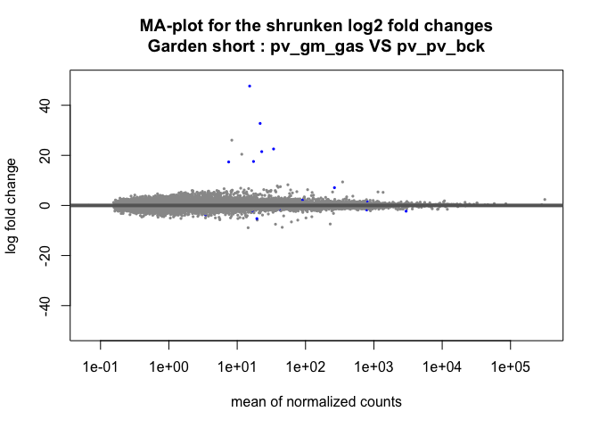
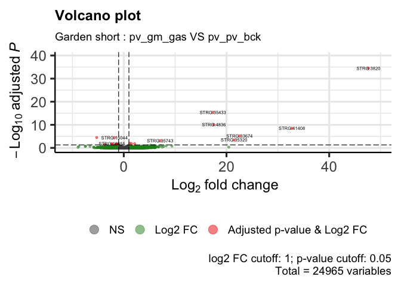
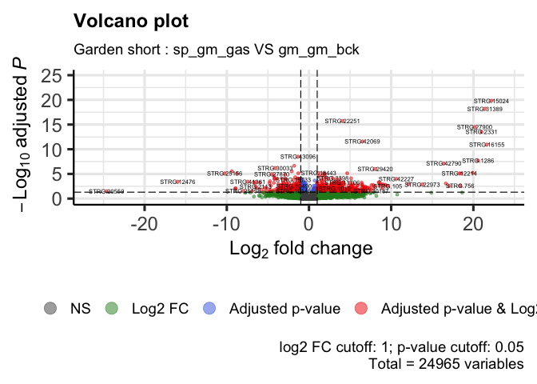
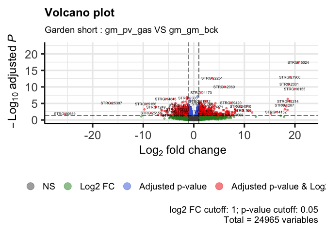
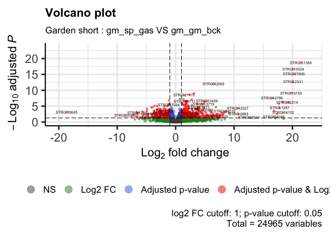

DE_Astroides_adult_gardenShort
================
Marc Meynadier
6/3/2022

``` r
# Differential expression on Kallisto data 

# Garden short 

# Packages and dependence
packageCheckClassic <- function(x){
  for( i in x ){
    #  require returns TRUE invisibly if it was able to load package
    if( ! require( i , character.only = TRUE ) ){
      #  If package was not able to be loaded then re-install
      install.packages( i , dependencies = TRUE )
      #  Load package after installing
      require( i , character.only = TRUE )
    }
  }
}

packageCheckClassic(c('DESeq2','devtools','BiocManager','ggplot2','ggrepel','pheatmap','markdown','RColorBrewer','genefilter','gplots','vegan','dplyr'))
```

    ## Le chargement a nécessité le package : DESeq2

    ## Le chargement a nécessité le package : S4Vectors

    ## Warning: le package 'S4Vectors' a été compilé avec la version R 4.1.3

    ## Le chargement a nécessité le package : stats4

    ## Le chargement a nécessité le package : BiocGenerics

    ## 
    ## Attachement du package : 'BiocGenerics'

    ## Les objets suivants sont masqués depuis 'package:stats':
    ## 
    ##     IQR, mad, sd, var, xtabs

    ## Les objets suivants sont masqués depuis 'package:base':
    ## 
    ##     anyDuplicated, append, as.data.frame, basename, cbind, colnames,
    ##     dirname, do.call, duplicated, eval, evalq, Filter, Find, get, grep,
    ##     grepl, intersect, is.unsorted, lapply, Map, mapply, match, mget,
    ##     order, paste, pmax, pmax.int, pmin, pmin.int, Position, rank,
    ##     rbind, Reduce, rownames, sapply, setdiff, sort, table, tapply,
    ##     union, unique, unsplit, which.max, which.min

    ## 
    ## Attachement du package : 'S4Vectors'

    ## Les objets suivants sont masqués depuis 'package:base':
    ## 
    ##     expand.grid, I, unname

    ## Le chargement a nécessité le package : IRanges

    ## Le chargement a nécessité le package : GenomicRanges

    ## Le chargement a nécessité le package : GenomeInfoDb

    ## Le chargement a nécessité le package : SummarizedExperiment

    ## Le chargement a nécessité le package : MatrixGenerics

    ## Le chargement a nécessité le package : matrixStats

    ## 
    ## Attachement du package : 'MatrixGenerics'

    ## Les objets suivants sont masqués depuis 'package:matrixStats':
    ## 
    ##     colAlls, colAnyNAs, colAnys, colAvgsPerRowSet, colCollapse,
    ##     colCounts, colCummaxs, colCummins, colCumprods, colCumsums,
    ##     colDiffs, colIQRDiffs, colIQRs, colLogSumExps, colMadDiffs,
    ##     colMads, colMaxs, colMeans2, colMedians, colMins, colOrderStats,
    ##     colProds, colQuantiles, colRanges, colRanks, colSdDiffs, colSds,
    ##     colSums2, colTabulates, colVarDiffs, colVars, colWeightedMads,
    ##     colWeightedMeans, colWeightedMedians, colWeightedSds,
    ##     colWeightedVars, rowAlls, rowAnyNAs, rowAnys, rowAvgsPerColSet,
    ##     rowCollapse, rowCounts, rowCummaxs, rowCummins, rowCumprods,
    ##     rowCumsums, rowDiffs, rowIQRDiffs, rowIQRs, rowLogSumExps,
    ##     rowMadDiffs, rowMads, rowMaxs, rowMeans2, rowMedians, rowMins,
    ##     rowOrderStats, rowProds, rowQuantiles, rowRanges, rowRanks,
    ##     rowSdDiffs, rowSds, rowSums2, rowTabulates, rowVarDiffs, rowVars,
    ##     rowWeightedMads, rowWeightedMeans, rowWeightedMedians,
    ##     rowWeightedSds, rowWeightedVars

    ## Le chargement a nécessité le package : Biobase

    ## Welcome to Bioconductor
    ## 
    ##     Vignettes contain introductory material; view with
    ##     'browseVignettes()'. To cite Bioconductor, see
    ##     'citation("Biobase")', and for packages 'citation("pkgname")'.

    ## 
    ## Attachement du package : 'Biobase'

    ## L'objet suivant est masqué depuis 'package:MatrixGenerics':
    ## 
    ##     rowMedians

    ## Les objets suivants sont masqués depuis 'package:matrixStats':
    ## 
    ##     anyMissing, rowMedians

    ## Le chargement a nécessité le package : devtools

    ## Le chargement a nécessité le package : usethis

    ## Le chargement a nécessité le package : BiocManager

    ## Bioconductor version '3.14' is out-of-date; the current release version '3.16'
    ##   is available with R version '4.2'; see https://bioconductor.org/install

    ## 
    ## Attachement du package : 'BiocManager'

    ## L'objet suivant est masqué depuis 'package:devtools':
    ## 
    ##     install

    ## Le chargement a nécessité le package : ggplot2

    ## Le chargement a nécessité le package : ggrepel

    ## Le chargement a nécessité le package : pheatmap

    ## Le chargement a nécessité le package : markdown

    ## Le chargement a nécessité le package : RColorBrewer

    ## Le chargement a nécessité le package : genefilter

    ## 
    ## Attachement du package : 'genefilter'

    ## Les objets suivants sont masqués depuis 'package:MatrixGenerics':
    ## 
    ##     rowSds, rowVars

    ## Les objets suivants sont masqués depuis 'package:matrixStats':
    ## 
    ##     rowSds, rowVars

    ## Le chargement a nécessité le package : gplots

    ## 
    ## Attachement du package : 'gplots'

    ## L'objet suivant est masqué depuis 'package:IRanges':
    ## 
    ##     space

    ## L'objet suivant est masqué depuis 'package:S4Vectors':
    ## 
    ##     space

    ## L'objet suivant est masqué depuis 'package:stats':
    ## 
    ##     lowess

    ## Le chargement a nécessité le package : vegan

    ## Le chargement a nécessité le package : permute

    ## 
    ## Attachement du package : 'permute'

    ## L'objet suivant est masqué depuis 'package:devtools':
    ## 
    ##     check

    ## Le chargement a nécessité le package : lattice

    ## This is vegan 2.6-2

    ## Le chargement a nécessité le package : dplyr

    ## 
    ## Attachement du package : 'dplyr'

    ## L'objet suivant est masqué depuis 'package:Biobase':
    ## 
    ##     combine

    ## L'objet suivant est masqué depuis 'package:matrixStats':
    ## 
    ##     count

    ## Les objets suivants sont masqués depuis 'package:GenomicRanges':
    ## 
    ##     intersect, setdiff, union

    ## L'objet suivant est masqué depuis 'package:GenomeInfoDb':
    ## 
    ##     intersect

    ## Les objets suivants sont masqués depuis 'package:IRanges':
    ## 
    ##     collapse, desc, intersect, setdiff, slice, union

    ## Les objets suivants sont masqués depuis 'package:S4Vectors':
    ## 
    ##     first, intersect, rename, setdiff, setequal, union

    ## Les objets suivants sont masqués depuis 'package:BiocGenerics':
    ## 
    ##     combine, intersect, setdiff, union

    ## Les objets suivants sont masqués depuis 'package:stats':
    ## 
    ##     filter, lag

    ## Les objets suivants sont masqués depuis 'package:base':
    ## 
    ##     intersect, setdiff, setequal, union

``` r
#BiocManager::install('tximport', force = TRUE)
#BiocManager::install('apeglm')
#BiocManager::install('ashr')
#BiocManager::install("EnhancedVolcano")
#BiocManager::install('limma')
#devtools::install_github('cran/GMD')
if (!require(devtools)) install.packages("devtools")
devtools::install_github("yanlinlin82/ggvenn")
```

    ## Skipping install of 'ggvenn' from a github remote, the SHA1 (306a3302) has not changed since last install.
    ##   Use `force = TRUE` to force installation

``` r
library('ggvenn')
```

    ## Le chargement a nécessité le package : grid

``` r
library('tximport')
library('apeglm')
library('ashr')
library('EnhancedVolcano')
```

    ## Registered S3 methods overwritten by 'ggalt':
    ##   method                  from   
    ##   grid.draw.absoluteGrob  ggplot2
    ##   grobHeight.absoluteGrob ggplot2
    ##   grobWidth.absoluteGrob  ggplot2
    ##   grobX.absoluteGrob      ggplot2
    ##   grobY.absoluteGrob      ggplot2

``` r
source_url("https://raw.githubusercontent.com/obigriffith/biostar-tutorials/master/Heatmaps/heatmap.3.R")
```

    ## ℹ SHA-1 hash of file is 015fc0457e61e3e93a903e69a24d96d2dac7b9fb

``` r
# Working environment 
scriptPath<-dirname(rstudioapi::getSourceEditorContext()$path)
setwd(scriptPath)
samples<-read.table('tximport_design_gardenShort.txt',header=T)
samplesBck<-read.table('tximport_design_gardenShort_bck.txt',header=T)
samplesGas<-read.table('tximport_design_gardenShort_gas.txt',header=T)
samplesGasSame<-read.table('tximport_design_gardenShort_gas_same.txt',header=T)
samplesGasDiff<-read.table('tximport_design_gardenShort_gas_diff.txt',header=T)
candidateGenes<-read.csv('candidateGenes.csv',header=T,sep=',')
dataPath<-'/Users/mmeynadier/Documents/PhD/species/Astroides/analysis/STARmapping/teixido/adult/sept2018'
outputPath<-'/Users/mmeynadier/Documents/Astroides/comparative_transcriptomics_astroides/output/DESeq2/annotatedGenome/adult/gardenShort/'
setwd(dataPath)
data<-list.files(pattern = "*ReadsPerGene.out.tab$", full.names = TRUE)
counts.files <- lapply(data, read.table, skip = 4)
raw_counts <- as.data.frame(sapply(counts.files, function(x) x[ , 4]))
data <- gsub( "Users/mmeynadier/Documents/PhD/species/Astroides/analysis/STARmapping/teixido/adult/sept2018", "", data )
data <- gsub( "_ReadsPerGene.out.tab", "", data )
data <- gsub( "./", "", data )
colnames(raw_counts) <- data
row.names(raw_counts) <- counts.files[[1]]$V1
#unusedData<-setdiff(colnames(raw_counts),samples[['samples']])
#raw_counts = raw_counts[,!(names(raw_counts) %in% unusedData),]

raw_counts_bck <- raw_counts[,grep("bck", colnames(raw_counts))] 
raw_counts_gas <- raw_counts[,grep("gas", colnames(raw_counts))] 
regexGasSame <- sub('abundance_adult_sept2018_','',samplesGasSame$samples)
regexGasSame <- sub('_[^_]*$', '', regexGasSame)
regexGasSame <- sub('_[^_]*$', '', regexGasSame)
regexGasDiff <- sub('abundance_adult_sept2018_','',samplesGasDiff$samples)
regexGasDiff <- sub('_[^_]*$', '', regexGasDiff)
regexGasDiff <- sub('_[^_]*$', '', regexGasDiff)
raw_counts_gas_same <- raw_counts[,grep(paste(regexGasSame,collapse="|"), colnames(raw_counts))] 
raw_counts_gas_diff <- raw_counts[,grep(paste(regexGasDiff,collapse="|"), colnames(raw_counts))]

# DDS object
dds<-DESeqDataSetFromMatrix(countData = raw_counts, colData = samples,design = ~originSite_finalSite_experiment)
```

    ## Warning in DESeqDataSet(se, design = design, ignoreRank): some variables in
    ## design formula are characters, converting to factors

``` r
ddsBck<-DESeqDataSetFromMatrix(countData = raw_counts_bck, colData = samplesBck,design = ~originSite_finalSite_experiment)
```

    ## Warning in DESeqDataSet(se, design = design, ignoreRank): some variables in
    ## design formula are characters, converting to factors

``` r
ddsGas<-DESeqDataSetFromMatrix(countData = raw_counts_gas, colData = samplesGas,design = ~originSite_finalSite_experiment)
```

    ## Warning in DESeqDataSet(se, design = design, ignoreRank): some variables in
    ## design formula are characters, converting to factors

``` r
ddsGasSame<-DESeqDataSetFromMatrix(countData = raw_counts_gas_same, colData = samplesGasSame,design = ~originSite_finalSite_experiment)
```

    ## Warning in DESeqDataSet(se, design = design, ignoreRank): some variables in
    ## design formula are characters, converting to factors

``` r
ddsGasDiff<-DESeqDataSetFromMatrix(countData = raw_counts_gas_diff, colData = samplesGasDiff,design = ~originSite_finalSite_experiment)
```

    ## Warning in DESeqDataSet(se, design = design, ignoreRank): some variables in
    ## design formula are characters, converting to factors

``` r
# If data from kallisto

# Data importation - txImport
#files<-paste0(samples$samples,'.tsv')
#filesBck<-paste0(samplesBck$samples,'.tsv')
#filesGas<-paste0(samplesGas$samples,'.tsv')
#filesGasSame<-paste0(samplesGasSame$samples,'.tsv')
#filesGasDiff<-paste0(samplesGasDiff$samples,'.tsv')
#names(files)<-samples$samples
#names(filesBck)<-samplesBck$samples
#names(filesGas)<-samplesGas$samples
#names(filesGasSame)<-samplesGasSame$samples
#names(filesGasDiff)<-samplesGasDiff$samples
#txi<-tximport(files = files,type='kallisto',tx2gene = tx2gene)
#txiBck<-tximport(files = filesBck,type='kallisto',tx2gene = tx2gene)
#txiGas<-tximport(files = filesGas,type='kallisto',tx2gene = tx2gene)
#txiGasSame<-tximport(files = filesGasSame,type='kallisto',tx2gene = tx2gene)
#txiGasDiff<-tximport(files = filesGasDiff,type='kallisto',tx2gene = tx2gene)
#names(txi)
#head(txi$counts)
#dds<-DESeqDataSetFromTximport(txi,colData=samples,design= ~originSite_finalSite_experiment)
#ddsBck<-DESeqDataSetFromTximport(txiBck,colData=samplesBck,design= ~originSite_finalSite_experiment)
#ddsGas<-DESeqDataSetFromTximport(txiGas,colData=samplesGas,design= ~originSite_finalSite_experiment)
#ddsGasSame<-DESeqDataSetFromTximport(txiGasSame,colData=samplesGasSame,design= ~originSite_finalSite_experiment)
#ddsGasDiff<-DESeqDataSetFromTximport(txiGasDiff,colData=samplesGasDiff,design= ~originSite_finalSite_experiment)

# pre-filtering
keep <- rowSums(counts(dds)) >= 10 
dds <- dds[keep,]
keep <- rowSums(counts(ddsBck)) >= 10 
ddsBck <- ddsBck[keep,]
keep <- rowSums(counts(ddsGas)) >= 10 
ddsGas <- ddsGas[keep,]
keep <- rowSums(counts(ddsGasSame)) >= 10 
ddsGasSame <- ddsGasSame[keep,]
keep <- rowSums(counts(ddsGasDiff)) >= 10 
ddsGasDiff <- ddsGasDiff[keep,]

# Differential expression analysis
dds<-DESeq(dds)
```

    ## estimating size factors

    ## estimating dispersions

    ## gene-wise dispersion estimates

    ## mean-dispersion relationship

    ## final dispersion estimates

    ## fitting model and testing

    ## -- replacing outliers and refitting for 23 genes
    ## -- DESeq argument 'minReplicatesForReplace' = 7 
    ## -- original counts are preserved in counts(dds)

    ## estimating dispersions

    ## fitting model and testing

``` r
ddsBck<-DESeq(ddsBck)
```

    ## estimating size factors

    ## estimating dispersions

    ## gene-wise dispersion estimates

    ## mean-dispersion relationship

    ## final dispersion estimates

    ## fitting model and testing

``` r
ddsGas<-DESeq(ddsGas)
```

    ## estimating size factors

    ## estimating dispersions

    ## gene-wise dispersion estimates

    ## mean-dispersion relationship

    ## final dispersion estimates

    ## fitting model and testing

    ## -- replacing outliers and refitting for 40 genes
    ## -- DESeq argument 'minReplicatesForReplace' = 7 
    ## -- original counts are preserved in counts(dds)

    ## estimating dispersions

    ## fitting model and testing

``` r
ddsGasSame<-DESeq(ddsGasSame)
```

    ## estimating size factors

    ## estimating dispersions

    ## gene-wise dispersion estimates

    ## mean-dispersion relationship

    ## final dispersion estimates

    ## fitting model and testing

    ## -- replacing outliers and refitting for 108 genes
    ## -- DESeq argument 'minReplicatesForReplace' = 7 
    ## -- original counts are preserved in counts(dds)

    ## estimating dispersions

    ## fitting model and testing

``` r
ddsGasDiff<-DESeq(ddsGasDiff)
```

    ## estimating size factors

    ## estimating dispersions

    ## gene-wise dispersion estimates

    ## mean-dispersion relationship

    ## final dispersion estimates

    ## fitting model and testing

    ## -- replacing outliers and refitting for 81 genes
    ## -- DESeq argument 'minReplicatesForReplace' = 7 
    ## -- original counts are preserved in counts(dds)

    ## estimating dispersions

    ## fitting model and testing

``` r
cbind(resultsNames(dds))
```

    ##       [,1]                                                    
    ##  [1,] "Intercept"                                             
    ##  [2,] "originSite_finalSite_experiment_gm_gm_gas_vs_gm_gm_bck"
    ##  [3,] "originSite_finalSite_experiment_gm_pv_gas_vs_gm_gm_bck"
    ##  [4,] "originSite_finalSite_experiment_gm_sp_gas_vs_gm_gm_bck"
    ##  [5,] "originSite_finalSite_experiment_pv_gm_gas_vs_gm_gm_bck"
    ##  [6,] "originSite_finalSite_experiment_pv_pv_bck_vs_gm_gm_bck"
    ##  [7,] "originSite_finalSite_experiment_pv_pv_gas_vs_gm_gm_bck"
    ##  [8,] "originSite_finalSite_experiment_sp_gm_gas_vs_gm_gm_bck"
    ##  [9,] "originSite_finalSite_experiment_sp_sp_bck_vs_gm_gm_bck"
    ## [10,] "originSite_finalSite_experiment_sp_sp_gas_vs_gm_gm_bck"

``` r
gm_gm_gas_VS_gm_gm_bck<-results(dds, contrast=c("originSite_finalSite_experiment","gm_gm_gas","gm_gm_bck"), alpha = 0.05)
pv_pv_gas_VS_pv_pv_bck<-results(dds, contrast=c("originSite_finalSite_experiment","pv_pv_gas","pv_pv_bck"), alpha = 0.05)
sp_sp_gas_VS_sp_sp_bck<-results(dds, contrast=c("originSite_finalSite_experiment","sp_sp_gas","sp_sp_bck"), alpha = 0.05)
pv_gm_gas_VS_pv_pv_bck<-results(dds, contrast=c("originSite_finalSite_experiment","pv_gm_gas","pv_pv_bck"), alpha = 0.05)
sp_gm_gas_VS_sp_sp_bck<-results(dds, contrast=c("originSite_finalSite_experiment","sp_gm_gas","sp_sp_bck"), alpha = 0.05)
pv_gm_gas_VS_gm_gm_bck<-results(dds, contrast=c("originSite_finalSite_experiment","pv_gm_gas","gm_gm_bck"), alpha = 0.05)
sp_gm_gas_VS_gm_gm_bck<-results(dds, contrast=c("originSite_finalSite_experiment","sp_sp_gas","gm_gm_bck"), alpha = 0.05)
gm_pv_gas_VS_pv_pv_bck<-results(dds, contrast=c("originSite_finalSite_experiment","gm_pv_gas","pv_pv_bck"), alpha = 0.05)
gm_sp_gas_VS_sp_sp_bck<-results(dds, contrast=c("originSite_finalSite_experiment","gm_sp_gas","sp_sp_bck"), alpha = 0.05)
gm_pv_gas_VS_gm_gm_bck<-results(dds, contrast=c("originSite_finalSite_experiment","gm_pv_gas","gm_gm_bck"), alpha = 0.05)
gm_sp_gas_VS_gm_gm_bck<-results(dds, contrast=c("originSite_finalSite_experiment","gm_sp_gas","gm_gm_bck"), alpha = 0.05)
summary(gm_gm_gas_VS_gm_gm_bck)
```

    ## 
    ## out of 24965 with nonzero total read count
    ## adjusted p-value < 0.05
    ## LFC > 0 (up)       : 269, 1.1%
    ## LFC < 0 (down)     : 290, 1.2%
    ## outliers [1]       : 13, 0.052%
    ## low counts [2]     : 6767, 27%
    ## (mean count < 6)
    ## [1] see 'cooksCutoff' argument of ?results
    ## [2] see 'independentFiltering' argument of ?results

``` r
summary(pv_pv_gas_VS_pv_pv_bck)
```

    ## 
    ## out of 24965 with nonzero total read count
    ## adjusted p-value < 0.05
    ## LFC > 0 (up)       : 80, 0.32%
    ## LFC < 0 (down)     : 39, 0.16%
    ## outliers [1]       : 13, 0.052%
    ## low counts [2]     : 4350, 17%
    ## (mean count < 2)
    ## [1] see 'cooksCutoff' argument of ?results
    ## [2] see 'independentFiltering' argument of ?results

``` r
summary(sp_sp_gas_VS_sp_sp_bck)
```

    ## 
    ## out of 24965 with nonzero total read count
    ## adjusted p-value < 0.05
    ## LFC > 0 (up)       : 622, 2.5%
    ## LFC < 0 (down)     : 195, 0.78%
    ## outliers [1]       : 13, 0.052%
    ## low counts [2]     : 5799, 23%
    ## (mean count < 4)
    ## [1] see 'cooksCutoff' argument of ?results
    ## [2] see 'independentFiltering' argument of ?results

``` r
summary(pv_gm_gas_VS_pv_pv_bck)
```

    ## 
    ## out of 24965 with nonzero total read count
    ## adjusted p-value < 0.05
    ## LFC > 0 (up)       : 10, 0.04%
    ## LFC < 0 (down)     : 9, 0.036%
    ## outliers [1]       : 13, 0.052%
    ## low counts [2]     : 0, 0%
    ## (mean count < 0)
    ## [1] see 'cooksCutoff' argument of ?results
    ## [2] see 'independentFiltering' argument of ?results

``` r
summary(sp_gm_gas_VS_sp_sp_bck)
```

    ## 
    ## out of 24965 with nonzero total read count
    ## adjusted p-value < 0.05
    ## LFC > 0 (up)       : 1530, 6.1%
    ## LFC < 0 (down)     : 1089, 4.4%
    ## outliers [1]       : 13, 0.052%
    ## low counts [2]     : 5799, 23%
    ## (mean count < 4)
    ## [1] see 'cooksCutoff' argument of ?results
    ## [2] see 'independentFiltering' argument of ?results

``` r
summary(pv_gm_gas_VS_gm_gm_bck)
```

    ## 
    ## out of 24965 with nonzero total read count
    ## adjusted p-value < 0.05
    ## LFC > 0 (up)       : 974, 3.9%
    ## LFC < 0 (down)     : 852, 3.4%
    ## outliers [1]       : 13, 0.052%
    ## low counts [2]     : 5318, 21%
    ## (mean count < 3)
    ## [1] see 'cooksCutoff' argument of ?results
    ## [2] see 'independentFiltering' argument of ?results

``` r
summary(sp_gm_gas_VS_gm_gm_bck)
```

    ## 
    ## out of 24965 with nonzero total read count
    ## adjusted p-value < 0.05
    ## LFC > 0 (up)       : 570, 2.3%
    ## LFC < 0 (down)     : 534, 2.1%
    ## outliers [1]       : 13, 0.052%
    ## low counts [2]     : 5318, 21%
    ## (mean count < 3)
    ## [1] see 'cooksCutoff' argument of ?results
    ## [2] see 'independentFiltering' argument of ?results

``` r
summary(gm_pv_gas_VS_pv_pv_bck)
```

    ## 
    ## out of 24965 with nonzero total read count
    ## adjusted p-value < 0.05
    ## LFC > 0 (up)       : 139, 0.56%
    ## LFC < 0 (down)     : 75, 0.3%
    ## outliers [1]       : 13, 0.052%
    ## low counts [2]     : 5799, 23%
    ## (mean count < 4)
    ## [1] see 'cooksCutoff' argument of ?results
    ## [2] see 'independentFiltering' argument of ?results

``` r
summary(gm_sp_gas_VS_sp_sp_bck)
```

    ## 
    ## out of 24965 with nonzero total read count
    ## adjusted p-value < 0.05
    ## LFC > 0 (up)       : 1095, 4.4%
    ## LFC < 0 (down)     : 862, 3.5%
    ## outliers [1]       : 13, 0.052%
    ## low counts [2]     : 5799, 23%
    ## (mean count < 4)
    ## [1] see 'cooksCutoff' argument of ?results
    ## [2] see 'independentFiltering' argument of ?results

``` r
summary(gm_pv_gas_VS_gm_gm_bck)
```

    ## 
    ## out of 24965 with nonzero total read count
    ## adjusted p-value < 0.05
    ## LFC > 0 (up)       : 961, 3.8%
    ## LFC < 0 (down)     : 1085, 4.3%
    ## outliers [1]       : 13, 0.052%
    ## low counts [2]     : 5799, 23%
    ## (mean count < 4)
    ## [1] see 'cooksCutoff' argument of ?results
    ## [2] see 'independentFiltering' argument of ?results

``` r
summary(gm_sp_gas_VS_gm_gm_bck)
```

    ## 
    ## out of 24965 with nonzero total read count
    ## adjusted p-value < 0.05
    ## LFC > 0 (up)       : 656, 2.6%
    ## LFC < 0 (down)     : 709, 2.8%
    ## outliers [1]       : 13, 0.052%
    ## low counts [2]     : 6283, 25%
    ## (mean count < 5)
    ## [1] see 'cooksCutoff' argument of ?results
    ## [2] see 'independentFiltering' argument of ?results

``` r
# Exploring the results

# Results gm_gm_gas VS gm_gm_bck

#MA-plot
DESeq2::plotMA(gm_gm_gas_VS_gm_gm_bck,ylim=c(-50,50),main="MA-plot for the shrunken log2 fold changes\nGarden short : gm_gm_gas VS gm_gm_bck")
```

<!-- -->

``` r
# Volcano plot
pCutoff = 0.05
FCcutoff = 1.0
EnhancedVolcano(data.frame(gm_gm_gas_VS_gm_gm_bck), lab = rownames(data.frame(gm_gm_gas_VS_gm_gm_bck)), x = 'log2FoldChange', y = 'padj',
                xlab = bquote(~Log[2]~ 'fold change'), ylab = bquote(~-Log[10]~adjusted~italic(P)),
                pCutoff = pCutoff, FCcutoff = FCcutoff, pointSize = 1.0, labSize = 2.0,
                title = "Volcano plot", subtitle = "Garden short : gm_gm_gas VS gm_gm_bck",
                caption = paste0('log2 FC cutoff: ', FCcutoff, '; p-value cutoff: ', pCutoff, '\nTotal = ', nrow(gm_gm_gas_VS_gm_gm_bck), ' variables'),
                legendLabels=c('NS','Log2 FC','Adjusted p-value', 'Adjusted p-value & Log2 FC'),
                legendPosition = 'bottom', legendLabSize = 14, legendIconSize = 5.0)
```

<!-- -->

``` r
# Results pv_pv_gas VS pv_pv_bck

#MA-plot
DESeq2::plotMA(pv_pv_gas_VS_pv_pv_bck,ylim=c(-50,50),main="MA-plot for the shrunken log2 fold changes\nGarden short : pv_pv_gas VS pv_pv_bck")
```

<!-- -->

``` r
# Volcano plot
EnhancedVolcano(data.frame(pv_pv_gas_VS_pv_pv_bck), lab = rownames(data.frame(pv_pv_gas_VS_pv_pv_bck)), x = 'log2FoldChange', y = 'padj',
                xlab = bquote(~Log[2]~ 'fold change'), ylab = bquote(~-Log[10]~adjusted~italic(P)),
                pCutoff = pCutoff, FCcutoff = FCcutoff, pointSize = 1.0, labSize = 2.0,
                title = "Volcano plot", subtitle = "Garden short : pv_pv_gas VS pv_pv_bck",
                caption = paste0('log2 FC cutoff: ', FCcutoff, '; p-value cutoff: ', pCutoff, '\nTotal = ', nrow(pv_pv_gas_VS_pv_pv_bck), ' variables'),
                legendLabels=c('NS','Log2 FC','Adjusted p-value', 'Adjusted p-value & Log2 FC'),
                legendPosition = 'bottom', legendLabSize = 14, legendIconSize = 5.0)
```

<!-- -->

``` r
# Results sp_sp_gas VS sp_sp_bck

#MA-plot
DESeq2::plotMA(sp_sp_gas_VS_sp_sp_bck,ylim=c(-50,50),main="MA-plot for the shrunken log2 fold changes\nGarden short : sp_sp_gas VS sp_sp_bck")
```

<!-- -->

``` r
# Volcano plot
EnhancedVolcano(data.frame(sp_sp_gas_VS_sp_sp_bck), lab = rownames(data.frame(sp_sp_gas_VS_sp_sp_bck)), x = 'log2FoldChange', y = 'padj',
                xlab = bquote(~Log[2]~ 'fold change'), ylab = bquote(~-Log[10]~adjusted~italic(P)),
                pCutoff = pCutoff, FCcutoff = FCcutoff, pointSize = 1.0, labSize = 2.0,
                title = "Volcano plot", subtitle = "Garden short : sp_sp_gas VS sp_sp_bck",
                caption = paste0('log2 FC cutoff: ', FCcutoff, '; p-value cutoff: ', pCutoff, '\nTotal = ', nrow(sp_sp_gas_VS_sp_sp_bck), ' variables'),
                legendLabels=c('NS','Log2 FC','Adjusted p-value', 'Adjusted p-value & Log2 FC'),
                legendPosition = 'bottom', legendLabSize = 14, legendIconSize = 5.0)
```

<!-- -->

``` r
# Results pv_gm_gas VS pv_pv_bck

#MA-plot
DESeq2::plotMA(pv_gm_gas_VS_pv_pv_bck,ylim=c(-50,50),main="MA-plot for the shrunken log2 fold changes\nGarden short : pv_gm_gas VS pv_pv_bck")
```

<!-- -->

``` r
# Volcano plot
EnhancedVolcano(data.frame(pv_gm_gas_VS_pv_pv_bck), lab = rownames(data.frame(pv_gm_gas_VS_pv_pv_bck)), x = 'log2FoldChange', y = 'padj',
                xlab = bquote(~Log[2]~ 'fold change'), ylab = bquote(~-Log[10]~adjusted~italic(P)),
                pCutoff = pCutoff, FCcutoff = FCcutoff, pointSize = 1.0, labSize = 2.0,
                title = "Volcano plot", subtitle = "Garden short : pv_gm_gas VS pv_pv_bck",
                caption = paste0('log2 FC cutoff: ', FCcutoff, '; p-value cutoff: ', pCutoff, '\nTotal = ', nrow(pv_gm_gas_VS_pv_pv_bck), ' variables'),
                legendLabels=c('NS','Log2 FC','Adjusted p-value', 'Adjusted p-value & Log2 FC'),
                legendPosition = 'bottom', legendLabSize = 14, legendIconSize = 5.0)
```

<!-- -->

``` r
# Results sp_gm_gas VS sp_sp_bck

#MA-plot
DESeq2::plotMA(sp_gm_gas_VS_sp_sp_bck,ylim=c(-50,50),main="MA-plot for the shrunken log2 fold changes\nGarden short : sp_gm_gas VS sp_sp_bck")
```

<!-- -->

``` r
# Volcano plot
EnhancedVolcano(data.frame(sp_gm_gas_VS_sp_sp_bck), lab = rownames(data.frame(sp_gm_gas_VS_sp_sp_bck)), x = 'log2FoldChange', y = 'padj',
                xlab = bquote(~Log[2]~ 'fold change'), ylab = bquote(~-Log[10]~adjusted~italic(P)),
                pCutoff = pCutoff, FCcutoff = FCcutoff, pointSize = 1.0, labSize = 2.0,
                title = "Volcano plot", subtitle = "Garden short : sp_gm_gas VS sp_sp_bck",
                caption = paste0('log2 FC cutoff: ', FCcutoff, '; p-value cutoff: ', pCutoff, '\nTotal = ', nrow(sp_gm_gas_VS_sp_sp_bck), ' variables'),
                legendLabels=c('NS','Log2 FC','Adjusted p-value', 'Adjusted p-value & Log2 FC'),
                legendPosition = 'bottom', legendLabSize = 14, legendIconSize = 5.0)
```

<!-- -->

``` r
# Results pv_gm_gas VS gm_gm_bck

#MA-plot
DESeq2::plotMA(pv_gm_gas_VS_gm_gm_bck,ylim=c(-50,50),main="MA-plot for the shrunken log2 fold changes\nGarden short : pv_gm_gas VS gm_gm_bck")
```

<!-- -->

``` r
# Volcano plot
EnhancedVolcano(data.frame(pv_gm_gas_VS_gm_gm_bck), lab = rownames(data.frame(pv_gm_gas_VS_gm_gm_bck)), x = 'log2FoldChange', y = 'padj',
                xlab = bquote(~Log[2]~ 'fold change'), ylab = bquote(~-Log[10]~adjusted~italic(P)),
                pCutoff = pCutoff, FCcutoff = FCcutoff, pointSize = 1.0, labSize = 2.0,
                title = "Volcano plot", subtitle = "Garden short : pv_gm_gas VS gm_gm_bck",
                caption = paste0('log2 FC cutoff: ', FCcutoff, '; p-value cutoff: ', pCutoff, '\nTotal = ', nrow(pv_gm_gas_VS_gm_gm_bck), ' variables'),
                legendLabels=c('NS','Log2 FC','Adjusted p-value', 'Adjusted p-value & Log2 FC'),
                legendPosition = 'bottom', legendLabSize = 14, legendIconSize = 5.0)
```

<!-- -->

``` r
# Results sp_gm_gas VS gm_gm_bck

#MA-plot
DESeq2::plotMA(sp_gm_gas_VS_gm_gm_bck,ylim=c(-50,50),main="MA-plot for the shrunken log2 fold changes\nGarden short : sp_gm_gas VS gm_gm_bck")
```

<!-- -->

``` r
# Volcano plot
EnhancedVolcano(data.frame(sp_gm_gas_VS_gm_gm_bck), lab = rownames(data.frame(sp_gm_gas_VS_gm_gm_bck)), x = 'log2FoldChange', y = 'padj',
                xlab = bquote(~Log[2]~ 'fold change'), ylab = bquote(~-Log[10]~adjusted~italic(P)),
                pCutoff = pCutoff, FCcutoff = FCcutoff, pointSize = 1.0, labSize = 2.0,
                title = "Volcano plot", subtitle = "Garden short : sp_gm_gas VS gm_gm_bck",
                caption = paste0('log2 FC cutoff: ', FCcutoff, '; p-value cutoff: ', pCutoff, '\nTotal = ', nrow(sp_gm_gas_VS_gm_gm_bck), ' variables'),
                legendLabels=c('NS','Log2 FC','Adjusted p-value', 'Adjusted p-value & Log2 FC'),
                legendPosition = 'bottom', legendLabSize = 14, legendIconSize = 5.0)
```

<!-- -->

``` r
# Results gm_pv_gas VS pv_pv_bck

#MA-plot
DESeq2::plotMA(gm_pv_gas_VS_pv_pv_bck,ylim=c(-50,50),main="MA-plot for the shrunken log2 fold changes\nGarden short : gm_pv_gas VS pv_pv_bck")
```

<!-- -->

``` r
# Volcano plot
EnhancedVolcano(data.frame(gm_pv_gas_VS_pv_pv_bck), lab = rownames(data.frame(gm_pv_gas_VS_pv_pv_bck)), x = 'log2FoldChange', y = 'padj',
                xlab = bquote(~Log[2]~ 'fold change'), ylab = bquote(~-Log[10]~adjusted~italic(P)),
                pCutoff = pCutoff, FCcutoff = FCcutoff, pointSize = 1.0, labSize = 2.0,
                title = "Volcano plot", subtitle = "Garden short : gm_pv_gas VS pv_pv_bck",
                caption = paste0('log2 FC cutoff: ', FCcutoff, '; p-value cutoff: ', pCutoff, '\nTotal = ', nrow(gm_pv_gas_VS_pv_pv_bck), ' variables'),
                legendLabels=c('NS','Log2 FC','Adjusted p-value', 'Adjusted p-value & Log2 FC'),
                legendPosition = 'bottom', legendLabSize = 14, legendIconSize = 5.0)
```

<!-- -->

``` r
# Results gm_sp_gas VS sp_sp_bck

#MA-plot
DESeq2::plotMA(gm_sp_gas_VS_sp_sp_bck,ylim=c(-50,50),main="MA-plot for the shrunken log2 fold changes\nGarden short : gm_sp_gas VS sp_sp_bck")
```

<!-- -->

``` r
# Volcano plot
EnhancedVolcano(data.frame(gm_sp_gas_VS_sp_sp_bck), lab = rownames(data.frame(gm_sp_gas_VS_sp_sp_bck)), x = 'log2FoldChange', y = 'padj',
                xlab = bquote(~Log[2]~ 'fold change'), ylab = bquote(~-Log[10]~adjusted~italic(P)),
                pCutoff = pCutoff, FCcutoff = FCcutoff, pointSize = 1.0, labSize = 2.0,
                title = "Volcano plot", subtitle = "Garden short : gm_sp_gas VS sp_sp_bck",
                caption = paste0('log2 FC cutoff: ', FCcutoff, '; p-value cutoff: ', pCutoff, '\nTotal = ', nrow(gm_sp_gas_VS_sp_sp_bck), ' variables'),
                legendLabels=c('NS','Log2 FC','Adjusted p-value', 'Adjusted p-value & Log2 FC'),
                legendPosition = 'bottom', legendLabSize = 14, legendIconSize = 5.0)
```

<!-- -->

``` r
# Results gm_pv_gas VS gm_gm_bck

#MA-plot
DESeq2::plotMA(gm_pv_gas_VS_gm_gm_bck,ylim=c(-50,50),main="MA-plot for the shrunken log2 fold changes\nGarden short : gm_pv_gas VS gm_gm_bck")
```

<!-- -->

``` r
# Volcano plot
EnhancedVolcano(data.frame(gm_pv_gas_VS_gm_gm_bck), lab = rownames(data.frame(gm_pv_gas_VS_gm_gm_bck)), x = 'log2FoldChange', y = 'padj',
                xlab = bquote(~Log[2]~ 'fold change'), ylab = bquote(~-Log[10]~adjusted~italic(P)),
                pCutoff = pCutoff, FCcutoff = FCcutoff, pointSize = 1.0, labSize = 2.0,
                title = "Volcano plot", subtitle = "Garden short : gm_pv_gas VS gm_gm_bck",
                caption = paste0('log2 FC cutoff: ', FCcutoff, '; p-value cutoff: ', pCutoff, '\nTotal = ', nrow(gm_pv_gas_VS_gm_gm_bck), ' variables'),
                legendLabels=c('NS','Log2 FC','Adjusted p-value', 'Adjusted p-value & Log2 FC'),
                legendPosition = 'bottom', legendLabSize = 14, legendIconSize = 5.0)
```

<!-- -->

``` r
# Results gm_sp_gas VS gm_gm_bck

#MA-plot
DESeq2::plotMA(gm_sp_gas_VS_gm_gm_bck,ylim=c(-50,50),main="MA-plot for the shrunken log2 fold changes\nGarden short : gm_sp_gas VS gm_gm_bck")
```

<!-- -->

``` r
# Volcano plot
EnhancedVolcano(data.frame(gm_sp_gas_VS_gm_gm_bck), lab = rownames(data.frame(gm_sp_gas_VS_gm_gm_bck)), x = 'log2FoldChange', y = 'padj',
                xlab = bquote(~Log[2]~ 'fold change'), ylab = bquote(~-Log[10]~adjusted~italic(P)),
                pCutoff = pCutoff, FCcutoff = FCcutoff, pointSize = 1.0, labSize = 2.0,
                title = "Volcano plot", subtitle = "Garden short : gm_sp_gas VS gm_gm_bck",
                caption = paste0('log2 FC cutoff: ', FCcutoff, '; p-value cutoff: ', pCutoff, '\nTotal = ', nrow(gm_sp_gas_VS_gm_gm_bck), ' variables'),
                legendLabels=c('NS','Log2 FC','Adjusted p-value', 'Adjusted p-value & Log2 FC'),
                legendPosition = 'bottom', legendLabSize = 14, legendIconSize = 5.0)
```

<!-- -->

``` r
# Principal Component Analysis

# Global
vsd = vst(dds,blind=T)

mat <- assay(vsd)
mm <- model.matrix(~originSite_finalSite_experiment,colData(vsd))
mat<-limma::removeBatchEffect(mat,batch1=vsd$originSite_finalSite_experiment,design=mm)
assay(vsd)<-mat

pcaData = plotPCA(vsd, intgroup="originSite_finalSite_experiment", 
                  returnData=TRUE)
percentVar = round(100 * attr(pcaData, "percentVar"))

ggplot(pcaData, aes(PC1, PC2, fill = originSite_finalSite_experiment)) + 
  geom_point(color="black",pch=21, size=5) + theme_bw() +
  scale_fill_manual(values = c("#ff9999","#ffb380","#990000","#ff3300","#008000","#bfff80","#99ff99","#000099","#9999ff","#99ebff")) +
  #ggtitle("Principal Component Analysis of adult corals", subtitle = "may2018 dataset") +
  theme(text = element_text(size=14), legend.position = 'bottom') +
  theme(legend.title=element_blank()) +
  xlab(paste0("PC1: ",percentVar[1],"% variance")) +
  ylab(paste0("PC2: ",percentVar[2],"% variance")) 
```

<!-- -->

``` r
# Background 
vsdBck = vst(ddsBck,blind=T)

mat <- assay(vsdBck)
mm <- model.matrix(~originSite_finalSite_experiment,colData(vsdBck))
mat<-limma::removeBatchEffect(mat,batch1=vsdBck$originSite_finalSite_experiment,design=mm)
assay(vsdBck)<-mat

pcaData = plotPCA(vsdBck, intgroup="originSite_finalSite_experiment", 
                  returnData=TRUE)
percentVar = round(100 * attr(pcaData, "percentVar"))

ggplot(pcaData, aes(PC1, PC2, colour = originSite_finalSite_experiment)) + 
  geom_point(size = 5) + theme_bw() + 
  scale_color_manual(values = c("#ff4040", "#00008B","#6495ED")) +
  geom_point() +
  ggtitle("Principal Component Analysis of adult corals", subtitle = "sept2018 dataset - Background subset") +
  theme(text = element_text(size=14),legend.text = element_text(size=12), legend.position = 'bottom') +
  xlab(paste0("PC1: ",percentVar[1],"% variance")) +
  ylab(paste0("PC2: ",percentVar[2],"% variance"))
```

<!-- -->

``` r
# Garden short 
vsdGas = vst(ddsGas,blind=T)

mat <- assay(vsdGas)
mm <- model.matrix(~originSite_finalSite_experiment,colData(vsdGas))
mat<-limma::removeBatchEffect(mat,batch1=vsdGas$originSite_finalSite_experiment,design=mm)
assay(vsdGas)<-mat

pcaData = plotPCA(vsdGas, intgroup="originSite_finalSite_experiment", 
                  returnData=TRUE)
percentVar = round(100 * attr(pcaData, "percentVar"))

ggplot(pcaData, aes(PC1, PC2, colour = originSite_finalSite_experiment)) + 
  geom_point(size = 5) + theme_bw() + 
  geom_point() +
  ggtitle("Principal Component Analysis of adult corals", subtitle = "sept2018 dataset - Garden short same sites") +
  theme(text = element_text(size=14),legend.text = element_text(size=12), legend.position = 'bottom') +
  xlab(paste0("PC1: ",percentVar[1],"% variance")) +
  ylab(paste0("PC2: ",percentVar[2],"% variance")) 
```

<!-- -->

``` r
# Garden short - Same sites
vsdGasSame = vst(ddsGasSame,blind=T)

mat <- assay(vsdGasSame)
mm <- model.matrix(~originSite_finalSite_experiment,colData(vsdGasSame))
mat<-limma::removeBatchEffect(mat,batch1=vsdGasSame$originSite_finalSite_experiment,design=mm)
assay(vsdGasSame)<-mat

pcaData = plotPCA(vsdGasSame, intgroup="originSite_finalSite_experiment", 
                  returnData=TRUE)
percentVar = round(100 * attr(pcaData, "percentVar"))

ggplot(pcaData, aes(PC1, PC2, colour = originSite_finalSite_experiment)) + 
  geom_point(size = 5) + theme_bw() + 
  scale_color_manual(values = c("#ff4040", "#00008B","#6495ED")) +
  geom_point() +
  ggtitle("Principal Component Analysis of adult corals", subtitle = "sept2018 dataset - Garden short same sites") +
  theme(text = element_text(size=14),legend.text = element_text(size=12), legend.position = 'bottom') +
  xlab(paste0("PC1: ",percentVar[1],"% variance")) +
  ylab(paste0("PC2: ",percentVar[2],"% variance")) 
```

<!-- -->

``` r
# Garden short - Different sites
vsdGasDiff = vst(ddsGasDiff,blind=T)

mat <- assay(vsdGasDiff)
mm <- model.matrix(~originSite_finalSite_experiment,colData(vsdGasDiff))
mat<-limma::removeBatchEffect(mat,batch1=vsdGasDiff$originSite_finalSite_experiment,design=mm)
assay(vsdGasDiff)<-mat

pcaData = plotPCA(vsdGasDiff, intgroup="originSite_finalSite_experiment", 
                  returnData=TRUE)
percentVar = round(100 * attr(pcaData, "percentVar"))

ggplot(pcaData, aes(PC1, PC2, colour = originSite_finalSite_experiment)) + 
  geom_point(size = 5) + theme_bw() + 
  scale_color_manual(values = c("#F36161", "#AD1C03","#00008B","#6495ED")) +
  geom_point() +
  ggtitle("Principal Component Analysis of adult corals", subtitle = "sept2018 dataset - Garden short different sites") +
  theme(text = element_text(size=14),legend.text = element_text(size=10), legend.title = element_text(size=10),legend.position = 'bottom') +
  xlab(paste0("PC1: ",percentVar[1],"% variance")) +
  ylab(paste0("PC2: ",percentVar[2],"% variance")) 
```

<!-- -->

``` r
# Venn diagramm 

# gas VS bck diagramm 1
resOrdered_gm_gm_gas_VS_gm_gm_bck <- gm_gm_gas_VS_gm_gm_bck[order(gm_gm_gas_VS_gm_gm_bck$padj),]
resOrderedDF_gm_gm_gas_VS_gm_gm_bck <- as.data.frame(resOrdered_gm_gm_gas_VS_gm_gm_bck)
resOrderedDF_gm_gm_gas_VS_gm_gm_bck_venn <- filter(resOrderedDF_gm_gm_gas_VS_gm_gm_bck,padj < 0.05)
resOrderedDF_gm_gm_gas_VS_gm_gm_bck_venn <- list(rownames(resOrderedDF_gm_gm_gas_VS_gm_gm_bck_venn))
resOrderedDF_gm_gm_gas_VS_gm_gm_bck_venn <- unlist(resOrderedDF_gm_gm_gas_VS_gm_gm_bck_venn)

resOrdered_pv_pv_gas_VS_pv_pv_bck <- pv_pv_gas_VS_pv_pv_bck[order(pv_pv_gas_VS_pv_pv_bck$padj),]
resOrderedDF_pv_pv_gas_VS_pv_pv_bck <- as.data.frame(resOrdered_pv_pv_gas_VS_pv_pv_bck)
resOrderedDF_pv_pv_gas_VS_pv_pv_bck_venn <- filter(resOrderedDF_pv_pv_gas_VS_pv_pv_bck,padj < 0.05)
resOrderedDF_pv_pv_gas_VS_pv_pv_bck_venn <- list(rownames(resOrderedDF_pv_pv_gas_VS_pv_pv_bck_venn))
resOrderedDF_pv_pv_gas_VS_pv_pv_bck_venn <- unlist(resOrderedDF_pv_pv_gas_VS_pv_pv_bck_venn)

resOrdered_sp_sp_gas_VS_sp_sp_bck <- sp_sp_gas_VS_sp_sp_bck[order(sp_sp_gas_VS_sp_sp_bck$padj),]
resOrderedDF_sp_sp_gas_VS_sp_sp_bck <- as.data.frame(resOrdered_sp_sp_gas_VS_sp_sp_bck)
resOrderedDF_sp_sp_gas_VS_sp_sp_bck_venn <- filter(resOrderedDF_sp_sp_gas_VS_sp_sp_bck,padj < 0.05)
resOrderedDF_sp_sp_gas_VS_sp_sp_bck_venn <- list(rownames(resOrderedDF_sp_sp_gas_VS_sp_sp_bck_venn))
resOrderedDF_sp_sp_gas_VS_sp_sp_bck_venn <- unlist(resOrderedDF_sp_sp_gas_VS_sp_sp_bck_venn)

x = list('gm_gm_gas VS gm_gm_bck' = resOrderedDF_gm_gm_gas_VS_gm_gm_bck_venn, 'pv_pv_gas VS pv_pv_bck' = resOrderedDF_pv_pv_gas_VS_pv_pv_bck_venn, 'sp_sp_gas VS sp_sp_bck' = resOrderedDF_sp_sp_gas_VS_sp_sp_bck_venn)

ggvenn(
  x, 
  fill_color = c("#0073C2FF", "#EFC000FF", "#868686FF"),
  stroke_size = 0.5, set_name_size = 4
)
```

<!-- -->

``` r
# gas VS bck diagramm 2
resOrdered_pv_gm_gas_VS_pv_pv_bck <- pv_gm_gas_VS_pv_pv_bck[order(pv_gm_gas_VS_pv_pv_bck$padj),]
resOrderedDF_pv_gm_gas_VS_pv_pv_bck <- as.data.frame(resOrdered_pv_gm_gas_VS_pv_pv_bck)
resOrderedDF_pv_gm_gas_VS_pv_pv_bck_venn <- filter(resOrderedDF_pv_gm_gas_VS_pv_pv_bck,padj < 0.05)
resOrderedDF_pv_gm_gas_VS_pv_pv_bck_venn <- list(rownames(resOrderedDF_pv_gm_gas_VS_pv_pv_bck_venn))
resOrderedDF_pv_gm_gas_VS_pv_pv_bck_venn <- unlist(resOrderedDF_pv_gm_gas_VS_pv_pv_bck_venn)

resOrdered_sp_gm_gas_VS_sp_sp_bck <- sp_gm_gas_VS_sp_sp_bck[order(sp_gm_gas_VS_sp_sp_bck$padj),]
resOrderedDF_sp_gm_gas_VS_sp_sp_bck <- as.data.frame(resOrdered_sp_gm_gas_VS_sp_sp_bck)
resOrderedDF_sp_gm_gas_VS_sp_sp_bck_venn <- filter(resOrderedDF_sp_gm_gas_VS_sp_sp_bck,padj < 0.05)
resOrderedDF_sp_gm_gas_VS_sp_sp_bck_venn <- list(rownames(resOrderedDF_sp_gm_gas_VS_sp_sp_bck_venn))
resOrderedDF_sp_gm_gas_VS_sp_sp_bck_venn <- unlist(resOrderedDF_sp_gm_gas_VS_sp_sp_bck_venn)

resOrdered_pv_gm_gas_VS_gm_gm_bck <- pv_gm_gas_VS_gm_gm_bck[order(pv_gm_gas_VS_gm_gm_bck$padj),]
resOrderedDF_pv_gm_gas_VS_gm_gm_bck <- as.data.frame(resOrdered_pv_gm_gas_VS_gm_gm_bck)
resOrderedDF_pv_gm_gas_VS_gm_gm_bck_venn <- filter(resOrderedDF_pv_gm_gas_VS_gm_gm_bck,padj < 0.05)
resOrderedDF_pv_gm_gas_VS_gm_gm_bck_venn <- list(rownames(resOrderedDF_pv_gm_gas_VS_gm_gm_bck_venn))
resOrderedDF_pv_gm_gas_VS_gm_gm_bck_venn <- unlist(resOrderedDF_pv_gm_gas_VS_gm_gm_bck_venn)

resOrdered_sp_gm_gas_VS_gm_gm_bck <- sp_gm_gas_VS_gm_gm_bck[order(sp_gm_gas_VS_gm_gm_bck$padj),]
resOrderedDF_sp_gm_gas_VS_gm_gm_bck <- as.data.frame(resOrdered_sp_gm_gas_VS_gm_gm_bck)
resOrderedDF_sp_gm_gas_VS_gm_gm_bck_venn <- filter(resOrderedDF_sp_gm_gas_VS_gm_gm_bck,padj < 0.05)
resOrderedDF_sp_gm_gas_VS_gm_gm_bck_venn <- list(rownames(resOrderedDF_sp_gm_gas_VS_gm_gm_bck_venn))
resOrderedDF_sp_gm_gas_VS_gm_gm_bck_venn <- unlist(resOrderedDF_sp_gm_gas_VS_gm_gm_bck_venn)

x = list('pv_gm_gas\nVS       \npv_pv_bck' = resOrderedDF_pv_gm_gas_VS_pv_pv_bck_venn, 'sp_gm_gas VS sp_sp_bck' = resOrderedDF_sp_gm_gas_VS_sp_sp_bck_venn, 
         'pv_gm_gas VS gm_gm_bck' = resOrderedDF_pv_gm_gas_VS_gm_gm_bck_venn, 'sp_gm_gas\n        VS\ngm_gm_bck' = resOrderedDF_sp_gm_gas_VS_gm_gm_bck_venn)

ggvenn(
  x, 
  fill_color = c("#0073C2FF", "#EFC000FF", "#868686FF","#009E73"),
  stroke_size = 0.5, set_name_size = 4
)
```

<!-- -->

``` r
# gas VS bck diagramm 3
resOrdered_gm_pv_gas_VS_pv_pv_bck <- gm_pv_gas_VS_pv_pv_bck[order(gm_pv_gas_VS_pv_pv_bck$padj),]
resOrderedDF_gm_pv_gas_VS_pv_pv_bck <- as.data.frame(resOrdered_gm_pv_gas_VS_pv_pv_bck)
resOrderedDF_gm_pv_gas_VS_pv_pv_bck_venn <- filter(resOrderedDF_gm_pv_gas_VS_pv_pv_bck,padj < 0.05)
resOrderedDF_gm_pv_gas_VS_pv_pv_bck_venn <- list(rownames(resOrderedDF_gm_pv_gas_VS_pv_pv_bck_venn))
resOrderedDF_gm_pv_gas_VS_pv_pv_bck_venn <- unlist(resOrderedDF_gm_pv_gas_VS_pv_pv_bck_venn)

resOrdered_gm_sp_gas_VS_sp_sp_bck <- gm_sp_gas_VS_sp_sp_bck[order(gm_sp_gas_VS_sp_sp_bck$padj),]
resOrderedDF_gm_sp_gas_VS_sp_sp_bck <- as.data.frame(resOrdered_gm_sp_gas_VS_sp_sp_bck)
resOrderedDF_gm_sp_gas_VS_sp_sp_bck_venn <- filter(resOrderedDF_gm_sp_gas_VS_sp_sp_bck,padj < 0.05)
resOrderedDF_gm_sp_gas_VS_sp_sp_bck_venn <- list(rownames(resOrderedDF_gm_sp_gas_VS_sp_sp_bck_venn))
resOrderedDF_gm_sp_gas_VS_sp_sp_bck_venn <- unlist(resOrderedDF_gm_sp_gas_VS_sp_sp_bck_venn)

resOrdered_gm_pv_gas_VS_gm_gm_bck <- gm_pv_gas_VS_gm_gm_bck[order(gm_pv_gas_VS_gm_gm_bck$padj),]
resOrderedDF_gm_pv_gas_VS_gm_gm_bck <- as.data.frame(resOrdered_gm_pv_gas_VS_gm_gm_bck)
resOrderedDF_gm_pv_gas_VS_gm_gm_bck_venn <- filter(resOrderedDF_gm_pv_gas_VS_gm_gm_bck,padj < 0.05)
resOrderedDF_gm_pv_gas_VS_gm_gm_bck_venn <- list(rownames(resOrderedDF_gm_pv_gas_VS_gm_gm_bck_venn))
resOrderedDF_gm_pv_gas_VS_gm_gm_bck_venn <- unlist(resOrderedDF_gm_pv_gas_VS_gm_gm_bck_venn)

resOrdered_gm_sp_gas_VS_gm_gm_bck <- gm_sp_gas_VS_gm_gm_bck[order(gm_sp_gas_VS_gm_gm_bck$padj),]
resOrderedDF_gm_sp_gas_VS_gm_gm_bck <- as.data.frame(resOrdered_gm_sp_gas_VS_gm_gm_bck)
resOrderedDF_gm_sp_gas_VS_gm_gm_bck_venn <- filter(resOrderedDF_gm_sp_gas_VS_gm_gm_bck,padj < 0.05)
resOrderedDF_gm_sp_gas_VS_gm_gm_bck_venn <- list(rownames(resOrderedDF_gm_sp_gas_VS_gm_gm_bck_venn))
resOrderedDF_gm_sp_gas_VS_gm_gm_bck_venn <- unlist(resOrderedDF_gm_sp_gas_VS_gm_gm_bck_venn)

x = list('gm_pv_gas\nVS       \npv_pv_bck' = resOrderedDF_gm_pv_gas_VS_pv_pv_bck_venn, 'gm_sp_gas VS sp_sp_bck' = resOrderedDF_gm_sp_gas_VS_sp_sp_bck_venn, 
         'gm_pv_gas VS gm_gm_bck' = resOrderedDF_gm_pv_gas_VS_gm_gm_bck_venn, 'gm_sp_gas\n        VS\ngm_gm_bck' = resOrderedDF_gm_sp_gas_VS_gm_gm_bck_venn)

ggvenn(
  x, 
  fill_color = c("#0073C2FF", "#EFC000FF", "#868686FF","#009E73"),
  stroke_size = 0.5, set_name_size = 4
)
```

<!-- -->

``` r
# Candidate genes heatmap

# Global

listGenes <- candidateGenes$genes
listGenes <- gsub("^([^.]*.[^.]*).*$", "\\1", listGenes)
listGenes <- unique(listGenes)
listGenes2 <- which(rownames(vsd) %in% listGenes)
index <- which(listGenes %in% rownames(vsd))
candidateGenes2 <- candidateGenes[index, ] 
listProt <- candidateGenes2$pfam_annotation
listGenes3 <- candidateGenes2$genes
listGenes3 <- gsub("^([^.]*.[^.]*).*$", "\\1", listGenes3)

removeGenes = c("STRG.37944","STRG.35059")
indexRemoveGenes = which(listGenes3 %in% removeGenes)
listProt <- listProt[-indexRemoveGenes]
listGenes3 <- listGenes3[! listGenes3 %in% c("STRG.37944","STRG.35059")]

vsdCandidate <- vsd[listGenes3, ]

labColName <- samples$originSite_finalSite_experiment
colnames(vsdCandidate) <- labColName
rownames(vsdCandidate) <- paste(listProt,listGenes3,sep=" - ")

topVarGenesVsd <- order(rowVars(assay(vsdCandidate)), decreasing=TRUE)
assayVsdCandidate<-unique(assay(vsdCandidate))
pheatmap(assayVsdCandidate)
```

<!-- -->

``` r
pheatmap(assayVsdCandidate,scale = "row")
```

<!-- -->

``` r
# Background

listGenes <- candidateGenes$genes
listGenes <- gsub("^([^.]*.[^.]*).*$", "\\1", listGenes)
listGenes <- unique(listGenes)
listGenes2 <- which(rownames(vsdBck) %in% listGenes)
index <- which(listGenes %in% rownames(vsdBck))
candidateGenes2 <- candidateGenes[index, ] 
listProt <- candidateGenes2$pfam_annotation
listGenes3 <- candidateGenes2$genes
listGenes3 <- gsub("^([^.]*.[^.]*).*$", "\\1", listGenes3)

removeGenes = c("STRG.37944","STRG.35059","STRG.40389","STRG.14728","STRG.43478")
indexRemoveGenes = which(listGenes3 %in% removeGenes)
listProt <- listProt[-indexRemoveGenes]
listGenes3 <- listGenes3[! listGenes3 %in% c("STRG.37944","STRG.35059","STRG.40389","STRG.14728","STRG.43478")]

vsdCandidate <- vsdBck[listGenes3, ]

labColName <- samplesBck$originSite_finalSite_experiment
colnames(vsdCandidate) <- labColName
rownames(vsdCandidate) <- paste(listProt,listGenes3,sep=" - ")

topVarGenesVsd <- order(rowVars(assay(vsdCandidate)), decreasing=TRUE)
assayVsdCandidate<-unique(assay(vsdCandidate))
pheatmap(assayVsdCandidate)
```

<!-- -->

``` r
pheatmap(assayVsdCandidate,scale = "row")
```

<!-- -->

``` r
# Garden short

listGenes <- candidateGenes$genes
listGenes <- gsub("^([^.]*.[^.]*).*$", "\\1", listGenes)
listGenes <- unique(listGenes)
listGenes2 <- which(rownames(vsdGas) %in% listGenes)
index <- which(listGenes %in% rownames(vsdGas))
candidateGenes2 <- candidateGenes[index, ] 
listProt <- candidateGenes2$pfam_annotation
listGenes3 <- candidateGenes2$genes
listGenes3 <- gsub("^([^.]*.[^.]*).*$", "\\1", listGenes3)

removeGenes = c("STRG.37944","STRG.35059")
indexRemoveGenes = which(listGenes3 %in% removeGenes)
listProt <- listProt[-indexRemoveGenes]
listGenes3 <- listGenes3[! listGenes3 %in% c("STRG.37944","STRG.35059")]

vsdCandidate <- vsdGas[listGenes3, ]

labColName <- samplesGas$originSite_finalSite_experiment
colnames(vsdCandidate) <- labColName
rownames(vsdCandidate) <- paste(listProt,listGenes3,sep=" - ")

topVarGenesVsd <- order(rowVars(assay(vsdCandidate)), decreasing=TRUE)
assayVsdCandidate<-unique(assay(vsdCandidate))
pheatmap(assayVsdCandidate)
```

<!-- -->

``` r
pheatmap(assayVsdCandidate,scale = "row")
```

<!-- -->

``` r
# Garden short - Same sites

listGenes <- candidateGenes$genes
listGenes <- gsub("^([^.]*.[^.]*).*$", "\\1", listGenes)
listGenes <- unique(listGenes)
listGenes2 <- which(rownames(vsdGasSame) %in% listGenes)
index <- which(listGenes %in% rownames(vsdGasSame))
candidateGenes2 <- candidateGenes[index, ] 
listProt <- candidateGenes2$pfam_annotation
listGenes3 <- candidateGenes2$genes
listGenes3 <- gsub("^([^.]*.[^.]*).*$", "\\1", listGenes3)

removeGenes = c("STRG.37944","STRG.35059","STRG.43478")
indexRemoveGenes = which(listGenes3 %in% removeGenes)
listProt <- listProt[-indexRemoveGenes]
listGenes3 <- listGenes3[! listGenes3 %in% c("STRG.37944","STRG.35059","STRG.43478")]

vsdCandidate <- vsdGasSame[listGenes3, ]

labColName <- samplesGasSame$originSite_finalSite_experiment
colnames(vsdCandidate) <- labColName
rownames(vsdCandidate) <- paste(listProt,listGenes3,sep=" - ")

topVarGenesVsd <- order(rowVars(assay(vsdCandidate)), decreasing=TRUE)
assayVsdCandidate<-unique(assay(vsdCandidate))
pheatmap(assayVsdCandidate)
```

<!-- -->

``` r
pheatmap(assayVsdCandidate,scale = "row")
```

<!-- -->

``` r
# Garden short - Different sites

listGenes <- candidateGenes$genes
listGenes <- gsub("^([^.]*.[^.]*).*$", "\\1", listGenes)
listGenes <- unique(listGenes)
listGenes2 <- which(rownames(vsdGasDiff) %in% listGenes)
index <- which(listGenes %in% rownames(vsdGasDiff))
candidateGenes2 <- candidateGenes[index, ] 
listProt <- candidateGenes2$pfam_annotation
listGenes3 <- candidateGenes2$genes
listGenes3 <- gsub("^([^.]*.[^.]*).*$", "\\1", listGenes3)

removeGenes = c("STRG.37944","STRG.35059")
indexRemoveGenes = which(listGenes3 %in% removeGenes)
listProt <- listProt[-indexRemoveGenes]
listGenes3 <- listGenes3[! listGenes3 %in% c("STRG.37944","STRG.35059")]

vsdCandidate <- vsdGasDiff[listGenes3, ]

labColName <- samplesGasDiff$originSite_finalSite_experiment
colnames(vsdCandidate) <- labColName
rownames(vsdCandidate) <- paste(listProt,listGenes3,sep=" - ")

topVarGenesVsd <- order(rowVars(assay(vsdCandidate)), decreasing=TRUE)
assayVsdCandidate<-unique(assay(vsdCandidate))
pheatmap(assayVsdCandidate)
```

<!-- -->

``` r
pheatmap(assayVsdCandidate,scale = "row")
```

<!-- -->

``` r
# Inferences statistics

# Background
count_tab_assay <- assay(vsdBck)
dist_tab_assay <- dist(t(count_tab_assay),method="euclidian")
adonis(data=samplesBck,dist_tab_assay ~ originSite_finalSite_experiment, method="euclidian")
```

    ## 'adonis' will be deprecated: use 'adonis2' instead

    ## $aov.tab
    ## Permutation: free
    ## Number of permutations: 999
    ## 
    ## Terms added sequentially (first to last)
    ## 
    ##                                 Df SumsOfSqs MeanSqs F.Model      R2 Pr(>F)   
    ## originSite_finalSite_experiment  2     16056  8028.0  1.4914 0.33206  0.003 **
    ## Residuals                        6     32296  5382.7         0.66794          
    ## Total                            8     48352                 1.00000          
    ## ---
    ## Signif. codes:  0 '***' 0.001 '**' 0.01 '*' 0.05 '.' 0.1 ' ' 1
    ## 
    ## $call
    ## adonis(formula = dist_tab_assay ~ originSite_finalSite_experiment, 
    ##     data = samplesBck, method = "euclidian")
    ## 
    ## $coefficients
    ## NULL
    ## 
    ## $coef.sites
    ##                                       [,1]       [,2]      [,3]      [,4]
    ## (Intercept)                       92.51308  90.759146 128.86613  94.88429
    ## originSite_finalSite_experiment1 -12.55372 -13.218064 -35.37539  22.71326
    ## originSite_finalSite_experiment2   6.45251   8.731256  14.83563 -29.77588
    ##                                       [,5]      [,6]      [,7]     [,8]
    ## (Intercept)                       91.52251  91.05757 89.460515 89.89302
    ## originSite_finalSite_experiment1  23.30576  18.67438 25.805920 21.29418
    ## originSite_finalSite_experiment2 -32.61540 -30.25092  6.027758 10.68220
    ##                                      [,9]
    ## (Intercept)                      94.62011
    ## originSite_finalSite_experiment1 22.19239
    ## originSite_finalSite_experiment2 14.72957
    ## 
    ## $f.perms
    ##              [,1]
    ##    [1,] 1.0031543
    ##    [2,] 0.9582218
    ##    [3,] 1.0061391
    ##    [4,] 0.9754447
    ##    [5,] 0.9182371
    ##    [6,] 0.8907751
    ##    [7,] 1.1291042
    ##    [8,] 0.9497712
    ##    [9,] 1.0135533
    ##   [10,] 1.2373505
    ##   [11,] 1.0514093
    ##   [12,] 1.2825490
    ##   [13,] 0.9789792
    ##   [14,] 0.9803757
    ##   [15,] 0.9103247
    ##   [16,] 1.1738952
    ##   [17,] 0.8086812
    ##   [18,] 1.0536805
    ##   [19,] 0.8284223
    ##   [20,] 1.1310461
    ##   [21,] 0.9823467
    ##   [22,] 1.1820042
    ##   [23,] 1.0031589
    ##   [24,] 0.8706518
    ##   [25,] 0.8699922
    ##   [26,] 1.0411635
    ##   [27,] 0.9263108
    ##   [28,] 1.1310461
    ##   [29,] 0.8538809
    ##   [30,] 0.8494430
    ##   [31,] 1.0319291
    ##   [32,] 1.0438613
    ##   [33,] 0.8968733
    ##   [34,] 0.9550413
    ##   [35,] 1.0708382
    ##   [36,] 1.0835334
    ##   [37,] 0.9711207
    ##   [38,] 1.1049869
    ##   [39,] 0.9978668
    ##   [40,] 0.9992354
    ##   [41,] 0.9606346
    ##   [42,] 1.0875891
    ##   [43,] 1.2468443
    ##   [44,] 1.1713741
    ##   [45,] 1.0037386
    ##   [46,] 0.9711207
    ##   [47,] 1.2178623
    ##   [48,] 1.0419524
    ##   [49,] 0.9504162
    ##   [50,] 1.1820042
    ##   [51,] 1.0715250
    ##   [52,] 0.9034383
    ##   [53,] 0.7421402
    ##   [54,] 0.7241438
    ##   [55,] 1.3797287
    ##   [56,] 1.0025739
    ##   [57,] 0.9803757
    ##   [58,] 0.7894957
    ##   [59,] 1.0872623
    ##   [60,] 1.0010344
    ##   [61,] 1.0135533
    ##   [62,] 1.1585280
    ##   [63,] 1.0031589
    ##   [64,] 0.8298307
    ##   [65,] 0.9877210
    ##   [66,] 1.0705298
    ##   [67,] 1.0319291
    ##   [68,] 0.8501693
    ##   [69,] 1.1133580
    ##   [70,] 1.0006130
    ##   [71,] 1.1092136
    ##   [72,] 0.8632084
    ##   [73,] 0.8098618
    ##   [74,] 0.8919761
    ##   [75,] 0.8043612
    ##   [76,] 0.8599814
    ##   [77,] 1.0159004
    ##   [78,] 1.1613294
    ##   [79,] 0.9252387
    ##   [80,] 1.2887952
    ##   [81,] 1.1002920
    ##   [82,] 0.9496872
    ##   [83,] 0.8632084
    ##   [84,] 1.0835334
    ##   [85,] 0.8447670
    ##   [86,] 1.0159004
    ##   [87,] 1.0514093
    ##   [88,] 1.0849951
    ##   [89,] 0.9866219
    ##   [90,] 0.8272214
    ##   [91,] 1.1179668
    ##   [92,] 1.0132534
    ##   [93,] 0.9928473
    ##   [94,] 1.1083206
    ##   [95,] 1.1585280
    ##   [96,] 0.9608689
    ##   [97,] 0.9460625
    ##   [98,] 0.7794310
    ##   [99,] 0.9754447
    ##  [100,] 1.0500384
    ##  [101,] 0.9981834
    ##  [102,] 0.7306912
    ##  [103,] 0.8881209
    ##  [104,] 1.0006130
    ##  [105,] 1.0965376
    ##  [106,] 0.9403883
    ##  [107,] 0.8917332
    ##  [108,] 1.0031543
    ##  [109,] 1.0127432
    ##  [110,] 1.2887952
    ##  [111,] 0.9145650
    ##  [112,] 0.9711409
    ##  [113,] 0.8482338
    ##  [114,] 0.8164442
    ##  [115,] 0.9641236
    ##  [116,] 0.8641417
    ##  [117,] 0.9877210
    ##  [118,] 1.1466494
    ##  [119,] 0.9928473
    ##  [120,] 0.9608689
    ##  [121,] 0.9182371
    ##  [122,] 1.3797287
    ##  [123,] 1.1434959
    ##  [124,] 0.8972313
    ##  [125,] 0.9992354
    ##  [126,] 1.1310461
    ##  [127,] 1.0419524
    ##  [128,] 0.8699922
    ##  [129,] 0.9092423
    ##  [130,] 1.1187097
    ##  [131,] 0.9989823
    ##  [132,] 1.1100605
    ##  [133,] 0.8098618
    ##  [134,] 0.9711207
    ##  [135,] 1.1378987
    ##  [136,] 0.8887653
    ##  [137,] 1.0132534
    ##  [138,] 1.0965376
    ##  [139,] 1.0715250
    ##  [140,] 0.8887653
    ##  [141,] 0.8881209
    ##  [142,] 1.1133580
    ##  [143,] 1.0411635
    ##  [144,] 0.9711409
    ##  [145,] 1.1291042
    ##  [146,] 1.0411635
    ##  [147,] 1.0419524
    ##  [148,] 1.1124675
    ##  [149,] 0.9928473
    ##  [150,] 0.7806533
    ##  [151,] 1.1156667
    ##  [152,] 0.9200985
    ##  [153,] 0.8699922
    ##  [154,] 0.8252274
    ##  [155,] 0.8881209
    ##  [156,] 0.9034383
    ##  [157,] 0.9263108
    ##  [158,] 0.8164442
    ##  [159,] 0.8501693
    ##  [160,] 1.0227666
    ##  [161,] 0.9312495
    ##  [162,] 0.8549141
    ##  [163,] 1.2074095
    ##  [164,] 1.0688188
    ##  [165,] 0.8549141
    ##  [166,] 0.8549141
    ##  [167,] 0.8447670
    ##  [168,] 0.7482608
    ##  [169,] 1.3390467
    ##  [170,] 1.0563539
    ##  [171,] 1.0688188
    ##  [172,] 1.0170596
    ##  [173,] 0.7894957
    ##  [174,] 0.8544718
    ##  [175,] 1.2178623
    ##  [176,] 0.8632084
    ##  [177,] 0.9554686
    ##  [178,] 0.9553809
    ##  [179,] 1.0148595
    ##  [180,] 1.2074095
    ##  [181,] 1.0031543
    ##  [182,] 1.1124675
    ##  [183,] 0.9876169
    ##  [184,] 0.9225608
    ##  [185,] 0.9766363
    ##  [186,] 1.4744028
    ##  [187,] 0.9550413
    ##  [188,] 1.0094979
    ##  [189,] 0.9497712
    ##  [190,] 0.8278643
    ##  [191,] 1.1310461
    ##  [192,] 1.0514093
    ##  [193,] 0.9550413
    ##  [194,] 0.8847230
    ##  [195,] 0.9443345
    ##  [196,] 1.0514093
    ##  [197,] 0.9263108
    ##  [198,] 0.9608862
    ##  [199,] 1.1466494
    ##  [200,] 0.8557598
    ##  [201,] 0.8813550
    ##  [202,] 0.9802463
    ##  [203,] 0.8968733
    ##  [204,] 0.8164442
    ##  [205,] 0.9535832
    ##  [206,] 0.9092423
    ##  [207,] 0.9512315
    ##  [208,] 0.9403883
    ##  [209,] 1.1291042
    ##  [210,] 1.0904772
    ##  [211,] 0.9757348
    ##  [212,] 0.8501693
    ##  [213,] 0.8019902
    ##  [214,] 0.9886373
    ##  [215,] 0.8730906
    ##  [216,] 1.1176787
    ##  [217,] 0.7806533
    ##  [218,] 0.8021557
    ##  [219,] 1.0037386
    ##  [220,] 0.9912024
    ##  [221,] 1.2074095
    ##  [222,] 0.9989823
    ##  [223,] 1.0251231
    ##  [224,] 0.9312495
    ##  [225,] 1.1376404
    ##  [226,] 0.7346621
    ##  [227,] 1.2178623
    ##  [228,] 0.8043612
    ##  [229,] 1.0540084
    ##  [230,] 1.3390467
    ##  [231,] 0.8936510
    ##  [232,] 0.7806533
    ##  [233,] 1.0708382
    ##  [234,] 0.9912024
    ##  [235,] 0.8730906
    ##  [236,] 1.1049869
    ##  [237,] 0.8593076
    ##  [238,] 1.1563654
    ##  [239,] 0.9426425
    ##  [240,] 1.0688188
    ##  [241,] 0.9252387
    ##  [242,] 0.8669163
    ##  [243,] 0.8772622
    ##  [244,] 1.0248381
    ##  [245,] 0.8850486
    ##  [246,] 0.8043612
    ##  [247,] 0.9570905
    ##  [248,] 0.9876169
    ##  [249,] 1.2937125
    ##  [250,] 0.9981834
    ##  [251,] 1.2226352
    ##  [252,] 1.1601213
    ##  [253,] 1.1820042
    ##  [254,] 1.1846487
    ##  [255,] 0.8936510
    ##  [256,] 1.0061391
    ##  [257,] 1.2468443
    ##  [258,] 0.9669563
    ##  [259,] 1.4744028
    ##  [260,] 0.9496872
    ##  [261,] 0.8259718
    ##  [262,] 1.0708382
    ##  [263,] 1.2323638
    ##  [264,] 1.0626877
    ##  [265,] 1.1382609
    ##  [266,] 1.1563654
    ##  [267,] 0.9103247
    ##  [268,] 0.9803757
    ##  [269,] 1.0227666
    ##  [270,] 1.1083206
    ##  [271,] 1.0263183
    ##  [272,] 1.0549099
    ##  [273,] 0.9330922
    ##  [274,] 0.9327730
    ##  [275,] 1.0031589
    ##  [276,] 1.2258777
    ##  [277,] 0.9992354
    ##  [278,] 0.9866219
    ##  [279,] 0.9652223
    ##  [280,] 0.9092423
    ##  [281,] 1.0127432
    ##  [282,] 0.9493409
    ##  [283,] 1.0438613
    ##  [284,] 0.9550413
    ##  [285,] 0.9443345
    ##  [286,] 1.2226352
    ##  [287,] 0.8164442
    ##  [288,] 1.1747996
    ##  [289,] 0.9145650
    ##  [290,] 0.8163741
    ##  [291,] 1.0419524
    ##  [292,] 1.1100605
    ##  [293,] 0.9504162
    ##  [294,] 0.8284223
    ##  [295,] 0.9225608
    ##  [296,] 1.1678802
    ##  [297,] 0.9553809
    ##  [298,] 1.0904772
    ##  [299,] 1.0094979
    ##  [300,] 1.0549099
    ##  [301,] 0.8557598
    ##  [302,] 1.0010344
    ##  [303,] 0.8917332
    ##  [304,] 0.8944501
    ##  [305,] 1.1269352
    ##  [306,] 0.8494430
    ##  [307,] 0.8019902
    ##  [308,] 0.8019902
    ##  [309,] 1.0688188
    ##  [310,] 1.0411635
    ##  [311,] 1.0514093
    ##  [312,] 1.0248381
    ##  [313,] 0.9330922
    ##  [314,] 0.8682110
    ##  [315,] 1.0349401
    ##  [316,] 1.0973435
    ##  [317,] 0.9330922
    ##  [318,] 1.1836237
    ##  [319,] 0.7710490
    ##  [320,] 0.9989823
    ##  [321,] 1.1884086
    ##  [322,] 1.0159004
    ##  [323,] 0.7856076
    ##  [324,] 0.8994262
    ##  [325,] 0.8019902
    ##  [326,] 1.0715250
    ##  [327,] 0.9327730
    ##  [328,] 1.2207021
    ##  [329,] 0.9103247
    ##  [330,] 1.0411635
    ##  [331,] 0.9143262
    ##  [332,] 0.8936510
    ##  [333,] 1.1100605
    ##  [334,] 1.1749975
    ##  [335,] 0.8503583
    ##  [336,] 1.2178623
    ##  [337,] 1.0195696
    ##  [338,] 0.9340947
    ##  [339,] 0.8021557
    ##  [340,] 1.0127432
    ##  [341,] 0.7710490
    ##  [342,] 0.9403883
    ##  [343,] 0.8648985
    ##  [344,] 1.0875891
    ##  [345,] 1.0540084
    ##  [346,] 0.8263145
    ##  [347,] 1.2548315
    ##  [348,] 1.1678802
    ##  [349,] 0.9652223
    ##  [350,] 1.1002920
    ##  [351,] 0.9754447
    ##  [352,] 0.8917332
    ##  [353,] 0.9554686
    ##  [354,] 1.0170596
    ##  [355,] 1.0253558
    ##  [356,] 0.8699922
    ##  [357,] 1.1376404
    ##  [358,] 0.9512315
    ##  [359,] 0.9582218
    ##  [360,] 0.9928473
    ##  [361,] 1.0688188
    ##  [362,] 1.3440649
    ##  [363,] 1.0006130
    ##  [364,] 0.8549141
    ##  [365,] 1.2226352
    ##  [366,] 1.0061391
    ##  [367,] 1.2903191
    ##  [368,] 1.0715250
    ##  [369,] 1.0321661
    ##  [370,] 1.0146941
    ##  [371,] 1.0626877
    ##  [372,] 0.9789792
    ##  [373,] 1.1466494
    ##  [374,] 1.1713741
    ##  [375,] 0.8917332
    ##  [376,] 1.0006130
    ##  [377,] 1.0170596
    ##  [378,] 0.7482608
    ##  [379,] 0.9981834
    ##  [380,] 0.9493409
    ##  [381,] 0.8298307
    ##  [382,] 0.8706518
    ##  [383,] 1.2178623
    ##  [384,] 1.3662474
    ##  [385,] 1.2083331
    ##  [386,] 0.9711207
    ##  [387,] 0.9823467
    ##  [388,] 0.8557598
    ##  [389,] 0.9823467
    ##  [390,] 0.9652223
    ##  [391,] 0.9506196
    ##  [392,] 0.9981834
    ##  [393,] 1.0298067
    ##  [394,] 1.0006130
    ##  [395,] 0.8112768
    ##  [396,] 1.0279441
    ##  [397,] 0.8021557
    ##  [398,] 0.8503583
    ##  [399,] 1.1382609
    ##  [400,] 1.3191107
    ##  [401,] 1.3797287
    ##  [402,] 0.9426425
    ##  [403,] 0.8284223
    ##  [404,] 0.9803757
    ##  [405,] 0.9823467
    ##  [406,] 0.9608862
    ##  [407,] 0.9426425
    ##  [408,] 1.2207021
    ##  [409,] 1.0195696
    ##  [410,] 0.9496872
    ##  [411,] 1.0514093
    ##  [412,] 1.2548315
    ##  [413,] 0.9506196
    ##  [414,] 1.0020313
    ##  [415,] 0.7860076
    ##  [416,] 0.7856076
    ##  [417,] 1.2178623
    ##  [418,] 1.1601213
    ##  [419,] 0.7710490
    ##  [420,] 0.8699922
    ##  [421,] 1.0668480
    ##  [422,] 1.1601213
    ##  [423,] 1.3662474
    ##  [424,] 1.0146941
    ##  [425,] 1.2548315
    ##  [426,] 1.1613294
    ##  [427,] 1.0298067
    ##  [428,] 1.0298067
    ##  [429,] 1.1076316
    ##  [430,] 0.8713282
    ##  [431,] 1.2502888
    ##  [432,] 0.9049293
    ##  [433,] 0.9403883
    ##  [434,] 0.8538809
    ##  [435,] 1.0031543
    ##  [436,] 1.3662474
    ##  [437,] 1.0251231
    ##  [438,] 0.8557598
    ##  [439,] 0.7860076
    ##  [440,] 1.1601213
    ##  [441,] 0.9754447
    ##  [442,] 1.1563654
    ##  [443,] 0.9886373
    ##  [444,] 1.1933620
    ##  [445,] 1.1073828
    ##  [446,] 0.9606346
    ##  [447,] 0.9803757
    ##  [448,] 0.8713282
    ##  [449,] 1.0263183
    ##  [450,] 0.7806533
    ##  [451,] 0.8688650
    ##  [452,] 0.9606346
    ##  [453,] 1.0020313
    ##  [454,] 0.9669563
    ##  [455,] 0.8259718
    ##  [456,] 1.0497282
    ##  [457,] 0.9641648
    ##  [458,] 0.8272214
    ##  [459,] 1.0037386
    ##  [460,] 0.9312495
    ##  [461,] 0.7482608
    ##  [462,] 1.1749975
    ##  [463,] 0.9876169
    ##  [464,] 0.8530411
    ##  [465,] 1.1265435
    ##  [466,] 1.0248381
    ##  [467,] 0.9823467
    ##  [468,] 0.8164442
    ##  [469,] 0.8641417
    ##  [470,] 0.8019902
    ##  [471,] 1.0700733
    ##  [472,] 1.2502888
    ##  [473,] 1.1291042
    ##  [474,] 1.1291042
    ##  [475,] 1.4744028
    ##  [476,] 1.0835334
    ##  [477,] 1.0251231
    ##  [478,] 1.2887952
    ##  [479,] 1.0849951
    ##  [480,] 1.0835334
    ##  [481,] 1.0872623
    ##  [482,] 1.2903191
    ##  [483,] 1.0195696
    ##  [484,] 0.9225608
    ##  [485,] 0.9768992
    ##  [486,] 0.9143262
    ##  [487,] 0.8730906
    ##  [488,] 0.9443345
    ##  [489,] 1.0514093
    ##  [490,] 0.8043612
    ##  [491,] 1.0904772
    ##  [492,] 0.9746956
    ##  [493,] 0.9550413
    ##  [494,] 1.0688188
    ##  [495,] 0.8019902
    ##  [496,] 1.0497282
    ##  [497,] 1.2074095
    ##  [498,] 0.9606346
    ##  [499,] 0.8557598
    ##  [500,] 0.8907751
    ##  [501,] 0.9263108
    ##  [502,] 0.8272214
    ##  [503,] 1.1100605
    ##  [504,] 0.9641648
    ##  [505,] 0.8501693
    ##  [506,] 1.0668480
    ##  [507,] 1.2825490
    ##  [508,] 0.7710490
    ##  [509,] 0.8538809
    ##  [510,] 1.2258777
    ##  [511,] 0.9186442
    ##  [512,] 1.1613294
    ##  [513,] 1.2903191
    ##  [514,] 1.1187097
    ##  [515,] 1.0549099
    ##  [516,] 0.8881209
    ##  [517,] 0.8913382
    ##  [518,] 0.9866219
    ##  [519,] 1.0812081
    ##  [520,] 0.7421402
    ##  [521,] 1.1378987
    ##  [522,] 1.0626877
    ##  [523,] 0.9886373
    ##  [524,] 0.8112768
    ##  [525,] 1.0251231
    ##  [526,] 0.9252387
    ##  [527,] 0.9582218
    ##  [528,] 1.0159004
    ##  [529,] 1.0500384
    ##  [530,] 0.7710490
    ##  [531,] 1.1092136
    ##  [532,] 0.8841284
    ##  [533,] 1.1378987
    ##  [534,] 1.0094979
    ##  [535,] 1.0965376
    ##  [536,] 0.8019902
    ##  [537,] 1.2139418
    ##  [538,] 0.7482608
    ##  [539,] 0.9886373
    ##  [540,] 0.9103247
    ##  [541,] 1.0965376
    ##  [542,] 1.1156667
    ##  [543,] 0.8538809
    ##  [544,] 0.7777832
    ##  [545,] 0.8919761
    ##  [546,] 0.8669163
    ##  [547,] 0.8632084
    ##  [548,] 0.9234450
    ##  [549,] 0.9550413
    ##  [550,] 0.8881209
    ##  [551,] 0.9512315
    ##  [552,] 0.8850486
    ##  [553,] 1.2207021
    ##  [554,] 1.1187097
    ##  [555,] 1.0031589
    ##  [556,] 0.8503583
    ##  [557,] 1.0845048
    ##  [558,] 1.3797287
    ##  [559,] 1.1092136
    ##  [560,] 0.9550413
    ##  [561,] 1.1179668
    ##  [562,] 1.0965376
    ##  [563,] 0.9145650
    ##  [564,] 1.0025739
    ##  [565,] 0.9757348
    ##  [566,] 0.8538809
    ##  [567,] 0.9876169
    ##  [568,] 0.8494430
    ##  [569,] 0.9512315
    ##  [570,] 1.1429550
    ##  [571,] 1.0872623
    ##  [572,] 0.8683350
    ##  [573,] 0.8841284
    ##  [574,] 0.8688650
    ##  [575,] 0.8772622
    ##  [576,] 0.9978668
    ##  [577,] 1.2083331
    ##  [578,] 1.0963528
    ##  [579,] 0.9606346
    ##  [580,] 0.9182371
    ##  [581,] 1.0835334
    ##  [582,] 0.9768992
    ##  [583,] 0.9049293
    ##  [584,] 1.1820042
    ##  [585,] 0.8163741
    ##  [586,] 0.8841284
    ##  [587,] 0.9426425
    ##  [588,] 1.1601213
    ##  [589,] 0.8593076
    ##  [590,] 0.9989823
    ##  [591,] 1.2468443
    ##  [592,] 0.8972313
    ##  [593,] 1.0965376
    ##  [594,] 1.1466494
    ##  [595,] 0.9823467
    ##  [596,] 0.8944501
    ##  [597,] 1.0037386
    ##  [598,] 1.1434959
    ##  [599,] 0.9754447
    ##  [600,] 1.1613294
    ##  [601,] 0.9746956
    ##  [602,] 0.8699922
    ##  [603,] 0.8112768
    ##  [604,] 1.1378987
    ##  [605,] 1.0127432
    ##  [606,] 0.8699922
    ##  [607,] 0.8259718
    ##  [608,] 1.1376404
    ##  [609,] 0.9340947
    ##  [610,] 1.0705298
    ##  [611,] 0.9641648
    ##  [612,] 0.8482338
    ##  [613,] 1.0411635
    ##  [614,] 1.0705298
    ##  [615,] 0.8813550
    ##  [616,] 1.0514093
    ##  [617,] 0.8544718
    ##  [618,] 1.1378987
    ##  [619,] 0.9493409
    ##  [620,] 1.0135533
    ##  [621,] 1.3191107
    ##  [622,] 0.8917332
    ##  [623,] 1.1846487
    ##  [624,] 0.9669563
    ##  [625,] 1.3440649
    ##  [626,] 0.8881209
    ##  [627,] 1.0623361
    ##  [628,] 0.7241438
    ##  [629,] 1.0451506
    ##  [630,] 0.8641417
    ##  [631,] 0.9504162
    ##  [632,] 1.1002920
    ##  [633,] 1.0061391
    ##  [634,] 0.9652223
    ##  [635,] 0.8917332
    ##  [636,] 0.9994417
    ##  [637,] 0.8086812
    ##  [638,] 0.8841284
    ##  [639,] 0.8759494
    ##  [640,] 0.9928473
    ##  [641,] 0.9145650
    ##  [642,] 1.0010344
    ##  [643,] 1.0146941
    ##  [644,] 0.8907751
    ##  [645,] 1.1092136
    ##  [646,] 0.9711207
    ##  [647,] 0.9312495
    ##  [648,] 0.8699922
    ##  [649,] 0.8501693
    ##  [650,] 0.9992354
    ##  [651,] 0.9876169
    ##  [652,] 1.0451506
    ##  [653,] 1.3662474
    ##  [654,] 0.8881209
    ##  [655,] 0.9252387
    ##  [656,] 1.0563539
    ##  [657,] 0.8019902
    ##  [658,] 1.1291042
    ##  [659,] 0.7806533
    ##  [660,] 1.1179668
    ##  [661,] 0.9652223
    ##  [662,] 0.8944501
    ##  [663,] 0.9145650
    ##  [664,] 0.9866219
    ##  [665,] 0.7777832
    ##  [666,] 0.8278643
    ##  [667,] 0.7346621
    ##  [668,] 0.9989823
    ##  [669,] 1.0875891
    ##  [670,] 0.8293038
    ##  [671,] 1.4744028
    ##  [672,] 1.1678802
    ##  [673,] 1.1933620
    ##  [674,] 0.9535832
    ##  [675,] 1.0549099
    ##  [676,] 1.0349401
    ##  [677,] 0.8259718
    ##  [678,] 0.7860076
    ##  [679,] 0.9641236
    ##  [680,] 1.0132534
    ##  [681,] 1.1250761
    ##  [682,] 0.8990642
    ##  [683,] 0.9746956
    ##  [684,] 1.0148595
    ##  [685,] 0.8593076
    ##  [686,] 1.0411635
    ##  [687,] 0.8881209
    ##  [688,] 1.1585280
    ##  [689,] 1.0623361
    ##  [690,] 1.0668480
    ##  [691,] 0.9312495
    ##  [692,] 1.1037092
    ##  [693,] 0.7710490
    ##  [694,] 1.2887952
    ##  [695,] 0.8850486
    ##  [696,] 0.8043612
    ##  [697,] 1.1037092
    ##  [698,] 1.1378987
    ##  [699,] 1.0132534
    ##  [700,] 0.7794310
    ##  [701,] 1.0298067
    ##  [702,] 0.8373239
    ##  [703,] 0.8913382
    ##  [704,] 0.9912024
    ##  [705,] 1.2903191
    ##  [706,] 1.0549099
    ##  [707,] 1.2139418
    ##  [708,] 0.8751133
    ##  [709,] 1.1429550
    ##  [710,] 1.0708382
    ##  [711,] 1.1749975
    ##  [712,] 0.9766363
    ##  [713,] 0.8530411
    ##  [714,] 1.2074095
    ##  [715,] 1.1179668
    ##  [716,] 0.9182371
    ##  [717,] 0.9330922
    ##  [718,] 1.1266640
    ##  [719,] 1.2887952
    ##  [720,] 1.0732474
    ##  [721,] 1.0127432
    ##  [722,] 1.3191107
    ##  [723,] 0.8019902
    ##  [724,] 0.8847230
    ##  [725,] 0.8019902
    ##  [726,] 1.0094979
    ##  [727,] 1.0132534
    ##  [728,] 1.1563654
    ##  [729,] 1.4744028
    ##  [730,] 0.8252274
    ##  [731,] 0.8019244
    ##  [732,] 1.1738952
    ##  [733,] 1.1884086
    ##  [734,] 1.0094979
    ##  [735,] 1.0715250
    ##  [736,] 0.8259718
    ##  [737,] 0.8305629
    ##  [738,] 1.2083331
    ##  [739,] 1.0159004
    ##  [740,] 1.1266640
    ##  [741,] 0.9034383
    ##  [742,] 0.7346621
    ##  [743,] 1.0248381
    ##  [744,] 1.1382609
    ##  [745,] 1.2502888
    ##  [746,] 1.1179668
    ##  [747,] 0.9669563
    ##  [748,] 0.8713282
    ##  [749,] 0.8632084
    ##  [750,] 0.9789792
    ##  [751,] 1.4914374
    ##  [752,] 0.8989457
    ##  [753,] 0.7806533
    ##  [754,] 1.0451506
    ##  [755,] 1.0321661
    ##  [756,] 1.2039534
    ##  [757,] 1.1156667
    ##  [758,] 0.7867377
    ##  [759,] 1.0360574
    ##  [760,] 0.9877210
    ##  [761,] 1.1179668
    ##  [762,] 1.1266640
    ##  [763,] 1.1156667
    ##  [764,] 0.8823064
    ##  [765,] 0.9312495
    ##  [766,] 0.9994417
    ##  [767,] 0.8669163
    ##  [768,] 0.9764975
    ##  [769,] 1.0497282
    ##  [770,] 0.8887653
    ##  [771,] 0.8887653
    ##  [772,] 1.1076316
    ##  [773,] 1.0349401
    ##  [774,] 1.1747996
    ##  [775,] 0.7894957
    ##  [776,] 1.0010344
    ##  [777,] 1.1176787
    ##  [778,] 1.0020313
    ##  [779,] 0.9711409
    ##  [780,] 1.2373505
    ##  [781,] 1.1429550
    ##  [782,] 1.0319291
    ##  [783,] 0.9641236
    ##  [784,] 1.2500379
    ##  [785,] 0.8086812
    ##  [786,] 0.8823064
    ##  [787,] 1.1749975
    ##  [788,] 1.0349401
    ##  [789,] 1.0540084
    ##  [790,] 1.1376404
    ##  [791,] 0.8648985
    ##  [792,] 1.1310461
    ##  [793,] 0.9493409
    ##  [794,] 1.1291042
    ##  [795,] 0.8931099
    ##  [796,] 1.1179668
    ##  [797,] 0.9766363
    ##  [798,] 0.8688650
    ##  [799,] 0.8682110
    ##  [800,] 1.2903191
    ##  [801,] 1.0059168
    ##  [802,] 1.1100605
    ##  [803,] 0.9327730
    ##  [804,] 0.8751133
    ##  [805,] 0.9460625
    ##  [806,] 1.4634388
    ##  [807,] 1.1100605
    ##  [808,] 0.9981834
    ##  [809,] 0.8632084
    ##  [810,] 0.9608689
    ##  [811,] 1.0708382
    ##  [812,] 0.8881209
    ##  [813,] 0.9994417
    ##  [814,] 1.1269352
    ##  [815,] 1.0059168
    ##  [816,] 1.2139418
    ##  [817,] 0.9981834
    ##  [818,] 0.9182371
    ##  [819,] 0.8850486
    ##  [820,] 0.8163741
    ##  [821,] 1.0715250
    ##  [822,] 0.8599814
    ##  [823,] 1.0061391
    ##  [824,] 0.9876169
    ##  [825,] 0.8494430
    ##  [826,] 0.9460625
    ##  [827,] 0.9912024
    ##  [828,] 0.8019902
    ##  [829,] 1.0849951
    ##  [830,] 1.0963528
    ##  [831,] 0.9460625
    ##  [832,] 0.7860076
    ##  [833,] 1.4914374
    ##  [834,] 1.2083331
    ##  [835,] 0.9103247
    ##  [836,] 0.8544718
    ##  [837,] 0.8557598
    ##  [838,] 0.8751133
    ##  [839,] 0.8305629
    ##  [840,] 1.0151814
    ##  [841,] 0.8706518
    ##  [842,] 1.1156667
    ##  [843,] 0.8263145
    ##  [844,] 1.1585280
    ##  [845,] 1.0626877
    ##  [846,] 1.0253558
    ##  [847,] 1.3662474
    ##  [848,] 1.3797287
    ##  [849,] 1.1291042
    ##  [850,] 1.1269352
    ##  [851,] 0.9789792
    ##  [852,] 1.0020313
    ##  [853,] 1.2887952
    ##  [854,] 1.0025739
    ##  [855,] 1.1266640
    ##  [856,] 0.8919761
    ##  [857,] 1.0163488
    ##  [858,] 1.0248381
    ##  [859,] 1.0094979
    ##  [860,] 1.0411635
    ##  [861,] 1.0148595
    ##  [862,] 0.9711207
    ##  [863,] 0.9554686
    ##  [864,] 0.9340947
    ##  [865,] 0.8847230
    ##  [866,] 0.7241438
    ##  [867,] 0.8494430
    ##  [868,] 1.2373505
    ##  [869,] 0.8549141
    ##  [870,] 1.0360574
    ##  [871,] 1.0500384
    ##  [872,] 0.8919761
    ##  [873,] 0.9981834
    ##  [874,] 0.9582218
    ##  [875,] 1.2178623
    ##  [876,] 1.0253558
    ##  [877,] 0.8841284
    ##  [878,] 0.8557598
    ##  [879,] 0.9460625
    ##  [880,] 0.8259718
    ##  [881,] 1.0059168
    ##  [882,] 0.9200985
    ##  [883,] 1.2074095
    ##  [884,] 1.1466494
    ##  [885,] 0.8847230
    ##  [886,] 0.9802463
    ##  [887,] 1.0010344
    ##  [888,] 0.8530411
    ##  [889,] 1.2468443
    ##  [890,] 0.9912024
    ##  [891,] 0.8503583
    ##  [892,] 1.1563654
    ##  [893,] 1.2083331
    ##  [894,] 0.8944501
    ##  [895,] 0.8544718
    ##  [896,] 0.9789792
    ##  [897,] 1.0146941
    ##  [898,] 0.9092423
    ##  [899,] 0.9186442
    ##  [900,] 0.8751133
    ##  [901,] 0.9606346
    ##  [902,] 1.0279441
    ##  [903,] 0.9493409
    ##  [904,] 0.9506196
    ##  [905,] 0.9092423
    ##  [906,] 1.0438613
    ##  [907,] 0.8043612
    ##  [908,] 1.0563539
    ##  [909,] 0.9994417
    ##  [910,] 0.8544718
    ##  [911,] 0.9766363
    ##  [912,] 1.1846487
    ##  [913,] 0.9789792
    ##  [914,] 0.8683350
    ##  [915,] 0.9497712
    ##  [916,] 0.8648985
    ##  [917,] 1.0497282
    ##  [918,] 0.8813550
    ##  [919,] 0.8263145
    ##  [920,] 0.8501693
    ##  [921,] 0.9981834
    ##  [922,] 1.1809766
    ##  [923,] 1.1434959
    ##  [924,] 1.1250761
    ##  [925,] 0.9789792
    ##  [926,] 0.9928473
    ##  [927,] 0.9312495
    ##  [928,] 1.2468443
    ##  [929,] 0.9757348
    ##  [930,] 1.0845048
    ##  [931,] 0.9200985
    ##  [932,] 1.1429550
    ##  [933,] 0.9497712
    ##  [934,] 0.9497712
    ##  [935,] 1.0321661
    ##  [936,] 0.9200896
    ##  [937,] 0.9143262
    ##  [938,] 1.0411635
    ##  [939,] 1.1933620
    ##  [940,] 1.1179668
    ##  [941,] 0.8907751
    ##  [942,] 1.1836237
    ##  [943,] 1.1100605
    ##  [944,] 0.8713282
    ##  [945,] 1.2226352
    ##  [946,] 0.8494430
    ##  [947,] 0.8086812
    ##  [948,] 0.8887653
    ##  [949,] 1.0904772
    ##  [950,] 0.9493409
    ##  [951,] 0.8164442
    ##  [952,] 0.8823064
    ##  [953,] 0.9496872
    ##  [954,] 0.8887653
    ##  [955,] 0.7482608
    ##  [956,] 0.8994262
    ##  [957,] 1.0904772
    ##  [958,] 0.8990642
    ##  [959,] 0.7306912
    ##  [960,] 1.1076316
    ##  [961,] 1.1846487
    ##  [962,] 0.8682110
    ##  [963,] 0.8907751
    ##  [964,] 1.0061391
    ##  [965,] 0.9877210
    ##  [966,] 1.0419524
    ##  [967,] 1.2178623
    ##  [968,] 1.4744028
    ##  [969,] 0.9403883
    ##  [970,] 0.9175110
    ##  [971,] 1.1563654
    ##  [972,] 0.9641648
    ##  [973,] 1.1133580
    ##  [974,] 0.9516476
    ##  [975,] 0.8019902
    ##  [976,] 0.8968733
    ##  [977,] 0.8098618
    ##  [978,] 0.8163741
    ##  [979,] 1.0227666
    ##  [980,] 0.9746956
    ##  [981,] 0.9340947
    ##  [982,] 1.0248381
    ##  [983,] 0.8098618
    ##  [984,] 1.2887952
    ##  [985,] 0.9103247
    ##  [986,] 0.8919761
    ##  [987,] 0.9570905
    ##  [988,] 0.8593076
    ##  [989,] 0.9757348
    ##  [990,] 0.9460625
    ##  [991,] 1.1002920
    ##  [992,] 1.0872623
    ##  [993,] 0.8259718
    ##  [994,] 0.9426425
    ##  [995,] 1.0006130
    ##  [996,] 1.1429550
    ##  [997,] 1.0151814
    ##  [998,] 1.1585280
    ##  [999,] 1.1378987
    ## 
    ## $model.matrix
    ##   (Intercept) originSite_finalSite_experiment1 originSite_finalSite_experiment2
    ## 1           1                                1                                0
    ## 2           1                                1                                0
    ## 3           1                                1                                0
    ## 4           1                                0                                1
    ## 5           1                                0                                1
    ## 6           1                                0                                1
    ## 7           1                               -1                               -1
    ## 8           1                               -1                               -1
    ## 9           1                               -1                               -1
    ## 
    ## $terms
    ## dist_tab_assay ~ originSite_finalSite_experiment
    ## attr(,"variables")
    ## list(dist_tab_assay, originSite_finalSite_experiment)
    ## attr(,"factors")
    ##                                 originSite_finalSite_experiment
    ## dist_tab_assay                                                0
    ## originSite_finalSite_experiment                               1
    ## attr(,"term.labels")
    ## [1] "originSite_finalSite_experiment"
    ## attr(,"order")
    ## [1] 1
    ## attr(,"intercept")
    ## [1] 1
    ## attr(,"response")
    ## [1] 1
    ## attr(,".Environment")
    ## <environment: R_GlobalEnv>
    ## 
    ## attr(,"class")
    ## [1] "adonis"

``` r
anova(betadisper(dist_tab_assay,samplesBck$originSite_finalSite_experiment))
```

    ## Analysis of Variance Table
    ## 
    ## Response: Distances
    ##           Df  Sum Sq Mean Sq F value Pr(>F)
    ## Groups     2  815.59  407.79  1.3142 0.3362
    ## Residuals  6 1861.74  310.29

``` r
# Garden short same sites
count_tab_assay <- assay(vsdGasSame)
dist_tab_assay <- dist(t(count_tab_assay),method="euclidian")
adonis(data=samplesGasSame,dist_tab_assay ~ originSite_finalSite_experiment, method="euclidian")
```

    ## 'adonis' will be deprecated: use 'adonis2' instead

    ## $aov.tab
    ## Permutation: free
    ## Number of permutations: 999
    ## 
    ## Terms added sequentially (first to last)
    ## 
    ##                                 Df SumsOfSqs MeanSqs F.Model      R2 Pr(>F)    
    ## originSite_finalSite_experiment  2     21783 10891.4  2.0193 0.20154  0.001 ***
    ## Residuals                       16     86300  5393.8         0.79846           
    ## Total                           18    108083                 1.00000           
    ## ---
    ## Signif. codes:  0 '***' 0.001 '**' 0.01 '*' 0.05 '.' 0.1 ' ' 1
    ## 
    ## $call
    ## adonis(formula = dist_tab_assay ~ originSite_finalSite_experiment, 
    ##     data = samplesGasSame, method = "euclidian")
    ## 
    ## $coefficients
    ## NULL
    ## 
    ## $coef.sites
    ##                                       [,1]      [,2]      [,3]      [,4]
    ## (Intercept)                       98.96239 101.37236 104.40153 113.12101
    ## originSite_finalSite_experiment1 -15.69129 -15.26768 -17.62693 -22.04870
    ## originSite_finalSite_experiment2  10.54969  11.28304  10.77935  15.50558
    ##                                        [,5]      [,6]       [,7]       [,8]
    ## (Intercept)                       99.218332 103.80195 100.090075 101.269000
    ## originSite_finalSite_experiment1 -11.428211 -18.96445 -14.284805   3.980486
    ## originSite_finalSite_experiment2   8.375731  13.68697   9.952223 -11.046701
    ##                                        [,9]      [,10]     [,11]     [,12]
    ## (Intercept)                      100.968243  96.572941 103.61032 112.41530
    ## originSite_finalSite_experiment1   9.659891   5.123535  10.97947  13.92664
    ## originSite_finalSite_experiment2 -14.750516 -11.374331 -16.96359 -20.49279
    ##                                      [,13]       [,14]    [,15]      [,16]
    ## (Intercept)                      116.16559 102.0816137 99.34967 105.721891
    ## originSite_finalSite_experiment1  11.98593   0.4010978  6.04877  10.558119
    ## originSite_finalSite_experiment2 -22.13238  15.9349582 11.37565   5.699853
    ##                                       [,17]     [,18]      [,19]
    ## (Intercept)                      104.390319 98.604528 102.155123
    ## originSite_finalSite_experiment1   1.596867  8.177246   9.040890
    ## originSite_finalSite_experiment2  15.595459  6.452543   4.744149
    ## 
    ## $f.perms
    ##              [,1]
    ##    [1,] 1.1024885
    ##    [2,] 0.9452736
    ##    [3,] 0.9796609
    ##    [4,] 0.8425865
    ##    [5,] 1.1717621
    ##    [6,] 0.9340408
    ##    [7,] 0.9340479
    ##    [8,] 1.0826315
    ##    [9,] 0.9171005
    ##   [10,] 1.0424142
    ##   [11,] 1.0206742
    ##   [12,] 0.9430993
    ##   [13,] 0.8906422
    ##   [14,] 1.4464653
    ##   [15,] 0.9648595
    ##   [16,] 0.9004402
    ##   [17,] 1.0507898
    ##   [18,] 1.0008312
    ##   [19,] 0.9414129
    ##   [20,] 1.1891917
    ##   [21,] 0.9797166
    ##   [22,] 1.0114544
    ##   [23,] 1.0045990
    ##   [24,] 0.8734209
    ##   [25,] 1.3271796
    ##   [26,] 1.0352814
    ##   [27,] 1.0915270
    ##   [28,] 1.0501847
    ##   [29,] 1.1539300
    ##   [30,] 0.9116537
    ##   [31,] 0.9823925
    ##   [32,] 0.9840146
    ##   [33,] 0.8849697
    ##   [34,] 1.0647596
    ##   [35,] 0.9455103
    ##   [36,] 0.9652838
    ##   [37,] 1.1345593
    ##   [38,] 0.9081388
    ##   [39,] 0.9773442
    ##   [40,] 0.9404482
    ##   [41,] 0.8800373
    ##   [42,] 0.9893706
    ##   [43,] 0.9949134
    ##   [44,] 1.1251424
    ##   [45,] 0.8348953
    ##   [46,] 1.0676322
    ##   [47,] 1.0854225
    ##   [48,] 0.9768094
    ##   [49,] 0.9721402
    ##   [50,] 1.2798522
    ##   [51,] 1.1145706
    ##   [52,] 1.0526749
    ##   [53,] 1.1842966
    ##   [54,] 0.8777753
    ##   [55,] 1.0386773
    ##   [56,] 0.9628377
    ##   [57,] 0.8504981
    ##   [58,] 1.0698295
    ##   [59,] 0.8211831
    ##   [60,] 0.9689054
    ##   [61,] 0.9434910
    ##   [62,] 0.8577502
    ##   [63,] 1.2825424
    ##   [64,] 1.0483333
    ##   [65,] 0.8627013
    ##   [66,] 0.9912923
    ##   [67,] 1.0144975
    ##   [68,] 0.9829682
    ##   [69,] 0.8203316
    ##   [70,] 0.9668490
    ##   [71,] 1.0211387
    ##   [72,] 1.0559274
    ##   [73,] 0.8269108
    ##   [74,] 1.1733132
    ##   [75,] 0.8441447
    ##   [76,] 0.9602256
    ##   [77,] 0.9748263
    ##   [78,] 0.8123123
    ##   [79,] 0.9540690
    ##   [80,] 0.9954939
    ##   [81,] 1.2330936
    ##   [82,] 0.8382077
    ##   [83,] 0.8600846
    ##   [84,] 0.8126495
    ##   [85,] 0.8732359
    ##   [86,] 1.0778880
    ##   [87,] 1.0040711
    ##   [88,] 0.9061868
    ##   [89,] 0.9653088
    ##   [90,] 0.9911990
    ##   [91,] 0.9694421
    ##   [92,] 1.3324450
    ##   [93,] 0.8844151
    ##   [94,] 0.8613985
    ##   [95,] 0.9546555
    ##   [96,] 1.2067019
    ##   [97,] 0.8138559
    ##   [98,] 0.9395370
    ##   [99,] 1.0589579
    ##  [100,] 1.1429384
    ##  [101,] 1.0138100
    ##  [102,] 0.9223895
    ##  [103,] 1.0094819
    ##  [104,] 0.9557559
    ##  [105,] 0.8368251
    ##  [106,] 1.0402347
    ##  [107,] 1.5655886
    ##  [108,] 0.9789412
    ##  [109,] 1.2233339
    ##  [110,] 0.8607703
    ##  [111,] 0.9462603
    ##  [112,] 1.0581993
    ##  [113,] 1.0658943
    ##  [114,] 0.9146527
    ##  [115,] 1.3383225
    ##  [116,] 0.9094454
    ##  [117,] 0.9422923
    ##  [118,] 0.9377467
    ##  [119,] 0.8938794
    ##  [120,] 0.9000860
    ##  [121,] 0.9396275
    ##  [122,] 0.9856026
    ##  [123,] 1.1346243
    ##  [124,] 0.9592758
    ##  [125,] 0.8914009
    ##  [126,] 0.8990616
    ##  [127,] 0.8770082
    ##  [128,] 0.8995567
    ##  [129,] 1.0340552
    ##  [130,] 1.2345462
    ##  [131,] 0.9328975
    ##  [132,] 0.8743703
    ##  [133,] 1.3548178
    ##  [134,] 1.0081753
    ##  [135,] 1.1271923
    ##  [136,] 0.8124987
    ##  [137,] 1.2359642
    ##  [138,] 0.9003724
    ##  [139,] 0.9608085
    ##  [140,] 1.1609070
    ##  [141,] 0.7634720
    ##  [142,] 1.1523694
    ##  [143,] 0.8718538
    ##  [144,] 1.0820017
    ##  [145,] 1.0601118
    ##  [146,] 0.8484732
    ##  [147,] 1.1553624
    ##  [148,] 0.8756406
    ##  [149,] 1.0834961
    ##  [150,] 0.8945185
    ##  [151,] 1.0137516
    ##  [152,] 0.9748590
    ##  [153,] 1.0982527
    ##  [154,] 0.9242521
    ##  [155,] 0.8785887
    ##  [156,] 0.7700395
    ##  [157,] 0.9769556
    ##  [158,] 0.8940942
    ##  [159,] 0.9177336
    ##  [160,] 1.0066960
    ##  [161,] 0.7982378
    ##  [162,] 0.9799297
    ##  [163,] 1.0284752
    ##  [164,] 0.9741977
    ##  [165,] 0.8659667
    ##  [166,] 1.0472217
    ##  [167,] 0.9519558
    ##  [168,] 0.7519093
    ##  [169,] 0.9864949
    ##  [170,] 0.9297484
    ##  [171,] 0.9411105
    ##  [172,] 1.3424388
    ##  [173,] 0.8253529
    ##  [174,] 1.0534681
    ##  [175,] 0.8132227
    ##  [176,] 0.9377267
    ##  [177,] 1.0862651
    ##  [178,] 1.2100431
    ##  [179,] 0.9879254
    ##  [180,] 1.2186104
    ##  [181,] 1.4111576
    ##  [182,] 0.9371503
    ##  [183,] 0.8533519
    ##  [184,] 0.8285853
    ##  [185,] 1.1122836
    ##  [186,] 1.1133026
    ##  [187,] 1.0730542
    ##  [188,] 1.0410389
    ##  [189,] 0.7906957
    ##  [190,] 1.0139157
    ##  [191,] 0.9611439
    ##  [192,] 0.7510177
    ##  [193,] 1.0264405
    ##  [194,] 1.2084500
    ##  [195,] 1.0369940
    ##  [196,] 1.0442691
    ##  [197,] 0.9111249
    ##  [198,] 0.8115669
    ##  [199,] 0.8615289
    ##  [200,] 0.9087683
    ##  [201,] 0.8892373
    ##  [202,] 0.8741256
    ##  [203,] 0.9022366
    ##  [204,] 0.9376578
    ##  [205,] 1.0613977
    ##  [206,] 0.9375882
    ##  [207,] 0.8505218
    ##  [208,] 0.8543431
    ##  [209,] 1.0423843
    ##  [210,] 0.8595695
    ##  [211,] 0.8164733
    ##  [212,] 0.9567610
    ##  [213,] 0.9773745
    ##  [214,] 0.8117940
    ##  [215,] 1.0479258
    ##  [216,] 1.0354622
    ##  [217,] 0.8066174
    ##  [218,] 1.0775524
    ##  [219,] 0.9689251
    ##  [220,] 1.0047536
    ##  [221,] 1.1686790
    ##  [222,] 0.7888943
    ##  [223,] 1.1300739
    ##  [224,] 0.9395092
    ##  [225,] 1.1012794
    ##  [226,] 1.1116069
    ##  [227,] 0.9634357
    ##  [228,] 0.8878771
    ##  [229,] 0.9042310
    ##  [230,] 0.9871202
    ##  [231,] 1.2481252
    ##  [232,] 1.0170155
    ##  [233,] 1.0500235
    ##  [234,] 1.1120474
    ##  [235,] 0.9155280
    ##  [236,] 1.1068767
    ##  [237,] 1.2818889
    ##  [238,] 1.1568862
    ##  [239,] 0.9419941
    ##  [240,] 0.8907095
    ##  [241,] 0.8896221
    ##  [242,] 1.3377774
    ##  [243,] 0.9006595
    ##  [244,] 0.8453878
    ##  [245,] 0.9251888
    ##  [246,] 1.0896756
    ##  [247,] 0.8670165
    ##  [248,] 1.3018943
    ##  [249,] 0.8516951
    ##  [250,] 1.0040143
    ##  [251,] 0.8113242
    ##  [252,] 1.2955324
    ##  [253,] 0.9978847
    ##  [254,] 0.8761574
    ##  [255,] 0.9510293
    ##  [256,] 0.9005950
    ##  [257,] 1.0141379
    ##  [258,] 1.0385482
    ##  [259,] 0.9057873
    ##  [260,] 1.0679415
    ##  [261,] 1.1049186
    ##  [262,] 0.9824539
    ##  [263,] 1.0449477
    ##  [264,] 0.8150825
    ##  [265,] 0.8980386
    ##  [266,] 0.9667694
    ##  [267,] 1.0214523
    ##  [268,] 1.1626157
    ##  [269,] 0.9686911
    ##  [270,] 0.9649416
    ##  [271,] 1.3196760
    ##  [272,] 0.9449519
    ##  [273,] 0.9587648
    ##  [274,] 1.2767377
    ##  [275,] 0.9599448
    ##  [276,] 0.8094973
    ##  [277,] 0.9788187
    ##  [278,] 0.9339045
    ##  [279,] 0.9962609
    ##  [280,] 0.9897597
    ##  [281,] 0.9183784
    ##  [282,] 0.8768062
    ##  [283,] 0.9357960
    ##  [284,] 0.9470356
    ##  [285,] 0.9624205
    ##  [286,] 1.0543284
    ##  [287,] 1.3055609
    ##  [288,] 1.1143972
    ##  [289,] 1.1460825
    ##  [290,] 1.0061364
    ##  [291,] 1.0609149
    ##  [292,] 1.1168090
    ##  [293,] 0.8502006
    ##  [294,] 1.1385920
    ##  [295,] 1.1501160
    ##  [296,] 1.1312143
    ##  [297,] 0.8377530
    ##  [298,] 1.1444112
    ##  [299,] 0.8702497
    ##  [300,] 0.9024297
    ##  [301,] 0.8990561
    ##  [302,] 1.1072114
    ##  [303,] 0.9078924
    ##  [304,] 1.0976164
    ##  [305,] 0.9567784
    ##  [306,] 0.8296287
    ##  [307,] 0.9466301
    ##  [308,] 0.9465840
    ##  [309,] 1.0591115
    ##  [310,] 0.9369267
    ##  [311,] 0.8557146
    ##  [312,] 1.0213996
    ##  [313,] 0.8882802
    ##  [314,] 1.1551478
    ##  [315,] 1.0926950
    ##  [316,] 0.9732907
    ##  [317,] 1.2057931
    ##  [318,] 1.1128019
    ##  [319,] 1.0485013
    ##  [320,] 1.0308374
    ##  [321,] 1.0337164
    ##  [322,] 0.8318904
    ##  [323,] 1.1351976
    ##  [324,] 1.0307999
    ##  [325,] 0.8788913
    ##  [326,] 0.9293188
    ##  [327,] 0.8530973
    ##  [328,] 0.9807504
    ##  [329,] 0.8522982
    ##  [330,] 0.8382150
    ##  [331,] 1.2578170
    ##  [332,] 0.9112658
    ##  [333,] 0.9807880
    ##  [334,] 1.0229946
    ##  [335,] 0.9326970
    ##  [336,] 0.9856769
    ##  [337,] 0.9223452
    ##  [338,] 0.8706446
    ##  [339,] 0.9583869
    ##  [340,] 1.2192561
    ##  [341,] 1.0177706
    ##  [342,] 1.2020766
    ##  [343,] 1.0052509
    ##  [344,] 0.9567089
    ##  [345,] 1.1563186
    ##  [346,] 0.9854769
    ##  [347,] 0.9625472
    ##  [348,] 1.0716894
    ##  [349,] 1.0756572
    ##  [350,] 1.3570012
    ##  [351,] 1.0387305
    ##  [352,] 0.8687807
    ##  [353,] 1.0903826
    ##  [354,] 1.2861411
    ##  [355,] 1.2414143
    ##  [356,] 0.8922319
    ##  [357,] 0.8513624
    ##  [358,] 0.9098880
    ##  [359,] 0.9349094
    ##  [360,] 1.0555364
    ##  [361,] 0.9190191
    ##  [362,] 1.1242820
    ##  [363,] 1.2361295
    ##  [364,] 0.8107351
    ##  [365,] 1.4148277
    ##  [366,] 1.0631077
    ##  [367,] 0.8421510
    ##  [368,] 0.9549530
    ##  [369,] 0.9058743
    ##  [370,] 0.8799177
    ##  [371,] 1.0751686
    ##  [372,] 1.0211479
    ##  [373,] 0.8991744
    ##  [374,] 0.9639900
    ##  [375,] 1.2103565
    ##  [376,] 0.9366597
    ##  [377,] 1.0937172
    ##  [378,] 0.9265103
    ##  [379,] 0.8952113
    ##  [380,] 0.8073512
    ##  [381,] 1.0714654
    ##  [382,] 0.9864767
    ##  [383,] 1.4046995
    ##  [384,] 1.0654821
    ##  [385,] 0.8324290
    ##  [386,] 0.8072566
    ##  [387,] 0.8647330
    ##  [388,] 0.9540094
    ##  [389,] 0.8652774
    ##  [390,] 1.3216608
    ##  [391,] 0.8428010
    ##  [392,] 0.7850433
    ##  [393,] 0.8505095
    ##  [394,] 0.8587282
    ##  [395,] 1.0217460
    ##  [396,] 0.9430554
    ##  [397,] 1.1153903
    ##  [398,] 0.8064130
    ##  [399,] 0.8907070
    ##  [400,] 1.1461239
    ##  [401,] 0.9290066
    ##  [402,] 1.0071641
    ##  [403,] 0.9200555
    ##  [404,] 0.9205904
    ##  [405,] 0.9487429
    ##  [406,] 0.8409196
    ##  [407,] 0.9042521
    ##  [408,] 0.9734161
    ##  [409,] 0.9676129
    ##  [410,] 1.0122296
    ##  [411,] 0.9843932
    ##  [412,] 1.2357041
    ##  [413,] 0.9660254
    ##  [414,] 0.9364559
    ##  [415,] 1.2087171
    ##  [416,] 0.8530356
    ##  [417,] 1.0560773
    ##  [418,] 0.9565094
    ##  [419,] 0.8678776
    ##  [420,] 1.0032987
    ##  [421,] 1.1114112
    ##  [422,] 0.8814667
    ##  [423,] 0.8569642
    ##  [424,] 0.9467940
    ##  [425,] 0.8976437
    ##  [426,] 0.8493648
    ##  [427,] 1.0752559
    ##  [428,] 1.3180364
    ##  [429,] 1.0791381
    ##  [430,] 1.0788131
    ##  [431,] 0.9619591
    ##  [432,] 0.9554974
    ##  [433,] 0.9185699
    ##  [434,] 1.0905266
    ##  [435,] 1.2564141
    ##  [436,] 1.1862984
    ##  [437,] 1.0481653
    ##  [438,] 0.9503076
    ##  [439,] 1.1652808
    ##  [440,] 1.0953415
    ##  [441,] 1.1495104
    ##  [442,] 1.0361828
    ##  [443,] 1.1057577
    ##  [444,] 0.8570232
    ##  [445,] 0.8783581
    ##  [446,] 0.7749066
    ##  [447,] 0.7701167
    ##  [448,] 1.1537261
    ##  [449,] 0.9310112
    ##  [450,] 0.9833807
    ##  [451,] 1.3656133
    ##  [452,] 0.8566030
    ##  [453,] 0.8909355
    ##  [454,] 0.8862511
    ##  [455,] 0.9360310
    ##  [456,] 1.1116653
    ##  [457,] 1.1485053
    ##  [458,] 0.9045741
    ##  [459,] 1.1557233
    ##  [460,] 0.8706029
    ##  [461,] 0.8811406
    ##  [462,] 1.0798700
    ##  [463,] 1.0382453
    ##  [464,] 0.9575575
    ##  [465,] 0.8883988
    ##  [466,] 0.8142068
    ##  [467,] 0.8897475
    ##  [468,] 0.8205403
    ##  [469,] 1.0655456
    ##  [470,] 1.1631387
    ##  [471,] 0.8584521
    ##  [472,] 0.8518999
    ##  [473,] 0.9825195
    ##  [474,] 0.7996420
    ##  [475,] 1.1549904
    ##  [476,] 0.9484702
    ##  [477,] 1.0404056
    ##  [478,] 0.8516790
    ##  [479,] 0.8618421
    ##  [480,] 0.8742255
    ##  [481,] 1.0836368
    ##  [482,] 0.8808810
    ##  [483,] 1.0140538
    ##  [484,] 0.9377165
    ##  [485,] 0.9270099
    ##  [486,] 0.9296818
    ##  [487,] 0.9173174
    ##  [488,] 0.9026144
    ##  [489,] 0.8727001
    ##  [490,] 0.8942417
    ##  [491,] 1.0221235
    ##  [492,] 1.1364922
    ##  [493,] 1.1303649
    ##  [494,] 0.8735244
    ##  [495,] 1.2841704
    ##  [496,] 0.9908441
    ##  [497,] 0.8774861
    ##  [498,] 0.9085484
    ##  [499,] 1.2262830
    ##  [500,] 1.0490087
    ##  [501,] 0.9466842
    ##  [502,] 0.9717840
    ##  [503,] 0.8441611
    ##  [504,] 0.9053143
    ##  [505,] 1.1722464
    ##  [506,] 1.0588502
    ##  [507,] 0.7943556
    ##  [508,] 0.8325998
    ##  [509,] 1.2257388
    ##  [510,] 1.1901660
    ##  [511,] 0.9373506
    ##  [512,] 0.8508442
    ##  [513,] 0.9367813
    ##  [514,] 0.7985498
    ##  [515,] 1.3796928
    ##  [516,] 1.3224044
    ##  [517,] 0.8804853
    ##  [518,] 1.0967382
    ##  [519,] 0.9522868
    ##  [520,] 0.9882902
    ##  [521,] 1.2135751
    ##  [522,] 1.1327233
    ##  [523,] 1.1719987
    ##  [524,] 0.9618512
    ##  [525,] 0.8838582
    ##  [526,] 0.9478395
    ##  [527,] 1.0758798
    ##  [528,] 1.0032333
    ##  [529,] 1.4094556
    ##  [530,] 0.7883698
    ##  [531,] 0.8895224
    ##  [532,] 1.0415431
    ##  [533,] 0.8730265
    ##  [534,] 0.9102590
    ##  [535,] 0.9530753
    ##  [536,] 0.9757136
    ##  [537,] 1.0173286
    ##  [538,] 0.7963870
    ##  [539,] 0.9097298
    ##  [540,] 1.1713596
    ##  [541,] 1.0878698
    ##  [542,] 1.1055731
    ##  [543,] 0.8678338
    ##  [544,] 0.7753237
    ##  [545,] 1.0376738
    ##  [546,] 0.9809729
    ##  [547,] 0.8338923
    ##  [548,] 0.9277789
    ##  [549,] 0.8569415
    ##  [550,] 0.8790467
    ##  [551,] 0.9356730
    ##  [552,] 0.9249405
    ##  [553,] 0.8818748
    ##  [554,] 1.1335531
    ##  [555,] 0.8601293
    ##  [556,] 0.8588709
    ##  [557,] 1.0145314
    ##  [558,] 0.8703767
    ##  [559,] 1.2859998
    ##  [560,] 0.9686312
    ##  [561,] 0.9740371
    ##  [562,] 0.8670779
    ##  [563,] 0.9792940
    ##  [564,] 0.8596854
    ##  [565,] 1.0280053
    ##  [566,] 0.9018525
    ##  [567,] 0.8690247
    ##  [568,] 0.8327832
    ##  [569,] 0.8863111
    ##  [570,] 0.8085376
    ##  [571,] 0.9082844
    ##  [572,] 0.9229572
    ##  [573,] 0.9333882
    ##  [574,] 0.9702783
    ##  [575,] 0.8222195
    ##  [576,] 1.0020191
    ##  [577,] 1.0494556
    ##  [578,] 0.9952119
    ##  [579,] 0.9771120
    ##  [580,] 0.9216079
    ##  [581,] 1.1105085
    ##  [582,] 0.8804067
    ##  [583,] 0.8936393
    ##  [584,] 0.9713996
    ##  [585,] 1.0566097
    ##  [586,] 0.8888679
    ##  [587,] 0.8324986
    ##  [588,] 1.0255947
    ##  [589,] 0.9051088
    ##  [590,] 1.0587477
    ##  [591,] 0.8919634
    ##  [592,] 0.9124843
    ##  [593,] 0.8835637
    ##  [594,] 1.5043701
    ##  [595,] 0.8776538
    ##  [596,] 0.8411250
    ##  [597,] 0.8387320
    ##  [598,] 0.9578666
    ##  [599,] 0.9448614
    ##  [600,] 0.8242135
    ##  [601,] 1.2820687
    ##  [602,] 0.9325839
    ##  [603,] 0.8247959
    ##  [604,] 0.8623194
    ##  [605,] 0.8641300
    ##  [606,] 0.9705015
    ##  [607,] 0.8096249
    ##  [608,] 1.0966563
    ##  [609,] 0.8875246
    ##  [610,] 0.8787497
    ##  [611,] 1.5479986
    ##  [612,] 0.9860545
    ##  [613,] 1.0983840
    ##  [614,] 0.9456109
    ##  [615,] 0.7883141
    ##  [616,] 0.9678646
    ##  [617,] 0.9807482
    ##  [618,] 0.7466059
    ##  [619,] 0.9478354
    ##  [620,] 1.1487760
    ##  [621,] 1.0177207
    ##  [622,] 0.9730301
    ##  [623,] 0.8376477
    ##  [624,] 0.9246039
    ##  [625,] 0.8214016
    ##  [626,] 0.8678245
    ##  [627,] 0.8428881
    ##  [628,] 0.9408830
    ##  [629,] 1.2299375
    ##  [630,] 1.0449622
    ##  [631,] 0.8869348
    ##  [632,] 1.0205727
    ##  [633,] 0.9078171
    ##  [634,] 1.5206691
    ##  [635,] 0.8415547
    ##  [636,] 0.8747405
    ##  [637,] 1.1535327
    ##  [638,] 0.8237857
    ##  [639,] 0.9688188
    ##  [640,] 0.8671245
    ##  [641,] 0.8323593
    ##  [642,] 0.8646271
    ##  [643,] 1.3212327
    ##  [644,] 0.9870181
    ##  [645,] 1.0875673
    ##  [646,] 1.0372589
    ##  [647,] 1.0445637
    ##  [648,] 1.2266357
    ##  [649,] 0.8467225
    ##  [650,] 0.9151205
    ##  [651,] 0.9884184
    ##  [652,] 1.0197334
    ##  [653,] 1.0735654
    ##  [654,] 0.9400621
    ##  [655,] 1.0237985
    ##  [656,] 0.9804676
    ##  [657,] 1.8295285
    ##  [658,] 1.4403568
    ##  [659,] 0.8716493
    ##  [660,] 0.8766076
    ##  [661,] 1.1027073
    ##  [662,] 0.9328751
    ##  [663,] 0.9223740
    ##  [664,] 1.0035029
    ##  [665,] 0.7779228
    ##  [666,] 1.1086788
    ##  [667,] 1.1740720
    ##  [668,] 0.9548087
    ##  [669,] 1.0202636
    ##  [670,] 0.9012317
    ##  [671,] 1.0604706
    ##  [672,] 1.0269304
    ##  [673,] 0.9475331
    ##  [674,] 0.8561796
    ##  [675,] 1.1479465
    ##  [676,] 0.9697691
    ##  [677,] 1.0906168
    ##  [678,] 0.8212468
    ##  [679,] 0.9092063
    ##  [680,] 0.9394103
    ##  [681,] 1.1605808
    ##  [682,] 1.1199929
    ##  [683,] 0.8535626
    ##  [684,] 0.9051317
    ##  [685,] 0.9611401
    ##  [686,] 1.1693490
    ##  [687,] 0.9751993
    ##  [688,] 0.9400320
    ##  [689,] 0.9926723
    ##  [690,] 0.9459639
    ##  [691,] 0.8736929
    ##  [692,] 0.9894221
    ##  [693,] 1.4374253
    ##  [694,] 0.8060990
    ##  [695,] 0.8886143
    ##  [696,] 0.9682334
    ##  [697,] 0.8064026
    ##  [698,] 1.0533443
    ##  [699,] 0.8615531
    ##  [700,] 1.1220523
    ##  [701,] 1.0027383
    ##  [702,] 0.8871395
    ##  [703,] 1.0002124
    ##  [704,] 0.8170055
    ##  [705,] 1.2188519
    ##  [706,] 0.8293540
    ##  [707,] 1.2076149
    ##  [708,] 0.8350415
    ##  [709,] 0.8115868
    ##  [710,] 1.1037981
    ##  [711,] 0.9231383
    ##  [712,] 1.0175211
    ##  [713,] 0.8733818
    ##  [714,] 1.2151916
    ##  [715,] 1.2627248
    ##  [716,] 1.1433408
    ##  [717,] 1.1337046
    ##  [718,] 1.0411752
    ##  [719,] 0.8114574
    ##  [720,] 0.9135526
    ##  [721,] 1.0866621
    ##  [722,] 1.0354257
    ##  [723,] 1.1304615
    ##  [724,] 0.7778897
    ##  [725,] 0.9100242
    ##  [726,] 0.9563990
    ##  [727,] 1.0095641
    ##  [728,] 0.8909530
    ##  [729,] 0.9788789
    ##  [730,] 1.1170622
    ##  [731,] 1.5130244
    ##  [732,] 0.8453522
    ##  [733,] 0.7622298
    ##  [734,] 1.0554889
    ##  [735,] 0.8729126
    ##  [736,] 1.3561576
    ##  [737,] 1.1329907
    ##  [738,] 0.9962558
    ##  [739,] 0.9551423
    ##  [740,] 0.8712454
    ##  [741,] 0.9344853
    ##  [742,] 1.0058249
    ##  [743,] 0.9704195
    ##  [744,] 0.8363105
    ##  [745,] 1.0297098
    ##  [746,] 0.9053429
    ##  [747,] 0.8469361
    ##  [748,] 1.0750462
    ##  [749,] 0.9163782
    ##  [750,] 1.0302213
    ##  [751,] 0.8214847
    ##  [752,] 0.8295728
    ##  [753,] 0.7543826
    ##  [754,] 0.8575561
    ##  [755,] 0.9533182
    ##  [756,] 0.9905714
    ##  [757,] 1.0154922
    ##  [758,] 0.9661665
    ##  [759,] 1.1395157
    ##  [760,] 1.0165464
    ##  [761,] 0.8501000
    ##  [762,] 1.0457963
    ##  [763,] 0.9514735
    ##  [764,] 0.8608614
    ##  [765,] 1.0087682
    ##  [766,] 0.9728680
    ##  [767,] 1.1703725
    ##  [768,] 1.2366186
    ##  [769,] 0.9351098
    ##  [770,] 1.1212576
    ##  [771,] 0.9301346
    ##  [772,] 0.9238090
    ##  [773,] 1.3762537
    ##  [774,] 1.1330829
    ##  [775,] 0.9392945
    ##  [776,] 0.9935080
    ##  [777,] 0.8921136
    ##  [778,] 1.0331877
    ##  [779,] 0.9846164
    ##  [780,] 0.9634897
    ##  [781,] 0.8899559
    ##  [782,] 0.9251462
    ##  [783,] 0.8727684
    ##  [784,] 1.0688974
    ##  [785,] 1.0577586
    ##  [786,] 1.0209777
    ##  [787,] 0.8697085
    ##  [788,] 0.9576988
    ##  [789,] 0.9615142
    ##  [790,] 1.2641890
    ##  [791,] 0.9451139
    ##  [792,] 0.9701174
    ##  [793,] 0.8736184
    ##  [794,] 1.1466432
    ##  [795,] 0.9710089
    ##  [796,] 1.1288926
    ##  [797,] 0.9875169
    ##  [798,] 1.0171093
    ##  [799,] 0.8494406
    ##  [800,] 0.8712276
    ##  [801,] 1.1817075
    ##  [802,] 0.9493491
    ##  [803,] 1.2267952
    ##  [804,] 0.9808121
    ##  [805,] 0.9080124
    ##  [806,] 1.6739042
    ##  [807,] 0.9465819
    ##  [808,] 1.0729148
    ##  [809,] 1.0431414
    ##  [810,] 1.0077216
    ##  [811,] 1.1829191
    ##  [812,] 1.1359407
    ##  [813,] 0.8041958
    ##  [814,] 0.9247927
    ##  [815,] 1.5609867
    ##  [816,] 1.1589637
    ##  [817,] 1.0240322
    ##  [818,] 1.1572022
    ##  [819,] 0.9122121
    ##  [820,] 0.8834679
    ##  [821,] 1.0943208
    ##  [822,] 1.1884288
    ##  [823,] 1.0463280
    ##  [824,] 1.1467803
    ##  [825,] 0.8573882
    ##  [826,] 0.9413766
    ##  [827,] 1.1700640
    ##  [828,] 0.9207901
    ##  [829,] 1.1875121
    ##  [830,] 0.9784601
    ##  [831,] 1.1695268
    ##  [832,] 0.9285599
    ##  [833,] 0.9043330
    ##  [834,] 1.6009950
    ##  [835,] 1.0508097
    ##  [836,] 1.3158060
    ##  [837,] 0.9173864
    ##  [838,] 1.0082162
    ##  [839,] 0.9232805
    ##  [840,] 0.9178689
    ##  [841,] 0.9302000
    ##  [842,] 0.8776747
    ##  [843,] 0.8251165
    ##  [844,] 1.0064100
    ##  [845,] 0.9517580
    ##  [846,] 1.0665855
    ##  [847,] 0.9590762
    ##  [848,] 0.8650180
    ##  [849,] 0.9560088
    ##  [850,] 0.8614524
    ##  [851,] 0.8625460
    ##  [852,] 0.8855751
    ##  [853,] 0.9454949
    ##  [854,] 1.2375546
    ##  [855,] 1.1064084
    ##  [856,] 1.1516289
    ##  [857,] 1.0014714
    ##  [858,] 1.2203071
    ##  [859,] 1.1094536
    ##  [860,] 0.9811255
    ##  [861,] 1.0357882
    ##  [862,] 1.1917777
    ##  [863,] 0.9321357
    ##  [864,] 0.8913421
    ##  [865,] 1.0194541
    ##  [866,] 0.8697481
    ##  [867,] 1.0855006
    ##  [868,] 1.0153057
    ##  [869,] 1.0721120
    ##  [870,] 0.8711160
    ##  [871,] 0.9079681
    ##  [872,] 0.9559489
    ##  [873,] 1.1177869
    ##  [874,] 1.0462939
    ##  [875,] 0.8102845
    ##  [876,] 0.9433695
    ##  [877,] 1.0220633
    ##  [878,] 1.0048393
    ##  [879,] 1.0182771
    ##  [880,] 0.8795428
    ##  [881,] 0.8698113
    ##  [882,] 1.0424285
    ##  [883,] 0.8263438
    ##  [884,] 0.9254745
    ##  [885,] 0.8650087
    ##  [886,] 0.9658856
    ##  [887,] 1.0789009
    ##  [888,] 1.0372943
    ##  [889,] 0.9735258
    ##  [890,] 0.9232686
    ##  [891,] 0.9713351
    ##  [892,] 1.2441056
    ##  [893,] 1.1447107
    ##  [894,] 1.1086336
    ##  [895,] 0.9939081
    ##  [896,] 0.9630444
    ##  [897,] 1.2138177
    ##  [898,] 0.9023469
    ##  [899,] 0.8341243
    ##  [900,] 1.0294920
    ##  [901,] 1.2756711
    ##  [902,] 0.9895402
    ##  [903,] 0.8637675
    ##  [904,] 0.8527813
    ##  [905,] 1.0275018
    ##  [906,] 1.1721235
    ##  [907,] 0.9647761
    ##  [908,] 1.2061601
    ##  [909,] 0.8944701
    ##  [910,] 1.1786862
    ##  [911,] 1.1967814
    ##  [912,] 0.8477692
    ##  [913,] 0.9652860
    ##  [914,] 0.9679976
    ##  [915,] 0.8063564
    ##  [916,] 0.7762650
    ##  [917,] 0.9199474
    ##  [918,] 0.8823606
    ##  [919,] 1.0179239
    ##  [920,] 0.9057570
    ##  [921,] 0.9470194
    ##  [922,] 0.8482381
    ##  [923,] 1.1972867
    ##  [924,] 0.8349118
    ##  [925,] 1.0452029
    ##  [926,] 0.9730931
    ##  [927,] 0.9956058
    ##  [928,] 0.8908656
    ##  [929,] 0.9671587
    ##  [930,] 0.9879442
    ##  [931,] 1.2920059
    ##  [932,] 0.9180003
    ##  [933,] 0.9385756
    ##  [934,] 1.2424252
    ##  [935,] 1.0619987
    ##  [936,] 1.1098426
    ##  [937,] 1.1507737
    ##  [938,] 0.8878041
    ##  [939,] 0.8555100
    ##  [940,] 0.8686159
    ##  [941,] 0.9228788
    ##  [942,] 1.2418203
    ##  [943,] 1.0240441
    ##  [944,] 0.8841044
    ##  [945,] 1.4104686
    ##  [946,] 1.1439247
    ##  [947,] 0.9738155
    ##  [948,] 1.3253822
    ##  [949,] 1.1793501
    ##  [950,] 1.0291310
    ##  [951,] 0.8916930
    ##  [952,] 0.7950550
    ##  [953,] 1.2144651
    ##  [954,] 0.8638873
    ##  [955,] 1.7387749
    ##  [956,] 0.9979100
    ##  [957,] 1.5345768
    ##  [958,] 0.8819001
    ##  [959,] 0.9640245
    ##  [960,] 1.0697126
    ##  [961,] 0.8469830
    ##  [962,] 1.0402788
    ##  [963,] 0.9576973
    ##  [964,] 1.0569939
    ##  [965,] 1.1292632
    ##  [966,] 0.9931174
    ##  [967,] 0.8974073
    ##  [968,] 0.9697929
    ##  [969,] 0.9754012
    ##  [970,] 1.2405740
    ##  [971,] 0.8782698
    ##  [972,] 0.9136638
    ##  [973,] 0.8342160
    ##  [974,] 0.9227761
    ##  [975,] 1.1261944
    ##  [976,] 0.9050779
    ##  [977,] 0.9938995
    ##  [978,] 0.9781242
    ##  [979,] 0.9880360
    ##  [980,] 0.9209887
    ##  [981,] 1.2295471
    ##  [982,] 1.0672165
    ##  [983,] 0.9753366
    ##  [984,] 0.9910832
    ##  [985,] 1.1094539
    ##  [986,] 1.3001997
    ##  [987,] 0.9560640
    ##  [988,] 1.5949473
    ##  [989,] 0.8701511
    ##  [990,] 1.1302406
    ##  [991,] 0.7942937
    ##  [992,] 0.8733726
    ##  [993,] 0.9145035
    ##  [994,] 0.9595084
    ##  [995,] 1.3737406
    ##  [996,] 0.8345848
    ##  [997,] 1.2999819
    ##  [998,] 0.8899902
    ##  [999,] 1.0768255
    ## 
    ## $model.matrix
    ##    (Intercept) originSite_finalSite_experiment1
    ## 1            1                                1
    ## 2            1                                1
    ## 3            1                                1
    ## 4            1                                1
    ## 5            1                                1
    ## 6            1                                1
    ## 7            1                                1
    ## 8            1                                0
    ## 9            1                                0
    ## 10           1                                0
    ## 11           1                                0
    ## 12           1                                0
    ## 13           1                                0
    ## 14           1                               -1
    ## 15           1                               -1
    ## 16           1                               -1
    ## 17           1                               -1
    ## 18           1                               -1
    ## 19           1                               -1
    ##    originSite_finalSite_experiment2
    ## 1                                 0
    ## 2                                 0
    ## 3                                 0
    ## 4                                 0
    ## 5                                 0
    ## 6                                 0
    ## 7                                 0
    ## 8                                 1
    ## 9                                 1
    ## 10                                1
    ## 11                                1
    ## 12                                1
    ## 13                                1
    ## 14                               -1
    ## 15                               -1
    ## 16                               -1
    ## 17                               -1
    ## 18                               -1
    ## 19                               -1
    ## 
    ## $terms
    ## dist_tab_assay ~ originSite_finalSite_experiment
    ## attr(,"variables")
    ## list(dist_tab_assay, originSite_finalSite_experiment)
    ## attr(,"factors")
    ##                                 originSite_finalSite_experiment
    ## dist_tab_assay                                                0
    ## originSite_finalSite_experiment                               1
    ## attr(,"term.labels")
    ## [1] "originSite_finalSite_experiment"
    ## attr(,"order")
    ## [1] 1
    ## attr(,"intercept")
    ## [1] 1
    ## attr(,"response")
    ## [1] 1
    ## attr(,".Environment")
    ## <environment: R_GlobalEnv>
    ## 
    ## attr(,"class")
    ## [1] "adonis"

``` r
anova(betadisper(dist_tab_assay,samplesGasSame$originSite_finalSite_experiment))
```

    ## Analysis of Variance Table
    ## 
    ## Response: Distances
    ##           Df Sum Sq Mean Sq F value Pr(>F)
    ## Groups     2  28.05  14.025  0.4186  0.665
    ## Residuals 16 536.13  33.508

``` r
# Garden short different sites
count_tab_assay <- assay(vsdGasDiff)
dist_tab_assay <- dist(t(count_tab_assay),method="euclidian")
adonis(data=samplesGasDiff,dist_tab_assay ~ originSite_finalSite_experiment, method="euclidian")
```

    ## 'adonis' will be deprecated: use 'adonis2' instead

    ## $aov.tab
    ## Permutation: free
    ## Number of permutations: 999
    ## 
    ## Terms added sequentially (first to last)
    ## 
    ##                                 Df SumsOfSqs MeanSqs F.Model      R2 Pr(>F)    
    ## originSite_finalSite_experiment  3     20795  6931.8  2.0612 0.21189  0.001 ***
    ## Residuals                       23     77348  3363.0         0.78811           
    ## Total                           26     98144                 1.00000           
    ## ---
    ## Signif. codes:  0 '***' 0.001 '**' 0.01 '*' 0.05 '.' 0.1 ' ' 1
    ## 
    ## $call
    ## adonis(formula = dist_tab_assay ~ originSite_finalSite_experiment, 
    ##     data = samplesGasDiff, method = "euclidian")
    ## 
    ## $coefficients
    ## NULL
    ## 
    ## $coef.sites
    ##                                         [,1]       [,2]       [,3]        [,4]
    ## (Intercept)                       79.1025729  80.110230  86.617415  81.1830756
    ## originSite_finalSite_experiment1 -12.6391500 -10.286568 -12.073791 -14.6631761
    ## originSite_finalSite_experiment2  -0.1003303   1.249118  -4.715946  -0.3480245
    ## originSite_finalSite_experiment3   5.2926445   3.122752  10.458038   6.7516583
    ##                                         [,5]        [,6]       [,7]       [,8]
    ## (Intercept)                       87.5080727  80.2956344  80.626996  81.287905
    ## originSite_finalSite_experiment1 -13.8264513 -11.7847837 -13.518883  -2.037548
    ## originSite_finalSite_experiment2   0.5058908   0.4263811  -2.758039 -15.964628
    ## originSite_finalSite_experiment3   4.9546833   4.9845801   7.696199   8.519073
    ##                                         [,9]        [,10]       [,11]
    ## (Intercept)                       81.3545086  85.41651373  82.4114958
    ## originSite_finalSite_experiment1  -0.8588349  -0.06739982  -0.3906156
    ## originSite_finalSite_experiment2 -15.6236251 -14.37788758 -14.3771284
    ## originSite_finalSite_experiment3   8.8978797   8.85502963   6.6779347
    ##                                       [,12]      [,13]      [,14]      [,15]
    ## (Intercept)                       82.766105  83.138793 78.9601589  84.413098
    ## originSite_finalSite_experiment1  -1.154618  -2.094223  0.9708053   5.322364
    ## originSite_finalSite_experiment2 -16.201096 -15.854050 -9.9671512   7.502344
    ## originSite_finalSite_experiment3   8.767349   6.887935  2.7208558 -18.713960
    ##                                       [,16]      [,17]      [,18]      [,19]
    ## (Intercept)                       83.230762  85.318351  78.691497  84.267194
    ## originSite_finalSite_experiment1   5.555331   6.400614   5.103205   5.807832
    ## originSite_finalSite_experiment2   8.513602   7.762256   5.724061   4.192605
    ## originSite_finalSite_experiment3 -17.896230 -18.731015 -15.656631 -15.672555
    ##                                       [,20]     [,21]     [,22]       [,23]
    ## (Intercept)                       81.403782 81.457635 78.761938 79.91909287
    ## originSite_finalSite_experiment1   4.804157  2.897741  1.737578  4.08670369
    ## originSite_finalSite_experiment2   6.118908  4.119959  3.970808  4.80482407
    ## originSite_finalSite_experiment3 -15.161277  1.208947  2.585115  0.06143263
    ##                                      [,24]     [,25]      [,26]     [,27]
    ## (Intercept)                      80.029131 83.936698 105.647316 89.071973
    ## originSite_finalSite_experiment1  3.649960  3.012455   6.268523  6.240450
    ## originSite_finalSite_experiment2  1.284237  4.838005   6.805229  7.360580
    ## originSite_finalSite_experiment3  3.407383  4.362497   4.966381 -1.341622
    ## 
    ## $f.perms
    ##              [,1]
    ##    [1,] 0.9204585
    ##    [2,] 0.8200168
    ##    [3,] 1.0251811
    ##    [4,] 0.9308230
    ##    [5,] 1.1122354
    ##    [6,] 1.1586356
    ##    [7,] 0.8597567
    ##    [8,] 0.9585698
    ##    [9,] 0.9077080
    ##   [10,] 0.9705842
    ##   [11,] 0.8709089
    ##   [12,] 0.9619100
    ##   [13,] 0.9307042
    ##   [14,] 1.0922234
    ##   [15,] 1.1251445
    ##   [16,] 0.8596217
    ##   [17,] 0.8620878
    ##   [18,] 1.0045779
    ##   [19,] 0.9000186
    ##   [20,] 0.9551497
    ##   [21,] 0.8538716
    ##   [22,] 0.9879711
    ##   [23,] 1.2800939
    ##   [24,] 0.8836587
    ##   [25,] 0.9088029
    ##   [26,] 1.0217127
    ##   [27,] 0.9061923
    ##   [28,] 0.9346794
    ##   [29,] 1.0243439
    ##   [30,] 0.8579563
    ##   [31,] 0.8825171
    ##   [32,] 1.0132422
    ##   [33,] 1.1012400
    ##   [34,] 0.9843495
    ##   [35,] 0.8992574
    ##   [36,] 1.4167695
    ##   [37,] 0.9608586
    ##   [38,] 1.0117824
    ##   [39,] 0.9684429
    ##   [40,] 1.1474335
    ##   [41,] 1.0504066
    ##   [42,] 1.0429414
    ##   [43,] 1.0300854
    ##   [44,] 0.9275275
    ##   [45,] 0.9647583
    ##   [46,] 0.9902230
    ##   [47,] 0.9092593
    ##   [48,] 0.9027413
    ##   [49,] 1.0291263
    ##   [50,] 1.0314081
    ##   [51,] 1.1050190
    ##   [52,] 0.9963856
    ##   [53,] 0.9183945
    ##   [54,] 0.9178356
    ##   [55,] 1.0281881
    ##   [56,] 0.9695052
    ##   [57,] 1.1147258
    ##   [58,] 0.9077037
    ##   [59,] 1.0949154
    ##   [60,] 0.9964387
    ##   [61,] 1.0104127
    ##   [62,] 0.9109295
    ##   [63,] 0.8958615
    ##   [64,] 1.0504783
    ##   [65,] 0.9487846
    ##   [66,] 0.9764028
    ##   [67,] 1.2836001
    ##   [68,] 1.1018430
    ##   [69,] 1.2450042
    ##   [70,] 0.9363022
    ##   [71,] 1.0421408
    ##   [72,] 0.9297153
    ##   [73,] 1.1222183
    ##   [74,] 0.8698956
    ##   [75,] 0.9643386
    ##   [76,] 0.9115878
    ##   [77,] 1.1596999
    ##   [78,] 0.8741367
    ##   [79,] 0.9171601
    ##   [80,] 0.9521159
    ##   [81,] 0.8725012
    ##   [82,] 0.9460732
    ##   [83,] 0.9355796
    ##   [84,] 1.0732458
    ##   [85,] 1.0810234
    ##   [86,] 1.0821787
    ##   [87,] 1.0300240
    ##   [88,] 1.1961406
    ##   [89,] 1.0245538
    ##   [90,] 1.0651796
    ##   [91,] 1.0147025
    ##   [92,] 1.0104738
    ##   [93,] 0.8834247
    ##   [94,] 1.3631925
    ##   [95,] 1.0703903
    ##   [96,] 1.0595769
    ##   [97,] 0.9969702
    ##   [98,] 0.8714848
    ##   [99,] 1.0403970
    ##  [100,] 0.9649973
    ##  [101,] 0.9361785
    ##  [102,] 1.1551474
    ##  [103,] 1.0018052
    ##  [104,] 0.9703705
    ##  [105,] 0.9960611
    ##  [106,] 0.9258177
    ##  [107,] 1.0163741
    ##  [108,] 1.1095104
    ##  [109,] 1.0280356
    ##  [110,] 0.9672699
    ##  [111,] 1.0935776
    ##  [112,] 1.0522941
    ##  [113,] 1.0585971
    ##  [114,] 1.2095417
    ##  [115,] 0.9156469
    ##  [116,] 1.0715024
    ##  [117,] 0.8952105
    ##  [118,] 0.8835645
    ##  [119,] 1.0264955
    ##  [120,] 0.9388646
    ##  [121,] 0.9690404
    ##  [122,] 0.8481076
    ##  [123,] 0.8734534
    ##  [124,] 1.1029735
    ##  [125,] 0.9696299
    ##  [126,] 1.0018333
    ##  [127,] 1.0233060
    ##  [128,] 0.9109686
    ##  [129,] 0.9563530
    ##  [130,] 0.9315069
    ##  [131,] 1.3285188
    ##  [132,] 1.1460503
    ##  [133,] 0.9318263
    ##  [134,] 1.0673123
    ##  [135,] 0.9892814
    ##  [136,] 0.9842023
    ##  [137,] 1.1108556
    ##  [138,] 1.0773646
    ##  [139,] 0.9392696
    ##  [140,] 1.1729653
    ##  [141,] 0.9483269
    ##  [142,] 1.0089796
    ##  [143,] 0.9788000
    ##  [144,] 0.8969920
    ##  [145,] 1.0386520
    ##  [146,] 0.9680165
    ##  [147,] 0.9226911
    ##  [148,] 1.0974354
    ##  [149,] 0.8449211
    ##  [150,] 0.9326442
    ##  [151,] 1.1718033
    ##  [152,] 1.1511242
    ##  [153,] 1.0185473
    ##  [154,] 1.1984067
    ##  [155,] 0.9799256
    ##  [156,] 1.0113097
    ##  [157,] 0.9248403
    ##  [158,] 0.9702652
    ##  [159,] 0.9584063
    ##  [160,] 0.9938140
    ##  [161,] 1.0115173
    ##  [162,] 1.0818577
    ##  [163,] 1.0953560
    ##  [164,] 0.9502864
    ##  [165,] 1.0611573
    ##  [166,] 0.9810290
    ##  [167,] 0.9393730
    ##  [168,] 1.1742720
    ##  [169,] 0.8302434
    ##  [170,] 1.3592692
    ##  [171,] 0.8797217
    ##  [172,] 1.1839833
    ##  [173,] 1.1379297
    ##  [174,] 1.0271942
    ##  [175,] 0.9797642
    ##  [176,] 1.1246200
    ##  [177,] 1.0130931
    ##  [178,] 0.9234986
    ##  [179,] 0.9417340
    ##  [180,] 1.0611687
    ##  [181,] 0.9440386
    ##  [182,] 1.0116412
    ##  [183,] 1.0163367
    ##  [184,] 0.9294101
    ##  [185,] 0.9835946
    ##  [186,] 1.0530332
    ##  [187,] 1.0690548
    ##  [188,] 0.9985718
    ##  [189,] 1.1219869
    ##  [190,] 1.1497866
    ##  [191,] 1.0041663
    ##  [192,] 0.9047509
    ##  [193,] 1.0299613
    ##  [194,] 0.9640407
    ##  [195,] 0.8802173
    ##  [196,] 0.9958066
    ##  [197,] 0.9494946
    ##  [198,] 0.9067709
    ##  [199,] 0.9899233
    ##  [200,] 0.9749450
    ##  [201,] 1.0244363
    ##  [202,] 0.9113582
    ##  [203,] 0.9734109
    ##  [204,] 1.0507702
    ##  [205,] 0.9533386
    ##  [206,] 0.8970810
    ##  [207,] 1.0524862
    ##  [208,] 0.9254173
    ##  [209,] 1.1270583
    ##  [210,] 1.0010554
    ##  [211,] 1.0920023
    ##  [212,] 0.9669632
    ##  [213,] 1.0783820
    ##  [214,] 0.9930576
    ##  [215,] 0.9434861
    ##  [216,] 0.8133086
    ##  [217,] 0.8809700
    ##  [218,] 1.0422860
    ##  [219,] 0.9321829
    ##  [220,] 0.9210861
    ##  [221,] 1.1206343
    ##  [222,] 1.0989655
    ##  [223,] 0.8982534
    ##  [224,] 1.1129526
    ##  [225,] 0.9133811
    ##  [226,] 0.9111879
    ##  [227,] 0.9714365
    ##  [228,] 0.9143183
    ##  [229,] 0.9115262
    ##  [230,] 0.9664327
    ##  [231,] 0.9871244
    ##  [232,] 1.1111193
    ##  [233,] 0.9503889
    ##  [234,] 1.0433422
    ##  [235,] 0.9113542
    ##  [236,] 0.8948451
    ##  [237,] 0.9729584
    ##  [238,] 1.0954805
    ##  [239,] 0.8877955
    ##  [240,] 1.1055496
    ##  [241,] 1.0197630
    ##  [242,] 0.9205570
    ##  [243,] 0.9976056
    ##  [244,] 0.9461546
    ##  [245,] 0.9731029
    ##  [246,] 1.1480614
    ##  [247,] 0.9733696
    ##  [248,] 1.0592345
    ##  [249,] 1.1609220
    ##  [250,] 1.0292534
    ##  [251,] 0.9784673
    ##  [252,] 1.2711587
    ##  [253,] 1.0532375
    ##  [254,] 1.1328139
    ##  [255,] 0.9836764
    ##  [256,] 1.0412166
    ##  [257,] 1.0960382
    ##  [258,] 0.9391038
    ##  [259,] 0.8957253
    ##  [260,] 0.8544331
    ##  [261,] 1.1661519
    ##  [262,] 0.9581363
    ##  [263,] 0.8779329
    ##  [264,] 0.8514831
    ##  [265,] 0.9391510
    ##  [266,] 0.9446521
    ##  [267,] 1.0525211
    ##  [268,] 0.9950066
    ##  [269,] 0.9243318
    ##  [270,] 0.9391129
    ##  [271,] 1.1108546
    ##  [272,] 0.9861365
    ##  [273,] 1.0635164
    ##  [274,] 0.9878539
    ##  [275,] 0.9630820
    ##  [276,] 1.0075807
    ##  [277,] 0.9542422
    ##  [278,] 1.4315188
    ##  [279,] 0.8817298
    ##  [280,] 1.0049906
    ##  [281,] 0.9518944
    ##  [282,] 1.0070003
    ##  [283,] 1.0153360
    ##  [284,] 0.9480173
    ##  [285,] 0.9656588
    ##  [286,] 0.9407975
    ##  [287,] 0.9040564
    ##  [288,] 0.9454271
    ##  [289,] 1.0691708
    ##  [290,] 0.9429962
    ##  [291,] 0.8559827
    ##  [292,] 0.8932749
    ##  [293,] 0.9515388
    ##  [294,] 1.1168171
    ##  [295,] 1.0911774
    ##  [296,] 0.9415178
    ##  [297,] 0.9038375
    ##  [298,] 1.0970533
    ##  [299,] 1.0664828
    ##  [300,] 0.9657903
    ##  [301,] 0.9414807
    ##  [302,] 0.8723119
    ##  [303,] 0.9001816
    ##  [304,] 0.9920237
    ##  [305,] 0.9658167
    ##  [306,] 1.1443605
    ##  [307,] 1.1862306
    ##  [308,] 0.9174756
    ##  [309,] 0.9291431
    ##  [310,] 0.9185418
    ##  [311,] 0.9891089
    ##  [312,] 0.9634286
    ##  [313,] 1.1242870
    ##  [314,] 0.9803394
    ##  [315,] 1.0664731
    ##  [316,] 1.1196926
    ##  [317,] 0.7963952
    ##  [318,] 0.9394471
    ##  [319,] 0.8886213
    ##  [320,] 0.9011431
    ##  [321,] 1.0014074
    ##  [322,] 1.3279419
    ##  [323,] 1.0736402
    ##  [324,] 0.9675508
    ##  [325,] 1.0406897
    ##  [326,] 0.9715895
    ##  [327,] 1.0882538
    ##  [328,] 0.8421732
    ##  [329,] 0.8423131
    ##  [330,] 0.9831874
    ##  [331,] 1.0606476
    ##  [332,] 1.0027445
    ##  [333,] 1.0413059
    ##  [334,] 1.1159162
    ##  [335,] 0.9556396
    ##  [336,] 1.1483100
    ##  [337,] 1.0274508
    ##  [338,] 0.9265609
    ##  [339,] 1.0328935
    ##  [340,] 0.9136066
    ##  [341,] 1.0383979
    ##  [342,] 0.8976391
    ##  [343,] 1.0591895
    ##  [344,] 0.8467715
    ##  [345,] 0.9852441
    ##  [346,] 1.2503128
    ##  [347,] 0.9482993
    ##  [348,] 0.9545475
    ##  [349,] 0.8661174
    ##  [350,] 1.0074952
    ##  [351,] 0.8913704
    ##  [352,] 0.8519064
    ##  [353,] 0.9046283
    ##  [354,] 0.9726780
    ##  [355,] 0.8915615
    ##  [356,] 1.0239736
    ##  [357,] 0.9304703
    ##  [358,] 1.0149010
    ##  [359,] 1.2114576
    ##  [360,] 1.0766703
    ##  [361,] 0.9493651
    ##  [362,] 1.1911147
    ##  [363,] 0.8785748
    ##  [364,] 0.9814214
    ##  [365,] 1.1437041
    ##  [366,] 1.0864213
    ##  [367,] 0.9675250
    ##  [368,] 0.8372691
    ##  [369,] 1.0132295
    ##  [370,] 0.9961715
    ##  [371,] 0.9492828
    ##  [372,] 1.2206486
    ##  [373,] 1.0081998
    ##  [374,] 0.9926035
    ##  [375,] 0.9109739
    ##  [376,] 1.0996736
    ##  [377,] 1.0339539
    ##  [378,] 0.9915438
    ##  [379,] 0.9974140
    ##  [380,] 0.8652275
    ##  [381,] 0.9939347
    ##  [382,] 0.8820164
    ##  [383,] 0.8916680
    ##  [384,] 1.1335455
    ##  [385,] 1.2707750
    ##  [386,] 0.9225485
    ##  [387,] 0.9638761
    ##  [388,] 0.9809003
    ##  [389,] 0.8714050
    ##  [390,] 0.9418615
    ##  [391,] 1.0780185
    ##  [392,] 0.8876769
    ##  [393,] 1.0138342
    ##  [394,] 1.0629670
    ##  [395,] 1.0960968
    ##  [396,] 0.9349688
    ##  [397,] 1.0546688
    ##  [398,] 1.0281032
    ##  [399,] 1.1049814
    ##  [400,] 1.1321343
    ##  [401,] 1.1895329
    ##  [402,] 1.0468324
    ##  [403,] 1.1514714
    ##  [404,] 1.0365861
    ##  [405,] 0.9901081
    ##  [406,] 1.4231408
    ##  [407,] 0.9082585
    ##  [408,] 1.0942052
    ##  [409,] 1.0926857
    ##  [410,] 0.9070978
    ##  [411,] 0.8563167
    ##  [412,] 1.0177864
    ##  [413,] 1.0139948
    ##  [414,] 0.8971980
    ##  [415,] 0.9485143
    ##  [416,] 1.0993459
    ##  [417,] 0.9791625
    ##  [418,] 0.8370113
    ##  [419,] 0.9944863
    ##  [420,] 0.8844613
    ##  [421,] 0.9595375
    ##  [422,] 0.9670581
    ##  [423,] 0.8901621
    ##  [424,] 1.1376683
    ##  [425,] 1.0677709
    ##  [426,] 1.1148953
    ##  [427,] 0.9724216
    ##  [428,] 0.9275362
    ##  [429,] 0.9223424
    ##  [430,] 0.9491319
    ##  [431,] 0.8782874
    ##  [432,] 0.9821313
    ##  [433,] 1.0238883
    ##  [434,] 0.9352707
    ##  [435,] 1.4446482
    ##  [436,] 0.9664848
    ##  [437,] 1.0263547
    ##  [438,] 1.0020393
    ##  [439,] 0.9504463
    ##  [440,] 1.0099117
    ##  [441,] 0.9507867
    ##  [442,] 0.8711597
    ##  [443,] 0.8847341
    ##  [444,] 1.1498482
    ##  [445,] 0.9443984
    ##  [446,] 1.0045867
    ##  [447,] 1.0811947
    ##  [448,] 1.0775995
    ##  [449,] 1.1891596
    ##  [450,] 1.0761594
    ##  [451,] 0.9634971
    ##  [452,] 1.0157765
    ##  [453,] 0.8712486
    ##  [454,] 0.9104346
    ##  [455,] 1.0088554
    ##  [456,] 0.8938165
    ##  [457,] 0.9878495
    ##  [458,] 1.1532816
    ##  [459,] 0.8994813
    ##  [460,] 0.9337307
    ##  [461,] 0.8656241
    ##  [462,] 1.2554230
    ##  [463,] 1.1154511
    ##  [464,] 0.9750171
    ##  [465,] 0.9690498
    ##  [466,] 1.1822614
    ##  [467,] 1.0011584
    ##  [468,] 0.8361816
    ##  [469,] 0.9997951
    ##  [470,] 0.9511931
    ##  [471,] 0.8716788
    ##  [472,] 1.0005538
    ##  [473,] 0.8864539
    ##  [474,] 0.9580066
    ##  [475,] 1.1144611
    ##  [476,] 1.1204219
    ##  [477,] 1.0614028
    ##  [478,] 1.1961910
    ##  [479,] 1.1120234
    ##  [480,] 0.8973257
    ##  [481,] 0.8673370
    ##  [482,] 1.2758461
    ##  [483,] 0.9624037
    ##  [484,] 0.9301313
    ##  [485,] 0.9426310
    ##  [486,] 0.9042636
    ##  [487,] 1.1540017
    ##  [488,] 0.9192768
    ##  [489,] 1.1655082
    ##  [490,] 0.9570936
    ##  [491,] 0.8766119
    ##  [492,] 1.0192294
    ##  [493,] 1.0061301
    ##  [494,] 0.9383294
    ##  [495,] 0.9517899
    ##  [496,] 1.0324042
    ##  [497,] 0.9526352
    ##  [498,] 1.2875704
    ##  [499,] 1.0395294
    ##  [500,] 1.0447343
    ##  [501,] 0.9588093
    ##  [502,] 0.8235830
    ##  [503,] 1.0340670
    ##  [504,] 1.0985261
    ##  [505,] 0.9765568
    ##  [506,] 0.9998992
    ##  [507,] 0.9997298
    ##  [508,] 0.9780074
    ##  [509,] 0.8745211
    ##  [510,] 1.1087005
    ##  [511,] 1.0868976
    ##  [512,] 1.1929716
    ##  [513,] 0.9558835
    ##  [514,] 0.9789473
    ##  [515,] 0.9814971
    ##  [516,] 1.0048613
    ##  [517,] 1.1421066
    ##  [518,] 0.9850737
    ##  [519,] 1.0577654
    ##  [520,] 1.1086161
    ##  [521,] 1.0035743
    ##  [522,] 0.9944068
    ##  [523,] 1.2043365
    ##  [524,] 1.0972313
    ##  [525,] 0.8047388
    ##  [526,] 0.8664917
    ##  [527,] 1.0481699
    ##  [528,] 1.0527049
    ##  [529,] 0.8765859
    ##  [530,] 0.9018590
    ##  [531,] 1.0119435
    ##  [532,] 0.9801021
    ##  [533,] 1.0753779
    ##  [534,] 1.0966641
    ##  [535,] 0.8873172
    ##  [536,] 1.1137952
    ##  [537,] 0.9753338
    ##  [538,] 1.2957910
    ##  [539,] 0.9896373
    ##  [540,] 0.8943790
    ##  [541,] 1.1451621
    ##  [542,] 0.9782500
    ##  [543,] 1.1540789
    ##  [544,] 1.0468215
    ##  [545,] 0.9685996
    ##  [546,] 0.8606641
    ##  [547,] 1.0754780
    ##  [548,] 0.9080638
    ##  [549,] 0.9500774
    ##  [550,] 1.1501305
    ##  [551,] 0.9517122
    ##  [552,] 1.0510254
    ##  [553,] 0.9276988
    ##  [554,] 0.8641507
    ##  [555,] 0.9909263
    ##  [556,] 1.1381291
    ##  [557,] 1.0834452
    ##  [558,] 0.9693631
    ##  [559,] 0.9784315
    ##  [560,] 1.0579218
    ##  [561,] 1.0952311
    ##  [562,] 1.0294817
    ##  [563,] 1.0236996
    ##  [564,] 1.0109138
    ##  [565,] 0.9858883
    ##  [566,] 0.9646814
    ##  [567,] 1.0527578
    ##  [568,] 0.8931988
    ##  [569,] 0.8758183
    ##  [570,] 1.1013685
    ##  [571,] 0.9625222
    ##  [572,] 1.0035102
    ##  [573,] 0.7603253
    ##  [574,] 1.0863088
    ##  [575,] 0.9280795
    ##  [576,] 0.9219712
    ##  [577,] 0.9148972
    ##  [578,] 0.9738719
    ##  [579,] 1.0456315
    ##  [580,] 0.8768044
    ##  [581,] 0.9680222
    ##  [582,] 0.8477090
    ##  [583,] 1.0484425
    ##  [584,] 0.9214810
    ##  [585,] 0.8543991
    ##  [586,] 0.9219456
    ##  [587,] 1.1178953
    ##  [588,] 0.9833979
    ##  [589,] 0.9179013
    ##  [590,] 0.9341528
    ##  [591,] 0.8574273
    ##  [592,] 0.9254074
    ##  [593,] 1.0187502
    ##  [594,] 1.0687862
    ##  [595,] 0.9377571
    ##  [596,] 0.9860583
    ##  [597,] 1.0110085
    ##  [598,] 1.1772602
    ##  [599,] 0.9879966
    ##  [600,] 0.9642530
    ##  [601,] 1.1720630
    ##  [602,] 0.8631335
    ##  [603,] 1.1441594
    ##  [604,] 0.9601448
    ##  [605,] 1.0077261
    ##  [606,] 1.0171942
    ##  [607,] 0.9882404
    ##  [608,] 1.1390014
    ##  [609,] 0.9900571
    ##  [610,] 1.0888314
    ##  [611,] 0.9657036
    ##  [612,] 1.0699680
    ##  [613,] 0.8823599
    ##  [614,] 0.9860407
    ##  [615,] 1.0380364
    ##  [616,] 0.9941527
    ##  [617,] 1.0087657
    ##  [618,] 1.1374538
    ##  [619,] 1.0320286
    ##  [620,] 0.9477347
    ##  [621,] 0.9013176
    ##  [622,] 0.9304973
    ##  [623,] 1.0583537
    ##  [624,] 0.8730707
    ##  [625,] 0.9514423
    ##  [626,] 0.9983855
    ##  [627,] 0.9364076
    ##  [628,] 1.0727094
    ##  [629,] 0.9114863
    ##  [630,] 1.0119931
    ##  [631,] 1.0991581
    ##  [632,] 1.0762554
    ##  [633,] 1.0302979
    ##  [634,] 0.9510866
    ##  [635,] 0.9970018
    ##  [636,] 0.9331803
    ##  [637,] 1.0121019
    ##  [638,] 1.1167668
    ##  [639,] 1.0669441
    ##  [640,] 1.0944662
    ##  [641,] 1.0194564
    ##  [642,] 0.9247507
    ##  [643,] 0.8843186
    ##  [644,] 1.0858898
    ##  [645,] 0.9669606
    ##  [646,] 1.0251269
    ##  [647,] 0.9050075
    ##  [648,] 0.8859131
    ##  [649,] 0.9833362
    ##  [650,] 1.1035793
    ##  [651,] 0.9896277
    ##  [652,] 1.1004776
    ##  [653,] 0.9529180
    ##  [654,] 0.9860262
    ##  [655,] 1.0210915
    ##  [656,] 1.0184966
    ##  [657,] 0.9047168
    ##  [658,] 0.9871281
    ##  [659,] 1.0163007
    ##  [660,] 1.1231094
    ##  [661,] 0.9118654
    ##  [662,] 1.3102887
    ##  [663,] 0.9637414
    ##  [664,] 0.9747366
    ##  [665,] 0.9587131
    ##  [666,] 0.9250714
    ##  [667,] 0.9772371
    ##  [668,] 1.2822632
    ##  [669,] 1.0507345
    ##  [670,] 1.0635785
    ##  [671,] 1.0436083
    ##  [672,] 1.0607475
    ##  [673,] 0.9806266
    ##  [674,] 1.0334152
    ##  [675,] 1.0245415
    ##  [676,] 1.2584280
    ##  [677,] 1.0481230
    ##  [678,] 0.8776194
    ##  [679,] 1.2575045
    ##  [680,] 0.9816763
    ##  [681,] 1.1302486
    ##  [682,] 0.9998908
    ##  [683,] 1.0454966
    ##  [684,] 1.0558427
    ##  [685,] 1.0959468
    ##  [686,] 0.8934378
    ##  [687,] 0.9160041
    ##  [688,] 1.0920305
    ##  [689,] 0.9557582
    ##  [690,] 1.1080722
    ##  [691,] 1.1958934
    ##  [692,] 0.8485019
    ##  [693,] 0.7675512
    ##  [694,] 1.0901655
    ##  [695,] 0.9823739
    ##  [696,] 0.9636975
    ##  [697,] 0.8914402
    ##  [698,] 1.1674035
    ##  [699,] 1.0609954
    ##  [700,] 0.9596724
    ##  [701,] 1.1736573
    ##  [702,] 0.7776300
    ##  [703,] 0.8253773
    ##  [704,] 0.9037978
    ##  [705,] 0.9282846
    ##  [706,] 0.9394549
    ##  [707,] 0.9578997
    ##  [708,] 1.0295056
    ##  [709,] 0.9592464
    ##  [710,] 0.8897982
    ##  [711,] 1.0288695
    ##  [712,] 1.0763437
    ##  [713,] 0.8708920
    ##  [714,] 1.0526394
    ##  [715,] 0.9387560
    ##  [716,] 0.9408977
    ##  [717,] 0.9214902
    ##  [718,] 1.2277782
    ##  [719,] 0.8735926
    ##  [720,] 0.8787956
    ##  [721,] 0.9290783
    ##  [722,] 0.9150086
    ##  [723,] 0.9193479
    ##  [724,] 1.1864763
    ##  [725,] 0.9267982
    ##  [726,] 0.9186526
    ##  [727,] 0.8984343
    ##  [728,] 1.1165090
    ##  [729,] 1.0549431
    ##  [730,] 0.9358831
    ##  [731,] 1.2653493
    ##  [732,] 0.8463775
    ##  [733,] 1.0868779
    ##  [734,] 0.9847543
    ##  [735,] 1.0125419
    ##  [736,] 1.0219522
    ##  [737,] 1.1177588
    ##  [738,] 1.0129410
    ##  [739,] 1.0916111
    ##  [740,] 0.9004103
    ##  [741,] 1.2331233
    ##  [742,] 1.0901445
    ##  [743,] 1.0326780
    ##  [744,] 0.9784165
    ##  [745,] 0.9930390
    ##  [746,] 0.8916284
    ##  [747,] 1.0934649
    ##  [748,] 0.9620104
    ##  [749,] 0.9702246
    ##  [750,] 1.0542437
    ##  [751,] 0.9900195
    ##  [752,] 0.9155160
    ##  [753,] 0.9328366
    ##  [754,] 0.9456354
    ##  [755,] 0.9153582
    ##  [756,] 0.9497872
    ##  [757,] 0.8812608
    ##  [758,] 0.9371931
    ##  [759,] 0.9718520
    ##  [760,] 0.9699693
    ##  [761,] 0.9059556
    ##  [762,] 1.1949904
    ##  [763,] 0.9738993
    ##  [764,] 1.0120621
    ##  [765,] 0.9599921
    ##  [766,] 0.9345195
    ##  [767,] 0.9311392
    ##  [768,] 0.9538721
    ##  [769,] 1.0683814
    ##  [770,] 0.9982490
    ##  [771,] 0.9463227
    ##  [772,] 0.9520513
    ##  [773,] 0.9239553
    ##  [774,] 1.1300079
    ##  [775,] 1.0767371
    ##  [776,] 1.0323565
    ##  [777,] 0.8934654
    ##  [778,] 1.0370255
    ##  [779,] 1.1201765
    ##  [780,] 0.8334018
    ##  [781,] 1.0534723
    ##  [782,] 1.0312264
    ##  [783,] 1.0194287
    ##  [784,] 0.9402177
    ##  [785,] 0.9544860
    ##  [786,] 0.9624274
    ##  [787,] 1.0517124
    ##  [788,] 1.1103653
    ##  [789,] 1.0112941
    ##  [790,] 1.0183509
    ##  [791,] 1.1147828
    ##  [792,] 1.0364411
    ##  [793,] 0.9824365
    ##  [794,] 0.8195961
    ##  [795,] 0.9903266
    ##  [796,] 0.9998315
    ##  [797,] 0.8904935
    ##  [798,] 1.0869172
    ##  [799,] 0.8194692
    ##  [800,] 0.9246136
    ##  [801,] 0.9529912
    ##  [802,] 0.8683336
    ##  [803,] 0.8459416
    ##  [804,] 0.8209238
    ##  [805,] 0.9738232
    ##  [806,] 0.8514046
    ##  [807,] 0.9012870
    ##  [808,] 0.9301603
    ##  [809,] 1.0567456
    ##  [810,] 1.1115598
    ##  [811,] 1.0170531
    ##  [812,] 1.1428985
    ##  [813,] 0.9684736
    ##  [814,] 0.9351793
    ##  [815,] 0.9223077
    ##  [816,] 1.3951306
    ##  [817,] 1.2491428
    ##  [818,] 1.0657784
    ##  [819,] 1.1604951
    ##  [820,] 1.0460216
    ##  [821,] 1.0687464
    ##  [822,] 1.1116290
    ##  [823,] 1.0815484
    ##  [824,] 1.1846477
    ##  [825,] 0.9013184
    ##  [826,] 0.8994689
    ##  [827,] 1.0830275
    ##  [828,] 1.0660079
    ##  [829,] 1.1598224
    ##  [830,] 1.1164512
    ##  [831,] 1.0564614
    ##  [832,] 1.0709866
    ##  [833,] 0.9191356
    ##  [834,] 0.9564997
    ##  [835,] 1.0846391
    ##  [836,] 0.8842342
    ##  [837,] 1.1098408
    ##  [838,] 0.9773078
    ##  [839,] 0.9471782
    ##  [840,] 1.0979753
    ##  [841,] 0.9548630
    ##  [842,] 0.8578524
    ##  [843,] 0.9046097
    ##  [844,] 1.0946906
    ##  [845,] 0.9932844
    ##  [846,] 0.9329421
    ##  [847,] 0.9712780
    ##  [848,] 1.0244590
    ##  [849,] 1.0476199
    ##  [850,] 1.0598835
    ##  [851,] 0.9542721
    ##  [852,] 0.9593296
    ##  [853,] 0.9923940
    ##  [854,] 0.9939696
    ##  [855,] 1.0203784
    ##  [856,] 0.8736355
    ##  [857,] 0.8736180
    ##  [858,] 0.9668562
    ##  [859,] 0.9960476
    ##  [860,] 1.1735863
    ##  [861,] 0.8166391
    ##  [862,] 0.8570325
    ##  [863,] 0.8738875
    ##  [864,] 1.1509924
    ##  [865,] 0.8662275
    ##  [866,] 1.0328580
    ##  [867,] 0.9689929
    ##  [868,] 1.0054742
    ##  [869,] 0.8876879
    ##  [870,] 1.0240733
    ##  [871,] 0.9529488
    ##  [872,] 0.9729673
    ##  [873,] 1.0400816
    ##  [874,] 0.9534584
    ##  [875,] 0.9699996
    ##  [876,] 0.9008748
    ##  [877,] 1.0211107
    ##  [878,] 0.8433049
    ##  [879,] 1.1574117
    ##  [880,] 1.1276542
    ##  [881,] 1.0141480
    ##  [882,] 1.0502449
    ##  [883,] 0.8959058
    ##  [884,] 0.9375638
    ##  [885,] 0.9536586
    ##  [886,] 1.0216993
    ##  [887,] 0.9153623
    ##  [888,] 1.0888258
    ##  [889,] 0.9287293
    ##  [890,] 1.0127899
    ##  [891,] 0.8975139
    ##  [892,] 0.9401862
    ##  [893,] 0.9771356
    ##  [894,] 1.1781060
    ##  [895,] 1.1220890
    ##  [896,] 1.0363105
    ##  [897,] 1.0005087
    ##  [898,] 0.9352585
    ##  [899,] 0.9774038
    ##  [900,] 1.0603136
    ##  [901,] 1.1229282
    ##  [902,] 1.0673094
    ##  [903,] 1.1078028
    ##  [904,] 0.9883733
    ##  [905,] 1.1991819
    ##  [906,] 0.9538027
    ##  [907,] 0.9383975
    ##  [908,] 0.8734854
    ##  [909,] 1.0088113
    ##  [910,] 0.9705782
    ##  [911,] 1.0033271
    ##  [912,] 1.0821699
    ##  [913,] 0.9463413
    ##  [914,] 1.0545573
    ##  [915,] 1.0701630
    ##  [916,] 0.9530884
    ##  [917,] 0.9088474
    ##  [918,] 1.1143806
    ##  [919,] 1.0307237
    ##  [920,] 0.9198891
    ##  [921,] 1.0521282
    ##  [922,] 0.9921404
    ##  [923,] 1.0751479
    ##  [924,] 1.0836595
    ##  [925,] 0.9191052
    ##  [926,] 0.9784704
    ##  [927,] 0.9346866
    ##  [928,] 0.9712852
    ##  [929,] 0.9215304
    ##  [930,] 0.8886829
    ##  [931,] 0.9951693
    ##  [932,] 1.0224795
    ##  [933,] 1.0426751
    ##  [934,] 1.2006668
    ##  [935,] 0.9587348
    ##  [936,] 1.0893829
    ##  [937,] 1.0342942
    ##  [938,] 1.2298751
    ##  [939,] 1.0053291
    ##  [940,] 0.8364651
    ##  [941,] 0.9685319
    ##  [942,] 1.0286935
    ##  [943,] 1.0380725
    ##  [944,] 1.2355552
    ##  [945,] 1.0519401
    ##  [946,] 0.9378879
    ##  [947,] 1.0468988
    ##  [948,] 1.0946293
    ##  [949,] 1.0127623
    ##  [950,] 1.0621995
    ##  [951,] 0.9813182
    ##  [952,] 0.8645941
    ##  [953,] 0.8952768
    ##  [954,] 0.9891380
    ##  [955,] 0.9694531
    ##  [956,] 0.9883298
    ##  [957,] 0.9702885
    ##  [958,] 0.9679483
    ##  [959,] 1.0243273
    ##  [960,] 0.8734290
    ##  [961,] 1.1323893
    ##  [962,] 1.0230835
    ##  [963,] 1.0866194
    ##  [964,] 0.8634553
    ##  [965,] 0.9419439
    ##  [966,] 1.0978813
    ##  [967,] 1.0138786
    ##  [968,] 0.9575418
    ##  [969,] 0.9405852
    ##  [970,] 0.8798925
    ##  [971,] 1.1708561
    ##  [972,] 1.0693973
    ##  [973,] 1.0308272
    ##  [974,] 1.1871095
    ##  [975,] 1.0606958
    ##  [976,] 1.0204726
    ##  [977,] 0.8824247
    ##  [978,] 0.9880396
    ##  [979,] 0.9586899
    ##  [980,] 1.0397904
    ##  [981,] 0.9271016
    ##  [982,] 1.0110184
    ##  [983,] 0.9494929
    ##  [984,] 1.0020066
    ##  [985,] 0.9218412
    ##  [986,] 1.0049959
    ##  [987,] 0.9394291
    ##  [988,] 1.1949802
    ##  [989,] 0.9611649
    ##  [990,] 0.9921928
    ##  [991,] 1.0683368
    ##  [992,] 0.8970458
    ##  [993,] 1.1427452
    ##  [994,] 0.9642312
    ##  [995,] 0.8986789
    ##  [996,] 0.9559511
    ##  [997,] 1.0105500
    ##  [998,] 1.0546120
    ##  [999,] 0.9593362
    ## 
    ## $model.matrix
    ##    (Intercept) originSite_finalSite_experiment1
    ## 1            1                                1
    ## 2            1                                1
    ## 3            1                                1
    ## 4            1                                1
    ## 5            1                                1
    ## 6            1                                1
    ## 7            1                                1
    ## 8            1                                0
    ## 9            1                                0
    ## 10           1                                0
    ## 11           1                                0
    ## 12           1                                0
    ## 13           1                                0
    ## 14           1                                0
    ## 15           1                                0
    ## 16           1                                0
    ## 17           1                                0
    ## 18           1                                0
    ## 19           1                                0
    ## 20           1                                0
    ## 21           1                               -1
    ## 22           1                               -1
    ## 23           1                               -1
    ## 24           1                               -1
    ## 25           1                               -1
    ## 26           1                               -1
    ## 27           1                               -1
    ##    originSite_finalSite_experiment2 originSite_finalSite_experiment3
    ## 1                                 0                                0
    ## 2                                 0                                0
    ## 3                                 0                                0
    ## 4                                 0                                0
    ## 5                                 0                                0
    ## 6                                 0                                0
    ## 7                                 0                                0
    ## 8                                 1                                0
    ## 9                                 1                                0
    ## 10                                1                                0
    ## 11                                1                                0
    ## 12                                1                                0
    ## 13                                1                                0
    ## 14                                1                                0
    ## 15                                0                                1
    ## 16                                0                                1
    ## 17                                0                                1
    ## 18                                0                                1
    ## 19                                0                                1
    ## 20                                0                                1
    ## 21                               -1                               -1
    ## 22                               -1                               -1
    ## 23                               -1                               -1
    ## 24                               -1                               -1
    ## 25                               -1                               -1
    ## 26                               -1                               -1
    ## 27                               -1                               -1
    ## 
    ## $terms
    ## dist_tab_assay ~ originSite_finalSite_experiment
    ## attr(,"variables")
    ## list(dist_tab_assay, originSite_finalSite_experiment)
    ## attr(,"factors")
    ##                                 originSite_finalSite_experiment
    ## dist_tab_assay                                                0
    ## originSite_finalSite_experiment                               1
    ## attr(,"term.labels")
    ## [1] "originSite_finalSite_experiment"
    ## attr(,"order")
    ## [1] 1
    ## attr(,"intercept")
    ## [1] 1
    ## attr(,"response")
    ## [1] 1
    ## attr(,".Environment")
    ## <environment: R_GlobalEnv>
    ## 
    ## attr(,"class")
    ## [1] "adonis"

``` r
anova(betadisper(dist_tab_assay,samplesGasDiff$originSite_finalSite_experiment))
```

    ## Analysis of Variance Table
    ## 
    ## Response: Distances
    ##           Df  Sum Sq Mean Sq F value Pr(>F)
    ## Groups     3  136.57  45.523  0.9754 0.4214
    ## Residuals 23 1073.47  46.673

``` r
# Exporting results
write.csv(resOrderedDF_gm_gm_gas_VS_gm_gm_bck, file = '/Users/mmeynadier/Documents/Astroides/comparative_transcriptomics_astroides/data/net/7_deseq2/annotatedGenome/adult/DESeq2_results_adult_gardenShort_gm_gm_gas_VS_gm_gm_bck.csv',sep='')
```

    ## Warning in write.csv(resOrderedDF_gm_gm_gas_VS_gm_gm_bck,
    ## file = "/Users/mmeynadier/Documents/Astroides/
    ## comparative_transcriptomics_astroides/data/net/7_deseq2/annotatedGenome/adult/
    ## DESeq2_results_adult_gardenShort_gm_gm_gas_VS_gm_gm_bck.csv", : attempt to set
    ## 'sep' ignored

``` r
write.csv(resOrderedDF_pv_pv_gas_VS_pv_pv_bck, file = '/Users/mmeynadier/Documents/Astroides/comparative_transcriptomics_astroides/data/net/7_deseq2/annotatedGenome/adult/DESeq2_results_adult_gardenShort_pv_pv_gas_VS_pv_pv_bck.csv',sep='')
```

    ## Warning in write.csv(resOrderedDF_pv_pv_gas_VS_pv_pv_bck,
    ## file = "/Users/mmeynadier/Documents/Astroides/
    ## comparative_transcriptomics_astroides/data/net/7_deseq2/annotatedGenome/adult/
    ## DESeq2_results_adult_gardenShort_pv_pv_gas_VS_pv_pv_bck.csv", : attempt to set
    ## 'sep' ignored

``` r
write.csv(resOrderedDF_sp_sp_gas_VS_sp_sp_bck, file = '/Users/mmeynadier/Documents/Astroides/comparative_transcriptomics_astroides/data/net/7_deseq2/annotatedGenome/adult/DESeq2_results_adult_gardenShort_sp_sp_gas_VS_sp_sp_bck.csv',sep='')
```

    ## Warning in write.csv(resOrderedDF_sp_sp_gas_VS_sp_sp_bck,
    ## file = "/Users/mmeynadier/Documents/Astroides/
    ## comparative_transcriptomics_astroides/data/net/7_deseq2/annotatedGenome/adult/
    ## DESeq2_results_adult_gardenShort_sp_sp_gas_VS_sp_sp_bck.csv", : attempt to set
    ## 'sep' ignored

``` r
write.csv(resOrderedDF_pv_gm_gas_VS_pv_pv_bck, file = '/Users/mmeynadier/Documents/Astroides/comparative_transcriptomics_astroides/data/net/7_deseq2/annotatedGenome/adult/DESeq2_results_adult_gardenShort_pv_gm_gas_VS_pv_pv_bck.csv',sep='')
```

    ## Warning in write.csv(resOrderedDF_pv_gm_gas_VS_pv_pv_bck,
    ## file = "/Users/mmeynadier/Documents/Astroides/
    ## comparative_transcriptomics_astroides/data/net/7_deseq2/annotatedGenome/adult/
    ## DESeq2_results_adult_gardenShort_pv_gm_gas_VS_pv_pv_bck.csv", : attempt to set
    ## 'sep' ignored

``` r
write.csv(resOrderedDF_sp_gm_gas_VS_sp_sp_bck, file = '/Users/mmeynadier/Documents/Astroides/comparative_transcriptomics_astroides/data/net/7_deseq2/annotatedGenome/adult/DESeq2_results_adult_gardenShort_sp_gm_gas_VS_sp_sp_bck.csv',sep='')
```

    ## Warning in write.csv(resOrderedDF_sp_gm_gas_VS_sp_sp_bck,
    ## file = "/Users/mmeynadier/Documents/Astroides/
    ## comparative_transcriptomics_astroides/data/net/7_deseq2/annotatedGenome/adult/
    ## DESeq2_results_adult_gardenShort_sp_gm_gas_VS_sp_sp_bck.csv", : attempt to set
    ## 'sep' ignored

``` r
write.csv(resOrderedDF_pv_gm_gas_VS_gm_gm_bck, file = '/Users/mmeynadier/Documents/Astroides/comparative_transcriptomics_astroides/data/net/7_deseq2/annotatedGenome/adult/DESeq2_results_adult_gardenShort_pv_gm_gas_VS_gm_gm_bck.csv',sep='')
```

    ## Warning in write.csv(resOrderedDF_pv_gm_gas_VS_gm_gm_bck,
    ## file = "/Users/mmeynadier/Documents/Astroides/
    ## comparative_transcriptomics_astroides/data/net/7_deseq2/annotatedGenome/adult/
    ## DESeq2_results_adult_gardenShort_pv_gm_gas_VS_gm_gm_bck.csv", : attempt to set
    ## 'sep' ignored

``` r
write.csv(resOrderedDF_sp_gm_gas_VS_gm_gm_bck, file = '/Users/mmeynadier/Documents/Astroides/comparative_transcriptomics_astroides/data/net/7_deseq2/annotatedGenome/adult/DESeq2_results_adult_gardenShort_sp_gm_gas_VS_gm_gm_bck.csv',sep='')
```

    ## Warning in write.csv(resOrderedDF_sp_gm_gas_VS_gm_gm_bck,
    ## file = "/Users/mmeynadier/Documents/Astroides/
    ## comparative_transcriptomics_astroides/data/net/7_deseq2/annotatedGenome/adult/
    ## DESeq2_results_adult_gardenShort_sp_gm_gas_VS_gm_gm_bck.csv", : attempt to set
    ## 'sep' ignored

``` r
write.csv(resOrderedDF_gm_pv_gas_VS_pv_pv_bck, file = '/Users/mmeynadier/Documents/Astroides/comparative_transcriptomics_astroides/data/net/7_deseq2/annotatedGenome/adult/DESeq2_results_adult_gardenShort_gm_pv_gas_VS_pv_pv_bck.csv',sep='')
```

    ## Warning in write.csv(resOrderedDF_gm_pv_gas_VS_pv_pv_bck,
    ## file = "/Users/mmeynadier/Documents/Astroides/
    ## comparative_transcriptomics_astroides/data/net/7_deseq2/annotatedGenome/adult/
    ## DESeq2_results_adult_gardenShort_gm_pv_gas_VS_pv_pv_bck.csv", : attempt to set
    ## 'sep' ignored

``` r
write.csv(resOrderedDF_gm_sp_gas_VS_sp_sp_bck, file = '/Users/mmeynadier/Documents/Astroides/comparative_transcriptomics_astroides/data/net/7_deseq2/annotatedGenome/adult/DESeq2_results_adult_gardenShort_gm_sp_gas_VS_sp_sp_bck.csv',sep='')
```

    ## Warning in write.csv(resOrderedDF_gm_sp_gas_VS_sp_sp_bck,
    ## file = "/Users/mmeynadier/Documents/Astroides/
    ## comparative_transcriptomics_astroides/data/net/7_deseq2/annotatedGenome/adult/
    ## DESeq2_results_adult_gardenShort_gm_sp_gas_VS_sp_sp_bck.csv", : attempt to set
    ## 'sep' ignored

``` r
write.csv(resOrderedDF_gm_pv_gas_VS_gm_gm_bck, file = '/Users/mmeynadier/Documents/Astroides/comparative_transcriptomics_astroides/data/net/7_deseq2/annotatedGenome/adult/DESeq2_results_adult_gardenShort_gm_pv_gas_VS_gm_gm_bck.csv',sep='')
```

    ## Warning in write.csv(resOrderedDF_gm_pv_gas_VS_gm_gm_bck,
    ## file = "/Users/mmeynadier/Documents/Astroides/
    ## comparative_transcriptomics_astroides/data/net/7_deseq2/annotatedGenome/adult/
    ## DESeq2_results_adult_gardenShort_gm_pv_gas_VS_gm_gm_bck.csv", : attempt to set
    ## 'sep' ignored

``` r
write.csv(resOrderedDF_gm_sp_gas_VS_gm_gm_bck, file = '/Users/mmeynadier/Documents/Astroides/comparative_transcriptomics_astroides/data/net/7_deseq2/annotatedGenome/adult/DESeq2_results_adult_gardenShort_gm_sp_gas_VS_gm_gm_bck.csv',sep='')
```

    ## Warning in write.csv(resOrderedDF_gm_sp_gas_VS_gm_gm_bck,
    ## file = "/Users/mmeynadier/Documents/Astroides/
    ## comparative_transcriptomics_astroides/data/net/7_deseq2/annotatedGenome/adult/
    ## DESeq2_results_adult_gardenShort_gm_sp_gas_VS_gm_gm_bck.csv", : attempt to set
    ## 'sep' ignored

``` r
sessionInfo()
```

    ## R version 4.1.2 (2021-11-01)
    ## Platform: x86_64-apple-darwin17.0 (64-bit)
    ## Running under: macOS Big Sur 10.16
    ## 
    ## Matrix products: default
    ## BLAS:   /Library/Frameworks/R.framework/Versions/4.1/Resources/lib/libRblas.0.dylib
    ## LAPACK: /Library/Frameworks/R.framework/Versions/4.1/Resources/lib/libRlapack.dylib
    ## 
    ## locale:
    ## [1] fr_FR.UTF-8/fr_FR.UTF-8/fr_FR.UTF-8/C/fr_FR.UTF-8/fr_FR.UTF-8
    ## 
    ## attached base packages:
    ## [1] grid      stats4    stats     graphics  grDevices utils     datasets 
    ## [8] methods   base     
    ## 
    ## other attached packages:
    ##  [1] EnhancedVolcano_1.12.0      ashr_2.2-54                
    ##  [3] apeglm_1.16.0               tximport_1.22.0            
    ##  [5] ggvenn_0.1.9                dplyr_1.1.0                
    ##  [7] vegan_2.6-2                 lattice_0.20-45            
    ##  [9] permute_0.9-7               gplots_3.1.3               
    ## [11] genefilter_1.76.0           RColorBrewer_1.1-3         
    ## [13] markdown_1.1                pheatmap_1.0.12            
    ## [15] ggrepel_0.9.1               ggplot2_3.4.0              
    ## [17] BiocManager_1.30.18         devtools_2.4.3             
    ## [19] usethis_2.1.6               DESeq2_1.34.0              
    ## [21] SummarizedExperiment_1.24.0 Biobase_2.54.0             
    ## [23] MatrixGenerics_1.6.0        matrixStats_0.62.0         
    ## [25] GenomicRanges_1.46.1        GenomeInfoDb_1.30.1        
    ## [27] IRanges_2.28.0              S4Vectors_0.32.4           
    ## [29] BiocGenerics_0.40.0        
    ## 
    ## loaded via a namespace (and not attached):
    ##   [1] ggbeeswarm_0.6.0       colorspace_2.1-0       ellipsis_0.3.2        
    ##   [4] rprojroot_2.0.3        XVector_0.34.0         fs_1.5.2              
    ##   [7] rstudioapi_0.13        farver_2.1.1           remotes_2.4.2         
    ##  [10] bit64_4.0.5            mvtnorm_1.1-3          AnnotationDbi_1.56.2  
    ##  [13] fansi_1.0.4            splines_4.1.2          extrafont_0.18        
    ##  [16] cachem_1.0.6           geneplotter_1.72.0     knitr_1.39            
    ##  [19] pkgload_1.2.4          Rttf2pt1_1.3.10        annotate_1.72.0       
    ##  [22] cluster_2.1.3          png_0.1-7              compiler_4.1.2        
    ##  [25] httr_1.4.3             Matrix_1.5-1           fastmap_1.1.0         
    ##  [28] limma_3.50.3           cli_3.6.0              htmltools_0.5.2       
    ##  [31] prettyunits_1.1.1      tools_4.1.2            coda_0.19-4           
    ##  [34] gtable_0.3.1           glue_1.6.2             GenomeInfoDbData_1.2.7
    ##  [37] maps_3.4.0             Rcpp_1.0.8.3           bbmle_1.0.25          
    ##  [40] vctrs_0.5.2            Biostrings_2.62.0      ggalt_0.4.0           
    ##  [43] nlme_3.1-157           extrafontdb_1.0        xfun_0.31             
    ##  [46] stringr_1.4.0          ps_1.7.0               brio_1.1.3            
    ##  [49] testthat_3.1.4         irlba_2.3.5            lifecycle_1.0.3       
    ##  [52] gtools_3.9.2.1         XML_3.99-0.9           zlibbioc_1.40.0       
    ##  [55] MASS_7.3-57            scales_1.2.1           proj4_1.0-11          
    ##  [58] parallel_4.1.2         yaml_2.3.5             curl_4.3.2            
    ##  [61] memoise_2.0.1          ggrastr_1.0.1          emdbook_1.3.12        
    ##  [64] bdsmatrix_1.3-6        SQUAREM_2021.1         stringi_1.7.6         
    ##  [67] RSQLite_2.2.14         desc_1.4.1             caTools_1.18.2        
    ##  [70] pkgbuild_1.3.1         BiocParallel_1.28.3    truncnorm_1.0-8       
    ##  [73] rlang_1.0.6            pkgconfig_2.0.3        bitops_1.0-7          
    ##  [76] invgamma_1.1           evaluate_0.15          purrr_0.3.4           
    ##  [79] labeling_0.4.2         bit_4.0.4              processx_3.5.3        
    ##  [82] tidyselect_1.2.0       plyr_1.8.7             magrittr_2.0.3        
    ##  [85] R6_2.5.1               generics_0.1.3         DelayedArray_0.20.0   
    ##  [88] DBI_1.1.2              pillar_1.8.1           withr_2.5.0           
    ##  [91] mgcv_1.8-40            ash_1.0-15             mixsqp_0.3-43         
    ##  [94] survival_3.3-1         KEGGREST_1.34.0        RCurl_1.98-1.6        
    ##  [97] tibble_3.1.8           crayon_1.5.1           KernSmooth_2.23-20    
    ## [100] utf8_1.2.3             rmarkdown_2.14         locfit_1.5-9.5        
    ## [103] blob_1.2.3             callr_3.7.0            digest_0.6.29         
    ## [106] xtable_1.8-4           numDeriv_2016.8-1.1    munsell_0.5.0         
    ## [109] beeswarm_0.4.0         vipor_0.4.5            sessioninfo_1.2.2
