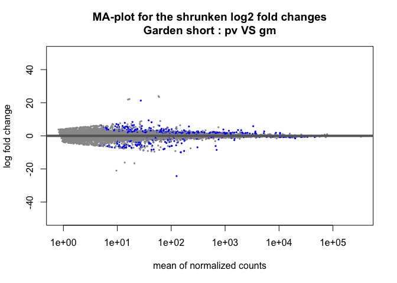
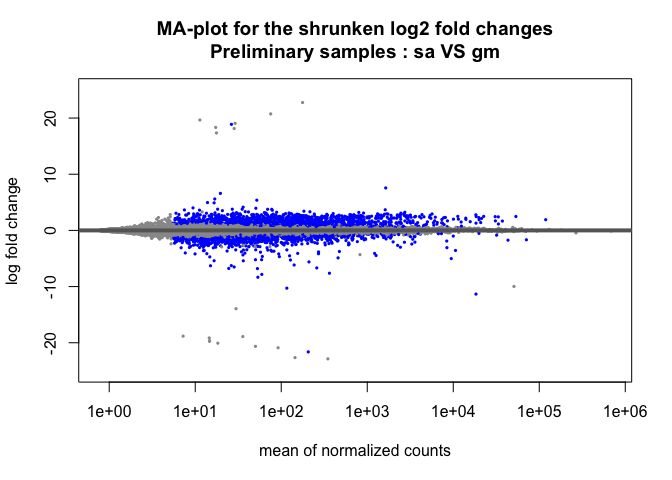
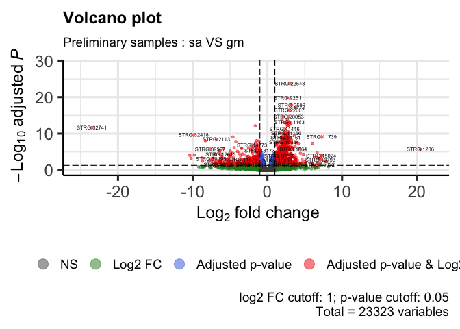
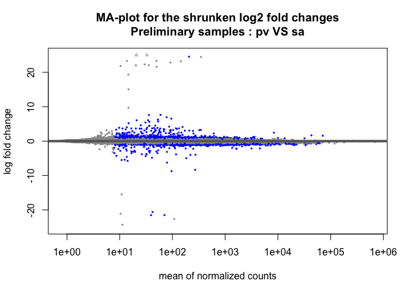
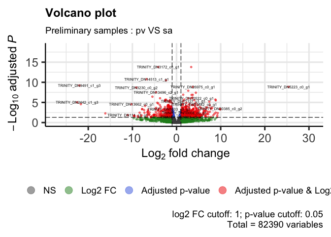
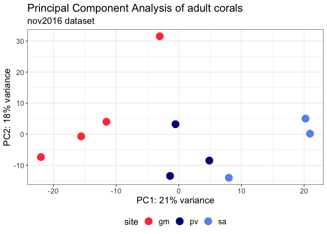
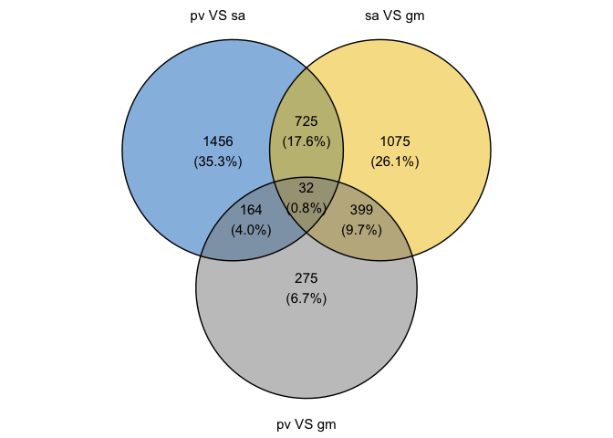
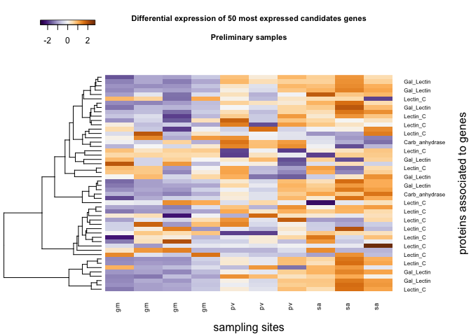

DE_Astroides_adult_preliminarySamples
================
Marc Meynadier
2022-03-11

``` r
# Differential expression on Kallisto data 

# Preliminary samples - 2016 dataset

# Packages and dependence
packageCheckClassic <- function(x){
  # 
  for( i in x ){
    if( ! require( i , character.only = TRUE ) ){
      install.packages( i , dependencies = TRUE )
      require( i , character.only = TRUE )
    }
  }
}

packageCheckClassic(c('DESeq2','devtools','BiocManager','ggplot2','ggrepel','markdown','pheatmap','RColorBrewer','genefilter','gplots','vegan','dplyr'))
```

    ## Le chargement a nécessité le package : DESeq2

    ## Le chargement a nécessité le package : S4Vectors

    ## Le chargement a nécessité le package : stats4

    ## Le chargement a nécessité le package : BiocGenerics

    ## 
    ## Attachement du package : 'BiocGenerics'

    ## Les objets suivants sont masqués depuis 'package:stats':
    ## 
    ##     IQR, mad, sd, var, xtabs

    ## Les objets suivants sont masqués depuis 'package:base':
    ## 
    ##     anyDuplicated, append, as.data.frame, basename, cbind, colnames,
    ##     dirname, do.call, duplicated, eval, evalq, Filter, Find, get, grep,
    ##     grepl, intersect, is.unsorted, lapply, Map, mapply, match, mget,
    ##     order, paste, pmax, pmax.int, pmin, pmin.int, Position, rank,
    ##     rbind, Reduce, rownames, sapply, setdiff, sort, table, tapply,
    ##     union, unique, unsplit, which.max, which.min

    ## 
    ## Attachement du package : 'S4Vectors'

    ## Les objets suivants sont masqués depuis 'package:base':
    ## 
    ##     expand.grid, I, unname

    ## Le chargement a nécessité le package : IRanges

    ## Le chargement a nécessité le package : GenomicRanges

    ## Le chargement a nécessité le package : GenomeInfoDb

    ## Le chargement a nécessité le package : SummarizedExperiment

    ## Le chargement a nécessité le package : MatrixGenerics

    ## Le chargement a nécessité le package : matrixStats

    ## 
    ## Attachement du package : 'MatrixGenerics'

    ## Les objets suivants sont masqués depuis 'package:matrixStats':
    ## 
    ##     colAlls, colAnyNAs, colAnys, colAvgsPerRowSet, colCollapse,
    ##     colCounts, colCummaxs, colCummins, colCumprods, colCumsums,
    ##     colDiffs, colIQRDiffs, colIQRs, colLogSumExps, colMadDiffs,
    ##     colMads, colMaxs, colMeans2, colMedians, colMins, colOrderStats,
    ##     colProds, colQuantiles, colRanges, colRanks, colSdDiffs, colSds,
    ##     colSums2, colTabulates, colVarDiffs, colVars, colWeightedMads,
    ##     colWeightedMeans, colWeightedMedians, colWeightedSds,
    ##     colWeightedVars, rowAlls, rowAnyNAs, rowAnys, rowAvgsPerColSet,
    ##     rowCollapse, rowCounts, rowCummaxs, rowCummins, rowCumprods,
    ##     rowCumsums, rowDiffs, rowIQRDiffs, rowIQRs, rowLogSumExps,
    ##     rowMadDiffs, rowMads, rowMaxs, rowMeans2, rowMedians, rowMins,
    ##     rowOrderStats, rowProds, rowQuantiles, rowRanges, rowRanks,
    ##     rowSdDiffs, rowSds, rowSums2, rowTabulates, rowVarDiffs, rowVars,
    ##     rowWeightedMads, rowWeightedMeans, rowWeightedMedians,
    ##     rowWeightedSds, rowWeightedVars

    ## Le chargement a nécessité le package : Biobase

    ## Welcome to Bioconductor
    ## 
    ##     Vignettes contain introductory material; view with
    ##     'browseVignettes()'. To cite Bioconductor, see
    ##     'citation("Biobase")', and for packages 'citation("pkgname")'.

    ## 
    ## Attachement du package : 'Biobase'

    ## L'objet suivant est masqué depuis 'package:MatrixGenerics':
    ## 
    ##     rowMedians

    ## Les objets suivants sont masqués depuis 'package:matrixStats':
    ## 
    ##     anyMissing, rowMedians

    ## Le chargement a nécessité le package : devtools

    ## Le chargement a nécessité le package : usethis

    ## Le chargement a nécessité le package : BiocManager

    ## Bioconductor version '3.14' is out-of-date; the current release version '3.15'
    ##   is available with R version '4.2'; see https://bioconductor.org/install

    ## 
    ## Attachement du package : 'BiocManager'

    ## L'objet suivant est masqué depuis 'package:devtools':
    ## 
    ##     install

    ## Le chargement a nécessité le package : ggplot2

    ## Le chargement a nécessité le package : ggrepel

    ## Le chargement a nécessité le package : markdown

    ## Le chargement a nécessité le package : pheatmap

    ## Le chargement a nécessité le package : RColorBrewer

    ## Le chargement a nécessité le package : genefilter

    ## 
    ## Attachement du package : 'genefilter'

    ## Les objets suivants sont masqués depuis 'package:MatrixGenerics':
    ## 
    ##     rowSds, rowVars

    ## Les objets suivants sont masqués depuis 'package:matrixStats':
    ## 
    ##     rowSds, rowVars

    ## Le chargement a nécessité le package : gplots

    ## 
    ## Attachement du package : 'gplots'

    ## L'objet suivant est masqué depuis 'package:IRanges':
    ## 
    ##     space

    ## L'objet suivant est masqué depuis 'package:S4Vectors':
    ## 
    ##     space

    ## L'objet suivant est masqué depuis 'package:stats':
    ## 
    ##     lowess

    ## Le chargement a nécessité le package : vegan

    ## Le chargement a nécessité le package : permute

    ## 
    ## Attachement du package : 'permute'

    ## L'objet suivant est masqué depuis 'package:devtools':
    ## 
    ##     check

    ## Le chargement a nécessité le package : lattice

    ## This is vegan 2.5-7

    ## Le chargement a nécessité le package : dplyr

    ## 
    ## Attachement du package : 'dplyr'

    ## L'objet suivant est masqué depuis 'package:Biobase':
    ## 
    ##     combine

    ## L'objet suivant est masqué depuis 'package:matrixStats':
    ## 
    ##     count

    ## Les objets suivants sont masqués depuis 'package:GenomicRanges':
    ## 
    ##     intersect, setdiff, union

    ## L'objet suivant est masqué depuis 'package:GenomeInfoDb':
    ## 
    ##     intersect

    ## Les objets suivants sont masqués depuis 'package:IRanges':
    ## 
    ##     collapse, desc, intersect, setdiff, slice, union

    ## Les objets suivants sont masqués depuis 'package:S4Vectors':
    ## 
    ##     first, intersect, rename, setdiff, setequal, union

    ## Les objets suivants sont masqués depuis 'package:BiocGenerics':
    ## 
    ##     combine, intersect, setdiff, union

    ## Les objets suivants sont masqués depuis 'package:stats':
    ## 
    ##     filter, lag

    ## Les objets suivants sont masqués depuis 'package:base':
    ## 
    ##     intersect, setdiff, setequal, union

``` r
#BiocManager::install('tximport', force = TRUE)
#BiocManager::install('apeglm')
#BiocManager::install('ashr')
#BiocManager::install("EnhancedVolcano")
if (!require(devtools)) install.packages("devtools")
devtools::install_github("yanlinlin82/ggvenn")
```

    ## Skipping install of 'ggvenn' from a github remote, the SHA1 (b7ff54ba) has not changed since last install.
    ##   Use `force = TRUE` to force installation

``` r
library('ggvenn')
```

    ## Le chargement a nécessité le package : grid

``` r
library('tximport')
library('apeglm')
library('ashr')
library('EnhancedVolcano')
```

    ## Registered S3 methods overwritten by 'ggalt':
    ##   method                  from   
    ##   grid.draw.absoluteGrob  ggplot2
    ##   grobHeight.absoluteGrob ggplot2
    ##   grobWidth.absoluteGrob  ggplot2
    ##   grobX.absoluteGrob      ggplot2
    ##   grobY.absoluteGrob      ggplot2

``` r
source_url("https://raw.githubusercontent.com/obigriffith/biostar-tutorials/master/Heatmaps/heatmap.3.R")
```

    ## ℹ SHA-1 hash of file is 015fc0457e61e3e93a903e69a24d96d2dac7b9fb

``` r
# Working environment 
scriptPath<-dirname(rstudioapi::getSourceEditorContext()$path)
setwd(scriptPath)
samples<-read.table('tximport_design_preliminarySamples.txt',header=T)
tx2gene<-read.table('tx2gene_adultTranscriptome',header=T)
candidateGenes<-read.csv('candidateGenes.csv',header=T,sep=',')
scriptPath <- sub("/[^/]+$", "", scriptPath)
scriptPath <- sub("/[^/]+$", "", scriptPath)
dataPath<-'/data/net/6_kallisto/adultTranscriptome/adult/1_preliminarySamples'
outputPath<-paste(scriptPath,'/output/DESeq2/adultTranscriptome/adult/1_preliminarySamples/',sep='')
wdPath<-paste(scriptPath,dataPath,sep='')
setwd(wdPath)

# Data importation - txImport
files<-paste0(samples$sample,'.tsv')
names(files)<-samples$sample
txi<-tximport(files = files,type='kallisto',tx2gene = tx2gene)
```

    ## Note: importing `abundance.h5` is typically faster than `abundance.tsv`

    ## reading in files with read_tsv

    ## 1 2 3 4 5 6 7 8 9 10 
    ## transcripts missing from tx2gene: 1
    ## summarizing abundance
    ## summarizing counts
    ## summarizing length

``` r
names(txi)
```

    ## [1] "abundance"           "counts"              "length"             
    ## [4] "countsFromAbundance"

``` r
head(txi$counts)
```

    ##                    abundance_adult_nov2016_gm_gm_pre_14283X1_paired_trimmed
    ## TRINITY_DN0_c0_g1                                                   828.000
    ## TRINITY_DN0_c0_g2                                                   237.000
    ## TRINITY_DN0_c1_g1                                                    61.000
    ## TRINITY_DN1_c0_g1                                                  3550.000
    ## TRINITY_DN1_c1_g1                                                     0.000
    ## TRINITY_DN10_c0_g1                                                  393.123
    ##                    abundance_adult_nov2016_gm_gm_pre_14283X2_paired_trimmed
    ## TRINITY_DN0_c0_g1                                                   857.000
    ## TRINITY_DN0_c0_g2                                                   243.118
    ## TRINITY_DN0_c1_g1                                                    74.000
    ## TRINITY_DN1_c0_g1                                                  3361.000
    ## TRINITY_DN1_c1_g1                                                     0.000
    ## TRINITY_DN10_c0_g1                                                  387.424
    ##                    abundance_adult_nov2016_gm_gm_pre_14283X3_paired_trimmed
    ## TRINITY_DN0_c0_g1                                                  675.0000
    ## TRINITY_DN0_c0_g2                                                  163.1960
    ## TRINITY_DN0_c1_g1                                                   44.2649
    ## TRINITY_DN1_c0_g1                                                 6772.0000
    ## TRINITY_DN1_c1_g1                                                    0.0000
    ## TRINITY_DN10_c0_g1                                                 470.3850
    ##                    abundance_adult_nov2016_gm_gm_pre_14283X4_paired_trimmed
    ## TRINITY_DN0_c0_g1                                                   977.000
    ## TRINITY_DN0_c0_g2                                                   229.763
    ## TRINITY_DN0_c1_g1                                                    51.000
    ## TRINITY_DN1_c0_g1                                                  4706.000
    ## TRINITY_DN1_c1_g1                                                     0.000
    ## TRINITY_DN10_c0_g1                                                  224.753
    ##                    abundance_adult_nov2016_pv_pv_pre_14283X10_paired_trimmed
    ## TRINITY_DN0_c0_g1                                                   727.0000
    ## TRINITY_DN0_c0_g2                                                   171.2520
    ## TRINITY_DN0_c1_g1                                                    51.2069
    ## TRINITY_DN1_c0_g1                                                  3797.0000
    ## TRINITY_DN1_c1_g1                                                     1.0000
    ## TRINITY_DN10_c0_g1                                                  518.4670
    ##                    abundance_adult_nov2016_pv_pv_pre_14283X8_paired_trimmed
    ## TRINITY_DN0_c0_g1                                                   965.000
    ## TRINITY_DN0_c0_g2                                                   214.887
    ## TRINITY_DN0_c1_g1                                                    44.000
    ## TRINITY_DN1_c0_g1                                                  4569.000
    ## TRINITY_DN1_c1_g1                                                     0.000
    ## TRINITY_DN10_c0_g1                                                  407.285
    ##                    abundance_adult_nov2016_pv_pv_pre_14283X9_paired_trimmed
    ## TRINITY_DN0_c0_g1                                                  522.0000
    ## TRINITY_DN0_c0_g2                                                  156.8870
    ## TRINITY_DN0_c1_g1                                                   56.3135
    ## TRINITY_DN1_c0_g1                                                 4562.0000
    ## TRINITY_DN1_c1_g1                                                    1.0000
    ## TRINITY_DN10_c0_g1                                                 585.4630
    ##                    abundance_adult_nov2016_sa_sa_pre_14283X5_paired_trimmed
    ## TRINITY_DN0_c0_g1                                                  1169.000
    ## TRINITY_DN0_c0_g2                                                   262.969
    ## TRINITY_DN0_c1_g1                                                    26.000
    ## TRINITY_DN1_c0_g1                                                  3466.000
    ## TRINITY_DN1_c1_g1                                                     0.000
    ## TRINITY_DN10_c0_g1                                                  490.226
    ##                    abundance_adult_nov2016_sa_sa_pre_14283X6_paired_trimmed
    ## TRINITY_DN0_c0_g1                                                   617.000
    ## TRINITY_DN0_c0_g2                                                   404.000
    ## TRINITY_DN0_c1_g1                                                     6.000
    ## TRINITY_DN1_c0_g1                                                  5516.000
    ## TRINITY_DN1_c1_g1                                                     0.000
    ## TRINITY_DN10_c0_g1                                                  340.609
    ##                    abundance_adult_nov2016_sa_sa_pre_14283X7_paired_trimmed
    ## TRINITY_DN0_c0_g1                                                   800.000
    ## TRINITY_DN0_c0_g2                                                   236.890
    ## TRINITY_DN0_c1_g1                                                    63.000
    ## TRINITY_DN1_c0_g1                                                  4154.000
    ## TRINITY_DN1_c1_g1                                                     0.000
    ## TRINITY_DN10_c0_g1                                                  554.357

``` r
dds<-DESeqDataSetFromTximport(txi,colData=samples,design= ~site)
```

    ## Warning in DESeqDataSet(se, design = design, ignoreRank): some variables in
    ## design formula are characters, converting to factors

    ## using counts and average transcript lengths from tximport

``` r
# pre-filtering
keep <- rowSums(counts(dds)) >= 10 
dds <- dds[keep,]

# Differential expression analysis
dds<-DESeq(dds)
```

    ## estimating size factors
    ## using 'avgTxLength' from assays(dds), correcting for library size
    ## estimating dispersions
    ## gene-wise dispersion estimates
    ## mean-dispersion relationship
    ## final dispersion estimates
    ## fitting model and testing

``` r
cbind(resultsNames(dds))
```

    ##      [,1]           
    ## [1,] "Intercept"    
    ## [2,] "site_pv_vs_gm"
    ## [3,] "site_sa_vs_gm"

``` r
res_pv_gm<-results(dds, contrast=c("site","pv","gm"), alpha = 0.05)
res_sa_gm<-results(dds, contrast=c("site","sa","gm"), alpha = 0.05)
res_pv_sa<-results(dds, contrast=c("site","pv","sa"), alpha = 0.05)

# Exploring the results

# Results pv VS gm

#MA-plot
resLFC = lfcShrink(dds, contrast=c("site","pv","gm"), 
                   type="ashr")
```

    ## using 'ashr' for LFC shrinkage. If used in published research, please cite:
    ##     Stephens, M. (2016) False discovery rates: a new deal. Biostatistics, 18:2.
    ##     https://doi.org/10.1093/biostatistics/kxw041

``` r
plotMA(resLFC, alpha = 0.05, ylim=c(-25,25), main = "MA-plot for the shrunken log2 fold changes\nPreliminary samples : pv VS gm")
```

<!-- -->

``` r
# Volcano plot
pCutoff = 0.05
FCcutoff = 1.0
EnhancedVolcano(data.frame(res_pv_gm), lab = rownames(data.frame(res_pv_gm)), x = 'log2FoldChange', y = 'padj',
                    xlab = bquote(~Log[2]~ 'fold change'), ylab = bquote(~-Log[10]~adjusted~italic(P)),
                    pCutoff = pCutoff, FCcutoff = FCcutoff, pointSize = 1.0, labSize = 2.0,
                    title = "Volcano plot", subtitle = "Preliminary samples : pv VS gm",
                    caption = paste0('log2 FC cutoff: ', FCcutoff, '; p-value cutoff: ', pCutoff, '\nTotal = ', nrow(res_pv_gm), ' variables'),
                    legendLabels=c('NS','Log2 FC','Adjusted p-value', 'Adjusted p-value & Log2 FC'),
                    legendPosition = 'bottom', legendLabSize = 14, legendIconSize = 5.0)
```

<!-- -->

``` r
# Results sa VS gm

#MA-plot
resLFC = lfcShrink(dds, contrast=c("site","sa","gm"), 
                   type="ashr")
```

    ## using 'ashr' for LFC shrinkage. If used in published research, please cite:
    ##     Stephens, M. (2016) False discovery rates: a new deal. Biostatistics, 18:2.
    ##     https://doi.org/10.1093/biostatistics/kxw041

``` r
plotMA(resLFC, alpha = 0.05, ylim=c(-25,25), 
       main = "MA-plot for the shrunken log2 fold changes\nPreliminary samples : sa VS gm")
```

<!-- -->

``` r
# Volcano plot
EnhancedVolcano(data.frame(res_sa_gm), lab = rownames(data.frame(res_sa_gm)), x = 'log2FoldChange', y = 'padj',
                    xlab = bquote(~Log[2]~ 'fold change'), ylab = bquote(~-Log[10]~adjusted~italic(P)),
                    pCutoff = pCutoff, FCcutoff = FCcutoff, pointSize = 1.0, labSize = 2.0,
                    title = "Volcano plot", subtitle = "Preliminary samples : sa VS gm",
                    caption = paste0('log2 FC cutoff: ', FCcutoff, '; p-value cutoff: ', pCutoff, '\nTotal = ', nrow(res_sa_gm), ' variables'),
                    legendLabels=c('NS','Log2 FC','Adjusted p-value', 'Adjusted p-value & Log2 FC'),
                    legendPosition = 'bottom', legendLabSize = 14, legendIconSize = 5.0)
```

<!-- -->

``` r
# Results pv VS sa

#MA-plot
resLFC = lfcShrink(dds, contrast=c("site","pv","sa"), 
                   type="ashr")
```

    ## using 'ashr' for LFC shrinkage. If used in published research, please cite:
    ##     Stephens, M. (2016) False discovery rates: a new deal. Biostatistics, 18:2.
    ##     https://doi.org/10.1093/biostatistics/kxw041

``` r
plotMA(resLFC, alpha = 0.05, ylim=c(-25,25), 
       main = "MA-plot for the shrunken log2 fold changes\nPreliminary samples : pv VS sa")
```

<!-- -->

``` r
# Volcano plot
EnhancedVolcano(data.frame(res_pv_sa), lab = rownames(data.frame(res_pv_sa)), x = 'log2FoldChange', y = 'padj',
                xlab = bquote(~Log[2]~ 'fold change'), ylab = bquote(~-Log[10]~adjusted~italic(P)),
                pCutoff = pCutoff, FCcutoff = FCcutoff, pointSize = 1.0, labSize = 2.0,
                title = "Volcano plot", subtitle = "Preliminary samples : pv VS sa",
                caption = paste0('log2 FC cutoff: ', FCcutoff, '; p-value cutoff: ', pCutoff, '\nTotal = ', nrow(res_pv_sa), ' variables'),
                legendLabels=c('NS','Log2 FC','Adjusted p-value', 'Adjusted p-value & Log2 FC'),
                legendPosition = 'bottom', legendLabSize = 14, legendIconSize = 5.0)
```

<!-- -->

``` r
# Principal Component Analysis

vsd = vst(dds,blind=T)

pcaData = plotPCA(vsd, intgroup="site", 
                  returnData=TRUE)
percentVar = round(100 * attr(pcaData, "percentVar"))

ggplot(pcaData, aes(PC1, PC2, colour = site)) + 
  geom_point(size = 5) + theme_bw() + 
  scale_color_manual(values = c("#ff4040", "#00008B","#6495ED")) +
  geom_point() +
  ggtitle("Principal Component Analysis of adult corals", subtitle = "nov2016 dataset") +
  theme(text = element_text(size=14),legend.text = element_text(size=12), legend.position = 'bottom') +
  xlab(paste0("PC1: ",percentVar[1],"% variance")) +
  ylab(paste0("PC2: ",percentVar[2],"% variance")) 
```

<!-- -->

``` r
# Venn diagramm 
resOrdered_pv_gm <- res_pv_gm[order(res_pv_gm$padj),]
resOrderedDF_pv_gm <- as.data.frame(resOrdered_pv_gm)
resOrderedDF_pv_gm_venn <- filter(resOrderedDF_pv_gm,padj < 0.05)
resOrderedDF_pv_gm_venn <- list(rownames(resOrderedDF_pv_gm_venn))
resOrderedDF_pv_gm_venn <- unlist(resOrderedDF_pv_gm_venn)

resOrdered_sa_gm <- res_sa_gm[order(res_sa_gm$padj),]
resOrderedDF_sa_gm <- as.data.frame(resOrdered_sa_gm)
resOrderedDF_sa_gm_venn <- filter(resOrderedDF_sa_gm,padj < 0.05)
resOrderedDF_sa_gm_venn <- list(rownames(resOrderedDF_sa_gm_venn))
resOrderedDF_sa_gm_venn <- unlist(resOrderedDF_sa_gm_venn)

resOrdered_pv_sa <- res_pv_sa[order(res_pv_sa$padj),]
resOrderedDF_pv_sa <- as.data.frame(resOrdered_pv_sa)
resOrderedDF_pv_sa_venn <- filter(resOrderedDF_pv_sa,padj < 0.05)
resOrderedDF_pv_sa_venn <- list(rownames(resOrderedDF_pv_sa_venn))
resOrderedDF_pv_sa_venn <- unlist(resOrderedDF_pv_sa_venn)

x = list('pv VS sa' = resOrderedDF_pv_sa_venn, 'sa VS gm' = resOrderedDF_sa_gm_venn, 'pv VS gm' = resOrderedDF_pv_gm_venn)

ggvenn(
  x, 
  fill_color = c("#0073C2FF", "#EFC000FF", "#868686FF"),
  stroke_size = 0.5, set_name_size = 4
)
```

<!-- -->

``` r
# Candidate genes heatmap

listGenes <- candidateGenes$genes
listGenes2 <- which(rownames(vsd) %in% listGenes)
index <- which(listGenes %in% rownames(vsd))
candidateGenes2 <- candidateGenes[index, ] 
listProt <- candidateGenes2$pfam_annotation
listGenes3 <- candidateGenes2$genes

vsdCandidate <- vsd[listGenes3, ]

labColName <- c('gm','gm','gm','gm','pv','pv','pv','sa','sa','sa')
colnames(vsdCandidate) <- labColName
rownames(vsdCandidate) <- listProt

topVarGenesVsd <- head(order(rowVars(assay(vsdCandidate)), decreasing=TRUE), 50 )
heatmap.2(assay(vsdCandidate)[topVarGenesVsd,], trace="none",scale="row",keysize=1.15,key.xlab = "",
          key.title = "none",
          col=colorRampPalette(rev(brewer.pal(11,"PuOr")))(255), cexRow=0.6, cexCol=0.7,density.info="none",
          xlab="sampling sites",ylab="proteins associated to genes",Colv=NA,margins = c(4, 7))
```

    ## Warning in heatmap.2(assay(vsdCandidate)[topVarGenesVsd, ], trace = "none", :
    ## Discrepancy: Colv is FALSE, while dendrogram is `both'. Omitting column
    ## dendogram.

``` r
main='Differential expression of 50 most expressed candidates genes\n\nPreliminary samples'
title(main, cex.main = 0.7)
```

<!-- -->

``` r
# Inferences statistics
count_tab_assay <- assay(vsd)
dist_tab_assay <- dist(t(count_tab_assay),method="euclidian")
adonis(data=samples,dist_tab_assay ~ site, method="euclidian")
```

    ## 
    ## Call:
    ## adonis(formula = dist_tab_assay ~ site, data = samples, method = "euclidian") 
    ## 
    ## Permutation: free
    ## Number of permutations: 999
    ## 
    ## Terms added sequentially (first to last)
    ## 
    ##           Df SumsOfSqs MeanSqs F.Model      R2 Pr(>F)    
    ## site       2     78490   39245  1.6535 0.32086  0.001 ***
    ## Residuals  7    166137   23734         0.67914           
    ## Total      9    244626                 1.00000           
    ## ---
    ## Signif. codes:  0 '***' 0.001 '**' 0.01 '*' 0.05 '.' 0.1 ' ' 1

``` r
anova(betadisper(dist_tab_assay,samples$site))
```

    ## Analysis of Variance Table
    ## 
    ## Response: Distances
    ##           Df Sum Sq Mean Sq F value Pr(>F)
    ## Groups     2  777.2  388.60  1.5393 0.2792
    ## Residuals  7 1767.2  252.46

``` r
# Exporting results
write.csv(resOrderedDF_pv_gm, file = paste(scriptPath,'/data/net/7_deseq2/adultTranscriptome/adult/DESeq2_results_adult_preliminarySamples_pv_VS_gm.csv',sep=''))
write.csv(resOrderedDF_sa_gm, file = paste(scriptPath,'/data/net/7_deseq2/adultTranscriptome/adult/DESeq2_results_adult_preliminarySamples_sa_VS_gm.csv',sep=''))
write.csv(resOrderedDF_pv_sa, file = paste(scriptPath,'/data/net/7_deseq2/adultTranscriptome/adult/DESeq2_results_adult_preliminarySamples_pv_VS_sa.csv',sep=''))

sessionInfo()
```

    ## R version 4.1.2 (2021-11-01)
    ## Platform: x86_64-apple-darwin17.0 (64-bit)
    ## Running under: macOS Big Sur 10.16
    ## 
    ## Matrix products: default
    ## BLAS:   /Library/Frameworks/R.framework/Versions/4.1/Resources/lib/libRblas.0.dylib
    ## LAPACK: /Library/Frameworks/R.framework/Versions/4.1/Resources/lib/libRlapack.dylib
    ## 
    ## locale:
    ## [1] fr_FR.UTF-8/fr_FR.UTF-8/fr_FR.UTF-8/C/fr_FR.UTF-8/fr_FR.UTF-8
    ## 
    ## attached base packages:
    ## [1] grid      stats4    stats     graphics  grDevices utils     datasets 
    ## [8] methods   base     
    ## 
    ## other attached packages:
    ##  [1] EnhancedVolcano_1.12.0      ashr_2.2-54                
    ##  [3] apeglm_1.16.0               tximport_1.22.0            
    ##  [5] ggvenn_0.1.9                dplyr_1.0.8                
    ##  [7] vegan_2.5-7                 lattice_0.20-45            
    ##  [9] permute_0.9-7               gplots_3.1.1               
    ## [11] genefilter_1.76.0           RColorBrewer_1.1-3         
    ## [13] pheatmap_1.0.12             markdown_1.1               
    ## [15] ggrepel_0.9.1               ggplot2_3.3.5              
    ## [17] BiocManager_1.30.16         devtools_2.4.3             
    ## [19] usethis_2.1.5               DESeq2_1.34.0              
    ## [21] SummarizedExperiment_1.24.0 Biobase_2.54.0             
    ## [23] MatrixGenerics_1.6.0        matrixStats_0.61.0         
    ## [25] GenomicRanges_1.46.1        GenomeInfoDb_1.30.1        
    ## [27] IRanges_2.28.0              S4Vectors_0.32.3           
    ## [29] BiocGenerics_0.40.0        
    ## 
    ## loaded via a namespace (and not attached):
    ##   [1] plyr_1.8.6             splines_4.1.2          BiocParallel_1.28.3   
    ##   [4] digest_0.6.29          invgamma_1.1           htmltools_0.5.2       
    ##   [7] SQUAREM_2021.1         fansi_1.0.3            magrittr_2.0.3        
    ##  [10] memoise_2.0.1          cluster_2.1.2          tzdb_0.2.0            
    ##  [13] remotes_2.4.2          Biostrings_2.62.0      readr_2.1.2           
    ##  [16] annotate_1.72.0        extrafont_0.17         vroom_1.5.7           
    ##  [19] extrafontdb_1.0        bdsmatrix_1.3-4        prettyunits_1.1.1     
    ##  [22] colorspace_2.0-3       blob_1.2.2             xfun_0.30             
    ##  [25] callr_3.7.0            crayon_1.5.1           RCurl_1.98-1.6        
    ##  [28] survival_3.3-1         glue_1.6.2             gtable_0.3.0          
    ##  [31] zlibbioc_1.40.0        XVector_0.34.0         DelayedArray_0.20.0   
    ##  [34] proj4_1.0-11           pkgbuild_1.3.1         Rttf2pt1_1.3.10       
    ##  [37] maps_3.4.0             scales_1.2.0           mvtnorm_1.1-3         
    ##  [40] DBI_1.1.2              Rcpp_1.0.8.2           xtable_1.8-4          
    ##  [43] emdbook_1.3.12         bit_4.0.4              truncnorm_1.0-8       
    ##  [46] httr_1.4.2             ellipsis_0.3.2         farver_2.1.0          
    ##  [49] pkgconfig_2.0.3        XML_3.99-0.9           locfit_1.5-9.5        
    ##  [52] utf8_1.2.2             labeling_0.4.2         tidyselect_1.1.2      
    ##  [55] rlang_1.0.2            AnnotationDbi_1.56.2   munsell_0.5.0         
    ##  [58] tools_4.1.2            cachem_1.0.6           cli_3.2.0             
    ##  [61] generics_0.1.2         RSQLite_2.2.10         evaluate_0.15         
    ##  [64] stringr_1.4.0          fastmap_1.1.0          yaml_2.3.5            
    ##  [67] processx_3.5.2         knitr_1.37             bit64_4.0.5           
    ##  [70] fs_1.5.2               caTools_1.18.2         purrr_0.3.4           
    ##  [73] KEGGREST_1.34.0        nlme_3.1-155           ash_1.0-15            
    ##  [76] ggrastr_1.0.1          brio_1.1.3             compiler_4.1.2        
    ##  [79] rstudioapi_0.13        beeswarm_0.4.0         curl_4.3.2            
    ##  [82] png_0.1-7              testthat_3.1.2         tibble_3.1.6          
    ##  [85] geneplotter_1.72.0     stringi_1.7.6          ps_1.6.0              
    ##  [88] desc_1.4.1             ggalt_0.4.0            Matrix_1.4-0          
    ##  [91] vctrs_0.4.1            pillar_1.7.0           lifecycle_1.0.1       
    ##  [94] bitops_1.0-7           irlba_2.3.5            R6_2.5.1              
    ##  [97] KernSmooth_2.23-20     vipor_0.4.5            sessioninfo_1.2.2     
    ## [100] MASS_7.3-55            gtools_3.9.2           assertthat_0.2.1      
    ## [103] pkgload_1.2.4          rprojroot_2.0.2        withr_2.5.0           
    ## [106] GenomeInfoDbData_1.2.7 mgcv_1.8-39            parallel_4.1.2        
    ## [109] hms_1.1.1              coda_0.19-4            rmarkdown_2.13        
    ## [112] mixsqp_0.3-43          bbmle_1.0.24           numDeriv_2016.8-1.1   
    ## [115] ggbeeswarm_0.6.0
