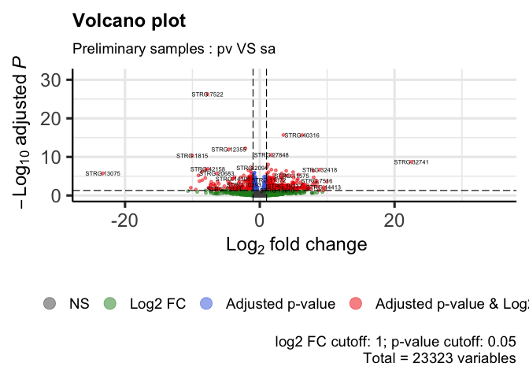
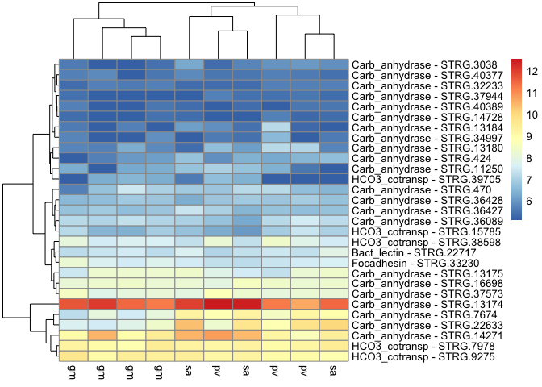

DE_Astroides_adult_preliminarySamples
================
Marc Meynadier
6/3/2022

``` r
# Differential expression on Kallisto data 

# Preliminary samples - 2016 dataset

# Packages and dependence
packageCheckClassic <- function(x){
  # 
  for( i in x ){
    if( ! require( i , character.only = TRUE ) ){
      install.packages( i , dependencies = TRUE )
      require( i , character.only = TRUE )
    }
  }
}

packageCheckClassic(c('DESeq2','devtools','BiocManager','ggplot2','ggrepel','markdown','pheatmap','RColorBrewer','genefilter','gplots','vegan','dplyr','limma'))
```

    ## Le chargement a nécessité le package : DESeq2

    ## Le chargement a nécessité le package : S4Vectors

    ## Warning: le package 'S4Vectors' a été compilé avec la version R 4.1.3

    ## Le chargement a nécessité le package : stats4

    ## Le chargement a nécessité le package : BiocGenerics

    ## 
    ## Attachement du package : 'BiocGenerics'

    ## Les objets suivants sont masqués depuis 'package:stats':
    ## 
    ##     IQR, mad, sd, var, xtabs

    ## Les objets suivants sont masqués depuis 'package:base':
    ## 
    ##     anyDuplicated, append, as.data.frame, basename, cbind, colnames,
    ##     dirname, do.call, duplicated, eval, evalq, Filter, Find, get, grep,
    ##     grepl, intersect, is.unsorted, lapply, Map, mapply, match, mget,
    ##     order, paste, pmax, pmax.int, pmin, pmin.int, Position, rank,
    ##     rbind, Reduce, rownames, sapply, setdiff, sort, table, tapply,
    ##     union, unique, unsplit, which.max, which.min

    ## 
    ## Attachement du package : 'S4Vectors'

    ## Les objets suivants sont masqués depuis 'package:base':
    ## 
    ##     expand.grid, I, unname

    ## Le chargement a nécessité le package : IRanges

    ## Le chargement a nécessité le package : GenomicRanges

    ## Le chargement a nécessité le package : GenomeInfoDb

    ## Le chargement a nécessité le package : SummarizedExperiment

    ## Le chargement a nécessité le package : MatrixGenerics

    ## Le chargement a nécessité le package : matrixStats

    ## 
    ## Attachement du package : 'MatrixGenerics'

    ## Les objets suivants sont masqués depuis 'package:matrixStats':
    ## 
    ##     colAlls, colAnyNAs, colAnys, colAvgsPerRowSet, colCollapse,
    ##     colCounts, colCummaxs, colCummins, colCumprods, colCumsums,
    ##     colDiffs, colIQRDiffs, colIQRs, colLogSumExps, colMadDiffs,
    ##     colMads, colMaxs, colMeans2, colMedians, colMins, colOrderStats,
    ##     colProds, colQuantiles, colRanges, colRanks, colSdDiffs, colSds,
    ##     colSums2, colTabulates, colVarDiffs, colVars, colWeightedMads,
    ##     colWeightedMeans, colWeightedMedians, colWeightedSds,
    ##     colWeightedVars, rowAlls, rowAnyNAs, rowAnys, rowAvgsPerColSet,
    ##     rowCollapse, rowCounts, rowCummaxs, rowCummins, rowCumprods,
    ##     rowCumsums, rowDiffs, rowIQRDiffs, rowIQRs, rowLogSumExps,
    ##     rowMadDiffs, rowMads, rowMaxs, rowMeans2, rowMedians, rowMins,
    ##     rowOrderStats, rowProds, rowQuantiles, rowRanges, rowRanks,
    ##     rowSdDiffs, rowSds, rowSums2, rowTabulates, rowVarDiffs, rowVars,
    ##     rowWeightedMads, rowWeightedMeans, rowWeightedMedians,
    ##     rowWeightedSds, rowWeightedVars

    ## Le chargement a nécessité le package : Biobase

    ## Welcome to Bioconductor
    ## 
    ##     Vignettes contain introductory material; view with
    ##     'browseVignettes()'. To cite Bioconductor, see
    ##     'citation("Biobase")', and for packages 'citation("pkgname")'.

    ## 
    ## Attachement du package : 'Biobase'

    ## L'objet suivant est masqué depuis 'package:MatrixGenerics':
    ## 
    ##     rowMedians

    ## Les objets suivants sont masqués depuis 'package:matrixStats':
    ## 
    ##     anyMissing, rowMedians

    ## Le chargement a nécessité le package : devtools

    ## Le chargement a nécessité le package : usethis

    ## Le chargement a nécessité le package : BiocManager

    ## Bioconductor version '3.14' is out-of-date; the current release version '3.16'
    ##   is available with R version '4.2'; see https://bioconductor.org/install

    ## 
    ## Attachement du package : 'BiocManager'

    ## L'objet suivant est masqué depuis 'package:devtools':
    ## 
    ##     install

    ## Le chargement a nécessité le package : ggplot2

    ## Le chargement a nécessité le package : ggrepel

    ## Le chargement a nécessité le package : markdown

    ## Le chargement a nécessité le package : pheatmap

    ## Le chargement a nécessité le package : RColorBrewer

    ## Le chargement a nécessité le package : genefilter

    ## 
    ## Attachement du package : 'genefilter'

    ## Les objets suivants sont masqués depuis 'package:MatrixGenerics':
    ## 
    ##     rowSds, rowVars

    ## Les objets suivants sont masqués depuis 'package:matrixStats':
    ## 
    ##     rowSds, rowVars

    ## Le chargement a nécessité le package : gplots

    ## 
    ## Attachement du package : 'gplots'

    ## L'objet suivant est masqué depuis 'package:IRanges':
    ## 
    ##     space

    ## L'objet suivant est masqué depuis 'package:S4Vectors':
    ## 
    ##     space

    ## L'objet suivant est masqué depuis 'package:stats':
    ## 
    ##     lowess

    ## Le chargement a nécessité le package : vegan

    ## Le chargement a nécessité le package : permute

    ## 
    ## Attachement du package : 'permute'

    ## L'objet suivant est masqué depuis 'package:devtools':
    ## 
    ##     check

    ## Le chargement a nécessité le package : lattice

    ## This is vegan 2.6-2

    ## Le chargement a nécessité le package : dplyr

    ## 
    ## Attachement du package : 'dplyr'

    ## L'objet suivant est masqué depuis 'package:Biobase':
    ## 
    ##     combine

    ## L'objet suivant est masqué depuis 'package:matrixStats':
    ## 
    ##     count

    ## Les objets suivants sont masqués depuis 'package:GenomicRanges':
    ## 
    ##     intersect, setdiff, union

    ## L'objet suivant est masqué depuis 'package:GenomeInfoDb':
    ## 
    ##     intersect

    ## Les objets suivants sont masqués depuis 'package:IRanges':
    ## 
    ##     collapse, desc, intersect, setdiff, slice, union

    ## Les objets suivants sont masqués depuis 'package:S4Vectors':
    ## 
    ##     first, intersect, rename, setdiff, setequal, union

    ## Les objets suivants sont masqués depuis 'package:BiocGenerics':
    ## 
    ##     combine, intersect, setdiff, union

    ## Les objets suivants sont masqués depuis 'package:stats':
    ## 
    ##     filter, lag

    ## Les objets suivants sont masqués depuis 'package:base':
    ## 
    ##     intersect, setdiff, setequal, union

    ## Le chargement a nécessité le package : limma

    ## Warning: le package 'limma' a été compilé avec la version R 4.1.3

    ## 
    ## Attachement du package : 'limma'

    ## L'objet suivant est masqué depuis 'package:DESeq2':
    ## 
    ##     plotMA

    ## L'objet suivant est masqué depuis 'package:BiocGenerics':
    ## 
    ##     plotMA

``` r
#BiocManager::install('tximport', force = TRUE)
#BiocManager::install('apeglm')
#BiocManager::install('ashr')
#BiocManager::install("EnhancedVolcano")
if (!require(devtools)) install.packages("devtools")
devtools::install_github("yanlinlin82/ggvenn")
```

    ## Skipping install of 'ggvenn' from a github remote, the SHA1 (306a3302) has not changed since last install.
    ##   Use `force = TRUE` to force installation

``` r
library('ggvenn')
```

    ## Le chargement a nécessité le package : grid

``` r
library('tximport')
library('apeglm')
library('ashr')
library('EnhancedVolcano')
```

    ## Registered S3 methods overwritten by 'ggalt':
    ##   method                  from   
    ##   grid.draw.absoluteGrob  ggplot2
    ##   grobHeight.absoluteGrob ggplot2
    ##   grobWidth.absoluteGrob  ggplot2
    ##   grobX.absoluteGrob      ggplot2
    ##   grobY.absoluteGrob      ggplot2

``` r
source_url("https://raw.githubusercontent.com/obigriffith/biostar-tutorials/master/Heatmaps/heatmap.3.R")
```

    ## ℹ SHA-1 hash of file is 015fc0457e61e3e93a903e69a24d96d2dac7b9fb

``` r
# Working environment and data loading
scriptPath<-dirname(rstudioapi::getSourceEditorContext()$path)
setwd(scriptPath)
candidateGenes<-read.csv('candidateGenes.csv',header=T,sep=',')
samples<-read.table('tximport_design_preliminarySamples.txt',header=T)
dataPath<-'/Users/mmeynadier/Documents/PhD/species/Astroides/analysis/STARmapping/teixido/adult/nov2016'
outputPath<-'/Users/mmeynadier/Documents/Astroides/comparative_transcriptomics_astroides/output/DESeq2/annotatedGenome/adult/preliminarySamples/'
setwd(dataPath)
data<-list.files(pattern = "*ReadsPerGene.out.tab$", full.names = TRUE)
counts.files <- lapply(data, read.table, skip = 4 )
raw_counts <- as.data.frame(sapply(counts.files, function(x) x[ , 4]))
data <- gsub( "Users/mmeynadier/Documents/PhD/species/Astroides/analysis/STARmapping/teixido/adult/nov2016", "", data )
data <- gsub( "_ReadsPerGene.out.tab", "", data )
data <- gsub( "./", "", data )
colnames(raw_counts) <- data
row.names(raw_counts) <- counts.files[[1]]$V1

# DDS object
dds<-DESeqDataSetFromMatrix(countData = raw_counts, colData = samples,design = ~site)
```

    ## Warning in DESeqDataSet(se, design = design, ignoreRank): some variables in
    ## design formula are characters, converting to factors

``` r
# If data from kallisto
# tx2gene<-read.table('tx2gene_adultTranscriptome',header=T)
# scriptPath <- sub("/[^/]+$", "", scriptPath)
# scriptPath <- sub("/[^/]+$", "", scriptPath)
# dataPath<-'/data/net/6_kallisto/adultTranscriptome/adult/1_preliminarySamples'
# outputPath<-paste(scriptPath,'/output/DESeq2/adultTranscriptome/adult/1_preliminarySamples/',sep='')
# 
# wdPath<-paste(scriptPath,dataPath,sep='')
# setwd(wdPath)
# 
# # Data importation - txImport
# files<-paste0(samples$sample,'.tsv')
# names(files)<-samples$sample
# txi<-tximport(files = files,type='kallisto',tx2gene = tx2gene)
# names(txi)
# head(txi$counts)
# dds<-DESeqDataSetFromTximport(txi,colData=samples,design= ~site)

# pre-filtering
keep <- rowSums(counts(dds)) >= 10 
dds <- dds[keep,]

# Differential expression analysis
dds<-DESeq(dds)
```

    ## estimating size factors

    ## estimating dispersions

    ## gene-wise dispersion estimates

    ## mean-dispersion relationship

    ## final dispersion estimates

    ## fitting model and testing

``` r
cbind(resultsNames(dds))
```

    ##      [,1]           
    ## [1,] "Intercept"    
    ## [2,] "site_pv_vs_gm"
    ## [3,] "site_sa_vs_gm"

``` r
res_pv_gm<-results(dds, contrast=c("site","pv","gm"), alpha = 0.05)
res_sa_gm<-results(dds, contrast=c("site","sa","gm"), alpha = 0.05)
res_pv_sa<-results(dds, contrast=c("site","pv","sa"), alpha = 0.05)

# Exploring the results

# Results pv VS gm

#MA-plot
DESeq2::plotMA(res_pv_gm,ylim=c(-50,50),main="MA-plot for the shrunken log2 fold changes\nGarden short : pv VS gm")
```

<!-- -->

``` r
# Volcano plot
pCutoff = 0.05
FCcutoff = 1.0
EnhancedVolcano(data.frame(res_pv_gm), lab = rownames(data.frame(res_pv_gm)), x = 'log2FoldChange', y = 'padj',
                    xlab = bquote(~Log[2]~ 'fold change'), ylab = bquote(~-Log[10]~adjusted~italic(P)),
                    pCutoff = pCutoff, FCcutoff = FCcutoff, pointSize = 1.0, labSize = 2.0,
                    title = "Volcano plot", subtitle = "Preliminary samples : pv VS gm",
                    caption = paste0('log2 FC cutoff: ', FCcutoff, '; p-value cutoff: ', pCutoff, '\nTotal = ', nrow(res_pv_gm), ' variables'),
                    legendLabels=c('NS','Log2 FC','Adjusted p-value', 'Adjusted p-value & Log2 FC'),
                    legendPosition = 'bottom', legendLabSize = 14, legendIconSize = 5.0)
```

<!-- -->

``` r
# Results sa VS gm

#MA-plot
DESeq2::plotMA(res_sa_gm,ylim=c(-50,50),main="MA-plot for the shrunken log2 fold changes\nGarden short : sa VS gm")
```

<!-- -->

``` r
# Volcano plot
EnhancedVolcano(data.frame(res_sa_gm), lab = rownames(data.frame(res_sa_gm)), x = 'log2FoldChange', y = 'padj',
                    xlab = bquote(~Log[2]~ 'fold change'), ylab = bquote(~-Log[10]~adjusted~italic(P)),
                    pCutoff = pCutoff, FCcutoff = FCcutoff, pointSize = 1.0, labSize = 2.0,
                    title = "Volcano plot", subtitle = "Preliminary samples : sa VS gm",
                    caption = paste0('log2 FC cutoff: ', FCcutoff, '; p-value cutoff: ', pCutoff, '\nTotal = ', nrow(res_sa_gm), ' variables'),
                    legendLabels=c('NS','Log2 FC','Adjusted p-value', 'Adjusted p-value & Log2 FC'),
                    legendPosition = 'bottom', legendLabSize = 14, legendIconSize = 5.0)
```

<!-- -->

``` r
# Results pv VS sa

#MA-plot
DESeq2::plotMA(res_pv_sa,ylim=c(-50,50),main="MA-plot for the shrunken log2 fold changes\nGarden short : pv VS sa")
```

<!-- -->

``` r
# Volcano plot
EnhancedVolcano(data.frame(res_pv_sa), lab = rownames(data.frame(res_pv_sa)), x = 'log2FoldChange', y = 'padj',
                xlab = bquote(~Log[2]~ 'fold change'), ylab = bquote(~-Log[10]~adjusted~italic(P)),
                pCutoff = pCutoff, FCcutoff = FCcutoff, pointSize = 1.0, labSize = 2.0,
                title = "Volcano plot", subtitle = "Preliminary samples : pv VS sa",
                caption = paste0('log2 FC cutoff: ', FCcutoff, '; p-value cutoff: ', pCutoff, '\nTotal = ', nrow(res_pv_sa), ' variables'),
                legendLabels=c('NS','Log2 FC','Adjusted p-value', 'Adjusted p-value & Log2 FC'),
                legendPosition = 'bottom', legendLabSize = 14, legendIconSize = 5.0)
```

<!-- -->

``` r
# Principal Component Analysis


vsd = vst(dds,blind=T)
mat <- assay(vsd)
mm <- model.matrix(~site,colData(vsd))
mat<-limma::removeBatchEffect(mat,batch1=vsd$site,design=mm)
assay(vsd)<-mat

pcaData = plotPCA(vsd, intgroup="site", 
                  returnData=TRUE)
percentVar = round(100 * attr(pcaData, "percentVar"))

ggplot(pcaData, aes(PC1, PC2, colour = site)) + 
  geom_point(size = 5) + theme_bw() + 
  scale_color_manual(values = c("#ff4040", "#00008B","#6495ED")) +
  geom_point() +
  ggtitle("Principal Component Analysis of adult corals", subtitle = "nov2016 dataset") +
  theme(text = element_text(size=14),legend.text = element_text(size=12), legend.position = 'bottom') +
  xlab(paste0("PC1: ",percentVar[1],"% variance")) +
  ylab(paste0("PC2: ",percentVar[2],"% variance")) 
```

<!-- -->

``` r
# Venn diagramm 
resOrdered_pv_gm <- res_pv_gm[order(res_pv_gm$padj),]
resOrderedDF_pv_gm <- as.data.frame(resOrdered_pv_gm)
resOrderedDF_pv_gm_venn <- filter(resOrderedDF_pv_gm,padj < 0.05)
resOrderedDF_pv_gm_venn <- list(rownames(resOrderedDF_pv_gm_venn))
resOrderedDF_pv_gm_venn <- unlist(resOrderedDF_pv_gm_venn)

resOrdered_sa_gm <- res_sa_gm[order(res_sa_gm$padj),]
resOrderedDF_sa_gm <- as.data.frame(resOrdered_sa_gm)
resOrderedDF_sa_gm_venn <- filter(resOrderedDF_sa_gm,padj < 0.05)
resOrderedDF_sa_gm_venn <- list(rownames(resOrderedDF_sa_gm_venn))
resOrderedDF_sa_gm_venn <- unlist(resOrderedDF_sa_gm_venn)

resOrdered_pv_sa <- res_pv_sa[order(res_pv_sa$padj),]
resOrderedDF_pv_sa <- as.data.frame(resOrdered_pv_sa)
resOrderedDF_pv_sa_venn <- filter(resOrderedDF_pv_sa,padj < 0.05)
resOrderedDF_pv_sa_venn <- list(rownames(resOrderedDF_pv_sa_venn))
resOrderedDF_pv_sa_venn <- unlist(resOrderedDF_pv_sa_venn)

x = list('pv VS sa' = resOrderedDF_pv_sa_venn, 'sa VS gm' = resOrderedDF_sa_gm_venn, 'pv VS gm' = resOrderedDF_pv_gm_venn)

ggvenn(
  x, 
  fill_color = c("#0073C2FF", "#EFC000FF", "#868686FF"),
  stroke_size = 0.5, set_name_size = 4
)
```

<!-- -->

``` r
# Candidate genes heatmap

listGenes <- candidateGenes$genes
listGenes <- gsub("^([^.]*.[^.]*).*$", "\\1", listGenes)
listGenes <- unique(listGenes)
listGenes2 <- which(rownames(vsd) %in% listGenes)
index <- which(listGenes %in% rownames(vsd))
candidateGenes2 <- candidateGenes[index, ] 
listProt <- candidateGenes2$pfam_annotation
listGenes3 <- candidateGenes2$genes
listGenes3 <- gsub("^([^.]*.[^.]*).*$", "\\1", listGenes3)

removeGenes = c("STRG.35059","STRG.43478")
indexRemoveGenes = which(listGenes3 %in% removeGenes)
listProt <- listProt[-indexRemoveGenes]
listGenes3 <- listGenes3[! listGenes3 %in% c("STRG.35059","STRG.43478")]

vsdCandidate <- vsd[listGenes3, ]

labColName <- c('gm','gm','gm','gm','pv','pv','pv','sa','sa','sa')
colnames(vsdCandidate) <- labColName
rownames(vsdCandidate) <- paste(listProt,listGenes3,sep=" - ")

topVarGenesVsd <- order(rowVars(assay(vsdCandidate)), decreasing=TRUE)
assayVsdCandidate<-unique(assay(vsdCandidate))
pheatmap(assayVsdCandidate)
```

<!-- -->

``` r
pheatmap(assayVsdCandidate,scale = "row")
```

<!-- -->

``` r
# Inferences statistics
count_tab_assay <- assay(vsd)
dist_tab_assay <- dist(t(count_tab_assay),method="euclidian")
adonis(data=samples,dist_tab_assay ~ site, method="euclidian")
```

    ## 'adonis' will be deprecated: use 'adonis2' instead

    ## $aov.tab
    ## Permutation: free
    ## Number of permutations: 999
    ## 
    ## Terms added sequentially (first to last)
    ## 
    ##           Df SumsOfSqs MeanSqs F.Model      R2 Pr(>F)   
    ## site       2     12567  6283.5  1.8995 0.35179  0.002 **
    ## Residuals  7     23156  3307.9         0.64821          
    ## Total      9     35723                 1.00000          
    ## ---
    ## Signif. codes:  0 '***' 0.001 '**' 0.01 '*' 0.05 '.' 0.1 ' ' 1
    ## 
    ## $call
    ## adonis(formula = dist_tab_assay ~ site, data = samples, method = "euclidian")
    ## 
    ## $coefficients
    ## NULL
    ## 
    ## $coef.sites
    ##                   [,1]       [,2]       [,3]       [,4]       [,5]       [,6]
    ## (Intercept)  76.713331  82.681391  86.625550  78.578473  80.519893  80.896079
    ## site1       -18.035684 -21.375944 -20.978544 -20.033542   9.746065   9.372973
    ## site2         9.567297   9.483903   8.993414   5.780971 -25.298340 -22.611648
    ##                  [,7]     [,8]     [,9]    [,10]
    ## (Intercept)  76.96182 78.24334 79.94946 78.90913
    ## site1        11.32141 12.74068 14.32619 14.22885
    ## site2       -22.04235 11.44926 14.54122 14.79726
    ## 
    ## $f.perms
    ##              [,1]
    ##    [1,] 0.7926280
    ##    [2,] 0.9436268
    ##    [3,] 0.9435980
    ##    [4,] 0.7977793
    ##    [5,] 0.8084277
    ##    [6,] 1.5008655
    ##    [7,] 1.3981547
    ##    [8,] 0.8512639
    ##    [9,] 0.8865669
    ##   [10,] 1.1942144
    ##   [11,] 1.0535869
    ##   [12,] 0.8633404
    ##   [13,] 0.9673911
    ##   [14,] 0.8405440
    ##   [15,] 1.0083386
    ##   [16,] 1.3189882
    ##   [17,] 1.0270709
    ##   [18,] 0.8214824
    ##   [19,] 0.9435857
    ##   [20,] 1.0602084
    ##   [21,] 1.0113956
    ##   [22,] 0.7884095
    ##   [23,] 0.7545680
    ##   [24,] 1.0584490
    ##   [25,] 1.1691259
    ##   [26,] 1.0092539
    ##   [27,] 0.7871208
    ##   [28,] 0.9627996
    ##   [29,] 0.8140187
    ##   [30,] 0.8497497
    ##   [31,] 1.0692666
    ##   [32,] 0.9673945
    ##   [33,] 1.5212249
    ##   [34,] 0.8907913
    ##   [35,] 0.8912098
    ##   [36,] 0.8289811
    ##   [37,] 0.8503531
    ##   [38,] 1.2931287
    ##   [39,] 1.2085602
    ##   [40,] 1.1556243
    ##   [41,] 0.9320952
    ##   [42,] 1.2199966
    ##   [43,] 1.0058238
    ##   [44,] 1.1235737
    ##   [45,] 0.7959615
    ##   [46,] 1.0037721
    ##   [47,] 0.8770823
    ##   [48,] 0.8530278
    ##   [49,] 1.1141741
    ##   [50,] 0.9459658
    ##   [51,] 0.9375386
    ##   [52,] 0.8986278
    ##   [53,] 1.1983603
    ##   [54,] 1.0359147
    ##   [55,] 0.8503531
    ##   [56,] 0.8873262
    ##   [57,] 0.8134929
    ##   [58,] 1.0468023
    ##   [59,] 1.1154861
    ##   [60,] 1.0676060
    ##   [61,] 1.2160511
    ##   [62,] 1.0193685
    ##   [63,] 0.9874305
    ##   [64,] 1.1051702
    ##   [65,] 0.9691357
    ##   [66,] 1.1234540
    ##   [67,] 0.9440645
    ##   [68,] 1.1013011
    ##   [69,] 0.8140607
    ##   [70,] 0.6757965
    ##   [71,] 0.9647544
    ##   [72,] 0.9058298
    ##   [73,] 0.7210718
    ##   [74,] 0.8651302
    ##   [75,] 0.8737860
    ##   [76,] 0.9024634
    ##   [77,] 0.8777503
    ##   [78,] 0.8405440
    ##   [79,] 1.4834620
    ##   [80,] 0.9974150
    ##   [81,] 1.1333130
    ##   [82,] 0.8862442
    ##   [83,] 1.1636325
    ##   [84,] 0.8953624
    ##   [85,] 1.0207558
    ##   [86,] 0.9627963
    ##   [87,] 1.1672306
    ##   [88,] 0.9512059
    ##   [89,] 1.3163740
    ##   [90,] 0.8249033
    ##   [91,] 0.8869699
    ##   [92,] 1.1603633
    ##   [93,] 1.0664301
    ##   [94,] 1.4242385
    ##   [95,] 0.8891360
    ##   [96,] 1.0801123
    ##   [97,] 1.0417687
    ##   [98,] 1.0801632
    ##   [99,] 1.2701399
    ##  [100,] 0.7994569
    ##  [101,] 0.8880386
    ##  [102,] 0.8495434
    ##  [103,] 0.8539647
    ##  [104,] 1.0293814
    ##  [105,] 0.8627656
    ##  [106,] 0.7259764
    ##  [107,] 1.0178412
    ##  [108,] 1.0390369
    ##  [109,] 0.9099048
    ##  [110,] 1.0501993
    ##  [111,] 0.9836092
    ##  [112,] 1.0270709
    ##  [113,] 0.7989661
    ##  [114,] 0.7731782
    ##  [115,] 1.0484010
    ##  [116,] 0.8717467
    ##  [117,] 1.1066421
    ##  [118,] 1.1518220
    ##  [119,] 0.9146146
    ##  [120,] 1.0930472
    ##  [121,] 0.8913771
    ##  [122,] 1.3957701
    ##  [123,] 1.2470305
    ##  [124,] 0.9748729
    ##  [125,] 0.8371954
    ##  [126,] 1.0265736
    ##  [127,] 0.9757390
    ##  [128,] 0.9230868
    ##  [129,] 1.0591328
    ##  [130,] 1.0599179
    ##  [131,] 0.8132102
    ##  [132,] 0.9344517
    ##  [133,] 1.1268905
    ##  [134,] 0.8163920
    ##  [135,] 1.0663481
    ##  [136,] 0.7854726
    ##  [137,] 0.9187982
    ##  [138,] 1.2821915
    ##  [139,] 0.7457676
    ##  [140,] 1.0501449
    ##  [141,] 1.5712194
    ##  [142,] 1.2291686
    ##  [143,] 0.9212094
    ##  [144,] 0.8495305
    ##  [145,] 0.8321142
    ##  [146,] 1.2026953
    ##  [147,] 0.9196106
    ##  [148,] 0.9275180
    ##  [149,] 0.8316009
    ##  [150,] 1.0167378
    ##  [151,] 0.8433776
    ##  [152,] 0.7224098
    ##  [153,] 1.4477894
    ##  [154,] 1.1242423
    ##  [155,] 0.9331897
    ##  [156,] 0.9514000
    ##  [157,] 1.0639063
    ##  [158,] 0.9628122
    ##  [159,] 0.7626835
    ##  [160,] 0.7990127
    ##  [161,] 0.9269576
    ##  [162,] 0.8512639
    ##  [163,] 1.1153652
    ##  [164,] 1.2090057
    ##  [165,] 0.9277868
    ##  [166,] 0.9112196
    ##  [167,] 0.9161775
    ##  [168,] 0.7804109
    ##  [169,] 1.1429231
    ##  [170,] 0.8813944
    ##  [171,] 1.0801632
    ##  [172,] 0.9607880
    ##  [173,] 1.4957064
    ##  [174,] 0.7792627
    ##  [175,] 0.7534053
    ##  [176,] 0.8277586
    ##  [177,] 1.0702097
    ##  [178,] 0.9586311
    ##  [179,] 1.1219632
    ##  [180,] 0.9058298
    ##  [181,] 0.7525821
    ##  [182,] 0.9225408
    ##  [183,] 0.9184834
    ##  [184,] 1.2660631
    ##  [185,] 0.7779810
    ##  [186,] 1.0820351
    ##  [187,] 1.1119161
    ##  [188,] 0.8022750
    ##  [189,] 1.3336761
    ##  [190,] 0.9321250
    ##  [191,] 1.1018759
    ##  [192,] 1.6361229
    ##  [193,] 1.0180530
    ##  [194,] 1.0339040
    ##  [195,] 1.1431561
    ##  [196,] 1.1121318
    ##  [197,] 1.0503199
    ##  [198,] 1.1308351
    ##  [199,] 0.8407540
    ##  [200,] 1.1240423
    ##  [201,] 1.1091521
    ##  [202,] 0.8279471
    ##  [203,] 0.9607880
    ##  [204,] 1.3217016
    ##  [205,] 0.9331936
    ##  [206,] 0.8770823
    ##  [207,] 0.9129481
    ##  [208,] 1.0474301
    ##  [209,] 1.1413583
    ##  [210,] 1.1544363
    ##  [211,] 0.9536151
    ##  [212,] 1.0951202
    ##  [213,] 0.9837784
    ##  [214,] 1.0116961
    ##  [215,] 1.4364251
    ##  [216,] 0.9475967
    ##  [217,] 1.2641444
    ##  [218,] 1.0109336
    ##  [219,] 1.1520641
    ##  [220,] 0.9280689
    ##  [221,] 0.8657502
    ##  [222,] 0.9109322
    ##  [223,] 1.0524929
    ##  [224,] 0.9436221
    ##  [225,] 1.0472578
    ##  [226,] 1.3990517
    ##  [227,] 1.3488793
    ##  [228,] 0.9271692
    ##  [229,] 0.8440524
    ##  [230,] 1.0646094
    ##  [231,] 1.0924787
    ##  [232,] 0.8867926
    ##  [233,] 1.1277514
    ##  [234,] 1.1963162
    ##  [235,] 0.7305083
    ##  [236,] 0.8875996
    ##  [237,] 1.1158699
    ##  [238,] 1.0692666
    ##  [239,] 1.1514435
    ##  [240,] 1.4323131
    ##  [241,] 0.9908728
    ##  [242,] 1.1671184
    ##  [243,] 1.0746830
    ##  [244,] 0.7731782
    ##  [245,] 1.0633317
    ##  [246,] 0.8404262
    ##  [247,] 1.2337243
    ##  [248,] 1.3295424
    ##  [249,] 1.1280824
    ##  [250,] 1.1883042
    ##  [251,] 0.8800716
    ##  [252,] 1.0370930
    ##  [253,] 1.0765285
    ##  [254,] 0.9840515
    ##  [255,] 1.0901947
    ##  [256,] 0.7340751
    ##  [257,] 1.0067386
    ##  [258,] 0.8135897
    ##  [259,] 1.0109486
    ##  [260,] 1.1923526
    ##  [261,] 1.0657277
    ##  [262,] 0.8939566
    ##  [263,] 0.8461830
    ##  [264,] 1.0708775
    ##  [265,] 1.0657277
    ##  [266,] 1.0677354
    ##  [267,] 1.0132175
    ##  [268,] 1.1979577
    ##  [269,] 1.0452914
    ##  [270,] 1.2924090
    ##  [271,] 1.0732500
    ##  [272,] 1.0386432
    ##  [273,] 1.0646761
    ##  [274,] 0.9549227
    ##  [275,] 1.0999143
    ##  [276,] 1.2315892
    ##  [277,] 0.9027372
    ##  [278,] 0.9041151
    ##  [279,] 0.8523619
    ##  [280,] 1.1046177
    ##  [281,] 1.3189882
    ##  [282,] 0.9879779
    ##  [283,] 1.0658669
    ##  [284,] 0.8563591
    ##  [285,] 1.3347129
    ##  [286,] 1.0216555
    ##  [287,] 1.0616088
    ##  [288,] 0.9612157
    ##  [289,] 0.9117208
    ##  [290,] 1.2052444
    ##  [291,] 1.4464828
    ##  [292,] 1.1934287
    ##  [293,] 1.0225073
    ##  [294,] 1.1129107
    ##  [295,] 0.9853129
    ##  [296,] 0.7908283
    ##  [297,] 0.9617580
    ##  [298,] 0.8921130
    ##  [299,] 1.0884661
    ##  [300,] 0.9213330
    ##  [301,] 0.9911105
    ##  [302,] 1.6361229
    ##  [303,] 1.2071731
    ##  [304,] 0.8649308
    ##  [305,] 1.1372382
    ##  [306,] 0.9152045
    ##  [307,] 0.8777503
    ##  [308,] 0.8094798
    ##  [309,] 1.1016071
    ##  [310,] 0.9505541
    ##  [311,] 1.0951202
    ##  [312,] 0.9782685
    ##  [313,] 0.8105790
    ##  [314,] 1.0720085
    ##  [315,] 1.1894123
    ##  [316,] 0.9869990
    ##  [317,] 0.8528899
    ##  [318,] 0.8148397
    ##  [319,] 1.0633317
    ##  [320,] 0.9853134
    ##  [321,] 0.7992998
    ##  [322,] 0.9964693
    ##  [323,] 0.8305908
    ##  [324,] 0.9805556
    ##  [325,] 1.0605669
    ##  [326,] 0.9438056
    ##  [327,] 0.8936424
    ##  [328,] 1.0305188
    ##  [329,] 0.9053070
    ##  [330,] 0.8838724
    ##  [331,] 0.7854726
    ##  [332,] 1.3076866
    ##  [333,] 1.0254719
    ##  [334,] 0.8362197
    ##  [335,] 0.9458832
    ##  [336,] 1.1691259
    ##  [337,] 0.8681031
    ##  [338,] 1.1252657
    ##  [339,] 1.0232464
    ##  [340,] 0.8362197
    ##  [341,] 0.9449455
    ##  [342,] 1.0132285
    ##  [343,] 1.6315090
    ##  [344,] 0.8718856
    ##  [345,] 0.9230063
    ##  [346,] 0.9334187
    ##  [347,] 0.7203616
    ##  [348,] 1.0289967
    ##  [349,] 1.0482510
    ##  [350,] 1.0540408
    ##  [351,] 1.1230951
    ##  [352,] 1.0061333
    ##  [353,] 0.9271692
    ##  [354,] 1.4501921
    ##  [355,] 1.1081148
    ##  [356,] 1.1052591
    ##  [357,] 0.9355619
    ##  [358,] 0.9290417
    ##  [359,] 1.0936692
    ##  [360,] 1.0584323
    ##  [361,] 0.7783415
    ##  [362,] 1.0924787
    ##  [363,] 0.9630658
    ##  [364,] 0.9066456
    ##  [365,] 0.9066456
    ##  [366,] 0.9384990
    ##  [367,] 0.9013551
    ##  [368,] 1.1001408
    ##  [369,] 0.9864045
    ##  [370,] 0.9225364
    ##  [371,] 1.3568676
    ##  [372,] 0.8163920
    ##  [373,] 0.8949402
    ##  [374,] 0.8036396
    ##  [375,] 1.0727177
    ##  [376,] 0.9273825
    ##  [377,] 0.8582885
    ##  [378,] 0.9290417
    ##  [379,] 0.9960490
    ##  [380,] 1.0483311
    ##  [381,] 1.1268905
    ##  [382,] 1.1813418
    ##  [383,] 1.2155517
    ##  [384,] 0.9498934
    ##  [385,] 0.7203616
    ##  [386,] 1.3398255
    ##  [387,] 0.9776696
    ##  [388,] 1.0569985
    ##  [389,] 0.9154214
    ##  [390,] 1.0705540
    ##  [391,] 0.9196106
    ##  [392,] 1.0762414
    ##  [393,] 1.0647137
    ##  [394,] 1.0975619
    ##  [395,] 0.7792627
    ##  [396,] 0.8608154
    ##  [397,] 0.9848204
    ##  [398,] 1.3398255
    ##  [399,] 1.0877649
    ##  [400,] 0.9919263
    ##  [401,] 0.9074590
    ##  [402,] 0.8273970
    ##  [403,] 1.2071731
    ##  [404,] 0.8505217
    ##  [405,] 0.8951372
    ##  [406,] 1.0170329
    ##  [407,] 1.2406977
    ##  [408,] 1.0327152
    ##  [409,] 0.8391232
    ##  [410,] 0.7230201
    ##  [411,] 1.1343652
    ##  [412,] 0.9265571
    ##  [413,] 0.9512059
    ##  [414,] 0.8299348
    ##  [415,] 0.9784382
    ##  [416,] 0.8235148
    ##  [417,] 1.0376956
    ##  [418,] 1.2052444
    ##  [419,] 0.7957633
    ##  [420,] 0.7873546
    ##  [421,] 1.0616948
    ##  [422,] 1.0356603
    ##  [423,] 0.9962842
    ##  [424,] 0.8858893
    ##  [425,] 0.8520953
    ##  [426,] 0.9456688
    ##  [427,] 0.8405440
    ##  [428,] 1.0101133
    ##  [429,] 1.1635798
    ##  [430,] 1.0069045
    ##  [431,] 0.9802464
    ##  [432,] 0.9702945
    ##  [433,] 0.9344517
    ##  [434,] 0.8837334
    ##  [435,] 1.0737108
    ##  [436,] 0.8649308
    ##  [437,] 1.1431561
    ##  [438,] 0.8953624
    ##  [439,] 0.7534053
    ##  [440,] 0.8673642
    ##  [441,] 1.3066946
    ##  [442,] 1.1109925
    ##  [443,] 0.8395694
    ##  [444,] 0.7811880
    ##  [445,] 1.0647442
    ##  [446,] 0.8588544
    ##  [447,] 0.8685812
    ##  [448,] 0.9610891
    ##  [449,] 0.9614523
    ##  [450,] 0.8230157
    ##  [451,] 0.9782685
    ##  [452,] 1.1633009
    ##  [453,] 1.2469580
    ##  [454,] 0.9886902
    ##  [455,] 0.9399547
    ##  [456,] 1.0769094
    ##  [457,] 0.8022750
    ##  [458,] 0.9508230
    ##  [459,] 1.1961451
    ##  [460,] 0.9863016
    ##  [461,] 1.0929810
    ##  [462,] 0.8084277
    ##  [463,] 1.0666701
    ##  [464,] 1.0474301
    ##  [465,] 1.1854044
    ##  [466,] 1.4576977
    ##  [467,] 1.1677275
    ##  [468,] 1.0082678
    ##  [469,] 1.1032081
    ##  [470,] 0.7943915
    ##  [471,] 0.8576344
    ##  [472,] 0.8519282
    ##  [473,] 0.9808576
    ##  [474,] 1.0376956
    ##  [475,] 1.0460486
    ##  [476,] 1.1121318
    ##  [477,] 1.0930597
    ##  [478,] 1.3347129
    ##  [479,] 0.9556074
    ##  [480,] 0.9437561
    ##  [481,] 0.7230201
    ##  [482,] 0.8837334
    ##  [483,] 1.0468023
    ##  [484,] 0.9255057
    ##  [485,] 1.1051702
    ##  [486,] 1.0378448
    ##  [487,] 0.8756992
    ##  [488,] 1.0902279
    ##  [489,] 1.2539803
    ##  [490,] 0.9300684
    ##  [491,] 0.8414376
    ##  [492,] 1.0109336
    ##  [493,] 0.9204999
    ##  [494,] 1.0058238
    ##  [495,] 1.1071148
    ##  [496,] 0.7006334
    ##  [497,] 0.9802464
    ##  [498,] 1.3217016
    ##  [499,] 0.9279563
    ##  [500,] 1.0647343
    ##  [501,] 0.8005334
    ##  [502,] 1.2052444
    ##  [503,] 0.9628122
    ##  [504,] 1.1141741
    ##  [505,] 1.2155517
    ##  [506,] 0.8145033
    ##  [507,] 1.3641091
    ##  [508,] 1.0844123
    ##  [509,] 0.8273035
    ##  [510,] 1.0464607
    ##  [511,] 0.8921798
    ##  [512,] 0.8816755
    ##  [513,] 0.8809548
    ##  [514,] 0.7747079
    ##  [515,] 0.8362197
    ##  [516,] 1.0348515
    ##  [517,] 1.0503199
    ##  [518,] 1.0037844
    ##  [519,] 1.3227502
    ##  [520,] 0.7990127
    ##  [521,] 0.9294479
    ##  [522,] 0.9586340
    ##  [523,] 0.8094798
    ##  [524,] 0.9565564
    ##  [525,] 0.9313006
    ##  [526,] 1.1280824
    ##  [527,] 0.8234348
    ##  [528,] 1.2656980
    ##  [529,] 1.0113622
    ##  [530,] 0.7156295
    ##  [531,] 0.9182006
    ##  [532,] 0.9787893
    ##  [533,] 0.8560887
    ##  [534,] 1.3964752
    ##  [535,] 0.8533629
    ##  [536,] 0.8403881
    ##  [537,] 1.0874659
    ##  [538,] 0.8495434
    ##  [539,] 1.2125367
    ##  [540,] 0.9459658
    ##  [541,] 0.9384614
    ##  [542,] 0.9323967
    ##  [543,] 1.3046002
    ##  [544,] 0.9684978
    ##  [545,] 1.0115003
    ##  [546,] 0.9518244
    ##  [547,] 0.9842937
    ##  [548,] 1.2913207
    ##  [549,] 0.9497065
    ##  [550,] 1.0872903
    ##  [551,] 0.9370895
    ##  [552,] 1.1232499
    ##  [553,] 0.8627656
    ##  [554,] 0.8255957
    ##  [555,] 1.0628283
    ##  [556,] 1.0868891
    ##  [557,] 0.8923361
    ##  [558,] 0.9767360
    ##  [559,] 1.0503199
    ##  [560,] 0.8685918
    ##  [561,] 0.8653385
    ##  [562,] 1.3189148
    ##  [563,] 0.7517914
    ##  [564,] 0.7742709
    ##  [565,] 0.9787893
    ##  [566,] 0.8523619
    ##  [567,] 1.0558311
    ##  [568,] 1.1735135
    ##  [569,] 1.3198525
    ##  [570,] 0.7842045
    ##  [571,] 1.0886631
    ##  [572,] 1.2134677
    ##  [573,] 0.8813944
    ##  [574,] 1.0487830
    ##  [575,] 0.8519282
    ##  [576,] 0.9424181
    ##  [577,] 0.8241247
    ##  [578,] 0.9742442
    ##  [579,] 0.7201352
    ##  [580,] 1.0883141
    ##  [581,] 1.1999313
    ##  [582,] 1.1013796
    ##  [583,] 0.9983940
    ##  [584,] 1.1514435
    ##  [585,] 1.3475459
    ##  [586,] 0.9636662
    ##  [587,] 0.9047393
    ##  [588,] 0.9785706
    ##  [589,] 0.8835087
    ##  [590,] 1.0378448
    ##  [591,] 0.8549556
    ##  [592,] 0.8749023
    ##  [593,] 1.1870170
    ##  [594,] 0.8235148
    ##  [595,] 0.8487688
    ##  [596,] 0.9427420
    ##  [597,] 1.1989657
    ##  [598,] 0.9923042
    ##  [599,] 0.9722401
    ##  [600,] 0.8135897
    ##  [601,] 1.0239493
    ##  [602,] 0.8517337
    ##  [603,] 0.7210718
    ##  [604,] 0.7612505
    ##  [605,] 0.9911105
    ##  [606,] 0.9784382
    ##  [607,] 1.3461960
    ##  [608,] 1.0524929
    ##  [609,] 0.9211179
    ##  [610,] 1.0464607
    ##  [611,] 1.1110595
    ##  [612,] 0.9194644
    ##  [613,] 1.3336165
    ##  [614,] 0.9076861
    ##  [615,] 1.1623822
    ##  [616,] 1.3071805
    ##  [617,] 0.8323733
    ##  [618,] 1.3244807
    ##  [619,] 1.0241821
    ##  [620,] 1.0784750
    ##  [621,] 0.9228821
    ##  [622,] 0.8702387
    ##  [623,] 0.8436987
    ##  [624,] 1.0283718
    ##  [625,] 0.7793959
    ##  [626,] 0.7977793
    ##  [627,] 0.9757390
    ##  [628,] 0.8395694
    ##  [629,] 1.1082136
    ##  [630,] 0.8646220
    ##  [631,] 0.9840515
    ##  [632,] 1.0386116
    ##  [633,] 1.0352426
    ##  [634,] 0.9954976
    ##  [635,] 1.1524369
    ##  [636,] 1.1769703
    ##  [637,] 0.8021234
    ##  [638,] 0.8858893
    ##  [639,] 0.8936168
    ##  [640,] 0.9291299
    ##  [641,] 1.0067203
    ##  [642,] 0.8333012
    ##  [643,] 0.8696855
    ##  [644,] 1.2407024
    ##  [645,] 0.8485119
    ##  [646,] 1.0212300
    ##  [647,] 0.9838953
    ##  [648,] 1.0864696
    ##  [649,] 0.8517337
    ##  [650,] 0.8729630
    ##  [651,] 1.1163024
    ##  [652,] 0.9159951
    ##  [653,] 0.8781011
    ##  [654,] 0.8359051
    ##  [655,] 0.8538840
    ##  [656,] 1.0813375
    ##  [657,] 0.9312064
    ##  [658,] 1.0037721
    ##  [659,] 1.1470643
    ##  [660,] 0.8724228
    ##  [661,] 1.2931287
    ##  [662,] 1.3641091
    ##  [663,] 0.7444740
    ##  [664,] 1.0621162
    ##  [665,] 0.8406763
    ##  [666,] 0.9278904
    ##  [667,] 1.1645315
    ##  [668,] 1.1870170
    ##  [669,] 1.0955901
    ##  [670,] 0.9452279
    ##  [671,] 0.8629032
    ##  [672,] 0.8022750
    ##  [673,] 0.8132102
    ##  [674,] 0.9142321
    ##  [675,] 1.2938030
    ##  [676,] 1.0133272
    ##  [677,] 1.1391344
    ##  [678,] 0.9842937
    ##  [679,] 0.9184834
    ##  [680,] 1.1727146
    ##  [681,] 0.7850740
    ##  [682,] 0.8440524
    ##  [683,] 1.2040104
    ##  [684,] 0.8813944
    ##  [685,] 1.3088743
    ##  [686,] 0.9919263
    ##  [687,] 0.9292236
    ##  [688,] 0.8675404
    ##  [689,] 0.9662749
    ##  [690,] 1.1069111
    ##  [691,] 1.0658669
    ##  [692,] 1.3418868
    ##  [693,] 0.8569913
    ##  [694,] 0.8880386
    ##  [695,] 1.2054239
    ##  [696,] 1.0184473
    ##  [697,] 0.7259764
    ##  [698,] 0.9925696
    ##  [699,] 1.0413958
    ##  [700,] 1.0256184
    ##  [701,] 0.9232157
    ##  [702,] 1.2239920
    ##  [703,] 0.8375655
    ##  [704,] 0.8923361
    ##  [705,] 0.9846160
    ##  [706,] 1.4694635
    ##  [707,] 1.1606960
    ##  [708,] 1.1136873
    ##  [709,] 0.8297172
    ##  [710,] 0.8323733
    ##  [711,] 1.0490511
    ##  [712,] 0.9330922
    ##  [713,] 1.6361229
    ##  [714,] 0.9189740
    ##  [715,] 0.7457676
    ##  [716,] 1.0558583
    ##  [717,] 1.6745007
    ##  [718,] 1.0557841
    ##  [719,] 1.2814994
    ##  [720,] 0.9630981
    ##  [721,] 0.8675404
    ##  [722,] 0.7632157
    ##  [723,] 1.0186662
    ##  [724,] 0.8735919
    ##  [725,] 0.9611459
    ##  [726,] 0.8817708
    ##  [727,] 1.0287855
    ##  [728,] 1.0092181
    ##  [729,] 0.8301608
    ##  [730,] 1.0077473
    ##  [731,] 1.0667987
    ##  [732,] 1.2071731
    ##  [733,] 1.4999681
    ##  [734,] 0.9962842
    ##  [735,] 1.0283718
    ##  [736,] 0.9489804
    ##  [737,] 0.8405440
    ##  [738,] 1.1225168
    ##  [739,] 1.0211794
    ##  [740,] 0.9380790
    ##  [741,] 0.7589017
    ##  [742,] 0.8676060
    ##  [743,] 0.7386112
    ##  [744,] 1.2684254
    ##  [745,] 0.8653385
    ##  [746,] 0.7517914
    ##  [747,] 0.8664705
    ##  [748,] 1.0495790
    ##  [749,] 0.9144853
    ##  [750,] 1.0647343
    ##  [751,] 0.8102136
    ##  [752,] 1.0414853
    ##  [753,] 0.8735919
    ##  [754,] 1.0254719
    ##  [755,] 1.1630416
    ##  [756,] 1.0789903
    ##  [757,] 1.0643044
    ##  [758,] 0.8159906
    ##  [759,] 0.9078187
    ##  [760,] 1.1831847
    ##  [761,] 1.1354355
    ##  [762,] 0.8388403
    ##  [763,] 0.9610891
    ##  [764,] 1.0757069
    ##  [765,] 1.2105454
    ##  [766,] 0.9536151
    ##  [767,] 1.0886631
    ##  [768,] 1.2013432
    ##  [769,] 0.9004357
    ##  [770,] 0.9870372
    ##  [771,] 0.8629032
    ##  [772,] 0.7071578
    ##  [773,] 1.1333050
    ##  [774,] 0.9433538
    ##  [775,] 1.3376570
    ##  [776,] 0.9489804
    ##  [777,] 1.0584323
    ##  [778,] 1.1520641
    ##  [779,] 1.1259157
    ##  [780,] 1.1361035
    ##  [781,] 1.0619414
    ##  [782,] 0.7959615
    ##  [783,] 0.9409685
    ##  [784,] 0.7873334
    ##  [785,] 1.0274009
    ##  [786,] 0.7596713
    ##  [787,] 0.9112762
    ##  [788,] 0.9611459
    ##  [789,] 0.8949402
    ##  [790,] 0.7632157
    ##  [791,] 1.0514670
    ##  [792,] 0.8102136
    ##  [793,] 1.0292094
    ##  [794,] 1.1654866
    ##  [795,] 0.9144971
    ##  [796,] 1.8995126
    ##  [797,] 0.9047393
    ##  [798,] 1.0663481
    ##  [799,] 0.9841300
    ##  [800,] 0.9140205
    ##  [801,] 0.9617195
    ##  [802,] 1.3336165
    ##  [803,] 0.8767816
    ##  [804,] 0.8321142
    ##  [805,] 0.9950922
    ##  [806,] 0.8874269
    ##  [807,] 1.0891170
    ##  [808,] 1.0127901
    ##  [809,] 1.0785656
    ##  [810,] 1.3964752
    ##  [811,] 0.9536151
    ##  [812,] 1.2377809
    ##  [813,] 0.9508230
    ##  [814,] 1.0851278
    ##  [815,] 1.0870010
    ##  [816,] 1.0514670
    ##  [817,] 1.0955876
    ##  [818,] 0.8758983
    ##  [819,] 0.7305083
    ##  [820,] 0.7633673
    ##  [821,] 0.8649308
    ##  [822,] 0.8408567
    ##  [823,] 0.7767548
    ##  [824,] 1.2432829
    ##  [825,] 0.9633227
    ##  [826,] 1.0726849
    ##  [827,] 0.9279563
    ##  [828,] 0.7153466
    ##  [829,] 1.2938030
    ##  [830,] 1.0182955
    ##  [831,] 0.8838724
    ##  [832,] 0.7753566
    ##  [833,] 0.8887617
    ##  [834,] 0.7218949
    ##  [835,] 1.3336761
    ##  [836,] 1.0260489
    ##  [837,] 0.8112425
    ##  [838,] 1.2239380
    ##  [839,] 0.7855013
    ##  [840,] 1.1933454
    ##  [841,] 1.0339040
    ##  [842,] 0.8267487
    ##  [843,] 1.1879122
    ##  [844,] 1.2239380
    ##  [845,] 1.0727177
    ##  [846,] 0.9617195
    ##  [847,] 0.9870332
    ##  [848,] 0.8873186
    ##  [849,] 1.2586795
    ##  [850,] 0.9846160
    ##  [851,] 0.9870372
    ##  [852,] 1.1798308
    ##  [853,] 0.9477060
    ##  [854,] 0.9748729
    ##  [855,] 0.8899534
    ##  [856,] 0.7525821
    ##  [857,] 0.9782685
    ##  [858,] 0.8371954
    ##  [859,] 0.9578870
    ##  [860,] 1.0893445
    ##  [861,] 1.4885274
    ##  [862,] 1.0774618
    ##  [863,] 1.3568676
    ##  [864,] 0.8753087
    ##  [865,] 1.0633317
    ##  [866,] 1.0731266
    ##  [867,] 0.9463579
    ##  [868,] 1.0004210
    ##  [869,] 1.0898480
    ##  [870,] 0.9392220
    ##  [871,] 1.2553606
    ##  [872,] 1.2502341
    ##  [873,] 0.8702387
    ##  [874,] 0.7444220
    ##  [875,] 1.1361035
    ##  [876,] 0.8223390
    ##  [877,] 0.8267487
    ##  [878,] 0.9734760
    ##  [879,] 0.9788826
    ##  [880,] 0.8627656
    ##  [881,] 0.8877738
    ##  [882,] 0.9112196
    ##  [883,] 1.1106167
    ##  [884,] 0.9013551
    ##  [885,] 1.3510296
    ##  [886,] 1.0895885
    ##  [887,] 0.9767320
    ##  [888,] 1.2721320
    ##  [889,] 0.7851626
    ##  [890,] 1.0359147
    ##  [891,] 0.9334187
    ##  [892,] 1.0851278
    ##  [893,] 0.7010372
    ##  [894,] 0.8753087
    ##  [895,] 1.1334925
    ##  [896,] 0.9760887
    ##  [897,] 1.0524929
    ##  [898,] 0.8132102
    ##  [899,] 0.8894535
    ##  [900,] 0.7642440
    ##  [901,] 1.2732063
    ##  [902,] 1.0952683
    ##  [903,] 0.9802464
    ##  [904,] 0.7291542
    ##  [905,] 0.8486123
    ##  [906,] 1.0001832
    ##  [907,] 1.1830783
    ##  [908,] 0.9161775
    ##  [909,] 0.9849338
    ##  [910,] 1.6315090
    ##  [911,] 0.9058298
    ##  [912,] 1.3755753
    ##  [913,] 0.8541053
    ##  [914,] 0.8102136
    ##  [915,] 1.1572589
    ##  [916,] 0.7224098
    ##  [917,] 1.1170893
    ##  [918,] 1.1136873
    ##  [919,] 0.7510194
    ##  [920,] 1.0706331
    ##  [921,] 1.1667244
    ##  [922,] 0.9842770
    ##  [923,] 1.0348548
    ##  [924,] 0.7479640
    ##  [925,] 1.5028035
    ##  [926,] 1.1085203
    ##  [927,] 0.9487831
    ##  [928,] 1.0212300
    ##  [929,] 0.8339274
    ##  [930,] 0.9474225
    ##  [931,] 1.0390035
    ##  [932,] 0.8336277
    ##  [933,] 1.1383102
    ##  [934,] 1.4501921
    ##  [935,] 0.8058214
    ##  [936,] 0.8485119
    ##  [937,] 0.9922094
    ##  [938,] 0.7756877
    ##  [939,] 0.7605552
    ##  [940,] 1.1623822
    ##  [941,] 0.9721984
    ##  [942,] 0.9761406
    ##  [943,] 0.7363888
    ##  [944,] 0.8827258
    ##  [945,] 0.8563591
    ##  [946,] 1.0789903
    ##  [947,] 0.9260611
    ##  [948,] 1.2182511
    ##  [949,] 0.8873262
    ##  [950,] 1.3360127
    ##  [951,] 1.0127901
    ##  [952,] 0.7218949
    ##  [953,] 0.9187982
    ##  [954,] 1.0646761
    ##  [955,] 1.0924787
    ##  [956,] 1.2532538
    ##  [957,] 1.0891170
    ##  [958,] 0.7665654
    ##  [959,] 1.2684254
    ##  [960,] 0.9586340
    ##  [961,] 1.1106104
    ##  [962,] 0.8721522
    ##  [963,] 1.0676060
    ##  [964,] 1.0033134
    ##  [965,] 1.1518220
    ##  [966,] 1.0775979
    ##  [967,] 0.8560371
    ##  [968,] 1.1072001
    ##  [969,] 0.9902399
    ##  [970,] 0.9436221
    ##  [971,] 1.0531292
    ##  [972,] 1.2660631
    ##  [973,] 1.2188065
    ##  [974,] 0.8979730
    ##  [975,] 0.8627656
    ##  [976,] 0.9440528
    ##  [977,] 1.6407709
    ##  [978,] 1.0820351
    ##  [979,] 1.1117630
    ##  [980,] 0.8305908
    ##  [981,] 1.0178412
    ##  [982,] 1.0801123
    ##  [983,] 1.0106541
    ##  [984,] 1.0122099
    ##  [985,] 0.9524950
    ##  [986,] 0.8681407
    ##  [987,] 0.9475281
    ##  [988,] 0.9128238
    ##  [989,] 0.9864045
    ##  [990,] 0.7750592
    ##  [991,] 0.9673911
    ##  [992,] 1.0413958
    ##  [993,] 1.1232499
    ##  [994,] 1.1032081
    ##  [995,] 0.9842770
    ##  [996,] 1.4729127
    ##  [997,] 1.1675864
    ##  [998,] 1.0176532
    ##  [999,] 0.7793358
    ## 
    ## $model.matrix
    ##    (Intercept) site1 site2
    ## 1            1     1     0
    ## 2            1     1     0
    ## 3            1     1     0
    ## 4            1     1     0
    ## 5            1     0     1
    ## 6            1     0     1
    ## 7            1     0     1
    ## 8            1    -1    -1
    ## 9            1    -1    -1
    ## 10           1    -1    -1
    ## 
    ## $terms
    ## dist_tab_assay ~ site
    ## attr(,"variables")
    ## list(dist_tab_assay, site)
    ## attr(,"factors")
    ##                site
    ## dist_tab_assay    0
    ## site              1
    ## attr(,"term.labels")
    ## [1] "site"
    ## attr(,"order")
    ## [1] 1
    ## attr(,"intercept")
    ## [1] 1
    ## attr(,"response")
    ## [1] 1
    ## attr(,".Environment")
    ## <environment: R_GlobalEnv>
    ## 
    ## attr(,"class")
    ## [1] "adonis"

``` r
anova(betadisper(dist_tab_assay,samples$site))
```

    ## Analysis of Variance Table
    ## 
    ## Response: Distances
    ##           Df Sum Sq Mean Sq F value Pr(>F)
    ## Groups     2  45.87  22.936  0.4302 0.6665
    ## Residuals  7 373.17  53.310

``` r
# Exporting results
write.csv(resOrderedDF_pv_gm, file = '/Users/mmeynadier/Documents/Astroides/comparative_transcriptomics_astroides/data/net/7_deseq2/annotatedGenome/adult/DESeq2_results_adult_preliminarySamples_pv_VS_gm.csv',sep='\t')
```

    ## Warning in write.csv(resOrderedDF_pv_gm, file = "/Users/mmeynadier/
    ## Documents/Astroides/comparative_transcriptomics_astroides/data/net/7_deseq2/
    ## annotatedGenome/adult/DESeq2_results_adult_preliminarySamples_pv_VS_gm.csv", :
    ## attempt to set 'sep' ignored

``` r
write.csv(resOrderedDF_sa_gm, file = '/Users/mmeynadier/Documents/Astroides/comparative_transcriptomics_astroides/data/net/7_deseq2/annotatedGenome/adult/DESeq2_results_adult_preliminarySamples_sa_VS_gm.csv',sep='\t')
```

    ## Warning in write.csv(resOrderedDF_sa_gm, file = "/Users/mmeynadier/
    ## Documents/Astroides/comparative_transcriptomics_astroides/data/net/7_deseq2/
    ## annotatedGenome/adult/DESeq2_results_adult_preliminarySamples_sa_VS_gm.csv", :
    ## attempt to set 'sep' ignored

``` r
write.csv(resOrderedDF_pv_sa, file = '/Users/mmeynadier/Documents/Astroides/comparative_transcriptomics_astroides/data/net/7_deseq2/annotatedGenome/adult/DESeq2_results_adult_preliminarySamples_pv_VS_sa.csv',sep='\t')
```

    ## Warning in write.csv(resOrderedDF_pv_sa, file = "/Users/mmeynadier/
    ## Documents/Astroides/comparative_transcriptomics_astroides/data/net/7_deseq2/
    ## annotatedGenome/adult/DESeq2_results_adult_preliminarySamples_pv_VS_sa.csv", :
    ## attempt to set 'sep' ignored

``` r
sessionInfo()
```

    ## R version 4.1.2 (2021-11-01)
    ## Platform: x86_64-apple-darwin17.0 (64-bit)
    ## Running under: macOS Big Sur 10.16
    ## 
    ## Matrix products: default
    ## BLAS:   /Library/Frameworks/R.framework/Versions/4.1/Resources/lib/libRblas.0.dylib
    ## LAPACK: /Library/Frameworks/R.framework/Versions/4.1/Resources/lib/libRlapack.dylib
    ## 
    ## locale:
    ## [1] fr_FR.UTF-8/fr_FR.UTF-8/fr_FR.UTF-8/C/fr_FR.UTF-8/fr_FR.UTF-8
    ## 
    ## attached base packages:
    ## [1] grid      stats4    stats     graphics  grDevices utils     datasets 
    ## [8] methods   base     
    ## 
    ## other attached packages:
    ##  [1] EnhancedVolcano_1.12.0      ashr_2.2-54                
    ##  [3] apeglm_1.16.0               tximport_1.22.0            
    ##  [5] ggvenn_0.1.9                limma_3.50.3               
    ##  [7] dplyr_1.1.0                 vegan_2.6-2                
    ##  [9] lattice_0.20-45             permute_0.9-7              
    ## [11] gplots_3.1.3                genefilter_1.76.0          
    ## [13] RColorBrewer_1.1-3          pheatmap_1.0.12            
    ## [15] markdown_1.1                ggrepel_0.9.1              
    ## [17] ggplot2_3.4.0               BiocManager_1.30.18        
    ## [19] devtools_2.4.3              usethis_2.1.6              
    ## [21] DESeq2_1.34.0               SummarizedExperiment_1.24.0
    ## [23] Biobase_2.54.0              MatrixGenerics_1.6.0       
    ## [25] matrixStats_0.62.0          GenomicRanges_1.46.1       
    ## [27] GenomeInfoDb_1.30.1         IRanges_2.28.0             
    ## [29] S4Vectors_0.32.4            BiocGenerics_0.40.0        
    ## 
    ## loaded via a namespace (and not attached):
    ##   [1] ggbeeswarm_0.6.0       colorspace_2.1-0       ellipsis_0.3.2        
    ##   [4] rprojroot_2.0.3        XVector_0.34.0         fs_1.5.2              
    ##   [7] rstudioapi_0.13        farver_2.1.1           remotes_2.4.2         
    ##  [10] bit64_4.0.5            mvtnorm_1.1-3          AnnotationDbi_1.56.2  
    ##  [13] fansi_1.0.4            splines_4.1.2          extrafont_0.18        
    ##  [16] cachem_1.0.6           geneplotter_1.72.0     knitr_1.39            
    ##  [19] pkgload_1.2.4          Rttf2pt1_1.3.10        annotate_1.72.0       
    ##  [22] cluster_2.1.3          png_0.1-7              compiler_4.1.2        
    ##  [25] httr_1.4.3             Matrix_1.5-1           fastmap_1.1.0         
    ##  [28] cli_3.6.0              htmltools_0.5.2        prettyunits_1.1.1     
    ##  [31] tools_4.1.2            coda_0.19-4            gtable_0.3.1          
    ##  [34] glue_1.6.2             GenomeInfoDbData_1.2.7 maps_3.4.0            
    ##  [37] Rcpp_1.0.8.3           bbmle_1.0.25           vctrs_0.5.2           
    ##  [40] Biostrings_2.62.0      ggalt_0.4.0            nlme_3.1-157          
    ##  [43] extrafontdb_1.0        xfun_0.31              stringr_1.4.0         
    ##  [46] ps_1.7.0               brio_1.1.3             testthat_3.1.4        
    ##  [49] irlba_2.3.5            lifecycle_1.0.3        gtools_3.9.2.1        
    ##  [52] XML_3.99-0.9           zlibbioc_1.40.0        MASS_7.3-57           
    ##  [55] scales_1.2.1           proj4_1.0-11           parallel_4.1.2        
    ##  [58] yaml_2.3.5             curl_4.3.2             memoise_2.0.1         
    ##  [61] ggrastr_1.0.1          emdbook_1.3.12         bdsmatrix_1.3-6       
    ##  [64] SQUAREM_2021.1         stringi_1.7.6          RSQLite_2.2.14        
    ##  [67] desc_1.4.1             caTools_1.18.2         pkgbuild_1.3.1        
    ##  [70] BiocParallel_1.28.3    truncnorm_1.0-8        rlang_1.0.6           
    ##  [73] pkgconfig_2.0.3        bitops_1.0-7           invgamma_1.1          
    ##  [76] evaluate_0.15          purrr_0.3.4            labeling_0.4.2        
    ##  [79] bit_4.0.4              processx_3.5.3         tidyselect_1.2.0      
    ##  [82] plyr_1.8.7             magrittr_2.0.3         R6_2.5.1              
    ##  [85] generics_0.1.3         DelayedArray_0.20.0    DBI_1.1.2             
    ##  [88] pillar_1.8.1           withr_2.5.0            mgcv_1.8-40           
    ##  [91] ash_1.0-15             mixsqp_0.3-43          survival_3.3-1        
    ##  [94] KEGGREST_1.34.0        RCurl_1.98-1.6         tibble_3.1.8          
    ##  [97] crayon_1.5.1           KernSmooth_2.23-20     utf8_1.2.3            
    ## [100] rmarkdown_2.14         locfit_1.5-9.5         blob_1.2.3            
    ## [103] callr_3.7.0            digest_0.6.29          xtable_1.8-4          
    ## [106] numDeriv_2016.8-1.1    munsell_0.5.0          beeswarm_0.4.0        
    ## [109] vipor_0.4.5            sessioninfo_1.2.2
