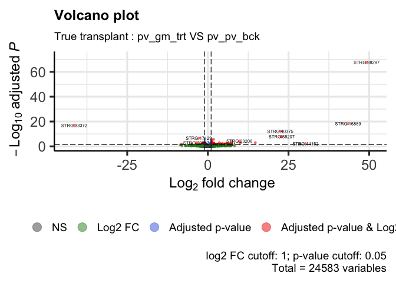
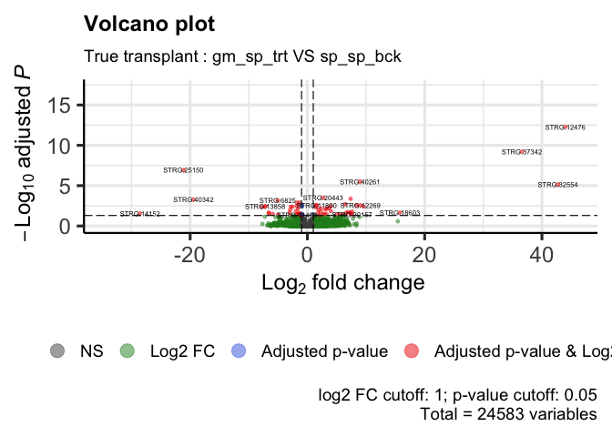
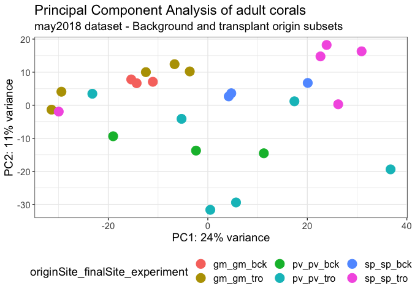
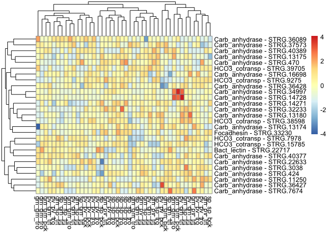

DE_Astroides_adult_trueTransplant
================
Marc Meynadier
6/3/2022

``` r
# Differential expression on Kallisto data 

# True transplant 

# Packages and dependence
packageCheckClassic <- function(x){
  for( i in x ){
    #  require returns TRUE invisibly if it was able to load package
    if( ! require( i , character.only = TRUE ) ){
      #  If package was not able to be loaded then re-install
      install.packages( i , dependencies = TRUE )
      #  Load package after installing
      require( i , character.only = TRUE )
    }
  }
}

packageCheckClassic(c('DESeq2','devtools','BiocManager','ggplot2','ggrepel','markdown','RColorBrewer','genefilter','gplots','vegan','dplyr'))
```

    ## Le chargement a nécessité le package : DESeq2

    ## Le chargement a nécessité le package : S4Vectors

    ## Warning: le package 'S4Vectors' a été compilé avec la version R 4.1.3

    ## Le chargement a nécessité le package : stats4

    ## Le chargement a nécessité le package : BiocGenerics

    ## 
    ## Attachement du package : 'BiocGenerics'

    ## Les objets suivants sont masqués depuis 'package:stats':
    ## 
    ##     IQR, mad, sd, var, xtabs

    ## Les objets suivants sont masqués depuis 'package:base':
    ## 
    ##     anyDuplicated, append, as.data.frame, basename, cbind, colnames,
    ##     dirname, do.call, duplicated, eval, evalq, Filter, Find, get, grep,
    ##     grepl, intersect, is.unsorted, lapply, Map, mapply, match, mget,
    ##     order, paste, pmax, pmax.int, pmin, pmin.int, Position, rank,
    ##     rbind, Reduce, rownames, sapply, setdiff, sort, table, tapply,
    ##     union, unique, unsplit, which.max, which.min

    ## 
    ## Attachement du package : 'S4Vectors'

    ## Les objets suivants sont masqués depuis 'package:base':
    ## 
    ##     expand.grid, I, unname

    ## Le chargement a nécessité le package : IRanges

    ## Le chargement a nécessité le package : GenomicRanges

    ## Le chargement a nécessité le package : GenomeInfoDb

    ## Le chargement a nécessité le package : SummarizedExperiment

    ## Le chargement a nécessité le package : MatrixGenerics

    ## Le chargement a nécessité le package : matrixStats

    ## 
    ## Attachement du package : 'MatrixGenerics'

    ## Les objets suivants sont masqués depuis 'package:matrixStats':
    ## 
    ##     colAlls, colAnyNAs, colAnys, colAvgsPerRowSet, colCollapse,
    ##     colCounts, colCummaxs, colCummins, colCumprods, colCumsums,
    ##     colDiffs, colIQRDiffs, colIQRs, colLogSumExps, colMadDiffs,
    ##     colMads, colMaxs, colMeans2, colMedians, colMins, colOrderStats,
    ##     colProds, colQuantiles, colRanges, colRanks, colSdDiffs, colSds,
    ##     colSums2, colTabulates, colVarDiffs, colVars, colWeightedMads,
    ##     colWeightedMeans, colWeightedMedians, colWeightedSds,
    ##     colWeightedVars, rowAlls, rowAnyNAs, rowAnys, rowAvgsPerColSet,
    ##     rowCollapse, rowCounts, rowCummaxs, rowCummins, rowCumprods,
    ##     rowCumsums, rowDiffs, rowIQRDiffs, rowIQRs, rowLogSumExps,
    ##     rowMadDiffs, rowMads, rowMaxs, rowMeans2, rowMedians, rowMins,
    ##     rowOrderStats, rowProds, rowQuantiles, rowRanges, rowRanks,
    ##     rowSdDiffs, rowSds, rowSums2, rowTabulates, rowVarDiffs, rowVars,
    ##     rowWeightedMads, rowWeightedMeans, rowWeightedMedians,
    ##     rowWeightedSds, rowWeightedVars

    ## Le chargement a nécessité le package : Biobase

    ## Welcome to Bioconductor
    ## 
    ##     Vignettes contain introductory material; view with
    ##     'browseVignettes()'. To cite Bioconductor, see
    ##     'citation("Biobase")', and for packages 'citation("pkgname")'.

    ## 
    ## Attachement du package : 'Biobase'

    ## L'objet suivant est masqué depuis 'package:MatrixGenerics':
    ## 
    ##     rowMedians

    ## Les objets suivants sont masqués depuis 'package:matrixStats':
    ## 
    ##     anyMissing, rowMedians

    ## Le chargement a nécessité le package : devtools

    ## Le chargement a nécessité le package : usethis

    ## Le chargement a nécessité le package : BiocManager

    ## Bioconductor version '3.14' is out-of-date; the current release version '3.15'
    ##   is available with R version '4.2'; see https://bioconductor.org/install

    ## 
    ## Attachement du package : 'BiocManager'

    ## L'objet suivant est masqué depuis 'package:devtools':
    ## 
    ##     install

    ## Le chargement a nécessité le package : ggplot2

    ## Le chargement a nécessité le package : ggrepel

    ## Le chargement a nécessité le package : markdown

    ## Le chargement a nécessité le package : RColorBrewer

    ## Le chargement a nécessité le package : genefilter

    ## 
    ## Attachement du package : 'genefilter'

    ## Les objets suivants sont masqués depuis 'package:MatrixGenerics':
    ## 
    ##     rowSds, rowVars

    ## Les objets suivants sont masqués depuis 'package:matrixStats':
    ## 
    ##     rowSds, rowVars

    ## Le chargement a nécessité le package : gplots

    ## 
    ## Attachement du package : 'gplots'

    ## L'objet suivant est masqué depuis 'package:IRanges':
    ## 
    ##     space

    ## L'objet suivant est masqué depuis 'package:S4Vectors':
    ## 
    ##     space

    ## L'objet suivant est masqué depuis 'package:stats':
    ## 
    ##     lowess

    ## Le chargement a nécessité le package : vegan

    ## Le chargement a nécessité le package : permute

    ## 
    ## Attachement du package : 'permute'

    ## L'objet suivant est masqué depuis 'package:devtools':
    ## 
    ##     check

    ## Le chargement a nécessité le package : lattice

    ## This is vegan 2.6-2

    ## Le chargement a nécessité le package : dplyr

    ## 
    ## Attachement du package : 'dplyr'

    ## L'objet suivant est masqué depuis 'package:Biobase':
    ## 
    ##     combine

    ## L'objet suivant est masqué depuis 'package:matrixStats':
    ## 
    ##     count

    ## Les objets suivants sont masqués depuis 'package:GenomicRanges':
    ## 
    ##     intersect, setdiff, union

    ## L'objet suivant est masqué depuis 'package:GenomeInfoDb':
    ## 
    ##     intersect

    ## Les objets suivants sont masqués depuis 'package:IRanges':
    ## 
    ##     collapse, desc, intersect, setdiff, slice, union

    ## Les objets suivants sont masqués depuis 'package:S4Vectors':
    ## 
    ##     first, intersect, rename, setdiff, setequal, union

    ## Les objets suivants sont masqués depuis 'package:BiocGenerics':
    ## 
    ##     combine, intersect, setdiff, union

    ## Les objets suivants sont masqués depuis 'package:stats':
    ## 
    ##     filter, lag

    ## Les objets suivants sont masqués depuis 'package:base':
    ## 
    ##     intersect, setdiff, setequal, union

``` r
#BiocManager::install('tximport', force = TRUE)
#BiocManager::install('apeglm')
#BiocManager::install('ashr')
#BiocManager::install("EnhancedVolcano")
#BiocManager::install('limma')
#devtools::install_github('cran/GMD')
if (!require(devtools)) install.packages("devtools")
devtools::install_github("yanlinlin82/ggvenn")
```

    ## Skipping install of 'ggvenn' from a github remote, the SHA1 (b7ff54ba) has not changed since last install.
    ##   Use `force = TRUE` to force installation

``` r
library('ggvenn')
```

    ## Le chargement a nécessité le package : grid

``` r
library('tximport')
library('apeglm')
library('ashr')
library('EnhancedVolcano')
```

    ## Registered S3 methods overwritten by 'ggalt':
    ##   method                  from   
    ##   grid.draw.absoluteGrob  ggplot2
    ##   grobHeight.absoluteGrob ggplot2
    ##   grobWidth.absoluteGrob  ggplot2
    ##   grobX.absoluteGrob      ggplot2
    ##   grobY.absoluteGrob      ggplot2

``` r
source_url("https://raw.githubusercontent.com/obigriffith/biostar-tutorials/master/Heatmaps/heatmap.3.R")
```

    ## ℹ SHA-1 hash of file is 015fc0457e61e3e93a903e69a24d96d2dac7b9fb

``` r
# Working environment 
scriptPath<-dirname(rstudioapi::getSourceEditorContext()$path)
setwd(scriptPath)
samples<-read.table('tximport_design_trueTransplant.txt',header=T)
samplesBck<-read.table('tximport_design_trueTransplant_bck.txt',header=T)
samplesTro<-read.table('tximport_design_trueTransplant_tro.txt',header=T)
samplesBckTro<-read.table('tximport_design_trueTransplant_tro_bck.txt',header=T)
samplesTrt<-read.table('tximport_design_trueTransplant_trt.txt',header=T)
tx2gene<-read.table('tx2gene_adultTranscriptome',header=T)
candidateGenes<-read.csv('candidateGenes.csv',header=T,sep=',')
scriptPath <- sub("/[^/]+$", "", scriptPath)
scriptPath <- sub("/[^/]+$", "", scriptPath)
dataPath<-'/data/net/6_kallisto/adultTranscriptome/adult/4_trueTransplant'
outputPath<-paste(scriptPath,'/output/DESeq2/adultTranscriptome/adult/4_trueTransplant/',sep='')
wdPath<-paste(scriptPath,dataPath,sep='')
setwd(wdPath)

# Data importation - txImport
files<-paste0(samples$samples,'.tsv')
filesBck<-paste0(samplesBck$samples,'.tsv')
filesTro<-paste0(samplesTro$samples,'.tsv')
filesBckTro<-paste0(samplesBckTro$samples,'.tsv')
filesTrt<-paste0(samplesTrt$samples,'.tsv')
names(files)<-samples$samples
names(filesBck)<-samplesBck$samples
names(filesTro)<-samplesTro$samples
names(filesBckTro)<-samplesBckTro$samples
names(filesTrt)<-samplesTrt$samples
txi<-tximport(files = files,type='kallisto',tx2gene = tx2gene)
```

    ## Note: importing `abundance.h5` is typically faster than `abundance.tsv`

    ## reading in files with read_tsv

    ## 1 2 3 4 5 6 7 8 9 10 11 12 13 14 15 16 17 18 19 20 21 22 23 24 25 26 27 28 29 30 31 32 33 34 35 36 37 38 39 40 41 42 43 44 
    ## transcripts missing from tx2gene: 1
    ## summarizing abundance
    ## summarizing counts
    ## summarizing length

``` r
txiBck<-tximport(files = filesBck,type='kallisto',tx2gene = tx2gene)
```

    ## Note: importing `abundance.h5` is typically faster than `abundance.tsv`
    ## reading in files with read_tsv
    ## 1 2 3 4 5 6 7 8 9 
    ## transcripts missing from tx2gene: 1
    ## summarizing abundance
    ## summarizing counts
    ## summarizing length

``` r
txiTro<-tximport(files = filesTro,type='kallisto',tx2gene = tx2gene)
```

    ## Note: importing `abundance.h5` is typically faster than `abundance.tsv`
    ## reading in files with read_tsv
    ## 1 2 3 4 5 6 7 8 9 10 11 12 13 14 15 16 
    ## transcripts missing from tx2gene: 1
    ## summarizing abundance
    ## summarizing counts
    ## summarizing length

``` r
txiBckTro<-tximport(files = filesBckTro,type='kallisto',tx2gene = tx2gene)
```

    ## Note: importing `abundance.h5` is typically faster than `abundance.tsv`
    ## reading in files with read_tsv
    ## 1 2 3 4 5 6 7 8 9 10 11 12 13 14 15 16 17 18 19 20 21 22 23 24 25 
    ## transcripts missing from tx2gene: 1
    ## summarizing abundance
    ## summarizing counts
    ## summarizing length

``` r
txiTrt<-tximport(files = filesTrt,type='kallisto',tx2gene = tx2gene)
```

    ## Note: importing `abundance.h5` is typically faster than `abundance.tsv`
    ## reading in files with read_tsv
    ## 1 2 3 4 5 6 7 8 9 10 11 12 13 14 15 16 17 18 19 
    ## transcripts missing from tx2gene: 1
    ## summarizing abundance
    ## summarizing counts
    ## summarizing length

``` r
names(txi)
```

    ## [1] "abundance"           "counts"              "length"             
    ## [4] "countsFromAbundance"

``` r
head(txi$counts)
```

    ##                    abundance_adult_may2018_gm_gm_bck_15873X22_trimmed
    ## TRINITY_DN0_c0_g1                                            579.0000
    ## TRINITY_DN0_c0_g2                                            114.2400
    ## TRINITY_DN0_c1_g1                                             21.1474
    ## TRINITY_DN1_c0_g1                                           2483.8000
    ## TRINITY_DN1_c1_g1                                              0.0000
    ## TRINITY_DN10_c0_g1                                           352.2210
    ##                    abundance_adult_may2018_gm_gm_bck_15873X31_trimmed
    ## TRINITY_DN0_c0_g1                                             874.000
    ## TRINITY_DN0_c0_g2                                             151.000
    ## TRINITY_DN0_c1_g1                                              31.000
    ## TRINITY_DN1_c0_g1                                            1956.560
    ## TRINITY_DN1_c1_g1                                               0.000
    ## TRINITY_DN10_c0_g1                                            364.377
    ##                    abundance_adult_may2018_gm_gm_bck_15941X16_trimmed
    ## TRINITY_DN0_c0_g1                                            532.0000
    ## TRINITY_DN0_c0_g2                                             82.0000
    ## TRINITY_DN0_c1_g1                                             15.1829
    ## TRINITY_DN1_c0_g1                                           2406.0000
    ## TRINITY_DN1_c1_g1                                              0.0000
    ## TRINITY_DN10_c0_g1                                           420.4660
    ##                    abundance_adult_may2018_gm_gm_tro_15873X28_trimmed
    ## TRINITY_DN0_c0_g1                                            1137.000
    ## TRINITY_DN0_c0_g2                                             181.881
    ## TRINITY_DN0_c1_g1                                              28.000
    ## TRINITY_DN1_c0_g1                                            1161.000
    ## TRINITY_DN1_c1_g1                                               0.000
    ## TRINITY_DN10_c0_g1                                            340.446
    ##                    abundance_adult_may2018_gm_gm_tro_15873X5_trimmed
    ## TRINITY_DN0_c0_g1                                            877.000
    ## TRINITY_DN0_c0_g2                                            145.746
    ## TRINITY_DN0_c1_g1                                             42.000
    ## TRINITY_DN1_c0_g1                                           1128.000
    ## TRINITY_DN1_c1_g1                                              0.000
    ## TRINITY_DN10_c0_g1                                           402.303
    ##                    abundance_adult_may2018_gm_gm_tro_15941X17_trimmed
    ## TRINITY_DN0_c0_g1                                            820.0000
    ## TRINITY_DN0_c0_g2                                            217.8190
    ## TRINITY_DN0_c1_g1                                             13.0586
    ## TRINITY_DN1_c0_g1                                           4157.8200
    ## TRINITY_DN1_c1_g1                                              0.0000
    ## TRINITY_DN10_c0_g1                                           618.5000
    ##                    abundance_adult_may2018_gm_gm_tro_15941X33_trimmed
    ## TRINITY_DN0_c0_g1                                           2247.0000
    ## TRINITY_DN0_c0_g2                                            220.0000
    ## TRINITY_DN0_c1_g1                                             62.8559
    ## TRINITY_DN1_c0_g1                                           1179.9000
    ## TRINITY_DN1_c1_g1                                              0.0000
    ## TRINITY_DN10_c0_g1                                           621.0650
    ##                    abundance_adult_may2018_gm_gm_tro_15941X5_trimmed
    ## TRINITY_DN0_c0_g1                                             623.00
    ## TRINITY_DN0_c0_g2                                             113.00
    ## TRINITY_DN0_c1_g1                                              34.00
    ## TRINITY_DN1_c0_g1                                            2980.79
    ## TRINITY_DN1_c1_g1                                               0.00
    ## TRINITY_DN10_c0_g1                                            409.83
    ##                    abundance_adult_may2018_gm_pv_trt_15873X32_trimmed
    ## TRINITY_DN0_c0_g1                                            920.0000
    ## TRINITY_DN0_c0_g2                                             91.2609
    ## TRINITY_DN0_c1_g1                                             15.0846
    ## TRINITY_DN1_c0_g1                                           3680.0000
    ## TRINITY_DN1_c1_g1                                              0.0000
    ## TRINITY_DN10_c0_g1                                           314.3110
    ##                    abundance_adult_may2018_gm_pv_trt_15873X8_trimmed
    ## TRINITY_DN0_c0_g1                                           635.0000
    ## TRINITY_DN0_c0_g2                                           156.0000
    ## TRINITY_DN0_c1_g1                                            13.0969
    ## TRINITY_DN1_c0_g1                                          2904.9000
    ## TRINITY_DN1_c1_g1                                             0.0000
    ## TRINITY_DN10_c0_g1                                          294.6820
    ##                    abundance_adult_may2018_gm_pv_trt_15941X20_trimmed
    ## TRINITY_DN0_c0_g1                                           1060.0000
    ## TRINITY_DN0_c0_g2                                             92.0000
    ## TRINITY_DN0_c1_g1                                             16.1139
    ## TRINITY_DN1_c0_g1                                            994.0000
    ## TRINITY_DN1_c1_g1                                              0.0000
    ## TRINITY_DN10_c0_g1                                           225.0080
    ##                    abundance_adult_may2018_gm_pv_trt_15941X40_trimmed
    ## TRINITY_DN0_c0_g1                                            1506.000
    ## TRINITY_DN0_c0_g2                                             118.000
    ## TRINITY_DN0_c1_g1                                              32.000
    ## TRINITY_DN1_c0_g1                                            1299.790
    ## TRINITY_DN1_c1_g1                                               0.000
    ## TRINITY_DN10_c0_g1                                            382.047
    ##                    abundance_adult_may2018_gm_pv_trt_15941X7_trimmed
    ## TRINITY_DN0_c0_g1                                           594.0000
    ## TRINITY_DN0_c0_g2                                            70.0000
    ## TRINITY_DN0_c1_g1                                            15.2788
    ## TRINITY_DN1_c0_g1                                           518.0000
    ## TRINITY_DN1_c1_g1                                             0.0000
    ## TRINITY_DN10_c0_g1                                          112.4760
    ##                    abundance_adult_may2018_gm_sp_trt_15873X25_trimmed
    ## TRINITY_DN0_c0_g1                                            1195.000
    ## TRINITY_DN0_c0_g2                                             198.000
    ## TRINITY_DN0_c1_g1                                              23.000
    ## TRINITY_DN1_c0_g1                                            1177.000
    ## TRINITY_DN1_c1_g1                                               0.000
    ## TRINITY_DN10_c0_g1                                            305.009
    ##                    abundance_adult_may2018_gm_sp_trt_15873X3_trimmed
    ## TRINITY_DN0_c0_g1                                           613.0000
    ## TRINITY_DN0_c0_g2                                           154.0000
    ## TRINITY_DN0_c1_g1                                            28.0476
    ## TRINITY_DN1_c0_g1                                          3960.5800
    ## TRINITY_DN1_c1_g1                                             0.0000
    ## TRINITY_DN10_c0_g1                                          434.8940
    ##                    abundance_adult_may2018_gm_sp_trt_15873X42_trimmed
    ## TRINITY_DN0_c0_g1                                            547.0000
    ## TRINITY_DN0_c0_g2                                             88.0000
    ## TRINITY_DN0_c1_g1                                             14.6918
    ## TRINITY_DN1_c0_g1                                           2810.0000
    ## TRINITY_DN1_c1_g1                                              0.0000
    ## TRINITY_DN10_c0_g1                                           347.5170
    ##                    abundance_adult_may2018_gm_sp_trt_15941X30_trimmed
    ## TRINITY_DN0_c0_g1                                            489.0000
    ## TRINITY_DN0_c0_g2                                            112.0000
    ## TRINITY_DN0_c1_g1                                             26.0782
    ## TRINITY_DN1_c0_g1                                           3502.0000
    ## TRINITY_DN1_c1_g1                                              0.0000
    ## TRINITY_DN10_c0_g1                                           348.0780
    ##                    abundance_adult_may2018_gm_sp_trt_15941X3_trimmed
    ## TRINITY_DN0_c0_g1                                            531.000
    ## TRINITY_DN0_c0_g2                                             75.000
    ## TRINITY_DN0_c1_g1                                              8.000
    ## TRINITY_DN1_c0_g1                                           1340.000
    ## TRINITY_DN1_c1_g1                                              0.000
    ## TRINITY_DN10_c0_g1                                           179.549
    ##                    abundance_adult_may2018_pv_gm_trt_15873X29_trimmed
    ## TRINITY_DN0_c0_g1                                             421.000
    ## TRINITY_DN0_c0_g2                                             189.000
    ## TRINITY_DN0_c1_g1                                              17.000
    ## TRINITY_DN1_c0_g1                                            2543.000
    ## TRINITY_DN1_c1_g1                                               0.000
    ## TRINITY_DN10_c0_g1                                            326.431
    ##                    abundance_adult_may2018_pv_gm_trt_15873X6_trimmed
    ## TRINITY_DN0_c0_g1                                           748.0000
    ## TRINITY_DN0_c0_g2                                           132.8390
    ## TRINITY_DN0_c1_g1                                            39.1805
    ## TRINITY_DN1_c0_g1                                           624.0000
    ## TRINITY_DN1_c1_g1                                             0.0000
    ## TRINITY_DN10_c0_g1                                          261.7620
    ##                    abundance_adult_may2018_pv_gm_trt_15941X18_trimmed
    ## TRINITY_DN0_c0_g1                                           1216.0000
    ## TRINITY_DN0_c0_g2                                            231.0000
    ## TRINITY_DN0_c1_g1                                             26.2278
    ## TRINITY_DN1_c0_g1                                           1187.0000
    ## TRINITY_DN1_c1_g1                                              0.0000
    ## TRINITY_DN10_c0_g1                                           422.1040
    ##                    abundance_adult_may2018_pv_gm_trt_15941X34_trimmed
    ## TRINITY_DN0_c0_g1                                             943.000
    ## TRINITY_DN0_c0_g2                                             152.000
    ## TRINITY_DN0_c1_g1                                              19.000
    ## TRINITY_DN1_c0_g1                                            3541.000
    ## TRINITY_DN1_c1_g1                                               0.000
    ## TRINITY_DN10_c0_g1                                            510.854
    ##                    abundance_adult_may2018_pv_gm_trt_15941X6_trimmed
    ## TRINITY_DN0_c0_g1                                            805.000
    ## TRINITY_DN0_c0_g2                                            135.000
    ## TRINITY_DN0_c1_g1                                             17.000
    ## TRINITY_DN1_c0_g1                                           1140.540
    ## TRINITY_DN1_c1_g1                                              0.000
    ## TRINITY_DN10_c0_g1                                           315.937
    ##                    abundance_adult_may2018_pv_pv_bck_15873X19_trimmed
    ## TRINITY_DN0_c0_g1                                             827.000
    ## TRINITY_DN0_c0_g2                                             151.000
    ## TRINITY_DN0_c1_g1                                              27.134
    ## TRINITY_DN1_c0_g1                                            2731.860
    ## TRINITY_DN1_c1_g1                                               0.000
    ## TRINITY_DN10_c0_g1                                            312.656
    ##                    abundance_adult_may2018_pv_pv_bck_15941X42_trimmed
    ## TRINITY_DN0_c0_g1                                           1130.0000
    ## TRINITY_DN0_c0_g2                                            201.0000
    ## TRINITY_DN0_c1_g1                                             20.0949
    ## TRINITY_DN1_c0_g1                                           2895.0000
    ## TRINITY_DN1_c1_g1                                              0.0000
    ## TRINITY_DN10_c0_g1                                           422.7290
    ##                    abundance_adult_may2018_pv_pv_bck_15941X52_trimmed
    ## TRINITY_DN0_c0_g1                                             824.000
    ## TRINITY_DN0_c0_g2                                              82.000
    ## TRINITY_DN0_c1_g1                                               9.000
    ## TRINITY_DN1_c0_g1                                            2423.000
    ## TRINITY_DN1_c1_g1                                               0.000
    ## TRINITY_DN10_c0_g1                                            354.774
    ##                    abundance_adult_may2018_pv_pv_tro_15873X33_trimmed
    ## TRINITY_DN0_c0_g1                                            640.0000
    ## TRINITY_DN0_c0_g2                                            102.0000
    ## TRINITY_DN0_c1_g1                                             14.2261
    ## TRINITY_DN1_c0_g1                                           2746.8100
    ## TRINITY_DN1_c1_g1                                              0.0000
    ## TRINITY_DN10_c0_g1                                           215.3340
    ##                    abundance_adult_may2018_pv_pv_tro_15873X9_trimmed
    ## TRINITY_DN0_c0_g1                                            730.000
    ## TRINITY_DN0_c0_g2                                            140.000
    ## TRINITY_DN0_c1_g1                                             18.000
    ## TRINITY_DN1_c0_g1                                           1817.000
    ## TRINITY_DN1_c1_g1                                              0.000
    ## TRINITY_DN10_c0_g1                                           254.003
    ##                    abundance_adult_may2018_pv_pv_tro_15941X21_trimmed
    ## TRINITY_DN0_c0_g1                                             859.000
    ## TRINITY_DN0_c0_g2                                             175.000
    ## TRINITY_DN0_c1_g1                                              19.052
    ## TRINITY_DN1_c0_g1                                            5596.840
    ## TRINITY_DN1_c1_g1                                               0.000
    ## TRINITY_DN10_c0_g1                                            405.289
    ##                    abundance_adult_may2018_pv_pv_tro_15941X22_trimmed
    ## TRINITY_DN0_c0_g1                                           1000.0000
    ## TRINITY_DN0_c0_g2                                             77.0000
    ## TRINITY_DN0_c1_g1                                             22.0873
    ## TRINITY_DN1_c0_g1                                           3065.9000
    ## TRINITY_DN1_c1_g1                                              0.0000
    ## TRINITY_DN10_c0_g1                                           364.8080
    ##                    abundance_adult_may2018_pv_pv_tro_15941X41_trimmed
    ## TRINITY_DN0_c0_g1                                           1754.0000
    ## TRINITY_DN0_c0_g2                                            123.0000
    ## TRINITY_DN0_c1_g1                                             10.1636
    ## TRINITY_DN1_c0_g1                                           2477.0000
    ## TRINITY_DN1_c1_g1                                              0.0000
    ## TRINITY_DN10_c0_g1                                           535.1100
    ##                    abundance_adult_may2018_pv_pv_tro_15941X8_trimmed
    ## TRINITY_DN0_c0_g1                                            788.000
    ## TRINITY_DN0_c0_g2                                             56.000
    ## TRINITY_DN0_c1_g1                                             22.000
    ## TRINITY_DN1_c0_g1                                           1629.000
    ## TRINITY_DN1_c1_g1                                              0.000
    ## TRINITY_DN10_c0_g1                                           254.054
    ##                    abundance_adult_may2018_sp_gm_trt_15873X27_trimmed
    ## TRINITY_DN0_c0_g1                                             536.000
    ## TRINITY_DN0_c0_g2                                             266.000
    ## TRINITY_DN0_c1_g1                                              22.000
    ## TRINITY_DN1_c0_g1                                            3568.000
    ## TRINITY_DN1_c1_g1                                               0.000
    ## TRINITY_DN10_c0_g1                                            466.372
    ##                    abundance_adult_may2018_sp_gm_trt_15873X4_trimmed
    ## TRINITY_DN0_c0_g1                                          753.00000
    ## TRINITY_DN0_c0_g2                                          174.00000
    ## TRINITY_DN0_c1_g1                                            6.03349
    ## TRINITY_DN1_c0_g1                                         1979.00000
    ## TRINITY_DN1_c1_g1                                            0.00000
    ## TRINITY_DN10_c0_g1                                         434.42900
    ##                    abundance_adult_may2018_sp_gm_trt_15941X32_trimmed
    ## TRINITY_DN0_c0_g1                                           610.00000
    ## TRINITY_DN0_c0_g2                                           100.00000
    ## TRINITY_DN0_c1_g1                                             5.10079
    ## TRINITY_DN1_c0_g1                                          3229.92000
    ## TRINITY_DN1_c1_g1                                             0.00000
    ## TRINITY_DN10_c0_g1                                          357.62500
    ##                    abundance_adult_may2018_sp_gm_trt_15941X4_trimmed
    ## TRINITY_DN0_c0_g1                                          1139.0000
    ## TRINITY_DN0_c0_g2                                           269.0000
    ## TRINITY_DN0_c1_g1                                            63.7267
    ## TRINITY_DN1_c0_g1                                           973.5230
    ## TRINITY_DN1_c1_g1                                             0.0000
    ## TRINITY_DN10_c0_g1                                          428.5060
    ##                    abundance_adult_may2018_sp_sp_bck_15873X26_trimmed
    ## TRINITY_DN0_c0_g1                                            711.0000
    ## TRINITY_DN0_c0_g2                                            144.6610
    ## TRINITY_DN0_c1_g1                                             14.1281
    ## TRINITY_DN1_c0_g1                                           2340.0000
    ## TRINITY_DN1_c1_g1                                              0.0000
    ## TRINITY_DN10_c0_g1                                           584.2590
    ##                    abundance_adult_may2018_sp_sp_bck_15873X43_trimmed
    ## TRINITY_DN0_c0_g1                                             484.000
    ## TRINITY_DN0_c0_g2                                             121.000
    ## TRINITY_DN0_c1_g1                                              13.000
    ## TRINITY_DN1_c0_g1                                            3895.000
    ## TRINITY_DN1_c1_g1                                               0.000
    ## TRINITY_DN10_c0_g1                                            333.729
    ##                    abundance_adult_may2018_sp_sp_bck_15941X31_trimmed
    ## TRINITY_DN0_c0_g1                                            605.0000
    ## TRINITY_DN0_c0_g2                                            121.0000
    ## TRINITY_DN0_c1_g1                                             14.1333
    ## TRINITY_DN1_c0_g1                                           1840.0000
    ## TRINITY_DN1_c1_g1                                              0.0000
    ## TRINITY_DN10_c0_g1                                           318.3180
    ##                    abundance_adult_may2018_sp_sp_tro_15873X24_trimmed
    ## TRINITY_DN0_c0_g1                                             804.000
    ## TRINITY_DN0_c0_g2                                             135.000
    ## TRINITY_DN0_c1_g1                                              24.000
    ## TRINITY_DN1_c0_g1                                            1622.000
    ## TRINITY_DN1_c1_g1                                               0.000
    ## TRINITY_DN10_c0_g1                                            266.187
    ##                    abundance_adult_may2018_sp_sp_tro_15873X2_trimmed
    ## TRINITY_DN0_c0_g1                                          1337.0000
    ## TRINITY_DN0_c0_g2                                           167.0000
    ## TRINITY_DN0_c1_g1                                            91.6671
    ## TRINITY_DN1_c0_g1                                           958.0000
    ## TRINITY_DN1_c1_g1                                             0.0000
    ## TRINITY_DN10_c0_g1                                          383.3530
    ##                    abundance_adult_may2018_sp_sp_tro_15873X41_trimmed
    ## TRINITY_DN0_c0_g1                                             675.000
    ## TRINITY_DN0_c0_g2                                              87.467
    ## TRINITY_DN0_c1_g1                                              20.000
    ## TRINITY_DN1_c0_g1                                            2794.820
    ## TRINITY_DN1_c1_g1                                               0.000
    ## TRINITY_DN10_c0_g1                                            342.957
    ##                    abundance_adult_may2018_sp_sp_tro_15941X29_trimmed
    ## TRINITY_DN0_c0_g1                                           1112.0000
    ## TRINITY_DN0_c0_g2                                             90.7702
    ## TRINITY_DN0_c1_g1                                             24.4845
    ## TRINITY_DN1_c0_g1                                            672.0000
    ## TRINITY_DN1_c1_g1                                              0.0000
    ## TRINITY_DN10_c0_g1                                           318.7240
    ##                    abundance_adult_may2018_sp_sp_tro_15941X2_trimmed
    ## TRINITY_DN0_c0_g1                                           596.0000
    ## TRINITY_DN0_c0_g2                                            86.0000
    ## TRINITY_DN0_c1_g1                                            13.0707
    ## TRINITY_DN1_c0_g1                                          2099.0000
    ## TRINITY_DN1_c1_g1                                             0.0000
    ## TRINITY_DN10_c0_g1                                          302.8060

``` r
dds<-DESeqDataSetFromTximport(txi,colData=samples,design= ~originSite_finalSite_experiment)
```

    ## Warning in DESeqDataSet(se, design = design, ignoreRank): some variables in
    ## design formula are characters, converting to factors

    ## using counts and average transcript lengths from tximport

``` r
ddsBck<-DESeqDataSetFromTximport(txiBck,colData=samplesBck,design= ~originSite_finalSite_experiment)
```

    ## Warning in DESeqDataSet(se, design = design, ignoreRank): some variables in
    ## design formula are characters, converting to factors

    ## using counts and average transcript lengths from tximport

``` r
ddsTro<-DESeqDataSetFromTximport(txiTro,colData=samplesTro,design= ~originSite_finalSite_experiment)
```

    ## Warning in DESeqDataSet(se, design = design, ignoreRank): some variables in
    ## design formula are characters, converting to factors

    ## using counts and average transcript lengths from tximport

``` r
ddsBckTro<-DESeqDataSetFromTximport(txiBckTro,colData=samplesBckTro,design= ~originSite_finalSite_experiment)
```

    ## Warning in DESeqDataSet(se, design = design, ignoreRank): some variables in
    ## design formula are characters, converting to factors

    ## using counts and average transcript lengths from tximport

``` r
ddsTrt<-DESeqDataSetFromTximport(txiTrt,colData=samplesTrt,design= ~originSite_finalSite_experiment)
```

    ## Warning in DESeqDataSet(se, design = design, ignoreRank): some variables in
    ## design formula are characters, converting to factors

    ## using counts and average transcript lengths from tximport

``` r
# pre-filtering
keep <- rowSums(counts(dds)) >= 10 
dds <- dds[keep,]
keep <- rowSums(counts(ddsBck)) >= 10 
ddsBck <- ddsBck[keep,]
keep <- rowSums(counts(ddsTro)) >= 10 
ddsTro <- ddsTro[keep,]
keep <- rowSums(counts(ddsBckTro)) >= 10 
ddsBckTro <- ddsBckTro[keep,]
keep <- rowSums(counts(ddsTrt)) >= 10 
ddsTrt <- ddsTrt[keep,]

# Differential expression analysis
dds<-DESeq(dds)
```

    ## estimating size factors
    ## using 'avgTxLength' from assays(dds), correcting for library size
    ## estimating dispersions
    ## gene-wise dispersion estimates
    ## mean-dispersion relationship
    ## final dispersion estimates
    ## fitting model and testing

``` r
ddsBck<-DESeq(ddsBck)
```

    ## estimating size factors
    ## using 'avgTxLength' from assays(dds), correcting for library size
    ## estimating dispersions
    ## gene-wise dispersion estimates
    ## mean-dispersion relationship
    ## final dispersion estimates
    ## fitting model and testing

``` r
ddsTro<-DESeq(ddsTro)
```

    ## estimating size factors
    ## using 'avgTxLength' from assays(dds), correcting for library size
    ## estimating dispersions
    ## gene-wise dispersion estimates
    ## mean-dispersion relationship
    ## final dispersion estimates
    ## fitting model and testing

``` r
ddsBckTro<-DESeq(ddsBckTro)
```

    ## estimating size factors
    ## using 'avgTxLength' from assays(dds), correcting for library size
    ## estimating dispersions
    ## gene-wise dispersion estimates
    ## mean-dispersion relationship
    ## final dispersion estimates
    ## fitting model and testing

``` r
ddsTrt<-DESeq(ddsTrt)
```

    ## estimating size factors
    ## using 'avgTxLength' from assays(dds), correcting for library size
    ## estimating dispersions
    ## gene-wise dispersion estimates
    ## mean-dispersion relationship
    ## final dispersion estimates
    ## fitting model and testing

``` r
cbind(resultsNames(dds))
```

    ##       [,1]                                                    
    ##  [1,] "Intercept"                                             
    ##  [2,] "originSite_finalSite_experiment_gm_gm_tro_vs_gm_gm_bck"
    ##  [3,] "originSite_finalSite_experiment_gm_pv_trt_vs_gm_gm_bck"
    ##  [4,] "originSite_finalSite_experiment_gm_sp_trt_vs_gm_gm_bck"
    ##  [5,] "originSite_finalSite_experiment_pv_gm_trt_vs_gm_gm_bck"
    ##  [6,] "originSite_finalSite_experiment_pv_pv_bck_vs_gm_gm_bck"
    ##  [7,] "originSite_finalSite_experiment_pv_pv_tro_vs_gm_gm_bck"
    ##  [8,] "originSite_finalSite_experiment_sp_gm_trt_vs_gm_gm_bck"
    ##  [9,] "originSite_finalSite_experiment_sp_sp_bck_vs_gm_gm_bck"
    ## [10,] "originSite_finalSite_experiment_sp_sp_tro_vs_gm_gm_bck"

``` r
gm_gm_tro_VS_gm_gm_bck<-results(dds, contrast=c("originSite_finalSite_experiment","gm_gm_tro","gm_gm_bck"), alpha = 0.05)
pv_pv_tro_VS_pv_pv_bck<-results(dds, contrast=c("originSite_finalSite_experiment","pv_pv_tro","pv_pv_bck"), alpha = 0.05)
sp_sp_tro_VS_sp_sp_bck<-results(dds, contrast=c("originSite_finalSite_experiment","sp_sp_tro","sp_sp_bck"), alpha = 0.05)
pv_gm_trt_VS_pv_pv_bck<-results(dds, contrast=c("originSite_finalSite_experiment","pv_gm_trt","pv_pv_bck"), alpha = 0.05)
sp_gm_trt_VS_sp_sp_bck<-results(dds, contrast=c("originSite_finalSite_experiment","sp_gm_trt","sp_sp_bck"), alpha = 0.05)
pv_gm_trt_VS_gm_gm_bck<-results(dds, contrast=c("originSite_finalSite_experiment","pv_gm_trt","gm_gm_bck"), alpha = 0.05)
sp_gm_trt_VS_gm_gm_bck<-results(dds, contrast=c("originSite_finalSite_experiment","sp_gm_trt","gm_gm_bck"), alpha = 0.05)
gm_pv_trt_VS_pv_pv_bck<-results(dds, contrast=c("originSite_finalSite_experiment","gm_pv_trt","pv_pv_bck"), alpha = 0.05)
gm_sp_trt_VS_sp_sp_bck<-results(dds, contrast=c("originSite_finalSite_experiment","gm_sp_trt","sp_sp_bck"), alpha = 0.05)
gm_pv_trt_VS_gm_gm_bck<-results(dds, contrast=c("originSite_finalSite_experiment","gm_pv_trt","gm_gm_bck"), alpha = 0.05)
gm_sp_trt_VS_gm_gm_bck<-results(dds, contrast=c("originSite_finalSite_experiment","gm_sp_trt","gm_gm_bck"), alpha = 0.05)
summary(gm_gm_tro_VS_gm_gm_bck)
```

    ## 
    ## out of 65416 with nonzero total read count
    ## adjusted p-value < 0.05
    ## LFC > 0 (up)       : 23, 0.035%
    ## LFC < 0 (down)     : 18, 0.028%
    ## outliers [1]       : 102, 0.16%
    ## low counts [2]     : 29131, 45%
    ## (mean count < 5)
    ## [1] see 'cooksCutoff' argument of ?results
    ## [2] see 'independentFiltering' argument of ?results

``` r
summary(pv_pv_tro_VS_pv_pv_bck)
```

    ## 
    ## out of 65416 with nonzero total read count
    ## adjusted p-value < 0.05
    ## LFC > 0 (up)       : 44, 0.067%
    ## LFC < 0 (down)     : 21, 0.032%
    ## outliers [1]       : 102, 0.16%
    ## low counts [2]     : 25335, 39%
    ## (mean count < 3)
    ## [1] see 'cooksCutoff' argument of ?results
    ## [2] see 'independentFiltering' argument of ?results

``` r
summary(sp_sp_tro_VS_sp_sp_bck)
```

    ## 
    ## out of 65416 with nonzero total read count
    ## adjusted p-value < 0.05
    ## LFC > 0 (up)       : 105, 0.16%
    ## LFC < 0 (down)     : 53, 0.081%
    ## outliers [1]       : 102, 0.16%
    ## low counts [2]     : 31658, 48%
    ## (mean count < 6)
    ## [1] see 'cooksCutoff' argument of ?results
    ## [2] see 'independentFiltering' argument of ?results

``` r
summary(pv_gm_trt_VS_pv_pv_bck)
```

    ## 
    ## out of 65416 with nonzero total read count
    ## adjusted p-value < 0.05
    ## LFC > 0 (up)       : 116, 0.18%
    ## LFC < 0 (down)     : 77, 0.12%
    ## outliers [1]       : 102, 0.16%
    ## low counts [2]     : 30394, 46%
    ## (mean count < 5)
    ## [1] see 'cooksCutoff' argument of ?results
    ## [2] see 'independentFiltering' argument of ?results

``` r
summary(sp_gm_trt_VS_sp_sp_bck)
```

    ## 
    ## out of 65416 with nonzero total read count
    ## adjusted p-value < 0.05
    ## LFC > 0 (up)       : 280, 0.43%
    ## LFC < 0 (down)     : 86, 0.13%
    ## outliers [1]       : 102, 0.16%
    ## low counts [2]     : 32922, 50%
    ## (mean count < 7)
    ## [1] see 'cooksCutoff' argument of ?results
    ## [2] see 'independentFiltering' argument of ?results

``` r
summary(pv_gm_trt_VS_gm_gm_bck)
```

    ## 
    ## out of 65416 with nonzero total read count
    ## adjusted p-value < 0.05
    ## LFC > 0 (up)       : 44, 0.067%
    ## LFC < 0 (down)     : 45, 0.069%
    ## outliers [1]       : 102, 0.16%
    ## low counts [2]     : 27868, 43%
    ## (mean count < 4)
    ## [1] see 'cooksCutoff' argument of ?results
    ## [2] see 'independentFiltering' argument of ?results

``` r
summary(sp_gm_trt_VS_gm_gm_bck)
```

    ## 
    ## out of 65416 with nonzero total read count
    ## adjusted p-value < 0.05
    ## LFC > 0 (up)       : 26, 0.04%
    ## LFC < 0 (down)     : 30, 0.046%
    ## outliers [1]       : 102, 0.16%
    ## low counts [2]     : 27868, 43%
    ## (mean count < 4)
    ## [1] see 'cooksCutoff' argument of ?results
    ## [2] see 'independentFiltering' argument of ?results

``` r
summary(gm_pv_trt_VS_pv_pv_bck)
```

    ## 
    ## out of 65416 with nonzero total read count
    ## adjusted p-value < 0.05
    ## LFC > 0 (up)       : 101, 0.15%
    ## LFC < 0 (down)     : 99, 0.15%
    ## outliers [1]       : 102, 0.16%
    ## low counts [2]     : 29131, 45%
    ## (mean count < 5)
    ## [1] see 'cooksCutoff' argument of ?results
    ## [2] see 'independentFiltering' argument of ?results

``` r
summary(gm_sp_trt_VS_sp_sp_bck)
```

    ## 
    ## out of 65416 with nonzero total read count
    ## adjusted p-value < 0.05
    ## LFC > 0 (up)       : 62, 0.095%
    ## LFC < 0 (down)     : 42, 0.064%
    ## outliers [1]       : 102, 0.16%
    ## low counts [2]     : 29131, 45%
    ## (mean count < 5)
    ## [1] see 'cooksCutoff' argument of ?results
    ## [2] see 'independentFiltering' argument of ?results

``` r
summary(gm_pv_trt_VS_gm_gm_bck)
```

    ## 
    ## out of 65416 with nonzero total read count
    ## adjusted p-value < 0.05
    ## LFC > 0 (up)       : 786, 1.2%
    ## LFC < 0 (down)     : 909, 1.4%
    ## outliers [1]       : 102, 0.16%
    ## low counts [2]     : 36720, 56%
    ## (mean count < 11)
    ## [1] see 'cooksCutoff' argument of ?results
    ## [2] see 'independentFiltering' argument of ?results

``` r
summary(gm_sp_trt_VS_gm_gm_bck)
```

    ## 
    ## out of 65416 with nonzero total read count
    ## adjusted p-value < 0.05
    ## LFC > 0 (up)       : 73, 0.11%
    ## LFC < 0 (down)     : 26, 0.04%
    ## outliers [1]       : 102, 0.16%
    ## low counts [2]     : 29131, 45%
    ## (mean count < 5)
    ## [1] see 'cooksCutoff' argument of ?results
    ## [2] see 'independentFiltering' argument of ?results

``` r
# Exploring the results

# Results gm_gm_tro VS gm_gm_bck

#MA-plot
DESeq2::plotMA(gm_gm_tro_VS_gm_gm_bck,ylim=c(-50,50),main="MA-plot for the shrunken log2 fold changes\nTrue transplant : gm_gm_bck VS gm_gm_tro")
```

<!-- -->

``` r
# Volcano plot
pCutoff = 0.05
FCcutoff = 1.0
EnhancedVolcano(data.frame(gm_gm_tro_VS_gm_gm_bck), lab = rownames(data.frame(gm_gm_tro_VS_gm_gm_bck)), x = 'log2FoldChange', y = 'padj',
                xlab = bquote(~Log[2]~ 'fold change'), ylab = bquote(~-Log[10]~adjusted~italic(P)),
                pCutoff = pCutoff, FCcutoff = FCcutoff, pointSize = 1.0, labSize = 2.0,
                title = "Volcano plot", subtitle = "True transplant : gm_gm_bck VS gm_gm_tro",
                caption = paste0('log2 FC cutoff: ', FCcutoff, '; p-value cutoff: ', pCutoff, '\nTotal = ', nrow(gm_gm_tro_VS_gm_gm_bck), ' variables'),
                legendLabels=c('NS','Log2 FC','Adjusted p-value', 'Adjusted p-value & Log2 FC'),
                legendPosition = 'bottom', legendLabSize = 14, legendIconSize = 5.0)
```

<!-- -->

``` r
# Results pv_pv_tro VS pv_pv_bck

#MA-plot
DESeq2::plotMA(pv_pv_tro_VS_pv_pv_bck,ylim=c(-50,50),main="MA-plot for the shrunken log2 fold changes\nTrue transplant : pv_pv_bck VS pv_pv_tro")
```

<!-- -->

``` r
# Volcano plot
EnhancedVolcano(data.frame(pv_pv_tro_VS_pv_pv_bck), lab = rownames(data.frame(pv_pv_tro_VS_pv_pv_bck)), x = 'log2FoldChange', y = 'padj',
                xlab = bquote(~Log[2]~ 'fold change'), ylab = bquote(~-Log[10]~adjusted~italic(P)),
                pCutoff = pCutoff, FCcutoff = FCcutoff, pointSize = 1.0, labSize = 2.0,
                title = "Volcano plot", subtitle = "True transplant : pv_pv_bck VS pv_pv_tro",
                caption = paste0('log2 FC cutoff: ', FCcutoff, '; p-value cutoff: ', pCutoff, '\nTotal = ', nrow(pv_pv_tro_VS_pv_pv_bck), ' variables'),
                legendLabels=c('NS','Log2 FC','Adjusted p-value', 'Adjusted p-value & Log2 FC'),
                legendPosition = 'bottom', legendLabSize = 14, legendIconSize = 5.0)
```

<!-- -->

``` r
# Results sp_sp_tro VS sp_sp_bck

#MA-plot
DESeq2::plotMA(sp_sp_tro_VS_sp_sp_bck,ylim=c(-50,50),main="MA-plot for the shrunken log2 fold changes\nTrue transplant : sp_sp_bck VS sp_sp_tro")
```

<!-- -->

``` r
# Volcano plot
EnhancedVolcano(data.frame(sp_sp_tro_VS_sp_sp_bck), lab = rownames(data.frame(sp_sp_tro_VS_sp_sp_bck)), x = 'log2FoldChange', y = 'padj',
                xlab = bquote(~Log[2]~ 'fold change'), ylab = bquote(~-Log[10]~adjusted~italic(P)),
                pCutoff = pCutoff, FCcutoff = FCcutoff, pointSize = 1.0, labSize = 2.0,
                title = "Volcano plot", subtitle = "True transplant : sp_sp_bck VS sp_sp_tro",
                caption = paste0('log2 FC cutoff: ', FCcutoff, '; p-value cutoff: ', pCutoff, '\nTotal = ', nrow(sp_sp_tro_VS_sp_sp_bck), ' variables'),
                legendLabels=c('NS','Log2 FC','Adjusted p-value', 'Adjusted p-value & Log2 FC'),
                legendPosition = 'bottom', legendLabSize = 14, legendIconSize = 5.0)
```

<!-- -->

``` r
# Results pv_gm_trt VS pv_pv_bck

#MA-plot
DESeq2::plotMA(pv_gm_trt_VS_pv_pv_bck,ylim=c(-50,50),main="MA-plot for the shrunken log2 fold changes\nTrue transplant : pv_gm_trt VS pv_pv_bck")
```

<!-- -->

``` r
# Volcano plot
EnhancedVolcano(data.frame(pv_gm_trt_VS_pv_pv_bck), lab = rownames(data.frame(pv_gm_trt_VS_pv_pv_bck)), x = 'log2FoldChange', y = 'padj',
                xlab = bquote(~Log[2]~ 'fold change'), ylab = bquote(~-Log[10]~adjusted~italic(P)),
                pCutoff = pCutoff, FCcutoff = FCcutoff, pointSize = 1.0, labSize = 2.0,
                title = "Volcano plot", subtitle = "True transplant : pv_gm_trt VS pv_pv_bck",
                caption = paste0('log2 FC cutoff: ', FCcutoff, '; p-value cutoff: ', pCutoff, '\nTotal = ', nrow(pv_gm_trt_VS_pv_pv_bck), ' variables'),
                legendLabels=c('NS','Log2 FC','Adjusted p-value', 'Adjusted p-value & Log2 FC'),
                legendPosition = 'bottom', legendLabSize = 14, legendIconSize = 5.0)
```

<!-- -->

``` r
# Results sp_gm_trt VS sp_sp_bck

#MA-plot
DESeq2::plotMA(sp_gm_trt_VS_sp_sp_bck,ylim=c(-50,50),main="MA-plot for the shrunken log2 fold changes\nTrue transplant : sp_gm_trt VS sp_sp_bck")
```

<!-- -->

``` r
# Volcano plot
EnhancedVolcano(data.frame(sp_gm_trt_VS_sp_sp_bck), lab = rownames(data.frame(sp_gm_trt_VS_sp_sp_bck)), x = 'log2FoldChange', y = 'padj',
                xlab = bquote(~Log[2]~ 'fold change'), ylab = bquote(~-Log[10]~adjusted~italic(P)),
                pCutoff = pCutoff, FCcutoff = FCcutoff, pointSize = 1.0, labSize = 2.0,
                title = "Volcano plot", subtitle = "True transplant : sp_gm_trt VS sp_sp_bck",
                caption = paste0('log2 FC cutoff: ', FCcutoff, '; p-value cutoff: ', pCutoff, '\nTotal = ', nrow(sp_gm_trt_VS_sp_sp_bck), ' variables'),
                legendLabels=c('NS','Log2 FC','Adjusted p-value', 'Adjusted p-value & Log2 FC'),
                legendPosition = 'bottom', legendLabSize = 14, legendIconSize = 5.0)
```

<!-- -->

``` r
# Results pv_gm_trt VS gm_gm_bck

#MA-plot
DESeq2::plotMA(pv_gm_trt_VS_gm_gm_bck,ylim=c(-50,50),main="MA-plot for the shrunken log2 fold changes\nTrue transplant : pv_gm_trt VS gm_gm_bck")
```

<!-- -->

``` r
# Volcano plot
EnhancedVolcano(data.frame(pv_gm_trt_VS_gm_gm_bck), lab = rownames(data.frame(pv_gm_trt_VS_gm_gm_bck)), x = 'log2FoldChange', y = 'padj',
                xlab = bquote(~Log[2]~ 'fold change'), ylab = bquote(~-Log[10]~adjusted~italic(P)),
                pCutoff = pCutoff, FCcutoff = FCcutoff, pointSize = 1.0, labSize = 2.0,
                title = "Volcano plot", subtitle = "True transplant : pv_gm_trt VS gm_gm_bck",
                caption = paste0('log2 FC cutoff: ', FCcutoff, '; p-value cutoff: ', pCutoff, '\nTotal = ', nrow(pv_gm_trt_VS_gm_gm_bck), ' variables'),
                legendLabels=c('NS','Log2 FC','Adjusted p-value', 'Adjusted p-value & Log2 FC'),
                legendPosition = 'bottom', legendLabSize = 14, legendIconSize = 5.0)
```

<!-- -->

``` r
# Results sp_gm_trt VS gm_gm_bck

#MA-plot
DESeq2::plotMA(sp_gm_trt_VS_gm_gm_bck,ylim=c(-50,50),main="MA-plot for the shrunken log2 fold changes\nTrue transplant : sp_gm_trt VS gm_gm_bck")
```

<!-- -->

``` r
# Volcano plot
EnhancedVolcano(data.frame(sp_gm_trt_VS_gm_gm_bck), lab = rownames(data.frame(sp_gm_trt_VS_gm_gm_bck)), x = 'log2FoldChange', y = 'padj',
                xlab = bquote(~Log[2]~ 'fold change'), ylab = bquote(~-Log[10]~adjusted~italic(P)),
                pCutoff = pCutoff, FCcutoff = FCcutoff, pointSize = 1.0, labSize = 2.0,
                title = "Volcano plot", subtitle = "True transplant : sp_gm_trt VS gm_gm_bck",
                caption = paste0('log2 FC cutoff: ', FCcutoff, '; p-value cutoff: ', pCutoff, '\nTotal = ', nrow(sp_gm_trt_VS_gm_gm_bck), ' variables'),
                legendLabels=c('NS','Log2 FC','Adjusted p-value', 'Adjusted p-value & Log2 FC'),
                legendPosition = 'bottom', legendLabSize = 14, legendIconSize = 5.0)
```

<!-- -->

``` r
# Results gm_pv_trt VS pv_pv_bck

#MA-plot
DESeq2::plotMA(gm_pv_trt_VS_pv_pv_bck,ylim=c(-50,50),main="MA-plot for the shrunken log2 fold changes\nTrue transplant : gm_pv_trt VS pv_pv_bck")
```

<!-- -->

``` r
# Volcano plot
EnhancedVolcano(data.frame(gm_pv_trt_VS_pv_pv_bck), lab = rownames(data.frame(gm_pv_trt_VS_pv_pv_bck)), x = 'log2FoldChange', y = 'padj',
                xlab = bquote(~Log[2]~ 'fold change'), ylab = bquote(~-Log[10]~adjusted~italic(P)),
                pCutoff = pCutoff, FCcutoff = FCcutoff, pointSize = 1.0, labSize = 2.0,
                title = "Volcano plot", subtitle = "True transplant : gm_pv_trt VS pv_pv_bck",
                caption = paste0('log2 FC cutoff: ', FCcutoff, '; p-value cutoff: ', pCutoff, '\nTotal = ', nrow(gm_pv_trt_VS_pv_pv_bck), ' variables'),
                legendLabels=c('NS','Log2 FC','Adjusted p-value', 'Adjusted p-value & Log2 FC'),
                legendPosition = 'bottom', legendLabSize = 14, legendIconSize = 5.0)
```

<!-- -->

``` r
# Results gm_sp_trt VS sp_sp_bck

#MA-plot
DESeq2::plotMA(gm_sp_trt_VS_sp_sp_bck,ylim=c(-50,50),main="MA-plot for the shrunken log2 fold changes\nTrue transplant : gm_sp_trt VS sp_sp_bck")
```

<!-- -->

``` r
# Volcano plot
EnhancedVolcano(data.frame(gm_sp_trt_VS_sp_sp_bck), lab = rownames(data.frame(gm_sp_trt_VS_sp_sp_bck)), x = 'log2FoldChange', y = 'padj',
                xlab = bquote(~Log[2]~ 'fold change'), ylab = bquote(~-Log[10]~adjusted~italic(P)),
                pCutoff = pCutoff, FCcutoff = FCcutoff, pointSize = 1.0, labSize = 2.0,
                title = "Volcano plot", subtitle = "True transplant : gm_sp_trt VS sp_sp_bck",
                caption = paste0('log2 FC cutoff: ', FCcutoff, '; p-value cutoff: ', pCutoff, '\nTotal = ', nrow(gm_sp_trt_VS_sp_sp_bck), ' variables'),
                legendLabels=c('NS','Log2 FC','Adjusted p-value', 'Adjusted p-value & Log2 FC'),
                legendPosition = 'bottom', legendLabSize = 14, legendIconSize = 5.0)
```

<!-- -->

``` r
# Results gm_pv_trt VS gm_gm_bck

#MA-plot
DESeq2::plotMA(gm_pv_trt_VS_gm_gm_bck,ylim=c(-50,50),main="MA-plot for the shrunken log2 fold changes\nTrue transplant : gm_pv_trt VS gm_gm_bck")
```

<!-- -->

``` r
# Volcano plot
EnhancedVolcano(data.frame(gm_pv_trt_VS_gm_gm_bck), lab = rownames(data.frame(gm_pv_trt_VS_gm_gm_bck)), x = 'log2FoldChange', y = 'padj',
                xlab = bquote(~Log[2]~ 'fold change'), ylab = bquote(~-Log[10]~adjusted~italic(P)),
                pCutoff = pCutoff, FCcutoff = FCcutoff, pointSize = 1.0, labSize = 2.0,
                title = "Volcano plot", subtitle = "True transplant : gm_pv_trt VS gm_gm_bck",
                caption = paste0('log2 FC cutoff: ', FCcutoff, '; p-value cutoff: ', pCutoff, '\nTotal = ', nrow(gm_pv_trt_VS_gm_gm_bck), ' variables'),
                legendLabels=c('NS','Log2 FC','Adjusted p-value', 'Adjusted p-value & Log2 FC'),
                legendPosition = 'bottom', legendLabSize = 14, legendIconSize = 5.0)
```

<!-- -->

``` r
# Results gm_sp_trt VS gm_gm_bck

#MA-plot
DESeq2::plotMA(gm_sp_trt_VS_gm_gm_bck,ylim=c(-50,50),main="MA-plot for the shrunken log2 fold changes\nTrue transplant : gm_sp_trt VS gm_gm_bck")
```

<!-- -->

``` r
# Volcano plot
EnhancedVolcano(data.frame(gm_sp_trt_VS_gm_gm_bck), lab = rownames(data.frame(gm_sp_trt_VS_gm_gm_bck)), x = 'log2FoldChange', y = 'padj',
                xlab = bquote(~Log[2]~ 'fold change'), ylab = bquote(~-Log[10]~adjusted~italic(P)),
                pCutoff = pCutoff, FCcutoff = FCcutoff, pointSize = 1.0, labSize = 2.0,
                title = "Volcano plot", subtitle = "True transplant : gm_sp_trt VS gm_gm_bck",
                caption = paste0('log2 FC cutoff: ', FCcutoff, '; p-value cutoff: ', pCutoff, '\nTotal = ', nrow(gm_sp_trt_VS_gm_gm_bck), ' variables'),
                legendLabels=c('NS','Log2 FC','Adjusted p-value', 'Adjusted p-value & Log2 FC'),
                legendPosition = 'bottom', legendLabSize = 14, legendIconSize = 5.0)
```

<!-- -->

``` r
# Principal Component Analysis

# Global
vsd = vst(dds,blind=T)

pcaData = plotPCA(vsd, intgroup="originSite_finalSite_experiment", 
                  returnData=TRUE)
percentVar = round(100 * attr(pcaData, "percentVar"))

ggplot(pcaData, aes(PC1, PC2, colour = originSite_finalSite_experiment)) + 
  geom_point(size = 5) + theme_bw() + 
  geom_point() +
  ggtitle("Principal Component Analysis of adult corals", subtitle = "may2018 dataset") +
  theme(text = element_text(size=14),legend.text = element_text(size=8), legend.title = element_text(size=8),legend.position = 'bottom') +
  xlab(paste0("PC1: ",percentVar[1],"% variance")) +
  ylab(paste0("PC2: ",percentVar[2],"% variance")) 
```

<!-- -->

``` r
# Background
vsdBck = vst(ddsBck,blind=T)

pcaData = plotPCA(vsdBck, intgroup="originSite_finalSite_experiment", 
                  returnData=TRUE)
percentVar = round(100 * attr(pcaData, "percentVar"))

ggplot(pcaData, aes(PC1, PC2, colour = originSite_finalSite_experiment)) + 
  geom_point(size = 5) + theme_bw() + 
  scale_color_manual(values = c("#ff4040", "#00008B","#6495ED")) +
  geom_point() +
  ggtitle("Principal Component Analysis of adult corals", subtitle = "may2018 dataset - Background subset") +
  theme(text = element_text(size=14),legend.text = element_text(size=12), legend.position = 'bottom') +
  xlab(paste0("PC1: ",percentVar[1],"% variance")) +
  ylab(paste0("PC2: ",percentVar[2],"% variance")) 
```

<!-- -->

``` r
# Transplant origin
vsdTro = vst(ddsTro,blind=T)

pcaData = plotPCA(vsdTro, intgroup="originSite_finalSite_experiment", 
                  returnData=TRUE)
percentVar = round(100 * attr(pcaData, "percentVar"))

ggplot(pcaData, aes(PC1, PC2, colour = originSite_finalSite_experiment)) + 
  geom_point(size = 5) + theme_bw() + 
  scale_color_manual(values = c("#ff4040", "#00008B","#6495ED")) +
  geom_point() +
  ggtitle("Principal Component Analysis of adult corals", subtitle = "may2018 dataset - Transplant origin subset") +
  theme(text = element_text(size=14),legend.text = element_text(size=12), legend.position = 'bottom') +
  xlab(paste0("PC1: ",percentVar[1],"% variance")) +
  ylab(paste0("PC2: ",percentVar[2],"% variance")) 
```

<!-- -->

``` r
# Background & transplant origin
vsdBckTro = vst(ddsBckTro,blind=T)

pcaData = plotPCA(vsdBckTro, intgroup="originSite_finalSite_experiment", 
                  returnData=TRUE)
percentVar = round(100 * attr(pcaData, "percentVar"))

ggplot(pcaData, aes(PC1, PC2, colour = originSite_finalSite_experiment)) + 
  geom_point(size = 5) + theme_bw() + 
  geom_point() +
  ggtitle("Principal Component Analysis of adult corals", subtitle = "may2018 dataset - Background and transplant origin subsets") +
  theme(text = element_text(size=14),legend.text = element_text(size=12), legend.position = 'bottom') +
  xlab(paste0("PC1: ",percentVar[1],"% variance")) +
  ylab(paste0("PC2: ",percentVar[2],"% variance")) 
```

<!-- -->

``` r
# True transplant
vsdTrt = vst(ddsTrt,blind=T)

pcaData = plotPCA(vsdTrt, intgroup="originSite_finalSite_experiment", 
                  returnData=TRUE)
percentVar = round(100 * attr(pcaData, "percentVar"))

ggplot(pcaData, aes(PC1, PC2, colour = originSite_finalSite_experiment)) + 
  geom_point(size = 5) + theme_bw() + 
  scale_color_manual(values = c("#F36161", "#AD1C03","#00008B","#6495ED")) +
  geom_point() +
  ggtitle("Principal Component Analysis of adult corals", subtitle = "may2018 dataset - Transplant true subset") +
  theme(text = element_text(size=14),legend.text = element_text(size=11),legend.title = element_text(size=11), legend.position = 'bottom') +
  xlab(paste0("PC1: ",percentVar[1],"% variance")) +
  ylab(paste0("PC2: ",percentVar[2],"% variance")) 
```

<!-- -->

``` r
# Venn diagramm 

# tro VS bck diagramm
resOrdered_gm_gm_tro_VS_gm_gm_bck <- gm_gm_tro_VS_gm_gm_bck[order(gm_gm_tro_VS_gm_gm_bck$padj),]
resOrderedDF_gm_gm_tro_VS_gm_gm_bck <- as.data.frame(resOrdered_gm_gm_tro_VS_gm_gm_bck)
resOrderedDF_gm_gm_tro_VS_gm_gm_bck_venn <- filter(resOrderedDF_gm_gm_tro_VS_gm_gm_bck,padj < 0.05)
resOrderedDF_gm_gm_tro_VS_gm_gm_bck_venn <- list(rownames(resOrderedDF_gm_gm_tro_VS_gm_gm_bck_venn))
resOrderedDF_gm_gm_tro_VS_gm_gm_bck_venn <- unlist(resOrderedDF_gm_gm_tro_VS_gm_gm_bck_venn)

resOrdered_pv_pv_tro_VS_pv_pv_bck <- pv_pv_tro_VS_pv_pv_bck[order(pv_pv_tro_VS_pv_pv_bck$padj),]
resOrderedDF_pv_pv_tro_VS_pv_pv_bck <- as.data.frame(resOrdered_pv_pv_tro_VS_pv_pv_bck)
resOrderedDF_pv_pv_tro_VS_pv_pv_bck_venn <- filter(resOrderedDF_pv_pv_tro_VS_pv_pv_bck,padj < 0.05)
resOrderedDF_pv_pv_tro_VS_pv_pv_bck_venn <- list(rownames(resOrderedDF_pv_pv_tro_VS_pv_pv_bck_venn))
resOrderedDF_pv_pv_tro_VS_pv_pv_bck_venn <- unlist(resOrderedDF_pv_pv_tro_VS_pv_pv_bck_venn)

resOrdered_sp_sp_tro_VS_sp_sp_bck <- sp_sp_tro_VS_sp_sp_bck[order(sp_sp_tro_VS_sp_sp_bck$padj),]
resOrderedDF_sp_sp_tro_VS_sp_sp_bck <- as.data.frame(resOrdered_sp_sp_tro_VS_sp_sp_bck)
resOrderedDF_sp_sp_tro_VS_sp_sp_bck_venn <- filter(resOrderedDF_sp_sp_tro_VS_sp_sp_bck,padj < 0.05)
resOrderedDF_sp_sp_tro_VS_sp_sp_bck_venn <- list(rownames(resOrderedDF_sp_sp_tro_VS_sp_sp_bck_venn))
resOrderedDF_sp_sp_tro_VS_sp_sp_bck_venn <- unlist(resOrderedDF_sp_sp_tro_VS_sp_sp_bck_venn)

x = list('gm_gm_tro VS gm_gm_bck' = resOrderedDF_gm_gm_tro_VS_gm_gm_bck_venn, 'pv_pv_tro VS pv_pv_bck' = resOrderedDF_pv_pv_tro_VS_pv_pv_bck_venn, 'sp_sp_tro VS sp_sp_bck' = resOrderedDF_sp_sp_tro_VS_sp_sp_bck_venn)

ggvenn(
  x, 
  fill_color = c("#0073C2FF", "#EFC000FF", "#868686FF"),
  stroke_size = 0.5, set_name_size = 4
)
```

<!-- -->

``` r
# trt VS bck diagramm 1
resOrdered_pv_gm_trt_VS_pv_pv_bck <- pv_gm_trt_VS_pv_pv_bck[order(pv_gm_trt_VS_pv_pv_bck$padj),]
resOrderedDF_pv_gm_trt_VS_pv_pv_bck <- as.data.frame(resOrdered_pv_gm_trt_VS_pv_pv_bck)
resOrderedDF_pv_gm_trt_VS_pv_pv_bck_venn <- filter(resOrderedDF_pv_gm_trt_VS_pv_pv_bck,padj < 0.05)
resOrderedDF_pv_gm_trt_VS_pv_pv_bck_venn <- list(rownames(resOrderedDF_pv_gm_trt_VS_pv_pv_bck_venn))
resOrderedDF_pv_gm_trt_VS_pv_pv_bck_venn <- unlist(resOrderedDF_pv_gm_trt_VS_pv_pv_bck_venn)

resOrdered_sp_gm_trt_VS_sp_sp_bck <- sp_gm_trt_VS_sp_sp_bck[order(sp_gm_trt_VS_sp_sp_bck$padj),]
resOrderedDF_sp_gm_trt_VS_sp_sp_bck <- as.data.frame(resOrdered_sp_gm_trt_VS_sp_sp_bck)
resOrderedDF_sp_gm_trt_VS_sp_sp_bck_venn <- filter(resOrderedDF_sp_gm_trt_VS_sp_sp_bck,padj < 0.05)
resOrderedDF_sp_gm_trt_VS_sp_sp_bck_venn <- list(rownames(resOrderedDF_sp_gm_trt_VS_sp_sp_bck_venn))
resOrderedDF_sp_gm_trt_VS_sp_sp_bck_venn <- unlist(resOrderedDF_sp_gm_trt_VS_sp_sp_bck_venn)

resOrdered_pv_gm_trt_VS_gm_gm_bck <- pv_gm_trt_VS_gm_gm_bck[order(pv_gm_trt_VS_gm_gm_bck$padj),]
resOrderedDF_pv_gm_trt_VS_gm_gm_bck <- as.data.frame(resOrdered_pv_gm_trt_VS_gm_gm_bck)
resOrderedDF_pv_gm_trt_VS_gm_gm_bck_venn <- filter(resOrderedDF_pv_gm_trt_VS_gm_gm_bck,padj < 0.05)
resOrderedDF_pv_gm_trt_VS_gm_gm_bck_venn <- list(rownames(resOrderedDF_pv_gm_trt_VS_gm_gm_bck_venn))
resOrderedDF_pv_gm_trt_VS_gm_gm_bck_venn <- unlist(resOrderedDF_pv_gm_trt_VS_gm_gm_bck_venn)

resOrdered_sp_gm_trt_VS_gm_gm_bck <- sp_gm_trt_VS_gm_gm_bck[order(sp_gm_trt_VS_gm_gm_bck$padj),]
resOrderedDF_sp_gm_trt_VS_gm_gm_bck <- as.data.frame(resOrdered_sp_gm_trt_VS_gm_gm_bck)
resOrderedDF_sp_gm_trt_VS_gm_gm_bck_venn <- filter(resOrderedDF_sp_gm_trt_VS_gm_gm_bck,padj < 0.05)
resOrderedDF_sp_gm_trt_VS_gm_gm_bck_venn <- list(rownames(resOrderedDF_sp_gm_trt_VS_gm_gm_bck_venn))
resOrderedDF_sp_gm_trt_VS_gm_gm_bck_venn <- unlist(resOrderedDF_sp_gm_trt_VS_gm_gm_bck_venn)

x = list('pv_gm_trt\nVS       \npv_pv_bck' = resOrderedDF_pv_gm_trt_VS_pv_pv_bck_venn, 'sp_gm_trt VS sp_sp_bck' = resOrderedDF_sp_gm_trt_VS_sp_sp_bck_venn, 
         'pv_gm_trt VS gm_gm_bck' = resOrderedDF_pv_gm_trt_VS_gm_gm_bck_venn, 'sp_gm_trt\n        VS\ngm_gm_bck' = resOrderedDF_sp_gm_trt_VS_gm_gm_bck_venn)

ggvenn(
  x, 
  fill_color = c("#0073C2FF", "#EFC000FF", "#868686FF","#009E73"),
  stroke_size = 0.5, set_name_size = 4
)
```

<!-- -->

``` r
# trt VS bck diagramm 2
resOrdered_gm_pv_trt_VS_pv_pv_bck <- gm_pv_trt_VS_pv_pv_bck[order(gm_pv_trt_VS_pv_pv_bck$padj),]
resOrderedDF_gm_pv_trt_VS_pv_pv_bck <- as.data.frame(resOrdered_gm_pv_trt_VS_pv_pv_bck)
resOrderedDF_gm_pv_trt_VS_pv_pv_bck_venn <- filter(resOrderedDF_gm_pv_trt_VS_pv_pv_bck,padj < 0.05)
resOrderedDF_gm_pv_trt_VS_pv_pv_bck_venn <- list(rownames(resOrderedDF_gm_pv_trt_VS_pv_pv_bck_venn))
resOrderedDF_gm_pv_trt_VS_pv_pv_bck_venn <- unlist(resOrderedDF_gm_pv_trt_VS_pv_pv_bck_venn)

resOrdered_gm_sp_trt_VS_sp_sp_bck <- gm_sp_trt_VS_sp_sp_bck[order(gm_sp_trt_VS_sp_sp_bck$padj),]
resOrderedDF_gm_sp_trt_VS_sp_sp_bck <- as.data.frame(resOrdered_gm_sp_trt_VS_sp_sp_bck)
resOrderedDF_gm_sp_trt_VS_sp_sp_bck_venn <- filter(resOrderedDF_gm_sp_trt_VS_sp_sp_bck,padj < 0.05)
resOrderedDF_gm_sp_trt_VS_sp_sp_bck_venn <- list(rownames(resOrderedDF_gm_sp_trt_VS_sp_sp_bck_venn))
resOrderedDF_gm_sp_trt_VS_sp_sp_bck_venn <- unlist(resOrderedDF_gm_sp_trt_VS_sp_sp_bck_venn)

resOrdered_gm_pv_trt_VS_gm_gm_bck <- gm_pv_trt_VS_gm_gm_bck[order(gm_pv_trt_VS_gm_gm_bck$padj),]
resOrderedDF_gm_pv_trt_VS_gm_gm_bck <- as.data.frame(resOrdered_gm_pv_trt_VS_gm_gm_bck)
resOrderedDF_gm_pv_trt_VS_gm_gm_bck_venn <- filter(resOrderedDF_gm_pv_trt_VS_gm_gm_bck,padj < 0.05)
resOrderedDF_gm_pv_trt_VS_gm_gm_bck_venn <- list(rownames(resOrderedDF_gm_pv_trt_VS_gm_gm_bck_venn))
resOrderedDF_gm_pv_trt_VS_gm_gm_bck_venn <- unlist(resOrderedDF_gm_pv_trt_VS_gm_gm_bck_venn)

resOrdered_gm_sp_trt_VS_gm_gm_bck <- gm_sp_trt_VS_gm_gm_bck[order(gm_sp_trt_VS_gm_gm_bck$padj),]
resOrderedDF_gm_sp_trt_VS_gm_gm_bck <- as.data.frame(resOrdered_gm_sp_trt_VS_gm_gm_bck)
resOrderedDF_gm_sp_trt_VS_gm_gm_bck_venn <- filter(resOrderedDF_gm_sp_trt_VS_gm_gm_bck,padj < 0.05)
resOrderedDF_gm_sp_trt_VS_gm_gm_bck_venn <- list(rownames(resOrderedDF_gm_sp_trt_VS_gm_gm_bck_venn))
resOrderedDF_gm_sp_trt_VS_gm_gm_bck_venn <- unlist(resOrderedDF_gm_sp_trt_VS_gm_gm_bck_venn)

x = list('gm_pv_trt\nVS       \npv_pv_bck' = resOrderedDF_gm_pv_trt_VS_pv_pv_bck_venn, 'gm_sp_trt VS sp_sp_bck' = resOrderedDF_gm_sp_trt_VS_sp_sp_bck_venn, 
         'gm_pv_trt VS gm_gm_bck' = resOrderedDF_gm_pv_trt_VS_gm_gm_bck_venn, 'gm_sp_trt\n        VS\ngm_gm_bck' = resOrderedDF_gm_sp_trt_VS_gm_gm_bck_venn)

ggvenn(
  x, 
  fill_color = c("#0073C2FF", "#EFC000FF", "#868686FF","#009E73"),
  stroke_size = 0.5, set_name_size = 4
)
```

<!-- -->

``` r
# Candidate genes heatmap

#Global

listGenes <- candidateGenes$genes
listGenes2 <- which(rownames(vsd) %in% listGenes)
index <- which(listGenes %in% rownames(vsd))
candidateGenes2 <- candidateGenes[index, ] 
listProt <- candidateGenes2$pfam_annotation
listGenes3 <- candidateGenes2$genes

vsdCandidate <- vsd[listGenes3, ]

labColName <- c('gm_gm_bck','gm_gm_bck','gm_gm_bck','gm_gm_tro','gm_gm_tro','gm_gm_tro','gm_gm_tro','gm_gm_tro','gm_pv_trt',
                'gm_pv_trt','gm_pv_trt','gm_pv_trt','gm_pv_trt','gm_sp_trt','gm_sp_trt','gm_sp_trt','gm_sp_trt','gm_sp_trt',
                'pv_gm_trt','pv_gm_trt','pv_gm_trt','pv_gm_trt','pv_gm_trt','pv_pv_bck','pv_pv_bck','pv_pv_bck','pv_pv_tro',
                'pv_pv_tro','pv_pv_tro','pv_pv_tro','pv_pv_tro','pv_pv_tro','sp_gm_trt','sp_gm_trt','sp_gm_trt','sp_gm_trt',
                'sp_sp_bck','sp_sp_bck','sp_sp_bck','sp_sp_tro','sp_sp_tro','sp_sp_tro','sp_sp_tro','sp_sp_tro')

colnames(vsdCandidate) <- labColName
rownames(vsdCandidate) <- listProt

topVarGenesVsd <- head(order(rowVars(assay(vsdCandidate)), decreasing=TRUE), 50 )
heatmap.2(assay(vsdCandidate)[topVarGenesVsd,], trace="none",scale="row",keysize=1.15,key.xlab = "",
          key.title = "",
          col=colorRampPalette(rev(brewer.pal(11,"PuOr")))(255), cexRow=0.6, cexCol=0.7,density.info="none",
          xlab="sampling sites",ylab="proteins associated to genes",Colv=NA,margins = c(6, 7))
```

    ## Warning in heatmap.2(assay(vsdCandidate)[topVarGenesVsd, ], trace = "none", :
    ## Discrepancy: Colv is FALSE, while dendrogram is `both'. Omitting column
    ## dendogram.

``` r
main='Differential expression of 50 most expressed candidates genes\n\nTrue transplant'
title(main, cex.main = 0.7)
```

<!-- -->

``` r
# Background & Transplant origin

listGenes <- candidateGenes$genes
listGenes2 <- which(rownames(vsdBckTro) %in% listGenes)
index <- which(listGenes %in% rownames(vsdBckTro))
candidateGenes2 <- candidateGenes[index, ] 
listProt <- candidateGenes2$pfam_annotation
listGenes3 <- candidateGenes2$genes

vsdCandidate <- vsdBckTro[listGenes3, ]

labColName <- c('gm_gm_bck','gm_gm_bck','gm_gm_bck','gm_gm_tro','gm_gm_tro','gm_gm_tro','gm_gm_tro','gm_gm_tro',
                'pv_pv_bck','pv_pv_bck','pv_pv_bck','pv_pv_tro','pv_pv_tro','pv_pv_tro','pv_pv_tro','pv_pv_tro','pv_pv_tro',
                'sp_sp_bck','sp_sp_bck','sp_sp_bck','sp_sp_tro','sp_sp_tro','sp_sp_tro','sp_sp_tro','sp_sp_tro')

colnames(vsdCandidate) <- labColName
rownames(vsdCandidate) <- listProt

topVarGenesVsd <- head(order(rowVars(assay(vsdCandidate)), decreasing=TRUE), 50 )
heatmap.2(assay(vsdCandidate)[topVarGenesVsd,], trace="none",scale="row",keysize=1.15,key.xlab = "",
          key.title = "",
          col=colorRampPalette(rev(brewer.pal(11,"PuOr")))(255), cexRow=0.6, cexCol=0.7,density.info="none",
          xlab="sampling sites",ylab="proteins associated to genes",Colv=NA,margins = c(6, 7))
```

    ## Warning in heatmap.2(assay(vsdCandidate)[topVarGenesVsd, ], trace = "none", :
    ## Discrepancy: Colv is FALSE, while dendrogram is `both'. Omitting column
    ## dendogram.

``` r
main='Differential expression of 50 most expressed candidates genes\n\nTrue transplant - Focus on bck and tro'
title(main, cex.main = 0.7)
```

<!-- -->

``` r
# True transplant

listGenes <- candidateGenes$genes
listGenes2 <- which(rownames(vsdTrt) %in% listGenes)
index <- which(listGenes %in% rownames(vsdTrt))
candidateGenes2 <- candidateGenes[index, ] 
listProt <- candidateGenes2$pfam_annotation
listGenes3 <- candidateGenes2$genes

vsdCandidate <- vsdTrt[listGenes3, ]

labColName <- c('gm_pv_trt','gm_pv_trt','gm_pv_trt','gm_pv_trt','gm_pv_trt','gm_sp_trt','gm_sp_trt',
                'gm_sp_trt','gm_sp_trt','gm_sp_trt','pv_gm_trt','pv_gm_trt','pv_gm_trt','pv_gm_trt',
                'pv_gm_trt','sp_gm_trt','sp_gm_trt','sp_gm_trt','sp_gm_trt')

colnames(vsdCandidate) <- labColName
rownames(vsdCandidate) <- listProt

topVarGenesVsd <- head(order(rowVars(assay(vsdCandidate)), decreasing=TRUE), 50 )
heatmap.2(assay(vsdCandidate)[topVarGenesVsd,], trace="none",scale="row",keysize=1.15,key.xlab = "",
          key.title = "",
          col=colorRampPalette(rev(brewer.pal(11,"PuOr")))(255), cexRow=0.6, cexCol=0.7,density.info="none",
          xlab="sampling sites",ylab="proteins associated to genes",Colv=NA,margins = c(6, 7))
```

    ## Warning in heatmap.2(assay(vsdCandidate)[topVarGenesVsd, ], trace = "none", :
    ## Discrepancy: Colv is FALSE, while dendrogram is `both'. Omitting column
    ## dendogram.

``` r
main='Differential expression of 50 most expressed candidates genes\n\nTrue transplant - Focus on trt'
title(main, cex.main = 0.7)
```

<!-- -->

``` r
# Inferences statistics

# Background
count_tab_assay <- assay(vsdBck)
dist_tab_assay <- dist(t(count_tab_assay),method="euclidian")
adonis(data=samplesBck,dist_tab_assay ~ originSite_finalSite_experiment, method="euclidian")
```

    ## 'adonis' will be deprecated: use 'adonis2' instead

    ## $aov.tab
    ## Permutation: free
    ## Number of permutations: 999
    ## 
    ## Terms added sequentially (first to last)
    ## 
    ##                                 Df SumsOfSqs MeanSqs F.Model      R2 Pr(>F)   
    ## originSite_finalSite_experiment  2     29967 14983.4  1.6051 0.34855  0.003 **
    ## Residuals                        6     56009  9334.9         0.65145          
    ## Total                            8     85976                 1.00000          
    ## ---
    ## Signif. codes:  0 '***' 0.001 '**' 0.01 '*' 0.05 '.' 0.1 ' ' 1
    ## 
    ## $call
    ## adonis(formula = dist_tab_assay ~ originSite_finalSite_experiment, 
    ##     data = samplesBck, method = "euclidian")
    ## 
    ## $coefficients
    ## NULL
    ## 
    ## $coef.sites
    ##                                       [,1]      [,2]      [,3]      [,4]
    ## (Intercept)                      126.16640 131.78761 125.02405 133.79939
    ## originSite_finalSite_experiment1 -41.90211 -43.75150 -38.24850  19.74482
    ## originSite_finalSite_experiment2  21.46726  23.55939  20.24958 -39.61223
    ##                                       [,5]      [,6]      [,7]      [,8]
    ## (Intercept)                      127.54209 132.40794 136.65012 130.49538
    ## originSite_finalSite_experiment1  11.65872  23.10133  17.77347  17.40736
    ## originSite_finalSite_experiment2 -35.24227 -42.12197  24.76592  18.84699
    ##                                       [,9]
    ## (Intercept)                      126.48734
    ## originSite_finalSite_experiment1  12.79029
    ## originSite_finalSite_experiment2  18.97528
    ## 
    ## $f.perms
    ##              [,1]
    ##    [1,] 1.2934717
    ##    [2,] 0.9912572
    ##    [3,] 1.0497995
    ##    [4,] 0.9141524
    ##    [5,] 1.1555647
    ##    [6,] 0.8868426
    ##    [7,] 1.6051064
    ##    [8,] 1.0554567
    ##    [9,] 1.2167084
    ##   [10,] 0.9905843
    ##   [11,] 1.0464764
    ##   [12,] 1.0702037
    ##   [13,] 0.8227676
    ##   [14,] 0.9841070
    ##   [15,] 1.2366858
    ##   [16,] 1.0649284
    ##   [17,] 0.9302277
    ##   [18,] 0.9700195
    ##   [19,] 1.0730273
    ##   [20,] 0.9214536
    ##   [21,] 1.0019566
    ##   [22,] 0.8786033
    ##   [23,] 1.0705661
    ##   [24,] 0.9604400
    ##   [25,] 0.7931225
    ##   [26,] 1.0362584
    ##   [27,] 1.1641759
    ##   [28,] 0.8859185
    ##   [29,] 0.8059284
    ##   [30,] 0.9842646
    ##   [31,] 1.0493427
    ##   [32,] 1.1910014
    ##   [33,] 1.0215353
    ##   [34,] 0.9856540
    ##   [35,] 1.1758633
    ##   [36,] 0.9554392
    ##   [37,] 0.9191740
    ##   [38,] 0.8351802
    ##   [39,] 1.2238179
    ##   [40,] 0.9401965
    ##   [41,] 1.2152287
    ##   [42,] 1.2445985
    ##   [43,] 1.0464764
    ##   [44,] 0.9842646
    ##   [45,] 0.9270144
    ##   [46,] 0.9244701
    ##   [47,] 0.9912572
    ##   [48,] 1.0479250
    ##   [49,] 1.3376153
    ##   [50,] 1.0426328
    ##   [51,] 0.9708492
    ##   [52,] 1.2240036
    ##   [53,] 1.0494739
    ##   [54,] 0.7391753
    ##   [55,] 1.0215353
    ##   [56,] 1.0939246
    ##   [57,] 1.1682526
    ##   [58,] 1.0362584
    ##   [59,] 0.9067200
    ##   [60,] 1.0403472
    ##   [61,] 0.9309326
    ##   [62,] 1.0647917
    ##   [63,] 0.9214536
    ##   [64,] 0.8859727
    ##   [65,] 0.8150463
    ##   [66,] 1.0497995
    ##   [67,] 0.8227676
    ##   [68,] 1.0464764
    ##   [69,] 0.9998592
    ##   [70,] 0.7816057
    ##   [71,] 1.0483251
    ##   [72,] 1.0494739
    ##   [73,] 1.0479250
    ##   [74,] 0.9411746
    ##   [75,] 1.0598196
    ##   [76,] 1.0225926
    ##   [77,] 1.2138205
    ##   [78,] 1.0659824
    ##   [79,] 1.0705661
    ##   [80,] 0.7891324
    ##   [81,] 0.8008121
    ##   [82,] 0.9098122
    ##   [83,] 0.9257551
    ##   [84,] 0.8871214
    ##   [85,] 1.0690028
    ##   [86,] 1.0690028
    ##   [87,] 1.2240036
    ##   [88,] 0.8754436
    ##   [89,] 1.0267458
    ##   [90,] 1.0959616
    ##   [91,] 0.8516701
    ##   [92,] 0.9427609
    ##   [93,] 1.0536555
    ##   [94,] 0.9921919
    ##   [95,] 0.9394029
    ##   [96,] 0.9947437
    ##   [97,] 1.0186652
    ##   [98,] 1.1354145
    ##   [99,] 0.7931225
    ##  [100,] 0.8906792
    ##  [101,] 1.0489807
    ##  [102,] 0.9448667
    ##  [103,] 0.9892078
    ##  [104,] 1.0712446
    ##  [105,] 0.9401545
    ##  [106,] 0.8948591
    ##  [107,] 0.9786977
    ##  [108,] 0.8199782
    ##  [109,] 1.1630476
    ##  [110,] 0.9921482
    ##  [111,] 1.0702037
    ##  [112,] 1.0009803
    ##  [113,] 1.0492125
    ##  [114,] 0.9786977
    ##  [115,] 1.0554567
    ##  [116,] 0.9700195
    ##  [117,] 0.9742232
    ##  [118,] 1.3017119
    ##  [119,] 0.9708489
    ##  [120,] 0.8687422
    ##  [121,] 1.0774226
    ##  [122,] 1.0208124
    ##  [123,] 0.8791530
    ##  [124,] 0.9067200
    ##  [125,] 1.2926671
    ##  [126,] 0.9343453
    ##  [127,] 1.0715152
    ##  [128,] 1.0659824
    ##  [129,] 0.7870338
    ##  [130,] 1.0426328
    ##  [131,] 1.1577032
    ##  [132,] 1.0081828
    ##  [133,] 1.0258198
    ##  [134,] 1.0264568
    ##  [135,] 0.9428168
    ##  [136,] 0.8711241
    ##  [137,] 1.0186652
    ##  [138,] 0.9856113
    ##  [139,] 1.2238179
    ##  [140,] 1.0430897
    ##  [141,] 1.0385550
    ##  [142,] 1.0157471
    ##  [143,] 1.0536555
    ##  [144,] 0.7816057
    ##  [145,] 1.3586758
    ##  [146,] 1.0659824
    ##  [147,] 0.8868426
    ##  [148,] 0.9856540
    ##  [149,] 1.0359910
    ##  [150,] 1.0497272
    ##  [151,] 1.0215353
    ##  [152,] 0.8859727
    ##  [153,] 0.8483990
    ##  [154,] 1.0186652
    ##  [155,] 1.0313576
    ##  [156,] 1.0188205
    ##  [157,] 0.8859727
    ##  [158,] 0.8481918
    ##  [159,] 1.1442441
    ##  [160,] 0.9425707
    ##  [161,] 0.9257551
    ##  [162,] 1.0543360
    ##  [163,] 0.9401965
    ##  [164,] 1.1550837
    ##  [165,] 1.0264568
    ##  [166,] 0.9134703
    ##  [167,] 1.0962764
    ##  [168,] 0.7870338
    ##  [169,] 1.1442441
    ##  [170,] 1.0787671
    ##  [171,] 0.8660431
    ##  [172,] 0.9218089
    ##  [173,] 0.8059284
    ##  [174,] 0.9700195
    ##  [175,] 0.9882046
    ##  [176,] 1.0543360
    ##  [177,] 1.2700239
    ##  [178,] 1.0551351
    ##  [179,] 0.9465863
    ##  [180,] 0.8711241
    ##  [181,] 0.9428168
    ##  [182,] 1.1787092
    ##  [183,] 0.9067200
    ##  [184,] 0.8730753
    ##  [185,] 0.8612932
    ##  [186,] 1.0341982
    ##  [187,] 1.2153219
    ##  [188,] 0.9742232
    ##  [189,] 1.0225926
    ##  [190,] 0.9463483
    ##  [191,] 1.0959616
    ##  [192,] 0.9829415
    ##  [193,] 0.9892078
    ##  [194,] 1.0627803
    ##  [195,] 1.0403472
    ##  [196,] 1.1853444
    ##  [197,] 1.1354145
    ##  [198,] 1.0787671
    ##  [199,] 1.0156687
    ##  [200,] 1.0766845
    ##  [201,] 1.0048080
    ##  [202,] 0.9141524
    ##  [203,] 1.2102715
    ##  [204,] 0.9309326
    ##  [205,] 1.0624137
    ##  [206,] 1.3397511
    ##  [207,] 0.9191740
    ##  [208,] 1.3545505
    ##  [209,] 0.9394029
    ##  [210,] 1.1025011
    ##  [211,] 1.1213505
    ##  [212,] 1.1910014
    ##  [213,] 1.0280282
    ##  [214,] 1.0479250
    ##  [215,] 0.8948591
    ##  [216,] 0.9882046
    ##  [217,] 1.3376153
    ##  [218,] 0.9302277
    ##  [219,] 1.0689501
    ##  [220,] 1.1411677
    ##  [221,] 1.2074482
    ##  [222,] 0.9882046
    ##  [223,] 1.0939246
    ##  [224,] 1.0188205
    ##  [225,] 0.8199782
    ##  [226,] 1.1550837
    ##  [227,] 0.9034695
    ##  [228,] 0.9191740
    ##  [229,] 1.2700239
    ##  [230,] 0.8859185
    ##  [231,] 1.0426328
    ##  [232,] 0.9856540
    ##  [233,] 0.9257551
    ##  [234,] 1.0009803
    ##  [235,] 0.9752075
    ##  [236,] 1.0048080
    ##  [237,] 0.9824038
    ##  [238,] 1.2102715
    ##  [239,] 1.3376153
    ##  [240,] 0.9912572
    ##  [241,] 1.0497995
    ##  [242,] 0.8800156
    ##  [243,] 1.0747014
    ##  [244,] 0.8660431
    ##  [245,] 0.7931225
    ##  [246,] 1.0215353
    ##  [247,] 0.9218089
    ##  [248,] 0.8637065
    ##  [249,] 1.0426328
    ##  [250,] 0.9465863
    ##  [251,] 0.7590687
    ##  [252,] 0.9425707
    ##  [253,] 0.7627612
    ##  [254,] 0.8720671
    ##  [255,] 0.9856113
    ##  [256,] 0.8906792
    ##  [257,] 0.8554892
    ##  [258,] 1.0207166
    ##  [259,] 0.9244701
    ##  [260,] 0.9591371
    ##  [261,] 0.9088248
    ##  [262,] 1.2469200
    ##  [263,] 0.8298539
    ##  [264,] 1.0426328
    ##  [265,] 0.8648791
    ##  [266,] 1.0543360
    ##  [267,] 0.7391753
    ##  [268,] 0.9603656
    ##  [269,] 1.0554567
    ##  [270,] 0.8584436
    ##  [271,] 0.8483990
    ##  [272,] 0.8379743
    ##  [273,] 1.0649284
    ##  [274,] 0.7993057
    ##  [275,] 0.8659912
    ##  [276,] 0.9218089
    ##  [277,] 1.0583762
    ##  [278,] 1.0360559
    ##  [279,] 1.2011775
    ##  [280,] 0.8516701
    ##  [281,] 0.9427609
    ##  [282,] 1.0362584
    ##  [283,] 1.1330471
    ##  [284,] 1.1758633
    ##  [285,] 0.9403265
    ##  [286,] 0.9098122
    ##  [287,] 1.2366858
    ##  [288,] 0.8659912
    ##  [289,] 1.0009803
    ##  [290,] 0.8562856
    ##  [291,] 1.1555647
    ##  [292,] 0.8791530
    ##  [293,] 1.1550837
    ##  [294,] 1.0497272
    ##  [295,] 1.1213505
    ##  [296,] 1.0689501
    ##  [297,] 0.8584436
    ##  [298,] 1.0712446
    ##  [299,] 1.1577032
    ##  [300,] 1.0087914
    ##  [301,] 1.0536555
    ##  [302,] 1.0497272
    ##  [303,] 0.9214536
    ##  [304,] 1.2934717
    ##  [305,] 0.8786033
    ##  [306,] 1.3397511
    ##  [307,] 1.1577032
    ##  [308,] 1.1630476
    ##  [309,] 1.2926671
    ##  [310,] 0.9218089
    ##  [311,] 0.8712418
    ##  [312,] 0.8712418
    ##  [313,] 1.1369162
    ##  [314,] 0.8059284
    ##  [315,] 0.9051217
    ##  [316,] 0.9134703
    ##  [317,] 0.8791530
    ##  [318,] 0.8800156
    ##  [319,] 0.8460066
    ##  [320,] 0.7816057
    ##  [321,] 0.8554892
    ##  [322,] 0.7870338
    ##  [323,] 1.0649284
    ##  [324,] 1.0705661
    ##  [325,] 1.3017119
    ##  [326,] 1.0414127
    ##  [327,] 0.9191740
    ##  [328,] 1.0380183
    ##  [329,] 0.7870338
    ##  [330,] 1.1213505
    ##  [331,] 1.0730273
    ##  [332,] 1.1910014
    ##  [333,] 0.9882046
    ##  [334,] 0.8584436
    ##  [335,] 0.9742232
    ##  [336,] 1.0962764
    ##  [337,] 0.9709770
    ##  [338,] 1.0258198
    ##  [339,] 1.0009803
    ##  [340,] 0.9636949
    ##  [341,] 1.2926671
    ##  [342,] 1.0258198
    ##  [343,] 0.9465863
    ##  [344,] 1.2102715
    ##  [345,] 0.8379743
    ##  [346,] 1.1435329
    ##  [347,] 1.0904439
    ##  [348,] 0.8373206
    ##  [349,] 1.0904439
    ##  [350,] 1.0551351
    ##  [351,] 1.3166488
    ##  [352,] 0.8501671
    ##  [353,] 1.0730273
    ##  [354,] 1.1435329
    ##  [355,] 0.8379743
    ##  [356,] 1.1369162
    ##  [357,] 1.0043636
    ##  [358,] 0.8194325
    ##  [359,] 0.8298539
    ##  [360,] 0.9241436
    ##  [361,] 1.2238179
    ##  [362,] 0.9685715
    ##  [363,] 0.9643085
    ##  [364,] 0.9612177
    ##  [365,] 1.1435329
    ##  [366,] 0.9752075
    ##  [367,] 0.9021800
    ##  [368,] 1.2934717
    ##  [369,] 1.0050495
    ##  [370,] 0.9412790
    ##  [371,] 0.8859185
    ##  [372,] 1.2167084
    ##  [373,] 0.8791530
    ##  [374,] 0.8379743
    ##  [375,] 1.1758633
    ##  [376,] 0.9067200
    ##  [377,] 1.0157471
    ##  [378,] 1.2366858
    ##  [379,] 1.0208124
    ##  [380,] 0.9824038
    ##  [381,] 0.8791530
    ##  [382,] 1.0554285
    ##  [383,] 1.0712446
    ##  [384,] 0.9428168
    ##  [385,] 0.8516701
    ##  [386,] 1.0494739
    ##  [387,] 1.0414127
    ##  [388,] 1.3166488
    ##  [389,] 1.0787671
    ##  [390,] 1.0188205
    ##  [391,] 0.9241436
    ##  [392,] 0.9214536
    ##  [393,] 1.0715152
    ##  [394,] 0.9134703
    ##  [395,] 1.0087914
    ##  [396,] 1.0493427
    ##  [397,] 0.9403265
    ##  [398,] 0.9882046
    ##  [399,] 1.2366858
    ##  [400,] 1.0479250
    ##  [401,] 0.9191740
    ##  [402,] 1.0766845
    ##  [403,] 1.0464764
    ##  [404,] 0.9218089
    ##  [405,] 1.1025011
    ##  [406,] 0.8754436
    ##  [407,] 1.1147484
    ##  [408,] 0.8197841
    ##  [409,] 0.9343453
    ##  [410,] 0.8868426
    ##  [411,] 0.9856113
    ##  [412,] 0.9425707
    ##  [413,] 1.0341803
    ##  [414,] 0.9708489
    ##  [415,] 1.1676630
    ##  [416,] 1.0291652
    ##  [417,] 0.8298539
    ##  [418,] 0.9552252
    ##  [419,] 1.0241196
    ##  [420,] 0.7646449
    ##  [421,] 1.0161255
    ##  [422,] 0.9034695
    ##  [423,] 1.0536555
    ##  [424,] 1.0489807
    ##  [425,] 0.8687422
    ##  [426,] 0.8510193
    ##  [427,] 1.0414127
    ##  [428,] 1.1787092
    ##  [429,] 1.0715152
    ##  [430,] 0.9191740
    ##  [431,] 0.8501671
    ##  [432,] 1.1369162
    ##  [433,] 0.9427609
    ##  [434,] 0.9491369
    ##  [435,] 1.0280282
    ##  [436,] 0.8922319
    ##  [437,] 1.2167084
    ##  [438,] 1.2700239
    ##  [439,] 0.8155275
    ##  [440,] 0.8155275
    ##  [441,] 1.0647917
    ##  [442,] 0.8637065
    ##  [443,] 1.1910014
    ##  [444,] 0.9742232
    ##  [445,] 1.1354145
    ##  [446,] 1.3158630
    ##  [447,] 0.9191740
    ##  [448,] 1.0081828
    ##  [449,] 1.2152287
    ##  [450,] 0.9591371
    ##  [451,] 0.9067200
    ##  [452,] 1.1555647
    ##  [453,] 0.9134703
    ##  [454,] 1.0134637
    ##  [455,] 0.9067200
    ##  [456,] 1.0258198
    ##  [457,] 0.7391753
    ##  [458,] 0.8194325
    ##  [459,] 1.2926671
    ##  [460,] 0.9491369
    ##  [461,] 0.8711241
    ##  [462,] 1.0225926
    ##  [463,] 0.8584436
    ##  [464,] 0.9241436
    ##  [465,] 1.1446838
    ##  [466,] 1.0426328
    ##  [467,] 1.0483251
    ##  [468,] 1.0019566
    ##  [469,] 1.0494739
    ##  [470,] 1.0649284
    ##  [471,] 0.8351802
    ##  [472,] 1.1676630
    ##  [473,] 0.8859185
    ##  [474,] 1.0747014
    ##  [475,] 1.2138205
    ##  [476,] 1.1787092
    ##  [477,] 1.0258198
    ##  [478,] 1.0649284
    ##  [479,] 1.0690028
    ##  [480,] 0.8155275
    ##  [481,] 1.0207166
    ##  [482,] 1.0766845
    ##  [483,] 0.9947437
    ##  [484,] 0.9703758
    ##  [485,] 1.1676630
    ##  [486,] 1.1555647
    ##  [487,] 1.0359910
    ##  [488,] 0.9343453
    ##  [489,] 1.1213505
    ##  [490,] 1.0765962
    ##  [491,] 1.0662470
    ##  [492,] 0.9829415
    ##  [493,] 0.9403265
    ##  [494,] 0.8643993
    ##  [495,] 1.0161255
    ##  [496,] 1.0248653
    ##  [497,] 0.9786977
    ##  [498,] 1.1369162
    ##  [499,] 1.3376153
    ##  [500,] 1.0494739
    ##  [501,] 0.9411746
    ##  [502,] 0.9802944
    ##  [503,] 1.0341982
    ##  [504,] 1.0258198
    ##  [505,] 1.0280282
    ##  [506,] 0.9998592
    ##  [507,] 1.1369162
    ##  [508,] 0.9394029
    ##  [509,] 1.0494739
    ##  [510,] 1.0583762
    ##  [511,] 0.8379743
    ##  [512,] 0.8584436
    ##  [513,] 1.0048080
    ##  [514,] 0.7627612
    ##  [515,] 0.9427609
    ##  [516,] 0.7391753
    ##  [517,] 0.9134703
    ##  [518,] 1.1025011
    ##  [519,] 1.1127255
    ##  [520,] 1.0403472
    ##  [521,] 1.1025011
    ##  [522,] 1.0962764
    ##  [523,] 1.0689501
    ##  [524,] 0.8755536
    ##  [525,] 1.0615370
    ##  [526,] 0.9051217
    ##  [527,] 0.9425707
    ##  [528,] 1.0715152
    ##  [529,] 1.0241196
    ##  [530,] 0.8118882
    ##  [531,] 1.0705661
    ##  [532,] 1.6051064
    ##  [533,] 1.0497272
    ##  [534,] 1.1550837
    ##  [535,] 1.0766845
    ##  [536,] 0.8562856
    ##  [537,] 0.9905843
    ##  [538,] 1.0662470
    ##  [539,] 1.2102715
    ##  [540,] 1.0624137
    ##  [541,] 1.3545505
    ##  [542,] 0.9428168
    ##  [543,] 1.2926671
    ##  [544,] 1.0939246
    ##  [545,] 0.9921482
    ##  [546,] 0.8985624
    ##  [547,] 1.1435329
    ##  [548,] 1.0186652
    ##  [549,] 0.9708489
    ##  [550,] 1.3017119
    ##  [551,] 0.9465863
    ##  [552,] 0.7800986
    ##  [553,] 1.0774226
    ##  [554,] 0.9134703
    ##  [555,] 0.8008121
    ##  [556,] 1.1555647
    ##  [557,] 1.2700239
    ##  [558,] 0.8637065
    ##  [559,] 1.2102715
    ##  [560,] 0.9491369
    ##  [561,] 1.1369162
    ##  [562,] 1.0267458
    ##  [563,] 0.9921897
    ##  [564,] 0.8800156
    ##  [565,] 0.9214536
    ##  [566,] 0.8711241
    ##  [567,] 0.9703758
    ##  [568,] 0.8730753
    ##  [569,] 1.0554567
    ##  [570,] 1.1910014
    ##  [571,] 0.9034695
    ##  [572,] 0.8481918
    ##  [573,] 0.9882046
    ##  [574,] 1.0647917
    ##  [575,] 0.9412790
    ##  [576,] 1.1682526
    ##  [577,] 1.0385550
    ##  [578,] 1.2366858
    ##  [579,] 1.2280880
    ##  [580,] 0.8687422
    ##  [581,] 1.0186652
    ##  [582,] 1.1758633
    ##  [583,] 1.0497995
    ##  [584,] 1.0464764
    ##  [585,] 0.8490404
    ##  [586,] 1.2074482
    ##  [587,] 0.9842646
    ##  [588,] 1.0543360
    ##  [589,] 1.0489807
    ##  [590,] 0.9554392
    ##  [591,] 1.0659824
    ##  [592,] 0.8648791
    ##  [593,] 0.8754436
    ##  [594,] 1.0715152
    ##  [595,] 1.0081828
    ##  [596,] 0.8659912
    ##  [597,] 0.9463483
    ##  [598,] 0.8008121
    ##  [599,] 0.9401545
    ##  [600,] 0.8711241
    ##  [601,] 1.0215353
    ##  [602,] 1.0188205
    ##  [603,] 0.9998592
    ##  [604,] 1.1369162
    ##  [605,] 1.1853444
    ##  [606,] 0.8687422
    ##  [607,] 1.0039988
    ##  [608,] 1.0019566
    ##  [609,] 0.8199782
    ##  [610,] 0.9257551
    ##  [611,] 1.1577032
    ##  [612,] 1.0043636
    ##  [613,] 1.2926671
    ##  [614,] 1.0542266
    ##  [615,] 0.9411746
    ##  [616,] 0.8985624
    ##  [617,] 0.8194325
    ##  [618,] 1.0615370
    ##  [619,] 1.0497272
    ##  [620,] 0.7870338
    ##  [621,] 0.9814153
    ##  [622,] 1.0403472
    ##  [623,] 1.0157471
    ##  [624,] 0.7993057
    ##  [625,] 0.8584436
    ##  [626,] 0.8199782
    ##  [627,] 1.3397511
    ##  [628,] 0.7391753
    ##  [629,] 0.9786977
    ##  [630,] 0.9333689
    ##  [631,] 1.3376153
    ##  [632,] 1.1446838
    ##  [633,] 1.0554567
    ##  [634,] 1.1127255
    ##  [635,] 0.9769315
    ##  [636,] 0.9703758
    ##  [637,] 0.8194325
    ##  [638,] 1.0087914
    ##  [639,] 0.7993057
    ##  [640,] 1.1408303
    ##  [641,] 0.9703758
    ##  [642,] 0.9603656
    ##  [643,] 0.9709770
    ##  [644,] 1.0019566
    ##  [645,] 1.1641759
    ##  [646,] 1.0551351
    ##  [647,] 0.9814153
    ##  [648,] 1.3376153
    ##  [649,] 1.1435329
    ##  [650,] 1.0659824
    ##  [651,] 0.8351802
    ##  [652,] 0.9591371
    ##  [653,] 1.0598196
    ##  [654,] 0.8118882
    ##  [655,] 0.8535160
    ##  [656,] 0.9856113
    ##  [657,] 1.1213505
    ##  [658,] 0.7646449
    ##  [659,] 0.8754436
    ##  [660,] 1.0019566
    ##  [661,] 0.8979911
    ##  [662,] 0.9411746
    ##  [663,] 0.9703758
    ##  [664,] 1.0267458
    ##  [665,] 0.8755536
    ##  [666,] 1.1411677
    ##  [667,] 0.9912572
    ##  [668,] 0.8150463
    ##  [669,] 0.8868426
    ##  [670,] 0.7993057
    ##  [671,] 0.9401965
    ##  [672,] 0.9428168
    ##  [673,] 0.7627612
    ##  [674,] 0.8844282
    ##  [675,] 0.8351802
    ##  [676,] 0.9067200
    ##  [677,] 0.8483990
    ##  [678,] 1.2280880
    ##  [679,] 1.0497272
    ##  [680,] 1.1446838
    ##  [681,] 1.0712446
    ##  [682,] 1.0615370
    ##  [683,] 1.1550837
    ##  [684,] 0.9034695
    ##  [685,] 1.0464764
    ##  [686,] 1.0659824
    ##  [687,] 0.9732712
    ##  [688,] 0.9921482
    ##  [689,] 0.7627612
    ##  [690,] 1.0492125
    ##  [691,] 0.9912572
    ##  [692,] 1.0341803
    ##  [693,] 1.0774226
    ##  [694,] 0.8482222
    ##  [695,] 1.0962764
    ##  [696,] 1.0489807
    ##  [697,] 0.9882046
    ##  [698,] 1.0156687
    ##  [699,] 0.9098122
    ##  [700,] 0.8150463
    ##  [701,] 1.0505887
    ##  [702,] 1.1758633
    ##  [703,] 0.9604400
    ##  [704,] 1.0043636
    ##  [705,] 1.0689501
    ##  [706,] 1.3545505
    ##  [707,] 1.0134637
    ##  [708,] 0.9482777
    ##  [709,] 0.8859185
    ##  [710,] 1.0647917
    ##  [711,] 0.8562856
    ##  [712,] 1.1641759
    ##  [713,] 1.1787092
    ##  [714,] 1.0207166
    ##  [715,] 1.0624137
    ##  [716,] 1.1408303
    ##  [717,] 1.0554567
    ##  [718,] 0.8612932
    ##  [719,] 1.0313576
    ##  [720,] 0.9998592
    ##  [721,] 0.9921897
    ##  [722,] 1.0497272
    ##  [723,] 0.9700195
    ##  [724,] 1.0536555
    ##  [725,] 1.1621409
    ##  [726,] 1.1621409
    ##  [727,] 1.1853444
    ##  [728,] 0.7891324
    ##  [729,] 0.9571325
    ##  [730,] 1.2425071
    ##  [731,] 1.0360559
    ##  [732,] 1.1127255
    ##  [733,] 0.9947437
    ##  [734,] 0.9425707
    ##  [735,] 1.1354145
    ##  [736,] 0.8227676
    ##  [737,] 0.7870338
    ##  [738,] 1.0373967
    ##  [739,] 1.0959616
    ##  [740,] 0.9814153
    ##  [741,] 0.9463483
    ##  [742,] 1.2138205
    ##  [743,] 1.1127255
    ##  [744,] 1.1330471
    ##  [745,] 0.9947437
    ##  [746,] 1.0705661
    ##  [747,] 0.9612902
    ##  [748,] 1.0440154
    ##  [749,] 1.0403472
    ##  [750,] 0.9612177
    ##  [751,] 0.9947437
    ##  [752,] 0.9394029
    ##  [753,] 0.8199782
    ##  [754,] 0.9552252
    ##  [755,] 0.8394326
    ##  [756,] 1.0208124
    ##  [757,] 0.8979911
    ##  [758,] 0.9912572
    ##  [759,] 0.9218089
    ##  [760,] 0.9603656
    ##  [761,] 1.2153219
    ##  [762,] 1.2167084
    ##  [763,] 0.9191740
    ##  [764,] 0.8712418
    ##  [765,] 0.7870338
    ##  [766,] 1.3545505
    ##  [767,] 1.0497995
    ##  [768,] 1.0292977
    ##  [769,] 1.0598196
    ##  [770,] 0.9802944
    ##  [771,] 1.0050495
    ##  [772,] 1.1187298
    ##  [773,] 0.8197841
    ##  [774,] 1.0430312
    ##  [775,] 0.9685715
    ##  [776,] 1.0360559
    ##  [777,] 0.9882046
    ##  [778,] 0.8871214
    ##  [779,] 0.9814153
    ##  [780,] 1.0536555
    ##  [781,] 1.1676630
    ##  [782,] 1.0543360
    ##  [783,] 1.0712446
    ##  [784,] 1.2152287
    ##  [785,] 0.7391753
    ##  [786,] 1.0870438
    ##  [787,] 0.8227676
    ##  [788,] 1.0615370
    ##  [789,] 0.9401545
    ##  [790,] 0.8868426
    ##  [791,] 1.0627803
    ##  [792,] 0.9709770
    ##  [793,] 0.9381797
    ##  [794,] 1.0554567
    ##  [795,] 1.0662470
    ##  [796,] 1.2102715
    ##  [797,] 0.9191740
    ##  [798,] 0.9244701
    ##  [799,] 1.0464764
    ##  [800,] 0.9448667
    ##  [801,] 0.8711241
    ##  [802,] 0.9921897
    ##  [803,] 1.1446838
    ##  [804,] 0.8379743
    ##  [805,] 0.9709770
    ##  [806,] 0.7870338
    ##  [807,] 1.2700239
    ##  [808,] 0.9856113
    ##  [809,] 0.8379743
    ##  [810,] 1.3017119
    ##  [811,] 0.8535160
    ##  [812,] 0.9947437
    ##  [813,] 0.8612932
    ##  [814,] 0.9309326
    ##  [815,] 0.8490404
    ##  [816,] 0.9191740
    ##  [817,] 0.8194325
    ##  [818,] 0.9051217
    ##  [819,] 1.0156687
    ##  [820,] 0.9051217
    ##  [821,] 0.9448667
    ##  [822,] 1.0043636
    ##  [823,] 1.0492125
    ##  [824,] 0.8755536
    ##  [825,] 1.0774226
    ##  [826,] 1.0156687
    ##  [827,] 1.0536555
    ##  [828,] 0.7391753
    ##  [829,] 0.8394326
    ##  [830,] 1.1342574
    ##  [831,] 0.7931225
    ##  [832,] 0.9491369
    ##  [833,] 0.9411746
    ##  [834,] 1.3545505
    ##  [835,] 1.2011775
    ##  [836,] 0.8118882
    ##  [837,] 0.9700195
    ##  [838,] 0.9021800
    ##  [839,] 0.9491369
    ##  [840,] 0.8800156
    ##  [841,] 0.9856113
    ##  [842,] 1.0730273
    ##  [843,] 0.9856540
    ##  [844,] 0.8482222
    ##  [845,] 0.9703758
    ##  [846,] 1.0380183
    ##  [847,] 1.0039988
    ##  [848,] 0.9874313
    ##  [849,] 0.9829415
    ##  [850,] 1.0267458
    ##  [851,] 1.1621409
    ##  [852,] 0.9401965
    ##  [853,] 0.8985624
    ##  [854,] 0.8118882
    ##  [855,] 0.9427609
    ##  [856,] 0.9700195
    ##  [857,] 0.8906792
    ##  [858,] 1.0248653
    ##  [859,] 0.9892078
    ##  [860,] 0.9643085
    ##  [861,] 0.9088248
    ##  [862,] 0.9829415
    ##  [863,] 1.0690028
    ##  [864,] 0.8859727
    ##  [865,] 1.0870438
    ##  [866,] 0.9574934
    ##  [867,] 1.0258198
    ##  [868,] 0.8379743
    ##  [869,] 1.1676630
    ##  [870,] 1.0264568
    ##  [871,] 0.9703758
    ##  [872,] 0.9921919
    ##  [873,] 1.3545505
    ##  [874,] 1.2238179
    ##  [875,] 1.2425071
    ##  [876,] 1.0689501
    ##  [877,] 0.9700195
    ##  [878,] 1.0258198
    ##  [879,] 0.9333689
    ##  [880,] 1.1910014
    ##  [881,] 0.9021800
    ##  [882,] 0.8643993
    ##  [883,] 0.9709770
    ##  [884,] 0.8859185
    ##  [885,] 0.9401545
    ##  [886,] 0.7891324
    ##  [887,] 1.0134637
    ##  [888,] 1.1256084
    ##  [889,] 1.0702037
    ##  [890,] 1.0766845
    ##  [891,] 0.7590687
    ##  [892,] 0.9412790
    ##  [893,] 0.8501671
    ##  [894,] 0.9856113
    ##  [895,] 0.8059284
    ##  [896,] 0.9700195
    ##  [897,] 0.8755536
    ##  [898,] 1.0624137
    ##  [899,] 0.9425707
    ##  [900,] 0.7627612
    ##  [901,] 0.8351802
    ##  [902,] 1.0188205
    ##  [903,] 1.0765962
    ##  [904,] 1.1342574
    ##  [905,] 1.1025011
    ##  [906,] 0.8199782
    ##  [907,] 1.0341982
    ##  [908,] 0.9401545
    ##  [909,] 1.0087914
    ##  [910,] 1.0647917
    ##  [911,] 0.8199782
    ##  [912,] 0.9554392
    ##  [913,] 0.9465863
    ##  [914,] 0.9742232
    ##  [915,] 1.0938314
    ##  [916,] 0.9612902
    ##  [917,] 0.8379743
    ##  [918,] 0.9302277
    ##  [919,] 1.0870438
    ##  [920,] 1.0188205
    ##  [921,] 1.1256084
    ##  [922,] 0.9604400
    ##  [923,] 0.9882046
    ##  [924,] 0.9491369
    ##  [925,] 1.0019566
    ##  [926,] 1.0341803
    ##  [927,] 0.9874313
    ##  [928,] 1.0426328
    ##  [929,] 1.2926671
    ##  [930,] 0.8755536
    ##  [931,] 1.1330471
    ##  [932,] 0.8659912
    ##  [933,] 1.1435329
    ##  [934,] 1.0225926
    ##  [935,] 0.7993057
    ##  [936,] 1.1550837
    ##  [937,] 1.0280282
    ##  [938,] 0.9824038
    ##  [939,] 0.9612177
    ##  [940,] 1.1408303
    ##  [941,] 0.7590687
    ##  [942,] 1.0765962
    ##  [943,] 0.9708492
    ##  [944,] 0.9921482
    ##  [945,] 0.9051217
    ##  [946,] 0.9465863
    ##  [947,] 0.9403265
    ##  [948,] 1.0702037
    ##  [949,] 0.9040936
    ##  [950,] 0.8227676
    ##  [951,] 0.8194325
    ##  [952,] 0.9874313
    ##  [953,] 1.1127255
    ##  [954,] 0.8648791
    ##  [955,] 1.1676630
    ##  [956,] 0.9268903
    ##  [957,] 1.0494739
    ##  [958,] 1.0774226
    ##  [959,] 1.3158630
    ##  [960,] 1.0536555
    ##  [961,] 1.2445985
    ##  [962,] 1.0208124
    ##  [963,] 0.8298539
    ##  [964,] 1.0359910
    ##  [965,] 1.0215353
    ##  [966,] 1.0414127
    ##  [967,] 1.0464764
    ##  [968,] 1.2167084
    ##  [969,] 0.8922319
    ##  [970,] 1.0598196
    ##  [971,] 0.8227676
    ##  [972,] 1.1354145
    ##  [973,] 1.0689501
    ##  [974,] 1.0766845
    ##  [975,] 0.9947437
    ##  [976,] 0.9612902
    ##  [977,] 1.1853444
    ##  [978,] 1.0215353
    ##  [979,] 0.9098122
    ##  [980,] 0.8730753
    ##  [981,] 1.1910014
    ##  [982,] 0.9643085
    ##  [983,] 0.8501671
    ##  [984,] 1.0292977
    ##  [985,] 0.8730753
    ##  [986,] 1.0689501
    ##  [987,] 0.9612902
    ##  [988,] 0.9098122
    ##  [989,] 1.3586758
    ##  [990,] 1.0690028
    ##  [991,] 0.9448667
    ##  [992,] 0.9552252
    ##  [993,] 0.8373206
    ##  [994,] 1.0904439
    ##  [995,] 0.8659912
    ##  [996,] 1.3017119
    ##  [997,] 1.0039988
    ##  [998,] 0.9591371
    ##  [999,] 1.3158630
    ## 
    ## $model.matrix
    ##   (Intercept) originSite_finalSite_experiment1 originSite_finalSite_experiment2
    ## 1           1                                1                                0
    ## 2           1                                1                                0
    ## 3           1                                1                                0
    ## 4           1                                0                                1
    ## 5           1                                0                                1
    ## 6           1                                0                                1
    ## 7           1                               -1                               -1
    ## 8           1                               -1                               -1
    ## 9           1                               -1                               -1
    ## 
    ## $terms
    ## dist_tab_assay ~ originSite_finalSite_experiment
    ## attr(,"variables")
    ## list(dist_tab_assay, originSite_finalSite_experiment)
    ## attr(,"factors")
    ##                                 originSite_finalSite_experiment
    ## dist_tab_assay                                                0
    ## originSite_finalSite_experiment                               1
    ## attr(,"term.labels")
    ## [1] "originSite_finalSite_experiment"
    ## attr(,"order")
    ## [1] 1
    ## attr(,"intercept")
    ## [1] 1
    ## attr(,"response")
    ## [1] 1
    ## attr(,".Environment")
    ## <environment: R_GlobalEnv>
    ## 
    ## attr(,"class")
    ## [1] "adonis"

``` r
anova(betadisper(dist_tab_assay,samplesBck$originSite_finalSite_experiment))
```

    ## Analysis of Variance Table
    ## 
    ## Response: Distances
    ##           Df  Sum Sq Mean Sq F value Pr(>F)
    ## Groups     2  78.288  39.144  1.2722 0.3463
    ## Residuals  6 184.611  30.768

``` r
# Transplant origin
count_tab_assay <- assay(vsdTro)
dist_tab_assay <- dist(t(count_tab_assay),method="euclidian")
adonis(data=samplesTro,dist_tab_assay ~ originSite_finalSite_experiment, method="euclidian")
```

    ## 'adonis' will be deprecated: use 'adonis2' instead

    ## $aov.tab
    ## Permutation: free
    ## Number of permutations: 999
    ## 
    ## Terms added sequentially (first to last)
    ## 
    ##                                 Df SumsOfSqs MeanSqs F.Model      R2 Pr(>F)    
    ## originSite_finalSite_experiment  2     87051   43525  1.8153 0.21831  0.001 ***
    ## Residuals                       13    311693   23976         0.78169           
    ## Total                           15    398744                 1.00000           
    ## ---
    ## Signif. codes:  0 '***' 0.001 '**' 0.01 '*' 0.05 '.' 0.1 ' ' 1
    ## 
    ## $call
    ## adonis(formula = dist_tab_assay ~ originSite_finalSite_experiment, 
    ##     data = samplesTro, method = "euclidian")
    ## 
    ## $coefficients
    ## NULL
    ## 
    ## $coef.sites
    ##                                       [,1]      [,2]       [,3]      [,4]
    ## (Intercept)                      210.26338 209.31458 200.318010 216.84741
    ## originSite_finalSite_experiment1 -47.41162 -50.48086 -43.500083 -52.31313
    ## originSite_finalSite_experiment2  23.99862  21.13670   5.510608  26.69871
    ##                                       [,5]      [,6]      [,7]       [,8]
    ## (Intercept)                      216.57759 222.29133 196.80718 202.359759
    ## originSite_finalSite_experiment1 -48.94880  26.09564  15.74677   2.957517
    ## originSite_finalSite_experiment2  10.35025 -44.94208 -32.31348 -26.259415
    ##                                       [,9]     [,10]     [,11]      [,12]
    ## (Intercept)                      207.42684 221.45113 222.26003 209.781958
    ## originSite_finalSite_experiment1  11.09407  20.06437  20.66438  24.151039
    ## originSite_finalSite_experiment2 -36.48179 -42.49315 -47.03993   7.445267
    ##                                       [,13]      [,14]     [,15]      [,16]
    ## (Intercept)                      250.701806 212.500561 236.31161 206.817658
    ## originSite_finalSite_experiment1   5.408823  20.817932  23.73041  18.058782
    ## originSite_finalSite_experiment2  22.827268   6.822901  11.15903   6.884732
    ## 
    ## $f.perms
    ##              [,1]
    ##    [1,] 1.1137164
    ##    [2,] 0.9548314
    ##    [3,] 0.9874355
    ##    [4,] 0.9353674
    ##    [5,] 0.8919900
    ##    [6,] 0.9417494
    ##    [7,] 1.3294211
    ##    [8,] 1.0580843
    ##    [9,] 0.8578703
    ##   [10,] 0.9996955
    ##   [11,] 1.1103271
    ##   [12,] 1.4642573
    ##   [13,] 1.4880448
    ##   [14,] 1.0621904
    ##   [15,] 0.9740604
    ##   [16,] 0.9150578
    ##   [17,] 1.2538395
    ##   [18,] 1.2036901
    ##   [19,] 0.8172311
    ##   [20,] 0.9793012
    ##   [21,] 1.0909975
    ##   [22,] 1.0312585
    ##   [23,] 0.8076562
    ##   [24,] 0.9921022
    ##   [25,] 1.2124420
    ##   [26,] 1.1150904
    ##   [27,] 0.8424221
    ##   [28,] 1.0259804
    ##   [29,] 1.1289632
    ##   [30,] 0.8385201
    ##   [31,] 1.0222709
    ##   [32,] 1.1387953
    ##   [33,] 0.8777729
    ##   [34,] 1.0662436
    ##   [35,] 0.9488727
    ##   [36,] 0.8643679
    ##   [37,] 0.8053662
    ##   [38,] 0.8414449
    ##   [39,] 0.9920912
    ##   [40,] 1.0874270
    ##   [41,] 1.0123855
    ##   [42,] 1.0966174
    ##   [43,] 1.0776048
    ##   [44,] 0.7682150
    ##   [45,] 1.3942526
    ##   [46,] 1.1396746
    ##   [47,] 0.8852098
    ##   [48,] 1.2302943
    ##   [49,] 1.1159985
    ##   [50,] 1.2526758
    ##   [51,] 1.1579821
    ##   [52,] 0.8615589
    ##   [53,] 1.2970655
    ##   [54,] 0.8242075
    ##   [55,] 0.8995937
    ##   [56,] 0.9779609
    ##   [57,] 0.7645349
    ##   [58,] 0.7798874
    ##   [59,] 0.8267031
    ##   [60,] 0.9076166
    ##   [61,] 0.9853795
    ##   [62,] 0.8178514
    ##   [63,] 1.3068785
    ##   [64,] 1.1875365
    ##   [65,] 0.8374224
    ##   [66,] 0.9828824
    ##   [67,] 1.1617203
    ##   [68,] 1.1762438
    ##   [69,] 1.1464087
    ##   [70,] 1.2027680
    ##   [71,] 1.1445129
    ##   [72,] 1.0294045
    ##   [73,] 1.0217710
    ##   [74,] 0.9119309
    ##   [75,] 0.7886983
    ##   [76,] 0.9813079
    ##   [77,] 1.1398172
    ##   [78,] 0.7859303
    ##   [79,] 1.0053861
    ##   [80,] 0.8357595
    ##   [81,] 1.1923053
    ##   [82,] 0.8459728
    ##   [83,] 0.9847262
    ##   [84,] 1.0038178
    ##   [85,] 1.0815056
    ##   [86,] 1.0731083
    ##   [87,] 0.9598119
    ##   [88,] 0.8064228
    ##   [89,] 0.9815699
    ##   [90,] 1.0509577
    ##   [91,] 0.8572035
    ##   [92,] 0.9940307
    ##   [93,] 1.2837690
    ##   [94,] 1.0720967
    ##   [95,] 1.0910684
    ##   [96,] 0.9728294
    ##   [97,] 1.0482790
    ##   [98,] 0.8805905
    ##   [99,] 0.8994098
    ##  [100,] 0.8819386
    ##  [101,] 0.8690978
    ##  [102,] 0.9877867
    ##  [103,] 1.1789861
    ##  [104,] 0.9595627
    ##  [105,] 1.5140728
    ##  [106,] 0.8964273
    ##  [107,] 1.0151248
    ##  [108,] 0.9915473
    ##  [109,] 0.8592642
    ##  [110,] 1.2482393
    ##  [111,] 1.0704849
    ##  [112,] 1.1253523
    ##  [113,] 1.2246745
    ##  [114,] 1.0665049
    ##  [115,] 1.0003582
    ##  [116,] 1.0713075
    ##  [117,] 0.8121083
    ##  [118,] 1.3927077
    ##  [119,] 0.9864416
    ##  [120,] 0.9706363
    ##  [121,] 1.1244007
    ##  [122,] 1.1631896
    ##  [123,] 0.9311104
    ##  [124,] 0.8753800
    ##  [125,] 1.0267117
    ##  [126,] 0.9969851
    ##  [127,] 1.1735104
    ##  [128,] 1.1092026
    ##  [129,] 1.0155514
    ##  [130,] 1.0618400
    ##  [131,] 0.9165139
    ##  [132,] 0.7774672
    ##  [133,] 0.9605306
    ##  [134,] 1.0595133
    ##  [135,] 0.8815396
    ##  [136,] 0.8822415
    ##  [137,] 0.9224329
    ##  [138,] 1.0425842
    ##  [139,] 1.1126511
    ##  [140,] 1.1424525
    ##  [141,] 1.0727546
    ##  [142,] 0.9512345
    ##  [143,] 1.1754845
    ##  [144,] 1.0668886
    ##  [145,] 0.9581103
    ##  [146,] 1.3254067
    ##  [147,] 1.0729733
    ##  [148,] 1.0381641
    ##  [149,] 0.8706203
    ##  [150,] 0.8986750
    ##  [151,] 0.8912607
    ##  [152,] 0.7765588
    ##  [153,] 0.9489816
    ##  [154,] 0.7797711
    ##  [155,] 1.0973766
    ##  [156,] 0.8929194
    ##  [157,] 0.8675362
    ##  [158,] 0.9520120
    ##  [159,] 1.1360494
    ##  [160,] 1.0467803
    ##  [161,] 1.1746315
    ##  [162,] 0.9658037
    ##  [163,] 0.9366436
    ##  [164,] 0.9025019
    ##  [165,] 0.9191264
    ##  [166,] 0.9061313
    ##  [167,] 1.0258211
    ##  [168,] 1.4494117
    ##  [169,] 1.0177926
    ##  [170,] 0.9119615
    ##  [171,] 0.8442096
    ##  [172,] 1.2207616
    ##  [173,] 0.9023929
    ##  [174,] 0.7862553
    ##  [175,] 0.8178023
    ##  [176,] 0.9993049
    ##  [177,] 1.2215253
    ##  [178,] 1.1766678
    ##  [179,] 0.9321258
    ##  [180,] 0.8753357
    ##  [181,] 1.0751861
    ##  [182,] 1.2140514
    ##  [183,] 0.9818699
    ##  [184,] 0.8514632
    ##  [185,] 1.0310165
    ##  [186,] 1.1066052
    ##  [187,] 0.8790624
    ##  [188,] 0.8787903
    ##  [189,] 0.9106411
    ##  [190,] 1.0340284
    ##  [191,] 0.7338305
    ##  [192,] 1.2376629
    ##  [193,] 1.0754201
    ##  [194,] 0.9501228
    ##  [195,] 0.9956952
    ##  [196,] 1.0850398
    ##  [197,] 1.1239376
    ##  [198,] 0.8214231
    ##  [199,] 1.1328803
    ##  [200,] 0.8616979
    ##  [201,] 0.7658837
    ##  [202,] 1.1327332
    ##  [203,] 1.2491756
    ##  [204,] 0.7909284
    ##  [205,] 1.2012754
    ##  [206,] 0.7518316
    ##  [207,] 1.2491180
    ##  [208,] 0.8051665
    ##  [209,] 0.9913621
    ##  [210,] 0.9380606
    ##  [211,] 1.1209371
    ##  [212,] 0.9806031
    ##  [213,] 0.9059576
    ##  [214,] 1.0085381
    ##  [215,] 1.0291011
    ##  [216,] 1.1870634
    ##  [217,] 0.7172028
    ##  [218,] 1.0839091
    ##  [219,] 1.2332991
    ##  [220,] 1.0444378
    ##  [221,] 0.8698417
    ##  [222,] 0.9187686
    ##  [223,] 1.2591595
    ##  [224,] 1.0540994
    ##  [225,] 0.9981633
    ##  [226,] 0.9859370
    ##  [227,] 0.9463585
    ##  [228,] 1.1514026
    ##  [229,] 0.9575758
    ##  [230,] 1.2409803
    ##  [231,] 0.8292423
    ##  [232,] 1.0330569
    ##  [233,] 0.9651668
    ##  [234,] 0.9539506
    ##  [235,] 0.9753923
    ##  [236,] 0.9864503
    ##  [237,] 1.0314435
    ##  [238,] 0.7407475
    ##  [239,] 0.9674635
    ##  [240,] 1.1442332
    ##  [241,] 1.1847693
    ##  [242,] 0.9656670
    ##  [243,] 0.8919384
    ##  [244,] 1.0680110
    ##  [245,] 1.0928501
    ##  [246,] 1.0369325
    ##  [247,] 1.0507685
    ##  [248,] 0.9374523
    ##  [249,] 1.0876429
    ##  [250,] 0.9147890
    ##  [251,] 0.9834670
    ##  [252,] 1.3033875
    ##  [253,] 1.1217126
    ##  [254,] 1.0268764
    ##  [255,] 0.8501527
    ##  [256,] 0.9001375
    ##  [257,] 0.9235704
    ##  [258,] 0.7648462
    ##  [259,] 0.8824662
    ##  [260,] 0.8428180
    ##  [261,] 0.8058516
    ##  [262,] 0.8813276
    ##  [263,] 0.8367588
    ##  [264,] 1.1419760
    ##  [265,] 0.8883884
    ##  [266,] 1.1205838
    ##  [267,] 1.1297331
    ##  [268,] 0.7757206
    ##  [269,] 1.1521145
    ##  [270,] 0.9631391
    ##  [271,] 0.9543082
    ##  [272,] 1.0101405
    ##  [273,] 1.2880207
    ##  [274,] 1.2137602
    ##  [275,] 1.1908328
    ##  [276,] 0.8577413
    ##  [277,] 0.9398595
    ##  [278,] 1.0448516
    ##  [279,] 0.8820612
    ##  [280,] 0.9401515
    ##  [281,] 0.9732353
    ##  [282,] 1.0442267
    ##  [283,] 1.0841667
    ##  [284,] 0.8499159
    ##  [285,] 0.8988439
    ##  [286,] 0.9799417
    ##  [287,] 0.8787707
    ##  [288,] 1.3368421
    ##  [289,] 1.0259811
    ##  [290,] 1.4028527
    ##  [291,] 1.1714047
    ##  [292,] 0.9435221
    ##  [293,] 0.9138410
    ##  [294,] 0.9860925
    ##  [295,] 1.4408730
    ##  [296,] 0.9812315
    ##  [297,] 0.8240201
    ##  [298,] 1.3298124
    ##  [299,] 1.0502745
    ##  [300,] 1.1331294
    ##  [301,] 1.1572926
    ##  [302,] 1.1117286
    ##  [303,] 0.8173771
    ##  [304,] 1.0712373
    ##  [305,] 0.8982540
    ##  [306,] 0.8812686
    ##  [307,] 1.0194262
    ##  [308,] 1.2845741
    ##  [309,] 1.0782743
    ##  [310,] 1.1314336
    ##  [311,] 0.7839941
    ##  [312,] 1.0650440
    ##  [313,] 1.2487538
    ##  [314,] 1.1472138
    ##  [315,] 0.9145303
    ##  [316,] 0.9767347
    ##  [317,] 0.9000229
    ##  [318,] 1.5556035
    ##  [319,] 0.9328434
    ##  [320,] 1.2507666
    ##  [321,] 1.3998985
    ##  [322,] 1.3095450
    ##  [323,] 0.7868447
    ##  [324,] 1.0455913
    ##  [325,] 0.9026923
    ##  [326,] 0.9324068
    ##  [327,] 0.8738500
    ##  [328,] 1.0973798
    ##  [329,] 1.1958091
    ##  [330,] 0.8278388
    ##  [331,] 0.9445809
    ##  [332,] 0.9425208
    ##  [333,] 1.0868876
    ##  [334,] 0.8968412
    ##  [335,] 0.9370699
    ##  [336,] 0.7777806
    ##  [337,] 0.8369108
    ##  [338,] 1.2039841
    ##  [339,] 0.8818224
    ##  [340,] 0.8001917
    ##  [341,] 1.2433239
    ##  [342,] 0.8668516
    ##  [343,] 0.9350969
    ##  [344,] 0.8196042
    ##  [345,] 1.0097471
    ##  [346,] 0.9836881
    ##  [347,] 0.9457767
    ##  [348,] 0.8943791
    ##  [349,] 0.9241631
    ##  [350,] 0.9459850
    ##  [351,] 0.9285562
    ##  [352,] 0.8827391
    ##  [353,] 1.3373198
    ##  [354,] 1.4329696
    ##  [355,] 0.8993477
    ##  [356,] 1.2162124
    ##  [357,] 1.0772532
    ##  [358,] 1.0422463
    ##  [359,] 1.1772407
    ##  [360,] 1.0526423
    ##  [361,] 1.0961017
    ##  [362,] 0.8925247
    ##  [363,] 1.2956283
    ##  [364,] 0.9327773
    ##  [365,] 0.7982673
    ##  [366,] 0.9838174
    ##  [367,] 1.2750752
    ##  [368,] 1.1882881
    ##  [369,] 0.9369892
    ##  [370,] 0.9411298
    ##  [371,] 1.1508516
    ##  [372,] 1.0207719
    ##  [373,] 0.9706486
    ##  [374,] 0.9461584
    ##  [375,] 0.8320575
    ##  [376,] 0.9869778
    ##  [377,] 0.9763296
    ##  [378,] 0.9813305
    ##  [379,] 0.9788481
    ##  [380,] 1.0421089
    ##  [381,] 0.9397217
    ##  [382,] 0.9172506
    ##  [383,] 0.7576080
    ##  [384,] 1.0356027
    ##  [385,] 0.8052329
    ##  [386,] 1.1229696
    ##  [387,] 1.0812904
    ##  [388,] 1.1698059
    ##  [389,] 0.9659754
    ##  [390,] 1.1423446
    ##  [391,] 0.7783199
    ##  [392,] 0.8942777
    ##  [393,] 0.8939408
    ##  [394,] 0.9522852
    ##  [395,] 1.0510424
    ##  [396,] 0.9360355
    ##  [397,] 0.9207160
    ##  [398,] 0.8451870
    ##  [399,] 0.9815397
    ##  [400,] 1.1038127
    ##  [401,] 0.8672163
    ##  [402,] 1.1136095
    ##  [403,] 1.1605893
    ##  [404,] 1.0243050
    ##  [405,] 0.8792607
    ##  [406,] 0.9991291
    ##  [407,] 0.9616367
    ##  [408,] 0.7829384
    ##  [409,] 0.8060018
    ##  [410,] 1.2268847
    ##  [411,] 0.8446114
    ##  [412,] 0.8793279
    ##  [413,] 0.9264594
    ##  [414,] 0.9926522
    ##  [415,] 1.1876844
    ##  [416,] 1.0678552
    ##  [417,] 0.9780539
    ##  [418,] 0.8882089
    ##  [419,] 1.2500271
    ##  [420,] 1.1892125
    ##  [421,] 1.0353258
    ##  [422,] 0.8074839
    ##  [423,] 1.0368560
    ##  [424,] 0.7754576
    ##  [425,] 1.1925728
    ##  [426,] 1.2468186
    ##  [427,] 0.9344014
    ##  [428,] 0.8801414
    ##  [429,] 0.8211659
    ##  [430,] 0.9476737
    ##  [431,] 1.0416545
    ##  [432,] 1.0460734
    ##  [433,] 0.8336035
    ##  [434,] 1.1350107
    ##  [435,] 1.1217636
    ##  [436,] 0.8449604
    ##  [437,] 1.0250455
    ##  [438,] 0.8127501
    ##  [439,] 0.9087161
    ##  [440,] 0.9450943
    ##  [441,] 0.9865857
    ##  [442,] 0.9635574
    ##  [443,] 0.8078109
    ##  [444,] 0.9570719
    ##  [445,] 1.3015461
    ##  [446,] 0.9967601
    ##  [447,] 1.3379587
    ##  [448,] 1.0987671
    ##  [449,] 0.6880232
    ##  [450,] 1.0494581
    ##  [451,] 1.2913871
    ##  [452,] 0.8887236
    ##  [453,] 1.0317588
    ##  [454,] 0.9951666
    ##  [455,] 1.1838537
    ##  [456,] 1.1254266
    ##  [457,] 1.1843249
    ##  [458,] 0.9958325
    ##  [459,] 0.7697846
    ##  [460,] 1.0168486
    ##  [461,] 1.3492799
    ##  [462,] 0.8625658
    ##  [463,] 0.8283465
    ##  [464,] 0.9315192
    ##  [465,] 1.0692878
    ##  [466,] 0.8316429
    ##  [467,] 0.9602150
    ##  [468,] 0.8167522
    ##  [469,] 0.8849899
    ##  [470,] 0.9338819
    ##  [471,] 1.0162113
    ##  [472,] 1.0996213
    ##  [473,] 0.8311134
    ##  [474,] 1.0547723
    ##  [475,] 0.9408223
    ##  [476,] 1.0665891
    ##  [477,] 1.5923498
    ##  [478,] 0.7554164
    ##  [479,] 1.0782279
    ##  [480,] 1.0210965
    ##  [481,] 0.7933466
    ##  [482,] 0.8995405
    ##  [483,] 0.7601709
    ##  [484,] 1.2105092
    ##  [485,] 0.9412028
    ##  [486,] 1.1247367
    ##  [487,] 0.9235529
    ##  [488,] 1.1142642
    ##  [489,] 0.9387622
    ##  [490,] 1.1421625
    ##  [491,] 1.0246068
    ##  [492,] 1.0458482
    ##  [493,] 1.0209921
    ##  [494,] 0.9789643
    ##  [495,] 1.0136468
    ##  [496,] 1.0078448
    ##  [497,] 1.0160514
    ##  [498,] 0.8936597
    ##  [499,] 0.8089132
    ##  [500,] 0.8329465
    ##  [501,] 1.0783695
    ##  [502,] 0.9263471
    ##  [503,] 0.7433090
    ##  [504,] 0.9889970
    ##  [505,] 1.0703206
    ##  [506,] 1.0419215
    ##  [507,] 0.8125729
    ##  [508,] 0.7688978
    ##  [509,] 0.8570000
    ##  [510,] 1.0109959
    ##  [511,] 0.9092766
    ##  [512,] 0.8864935
    ##  [513,] 0.8691417
    ##  [514,] 1.0703075
    ##  [515,] 0.8265214
    ##  [516,] 0.7790219
    ##  [517,] 0.8880064
    ##  [518,] 0.9699588
    ##  [519,] 0.9000392
    ##  [520,] 1.0777814
    ##  [521,] 0.7610145
    ##  [522,] 1.1586122
    ##  [523,] 0.9110985
    ##  [524,] 1.0388763
    ##  [525,] 0.9994581
    ##  [526,] 1.0911374
    ##  [527,] 0.8538938
    ##  [528,] 1.0556643
    ##  [529,] 1.0187046
    ##  [530,] 0.9836669
    ##  [531,] 0.8968051
    ##  [532,] 0.9467006
    ##  [533,] 0.8791617
    ##  [534,] 1.1856475
    ##  [535,] 1.1126553
    ##  [536,] 1.0485600
    ##  [537,] 1.4246860
    ##  [538,] 1.0270774
    ##  [539,] 0.9575621
    ##  [540,] 0.9565840
    ##  [541,] 0.9612511
    ##  [542,] 0.7593014
    ##  [543,] 1.0667814
    ##  [544,] 0.8774921
    ##  [545,] 0.9707719
    ##  [546,] 1.0449154
    ##  [547,] 0.7919031
    ##  [548,] 0.9995756
    ##  [549,] 1.1656994
    ##  [550,] 0.9957789
    ##  [551,] 1.0312994
    ##  [552,] 0.8568240
    ##  [553,] 0.8488711
    ##  [554,] 0.8198967
    ##  [555,] 0.9080914
    ##  [556,] 0.8969670
    ##  [557,] 0.9948890
    ##  [558,] 0.8566904
    ##  [559,] 1.0060270
    ##  [560,] 0.9180973
    ##  [561,] 0.9369929
    ##  [562,] 0.9276404
    ##  [563,] 0.9918615
    ##  [564,] 0.8948308
    ##  [565,] 1.0602523
    ##  [566,] 0.9576923
    ##  [567,] 1.0519659
    ##  [568,] 0.9196083
    ##  [569,] 0.9574643
    ##  [570,] 0.9730105
    ##  [571,] 1.1604468
    ##  [572,] 0.9016449
    ##  [573,] 0.9000803
    ##  [574,] 0.7411799
    ##  [575,] 1.1282831
    ##  [576,] 0.7888683
    ##  [577,] 0.9800044
    ##  [578,] 1.0046392
    ##  [579,] 1.0756355
    ##  [580,] 1.0373658
    ##  [581,] 1.0589964
    ##  [582,] 0.9258786
    ##  [583,] 0.8402403
    ##  [584,] 0.9940204
    ##  [585,] 0.9884766
    ##  [586,] 1.0384793
    ##  [587,] 1.1209050
    ##  [588,] 0.9136632
    ##  [589,] 0.9345206
    ##  [590,] 1.0599011
    ##  [591,] 0.8731605
    ##  [592,] 0.8257026
    ##  [593,] 1.0676827
    ##  [594,] 1.0809232
    ##  [595,] 0.8533710
    ##  [596,] 1.1355511
    ##  [597,] 0.9518313
    ##  [598,] 1.2345955
    ##  [599,] 0.8296265
    ##  [600,] 0.9716042
    ##  [601,] 0.7672914
    ##  [602,] 1.0181419
    ##  [603,] 1.1831001
    ##  [604,] 0.9227244
    ##  [605,] 1.0099947
    ##  [606,] 1.4318409
    ##  [607,] 0.9428342
    ##  [608,] 0.9553639
    ##  [609,] 1.1603889
    ##  [610,] 0.8629199
    ##  [611,] 1.2168814
    ##  [612,] 0.8146497
    ##  [613,] 1.1130631
    ##  [614,] 0.9119943
    ##  [615,] 1.0665701
    ##  [616,] 0.9861404
    ##  [617,] 0.8149016
    ##  [618,] 1.0536045
    ##  [619,] 0.8141223
    ##  [620,] 1.2309667
    ##  [621,] 0.9995088
    ##  [622,] 0.9792348
    ##  [623,] 1.2433448
    ##  [624,] 1.1010160
    ##  [625,] 0.8001548
    ##  [626,] 0.8915424
    ##  [627,] 1.0895526
    ##  [628,] 1.0680482
    ##  [629,] 1.2741436
    ##  [630,] 1.1849128
    ##  [631,] 0.9955908
    ##  [632,] 0.9427337
    ##  [633,] 0.8319212
    ##  [634,] 0.9917169
    ##  [635,] 1.1470362
    ##  [636,] 0.8869975
    ##  [637,] 1.2794367
    ##  [638,] 0.9507868
    ##  [639,] 1.0644590
    ##  [640,] 0.7982108
    ##  [641,] 1.6034779
    ##  [642,] 1.1063844
    ##  [643,] 1.0145093
    ##  [644,] 0.8045121
    ##  [645,] 1.1317131
    ##  [646,] 0.8732373
    ##  [647,] 1.1601157
    ##  [648,] 1.0959608
    ##  [649,] 0.9143387
    ##  [650,] 0.9215207
    ##  [651,] 0.9980513
    ##  [652,] 1.1626666
    ##  [653,] 1.0115247
    ##  [654,] 1.0297802
    ##  [655,] 0.9708145
    ##  [656,] 0.9156551
    ##  [657,] 1.1072968
    ##  [658,] 1.0449643
    ##  [659,] 0.8397199
    ##  [660,] 0.8318499
    ##  [661,] 1.0034846
    ##  [662,] 0.9570256
    ##  [663,] 0.8309402
    ##  [664,] 0.9275681
    ##  [665,] 1.0351396
    ##  [666,] 1.1966486
    ##  [667,] 0.8637796
    ##  [668,] 0.9222858
    ##  [669,] 0.9151917
    ##  [670,] 1.2161167
    ##  [671,] 1.0237248
    ##  [672,] 0.9668146
    ##  [673,] 0.7656420
    ##  [674,] 1.1359972
    ##  [675,] 1.0147233
    ##  [676,] 1.1033314
    ##  [677,] 1.2968825
    ##  [678,] 1.0745399
    ##  [679,] 1.2195047
    ##  [680,] 1.2929656
    ##  [681,] 0.9176739
    ##  [682,] 0.9609357
    ##  [683,] 0.9518909
    ##  [684,] 1.0006286
    ##  [685,] 0.7707675
    ##  [686,] 0.9422677
    ##  [687,] 0.7542195
    ##  [688,] 0.7490729
    ##  [689,] 0.9321654
    ##  [690,] 0.9439393
    ##  [691,] 1.4364530
    ##  [692,] 0.8018507
    ##  [693,] 1.2472702
    ##  [694,] 1.0059562
    ##  [695,] 1.1509032
    ##  [696,] 1.0520910
    ##  [697,] 1.1203069
    ##  [698,] 0.7886163
    ##  [699,] 1.2511725
    ##  [700,] 1.0762044
    ##  [701,] 0.9164857
    ##  [702,] 0.9189561
    ##  [703,] 0.9291410
    ##  [704,] 0.8732827
    ##  [705,] 1.1983074
    ##  [706,] 0.9257546
    ##  [707,] 0.8790070
    ##  [708,] 0.9239553
    ##  [709,] 0.8906632
    ##  [710,] 1.0098056
    ##  [711,] 1.1705070
    ##  [712,] 1.2120178
    ##  [713,] 1.0903195
    ##  [714,] 1.3647132
    ##  [715,] 1.1350993
    ##  [716,] 1.1161496
    ##  [717,] 1.0828333
    ##  [718,] 0.8342816
    ##  [719,] 0.8170122
    ##  [720,] 0.8325844
    ##  [721,] 1.1397999
    ##  [722,] 1.0073412
    ##  [723,] 0.9953358
    ##  [724,] 0.9866200
    ##  [725,] 0.8641862
    ##  [726,] 1.0616382
    ##  [727,] 1.1157064
    ##  [728,] 0.8639485
    ##  [729,] 0.9878139
    ##  [730,] 0.9586766
    ##  [731,] 0.8682137
    ##  [732,] 0.9736794
    ##  [733,] 1.2371210
    ##  [734,] 1.2650281
    ##  [735,] 1.0860041
    ##  [736,] 0.9155383
    ##  [737,] 0.8495987
    ##  [738,] 0.9157315
    ##  [739,] 1.1278559
    ##  [740,] 0.9291963
    ##  [741,] 1.0045709
    ##  [742,] 1.0367180
    ##  [743,] 0.9766089
    ##  [744,] 0.9110674
    ##  [745,] 0.8636326
    ##  [746,] 1.0697299
    ##  [747,] 0.9521928
    ##  [748,] 0.9331586
    ##  [749,] 0.9204135
    ##  [750,] 0.9124014
    ##  [751,] 0.9351333
    ##  [752,] 0.8808433
    ##  [753,] 1.0142083
    ##  [754,] 1.0586747
    ##  [755,] 1.1514799
    ##  [756,] 0.9200461
    ##  [757,] 1.0525658
    ##  [758,] 0.8640600
    ##  [759,] 1.1863529
    ##  [760,] 1.1053237
    ##  [761,] 0.8696506
    ##  [762,] 0.9958954
    ##  [763,] 0.8404402
    ##  [764,] 1.0966401
    ##  [765,] 0.9779504
    ##  [766,] 1.0398544
    ##  [767,] 1.1561400
    ##  [768,] 1.2249139
    ##  [769,] 1.1683384
    ##  [770,] 0.8537343
    ##  [771,] 0.9116376
    ##  [772,] 0.9107834
    ##  [773,] 0.9392446
    ##  [774,] 0.9642934
    ##  [775,] 0.9353658
    ##  [776,] 0.8914908
    ##  [777,] 1.0204761
    ##  [778,] 0.9739961
    ##  [779,] 1.1149223
    ##  [780,] 0.8060148
    ##  [781,] 0.8765347
    ##  [782,] 1.0542956
    ##  [783,] 0.9041604
    ##  [784,] 0.9971456
    ##  [785,] 0.8161308
    ##  [786,] 0.9590024
    ##  [787,] 0.9808378
    ##  [788,] 0.8231475
    ##  [789,] 1.5133032
    ##  [790,] 0.9634075
    ##  [791,] 1.0465211
    ##  [792,] 0.9059924
    ##  [793,] 1.1062761
    ##  [794,] 0.9025574
    ##  [795,] 0.8866839
    ##  [796,] 1.0726342
    ##  [797,] 0.8755436
    ##  [798,] 1.3368421
    ##  [799,] 0.8588053
    ##  [800,] 0.8265694
    ##  [801,] 0.8700258
    ##  [802,] 0.8236467
    ##  [803,] 0.7806755
    ##  [804,] 0.8244516
    ##  [805,] 1.1648014
    ##  [806,] 1.1450998
    ##  [807,] 0.8901261
    ##  [808,] 0.9874803
    ##  [809,] 1.2300675
    ##  [810,] 0.7766488
    ##  [811,] 0.7858439
    ##  [812,] 0.9524525
    ##  [813,] 0.9513430
    ##  [814,] 1.0547405
    ##  [815,] 1.0514396
    ##  [816,] 0.9952559
    ##  [817,] 0.8915612
    ##  [818,] 0.7976220
    ##  [819,] 0.9384551
    ##  [820,] 1.0448454
    ##  [821,] 1.0355961
    ##  [822,] 0.8755948
    ##  [823,] 0.8169439
    ##  [824,] 1.0054773
    ##  [825,] 0.9501750
    ##  [826,] 0.9305939
    ##  [827,] 0.9833155
    ##  [828,] 1.0985766
    ##  [829,] 1.1935262
    ##  [830,] 0.8944608
    ##  [831,] 1.0189994
    ##  [832,] 1.5168784
    ##  [833,] 0.9064670
    ##  [834,] 0.9123508
    ##  [835,] 0.9027594
    ##  [836,] 1.0864190
    ##  [837,] 1.0071733
    ##  [838,] 1.1702851
    ##  [839,] 1.1669936
    ##  [840,] 0.7955881
    ##  [841,] 1.1668057
    ##  [842,] 1.0534150
    ##  [843,] 0.8839332
    ##  [844,] 1.1220683
    ##  [845,] 0.8455990
    ##  [846,] 0.8500788
    ##  [847,] 1.1839112
    ##  [848,] 0.9208486
    ##  [849,] 1.1912815
    ##  [850,] 0.8798231
    ##  [851,] 1.1178928
    ##  [852,] 0.9522936
    ##  [853,] 1.0222877
    ##  [854,] 0.9149966
    ##  [855,] 0.8810433
    ##  [856,] 1.0966117
    ##  [857,] 1.1520694
    ##  [858,] 0.9035437
    ##  [859,] 0.9811244
    ##  [860,] 1.1051182
    ##  [861,] 0.9582155
    ##  [862,] 0.7567264
    ##  [863,] 1.0150225
    ##  [864,] 0.8962545
    ##  [865,] 0.9685875
    ##  [866,] 0.9599539
    ##  [867,] 1.3862988
    ##  [868,] 1.0831809
    ##  [869,] 0.9362787
    ##  [870,] 0.9055155
    ##  [871,] 1.1266319
    ##  [872,] 0.9894332
    ##  [873,] 1.0383389
    ##  [874,] 0.9112638
    ##  [875,] 0.8453946
    ##  [876,] 0.7902917
    ##  [877,] 1.0292015
    ##  [878,] 1.0432197
    ##  [879,] 0.9491156
    ##  [880,] 0.8544736
    ##  [881,] 0.8455174
    ##  [882,] 1.0099982
    ##  [883,] 1.0022347
    ##  [884,] 1.2992652
    ##  [885,] 1.0396839
    ##  [886,] 1.0528440
    ##  [887,] 0.9290228
    ##  [888,] 0.9565909
    ##  [889,] 0.9382948
    ##  [890,] 0.8862865
    ##  [891,] 1.2093081
    ##  [892,] 1.1615690
    ##  [893,] 1.1065149
    ##  [894,] 1.1243360
    ##  [895,] 0.9303187
    ##  [896,] 1.0762396
    ##  [897,] 1.1267941
    ##  [898,] 0.8726248
    ##  [899,] 0.9428713
    ##  [900,] 0.9558680
    ##  [901,] 1.3342343
    ##  [902,] 1.2933051
    ##  [903,] 0.7526740
    ##  [904,] 0.8827885
    ##  [905,] 1.0017714
    ##  [906,] 0.9676669
    ##  [907,] 0.8553425
    ##  [908,] 0.9271693
    ##  [909,] 0.9467717
    ##  [910,] 0.9743963
    ##  [911,] 0.8662966
    ##  [912,] 1.0897414
    ##  [913,] 1.3737378
    ##  [914,] 1.2310200
    ##  [915,] 0.7943942
    ##  [916,] 0.7993712
    ##  [917,] 0.9417879
    ##  [918,] 1.0785789
    ##  [919,] 1.0041441
    ##  [920,] 0.9290836
    ##  [921,] 1.1813007
    ##  [922,] 1.0033707
    ##  [923,] 0.9054770
    ##  [924,] 1.0481108
    ##  [925,] 0.9322665
    ##  [926,] 0.9078797
    ##  [927,] 0.8850369
    ##  [928,] 0.8240786
    ##  [929,] 1.0478873
    ##  [930,] 0.7607584
    ##  [931,] 1.1431804
    ##  [932,] 1.0615966
    ##  [933,] 0.9446558
    ##  [934,] 1.1032631
    ##  [935,] 0.7796103
    ##  [936,] 0.9142500
    ##  [937,] 1.1349832
    ##  [938,] 1.0004555
    ##  [939,] 1.0143006
    ##  [940,] 1.0406886
    ##  [941,] 0.9945891
    ##  [942,] 1.0027678
    ##  [943,] 1.2927216
    ##  [944,] 0.8818192
    ##  [945,] 1.2186530
    ##  [946,] 0.8478844
    ##  [947,] 1.1424134
    ##  [948,] 1.1738288
    ##  [949,] 1.0128181
    ##  [950,] 0.8847571
    ##  [951,] 1.2067463
    ##  [952,] 0.9205298
    ##  [953,] 0.8994369
    ##  [954,] 1.1969021
    ##  [955,] 1.0688854
    ##  [956,] 0.9564288
    ##  [957,] 1.0149273
    ##  [958,] 1.1930369
    ##  [959,] 0.8865372
    ##  [960,] 1.0744288
    ##  [961,] 0.8007679
    ##  [962,] 0.8867583
    ##  [963,] 0.9305609
    ##  [964,] 0.8933182
    ##  [965,] 0.8611110
    ##  [966,] 0.8070446
    ##  [967,] 1.0287170
    ##  [968,] 0.8902903
    ##  [969,] 1.0131147
    ##  [970,] 1.2100115
    ##  [971,] 0.9937458
    ##  [972,] 1.1798403
    ##  [973,] 0.9768184
    ##  [974,] 0.8448312
    ##  [975,] 0.8605047
    ##  [976,] 1.2218982
    ##  [977,] 1.0076744
    ##  [978,] 1.0160135
    ##  [979,] 1.0224239
    ##  [980,] 0.9271875
    ##  [981,] 1.1308540
    ##  [982,] 1.1025601
    ##  [983,] 0.8832450
    ##  [984,] 1.0671753
    ##  [985,] 0.8765037
    ##  [986,] 1.2746057
    ##  [987,] 1.1125660
    ##  [988,] 1.0375917
    ##  [989,] 0.9354125
    ##  [990,] 1.1963936
    ##  [991,] 1.0065447
    ##  [992,] 1.1006493
    ##  [993,] 0.7946941
    ##  [994,] 1.1246086
    ##  [995,] 1.3403701
    ##  [996,] 0.9409844
    ##  [997,] 0.9830996
    ##  [998,] 0.9819744
    ##  [999,] 0.8990425
    ## 
    ## $model.matrix
    ##    (Intercept) originSite_finalSite_experiment1
    ## 1            1                                1
    ## 2            1                                1
    ## 3            1                                1
    ## 4            1                                1
    ## 5            1                                1
    ## 6            1                                0
    ## 7            1                                0
    ## 8            1                                0
    ## 9            1                                0
    ## 10           1                                0
    ## 11           1                                0
    ## 12           1                               -1
    ## 13           1                               -1
    ## 14           1                               -1
    ## 15           1                               -1
    ## 16           1                               -1
    ##    originSite_finalSite_experiment2
    ## 1                                 0
    ## 2                                 0
    ## 3                                 0
    ## 4                                 0
    ## 5                                 0
    ## 6                                 1
    ## 7                                 1
    ## 8                                 1
    ## 9                                 1
    ## 10                                1
    ## 11                                1
    ## 12                               -1
    ## 13                               -1
    ## 14                               -1
    ## 15                               -1
    ## 16                               -1
    ## 
    ## $terms
    ## dist_tab_assay ~ originSite_finalSite_experiment
    ## attr(,"variables")
    ## list(dist_tab_assay, originSite_finalSite_experiment)
    ## attr(,"factors")
    ##                                 originSite_finalSite_experiment
    ## dist_tab_assay                                                0
    ## originSite_finalSite_experiment                               1
    ## attr(,"term.labels")
    ## [1] "originSite_finalSite_experiment"
    ## attr(,"order")
    ## [1] 1
    ## attr(,"intercept")
    ## [1] 1
    ## attr(,"response")
    ## [1] 1
    ## attr(,".Environment")
    ## <environment: R_GlobalEnv>
    ## 
    ## attr(,"class")
    ## [1] "adonis"

``` r
anova(betadisper(dist_tab_assay,samplesTro$originSite_finalSite_experiment))
```

    ## Analysis of Variance Table
    ## 
    ## Response: Distances
    ##           Df Sum Sq Mean Sq F value Pr(>F)
    ## Groups     2 1523.2  761.62  1.4486 0.2704
    ## Residuals 13 6834.8  525.75

``` r
# Transplant true
count_tab_assay <- assay(vsdTrt)
dist_tab_assay <- dist(t(count_tab_assay),method="euclidian")
adonis(data=samplesTrt,dist_tab_assay ~ originSite_finalSite_experiment, method="euclidian")
```

    ## 'adonis' will be deprecated: use 'adonis2' instead

    ## $aov.tab
    ## Permutation: free
    ## Number of permutations: 999
    ## 
    ## Terms added sequentially (first to last)
    ## 
    ##                                 Df SumsOfSqs MeanSqs F.Model      R2 Pr(>F)   
    ## originSite_finalSite_experiment  3     83018   27673  1.4141 0.22047  0.003 **
    ## Residuals                       15    293534   19569         0.77953          
    ## Total                           18    376552                 1.00000          
    ## ---
    ## Signif. codes:  0 '***' 0.001 '**' 0.01 '*' 0.05 '.' 0.1 ' ' 1
    ## 
    ## $call
    ## adonis(formula = dist_tab_assay ~ originSite_finalSite_experiment, 
    ##     data = samplesTrt, method = "euclidian")
    ## 
    ## $coefficients
    ## NULL
    ## 
    ## $coef.sites
    ##                                       [,1]        [,2]      [,3]       [,4]
    ## (Intercept)                      190.66477 192.7931447 205.31752 189.655854
    ## originSite_finalSite_experiment1 -25.12413 -25.4372983 -40.35321 -31.081355
    ## originSite_finalSite_experiment2  -3.01339  -0.3467564   4.76788   5.530047
    ## originSite_finalSite_experiment3  16.41301  17.9669847  15.33921  12.628415
    ##                                       [,5]      [,6]      [,7]       [,8]
    ## (Intercept)                      219.06138 189.29375 178.36992 193.790986
    ## originSite_finalSite_experiment1 -46.05697  14.74828  19.57356   6.352221
    ## originSite_finalSite_experiment2   4.93280 -35.61410 -34.48504 -39.505733
    ## originSite_finalSite_experiment3  18.24842  11.84590  12.13021  17.637527
    ##                                       [,9]     [,10]      [,11]     [,12]
    ## (Intercept)                      186.99118 192.65640 188.716612 198.02808
    ## originSite_finalSite_experiment1  17.97634   9.61062  25.267615  14.01843
    ## originSite_finalSite_experiment2 -40.20203 -39.19683   5.588614  10.99753
    ## originSite_finalSite_experiment3  15.97279  16.61124 -27.312284 -36.46862
    ##                                      [,13]      [,14]      [,15]      [,16]
    ## (Intercept)                      197.71700 182.965953 203.648812 184.576574
    ## originSite_finalSite_experiment1  18.59888  25.242814  23.884506  24.286456
    ## originSite_finalSite_experiment2  12.43931   6.385933   8.812053   5.169204
    ## originSite_finalSite_experiment3 -39.19410 -29.144392 -42.293285  12.810317
    ##                                       [,17]      [,18]      [,19]
    ## (Intercept)                      187.925580 189.091416 194.582939
    ## originSite_finalSite_experiment1  27.023545  26.279412  24.697282
    ## originSite_finalSite_experiment2  11.945753   5.202087  11.624281
    ## originSite_finalSite_experiment3   7.873551  12.710982   5.831407
    ## 
    ## $f.perms
    ##              [,1]
    ##    [1,] 0.8785368
    ##    [2,] 0.9860257
    ##    [3,] 0.9560644
    ##    [4,] 0.9065193
    ##    [5,] 1.0751919
    ##    [6,] 1.0129846
    ##    [7,] 0.9292164
    ##    [8,] 1.1498820
    ##    [9,] 0.9961925
    ##   [10,] 0.9028756
    ##   [11,] 0.9012997
    ##   [12,] 0.9918675
    ##   [13,] 1.0045986
    ##   [14,] 0.9335274
    ##   [15,] 1.0063733
    ##   [16,] 1.2778478
    ##   [17,] 0.8765321
    ##   [18,] 0.9392379
    ##   [19,] 1.0976736
    ##   [20,] 0.9171458
    ##   [21,] 0.8654590
    ##   [22,] 0.9753017
    ##   [23,] 0.9126052
    ##   [24,] 0.9623010
    ##   [25,] 0.8906145
    ##   [26,] 1.0103055
    ##   [27,] 1.0271212
    ##   [28,] 0.8912162
    ##   [29,] 0.9844889
    ##   [30,] 1.0492222
    ##   [31,] 1.0245012
    ##   [32,] 1.0487486
    ##   [33,] 1.1698135
    ##   [34,] 0.9803488
    ##   [35,] 1.1471230
    ##   [36,] 1.0005138
    ##   [37,] 0.9768722
    ##   [38,] 0.9175823
    ##   [39,] 0.8961023
    ##   [40,] 0.9368372
    ##   [41,] 1.2208545
    ##   [42,] 1.2525118
    ##   [43,] 0.9321448
    ##   [44,] 0.9830104
    ##   [45,] 1.0863137
    ##   [46,] 0.8596426
    ##   [47,] 0.8428303
    ##   [48,] 0.9189242
    ##   [49,] 1.0397812
    ##   [50,] 0.8844226
    ##   [51,] 0.9033772
    ##   [52,] 0.9006116
    ##   [53,] 0.8593902
    ##   [54,] 0.9695776
    ##   [55,] 0.9521086
    ##   [56,] 0.9406033
    ##   [57,] 0.9673541
    ##   [58,] 0.9764763
    ##   [59,] 1.0129962
    ##   [60,] 0.8925023
    ##   [61,] 0.9819430
    ##   [62,] 1.0025847
    ##   [63,] 1.0553136
    ##   [64,] 0.9902030
    ##   [65,] 0.9170699
    ##   [66,] 1.0512237
    ##   [67,] 1.1708439
    ##   [68,] 1.0078744
    ##   [69,] 1.0438269
    ##   [70,] 0.9460536
    ##   [71,] 0.9278329
    ##   [72,] 1.0276900
    ##   [73,] 0.8439174
    ##   [74,] 1.0995071
    ##   [75,] 0.9777636
    ##   [76,] 1.1194200
    ##   [77,] 1.2163530
    ##   [78,] 1.1820943
    ##   [79,] 0.8857607
    ##   [80,] 1.1485124
    ##   [81,] 0.9197408
    ##   [82,] 1.0812886
    ##   [83,] 1.2103664
    ##   [84,] 0.8758141
    ##   [85,] 1.1985735
    ##   [86,] 0.9625519
    ##   [87,] 0.9937762
    ##   [88,] 1.0576615
    ##   [89,] 0.9674193
    ##   [90,] 0.9255178
    ##   [91,] 1.1731140
    ##   [92,] 1.3630333
    ##   [93,] 1.0042172
    ##   [94,] 1.0423500
    ##   [95,] 1.2545687
    ##   [96,] 0.9926578
    ##   [97,] 1.2114690
    ##   [98,] 0.7763170
    ##   [99,] 0.9721237
    ##  [100,] 1.0778743
    ##  [101,] 1.0849631
    ##  [102,] 1.1922485
    ##  [103,] 0.9588858
    ##  [104,] 0.8664943
    ##  [105,] 1.2178473
    ##  [106,] 0.9089972
    ##  [107,] 0.9366516
    ##  [108,] 1.0434654
    ##  [109,] 1.1414074
    ##  [110,] 1.0153404
    ##  [111,] 0.9091939
    ##  [112,] 0.9286576
    ##  [113,] 0.9262648
    ##  [114,] 0.8809006
    ##  [115,] 0.9797798
    ##  [116,] 1.0710200
    ##  [117,] 1.2303535
    ##  [118,] 1.0344185
    ##  [119,] 0.8686103
    ##  [120,] 0.8970627
    ##  [121,] 0.9216599
    ##  [122,] 0.9575230
    ##  [123,] 0.9403564
    ##  [124,] 1.0810438
    ##  [125,] 1.0854846
    ##  [126,] 1.1720893
    ##  [127,] 0.8460286
    ##  [128,] 0.9916348
    ##  [129,] 0.9076341
    ##  [130,] 0.9054155
    ##  [131,] 0.8632474
    ##  [132,] 1.0705949
    ##  [133,] 1.1027826
    ##  [134,] 0.9088776
    ##  [135,] 1.1299795
    ##  [136,] 0.9556861
    ##  [137,] 1.0407459
    ##  [138,] 0.8910254
    ##  [139,] 0.8004593
    ##  [140,] 1.2136517
    ##  [141,] 0.9116394
    ##  [142,] 0.8044951
    ##  [143,] 1.0828583
    ##  [144,] 1.1552047
    ##  [145,] 0.9613333
    ##  [146,] 1.0959191
    ##  [147,] 0.8457210
    ##  [148,] 1.0158298
    ##  [149,] 1.0438786
    ##  [150,] 0.9293637
    ##  [151,] 1.2524960
    ##  [152,] 0.7887005
    ##  [153,] 1.0351434
    ##  [154,] 0.9043423
    ##  [155,] 0.9562877
    ##  [156,] 1.2465662
    ##  [157,] 1.1481371
    ##  [158,] 0.8083218
    ##  [159,] 0.9063731
    ##  [160,] 0.9573850
    ##  [161,] 0.9807204
    ##  [162,] 0.9990816
    ##  [163,] 1.0281632
    ##  [164,] 0.8689500
    ##  [165,] 0.9234310
    ##  [166,] 0.9912370
    ##  [167,] 1.0376332
    ##  [168,] 1.1841405
    ##  [169,] 1.1277460
    ##  [170,] 0.8655892
    ##  [171,] 0.8848938
    ##  [172,] 0.8391808
    ##  [173,] 0.9506433
    ##  [174,] 1.0545074
    ##  [175,] 0.9594046
    ##  [176,] 0.8542242
    ##  [177,] 1.0251746
    ##  [178,] 0.8835493
    ##  [179,] 0.9025653
    ##  [180,] 0.8611627
    ##  [181,] 1.1043740
    ##  [182,] 0.9692476
    ##  [183,] 0.9785540
    ##  [184,] 1.0539367
    ##  [185,] 1.0156402
    ##  [186,] 0.9387542
    ##  [187,] 1.0307659
    ##  [188,] 0.9957989
    ##  [189,] 0.8572206
    ##  [190,] 1.0232700
    ##  [191,] 0.9577266
    ##  [192,] 1.1256970
    ##  [193,] 0.9684977
    ##  [194,] 1.0792389
    ##  [195,] 0.9910276
    ##  [196,] 0.8852610
    ##  [197,] 0.8417771
    ##  [198,] 0.9024300
    ##  [199,] 1.2732197
    ##  [200,] 0.9897404
    ##  [201,] 1.0400888
    ##  [202,] 0.8633303
    ##  [203,] 1.1851121
    ##  [204,] 0.9373674
    ##  [205,] 1.0196986
    ##  [206,] 1.0180577
    ##  [207,] 1.1092496
    ##  [208,] 0.9771922
    ##  [209,] 0.9161036
    ##  [210,] 0.9207510
    ##  [211,] 1.2258566
    ##  [212,] 0.8406962
    ##  [213,] 0.9536666
    ##  [214,] 1.2347373
    ##  [215,] 1.1299148
    ##  [216,] 0.9091368
    ##  [217,] 0.9730444
    ##  [218,] 1.0875925
    ##  [219,] 0.8652481
    ##  [220,] 1.0556212
    ##  [221,] 0.9200587
    ##  [222,] 1.1435259
    ##  [223,] 1.0629551
    ##  [224,] 0.8671132
    ##  [225,] 1.0895414
    ##  [226,] 1.1764207
    ##  [227,] 1.0100843
    ##  [228,] 1.0249701
    ##  [229,] 0.8623542
    ##  [230,] 1.0523651
    ##  [231,] 0.9682688
    ##  [232,] 1.1146624
    ##  [233,] 0.9757070
    ##  [234,] 0.8707880
    ##  [235,] 0.7746215
    ##  [236,] 0.8786498
    ##  [237,] 1.0791379
    ##  [238,] 1.1122845
    ##  [239,] 0.9784444
    ##  [240,] 1.0464556
    ##  [241,] 1.3335284
    ##  [242,] 0.8458808
    ##  [243,] 0.9595439
    ##  [244,] 1.1448116
    ##  [245,] 1.0328164
    ##  [246,] 0.8783928
    ##  [247,] 1.0742147
    ##  [248,] 0.7669808
    ##  [249,] 0.9713093
    ##  [250,] 0.9549437
    ##  [251,] 1.0257970
    ##  [252,] 1.1601352
    ##  [253,] 0.9300835
    ##  [254,] 1.1343309
    ##  [255,] 1.3218876
    ##  [256,] 0.9875370
    ##  [257,] 0.9778384
    ##  [258,] 1.2725846
    ##  [259,] 1.0074965
    ##  [260,] 0.9960211
    ##  [261,] 0.9716996
    ##  [262,] 0.9242531
    ##  [263,] 1.0504040
    ##  [264,] 1.0077031
    ##  [265,] 0.9659534
    ##  [266,] 0.9238943
    ##  [267,] 1.0155863
    ##  [268,] 0.9897962
    ##  [269,] 0.9951764
    ##  [270,] 0.9010899
    ##  [271,] 0.9761943
    ##  [272,] 1.0181849
    ##  [273,] 0.8845184
    ##  [274,] 0.9561692
    ##  [275,] 1.0222197
    ##  [276,] 1.0376523
    ##  [277,] 1.1562063
    ##  [278,] 0.9782539
    ##  [279,] 0.9792010
    ##  [280,] 1.2662797
    ##  [281,] 1.2908068
    ##  [282,] 1.0488425
    ##  [283,] 0.9380812
    ##  [284,] 0.9787702
    ##  [285,] 0.9034991
    ##  [286,] 0.9221283
    ##  [287,] 0.9130777
    ##  [288,] 1.0166844
    ##  [289,] 0.9742488
    ##  [290,] 1.0185323
    ##  [291,] 1.0413779
    ##  [292,] 0.9177635
    ##  [293,] 1.0082321
    ##  [294,] 0.8046195
    ##  [295,] 0.9193147
    ##  [296,] 1.1610016
    ##  [297,] 0.8339898
    ##  [298,] 0.9643336
    ##  [299,] 0.9181529
    ##  [300,] 1.3635830
    ##  [301,] 0.8658014
    ##  [302,] 0.9988030
    ##  [303,] 0.8268741
    ##  [304,] 0.9360983
    ##  [305,] 0.9199933
    ##  [306,] 0.9040215
    ##  [307,] 1.0698900
    ##  [308,] 0.9522162
    ##  [309,] 1.0486989
    ##  [310,] 1.0715639
    ##  [311,] 1.0442168
    ##  [312,] 1.0152685
    ##  [313,] 0.9261554
    ##  [314,] 1.1862122
    ##  [315,] 0.9266514
    ##  [316,] 1.0199127
    ##  [317,] 1.0930362
    ##  [318,] 0.9418890
    ##  [319,] 1.1166277
    ##  [320,] 0.9157256
    ##  [321,] 1.0332556
    ##  [322,] 1.0012083
    ##  [323,] 0.9202326
    ##  [324,] 0.9193744
    ##  [325,] 1.2304681
    ##  [326,] 0.7968492
    ##  [327,] 0.9219768
    ##  [328,] 1.1023526
    ##  [329,] 1.1386372
    ##  [330,] 0.8416255
    ##  [331,] 1.3341641
    ##  [332,] 0.8939854
    ##  [333,] 1.1532807
    ##  [334,] 0.8830256
    ##  [335,] 0.8346062
    ##  [336,] 0.9503617
    ##  [337,] 0.9169671
    ##  [338,] 1.1566352
    ##  [339,] 0.9038226
    ##  [340,] 0.9290074
    ##  [341,] 1.2408304
    ##  [342,] 1.1002201
    ##  [343,] 1.1965110
    ##  [344,] 1.0879348
    ##  [345,] 1.0070913
    ##  [346,] 1.1089845
    ##  [347,] 0.8031700
    ##  [348,] 0.9392295
    ##  [349,] 1.0553249
    ##  [350,] 1.0333960
    ##  [351,] 1.0831382
    ##  [352,] 0.9453040
    ##  [353,] 1.1213040
    ##  [354,] 0.9009294
    ##  [355,] 1.0111008
    ##  [356,] 1.2181071
    ##  [357,] 1.0709765
    ##  [358,] 0.9110150
    ##  [359,] 0.8377571
    ##  [360,] 0.9629768
    ##  [361,] 1.0138319
    ##  [362,] 0.9115708
    ##  [363,] 1.1020911
    ##  [364,] 0.8712975
    ##  [365,] 0.8976700
    ##  [366,] 1.0947737
    ##  [367,] 1.1264855
    ##  [368,] 0.8874729
    ##  [369,] 0.9393794
    ##  [370,] 0.9317512
    ##  [371,] 0.9835324
    ##  [372,] 1.4415632
    ##  [373,] 1.1315450
    ##  [374,] 1.3078917
    ##  [375,] 0.9278518
    ##  [376,] 1.0160658
    ##  [377,] 0.9139134
    ##  [378,] 0.9696974
    ##  [379,] 0.8406384
    ##  [380,] 0.9633711
    ##  [381,] 0.9817503
    ##  [382,] 1.1458471
    ##  [383,] 0.8790983
    ##  [384,] 1.2427229
    ##  [385,] 0.8951009
    ##  [386,] 1.1164509
    ##  [387,] 1.1121246
    ##  [388,] 0.9628512
    ##  [389,] 1.2441574
    ##  [390,] 0.8763576
    ##  [391,] 0.9006838
    ##  [392,] 0.9396073
    ##  [393,] 0.8910104
    ##  [394,] 0.8610778
    ##  [395,] 1.1069590
    ##  [396,] 1.0995061
    ##  [397,] 0.9390822
    ##  [398,] 1.0778716
    ##  [399,] 1.1155747
    ##  [400,] 1.1121504
    ##  [401,] 1.0091219
    ##  [402,] 0.8272945
    ##  [403,] 1.1220079
    ##  [404,] 0.9407725
    ##  [405,] 0.8787026
    ##  [406,] 0.9365923
    ##  [407,] 1.1926160
    ##  [408,] 1.1266748
    ##  [409,] 0.9477613
    ##  [410,] 1.2334813
    ##  [411,] 0.9728397
    ##  [412,] 0.9486655
    ##  [413,] 0.9773371
    ##  [414,] 0.8954656
    ##  [415,] 0.9475152
    ##  [416,] 0.9673866
    ##  [417,] 1.1041474
    ##  [418,] 0.9521629
    ##  [419,] 0.9837798
    ##  [420,] 0.9661728
    ##  [421,] 1.1194524
    ##  [422,] 0.9668832
    ##  [423,] 1.2619183
    ##  [424,] 0.9890836
    ##  [425,] 0.9406198
    ##  [426,] 0.9435651
    ##  [427,] 1.0074912
    ##  [428,] 1.1071055
    ##  [429,] 0.8932669
    ##  [430,] 0.9327068
    ##  [431,] 0.9444119
    ##  [432,] 0.9861596
    ##  [433,] 1.0108184
    ##  [434,] 1.1181458
    ##  [435,] 0.8345913
    ##  [436,] 1.0968990
    ##  [437,] 1.1174876
    ##  [438,] 0.9825071
    ##  [439,] 0.9742517
    ##  [440,] 0.7949460
    ##  [441,] 1.0990179
    ##  [442,] 1.0659321
    ##  [443,] 0.9095782
    ##  [444,] 0.9788538
    ##  [445,] 0.9216472
    ##  [446,] 1.0770566
    ##  [447,] 1.0852795
    ##  [448,] 1.1150038
    ##  [449,] 1.0558073
    ##  [450,] 1.0547130
    ##  [451,] 0.9316905
    ##  [452,] 0.8798193
    ##  [453,] 0.8674231
    ##  [454,] 0.9394297
    ##  [455,] 1.1529746
    ##  [456,] 0.9584797
    ##  [457,] 0.8857869
    ##  [458,] 1.1639952
    ##  [459,] 0.9334612
    ##  [460,] 1.0964551
    ##  [461,] 1.1455146
    ##  [462,] 1.1204695
    ##  [463,] 0.9780425
    ##  [464,] 0.8471253
    ##  [465,] 0.8653609
    ##  [466,] 1.1455304
    ##  [467,] 1.0353326
    ##  [468,] 0.9216493
    ##  [469,] 1.0001784
    ##  [470,] 0.9394994
    ##  [471,] 1.1572300
    ##  [472,] 0.9078621
    ##  [473,] 1.0971721
    ##  [474,] 0.9994244
    ##  [475,] 0.8804405
    ##  [476,] 1.1106592
    ##  [477,] 0.9038730
    ##  [478,] 0.8744521
    ##  [479,] 1.1377469
    ##  [480,] 0.9533797
    ##  [481,] 1.0284988
    ##  [482,] 0.8783101
    ##  [483,] 0.9639043
    ##  [484,] 0.9620418
    ##  [485,] 0.9985438
    ##  [486,] 0.8864787
    ##  [487,] 0.8562286
    ##  [488,] 0.8675963
    ##  [489,] 0.9708724
    ##  [490,] 1.0661406
    ##  [491,] 1.1253725
    ##  [492,] 1.0472586
    ##  [493,] 0.9556142
    ##  [494,] 1.0729887
    ##  [495,] 0.9129965
    ##  [496,] 1.1300214
    ##  [497,] 1.1381164
    ##  [498,] 0.8641500
    ##  [499,] 0.9136515
    ##  [500,] 0.9520177
    ##  [501,] 0.9977980
    ##  [502,] 1.0443529
    ##  [503,] 1.2811804
    ##  [504,] 1.0095001
    ##  [505,] 0.9817753
    ##  [506,] 1.1308925
    ##  [507,] 0.9835763
    ##  [508,] 1.1208867
    ##  [509,] 0.8831159
    ##  [510,] 1.1216971
    ##  [511,] 0.9831246
    ##  [512,] 1.1243015
    ##  [513,] 0.9422196
    ##  [514,] 0.8785447
    ##  [515,] 0.8782361
    ##  [516,] 1.0659364
    ##  [517,] 0.8742084
    ##  [518,] 1.0024155
    ##  [519,] 0.9667563
    ##  [520,] 1.1556285
    ##  [521,] 0.9848931
    ##  [522,] 1.0702698
    ##  [523,] 1.0134226
    ##  [524,] 1.1999182
    ##  [525,] 0.8580459
    ##  [526,] 1.0051969
    ##  [527,] 1.0831356
    ##  [528,] 1.2318730
    ##  [529,] 0.9302309
    ##  [530,] 1.0360191
    ##  [531,] 0.9774810
    ##  [532,] 0.8533360
    ##  [533,] 1.0285133
    ##  [534,] 1.0668973
    ##  [535,] 1.0197027
    ##  [536,] 1.1129283
    ##  [537,] 0.9811864
    ##  [538,] 1.0255329
    ##  [539,] 0.8420397
    ##  [540,] 0.8672566
    ##  [541,] 0.9046252
    ##  [542,] 1.0336140
    ##  [543,] 1.1887719
    ##  [544,] 0.9502259
    ##  [545,] 0.9594360
    ##  [546,] 0.9561313
    ##  [547,] 0.9589057
    ##  [548,] 1.0804533
    ##  [549,] 0.8584747
    ##  [550,] 0.8467254
    ##  [551,] 0.9067846
    ##  [552,] 1.0577718
    ##  [553,] 0.9405741
    ##  [554,] 0.8807085
    ##  [555,] 0.8650353
    ##  [556,] 1.1590889
    ##  [557,] 0.8872540
    ##  [558,] 1.1050957
    ##  [559,] 1.0914885
    ##  [560,] 0.9257877
    ##  [561,] 1.0586413
    ##  [562,] 0.9351656
    ##  [563,] 1.0141985
    ##  [564,] 1.2298097
    ##  [565,] 0.9251365
    ##  [566,] 1.0362826
    ##  [567,] 1.0717216
    ##  [568,] 0.9456550
    ##  [569,] 1.1079142
    ##  [570,] 1.3354799
    ##  [571,] 1.0281000
    ##  [572,] 0.9606110
    ##  [573,] 1.2271845
    ##  [574,] 1.0201916
    ##  [575,] 1.1360284
    ##  [576,] 1.0216713
    ##  [577,] 1.0276218
    ##  [578,] 0.9387710
    ##  [579,] 1.1671920
    ##  [580,] 1.1045442
    ##  [581,] 0.8832495
    ##  [582,] 0.9372918
    ##  [583,] 1.2012214
    ##  [584,] 1.1632949
    ##  [585,] 1.1516349
    ##  [586,] 0.9591192
    ##  [587,] 0.9354831
    ##  [588,] 0.9801816
    ##  [589,] 0.9895488
    ##  [590,] 0.8204156
    ##  [591,] 1.0808756
    ##  [592,] 0.9765271
    ##  [593,] 1.0651900
    ##  [594,] 0.9932648
    ##  [595,] 0.9406015
    ##  [596,] 1.2647331
    ##  [597,] 1.0337222
    ##  [598,] 0.8251788
    ##  [599,] 0.9882642
    ##  [600,] 0.8341066
    ##  [601,] 0.9723981
    ##  [602,] 0.9573224
    ##  [603,] 0.7973363
    ##  [604,] 1.1572350
    ##  [605,] 0.9010007
    ##  [606,] 0.9774623
    ##  [607,] 1.1690915
    ##  [608,] 0.9609698
    ##  [609,] 0.9677611
    ##  [610,] 1.1588271
    ##  [611,] 0.9529173
    ##  [612,] 0.8492302
    ##  [613,] 1.0905342
    ##  [614,] 0.8717040
    ##  [615,] 1.0224473
    ##  [616,] 0.9871907
    ##  [617,] 1.0750848
    ##  [618,] 0.9641502
    ##  [619,] 1.0149183
    ##  [620,] 0.8707245
    ##  [621,] 0.8843015
    ##  [622,] 0.8498427
    ##  [623,] 0.7757857
    ##  [624,] 0.9660489
    ##  [625,] 1.0903838
    ##  [626,] 0.8420801
    ##  [627,] 0.9026259
    ##  [628,] 1.0334364
    ##  [629,] 1.0823988
    ##  [630,] 1.1234995
    ##  [631,] 0.8349802
    ##  [632,] 0.9115167
    ##  [633,] 1.0546104
    ##  [634,] 0.8535749
    ##  [635,] 0.9165864
    ##  [636,] 1.0797442
    ##  [637,] 0.9577730
    ##  [638,] 1.2844796
    ##  [639,] 1.0381994
    ##  [640,] 0.8797499
    ##  [641,] 0.8948001
    ##  [642,] 1.1011879
    ##  [643,] 1.1246397
    ##  [644,] 1.0122066
    ##  [645,] 1.1392295
    ##  [646,] 0.9032206
    ##  [647,] 0.9338121
    ##  [648,] 0.8865707
    ##  [649,] 1.2563534
    ##  [650,] 0.9225189
    ##  [651,] 1.2512496
    ##  [652,] 1.0425666
    ##  [653,] 1.2125519
    ##  [654,] 0.9652781
    ##  [655,] 0.9079248
    ##  [656,] 0.8105748
    ##  [657,] 0.9964712
    ##  [658,] 0.8994760
    ##  [659,] 1.0615132
    ##  [660,] 0.8792804
    ##  [661,] 1.0065453
    ##  [662,] 1.1377555
    ##  [663,] 1.0079865
    ##  [664,] 0.9423676
    ##  [665,] 1.2188516
    ##  [666,] 0.9742773
    ##  [667,] 0.9354923
    ##  [668,] 1.0062505
    ##  [669,] 0.8971170
    ##  [670,] 1.1441514
    ##  [671,] 1.1096123
    ##  [672,] 0.9910910
    ##  [673,] 0.9782311
    ##  [674,] 0.9346313
    ##  [675,] 1.0373532
    ##  [676,] 0.8184973
    ##  [677,] 1.2277644
    ##  [678,] 1.0403883
    ##  [679,] 0.9403224
    ##  [680,] 1.0945015
    ##  [681,] 0.9118083
    ##  [682,] 0.9718498
    ##  [683,] 0.8558100
    ##  [684,] 1.2769344
    ##  [685,] 1.1276876
    ##  [686,] 1.0391365
    ##  [687,] 1.1415254
    ##  [688,] 0.8848515
    ##  [689,] 0.9021033
    ##  [690,] 1.1379110
    ##  [691,] 1.0944819
    ##  [692,] 1.0141436
    ##  [693,] 0.9994051
    ##  [694,] 0.8488796
    ##  [695,] 1.0338773
    ##  [696,] 1.1167269
    ##  [697,] 0.8829347
    ##  [698,] 0.8742120
    ##  [699,] 1.0853068
    ##  [700,] 0.8517779
    ##  [701,] 1.2339600
    ##  [702,] 1.0804882
    ##  [703,] 1.1112939
    ##  [704,] 0.8958484
    ##  [705,] 1.2184786
    ##  [706,] 1.1525174
    ##  [707,] 1.2597953
    ##  [708,] 0.8671611
    ##  [709,] 1.0999220
    ##  [710,] 0.9152684
    ##  [711,] 0.9881121
    ##  [712,] 1.0738538
    ##  [713,] 0.9677426
    ##  [714,] 1.1691802
    ##  [715,] 0.9768982
    ##  [716,] 1.0269351
    ##  [717,] 0.8650512
    ##  [718,] 0.9748330
    ##  [719,] 0.9947997
    ##  [720,] 1.1181112
    ##  [721,] 1.1573002
    ##  [722,] 1.0020394
    ##  [723,] 0.8241723
    ##  [724,] 0.9498130
    ##  [725,] 1.0715112
    ##  [726,] 1.1646535
    ##  [727,] 0.9104644
    ##  [728,] 0.8918675
    ##  [729,] 1.1067401
    ##  [730,] 0.8305661
    ##  [731,] 0.9330813
    ##  [732,] 0.9374560
    ##  [733,] 0.9646771
    ##  [734,] 0.9301031
    ##  [735,] 1.0040994
    ##  [736,] 0.9565564
    ##  [737,] 1.0683299
    ##  [738,] 0.9984811
    ##  [739,] 0.9767587
    ##  [740,] 0.9727050
    ##  [741,] 1.0991847
    ##  [742,] 1.2979694
    ##  [743,] 0.8164736
    ##  [744,] 1.0475506
    ##  [745,] 1.2482157
    ##  [746,] 0.9438035
    ##  [747,] 0.8174903
    ##  [748,] 1.0021739
    ##  [749,] 1.1315542
    ##  [750,] 0.8919276
    ##  [751,] 1.0102697
    ##  [752,] 1.0935234
    ##  [753,] 0.9255119
    ##  [754,] 0.8579889
    ##  [755,] 1.0337218
    ##  [756,] 0.9070617
    ##  [757,] 0.9336587
    ##  [758,] 0.8259011
    ##  [759,] 1.0073874
    ##  [760,] 0.8780687
    ##  [761,] 0.9846961
    ##  [762,] 1.1128573
    ##  [763,] 1.0281243
    ##  [764,] 1.0139076
    ##  [765,] 1.0030318
    ##  [766,] 0.8518929
    ##  [767,] 0.9313358
    ##  [768,] 1.0172450
    ##  [769,] 0.9154510
    ##  [770,] 1.4164607
    ##  [771,] 0.9734359
    ##  [772,] 1.0231004
    ##  [773,] 1.1589408
    ##  [774,] 0.9581603
    ##  [775,] 0.9944514
    ##  [776,] 1.0716881
    ##  [777,] 1.0310447
    ##  [778,] 0.9120437
    ##  [779,] 1.1397859
    ##  [780,] 0.9514652
    ##  [781,] 1.3402636
    ##  [782,] 0.9969239
    ##  [783,] 1.1033583
    ##  [784,] 1.0107397
    ##  [785,] 0.9285304
    ##  [786,] 1.0374439
    ##  [787,] 0.9822607
    ##  [788,] 0.9454553
    ##  [789,] 1.0867644
    ##  [790,] 1.2569580
    ##  [791,] 0.9462144
    ##  [792,] 0.9642395
    ##  [793,] 1.0322002
    ##  [794,] 1.1882590
    ##  [795,] 1.1374757
    ##  [796,] 0.9105804
    ##  [797,] 0.8710542
    ##  [798,] 0.9356710
    ##  [799,] 1.0238289
    ##  [800,] 1.2140453
    ##  [801,] 1.0041278
    ##  [802,] 1.0208054
    ##  [803,] 0.9037404
    ##  [804,] 1.0034581
    ##  [805,] 0.9733316
    ##  [806,] 1.2911606
    ##  [807,] 1.0311340
    ##  [808,] 0.9590711
    ##  [809,] 1.1767261
    ##  [810,] 1.0724504
    ##  [811,] 0.9032523
    ##  [812,] 1.0845958
    ##  [813,] 0.9750744
    ##  [814,] 0.9078910
    ##  [815,] 0.9985720
    ##  [816,] 1.0155239
    ##  [817,] 1.0807950
    ##  [818,] 1.0500857
    ##  [819,] 1.1484612
    ##  [820,] 0.8811296
    ##  [821,] 0.9066186
    ##  [822,] 0.9795581
    ##  [823,] 0.8709388
    ##  [824,] 1.4084044
    ##  [825,] 0.8133624
    ##  [826,] 1.1085521
    ##  [827,] 0.9010012
    ##  [828,] 0.8997336
    ##  [829,] 1.0419323
    ##  [830,] 0.8169999
    ##  [831,] 0.9845756
    ##  [832,] 0.8686018
    ##  [833,] 1.1481245
    ##  [834,] 0.9465831
    ##  [835,] 0.9335384
    ##  [836,] 1.1010581
    ##  [837,] 0.9632550
    ##  [838,] 1.2384496
    ##  [839,] 0.9336979
    ##  [840,] 1.0635783
    ##  [841,] 0.9765291
    ##  [842,] 1.2570840
    ##  [843,] 0.9165162
    ##  [844,] 1.0618457
    ##  [845,] 0.9446066
    ##  [846,] 0.8847453
    ##  [847,] 1.1438717
    ##  [848,] 0.9093738
    ##  [849,] 1.0245320
    ##  [850,] 1.0104838
    ##  [851,] 1.0042578
    ##  [852,] 0.8939442
    ##  [853,] 1.0087525
    ##  [854,] 1.0418264
    ##  [855,] 1.2857341
    ##  [856,] 1.0334313
    ##  [857,] 0.9729063
    ##  [858,] 1.2502486
    ##  [859,] 1.1257359
    ##  [860,] 0.9827940
    ##  [861,] 1.0279107
    ##  [862,] 1.2005367
    ##  [863,] 1.1170449
    ##  [864,] 1.0348621
    ##  [865,] 0.9492981
    ##  [866,] 0.9951809
    ##  [867,] 1.1147735
    ##  [868,] 0.8711814
    ##  [869,] 0.9850017
    ##  [870,] 1.0533245
    ##  [871,] 0.9494821
    ##  [872,] 1.0144351
    ##  [873,] 0.8866531
    ##  [874,] 0.9577815
    ##  [875,] 1.0467987
    ##  [876,] 0.9855155
    ##  [877,] 0.8989116
    ##  [878,] 1.0886803
    ##  [879,] 1.2863914
    ##  [880,] 0.9326480
    ##  [881,] 0.9677837
    ##  [882,] 0.9768601
    ##  [883,] 0.8230536
    ##  [884,] 0.8877235
    ##  [885,] 1.0815589
    ##  [886,] 1.0370442
    ##  [887,] 0.9452380
    ##  [888,] 0.9466361
    ##  [889,] 1.1043764
    ##  [890,] 0.8746153
    ##  [891,] 0.9720325
    ##  [892,] 0.9039281
    ##  [893,] 0.9806943
    ##  [894,] 0.9688420
    ##  [895,] 0.9819556
    ##  [896,] 0.9864741
    ##  [897,] 1.2094562
    ##  [898,] 0.8459331
    ##  [899,] 0.9727722
    ##  [900,] 1.0183388
    ##  [901,] 1.1668851
    ##  [902,] 0.9382377
    ##  [903,] 1.0121350
    ##  [904,] 1.2010757
    ##  [905,] 1.0457252
    ##  [906,] 0.7817337
    ##  [907,] 0.8888946
    ##  [908,] 0.9165293
    ##  [909,] 0.9666652
    ##  [910,] 0.9294721
    ##  [911,] 1.3849140
    ##  [912,] 1.0235691
    ##  [913,] 0.9833465
    ##  [914,] 0.9156857
    ##  [915,] 0.8596083
    ##  [916,] 1.0596751
    ##  [917,] 0.8979201
    ##  [918,] 0.9975303
    ##  [919,] 1.0578821
    ##  [920,] 0.9287648
    ##  [921,] 0.9633270
    ##  [922,] 0.9375282
    ##  [923,] 1.1264211
    ##  [924,] 0.9614843
    ##  [925,] 0.8282793
    ##  [926,] 1.0325410
    ##  [927,] 1.0600164
    ##  [928,] 0.8703920
    ##  [929,] 1.0376043
    ##  [930,] 1.1136810
    ##  [931,] 0.9572319
    ##  [932,] 1.0755624
    ##  [933,] 1.0165736
    ##  [934,] 0.9348038
    ##  [935,] 1.0850722
    ##  [936,] 0.9351713
    ##  [937,] 1.0960217
    ##  [938,] 0.9972824
    ##  [939,] 1.0000583
    ##  [940,] 0.9545725
    ##  [941,] 1.0209623
    ##  [942,] 0.9617529
    ##  [943,] 1.0019259
    ##  [944,] 1.0173885
    ##  [945,] 1.1948127
    ##  [946,] 0.8633817
    ##  [947,] 1.2325456
    ##  [948,] 0.9402459
    ##  [949,] 1.0952124
    ##  [950,] 0.9452614
    ##  [951,] 1.0802818
    ##  [952,] 1.1246614
    ##  [953,] 0.9644931
    ##  [954,] 1.1070084
    ##  [955,] 0.9270990
    ##  [956,] 1.0123611
    ##  [957,] 0.9249685
    ##  [958,] 0.9283290
    ##  [959,] 0.9629678
    ##  [960,] 1.1515776
    ##  [961,] 1.2930514
    ##  [962,] 1.2438884
    ##  [963,] 1.1512087
    ##  [964,] 0.8599890
    ##  [965,] 1.1980228
    ##  [966,] 1.2275703
    ##  [967,] 1.1765396
    ##  [968,] 0.9994096
    ##  [969,] 0.9224645
    ##  [970,] 0.9205678
    ##  [971,] 1.2147121
    ##  [972,] 1.0798926
    ##  [973,] 0.9795461
    ##  [974,] 0.9236392
    ##  [975,] 0.9881398
    ##  [976,] 0.8965239
    ##  [977,] 1.0060660
    ##  [978,] 0.8641711
    ##  [979,] 0.8456366
    ##  [980,] 1.2227496
    ##  [981,] 1.3049267
    ##  [982,] 0.8407138
    ##  [983,] 1.0685955
    ##  [984,] 0.8624175
    ##  [985,] 0.9612311
    ##  [986,] 1.1620749
    ##  [987,] 0.9006498
    ##  [988,] 1.1867742
    ##  [989,] 0.9264888
    ##  [990,] 1.0554673
    ##  [991,] 1.1074070
    ##  [992,] 1.3355518
    ##  [993,] 0.9390407
    ##  [994,] 1.0857435
    ##  [995,] 1.0414608
    ##  [996,] 0.9996418
    ##  [997,] 0.9200771
    ##  [998,] 1.0470205
    ##  [999,] 0.9422455
    ## 
    ## $model.matrix
    ##    (Intercept) originSite_finalSite_experiment1
    ## 1            1                                1
    ## 2            1                                1
    ## 3            1                                1
    ## 4            1                                1
    ## 5            1                                1
    ## 6            1                                0
    ## 7            1                                0
    ## 8            1                                0
    ## 9            1                                0
    ## 10           1                                0
    ## 11           1                                0
    ## 12           1                                0
    ## 13           1                                0
    ## 14           1                                0
    ## 15           1                                0
    ## 16           1                               -1
    ## 17           1                               -1
    ## 18           1                               -1
    ## 19           1                               -1
    ##    originSite_finalSite_experiment2 originSite_finalSite_experiment3
    ## 1                                 0                                0
    ## 2                                 0                                0
    ## 3                                 0                                0
    ## 4                                 0                                0
    ## 5                                 0                                0
    ## 6                                 1                                0
    ## 7                                 1                                0
    ## 8                                 1                                0
    ## 9                                 1                                0
    ## 10                                1                                0
    ## 11                                0                                1
    ## 12                                0                                1
    ## 13                                0                                1
    ## 14                                0                                1
    ## 15                                0                                1
    ## 16                               -1                               -1
    ## 17                               -1                               -1
    ## 18                               -1                               -1
    ## 19                               -1                               -1
    ## 
    ## $terms
    ## dist_tab_assay ~ originSite_finalSite_experiment
    ## attr(,"variables")
    ## list(dist_tab_assay, originSite_finalSite_experiment)
    ## attr(,"factors")
    ##                                 originSite_finalSite_experiment
    ## dist_tab_assay                                                0
    ## originSite_finalSite_experiment                               1
    ## attr(,"term.labels")
    ## [1] "originSite_finalSite_experiment"
    ## attr(,"order")
    ## [1] 1
    ## attr(,"intercept")
    ## [1] 1
    ## attr(,"response")
    ## [1] 1
    ## attr(,".Environment")
    ## <environment: R_GlobalEnv>
    ## 
    ## attr(,"class")
    ## [1] "adonis"

``` r
anova(betadisper(dist_tab_assay,samplesTrt$originSite_finalSite_experiment))
```

    ## Analysis of Variance Table
    ## 
    ## Response: Distances
    ##           Df  Sum Sq Mean Sq F value Pr(>F)
    ## Groups     3  542.17  180.72  1.7584 0.1982
    ## Residuals 15 1541.63  102.78

``` r
# Exporting results
write.csv(resOrderedDF_gm_gm_tro_VS_gm_gm_bck, file = paste(scriptPath,'/data/net/7_deseq2/adultTranscriptome/adult/DESeq2_results_adult_trueTransplant_gm_gm_tro_VS_gm_gm_bck.csv',sep=''))
write.csv(resOrderedDF_pv_pv_tro_VS_pv_pv_bck, file = paste(scriptPath,'/data/net/7_deseq2/adultTranscriptome/adult/DESeq2_results_adult_trueTransplant_pv_pv_tro_VS_pv_pv_bck.csv',sep=''))
write.csv(resOrderedDF_sp_sp_tro_VS_sp_sp_bck, file = paste(scriptPath,'/data/net/7_deseq2/adultTranscriptome/adult/DESeq2_results_adult_trueTransplant_sp_sp_tro_VS_sp_sp_bck.csv',sep=''))
write.csv(resOrderedDF_pv_gm_trt_VS_pv_pv_bck, file = paste(scriptPath,'/data/net/7_deseq2/adultTranscriptome/adult/DESeq2_results_adult_trueTransplant_pv_gm_trt_VS_pv_pv_bck.csv',sep=''))
write.csv(resOrderedDF_sp_gm_trt_VS_sp_sp_bck, file = paste(scriptPath,'/data/net/7_deseq2/adultTranscriptome/adult/DESeq2_results_adult_trueTransplant_sp_gm_trt_VS_sp_sp_bck.csv',sep=''))
write.csv(resOrderedDF_pv_gm_trt_VS_gm_gm_bck, file = paste(scriptPath,'/data/net/7_deseq2/adultTranscriptome/adult/DESeq2_results_adult_trueTransplant_pv_gm_trt_VS_gm_gm_bck.csv',sep=''))
write.csv(resOrderedDF_sp_gm_trt_VS_gm_gm_bck, file = paste(scriptPath,'/data/net/7_deseq2/adultTranscriptome/adult/DESeq2_results_adult_trueTransplant_sp_gm_trt_VS_gm_gm_bck.csv',sep=''))
write.csv(resOrderedDF_gm_pv_trt_VS_pv_pv_bck, file = paste(scriptPath,'/data/net/7_deseq2/adultTranscriptome/adult/DESeq2_results_adult_trueTransplant_gm_pv_trt_VS_pv_pv_bck.csv',sep=''))
write.csv(resOrderedDF_gm_sp_trt_VS_sp_sp_bck, file = paste(scriptPath,'/data/net/7_deseq2/adultTranscriptome/adult/DESeq2_results_adult_trueTransplant_gm_sp_trt_VS_sp_sp_bck.csv',sep=''))
write.csv(resOrderedDF_gm_pv_trt_VS_gm_gm_bck, file = paste(scriptPath,'/data/net/7_deseq2/adultTranscriptome/adult/DESeq2_results_adult_trueTransplant_gm_pv_trt_VS_gm_gm_bck.csv',sep=''))
write.csv(resOrderedDF_gm_sp_trt_VS_gm_gm_bck, file = paste(scriptPath,'/data/net/7_deseq2/adultTranscriptome/adult/DESeq2_results_adult_trueTransplant_gm_sp_trt_VS_gm_gm_bck.csv',sep=''))

sessionInfo()
```

    ## R version 4.1.2 (2021-11-01)
    ## Platform: x86_64-apple-darwin17.0 (64-bit)
    ## Running under: macOS Big Sur 10.16
    ## 
    ## Matrix products: default
    ## BLAS:   /Library/Frameworks/R.framework/Versions/4.1/Resources/lib/libRblas.0.dylib
    ## LAPACK: /Library/Frameworks/R.framework/Versions/4.1/Resources/lib/libRlapack.dylib
    ## 
    ## locale:
    ## [1] fr_FR.UTF-8/fr_FR.UTF-8/fr_FR.UTF-8/C/fr_FR.UTF-8/fr_FR.UTF-8
    ## 
    ## attached base packages:
    ## [1] grid      stats4    stats     graphics  grDevices utils     datasets 
    ## [8] methods   base     
    ## 
    ## other attached packages:
    ##  [1] EnhancedVolcano_1.12.0      ashr_2.2-54                
    ##  [3] apeglm_1.16.0               tximport_1.22.0            
    ##  [5] ggvenn_0.1.9                dplyr_1.0.9                
    ##  [7] vegan_2.6-2                 lattice_0.20-45            
    ##  [9] permute_0.9-7               gplots_3.1.3               
    ## [11] genefilter_1.76.0           RColorBrewer_1.1-3         
    ## [13] markdown_1.1                ggrepel_0.9.1              
    ## [15] ggplot2_3.3.6               BiocManager_1.30.18        
    ## [17] devtools_2.4.3              usethis_2.1.6              
    ## [19] DESeq2_1.34.0               SummarizedExperiment_1.24.0
    ## [21] Biobase_2.54.0              MatrixGenerics_1.6.0       
    ## [23] matrixStats_0.62.0          GenomicRanges_1.46.1       
    ## [25] GenomeInfoDb_1.30.1         IRanges_2.28.0             
    ## [27] S4Vectors_0.32.4            BiocGenerics_0.40.0        
    ## 
    ## loaded via a namespace (and not attached):
    ##   [1] plyr_1.8.7             splines_4.1.2          BiocParallel_1.28.3   
    ##   [4] digest_0.6.29          invgamma_1.1           htmltools_0.5.2       
    ##   [7] SQUAREM_2021.1         fansi_1.0.3            magrittr_2.0.3        
    ##  [10] memoise_2.0.1          cluster_2.1.3          tzdb_0.3.0            
    ##  [13] remotes_2.4.2          Biostrings_2.62.0      readr_2.1.2           
    ##  [16] annotate_1.72.0        extrafont_0.18         vroom_1.5.7           
    ##  [19] extrafontdb_1.0        bdsmatrix_1.3-6        prettyunits_1.1.1     
    ##  [22] colorspace_2.0-3       blob_1.2.3             xfun_0.31             
    ##  [25] callr_3.7.0            crayon_1.5.1           RCurl_1.98-1.6        
    ##  [28] survival_3.3-1         glue_1.6.2             gtable_0.3.0          
    ##  [31] zlibbioc_1.40.0        XVector_0.34.0         DelayedArray_0.20.0   
    ##  [34] proj4_1.0-11           pkgbuild_1.3.1         Rttf2pt1_1.3.10       
    ##  [37] maps_3.4.0             scales_1.2.0           mvtnorm_1.1-3         
    ##  [40] DBI_1.1.2              Rcpp_1.0.8.3           xtable_1.8-4          
    ##  [43] emdbook_1.3.12         bit_4.0.4              truncnorm_1.0-8       
    ##  [46] httr_1.4.3             ellipsis_0.3.2         farver_2.1.0          
    ##  [49] pkgconfig_2.0.3        XML_3.99-0.9           locfit_1.5-9.5        
    ##  [52] utf8_1.2.2             labeling_0.4.2         tidyselect_1.1.2      
    ##  [55] rlang_1.0.2            AnnotationDbi_1.56.2   munsell_0.5.0         
    ##  [58] tools_4.1.2            cachem_1.0.6           cli_3.3.0             
    ##  [61] generics_0.1.2         RSQLite_2.2.14         evaluate_0.15         
    ##  [64] stringr_1.4.0          fastmap_1.1.0          yaml_2.3.5            
    ##  [67] processx_3.5.3         knitr_1.39             bit64_4.0.5           
    ##  [70] fs_1.5.2               caTools_1.18.2         purrr_0.3.4           
    ##  [73] KEGGREST_1.34.0        nlme_3.1-157           ash_1.0-15            
    ##  [76] ggrastr_1.0.1          brio_1.1.3             compiler_4.1.2        
    ##  [79] rstudioapi_0.13        beeswarm_0.4.0         curl_4.3.2            
    ##  [82] png_0.1-7              testthat_3.1.4         tibble_3.1.7          
    ##  [85] geneplotter_1.72.0     stringi_1.7.6          ps_1.7.0              
    ##  [88] desc_1.4.1             ggalt_0.4.0            Matrix_1.4-1          
    ##  [91] vctrs_0.4.1            pillar_1.7.0           lifecycle_1.0.1       
    ##  [94] bitops_1.0-7           irlba_2.3.5            R6_2.5.1              
    ##  [97] KernSmooth_2.23-20     vipor_0.4.5            sessioninfo_1.2.2     
    ## [100] MASS_7.3-57            gtools_3.9.2.1         assertthat_0.2.1      
    ## [103] pkgload_1.2.4          rprojroot_2.0.3        withr_2.5.0           
    ## [106] GenomeInfoDbData_1.2.7 mgcv_1.8-40            parallel_4.1.2        
    ## [109] hms_1.1.1              coda_0.19-4            rmarkdown_2.14        
    ## [112] mixsqp_0.3-43          bbmle_1.0.25           numDeriv_2016.8-1.1   
    ## [115] ggbeeswarm_0.6.0
