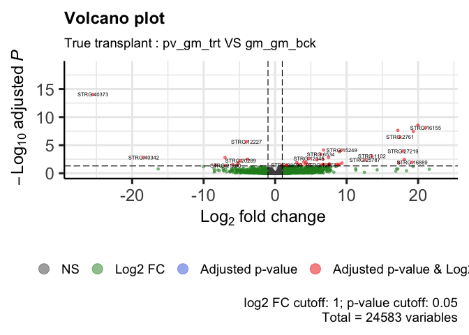
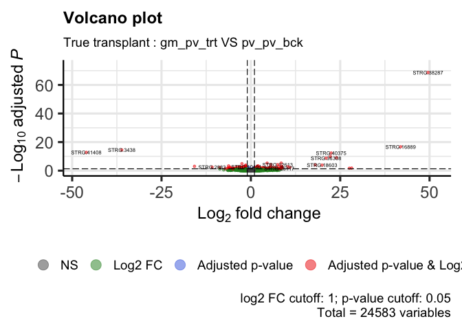
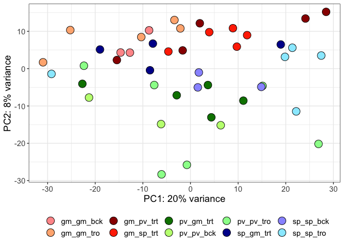
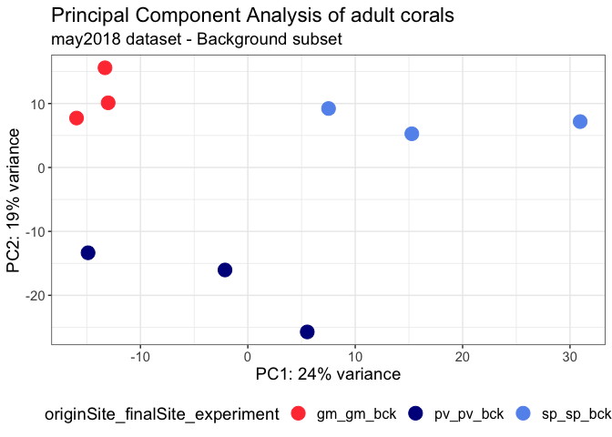

DE_Astroides_adult_trueTransplant
================
Marc Meynadier
6/3/2022

``` r
# Differential expression on Kallisto data 

# True transplant 

# Packages and dependence
packageCheckClassic <- function(x){
  for( i in x ){
    #  require returns TRUE invisibly if it was able to load package
    if( ! require( i , character.only = TRUE ) ){
      #  If package was not able to be loaded then re-install
      install.packages( i , dependencies = TRUE )
      #  Load package after installing
      require( i , character.only = TRUE )
    }
  }
}

packageCheckClassic(c('DESeq2','devtools','BiocManager','ggplot2','ggrepel','pheatmap','markdown','RColorBrewer','genefilter','gplots','vegan','dplyr'))
```

    ## Le chargement a nécessité le package : DESeq2

    ## Le chargement a nécessité le package : S4Vectors

    ## Warning: le package 'S4Vectors' a été compilé avec la version R 4.1.3

    ## Le chargement a nécessité le package : stats4

    ## Le chargement a nécessité le package : BiocGenerics

    ## 
    ## Attachement du package : 'BiocGenerics'

    ## Les objets suivants sont masqués depuis 'package:stats':
    ## 
    ##     IQR, mad, sd, var, xtabs

    ## Les objets suivants sont masqués depuis 'package:base':
    ## 
    ##     anyDuplicated, append, as.data.frame, basename, cbind, colnames,
    ##     dirname, do.call, duplicated, eval, evalq, Filter, Find, get, grep,
    ##     grepl, intersect, is.unsorted, lapply, Map, mapply, match, mget,
    ##     order, paste, pmax, pmax.int, pmin, pmin.int, Position, rank,
    ##     rbind, Reduce, rownames, sapply, setdiff, sort, table, tapply,
    ##     union, unique, unsplit, which.max, which.min

    ## 
    ## Attachement du package : 'S4Vectors'

    ## Les objets suivants sont masqués depuis 'package:base':
    ## 
    ##     expand.grid, I, unname

    ## Le chargement a nécessité le package : IRanges

    ## Le chargement a nécessité le package : GenomicRanges

    ## Le chargement a nécessité le package : GenomeInfoDb

    ## Le chargement a nécessité le package : SummarizedExperiment

    ## Le chargement a nécessité le package : MatrixGenerics

    ## Le chargement a nécessité le package : matrixStats

    ## 
    ## Attachement du package : 'MatrixGenerics'

    ## Les objets suivants sont masqués depuis 'package:matrixStats':
    ## 
    ##     colAlls, colAnyNAs, colAnys, colAvgsPerRowSet, colCollapse,
    ##     colCounts, colCummaxs, colCummins, colCumprods, colCumsums,
    ##     colDiffs, colIQRDiffs, colIQRs, colLogSumExps, colMadDiffs,
    ##     colMads, colMaxs, colMeans2, colMedians, colMins, colOrderStats,
    ##     colProds, colQuantiles, colRanges, colRanks, colSdDiffs, colSds,
    ##     colSums2, colTabulates, colVarDiffs, colVars, colWeightedMads,
    ##     colWeightedMeans, colWeightedMedians, colWeightedSds,
    ##     colWeightedVars, rowAlls, rowAnyNAs, rowAnys, rowAvgsPerColSet,
    ##     rowCollapse, rowCounts, rowCummaxs, rowCummins, rowCumprods,
    ##     rowCumsums, rowDiffs, rowIQRDiffs, rowIQRs, rowLogSumExps,
    ##     rowMadDiffs, rowMads, rowMaxs, rowMeans2, rowMedians, rowMins,
    ##     rowOrderStats, rowProds, rowQuantiles, rowRanges, rowRanks,
    ##     rowSdDiffs, rowSds, rowSums2, rowTabulates, rowVarDiffs, rowVars,
    ##     rowWeightedMads, rowWeightedMeans, rowWeightedMedians,
    ##     rowWeightedSds, rowWeightedVars

    ## Le chargement a nécessité le package : Biobase

    ## Welcome to Bioconductor
    ## 
    ##     Vignettes contain introductory material; view with
    ##     'browseVignettes()'. To cite Bioconductor, see
    ##     'citation("Biobase")', and for packages 'citation("pkgname")'.

    ## 
    ## Attachement du package : 'Biobase'

    ## L'objet suivant est masqué depuis 'package:MatrixGenerics':
    ## 
    ##     rowMedians

    ## Les objets suivants sont masqués depuis 'package:matrixStats':
    ## 
    ##     anyMissing, rowMedians

    ## Le chargement a nécessité le package : devtools

    ## Le chargement a nécessité le package : usethis

    ## Le chargement a nécessité le package : BiocManager

    ## Bioconductor version '3.14' is out-of-date; the current release version '3.16'
    ##   is available with R version '4.2'; see https://bioconductor.org/install

    ## 
    ## Attachement du package : 'BiocManager'

    ## L'objet suivant est masqué depuis 'package:devtools':
    ## 
    ##     install

    ## Le chargement a nécessité le package : ggplot2

    ## Le chargement a nécessité le package : ggrepel

    ## Le chargement a nécessité le package : pheatmap

    ## Le chargement a nécessité le package : markdown

    ## Le chargement a nécessité le package : RColorBrewer

    ## Le chargement a nécessité le package : genefilter

    ## 
    ## Attachement du package : 'genefilter'

    ## Les objets suivants sont masqués depuis 'package:MatrixGenerics':
    ## 
    ##     rowSds, rowVars

    ## Les objets suivants sont masqués depuis 'package:matrixStats':
    ## 
    ##     rowSds, rowVars

    ## Le chargement a nécessité le package : gplots

    ## 
    ## Attachement du package : 'gplots'

    ## L'objet suivant est masqué depuis 'package:IRanges':
    ## 
    ##     space

    ## L'objet suivant est masqué depuis 'package:S4Vectors':
    ## 
    ##     space

    ## L'objet suivant est masqué depuis 'package:stats':
    ## 
    ##     lowess

    ## Le chargement a nécessité le package : vegan

    ## Le chargement a nécessité le package : permute

    ## 
    ## Attachement du package : 'permute'

    ## L'objet suivant est masqué depuis 'package:devtools':
    ## 
    ##     check

    ## Le chargement a nécessité le package : lattice

    ## This is vegan 2.6-2

    ## Le chargement a nécessité le package : dplyr

    ## 
    ## Attachement du package : 'dplyr'

    ## L'objet suivant est masqué depuis 'package:Biobase':
    ## 
    ##     combine

    ## L'objet suivant est masqué depuis 'package:matrixStats':
    ## 
    ##     count

    ## Les objets suivants sont masqués depuis 'package:GenomicRanges':
    ## 
    ##     intersect, setdiff, union

    ## L'objet suivant est masqué depuis 'package:GenomeInfoDb':
    ## 
    ##     intersect

    ## Les objets suivants sont masqués depuis 'package:IRanges':
    ## 
    ##     collapse, desc, intersect, setdiff, slice, union

    ## Les objets suivants sont masqués depuis 'package:S4Vectors':
    ## 
    ##     first, intersect, rename, setdiff, setequal, union

    ## Les objets suivants sont masqués depuis 'package:BiocGenerics':
    ## 
    ##     combine, intersect, setdiff, union

    ## Les objets suivants sont masqués depuis 'package:stats':
    ## 
    ##     filter, lag

    ## Les objets suivants sont masqués depuis 'package:base':
    ## 
    ##     intersect, setdiff, setequal, union

``` r
#BiocManager::install('tximport', force = TRUE)
#BiocManager::install('apeglm')
#BiocManager::install('ashr')
#BiocManager::install("EnhancedVolcano")
#BiocManager::install('limma')
#devtools::install_github('cran/GMD')
if (!require(devtools)) install.packages("devtools")
devtools::install_github("yanlinlin82/ggvenn")
```

    ## Skipping install of 'ggvenn' from a github remote, the SHA1 (306a3302) has not changed since last install.
    ##   Use `force = TRUE` to force installation

``` r
library('ggvenn')
```

    ## Le chargement a nécessité le package : grid

``` r
library('tximport')
library('apeglm')
library('ashr')
library('EnhancedVolcano')
```

    ## Registered S3 methods overwritten by 'ggalt':
    ##   method                  from   
    ##   grid.draw.absoluteGrob  ggplot2
    ##   grobHeight.absoluteGrob ggplot2
    ##   grobWidth.absoluteGrob  ggplot2
    ##   grobX.absoluteGrob      ggplot2
    ##   grobY.absoluteGrob      ggplot2

``` r
source_url("https://raw.githubusercontent.com/obigriffith/biostar-tutorials/master/Heatmaps/heatmap.3.R")
```

    ## ℹ SHA-1 hash of file is 015fc0457e61e3e93a903e69a24d96d2dac7b9fb

``` r
# Working environment 
scriptPath<-dirname(rstudioapi::getSourceEditorContext()$path)
setwd(scriptPath)
samples<-read.table('tximport_design_trueTransplant.txt',header=T)
samplesBck<-read.table('tximport_design_trueTransplant_bck.txt',header=T)
samplesTro<-read.table('tximport_design_trueTransplant_tro.txt',header=T)
samplesBckTro<-read.table('tximport_design_trueTransplant_tro_bck.txt',header=T)
samplesTrt<-read.table('tximport_design_trueTransplant_trt.txt',header=T)
candidateGenes<-read.csv('candidateGenes.csv',header=T,sep=',')
dataPath<-'/Users/mmeynadier/Documents/PhD/species/Astroides/analysis/STARmapping/teixido/adult/may2018'
outputPath<-'/Users/mmeynadier/Documents/Astroides/comparative_transcriptomics_astroides/output/DESeq2/annotatedGenome/adult/trueTransplant/'
setwd(dataPath)
data<-list.files(pattern = "*ReadsPerGene.out.tab$", full.names = TRUE)
counts.files <- lapply(data, read.table, skip = 4)
raw_counts <- as.data.frame(sapply(counts.files, function(x) x[ , 4]))
data <- gsub( "Users/mmeynadier/Documents/PhD/species/Astroides/analysis/STARmapping/teixido/adult/may2018", "", data )
data <- gsub( "_ReadsPerGene.out.tab", "", data )
data <- gsub( "./", "", data )
colnames(raw_counts) <- data
row.names(raw_counts) <- counts.files[[1]]$V1
unusedData<-setdiff(colnames(raw_counts),samples[['sample']])
raw_counts = raw_counts[,!(names(raw_counts) %in% unusedData),]

raw_counts_bck <- raw_counts[,grep("bck", colnames(raw_counts))] 
raw_counts_tro <- raw_counts[,grep("tro", colnames(raw_counts))] 
raw_counts_bck_tro <- raw_counts[,grep("bck|tro", colnames(raw_counts))] 
raw_counts_trt <- raw_counts[,grep("trt", colnames(raw_counts))] 

# DDS object
dds<-DESeqDataSetFromMatrix(countData = raw_counts, colData = samples,design = ~originSite_finalSite_experiment)
```

    ## Warning in DESeqDataSet(se, design = design, ignoreRank): some variables in
    ## design formula are characters, converting to factors

``` r
ddsBck<-DESeqDataSetFromMatrix(countData = raw_counts_bck, colData = samplesBck,design = ~originSite_finalSite_experiment)
```

    ## Warning in DESeqDataSet(se, design = design, ignoreRank): some variables in
    ## design formula are characters, converting to factors

``` r
ddsTro<-DESeqDataSetFromMatrix(countData = raw_counts_tro, colData = samplesTro,design = ~originSite_finalSite_experiment)
```

    ## Warning in DESeqDataSet(se, design = design, ignoreRank): some variables in
    ## design formula are characters, converting to factors

``` r
ddsBckTro<-DESeqDataSetFromMatrix(countData = raw_counts_bck_tro, colData = samplesBckTro,design = ~originSite_finalSite_experiment)
```

    ## Warning in DESeqDataSet(se, design = design, ignoreRank): some variables in
    ## design formula are characters, converting to factors

``` r
ddsTrt<-DESeqDataSetFromMatrix(countData = raw_counts_trt, colData = samplesTrt,design = ~originSite_finalSite_experiment)
```

    ## Warning in DESeqDataSet(se, design = design, ignoreRank): some variables in
    ## design formula are characters, converting to factors

``` r
# If data from kallisto

# tx2gene<-read.table('tx2gene_adultTranscriptome',header=T)
# scriptPath <- sub("/[^/]+$", "", scriptPath)
# scriptPath <- sub("/[^/]+$", "", scriptPath)
# dataPath<-'/data/net/6_kallisto/adultTranscriptome/adult/1_preliminarySamples'
# outputPath<-paste(scriptPath,'/output/DESeq2/adultTranscriptome/adult/4_trueTransplant/',sep='')
# 
# wdPath<-paste(scriptPath,dataPath,sep='')
# setwd(wdPath)
# 
# Data importation - txImport
#files<-paste0(samples$samples,'.tsv')
#filesBck<-paste0(samplesBck$samples,'.tsv')
#filesTro<-paste0(samplesTro$samples,'.tsv')
#filesBckTro<-paste0(samplesBckTro$samples,'.tsv')
#filesTrt<-paste0(samplesTrt$samples,'.tsv')
#names(files)<-samples$samples
#names(filesBck)<-samplesBck$samples
#names(filesTro)<-samplesTro$samples
#names(filesBckTro)<-samplesBckTro$samples
#names(filesTrt)<-samplesTrt$samples
#txi<-tximport(files = files,type='kallisto',tx2gene = tx2gene)
#txiBck<-tximport(files = filesBck,type='kallisto',tx2gene = tx2gene)
#txiTro<-tximport(files = filesTro,type='kallisto',tx2gene = tx2gene)
#txiBckTro<-tximport(files = filesBckTro,type='kallisto',tx2gene = tx2gene)
#txiTrt<-tximport(files = filesTrt,type='kallisto',tx2gene = tx2gene)
#names(txi)
#head(txi$counts)
#dds<-DESeqDataSetFromTximport(txi,colData=samples,design= ~originSite_finalSite_experiment)
#ddsBck<-DESeqDataSetFromTximport(txiBck,colData=samplesBck,design= ~originSite_finalSite_experiment)
#ddsTro<-DESeqDataSetFromTximport(txiTro,colData=samplesTro,design= ~originSite_finalSite_experiment)
#ddsBckTro<-DESeqDataSetFromTximport(txiBckTro,colData=samplesBckTro,design= ~originSite_finalSite_experiment)
#ddsTrt<-DESeqDataSetFromTximport(txiTrt,colData=samplesTrt,design= ~originSite_finalSite_experiment)

# pre-filtering
keep <- rowSums(counts(dds)) >= 10 
dds <- dds[keep,]
keep <- rowSums(counts(ddsBck)) >= 10 
ddsBck <- ddsBck[keep,]
keep <- rowSums(counts(ddsTro)) >= 10 
ddsTro <- ddsTro[keep,]
keep <- rowSums(counts(ddsBckTro)) >= 10 
ddsBckTro <- ddsBckTro[keep,]
keep <- rowSums(counts(ddsTrt)) >= 10 
ddsTrt <- ddsTrt[keep,]

# Differential expression analysis
dds<-DESeq(dds)
```

    ## estimating size factors

    ## estimating dispersions

    ## gene-wise dispersion estimates

    ## mean-dispersion relationship

    ## final dispersion estimates

    ## fitting model and testing

``` r
ddsBck<-DESeq(ddsBck)
```

    ## estimating size factors

    ## estimating dispersions

    ## gene-wise dispersion estimates

    ## mean-dispersion relationship

    ## final dispersion estimates

    ## fitting model and testing

``` r
ddsTro<-DESeq(ddsTro)
```

    ## estimating size factors

    ## estimating dispersions

    ## gene-wise dispersion estimates

    ## mean-dispersion relationship

    ## final dispersion estimates

    ## fitting model and testing

``` r
ddsBckTro<-DESeq(ddsBckTro)
```

    ## estimating size factors

    ## estimating dispersions

    ## gene-wise dispersion estimates

    ## mean-dispersion relationship

    ## final dispersion estimates

    ## fitting model and testing

``` r
ddsTrt<-DESeq(ddsTrt)
```

    ## estimating size factors

    ## estimating dispersions

    ## gene-wise dispersion estimates

    ## mean-dispersion relationship

    ## final dispersion estimates

    ## fitting model and testing

``` r
cbind(resultsNames(dds))
```

    ##       [,1]                                                    
    ##  [1,] "Intercept"                                             
    ##  [2,] "originSite_finalSite_experiment_gm_gm_tro_vs_gm_gm_bck"
    ##  [3,] "originSite_finalSite_experiment_gm_pv_trt_vs_gm_gm_bck"
    ##  [4,] "originSite_finalSite_experiment_gm_sp_trt_vs_gm_gm_bck"
    ##  [5,] "originSite_finalSite_experiment_pv_gm_trt_vs_gm_gm_bck"
    ##  [6,] "originSite_finalSite_experiment_pv_pv_bck_vs_gm_gm_bck"
    ##  [7,] "originSite_finalSite_experiment_pv_pv_tro_vs_gm_gm_bck"
    ##  [8,] "originSite_finalSite_experiment_sp_gm_trt_vs_gm_gm_bck"
    ##  [9,] "originSite_finalSite_experiment_sp_sp_bck_vs_gm_gm_bck"
    ## [10,] "originSite_finalSite_experiment_sp_sp_tro_vs_gm_gm_bck"

``` r
gm_gm_tro_VS_gm_gm_bck<-results(dds, contrast=c("originSite_finalSite_experiment","gm_gm_tro","gm_gm_bck"), alpha = 0.05)
pv_pv_tro_VS_pv_pv_bck<-results(dds, contrast=c("originSite_finalSite_experiment","pv_pv_tro","pv_pv_bck"), alpha = 0.05)
sp_sp_tro_VS_sp_sp_bck<-results(dds, contrast=c("originSite_finalSite_experiment","sp_sp_tro","sp_sp_bck"), alpha = 0.05)
pv_gm_trt_VS_pv_pv_bck<-results(dds, contrast=c("originSite_finalSite_experiment","pv_gm_trt","pv_pv_bck"), alpha = 0.05)
sp_gm_trt_VS_sp_sp_bck<-results(dds, contrast=c("originSite_finalSite_experiment","sp_gm_trt","sp_sp_bck"), alpha = 0.05)
pv_gm_trt_VS_gm_gm_bck<-results(dds, contrast=c("originSite_finalSite_experiment","pv_gm_trt","gm_gm_bck"), alpha = 0.05)
sp_gm_trt_VS_gm_gm_bck<-results(dds, contrast=c("originSite_finalSite_experiment","sp_gm_trt","gm_gm_bck"), alpha = 0.05)
gm_pv_trt_VS_pv_pv_bck<-results(dds, contrast=c("originSite_finalSite_experiment","gm_pv_trt","pv_pv_bck"), alpha = 0.05)
gm_sp_trt_VS_sp_sp_bck<-results(dds, contrast=c("originSite_finalSite_experiment","gm_sp_trt","sp_sp_bck"), alpha = 0.05)
gm_pv_trt_VS_gm_gm_bck<-results(dds, contrast=c("originSite_finalSite_experiment","gm_pv_trt","gm_gm_bck"), alpha = 0.05)
gm_sp_trt_VS_gm_gm_bck<-results(dds, contrast=c("originSite_finalSite_experiment","gm_sp_trt","gm_gm_bck"), alpha = 0.05)
summary(gm_gm_tro_VS_gm_gm_bck)
```

    ## 
    ## out of 24583 with nonzero total read count
    ## adjusted p-value < 0.05
    ## LFC > 0 (up)       : 25, 0.1%
    ## LFC < 0 (down)     : 5, 0.02%
    ## outliers [1]       : 33, 0.13%
    ## low counts [2]     : 4753, 19%
    ## (mean count < 3)
    ## [1] see 'cooksCutoff' argument of ?results
    ## [2] see 'independentFiltering' argument of ?results

``` r
summary(pv_pv_tro_VS_pv_pv_bck)
```

    ## 
    ## out of 24583 with nonzero total read count
    ## adjusted p-value < 0.05
    ## LFC > 0 (up)       : 16, 0.065%
    ## LFC < 0 (down)     : 9, 0.037%
    ## outliers [1]       : 33, 0.13%
    ## low counts [2]     : 3803, 15%
    ## (mean count < 2)
    ## [1] see 'cooksCutoff' argument of ?results
    ## [2] see 'independentFiltering' argument of ?results

``` r
summary(sp_sp_tro_VS_sp_sp_bck)
```

    ## 
    ## out of 24583 with nonzero total read count
    ## adjusted p-value < 0.05
    ## LFC > 0 (up)       : 46, 0.19%
    ## LFC < 0 (down)     : 27, 0.11%
    ## outliers [1]       : 33, 0.13%
    ## low counts [2]     : 9032, 37%
    ## (mean count < 12)
    ## [1] see 'cooksCutoff' argument of ?results
    ## [2] see 'independentFiltering' argument of ?results

``` r
summary(pv_gm_trt_VS_pv_pv_bck)
```

    ## 
    ## out of 24583 with nonzero total read count
    ## adjusted p-value < 0.05
    ## LFC > 0 (up)       : 147, 0.6%
    ## LFC < 0 (down)     : 83, 0.34%
    ## outliers [1]       : 33, 0.13%
    ## low counts [2]     : 8082, 33%
    ## (mean count < 9)
    ## [1] see 'cooksCutoff' argument of ?results
    ## [2] see 'independentFiltering' argument of ?results

``` r
summary(sp_gm_trt_VS_sp_sp_bck)
```

    ## 
    ## out of 24583 with nonzero total read count
    ## adjusted p-value < 0.05
    ## LFC > 0 (up)       : 235, 0.96%
    ## LFC < 0 (down)     : 89, 0.36%
    ## outliers [1]       : 33, 0.13%
    ## low counts [2]     : 4753, 19%
    ## (mean count < 3)
    ## [1] see 'cooksCutoff' argument of ?results
    ## [2] see 'independentFiltering' argument of ?results

``` r
summary(pv_gm_trt_VS_gm_gm_bck)
```

    ## 
    ## out of 24583 with nonzero total read count
    ## adjusted p-value < 0.05
    ## LFC > 0 (up)       : 40, 0.16%
    ## LFC < 0 (down)     : 11, 0.045%
    ## outliers [1]       : 33, 0.13%
    ## low counts [2]     : 3803, 15%
    ## (mean count < 2)
    ## [1] see 'cooksCutoff' argument of ?results
    ## [2] see 'independentFiltering' argument of ?results

``` r
summary(sp_gm_trt_VS_gm_gm_bck)
```

    ## 
    ## out of 24583 with nonzero total read count
    ## adjusted p-value < 0.05
    ## LFC > 0 (up)       : 23, 0.094%
    ## LFC < 0 (down)     : 9, 0.037%
    ## outliers [1]       : 33, 0.13%
    ## low counts [2]     : 3332, 14%
    ## (mean count < 2)
    ## [1] see 'cooksCutoff' argument of ?results
    ## [2] see 'independentFiltering' argument of ?results

``` r
summary(gm_pv_trt_VS_pv_pv_bck)
```

    ## 
    ## out of 24583 with nonzero total read count
    ## adjusted p-value < 0.05
    ## LFC > 0 (up)       : 104, 0.42%
    ## LFC < 0 (down)     : 74, 0.3%
    ## outliers [1]       : 33, 0.13%
    ## low counts [2]     : 6179, 25%
    ## (mean count < 5)
    ## [1] see 'cooksCutoff' argument of ?results
    ## [2] see 'independentFiltering' argument of ?results

``` r
summary(gm_sp_trt_VS_sp_sp_bck)
```

    ## 
    ## out of 24583 with nonzero total read count
    ## adjusted p-value < 0.05
    ## LFC > 0 (up)       : 38, 0.15%
    ## LFC < 0 (down)     : 31, 0.13%
    ## outliers [1]       : 33, 0.13%
    ## low counts [2]     : 3332, 14%
    ## (mean count < 2)
    ## [1] see 'cooksCutoff' argument of ?results
    ## [2] see 'independentFiltering' argument of ?results

``` r
summary(gm_pv_trt_VS_gm_gm_bck)
```

    ## 
    ## out of 24583 with nonzero total read count
    ## adjusted p-value < 0.05
    ## LFC > 0 (up)       : 825, 3.4%
    ## LFC < 0 (down)     : 533, 2.2%
    ## outliers [1]       : 33, 0.13%
    ## low counts [2]     : 9032, 37%
    ## (mean count < 12)
    ## [1] see 'cooksCutoff' argument of ?results
    ## [2] see 'independentFiltering' argument of ?results

``` r
summary(gm_sp_trt_VS_gm_gm_bck)
```

    ## 
    ## out of 24583 with nonzero total read count
    ## adjusted p-value < 0.05
    ## LFC > 0 (up)       : 88, 0.36%
    ## LFC < 0 (down)     : 19, 0.077%
    ## outliers [1]       : 33, 0.13%
    ## low counts [2]     : 9984, 41%
    ## (mean count < 16)
    ## [1] see 'cooksCutoff' argument of ?results
    ## [2] see 'independentFiltering' argument of ?results

``` r
# Exploring the results

# Results gm_gm_tro VS gm_gm_bck

#MA-plot
DESeq2::plotMA(gm_gm_tro_VS_gm_gm_bck,ylim=c(-50,50),main="MA-plot for the shrunken log2 fold changes\nTrue transplant : gm_gm_bck VS gm_gm_tro")
```

<!-- -->

``` r
# Volcano plot
pCutoff = 0.05
FCcutoff = 1.0
EnhancedVolcano(data.frame(gm_gm_tro_VS_gm_gm_bck), lab = rownames(data.frame(gm_gm_tro_VS_gm_gm_bck)), x = 'log2FoldChange', y = 'padj',
                xlab = bquote(~Log[2]~ 'fold change'), ylab = bquote(~-Log[10]~adjusted~italic(P)),
                pCutoff = pCutoff, FCcutoff = FCcutoff, pointSize = 1.0, labSize = 2.0,
                title = "Volcano plot", subtitle = "True transplant : gm_gm_bck VS gm_gm_tro",
                caption = paste0('log2 FC cutoff: ', FCcutoff, '; p-value cutoff: ', pCutoff, '\nTotal = ', nrow(gm_gm_tro_VS_gm_gm_bck), ' variables'),
                legendLabels=c('NS','Log2 FC','Adjusted p-value', 'Adjusted p-value & Log2 FC'),
                legendPosition = 'bottom', legendLabSize = 14, legendIconSize = 5.0)
```

<!-- -->

``` r
# Results pv_pv_tro VS pv_pv_bck

#MA-plot
DESeq2::plotMA(pv_pv_tro_VS_pv_pv_bck,ylim=c(-50,50),main="MA-plot for the shrunken log2 fold changes\nTrue transplant : pv_pv_bck VS pv_pv_tro")
```

<!-- -->

``` r
# Volcano plot
EnhancedVolcano(data.frame(pv_pv_tro_VS_pv_pv_bck), lab = rownames(data.frame(pv_pv_tro_VS_pv_pv_bck)), x = 'log2FoldChange', y = 'padj',
                xlab = bquote(~Log[2]~ 'fold change'), ylab = bquote(~-Log[10]~adjusted~italic(P)),
                pCutoff = pCutoff, FCcutoff = FCcutoff, pointSize = 1.0, labSize = 2.0,
                title = "Volcano plot", subtitle = "True transplant : pv_pv_bck VS pv_pv_tro",
                caption = paste0('log2 FC cutoff: ', FCcutoff, '; p-value cutoff: ', pCutoff, '\nTotal = ', nrow(pv_pv_tro_VS_pv_pv_bck), ' variables'),
                legendLabels=c('NS','Log2 FC','Adjusted p-value', 'Adjusted p-value & Log2 FC'),
                legendPosition = 'bottom', legendLabSize = 14, legendIconSize = 5.0)
```

<!-- -->

``` r
# Results sp_sp_tro VS sp_sp_bck

#MA-plot
DESeq2::plotMA(sp_sp_tro_VS_sp_sp_bck,ylim=c(-50,50),main="MA-plot for the shrunken log2 fold changes\nTrue transplant : sp_sp_bck VS sp_sp_tro")
```

<!-- -->

``` r
# Volcano plot
EnhancedVolcano(data.frame(sp_sp_tro_VS_sp_sp_bck), lab = rownames(data.frame(sp_sp_tro_VS_sp_sp_bck)), x = 'log2FoldChange', y = 'padj',
                xlab = bquote(~Log[2]~ 'fold change'), ylab = bquote(~-Log[10]~adjusted~italic(P)),
                pCutoff = pCutoff, FCcutoff = FCcutoff, pointSize = 1.0, labSize = 2.0,
                title = "Volcano plot", subtitle = "True transplant : sp_sp_bck VS sp_sp_tro",
                caption = paste0('log2 FC cutoff: ', FCcutoff, '; p-value cutoff: ', pCutoff, '\nTotal = ', nrow(sp_sp_tro_VS_sp_sp_bck), ' variables'),
                legendLabels=c('NS','Log2 FC','Adjusted p-value', 'Adjusted p-value & Log2 FC'),
                legendPosition = 'bottom', legendLabSize = 14, legendIconSize = 5.0)
```

<!-- -->

``` r
# Results pv_gm_trt VS pv_pv_bck

#MA-plot
DESeq2::plotMA(pv_gm_trt_VS_pv_pv_bck,ylim=c(-50,50),main="MA-plot for the shrunken log2 fold changes\nTrue transplant : pv_gm_trt VS pv_pv_bck")
```

<!-- -->

``` r
# Volcano plot
EnhancedVolcano(data.frame(pv_gm_trt_VS_pv_pv_bck), lab = rownames(data.frame(pv_gm_trt_VS_pv_pv_bck)), x = 'log2FoldChange', y = 'padj',
                xlab = bquote(~Log[2]~ 'fold change'), ylab = bquote(~-Log[10]~adjusted~italic(P)),
                pCutoff = pCutoff, FCcutoff = FCcutoff, pointSize = 1.0, labSize = 2.0,
                title = "Volcano plot", subtitle = "True transplant : pv_gm_trt VS pv_pv_bck",
                caption = paste0('log2 FC cutoff: ', FCcutoff, '; p-value cutoff: ', pCutoff, '\nTotal = ', nrow(pv_gm_trt_VS_pv_pv_bck), ' variables'),
                legendLabels=c('NS','Log2 FC','Adjusted p-value', 'Adjusted p-value & Log2 FC'),
                legendPosition = 'bottom', legendLabSize = 14, legendIconSize = 5.0)
```

<!-- -->

``` r
# Results sp_gm_trt VS sp_sp_bck

#MA-plot
DESeq2::plotMA(sp_gm_trt_VS_sp_sp_bck,ylim=c(-50,50),main="MA-plot for the shrunken log2 fold changes\nTrue transplant : sp_gm_trt VS sp_sp_bck")
```

<!-- -->

``` r
# Volcano plot
EnhancedVolcano(data.frame(sp_gm_trt_VS_sp_sp_bck), lab = rownames(data.frame(sp_gm_trt_VS_sp_sp_bck)), x = 'log2FoldChange', y = 'padj',
                xlab = bquote(~Log[2]~ 'fold change'), ylab = bquote(~-Log[10]~adjusted~italic(P)),
                pCutoff = pCutoff, FCcutoff = FCcutoff, pointSize = 1.0, labSize = 2.0,
                title = "Volcano plot", subtitle = "True transplant : sp_gm_trt VS sp_sp_bck",
                caption = paste0('log2 FC cutoff: ', FCcutoff, '; p-value cutoff: ', pCutoff, '\nTotal = ', nrow(sp_gm_trt_VS_sp_sp_bck), ' variables'),
                legendLabels=c('NS','Log2 FC','Adjusted p-value', 'Adjusted p-value & Log2 FC'),
                legendPosition = 'bottom', legendLabSize = 14, legendIconSize = 5.0)
```

<!-- -->

``` r
# Results pv_gm_trt VS gm_gm_bck

#MA-plot
DESeq2::plotMA(pv_gm_trt_VS_gm_gm_bck,ylim=c(-50,50),main="MA-plot for the shrunken log2 fold changes\nTrue transplant : pv_gm_trt VS gm_gm_bck")
```

<!-- -->

``` r
# Volcano plot
EnhancedVolcano(data.frame(pv_gm_trt_VS_gm_gm_bck), lab = rownames(data.frame(pv_gm_trt_VS_gm_gm_bck)), x = 'log2FoldChange', y = 'padj',
                xlab = bquote(~Log[2]~ 'fold change'), ylab = bquote(~-Log[10]~adjusted~italic(P)),
                pCutoff = pCutoff, FCcutoff = FCcutoff, pointSize = 1.0, labSize = 2.0,
                title = "Volcano plot", subtitle = "True transplant : pv_gm_trt VS gm_gm_bck",
                caption = paste0('log2 FC cutoff: ', FCcutoff, '; p-value cutoff: ', pCutoff, '\nTotal = ', nrow(pv_gm_trt_VS_gm_gm_bck), ' variables'),
                legendLabels=c('NS','Log2 FC','Adjusted p-value', 'Adjusted p-value & Log2 FC'),
                legendPosition = 'bottom', legendLabSize = 14, legendIconSize = 5.0)
```

<!-- -->

``` r
# Results sp_gm_trt VS gm_gm_bck

#MA-plot
DESeq2::plotMA(sp_gm_trt_VS_gm_gm_bck,ylim=c(-50,50),main="MA-plot for the shrunken log2 fold changes\nTrue transplant : sp_gm_trt VS gm_gm_bck")
```

<!-- -->

``` r
# Volcano plot
EnhancedVolcano(data.frame(sp_gm_trt_VS_gm_gm_bck), lab = rownames(data.frame(sp_gm_trt_VS_gm_gm_bck)), x = 'log2FoldChange', y = 'padj',
                xlab = bquote(~Log[2]~ 'fold change'), ylab = bquote(~-Log[10]~adjusted~italic(P)),
                pCutoff = pCutoff, FCcutoff = FCcutoff, pointSize = 1.0, labSize = 2.0,
                title = "Volcano plot", subtitle = "True transplant : sp_gm_trt VS gm_gm_bck",
                caption = paste0('log2 FC cutoff: ', FCcutoff, '; p-value cutoff: ', pCutoff, '\nTotal = ', nrow(sp_gm_trt_VS_gm_gm_bck), ' variables'),
                legendLabels=c('NS','Log2 FC','Adjusted p-value', 'Adjusted p-value & Log2 FC'),
                legendPosition = 'bottom', legendLabSize = 14, legendIconSize = 5.0)
```

<!-- -->

``` r
# Results gm_pv_trt VS pv_pv_bck

#MA-plot
DESeq2::plotMA(gm_pv_trt_VS_pv_pv_bck,ylim=c(-50,50),main="MA-plot for the shrunken log2 fold changes\nTrue transplant : gm_pv_trt VS pv_pv_bck")
```

<!-- -->

``` r
# Volcano plot
EnhancedVolcano(data.frame(gm_pv_trt_VS_pv_pv_bck), lab = rownames(data.frame(gm_pv_trt_VS_pv_pv_bck)), x = 'log2FoldChange', y = 'padj',
                xlab = bquote(~Log[2]~ 'fold change'), ylab = bquote(~-Log[10]~adjusted~italic(P)),
                pCutoff = pCutoff, FCcutoff = FCcutoff, pointSize = 1.0, labSize = 2.0,
                title = "Volcano plot", subtitle = "True transplant : gm_pv_trt VS pv_pv_bck",
                caption = paste0('log2 FC cutoff: ', FCcutoff, '; p-value cutoff: ', pCutoff, '\nTotal = ', nrow(gm_pv_trt_VS_pv_pv_bck), ' variables'),
                legendLabels=c('NS','Log2 FC','Adjusted p-value', 'Adjusted p-value & Log2 FC'),
                legendPosition = 'bottom', legendLabSize = 14, legendIconSize = 5.0)
```

<!-- -->

``` r
# Results gm_sp_trt VS sp_sp_bck

#MA-plot
DESeq2::plotMA(gm_sp_trt_VS_sp_sp_bck,ylim=c(-50,50),main="MA-plot for the shrunken log2 fold changes\nTrue transplant : gm_sp_trt VS sp_sp_bck")
```

<!-- -->

``` r
# Volcano plot
EnhancedVolcano(data.frame(gm_sp_trt_VS_sp_sp_bck), lab = rownames(data.frame(gm_sp_trt_VS_sp_sp_bck)), x = 'log2FoldChange', y = 'padj',
                xlab = bquote(~Log[2]~ 'fold change'), ylab = bquote(~-Log[10]~adjusted~italic(P)),
                pCutoff = pCutoff, FCcutoff = FCcutoff, pointSize = 1.0, labSize = 2.0,
                title = "Volcano plot", subtitle = "True transplant : gm_sp_trt VS sp_sp_bck",
                caption = paste0('log2 FC cutoff: ', FCcutoff, '; p-value cutoff: ', pCutoff, '\nTotal = ', nrow(gm_sp_trt_VS_sp_sp_bck), ' variables'),
                legendLabels=c('NS','Log2 FC','Adjusted p-value', 'Adjusted p-value & Log2 FC'),
                legendPosition = 'bottom', legendLabSize = 14, legendIconSize = 5.0)
```

<!-- -->

``` r
# Results gm_pv_trt VS gm_gm_bck

#MA-plot
DESeq2::plotMA(gm_pv_trt_VS_gm_gm_bck,ylim=c(-50,50),main="MA-plot for the shrunken log2 fold changes\nTrue transplant : gm_pv_trt VS gm_gm_bck")
```

<!-- -->

``` r
# Volcano plot
EnhancedVolcano(data.frame(gm_pv_trt_VS_gm_gm_bck), lab = rownames(data.frame(gm_pv_trt_VS_gm_gm_bck)), x = 'log2FoldChange', y = 'padj',
                xlab = bquote(~Log[2]~ 'fold change'), ylab = bquote(~-Log[10]~adjusted~italic(P)),
                pCutoff = pCutoff, FCcutoff = FCcutoff, pointSize = 1.0, labSize = 2.0,
                title = "Volcano plot", subtitle = "True transplant : gm_pv_trt VS gm_gm_bck",
                caption = paste0('log2 FC cutoff: ', FCcutoff, '; p-value cutoff: ', pCutoff, '\nTotal = ', nrow(gm_pv_trt_VS_gm_gm_bck), ' variables'),
                legendLabels=c('NS','Log2 FC','Adjusted p-value', 'Adjusted p-value & Log2 FC'),
                legendPosition = 'bottom', legendLabSize = 14, legendIconSize = 5.0)
```

<!-- -->

``` r
# Results gm_sp_trt VS gm_gm_bck

#MA-plot
DESeq2::plotMA(gm_sp_trt_VS_gm_gm_bck,ylim=c(-50,50),main="MA-plot for the shrunken log2 fold changes\nTrue transplant : gm_sp_trt VS gm_gm_bck")
```

<!-- -->

``` r
# Volcano plot
EnhancedVolcano(data.frame(gm_sp_trt_VS_gm_gm_bck), lab = rownames(data.frame(gm_sp_trt_VS_gm_gm_bck)), x = 'log2FoldChange', y = 'padj',
                xlab = bquote(~Log[2]~ 'fold change'), ylab = bquote(~-Log[10]~adjusted~italic(P)),
                pCutoff = pCutoff, FCcutoff = FCcutoff, pointSize = 1.0, labSize = 2.0,
                title = "Volcano plot", subtitle = "True transplant : gm_sp_trt VS gm_gm_bck",
                caption = paste0('log2 FC cutoff: ', FCcutoff, '; p-value cutoff: ', pCutoff, '\nTotal = ', nrow(gm_sp_trt_VS_gm_gm_bck), ' variables'),
                legendLabels=c('NS','Log2 FC','Adjusted p-value', 'Adjusted p-value & Log2 FC'),
                legendPosition = 'bottom', legendLabSize = 14, legendIconSize = 5.0)
```

<!-- -->

``` r
# Principal Component Analysis

# Global
vsd = vst(dds,blind=T)
mat <- assay(vsd)
mm <- model.matrix(~originSite_finalSite_experiment,colData(vsd))
mat<-limma::removeBatchEffect(mat,batch1=vsd$originSite_finalSite_experiment,design=mm)
assay(vsd)<-mat

pcaData = plotPCA(vsd, intgroup="originSite_finalSite_experiment", 
                  returnData=TRUE)
percentVar = round(100 * attr(pcaData, "percentVar"))

ggplot(pcaData, aes(PC1, PC2, fill = originSite_finalSite_experiment)) + 
  geom_point(color="black",pch=21, size=5) + theme_bw() +
  scale_fill_manual(values = c("#ff9999","#ffb380","#990000","#ff3300","#008000","#bfff80","#99ff99","#000099","#9999ff","#99ebff")) +
  #ggtitle("Principal Component Analysis of adult corals", subtitle = "may2018 dataset") +
  theme(text = element_text(size=14), legend.position = 'bottom') +
  theme(legend.title=element_blank()) +
  xlab(paste0("PC1: ",percentVar[1],"% variance")) +
  ylab(paste0("PC2: ",percentVar[2],"% variance")) 
```

<!-- -->

``` r
# Background
vsdBck = vst(ddsBck,blind=T)
mat <- assay(vsdBck)
mm <- model.matrix(~originSite_finalSite_experiment,colData(vsdBck))
mat<-limma::removeBatchEffect(mat,batch1=vsdBck$originSite_finalSite_experiment,design=mm)
assay(vsdBck)<-mat

pcaData = plotPCA(vsdBck, intgroup="originSite_finalSite_experiment", 
                  returnData=TRUE)
percentVar = round(100 * attr(pcaData, "percentVar"))

ggplot(pcaData, aes(PC1, PC2, colour = originSite_finalSite_experiment)) + 
  geom_point(size = 5) + theme_bw() + 
  scale_color_manual(values = c("#ff4040", "#00008B","#6495ED")) +
  geom_point() +
  ggtitle("Principal Component Analysis of adult corals", subtitle = "may2018 dataset - Background subset") +
  theme(text = element_text(size=14),legend.text = element_text(size=12), legend.position = 'bottom') +
  xlab(paste0("PC1: ",percentVar[1],"% variance")) +
  ylab(paste0("PC2: ",percentVar[2],"% variance")) 
```

<!-- -->

``` r
# Transplant origin
vsdTro = vst(ddsTro,blind=T)
mat <- assay(vsdTro)
mm <- model.matrix(~originSite_finalSite_experiment,colData(vsdTro))
mat<-limma::removeBatchEffect(mat,batch1=vsdTro$originSite_finalSite_experiment,design=mm)
assay(vsdTro)<-mat

pcaData = plotPCA(vsdTro, intgroup="originSite_finalSite_experiment", 
                  returnData=TRUE)
percentVar = round(100 * attr(pcaData, "percentVar"))

ggplot(pcaData, aes(PC1, PC2, colour = originSite_finalSite_experiment)) + 
  geom_point(size = 5) + theme_bw() + 
  scale_color_manual(values = c("#ff4040", "#00008B","#6495ED")) +
  geom_point() +
  ggtitle("Principal Component Analysis of adult corals", subtitle = "may2018 dataset - Transplant origin subset") +
  theme(text = element_text(size=14),legend.text = element_text(size=12), legend.position = 'bottom') +
  xlab(paste0("PC1: ",percentVar[1],"% variance")) +
  ylab(paste0("PC2: ",percentVar[2],"% variance")) 
```

<!-- -->

``` r
# Background & transplant origin
vsdBckTro = vst(ddsBckTro,blind=T)
mat <- assay(vsdBckTro)
mm <- model.matrix(~originSite_finalSite_experiment,colData(vsdBckTro))
mat<-limma::removeBatchEffect(mat,batch1=vsdBckTro$originSite_finalSite_experiment,design=mm)
assay(vsdBckTro)<-mat

pcaData = plotPCA(vsdBckTro, intgroup="originSite_finalSite_experiment", 
                  returnData=TRUE)
percentVar = round(100 * attr(pcaData, "percentVar"))

ggplot(pcaData, aes(PC1, PC2, colour = originSite_finalSite_experiment)) + 
  geom_point(size = 5) + theme_bw() + 
  geom_point() +
  ggtitle("Principal Component Analysis of adult corals", subtitle = "may2018 dataset - Background and transplant origin subsets") +
  theme(text = element_text(size=14),legend.text = element_text(size=12), legend.position = 'bottom') +
  xlab(paste0("PC1: ",percentVar[1],"% variance")) +
  ylab(paste0("PC2: ",percentVar[2],"% variance")) 
```

<!-- -->

``` r
# True transplant
vsdTrt = vst(ddsTrt,blind=T)
mat <- assay(vsdTrt)
mm <- model.matrix(~originSite_finalSite_experiment,colData(vsdTrt))
mat<-limma::removeBatchEffect(mat,batch1=vsdTrt$originSite_finalSite_experiment,design=mm)
assay(vsdTrt)<-mat

pcaData = plotPCA(vsdTrt, intgroup="originSite_finalSite_experiment", 
                  returnData=TRUE)
percentVar = round(100 * attr(pcaData, "percentVar"))

ggplot(pcaData, aes(PC1, PC2, colour = originSite_finalSite_experiment)) + 
  geom_point(size = 5) + theme_bw() + 
  scale_color_manual(values = c("#F36161", "#AD1C03","#00008B","#6495ED")) +
  geom_point() +
  ggtitle("Principal Component Analysis of adult corals", subtitle = "may2018 dataset - Transplant true subset") +
  theme(text = element_text(size=14),legend.text = element_text(size=11),legend.title = element_text(size=11), legend.position = 'bottom') +
  xlab(paste0("PC1: ",percentVar[1],"% variance")) +
  ylab(paste0("PC2: ",percentVar[2],"% variance")) 
```

<!-- -->

``` r
# Venn diagramm 

# tro VS bck diagramm
resOrdered_gm_gm_tro_VS_gm_gm_bck <- gm_gm_tro_VS_gm_gm_bck[order(gm_gm_tro_VS_gm_gm_bck$padj),]
resOrderedDF_gm_gm_tro_VS_gm_gm_bck <- as.data.frame(resOrdered_gm_gm_tro_VS_gm_gm_bck)
resOrderedDF_gm_gm_tro_VS_gm_gm_bck_venn <- filter(resOrderedDF_gm_gm_tro_VS_gm_gm_bck,padj < 0.05)
resOrderedDF_gm_gm_tro_VS_gm_gm_bck_venn <- list(rownames(resOrderedDF_gm_gm_tro_VS_gm_gm_bck_venn))
resOrderedDF_gm_gm_tro_VS_gm_gm_bck_venn <- unlist(resOrderedDF_gm_gm_tro_VS_gm_gm_bck_venn)

resOrdered_pv_pv_tro_VS_pv_pv_bck <- pv_pv_tro_VS_pv_pv_bck[order(pv_pv_tro_VS_pv_pv_bck$padj),]
resOrderedDF_pv_pv_tro_VS_pv_pv_bck <- as.data.frame(resOrdered_pv_pv_tro_VS_pv_pv_bck)
resOrderedDF_pv_pv_tro_VS_pv_pv_bck_venn <- filter(resOrderedDF_pv_pv_tro_VS_pv_pv_bck,padj < 0.05)
resOrderedDF_pv_pv_tro_VS_pv_pv_bck_venn <- list(rownames(resOrderedDF_pv_pv_tro_VS_pv_pv_bck_venn))
resOrderedDF_pv_pv_tro_VS_pv_pv_bck_venn <- unlist(resOrderedDF_pv_pv_tro_VS_pv_pv_bck_venn)

resOrdered_sp_sp_tro_VS_sp_sp_bck <- sp_sp_tro_VS_sp_sp_bck[order(sp_sp_tro_VS_sp_sp_bck$padj),]
resOrderedDF_sp_sp_tro_VS_sp_sp_bck <- as.data.frame(resOrdered_sp_sp_tro_VS_sp_sp_bck)
resOrderedDF_sp_sp_tro_VS_sp_sp_bck_venn <- filter(resOrderedDF_sp_sp_tro_VS_sp_sp_bck,padj < 0.05)
resOrderedDF_sp_sp_tro_VS_sp_sp_bck_venn <- list(rownames(resOrderedDF_sp_sp_tro_VS_sp_sp_bck_venn))
resOrderedDF_sp_sp_tro_VS_sp_sp_bck_venn <- unlist(resOrderedDF_sp_sp_tro_VS_sp_sp_bck_venn)

x = list('gm_gm_tro VS gm_gm_bck' = resOrderedDF_gm_gm_tro_VS_gm_gm_bck_venn, 'pv_pv_tro VS pv_pv_bck' = resOrderedDF_pv_pv_tro_VS_pv_pv_bck_venn, 'sp_sp_tro VS sp_sp_bck' = resOrderedDF_sp_sp_tro_VS_sp_sp_bck_venn)

ggvenn(
  x, 
  fill_color = c("#0073C2FF", "#EFC000FF", "#868686FF"),
  stroke_size = 0.5, set_name_size = 4
)
```

<!-- -->

``` r
# trt VS bck diagramm 1
resOrdered_pv_gm_trt_VS_pv_pv_bck <- pv_gm_trt_VS_pv_pv_bck[order(pv_gm_trt_VS_pv_pv_bck$padj),]
resOrderedDF_pv_gm_trt_VS_pv_pv_bck <- as.data.frame(resOrdered_pv_gm_trt_VS_pv_pv_bck)
resOrderedDF_pv_gm_trt_VS_pv_pv_bck_venn <- filter(resOrderedDF_pv_gm_trt_VS_pv_pv_bck,padj < 0.05)
resOrderedDF_pv_gm_trt_VS_pv_pv_bck_venn <- list(rownames(resOrderedDF_pv_gm_trt_VS_pv_pv_bck_venn))
resOrderedDF_pv_gm_trt_VS_pv_pv_bck_venn <- unlist(resOrderedDF_pv_gm_trt_VS_pv_pv_bck_venn)

resOrdered_sp_gm_trt_VS_sp_sp_bck <- sp_gm_trt_VS_sp_sp_bck[order(sp_gm_trt_VS_sp_sp_bck$padj),]
resOrderedDF_sp_gm_trt_VS_sp_sp_bck <- as.data.frame(resOrdered_sp_gm_trt_VS_sp_sp_bck)
resOrderedDF_sp_gm_trt_VS_sp_sp_bck_venn <- filter(resOrderedDF_sp_gm_trt_VS_sp_sp_bck,padj < 0.05)
resOrderedDF_sp_gm_trt_VS_sp_sp_bck_venn <- list(rownames(resOrderedDF_sp_gm_trt_VS_sp_sp_bck_venn))
resOrderedDF_sp_gm_trt_VS_sp_sp_bck_venn <- unlist(resOrderedDF_sp_gm_trt_VS_sp_sp_bck_venn)

resOrdered_pv_gm_trt_VS_gm_gm_bck <- pv_gm_trt_VS_gm_gm_bck[order(pv_gm_trt_VS_gm_gm_bck$padj),]
resOrderedDF_pv_gm_trt_VS_gm_gm_bck <- as.data.frame(resOrdered_pv_gm_trt_VS_gm_gm_bck)
resOrderedDF_pv_gm_trt_VS_gm_gm_bck_venn <- filter(resOrderedDF_pv_gm_trt_VS_gm_gm_bck,padj < 0.05)
resOrderedDF_pv_gm_trt_VS_gm_gm_bck_venn <- list(rownames(resOrderedDF_pv_gm_trt_VS_gm_gm_bck_venn))
resOrderedDF_pv_gm_trt_VS_gm_gm_bck_venn <- unlist(resOrderedDF_pv_gm_trt_VS_gm_gm_bck_venn)

resOrdered_sp_gm_trt_VS_gm_gm_bck <- sp_gm_trt_VS_gm_gm_bck[order(sp_gm_trt_VS_gm_gm_bck$padj),]
resOrderedDF_sp_gm_trt_VS_gm_gm_bck <- as.data.frame(resOrdered_sp_gm_trt_VS_gm_gm_bck)
resOrderedDF_sp_gm_trt_VS_gm_gm_bck_venn <- filter(resOrderedDF_sp_gm_trt_VS_gm_gm_bck,padj < 0.05)
resOrderedDF_sp_gm_trt_VS_gm_gm_bck_venn <- list(rownames(resOrderedDF_sp_gm_trt_VS_gm_gm_bck_venn))
resOrderedDF_sp_gm_trt_VS_gm_gm_bck_venn <- unlist(resOrderedDF_sp_gm_trt_VS_gm_gm_bck_venn)

x = list('pv_gm_trt\nVS       \npv_pv_bck' = resOrderedDF_pv_gm_trt_VS_pv_pv_bck_venn, 'sp_gm_trt VS sp_sp_bck' = resOrderedDF_sp_gm_trt_VS_sp_sp_bck_venn, 
         'pv_gm_trt VS gm_gm_bck' = resOrderedDF_pv_gm_trt_VS_gm_gm_bck_venn, 'sp_gm_trt\n        VS\ngm_gm_bck' = resOrderedDF_sp_gm_trt_VS_gm_gm_bck_venn)

ggvenn(
  x, 
  fill_color = c("#0073C2FF", "#EFC000FF", "#868686FF","#009E73"),
  stroke_size = 0.5, set_name_size = 4
)
```

<!-- -->

``` r
# trt VS bck diagramm 2
resOrdered_gm_pv_trt_VS_pv_pv_bck <- gm_pv_trt_VS_pv_pv_bck[order(gm_pv_trt_VS_pv_pv_bck$padj),]
resOrderedDF_gm_pv_trt_VS_pv_pv_bck <- as.data.frame(resOrdered_gm_pv_trt_VS_pv_pv_bck)
resOrderedDF_gm_pv_trt_VS_pv_pv_bck_venn <- filter(resOrderedDF_gm_pv_trt_VS_pv_pv_bck,padj < 0.05)
resOrderedDF_gm_pv_trt_VS_pv_pv_bck_venn <- list(rownames(resOrderedDF_gm_pv_trt_VS_pv_pv_bck_venn))
resOrderedDF_gm_pv_trt_VS_pv_pv_bck_venn <- unlist(resOrderedDF_gm_pv_trt_VS_pv_pv_bck_venn)

resOrdered_gm_sp_trt_VS_sp_sp_bck <- gm_sp_trt_VS_sp_sp_bck[order(gm_sp_trt_VS_sp_sp_bck$padj),]
resOrderedDF_gm_sp_trt_VS_sp_sp_bck <- as.data.frame(resOrdered_gm_sp_trt_VS_sp_sp_bck)
resOrderedDF_gm_sp_trt_VS_sp_sp_bck_venn <- filter(resOrderedDF_gm_sp_trt_VS_sp_sp_bck,padj < 0.05)
resOrderedDF_gm_sp_trt_VS_sp_sp_bck_venn <- list(rownames(resOrderedDF_gm_sp_trt_VS_sp_sp_bck_venn))
resOrderedDF_gm_sp_trt_VS_sp_sp_bck_venn <- unlist(resOrderedDF_gm_sp_trt_VS_sp_sp_bck_venn)

resOrdered_gm_pv_trt_VS_gm_gm_bck <- gm_pv_trt_VS_gm_gm_bck[order(gm_pv_trt_VS_gm_gm_bck$padj),]
resOrderedDF_gm_pv_trt_VS_gm_gm_bck <- as.data.frame(resOrdered_gm_pv_trt_VS_gm_gm_bck)
resOrderedDF_gm_pv_trt_VS_gm_gm_bck_venn <- filter(resOrderedDF_gm_pv_trt_VS_gm_gm_bck,padj < 0.05)
resOrderedDF_gm_pv_trt_VS_gm_gm_bck_venn <- list(rownames(resOrderedDF_gm_pv_trt_VS_gm_gm_bck_venn))
resOrderedDF_gm_pv_trt_VS_gm_gm_bck_venn <- unlist(resOrderedDF_gm_pv_trt_VS_gm_gm_bck_venn)

resOrdered_gm_sp_trt_VS_gm_gm_bck <- gm_sp_trt_VS_gm_gm_bck[order(gm_sp_trt_VS_gm_gm_bck$padj),]
resOrderedDF_gm_sp_trt_VS_gm_gm_bck <- as.data.frame(resOrdered_gm_sp_trt_VS_gm_gm_bck)
resOrderedDF_gm_sp_trt_VS_gm_gm_bck_venn <- filter(resOrderedDF_gm_sp_trt_VS_gm_gm_bck,padj < 0.05)
resOrderedDF_gm_sp_trt_VS_gm_gm_bck_venn <- list(rownames(resOrderedDF_gm_sp_trt_VS_gm_gm_bck_venn))
resOrderedDF_gm_sp_trt_VS_gm_gm_bck_venn <- unlist(resOrderedDF_gm_sp_trt_VS_gm_gm_bck_venn)

x = list('gm_pv_trt\nVS       \npv_pv_bck' = resOrderedDF_gm_pv_trt_VS_pv_pv_bck_venn, 'gm_sp_trt VS sp_sp_bck' = resOrderedDF_gm_sp_trt_VS_sp_sp_bck_venn, 
         'gm_pv_trt VS gm_gm_bck' = resOrderedDF_gm_pv_trt_VS_gm_gm_bck_venn, 'gm_sp_trt\n        VS\ngm_gm_bck' = resOrderedDF_gm_sp_trt_VS_gm_gm_bck_venn)

ggvenn(
  x, 
  fill_color = c("#0073C2FF", "#EFC000FF", "#868686FF","#009E73"),
  stroke_size = 0.5, set_name_size = 4
)
```

<!-- -->

``` r
# Candidate genes heatmap

# Global

listGenes <- candidateGenes$genes
listGenes <- gsub("^([^.]*.[^.]*).*$", "\\1", listGenes)
listGenes <- unique(listGenes)
listGenes2 <- which(rownames(vsd) %in% listGenes)
index <- which(listGenes %in% rownames(vsd))
candidateGenes2 <- candidateGenes[index, ] 
listProt <- candidateGenes2$pfam_annotation
listGenes3 <- candidateGenes2$genes
listGenes3 <- gsub("^([^.]*.[^.]*).*$", "\\1", listGenes3)

removeGenes = c("STRG.37944","STRG.35059","STRG.43478")
indexRemoveGenes = which(listGenes3 %in% removeGenes)
listProt <- listProt[-indexRemoveGenes]
listGenes3 <- listGenes3[! listGenes3 %in% c("STRG.37944","STRG.35059","STRG.43478")]


vsdCandidate <- vsd[listGenes3, ]

labColName <- samples$originSite_finalSite_experiment
colnames(vsdCandidate) <- labColName
rownames(vsdCandidate) <- paste(listProt,listGenes3,sep=" - ")

topVarGenesVsd <- order(rowVars(assay(vsdCandidate)), decreasing=TRUE)
assayVsdCandidate<-unique(assay(vsdCandidate))
pheatmap(assayVsdCandidate)
```

<!-- -->

``` r
pheatmap(assayVsdCandidate,scale = "row")
```

<!-- -->

``` r
# Transplant origin

listGenes <- candidateGenes$genes
listGenes <- gsub("^([^.]*.[^.]*).*$", "\\1", listGenes)
listGenes <- unique(listGenes)
listGenes2 <- which(rownames(vsdTro) %in% listGenes)
index <- which(listGenes %in% rownames(vsdTro))
candidateGenes2 <- candidateGenes[index, ] 
listProt <- candidateGenes2$pfam_annotation
listGenes3 <- candidateGenes2$genes
listGenes3 <- gsub("^([^.]*.[^.]*).*$", "\\1", listGenes3)

removeGenes = c("STRG.37944","STRG.35059","STRG.43478")
indexRemoveGenes = which(listGenes3 %in% removeGenes)
listProt <- listProt[-indexRemoveGenes]
listGenes3 <- listGenes3[! listGenes3 %in% c("STRG.37944","STRG.35059","STRG.43478")]


vsdCandidate <- vsdTro[listGenes3, ]

labColName <- samplesTro$originSite_finalSite_experiment
colnames(vsdCandidate) <- labColName
rownames(vsdCandidate) <- paste(listProt,listGenes3,sep=" - ")

topVarGenesVsd <- order(rowVars(assay(vsdCandidate)), decreasing=TRUE)
assayVsdCandidate<-unique(assay(vsdCandidate))
pheatmap(assayVsdCandidate)
```

<!-- -->

``` r
pheatmap(assayVsdCandidate,scale = "row")
```

<!-- -->

``` r
# Background & Transplant origin

listGenes <- candidateGenes$genes
listGenes <- gsub("^([^.]*.[^.]*).*$", "\\1", listGenes)
listGenes <- unique(listGenes)
listGenes2 <- which(rownames(vsdBckTro) %in% listGenes)
index <- which(listGenes %in% rownames(vsdBckTro))
candidateGenes2 <- candidateGenes[index, ] 
listProt <- candidateGenes2$pfam_annotation
listGenes3 <- candidateGenes2$genes
listGenes3 <- gsub("^([^.]*.[^.]*).*$", "\\1", listGenes3)

removeGenes = c("STRG.37944","STRG.35059","STRG.43478")
indexRemoveGenes = which(listGenes3 %in% removeGenes)
listProt <- listProt[-indexRemoveGenes]
listGenes3 <- listGenes3[! listGenes3 %in% c("STRG.37944","STRG.35059","STRG.43478")]


vsdCandidate <- vsdBckTro[listGenes3, ]

labColName <- samplesBckTro$originSite_finalSite_experiment
colnames(vsdCandidate) <- labColName
rownames(vsdCandidate) <- paste(listProt,listGenes3,sep=" - ")

topVarGenesVsd <- order(rowVars(assay(vsdCandidate)), decreasing=TRUE)
assayVsdCandidate<-unique(assay(vsdCandidate))
pheatmap(assayVsdCandidate)
```

<!-- -->

``` r
pheatmap(assayVsdCandidate,scale = "row")
```

<!-- -->

``` r
# Transplant true

listGenes <- candidateGenes$genes
listGenes <- gsub("^([^.]*.[^.]*).*$", "\\1", listGenes)
listGenes <- unique(listGenes)
listGenes2 <- which(rownames(vsdTrt) %in% listGenes)
index <- which(listGenes %in% rownames(vsdTrt))
candidateGenes2 <- candidateGenes[index, ] 
listProt <- candidateGenes2$pfam_annotation
listGenes3 <- candidateGenes2$genes
listGenes3 <- gsub("^([^.]*.[^.]*).*$", "\\1", listGenes3)

removeGenes = c("STRG.37944","STRG.35059","STRG.43478")
indexRemoveGenes = which(listGenes3 %in% removeGenes)
listProt <- listProt[-indexRemoveGenes]
listGenes3 <- listGenes3[! listGenes3 %in% c("STRG.37944","STRG.35059","STRG.43478")]

vsdCandidate <- vsdTrt[listGenes3, ]

labColName <- samplesTrt$originSite_finalSite_experiment
colnames(vsdCandidate) <- labColName
rownames(vsdCandidate) <- paste(listProt,listGenes3,sep=" - ")

topVarGenesVsd <- order(rowVars(assay(vsdCandidate)), decreasing=TRUE)
assayVsdCandidate<-unique(assay(vsdCandidate))
pheatmap(assayVsdCandidate)
```

<!-- -->

``` r
pheatmap(assayVsdCandidate,scale = "row")
```

<!-- -->

``` r
# Inferences statistics

# Background
count_tab_assay <- assay(vsdBck)
dist_tab_assay <- dist(t(count_tab_assay),method="euclidian")
adonis(data=samplesBck,dist_tab_assay ~ originSite_finalSite_experiment, method="euclidian")
```

    ## 'adonis' will be deprecated: use 'adonis2' instead

    ## $aov.tab
    ## Permutation: free
    ## Number of permutations: 999
    ## 
    ## Terms added sequentially (first to last)
    ## 
    ##                                 Df SumsOfSqs MeanSqs F.Model      R2 Pr(>F)   
    ## originSite_finalSite_experiment  2     13033  6516.5  1.7677 0.37077  0.005 **
    ## Residuals                        6     22118  3686.3         0.62923          
    ## Total                            8     35151                 1.00000          
    ## ---
    ## Signif. codes:  0 '***' 0.001 '**' 0.01 '*' 0.05 '.' 0.1 ' ' 1
    ## 
    ## $call
    ## adonis(formula = dist_tab_assay ~ originSite_finalSite_experiment, 
    ##     data = samplesBck, method = "euclidian")
    ## 
    ## $coefficients
    ## NULL
    ## 
    ## $coef.sites
    ##                                       [,1]      [,2]      [,3]      [,4]
    ## (Intercept)                       78.97916  82.79901  78.57378  86.11898
    ## originSite_finalSite_experiment1 -28.42254 -29.91065 -27.02666  12.18428
    ## originSite_finalSite_experiment2  14.84331  15.33409  14.14192 -26.39707
    ##                                        [,5]      [,6]     [,7]     [,8]
    ## (Intercept)                       81.863174  85.33183 90.18023 83.25682
    ## originSite_finalSite_experiment1   4.976159  14.19685 11.54080 10.45561
    ## originSite_finalSite_experiment2 -22.130578 -27.20112 17.76415 12.56644
    ##                                       [,9]
    ## (Intercept)                      80.009966
    ## originSite_finalSite_experiment1  5.949073
    ## originSite_finalSite_experiment2 13.907869
    ## 
    ## $f.perms
    ##              [,1]
    ##    [1,] 0.9645033
    ##    [2,] 0.8616040
    ##    [3,] 1.3075463
    ##    [4,] 1.0408514
    ##    [5,] 0.8138373
    ##    [6,] 1.1405444
    ##    [7,] 0.7447271
    ##    [8,] 1.0684979
    ##    [9,] 1.2340954
    ##   [10,] 0.9876393
    ##   [11,] 1.0580701
    ##   [12,] 0.9435670
    ##   [13,] 1.0905395
    ##   [14,] 1.1822663
    ##   [15,] 1.0460204
    ##   [16,] 1.0676673
    ##   [17,] 1.3801619
    ##   [18,] 0.9597096
    ##   [19,] 0.7735556
    ##   [20,] 1.0283786
    ##   [21,] 1.0455043
    ##   [22,] 0.9754214
    ##   [23,] 0.9774452
    ##   [24,] 1.0303954
    ##   [25,] 0.9779953
    ##   [26,] 1.3075463
    ##   [27,] 1.1529370
    ##   [28,] 1.3801619
    ##   [29,] 0.9347465
    ##   [30,] 0.8523544
    ##   [31,] 0.7954873
    ##   [32,] 0.7254931
    ##   [33,] 1.3801619
    ##   [34,] 1.0676673
    ##   [35,] 0.9835315
    ##   [36,] 0.7795014
    ##   [37,] 1.0099163
    ##   [38,] 0.8775686
    ##   [39,] 1.3802790
    ##   [40,] 1.0152244
    ##   [41,] 1.0253726
    ##   [42,] 0.8925016
    ##   [43,] 0.8625289
    ##   [44,] 1.3682359
    ##   [45,] 0.8838853
    ##   [46,] 1.0684979
    ##   [47,] 1.0012417
    ##   [48,] 0.8725020
    ##   [49,] 0.9141080
    ##   [50,] 0.8262336
    ##   [51,] 0.7236937
    ##   [52,] 0.7624681
    ##   [53,] 1.0012417
    ##   [54,] 1.0652268
    ##   [55,] 1.0410479
    ##   [56,] 0.9627441
    ##   [57,] 1.0303954
    ##   [58,] 1.0240110
    ##   [59,] 0.9056633
    ##   [60,] 0.9141080
    ##   [61,] 1.0391085
    ##   [62,] 1.0454630
    ##   [63,] 1.0684979
    ##   [64,] 0.8005389
    ##   [65,] 1.0498311
    ##   [66,] 1.0440860
    ##   [67,] 1.3802790
    ##   [68,] 1.1591965
    ##   [69,] 1.0208765
    ##   [70,] 0.9927513
    ##   [71,] 1.0455043
    ##   [72,] 0.9267837
    ##   [73,] 0.8022372
    ##   [74,] 0.8810476
    ##   [75,] 0.8575376
    ##   [76,] 0.9501607
    ##   [77,] 1.1958509
    ##   [78,] 0.8283761
    ##   [79,] 0.7982358
    ##   [80,] 1.0058045
    ##   [81,] 1.1099041
    ##   [82,] 0.8349222
    ##   [83,] 1.1856594
    ##   [84,] 1.1405444
    ##   [85,] 0.8262336
    ##   [86,] 1.0012417
    ##   [87,] 0.9645033
    ##   [88,] 0.9797909
    ##   [89,] 1.0488783
    ##   [90,] 0.8380212
    ##   [91,] 1.0197612
    ##   [92,] 1.0195242
    ##   [93,] 1.0099163
    ##   [94,] 0.8349222
    ##   [95,] 0.9426138
    ##   [96,] 0.7401651
    ##   [97,] 0.9881924
    ##   [98,] 0.8925016
    ##   [99,] 0.8349222
    ##  [100,] 0.9517433
    ##  [101,] 0.7631827
    ##  [102,] 0.8775686
    ##  [103,] 1.0414981
    ##  [104,] 0.8431893
    ##  [105,] 1.0499929
    ##  [106,] 0.9909613
    ##  [107,] 0.9545517
    ##  [108,] 0.8022522
    ##  [109,] 0.8005389
    ##  [110,] 0.8138373
    ##  [111,] 0.8417023
    ##  [112,] 1.0580701
    ##  [113,] 0.9662339
    ##  [114,] 0.9756530
    ##  [115,] 0.8149720
    ##  [116,] 1.2274775
    ##  [117,] 1.3682359
    ##  [118,] 1.0177300
    ##  [119,] 1.0391085
    ##  [120,] 0.8262336
    ##  [121,] 1.0490013
    ##  [122,] 1.7677438
    ##  [123,] 0.8743786
    ##  [124,] 0.8944595
    ##  [125,] 1.3323304
    ##  [126,] 1.0584689
    ##  [127,] 1.0410479
    ##  [128,] 1.3323304
    ##  [129,] 0.7812069
    ##  [130,] 1.0684979
    ##  [131,] 1.0111051
    ##  [132,] 1.0086884
    ##  [133,] 1.0498311
    ##  [134,] 0.9662339
    ##  [135,] 0.9364671
    ##  [136,] 0.8138373
    ##  [137,] 1.0159431
    ##  [138,] 0.7401651
    ##  [139,] 0.9779953
    ##  [140,] 0.8701548
    ##  [141,] 0.8743786
    ##  [142,] 1.0058045
    ##  [143,] 0.9718828
    ##  [144,] 0.8392326
    ##  [145,] 1.1325953
    ##  [146,] 1.0707534
    ##  [147,] 0.9240551
    ##  [148,] 1.0298794
    ##  [149,] 0.9891084
    ##  [150,] 0.8283761
    ##  [151,] 0.9018303
    ##  [152,] 0.7954873
    ##  [153,] 1.0676673
    ##  [154,] 0.7982358
    ##  [155,] 1.0220530
    ##  [156,] 1.0196874
    ##  [157,] 1.1529370
    ##  [158,] 1.0520959
    ##  [159,] 1.1051428
    ##  [160,] 1.0500866
    ##  [161,] 1.0058045
    ##  [162,] 1.1405444
    ##  [163,] 1.0129960
    ##  [164,] 1.0676673
    ##  [165,] 1.4096118
    ##  [166,] 0.9645033
    ##  [167,] 0.9754214
    ##  [168,] 0.9774452
    ##  [169,] 0.8925016
    ##  [170,] 1.0208765
    ##  [171,] 0.9876393
    ##  [172,] 1.1348933
    ##  [173,] 1.3082529
    ##  [174,] 1.0220530
    ##  [175,] 1.2340954
    ##  [176,] 0.8092239
    ##  [177,] 1.1128201
    ##  [178,] 0.8625289
    ##  [179,] 1.0298794
    ##  [180,] 0.8929585
    ##  [181,] 1.0159431
    ##  [182,] 1.0359539
    ##  [183,] 0.9063686
    ##  [184,] 0.8423493
    ##  [185,] 1.0196874
    ##  [186,] 0.8118708
    ##  [187,] 1.4096118
    ##  [188,] 0.8701548
    ##  [189,] 0.9876393
    ##  [190,] 1.2072357
    ##  [191,] 0.8803625
    ##  [192,] 1.0508507
    ##  [193,] 0.8380212
    ##  [194,] 1.2401540
    ##  [195,] 1.0177300
    ##  [196,] 1.0141224
    ##  [197,] 1.2489241
    ##  [198,] 0.8081938
    ##  [199,] 1.2881046
    ##  [200,] 1.0723709
    ##  [201,] 0.9545517
    ##  [202,] 1.0460204
    ##  [203,] 0.8847566
    ##  [204,] 0.9102137
    ##  [205,] 1.0712930
    ##  [206,] 0.8810476
    ##  [207,] 1.1128201
    ##  [208,] 0.9788766
    ##  [209,] 0.9835315
    ##  [210,] 1.0414981
    ##  [211,] 0.9232292
    ##  [212,] 0.8233050
    ##  [213,] 1.0359539
    ##  [214,] 0.8810476
    ##  [215,] 1.1633713
    ##  [216,] 0.9240551
    ##  [217,] 0.8962743
    ##  [218,] 1.0086949
    ##  [219,] 0.9597096
    ##  [220,] 0.8423493
    ##  [221,] 1.1437078
    ##  [222,] 0.8262336
    ##  [223,] 0.8743786
    ##  [224,] 1.1366239
    ##  [225,] 0.8022372
    ##  [226,] 0.8725020
    ##  [227,] 1.1366239
    ##  [228,] 0.9347465
    ##  [229,] 1.2960101
    ##  [230,] 1.0253726
    ##  [231,] 1.0905395
    ##  [232,] 0.7447271
    ##  [233,] 1.4036675
    ##  [234,] 0.8523544
    ##  [235,] 0.9545517
    ##  [236,] 1.0969272
    ##  [237,] 1.2129627
    ##  [238,] 0.9232292
    ##  [239,] 0.8775686
    ##  [240,] 0.8775686
    ##  [241,] 0.9168257
    ##  [242,] 1.0414981
    ##  [243,] 1.0900361
    ##  [244,] 1.0152244
    ##  [245,] 1.2970837
    ##  [246,] 0.9766945
    ##  [247,] 0.7702757
    ##  [248,] 0.7702757
    ##  [249,] 1.3534692
    ##  [250,] 0.7624681
    ##  [251,] 0.9607080
    ##  [252,] 0.9063686
    ##  [253,] 1.2501940
    ##  [254,] 1.2340954
    ##  [255,] 0.9347465
    ##  [256,] 0.8803625
    ##  [257,] 0.7982358
    ##  [258,] 1.2881046
    ##  [259,] 1.0454630
    ##  [260,] 1.0391085
    ##  [261,] 0.8262336
    ##  [262,] 0.9332755
    ##  [263,] 0.8262336
    ##  [264,] 1.0196874
    ##  [265,] 1.3933853
    ##  [266,] 1.0117613
    ##  [267,] 1.2072357
    ##  [268,] 1.0121412
    ##  [269,] 1.1044157
    ##  [270,] 0.8962743
    ##  [271,] 0.7805005
    ##  [272,] 1.2052064
    ##  [273,] 1.1058566
    ##  [274,] 1.1405444
    ##  [275,] 0.7950612
    ##  [276,] 0.9756530
    ##  [277,] 1.0086884
    ##  [278,] 1.0723709
    ##  [279,] 0.8944595
    ##  [280,] 0.8785152
    ##  [281,] 1.0253726
    ##  [282,] 1.0129960
    ##  [283,] 0.9594551
    ##  [284,] 0.9426138
    ##  [285,] 1.1099041
    ##  [286,] 1.0492571
    ##  [287,] 0.9501607
    ##  [288,] 0.8260285
    ##  [289,] 1.0099163
    ##  [290,] 1.1359128
    ##  [291,] 0.9645033
    ##  [292,] 0.8613644
    ##  [293,] 1.0208765
    ##  [294,] 1.0435445
    ##  [295,] 0.7631827
    ##  [296,] 1.0195242
    ##  [297,] 1.0408514
    ##  [298,] 0.8260285
    ##  [299,] 1.0240110
    ##  [300,] 1.0196874
    ##  [301,] 1.0508507
    ##  [302,] 1.0273612
    ##  [303,] 0.7447271
    ##  [304,] 0.9240551
    ##  [305,] 1.0707534
    ##  [306,] 1.2489241
    ##  [307,] 0.8847566
    ##  [308,] 0.8080872
    ##  [309,] 0.9240551
    ##  [310,] 0.9723402
    ##  [311,] 0.9662339
    ##  [312,] 1.1405444
    ##  [313,] 0.8533616
    ##  [314,] 0.9426138
    ##  [315,] 1.0323225
    ##  [316,] 1.0712930
    ##  [317,] 0.8131101
    ##  [318,] 1.0969272
    ##  [319,] 0.8998054
    ##  [320,] 0.9876393
    ##  [321,] 1.2597839
    ##  [322,] 1.0177300
    ##  [323,] 0.9267837
    ##  [324,] 0.9607080
    ##  [325,] 0.8944595
    ##  [326,] 1.0121412
    ##  [327,] 0.9063686
    ##  [328,] 0.8380212
    ##  [329,] 0.7795014
    ##  [330,] 0.9754214
    ##  [331,] 1.7677438
    ##  [332,] 1.0141224
    ##  [333,] 0.9318084
    ##  [334,] 0.8417023
    ##  [335,] 0.9662339
    ##  [336,] 0.7805005
    ##  [337,] 0.9779953
    ##  [338,] 0.8701548
    ##  [339,] 1.0712930
    ##  [340,] 1.1386272
    ##  [341,] 1.4096118
    ##  [342,] 0.7447271
    ##  [343,] 0.8092239
    ##  [344,] 0.8906209
    ##  [345,] 1.1386272
    ##  [346,] 0.9419210
    ##  [347,] 1.0129960
    ##  [348,] 0.9797909
    ##  [349,] 0.8847566
    ##  [350,] 1.4096118
    ##  [351,] 1.1935800
    ##  [352,] 0.8149720
    ##  [353,] 0.9419210
    ##  [354,] 1.0905395
    ##  [355,] 0.9774452
    ##  [356,] 0.9610937
    ##  [357,] 0.9018303
    ##  [358,] 1.1757700
    ##  [359,] 1.0298794
    ##  [360,] 0.8925016
    ##  [361,] 0.8260285
    ##  [362,] 1.2597839
    ##  [363,] 1.0435445
    ##  [364,] 1.0240110
    ##  [365,] 1.0694812
    ##  [366,] 1.3801619
    ##  [367,] 1.2129627
    ##  [368,] 1.0208765
    ##  [369,] 1.4096118
    ##  [370,] 0.8353712
    ##  [371,] 0.9909613
    ##  [372,] 0.9435670
    ##  [373,] 0.9102137
    ##  [374,] 0.8888491
    ##  [375,] 1.0086884
    ##  [376,] 0.8787242
    ##  [377,] 0.9592772
    ##  [378,] 0.9103904
    ##  [379,] 1.0617087
    ##  [380,] 1.4047401
    ##  [381,] 0.9066476
    ##  [382,] 1.0298794
    ##  [383,] 1.0196874
    ##  [384,] 1.0410479
    ##  [385,] 1.0536160
    ##  [386,] 0.9401639
    ##  [387,] 1.2597839
    ##  [388,] 0.9690160
    ##  [389,] 1.4036675
    ##  [390,] 1.0208765
    ##  [391,] 0.9267837
    ##  [392,] 1.0414981
    ##  [393,] 0.8252509
    ##  [394,] 0.9107661
    ##  [395,] 1.0694812
    ##  [396,] 0.9836776
    ##  [397,] 0.8022372
    ##  [398,] 0.9401639
    ##  [399,] 1.0177300
    ##  [400,] 1.2881046
    ##  [401,] 1.1633713
    ##  [402,] 1.0283786
    ##  [403,] 1.0707534
    ##  [404,] 0.9501607
    ##  [405,] 1.2035336
    ##  [406,] 0.8810476
    ##  [407,] 0.7401651
    ##  [408,] 1.3075463
    ##  [409,] 0.9168257
    ##  [410,] 1.0455043
    ##  [411,] 1.0391085
    ##  [412,] 0.9881924
    ##  [413,] 0.9825154
    ##  [414,] 0.8252509
    ##  [415,] 1.0195242
    ##  [416,] 1.0836660
    ##  [417,] 1.3933853
    ##  [418,] 1.0208765
    ##  [419,] 0.8081938
    ##  [420,] 0.9364671
    ##  [421,] 1.2035336
    ##  [422,] 0.9545517
    ##  [423,] 1.0492571
    ##  [424,] 0.8431893
    ##  [425,] 0.9484589
    ##  [426,] 1.2225100
    ##  [427,] 0.9224192
    ##  [428,] 1.2847485
    ##  [429,] 0.7954873
    ##  [430,] 0.9627441
    ##  [431,] 0.9759878
    ##  [432,] 0.8233050
    ##  [433,] 0.8262336
    ##  [434,] 0.9426138
    ##  [435,] 0.8985821
    ##  [436,] 1.3078196
    ##  [437,] 0.8809772
    ##  [438,] 0.8138373
    ##  [439,] 0.7812069
    ##  [440,] 0.9332755
    ##  [441,] 1.2183250
    ##  [442,] 0.9484589
    ##  [443,] 0.9102137
    ##  [444,] 1.1067092
    ##  [445,] 1.2489241
    ##  [446,] 1.2960101
    ##  [447,] 1.1822663
    ##  [448,] 1.1598735
    ##  [449,] 1.2126442
    ##  [450,] 0.8613644
    ##  [451,] 1.1099041
    ##  [452,] 0.9690160
    ##  [453,] 0.7702757
    ##  [454,] 1.2274775
    ##  [455,] 0.8906209
    ##  [456,] 1.0488783
    ##  [457,] 0.8809772
    ##  [458,] 0.9947314
    ##  [459,] 0.8701548
    ##  [460,] 0.9232292
    ##  [461,] 1.0492571
    ##  [462,] 1.0929835
    ##  [463,] 1.0078475
    ##  [464,] 0.7954873
    ##  [465,] 1.1405444
    ##  [466,] 0.9539635
    ##  [467,] 1.3801619
    ##  [468,] 0.7702757
    ##  [469,] 0.8927946
    ##  [470,] 1.0220530
    ##  [471,] 1.3682359
    ##  [472,] 0.9881924
    ##  [473,] 1.0900361
    ##  [474,] 0.8575376
    ##  [475,] 0.8233050
    ##  [476,] 0.8616040
    ##  [477,] 0.8944595
    ##  [478,] 1.0323225
    ##  [479,] 0.8925016
    ##  [480,] 0.9607080
    ##  [481,] 1.0536160
    ##  [482,] 0.7631827
    ##  [483,] 0.9332755
    ##  [484,] 0.9723402
    ##  [485,] 0.9627441
    ##  [486,] 0.9690160
    ##  [487,] 1.1067092
    ##  [488,] 0.9168257
    ##  [489,] 1.0012417
    ##  [490,] 0.8005389
    ##  [491,] 1.0694812
    ##  [492,] 0.7805005
    ##  [493,] 0.9103904
    ##  [494,] 1.1437078
    ##  [495,] 1.0830289
    ##  [496,] 1.1856594
    ##  [497,] 0.9881924
    ##  [498,] 0.9592772
    ##  [499,] 1.1386272
    ##  [500,] 0.9779953
    ##  [501,] 0.9835315
    ##  [502,] 0.9797909
    ##  [503,] 0.8262336
    ##  [504,] 1.4096118
    ##  [505,] 1.2035336
    ##  [506,] 1.3863891
    ##  [507,] 0.8005389
    ##  [508,] 1.1822663
    ##  [509,] 1.0440860
    ##  [510,] 0.9065480
    ##  [511,] 0.7447271
    ##  [512,] 1.0414981
    ##  [513,] 0.9127872
    ##  [514,] 1.0929835
    ##  [515,] 0.8962743
    ##  [516,] 1.2692779
    ##  [517,] 1.1348933
    ##  [518,] 0.8081938
    ##  [519,] 1.0152244
    ##  [520,] 0.8775686
    ##  [521,] 1.0159431
    ##  [522,] 0.9169828
    ##  [523,] 0.8022372
    ##  [524,] 1.2052064
    ##  [525,] 1.4047401
    ##  [526,] 1.1598735
    ##  [527,] 1.0707534
    ##  [528,] 1.0093995
    ##  [529,] 0.8260285
    ##  [530,] 1.0836660
    ##  [531,] 0.8327250
    ##  [532,] 1.1633713
    ##  [533,] 0.9718828
    ##  [534,] 1.0058045
    ##  [535,] 0.9835315
    ##  [536,] 1.0836660
    ##  [537,] 0.8761824
    ##  [538,] 0.9947314
    ##  [539,] 1.0086884
    ##  [540,] 0.8288326
    ##  [541,] 0.8761824
    ##  [542,] 0.7950612
    ##  [543,] 0.9797909
    ##  [544,] 0.8380212
    ##  [545,] 1.3682359
    ##  [546,] 0.8349222
    ##  [547,] 0.9435670
    ##  [548,] 1.0221150
    ##  [549,] 0.8392326
    ##  [550,] 1.3075463
    ##  [551,] 0.7236937
    ##  [552,] 1.1348933
    ##  [553,] 1.2597839
    ##  [554,] 1.0849640
    ##  [555,] 0.8533616
    ##  [556,] 1.0639979
    ##  [557,] 0.9753549
    ##  [558,] 1.2960101
    ##  [559,] 0.9690160
    ##  [560,] 1.1169990
    ##  [561,] 1.3082529
    ##  [562,] 0.8616040
    ##  [563,] 0.8080872
    ##  [564,] 0.8353712
    ##  [565,] 0.8460144
    ##  [566,] 1.3075463
    ##  [567,] 0.8380212
    ##  [568,] 1.1822663
    ##  [569,] 0.9835315
    ##  [570,] 1.2035336
    ##  [571,] 1.0830289
    ##  [572,] 0.8327250
    ##  [573,] 0.7954021
    ##  [574,] 1.1359128
    ##  [575,] 1.1044157
    ##  [576,] 0.8149720
    ##  [577,] 1.2225100
    ##  [578,] 0.9501607
    ##  [579,] 1.0508507
    ##  [580,] 1.0197612
    ##  [581,] 1.0580701
    ##  [582,] 1.0099163
    ##  [583,] 0.9690160
    ##  [584,] 0.8985821
    ##  [585,] 1.0240110
    ##  [586,] 1.0359539
    ##  [587,] 1.0723180
    ##  [588,] 1.0197612
    ##  [589,] 1.0707534
    ##  [590,] 1.0303954
    ##  [591,] 1.0492571
    ##  [592,] 1.4096118
    ##  [593,] 0.9435670
    ##  [594,] 0.8233050
    ##  [595,] 1.0455043
    ##  [596,] 1.0117613
    ##  [597,] 1.0283786
    ##  [598,] 1.0849640
    ##  [599,] 1.1812972
    ##  [600,] 0.9876393
    ##  [601,] 1.2274775
    ##  [602,] 0.7401651
    ##  [603,] 0.8233050
    ##  [604,] 1.0283786
    ##  [605,] 1.2881046
    ##  [606,] 1.0723709
    ##  [607,] 1.1169990
    ##  [608,] 0.9103904
    ##  [609,] 1.1757700
    ##  [610,] 0.7351348
    ##  [611,] 1.1006060
    ##  [612,] 1.1325953
    ##  [613,] 1.0490013
    ##  [614,] 0.8575376
    ##  [615,] 1.0221150
    ##  [616,] 1.2274775
    ##  [617,] 0.9891084
    ##  [618,] 0.7954021
    ##  [619,] 0.9435670
    ##  [620,] 1.0454630
    ##  [621,] 0.9347465
    ##  [622,] 0.7735556
    ##  [623,] 1.0969272
    ##  [624,] 0.9516563
    ##  [625,] 1.2970837
    ##  [626,] 0.8756533
    ##  [627,] 1.0221150
    ##  [628,] 0.8533616
    ##  [629,] 1.1822663
    ##  [630,] 1.1169990
    ##  [631,] 0.9364671
    ##  [632,] 1.3801619
    ##  [633,] 0.9610937
    ##  [634,] 0.8092239
    ##  [635,] 0.9347465
    ##  [636,] 1.0536160
    ##  [637,] 1.0093995
    ##  [638,] 0.9169828
    ##  [639,] 1.4036675
    ##  [640,] 1.0500866
    ##  [641,] 0.9909613
    ##  [642,] 0.9401639
    ##  [643,] 1.2340954
    ##  [644,] 0.9607080
    ##  [645,] 1.0652268
    ##  [646,] 1.7677438
    ##  [647,] 1.2401540
    ##  [648,] 1.4036675
    ##  [649,] 0.9645033
    ##  [650,] 1.1359128
    ##  [651,] 0.9056633
    ##  [652,] 0.8523544
    ##  [653,] 0.9896893
    ##  [654,] 1.0240110
    ##  [655,] 0.8761824
    ##  [656,] 0.8985821
    ##  [657,] 0.8349222
    ##  [658,] 0.9103904
    ##  [659,] 0.9318084
    ##  [660,] 0.9788766
    ##  [661,] 1.1366239
    ##  [662,] 0.8775686
    ##  [663,] 0.8761824
    ##  [664,] 0.7954873
    ##  [665,] 0.8625289
    ##  [666,] 1.3802790
    ##  [667,] 0.7812069
    ##  [668,] 0.7950612
    ##  [669,] 1.0086949
    ##  [670,] 0.8022372
    ##  [671,] 0.8838853
    ##  [672,] 1.1325953
    ##  [673,] 1.0723180
    ##  [674,] 1.0454630
    ##  [675,] 1.1822663
    ##  [676,] 0.8460144
    ##  [677,] 0.9645033
    ##  [678,] 1.3082529
    ##  [679,] 1.0520959
    ##  [680,] 1.1366239
    ##  [681,] 0.9909613
    ##  [682,] 0.9597096
    ##  [683,] 1.0253726
    ##  [684,] 0.9876393
    ##  [685,] 0.8962743
    ##  [686,] 1.0456593
    ##  [687,] 0.9891084
    ##  [688,] 1.0240110
    ##  [689,] 0.9759878
    ##  [690,] 0.9018303
    ##  [691,] 0.9484589
    ##  [692,] 1.0177300
    ##  [693,] 1.1822663
    ##  [694,] 0.9891084
    ##  [695,] 1.2960101
    ##  [696,] 1.0129960
    ##  [697,] 1.0152244
    ##  [698,] 1.1598735
    ##  [699,] 0.7447271
    ##  [700,] 1.1591965
    ##  [701,] 1.0221150
    ##  [702,] 1.0500866
    ##  [703,] 0.9835315
    ##  [704,] 0.7631827
    ##  [705,] 0.7624681
    ##  [706,] 1.0500866
    ##  [707,] 0.9056633
    ##  [708,] 0.8906209
    ##  [709,] 0.9797909
    ##  [710,] 1.0435445
    ##  [711,] 0.8460144
    ##  [712,] 0.8838853
    ##  [713,] 1.0408514
    ##  [714,] 0.8944595
    ##  [715,] 0.9947314
    ##  [716,] 0.9594551
    ##  [717,] 0.9883039
    ##  [718,] 1.0694413
    ##  [719,] 0.7351348
    ##  [720,] 0.9169828
    ##  [721,] 1.0117613
    ##  [722,] 0.9063686
    ##  [723,] 1.0410479
    ##  [724,] 0.9707179
    ##  [725,] 0.9597096
    ##  [726,] 0.8131101
    ##  [727,] 0.8080872
    ##  [728,] 1.0584689
    ##  [729,] 0.8138373
    ##  [730,] 0.8022522
    ##  [731,] 1.0615275
    ##  [732,] 1.2970837
    ##  [733,] 0.8785152
    ##  [734,] 0.8613644
    ##  [735,] 1.2183250
    ##  [736,] 1.0723709
    ##  [737,] 0.9718828
    ##  [738,] 1.0208765
    ##  [739,] 0.9754214
    ##  [740,] 1.0508507
    ##  [741,] 1.2225100
    ##  [742,] 0.9435670
    ##  [743,] 1.0390503
    ##  [744,] 0.8906209
    ##  [745,] 1.0197612
    ##  [746,] 0.9797909
    ##  [747,] 1.0929835
    ##  [748,] 0.8944595
    ##  [749,] 1.4047401
    ##  [750,] 0.9690160
    ##  [751,] 0.9947314
    ##  [752,] 0.8118708
    ##  [753,] 1.0639979
    ##  [754,] 0.9610937
    ##  [755,] 1.1348933
    ##  [756,] 1.0159431
    ##  [757,] 1.0615275
    ##  [758,] 1.0694812
    ##  [759,] 1.1757700
    ##  [760,] 0.9107661
    ##  [761,] 0.9063686
    ##  [762,] 0.7683128
    ##  [763,] 0.9607080
    ##  [764,] 1.2847485
    ##  [765,] 1.0323225
    ##  [766,] 0.9426138
    ##  [767,] 1.0197612
    ##  [768,] 1.0615275
    ##  [769,] 0.9318084
    ##  [770,] 1.0177300
    ##  [771,] 0.9267837
    ##  [772,] 0.8166821
    ##  [773,] 1.2970837
    ##  [774,] 1.0390503
    ##  [775,] 1.2126442
    ##  [776,] 1.0639979
    ##  [777,] 1.0584689
    ##  [778,] 0.8005389
    ##  [779,] 0.7631827
    ##  [780,] 1.0197612
    ##  [781,] 0.9426138
    ##  [782,] 1.0240110
    ##  [783,] 0.7683128
    ##  [784,] 0.8022372
    ##  [785,] 1.0196874
    ##  [786,] 0.9797909
    ##  [787,] 1.2960101
    ##  [788,] 0.9979255
    ##  [789,] 1.0058045
    ##  [790,] 0.8929585
    ##  [791,] 0.9947314
    ##  [792,] 0.9779953
    ##  [793,] 0.9947314
    ##  [794,] 1.0498311
    ##  [795,] 0.8392326
    ##  [796,] 1.0086949
    ##  [797,] 0.9707179
    ##  [798,] 1.2590525
    ##  [799,] 1.0694413
    ##  [800,] 1.0536160
    ##  [801,] 0.8260285
    ##  [802,] 1.0391085
    ##  [803,] 1.3863891
    ##  [804,] 0.7981585
    ##  [805,] 0.8080872
    ##  [806,] 0.9927513
    ##  [807,] 1.1856594
    ##  [808,] 1.1044157
    ##  [809,] 0.9909613
    ##  [810,] 1.0303954
    ##  [811,] 1.0177300
    ##  [812,] 0.7950612
    ##  [813,] 1.0580701
    ##  [814,] 1.0536160
    ##  [815,] 1.1591965
    ##  [816,] 1.3075463
    ##  [817,] 1.0086949
    ##  [818,] 1.0099163
    ##  [819,] 0.9774452
    ##  [820,] 1.1757700
    ##  [821,] 1.0617087
    ##  [822,] 1.0298794
    ##  [823,] 0.9690160
    ##  [824,] 1.1437078
    ##  [825,] 0.8906209
    ##  [826,] 0.9662339
    ##  [827,] 0.9690160
    ##  [828,] 0.7981585
    ##  [829,] 1.0117613
    ##  [830,] 1.0652268
    ##  [831,] 0.7401651
    ##  [832,] 0.7702757
    ##  [833,] 0.8810476
    ##  [834,] 1.0488783
    ##  [835,] 1.1058566
    ##  [836,] 1.2970837
    ##  [837,] 1.0078475
    ##  [838,] 0.9045836
    ##  [839,] 0.9501607
    ##  [840,] 0.9569204
    ##  [841,] 1.0652268
    ##  [842,] 0.9141080
    ##  [843,] 1.2129627
    ##  [844,] 0.8431893
    ##  [845,] 0.9759878
    ##  [846,] 1.0460204
    ##  [847,] 1.4096118
    ##  [848,] 0.9569204
    ##  [849,] 1.1529370
    ##  [850,] 0.8756533
    ##  [851,] 1.0359539
    ##  [852,] 0.7812069
    ##  [853,] 1.1437078
    ##  [854,] 0.8523544
    ##  [855,] 1.3933853
    ##  [856,] 1.0393821
    ##  [857,] 0.9141080
    ##  [858,] 0.8927946
    ##  [859,] 1.1822663
    ##  [860,] 0.7447271
    ##  [861,] 1.2129627
    ##  [862,] 0.8549912
    ##  [863,] 0.9762811
    ##  [864,] 1.1051428
    ##  [865,] 0.8575376
    ##  [866,] 0.9435670
    ##  [867,] 0.9756530
    ##  [868,] 1.1405444
    ##  [869,] 0.9909613
    ##  [870,] 0.8533616
    ##  [871,] 0.8283761
    ##  [872,] 0.9419210
    ##  [873,] 0.7805005
    ##  [874,] 0.9879697
    ##  [875,] 1.0111051
    ##  [876,] 0.8787242
    ##  [877,] 1.0684979
    ##  [878,] 0.7702757
    ##  [879,] 1.1822663
    ##  [880,] 0.9102137
    ##  [881,] 0.7254931
    ##  [882,] 0.8847566
    ##  [883,] 0.8701548
    ##  [884,] 1.0604054
    ##  [885,] 1.0684979
    ##  [886,] 0.8533616
    ##  [887,] 0.9102137
    ##  [888,] 0.8701548
    ##  [889,] 1.1099041
    ##  [890,] 1.2922353
    ##  [891,] 0.8787242
    ##  [892,] 0.9169828
    ##  [893,] 0.8349222
    ##  [894,] 1.0849640
    ##  [895,] 0.7795014
    ##  [896,] 1.0849640
    ##  [897,] 0.8761824
    ##  [898,] 0.7116286
    ##  [899,] 0.8118708
    ##  [900,] 1.1051428
    ##  [901,] 0.9127872
    ##  [902,] 1.0508507
    ##  [903,] 1.0298794
    ##  [904,] 1.1731910
    ##  [905,] 0.8413356
    ##  [906,] 1.0615275
    ##  [907,] 1.2489241
    ##  [908,] 0.8081938
    ##  [909,] 1.0905395
    ##  [910,] 0.9607080
    ##  [911,] 1.1405444
    ##  [912,] 1.0283786
    ##  [913,] 1.2922353
    ##  [914,] 1.1958509
    ##  [915,] 0.8625289
    ##  [916,] 1.1591965
    ##  [917,] 0.8838853
    ##  [918,] 0.9979255
    ##  [919,] 1.3933853
    ##  [920,] 0.7702757
    ##  [921,] 0.8288326
    ##  [922,] 0.8460144
    ##  [923,] 0.8523544
    ##  [924,] 1.4047401
    ##  [925,] 1.0086884
    ##  [926,] 1.2183250
    ##  [927,] 1.0488783
    ##  [928,] 0.9311813
    ##  [929,] 0.9754214
    ##  [930,] 1.7677438
    ##  [931,] 0.9103904
    ##  [932,] 1.0454630
    ##  [933,] 1.1437078
    ##  [934,] 1.1731910
    ##  [935,] 0.9318084
    ##  [936,] 1.2183250
    ##  [937,] 1.1051428
    ##  [938,] 1.3075463
    ##  [939,] 0.8523544
    ##  [940,] 0.8985821
    ##  [941,] 1.2970837
    ##  [942,] 0.8118708
    ##  [943,] 0.9224192
    ##  [944,] 1.0058045
    ##  [945,] 1.3802790
    ##  [946,] 0.8260285
    ##  [947,] 1.2922353
    ##  [948,] 0.9232292
    ##  [949,] 0.8809772
    ##  [950,] 0.8701548
    ##  [951,] 0.8380212
    ##  [952,] 1.1731910
    ##  [953,] 1.3534692
    ##  [954,] 1.0492571
    ##  [955,] 1.2035336
    ##  [956,] 1.1529370
    ##  [957,] 0.9318084
    ##  [958,] 1.1731910
    ##  [959,] 0.8080872
    ##  [960,] 0.8092239
    ##  [961,] 1.3801619
    ##  [962,] 0.8080872
    ##  [963,] 0.7631827
    ##  [964,] 0.9347465
    ##  [965,] 1.0240110
    ##  [966,] 0.9788766
    ##  [967,] 1.3682359
    ##  [968,] 0.8775686
    ##  [969,] 0.7981585
    ##  [970,] 1.2126442
    ##  [971,] 0.8392326
    ##  [972,] 0.9592772
    ##  [973,] 1.0615275
    ##  [974,] 0.9141080
    ##  [975,] 1.0058045
    ##  [976,] 0.8166821
    ##  [977,] 0.8327250
    ##  [978,] 0.8022372
    ##  [979,] 0.9401639
    ##  [980,] 0.9240551
    ##  [981,] 0.7236937
    ##  [982,] 0.9517433
    ##  [983,] 0.7954873
    ##  [984,] 0.8288326
    ##  [985,] 0.8533616
    ##  [986,] 0.8252509
    ##  [987,] 1.4036675
    ##  [988,] 0.9545517
    ##  [989,] 1.2401540
    ##  [990,] 0.9759878
    ##  [991,] 1.0240110
    ##  [992,] 0.9168257
    ##  [993,] 1.1958509
    ##  [994,] 0.9756530
    ##  [995,] 1.1366239
    ##  [996,] 1.0500866
    ##  [997,] 0.8166821
    ##  [998,] 1.0723709
    ##  [999,] 1.0298794
    ## 
    ## $model.matrix
    ##   (Intercept) originSite_finalSite_experiment1 originSite_finalSite_experiment2
    ## 1           1                                1                                0
    ## 2           1                                1                                0
    ## 3           1                                1                                0
    ## 4           1                                0                                1
    ## 5           1                                0                                1
    ## 6           1                                0                                1
    ## 7           1                               -1                               -1
    ## 8           1                               -1                               -1
    ## 9           1                               -1                               -1
    ## 
    ## $terms
    ## dist_tab_assay ~ originSite_finalSite_experiment
    ## attr(,"variables")
    ## list(dist_tab_assay, originSite_finalSite_experiment)
    ## attr(,"factors")
    ##                                 originSite_finalSite_experiment
    ## dist_tab_assay                                                0
    ## originSite_finalSite_experiment                               1
    ## attr(,"term.labels")
    ## [1] "originSite_finalSite_experiment"
    ## attr(,"order")
    ## [1] 1
    ## attr(,"intercept")
    ## [1] 1
    ## attr(,"response")
    ## [1] 1
    ## attr(,".Environment")
    ## <environment: R_GlobalEnv>
    ## 
    ## attr(,"class")
    ## [1] "adonis"

``` r
anova(betadisper(dist_tab_assay,samplesBck$originSite_finalSite_experiment))
```

    ## Analysis of Variance Table
    ## 
    ## Response: Distances
    ##           Df  Sum Sq Mean Sq F value  Pr(>F)  
    ## Groups     2 101.795  50.898  5.3397 0.04655 *
    ## Residuals  6  57.191   9.532                  
    ## ---
    ## Signif. codes:  0 '***' 0.001 '**' 0.01 '*' 0.05 '.' 0.1 ' ' 1

``` r
# Transplant origin
count_tab_assay <- assay(vsdTro)
dist_tab_assay <- dist(t(count_tab_assay),method="euclidian")
adonis(data=samplesTro,dist_tab_assay ~ originSite_finalSite_experiment, method="euclidian")
```

    ## 'adonis' will be deprecated: use 'adonis2' instead

    ## $aov.tab
    ## Permutation: free
    ## Number of permutations: 999
    ## 
    ## Terms added sequentially (first to last)
    ## 
    ##                                 Df SumsOfSqs MeanSqs F.Model      R2 Pr(>F)    
    ## originSite_finalSite_experiment  2     19820  9910.1  2.2084 0.25359  0.001 ***
    ## Residuals                       13     58338  4487.5         0.74641           
    ## Total                           15     78158                 1.00000           
    ## ---
    ## Signif. codes:  0 '***' 0.001 '**' 0.01 '*' 0.05 '.' 0.1 ' ' 1
    ## 
    ## $call
    ## adonis(formula = dist_tab_assay ~ originSite_finalSite_experiment, 
    ##     data = samplesTro, method = "euclidian")
    ## 
    ## $coefficients
    ## NULL
    ## 
    ## $coef.sites
    ##                                       [,1]      [,2]       [,3]      [,4]
    ## (Intercept)                       90.95794  93.03747  88.528910  90.98443
    ## originSite_finalSite_experiment1 -23.84487 -26.68828 -25.215728 -25.74776
    ## originSite_finalSite_experiment2  11.74419  11.86640   6.143846  12.64732
    ##                                        [,5]      [,6]       [,7]      [,8]
    ## (Intercept)                       96.682938 101.95500  85.316425 89.208839
    ## originSite_finalSite_experiment1 -26.541385  14.08232   7.633736 -1.748360
    ## originSite_finalSite_experiment2   6.937371 -19.81744 -12.426860 -8.592528
    ##                                        [,9]      [,10]      [,11]       [,12]
    ## (Intercept)                       91.804906 100.837682 100.355053 102.9001625
    ## originSite_finalSite_experiment1   2.738335   9.912285   9.340774  -0.1296787
    ## originSite_finalSite_experiment2 -14.461949 -20.015978 -21.092935   9.6335915
    ##                                      [,13]     [,14]     [,15]      [,16]
    ## (Intercept)                      95.327504 93.694110 91.770710 107.247434
    ## originSite_finalSite_experiment1 13.150946 10.872445 10.022269  14.034691
    ## originSite_finalSite_experiment2  5.329577  5.048596  4.776191   4.210875
    ## 
    ## $f.perms
    ##              [,1]
    ##    [1,] 1.0790489
    ##    [2,] 1.0109449
    ##    [3,] 0.8868171
    ##    [4,] 0.8184581
    ##    [5,] 0.7735499
    ##    [6,] 0.9530901
    ##    [7,] 1.1794169
    ##    [8,] 1.0713262
    ##    [9,] 0.8126607
    ##   [10,] 1.0050584
    ##   [11,] 1.5903776
    ##   [12,] 0.9309907
    ##   [13,] 0.8360584
    ##   [14,] 0.8356745
    ##   [15,] 1.2680130
    ##   [16,] 0.8091658
    ##   [17,] 0.7847174
    ##   [18,] 1.3097433
    ##   [19,] 1.1619232
    ##   [20,] 0.7222227
    ##   [21,] 0.7959359
    ##   [22,] 1.2135859
    ##   [23,] 0.8817067
    ##   [24,] 0.7756682
    ##   [25,] 1.0252029
    ##   [26,] 0.7416687
    ##   [27,] 1.0737097
    ##   [28,] 0.8326953
    ##   [29,] 0.7089608
    ##   [30,] 0.9901206
    ##   [31,] 0.8125280
    ##   [32,] 0.9491524
    ##   [33,] 1.0925025
    ##   [34,] 0.9998602
    ##   [35,] 1.0377524
    ##   [36,] 1.0463350
    ##   [37,] 0.9289750
    ##   [38,] 1.1213160
    ##   [39,] 0.7534588
    ##   [40,] 0.7107764
    ##   [41,] 1.0449370
    ##   [42,] 0.7927611
    ##   [43,] 0.8603867
    ##   [44,] 1.2553124
    ##   [45,] 1.1487361
    ##   [46,] 1.3743769
    ##   [47,] 1.0266258
    ##   [48,] 1.1162600
    ##   [49,] 0.9458183
    ##   [50,] 0.9581791
    ##   [51,] 1.3173752
    ##   [52,] 1.0171559
    ##   [53,] 0.7697670
    ##   [54,] 0.9454304
    ##   [55,] 1.2459981
    ##   [56,] 1.2053588
    ##   [57,] 0.9729460
    ##   [58,] 1.0913715
    ##   [59,] 1.1628266
    ##   [60,] 0.8821248
    ##   [61,] 0.7999867
    ##   [62,] 1.6221996
    ##   [63,] 0.8425808
    ##   [64,] 0.8580990
    ##   [65,] 0.9644308
    ##   [66,] 0.6951460
    ##   [67,] 0.9070792
    ##   [68,] 1.2301266
    ##   [69,] 0.9491612
    ##   [70,] 0.9853592
    ##   [71,] 0.8869327
    ##   [72,] 0.7379894
    ##   [73,] 1.2782711
    ##   [74,] 0.8739946
    ##   [75,] 0.8338410
    ##   [76,] 0.9501575
    ##   [77,] 0.7840395
    ##   [78,] 1.2251946
    ##   [79,] 0.8818740
    ##   [80,] 1.1475067
    ##   [81,] 0.9634712
    ##   [82,] 0.9994147
    ##   [83,] 1.1354593
    ##   [84,] 0.8977616
    ##   [85,] 1.3145533
    ##   [86,] 1.0433789
    ##   [87,] 1.0992545
    ##   [88,] 0.9277183
    ##   [89,] 1.1600253
    ##   [90,] 0.7450715
    ##   [91,] 1.4158148
    ##   [92,] 0.7956783
    ##   [93,] 0.8187797
    ##   [94,] 1.0977139
    ##   [95,] 1.2742940
    ##   [96,] 0.7442166
    ##   [97,] 0.9530131
    ##   [98,] 0.8490378
    ##   [99,] 1.3036170
    ##  [100,] 1.2510796
    ##  [101,] 0.8104733
    ##  [102,] 0.9571134
    ##  [103,] 1.2391875
    ##  [104,] 0.7778312
    ##  [105,] 1.2899316
    ##  [106,] 1.0897303
    ##  [107,] 0.7490820
    ##  [108,] 0.8820126
    ##  [109,] 0.8899138
    ##  [110,] 1.2126372
    ##  [111,] 1.1005527
    ##  [112,] 0.9745775
    ##  [113,] 0.7694452
    ##  [114,] 1.0367042
    ##  [115,] 1.3615960
    ##  [116,] 0.8774000
    ##  [117,] 0.7586588
    ##  [118,] 0.9152651
    ##  [119,] 0.8590791
    ##  [120,] 1.0586882
    ##  [121,] 0.7893989
    ##  [122,] 0.7800678
    ##  [123,] 1.2035533
    ##  [124,] 0.8774625
    ##  [125,] 0.9177228
    ##  [126,] 0.8892719
    ##  [127,] 0.8957225
    ##  [128,] 0.8749705
    ##  [129,] 0.8111139
    ##  [130,] 0.7818505
    ##  [131,] 0.8732165
    ##  [132,] 0.9543668
    ##  [133,] 0.8130209
    ##  [134,] 0.9362246
    ##  [135,] 0.9750250
    ##  [136,] 0.8271705
    ##  [137,] 1.1082741
    ##  [138,] 0.9910234
    ##  [139,] 1.0827571
    ##  [140,] 1.0700165
    ##  [141,] 1.1086834
    ##  [142,] 0.7660025
    ##  [143,] 1.1507276
    ##  [144,] 0.8614422
    ##  [145,] 1.2696218
    ##  [146,] 1.2370974
    ##  [147,] 0.8319248
    ##  [148,] 1.3175617
    ##  [149,] 0.9089420
    ##  [150,] 1.0808529
    ##  [151,] 1.0296462
    ##  [152,] 1.0058278
    ##  [153,] 1.2636655
    ##  [154,] 1.0731906
    ##  [155,] 0.9216908
    ##  [156,] 0.9304612
    ##  [157,] 0.8899314
    ##  [158,] 0.9116658
    ##  [159,] 0.9065372
    ##  [160,] 1.0254324
    ##  [161,] 0.8807978
    ##  [162,] 1.3268733
    ##  [163,] 0.7961075
    ##  [164,] 1.0429712
    ##  [165,] 0.9878660
    ##  [166,] 1.0974139
    ##  [167,] 1.2839985
    ##  [168,] 0.8768709
    ##  [169,] 1.0810977
    ##  [170,] 1.0882833
    ##  [171,] 0.9596193
    ##  [172,] 1.1948684
    ##  [173,] 1.0830607
    ##  [174,] 1.1502940
    ##  [175,] 0.7754263
    ##  [176,] 0.9782016
    ##  [177,] 0.9439670
    ##  [178,] 1.2002345
    ##  [179,] 1.0510924
    ##  [180,] 0.7067220
    ##  [181,] 0.8191095
    ##  [182,] 1.1484655
    ##  [183,] 1.2151811
    ##  [184,] 0.9378887
    ##  [185,] 1.1026723
    ##  [186,] 0.8905805
    ##  [187,] 0.8095990
    ##  [188,] 0.8526370
    ##  [189,] 1.0546109
    ##  [190,] 0.8886359
    ##  [191,] 0.9025495
    ##  [192,] 0.7263834
    ##  [193,] 0.8051098
    ##  [194,] 0.8395576
    ##  [195,] 0.7171518
    ##  [196,] 0.9268080
    ##  [197,] 1.1667820
    ##  [198,] 1.2052778
    ##  [199,] 1.3350511
    ##  [200,] 1.0345816
    ##  [201,] 1.4510086
    ##  [202,] 1.0933474
    ##  [203,] 1.1972129
    ##  [204,] 0.9657482
    ##  [205,] 0.8631849
    ##  [206,] 0.7779726
    ##  [207,] 0.7428010
    ##  [208,] 1.1995938
    ##  [209,] 1.1178752
    ##  [210,] 1.3246072
    ##  [211,] 1.1085361
    ##  [212,] 1.0216460
    ##  [213,] 1.0397632
    ##  [214,] 1.0300487
    ##  [215,] 0.8536461
    ##  [216,] 1.0863626
    ##  [217,] 1.2285906
    ##  [218,] 0.9893637
    ##  [219,] 1.1240817
    ##  [220,] 1.1818043
    ##  [221,] 0.9611464
    ##  [222,] 1.0092990
    ##  [223,] 1.1557515
    ##  [224,] 0.7654563
    ##  [225,] 0.9727417
    ##  [226,] 0.9731780
    ##  [227,] 0.9830543
    ##  [228,] 0.9624579
    ##  [229,] 1.1135067
    ##  [230,] 1.4515367
    ##  [231,] 0.8503138
    ##  [232,] 0.7135333
    ##  [233,] 1.0271643
    ##  [234,] 0.9013372
    ##  [235,] 1.0361382
    ##  [236,] 1.0271571
    ##  [237,] 1.0139800
    ##  [238,] 0.8965724
    ##  [239,] 1.0327820
    ##  [240,] 1.1041998
    ##  [241,] 1.0446617
    ##  [242,] 1.1156608
    ##  [243,] 1.0850189
    ##  [244,] 1.1795289
    ##  [245,] 1.0542738
    ##  [246,] 0.8847851
    ##  [247,] 0.7350749
    ##  [248,] 0.9364793
    ##  [249,] 0.9785043
    ##  [250,] 1.0138332
    ##  [251,] 1.0760065
    ##  [252,] 0.9383433
    ##  [253,] 0.9526682
    ##  [254,] 0.8979411
    ##  [255,] 0.7768365
    ##  [256,] 1.1011398
    ##  [257,] 0.8990499
    ##  [258,] 0.8475561
    ##  [259,] 0.9946385
    ##  [260,] 1.2661235
    ##  [261,] 1.0598195
    ##  [262,] 0.8603422
    ##  [263,] 0.6453378
    ##  [264,] 1.0381589
    ##  [265,] 0.8694017
    ##  [266,] 0.9297144
    ##  [267,] 1.1228453
    ##  [268,] 0.8861729
    ##  [269,] 1.2252973
    ##  [270,] 0.9859920
    ##  [271,] 0.8573290
    ##  [272,] 1.0099919
    ##  [273,] 0.9877650
    ##  [274,] 0.9606054
    ##  [275,] 0.8678478
    ##  [276,] 0.7535508
    ##  [277,] 1.2009915
    ##  [278,] 1.1976107
    ##  [279,] 1.4869143
    ##  [280,] 1.0226624
    ##  [281,] 1.0092955
    ##  [282,] 0.8230583
    ##  [283,] 0.6442322
    ##  [284,] 0.7983718
    ##  [285,] 1.1148161
    ##  [286,] 1.0435624
    ##  [287,] 0.8419812
    ##  [288,] 1.5651466
    ##  [289,] 0.8535981
    ##  [290,] 0.7749327
    ##  [291,] 0.8512461
    ##  [292,] 0.8016694
    ##  [293,] 0.8237600
    ##  [294,] 1.1343455
    ##  [295,] 1.0496436
    ##  [296,] 0.8436626
    ##  [297,] 1.3654421
    ##  [298,] 1.0097513
    ##  [299,] 1.0892884
    ##  [300,] 0.7780815
    ##  [301,] 0.9641423
    ##  [302,] 1.4451102
    ##  [303,] 0.9253339
    ##  [304,] 1.2067934
    ##  [305,] 1.1900795
    ##  [306,] 1.3413495
    ##  [307,] 0.9647947
    ##  [308,] 1.0478038
    ##  [309,] 0.9022983
    ##  [310,] 0.8840897
    ##  [311,] 0.8113167
    ##  [312,] 1.1724557
    ##  [313,] 0.8752761
    ##  [314,] 0.9030256
    ##  [315,] 0.6693393
    ##  [316,] 1.0054365
    ##  [317,] 0.8053114
    ##  [318,] 1.1110504
    ##  [319,] 0.7834459
    ##  [320,] 1.0370425
    ##  [321,] 0.9790352
    ##  [322,] 0.9572680
    ##  [323,] 1.4298141
    ##  [324,] 0.8572657
    ##  [325,] 0.6790276
    ##  [326,] 1.0527251
    ##  [327,] 0.7981170
    ##  [328,] 0.9403102
    ##  [329,] 0.7515648
    ##  [330,] 0.8740536
    ##  [331,] 0.9533556
    ##  [332,] 0.7865770
    ##  [333,] 1.1204044
    ##  [334,] 0.9166111
    ##  [335,] 0.8093681
    ##  [336,] 1.1284395
    ##  [337,] 1.5686731
    ##  [338,] 0.9781593
    ##  [339,] 1.0172817
    ##  [340,] 1.0608264
    ##  [341,] 1.3163576
    ##  [342,] 1.0203686
    ##  [343,] 1.2008783
    ##  [344,] 1.2917347
    ##  [345,] 0.9270261
    ##  [346,] 0.9080178
    ##  [347,] 0.9869371
    ##  [348,] 0.7562780
    ##  [349,] 0.8214832
    ##  [350,] 1.1438452
    ##  [351,] 0.7796406
    ##  [352,] 1.2302448
    ##  [353,] 1.3278182
    ##  [354,] 1.0334311
    ##  [355,] 1.0828161
    ##  [356,] 0.8916732
    ##  [357,] 0.8407294
    ##  [358,] 0.9188141
    ##  [359,] 1.5058640
    ##  [360,] 0.8755630
    ##  [361,] 1.2807052
    ##  [362,] 0.8660188
    ##  [363,] 0.9477287
    ##  [364,] 1.2120695
    ##  [365,] 0.8765846
    ##  [366,] 0.8612058
    ##  [367,] 0.7999753
    ##  [368,] 1.2332941
    ##  [369,] 1.1777989
    ##  [370,] 1.0605141
    ##  [371,] 0.9644289
    ##  [372,] 1.2388552
    ##  [373,] 1.1787057
    ##  [374,] 0.8899333
    ##  [375,] 0.8772381
    ##  [376,] 1.1920240
    ##  [377,] 1.0946932
    ##  [378,] 1.1870985
    ##  [379,] 0.8318092
    ##  [380,] 0.8286946
    ##  [381,] 0.9691814
    ##  [382,] 0.8942157
    ##  [383,] 0.7637073
    ##  [384,] 1.3233621
    ##  [385,] 0.9466291
    ##  [386,] 0.9176292
    ##  [387,] 1.0863242
    ##  [388,] 0.8032300
    ##  [389,] 0.8644790
    ##  [390,] 1.1757711
    ##  [391,] 0.8190574
    ##  [392,] 0.8690700
    ##  [393,] 0.6856534
    ##  [394,] 0.9650483
    ##  [395,] 0.9068399
    ##  [396,] 0.9634388
    ##  [397,] 0.9603217
    ##  [398,] 1.1273772
    ##  [399,] 1.0402071
    ##  [400,] 0.8733600
    ##  [401,] 1.3969168
    ##  [402,] 1.1955183
    ##  [403,] 1.1516358
    ##  [404,] 0.7802595
    ##  [405,] 0.8735205
    ##  [406,] 0.8495469
    ##  [407,] 0.8914562
    ##  [408,] 1.1718551
    ##  [409,] 0.8960790
    ##  [410,] 1.3068701
    ##  [411,] 0.8201216
    ##  [412,] 1.4217572
    ##  [413,] 0.9436484
    ##  [414,] 1.1910735
    ##  [415,] 0.6807385
    ##  [416,] 1.0740695
    ##  [417,] 0.8816297
    ##  [418,] 1.2170243
    ##  [419,] 1.3380832
    ##  [420,] 0.9375202
    ##  [421,] 1.0542045
    ##  [422,] 0.9179797
    ##  [423,] 0.8641172
    ##  [424,] 1.3438288
    ##  [425,] 0.8526594
    ##  [426,] 1.1540606
    ##  [427,] 1.1952157
    ##  [428,] 1.0855059
    ##  [429,] 0.8407479
    ##  [430,] 1.1594596
    ##  [431,] 1.3431460
    ##  [432,] 0.9835516
    ##  [433,] 1.1079331
    ##  [434,] 1.0176589
    ##  [435,] 0.7925775
    ##  [436,] 0.9544860
    ##  [437,] 0.7184980
    ##  [438,] 0.8035680
    ##  [439,] 1.5278840
    ##  [440,] 0.7991738
    ##  [441,] 1.0355754
    ##  [442,] 0.7378896
    ##  [443,] 0.8648818
    ##  [444,] 0.8619920
    ##  [445,] 1.1175238
    ##  [446,] 1.0441179
    ##  [447,] 1.0974902
    ##  [448,] 1.2696492
    ##  [449,] 0.8468057
    ##  [450,] 1.0688866
    ##  [451,] 0.8517570
    ##  [452,] 1.0660073
    ##  [453,] 1.0035183
    ##  [454,] 0.7105389
    ##  [455,] 0.9856141
    ##  [456,] 0.9227068
    ##  [457,] 1.0504929
    ##  [458,] 0.8909926
    ##  [459,] 0.9667474
    ##  [460,] 0.8597937
    ##  [461,] 1.0471251
    ##  [462,] 1.0839166
    ##  [463,] 1.0778826
    ##  [464,] 1.4221386
    ##  [465,] 1.2281348
    ##  [466,] 0.8895201
    ##  [467,] 1.0300400
    ##  [468,] 1.4044891
    ##  [469,] 1.1472138
    ##  [470,] 0.9325472
    ##  [471,] 1.2394407
    ##  [472,] 0.8156298
    ##  [473,] 1.1362651
    ##  [474,] 1.0005578
    ##  [475,] 0.9415728
    ##  [476,] 0.9663003
    ##  [477,] 1.0285771
    ##  [478,] 1.1088640
    ##  [479,] 0.9379715
    ##  [480,] 0.9284209
    ##  [481,] 0.8296577
    ##  [482,] 1.0403136
    ##  [483,] 1.0270208
    ##  [484,] 0.9491514
    ##  [485,] 0.9392321
    ##  [486,] 0.9118760
    ##  [487,] 0.7221882
    ##  [488,] 1.0393745
    ##  [489,] 1.0330629
    ##  [490,] 1.0453338
    ##  [491,] 0.8349448
    ##  [492,] 0.8831193
    ##  [493,] 0.8671608
    ##  [494,] 1.0411635
    ##  [495,] 0.9536669
    ##  [496,] 1.2219744
    ##  [497,] 1.3384981
    ##  [498,] 1.3547734
    ##  [499,] 0.9500060
    ##  [500,] 0.9390888
    ##  [501,] 1.0226145
    ##  [502,] 1.0358260
    ##  [503,] 1.1685613
    ##  [504,] 1.1378429
    ##  [505,] 1.0685213
    ##  [506,] 0.8024002
    ##  [507,] 0.8514145
    ##  [508,] 0.9035787
    ##  [509,] 1.2693943
    ##  [510,] 1.0758136
    ##  [511,] 0.9826698
    ##  [512,] 1.0870249
    ##  [513,] 0.9865027
    ##  [514,] 1.1493660
    ##  [515,] 1.1283692
    ##  [516,] 0.7461702
    ##  [517,] 0.8172365
    ##  [518,] 1.0372171
    ##  [519,] 0.8674054
    ##  [520,] 1.0053907
    ##  [521,] 1.4539178
    ##  [522,] 0.9555338
    ##  [523,] 0.8053668
    ##  [524,] 0.9373541
    ##  [525,] 1.0386159
    ##  [526,] 0.7547830
    ##  [527,] 0.7509599
    ##  [528,] 1.2045340
    ##  [529,] 0.9524059
    ##  [530,] 1.2199264
    ##  [531,] 0.8970512
    ##  [532,] 0.9238761
    ##  [533,] 0.9039256
    ##  [534,] 0.8005173
    ##  [535,] 0.9665081
    ##  [536,] 1.1612367
    ##  [537,] 0.9572594
    ##  [538,] 1.1954413
    ##  [539,] 0.7004492
    ##  [540,] 1.6257412
    ##  [541,] 0.7349247
    ##  [542,] 1.0885537
    ##  [543,] 0.8578573
    ##  [544,] 0.8607346
    ##  [545,] 0.9993736
    ##  [546,] 1.3907201
    ##  [547,] 0.9421665
    ##  [548,] 0.7522624
    ##  [549,] 0.8476621
    ##  [550,] 1.3291660
    ##  [551,] 0.8267385
    ##  [552,] 0.9025372
    ##  [553,] 0.8472237
    ##  [554,] 0.8607481
    ##  [555,] 0.8614796
    ##  [556,] 0.7861199
    ##  [557,] 1.0232067
    ##  [558,] 0.8186548
    ##  [559,] 0.9827176
    ##  [560,] 0.9311825
    ##  [561,] 0.8515754
    ##  [562,] 1.1401915
    ##  [563,] 1.2209472
    ##  [564,] 0.7920972
    ##  [565,] 0.8823234
    ##  [566,] 0.9955840
    ##  [567,] 1.0096989
    ##  [568,] 0.9788208
    ##  [569,] 0.9652759
    ##  [570,] 0.7319284
    ##  [571,] 0.8823658
    ##  [572,] 1.4046144
    ##  [573,] 0.8696806
    ##  [574,] 1.0347559
    ##  [575,] 0.9798260
    ##  [576,] 0.9340786
    ##  [577,] 0.7195584
    ##  [578,] 0.7961481
    ##  [579,] 1.3416700
    ##  [580,] 0.7958294
    ##  [581,] 0.8015530
    ##  [582,] 0.9076776
    ##  [583,] 0.9823334
    ##  [584,] 1.1023983
    ##  [585,] 1.0534705
    ##  [586,] 0.8906314
    ##  [587,] 1.4549919
    ##  [588,] 0.9919945
    ##  [589,] 1.1339513
    ##  [590,] 0.9110602
    ##  [591,] 0.9982124
    ##  [592,] 1.4210239
    ##  [593,] 0.9280424
    ##  [594,] 0.9387124
    ##  [595,] 0.9205663
    ##  [596,] 1.3931511
    ##  [597,] 0.7044545
    ##  [598,] 1.3331091
    ##  [599,] 1.0690415
    ##  [600,] 0.8392795
    ##  [601,] 0.8535865
    ##  [602,] 0.8475817
    ##  [603,] 1.1993577
    ##  [604,] 0.9622696
    ##  [605,] 0.8192786
    ##  [606,] 1.0545207
    ##  [607,] 0.8635728
    ##  [608,] 1.0683569
    ##  [609,] 0.9577880
    ##  [610,] 0.9907403
    ##  [611,] 0.8512898
    ##  [612,] 0.9554381
    ##  [613,] 0.8225776
    ##  [614,] 1.0733317
    ##  [615,] 1.2962272
    ##  [616,] 0.8882681
    ##  [617,] 1.1213827
    ##  [618,] 0.8857702
    ##  [619,] 1.4590862
    ##  [620,] 1.3276774
    ##  [621,] 0.8675778
    ##  [622,] 0.9711649
    ##  [623,] 0.9911947
    ##  [624,] 0.8829662
    ##  [625,] 0.8038783
    ##  [626,] 0.7819238
    ##  [627,] 0.9442552
    ##  [628,] 1.0977324
    ##  [629,] 0.8417773
    ##  [630,] 1.2558911
    ##  [631,] 1.0283612
    ##  [632,] 0.7925483
    ##  [633,] 1.0114317
    ##  [634,] 1.4282442
    ##  [635,] 1.1248109
    ##  [636,] 0.9439170
    ##  [637,] 0.9288728
    ##  [638,] 1.0092610
    ##  [639,] 1.1598228
    ##  [640,] 0.7859260
    ##  [641,] 1.3501719
    ##  [642,] 0.7799779
    ##  [643,] 0.8407540
    ##  [644,] 1.0431552
    ##  [645,] 1.2532767
    ##  [646,] 1.0853321
    ##  [647,] 1.0300850
    ##  [648,] 0.7383704
    ##  [649,] 1.1639627
    ##  [650,] 1.0862996
    ##  [651,] 0.9021320
    ##  [652,] 1.6109047
    ##  [653,] 1.0199966
    ##  [654,] 0.9889389
    ##  [655,] 0.9248905
    ##  [656,] 0.8822190
    ##  [657,] 0.8704943
    ##  [658,] 0.9317112
    ##  [659,] 1.4108225
    ##  [660,] 1.2569007
    ##  [661,] 0.9033703
    ##  [662,] 1.0145207
    ##  [663,] 0.9198790
    ##  [664,] 1.2114293
    ##  [665,] 1.0405448
    ##  [666,] 0.9426914
    ##  [667,] 0.9474677
    ##  [668,] 0.9167077
    ##  [669,] 0.8957361
    ##  [670,] 1.1467827
    ##  [671,] 1.1999110
    ##  [672,] 0.6934469
    ##  [673,] 1.0046716
    ##  [674,] 0.7794631
    ##  [675,] 0.7913205
    ##  [676,] 0.8845289
    ##  [677,] 1.1519780
    ##  [678,] 0.7136150
    ##  [679,] 0.8855017
    ##  [680,] 0.7505331
    ##  [681,] 0.9269494
    ##  [682,] 0.9796868
    ##  [683,] 1.1230512
    ##  [684,] 1.0855458
    ##  [685,] 0.7577385
    ##  [686,] 0.9511866
    ##  [687,] 0.6448476
    ##  [688,] 1.1994852
    ##  [689,] 0.8824338
    ##  [690,] 0.9171132
    ##  [691,] 0.9500168
    ##  [692,] 1.1473213
    ##  [693,] 0.8861684
    ##  [694,] 1.1816675
    ##  [695,] 0.7535037
    ##  [696,] 1.0877030
    ##  [697,] 0.9159598
    ##  [698,] 1.2209755
    ##  [699,] 1.4802417
    ##  [700,] 0.9898235
    ##  [701,] 1.1709604
    ##  [702,] 0.8284922
    ##  [703,] 1.5296413
    ##  [704,] 1.0737177
    ##  [705,] 0.8576045
    ##  [706,] 1.4703470
    ##  [707,] 1.3585595
    ##  [708,] 0.8514385
    ##  [709,] 0.7697165
    ##  [710,] 0.9669936
    ##  [711,] 0.9995576
    ##  [712,] 0.8910179
    ##  [713,] 1.0394524
    ##  [714,] 1.2744189
    ##  [715,] 0.9667362
    ##  [716,] 1.1736707
    ##  [717,] 0.8175986
    ##  [718,] 1.0837109
    ##  [719,] 1.2406130
    ##  [720,] 1.2815971
    ##  [721,] 0.7831609
    ##  [722,] 0.8199122
    ##  [723,] 1.0098917
    ##  [724,] 0.8544720
    ##  [725,] 1.2852194
    ##  [726,] 0.8257934
    ##  [727,] 1.0940726
    ##  [728,] 0.6396077
    ##  [729,] 0.7578456
    ##  [730,] 1.1672804
    ##  [731,] 1.0893655
    ##  [732,] 1.0813572
    ##  [733,] 1.2507575
    ##  [734,] 1.5547092
    ##  [735,] 1.4132566
    ##  [736,] 1.4216806
    ##  [737,] 0.8431182
    ##  [738,] 0.8669486
    ##  [739,] 1.3328103
    ##  [740,] 1.2544817
    ##  [741,] 1.0670104
    ##  [742,] 1.2800419
    ##  [743,] 1.2306794
    ##  [744,] 1.4849707
    ##  [745,] 1.0206570
    ##  [746,] 1.0727459
    ##  [747,] 1.2350709
    ##  [748,] 1.6273150
    ##  [749,] 0.9475802
    ##  [750,] 0.8077445
    ##  [751,] 0.7376567
    ##  [752,] 1.0589076
    ##  [753,] 1.3480251
    ##  [754,] 1.2297016
    ##  [755,] 0.9932644
    ##  [756,] 1.1132203
    ##  [757,] 1.1224363
    ##  [758,] 1.0187264
    ##  [759,] 1.0010494
    ##  [760,] 1.1938358
    ##  [761,] 1.4604912
    ##  [762,] 1.1760937
    ##  [763,] 1.3078372
    ##  [764,] 1.0449524
    ##  [765,] 1.4277566
    ##  [766,] 1.0354952
    ##  [767,] 0.9527354
    ##  [768,] 1.2616688
    ##  [769,] 1.2698853
    ##  [770,] 1.3658882
    ##  [771,] 0.6349144
    ##  [772,] 1.2011170
    ##  [773,] 0.9622464
    ##  [774,] 0.8093401
    ##  [775,] 1.1696800
    ##  [776,] 1.0294292
    ##  [777,] 1.3397564
    ##  [778,] 0.9091989
    ##  [779,] 0.8710892
    ##  [780,] 1.0062258
    ##  [781,] 0.9798220
    ##  [782,] 1.2034049
    ##  [783,] 0.7299148
    ##  [784,] 1.0667384
    ##  [785,] 0.8844511
    ##  [786,] 0.8092926
    ##  [787,] 0.8150786
    ##  [788,] 0.8137998
    ##  [789,] 0.9969699
    ##  [790,] 1.1458116
    ##  [791,] 1.0477973
    ##  [792,] 0.8775884
    ##  [793,] 0.8763827
    ##  [794,] 1.0002832
    ##  [795,] 1.2032910
    ##  [796,] 0.9664127
    ##  [797,] 1.0902319
    ##  [798,] 0.9080449
    ##  [799,] 1.5790202
    ##  [800,] 0.8364797
    ##  [801,] 0.9124790
    ##  [802,] 0.9203136
    ##  [803,] 0.7983379
    ##  [804,] 1.2003002
    ##  [805,] 0.9847547
    ##  [806,] 1.2774845
    ##  [807,] 0.8168175
    ##  [808,] 0.7881370
    ##  [809,] 1.1899559
    ##  [810,] 0.9080195
    ##  [811,] 0.7486197
    ##  [812,] 0.7557790
    ##  [813,] 0.7807984
    ##  [814,] 1.6189756
    ##  [815,] 0.9578758
    ##  [816,] 1.3136501
    ##  [817,] 1.2816796
    ##  [818,] 1.0030805
    ##  [819,] 1.1949560
    ##  [820,] 1.0551559
    ##  [821,] 0.8768643
    ##  [822,] 0.8854905
    ##  [823,] 0.9769535
    ##  [824,] 0.6678043
    ##  [825,] 0.8815235
    ##  [826,] 0.9761072
    ##  [827,] 0.9661994
    ##  [828,] 1.1439309
    ##  [829,] 0.8352386
    ##  [830,] 0.8839095
    ##  [831,] 1.1173285
    ##  [832,] 1.0179878
    ##  [833,] 1.3071226
    ##  [834,] 0.9015079
    ##  [835,] 0.7622502
    ##  [836,] 0.9478440
    ##  [837,] 1.1689669
    ##  [838,] 0.9599497
    ##  [839,] 1.0959372
    ##  [840,] 0.7426626
    ##  [841,] 0.9011666
    ##  [842,] 1.0864636
    ##  [843,] 0.9108153
    ##  [844,] 0.6150241
    ##  [845,] 0.8400628
    ##  [846,] 1.0522159
    ##  [847,] 0.9740449
    ##  [848,] 1.2307697
    ##  [849,] 0.7307764
    ##  [850,] 1.0464705
    ##  [851,] 0.9203175
    ##  [852,] 0.8100003
    ##  [853,] 0.9158050
    ##  [854,] 0.8180709
    ##  [855,] 0.9998057
    ##  [856,] 0.7611293
    ##  [857,] 0.9083425
    ##  [858,] 1.0142240
    ##  [859,] 0.8107674
    ##  [860,] 0.9588521
    ##  [861,] 0.9623383
    ##  [862,] 1.2206794
    ##  [863,] 1.2435478
    ##  [864,] 0.8957243
    ##  [865,] 0.7351332
    ##  [866,] 1.0592605
    ##  [867,] 0.7505584
    ##  [868,] 0.9849828
    ##  [869,] 0.7961894
    ##  [870,] 1.2639351
    ##  [871,] 1.1393734
    ##  [872,] 0.9071699
    ##  [873,] 1.0904509
    ##  [874,] 1.1288625
    ##  [875,] 1.1797214
    ##  [876,] 0.9837266
    ##  [877,] 1.1548416
    ##  [878,] 0.9381998
    ##  [879,] 1.2648597
    ##  [880,] 0.9851953
    ##  [881,] 0.7670625
    ##  [882,] 0.8089595
    ##  [883,] 0.8502856
    ##  [884,] 0.9679959
    ##  [885,] 0.9909979
    ##  [886,] 0.8060150
    ##  [887,] 0.9344418
    ##  [888,] 0.8430737
    ##  [889,] 0.9006397
    ##  [890,] 1.4149339
    ##  [891,] 1.2526632
    ##  [892,] 1.0216946
    ##  [893,] 0.9625040
    ##  [894,] 1.2045162
    ##  [895,] 0.9654949
    ##  [896,] 1.2253769
    ##  [897,] 1.0693391
    ##  [898,] 1.0259463
    ##  [899,] 0.9279855
    ##  [900,] 0.8555531
    ##  [901,] 0.9288156
    ##  [902,] 0.8920686
    ##  [903,] 0.8679192
    ##  [904,] 1.0544372
    ##  [905,] 0.8168293
    ##  [906,] 0.6672255
    ##  [907,] 0.9729203
    ##  [908,] 0.7482464
    ##  [909,] 1.3231406
    ##  [910,] 1.2171209
    ##  [911,] 0.8354155
    ##  [912,] 0.8470182
    ##  [913,] 0.9009655
    ##  [914,] 0.8356577
    ##  [915,] 0.9130544
    ##  [916,] 1.1044856
    ##  [917,] 0.9293544
    ##  [918,] 0.9864948
    ##  [919,] 0.8667111
    ##  [920,] 0.7490628
    ##  [921,] 0.8311462
    ##  [922,] 0.9366446
    ##  [923,] 1.0329685
    ##  [924,] 1.3158350
    ##  [925,] 0.8355443
    ##  [926,] 0.8677912
    ##  [927,] 1.0866079
    ##  [928,] 1.1126003
    ##  [929,] 0.6982863
    ##  [930,] 0.7315527
    ##  [931,] 0.6928926
    ##  [932,] 0.8155654
    ##  [933,] 0.9558460
    ##  [934,] 0.8617857
    ##  [935,] 0.7613374
    ##  [936,] 1.2527477
    ##  [937,] 1.0187962
    ##  [938,] 1.1120383
    ##  [939,] 0.7772265
    ##  [940,] 0.8531310
    ##  [941,] 1.0807036
    ##  [942,] 1.1146018
    ##  [943,] 0.9105443
    ##  [944,] 1.4364537
    ##  [945,] 1.2116185
    ##  [946,] 0.8141361
    ##  [947,] 0.9668825
    ##  [948,] 1.0638270
    ##  [949,] 0.8695615
    ##  [950,] 0.9738681
    ##  [951,] 1.0910662
    ##  [952,] 1.1061546
    ##  [953,] 0.8063547
    ##  [954,] 0.8396877
    ##  [955,] 0.8209864
    ##  [956,] 1.2139660
    ##  [957,] 1.1627744
    ##  [958,] 1.7069631
    ##  [959,] 1.0927634
    ##  [960,] 0.9810275
    ##  [961,] 1.0097609
    ##  [962,] 0.9151451
    ##  [963,] 1.0770861
    ##  [964,] 1.5690251
    ##  [965,] 1.1100847
    ##  [966,] 1.3092041
    ##  [967,] 0.8977260
    ##  [968,] 1.0176891
    ##  [969,] 0.9528008
    ##  [970,] 1.1839710
    ##  [971,] 0.9098544
    ##  [972,] 0.8848941
    ##  [973,] 0.8403785
    ##  [974,] 1.1689171
    ##  [975,] 1.0004217
    ##  [976,] 0.8994202
    ##  [977,] 0.9413584
    ##  [978,] 0.9891571
    ##  [979,] 1.0381124
    ##  [980,] 0.8562263
    ##  [981,] 1.0957635
    ##  [982,] 0.9840437
    ##  [983,] 1.1311299
    ##  [984,] 1.0136427
    ##  [985,] 0.8506529
    ##  [986,] 1.0833343
    ##  [987,] 0.8476907
    ##  [988,] 1.0458962
    ##  [989,] 0.8774852
    ##  [990,] 0.8755970
    ##  [991,] 1.2456383
    ##  [992,] 1.0318300
    ##  [993,] 1.0978051
    ##  [994,] 0.8135145
    ##  [995,] 0.9588913
    ##  [996,] 0.9013363
    ##  [997,] 0.9617523
    ##  [998,] 0.8786297
    ##  [999,] 0.7535515
    ## 
    ## $model.matrix
    ##    (Intercept) originSite_finalSite_experiment1
    ## 1            1                                1
    ## 2            1                                1
    ## 3            1                                1
    ## 4            1                                1
    ## 5            1                                1
    ## 6            1                                0
    ## 7            1                                0
    ## 8            1                                0
    ## 9            1                                0
    ## 10           1                                0
    ## 11           1                                0
    ## 12           1                               -1
    ## 13           1                               -1
    ## 14           1                               -1
    ## 15           1                               -1
    ## 16           1                               -1
    ##    originSite_finalSite_experiment2
    ## 1                                 0
    ## 2                                 0
    ## 3                                 0
    ## 4                                 0
    ## 5                                 0
    ## 6                                 1
    ## 7                                 1
    ## 8                                 1
    ## 9                                 1
    ## 10                                1
    ## 11                                1
    ## 12                               -1
    ## 13                               -1
    ## 14                               -1
    ## 15                               -1
    ## 16                               -1
    ## 
    ## $terms
    ## dist_tab_assay ~ originSite_finalSite_experiment
    ## attr(,"variables")
    ## list(dist_tab_assay, originSite_finalSite_experiment)
    ## attr(,"factors")
    ##                                 originSite_finalSite_experiment
    ## dist_tab_assay                                                0
    ## originSite_finalSite_experiment                               1
    ## attr(,"term.labels")
    ## [1] "originSite_finalSite_experiment"
    ## attr(,"order")
    ## [1] 1
    ## attr(,"intercept")
    ## [1] 1
    ## attr(,"response")
    ## [1] 1
    ## attr(,".Environment")
    ## <environment: R_GlobalEnv>
    ## 
    ## attr(,"class")
    ## [1] "adonis"

``` r
anova(betadisper(dist_tab_assay,samplesTro$originSite_finalSite_experiment))
```

    ## Analysis of Variance Table
    ## 
    ## Response: Distances
    ##           Df  Sum Sq Mean Sq F value Pr(>F)
    ## Groups     2  407.32  203.66  1.8466 0.1968
    ## Residuals 13 1433.75  110.29

``` r
# Transplant true
count_tab_assay <- assay(vsdTrt)
dist_tab_assay <- dist(t(count_tab_assay),method="euclidian")
adonis(data=samplesTrt,dist_tab_assay ~ originSite_finalSite_experiment, method="euclidian")
```

    ## 'adonis' will be deprecated: use 'adonis2' instead

    ## $aov.tab
    ## Permutation: free
    ## Number of permutations: 999
    ## 
    ## Terms added sequentially (first to last)
    ## 
    ##                                 Df SumsOfSqs MeanSqs F.Model     R2 Pr(>F)   
    ## originSite_finalSite_experiment  3     26288  8762.8  1.6102 0.2436  0.002 **
    ## Residuals                       15     81629  5442.0         0.7564          
    ## Total                           18    107918                 1.0000          
    ## ---
    ## Signif. codes:  0 '***' 0.001 '**' 0.01 '*' 0.05 '.' 0.1 ' ' 1
    ## 
    ## $call
    ## adonis(formula = dist_tab_assay ~ originSite_finalSite_experiment, 
    ##     data = samplesTrt, method = "euclidian")
    ## 
    ## $coefficients
    ## NULL
    ## 
    ## $coef.sites
    ##                                        [,1]        [,2]        [,3]       [,4]
    ## (Intercept)                      102.338418 104.6923321 109.4419131 102.478139
    ## originSite_finalSite_experiment1 -15.617616 -14.9856572 -22.7405686 -18.459742
    ## originSite_finalSite_experiment2  -1.414155   0.3101856  -0.3302719   1.282609
    ## originSite_finalSite_experiment3   9.458213  10.5372163  11.1178855   9.474390
    ##                                        [,5]       [,6]       [,7]       [,8]
    ## (Intercept)                      115.079507 100.205737  95.208650 103.534144
    ## originSite_finalSite_experiment1 -25.626163   7.997502  11.130172   2.242224
    ## originSite_finalSite_experiment2  -0.221883 -21.538860 -19.510451 -22.879929
    ## originSite_finalSite_experiment3  12.806986   8.157433   7.146269  10.574703
    ##                                        [,9]      [,10]      [,11]      [,12]
    ## (Intercept)                      101.305095  99.192310 101.689960 105.603568
    ## originSite_finalSite_experiment1   3.128183   9.712777  14.900133   8.674240
    ## originSite_finalSite_experiment2 -22.466956 -23.123869   4.383963   5.519744
    ## originSite_finalSite_experiment3  10.766014   9.949186 -15.715725 -20.193900
    ##                                      [,13]      [,14]      [,15]     [,16]
    ## (Intercept)                      106.74784  97.805435 111.987799 97.802729
    ## originSite_finalSite_experiment1  10.51102  14.662208  14.842792 12.940347
    ## originSite_finalSite_experiment2   5.24906   3.853558   3.198611  3.031337
    ## originSite_finalSite_experiment3 -21.27012 -16.531314 -23.613968  7.505771
    ##                                       [,17]      [,18]      [,19]
    ## (Intercept)                      102.436467 100.954006 103.996818
    ## originSite_finalSite_experiment1  15.801459  13.500314  15.318966
    ## originSite_finalSite_experiment2   6.686849   2.512233   5.108793
    ## originSite_finalSite_experiment3   4.326803   7.762877   3.505976
    ## 
    ## $f.perms
    ##              [,1]
    ##    [1,] 1.1631201
    ##    [2,] 1.0611634
    ##    [3,] 1.0520319
    ##    [4,] 0.9383077
    ##    [5,] 1.0261820
    ##    [6,] 1.1134732
    ##    [7,] 0.8951670
    ##    [8,] 0.9370129
    ##    [9,] 0.9306404
    ##   [10,] 0.8538181
    ##   [11,] 0.8735238
    ##   [12,] 0.8874792
    ##   [13,] 0.8640005
    ##   [14,] 1.1386976
    ##   [15,] 0.9679800
    ##   [16,] 0.8790911
    ##   [17,] 1.0790183
    ##   [18,] 1.0299555
    ##   [19,] 0.8467371
    ##   [20,] 1.0327027
    ##   [21,] 1.0294302
    ##   [22,] 1.0390144
    ##   [23,] 1.2323052
    ##   [24,] 0.9903822
    ##   [25,] 1.0003474
    ##   [26,] 0.8644578
    ##   [27,] 1.0552324
    ##   [28,] 1.1597545
    ##   [29,] 1.0309516
    ##   [30,] 0.9230820
    ##   [31,] 1.1535120
    ##   [32,] 0.9992726
    ##   [33,] 0.8413748
    ##   [34,] 0.8569259
    ##   [35,] 1.0614862
    ##   [36,] 1.1257768
    ##   [37,] 1.3892125
    ##   [38,] 0.9905028
    ##   [39,] 1.1568782
    ##   [40,] 1.0010661
    ##   [41,] 0.7400449
    ##   [42,] 1.0934795
    ##   [43,] 0.9778698
    ##   [44,] 1.0006789
    ##   [45,] 1.0956206
    ##   [46,] 1.0048305
    ##   [47,] 0.8865471
    ##   [48,] 1.0102307
    ##   [49,] 0.9612729
    ##   [50,] 1.1744630
    ##   [51,] 1.0597379
    ##   [52,] 1.0309528
    ##   [53,] 1.0680716
    ##   [54,] 0.8836775
    ##   [55,] 1.2340353
    ##   [56,] 1.1417594
    ##   [57,] 1.1475025
    ##   [58,] 1.0070617
    ##   [59,] 1.3630543
    ##   [60,] 1.2818430
    ##   [61,] 0.9302361
    ##   [62,] 0.9377570
    ##   [63,] 0.9441169
    ##   [64,] 0.9700140
    ##   [65,] 0.8380164
    ##   [66,] 1.0480002
    ##   [67,] 1.1484996
    ##   [68,] 0.8786900
    ##   [69,] 0.9205956
    ##   [70,] 1.2163068
    ##   [71,] 0.9672554
    ##   [72,] 0.9930253
    ##   [73,] 0.8932637
    ##   [74,] 0.9217817
    ##   [75,] 1.2237302
    ##   [76,] 0.9217747
    ##   [77,] 1.2245944
    ##   [78,] 0.9096606
    ##   [79,] 0.9372881
    ##   [80,] 0.8542215
    ##   [81,] 0.9336423
    ##   [82,] 1.1164869
    ##   [83,] 0.9970767
    ##   [84,] 1.0977037
    ##   [85,] 0.8422882
    ##   [86,] 0.9237170
    ##   [87,] 0.8792703
    ##   [88,] 0.9656821
    ##   [89,] 1.0856266
    ##   [90,] 0.8515846
    ##   [91,] 1.6514584
    ##   [92,] 1.0402428
    ##   [93,] 1.1443194
    ##   [94,] 0.9670021
    ##   [95,] 1.2107098
    ##   [96,] 1.1127334
    ##   [97,] 0.9742980
    ##   [98,] 0.9391194
    ##   [99,] 0.9063068
    ##  [100,] 0.9602204
    ##  [101,] 1.0429327
    ##  [102,] 1.3011304
    ##  [103,] 0.9730543
    ##  [104,] 0.8225326
    ##  [105,] 0.9297674
    ##  [106,] 0.9122996
    ##  [107,] 1.0497751
    ##  [108,] 1.0402608
    ##  [109,] 1.0435605
    ##  [110,] 1.0361871
    ##  [111,] 1.0861182
    ##  [112,] 0.9358138
    ##  [113,] 1.1256964
    ##  [114,] 0.9601958
    ##  [115,] 1.2131273
    ##  [116,] 1.0475709
    ##  [117,] 0.8444432
    ##  [118,] 0.9502294
    ##  [119,] 0.9963752
    ##  [120,] 1.0173824
    ##  [121,] 0.9619037
    ##  [122,] 0.9772999
    ##  [123,] 0.8775367
    ##  [124,] 0.9011802
    ##  [125,] 1.0043313
    ##  [126,] 1.0846115
    ##  [127,] 0.9944926
    ##  [128,] 0.9533570
    ##  [129,] 1.1250721
    ##  [130,] 1.1095358
    ##  [131,] 1.1461029
    ##  [132,] 1.0076017
    ##  [133,] 1.3330231
    ##  [134,] 1.1496727
    ##  [135,] 0.9805991
    ##  [136,] 1.0256756
    ##  [137,] 1.1412690
    ##  [138,] 1.2100656
    ##  [139,] 0.9383652
    ##  [140,] 0.7325087
    ##  [141,] 1.1012932
    ##  [142,] 0.9260720
    ##  [143,] 0.8968199
    ##  [144,] 1.0356288
    ##  [145,] 1.0169406
    ##  [146,] 0.9478600
    ##  [147,] 1.0104097
    ##  [148,] 1.2226671
    ##  [149,] 0.7719454
    ##  [150,] 0.9953539
    ##  [151,] 0.9287368
    ##  [152,] 0.9160204
    ##  [153,] 0.9712114
    ##  [154,] 0.9822893
    ##  [155,] 0.9073544
    ##  [156,] 0.9235511
    ##  [157,] 1.1750995
    ##  [158,] 1.0025765
    ##  [159,] 0.8763193
    ##  [160,] 1.1575864
    ##  [161,] 0.9902580
    ##  [162,] 0.9223241
    ##  [163,] 1.0367832
    ##  [164,] 1.2551218
    ##  [165,] 1.0172286
    ##  [166,] 0.9653648
    ##  [167,] 1.0790737
    ##  [168,] 0.9472943
    ##  [169,] 1.0465519
    ##  [170,] 0.9467758
    ##  [171,] 1.0797388
    ##  [172,] 1.0480586
    ##  [173,] 1.0857396
    ##  [174,] 0.9716313
    ##  [175,] 1.1218231
    ##  [176,] 1.1355463
    ##  [177,] 1.0007836
    ##  [178,] 1.2731229
    ##  [179,] 0.9751903
    ##  [180,] 0.9702496
    ##  [181,] 0.9253639
    ##  [182,] 0.9141549
    ##  [183,] 0.9695894
    ##  [184,] 1.2627471
    ##  [185,] 0.8525722
    ##  [186,] 1.2960800
    ##  [187,] 0.8314115
    ##  [188,] 1.0494191
    ##  [189,] 1.0329331
    ##  [190,] 1.0863963
    ##  [191,] 1.0987142
    ##  [192,] 1.1340933
    ##  [193,] 1.0680672
    ##  [194,] 0.9816196
    ##  [195,] 0.8635031
    ##  [196,] 1.2251178
    ##  [197,] 0.9697222
    ##  [198,] 0.9499266
    ##  [199,] 0.9583306
    ##  [200,] 1.1205850
    ##  [201,] 1.0569668
    ##  [202,] 1.1314159
    ##  [203,] 1.0039734
    ##  [204,] 1.0159092
    ##  [205,] 1.0068126
    ##  [206,] 1.1969010
    ##  [207,] 0.9186912
    ##  [208,] 1.2496151
    ##  [209,] 1.0281937
    ##  [210,] 0.9432009
    ##  [211,] 0.9449481
    ##  [212,] 1.0615541
    ##  [213,] 0.8868977
    ##  [214,] 0.9441920
    ##  [215,] 0.9403121
    ##  [216,] 0.9241553
    ##  [217,] 1.3187822
    ##  [218,] 0.9327233
    ##  [219,] 1.1759393
    ##  [220,] 0.8308691
    ##  [221,] 1.1104817
    ##  [222,] 1.0017927
    ##  [223,] 1.0014027
    ##  [224,] 1.1108357
    ##  [225,] 1.1830595
    ##  [226,] 1.0252223
    ##  [227,] 1.2379948
    ##  [228,] 0.9198145
    ##  [229,] 0.9405866
    ##  [230,] 0.8912637
    ##  [231,] 0.7651839
    ##  [232,] 1.1593243
    ##  [233,] 1.0400234
    ##  [234,] 0.9577698
    ##  [235,] 0.8387253
    ##  [236,] 1.1296092
    ##  [237,] 0.9297495
    ##  [238,] 1.2738151
    ##  [239,] 1.2427030
    ##  [240,] 1.1377770
    ##  [241,] 1.0526589
    ##  [242,] 1.0614400
    ##  [243,] 1.0300921
    ##  [244,] 0.9786728
    ##  [245,] 1.1079755
    ##  [246,] 1.0256475
    ##  [247,] 0.9122964
    ##  [248,] 1.0203766
    ##  [249,] 1.2101461
    ##  [250,] 0.9644819
    ##  [251,] 1.2198219
    ##  [252,] 0.8769352
    ##  [253,] 1.1864068
    ##  [254,] 1.0479406
    ##  [255,] 1.2338046
    ##  [256,] 1.0149589
    ##  [257,] 1.0255606
    ##  [258,] 0.8960094
    ##  [259,] 1.0247407
    ##  [260,] 0.9665013
    ##  [261,] 0.9724838
    ##  [262,] 0.8810678
    ##  [263,] 0.8975068
    ##  [264,] 0.9303454
    ##  [265,] 1.0268134
    ##  [266,] 0.8923289
    ##  [267,] 0.8461937
    ##  [268,] 0.8658484
    ##  [269,] 1.0050433
    ##  [270,] 0.8832513
    ##  [271,] 0.9202375
    ##  [272,] 0.9126584
    ##  [273,] 1.0071647
    ##  [274,] 1.1194724
    ##  [275,] 0.9421219
    ##  [276,] 1.0306381
    ##  [277,] 0.8599948
    ##  [278,] 1.0654469
    ##  [279,] 0.8143684
    ##  [280,] 0.9972913
    ##  [281,] 1.0276020
    ##  [282,] 1.0137757
    ##  [283,] 1.0472821
    ##  [284,] 1.0201719
    ##  [285,] 0.9236968
    ##  [286,] 1.0793191
    ##  [287,] 1.1531347
    ##  [288,] 1.0303553
    ##  [289,] 0.9229828
    ##  [290,] 0.9247388
    ##  [291,] 0.8945306
    ##  [292,] 1.0149718
    ##  [293,] 1.0072643
    ##  [294,] 0.9505909
    ##  [295,] 1.0727051
    ##  [296,] 0.9549678
    ##  [297,] 0.9400761
    ##  [298,] 1.0757481
    ##  [299,] 0.9728362
    ##  [300,] 1.1869979
    ##  [301,] 1.1480041
    ##  [302,] 0.8492608
    ##  [303,] 0.8832233
    ##  [304,] 1.1904714
    ##  [305,] 1.0618232
    ##  [306,] 1.0607192
    ##  [307,] 0.8984740
    ##  [308,] 1.0351939
    ##  [309,] 0.8506896
    ##  [310,] 0.9756646
    ##  [311,] 0.8433095
    ##  [312,] 1.1985825
    ##  [313,] 1.0160850
    ##  [314,] 1.0988146
    ##  [315,] 1.1516109
    ##  [316,] 0.9442743
    ##  [317,] 1.0896149
    ##  [318,] 1.0158350
    ##  [319,] 1.0016592
    ##  [320,] 1.0011568
    ##  [321,] 0.7748231
    ##  [322,] 1.1555833
    ##  [323,] 0.9812821
    ##  [324,] 1.1472188
    ##  [325,] 0.9878699
    ##  [326,] 0.9589182
    ##  [327,] 0.9560910
    ##  [328,] 1.2998667
    ##  [329,] 0.9348726
    ##  [330,] 1.1900237
    ##  [331,] 1.2304941
    ##  [332,] 1.0439301
    ##  [333,] 1.1309186
    ##  [334,] 1.0637202
    ##  [335,] 1.2323768
    ##  [336,] 0.8863997
    ##  [337,] 0.9188543
    ##  [338,] 0.8967158
    ##  [339,] 1.2066654
    ##  [340,] 1.1868791
    ##  [341,] 1.1317189
    ##  [342,] 0.8696042
    ##  [343,] 1.0866431
    ##  [344,] 1.0726717
    ##  [345,] 1.0960764
    ##  [346,] 0.9254365
    ##  [347,] 0.8480776
    ##  [348,] 0.8236316
    ##  [349,] 1.0091114
    ##  [350,] 0.8308677
    ##  [351,] 0.9466161
    ##  [352,] 1.0903594
    ##  [353,] 0.9963957
    ##  [354,] 0.8483184
    ##  [355,] 0.9199405
    ##  [356,] 0.8264027
    ##  [357,] 0.9096148
    ##  [358,] 0.8620538
    ##  [359,] 1.2015708
    ##  [360,] 0.8180073
    ##  [361,] 1.1105177
    ##  [362,] 0.8785646
    ##  [363,] 1.0067073
    ##  [364,] 1.1278324
    ##  [365,] 0.9880201
    ##  [366,] 0.9562694
    ##  [367,] 1.0510729
    ##  [368,] 0.8532567
    ##  [369,] 1.1026614
    ##  [370,] 1.0049167
    ##  [371,] 0.9683716
    ##  [372,] 1.0169949
    ##  [373,] 1.0680775
    ##  [374,] 0.9778909
    ##  [375,] 1.0564173
    ##  [376,] 0.8369515
    ##  [377,] 0.9792287
    ##  [378,] 0.8591797
    ##  [379,] 1.2943460
    ##  [380,] 1.0679126
    ##  [381,] 0.9046837
    ##  [382,] 1.3452024
    ##  [383,] 0.9006972
    ##  [384,] 0.8563902
    ##  [385,] 1.0564258
    ##  [386,] 1.0682307
    ##  [387,] 0.9579572
    ##  [388,] 0.8227555
    ##  [389,] 0.9064491
    ##  [390,] 0.9094665
    ##  [391,] 1.2443118
    ##  [392,] 1.0749593
    ##  [393,] 0.9561825
    ##  [394,] 1.0956360
    ##  [395,] 0.9124941
    ##  [396,] 1.1386209
    ##  [397,] 1.0207426
    ##  [398,] 0.8921628
    ##  [399,] 1.1843498
    ##  [400,] 0.8408150
    ##  [401,] 1.4503240
    ##  [402,] 0.9817371
    ##  [403,] 0.9072392
    ##  [404,] 1.1704708
    ##  [405,] 1.0370483
    ##  [406,] 0.9084207
    ##  [407,] 1.1077178
    ##  [408,] 0.9695831
    ##  [409,] 1.0100344
    ##  [410,] 0.9275391
    ##  [411,] 1.0408497
    ##  [412,] 0.9702123
    ##  [413,] 1.0007173
    ##  [414,] 0.9133111
    ##  [415,] 1.0382278
    ##  [416,] 0.8082675
    ##  [417,] 1.1072032
    ##  [418,] 0.8738891
    ##  [419,] 0.9011753
    ##  [420,] 0.8811045
    ##  [421,] 1.0983467
    ##  [422,] 0.8962350
    ##  [423,] 0.7868538
    ##  [424,] 0.8917433
    ##  [425,] 1.0601239
    ##  [426,] 0.8202077
    ##  [427,] 1.0239988
    ##  [428,] 0.9269787
    ##  [429,] 0.9165371
    ##  [430,] 1.0239613
    ##  [431,] 1.2294299
    ##  [432,] 1.0508246
    ##  [433,] 0.9656310
    ##  [434,] 1.2697206
    ##  [435,] 0.9946271
    ##  [436,] 0.8369869
    ##  [437,] 1.0571197
    ##  [438,] 0.9758341
    ##  [439,] 1.0806077
    ##  [440,] 0.9923172
    ##  [441,] 0.9173808
    ##  [442,] 1.2016803
    ##  [443,] 1.0500848
    ##  [444,] 0.9351940
    ##  [445,] 0.8342759
    ##  [446,] 1.2734036
    ##  [447,] 0.8128418
    ##  [448,] 1.2269766
    ##  [449,] 1.0296242
    ##  [450,] 0.8997794
    ##  [451,] 1.0352342
    ##  [452,] 1.1551007
    ##  [453,] 1.0380914
    ##  [454,] 0.9118593
    ##  [455,] 1.2521343
    ##  [456,] 1.0121598
    ##  [457,] 0.9074023
    ##  [458,] 1.0928780
    ##  [459,] 1.0226697
    ##  [460,] 1.0722044
    ##  [461,] 0.9277924
    ##  [462,] 0.8068875
    ##  [463,] 1.1644358
    ##  [464,] 0.8540919
    ##  [465,] 0.8455563
    ##  [466,] 0.9730183
    ##  [467,] 0.9382508
    ##  [468,] 0.9836796
    ##  [469,] 0.7681959
    ##  [470,] 0.8895874
    ##  [471,] 1.0297269
    ##  [472,] 1.0622467
    ##  [473,] 1.1347020
    ##  [474,] 0.9532143
    ##  [475,] 0.9471193
    ##  [476,] 1.1300322
    ##  [477,] 1.1406030
    ##  [478,] 0.9131280
    ##  [479,] 1.0398597
    ##  [480,] 0.9963409
    ##  [481,] 0.9761258
    ##  [482,] 0.9205448
    ##  [483,] 1.0441604
    ##  [484,] 0.9985721
    ##  [485,] 1.0604083
    ##  [486,] 1.0434939
    ##  [487,] 1.0663797
    ##  [488,] 0.8661033
    ##  [489,] 1.0468414
    ##  [490,] 1.1656416
    ##  [491,] 0.9138897
    ##  [492,] 0.8519236
    ##  [493,] 0.9796528
    ##  [494,] 1.0290295
    ##  [495,] 0.9008466
    ##  [496,] 0.9001765
    ##  [497,] 1.1741146
    ##  [498,] 0.9489708
    ##  [499,] 1.0265625
    ##  [500,] 1.0013473
    ##  [501,] 1.1609526
    ##  [502,] 1.1882200
    ##  [503,] 0.8334842
    ##  [504,] 1.1450603
    ##  [505,] 0.9851182
    ##  [506,] 0.9194871
    ##  [507,] 1.1327541
    ##  [508,] 0.8554442
    ##  [509,] 1.1212054
    ##  [510,] 1.0719290
    ##  [511,] 0.9422308
    ##  [512,] 1.0397260
    ##  [513,] 1.0577887
    ##  [514,] 0.8821365
    ##  [515,] 0.8789435
    ##  [516,] 0.9703703
    ##  [517,] 1.0017357
    ##  [518,] 1.0031590
    ##  [519,] 0.9847720
    ##  [520,] 1.0662425
    ##  [521,] 1.0807704
    ##  [522,] 0.9926573
    ##  [523,] 0.9675416
    ##  [524,] 1.1396416
    ##  [525,] 1.0224441
    ##  [526,] 0.9544431
    ##  [527,] 1.0576200
    ##  [528,] 1.1857401
    ##  [529,] 0.9689336
    ##  [530,] 1.0586101
    ##  [531,] 0.9868644
    ##  [532,] 1.0676565
    ##  [533,] 0.9441698
    ##  [534,] 0.9965927
    ##  [535,] 0.9441220
    ##  [536,] 0.9393988
    ##  [537,] 1.4050119
    ##  [538,] 1.1935099
    ##  [539,] 0.9010588
    ##  [540,] 0.8516144
    ##  [541,] 0.9359417
    ##  [542,] 0.8304943
    ##  [543,] 0.9916084
    ##  [544,] 0.8457802
    ##  [545,] 1.0995045
    ##  [546,] 0.9976000
    ##  [547,] 1.3098791
    ##  [548,] 0.8741872
    ##  [549,] 0.9754861
    ##  [550,] 0.9551494
    ##  [551,] 1.1807525
    ##  [552,] 0.9278214
    ##  [553,] 1.1987710
    ##  [554,] 1.2120038
    ##  [555,] 0.9777019
    ##  [556,] 0.9829769
    ##  [557,] 0.8997497
    ##  [558,] 1.1601653
    ##  [559,] 0.9953038
    ##  [560,] 1.2346814
    ##  [561,] 0.9440638
    ##  [562,] 1.0117405
    ##  [563,] 1.2060159
    ##  [564,] 0.9713836
    ##  [565,] 0.9226552
    ##  [566,] 0.8976605
    ##  [567,] 1.1484497
    ##  [568,] 1.0520928
    ##  [569,] 1.2353877
    ##  [570,] 0.9919393
    ##  [571,] 0.9369050
    ##  [572,] 0.9621926
    ##  [573,] 1.0240883
    ##  [574,] 0.8715554
    ##  [575,] 0.9800902
    ##  [576,] 0.9290297
    ##  [577,] 0.9468109
    ##  [578,] 0.9470209
    ##  [579,] 1.1371734
    ##  [580,] 0.9433624
    ##  [581,] 1.1286823
    ##  [582,] 0.9673947
    ##  [583,] 0.9677337
    ##  [584,] 0.9875225
    ##  [585,] 0.9399929
    ##  [586,] 0.9710551
    ##  [587,] 0.9168818
    ##  [588,] 0.8866888
    ##  [589,] 0.9417397
    ##  [590,] 1.2052306
    ##  [591,] 0.8969659
    ##  [592,] 0.8582959
    ##  [593,] 1.1204195
    ##  [594,] 1.1831601
    ##  [595,] 1.2041527
    ##  [596,] 1.0391051
    ##  [597,] 1.0838077
    ##  [598,] 1.1211283
    ##  [599,] 0.9130406
    ##  [600,] 1.1034195
    ##  [601,] 0.8656621
    ##  [602,] 0.9152219
    ##  [603,] 0.9153060
    ##  [604,] 1.1538184
    ##  [605,] 0.9752219
    ##  [606,] 1.0639018
    ##  [607,] 1.0219215
    ##  [608,] 1.0511300
    ##  [609,] 0.7769041
    ##  [610,] 0.8985547
    ##  [611,] 1.0559136
    ##  [612,] 1.0049870
    ##  [613,] 1.1047136
    ##  [614,] 1.2229873
    ##  [615,] 0.9921791
    ##  [616,] 1.1181377
    ##  [617,] 1.1382424
    ##  [618,] 1.0205160
    ##  [619,] 1.0426051
    ##  [620,] 1.0226994
    ##  [621,] 0.9191491
    ##  [622,] 1.0693473
    ##  [623,] 0.8692736
    ##  [624,] 0.9214975
    ##  [625,] 0.9187617
    ##  [626,] 1.0704972
    ##  [627,] 1.1464337
    ##  [628,] 0.9853352
    ##  [629,] 1.1511459
    ##  [630,] 1.1044226
    ##  [631,] 0.9680110
    ##  [632,] 0.8454664
    ##  [633,] 1.1652949
    ##  [634,] 1.3983713
    ##  [635,] 0.9809002
    ##  [636,] 0.8323349
    ##  [637,] 1.0732687
    ##  [638,] 0.8760667
    ##  [639,] 0.9007088
    ##  [640,] 1.1283513
    ##  [641,] 1.0643052
    ##  [642,] 0.9372946
    ##  [643,] 0.9360818
    ##  [644,] 0.8976249
    ##  [645,] 0.8615261
    ##  [646,] 0.7750702
    ##  [647,] 0.9993269
    ##  [648,] 1.1214745
    ##  [649,] 0.8659867
    ##  [650,] 1.0776955
    ##  [651,] 1.0007562
    ##  [652,] 1.1000243
    ##  [653,] 1.0073589
    ##  [654,] 0.9743552
    ##  [655,] 0.8405173
    ##  [656,] 1.0147352
    ##  [657,] 0.9318906
    ##  [658,] 0.9755408
    ##  [659,] 1.0234063
    ##  [660,] 1.0239711
    ##  [661,] 0.9391027
    ##  [662,] 1.0664537
    ##  [663,] 0.9492056
    ##  [664,] 0.9477504
    ##  [665,] 1.3317741
    ##  [666,] 0.8930410
    ##  [667,] 0.8502153
    ##  [668,] 0.9984304
    ##  [669,] 0.8724032
    ##  [670,] 0.9616583
    ##  [671,] 0.9897575
    ##  [672,] 0.9242610
    ##  [673,] 1.3389805
    ##  [674,] 0.9620441
    ##  [675,] 0.7842347
    ##  [676,] 0.8985764
    ##  [677,] 1.1548602
    ##  [678,] 1.0148203
    ##  [679,] 0.9869738
    ##  [680,] 1.0728138
    ##  [681,] 0.9919479
    ##  [682,] 0.8469677
    ##  [683,] 0.9133119
    ##  [684,] 0.9587137
    ##  [685,] 0.9947334
    ##  [686,] 1.0262351
    ##  [687,] 1.0239534
    ##  [688,] 1.1337060
    ##  [689,] 0.8901065
    ##  [690,] 0.8982871
    ##  [691,] 1.1777722
    ##  [692,] 1.0380182
    ##  [693,] 1.0840992
    ##  [694,] 1.0355793
    ##  [695,] 0.9112618
    ##  [696,] 0.9700722
    ##  [697,] 1.0609492
    ##  [698,] 1.0503101
    ##  [699,] 1.1209951
    ##  [700,] 0.8445920
    ##  [701,] 0.9149556
    ##  [702,] 0.9359802
    ##  [703,] 0.9994424
    ##  [704,] 0.8944064
    ##  [705,] 1.0480494
    ##  [706,] 0.9790078
    ##  [707,] 0.9134309
    ##  [708,] 1.0570260
    ##  [709,] 1.0121302
    ##  [710,] 0.9261688
    ##  [711,] 0.9287090
    ##  [712,] 1.0545478
    ##  [713,] 1.0799151
    ##  [714,] 0.8930839
    ##  [715,] 1.0858488
    ##  [716,] 0.9645154
    ##  [717,] 1.1178496
    ##  [718,] 1.0877266
    ##  [719,] 1.1486835
    ##  [720,] 1.2152636
    ##  [721,] 0.8810588
    ##  [722,] 0.9157933
    ##  [723,] 1.0837425
    ##  [724,] 0.8395796
    ##  [725,] 0.9851235
    ##  [726,] 1.0541755
    ##  [727,] 0.8913901
    ##  [728,] 0.8769363
    ##  [729,] 0.8583443
    ##  [730,] 0.9648287
    ##  [731,] 1.0443992
    ##  [732,] 1.0239120
    ##  [733,] 0.9436110
    ##  [734,] 1.0321432
    ##  [735,] 1.0417730
    ##  [736,] 1.0103041
    ##  [737,] 0.8835610
    ##  [738,] 0.8574871
    ##  [739,] 1.0877211
    ##  [740,] 0.9788866
    ##  [741,] 1.1134965
    ##  [742,] 1.1439042
    ##  [743,] 0.8868096
    ##  [744,] 1.0002765
    ##  [745,] 0.9588178
    ##  [746,] 0.8080749
    ##  [747,] 0.9885724
    ##  [748,] 1.1647096
    ##  [749,] 0.9936319
    ##  [750,] 1.0225232
    ##  [751,] 0.9644981
    ##  [752,] 0.9378114
    ##  [753,] 0.9023047
    ##  [754,] 1.1177502
    ##  [755,] 1.0057280
    ##  [756,] 1.2441740
    ##  [757,] 0.7577291
    ##  [758,] 1.0153986
    ##  [759,] 1.0453700
    ##  [760,] 1.0941334
    ##  [761,] 1.0050343
    ##  [762,] 0.9924851
    ##  [763,] 0.9528492
    ##  [764,] 0.9246501
    ##  [765,] 0.9530252
    ##  [766,] 1.1090028
    ##  [767,] 0.9029999
    ##  [768,] 0.8343377
    ##  [769,] 0.9788504
    ##  [770,] 0.9102657
    ##  [771,] 0.9832447
    ##  [772,] 0.9686084
    ##  [773,] 0.9033181
    ##  [774,] 0.8875861
    ##  [775,] 1.1229447
    ##  [776,] 0.9848042
    ##  [777,] 1.0225117
    ##  [778,] 1.0920504
    ##  [779,] 1.0683794
    ##  [780,] 0.8757386
    ##  [781,] 1.0433645
    ##  [782,] 1.1297304
    ##  [783,] 0.8833484
    ##  [784,] 1.0574564
    ##  [785,] 0.9000494
    ##  [786,] 1.2208676
    ##  [787,] 1.0861505
    ##  [788,] 0.9742203
    ##  [789,] 1.2741710
    ##  [790,] 1.2973614
    ##  [791,] 1.0583616
    ##  [792,] 0.9934692
    ##  [793,] 0.8238181
    ##  [794,] 1.0690566
    ##  [795,] 0.8923367
    ##  [796,] 0.9954461
    ##  [797,] 0.9556008
    ##  [798,] 0.9821591
    ##  [799,] 0.9909813
    ##  [800,] 1.2238490
    ##  [801,] 0.8794022
    ##  [802,] 0.8101781
    ##  [803,] 0.8588843
    ##  [804,] 1.1501135
    ##  [805,] 0.9932857
    ##  [806,] 1.1200339
    ##  [807,] 0.9259401
    ##  [808,] 1.1759169
    ##  [809,] 0.9970221
    ##  [810,] 0.9310276
    ##  [811,] 0.8270073
    ##  [812,] 1.1431200
    ##  [813,] 0.9341650
    ##  [814,] 0.9120779
    ##  [815,] 1.0962043
    ##  [816,] 1.0619454
    ##  [817,] 0.8675023
    ##  [818,] 0.9043066
    ##  [819,] 0.9841116
    ##  [820,] 0.9627649
    ##  [821,] 0.9891263
    ##  [822,] 0.8949502
    ##  [823,] 0.9639983
    ##  [824,] 1.2831155
    ##  [825,] 1.3239177
    ##  [826,] 0.9154068
    ##  [827,] 0.9314898
    ##  [828,] 0.9880262
    ##  [829,] 1.1065257
    ##  [830,] 1.1475421
    ##  [831,] 0.9331152
    ##  [832,] 0.8677595
    ##  [833,] 0.9483666
    ##  [834,] 1.0333415
    ##  [835,] 1.0418116
    ##  [836,] 0.9980046
    ##  [837,] 0.8649207
    ##  [838,] 0.9816245
    ##  [839,] 1.2772289
    ##  [840,] 0.8440630
    ##  [841,] 1.1497591
    ##  [842,] 1.0730513
    ##  [843,] 1.0576419
    ##  [844,] 0.8268722
    ##  [845,] 0.8391728
    ##  [846,] 0.9346277
    ##  [847,] 0.9668890
    ##  [848,] 0.9007105
    ##  [849,] 0.8898678
    ##  [850,] 1.3151958
    ##  [851,] 1.1631721
    ##  [852,] 1.1883716
    ##  [853,] 1.1500420
    ##  [854,] 1.1044315
    ##  [855,] 0.9709125
    ##  [856,] 1.2120123
    ##  [857,] 0.9446329
    ##  [858,] 0.8638917
    ##  [859,] 0.9816223
    ##  [860,] 1.0022801
    ##  [861,] 0.9448005
    ##  [862,] 0.9380406
    ##  [863,] 0.7551436
    ##  [864,] 0.8656652
    ##  [865,] 0.9454700
    ##  [866,] 0.8998122
    ##  [867,] 1.0237465
    ##  [868,] 0.9187561
    ##  [869,] 0.9806850
    ##  [870,] 1.1607590
    ##  [871,] 1.0396595
    ##  [872,] 1.2493186
    ##  [873,] 1.0157627
    ##  [874,] 0.9929729
    ##  [875,] 0.9767876
    ##  [876,] 1.4179951
    ##  [877,] 0.8818798
    ##  [878,] 0.8456591
    ##  [879,] 1.1882756
    ##  [880,] 0.8748121
    ##  [881,] 0.9203354
    ##  [882,] 1.0895584
    ##  [883,] 0.9539996
    ##  [884,] 0.8940156
    ##  [885,] 1.1512312
    ##  [886,] 1.0496980
    ##  [887,] 0.9659304
    ##  [888,] 0.8751584
    ##  [889,] 1.0235233
    ##  [890,] 0.7819640
    ##  [891,] 0.9986770
    ##  [892,] 1.0317395
    ##  [893,] 1.1273844
    ##  [894,] 1.0387027
    ##  [895,] 1.1959080
    ##  [896,] 0.8360683
    ##  [897,] 0.8977995
    ##  [898,] 1.0212087
    ##  [899,] 1.0670907
    ##  [900,] 1.0573407
    ##  [901,] 0.9954198
    ##  [902,] 1.2662455
    ##  [903,] 1.1829007
    ##  [904,] 1.0114170
    ##  [905,] 1.2651794
    ##  [906,] 0.8442240
    ##  [907,] 1.0497209
    ##  [908,] 0.9517461
    ##  [909,] 0.8727674
    ##  [910,] 0.9159382
    ##  [911,] 1.1454280
    ##  [912,] 0.9010213
    ##  [913,] 1.0625796
    ##  [914,] 1.0036866
    ##  [915,] 1.0094544
    ##  [916,] 0.9121476
    ##  [917,] 0.9303262
    ##  [918,] 1.2359990
    ##  [919,] 0.8626415
    ##  [920,] 1.0479420
    ##  [921,] 1.0488338
    ##  [922,] 1.1501171
    ##  [923,] 0.8690155
    ##  [924,] 0.9099144
    ##  [925,] 1.0700243
    ##  [926,] 1.0421219
    ##  [927,] 0.9382334
    ##  [928,] 0.8812174
    ##  [929,] 0.9769676
    ##  [930,] 0.8361508
    ##  [931,] 0.8872377
    ##  [932,] 0.8154888
    ##  [933,] 0.8890375
    ##  [934,] 0.9885155
    ##  [935,] 1.0207966
    ##  [936,] 1.0496685
    ##  [937,] 0.9576096
    ##  [938,] 1.0816356
    ##  [939,] 1.0311616
    ##  [940,] 0.9096659
    ##  [941,] 0.9050045
    ##  [942,] 1.3316904
    ##  [943,] 0.8555835
    ##  [944,] 1.0082563
    ##  [945,] 0.9277844
    ##  [946,] 0.9763216
    ##  [947,] 0.9582040
    ##  [948,] 0.7410707
    ##  [949,] 1.1693030
    ##  [950,] 0.9789637
    ##  [951,] 1.0359958
    ##  [952,] 0.8678102
    ##  [953,] 0.8703741
    ##  [954,] 1.0589141
    ##  [955,] 1.0250322
    ##  [956,] 0.8888683
    ##  [957,] 1.0525627
    ##  [958,] 0.8973121
    ##  [959,] 1.1004397
    ##  [960,] 0.8445819
    ##  [961,] 0.9196810
    ##  [962,] 0.8413916
    ##  [963,] 0.9416885
    ##  [964,] 0.9814515
    ##  [965,] 1.1144727
    ##  [966,] 0.9522729
    ##  [967,] 1.2443993
    ##  [968,] 0.9746950
    ##  [969,] 0.8741579
    ##  [970,] 0.9352606
    ##  [971,] 1.1815857
    ##  [972,] 1.1052836
    ##  [973,] 0.9910727
    ##  [974,] 1.1268047
    ##  [975,] 1.0973748
    ##  [976,] 0.8465709
    ##  [977,] 0.9688051
    ##  [978,] 1.0758011
    ##  [979,] 0.9608833
    ##  [980,] 1.1972349
    ##  [981,] 0.8988835
    ##  [982,] 1.0870939
    ##  [983,] 0.9631414
    ##  [984,] 1.0236198
    ##  [985,] 0.8406770
    ##  [986,] 1.0013822
    ##  [987,] 1.0533212
    ##  [988,] 1.0273836
    ##  [989,] 0.9741613
    ##  [990,] 1.0308083
    ##  [991,] 0.9722413
    ##  [992,] 0.8601960
    ##  [993,] 1.1714159
    ##  [994,] 1.2344670
    ##  [995,] 0.9695759
    ##  [996,] 1.0016562
    ##  [997,] 1.1707597
    ##  [998,] 1.1838891
    ##  [999,] 0.9410666
    ## 
    ## $model.matrix
    ##    (Intercept) originSite_finalSite_experiment1
    ## 1            1                                1
    ## 2            1                                1
    ## 3            1                                1
    ## 4            1                                1
    ## 5            1                                1
    ## 6            1                                0
    ## 7            1                                0
    ## 8            1                                0
    ## 9            1                                0
    ## 10           1                                0
    ## 11           1                                0
    ## 12           1                                0
    ## 13           1                                0
    ## 14           1                                0
    ## 15           1                                0
    ## 16           1                               -1
    ## 17           1                               -1
    ## 18           1                               -1
    ## 19           1                               -1
    ##    originSite_finalSite_experiment2 originSite_finalSite_experiment3
    ## 1                                 0                                0
    ## 2                                 0                                0
    ## 3                                 0                                0
    ## 4                                 0                                0
    ## 5                                 0                                0
    ## 6                                 1                                0
    ## 7                                 1                                0
    ## 8                                 1                                0
    ## 9                                 1                                0
    ## 10                                1                                0
    ## 11                                0                                1
    ## 12                                0                                1
    ## 13                                0                                1
    ## 14                                0                                1
    ## 15                                0                                1
    ## 16                               -1                               -1
    ## 17                               -1                               -1
    ## 18                               -1                               -1
    ## 19                               -1                               -1
    ## 
    ## $terms
    ## dist_tab_assay ~ originSite_finalSite_experiment
    ## attr(,"variables")
    ## list(dist_tab_assay, originSite_finalSite_experiment)
    ## attr(,"factors")
    ##                                 originSite_finalSite_experiment
    ## dist_tab_assay                                                0
    ## originSite_finalSite_experiment                               1
    ## attr(,"term.labels")
    ## [1] "originSite_finalSite_experiment"
    ## attr(,"order")
    ## [1] 1
    ## attr(,"intercept")
    ## [1] 1
    ## attr(,"response")
    ## [1] 1
    ## attr(,".Environment")
    ## <environment: R_GlobalEnv>
    ## 
    ## attr(,"class")
    ## [1] "adonis"

``` r
anova(betadisper(dist_tab_assay,samplesTrt$originSite_finalSite_experiment))
```

    ## Analysis of Variance Table
    ## 
    ## Response: Distances
    ##           Df Sum Sq Mean Sq F value Pr(>F)
    ## Groups     3 190.47  63.490  2.3592 0.1126
    ## Residuals 15 403.68  26.912

``` r
# Exporting results
write.csv(resOrderedDF_gm_gm_tro_VS_gm_gm_bck, file = '/Users/mmeynadier/Documents/Astroides/comparative_transcriptomics_astroides/data/net/7_deseq2/annotatedGenome/adult/DESeq2_results_adult_trueTransplant_gm_gm_tro_VS_gm_gm_bck.csv',sep='\t')
```

    ## Warning in write.csv(resOrderedDF_gm_gm_tro_VS_gm_gm_bck,
    ## file = "/Users/mmeynadier/Documents/Astroides/
    ## comparative_transcriptomics_astroides/data/net/7_deseq2/annotatedGenome/adult/
    ## DESeq2_results_adult_trueTransplant_gm_gm_tro_VS_gm_gm_bck.csv", : attempt to
    ## set 'sep' ignored

``` r
write.csv(resOrderedDF_pv_pv_tro_VS_pv_pv_bck, file ='/Users/mmeynadier/Documents/Astroides/comparative_transcriptomics_astroides/data/net/7_deseq2/annotatedGenome/adult/DESeq2_results_adult_trueTransplant_pv_pv_tro_VS_pv_pv_bck.csv',sep='\t')
```

    ## Warning in write.csv(resOrderedDF_pv_pv_tro_VS_pv_pv_bck,
    ## file = "/Users/mmeynadier/Documents/Astroides/
    ## comparative_transcriptomics_astroides/data/net/7_deseq2/annotatedGenome/adult/
    ## DESeq2_results_adult_trueTransplant_pv_pv_tro_VS_pv_pv_bck.csv", : attempt to
    ## set 'sep' ignored

``` r
write.csv(resOrderedDF_sp_sp_tro_VS_sp_sp_bck, file = '/Users/mmeynadier/Documents/Astroides/comparative_transcriptomics_astroides/data/net/7_deseq2/annotatedGenome/adult/DESeq2_results_adult_trueTransplant_sp_sp_tro_VS_sp_sp_bck.csv',sep='\t')
```

    ## Warning in write.csv(resOrderedDF_sp_sp_tro_VS_sp_sp_bck,
    ## file = "/Users/mmeynadier/Documents/Astroides/
    ## comparative_transcriptomics_astroides/data/net/7_deseq2/annotatedGenome/adult/
    ## DESeq2_results_adult_trueTransplant_sp_sp_tro_VS_sp_sp_bck.csv", : attempt to
    ## set 'sep' ignored

``` r
write.csv(resOrderedDF_pv_gm_trt_VS_pv_pv_bck, file = '/Users/mmeynadier/Documents/Astroides/comparative_transcriptomics_astroides/data/net/7_deseq2/annotatedGenome/adult/DESeq2_results_adult_trueTransplant_pv_gm_trt_VS_pv_pv_bck.csv',sep='\t')
```

    ## Warning in write.csv(resOrderedDF_pv_gm_trt_VS_pv_pv_bck,
    ## file = "/Users/mmeynadier/Documents/Astroides/
    ## comparative_transcriptomics_astroides/data/net/7_deseq2/annotatedGenome/adult/
    ## DESeq2_results_adult_trueTransplant_pv_gm_trt_VS_pv_pv_bck.csv", : attempt to
    ## set 'sep' ignored

``` r
write.csv(resOrderedDF_sp_gm_trt_VS_sp_sp_bck, file = '/Users/mmeynadier/Documents/Astroides/comparative_transcriptomics_astroides/data/net/7_deseq2/annotatedGenome/adult/DESeq2_results_adult_trueTransplant_sp_gm_trt_VS_sp_sp_bck.csv',sep='\t')
```

    ## Warning in write.csv(resOrderedDF_sp_gm_trt_VS_sp_sp_bck,
    ## file = "/Users/mmeynadier/Documents/Astroides/
    ## comparative_transcriptomics_astroides/data/net/7_deseq2/annotatedGenome/adult/
    ## DESeq2_results_adult_trueTransplant_sp_gm_trt_VS_sp_sp_bck.csv", : attempt to
    ## set 'sep' ignored

``` r
write.csv(resOrderedDF_pv_gm_trt_VS_gm_gm_bck, file = '/Users/mmeynadier/Documents/Astroides/comparative_transcriptomics_astroides/data/net/7_deseq2/annotatedGenome/adult/DESeq2_results_adult_trueTransplant_pv_gm_trt_VS_gm_gm_bck.csv',sep='\t')
```

    ## Warning in write.csv(resOrderedDF_pv_gm_trt_VS_gm_gm_bck,
    ## file = "/Users/mmeynadier/Documents/Astroides/
    ## comparative_transcriptomics_astroides/data/net/7_deseq2/annotatedGenome/adult/
    ## DESeq2_results_adult_trueTransplant_pv_gm_trt_VS_gm_gm_bck.csv", : attempt to
    ## set 'sep' ignored

``` r
write.csv(resOrderedDF_sp_gm_trt_VS_gm_gm_bck, file = '/Users/mmeynadier/Documents/Astroides/comparative_transcriptomics_astroides/data/net/7_deseq2/annotatedGenome/adult/DESeq2_results_adult_trueTransplant_sp_gm_trt_VS_gm_gm_bck.csv',sep='\t')
```

    ## Warning in write.csv(resOrderedDF_sp_gm_trt_VS_gm_gm_bck,
    ## file = "/Users/mmeynadier/Documents/Astroides/
    ## comparative_transcriptomics_astroides/data/net/7_deseq2/annotatedGenome/adult/
    ## DESeq2_results_adult_trueTransplant_sp_gm_trt_VS_gm_gm_bck.csv", : attempt to
    ## set 'sep' ignored

``` r
write.csv(resOrderedDF_gm_pv_trt_VS_pv_pv_bck, file = '/Users/mmeynadier/Documents/Astroides/comparative_transcriptomics_astroides/data/net/7_deseq2/annotatedGenome/adult/DESeq2_results_adult_trueTransplant_gm_pv_trt_VS_pv_pv_bck.csv',sep='\t')
```

    ## Warning in write.csv(resOrderedDF_gm_pv_trt_VS_pv_pv_bck,
    ## file = "/Users/mmeynadier/Documents/Astroides/
    ## comparative_transcriptomics_astroides/data/net/7_deseq2/annotatedGenome/adult/
    ## DESeq2_results_adult_trueTransplant_gm_pv_trt_VS_pv_pv_bck.csv", : attempt to
    ## set 'sep' ignored

``` r
write.csv(resOrderedDF_gm_sp_trt_VS_sp_sp_bck, file = '/Users/mmeynadier/Documents/Astroides/comparative_transcriptomics_astroides/data/net/7_deseq2/annotatedGenome/adult/DESeq2_results_adult_trueTransplant_gm_sp_trt_VS_sp_sp_bck.csv',sep='\t')
```

    ## Warning in write.csv(resOrderedDF_gm_sp_trt_VS_sp_sp_bck,
    ## file = "/Users/mmeynadier/Documents/Astroides/
    ## comparative_transcriptomics_astroides/data/net/7_deseq2/annotatedGenome/adult/
    ## DESeq2_results_adult_trueTransplant_gm_sp_trt_VS_sp_sp_bck.csv", : attempt to
    ## set 'sep' ignored

``` r
write.csv(resOrderedDF_gm_pv_trt_VS_gm_gm_bck, file = '/Users/mmeynadier/Documents/Astroides/comparative_transcriptomics_astroides/data/net/7_deseq2/annotatedGenome/adult/DESeq2_results_adult_trueTransplant_gm_pv_trt_VS_gm_gm_bck.csv',sep='\t')
```

    ## Warning in write.csv(resOrderedDF_gm_pv_trt_VS_gm_gm_bck,
    ## file = "/Users/mmeynadier/Documents/Astroides/
    ## comparative_transcriptomics_astroides/data/net/7_deseq2/annotatedGenome/adult/
    ## DESeq2_results_adult_trueTransplant_gm_pv_trt_VS_gm_gm_bck.csv", : attempt to
    ## set 'sep' ignored

``` r
write.csv(resOrderedDF_gm_sp_trt_VS_gm_gm_bck, file = '/Users/mmeynadier/Documents/Astroides/comparative_transcriptomics_astroides/data/net/7_deseq2/annotatedGenome/adult/DESeq2_results_adult_trueTransplant_gm_sp_trt_VS_gm_gm_bck.csv',sep='\t')
```

    ## Warning in write.csv(resOrderedDF_gm_sp_trt_VS_gm_gm_bck,
    ## file = "/Users/mmeynadier/Documents/Astroides/
    ## comparative_transcriptomics_astroides/data/net/7_deseq2/annotatedGenome/adult/
    ## DESeq2_results_adult_trueTransplant_gm_sp_trt_VS_gm_gm_bck.csv", : attempt to
    ## set 'sep' ignored

``` r
sessionInfo()
```

    ## R version 4.1.2 (2021-11-01)
    ## Platform: x86_64-apple-darwin17.0 (64-bit)
    ## Running under: macOS Big Sur 10.16
    ## 
    ## Matrix products: default
    ## BLAS:   /Library/Frameworks/R.framework/Versions/4.1/Resources/lib/libRblas.0.dylib
    ## LAPACK: /Library/Frameworks/R.framework/Versions/4.1/Resources/lib/libRlapack.dylib
    ## 
    ## locale:
    ## [1] fr_FR.UTF-8/fr_FR.UTF-8/fr_FR.UTF-8/C/fr_FR.UTF-8/fr_FR.UTF-8
    ## 
    ## attached base packages:
    ## [1] grid      stats4    stats     graphics  grDevices utils     datasets 
    ## [8] methods   base     
    ## 
    ## other attached packages:
    ##  [1] EnhancedVolcano_1.12.0      ashr_2.2-54                
    ##  [3] apeglm_1.16.0               tximport_1.22.0            
    ##  [5] ggvenn_0.1.9                dplyr_1.1.0                
    ##  [7] vegan_2.6-2                 lattice_0.20-45            
    ##  [9] permute_0.9-7               gplots_3.1.3               
    ## [11] genefilter_1.76.0           RColorBrewer_1.1-3         
    ## [13] markdown_1.1                pheatmap_1.0.12            
    ## [15] ggrepel_0.9.1               ggplot2_3.4.0              
    ## [17] BiocManager_1.30.18         devtools_2.4.3             
    ## [19] usethis_2.1.6               DESeq2_1.34.0              
    ## [21] SummarizedExperiment_1.24.0 Biobase_2.54.0             
    ## [23] MatrixGenerics_1.6.0        matrixStats_0.62.0         
    ## [25] GenomicRanges_1.46.1        GenomeInfoDb_1.30.1        
    ## [27] IRanges_2.28.0              S4Vectors_0.32.4           
    ## [29] BiocGenerics_0.40.0        
    ## 
    ## loaded via a namespace (and not attached):
    ##   [1] ggbeeswarm_0.6.0       colorspace_2.1-0       ellipsis_0.3.2        
    ##   [4] rprojroot_2.0.3        XVector_0.34.0         fs_1.5.2              
    ##   [7] rstudioapi_0.13        farver_2.1.1           remotes_2.4.2         
    ##  [10] bit64_4.0.5            mvtnorm_1.1-3          AnnotationDbi_1.56.2  
    ##  [13] fansi_1.0.4            splines_4.1.2          extrafont_0.18        
    ##  [16] cachem_1.0.6           geneplotter_1.72.0     knitr_1.39            
    ##  [19] pkgload_1.2.4          Rttf2pt1_1.3.10        annotate_1.72.0       
    ##  [22] cluster_2.1.3          png_0.1-7              compiler_4.1.2        
    ##  [25] httr_1.4.3             Matrix_1.5-1           fastmap_1.1.0         
    ##  [28] limma_3.50.3           cli_3.6.0              htmltools_0.5.2       
    ##  [31] prettyunits_1.1.1      tools_4.1.2            coda_0.19-4           
    ##  [34] gtable_0.3.1           glue_1.6.2             GenomeInfoDbData_1.2.7
    ##  [37] maps_3.4.0             Rcpp_1.0.8.3           bbmle_1.0.25          
    ##  [40] vctrs_0.5.2            Biostrings_2.62.0      ggalt_0.4.0           
    ##  [43] nlme_3.1-157           extrafontdb_1.0        xfun_0.31             
    ##  [46] stringr_1.4.0          ps_1.7.0               brio_1.1.3            
    ##  [49] testthat_3.1.4         irlba_2.3.5            lifecycle_1.0.3       
    ##  [52] gtools_3.9.2.1         XML_3.99-0.9           zlibbioc_1.40.0       
    ##  [55] MASS_7.3-57            scales_1.2.1           proj4_1.0-11          
    ##  [58] parallel_4.1.2         yaml_2.3.5             curl_4.3.2            
    ##  [61] memoise_2.0.1          ggrastr_1.0.1          emdbook_1.3.12        
    ##  [64] bdsmatrix_1.3-6        SQUAREM_2021.1         stringi_1.7.6         
    ##  [67] RSQLite_2.2.14         desc_1.4.1             caTools_1.18.2        
    ##  [70] pkgbuild_1.3.1         BiocParallel_1.28.3    truncnorm_1.0-8       
    ##  [73] rlang_1.0.6            pkgconfig_2.0.3        bitops_1.0-7          
    ##  [76] invgamma_1.1           evaluate_0.15          purrr_0.3.4           
    ##  [79] labeling_0.4.2         bit_4.0.4              processx_3.5.3        
    ##  [82] tidyselect_1.2.0       plyr_1.8.7             magrittr_2.0.3        
    ##  [85] R6_2.5.1               generics_0.1.3         DelayedArray_0.20.0   
    ##  [88] DBI_1.1.2              pillar_1.8.1           withr_2.5.0           
    ##  [91] mgcv_1.8-40            ash_1.0-15             mixsqp_0.3-43         
    ##  [94] survival_3.3-1         KEGGREST_1.34.0        RCurl_1.98-1.6        
    ##  [97] tibble_3.1.8           crayon_1.5.1           KernSmooth_2.23-20    
    ## [100] utf8_1.2.3             rmarkdown_2.14         locfit_1.5-9.5        
    ## [103] blob_1.2.3             callr_3.7.0            digest_0.6.29         
    ## [106] xtable_1.8-4           numDeriv_2016.8-1.1    munsell_0.5.0         
    ## [109] beeswarm_0.4.0         vipor_0.4.5            sessioninfo_1.2.2
