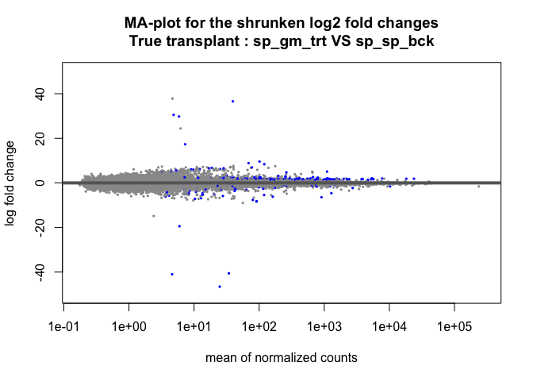
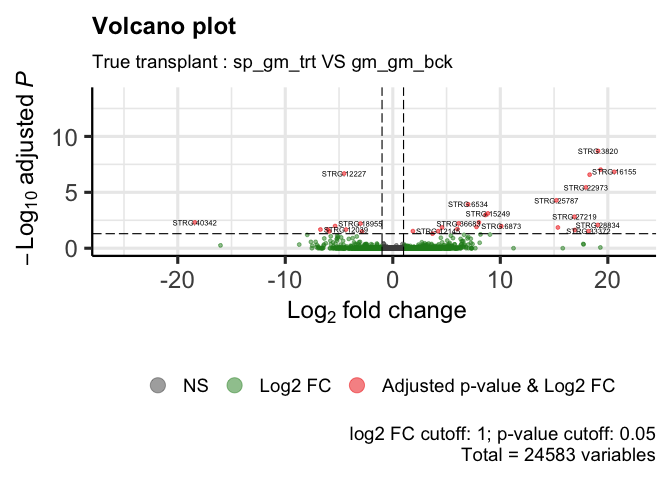
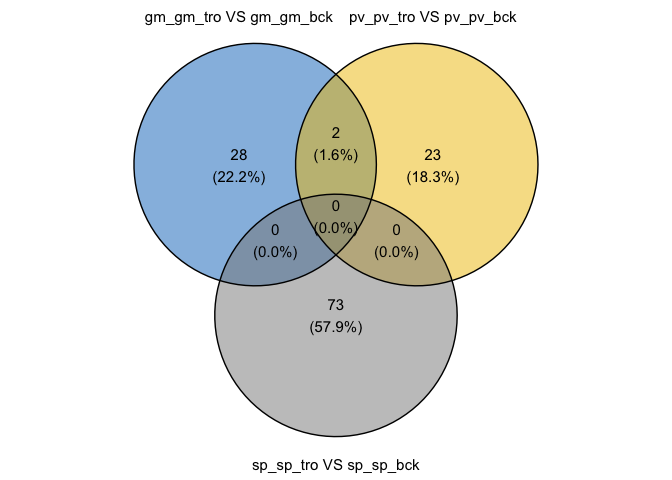
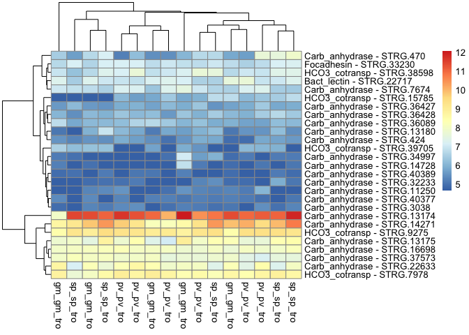

DE_Astroides_adult_trueTransplant
================
Marc Meynadier
6/3/2022

``` r
# Differential expression on Kallisto data 

# True transplant 

# Packages and dependence
packageCheckClassic <- function(x){
  for( i in x ){
    #  require returns TRUE invisibly if it was able to load package
    if( ! require( i , character.only = TRUE ) ){
      #  If package was not able to be loaded then re-install
      install.packages( i , dependencies = TRUE )
      #  Load package after installing
      require( i , character.only = TRUE )
    }
  }
}

packageCheckClassic(c('DESeq2','devtools','BiocManager','ggplot2','ggrepel','markdown','RColorBrewer','genefilter','gplots','vegan','dplyr'))
```

    ## Le chargement a nécessité le package : DESeq2

    ## Le chargement a nécessité le package : S4Vectors

    ## Warning: le package 'S4Vectors' a été compilé avec la version R 4.1.3

    ## Le chargement a nécessité le package : stats4

    ## Le chargement a nécessité le package : BiocGenerics

    ## 
    ## Attachement du package : 'BiocGenerics'

    ## Les objets suivants sont masqués depuis 'package:stats':
    ## 
    ##     IQR, mad, sd, var, xtabs

    ## Les objets suivants sont masqués depuis 'package:base':
    ## 
    ##     anyDuplicated, append, as.data.frame, basename, cbind, colnames,
    ##     dirname, do.call, duplicated, eval, evalq, Filter, Find, get, grep,
    ##     grepl, intersect, is.unsorted, lapply, Map, mapply, match, mget,
    ##     order, paste, pmax, pmax.int, pmin, pmin.int, Position, rank,
    ##     rbind, Reduce, rownames, sapply, setdiff, sort, table, tapply,
    ##     union, unique, unsplit, which.max, which.min

    ## 
    ## Attachement du package : 'S4Vectors'

    ## Les objets suivants sont masqués depuis 'package:base':
    ## 
    ##     expand.grid, I, unname

    ## Le chargement a nécessité le package : IRanges

    ## Le chargement a nécessité le package : GenomicRanges

    ## Le chargement a nécessité le package : GenomeInfoDb

    ## Le chargement a nécessité le package : SummarizedExperiment

    ## Le chargement a nécessité le package : MatrixGenerics

    ## Le chargement a nécessité le package : matrixStats

    ## 
    ## Attachement du package : 'MatrixGenerics'

    ## Les objets suivants sont masqués depuis 'package:matrixStats':
    ## 
    ##     colAlls, colAnyNAs, colAnys, colAvgsPerRowSet, colCollapse,
    ##     colCounts, colCummaxs, colCummins, colCumprods, colCumsums,
    ##     colDiffs, colIQRDiffs, colIQRs, colLogSumExps, colMadDiffs,
    ##     colMads, colMaxs, colMeans2, colMedians, colMins, colOrderStats,
    ##     colProds, colQuantiles, colRanges, colRanks, colSdDiffs, colSds,
    ##     colSums2, colTabulates, colVarDiffs, colVars, colWeightedMads,
    ##     colWeightedMeans, colWeightedMedians, colWeightedSds,
    ##     colWeightedVars, rowAlls, rowAnyNAs, rowAnys, rowAvgsPerColSet,
    ##     rowCollapse, rowCounts, rowCummaxs, rowCummins, rowCumprods,
    ##     rowCumsums, rowDiffs, rowIQRDiffs, rowIQRs, rowLogSumExps,
    ##     rowMadDiffs, rowMads, rowMaxs, rowMeans2, rowMedians, rowMins,
    ##     rowOrderStats, rowProds, rowQuantiles, rowRanges, rowRanks,
    ##     rowSdDiffs, rowSds, rowSums2, rowTabulates, rowVarDiffs, rowVars,
    ##     rowWeightedMads, rowWeightedMeans, rowWeightedMedians,
    ##     rowWeightedSds, rowWeightedVars

    ## Le chargement a nécessité le package : Biobase

    ## Welcome to Bioconductor
    ## 
    ##     Vignettes contain introductory material; view with
    ##     'browseVignettes()'. To cite Bioconductor, see
    ##     'citation("Biobase")', and for packages 'citation("pkgname")'.

    ## 
    ## Attachement du package : 'Biobase'

    ## L'objet suivant est masqué depuis 'package:MatrixGenerics':
    ## 
    ##     rowMedians

    ## Les objets suivants sont masqués depuis 'package:matrixStats':
    ## 
    ##     anyMissing, rowMedians

    ## Le chargement a nécessité le package : devtools

    ## Le chargement a nécessité le package : usethis

    ## Le chargement a nécessité le package : BiocManager

    ## Bioconductor version '3.14' is out-of-date; the current release version '3.15'
    ##   is available with R version '4.2'; see https://bioconductor.org/install

    ## 
    ## Attachement du package : 'BiocManager'

    ## L'objet suivant est masqué depuis 'package:devtools':
    ## 
    ##     install

    ## Le chargement a nécessité le package : ggplot2

    ## Le chargement a nécessité le package : ggrepel

    ## Le chargement a nécessité le package : markdown

    ## Le chargement a nécessité le package : RColorBrewer

    ## Le chargement a nécessité le package : genefilter

    ## 
    ## Attachement du package : 'genefilter'

    ## Les objets suivants sont masqués depuis 'package:MatrixGenerics':
    ## 
    ##     rowSds, rowVars

    ## Les objets suivants sont masqués depuis 'package:matrixStats':
    ## 
    ##     rowSds, rowVars

    ## Le chargement a nécessité le package : gplots

    ## 
    ## Attachement du package : 'gplots'

    ## L'objet suivant est masqué depuis 'package:IRanges':
    ## 
    ##     space

    ## L'objet suivant est masqué depuis 'package:S4Vectors':
    ## 
    ##     space

    ## L'objet suivant est masqué depuis 'package:stats':
    ## 
    ##     lowess

    ## Le chargement a nécessité le package : vegan

    ## Le chargement a nécessité le package : permute

    ## 
    ## Attachement du package : 'permute'

    ## L'objet suivant est masqué depuis 'package:devtools':
    ## 
    ##     check

    ## Le chargement a nécessité le package : lattice

    ## This is vegan 2.6-2

    ## Le chargement a nécessité le package : dplyr

    ## 
    ## Attachement du package : 'dplyr'

    ## L'objet suivant est masqué depuis 'package:Biobase':
    ## 
    ##     combine

    ## L'objet suivant est masqué depuis 'package:matrixStats':
    ## 
    ##     count

    ## Les objets suivants sont masqués depuis 'package:GenomicRanges':
    ## 
    ##     intersect, setdiff, union

    ## L'objet suivant est masqué depuis 'package:GenomeInfoDb':
    ## 
    ##     intersect

    ## Les objets suivants sont masqués depuis 'package:IRanges':
    ## 
    ##     collapse, desc, intersect, setdiff, slice, union

    ## Les objets suivants sont masqués depuis 'package:S4Vectors':
    ## 
    ##     first, intersect, rename, setdiff, setequal, union

    ## Les objets suivants sont masqués depuis 'package:BiocGenerics':
    ## 
    ##     combine, intersect, setdiff, union

    ## Les objets suivants sont masqués depuis 'package:stats':
    ## 
    ##     filter, lag

    ## Les objets suivants sont masqués depuis 'package:base':
    ## 
    ##     intersect, setdiff, setequal, union

``` r
#BiocManager::install('tximport', force = TRUE)
#BiocManager::install('apeglm')
#BiocManager::install('ashr')
#BiocManager::install("EnhancedVolcano")
#BiocManager::install('limma')
#devtools::install_github('cran/GMD')
if (!require(devtools)) install.packages("devtools")
devtools::install_github("yanlinlin82/ggvenn")
```

    ## Skipping install of 'ggvenn' from a github remote, the SHA1 (b7ff54ba) has not changed since last install.
    ##   Use `force = TRUE` to force installation

``` r
library('ggvenn')
```

    ## Le chargement a nécessité le package : grid

``` r
library('tximport')
library('apeglm')
library('ashr')
library('EnhancedVolcano')
```

    ## Registered S3 methods overwritten by 'ggalt':
    ##   method                  from   
    ##   grid.draw.absoluteGrob  ggplot2
    ##   grobHeight.absoluteGrob ggplot2
    ##   grobWidth.absoluteGrob  ggplot2
    ##   grobX.absoluteGrob      ggplot2
    ##   grobY.absoluteGrob      ggplot2

``` r
source_url("https://raw.githubusercontent.com/obigriffith/biostar-tutorials/master/Heatmaps/heatmap.3.R")
```

    ## ℹ SHA-1 hash of file is 015fc0457e61e3e93a903e69a24d96d2dac7b9fb

``` r
# Working environment 
scriptPath<-dirname(rstudioapi::getSourceEditorContext()$path)
setwd(scriptPath)
samples<-read.table('tximport_design_trueTransplant.txt',header=T)
samplesBck<-read.table('tximport_design_trueTransplant_bck.txt',header=T)
samplesTro<-read.table('tximport_design_trueTransplant_tro.txt',header=T)
samplesBckTro<-read.table('tximport_design_trueTransplant_tro_bck.txt',header=T)
samplesTrt<-read.table('tximport_design_trueTransplant_trt.txt',header=T)
tx2gene<-read.table('tx2gene_adultTranscriptome',header=T)
candidateGenes<-read.csv('candidateGenes.csv',header=T,sep=',')
scriptPath <- sub("/[^/]+$", "", scriptPath)
scriptPath <- sub("/[^/]+$", "", scriptPath)
dataPath<-'/data/net/6_kallisto/adultTranscriptome/adult/4_trueTransplant'
outputPath<-paste(scriptPath,'/output/DESeq2/adultTranscriptome/adult/4_trueTransplant/',sep='')
wdPath<-paste(scriptPath,dataPath,sep='')
setwd(wdPath)

# Data importation - txImport
files<-paste0(samples$samples,'.tsv')
filesBck<-paste0(samplesBck$samples,'.tsv')
filesTro<-paste0(samplesTro$samples,'.tsv')
filesBckTro<-paste0(samplesBckTro$samples,'.tsv')
filesTrt<-paste0(samplesTrt$samples,'.tsv')
names(files)<-samples$samples
names(filesBck)<-samplesBck$samples
names(filesTro)<-samplesTro$samples
names(filesBckTro)<-samplesBckTro$samples
names(filesTrt)<-samplesTrt$samples
txi<-tximport(files = files,type='kallisto',tx2gene = tx2gene)
```

    ## Note: importing `abundance.h5` is typically faster than `abundance.tsv`

    ## reading in files with read_tsv

    ## 1 2 3 4 5 6 7 8 9 10 11 12 13 14 15 16 17 18 19 20 21 22 23 24 25 26 27 28 29 30 31 32 33 34 35 36 37 38 39 40 41 42 43 44 
    ## transcripts missing from tx2gene: 1
    ## summarizing abundance
    ## summarizing counts
    ## summarizing length

``` r
txiBck<-tximport(files = filesBck,type='kallisto',tx2gene = tx2gene)
```

    ## Note: importing `abundance.h5` is typically faster than `abundance.tsv`
    ## reading in files with read_tsv
    ## 1 2 3 4 5 6 7 8 9 
    ## transcripts missing from tx2gene: 1
    ## summarizing abundance
    ## summarizing counts
    ## summarizing length

``` r
txiTro<-tximport(files = filesTro,type='kallisto',tx2gene = tx2gene)
```

    ## Note: importing `abundance.h5` is typically faster than `abundance.tsv`
    ## reading in files with read_tsv
    ## 1 2 3 4 5 6 7 8 9 10 11 12 13 14 15 16 
    ## transcripts missing from tx2gene: 1
    ## summarizing abundance
    ## summarizing counts
    ## summarizing length

``` r
txiBckTro<-tximport(files = filesBckTro,type='kallisto',tx2gene = tx2gene)
```

    ## Note: importing `abundance.h5` is typically faster than `abundance.tsv`
    ## reading in files with read_tsv
    ## 1 2 3 4 5 6 7 8 9 10 11 12 13 14 15 16 17 18 19 20 21 22 23 24 25 
    ## transcripts missing from tx2gene: 1
    ## summarizing abundance
    ## summarizing counts
    ## summarizing length

``` r
txiTrt<-tximport(files = filesTrt,type='kallisto',tx2gene = tx2gene)
```

    ## Note: importing `abundance.h5` is typically faster than `abundance.tsv`
    ## reading in files with read_tsv
    ## 1 2 3 4 5 6 7 8 9 10 11 12 13 14 15 16 17 18 19 
    ## transcripts missing from tx2gene: 1
    ## summarizing abundance
    ## summarizing counts
    ## summarizing length

``` r
names(txi)
```

    ## [1] "abundance"           "counts"              "length"             
    ## [4] "countsFromAbundance"

``` r
head(txi$counts)
```

    ##                    abundance_adult_may2018_gm_gm_bck_15873X22_trimmed
    ## TRINITY_DN0_c0_g1                                            579.0000
    ## TRINITY_DN0_c0_g2                                            114.2400
    ## TRINITY_DN0_c1_g1                                             21.1474
    ## TRINITY_DN1_c0_g1                                           2483.8000
    ## TRINITY_DN1_c1_g1                                              0.0000
    ## TRINITY_DN10_c0_g1                                           352.2210
    ##                    abundance_adult_may2018_gm_gm_bck_15873X31_trimmed
    ## TRINITY_DN0_c0_g1                                             874.000
    ## TRINITY_DN0_c0_g2                                             151.000
    ## TRINITY_DN0_c1_g1                                              31.000
    ## TRINITY_DN1_c0_g1                                            1956.560
    ## TRINITY_DN1_c1_g1                                               0.000
    ## TRINITY_DN10_c0_g1                                            364.377
    ##                    abundance_adult_may2018_gm_gm_bck_15941X16_trimmed
    ## TRINITY_DN0_c0_g1                                            532.0000
    ## TRINITY_DN0_c0_g2                                             82.0000
    ## TRINITY_DN0_c1_g1                                             15.1829
    ## TRINITY_DN1_c0_g1                                           2406.0000
    ## TRINITY_DN1_c1_g1                                              0.0000
    ## TRINITY_DN10_c0_g1                                           420.4660
    ##                    abundance_adult_may2018_gm_gm_tro_15873X28_trimmed
    ## TRINITY_DN0_c0_g1                                            1137.000
    ## TRINITY_DN0_c0_g2                                             181.881
    ## TRINITY_DN0_c1_g1                                              28.000
    ## TRINITY_DN1_c0_g1                                            1161.000
    ## TRINITY_DN1_c1_g1                                               0.000
    ## TRINITY_DN10_c0_g1                                            340.446
    ##                    abundance_adult_may2018_gm_gm_tro_15873X5_trimmed
    ## TRINITY_DN0_c0_g1                                            877.000
    ## TRINITY_DN0_c0_g2                                            145.746
    ## TRINITY_DN0_c1_g1                                             42.000
    ## TRINITY_DN1_c0_g1                                           1128.000
    ## TRINITY_DN1_c1_g1                                              0.000
    ## TRINITY_DN10_c0_g1                                           402.303
    ##                    abundance_adult_may2018_gm_gm_tro_15941X17_trimmed
    ## TRINITY_DN0_c0_g1                                            820.0000
    ## TRINITY_DN0_c0_g2                                            217.8190
    ## TRINITY_DN0_c1_g1                                             13.0586
    ## TRINITY_DN1_c0_g1                                           4157.8200
    ## TRINITY_DN1_c1_g1                                              0.0000
    ## TRINITY_DN10_c0_g1                                           618.5000
    ##                    abundance_adult_may2018_gm_gm_tro_15941X33_trimmed
    ## TRINITY_DN0_c0_g1                                           2247.0000
    ## TRINITY_DN0_c0_g2                                            220.0000
    ## TRINITY_DN0_c1_g1                                             62.8559
    ## TRINITY_DN1_c0_g1                                           1179.9000
    ## TRINITY_DN1_c1_g1                                              0.0000
    ## TRINITY_DN10_c0_g1                                           621.0650
    ##                    abundance_adult_may2018_gm_gm_tro_15941X5_trimmed
    ## TRINITY_DN0_c0_g1                                             623.00
    ## TRINITY_DN0_c0_g2                                             113.00
    ## TRINITY_DN0_c1_g1                                              34.00
    ## TRINITY_DN1_c0_g1                                            2980.79
    ## TRINITY_DN1_c1_g1                                               0.00
    ## TRINITY_DN10_c0_g1                                            409.83
    ##                    abundance_adult_may2018_gm_pv_trt_15873X32_trimmed
    ## TRINITY_DN0_c0_g1                                            920.0000
    ## TRINITY_DN0_c0_g2                                             91.2609
    ## TRINITY_DN0_c1_g1                                             15.0846
    ## TRINITY_DN1_c0_g1                                           3680.0000
    ## TRINITY_DN1_c1_g1                                              0.0000
    ## TRINITY_DN10_c0_g1                                           314.3110
    ##                    abundance_adult_may2018_gm_pv_trt_15873X8_trimmed
    ## TRINITY_DN0_c0_g1                                           635.0000
    ## TRINITY_DN0_c0_g2                                           156.0000
    ## TRINITY_DN0_c1_g1                                            13.0969
    ## TRINITY_DN1_c0_g1                                          2904.9000
    ## TRINITY_DN1_c1_g1                                             0.0000
    ## TRINITY_DN10_c0_g1                                          294.6820
    ##                    abundance_adult_may2018_gm_pv_trt_15941X20_trimmed
    ## TRINITY_DN0_c0_g1                                           1060.0000
    ## TRINITY_DN0_c0_g2                                             92.0000
    ## TRINITY_DN0_c1_g1                                             16.1139
    ## TRINITY_DN1_c0_g1                                            994.0000
    ## TRINITY_DN1_c1_g1                                              0.0000
    ## TRINITY_DN10_c0_g1                                           225.0080
    ##                    abundance_adult_may2018_gm_pv_trt_15941X40_trimmed
    ## TRINITY_DN0_c0_g1                                            1506.000
    ## TRINITY_DN0_c0_g2                                             118.000
    ## TRINITY_DN0_c1_g1                                              32.000
    ## TRINITY_DN1_c0_g1                                            1299.790
    ## TRINITY_DN1_c1_g1                                               0.000
    ## TRINITY_DN10_c0_g1                                            382.047
    ##                    abundance_adult_may2018_gm_pv_trt_15941X7_trimmed
    ## TRINITY_DN0_c0_g1                                           594.0000
    ## TRINITY_DN0_c0_g2                                            70.0000
    ## TRINITY_DN0_c1_g1                                            15.2788
    ## TRINITY_DN1_c0_g1                                           518.0000
    ## TRINITY_DN1_c1_g1                                             0.0000
    ## TRINITY_DN10_c0_g1                                          112.4760
    ##                    abundance_adult_may2018_gm_sp_trt_15873X25_trimmed
    ## TRINITY_DN0_c0_g1                                            1195.000
    ## TRINITY_DN0_c0_g2                                             198.000
    ## TRINITY_DN0_c1_g1                                              23.000
    ## TRINITY_DN1_c0_g1                                            1177.000
    ## TRINITY_DN1_c1_g1                                               0.000
    ## TRINITY_DN10_c0_g1                                            305.009
    ##                    abundance_adult_may2018_gm_sp_trt_15873X3_trimmed
    ## TRINITY_DN0_c0_g1                                           613.0000
    ## TRINITY_DN0_c0_g2                                           154.0000
    ## TRINITY_DN0_c1_g1                                            28.0476
    ## TRINITY_DN1_c0_g1                                          3960.5800
    ## TRINITY_DN1_c1_g1                                             0.0000
    ## TRINITY_DN10_c0_g1                                          434.8940
    ##                    abundance_adult_may2018_gm_sp_trt_15873X42_trimmed
    ## TRINITY_DN0_c0_g1                                            547.0000
    ## TRINITY_DN0_c0_g2                                             88.0000
    ## TRINITY_DN0_c1_g1                                             14.6918
    ## TRINITY_DN1_c0_g1                                           2810.0000
    ## TRINITY_DN1_c1_g1                                              0.0000
    ## TRINITY_DN10_c0_g1                                           347.5170
    ##                    abundance_adult_may2018_gm_sp_trt_15941X30_trimmed
    ## TRINITY_DN0_c0_g1                                            489.0000
    ## TRINITY_DN0_c0_g2                                            112.0000
    ## TRINITY_DN0_c1_g1                                             26.0782
    ## TRINITY_DN1_c0_g1                                           3502.0000
    ## TRINITY_DN1_c1_g1                                              0.0000
    ## TRINITY_DN10_c0_g1                                           348.0780
    ##                    abundance_adult_may2018_gm_sp_trt_15941X3_trimmed
    ## TRINITY_DN0_c0_g1                                            531.000
    ## TRINITY_DN0_c0_g2                                             75.000
    ## TRINITY_DN0_c1_g1                                              8.000
    ## TRINITY_DN1_c0_g1                                           1340.000
    ## TRINITY_DN1_c1_g1                                              0.000
    ## TRINITY_DN10_c0_g1                                           179.549
    ##                    abundance_adult_may2018_pv_gm_trt_15873X29_trimmed
    ## TRINITY_DN0_c0_g1                                             421.000
    ## TRINITY_DN0_c0_g2                                             189.000
    ## TRINITY_DN0_c1_g1                                              17.000
    ## TRINITY_DN1_c0_g1                                            2543.000
    ## TRINITY_DN1_c1_g1                                               0.000
    ## TRINITY_DN10_c0_g1                                            326.431
    ##                    abundance_adult_may2018_pv_gm_trt_15873X6_trimmed
    ## TRINITY_DN0_c0_g1                                           748.0000
    ## TRINITY_DN0_c0_g2                                           132.8390
    ## TRINITY_DN0_c1_g1                                            39.1805
    ## TRINITY_DN1_c0_g1                                           624.0000
    ## TRINITY_DN1_c1_g1                                             0.0000
    ## TRINITY_DN10_c0_g1                                          261.7620
    ##                    abundance_adult_may2018_pv_gm_trt_15941X18_trimmed
    ## TRINITY_DN0_c0_g1                                           1216.0000
    ## TRINITY_DN0_c0_g2                                            231.0000
    ## TRINITY_DN0_c1_g1                                             26.2278
    ## TRINITY_DN1_c0_g1                                           1187.0000
    ## TRINITY_DN1_c1_g1                                              0.0000
    ## TRINITY_DN10_c0_g1                                           422.1040
    ##                    abundance_adult_may2018_pv_gm_trt_15941X34_trimmed
    ## TRINITY_DN0_c0_g1                                             943.000
    ## TRINITY_DN0_c0_g2                                             152.000
    ## TRINITY_DN0_c1_g1                                              19.000
    ## TRINITY_DN1_c0_g1                                            3541.000
    ## TRINITY_DN1_c1_g1                                               0.000
    ## TRINITY_DN10_c0_g1                                            510.854
    ##                    abundance_adult_may2018_pv_gm_trt_15941X6_trimmed
    ## TRINITY_DN0_c0_g1                                            805.000
    ## TRINITY_DN0_c0_g2                                            135.000
    ## TRINITY_DN0_c1_g1                                             17.000
    ## TRINITY_DN1_c0_g1                                           1140.540
    ## TRINITY_DN1_c1_g1                                              0.000
    ## TRINITY_DN10_c0_g1                                           315.937
    ##                    abundance_adult_may2018_pv_pv_bck_15873X19_trimmed
    ## TRINITY_DN0_c0_g1                                             827.000
    ## TRINITY_DN0_c0_g2                                             151.000
    ## TRINITY_DN0_c1_g1                                              27.134
    ## TRINITY_DN1_c0_g1                                            2731.860
    ## TRINITY_DN1_c1_g1                                               0.000
    ## TRINITY_DN10_c0_g1                                            312.656
    ##                    abundance_adult_may2018_pv_pv_bck_15941X42_trimmed
    ## TRINITY_DN0_c0_g1                                           1130.0000
    ## TRINITY_DN0_c0_g2                                            201.0000
    ## TRINITY_DN0_c1_g1                                             20.0949
    ## TRINITY_DN1_c0_g1                                           2895.0000
    ## TRINITY_DN1_c1_g1                                              0.0000
    ## TRINITY_DN10_c0_g1                                           422.7290
    ##                    abundance_adult_may2018_pv_pv_bck_15941X52_trimmed
    ## TRINITY_DN0_c0_g1                                             824.000
    ## TRINITY_DN0_c0_g2                                              82.000
    ## TRINITY_DN0_c1_g1                                               9.000
    ## TRINITY_DN1_c0_g1                                            2423.000
    ## TRINITY_DN1_c1_g1                                               0.000
    ## TRINITY_DN10_c0_g1                                            354.774
    ##                    abundance_adult_may2018_pv_pv_tro_15873X33_trimmed
    ## TRINITY_DN0_c0_g1                                            640.0000
    ## TRINITY_DN0_c0_g2                                            102.0000
    ## TRINITY_DN0_c1_g1                                             14.2261
    ## TRINITY_DN1_c0_g1                                           2746.8100
    ## TRINITY_DN1_c1_g1                                              0.0000
    ## TRINITY_DN10_c0_g1                                           215.3340
    ##                    abundance_adult_may2018_pv_pv_tro_15873X9_trimmed
    ## TRINITY_DN0_c0_g1                                            730.000
    ## TRINITY_DN0_c0_g2                                            140.000
    ## TRINITY_DN0_c1_g1                                             18.000
    ## TRINITY_DN1_c0_g1                                           1817.000
    ## TRINITY_DN1_c1_g1                                              0.000
    ## TRINITY_DN10_c0_g1                                           254.003
    ##                    abundance_adult_may2018_pv_pv_tro_15941X21_trimmed
    ## TRINITY_DN0_c0_g1                                             859.000
    ## TRINITY_DN0_c0_g2                                             175.000
    ## TRINITY_DN0_c1_g1                                              19.052
    ## TRINITY_DN1_c0_g1                                            5596.840
    ## TRINITY_DN1_c1_g1                                               0.000
    ## TRINITY_DN10_c0_g1                                            405.289
    ##                    abundance_adult_may2018_pv_pv_tro_15941X22_trimmed
    ## TRINITY_DN0_c0_g1                                           1000.0000
    ## TRINITY_DN0_c0_g2                                             77.0000
    ## TRINITY_DN0_c1_g1                                             22.0873
    ## TRINITY_DN1_c0_g1                                           3065.9000
    ## TRINITY_DN1_c1_g1                                              0.0000
    ## TRINITY_DN10_c0_g1                                           364.8080
    ##                    abundance_adult_may2018_pv_pv_tro_15941X41_trimmed
    ## TRINITY_DN0_c0_g1                                           1754.0000
    ## TRINITY_DN0_c0_g2                                            123.0000
    ## TRINITY_DN0_c1_g1                                             10.1636
    ## TRINITY_DN1_c0_g1                                           2477.0000
    ## TRINITY_DN1_c1_g1                                              0.0000
    ## TRINITY_DN10_c0_g1                                           535.1100
    ##                    abundance_adult_may2018_pv_pv_tro_15941X8_trimmed
    ## TRINITY_DN0_c0_g1                                            788.000
    ## TRINITY_DN0_c0_g2                                             56.000
    ## TRINITY_DN0_c1_g1                                             22.000
    ## TRINITY_DN1_c0_g1                                           1629.000
    ## TRINITY_DN1_c1_g1                                              0.000
    ## TRINITY_DN10_c0_g1                                           254.054
    ##                    abundance_adult_may2018_sp_gm_trt_15873X27_trimmed
    ## TRINITY_DN0_c0_g1                                             536.000
    ## TRINITY_DN0_c0_g2                                             266.000
    ## TRINITY_DN0_c1_g1                                              22.000
    ## TRINITY_DN1_c0_g1                                            3568.000
    ## TRINITY_DN1_c1_g1                                               0.000
    ## TRINITY_DN10_c0_g1                                            466.372
    ##                    abundance_adult_may2018_sp_gm_trt_15873X4_trimmed
    ## TRINITY_DN0_c0_g1                                          753.00000
    ## TRINITY_DN0_c0_g2                                          174.00000
    ## TRINITY_DN0_c1_g1                                            6.03349
    ## TRINITY_DN1_c0_g1                                         1979.00000
    ## TRINITY_DN1_c1_g1                                            0.00000
    ## TRINITY_DN10_c0_g1                                         434.42900
    ##                    abundance_adult_may2018_sp_gm_trt_15941X32_trimmed
    ## TRINITY_DN0_c0_g1                                           610.00000
    ## TRINITY_DN0_c0_g2                                           100.00000
    ## TRINITY_DN0_c1_g1                                             5.10079
    ## TRINITY_DN1_c0_g1                                          3229.92000
    ## TRINITY_DN1_c1_g1                                             0.00000
    ## TRINITY_DN10_c0_g1                                          357.62500
    ##                    abundance_adult_may2018_sp_gm_trt_15941X4_trimmed
    ## TRINITY_DN0_c0_g1                                          1139.0000
    ## TRINITY_DN0_c0_g2                                           269.0000
    ## TRINITY_DN0_c1_g1                                            63.7267
    ## TRINITY_DN1_c0_g1                                           973.5230
    ## TRINITY_DN1_c1_g1                                             0.0000
    ## TRINITY_DN10_c0_g1                                          428.5060
    ##                    abundance_adult_may2018_sp_sp_bck_15873X26_trimmed
    ## TRINITY_DN0_c0_g1                                            711.0000
    ## TRINITY_DN0_c0_g2                                            144.6610
    ## TRINITY_DN0_c1_g1                                             14.1281
    ## TRINITY_DN1_c0_g1                                           2340.0000
    ## TRINITY_DN1_c1_g1                                              0.0000
    ## TRINITY_DN10_c0_g1                                           584.2590
    ##                    abundance_adult_may2018_sp_sp_bck_15873X43_trimmed
    ## TRINITY_DN0_c0_g1                                             484.000
    ## TRINITY_DN0_c0_g2                                             121.000
    ## TRINITY_DN0_c1_g1                                              13.000
    ## TRINITY_DN1_c0_g1                                            3895.000
    ## TRINITY_DN1_c1_g1                                               0.000
    ## TRINITY_DN10_c0_g1                                            333.729
    ##                    abundance_adult_may2018_sp_sp_bck_15941X31_trimmed
    ## TRINITY_DN0_c0_g1                                            605.0000
    ## TRINITY_DN0_c0_g2                                            121.0000
    ## TRINITY_DN0_c1_g1                                             14.1333
    ## TRINITY_DN1_c0_g1                                           1840.0000
    ## TRINITY_DN1_c1_g1                                              0.0000
    ## TRINITY_DN10_c0_g1                                           318.3180
    ##                    abundance_adult_may2018_sp_sp_tro_15873X24_trimmed
    ## TRINITY_DN0_c0_g1                                             804.000
    ## TRINITY_DN0_c0_g2                                             135.000
    ## TRINITY_DN0_c1_g1                                              24.000
    ## TRINITY_DN1_c0_g1                                            1622.000
    ## TRINITY_DN1_c1_g1                                               0.000
    ## TRINITY_DN10_c0_g1                                            266.187
    ##                    abundance_adult_may2018_sp_sp_tro_15873X2_trimmed
    ## TRINITY_DN0_c0_g1                                          1337.0000
    ## TRINITY_DN0_c0_g2                                           167.0000
    ## TRINITY_DN0_c1_g1                                            91.6671
    ## TRINITY_DN1_c0_g1                                           958.0000
    ## TRINITY_DN1_c1_g1                                             0.0000
    ## TRINITY_DN10_c0_g1                                          383.3530
    ##                    abundance_adult_may2018_sp_sp_tro_15873X41_trimmed
    ## TRINITY_DN0_c0_g1                                             675.000
    ## TRINITY_DN0_c0_g2                                              87.467
    ## TRINITY_DN0_c1_g1                                              20.000
    ## TRINITY_DN1_c0_g1                                            2794.820
    ## TRINITY_DN1_c1_g1                                               0.000
    ## TRINITY_DN10_c0_g1                                            342.957
    ##                    abundance_adult_may2018_sp_sp_tro_15941X29_trimmed
    ## TRINITY_DN0_c0_g1                                           1112.0000
    ## TRINITY_DN0_c0_g2                                             90.7702
    ## TRINITY_DN0_c1_g1                                             24.4845
    ## TRINITY_DN1_c0_g1                                            672.0000
    ## TRINITY_DN1_c1_g1                                              0.0000
    ## TRINITY_DN10_c0_g1                                           318.7240
    ##                    abundance_adult_may2018_sp_sp_tro_15941X2_trimmed
    ## TRINITY_DN0_c0_g1                                           596.0000
    ## TRINITY_DN0_c0_g2                                            86.0000
    ## TRINITY_DN0_c1_g1                                            13.0707
    ## TRINITY_DN1_c0_g1                                          2099.0000
    ## TRINITY_DN1_c1_g1                                             0.0000
    ## TRINITY_DN10_c0_g1                                          302.8060

``` r
dds<-DESeqDataSetFromTximport(txi,colData=samples,design= ~originSite_finalSite_experiment)
```

    ## Warning in DESeqDataSet(se, design = design, ignoreRank): some variables in
    ## design formula are characters, converting to factors

    ## using counts and average transcript lengths from tximport

``` r
ddsBck<-DESeqDataSetFromTximport(txiBck,colData=samplesBck,design= ~originSite_finalSite_experiment)
```

    ## Warning in DESeqDataSet(se, design = design, ignoreRank): some variables in
    ## design formula are characters, converting to factors

    ## using counts and average transcript lengths from tximport

``` r
ddsTro<-DESeqDataSetFromTximport(txiTro,colData=samplesTro,design= ~originSite_finalSite_experiment)
```

    ## Warning in DESeqDataSet(se, design = design, ignoreRank): some variables in
    ## design formula are characters, converting to factors

    ## using counts and average transcript lengths from tximport

``` r
ddsBckTro<-DESeqDataSetFromTximport(txiBckTro,colData=samplesBckTro,design= ~originSite_finalSite_experiment)
```

    ## Warning in DESeqDataSet(se, design = design, ignoreRank): some variables in
    ## design formula are characters, converting to factors

    ## using counts and average transcript lengths from tximport

``` r
ddsTrt<-DESeqDataSetFromTximport(txiTrt,colData=samplesTrt,design= ~originSite_finalSite_experiment)
```

    ## Warning in DESeqDataSet(se, design = design, ignoreRank): some variables in
    ## design formula are characters, converting to factors

    ## using counts and average transcript lengths from tximport

``` r
# pre-filtering
keep <- rowSums(counts(dds)) >= 10 
dds <- dds[keep,]
keep <- rowSums(counts(ddsBck)) >= 10 
ddsBck <- ddsBck[keep,]
keep <- rowSums(counts(ddsTro)) >= 10 
ddsTro <- ddsTro[keep,]
keep <- rowSums(counts(ddsBckTro)) >= 10 
ddsBckTro <- ddsBckTro[keep,]
keep <- rowSums(counts(ddsTrt)) >= 10 
ddsTrt <- ddsTrt[keep,]

# Differential expression analysis
dds<-DESeq(dds)
```

    ## estimating size factors
    ## using 'avgTxLength' from assays(dds), correcting for library size
    ## estimating dispersions
    ## gene-wise dispersion estimates
    ## mean-dispersion relationship
    ## final dispersion estimates
    ## fitting model and testing

``` r
ddsBck<-DESeq(ddsBck)
```

    ## estimating size factors
    ## using 'avgTxLength' from assays(dds), correcting for library size
    ## estimating dispersions
    ## gene-wise dispersion estimates
    ## mean-dispersion relationship
    ## final dispersion estimates
    ## fitting model and testing

``` r
ddsTro<-DESeq(ddsTro)
```

    ## estimating size factors
    ## using 'avgTxLength' from assays(dds), correcting for library size
    ## estimating dispersions
    ## gene-wise dispersion estimates
    ## mean-dispersion relationship
    ## final dispersion estimates
    ## fitting model and testing

``` r
ddsBckTro<-DESeq(ddsBckTro)
```

    ## estimating size factors
    ## using 'avgTxLength' from assays(dds), correcting for library size
    ## estimating dispersions
    ## gene-wise dispersion estimates
    ## mean-dispersion relationship
    ## final dispersion estimates
    ## fitting model and testing

``` r
ddsTrt<-DESeq(ddsTrt)
```

    ## estimating size factors
    ## using 'avgTxLength' from assays(dds), correcting for library size
    ## estimating dispersions
    ## gene-wise dispersion estimates
    ## mean-dispersion relationship
    ## final dispersion estimates
    ## fitting model and testing

``` r
cbind(resultsNames(dds))
```

    ##       [,1]                                                    
    ##  [1,] "Intercept"                                             
    ##  [2,] "originSite_finalSite_experiment_gm_gm_tro_vs_gm_gm_bck"
    ##  [3,] "originSite_finalSite_experiment_gm_pv_trt_vs_gm_gm_bck"
    ##  [4,] "originSite_finalSite_experiment_gm_sp_trt_vs_gm_gm_bck"
    ##  [5,] "originSite_finalSite_experiment_pv_gm_trt_vs_gm_gm_bck"
    ##  [6,] "originSite_finalSite_experiment_pv_pv_bck_vs_gm_gm_bck"
    ##  [7,] "originSite_finalSite_experiment_pv_pv_tro_vs_gm_gm_bck"
    ##  [8,] "originSite_finalSite_experiment_sp_gm_trt_vs_gm_gm_bck"
    ##  [9,] "originSite_finalSite_experiment_sp_sp_bck_vs_gm_gm_bck"
    ## [10,] "originSite_finalSite_experiment_sp_sp_tro_vs_gm_gm_bck"

``` r
gm_gm_tro_VS_gm_gm_bck<-results(dds, contrast=c("originSite_finalSite_experiment","gm_gm_tro","gm_gm_bck"), alpha = 0.05)
pv_pv_tro_VS_pv_pv_bck<-results(dds, contrast=c("originSite_finalSite_experiment","pv_pv_tro","pv_pv_bck"), alpha = 0.05)
sp_sp_tro_VS_sp_sp_bck<-results(dds, contrast=c("originSite_finalSite_experiment","sp_sp_tro","sp_sp_bck"), alpha = 0.05)
pv_gm_trt_VS_pv_pv_bck<-results(dds, contrast=c("originSite_finalSite_experiment","pv_gm_trt","pv_pv_bck"), alpha = 0.05)
sp_gm_trt_VS_sp_sp_bck<-results(dds, contrast=c("originSite_finalSite_experiment","sp_gm_trt","sp_sp_bck"), alpha = 0.05)
pv_gm_trt_VS_gm_gm_bck<-results(dds, contrast=c("originSite_finalSite_experiment","pv_gm_trt","gm_gm_bck"), alpha = 0.05)
sp_gm_trt_VS_gm_gm_bck<-results(dds, contrast=c("originSite_finalSite_experiment","sp_gm_trt","gm_gm_bck"), alpha = 0.05)
gm_pv_trt_VS_pv_pv_bck<-results(dds, contrast=c("originSite_finalSite_experiment","gm_pv_trt","pv_pv_bck"), alpha = 0.05)
gm_sp_trt_VS_sp_sp_bck<-results(dds, contrast=c("originSite_finalSite_experiment","gm_sp_trt","sp_sp_bck"), alpha = 0.05)
gm_pv_trt_VS_gm_gm_bck<-results(dds, contrast=c("originSite_finalSite_experiment","gm_pv_trt","gm_gm_bck"), alpha = 0.05)
gm_sp_trt_VS_gm_gm_bck<-results(dds, contrast=c("originSite_finalSite_experiment","gm_sp_trt","gm_gm_bck"), alpha = 0.05)
summary(gm_gm_tro_VS_gm_gm_bck)
```

    ## 
    ## out of 65416 with nonzero total read count
    ## adjusted p-value < 0.05
    ## LFC > 0 (up)       : 23, 0.035%
    ## LFC < 0 (down)     : 18, 0.028%
    ## outliers [1]       : 102, 0.16%
    ## low counts [2]     : 29131, 45%
    ## (mean count < 5)
    ## [1] see 'cooksCutoff' argument of ?results
    ## [2] see 'independentFiltering' argument of ?results

``` r
summary(pv_pv_tro_VS_pv_pv_bck)
```

    ## 
    ## out of 65416 with nonzero total read count
    ## adjusted p-value < 0.05
    ## LFC > 0 (up)       : 44, 0.067%
    ## LFC < 0 (down)     : 21, 0.032%
    ## outliers [1]       : 102, 0.16%
    ## low counts [2]     : 25335, 39%
    ## (mean count < 3)
    ## [1] see 'cooksCutoff' argument of ?results
    ## [2] see 'independentFiltering' argument of ?results

``` r
summary(sp_sp_tro_VS_sp_sp_bck)
```

    ## 
    ## out of 65416 with nonzero total read count
    ## adjusted p-value < 0.05
    ## LFC > 0 (up)       : 105, 0.16%
    ## LFC < 0 (down)     : 53, 0.081%
    ## outliers [1]       : 102, 0.16%
    ## low counts [2]     : 31658, 48%
    ## (mean count < 6)
    ## [1] see 'cooksCutoff' argument of ?results
    ## [2] see 'independentFiltering' argument of ?results

``` r
summary(pv_gm_trt_VS_pv_pv_bck)
```

    ## 
    ## out of 65416 with nonzero total read count
    ## adjusted p-value < 0.05
    ## LFC > 0 (up)       : 116, 0.18%
    ## LFC < 0 (down)     : 77, 0.12%
    ## outliers [1]       : 102, 0.16%
    ## low counts [2]     : 30394, 46%
    ## (mean count < 5)
    ## [1] see 'cooksCutoff' argument of ?results
    ## [2] see 'independentFiltering' argument of ?results

``` r
summary(sp_gm_trt_VS_sp_sp_bck)
```

    ## 
    ## out of 65416 with nonzero total read count
    ## adjusted p-value < 0.05
    ## LFC > 0 (up)       : 280, 0.43%
    ## LFC < 0 (down)     : 86, 0.13%
    ## outliers [1]       : 102, 0.16%
    ## low counts [2]     : 32922, 50%
    ## (mean count < 7)
    ## [1] see 'cooksCutoff' argument of ?results
    ## [2] see 'independentFiltering' argument of ?results

``` r
summary(pv_gm_trt_VS_gm_gm_bck)
```

    ## 
    ## out of 65416 with nonzero total read count
    ## adjusted p-value < 0.05
    ## LFC > 0 (up)       : 44, 0.067%
    ## LFC < 0 (down)     : 45, 0.069%
    ## outliers [1]       : 102, 0.16%
    ## low counts [2]     : 27868, 43%
    ## (mean count < 4)
    ## [1] see 'cooksCutoff' argument of ?results
    ## [2] see 'independentFiltering' argument of ?results

``` r
summary(sp_gm_trt_VS_gm_gm_bck)
```

    ## 
    ## out of 65416 with nonzero total read count
    ## adjusted p-value < 0.05
    ## LFC > 0 (up)       : 26, 0.04%
    ## LFC < 0 (down)     : 30, 0.046%
    ## outliers [1]       : 102, 0.16%
    ## low counts [2]     : 27868, 43%
    ## (mean count < 4)
    ## [1] see 'cooksCutoff' argument of ?results
    ## [2] see 'independentFiltering' argument of ?results

``` r
summary(gm_pv_trt_VS_pv_pv_bck)
```

    ## 
    ## out of 65416 with nonzero total read count
    ## adjusted p-value < 0.05
    ## LFC > 0 (up)       : 101, 0.15%
    ## LFC < 0 (down)     : 99, 0.15%
    ## outliers [1]       : 102, 0.16%
    ## low counts [2]     : 29131, 45%
    ## (mean count < 5)
    ## [1] see 'cooksCutoff' argument of ?results
    ## [2] see 'independentFiltering' argument of ?results

``` r
summary(gm_sp_trt_VS_sp_sp_bck)
```

    ## 
    ## out of 65416 with nonzero total read count
    ## adjusted p-value < 0.05
    ## LFC > 0 (up)       : 62, 0.095%
    ## LFC < 0 (down)     : 42, 0.064%
    ## outliers [1]       : 102, 0.16%
    ## low counts [2]     : 29131, 45%
    ## (mean count < 5)
    ## [1] see 'cooksCutoff' argument of ?results
    ## [2] see 'independentFiltering' argument of ?results

``` r
summary(gm_pv_trt_VS_gm_gm_bck)
```

    ## 
    ## out of 65416 with nonzero total read count
    ## adjusted p-value < 0.05
    ## LFC > 0 (up)       : 786, 1.2%
    ## LFC < 0 (down)     : 909, 1.4%
    ## outliers [1]       : 102, 0.16%
    ## low counts [2]     : 36720, 56%
    ## (mean count < 11)
    ## [1] see 'cooksCutoff' argument of ?results
    ## [2] see 'independentFiltering' argument of ?results

``` r
summary(gm_sp_trt_VS_gm_gm_bck)
```

    ## 
    ## out of 65416 with nonzero total read count
    ## adjusted p-value < 0.05
    ## LFC > 0 (up)       : 73, 0.11%
    ## LFC < 0 (down)     : 26, 0.04%
    ## outliers [1]       : 102, 0.16%
    ## low counts [2]     : 29131, 45%
    ## (mean count < 5)
    ## [1] see 'cooksCutoff' argument of ?results
    ## [2] see 'independentFiltering' argument of ?results

``` r
# Exploring the results

# Results gm_gm_tro VS gm_gm_bck

#MA-plot
DESeq2::plotMA(gm_gm_tro_VS_gm_gm_bck,ylim=c(-50,50),main="MA-plot for the shrunken log2 fold changes\nTrue transplant : gm_gm_bck VS gm_gm_tro")
```

<!-- -->

``` r
# Volcano plot
pCutoff = 0.05
FCcutoff = 1.0
EnhancedVolcano(data.frame(gm_gm_tro_VS_gm_gm_bck), lab = rownames(data.frame(gm_gm_tro_VS_gm_gm_bck)), x = 'log2FoldChange', y = 'padj',
                xlab = bquote(~Log[2]~ 'fold change'), ylab = bquote(~-Log[10]~adjusted~italic(P)),
                pCutoff = pCutoff, FCcutoff = FCcutoff, pointSize = 1.0, labSize = 2.0,
                title = "Volcano plot", subtitle = "True transplant : gm_gm_bck VS gm_gm_tro",
                caption = paste0('log2 FC cutoff: ', FCcutoff, '; p-value cutoff: ', pCutoff, '\nTotal = ', nrow(gm_gm_tro_VS_gm_gm_bck), ' variables'),
                legendLabels=c('NS','Log2 FC','Adjusted p-value', 'Adjusted p-value & Log2 FC'),
                legendPosition = 'bottom', legendLabSize = 14, legendIconSize = 5.0)
```

<!-- -->

``` r
# Results pv_pv_tro VS pv_pv_bck

#MA-plot
DESeq2::plotMA(pv_pv_tro_VS_pv_pv_bck,ylim=c(-50,50),main="MA-plot for the shrunken log2 fold changes\nTrue transplant : pv_pv_bck VS pv_pv_tro")
```

<!-- -->

``` r
# Volcano plot
EnhancedVolcano(data.frame(pv_pv_tro_VS_pv_pv_bck), lab = rownames(data.frame(pv_pv_tro_VS_pv_pv_bck)), x = 'log2FoldChange', y = 'padj',
                xlab = bquote(~Log[2]~ 'fold change'), ylab = bquote(~-Log[10]~adjusted~italic(P)),
                pCutoff = pCutoff, FCcutoff = FCcutoff, pointSize = 1.0, labSize = 2.0,
                title = "Volcano plot", subtitle = "True transplant : pv_pv_bck VS pv_pv_tro",
                caption = paste0('log2 FC cutoff: ', FCcutoff, '; p-value cutoff: ', pCutoff, '\nTotal = ', nrow(pv_pv_tro_VS_pv_pv_bck), ' variables'),
                legendLabels=c('NS','Log2 FC','Adjusted p-value', 'Adjusted p-value & Log2 FC'),
                legendPosition = 'bottom', legendLabSize = 14, legendIconSize = 5.0)
```

<!-- -->

``` r
# Results sp_sp_tro VS sp_sp_bck

#MA-plot
DESeq2::plotMA(sp_sp_tro_VS_sp_sp_bck,ylim=c(-50,50),main="MA-plot for the shrunken log2 fold changes\nTrue transplant : sp_sp_bck VS sp_sp_tro")
```

<!-- -->

``` r
# Volcano plot
EnhancedVolcano(data.frame(sp_sp_tro_VS_sp_sp_bck), lab = rownames(data.frame(sp_sp_tro_VS_sp_sp_bck)), x = 'log2FoldChange', y = 'padj',
                xlab = bquote(~Log[2]~ 'fold change'), ylab = bquote(~-Log[10]~adjusted~italic(P)),
                pCutoff = pCutoff, FCcutoff = FCcutoff, pointSize = 1.0, labSize = 2.0,
                title = "Volcano plot", subtitle = "True transplant : sp_sp_bck VS sp_sp_tro",
                caption = paste0('log2 FC cutoff: ', FCcutoff, '; p-value cutoff: ', pCutoff, '\nTotal = ', nrow(sp_sp_tro_VS_sp_sp_bck), ' variables'),
                legendLabels=c('NS','Log2 FC','Adjusted p-value', 'Adjusted p-value & Log2 FC'),
                legendPosition = 'bottom', legendLabSize = 14, legendIconSize = 5.0)
```

<!-- -->

``` r
# Results pv_gm_trt VS pv_pv_bck

#MA-plot
DESeq2::plotMA(pv_gm_trt_VS_pv_pv_bck,ylim=c(-50,50),main="MA-plot for the shrunken log2 fold changes\nTrue transplant : pv_gm_trt VS pv_pv_bck")
```

<!-- -->

``` r
# Volcano plot
EnhancedVolcano(data.frame(pv_gm_trt_VS_pv_pv_bck), lab = rownames(data.frame(pv_gm_trt_VS_pv_pv_bck)), x = 'log2FoldChange', y = 'padj',
                xlab = bquote(~Log[2]~ 'fold change'), ylab = bquote(~-Log[10]~adjusted~italic(P)),
                pCutoff = pCutoff, FCcutoff = FCcutoff, pointSize = 1.0, labSize = 2.0,
                title = "Volcano plot", subtitle = "True transplant : pv_gm_trt VS pv_pv_bck",
                caption = paste0('log2 FC cutoff: ', FCcutoff, '; p-value cutoff: ', pCutoff, '\nTotal = ', nrow(pv_gm_trt_VS_pv_pv_bck), ' variables'),
                legendLabels=c('NS','Log2 FC','Adjusted p-value', 'Adjusted p-value & Log2 FC'),
                legendPosition = 'bottom', legendLabSize = 14, legendIconSize = 5.0)
```

<!-- -->

``` r
# Results sp_gm_trt VS sp_sp_bck

#MA-plot
DESeq2::plotMA(sp_gm_trt_VS_sp_sp_bck,ylim=c(-50,50),main="MA-plot for the shrunken log2 fold changes\nTrue transplant : sp_gm_trt VS sp_sp_bck")
```

<!-- -->

``` r
# Volcano plot
EnhancedVolcano(data.frame(sp_gm_trt_VS_sp_sp_bck), lab = rownames(data.frame(sp_gm_trt_VS_sp_sp_bck)), x = 'log2FoldChange', y = 'padj',
                xlab = bquote(~Log[2]~ 'fold change'), ylab = bquote(~-Log[10]~adjusted~italic(P)),
                pCutoff = pCutoff, FCcutoff = FCcutoff, pointSize = 1.0, labSize = 2.0,
                title = "Volcano plot", subtitle = "True transplant : sp_gm_trt VS sp_sp_bck",
                caption = paste0('log2 FC cutoff: ', FCcutoff, '; p-value cutoff: ', pCutoff, '\nTotal = ', nrow(sp_gm_trt_VS_sp_sp_bck), ' variables'),
                legendLabels=c('NS','Log2 FC','Adjusted p-value', 'Adjusted p-value & Log2 FC'),
                legendPosition = 'bottom', legendLabSize = 14, legendIconSize = 5.0)
```

<!-- -->

``` r
# Results pv_gm_trt VS gm_gm_bck

#MA-plot
DESeq2::plotMA(pv_gm_trt_VS_gm_gm_bck,ylim=c(-50,50),main="MA-plot for the shrunken log2 fold changes\nTrue transplant : pv_gm_trt VS gm_gm_bck")
```

<!-- -->

``` r
# Volcano plot
EnhancedVolcano(data.frame(pv_gm_trt_VS_gm_gm_bck), lab = rownames(data.frame(pv_gm_trt_VS_gm_gm_bck)), x = 'log2FoldChange', y = 'padj',
                xlab = bquote(~Log[2]~ 'fold change'), ylab = bquote(~-Log[10]~adjusted~italic(P)),
                pCutoff = pCutoff, FCcutoff = FCcutoff, pointSize = 1.0, labSize = 2.0,
                title = "Volcano plot", subtitle = "True transplant : pv_gm_trt VS gm_gm_bck",
                caption = paste0('log2 FC cutoff: ', FCcutoff, '; p-value cutoff: ', pCutoff, '\nTotal = ', nrow(pv_gm_trt_VS_gm_gm_bck), ' variables'),
                legendLabels=c('NS','Log2 FC','Adjusted p-value', 'Adjusted p-value & Log2 FC'),
                legendPosition = 'bottom', legendLabSize = 14, legendIconSize = 5.0)
```

<!-- -->

``` r
# Results sp_gm_trt VS gm_gm_bck

#MA-plot
DESeq2::plotMA(sp_gm_trt_VS_gm_gm_bck,ylim=c(-50,50),main="MA-plot for the shrunken log2 fold changes\nTrue transplant : sp_gm_trt VS gm_gm_bck")
```

<!-- -->

``` r
# Volcano plot
EnhancedVolcano(data.frame(sp_gm_trt_VS_gm_gm_bck), lab = rownames(data.frame(sp_gm_trt_VS_gm_gm_bck)), x = 'log2FoldChange', y = 'padj',
                xlab = bquote(~Log[2]~ 'fold change'), ylab = bquote(~-Log[10]~adjusted~italic(P)),
                pCutoff = pCutoff, FCcutoff = FCcutoff, pointSize = 1.0, labSize = 2.0,
                title = "Volcano plot", subtitle = "True transplant : sp_gm_trt VS gm_gm_bck",
                caption = paste0('log2 FC cutoff: ', FCcutoff, '; p-value cutoff: ', pCutoff, '\nTotal = ', nrow(sp_gm_trt_VS_gm_gm_bck), ' variables'),
                legendLabels=c('NS','Log2 FC','Adjusted p-value', 'Adjusted p-value & Log2 FC'),
                legendPosition = 'bottom', legendLabSize = 14, legendIconSize = 5.0)
```

<!-- -->

``` r
# Results gm_pv_trt VS pv_pv_bck

#MA-plot
DESeq2::plotMA(gm_pv_trt_VS_pv_pv_bck,ylim=c(-50,50),main="MA-plot for the shrunken log2 fold changes\nTrue transplant : gm_pv_trt VS pv_pv_bck")
```

<!-- -->

``` r
# Volcano plot
EnhancedVolcano(data.frame(gm_pv_trt_VS_pv_pv_bck), lab = rownames(data.frame(gm_pv_trt_VS_pv_pv_bck)), x = 'log2FoldChange', y = 'padj',
                xlab = bquote(~Log[2]~ 'fold change'), ylab = bquote(~-Log[10]~adjusted~italic(P)),
                pCutoff = pCutoff, FCcutoff = FCcutoff, pointSize = 1.0, labSize = 2.0,
                title = "Volcano plot", subtitle = "True transplant : gm_pv_trt VS pv_pv_bck",
                caption = paste0('log2 FC cutoff: ', FCcutoff, '; p-value cutoff: ', pCutoff, '\nTotal = ', nrow(gm_pv_trt_VS_pv_pv_bck), ' variables'),
                legendLabels=c('NS','Log2 FC','Adjusted p-value', 'Adjusted p-value & Log2 FC'),
                legendPosition = 'bottom', legendLabSize = 14, legendIconSize = 5.0)
```

<!-- -->

``` r
# Results gm_sp_trt VS sp_sp_bck

#MA-plot
DESeq2::plotMA(gm_sp_trt_VS_sp_sp_bck,ylim=c(-50,50),main="MA-plot for the shrunken log2 fold changes\nTrue transplant : gm_sp_trt VS sp_sp_bck")
```

<!-- -->

``` r
# Volcano plot
EnhancedVolcano(data.frame(gm_sp_trt_VS_sp_sp_bck), lab = rownames(data.frame(gm_sp_trt_VS_sp_sp_bck)), x = 'log2FoldChange', y = 'padj',
                xlab = bquote(~Log[2]~ 'fold change'), ylab = bquote(~-Log[10]~adjusted~italic(P)),
                pCutoff = pCutoff, FCcutoff = FCcutoff, pointSize = 1.0, labSize = 2.0,
                title = "Volcano plot", subtitle = "True transplant : gm_sp_trt VS sp_sp_bck",
                caption = paste0('log2 FC cutoff: ', FCcutoff, '; p-value cutoff: ', pCutoff, '\nTotal = ', nrow(gm_sp_trt_VS_sp_sp_bck), ' variables'),
                legendLabels=c('NS','Log2 FC','Adjusted p-value', 'Adjusted p-value & Log2 FC'),
                legendPosition = 'bottom', legendLabSize = 14, legendIconSize = 5.0)
```

<!-- -->

``` r
# Results gm_pv_trt VS gm_gm_bck

#MA-plot
DESeq2::plotMA(gm_pv_trt_VS_gm_gm_bck,ylim=c(-50,50),main="MA-plot for the shrunken log2 fold changes\nTrue transplant : gm_pv_trt VS gm_gm_bck")
```

<!-- -->

``` r
# Volcano plot
EnhancedVolcano(data.frame(gm_pv_trt_VS_gm_gm_bck), lab = rownames(data.frame(gm_pv_trt_VS_gm_gm_bck)), x = 'log2FoldChange', y = 'padj',
                xlab = bquote(~Log[2]~ 'fold change'), ylab = bquote(~-Log[10]~adjusted~italic(P)),
                pCutoff = pCutoff, FCcutoff = FCcutoff, pointSize = 1.0, labSize = 2.0,
                title = "Volcano plot", subtitle = "True transplant : gm_pv_trt VS gm_gm_bck",
                caption = paste0('log2 FC cutoff: ', FCcutoff, '; p-value cutoff: ', pCutoff, '\nTotal = ', nrow(gm_pv_trt_VS_gm_gm_bck), ' variables'),
                legendLabels=c('NS','Log2 FC','Adjusted p-value', 'Adjusted p-value & Log2 FC'),
                legendPosition = 'bottom', legendLabSize = 14, legendIconSize = 5.0)
```

<!-- -->

``` r
# Results gm_sp_trt VS gm_gm_bck

#MA-plot
DESeq2::plotMA(gm_sp_trt_VS_gm_gm_bck,ylim=c(-50,50),main="MA-plot for the shrunken log2 fold changes\nTrue transplant : gm_sp_trt VS gm_gm_bck")
```

<!-- -->

``` r
# Volcano plot
EnhancedVolcano(data.frame(gm_sp_trt_VS_gm_gm_bck), lab = rownames(data.frame(gm_sp_trt_VS_gm_gm_bck)), x = 'log2FoldChange', y = 'padj',
                xlab = bquote(~Log[2]~ 'fold change'), ylab = bquote(~-Log[10]~adjusted~italic(P)),
                pCutoff = pCutoff, FCcutoff = FCcutoff, pointSize = 1.0, labSize = 2.0,
                title = "Volcano plot", subtitle = "True transplant : gm_sp_trt VS gm_gm_bck",
                caption = paste0('log2 FC cutoff: ', FCcutoff, '; p-value cutoff: ', pCutoff, '\nTotal = ', nrow(gm_sp_trt_VS_gm_gm_bck), ' variables'),
                legendLabels=c('NS','Log2 FC','Adjusted p-value', 'Adjusted p-value & Log2 FC'),
                legendPosition = 'bottom', legendLabSize = 14, legendIconSize = 5.0)
```

<!-- -->

``` r
# Principal Component Analysis

# Global
vsd = vst(dds,blind=T)

pcaData = plotPCA(vsd, intgroup="originSite_finalSite_experiment", 
                  returnData=TRUE)
percentVar = round(100 * attr(pcaData, "percentVar"))

ggplot(pcaData, aes(PC1, PC2, fill = originSite_finalSite_experiment)) + 
  geom_point(color="black",pch=21, size=5) + theme_bw() +
  scale_fill_manual(values = c("#ff9999","#ffb380","#990000","#ff3300","#008000","#bfff80","#99ff99","#000099","#9999ff","#99ebff")) +
  #ggtitle("Principal Component Analysis of adult corals", subtitle = "may2018 dataset") +
  theme(text = element_text(size=14), legend.position = 'bottom') +
  theme(legend.title=element_blank()) +
  xlab(paste0("PC1: ",percentVar[1],"% variance")) +
  ylab(paste0("PC2: ",percentVar[2],"% variance")) 
```

<!-- -->

``` r
# Background
vsdBck = vst(ddsBck,blind=T)

pcaData = plotPCA(vsdBck, intgroup="originSite_finalSite_experiment", 
                  returnData=TRUE)
percentVar = round(100 * attr(pcaData, "percentVar"))

ggplot(pcaData, aes(PC1, PC2, colour = originSite_finalSite_experiment)) + 
  geom_point(size = 5) + theme_bw() + 
  scale_color_manual(values = c("#ff4040", "#00008B","#6495ED")) +
  geom_point() +
  ggtitle("Principal Component Analysis of adult corals", subtitle = "may2018 dataset - Background subset") +
  theme(text = element_text(size=14),legend.text = element_text(size=12), legend.position = 'bottom') +
  xlab(paste0("PC1: ",percentVar[1],"% variance")) +
  ylab(paste0("PC2: ",percentVar[2],"% variance")) 
```

<!-- -->

``` r
# Transplant origin
vsdTro = vst(ddsTro,blind=T)

pcaData = plotPCA(vsdTro, intgroup="originSite_finalSite_experiment", 
                  returnData=TRUE)
percentVar = round(100 * attr(pcaData, "percentVar"))

ggplot(pcaData, aes(PC1, PC2, colour = originSite_finalSite_experiment)) + 
  geom_point(size = 5) + theme_bw() + 
  scale_color_manual(values = c("#ff4040", "#00008B","#6495ED")) +
  geom_point() +
  ggtitle("Principal Component Analysis of adult corals", subtitle = "may2018 dataset - Transplant origin subset") +
  theme(text = element_text(size=14),legend.text = element_text(size=12), legend.position = 'bottom') +
  xlab(paste0("PC1: ",percentVar[1],"% variance")) +
  ylab(paste0("PC2: ",percentVar[2],"% variance")) 
```

<!-- -->

``` r
# Background & transplant origin
vsdBckTro = vst(ddsBckTro,blind=T)

pcaData = plotPCA(vsdBckTro, intgroup="originSite_finalSite_experiment", 
                  returnData=TRUE)
percentVar = round(100 * attr(pcaData, "percentVar"))

ggplot(pcaData, aes(PC1, PC2, colour = originSite_finalSite_experiment)) + 
  geom_point(size = 5) + theme_bw() + 
  geom_point() +
  ggtitle("Principal Component Analysis of adult corals", subtitle = "may2018 dataset - Background and transplant origin subsets") +
  theme(text = element_text(size=14),legend.text = element_text(size=12), legend.position = 'bottom') +
  xlab(paste0("PC1: ",percentVar[1],"% variance")) +
  ylab(paste0("PC2: ",percentVar[2],"% variance")) 
```

<!-- -->

``` r
# True transplant
vsdTrt = vst(ddsTrt,blind=T)

pcaData = plotPCA(vsdTrt, intgroup="originSite_finalSite_experiment", 
                  returnData=TRUE)
percentVar = round(100 * attr(pcaData, "percentVar"))

ggplot(pcaData, aes(PC1, PC2, colour = originSite_finalSite_experiment)) + 
  geom_point(size = 5) + theme_bw() + 
  scale_color_manual(values = c("#F36161", "#AD1C03","#00008B","#6495ED")) +
  geom_point() +
  ggtitle("Principal Component Analysis of adult corals", subtitle = "may2018 dataset - Transplant true subset") +
  theme(text = element_text(size=14),legend.text = element_text(size=11),legend.title = element_text(size=11), legend.position = 'bottom') +
  xlab(paste0("PC1: ",percentVar[1],"% variance")) +
  ylab(paste0("PC2: ",percentVar[2],"% variance")) 
```

<!-- -->

``` r
# Venn diagramm 

# tro VS bck diagramm
resOrdered_gm_gm_tro_VS_gm_gm_bck <- gm_gm_tro_VS_gm_gm_bck[order(gm_gm_tro_VS_gm_gm_bck$padj),]
resOrderedDF_gm_gm_tro_VS_gm_gm_bck <- as.data.frame(resOrdered_gm_gm_tro_VS_gm_gm_bck)
resOrderedDF_gm_gm_tro_VS_gm_gm_bck_venn <- filter(resOrderedDF_gm_gm_tro_VS_gm_gm_bck,padj < 0.05)
resOrderedDF_gm_gm_tro_VS_gm_gm_bck_venn <- list(rownames(resOrderedDF_gm_gm_tro_VS_gm_gm_bck_venn))
resOrderedDF_gm_gm_tro_VS_gm_gm_bck_venn <- unlist(resOrderedDF_gm_gm_tro_VS_gm_gm_bck_venn)

resOrdered_pv_pv_tro_VS_pv_pv_bck <- pv_pv_tro_VS_pv_pv_bck[order(pv_pv_tro_VS_pv_pv_bck$padj),]
resOrderedDF_pv_pv_tro_VS_pv_pv_bck <- as.data.frame(resOrdered_pv_pv_tro_VS_pv_pv_bck)
resOrderedDF_pv_pv_tro_VS_pv_pv_bck_venn <- filter(resOrderedDF_pv_pv_tro_VS_pv_pv_bck,padj < 0.05)
resOrderedDF_pv_pv_tro_VS_pv_pv_bck_venn <- list(rownames(resOrderedDF_pv_pv_tro_VS_pv_pv_bck_venn))
resOrderedDF_pv_pv_tro_VS_pv_pv_bck_venn <- unlist(resOrderedDF_pv_pv_tro_VS_pv_pv_bck_venn)

resOrdered_sp_sp_tro_VS_sp_sp_bck <- sp_sp_tro_VS_sp_sp_bck[order(sp_sp_tro_VS_sp_sp_bck$padj),]
resOrderedDF_sp_sp_tro_VS_sp_sp_bck <- as.data.frame(resOrdered_sp_sp_tro_VS_sp_sp_bck)
resOrderedDF_sp_sp_tro_VS_sp_sp_bck_venn <- filter(resOrderedDF_sp_sp_tro_VS_sp_sp_bck,padj < 0.05)
resOrderedDF_sp_sp_tro_VS_sp_sp_bck_venn <- list(rownames(resOrderedDF_sp_sp_tro_VS_sp_sp_bck_venn))
resOrderedDF_sp_sp_tro_VS_sp_sp_bck_venn <- unlist(resOrderedDF_sp_sp_tro_VS_sp_sp_bck_venn)

x = list('gm_gm_tro VS gm_gm_bck' = resOrderedDF_gm_gm_tro_VS_gm_gm_bck_venn, 'pv_pv_tro VS pv_pv_bck' = resOrderedDF_pv_pv_tro_VS_pv_pv_bck_venn, 'sp_sp_tro VS sp_sp_bck' = resOrderedDF_sp_sp_tro_VS_sp_sp_bck_venn)

ggvenn(
  x, 
  fill_color = c("#0073C2FF", "#EFC000FF", "#868686FF"),
  stroke_size = 0.5, set_name_size = 4
)
```

<!-- -->

``` r
# trt VS bck diagramm 1
resOrdered_pv_gm_trt_VS_pv_pv_bck <- pv_gm_trt_VS_pv_pv_bck[order(pv_gm_trt_VS_pv_pv_bck$padj),]
resOrderedDF_pv_gm_trt_VS_pv_pv_bck <- as.data.frame(resOrdered_pv_gm_trt_VS_pv_pv_bck)
resOrderedDF_pv_gm_trt_VS_pv_pv_bck_venn <- filter(resOrderedDF_pv_gm_trt_VS_pv_pv_bck,padj < 0.05)
resOrderedDF_pv_gm_trt_VS_pv_pv_bck_venn <- list(rownames(resOrderedDF_pv_gm_trt_VS_pv_pv_bck_venn))
resOrderedDF_pv_gm_trt_VS_pv_pv_bck_venn <- unlist(resOrderedDF_pv_gm_trt_VS_pv_pv_bck_venn)

resOrdered_sp_gm_trt_VS_sp_sp_bck <- sp_gm_trt_VS_sp_sp_bck[order(sp_gm_trt_VS_sp_sp_bck$padj),]
resOrderedDF_sp_gm_trt_VS_sp_sp_bck <- as.data.frame(resOrdered_sp_gm_trt_VS_sp_sp_bck)
resOrderedDF_sp_gm_trt_VS_sp_sp_bck_venn <- filter(resOrderedDF_sp_gm_trt_VS_sp_sp_bck,padj < 0.05)
resOrderedDF_sp_gm_trt_VS_sp_sp_bck_venn <- list(rownames(resOrderedDF_sp_gm_trt_VS_sp_sp_bck_venn))
resOrderedDF_sp_gm_trt_VS_sp_sp_bck_venn <- unlist(resOrderedDF_sp_gm_trt_VS_sp_sp_bck_venn)

resOrdered_pv_gm_trt_VS_gm_gm_bck <- pv_gm_trt_VS_gm_gm_bck[order(pv_gm_trt_VS_gm_gm_bck$padj),]
resOrderedDF_pv_gm_trt_VS_gm_gm_bck <- as.data.frame(resOrdered_pv_gm_trt_VS_gm_gm_bck)
resOrderedDF_pv_gm_trt_VS_gm_gm_bck_venn <- filter(resOrderedDF_pv_gm_trt_VS_gm_gm_bck,padj < 0.05)
resOrderedDF_pv_gm_trt_VS_gm_gm_bck_venn <- list(rownames(resOrderedDF_pv_gm_trt_VS_gm_gm_bck_venn))
resOrderedDF_pv_gm_trt_VS_gm_gm_bck_venn <- unlist(resOrderedDF_pv_gm_trt_VS_gm_gm_bck_venn)

resOrdered_sp_gm_trt_VS_gm_gm_bck <- sp_gm_trt_VS_gm_gm_bck[order(sp_gm_trt_VS_gm_gm_bck$padj),]
resOrderedDF_sp_gm_trt_VS_gm_gm_bck <- as.data.frame(resOrdered_sp_gm_trt_VS_gm_gm_bck)
resOrderedDF_sp_gm_trt_VS_gm_gm_bck_venn <- filter(resOrderedDF_sp_gm_trt_VS_gm_gm_bck,padj < 0.05)
resOrderedDF_sp_gm_trt_VS_gm_gm_bck_venn <- list(rownames(resOrderedDF_sp_gm_trt_VS_gm_gm_bck_venn))
resOrderedDF_sp_gm_trt_VS_gm_gm_bck_venn <- unlist(resOrderedDF_sp_gm_trt_VS_gm_gm_bck_venn)

x = list('pv_gm_trt\nVS       \npv_pv_bck' = resOrderedDF_pv_gm_trt_VS_pv_pv_bck_venn, 'sp_gm_trt VS sp_sp_bck' = resOrderedDF_sp_gm_trt_VS_sp_sp_bck_venn, 
         'pv_gm_trt VS gm_gm_bck' = resOrderedDF_pv_gm_trt_VS_gm_gm_bck_venn, 'sp_gm_trt\n        VS\ngm_gm_bck' = resOrderedDF_sp_gm_trt_VS_gm_gm_bck_venn)

ggvenn(
  x, 
  fill_color = c("#0073C2FF", "#EFC000FF", "#868686FF","#009E73"),
  stroke_size = 0.5, set_name_size = 4
)
```

<!-- -->

``` r
# trt VS bck diagramm 2
resOrdered_gm_pv_trt_VS_pv_pv_bck <- gm_pv_trt_VS_pv_pv_bck[order(gm_pv_trt_VS_pv_pv_bck$padj),]
resOrderedDF_gm_pv_trt_VS_pv_pv_bck <- as.data.frame(resOrdered_gm_pv_trt_VS_pv_pv_bck)
resOrderedDF_gm_pv_trt_VS_pv_pv_bck_venn <- filter(resOrderedDF_gm_pv_trt_VS_pv_pv_bck,padj < 0.05)
resOrderedDF_gm_pv_trt_VS_pv_pv_bck_venn <- list(rownames(resOrderedDF_gm_pv_trt_VS_pv_pv_bck_venn))
resOrderedDF_gm_pv_trt_VS_pv_pv_bck_venn <- unlist(resOrderedDF_gm_pv_trt_VS_pv_pv_bck_venn)

resOrdered_gm_sp_trt_VS_sp_sp_bck <- gm_sp_trt_VS_sp_sp_bck[order(gm_sp_trt_VS_sp_sp_bck$padj),]
resOrderedDF_gm_sp_trt_VS_sp_sp_bck <- as.data.frame(resOrdered_gm_sp_trt_VS_sp_sp_bck)
resOrderedDF_gm_sp_trt_VS_sp_sp_bck_venn <- filter(resOrderedDF_gm_sp_trt_VS_sp_sp_bck,padj < 0.05)
resOrderedDF_gm_sp_trt_VS_sp_sp_bck_venn <- list(rownames(resOrderedDF_gm_sp_trt_VS_sp_sp_bck_venn))
resOrderedDF_gm_sp_trt_VS_sp_sp_bck_venn <- unlist(resOrderedDF_gm_sp_trt_VS_sp_sp_bck_venn)

resOrdered_gm_pv_trt_VS_gm_gm_bck <- gm_pv_trt_VS_gm_gm_bck[order(gm_pv_trt_VS_gm_gm_bck$padj),]
resOrderedDF_gm_pv_trt_VS_gm_gm_bck <- as.data.frame(resOrdered_gm_pv_trt_VS_gm_gm_bck)
resOrderedDF_gm_pv_trt_VS_gm_gm_bck_venn <- filter(resOrderedDF_gm_pv_trt_VS_gm_gm_bck,padj < 0.05)
resOrderedDF_gm_pv_trt_VS_gm_gm_bck_venn <- list(rownames(resOrderedDF_gm_pv_trt_VS_gm_gm_bck_venn))
resOrderedDF_gm_pv_trt_VS_gm_gm_bck_venn <- unlist(resOrderedDF_gm_pv_trt_VS_gm_gm_bck_venn)

resOrdered_gm_sp_trt_VS_gm_gm_bck <- gm_sp_trt_VS_gm_gm_bck[order(gm_sp_trt_VS_gm_gm_bck$padj),]
resOrderedDF_gm_sp_trt_VS_gm_gm_bck <- as.data.frame(resOrdered_gm_sp_trt_VS_gm_gm_bck)
resOrderedDF_gm_sp_trt_VS_gm_gm_bck_venn <- filter(resOrderedDF_gm_sp_trt_VS_gm_gm_bck,padj < 0.05)
resOrderedDF_gm_sp_trt_VS_gm_gm_bck_venn <- list(rownames(resOrderedDF_gm_sp_trt_VS_gm_gm_bck_venn))
resOrderedDF_gm_sp_trt_VS_gm_gm_bck_venn <- unlist(resOrderedDF_gm_sp_trt_VS_gm_gm_bck_venn)

x = list('gm_pv_trt\nVS       \npv_pv_bck' = resOrderedDF_gm_pv_trt_VS_pv_pv_bck_venn, 'gm_sp_trt VS sp_sp_bck' = resOrderedDF_gm_sp_trt_VS_sp_sp_bck_venn, 
         'gm_pv_trt VS gm_gm_bck' = resOrderedDF_gm_pv_trt_VS_gm_gm_bck_venn, 'gm_sp_trt\n        VS\ngm_gm_bck' = resOrderedDF_gm_sp_trt_VS_gm_gm_bck_venn)

ggvenn(
  x, 
  fill_color = c("#0073C2FF", "#EFC000FF", "#868686FF","#009E73"),
  stroke_size = 0.5, set_name_size = 4
)
```

<!-- -->

``` r
# Candidate genes heatmap

#Global

listGenes <- candidateGenes$genes
listGenes2 <- which(rownames(vsd) %in% listGenes)
index <- which(listGenes %in% rownames(vsd))
candidateGenes2 <- candidateGenes[index, ] 
listProt <- candidateGenes2$pfam_annotation
listGenes3 <- candidateGenes2$genes

vsdCandidate <- vsd[listGenes3, ]

labColName <- c('gm_gm_bck','gm_gm_bck','gm_gm_bck','gm_gm_tro','gm_gm_tro','gm_gm_tro','gm_gm_tro','gm_gm_tro','gm_pv_trt',
                'gm_pv_trt','gm_pv_trt','gm_pv_trt','gm_pv_trt','gm_sp_trt','gm_sp_trt','gm_sp_trt','gm_sp_trt','gm_sp_trt',
                'pv_gm_trt','pv_gm_trt','pv_gm_trt','pv_gm_trt','pv_gm_trt','pv_pv_bck','pv_pv_bck','pv_pv_bck','pv_pv_tro',
                'pv_pv_tro','pv_pv_tro','pv_pv_tro','pv_pv_tro','pv_pv_tro','sp_gm_trt','sp_gm_trt','sp_gm_trt','sp_gm_trt',
                'sp_sp_bck','sp_sp_bck','sp_sp_bck','sp_sp_tro','sp_sp_tro','sp_sp_tro','sp_sp_tro','sp_sp_tro')

colnames(vsdCandidate) <- labColName
rownames(vsdCandidate) <- listProt

topVarGenesVsd <- head(order(rowVars(assay(vsdCandidate)), decreasing=TRUE), 50 )
heatmap.2(assay(vsdCandidate)[topVarGenesVsd,], trace="none",scale="row",keysize=1.15,key.xlab = "",
          key.title = "",
          col=colorRampPalette(rev(brewer.pal(11,"PuOr")))(255), cexRow=0.6, cexCol=0.7,density.info="none",
          xlab="sampling sites",ylab="proteins associated to genes",Colv=NA,margins = c(6, 7))
```

    ## Warning in heatmap.2(assay(vsdCandidate)[topVarGenesVsd, ], trace = "none", :
    ## Discrepancy: Colv is FALSE, while dendrogram is `both'. Omitting column
    ## dendogram.

``` r
main='Differential expression of 50 most expressed candidates genes\n\nTrue transplant'
title(main, cex.main = 0.7)
```

<!-- -->

``` r
# Background & Transplant origin

listGenes <- candidateGenes$genes
listGenes2 <- which(rownames(vsdBckTro) %in% listGenes)
index <- which(listGenes %in% rownames(vsdBckTro))
candidateGenes2 <- candidateGenes[index, ] 
listProt <- candidateGenes2$pfam_annotation
listGenes3 <- candidateGenes2$genes

vsdCandidate <- vsdBckTro[listGenes3, ]

labColName <- c('gm_gm_bck','gm_gm_bck','gm_gm_bck','gm_gm_tro','gm_gm_tro','gm_gm_tro','gm_gm_tro','gm_gm_tro',
                'pv_pv_bck','pv_pv_bck','pv_pv_bck','pv_pv_tro','pv_pv_tro','pv_pv_tro','pv_pv_tro','pv_pv_tro','pv_pv_tro',
                'sp_sp_bck','sp_sp_bck','sp_sp_bck','sp_sp_tro','sp_sp_tro','sp_sp_tro','sp_sp_tro','sp_sp_tro')

colnames(vsdCandidate) <- labColName
rownames(vsdCandidate) <- listProt

topVarGenesVsd <- head(order(rowVars(assay(vsdCandidate)), decreasing=TRUE), 50 )
heatmap.2(assay(vsdCandidate)[topVarGenesVsd,], trace="none",scale="row",keysize=1.15,key.xlab = "",
          key.title = "",
          col=colorRampPalette(rev(brewer.pal(11,"PuOr")))(255), cexRow=0.6, cexCol=0.7,density.info="none",
          xlab="sampling sites",ylab="proteins associated to genes",Colv=NA,margins = c(6, 7))
```

    ## Warning in heatmap.2(assay(vsdCandidate)[topVarGenesVsd, ], trace = "none", :
    ## Discrepancy: Colv is FALSE, while dendrogram is `both'. Omitting column
    ## dendogram.

``` r
main='Differential expression of 50 most expressed candidates genes\n\nTrue transplant - Focus on bck and tro'
title(main, cex.main = 0.7)
```

<!-- -->

``` r
# True transplant

listGenes <- candidateGenes$genes
listGenes2 <- which(rownames(vsdTrt) %in% listGenes)
index <- which(listGenes %in% rownames(vsdTrt))
candidateGenes2 <- candidateGenes[index, ] 
listProt <- candidateGenes2$pfam_annotation
listGenes3 <- candidateGenes2$genes

vsdCandidate <- vsdTrt[listGenes3, ]

labColName <- c('gm_pv_trt','gm_pv_trt','gm_pv_trt','gm_pv_trt','gm_pv_trt','gm_sp_trt','gm_sp_trt',
                'gm_sp_trt','gm_sp_trt','gm_sp_trt','pv_gm_trt','pv_gm_trt','pv_gm_trt','pv_gm_trt',
                'pv_gm_trt','sp_gm_trt','sp_gm_trt','sp_gm_trt','sp_gm_trt')

colnames(vsdCandidate) <- labColName
rownames(vsdCandidate) <- listProt

topVarGenesVsd <- head(order(rowVars(assay(vsdCandidate)), decreasing=TRUE), 50 )
heatmap.2(assay(vsdCandidate)[topVarGenesVsd,], trace="none",scale="row",keysize=1.15,key.xlab = "",
          key.title = "",
          col=colorRampPalette(rev(brewer.pal(11,"PuOr")))(255), cexRow=0.6, cexCol=0.7,density.info="none",
          xlab="sampling sites",ylab="proteins associated to genes",Colv=NA,margins = c(6, 7))
```

    ## Warning in heatmap.2(assay(vsdCandidate)[topVarGenesVsd, ], trace = "none", :
    ## Discrepancy: Colv is FALSE, while dendrogram is `both'. Omitting column
    ## dendogram.

``` r
main='Differential expression of 50 most expressed candidates genes\n\nTrue transplant - Focus on trt'
title(main, cex.main = 0.7)
```

<!-- -->

``` r
# Inferences statistics

# Background
count_tab_assay <- assay(vsdBck)
dist_tab_assay <- dist(t(count_tab_assay),method="euclidian")
adonis(data=samplesBck,dist_tab_assay ~ originSite_finalSite_experiment, method="euclidian")
```

    ## 'adonis' will be deprecated: use 'adonis2' instead

    ## $aov.tab
    ## Permutation: free
    ## Number of permutations: 999
    ## 
    ## Terms added sequentially (first to last)
    ## 
    ##                                 Df SumsOfSqs MeanSqs F.Model      R2 Pr(>F)   
    ## originSite_finalSite_experiment  2     29967 14983.4  1.6051 0.34855  0.003 **
    ## Residuals                        6     56009  9334.9         0.65145          
    ## Total                            8     85976                 1.00000          
    ## ---
    ## Signif. codes:  0 '***' 0.001 '**' 0.01 '*' 0.05 '.' 0.1 ' ' 1
    ## 
    ## $call
    ## adonis(formula = dist_tab_assay ~ originSite_finalSite_experiment, 
    ##     data = samplesBck, method = "euclidian")
    ## 
    ## $coefficients
    ## NULL
    ## 
    ## $coef.sites
    ##                                       [,1]      [,2]      [,3]      [,4]
    ## (Intercept)                      126.16640 131.78761 125.02405 133.79939
    ## originSite_finalSite_experiment1 -41.90211 -43.75150 -38.24850  19.74482
    ## originSite_finalSite_experiment2  21.46726  23.55939  20.24958 -39.61223
    ##                                       [,5]      [,6]      [,7]      [,8]
    ## (Intercept)                      127.54209 132.40794 136.65012 130.49538
    ## originSite_finalSite_experiment1  11.65872  23.10133  17.77347  17.40736
    ## originSite_finalSite_experiment2 -35.24227 -42.12197  24.76592  18.84699
    ##                                       [,9]
    ## (Intercept)                      126.48734
    ## originSite_finalSite_experiment1  12.79029
    ## originSite_finalSite_experiment2  18.97528
    ## 
    ## $f.perms
    ##              [,1]
    ##    [1,] 0.8351802
    ##    [2,] 1.1330471
    ##    [3,] 1.1025011
    ##    [4,] 1.0715152
    ##    [5,] 0.8227676
    ##    [6,] 0.8637065
    ##    [7,] 0.9612177
    ##    [8,] 1.0497272
    ##    [9,] 0.9708492
    ##   [10,] 1.2425071
    ##   [11,] 0.8625317
    ##   [12,] 0.8394326
    ##   [13,] 1.0291652
    ##   [14,] 1.0497272
    ##   [15,] 0.7646449
    ##   [16,] 0.9636949
    ##   [17,] 0.8394326
    ##   [18,] 1.0267458
    ##   [19,] 0.8612932
    ##   [20,] 0.8871214
    ##   [21,] 1.0551351
    ##   [22,] 1.0380183
    ##   [23,] 0.7891324
    ##   [24,] 1.1330471
    ##   [25,] 1.0157471
    ##   [26,] 1.1330471
    ##   [27,] 0.8298539
    ##   [28,] 0.9241436
    ##   [29,] 0.8460066
    ##   [30,] 1.1621409
    ##   [31,] 1.3586758
    ##   [32,] 1.0341803
    ##   [33,] 1.0542266
    ##   [34,] 0.8730753
    ##   [35,] 0.8643993
    ##   [36,] 0.9191740
    ##   [37,] 1.0225926
    ##   [38,] 1.0385550
    ##   [39,] 1.1354145
    ##   [40,] 0.9921897
    ##   [41,] 1.0373967
    ##   [42,] 0.9098122
    ##   [43,] 0.9244701
    ##   [44,] 0.9921897
    ##   [45,] 0.9882046
    ##   [46,] 0.9241436
    ##   [47,] 0.8059284
    ##   [48,] 0.8351802
    ##   [49,] 1.0730273
    ##   [50,] 0.9244701
    ##   [51,] 0.8712418
    ##   [52,] 1.3376153
    ##   [53,] 1.0747014
    ##   [54,] 1.0766845
    ##   [55,] 1.3158630
    ##   [56,] 0.9708489
    ##   [57,] 0.9051217
    ##   [58,] 0.9268903
    ##   [59,] 0.8648791
    ##   [60,] 0.8948591
    ##   [61,] 0.8871214
    ##   [62,] 0.9425707
    ##   [63,] 0.9786977
    ##   [64,] 1.0430312
    ##   [65,] 0.9268903
    ##   [66,] 1.1442441
    ##   [67,] 0.8985624
    ##   [68,] 0.9067200
    ##   [69,] 0.8791530
    ##   [70,] 1.1408303
    ##   [71,] 1.1621409
    ##   [72,] 1.1682526
    ##   [73,] 1.2238179
    ##   [74,] 1.3017119
    ##   [75,] 0.9892078
    ##   [76,] 1.0267458
    ##   [77,] 0.9824038
    ##   [78,] 0.9554392
    ##   [79,] 0.8194325
    ##   [80,] 0.7800986
    ##   [81,] 0.8859727
    ##   [82,] 0.8227676
    ##   [83,] 1.1369162
    ##   [84,] 0.8482222
    ##   [85,] 1.0662470
    ##   [86,] 0.8786033
    ##   [87,] 1.1853444
    ##   [88,] 0.8510193
    ##   [89,] 1.0009803
    ##   [90,] 0.9612177
    ##   [91,] 0.9286508
    ##   [92,] 1.0039988
    ##   [93,] 0.8871214
    ##   [94,] 0.8659912
    ##   [95,] 1.1256084
    ##   [96,] 1.2102715
    ##   [97,] 1.0938314
    ##   [98,] 0.9270144
    ##   [99,] 1.1641759
    ##  [100,] 0.9574934
    ##  [101,] 1.0690028
    ##  [102,] 1.0712446
    ##  [103,] 0.9591371
    ##  [104,] 1.0962764
    ##  [105,] 0.9051217
    ##  [106,] 0.9856540
    ##  [107,] 0.7891324
    ##  [108,] 0.8800156
    ##  [109,] 1.1354145
    ##  [110,] 0.9191740
    ##  [111,] 0.9412790
    ##  [112,] 1.0662470
    ##  [113,] 0.9191740
    ##  [114,] 0.9892078
    ##  [115,] 1.1577032
    ##  [116,] 1.0483251
    ##  [117,] 0.9892078
    ##  [118,] 0.9482777
    ##  [119,] 1.2074482
    ##  [120,] 1.1758633
    ##  [121,] 1.2138205
    ##  [122,] 0.8625317
    ##  [123,] 0.8754436
    ##  [124,] 0.9921482
    ##  [125,] 0.9882046
    ##  [126,] 0.9463483
    ##  [127,] 0.9088248
    ##  [128,] 0.9394029
    ##  [129,] 0.8754436
    ##  [130,] 0.9685715
    ##  [131,] 0.9874313
    ##  [132,] 1.0440154
    ##  [133,] 1.0583762
    ##  [134,] 1.1787092
    ##  [135,] 1.0787671
    ##  [136,] 0.9921482
    ##  [137,] 0.8535160
    ##  [138,] 0.9465863
    ##  [139,] 1.0341982
    ##  [140,] 0.9554392
    ##  [141,] 0.9921919
    ##  [142,] 0.9286508
    ##  [143,] 1.0583762
    ##  [144,] 0.9218089
    ##  [145,] 0.9912572
    ##  [146,] 0.9905843
    ##  [147,] 0.9403265
    ##  [148,] 0.8298539
    ##  [149,] 0.8844282
    ##  [150,] 1.2280880
    ##  [151,] 0.9412790
    ##  [152,] 1.0583762
    ##  [153,] 1.0542266
    ##  [154,] 0.8351802
    ##  [155,] 0.9998592
    ##  [156,] 1.0241196
    ##  [157,] 0.8227676
    ##  [158,] 1.3376153
    ##  [159,] 0.7590687
    ##  [160,] 1.1442441
    ##  [161,] 0.9244701
    ##  [162,] 1.3545505
    ##  [163,] 0.9067200
    ##  [164,] 0.9643085
    ##  [165,] 1.0615370
    ##  [166,] 0.9700195
    ##  [167,] 0.9051217
    ##  [168,] 1.3376153
    ##  [169,] 0.8554892
    ##  [170,] 0.8786033
    ##  [171,] 1.0009803
    ##  [172,] 0.9401545
    ##  [173,] 0.9427609
    ##  [174,] 1.1555647
    ##  [175,] 1.0081828
    ##  [176,] 1.0493427
    ##  [177,] 0.9947437
    ##  [178,] 1.0414127
    ##  [179,] 0.9905843
    ##  [180,] 0.8155275
    ##  [181,] 1.0766845
    ##  [182,] 1.0267458
    ##  [183,] 0.9098122
    ##  [184,] 0.9021800
    ##  [185,] 0.9591371
    ##  [186,] 0.8351802
    ##  [187,] 1.2102715
    ##  [188,] 1.0341803
    ##  [189,] 0.9381797
    ##  [190,] 0.9428168
    ##  [191,] 0.9685715
    ##  [192,] 1.0188205
    ##  [193,] 1.3017119
    ##  [194,] 0.8351802
    ##  [195,] 0.8194325
    ##  [196,] 1.1758633
    ##  [197,] 0.8351802
    ##  [198,] 1.0505887
    ##  [199,] 1.0291652
    ##  [200,] 0.9244701
    ##  [201,] 1.2138205
    ##  [202,] 1.0962764
    ##  [203,] 0.9554392
    ##  [204,] 0.9912572
    ##  [205,] 0.9333689
    ##  [206,] 0.8637065
    ##  [207,] 1.3545505
    ##  [208,] 1.0483251
    ##  [209,] 0.9381797
    ##  [210,] 1.0649284
    ##  [211,] 0.8516701
    ##  [212,] 0.9921897
    ##  [213,] 0.7870338
    ##  [214,] 0.9947437
    ##  [215,] 1.2074482
    ##  [216,] 0.9814153
    ##  [217,] 1.3545505
    ##  [218,] 0.9257551
    ##  [219,] 1.1446838
    ##  [220,] 1.1550837
    ##  [221,] 0.9802944
    ##  [222,] 0.8008121
    ##  [223,] 1.1853444
    ##  [224,] 0.9021800
    ##  [225,] 0.9403265
    ##  [226,] 0.9412790
    ##  [227,] 0.9401545
    ##  [228,] 1.0938314
    ##  [229,] 0.7590687
    ##  [230,] 0.8859185
    ##  [231,] 1.0043636
    ##  [232,] 1.0615370
    ##  [233,] 0.9643085
    ##  [234,] 1.3376153
    ##  [235,] 1.1766148
    ##  [236,] 1.0009803
    ##  [237,] 1.0765962
    ##  [238,] 0.7891324
    ##  [239,] 1.0430312
    ##  [240,] 0.7931225
    ##  [241,] 1.2366858
    ##  [242,] 0.9302277
    ##  [243,] 0.8948591
    ##  [244,] 1.0494739
    ##  [245,] 1.0627803
    ##  [246,] 0.8535160
    ##  [247,] 0.8786033
    ##  [248,] 1.0690028
    ##  [249,] 0.8791530
    ##  [250,] 1.0373967
    ##  [251,] 1.0430897
    ##  [252,] 0.9134703
    ##  [253,] 1.1442441
    ##  [254,] 0.8659912
    ##  [255,] 0.9829415
    ##  [256,] 1.0659824
    ##  [257,] 1.0536555
    ##  [258,] 0.8118882
    ##  [259,] 0.8554892
    ##  [260,] 1.0962764
    ##  [261,] 1.0505887
    ##  [262,] 1.0362584
    ##  [263,] 1.0505887
    ##  [264,] 0.9591371
    ##  [265,] 0.9241436
    ##  [266,] 0.8373206
    ##  [267,] 0.7391753
    ##  [268,] 1.0440154
    ##  [269,] 1.1147484
    ##  [270,] 0.8754436
    ##  [271,] 1.0292977
    ##  [272,] 1.0188205
    ##  [273,] 1.0551351
    ##  [274,] 1.1442441
    ##  [275,] 1.0939246
    ##  [276,] 0.8730753
    ##  [277,] 0.9700195
    ##  [278,] 1.0624137
    ##  [279,] 0.9612177
    ##  [280,] 0.8194325
    ##  [281,] 1.0689501
    ##  [282,] 1.1342574
    ##  [283,] 0.9732712
    ##  [284,] 1.3376153
    ##  [285,] 1.0962764
    ##  [286,] 1.0494739
    ##  [287,] 0.9191740
    ##  [288,] 1.6051064
    ##  [289,] 0.9874313
    ##  [290,] 1.2102715
    ##  [291,] 0.8730753
    ##  [292,] 0.9401545
    ##  [293,] 1.0464764
    ##  [294,] 1.1442441
    ##  [295,] 1.0360559
    ##  [296,] 0.7800986
    ##  [297,] 0.8298539
    ##  [298,] 1.0766845
    ##  [299,] 1.0430897
    ##  [300,] 1.0690028
    ##  [301,] 0.7816057
    ##  [302,] 0.9998592
    ##  [303,] 0.9703758
    ##  [304,] 1.0904439
    ##  [305,] 0.8197841
    ##  [306,] 1.0430897
    ##  [307,] 1.0494739
    ##  [308,] 1.0341982
    ##  [309,] 1.1682526
    ##  [310,] 1.0689501
    ##  [311,] 0.9905843
    ##  [312,] 0.9856540
    ##  [313,] 0.8394326
    ##  [314,] 0.9214536
    ##  [315,] 1.0690028
    ##  [316,] 1.1411677
    ##  [317,] 1.2011775
    ##  [318,] 0.8501671
    ##  [319,] 1.1641759
    ##  [320,] 0.8554892
    ##  [321,] 0.9591371
    ##  [322,] 0.9268903
    ##  [323,] 0.8625317
    ##  [324,] 1.2074482
    ##  [325,] 0.8510193
    ##  [326,] 0.9286508
    ##  [327,] 0.8660431
    ##  [328,] 0.8979911
    ##  [329,] 0.7877804
    ##  [330,] 0.9905843
    ##  [331,] 0.7931225
    ##  [332,] 0.8859185
    ##  [333,] 0.9841070
    ##  [334,] 0.8844282
    ##  [335,] 1.0048080
    ##  [336,] 1.1682526
    ##  [337,] 1.3166488
    ##  [338,] 0.8637065
    ##  [339,] 1.0543360
    ##  [340,] 0.9703758
    ##  [341,] 0.9612902
    ##  [342,] 1.0362584
    ##  [343,] 0.9829415
    ##  [344,] 1.0583762
    ##  [345,] 0.9643085
    ##  [346,] 1.1147484
    ##  [347,] 0.8155275
    ##  [348,] 0.9241436
    ##  [349,] 1.0341803
    ##  [350,] 0.9921919
    ##  [351,] 0.9244701
    ##  [352,] 1.1682526
    ##  [353,] 1.2445985
    ##  [354,] 0.9814153
    ##  [355,] 1.0414127
    ##  [356,] 0.9403265
    ##  [357,] 0.8482222
    ##  [358,] 1.0050495
    ##  [359,] 1.2138205
    ##  [360,] 1.0207166
    ##  [361,] 1.3158630
    ##  [362,] 1.0765962
    ##  [363,] 0.7891324
    ##  [364,] 1.1787092
    ##  [365,] 0.9465863
    ##  [366,] 0.8227676
    ##  [367,] 1.0689501
    ##  [368,] 0.8008121
    ##  [369,] 0.9709770
    ##  [370,] 1.0765962
    ##  [371,] 0.9381797
    ##  [372,] 0.9732712
    ##  [373,] 1.2074482
    ##  [374,] 0.9191740
    ##  [375,] 0.8535160
    ##  [376,] 0.8660431
    ##  [377,] 0.9842646
    ##  [378,] 1.1446838
    ##  [379,] 1.1766148
    ##  [380,] 1.2240036
    ##  [381,] 1.3397511
    ##  [382,] 1.0258198
    ##  [383,] 0.9098122
    ##  [384,] 1.0161255
    ##  [385,] 0.8501671
    ##  [386,] 1.0264568
    ##  [387,] 0.8059284
    ##  [388,] 0.8460066
    ##  [389,] 0.9394029
    ##  [390,] 0.8510193
    ##  [391,] 0.9882046
    ##  [392,] 0.9268903
    ##  [393,] 1.1147484
    ##  [394,] 0.9574934
    ##  [395,] 1.1550837
    ##  [396,] 0.8510193
    ##  [397,] 0.9856113
    ##  [398,] 1.1758633
    ##  [399,] 1.0156687
    ##  [400,] 0.8979911
    ##  [401,] 1.0360559
    ##  [402,] 0.9428168
    ##  [403,] 0.8118882
    ##  [404,] 0.9708492
    ##  [405,] 0.9574934
    ##  [406,] 1.3586758
    ##  [407,] 0.9214536
    ##  [408,] 1.2425071
    ##  [409,] 1.0489807
    ##  [410,] 0.9191740
    ##  [411,] 0.8554892
    ##  [412,] 0.9882046
    ##  [413,] 0.8562856
    ##  [414,] 0.8985624
    ##  [415,] 1.0959616
    ##  [416,] 1.0554285
    ##  [417,] 0.9394029
    ##  [418,] 0.9591371
    ##  [419,] 1.1025011
    ##  [420,] 0.8712418
    ##  [421,] 1.0341803
    ##  [422,] 0.9685715
    ##  [423,] 1.1446838
    ##  [424,] 1.3586758
    ##  [425,] 0.9685715
    ##  [426,] 1.0543360
    ##  [427,] 0.8800156
    ##  [428,] 1.0359910
    ##  [429,] 1.0624137
    ##  [430,] 0.8648791
    ##  [431,] 1.0043636
    ##  [432,] 0.9134703
    ##  [433,] 1.1442441
    ##  [434,] 0.9703758
    ##  [435,] 1.0554285
    ##  [436,] 1.2280880
    ##  [437,] 0.8985624
    ##  [438,] 0.9401545
    ##  [439,] 1.1766148
    ##  [440,] 1.0134637
    ##  [441,] 1.0923874
    ##  [442,] 0.8394326
    ##  [443,] 1.0627803
    ##  [444,] 0.9040936
    ##  [445,] 1.2425071
    ##  [446,] 0.9051217
    ##  [447,] 1.1676630
    ##  [448,] 1.0615370
    ##  [449,] 1.0414127
    ##  [450,] 1.2700239
    ##  [451,] 0.9912572
    ##  [452,] 1.0662470
    ##  [453,] 1.0009803
    ##  [454,] 0.8150463
    ##  [455,] 0.9856540
    ##  [456,] 1.0747014
    ##  [457,] 1.0689501
    ##  [458,] 1.0430897
    ##  [459,] 0.9021800
    ##  [460,] 0.9824038
    ##  [461,] 1.0019566
    ##  [462,] 1.0161255
    ##  [463,] 1.0043636
    ##  [464,] 0.7391753
    ##  [465,] 1.0241196
    ##  [466,] 0.8394326
    ##  [467,] 0.8584436
    ##  [468,] 1.0647917
    ##  [469,] 1.1127255
    ##  [470,] 0.9574934
    ##  [471,] 1.0134637
    ##  [472,] 1.1213505
    ##  [473,] 0.9814153
    ##  [474,] 1.0479250
    ##  [475,] 0.8394326
    ##  [476,] 0.9643085
    ##  [477,] 0.9554392
    ##  [478,] 0.8481918
    ##  [479,] 0.7931225
    ##  [480,] 1.2469200
    ##  [481,] 0.9905843
    ##  [482,] 0.9604400
    ##  [483,] 1.0359910
    ##  [484,] 1.0787671
    ##  [485,] 1.0870438
    ##  [486,] 0.9786977
    ##  [487,] 1.0774226
    ##  [488,] 0.9241436
    ##  [489,] 0.9021800
    ##  [490,] 0.9214536
    ##  [491,] 0.9270144
    ##  [492,] 1.0627803
    ##  [493,] 1.0039988
    ##  [494,] 0.9343453
    ##  [495,] 0.8868426
    ##  [496,] 0.9921919
    ##  [497,] 1.0048080
    ##  [498,] 1.0536555
    ##  [499,] 0.8660431
    ##  [500,] 0.8197841
    ##  [501,] 0.9709770
    ##  [502,] 1.2011775
    ##  [503,] 0.8755536
    ##  [504,] 1.2011775
    ##  [505,] 1.2926671
    ##  [506,] 0.9141524
    ##  [507,] 1.0188205
    ##  [508,] 1.0403472
    ##  [509,] 1.0787671
    ##  [510,] 1.2153219
    ##  [511,] 0.8687422
    ##  [512,] 0.8648791
    ##  [513,] 1.1354145
    ##  [514,] 0.9411746
    ##  [515,] 1.0647917
    ##  [516,] 0.9612902
    ##  [517,] 0.9482777
    ##  [518,] 1.2934717
    ##  [519,] 1.0493427
    ##  [520,] 1.0373967
    ##  [521,] 0.8712418
    ##  [522,] 0.9591371
    ##  [523,] 0.9381797
    ##  [524,] 1.0690028
    ##  [525,] 0.8871214
    ##  [526,] 1.0087914
    ##  [527,] 0.8194325
    ##  [528,] 1.0359910
    ##  [529,] 0.7627612
    ##  [530,] 1.0414127
    ##  [531,] 1.0647917
    ##  [532,] 1.1641759
    ##  [533,] 1.0554567
    ##  [534,] 1.2445985
    ##  [535,] 0.8625317
    ##  [536,] 1.1330471
    ##  [537,] 0.8800156
    ##  [538,] 1.0341982
    ##  [539,] 1.0554567
    ##  [540,] 0.9403265
    ##  [541,] 1.0186652
    ##  [542,] 0.8979911
    ##  [543,] 1.0615370
    ##  [544,] 0.9381797
    ##  [545,] 1.0542266
    ##  [546,] 1.0730273
    ##  [547,] 1.0385550
    ##  [548,] 0.9394029
    ##  [549,] 0.9394029
    ##  [550,] 0.8562856
    ##  [551,] 1.0188205
    ##  [552,] 0.8460066
    ##  [553,] 0.7391753
    ##  [554,] 0.8625317
    ##  [555,] 1.0690028
    ##  [556,] 0.9034695
    ##  [557,] 1.2238179
    ##  [558,] 1.0543360
    ##  [559,] 1.0598196
    ##  [560,] 0.9286508
    ##  [561,] 1.0702037
    ##  [562,] 0.9636949
    ##  [563,] 0.9947437
    ##  [564,] 0.9067200
    ##  [565,] 0.8118882
    ##  [566,] 1.0689501
    ##  [567,] 0.8197841
    ##  [568,] 1.1682526
    ##  [569,] 0.9141524
    ##  [570,] 0.9088248
    ##  [571,] 0.9612902
    ##  [572,] 1.3158630
    ##  [573,] 0.7993057
    ##  [574,] 0.9703758
    ##  [575,] 1.2074482
    ##  [576,] 1.0765962
    ##  [577,] 1.0403472
    ##  [578,] 1.1577032
    ##  [579,] 1.0241196
    ##  [580,] 1.2366858
    ##  [581,] 1.0690028
    ##  [582,] 1.2469200
    ##  [583,] 1.2700239
    ##  [584,] 1.2445985
    ##  [585,] 0.8490404
    ##  [586,] 1.2240036
    ##  [587,] 0.9708489
    ##  [588,] 0.9703758
    ##  [589,] 0.8314287
    ##  [590,] 1.2011775
    ##  [591,] 0.9051217
    ##  [592,] 1.0380183
    ##  [593,] 1.0939246
    ##  [594,] 1.1766148
    ##  [595,] 0.9088248
    ##  [596,] 0.9051217
    ##  [597,] 1.0615370
    ##  [598,] 1.0536555
    ##  [599,] 0.9411746
    ##  [600,] 0.9700195
    ##  [601,] 1.2445985
    ##  [602,] 1.1621409
    ##  [603,] 0.9814153
    ##  [604,] 1.1256084
    ##  [605,] 0.9463483
    ##  [606,] 1.0048080
    ##  [607,] 1.0161255
    ##  [608,] 0.8687422
    ##  [609,] 1.0291652
    ##  [610,] 0.8483990
    ##  [611,] 0.9257551
    ##  [612,] 1.0766845
    ##  [613,] 0.9685715
    ##  [614,] 1.0341803
    ##  [615,] 0.9874313
    ##  [616,] 1.3397511
    ##  [617,] 0.8643993
    ##  [618,] 0.8754436
    ##  [619,] 1.3158630
    ##  [620,] 0.9428168
    ##  [621,] 1.0747014
    ##  [622,] 0.7391753
    ##  [623,] 1.0702037
    ##  [624,] 1.1408303
    ##  [625,] 1.0662470
    ##  [626,] 1.0207166
    ##  [627,] 0.8150463
    ##  [628,] 0.7627612
    ##  [629,] 1.1435329
    ##  [630,] 0.8712418
    ##  [631,] 1.0554567
    ##  [632,] 1.0050495
    ##  [633,] 0.8227676
    ##  [634,] 0.9921482
    ##  [635,] 0.9309326
    ##  [636,] 1.0702037
    ##  [637,] 1.2138205
    ##  [638,] 1.1025011
    ##  [639,] 1.2167084
    ##  [640,] 0.8687422
    ##  [641,] 1.0157471
    ##  [642,] 0.7646449
    ##  [643,] 0.9708489
    ##  [644,] 0.9241436
    ##  [645,] 1.2926671
    ##  [646,] 0.9802944
    ##  [647,] 1.3158630
    ##  [648,] 0.9824038
    ##  [649,] 0.9769315
    ##  [650,] 1.0087914
    ##  [651,] 1.2366858
    ##  [652,] 1.0313576
    ##  [653,] 1.0009803
    ##  [654,] 0.8786033
    ##  [655,] 0.9841070
    ##  [656,] 0.7800986
    ##  [657,] 0.8754436
    ##  [658,] 0.8379743
    ##  [659,] 0.8906792
    ##  [660,] 0.8379743
    ##  [661,] 1.0497995
    ##  [662,] 1.0715152
    ##  [663,] 0.8516701
    ##  [664,] 1.0043636
    ##  [665,] 0.9333689
    ##  [666,] 0.9856113
    ##  [667,] 0.7993057
    ##  [668,] 0.9874313
    ##  [669,] 0.9302277
    ##  [670,] 0.9802944
    ##  [671,] 0.8227676
    ##  [672,] 0.9448667
    ##  [673,] 0.8482222
    ##  [674,] 1.1766148
    ##  [675,] 1.0649284
    ##  [676,] 0.8227676
    ##  [677,] 0.8482222
    ##  [678,] 1.0341982
    ##  [679,] 1.2167084
    ##  [680,] 0.9842646
    ##  [681,] 0.9874313
    ##  [682,] 0.9411746
    ##  [683,] 1.1330471
    ##  [684,] 1.0267458
    ##  [685,] 1.0492125
    ##  [686,] 0.7870338
    ##  [687,] 0.9604400
    ##  [688,] 0.9088248
    ##  [689,] 1.0280282
    ##  [690,] 0.8554892
    ##  [691,] 0.8859185
    ##  [692,] 1.0494739
    ##  [693,] 1.0938314
    ##  [694,] 1.0241196
    ##  [695,] 0.9921919
    ##  [696,] 1.0715152
    ##  [697,] 1.1555647
    ##  [698,] 0.9067200
    ##  [699,] 1.0280282
    ##  [700,] 1.3017119
    ##  [701,] 1.0341982
    ##  [702,] 0.9343453
    ##  [703,] 1.0659824
    ##  [704,] 1.2926671
    ##  [705,] 0.8516701
    ##  [706,] 1.2102715
    ##  [707,] 1.2102715
    ##  [708,] 0.8199782
    ##  [709,] 1.0492125
    ##  [710,] 1.0497272
    ##  [711,] 1.0662470
    ##  [712,] 0.7993057
    ##  [713,] 1.2011775
    ##  [714,] 1.0747014
    ##  [715,] 0.9394029
    ##  [716,] 1.1147484
    ##  [717,] 1.0430897
    ##  [718,] 0.9309326
    ##  [719,] 1.0292977
    ##  [720,] 0.9841070
    ##  [721,] 0.8510193
    ##  [722,] 0.9824038
    ##  [723,] 0.9802944
    ##  [724,] 0.8948591
    ##  [725,] 1.0730273
    ##  [726,] 0.9709770
    ##  [727,] 0.9591371
    ##  [728,] 0.8800156
    ##  [729,] 1.0787671
    ##  [730,] 1.3158630
    ##  [731,] 1.0627803
    ##  [732,] 1.0715152
    ##  [733,] 0.8859185
    ##  [734,] 1.0904439
    ##  [735,] 1.0341982
    ##  [736,] 0.8314287
    ##  [737,] 0.8155275
    ##  [738,] 0.8687422
    ##  [739,] 0.8314287
    ##  [740,] 0.8482222
    ##  [741,] 1.3017119
    ##  [742,] 0.9742232
    ##  [743,] 1.0489807
    ##  [744,] 0.9403265
    ##  [745,] 1.2425071
    ##  [746,] 0.9814153
    ##  [747,] 0.8791530
    ##  [748,] 0.9700195
    ##  [749,] 0.8482222
    ##  [750,] 0.9401545
    ##  [751,] 0.9491369
    ##  [752,] 1.0583762
    ##  [753,] 0.8730753
    ##  [754,] 1.3397511
    ##  [755,] 1.2074482
    ##  [756,] 0.9612902
    ##  [757,] 0.7800986
    ##  [758,] 1.0048080
    ##  [759,] 1.2700239
    ##  [760,] 1.0747014
    ##  [761,] 1.0157471
    ##  [762,] 0.9829415
    ##  [763,] 1.3545505
    ##  [764,] 0.9604400
    ##  [765,] 0.9552252
    ##  [766,] 1.0264568
    ##  [767,] 0.8510193
    ##  [768,] 0.9574934
    ##  [769,] 0.9786977
    ##  [770,] 1.0939246
    ##  [771,] 0.8482222
    ##  [772,] 1.0385550
    ##  [773,] 0.8720671
    ##  [774,] 1.1147484
    ##  [775,] 0.9191740
    ##  [776,] 0.9636949
    ##  [777,] 0.9134703
    ##  [778,] 1.0009803
    ##  [779,] 1.0624137
    ##  [780,] 0.9571325
    ##  [781,] 1.0765962
    ##  [782,] 1.3166488
    ##  [783,] 0.9732712
    ##  [784,] 1.0280282
    ##  [785,] 1.2102715
    ##  [786,] 1.0765962
    ##  [787,] 0.9448667
    ##  [788,] 1.0081828
    ##  [789,] 0.7877804
    ##  [790,] 0.8720671
    ##  [791,] 1.0542266
    ##  [792,] 1.0705661
    ##  [793,] 0.9732712
    ##  [794,] 1.0215353
    ##  [795,] 0.9700195
    ##  [796,] 1.0627803
    ##  [797,] 0.7391753
    ##  [798,] 1.0787671
    ##  [799,] 0.9411746
    ##  [800,] 1.1256084
    ##  [801,] 1.0689501
    ##  [802,] 1.1408303
    ##  [803,] 0.8659912
    ##  [804,] 1.1853444
    ##  [805,] 0.8535160
    ##  [806,] 1.0705661
    ##  [807,] 1.0647917
    ##  [808,] 1.2102715
    ##  [809,] 0.9892078
    ##  [810,] 0.8373206
    ##  [811,] 0.9708492
    ##  [812,] 0.8659912
    ##  [813,] 1.0690028
    ##  [814,] 0.9814153
    ##  [815,] 0.7646449
    ##  [816,] 0.8197841
    ##  [817,] 0.9769315
    ##  [818,] 0.8637065
    ##  [819,] 0.7870338
    ##  [820,] 1.2280880
    ##  [821,] 0.9034695
    ##  [822,] 0.9802944
    ##  [823,] 0.9051217
    ##  [824,] 1.0715152
    ##  [825,] 1.0649284
    ##  [826,] 0.9921919
    ##  [827,] 1.0009803
    ##  [828,] 1.0043636
    ##  [829,] 0.9463483
    ##  [830,] 1.0385550
    ##  [831,] 1.1411677
    ##  [832,] 1.0341803
    ##  [833,] 1.0542266
    ##  [834,] 1.0291652
    ##  [835,] 1.0774226
    ##  [836,] 1.0048080
    ##  [837,] 0.7627612
    ##  [838,] 0.9842646
    ##  [839,] 0.9412790
    ##  [840,] 1.2074482
    ##  [841,] 0.9742232
    ##  [842,] 0.7816057
    ##  [843,] 0.9700195
    ##  [844,] 0.9554392
    ##  [845,] 0.9874313
    ##  [846,] 1.3158630
    ##  [847,] 1.3586758
    ##  [848,] 1.0870438
    ##  [849,] 0.9841070
    ##  [850,] 1.0207166
    ##  [851,] 0.9643085
    ##  [852,] 0.9425707
    ##  [853,] 0.9394029
    ##  [854,] 0.9381797
    ##  [855,] 0.9427609
    ##  [856,] 0.9742232
    ##  [857,] 0.9921919
    ##  [858,] 1.0627803
    ##  [859,] 1.0248653
    ##  [860,] 1.0647917
    ##  [861,] 0.7646449
    ##  [862,] 1.0186652
    ##  [863,] 1.6051064
    ##  [864,] 1.0938314
    ##  [865,] 1.0043636
    ##  [866,] 0.9088248
    ##  [867,] 1.2074482
    ##  [868,] 0.9769315
    ##  [869,] 0.9401545
    ##  [870,] 1.0766845
    ##  [871,] 0.8720671
    ##  [872,] 1.2011775
    ##  [873,] 0.9401965
    ##  [874,] 1.0081828
    ##  [875,] 0.8516701
    ##  [876,] 0.9612177
    ##  [877,] 0.9309326
    ##  [878,] 1.1256084
    ##  [879,] 1.0050495
    ##  [880,] 0.8730753
    ##  [881,] 1.0765962
    ##  [882,] 1.0188205
    ##  [883,] 1.0554285
    ##  [884,] 1.1213505
    ##  [885,] 0.8612932
    ##  [886,] 1.0009803
    ##  [887,] 1.0248653
    ##  [888,] 0.8482222
    ##  [889,] 0.9218089
    ##  [890,] 1.0492125
    ##  [891,] 0.8008121
    ##  [892,] 1.1342574
    ##  [893,] 0.8625317
    ##  [894,] 1.1641759
    ##  [895,] 0.8754436
    ##  [896,] 1.0186652
    ##  [897,] 1.1354145
    ##  [898,] 1.1342574
    ##  [899,] 1.1676630
    ##  [900,] 1.1342574
    ##  [901,] 1.0186652
    ##  [902,] 1.0291652
    ##  [903,] 1.2280880
    ##  [904,] 0.8483990
    ##  [905,] 1.0583762
    ##  [906,] 0.9947437
    ##  [907,] 0.9742232
    ##  [908,] 1.1910014
    ##  [909,] 0.9769315
    ##  [910,] 1.0598196
    ##  [911,] 0.8711241
    ##  [912,] 1.0494739
    ##  [913,] 1.1411677
    ##  [914,] 0.9786977
    ##  [915,] 0.9051217
    ##  [916,] 0.9241436
    ##  [917,] 0.7870338
    ##  [918,] 0.8008121
    ##  [919,] 0.9603656
    ##  [920,] 0.8859727
    ##  [921,] 0.7891324
    ##  [922,] 0.9448667
    ##  [923,] 1.0241196
    ##  [924,] 0.9241436
    ##  [925,] 0.9309326
    ##  [926,] 0.9912572
    ##  [927,] 1.2011775
    ##  [928,] 1.0904439
    ##  [929,] 0.9708492
    ##  [930,] 1.0373967
    ##  [931,] 0.8906792
    ##  [932,] 1.0043636
    ##  [933,] 0.7800986
    ##  [934,] 1.2926671
    ##  [935,] 1.0543360
    ##  [936,] 0.9752075
    ##  [937,] 1.0730273
    ##  [938,] 1.0624137
    ##  [939,] 1.0043636
    ##  [940,] 0.9856113
    ##  [941,] 0.8791530
    ##  [942,] 0.9333689
    ##  [943,] 0.9612177
    ##  [944,] 1.0765962
    ##  [945,] 1.0647917
    ##  [946,] 1.0702037
    ##  [947,] 1.0627803
    ##  [948,] 0.9482777
    ##  [949,] 0.7877804
    ##  [950,] 0.8554892
    ##  [951,] 1.0019566
    ##  [952,] 1.0492125
    ##  [953,] 1.0087914
    ##  [954,] 1.0662470
    ##  [955,] 1.0359910
    ##  [956,] 0.8118882
    ##  [957,] 0.9270144
    ##  [958,] 1.1256084
    ##  [959,] 0.9708489
    ##  [960,] 0.7891324
    ##  [961,] 0.8859185
    ##  [962,] 1.2102715
    ##  [963,] 0.9998592
    ##  [964,] 0.7627612
    ##  [965,] 0.8979911
    ##  [966,] 0.9463483
    ##  [967,] 0.8754436
    ##  [968,] 1.0188205
    ##  [969,] 0.8948591
    ##  [970,] 1.0207166
    ##  [971,] 1.3017119
    ##  [972,] 1.0554285
    ##  [973,] 0.7870338
    ##  [974,] 0.8868426
    ##  [975,] 0.8373206
    ##  [976,] 1.0248653
    ##  [977,] 0.8554892
    ##  [978,] 1.0492125
    ##  [979,] 1.0494739
    ##  [980,] 1.0489807
    ##  [981,] 1.0464764
    ##  [982,] 0.8659912
    ##  [983,] 1.2011775
    ##  [984,] 1.0430312
    ##  [985,] 1.0019566
    ##  [986,] 1.0215353
    ##  [987,] 0.8844282
    ##  [988,] 0.9604400
    ##  [989,] 0.9286508
    ##  [990,] 1.0659824
    ##  [991,] 1.0583762
    ##  [992,] 1.0426328
    ##  [993,] 1.1411677
    ##  [994,] 1.1127255
    ##  [995,] 1.0765962
    ##  [996,] 1.0385550
    ##  [997,] 0.8648791
    ##  [998,] 1.0659824
    ##  [999,] 1.0624137
    ## 
    ## $model.matrix
    ##   (Intercept) originSite_finalSite_experiment1 originSite_finalSite_experiment2
    ## 1           1                                1                                0
    ## 2           1                                1                                0
    ## 3           1                                1                                0
    ## 4           1                                0                                1
    ## 5           1                                0                                1
    ## 6           1                                0                                1
    ## 7           1                               -1                               -1
    ## 8           1                               -1                               -1
    ## 9           1                               -1                               -1
    ## 
    ## $terms
    ## dist_tab_assay ~ originSite_finalSite_experiment
    ## attr(,"variables")
    ## list(dist_tab_assay, originSite_finalSite_experiment)
    ## attr(,"factors")
    ##                                 originSite_finalSite_experiment
    ## dist_tab_assay                                                0
    ## originSite_finalSite_experiment                               1
    ## attr(,"term.labels")
    ## [1] "originSite_finalSite_experiment"
    ## attr(,"order")
    ## [1] 1
    ## attr(,"intercept")
    ## [1] 1
    ## attr(,"response")
    ## [1] 1
    ## attr(,".Environment")
    ## <environment: R_GlobalEnv>
    ## 
    ## attr(,"class")
    ## [1] "adonis"

``` r
anova(betadisper(dist_tab_assay,samplesBck$originSite_finalSite_experiment))
```

    ## Analysis of Variance Table
    ## 
    ## Response: Distances
    ##           Df  Sum Sq Mean Sq F value Pr(>F)
    ## Groups     2  78.288  39.144  1.2722 0.3463
    ## Residuals  6 184.611  30.768

``` r
# Transplant origin
count_tab_assay <- assay(vsdTro)
dist_tab_assay <- dist(t(count_tab_assay),method="euclidian")
adonis(data=samplesTro,dist_tab_assay ~ originSite_finalSite_experiment, method="euclidian")
```

    ## 'adonis' will be deprecated: use 'adonis2' instead

    ## $aov.tab
    ## Permutation: free
    ## Number of permutations: 999
    ## 
    ## Terms added sequentially (first to last)
    ## 
    ##                                 Df SumsOfSqs MeanSqs F.Model      R2 Pr(>F)   
    ## originSite_finalSite_experiment  2     87051   43525  1.8153 0.21831  0.002 **
    ## Residuals                       13    311693   23976         0.78169          
    ## Total                           15    398744                 1.00000          
    ## ---
    ## Signif. codes:  0 '***' 0.001 '**' 0.01 '*' 0.05 '.' 0.1 ' ' 1
    ## 
    ## $call
    ## adonis(formula = dist_tab_assay ~ originSite_finalSite_experiment, 
    ##     data = samplesTro, method = "euclidian")
    ## 
    ## $coefficients
    ## NULL
    ## 
    ## $coef.sites
    ##                                       [,1]      [,2]       [,3]      [,4]
    ## (Intercept)                      210.26338 209.31458 200.318010 216.84741
    ## originSite_finalSite_experiment1 -47.41162 -50.48086 -43.500083 -52.31313
    ## originSite_finalSite_experiment2  23.99862  21.13670   5.510608  26.69871
    ##                                       [,5]      [,6]      [,7]       [,8]
    ## (Intercept)                      216.57759 222.29133 196.80718 202.359759
    ## originSite_finalSite_experiment1 -48.94880  26.09564  15.74677   2.957517
    ## originSite_finalSite_experiment2  10.35025 -44.94208 -32.31348 -26.259415
    ##                                       [,9]     [,10]     [,11]      [,12]
    ## (Intercept)                      207.42684 221.45113 222.26003 209.781958
    ## originSite_finalSite_experiment1  11.09407  20.06437  20.66438  24.151039
    ## originSite_finalSite_experiment2 -36.48179 -42.49315 -47.03993   7.445267
    ##                                       [,13]      [,14]     [,15]      [,16]
    ## (Intercept)                      250.701806 212.500561 236.31161 206.817658
    ## originSite_finalSite_experiment1   5.408823  20.817932  23.73041  18.058782
    ## originSite_finalSite_experiment2  22.827268   6.822901  11.15903   6.884732
    ## 
    ## $f.perms
    ##              [,1]
    ##    [1,] 0.7452724
    ##    [2,] 1.1745692
    ##    [3,] 0.8599449
    ##    [4,] 1.1398292
    ##    [5,] 1.0114406
    ##    [6,] 1.1738095
    ##    [7,] 0.8224663
    ##    [8,] 1.1269577
    ##    [9,] 0.8464917
    ##   [10,] 0.8959000
    ##   [11,] 0.7717841
    ##   [12,] 1.0905776
    ##   [13,] 1.0263145
    ##   [14,] 0.8013965
    ##   [15,] 1.2277240
    ##   [16,] 0.9726296
    ##   [17,] 0.8954279
    ##   [18,] 0.9233475
    ##   [19,] 0.9447997
    ##   [20,] 1.0924332
    ##   [21,] 1.1450525
    ##   [22,] 0.9591952
    ##   [23,] 1.0105056
    ##   [24,] 0.8291032
    ##   [25,] 0.9016333
    ##   [26,] 0.9471846
    ##   [27,] 0.9138469
    ##   [28,] 0.9023163
    ##   [29,] 0.8671139
    ##   [30,] 0.8986135
    ##   [31,] 0.8350194
    ##   [32,] 0.9720515
    ##   [33,] 0.8124897
    ##   [34,] 0.9903863
    ##   [35,] 1.1012473
    ##   [36,] 1.0747216
    ##   [37,] 0.9734642
    ##   [38,] 0.9361873
    ##   [39,] 0.9456800
    ##   [40,] 1.0687555
    ##   [41,] 1.2768919
    ##   [42,] 0.8445704
    ##   [43,] 1.2120621
    ##   [44,] 0.7098824
    ##   [45,] 0.9036333
    ##   [46,] 0.9020441
    ##   [47,] 1.3051359
    ##   [48,] 1.0446528
    ##   [49,] 0.8117162
    ##   [50,] 0.7491339
    ##   [51,] 1.0839772
    ##   [52,] 0.9533690
    ##   [53,] 1.0991970
    ##   [54,] 0.9285333
    ##   [55,] 0.9359737
    ##   [56,] 0.8816253
    ##   [57,] 0.7557746
    ##   [58,] 1.4455843
    ##   [59,] 0.8518758
    ##   [60,] 0.8675549
    ##   [61,] 0.9037957
    ##   [62,] 1.0962593
    ##   [63,] 0.8401187
    ##   [64,] 1.2128022
    ##   [65,] 0.9612757
    ##   [66,] 1.2579518
    ##   [67,] 1.0337563
    ##   [68,] 0.8663246
    ##   [69,] 1.0939692
    ##   [70,] 1.0008083
    ##   [71,] 1.5484951
    ##   [72,] 1.6243622
    ##   [73,] 0.9464677
    ##   [74,] 0.9282407
    ##   [75,] 0.9636449
    ##   [76,] 0.8705864
    ##   [77,] 0.8414595
    ##   [78,] 0.8896859
    ##   [79,] 1.3105114
    ##   [80,] 0.9617840
    ##   [81,] 1.3422097
    ##   [82,] 1.1299593
    ##   [83,] 1.0139856
    ##   [84,] 1.1438660
    ##   [85,] 1.0511504
    ##   [86,] 1.2532044
    ##   [87,] 0.9497064
    ##   [88,] 1.0701268
    ##   [89,] 0.9692079
    ##   [90,] 0.8911558
    ##   [91,] 1.3446345
    ##   [92,] 1.2045528
    ##   [93,] 1.1501338
    ##   [94,] 1.0447563
    ##   [95,] 0.8551926
    ##   [96,] 0.9681903
    ##   [97,] 0.9841329
    ##   [98,] 1.1679813
    ##   [99,] 1.0921637
    ##  [100,] 0.8529078
    ##  [101,] 1.3282671
    ##  [102,] 1.0758484
    ##  [103,] 0.9980962
    ##  [104,] 1.0720631
    ##  [105,] 0.9471753
    ##  [106,] 1.3771016
    ##  [107,] 1.1600073
    ##  [108,] 0.8111099
    ##  [109,] 1.0850973
    ##  [110,] 0.9022123
    ##  [111,] 1.0090304
    ##  [112,] 0.8819723
    ##  [113,] 0.9492593
    ##  [114,] 0.7817397
    ##  [115,] 1.1710751
    ##  [116,] 1.0237836
    ##  [117,] 0.9071088
    ##  [118,] 0.8308033
    ##  [119,] 0.9541145
    ##  [120,] 0.9354501
    ##  [121,] 1.1397934
    ##  [122,] 0.9806621
    ##  [123,] 0.8937561
    ##  [124,] 0.8704624
    ##  [125,] 0.9704770
    ##  [126,] 1.1452199
    ##  [127,] 1.0623894
    ##  [128,] 1.0933965
    ##  [129,] 1.0498725
    ##  [130,] 1.2496799
    ##  [131,] 1.2404277
    ##  [132,] 0.9636829
    ##  [133,] 0.8012092
    ##  [134,] 1.1159252
    ##  [135,] 0.9549507
    ##  [136,] 0.8030298
    ##  [137,] 0.7995317
    ##  [138,] 0.9459667
    ##  [139,] 1.0244814
    ##  [140,] 0.8595011
    ##  [141,] 1.1515271
    ##  [142,] 1.3050220
    ##  [143,] 1.0098879
    ##  [144,] 0.9630492
    ##  [145,] 0.7396716
    ##  [146,] 1.2100652
    ##  [147,] 0.9328781
    ##  [148,] 0.8458351
    ##  [149,] 0.8993809
    ##  [150,] 0.9951413
    ##  [151,] 1.0259434
    ##  [152,] 0.8305860
    ##  [153,] 0.8901575
    ##  [154,] 0.8217773
    ##  [155,] 0.8602815
    ##  [156,] 0.8367353
    ##  [157,] 1.0017905
    ##  [158,] 0.8020224
    ##  [159,] 1.1613120
    ##  [160,] 1.0811522
    ##  [161,] 1.0157626
    ##  [162,] 0.8255407
    ##  [163,] 0.9544418
    ##  [164,] 0.9933623
    ##  [165,] 0.9377215
    ##  [166,] 1.0791951
    ##  [167,] 1.1705072
    ##  [168,] 1.2415325
    ##  [169,] 0.9890293
    ##  [170,] 1.0384039
    ##  [171,] 0.8928133
    ##  [172,] 1.2370013
    ##  [173,] 1.0547025
    ##  [174,] 1.0382404
    ##  [175,] 1.0611470
    ##  [176,] 0.9409929
    ##  [177,] 1.0089830
    ##  [178,] 0.8665397
    ##  [179,] 0.8190123
    ##  [180,] 0.8875952
    ##  [181,] 1.2146961
    ##  [182,] 0.8955207
    ##  [183,] 1.0380796
    ##  [184,] 1.0377485
    ##  [185,] 0.8976268
    ##  [186,] 0.9922511
    ##  [187,] 1.0116351
    ##  [188,] 0.9023862
    ##  [189,] 1.1551060
    ##  [190,] 0.9546269
    ##  [191,] 0.8558821
    ##  [192,] 1.0184378
    ##  [193,] 0.8368034
    ##  [194,] 0.9850131
    ##  [195,] 0.9206147
    ##  [196,] 0.9957314
    ##  [197,] 0.8833012
    ##  [198,] 1.0204975
    ##  [199,] 1.0306141
    ##  [200,] 1.0794657
    ##  [201,] 0.9070614
    ##  [202,] 1.0084388
    ##  [203,] 0.8654834
    ##  [204,] 1.0319954
    ##  [205,] 0.8381400
    ##  [206,] 0.8752224
    ##  [207,] 0.8295351
    ##  [208,] 0.8422407
    ##  [209,] 1.0122759
    ##  [210,] 0.8134936
    ##  [211,] 0.9868355
    ##  [212,] 1.1501088
    ##  [213,] 0.7821577
    ##  [214,] 1.0886474
    ##  [215,] 0.8803242
    ##  [216,] 1.0226391
    ##  [217,] 1.0144791
    ##  [218,] 0.9953720
    ##  [219,] 1.0435346
    ##  [220,] 1.0532197
    ##  [221,] 1.0799878
    ##  [222,] 0.8918135
    ##  [223,] 1.1390929
    ##  [224,] 0.9254956
    ##  [225,] 0.9305372
    ##  [226,] 0.9377330
    ##  [227,] 1.0257502
    ##  [228,] 0.8957916
    ##  [229,] 1.0654418
    ##  [230,] 1.1426135
    ##  [231,] 1.3360133
    ##  [232,] 1.2808255
    ##  [233,] 0.9135290
    ##  [234,] 0.9576827
    ##  [235,] 0.9756908
    ##  [236,] 0.9012683
    ##  [237,] 1.0277178
    ##  [238,] 1.0232768
    ##  [239,] 1.1961888
    ##  [240,] 1.2449215
    ##  [241,] 1.0033793
    ##  [242,] 0.9052461
    ##  [243,] 0.9986267
    ##  [244,] 1.0153586
    ##  [245,] 1.0059314
    ##  [246,] 1.1107207
    ##  [247,] 1.2285577
    ##  [248,] 0.9485030
    ##  [249,] 1.1997123
    ##  [250,] 1.1325343
    ##  [251,] 0.8383390
    ##  [252,] 1.2991599
    ##  [253,] 1.3050805
    ##  [254,] 1.0315753
    ##  [255,] 0.9038356
    ##  [256,] 1.0007923
    ##  [257,] 1.2563490
    ##  [258,] 0.8922332
    ##  [259,] 0.9659219
    ##  [260,] 1.1675569
    ##  [261,] 0.9603381
    ##  [262,] 0.8639349
    ##  [263,] 0.8933355
    ##  [264,] 0.9742439
    ##  [265,] 1.0262406
    ##  [266,] 0.8909198
    ##  [267,] 1.0614247
    ##  [268,] 1.2882255
    ##  [269,] 0.8830915
    ##  [270,] 0.8750452
    ##  [271,] 0.7963414
    ##  [272,] 0.8210666
    ##  [273,] 1.0699701
    ##  [274,] 1.0330728
    ##  [275,] 0.8699923
    ##  [276,] 0.8687168
    ##  [277,] 0.8788359
    ##  [278,] 0.9269408
    ##  [279,] 0.9440846
    ##  [280,] 0.9377424
    ##  [281,] 1.0338228
    ##  [282,] 1.1116762
    ##  [283,] 0.8681721
    ##  [284,] 0.8241051
    ##  [285,] 1.2356139
    ##  [286,] 1.0003119
    ##  [287,] 0.9028684
    ##  [288,] 0.9041029
    ##  [289,] 0.9450616
    ##  [290,] 1.0857593
    ##  [291,] 1.5109715
    ##  [292,] 0.8937349
    ##  [293,] 1.0965149
    ##  [294,] 1.0071182
    ##  [295,] 0.8966004
    ##  [296,] 0.9343174
    ##  [297,] 0.7523172
    ##  [298,] 0.8814207
    ##  [299,] 0.7826032
    ##  [300,] 1.0114086
    ##  [301,] 1.0136696
    ##  [302,] 1.0084351
    ##  [303,] 1.1550029
    ##  [304,] 0.8398757
    ##  [305,] 1.0196699
    ##  [306,] 0.9899768
    ##  [307,] 0.9874355
    ##  [308,] 1.0932809
    ##  [309,] 1.1769886
    ##  [310,] 1.1429940
    ##  [311,] 1.1758933
    ##  [312,] 0.9221252
    ##  [313,] 1.6448310
    ##  [314,] 0.9127143
    ##  [315,] 1.2715956
    ##  [316,] 1.2605081
    ##  [317,] 1.2801170
    ##  [318,] 1.0176145
    ##  [319,] 0.7771179
    ##  [320,] 0.8373705
    ##  [321,] 0.9513155
    ##  [322,] 1.0474621
    ##  [323,] 0.8212811
    ##  [324,] 0.7949542
    ##  [325,] 0.8934379
    ##  [326,] 0.9951893
    ##  [327,] 0.9269260
    ##  [328,] 0.9352287
    ##  [329,] 0.9635925
    ##  [330,] 1.2150106
    ##  [331,] 0.8682754
    ##  [332,] 1.0694848
    ##  [333,] 0.8836898
    ##  [334,] 1.0357619
    ##  [335,] 1.1417789
    ##  [336,] 0.8930382
    ##  [337,] 1.0654422
    ##  [338,] 1.1407531
    ##  [339,] 0.8638256
    ##  [340,] 0.8593002
    ##  [341,] 0.9551426
    ##  [342,] 1.0911592
    ##  [343,] 1.1246157
    ##  [344,] 1.0700602
    ##  [345,] 1.0979804
    ##  [346,] 0.8785484
    ##  [347,] 0.9135135
    ##  [348,] 1.4355503
    ##  [349,] 1.0035788
    ##  [350,] 1.0921249
    ##  [351,] 1.0513600
    ##  [352,] 1.0309575
    ##  [353,] 0.8310713
    ##  [354,] 1.1391889
    ##  [355,] 1.2788207
    ##  [356,] 1.0012915
    ##  [357,] 0.9185930
    ##  [358,] 1.0349841
    ##  [359,] 0.9709100
    ##  [360,] 0.9353031
    ##  [361,] 0.8192740
    ##  [362,] 0.9994299
    ##  [363,] 1.1156951
    ##  [364,] 0.8552692
    ##  [365,] 1.1099229
    ##  [366,] 0.8337931
    ##  [367,] 1.0867120
    ##  [368,] 0.8704383
    ##  [369,] 0.9537609
    ##  [370,] 1.1401301
    ##  [371,] 1.2834179
    ##  [372,] 0.8916613
    ##  [373,] 0.8947149
    ##  [374,] 0.9925649
    ##  [375,] 0.8512668
    ##  [376,] 0.9503866
    ##  [377,] 1.3709773
    ##  [378,] 1.2625531
    ##  [379,] 1.0018256
    ##  [380,] 0.9105793
    ##  [381,] 1.0112848
    ##  [382,] 1.2007457
    ##  [383,] 1.1799277
    ##  [384,] 0.7043659
    ##  [385,] 0.9836861
    ##  [386,] 0.8457440
    ##  [387,] 0.9433819
    ##  [388,] 0.9196987
    ##  [389,] 0.9689394
    ##  [390,] 0.9584221
    ##  [391,] 0.9314191
    ##  [392,] 0.9768601
    ##  [393,] 0.8214981
    ##  [394,] 1.0526631
    ##  [395,] 1.0224386
    ##  [396,] 0.9484604
    ##  [397,] 0.8761705
    ##  [398,] 1.2138395
    ##  [399,] 1.0649893
    ##  [400,] 1.0178410
    ##  [401,] 0.8617421
    ##  [402,] 0.8639253
    ##  [403,] 0.8904511
    ##  [404,] 1.1427302
    ##  [405,] 1.1505112
    ##  [406,] 0.9211808
    ##  [407,] 1.2509641
    ##  [408,] 0.9635370
    ##  [409,] 0.9741980
    ##  [410,] 0.7911122
    ##  [411,] 0.8248364
    ##  [412,] 0.8979537
    ##  [413,] 1.4060000
    ##  [414,] 0.9709355
    ##  [415,] 0.8691807
    ##  [416,] 0.9484008
    ##  [417,] 1.1103669
    ##  [418,] 0.7793354
    ##  [419,] 0.7547902
    ##  [420,] 1.2405107
    ##  [421,] 0.9651928
    ##  [422,] 1.2289291
    ##  [423,] 0.9800927
    ##  [424,] 1.1183287
    ##  [425,] 0.9537476
    ##  [426,] 1.0608949
    ##  [427,] 1.1225996
    ##  [428,] 0.8399052
    ##  [429,] 1.1692266
    ##  [430,] 1.1966486
    ##  [431,] 0.8828433
    ##  [432,] 0.9486804
    ##  [433,] 1.0097787
    ##  [434,] 0.8778305
    ##  [435,] 0.8320493
    ##  [436,] 0.9698929
    ##  [437,] 0.9101081
    ##  [438,] 0.8239190
    ##  [439,] 0.8588429
    ##  [440,] 0.8433223
    ##  [441,] 1.3316525
    ##  [442,] 0.8772101
    ##  [443,] 1.2657382
    ##  [444,] 0.8989530
    ##  [445,] 1.3862511
    ##  [446,] 1.0662344
    ##  [447,] 1.1866271
    ##  [448,] 0.8793367
    ##  [449,] 0.9580503
    ##  [450,] 0.8237489
    ##  [451,] 0.8292587
    ##  [452,] 0.9355332
    ##  [453,] 0.9302766
    ##  [454,] 0.9607148
    ##  [455,] 0.7863793
    ##  [456,] 1.2970869
    ##  [457,] 1.0477272
    ##  [458,] 0.9099244
    ##  [459,] 1.1038934
    ##  [460,] 0.9529039
    ##  [461,] 0.9433596
    ##  [462,] 0.9834992
    ##  [463,] 1.1667650
    ##  [464,] 0.8873322
    ##  [465,] 1.0119169
    ##  [466,] 1.0121632
    ##  [467,] 1.0653478
    ##  [468,] 0.9183788
    ##  [469,] 1.0466571
    ##  [470,] 1.1285149
    ##  [471,] 1.0396844
    ##  [472,] 1.2171996
    ##  [473,] 1.1256519
    ##  [474,] 0.9806259
    ##  [475,] 0.8802936
    ##  [476,] 1.0305894
    ##  [477,] 0.9607024
    ##  [478,] 0.9919505
    ##  [479,] 1.3032152
    ##  [480,] 0.8092701
    ##  [481,] 1.0800984
    ##  [482,] 1.0280102
    ##  [483,] 0.8917137
    ##  [484,] 0.9433638
    ##  [485,] 1.0173994
    ##  [486,] 0.9007174
    ##  [487,] 0.8990656
    ##  [488,] 0.9330835
    ##  [489,] 0.9164692
    ##  [490,] 0.9111969
    ##  [491,] 0.8486854
    ##  [492,] 0.9721491
    ##  [493,] 1.2260737
    ##  [494,] 1.2437628
    ##  [495,] 1.0026709
    ##  [496,] 0.8821666
    ##  [497,] 0.8430212
    ##  [498,] 0.8878996
    ##  [499,] 0.9998727
    ##  [500,] 1.1780666
    ##  [501,] 1.0060440
    ##  [502,] 0.8991795
    ##  [503,] 0.8063102
    ##  [504,] 0.9860951
    ##  [505,] 0.7883051
    ##  [506,] 0.7437796
    ##  [507,] 0.9627799
    ##  [508,] 0.9858181
    ##  [509,] 1.0892721
    ##  [510,] 1.2016943
    ##  [511,] 0.8671611
    ##  [512,] 0.9852696
    ##  [513,] 0.8907236
    ##  [514,] 0.9862722
    ##  [515,] 0.8936230
    ##  [516,] 0.8586345
    ##  [517,] 0.9070597
    ##  [518,] 0.9064194
    ##  [519,] 1.0844795
    ##  [520,] 0.8131708
    ##  [521,] 1.1255388
    ##  [522,] 0.8728067
    ##  [523,] 1.0438281
    ##  [524,] 1.2007416
    ##  [525,] 0.9969577
    ##  [526,] 0.7490860
    ##  [527,] 0.9011782
    ##  [528,] 0.9218112
    ##  [529,] 0.8752395
    ##  [530,] 1.0327279
    ##  [531,] 1.0154712
    ##  [532,] 0.8646398
    ##  [533,] 0.9758391
    ##  [534,] 0.8379941
    ##  [535,] 1.0471055
    ##  [536,] 0.9331671
    ##  [537,] 1.0179846
    ##  [538,] 1.3660760
    ##  [539,] 0.9890568
    ##  [540,] 1.0878166
    ##  [541,] 1.4040979
    ##  [542,] 1.2483002
    ##  [543,] 0.8155896
    ##  [544,] 0.9393147
    ##  [545,] 0.7833873
    ##  [546,] 0.7715353
    ##  [547,] 0.8315349
    ##  [548,] 1.1287383
    ##  [549,] 1.3123155
    ##  [550,] 0.9614082
    ##  [551,] 0.9427685
    ##  [552,] 0.8397007
    ##  [553,] 0.9857509
    ##  [554,] 0.8370037
    ##  [555,] 0.8127474
    ##  [556,] 1.3381162
    ##  [557,] 0.8472321
    ##  [558,] 0.9523619
    ##  [559,] 0.9736140
    ##  [560,] 1.3797203
    ##  [561,] 0.9490463
    ##  [562,] 0.7703137
    ##  [563,] 0.8214574
    ##  [564,] 0.8775912
    ##  [565,] 1.0937526
    ##  [566,] 0.9318415
    ##  [567,] 0.8766407
    ##  [568,] 0.8580508
    ##  [569,] 0.8035134
    ##  [570,] 0.8977954
    ##  [571,] 1.5091633
    ##  [572,] 1.2890994
    ##  [573,] 0.8236964
    ##  [574,] 1.0759817
    ##  [575,] 0.8666239
    ##  [576,] 1.0091223
    ##  [577,] 1.4284806
    ##  [578,] 1.1584679
    ##  [579,] 0.9089962
    ##  [580,] 1.1304281
    ##  [581,] 0.8422320
    ##  [582,] 1.2613289
    ##  [583,] 0.8672921
    ##  [584,] 0.9744516
    ##  [585,] 1.0657415
    ##  [586,] 0.9874481
    ##  [587,] 0.9137972
    ##  [588,] 0.7962147
    ##  [589,] 0.9027507
    ##  [590,] 0.9238995
    ##  [591,] 1.2534565
    ##  [592,] 0.8189737
    ##  [593,] 1.0690784
    ##  [594,] 0.9915920
    ##  [595,] 0.9030339
    ##  [596,] 0.8115876
    ##  [597,] 1.1464624
    ##  [598,] 0.9690881
    ##  [599,] 1.1014188
    ##  [600,] 1.1634009
    ##  [601,] 1.0653133
    ##  [602,] 0.8431515
    ##  [603,] 0.9983561
    ##  [604,] 1.0278578
    ##  [605,] 0.9991545
    ##  [606,] 0.9634656
    ##  [607,] 0.9281083
    ##  [608,] 0.8099284
    ##  [609,] 1.0475090
    ##  [610,] 1.0884743
    ##  [611,] 0.9336473
    ##  [612,] 1.1507811
    ##  [613,] 0.9846978
    ##  [614,] 1.0247585
    ##  [615,] 1.1962288
    ##  [616,] 0.7477286
    ##  [617,] 1.0457213
    ##  [618,] 0.9028946
    ##  [619,] 0.9431836
    ##  [620,] 0.8673237
    ##  [621,] 0.9546417
    ##  [622,] 0.9606029
    ##  [623,] 1.0347700
    ##  [624,] 1.2596310
    ##  [625,] 0.7739525
    ##  [626,] 0.8547936
    ##  [627,] 0.9976522
    ##  [628,] 0.8789084
    ##  [629,] 0.9846044
    ##  [630,] 0.8491954
    ##  [631,] 0.8231759
    ##  [632,] 0.9894398
    ##  [633,] 0.9207468
    ##  [634,] 1.1942099
    ##  [635,] 1.3209972
    ##  [636,] 1.8621139
    ##  [637,] 0.8606413
    ##  [638,] 1.0119864
    ##  [639,] 0.9597504
    ##  [640,] 0.8502520
    ##  [641,] 0.9316507
    ##  [642,] 0.9359613
    ##  [643,] 1.0020583
    ##  [644,] 0.8340571
    ##  [645,] 0.8797414
    ##  [646,] 0.8251187
    ##  [647,] 1.0724989
    ##  [648,] 1.0586858
    ##  [649,] 1.0558567
    ##  [650,] 0.9855880
    ##  [651,] 1.2746331
    ##  [652,] 0.7669012
    ##  [653,] 1.0724928
    ##  [654,] 1.2264116
    ##  [655,] 0.7998536
    ##  [656,] 1.0229959
    ##  [657,] 0.9715407
    ##  [658,] 0.9149696
    ##  [659,] 0.9012858
    ##  [660,] 0.9012270
    ##  [661,] 1.2016836
    ##  [662,] 0.9632306
    ##  [663,] 0.8513066
    ##  [664,] 0.9547266
    ##  [665,] 1.0448128
    ##  [666,] 0.8622659
    ##  [667,] 1.1788984
    ##  [668,] 1.0118912
    ##  [669,] 0.9357741
    ##  [670,] 1.2556705
    ##  [671,] 0.7614725
    ##  [672,] 0.7554591
    ##  [673,] 1.5161445
    ##  [674,] 1.0298612
    ##  [675,] 0.9591853
    ##  [676,] 0.8709775
    ##  [677,] 0.9616794
    ##  [678,] 1.1413527
    ##  [679,] 1.0683613
    ##  [680,] 1.0803383
    ##  [681,] 0.9523467
    ##  [682,] 1.1476943
    ##  [683,] 0.9373845
    ##  [684,] 0.8129479
    ##  [685,] 0.8821600
    ##  [686,] 1.3937087
    ##  [687,] 1.0558084
    ##  [688,] 0.9879681
    ##  [689,] 0.9012303
    ##  [690,] 0.9229233
    ##  [691,] 1.0992830
    ##  [692,] 1.0835981
    ##  [693,] 0.9615695
    ##  [694,] 1.2112379
    ##  [695,] 1.0979220
    ##  [696,] 0.8155048
    ##  [697,] 0.9691206
    ##  [698,] 1.1593313
    ##  [699,] 1.0067486
    ##  [700,] 1.2145304
    ##  [701,] 1.0145665
    ##  [702,] 0.8719477
    ##  [703,] 0.9223260
    ##  [704,] 0.9119356
    ##  [705,] 0.9093309
    ##  [706,] 1.2228467
    ##  [707,] 1.0555255
    ##  [708,] 1.2005800
    ##  [709,] 1.0006958
    ##  [710,] 1.0829807
    ##  [711,] 1.1569781
    ##  [712,] 0.9311646
    ##  [713,] 1.0993721
    ##  [714,] 0.8889325
    ##  [715,] 0.9422036
    ##  [716,] 1.1757219
    ##  [717,] 0.9472782
    ##  [718,] 1.0926561
    ##  [719,] 0.8563813
    ##  [720,] 0.9060370
    ##  [721,] 0.9208220
    ##  [722,] 1.1881103
    ##  [723,] 1.0504230
    ##  [724,] 1.1136303
    ##  [725,] 1.1575024
    ##  [726,] 1.1226675
    ##  [727,] 1.0991452
    ##  [728,] 0.9020657
    ##  [729,] 1.0649374
    ##  [730,] 0.9367353
    ##  [731,] 0.8479844
    ##  [732,] 1.0653010
    ##  [733,] 0.8329136
    ##  [734,] 1.3236719
    ##  [735,] 0.8737183
    ##  [736,] 0.9190168
    ##  [737,] 0.9933675
    ##  [738,] 1.2065589
    ##  [739,] 1.1407389
    ##  [740,] 1.2850808
    ##  [741,] 0.8107195
    ##  [742,] 0.8960303
    ##  [743,] 0.8955752
    ##  [744,] 0.8427981
    ##  [745,] 0.7675732
    ##  [746,] 1.2295565
    ##  [747,] 0.8934531
    ##  [748,] 1.1942170
    ##  [749,] 0.9745925
    ##  [750,] 0.8308723
    ##  [751,] 1.1714667
    ##  [752,] 1.0555505
    ##  [753,] 0.8807289
    ##  [754,] 1.0688166
    ##  [755,] 1.0434923
    ##  [756,] 1.1052610
    ##  [757,] 0.9584417
    ##  [758,] 0.9518884
    ##  [759,] 1.1634357
    ##  [760,] 0.9128532
    ##  [761,] 0.9820493
    ##  [762,] 0.9521035
    ##  [763,] 0.8079200
    ##  [764,] 0.9692780
    ##  [765,] 0.8911255
    ##  [766,] 1.1078450
    ##  [767,] 1.2063241
    ##  [768,] 1.3683298
    ##  [769,] 0.9012009
    ##  [770,] 1.0728933
    ##  [771,] 0.9507871
    ##  [772,] 0.7469568
    ##  [773,] 1.0006406
    ##  [774,] 1.3305271
    ##  [775,] 0.8266508
    ##  [776,] 0.8956495
    ##  [777,] 1.0188304
    ##  [778,] 0.8907423
    ##  [779,] 1.1478151
    ##  [780,] 0.9195298
    ##  [781,] 0.8614711
    ##  [782,] 0.9052687
    ##  [783,] 0.9319979
    ##  [784,] 0.9568496
    ##  [785,] 1.0331244
    ##  [786,] 0.9537204
    ##  [787,] 1.0079024
    ##  [788,] 0.8490848
    ##  [789,] 0.9298799
    ##  [790,] 1.1082740
    ##  [791,] 1.0355133
    ##  [792,] 1.0352970
    ##  [793,] 0.8661774
    ##  [794,] 0.7931225
    ##  [795,] 0.9668649
    ##  [796,] 1.0091975
    ##  [797,] 1.0011272
    ##  [798,] 0.8783579
    ##  [799,] 0.9700935
    ##  [800,] 0.8579170
    ##  [801,] 1.2015209
    ##  [802,] 0.9276508
    ##  [803,] 1.0303423
    ##  [804,] 0.8775567
    ##  [805,] 1.2023653
    ##  [806,] 1.2358291
    ##  [807,] 1.0952962
    ##  [808,] 0.9792270
    ##  [809,] 0.9962049
    ##  [810,] 1.0608859
    ##  [811,] 1.0704228
    ##  [812,] 0.9956886
    ##  [813,] 0.8589374
    ##  [814,] 0.9051224
    ##  [815,] 0.9079143
    ##  [816,] 0.9999133
    ##  [817,] 1.0177656
    ##  [818,] 0.8962012
    ##  [819,] 0.7813055
    ##  [820,] 0.8573941
    ##  [821,] 0.8463736
    ##  [822,] 0.8291032
    ##  [823,] 1.1048524
    ##  [824,] 0.9202541
    ##  [825,] 1.1569204
    ##  [826,] 0.9496858
    ##  [827,] 1.1003074
    ##  [828,] 0.8896538
    ##  [829,] 1.2250692
    ##  [830,] 1.2227616
    ##  [831,] 0.8669398
    ##  [832,] 1.2213905
    ##  [833,] 0.9468046
    ##  [834,] 0.9847126
    ##  [835,] 0.9863272
    ##  [836,] 0.8287133
    ##  [837,] 0.9102348
    ##  [838,] 0.9017284
    ##  [839,] 0.9785228
    ##  [840,] 1.2067224
    ##  [841,] 0.7633545
    ##  [842,] 1.0385463
    ##  [843,] 1.2011012
    ##  [844,] 1.0826642
    ##  [845,] 1.0947371
    ##  [846,] 0.8968785
    ##  [847,] 1.1156029
    ##  [848,] 0.8339948
    ##  [849,] 1.1207720
    ##  [850,] 0.7929680
    ##  [851,] 0.8405792
    ##  [852,] 1.0615465
    ##  [853,] 0.9125590
    ##  [854,] 0.9795242
    ##  [855,] 1.1333149
    ##  [856,] 1.3147005
    ##  [857,] 0.9633073
    ##  [858,] 0.9418724
    ##  [859,] 0.9946447
    ##  [860,] 0.8374104
    ##  [861,] 0.8674122
    ##  [862,] 0.8921439
    ##  [863,] 1.1287479
    ##  [864,] 1.0357161
    ##  [865,] 0.9213352
    ##  [866,] 1.1588110
    ##  [867,] 0.9368824
    ##  [868,] 0.9907072
    ##  [869,] 0.7861997
    ##  [870,] 1.1372101
    ##  [871,] 0.8183460
    ##  [872,] 0.9778789
    ##  [873,] 1.1485014
    ##  [874,] 0.9649918
    ##  [875,] 1.0268195
    ##  [876,] 1.1934929
    ##  [877,] 1.0143284
    ##  [878,] 0.9525978
    ##  [879,] 0.8362540
    ##  [880,] 1.3160206
    ##  [881,] 0.8673347
    ##  [882,] 1.1102010
    ##  [883,] 0.8954051
    ##  [884,] 0.9326901
    ##  [885,] 0.8490094
    ##  [886,] 1.0382163
    ##  [887,] 1.1099789
    ##  [888,] 1.0945201
    ##  [889,] 1.1778458
    ##  [890,] 1.1719902
    ##  [891,] 1.0560477
    ##  [892,] 1.1372518
    ##  [893,] 0.9288667
    ##  [894,] 0.9186951
    ##  [895,] 0.8848784
    ##  [896,] 1.0167685
    ##  [897,] 0.9780608
    ##  [898,] 1.4711256
    ##  [899,] 0.8667443
    ##  [900,] 0.8627503
    ##  [901,] 1.1275910
    ##  [902,] 1.3585516
    ##  [903,] 1.2595779
    ##  [904,] 0.9745610
    ##  [905,] 1.1365209
    ##  [906,] 1.1386488
    ##  [907,] 1.1728915
    ##  [908,] 1.0350938
    ##  [909,] 1.0423541
    ##  [910,] 1.1447957
    ##  [911,] 1.0327562
    ##  [912,] 0.8853983
    ##  [913,] 0.9421446
    ##  [914,] 0.8977175
    ##  [915,] 0.8962821
    ##  [916,] 0.9037492
    ##  [917,] 1.2280520
    ##  [918,] 0.8406062
    ##  [919,] 0.8253599
    ##  [920,] 0.9345666
    ##  [921,] 1.1869415
    ##  [922,] 0.7510912
    ##  [923,] 0.9437923
    ##  [924,] 1.1094980
    ##  [925,] 1.0908106
    ##  [926,] 0.7877757
    ##  [927,] 1.0367998
    ##  [928,] 0.9191196
    ##  [929,] 1.0596606
    ##  [930,] 1.1701711
    ##  [931,] 1.2874640
    ##  [932,] 0.8311971
    ##  [933,] 1.0925549
    ##  [934,] 1.0954574
    ##  [935,] 0.9041161
    ##  [936,] 1.0305180
    ##  [937,] 0.8802519
    ##  [938,] 0.7336648
    ##  [939,] 0.9717908
    ##  [940,] 0.8094178
    ##  [941,] 1.0178271
    ##  [942,] 1.1448091
    ##  [943,] 1.0196351
    ##  [944,] 1.0008163
    ##  [945,] 0.9373522
    ##  [946,] 0.8411468
    ##  [947,] 1.0470619
    ##  [948,] 0.7663800
    ##  [949,] 0.9687157
    ##  [950,] 1.0859824
    ##  [951,] 0.9077385
    ##  [952,] 0.7638205
    ##  [953,] 0.9047181
    ##  [954,] 1.4904117
    ##  [955,] 1.1815699
    ##  [956,] 0.9663562
    ##  [957,] 0.8648404
    ##  [958,] 0.8595750
    ##  [959,] 0.9440731
    ##  [960,] 0.9032545
    ##  [961,] 0.9574096
    ##  [962,] 1.1303965
    ##  [963,] 0.8457080
    ##  [964,] 0.8546644
    ##  [965,] 1.0624878
    ##  [966,] 0.9244758
    ##  [967,] 1.2744060
    ##  [968,] 0.9026433
    ##  [969,] 0.8885842
    ##  [970,] 1.0428461
    ##  [971,] 0.9537844
    ##  [972,] 1.2147758
    ##  [973,] 1.0413938
    ##  [974,] 1.0440486
    ##  [975,] 0.8422104
    ##  [976,] 0.9195885
    ##  [977,] 0.7953204
    ##  [978,] 0.8482980
    ##  [979,] 0.8488611
    ##  [980,] 0.9073712
    ##  [981,] 1.1198818
    ##  [982,] 1.1152430
    ##  [983,] 1.0580434
    ##  [984,] 0.9557738
    ##  [985,] 0.8839695
    ##  [986,] 0.9674363
    ##  [987,] 1.1181189
    ##  [988,] 1.1381257
    ##  [989,] 0.9230573
    ##  [990,] 1.3508870
    ##  [991,] 0.7907474
    ##  [992,] 1.0324136
    ##  [993,] 1.1188865
    ##  [994,] 1.1509975
    ##  [995,] 1.0004785
    ##  [996,] 1.1893078
    ##  [997,] 1.1561136
    ##  [998,] 1.0603485
    ##  [999,] 1.3087222
    ## 
    ## $model.matrix
    ##    (Intercept) originSite_finalSite_experiment1
    ## 1            1                                1
    ## 2            1                                1
    ## 3            1                                1
    ## 4            1                                1
    ## 5            1                                1
    ## 6            1                                0
    ## 7            1                                0
    ## 8            1                                0
    ## 9            1                                0
    ## 10           1                                0
    ## 11           1                                0
    ## 12           1                               -1
    ## 13           1                               -1
    ## 14           1                               -1
    ## 15           1                               -1
    ## 16           1                               -1
    ##    originSite_finalSite_experiment2
    ## 1                                 0
    ## 2                                 0
    ## 3                                 0
    ## 4                                 0
    ## 5                                 0
    ## 6                                 1
    ## 7                                 1
    ## 8                                 1
    ## 9                                 1
    ## 10                                1
    ## 11                                1
    ## 12                               -1
    ## 13                               -1
    ## 14                               -1
    ## 15                               -1
    ## 16                               -1
    ## 
    ## $terms
    ## dist_tab_assay ~ originSite_finalSite_experiment
    ## attr(,"variables")
    ## list(dist_tab_assay, originSite_finalSite_experiment)
    ## attr(,"factors")
    ##                                 originSite_finalSite_experiment
    ## dist_tab_assay                                                0
    ## originSite_finalSite_experiment                               1
    ## attr(,"term.labels")
    ## [1] "originSite_finalSite_experiment"
    ## attr(,"order")
    ## [1] 1
    ## attr(,"intercept")
    ## [1] 1
    ## attr(,"response")
    ## [1] 1
    ## attr(,".Environment")
    ## <environment: R_GlobalEnv>
    ## 
    ## attr(,"class")
    ## [1] "adonis"

``` r
anova(betadisper(dist_tab_assay,samplesTro$originSite_finalSite_experiment))
```

    ## Analysis of Variance Table
    ## 
    ## Response: Distances
    ##           Df Sum Sq Mean Sq F value Pr(>F)
    ## Groups     2 1523.2  761.62  1.4486 0.2704
    ## Residuals 13 6834.8  525.75

``` r
# Transplant true
count_tab_assay <- assay(vsdTrt)
dist_tab_assay <- dist(t(count_tab_assay),method="euclidian")
adonis(data=samplesTrt,dist_tab_assay ~ originSite_finalSite_experiment, method="euclidian")
```

    ## 'adonis' will be deprecated: use 'adonis2' instead

    ## $aov.tab
    ## Permutation: free
    ## Number of permutations: 999
    ## 
    ## Terms added sequentially (first to last)
    ## 
    ##                                 Df SumsOfSqs MeanSqs F.Model      R2 Pr(>F)   
    ## originSite_finalSite_experiment  3     83018   27673  1.4141 0.22047  0.002 **
    ## Residuals                       15    293534   19569         0.77953          
    ## Total                           18    376552                 1.00000          
    ## ---
    ## Signif. codes:  0 '***' 0.001 '**' 0.01 '*' 0.05 '.' 0.1 ' ' 1
    ## 
    ## $call
    ## adonis(formula = dist_tab_assay ~ originSite_finalSite_experiment, 
    ##     data = samplesTrt, method = "euclidian")
    ## 
    ## $coefficients
    ## NULL
    ## 
    ## $coef.sites
    ##                                       [,1]        [,2]      [,3]       [,4]
    ## (Intercept)                      190.66477 192.7931447 205.31752 189.655854
    ## originSite_finalSite_experiment1 -25.12413 -25.4372983 -40.35321 -31.081355
    ## originSite_finalSite_experiment2  -3.01339  -0.3467564   4.76788   5.530047
    ## originSite_finalSite_experiment3  16.41301  17.9669847  15.33921  12.628415
    ##                                       [,5]      [,6]      [,7]       [,8]
    ## (Intercept)                      219.06138 189.29375 178.36992 193.790986
    ## originSite_finalSite_experiment1 -46.05697  14.74828  19.57356   6.352221
    ## originSite_finalSite_experiment2   4.93280 -35.61410 -34.48504 -39.505733
    ## originSite_finalSite_experiment3  18.24842  11.84590  12.13021  17.637527
    ##                                       [,9]     [,10]      [,11]     [,12]
    ## (Intercept)                      186.99118 192.65640 188.716612 198.02808
    ## originSite_finalSite_experiment1  17.97634   9.61062  25.267615  14.01843
    ## originSite_finalSite_experiment2 -40.20203 -39.19683   5.588614  10.99753
    ## originSite_finalSite_experiment3  15.97279  16.61124 -27.312284 -36.46862
    ##                                      [,13]      [,14]      [,15]      [,16]
    ## (Intercept)                      197.71700 182.965953 203.648812 184.576574
    ## originSite_finalSite_experiment1  18.59888  25.242814  23.884506  24.286456
    ## originSite_finalSite_experiment2  12.43931   6.385933   8.812053   5.169204
    ## originSite_finalSite_experiment3 -39.19410 -29.144392 -42.293285  12.810317
    ##                                       [,17]      [,18]      [,19]
    ## (Intercept)                      187.925580 189.091416 194.582939
    ## originSite_finalSite_experiment1  27.023545  26.279412  24.697282
    ## originSite_finalSite_experiment2  11.945753   5.202087  11.624281
    ## originSite_finalSite_experiment3   7.873551  12.710982   5.831407
    ## 
    ## $f.perms
    ##              [,1]
    ##    [1,] 1.0889828
    ##    [2,] 1.0552891
    ##    [3,] 0.8407189
    ##    [4,] 1.1274185
    ##    [5,] 0.9638045
    ##    [6,] 0.9795588
    ##    [7,] 1.0682609
    ##    [8,] 1.0436413
    ##    [9,] 0.9005043
    ##   [10,] 1.0768330
    ##   [11,] 0.9960551
    ##   [12,] 0.9154807
    ##   [13,] 0.8897259
    ##   [14,] 0.8859856
    ##   [15,] 0.8172585
    ##   [16,] 0.9241329
    ##   [17,] 0.8765228
    ##   [18,] 0.9490670
    ##   [19,] 0.8622973
    ##   [20,] 0.9612566
    ##   [21,] 0.9076696
    ##   [22,] 1.1602339
    ##   [23,] 0.9105031
    ##   [24,] 0.8771064
    ##   [25,] 1.1126204
    ##   [26,] 0.9056770
    ##   [27,] 0.8617965
    ##   [28,] 1.1606603
    ##   [29,] 0.9556459
    ##   [30,] 0.9194120
    ##   [31,] 0.8250755
    ##   [32,] 0.9811596
    ##   [33,] 0.9329339
    ##   [34,] 0.8398428
    ##   [35,] 1.0662429
    ##   [36,] 0.9988860
    ##   [37,] 1.1260224
    ##   [38,] 1.0152078
    ##   [39,] 1.0075306
    ##   [40,] 0.8524332
    ##   [41,] 0.9684569
    ##   [42,] 1.1761018
    ##   [43,] 0.9323928
    ##   [44,] 1.1078465
    ##   [45,] 0.8646262
    ##   [46,] 0.8890437
    ##   [47,] 1.0461502
    ##   [48,] 0.9265655
    ##   [49,] 0.9887342
    ##   [50,] 1.1705215
    ##   [51,] 1.0236770
    ##   [52,] 0.8409076
    ##   [53,] 1.3057378
    ##   [54,] 1.1607142
    ##   [55,] 0.8732083
    ##   [56,] 0.9118340
    ##   [57,] 0.8751099
    ##   [58,] 1.0507733
    ##   [59,] 1.0243393
    ##   [60,] 0.9539070
    ##   [61,] 0.9059075
    ##   [62,] 0.8854093
    ##   [63,] 1.0046325
    ##   [64,] 0.9475266
    ##   [65,] 0.8623252
    ##   [66,] 1.0188626
    ##   [67,] 1.1374152
    ##   [68,] 0.9833368
    ##   [69,] 0.8737006
    ##   [70,] 0.9031344
    ##   [71,] 0.9453196
    ##   [72,] 0.9137629
    ##   [73,] 1.2161676
    ##   [74,] 0.9724221
    ##   [75,] 1.1952822
    ##   [76,] 1.0329490
    ##   [77,] 0.7968716
    ##   [78,] 0.9287290
    ##   [79,] 0.8919875
    ##   [80,] 1.0377284
    ##   [81,] 0.8932970
    ##   [82,] 0.9816063
    ##   [83,] 1.3460883
    ##   [84,] 0.9289792
    ##   [85,] 0.9742684
    ##   [86,] 0.9368851
    ##   [87,] 0.9032859
    ##   [88,] 1.0037198
    ##   [89,] 0.9295842
    ##   [90,] 1.0271947
    ##   [91,] 0.9404788
    ##   [92,] 1.0980932
    ##   [93,] 0.8617229
    ##   [94,] 0.9683065
    ##   [95,] 0.9280085
    ##   [96,] 0.9501975
    ##   [97,] 0.9142763
    ##   [98,] 0.8881193
    ##   [99,] 0.9028972
    ##  [100,] 0.9767201
    ##  [101,] 1.1852737
    ##  [102,] 1.1282075
    ##  [103,] 1.1090523
    ##  [104,] 1.1907622
    ##  [105,] 1.1526913
    ##  [106,] 0.9652175
    ##  [107,] 0.9463453
    ##  [108,] 0.9432552
    ##  [109,] 1.1182258
    ##  [110,] 1.0895574
    ##  [111,] 0.8879124
    ##  [112,] 0.8798028
    ##  [113,] 1.0457759
    ##  [114,] 0.8953535
    ##  [115,] 0.9571878
    ##  [116,] 0.9817908
    ##  [117,] 0.9197582
    ##  [118,] 0.9655269
    ##  [119,] 1.3696790
    ##  [120,] 0.8009342
    ##  [121,] 1.0025963
    ##  [122,] 0.9344514
    ##  [123,] 1.0083177
    ##  [124,] 1.0402765
    ##  [125,] 1.0051487
    ##  [126,] 1.0123955
    ##  [127,] 0.9418878
    ##  [128,] 1.0325473
    ##  [129,] 0.8841299
    ##  [130,] 0.8705499
    ##  [131,] 0.9232259
    ##  [132,] 1.1400444
    ##  [133,] 0.9881666
    ##  [134,] 1.0216838
    ##  [135,] 0.9729140
    ##  [136,] 1.1133085
    ##  [137,] 1.3417854
    ##  [138,] 1.0276385
    ##  [139,] 1.1371326
    ##  [140,] 1.1197164
    ##  [141,] 0.9369254
    ##  [142,] 0.8912364
    ##  [143,] 0.9213815
    ##  [144,] 1.2013620
    ##  [145,] 1.0103924
    ##  [146,] 0.9942522
    ##  [147,] 1.1842631
    ##  [148,] 0.8371532
    ##  [149,] 0.9095680
    ##  [150,] 0.8290668
    ##  [151,] 1.0005163
    ##  [152,] 1.0888061
    ##  [153,] 0.9505876
    ##  [154,] 0.9741433
    ##  [155,] 0.9192534
    ##  [156,] 0.8947278
    ##  [157,] 1.0068108
    ##  [158,] 0.8580499
    ##  [159,] 0.8500520
    ##  [160,] 0.8885042
    ##  [161,] 0.8739135
    ##  [162,] 0.9492834
    ##  [163,] 0.9815767
    ##  [164,] 0.9568179
    ##  [165,] 0.9105415
    ##  [166,] 0.9655312
    ##  [167,] 0.9381335
    ##  [168,] 1.0980973
    ##  [169,] 1.0710923
    ##  [170,] 0.8924270
    ##  [171,] 0.9870385
    ##  [172,] 1.1692153
    ##  [173,] 1.0196753
    ##  [174,] 1.0256460
    ##  [175,] 1.1222447
    ##  [176,] 0.8982298
    ##  [177,] 1.1262546
    ##  [178,] 0.9631811
    ##  [179,] 0.9319646
    ##  [180,] 0.9735440
    ##  [181,] 1.0258475
    ##  [182,] 1.1228195
    ##  [183,] 1.1211448
    ##  [184,] 1.0833048
    ##  [185,] 0.9814305
    ##  [186,] 0.9029471
    ##  [187,] 0.8783196
    ##  [188,] 0.8073900
    ##  [189,] 1.0860950
    ##  [190,] 0.8808725
    ##  [191,] 0.8859548
    ##  [192,] 0.9260674
    ##  [193,] 1.0887317
    ##  [194,] 1.1629986
    ##  [195,] 1.2727787
    ##  [196,] 0.8762217
    ##  [197,] 1.1969808
    ##  [198,] 1.1072131
    ##  [199,] 1.1296361
    ##  [200,] 0.8715297
    ##  [201,] 0.9221673
    ##  [202,] 0.8784348
    ##  [203,] 1.0188955
    ##  [204,] 1.3327259
    ##  [205,] 1.0067549
    ##  [206,] 0.9019534
    ##  [207,] 0.8422338
    ##  [208,] 1.1476670
    ##  [209,] 0.9025727
    ##  [210,] 0.9017301
    ##  [211,] 0.9401400
    ##  [212,] 0.9565678
    ##  [213,] 0.9707320
    ##  [214,] 1.2227580
    ##  [215,] 1.0033349
    ##  [216,] 1.2404888
    ##  [217,] 1.0387301
    ##  [218,] 1.1855643
    ##  [219,] 1.0119579
    ##  [220,] 1.0607601
    ##  [221,] 1.0705126
    ##  [222,] 1.3050780
    ##  [223,] 1.2704609
    ##  [224,] 1.1327739
    ##  [225,] 1.0676002
    ##  [226,] 0.8533904
    ##  [227,] 0.9703731
    ##  [228,] 0.9073428
    ##  [229,] 0.8974635
    ##  [230,] 0.8782277
    ##  [231,] 0.9181058
    ##  [232,] 1.1983185
    ##  [233,] 1.2061331
    ##  [234,] 0.8780741
    ##  [235,] 1.1864083
    ##  [236,] 0.9465290
    ##  [237,] 1.0986593
    ##  [238,] 0.9957465
    ##  [239,] 1.0158521
    ##  [240,] 0.9876202
    ##  [241,] 1.0031669
    ##  [242,] 0.8774701
    ##  [243,] 0.8473765
    ##  [244,] 0.8695554
    ##  [245,] 1.0146104
    ##  [246,] 1.1165071
    ##  [247,] 1.0079087
    ##  [248,] 1.1303743
    ##  [249,] 0.9645756
    ##  [250,] 0.9851447
    ##  [251,] 0.9004278
    ##  [252,] 1.0459398
    ##  [253,] 0.8567348
    ##  [254,] 1.0279696
    ##  [255,] 0.8511287
    ##  [256,] 1.0705676
    ##  [257,] 1.2480793
    ##  [258,] 1.1419086
    ##  [259,] 1.0270939
    ##  [260,] 1.0223806
    ##  [261,] 1.0286552
    ##  [262,] 0.8924633
    ##  [263,] 0.9660245
    ##  [264,] 0.9776883
    ##  [265,] 1.0246824
    ##  [266,] 0.9801929
    ##  [267,] 0.9104534
    ##  [268,] 1.1511325
    ##  [269,] 1.0905212
    ##  [270,] 1.0370894
    ##  [271,] 0.9139099
    ##  [272,] 1.1265218
    ##  [273,] 0.8707329
    ##  [274,] 0.9431150
    ##  [275,] 0.9725301
    ##  [276,] 1.1667103
    ##  [277,] 0.8274720
    ##  [278,] 0.9995429
    ##  [279,] 0.8640427
    ##  [280,] 0.9610143
    ##  [281,] 0.9149470
    ##  [282,] 0.8891012
    ##  [283,] 1.1269410
    ##  [284,] 1.0021646
    ##  [285,] 1.3370868
    ##  [286,] 1.2328112
    ##  [287,] 0.9724392
    ##  [288,] 0.9353992
    ##  [289,] 1.1609774
    ##  [290,] 1.0804912
    ##  [291,] 1.0249125
    ##  [292,] 0.9424159
    ##  [293,] 1.0911189
    ##  [294,] 0.9070689
    ##  [295,] 0.8178111
    ##  [296,] 0.9027250
    ##  [297,] 0.9776293
    ##  [298,] 0.9931622
    ##  [299,] 0.9841684
    ##  [300,] 0.9685804
    ##  [301,] 1.3392249
    ##  [302,] 1.0291866
    ##  [303,] 1.1645461
    ##  [304,] 1.3549314
    ##  [305,] 0.8895054
    ##  [306,] 0.8337523
    ##  [307,] 1.1209369
    ##  [308,] 0.9012882
    ##  [309,] 0.8769263
    ##  [310,] 0.9520099
    ##  [311,] 0.8723926
    ##  [312,] 0.8641900
    ##  [313,] 0.9206747
    ##  [314,] 0.9948958
    ##  [315,] 1.1416362
    ##  [316,] 0.9870478
    ##  [317,] 0.9535588
    ##  [318,] 1.2426207
    ##  [319,] 0.9076116
    ##  [320,] 0.8684058
    ##  [321,] 1.0028214
    ##  [322,] 1.1879257
    ##  [323,] 0.9594758
    ##  [324,] 0.9395470
    ##  [325,] 0.8970226
    ##  [326,] 1.0824472
    ##  [327,] 0.9490318
    ##  [328,] 0.8916413
    ##  [329,] 0.8987818
    ##  [330,] 0.8555656
    ##  [331,] 1.0271426
    ##  [332,] 1.0866363
    ##  [333,] 0.8870879
    ##  [334,] 0.9796445
    ##  [335,] 1.0500491
    ##  [336,] 0.7871175
    ##  [337,] 0.9515027
    ##  [338,] 0.8668569
    ##  [339,] 0.9437407
    ##  [340,] 0.9658263
    ##  [341,] 1.0777380
    ##  [342,] 1.1651355
    ##  [343,] 0.8666200
    ##  [344,] 1.4786072
    ##  [345,] 0.8074143
    ##  [346,] 1.0211896
    ##  [347,] 1.1548391
    ##  [348,] 0.8396627
    ##  [349,] 0.9132718
    ##  [350,] 0.8324968
    ##  [351,] 0.9504037
    ##  [352,] 0.9655746
    ##  [353,] 0.9086055
    ##  [354,] 1.0852942
    ##  [355,] 1.1930707
    ##  [356,] 0.9527206
    ##  [357,] 1.1491234
    ##  [358,] 1.0407046
    ##  [359,] 1.0335548
    ##  [360,] 0.9606157
    ##  [361,] 1.0271804
    ##  [362,] 1.0591358
    ##  [363,] 1.0589158
    ##  [364,] 1.1071053
    ##  [365,] 1.0702904
    ##  [366,] 0.9289391
    ##  [367,] 0.8339644
    ##  [368,] 0.9030479
    ##  [369,] 1.1345586
    ##  [370,] 0.9691331
    ##  [371,] 1.0355805
    ##  [372,] 1.2230158
    ##  [373,] 0.8723206
    ##  [374,] 0.9556817
    ##  [375,] 0.9895737
    ##  [376,] 1.1502101
    ##  [377,] 1.1477622
    ##  [378,] 1.1815055
    ##  [379,] 0.8532041
    ##  [380,] 0.8367077
    ##  [381,] 0.8785001
    ##  [382,] 0.8584415
    ##  [383,] 0.9658469
    ##  [384,] 1.0191894
    ##  [385,] 0.7819603
    ##  [386,] 1.0109191
    ##  [387,] 0.9358830
    ##  [388,] 0.8785079
    ##  [389,] 0.9785287
    ##  [390,] 0.9607941
    ##  [391,] 1.2782934
    ##  [392,] 0.9248715
    ##  [393,] 0.9277915
    ##  [394,] 1.0093019
    ##  [395,] 1.2474670
    ##  [396,] 1.3065361
    ##  [397,] 0.9712836
    ##  [398,] 1.1067353
    ##  [399,] 1.0403464
    ##  [400,] 1.1148492
    ##  [401,] 1.0283607
    ##  [402,] 1.0508661
    ##  [403,] 0.8526593
    ##  [404,] 0.9440560
    ##  [405,] 0.9743053
    ##  [406,] 0.9824612
    ##  [407,] 1.1112521
    ##  [408,] 1.0326531
    ##  [409,] 0.9622219
    ##  [410,] 0.8925674
    ##  [411,] 1.0410926
    ##  [412,] 0.9740073
    ##  [413,] 1.0277032
    ##  [414,] 0.8738237
    ##  [415,] 1.0133379
    ##  [416,] 0.8853025
    ##  [417,] 0.8942606
    ##  [418,] 0.9424034
    ##  [419,] 1.0068311
    ##  [420,] 0.9152573
    ##  [421,] 1.0047076
    ##  [422,] 0.8913792
    ##  [423,] 0.9453680
    ##  [424,] 0.9198858
    ##  [425,] 0.8474402
    ##  [426,] 1.0091563
    ##  [427,] 1.1642454
    ##  [428,] 1.0044736
    ##  [429,] 1.0676574
    ##  [430,] 1.1446290
    ##  [431,] 1.0454670
    ##  [432,] 1.0081420
    ##  [433,] 1.0105608
    ##  [434,] 0.9954080
    ##  [435,] 1.0043879
    ##  [436,] 0.8720321
    ##  [437,] 0.8286758
    ##  [438,] 0.8936472
    ##  [439,] 1.0302685
    ##  [440,] 1.1393832
    ##  [441,] 0.9618720
    ##  [442,] 1.3360069
    ##  [443,] 0.9550683
    ##  [444,] 0.9775588
    ##  [445,] 0.9403412
    ##  [446,] 0.9674776
    ##  [447,] 0.9707507
    ##  [448,] 0.9830508
    ##  [449,] 1.2847985
    ##  [450,] 1.0400668
    ##  [451,] 0.9080146
    ##  [452,] 0.8827842
    ##  [453,] 0.8522059
    ##  [454,] 1.1257972
    ##  [455,] 1.0350012
    ##  [456,] 1.0508281
    ##  [457,] 1.1473962
    ##  [458,] 0.9651765
    ##  [459,] 0.9775388
    ##  [460,] 0.9684252
    ##  [461,] 1.0539154
    ##  [462,] 0.9378300
    ##  [463,] 1.1598593
    ##  [464,] 0.8632491
    ##  [465,] 1.1137695
    ##  [466,] 1.2233802
    ##  [467,] 1.1276630
    ##  [468,] 1.0007690
    ##  [469,] 0.9926413
    ##  [470,] 0.8209479
    ##  [471,] 1.0249221
    ##  [472,] 1.1534295
    ##  [473,] 0.8050773
    ##  [474,] 0.9070056
    ##  [475,] 1.0259103
    ##  [476,] 0.9535348
    ##  [477,] 0.9928736
    ##  [478,] 0.9141634
    ##  [479,] 1.0493812
    ##  [480,] 0.9218271
    ##  [481,] 1.0029905
    ##  [482,] 1.1290204
    ##  [483,] 1.1274234
    ##  [484,] 0.8272664
    ##  [485,] 1.0686363
    ##  [486,] 0.8979612
    ##  [487,] 1.0510993
    ##  [488,] 0.8439181
    ##  [489,] 1.1137539
    ##  [490,] 1.0679661
    ##  [491,] 1.2371649
    ##  [492,] 0.9380755
    ##  [493,] 1.0109987
    ##  [494,] 0.9407638
    ##  [495,] 0.8953137
    ##  [496,] 1.2071116
    ##  [497,] 0.9510166
    ##  [498,] 0.9328540
    ##  [499,] 0.9556831
    ##  [500,] 0.9839066
    ##  [501,] 1.2209352
    ##  [502,] 0.9788641
    ##  [503,] 0.9995470
    ##  [504,] 1.3172523
    ##  [505,] 0.9113325
    ##  [506,] 1.0563097
    ##  [507,] 0.8633714
    ##  [508,] 1.2194184
    ##  [509,] 1.0739754
    ##  [510,] 1.0144429
    ##  [511,] 0.7919376
    ##  [512,] 1.1257407
    ##  [513,] 0.9220801
    ##  [514,] 0.9243041
    ##  [515,] 0.8586815
    ##  [516,] 1.2204155
    ##  [517,] 0.9135266
    ##  [518,] 1.0015109
    ##  [519,] 0.9606283
    ##  [520,] 1.0859784
    ##  [521,] 0.8403722
    ##  [522,] 0.9459006
    ##  [523,] 0.8475928
    ##  [524,] 1.0667906
    ##  [525,] 1.0085037
    ##  [526,] 1.0494531
    ##  [527,] 0.9612083
    ##  [528,] 0.8892934
    ##  [529,] 1.1378132
    ##  [530,] 0.9704554
    ##  [531,] 1.0505788
    ##  [532,] 0.8480592
    ##  [533,] 1.0139897
    ##  [534,] 0.9710672
    ##  [535,] 0.9190982
    ##  [536,] 1.1378926
    ##  [537,] 0.9770588
    ##  [538,] 0.9506584
    ##  [539,] 1.1268813
    ##  [540,] 1.0248392
    ##  [541,] 1.0076128
    ##  [542,] 1.2830637
    ##  [543,] 1.2350660
    ##  [544,] 0.9845088
    ##  [545,] 1.2353215
    ##  [546,] 1.1279602
    ##  [547,] 1.2762353
    ##  [548,] 1.1576080
    ##  [549,] 1.0743075
    ##  [550,] 1.1652109
    ##  [551,] 0.9412264
    ##  [552,] 1.0011511
    ##  [553,] 0.9939019
    ##  [554,] 1.1141200
    ##  [555,] 1.0626826
    ##  [556,] 1.0572597
    ##  [557,] 0.9417504
    ##  [558,] 1.1285021
    ##  [559,] 1.0567649
    ##  [560,] 0.7496185
    ##  [561,] 0.8723772
    ##  [562,] 1.0005767
    ##  [563,] 0.9650801
    ##  [564,] 0.7898373
    ##  [565,] 0.9024236
    ##  [566,] 0.9282831
    ##  [567,] 0.9219287
    ##  [568,] 0.8468444
    ##  [569,] 0.9926912
    ##  [570,] 0.8623572
    ##  [571,] 0.8924942
    ##  [572,] 1.3319389
    ##  [573,] 0.9319899
    ##  [574,] 0.8932877
    ##  [575,] 1.0057556
    ##  [576,] 0.9370107
    ##  [577,] 1.1743106
    ##  [578,] 1.0598995
    ##  [579,] 1.2912530
    ##  [580,] 1.0322568
    ##  [581,] 0.9738470
    ##  [582,] 0.9700381
    ##  [583,] 0.9221243
    ##  [584,] 1.0441964
    ##  [585,] 1.1768858
    ##  [586,] 0.9118436
    ##  [587,] 1.1165311
    ##  [588,] 1.0497282
    ##  [589,] 0.9919337
    ##  [590,] 1.1369671
    ##  [591,] 0.8852676
    ##  [592,] 0.9686286
    ##  [593,] 0.9426252
    ##  [594,] 1.0813532
    ##  [595,] 0.8671820
    ##  [596,] 1.0906877
    ##  [597,] 1.1651569
    ##  [598,] 0.8940405
    ##  [599,] 1.0227844
    ##  [600,] 0.8646098
    ##  [601,] 1.1299883
    ##  [602,] 0.8981416
    ##  [603,] 0.9697848
    ##  [604,] 1.0023041
    ##  [605,] 1.0399758
    ##  [606,] 1.2220216
    ##  [607,] 1.2306448
    ##  [608,] 0.9990215
    ##  [609,] 0.9268787
    ##  [610,] 0.9688695
    ##  [611,] 0.9403919
    ##  [612,] 1.1343625
    ##  [613,] 1.2195705
    ##  [614,] 0.8948356
    ##  [615,] 0.8853694
    ##  [616,] 1.1980763
    ##  [617,] 0.9451721
    ##  [618,] 0.9530158
    ##  [619,] 1.0355392
    ##  [620,] 0.9011425
    ##  [621,] 1.3459403
    ##  [622,] 0.9947917
    ##  [623,] 1.0440897
    ##  [624,] 0.9023689
    ##  [625,] 1.0684799
    ##  [626,] 0.8636148
    ##  [627,] 1.0864893
    ##  [628,] 0.9846952
    ##  [629,] 1.0916114
    ##  [630,] 0.9499583
    ##  [631,] 1.0536161
    ##  [632,] 0.9902814
    ##  [633,] 0.9185247
    ##  [634,] 1.0721815
    ##  [635,] 0.7865818
    ##  [636,] 1.1078084
    ##  [637,] 0.8925781
    ##  [638,] 0.9905594
    ##  [639,] 0.9980819
    ##  [640,] 1.1493228
    ##  [641,] 1.0710455
    ##  [642,] 1.0587845
    ##  [643,] 1.0007956
    ##  [644,] 0.9275072
    ##  [645,] 1.1444841
    ##  [646,] 0.9335003
    ##  [647,] 1.0361696
    ##  [648,] 1.0200989
    ##  [649,] 1.1196895
    ##  [650,] 0.9644670
    ##  [651,] 0.9176754
    ##  [652,] 1.2325144
    ##  [653,] 0.9709556
    ##  [654,] 0.9009257
    ##  [655,] 1.2670703
    ##  [656,] 0.8700286
    ##  [657,] 0.9140602
    ##  [658,] 0.9590158
    ##  [659,] 0.8115932
    ##  [660,] 1.2262744
    ##  [661,] 0.9905518
    ##  [662,] 1.1507282
    ##  [663,] 0.9489275
    ##  [664,] 1.0292616
    ##  [665,] 1.0055073
    ##  [666,] 1.1197547
    ##  [667,] 0.9356090
    ##  [668,] 1.0178454
    ##  [669,] 1.0520392
    ##  [670,] 0.9668860
    ##  [671,] 0.9051543
    ##  [672,] 1.0674718
    ##  [673,] 1.1051207
    ##  [674,] 0.8395965
    ##  [675,] 1.0422716
    ##  [676,] 0.7842940
    ##  [677,] 0.9461685
    ##  [678,] 0.9720965
    ##  [679,] 1.2771381
    ##  [680,] 1.0033963
    ##  [681,] 0.9736310
    ##  [682,] 0.8546580
    ##  [683,] 1.0191047
    ##  [684,] 1.1368503
    ##  [685,] 0.9315164
    ##  [686,] 1.0881704
    ##  [687,] 0.9295835
    ##  [688,] 1.0564599
    ##  [689,] 1.1612426
    ##  [690,] 1.0290985
    ##  [691,] 1.0210508
    ##  [692,] 0.9754432
    ##  [693,] 0.9470517
    ##  [694,] 1.0774213
    ##  [695,] 1.1352888
    ##  [696,] 0.9791417
    ##  [697,] 0.9678345
    ##  [698,] 0.9708533
    ##  [699,] 0.9484696
    ##  [700,] 1.2010196
    ##  [701,] 0.9353255
    ##  [702,] 0.8202740
    ##  [703,] 0.8734036
    ##  [704,] 1.0060763
    ##  [705,] 1.0056062
    ##  [706,] 1.1068358
    ##  [707,] 0.8772942
    ##  [708,] 0.9831986
    ##  [709,] 1.1581591
    ##  [710,] 1.0183748
    ##  [711,] 0.8460322
    ##  [712,] 1.1604225
    ##  [713,] 1.0706499
    ##  [714,] 0.9017868
    ##  [715,] 0.9643891
    ##  [716,] 1.0447587
    ##  [717,] 0.8111263
    ##  [718,] 0.9667094
    ##  [719,] 1.0415019
    ##  [720,] 0.9420272
    ##  [721,] 0.8805923
    ##  [722,] 0.8910531
    ##  [723,] 0.9788222
    ##  [724,] 1.0652508
    ##  [725,] 1.0731751
    ##  [726,] 1.0950580
    ##  [727,] 1.2799317
    ##  [728,] 1.2126460
    ##  [729,] 1.0848186
    ##  [730,] 0.9112337
    ##  [731,] 0.9156636
    ##  [732,] 0.9519182
    ##  [733,] 0.8780750
    ##  [734,] 0.8777077
    ##  [735,] 0.8523584
    ##  [736,] 1.0472513
    ##  [737,] 0.8238024
    ##  [738,] 1.0400537
    ##  [739,] 0.9497341
    ##  [740,] 0.8722412
    ##  [741,] 1.1132908
    ##  [742,] 1.0147828
    ##  [743,] 1.1302719
    ##  [744,] 0.9854623
    ##  [745,] 0.9732213
    ##  [746,] 0.8603528
    ##  [747,] 1.0736547
    ##  [748,] 0.9680096
    ##  [749,] 0.9996023
    ##  [750,] 0.8575742
    ##  [751,] 1.1009101
    ##  [752,] 1.0487912
    ##  [753,] 0.9604727
    ##  [754,] 1.0042726
    ##  [755,] 0.8835896
    ##  [756,] 1.0784068
    ##  [757,] 0.8256949
    ##  [758,] 0.9781461
    ##  [759,] 1.1233090
    ##  [760,] 1.1356523
    ##  [761,] 0.9414508
    ##  [762,] 1.0026074
    ##  [763,] 0.9379962
    ##  [764,] 0.9810646
    ##  [765,] 0.9090495
    ##  [766,] 0.9318848
    ##  [767,] 1.0795837
    ##  [768,] 0.8697194
    ##  [769,] 0.8622422
    ##  [770,] 1.2871048
    ##  [771,] 0.9822299
    ##  [772,] 1.1984761
    ##  [773,] 0.9598247
    ##  [774,] 0.8518796
    ##  [775,] 1.2106687
    ##  [776,] 0.9441989
    ##  [777,] 0.9432175
    ##  [778,] 0.9054126
    ##  [779,] 1.0553597
    ##  [780,] 1.0547136
    ##  [781,] 0.9696982
    ##  [782,] 1.0752775
    ##  [783,] 1.0011512
    ##  [784,] 1.1513696
    ##  [785,] 0.9962040
    ##  [786,] 1.0025466
    ##  [787,] 1.1861777
    ##  [788,] 0.8667445
    ##  [789,] 0.8682310
    ##  [790,] 1.1069534
    ##  [791,] 0.9179057
    ##  [792,] 1.0307659
    ##  [793,] 1.1500613
    ##  [794,] 1.1661037
    ##  [795,] 0.9377464
    ##  [796,] 0.8360836
    ##  [797,] 0.9708356
    ##  [798,] 1.1333132
    ##  [799,] 0.9116710
    ##  [800,] 1.0047103
    ##  [801,] 0.9189759
    ##  [802,] 1.0426974
    ##  [803,] 1.0761430
    ##  [804,] 1.0709929
    ##  [805,] 0.9132809
    ##  [806,] 0.9525316
    ##  [807,] 0.8661567
    ##  [808,] 0.9379715
    ##  [809,] 0.9794928
    ##  [810,] 1.1312274
    ##  [811,] 1.0421915
    ##  [812,] 0.8703343
    ##  [813,] 1.0370724
    ##  [814,] 0.9629488
    ##  [815,] 1.0315210
    ##  [816,] 0.9914843
    ##  [817,] 0.8658583
    ##  [818,] 1.0557531
    ##  [819,] 0.8742388
    ##  [820,] 1.0716551
    ##  [821,] 0.9008740
    ##  [822,] 0.9205607
    ##  [823,] 1.0663123
    ##  [824,] 0.9103869
    ##  [825,] 0.8463322
    ##  [826,] 0.8298404
    ##  [827,] 0.8644329
    ##  [828,] 0.9094551
    ##  [829,] 0.8242664
    ##  [830,] 0.8731316
    ##  [831,] 0.9730082
    ##  [832,] 0.9513185
    ##  [833,] 0.9142608
    ##  [834,] 1.0545623
    ##  [835,] 0.9225297
    ##  [836,] 0.9633924
    ##  [837,] 0.8684743
    ##  [838,] 0.9433630
    ##  [839,] 0.9098879
    ##  [840,] 1.0617454
    ##  [841,] 1.0005342
    ##  [842,] 0.8748953
    ##  [843,] 0.9871784
    ##  [844,] 0.9072224
    ##  [845,] 0.8837030
    ##  [846,] 0.9926542
    ##  [847,] 1.0548927
    ##  [848,] 0.8263613
    ##  [849,] 0.8898140
    ##  [850,] 1.3087795
    ##  [851,] 0.9692312
    ##  [852,] 1.1271135
    ##  [853,] 1.0309379
    ##  [854,] 0.9582333
    ##  [855,] 1.0160754
    ##  [856,] 1.1536981
    ##  [857,] 1.1288221
    ##  [858,] 1.0012940
    ##  [859,] 0.9163377
    ##  [860,] 0.9894933
    ##  [861,] 0.9329075
    ##  [862,] 1.0517207
    ##  [863,] 0.9572770
    ##  [864,] 1.0777567
    ##  [865,] 0.9786234
    ##  [866,] 0.8838380
    ##  [867,] 1.0057448
    ##  [868,] 1.2140985
    ##  [869,] 0.9946624
    ##  [870,] 0.9070095
    ##  [871,] 0.9447052
    ##  [872,] 1.0638423
    ##  [873,] 1.0798884
    ##  [874,] 0.9016815
    ##  [875,] 1.1108975
    ##  [876,] 1.1846533
    ##  [877,] 0.9595923
    ##  [878,] 1.1586749
    ##  [879,] 1.2335448
    ##  [880,] 1.0688810
    ##  [881,] 1.0831448
    ##  [882,] 1.1118570
    ##  [883,] 0.9637020
    ##  [884,] 1.1723990
    ##  [885,] 1.0279382
    ##  [886,] 1.1763519
    ##  [887,] 0.9970914
    ##  [888,] 0.8588544
    ##  [889,] 1.1191310
    ##  [890,] 0.9710971
    ##  [891,] 0.8999956
    ##  [892,] 1.1876396
    ##  [893,] 0.8793593
    ##  [894,] 0.8773140
    ##  [895,] 1.0598983
    ##  [896,] 0.9873419
    ##  [897,] 1.1237592
    ##  [898,] 0.9064031
    ##  [899,] 1.0233564
    ##  [900,] 1.0070324
    ##  [901,] 1.1428662
    ##  [902,] 0.8499492
    ##  [903,] 0.9410051
    ##  [904,] 1.0501658
    ##  [905,] 0.9958864
    ##  [906,] 1.0397039
    ##  [907,] 1.0307255
    ##  [908,] 0.9959600
    ##  [909,] 0.9401427
    ##  [910,] 0.9452228
    ##  [911,] 1.1879344
    ##  [912,] 0.8635288
    ##  [913,] 1.0844149
    ##  [914,] 1.0438954
    ##  [915,] 0.9051746
    ##  [916,] 0.9834299
    ##  [917,] 0.8264439
    ##  [918,] 1.0257876
    ##  [919,] 0.9239084
    ##  [920,] 0.8970673
    ##  [921,] 0.8457620
    ##  [922,] 0.8573405
    ##  [923,] 0.9250091
    ##  [924,] 0.9005862
    ##  [925,] 1.0359638
    ##  [926,] 0.8070491
    ##  [927,] 1.1402109
    ##  [928,] 0.9613928
    ##  [929,] 1.0040456
    ##  [930,] 0.9492106
    ##  [931,] 1.3266407
    ##  [932,] 0.9224910
    ##  [933,] 0.9478877
    ##  [934,] 1.0296572
    ##  [935,] 1.0695336
    ##  [936,] 1.1616378
    ##  [937,] 1.0073698
    ##  [938,] 1.1810474
    ##  [939,] 0.9567871
    ##  [940,] 0.9346285
    ##  [941,] 0.9743918
    ##  [942,] 0.9554755
    ##  [943,] 1.2291215
    ##  [944,] 0.9011893
    ##  [945,] 0.8752258
    ##  [946,] 0.8882553
    ##  [947,] 0.8276688
    ##  [948,] 0.9455334
    ##  [949,] 1.1737966
    ##  [950,] 1.0222461
    ##  [951,] 0.9869838
    ##  [952,] 1.2933984
    ##  [953,] 0.9444456
    ##  [954,] 1.0620988
    ##  [955,] 1.0336317
    ##  [956,] 1.1271648
    ##  [957,] 1.1621328
    ##  [958,] 1.0123599
    ##  [959,] 0.9057073
    ##  [960,] 0.9575184
    ##  [961,] 0.9114019
    ##  [962,] 1.0349605
    ##  [963,] 1.0570333
    ##  [964,] 0.8624013
    ##  [965,] 1.0550278
    ##  [966,] 0.9969498
    ##  [967,] 1.0171917
    ##  [968,] 0.8493170
    ##  [969,] 1.0054048
    ##  [970,] 0.9369763
    ##  [971,] 0.8285521
    ##  [972,] 0.9127416
    ##  [973,] 0.9040318
    ##  [974,] 1.1125114
    ##  [975,] 1.1584675
    ##  [976,] 1.1009668
    ##  [977,] 0.8349075
    ##  [978,] 1.1951915
    ##  [979,] 0.9727015
    ##  [980,] 0.9646198
    ##  [981,] 0.9039808
    ##  [982,] 1.0526219
    ##  [983,] 0.8870745
    ##  [984,] 0.9163473
    ##  [985,] 1.0166675
    ##  [986,] 0.9601930
    ##  [987,] 1.0984514
    ##  [988,] 0.9710150
    ##  [989,] 1.0322167
    ##  [990,] 0.9632990
    ##  [991,] 0.8815621
    ##  [992,] 1.0710637
    ##  [993,] 0.9604366
    ##  [994,] 0.9858968
    ##  [995,] 0.9509035
    ##  [996,] 1.1390298
    ##  [997,] 0.9547423
    ##  [998,] 1.0251862
    ##  [999,] 0.9762864
    ## 
    ## $model.matrix
    ##    (Intercept) originSite_finalSite_experiment1
    ## 1            1                                1
    ## 2            1                                1
    ## 3            1                                1
    ## 4            1                                1
    ## 5            1                                1
    ## 6            1                                0
    ## 7            1                                0
    ## 8            1                                0
    ## 9            1                                0
    ## 10           1                                0
    ## 11           1                                0
    ## 12           1                                0
    ## 13           1                                0
    ## 14           1                                0
    ## 15           1                                0
    ## 16           1                               -1
    ## 17           1                               -1
    ## 18           1                               -1
    ## 19           1                               -1
    ##    originSite_finalSite_experiment2 originSite_finalSite_experiment3
    ## 1                                 0                                0
    ## 2                                 0                                0
    ## 3                                 0                                0
    ## 4                                 0                                0
    ## 5                                 0                                0
    ## 6                                 1                                0
    ## 7                                 1                                0
    ## 8                                 1                                0
    ## 9                                 1                                0
    ## 10                                1                                0
    ## 11                                0                                1
    ## 12                                0                                1
    ## 13                                0                                1
    ## 14                                0                                1
    ## 15                                0                                1
    ## 16                               -1                               -1
    ## 17                               -1                               -1
    ## 18                               -1                               -1
    ## 19                               -1                               -1
    ## 
    ## $terms
    ## dist_tab_assay ~ originSite_finalSite_experiment
    ## attr(,"variables")
    ## list(dist_tab_assay, originSite_finalSite_experiment)
    ## attr(,"factors")
    ##                                 originSite_finalSite_experiment
    ## dist_tab_assay                                                0
    ## originSite_finalSite_experiment                               1
    ## attr(,"term.labels")
    ## [1] "originSite_finalSite_experiment"
    ## attr(,"order")
    ## [1] 1
    ## attr(,"intercept")
    ## [1] 1
    ## attr(,"response")
    ## [1] 1
    ## attr(,".Environment")
    ## <environment: R_GlobalEnv>
    ## 
    ## attr(,"class")
    ## [1] "adonis"

``` r
anova(betadisper(dist_tab_assay,samplesTrt$originSite_finalSite_experiment))
```

    ## Analysis of Variance Table
    ## 
    ## Response: Distances
    ##           Df  Sum Sq Mean Sq F value Pr(>F)
    ## Groups     3  542.17  180.72  1.7584 0.1982
    ## Residuals 15 1541.63  102.78

``` r
# Exporting results
write.csv(resOrderedDF_gm_gm_tro_VS_gm_gm_bck, file = paste(scriptPath,'/data/net/7_deseq2/adultTranscriptome/adult/DESeq2_results_adult_trueTransplant_gm_gm_tro_VS_gm_gm_bck.csv',sep=''))
write.csv(resOrderedDF_pv_pv_tro_VS_pv_pv_bck, file = paste(scriptPath,'/data/net/7_deseq2/adultTranscriptome/adult/DESeq2_results_adult_trueTransplant_pv_pv_tro_VS_pv_pv_bck.csv',sep=''))
write.csv(resOrderedDF_sp_sp_tro_VS_sp_sp_bck, file = paste(scriptPath,'/data/net/7_deseq2/adultTranscriptome/adult/DESeq2_results_adult_trueTransplant_sp_sp_tro_VS_sp_sp_bck.csv',sep=''))
write.csv(resOrderedDF_pv_gm_trt_VS_pv_pv_bck, file = paste(scriptPath,'/data/net/7_deseq2/adultTranscriptome/adult/DESeq2_results_adult_trueTransplant_pv_gm_trt_VS_pv_pv_bck.csv',sep=''))
write.csv(resOrderedDF_sp_gm_trt_VS_sp_sp_bck, file = paste(scriptPath,'/data/net/7_deseq2/adultTranscriptome/adult/DESeq2_results_adult_trueTransplant_sp_gm_trt_VS_sp_sp_bck.csv',sep=''))
write.csv(resOrderedDF_pv_gm_trt_VS_gm_gm_bck, file = paste(scriptPath,'/data/net/7_deseq2/adultTranscriptome/adult/DESeq2_results_adult_trueTransplant_pv_gm_trt_VS_gm_gm_bck.csv',sep=''))
write.csv(resOrderedDF_sp_gm_trt_VS_gm_gm_bck, file = paste(scriptPath,'/data/net/7_deseq2/adultTranscriptome/adult/DESeq2_results_adult_trueTransplant_sp_gm_trt_VS_gm_gm_bck.csv',sep=''))
write.csv(resOrderedDF_gm_pv_trt_VS_pv_pv_bck, file = paste(scriptPath,'/data/net/7_deseq2/adultTranscriptome/adult/DESeq2_results_adult_trueTransplant_gm_pv_trt_VS_pv_pv_bck.csv',sep=''))
write.csv(resOrderedDF_gm_sp_trt_VS_sp_sp_bck, file = paste(scriptPath,'/data/net/7_deseq2/adultTranscriptome/adult/DESeq2_results_adult_trueTransplant_gm_sp_trt_VS_sp_sp_bck.csv',sep=''))
write.csv(resOrderedDF_gm_pv_trt_VS_gm_gm_bck, file = paste(scriptPath,'/data/net/7_deseq2/adultTranscriptome/adult/DESeq2_results_adult_trueTransplant_gm_pv_trt_VS_gm_gm_bck.csv',sep=''))
write.csv(resOrderedDF_gm_sp_trt_VS_gm_gm_bck, file = paste(scriptPath,'/data/net/7_deseq2/adultTranscriptome/adult/DESeq2_results_adult_trueTransplant_gm_sp_trt_VS_gm_gm_bck.csv',sep=''))

sessionInfo()
```

    ## R version 4.1.2 (2021-11-01)
    ## Platform: x86_64-apple-darwin17.0 (64-bit)
    ## Running under: macOS Big Sur 10.16
    ## 
    ## Matrix products: default
    ## BLAS:   /Library/Frameworks/R.framework/Versions/4.1/Resources/lib/libRblas.0.dylib
    ## LAPACK: /Library/Frameworks/R.framework/Versions/4.1/Resources/lib/libRlapack.dylib
    ## 
    ## locale:
    ## [1] fr_FR.UTF-8/fr_FR.UTF-8/fr_FR.UTF-8/C/fr_FR.UTF-8/fr_FR.UTF-8
    ## 
    ## attached base packages:
    ## [1] grid      stats4    stats     graphics  grDevices utils     datasets 
    ## [8] methods   base     
    ## 
    ## other attached packages:
    ##  [1] EnhancedVolcano_1.12.0      ashr_2.2-54                
    ##  [3] apeglm_1.16.0               tximport_1.22.0            
    ##  [5] ggvenn_0.1.9                dplyr_1.0.9                
    ##  [7] vegan_2.6-2                 lattice_0.20-45            
    ##  [9] permute_0.9-7               gplots_3.1.3               
    ## [11] genefilter_1.76.0           RColorBrewer_1.1-3         
    ## [13] markdown_1.1                ggrepel_0.9.1              
    ## [15] ggplot2_3.3.6               BiocManager_1.30.18        
    ## [17] devtools_2.4.3              usethis_2.1.6              
    ## [19] DESeq2_1.34.0               SummarizedExperiment_1.24.0
    ## [21] Biobase_2.54.0              MatrixGenerics_1.6.0       
    ## [23] matrixStats_0.62.0          GenomicRanges_1.46.1       
    ## [25] GenomeInfoDb_1.30.1         IRanges_2.28.0             
    ## [27] S4Vectors_0.32.4            BiocGenerics_0.40.0        
    ## 
    ## loaded via a namespace (and not attached):
    ##   [1] plyr_1.8.7             splines_4.1.2          BiocParallel_1.28.3   
    ##   [4] digest_0.6.29          invgamma_1.1           htmltools_0.5.2       
    ##   [7] SQUAREM_2021.1         fansi_1.0.3            magrittr_2.0.3        
    ##  [10] memoise_2.0.1          cluster_2.1.3          tzdb_0.3.0            
    ##  [13] remotes_2.4.2          Biostrings_2.62.0      readr_2.1.2           
    ##  [16] annotate_1.72.0        extrafont_0.18         vroom_1.5.7           
    ##  [19] extrafontdb_1.0        bdsmatrix_1.3-6        prettyunits_1.1.1     
    ##  [22] colorspace_2.0-3       blob_1.2.3             xfun_0.31             
    ##  [25] callr_3.7.0            crayon_1.5.1           RCurl_1.98-1.6        
    ##  [28] survival_3.3-1         glue_1.6.2             gtable_0.3.0          
    ##  [31] zlibbioc_1.40.0        XVector_0.34.0         DelayedArray_0.20.0   
    ##  [34] proj4_1.0-11           pkgbuild_1.3.1         Rttf2pt1_1.3.10       
    ##  [37] maps_3.4.0             scales_1.2.0           mvtnorm_1.1-3         
    ##  [40] DBI_1.1.2              Rcpp_1.0.8.3           xtable_1.8-4          
    ##  [43] emdbook_1.3.12         bit_4.0.4              truncnorm_1.0-8       
    ##  [46] httr_1.4.3             ellipsis_0.3.2         farver_2.1.0          
    ##  [49] pkgconfig_2.0.3        XML_3.99-0.9           locfit_1.5-9.5        
    ##  [52] utf8_1.2.2             labeling_0.4.2         tidyselect_1.1.2      
    ##  [55] rlang_1.0.2            AnnotationDbi_1.56.2   munsell_0.5.0         
    ##  [58] tools_4.1.2            cachem_1.0.6           cli_3.3.0             
    ##  [61] generics_0.1.2         RSQLite_2.2.14         evaluate_0.15         
    ##  [64] stringr_1.4.0          fastmap_1.1.0          yaml_2.3.5            
    ##  [67] processx_3.5.3         knitr_1.39             bit64_4.0.5           
    ##  [70] fs_1.5.2               caTools_1.18.2         purrr_0.3.4           
    ##  [73] KEGGREST_1.34.0        nlme_3.1-157           ash_1.0-15            
    ##  [76] ggrastr_1.0.1          brio_1.1.3             compiler_4.1.2        
    ##  [79] rstudioapi_0.13        beeswarm_0.4.0         curl_4.3.2            
    ##  [82] png_0.1-7              testthat_3.1.4         tibble_3.1.7          
    ##  [85] geneplotter_1.72.0     stringi_1.7.6          ps_1.7.0              
    ##  [88] desc_1.4.1             ggalt_0.4.0            Matrix_1.4-1          
    ##  [91] vctrs_0.4.1            pillar_1.7.0           lifecycle_1.0.1       
    ##  [94] bitops_1.0-7           irlba_2.3.5            R6_2.5.1              
    ##  [97] KernSmooth_2.23-20     vipor_0.4.5            sessioninfo_1.2.2     
    ## [100] MASS_7.3-57            gtools_3.9.2.1         assertthat_0.2.1      
    ## [103] pkgload_1.2.4          rprojroot_2.0.3        withr_2.5.0           
    ## [106] GenomeInfoDbData_1.2.7 mgcv_1.8-40            parallel_4.1.2        
    ## [109] hms_1.1.1              coda_0.19-4            rmarkdown_2.14        
    ## [112] mixsqp_0.3-43          bbmle_1.0.25           numDeriv_2016.8-1.1   
    ## [115] ggbeeswarm_0.6.0
