DE_Astroides_adult_juveniles
================
Marc Meynadier
6/3/2022

``` r
# Differential expression on Kallisto data 

# Juveniles

# Packages and dependence
packageCheckClassic <- function(x){
  for( i in x ){
    #  require returns TRUE invisibly if it was able to load package
    if( ! require( i , character.only = TRUE ) ){
      #  If package was not able to be loaded then re-install
      install.packages( i , dependencies = TRUE )
      #  Load package after installing
      require( i , character.only = TRUE )
    }
  }
}

packageCheckClassic(c('DESeq2','devtools','BiocManager','ggplot2','ggrepel','markdown','RColorBrewer','genefilter','gplots','vegan','dplyr'))
```

    ## Le chargement a nécessité le package : DESeq2

    ## Le chargement a nécessité le package : S4Vectors

    ## Warning: le package 'S4Vectors' a été compilé avec la version R 4.1.3

    ## Le chargement a nécessité le package : stats4

    ## Le chargement a nécessité le package : BiocGenerics

    ## 
    ## Attachement du package : 'BiocGenerics'

    ## Les objets suivants sont masqués depuis 'package:stats':
    ## 
    ##     IQR, mad, sd, var, xtabs

    ## Les objets suivants sont masqués depuis 'package:base':
    ## 
    ##     anyDuplicated, append, as.data.frame, basename, cbind, colnames,
    ##     dirname, do.call, duplicated, eval, evalq, Filter, Find, get, grep,
    ##     grepl, intersect, is.unsorted, lapply, Map, mapply, match, mget,
    ##     order, paste, pmax, pmax.int, pmin, pmin.int, Position, rank,
    ##     rbind, Reduce, rownames, sapply, setdiff, sort, table, tapply,
    ##     union, unique, unsplit, which.max, which.min

    ## 
    ## Attachement du package : 'S4Vectors'

    ## Les objets suivants sont masqués depuis 'package:base':
    ## 
    ##     expand.grid, I, unname

    ## Le chargement a nécessité le package : IRanges

    ## Le chargement a nécessité le package : GenomicRanges

    ## Le chargement a nécessité le package : GenomeInfoDb

    ## Le chargement a nécessité le package : SummarizedExperiment

    ## Le chargement a nécessité le package : MatrixGenerics

    ## Le chargement a nécessité le package : matrixStats

    ## 
    ## Attachement du package : 'MatrixGenerics'

    ## Les objets suivants sont masqués depuis 'package:matrixStats':
    ## 
    ##     colAlls, colAnyNAs, colAnys, colAvgsPerRowSet, colCollapse,
    ##     colCounts, colCummaxs, colCummins, colCumprods, colCumsums,
    ##     colDiffs, colIQRDiffs, colIQRs, colLogSumExps, colMadDiffs,
    ##     colMads, colMaxs, colMeans2, colMedians, colMins, colOrderStats,
    ##     colProds, colQuantiles, colRanges, colRanks, colSdDiffs, colSds,
    ##     colSums2, colTabulates, colVarDiffs, colVars, colWeightedMads,
    ##     colWeightedMeans, colWeightedMedians, colWeightedSds,
    ##     colWeightedVars, rowAlls, rowAnyNAs, rowAnys, rowAvgsPerColSet,
    ##     rowCollapse, rowCounts, rowCummaxs, rowCummins, rowCumprods,
    ##     rowCumsums, rowDiffs, rowIQRDiffs, rowIQRs, rowLogSumExps,
    ##     rowMadDiffs, rowMads, rowMaxs, rowMeans2, rowMedians, rowMins,
    ##     rowOrderStats, rowProds, rowQuantiles, rowRanges, rowRanks,
    ##     rowSdDiffs, rowSds, rowSums2, rowTabulates, rowVarDiffs, rowVars,
    ##     rowWeightedMads, rowWeightedMeans, rowWeightedMedians,
    ##     rowWeightedSds, rowWeightedVars

    ## Le chargement a nécessité le package : Biobase

    ## Welcome to Bioconductor
    ## 
    ##     Vignettes contain introductory material; view with
    ##     'browseVignettes()'. To cite Bioconductor, see
    ##     'citation("Biobase")', and for packages 'citation("pkgname")'.

    ## 
    ## Attachement du package : 'Biobase'

    ## L'objet suivant est masqué depuis 'package:MatrixGenerics':
    ## 
    ##     rowMedians

    ## Les objets suivants sont masqués depuis 'package:matrixStats':
    ## 
    ##     anyMissing, rowMedians

    ## Le chargement a nécessité le package : devtools

    ## Le chargement a nécessité le package : usethis

    ## Le chargement a nécessité le package : BiocManager

    ## Bioconductor version '3.14' is out-of-date; the current release version '3.15'
    ##   is available with R version '4.2'; see https://bioconductor.org/install

    ## 
    ## Attachement du package : 'BiocManager'

    ## L'objet suivant est masqué depuis 'package:devtools':
    ## 
    ##     install

    ## Le chargement a nécessité le package : ggplot2

    ## Le chargement a nécessité le package : ggrepel

    ## Le chargement a nécessité le package : markdown

    ## Le chargement a nécessité le package : RColorBrewer

    ## Le chargement a nécessité le package : genefilter

    ## 
    ## Attachement du package : 'genefilter'

    ## Les objets suivants sont masqués depuis 'package:MatrixGenerics':
    ## 
    ##     rowSds, rowVars

    ## Les objets suivants sont masqués depuis 'package:matrixStats':
    ## 
    ##     rowSds, rowVars

    ## Le chargement a nécessité le package : gplots

    ## 
    ## Attachement du package : 'gplots'

    ## L'objet suivant est masqué depuis 'package:IRanges':
    ## 
    ##     space

    ## L'objet suivant est masqué depuis 'package:S4Vectors':
    ## 
    ##     space

    ## L'objet suivant est masqué depuis 'package:stats':
    ## 
    ##     lowess

    ## Le chargement a nécessité le package : vegan

    ## Le chargement a nécessité le package : permute

    ## 
    ## Attachement du package : 'permute'

    ## L'objet suivant est masqué depuis 'package:devtools':
    ## 
    ##     check

    ## Le chargement a nécessité le package : lattice

    ## This is vegan 2.6-2

    ## Le chargement a nécessité le package : dplyr

    ## 
    ## Attachement du package : 'dplyr'

    ## L'objet suivant est masqué depuis 'package:Biobase':
    ## 
    ##     combine

    ## L'objet suivant est masqué depuis 'package:matrixStats':
    ## 
    ##     count

    ## Les objets suivants sont masqués depuis 'package:GenomicRanges':
    ## 
    ##     intersect, setdiff, union

    ## L'objet suivant est masqué depuis 'package:GenomeInfoDb':
    ## 
    ##     intersect

    ## Les objets suivants sont masqués depuis 'package:IRanges':
    ## 
    ##     collapse, desc, intersect, setdiff, slice, union

    ## Les objets suivants sont masqués depuis 'package:S4Vectors':
    ## 
    ##     first, intersect, rename, setdiff, setequal, union

    ## Les objets suivants sont masqués depuis 'package:BiocGenerics':
    ## 
    ##     combine, intersect, setdiff, union

    ## Les objets suivants sont masqués depuis 'package:stats':
    ## 
    ##     filter, lag

    ## Les objets suivants sont masqués depuis 'package:base':
    ## 
    ##     intersect, setdiff, setequal, union

``` r
#BiocManager::install('tximport', force = TRUE)
#BiocManager::install('apeglm')
#BiocManager::install('ashr')
#BiocManager::install("EnhancedVolcano")
#BiocManager::install('limma')
#devtools::install_github('cran/GMD')
if (!require(devtools)) install.packages("devtools")
devtools::install_github("yanlinlin82/ggvenn")
```

    ## Skipping install of 'ggvenn' from a github remote, the SHA1 (b7ff54ba) has not changed since last install.
    ##   Use `force = TRUE` to force installation

``` r
library('ggvenn')
```

    ## Le chargement a nécessité le package : grid

``` r
library('tximport')
library('apeglm')
library('ashr')
library('EnhancedVolcano')
```

    ## Registered S3 methods overwritten by 'ggalt':
    ##   method                  from   
    ##   grid.draw.absoluteGrob  ggplot2
    ##   grobHeight.absoluteGrob ggplot2
    ##   grobWidth.absoluteGrob  ggplot2
    ##   grobX.absoluteGrob      ggplot2
    ##   grobY.absoluteGrob      ggplot2

``` r
library('limma')
```

    ## Warning: le package 'limma' a été compilé avec la version R 4.1.3

    ## 
    ## Attachement du package : 'limma'

    ## L'objet suivant est masqué depuis 'package:DESeq2':
    ## 
    ##     plotMA

    ## L'objet suivant est masqué depuis 'package:BiocGenerics':
    ## 
    ##     plotMA

``` r
source_url("https://raw.githubusercontent.com/obigriffith/biostar-tutorials/master/Heatmaps/heatmap.3.R")
```

    ## ℹ SHA-1 hash of file is 015fc0457e61e3e93a903e69a24d96d2dac7b9fb

``` r
# Working environment 
scriptPath<-dirname(rstudioapi::getSourceEditorContext()$path)
setwd(scriptPath)
samples<-read.table('tximport_design_juvenile.txt',header=T)
samples2<-read.table('tximport_design_juvenile2.txt',header=T)
samples3<-read.table('tximport_design_juvenile3.txt',header=T)
samplesNatSim<-read.table('tximport_design_juvenile_naturalSimulation.txt',header=T)
tx2gene<-read.table('tx2gene_adultTranscriptome',header=T)
candidateGenes<-read.csv('candidateGenes.csv',header=T,sep=',')
scriptPath <- sub("/[^/]+$", "", scriptPath)
scriptPath <- sub("/[^/]+$", "", scriptPath)
dataPath<-'/data/net/6_kallisto/adultTranscriptome/juvenile'
outputPath<-paste(scriptPath,'/output/DESeq2/adultTranscriptome/juvenile/',sep='')
wdPath<-paste(scriptPath,dataPath,sep='')
setwd(wdPath)

# Data importation - txImport
files<-paste0(samples$samples,'.tsv')
files2<-paste0(samples2$samples,'.tsv')
files3<-paste0(samples3$samples,'.tsv')
filesNatSim<-paste0(samplesNatSim$samples,'.tsv')
names(files)<-samples$samples
names(files2)<-samples2$samples
names(files3)<-samples3$samples
names(filesNatSim)<-samplesNatSim$samples
txi<-tximport(files = files,type='kallisto',tx2gene = tx2gene)
```

    ## Note: importing `abundance.h5` is typically faster than `abundance.tsv`

    ## reading in files with read_tsv

    ## 1 2 3 4 5 6 7 8 9 10 11 12 13 14 15 16 17 18 19 20 
    ## transcripts missing from tx2gene: 1
    ## summarizing abundance
    ## summarizing counts
    ## summarizing length

``` r
txi2<-tximport(files = files2,type='kallisto',tx2gene = tx2gene)
```

    ## Note: importing `abundance.h5` is typically faster than `abundance.tsv`
    ## reading in files with read_tsv
    ## 1 2 3 4 5 6 7 8 9 10 11 12 13 14 15 16 
    ## transcripts missing from tx2gene: 1
    ## summarizing abundance
    ## summarizing counts
    ## summarizing length

``` r
txi3<-tximport(files = files3,type='kallisto',tx2gene = tx2gene)
```

    ## Note: importing `abundance.h5` is typically faster than `abundance.tsv`
    ## reading in files with read_tsv
    ## 1 2 3 4 5 6 7 8 9 10 11 12 13 14 15 16 17 18 19 20 
    ## transcripts missing from tx2gene: 1
    ## summarizing abundance
    ## summarizing counts
    ## summarizing length

``` r
txiNatSim<-tximport(files = filesNatSim,type='kallisto',tx2gene = tx2gene)
```

    ## Note: importing `abundance.h5` is typically faster than `abundance.tsv`
    ## reading in files with read_tsv
    ## 1 2 3 4 5 6 7 8 
    ## transcripts missing from tx2gene: 1
    ## summarizing abundance
    ## summarizing counts
    ## summarizing length

``` r
names(txi)
```

    ## [1] "abundance"           "counts"              "length"             
    ## [4] "countsFromAbundance"

``` r
names(txi2)
```

    ## [1] "abundance"           "counts"              "length"             
    ## [4] "countsFromAbundance"

``` r
names(txi3)
```

    ## [1] "abundance"           "counts"              "length"             
    ## [4] "countsFromAbundance"

``` r
names(txiNatSim)
```

    ## [1] "abundance"           "counts"              "length"             
    ## [4] "countsFromAbundance"

``` r
head(txi$counts)
```

    ##                    abundance_juvenile_rep1_gm_amb_R1CA1_
    ## TRINITY_DN0_c0_g1                                725.000
    ## TRINITY_DN0_c0_g2                                252.783
    ## TRINITY_DN0_c1_g1                                148.439
    ## TRINITY_DN1_c0_g1                               5981.350
    ## TRINITY_DN1_c1_g1                                  0.000
    ## TRINITY_DN10_c0_g1                              1721.830
    ##                    abundance_juvenile_rep2_gm_amb_R2DA8_
    ## TRINITY_DN0_c0_g1                               1403.000
    ## TRINITY_DN0_c0_g2                                248.402
    ## TRINITY_DN0_c1_g1                                104.596
    ## TRINITY_DN1_c0_g1                               6103.210
    ## TRINITY_DN1_c1_g1                                  0.000
    ## TRINITY_DN10_c0_g1                              1704.760
    ##                    abundance_juvenile_rep3_gm_amb_R3AA9_
    ## TRINITY_DN0_c0_g1                              1247.0000
    ## TRINITY_DN0_c0_g2                               140.4570
    ## TRINITY_DN0_c1_g1                                64.3729
    ## TRINITY_DN1_c0_g1                              7743.7300
    ## TRINITY_DN1_c1_g1                                 1.0000
    ## TRINITY_DN10_c0_g1                             1980.4600
    ##                    abundance_juvenile_rep4_gm_amb_R4BA4_
    ## TRINITY_DN0_c0_g1                               1390.000
    ## TRINITY_DN0_c0_g2                                267.593
    ## TRINITY_DN0_c1_g1                                143.146
    ## TRINITY_DN1_c0_g1                               7346.000
    ## TRINITY_DN1_c1_g1                                  1.000
    ## TRINITY_DN10_c0_g1                              2026.540
    ##                    abundance_juvenile_rep1_gm_low_R1BA8_
    ## TRINITY_DN0_c0_g1                               637.0000
    ## TRINITY_DN0_c0_g2                               137.4210
    ## TRINITY_DN0_c1_g1                                75.0975
    ## TRINITY_DN1_c0_g1                              8165.0000
    ## TRINITY_DN1_c1_g1                                 0.0000
    ## TRINITY_DN10_c0_g1                             1309.2700
    ##                    abundance_juvenile_rep2_gm_low_R2EA3_
    ## TRINITY_DN0_c0_g1                                799.000
    ## TRINITY_DN0_c0_g2                                338.944
    ## TRINITY_DN0_c1_g1                                108.556
    ## TRINITY_DN1_c0_g1                               9692.170
    ## TRINITY_DN1_c1_g1                                  4.000
    ## TRINITY_DN10_c0_g1                              1149.110
    ##                    abundance_juvenile_rep3_gm_low_R3DA1_
    ## TRINITY_DN0_c0_g1                               1099.000
    ## TRINITY_DN0_c0_g2                                332.742
    ## TRINITY_DN0_c1_g1                                145.105
    ## TRINITY_DN1_c0_g1                               6556.000
    ## TRINITY_DN1_c1_g1                                  0.000
    ## TRINITY_DN10_c0_g1                              1808.160
    ##                    abundance_juvenile_rep4_gm_low_R4EA1_
    ## TRINITY_DN0_c0_g1                               1205.000
    ## TRINITY_DN0_c0_g2                                210.875
    ## TRINITY_DN0_c1_g1                                131.151
    ## TRINITY_DN1_c0_g1                               7167.150
    ## TRINITY_DN1_c1_g1                                  0.000
    ## TRINITY_DN10_c0_g1                              1575.440
    ##                    abundance_juvenile_rep1_gm_ext_R1EA7_
    ## TRINITY_DN0_c0_g1                                862.000
    ## TRINITY_DN0_c0_g2                                249.717
    ## TRINITY_DN0_c1_g1                                180.206
    ## TRINITY_DN1_c0_g1                               8382.000
    ## TRINITY_DN1_c1_g1                                  2.000
    ## TRINITY_DN10_c0_g1                              1785.440
    ##                    abundance_juvenile_rep2_gm_ext_R2AA2_
    ## TRINITY_DN0_c0_g1                               792.0000
    ## TRINITY_DN0_c0_g2                                98.9913
    ## TRINITY_DN0_c1_g1                               133.4080
    ## TRINITY_DN1_c0_g1                              4871.0000
    ## TRINITY_DN1_c1_g1                                 1.0000
    ## TRINITY_DN10_c0_g1                             1624.2200
    ##                    abundance_juvenile_rep3_gm_ext_R3CA1_
    ## TRINITY_DN0_c0_g1                               1040.000
    ## TRINITY_DN0_c0_g2                                160.000
    ## TRINITY_DN0_c1_g1                                139.177
    ## TRINITY_DN1_c0_g1                               7980.000
    ## TRINITY_DN1_c1_g1                                  2.000
    ## TRINITY_DN10_c0_g1                              1813.330
    ##                    abundance_juvenile_rep4_gm_ext_R4BA15_
    ## TRINITY_DN0_c0_g1                                 707.000
    ## TRINITY_DN0_c0_g2                                 319.875
    ## TRINITY_DN0_c1_g1                                 123.098
    ## TRINITY_DN1_c0_g1                                8087.000
    ## TRINITY_DN1_c1_g1                                   2.000
    ## TRINITY_DN10_c0_g1                               1589.600
    ##                    abundance_juvenile_rep1_sp_amb_R1AA8_
    ## TRINITY_DN0_c0_g1                               1192.000
    ## TRINITY_DN0_c0_g2                                117.034
    ## TRINITY_DN0_c1_g1                                102.447
    ## TRINITY_DN1_c0_g1                               7894.600
    ## TRINITY_DN1_c1_g1                                  6.000
    ## TRINITY_DN10_c0_g1                              1612.620
    ##                    abundance_juvenile_rep2_sp_amb_R2BA7_
    ## TRINITY_DN0_c0_g1                               947.0000
    ## TRINITY_DN0_c0_g2                               224.4740
    ## TRINITY_DN0_c1_g1                                97.6386
    ## TRINITY_DN1_c0_g1                              6051.0000
    ## TRINITY_DN1_c1_g1                                 2.0000
    ## TRINITY_DN10_c0_g1                             1869.8900
    ##                    abundance_juvenile_rep3_sp_amb_R3EA10_
    ## TRINITY_DN0_c0_g1                                1278.000
    ## TRINITY_DN0_c0_g2                                 224.126
    ## TRINITY_DN0_c1_g1                                 120.268
    ## TRINITY_DN1_c0_g1                                6596.000
    ## TRINITY_DN1_c1_g1                                   2.000
    ## TRINITY_DN10_c0_g1                               2252.890
    ##                    abundance_juvenile_rep4_sp_amb_R4AA12_
    ## TRINITY_DN0_c0_g1                               1054.0000
    ## TRINITY_DN0_c0_g2                                168.0370
    ## TRINITY_DN0_c1_g1                                 97.0586
    ## TRINITY_DN1_c0_g1                               7395.0000
    ## TRINITY_DN1_c1_g1                                  0.0000
    ## TRINITY_DN10_c0_g1                              2042.4100
    ##                    abundance_juvenile_rep1_sp_low_R1DA1_
    ## TRINITY_DN0_c0_g1                               923.0000
    ## TRINITY_DN0_c0_g2                               222.0890
    ## TRINITY_DN0_c1_g1                                90.0537
    ## TRINITY_DN1_c0_g1                              6924.0000
    ## TRINITY_DN1_c1_g1                                 1.0000
    ## TRINITY_DN10_c0_g1                             1762.3100
    ##                    abundance_juvenile_rep2_sp_low_R2CA9_
    ## TRINITY_DN0_c0_g1                                924.000
    ## TRINITY_DN0_c0_g2                                208.799
    ## TRINITY_DN0_c1_g1                                132.564
    ## TRINITY_DN1_c0_g1                               6535.180
    ## TRINITY_DN1_c1_g1                                  1.000
    ## TRINITY_DN10_c0_g1                              1409.990
    ##                    abundance_juvenile_rep3_sp_low_R3BA6_
    ## TRINITY_DN0_c0_g1                               1397.000
    ## TRINITY_DN0_c0_g2                                230.733
    ## TRINITY_DN0_c1_g1                                124.000
    ## TRINITY_DN1_c0_g1                               6544.980
    ## TRINITY_DN1_c1_g1                                  1.000
    ## TRINITY_DN10_c0_g1                              2067.810
    ##                    abundance_juvenile_rep4_sp_low_R4CA7_
    ## TRINITY_DN0_c0_g1                               1041.000
    ## TRINITY_DN0_c0_g2                                 93.000
    ## TRINITY_DN0_c1_g1                                105.654
    ## TRINITY_DN1_c0_g1                               9480.650
    ## TRINITY_DN1_c1_g1                                  1.000
    ## TRINITY_DN10_c0_g1                              1832.780

``` r
head(txi2$counts)
```

    ##                    abundance_juvenile_rep1_gm_amb_R1CA1_
    ## TRINITY_DN0_c0_g1                                725.000
    ## TRINITY_DN0_c0_g2                                252.783
    ## TRINITY_DN0_c1_g1                                148.439
    ## TRINITY_DN1_c0_g1                               5981.350
    ## TRINITY_DN1_c1_g1                                  0.000
    ## TRINITY_DN10_c0_g1                              1721.830
    ##                    abundance_juvenile_rep2_gm_amb_R2DA8_
    ## TRINITY_DN0_c0_g1                               1403.000
    ## TRINITY_DN0_c0_g2                                248.402
    ## TRINITY_DN0_c1_g1                                104.596
    ## TRINITY_DN1_c0_g1                               6103.210
    ## TRINITY_DN1_c1_g1                                  0.000
    ## TRINITY_DN10_c0_g1                              1704.760
    ##                    abundance_juvenile_rep3_gm_amb_R3AA9_
    ## TRINITY_DN0_c0_g1                              1247.0000
    ## TRINITY_DN0_c0_g2                               140.4570
    ## TRINITY_DN0_c1_g1                                64.3729
    ## TRINITY_DN1_c0_g1                              7743.7300
    ## TRINITY_DN1_c1_g1                                 1.0000
    ## TRINITY_DN10_c0_g1                             1980.4600
    ##                    abundance_juvenile_rep4_gm_amb_R4BA4_
    ## TRINITY_DN0_c0_g1                               1390.000
    ## TRINITY_DN0_c0_g2                                267.593
    ## TRINITY_DN0_c1_g1                                143.146
    ## TRINITY_DN1_c0_g1                               7346.000
    ## TRINITY_DN1_c1_g1                                  1.000
    ## TRINITY_DN10_c0_g1                              2026.540
    ##                    abundance_juvenile_rep1_gm_low_R1BA8_
    ## TRINITY_DN0_c0_g1                               637.0000
    ## TRINITY_DN0_c0_g2                               137.4210
    ## TRINITY_DN0_c1_g1                                75.0975
    ## TRINITY_DN1_c0_g1                              8165.0000
    ## TRINITY_DN1_c1_g1                                 0.0000
    ## TRINITY_DN10_c0_g1                             1309.2700
    ##                    abundance_juvenile_rep2_gm_low_R2EA3_
    ## TRINITY_DN0_c0_g1                                799.000
    ## TRINITY_DN0_c0_g2                                338.944
    ## TRINITY_DN0_c1_g1                                108.556
    ## TRINITY_DN1_c0_g1                               9692.170
    ## TRINITY_DN1_c1_g1                                  4.000
    ## TRINITY_DN10_c0_g1                              1149.110
    ##                    abundance_juvenile_rep3_gm_low_R3DA1_
    ## TRINITY_DN0_c0_g1                               1099.000
    ## TRINITY_DN0_c0_g2                                332.742
    ## TRINITY_DN0_c1_g1                                145.105
    ## TRINITY_DN1_c0_g1                               6556.000
    ## TRINITY_DN1_c1_g1                                  0.000
    ## TRINITY_DN10_c0_g1                              1808.160
    ##                    abundance_juvenile_rep4_gm_low_R4EA1_
    ## TRINITY_DN0_c0_g1                               1205.000
    ## TRINITY_DN0_c0_g2                                210.875
    ## TRINITY_DN0_c1_g1                                131.151
    ## TRINITY_DN1_c0_g1                               7167.150
    ## TRINITY_DN1_c1_g1                                  0.000
    ## TRINITY_DN10_c0_g1                              1575.440
    ##                    abundance_juvenile_rep1_sp_amb_R1AA8_
    ## TRINITY_DN0_c0_g1                               1192.000
    ## TRINITY_DN0_c0_g2                                117.034
    ## TRINITY_DN0_c1_g1                                102.447
    ## TRINITY_DN1_c0_g1                               7894.600
    ## TRINITY_DN1_c1_g1                                  6.000
    ## TRINITY_DN10_c0_g1                              1612.620
    ##                    abundance_juvenile_rep2_sp_amb_R2BA7_
    ## TRINITY_DN0_c0_g1                               947.0000
    ## TRINITY_DN0_c0_g2                               224.4740
    ## TRINITY_DN0_c1_g1                                97.6386
    ## TRINITY_DN1_c0_g1                              6051.0000
    ## TRINITY_DN1_c1_g1                                 2.0000
    ## TRINITY_DN10_c0_g1                             1869.8900
    ##                    abundance_juvenile_rep3_sp_amb_R3EA10_
    ## TRINITY_DN0_c0_g1                                1278.000
    ## TRINITY_DN0_c0_g2                                 224.126
    ## TRINITY_DN0_c1_g1                                 120.268
    ## TRINITY_DN1_c0_g1                                6596.000
    ## TRINITY_DN1_c1_g1                                   2.000
    ## TRINITY_DN10_c0_g1                               2252.890
    ##                    abundance_juvenile_rep4_sp_amb_R4AA12_
    ## TRINITY_DN0_c0_g1                               1054.0000
    ## TRINITY_DN0_c0_g2                                168.0370
    ## TRINITY_DN0_c1_g1                                 97.0586
    ## TRINITY_DN1_c0_g1                               7395.0000
    ## TRINITY_DN1_c1_g1                                  0.0000
    ## TRINITY_DN10_c0_g1                              2042.4100
    ##                    abundance_juvenile_rep1_sp_low_R1DA1_
    ## TRINITY_DN0_c0_g1                               923.0000
    ## TRINITY_DN0_c0_g2                               222.0890
    ## TRINITY_DN0_c1_g1                                90.0537
    ## TRINITY_DN1_c0_g1                              6924.0000
    ## TRINITY_DN1_c1_g1                                 1.0000
    ## TRINITY_DN10_c0_g1                             1762.3100
    ##                    abundance_juvenile_rep2_sp_low_R2CA9_
    ## TRINITY_DN0_c0_g1                                924.000
    ## TRINITY_DN0_c0_g2                                208.799
    ## TRINITY_DN0_c1_g1                                132.564
    ## TRINITY_DN1_c0_g1                               6535.180
    ## TRINITY_DN1_c1_g1                                  1.000
    ## TRINITY_DN10_c0_g1                              1409.990
    ##                    abundance_juvenile_rep3_sp_low_R3BA6_
    ## TRINITY_DN0_c0_g1                               1397.000
    ## TRINITY_DN0_c0_g2                                230.733
    ## TRINITY_DN0_c1_g1                                124.000
    ## TRINITY_DN1_c0_g1                               6544.980
    ## TRINITY_DN1_c1_g1                                  1.000
    ## TRINITY_DN10_c0_g1                              2067.810
    ##                    abundance_juvenile_rep4_sp_low_R4CA7_
    ## TRINITY_DN0_c0_g1                               1041.000
    ## TRINITY_DN0_c0_g2                                 93.000
    ## TRINITY_DN0_c1_g1                                105.654
    ## TRINITY_DN1_c0_g1                               9480.650
    ## TRINITY_DN1_c1_g1                                  1.000
    ## TRINITY_DN10_c0_g1                              1832.780

``` r
head(txi3$counts)
```

    ##                    abundance_juvenile_rep1_gm_amb_R1CA1_
    ## TRINITY_DN0_c0_g1                                725.000
    ## TRINITY_DN0_c0_g2                                252.783
    ## TRINITY_DN0_c1_g1                                148.439
    ## TRINITY_DN1_c0_g1                               5981.350
    ## TRINITY_DN1_c1_g1                                  0.000
    ## TRINITY_DN10_c0_g1                              1721.830
    ##                    abundance_juvenile_rep2_gm_amb_R2DA8_
    ## TRINITY_DN0_c0_g1                               1403.000
    ## TRINITY_DN0_c0_g2                                248.402
    ## TRINITY_DN0_c1_g1                                104.596
    ## TRINITY_DN1_c0_g1                               6103.210
    ## TRINITY_DN1_c1_g1                                  0.000
    ## TRINITY_DN10_c0_g1                              1704.760
    ##                    abundance_juvenile_rep3_gm_amb_R3AA9_
    ## TRINITY_DN0_c0_g1                              1247.0000
    ## TRINITY_DN0_c0_g2                               140.4570
    ## TRINITY_DN0_c1_g1                                64.3729
    ## TRINITY_DN1_c0_g1                              7743.7300
    ## TRINITY_DN1_c1_g1                                 1.0000
    ## TRINITY_DN10_c0_g1                             1980.4600
    ##                    abundance_juvenile_rep4_gm_amb_R4BA4_
    ## TRINITY_DN0_c0_g1                               1390.000
    ## TRINITY_DN0_c0_g2                                267.593
    ## TRINITY_DN0_c1_g1                                143.146
    ## TRINITY_DN1_c0_g1                               7346.000
    ## TRINITY_DN1_c1_g1                                  1.000
    ## TRINITY_DN10_c0_g1                              2026.540
    ##                    abundance_juvenile_rep1_gm_low_R1BA8_
    ## TRINITY_DN0_c0_g1                               637.0000
    ## TRINITY_DN0_c0_g2                               137.4210
    ## TRINITY_DN0_c1_g1                                75.0975
    ## TRINITY_DN1_c0_g1                              8165.0000
    ## TRINITY_DN1_c1_g1                                 0.0000
    ## TRINITY_DN10_c0_g1                             1309.2700
    ##                    abundance_juvenile_rep2_gm_low_R2EA3_
    ## TRINITY_DN0_c0_g1                                799.000
    ## TRINITY_DN0_c0_g2                                338.944
    ## TRINITY_DN0_c1_g1                                108.556
    ## TRINITY_DN1_c0_g1                               9692.170
    ## TRINITY_DN1_c1_g1                                  4.000
    ## TRINITY_DN10_c0_g1                              1149.110
    ##                    abundance_juvenile_rep3_gm_low_R3DA1_
    ## TRINITY_DN0_c0_g1                               1099.000
    ## TRINITY_DN0_c0_g2                                332.742
    ## TRINITY_DN0_c1_g1                                145.105
    ## TRINITY_DN1_c0_g1                               6556.000
    ## TRINITY_DN1_c1_g1                                  0.000
    ## TRINITY_DN10_c0_g1                              1808.160
    ##                    abundance_juvenile_rep4_gm_low_R4EA1_
    ## TRINITY_DN0_c0_g1                               1205.000
    ## TRINITY_DN0_c0_g2                                210.875
    ## TRINITY_DN0_c1_g1                                131.151
    ## TRINITY_DN1_c0_g1                               7167.150
    ## TRINITY_DN1_c1_g1                                  0.000
    ## TRINITY_DN10_c0_g1                              1575.440
    ##                    abundance_juvenile_rep1_gm_ext_R1EA7_
    ## TRINITY_DN0_c0_g1                                862.000
    ## TRINITY_DN0_c0_g2                                249.717
    ## TRINITY_DN0_c1_g1                                180.206
    ## TRINITY_DN1_c0_g1                               8382.000
    ## TRINITY_DN1_c1_g1                                  2.000
    ## TRINITY_DN10_c0_g1                              1785.440
    ##                    abundance_juvenile_rep2_gm_ext_R2AA2_
    ## TRINITY_DN0_c0_g1                               792.0000
    ## TRINITY_DN0_c0_g2                                98.9913
    ## TRINITY_DN0_c1_g1                               133.4080
    ## TRINITY_DN1_c0_g1                              4871.0000
    ## TRINITY_DN1_c1_g1                                 1.0000
    ## TRINITY_DN10_c0_g1                             1624.2200
    ##                    abundance_juvenile_rep3_gm_ext_R3CA1_
    ## TRINITY_DN0_c0_g1                               1040.000
    ## TRINITY_DN0_c0_g2                                160.000
    ## TRINITY_DN0_c1_g1                                139.177
    ## TRINITY_DN1_c0_g1                               7980.000
    ## TRINITY_DN1_c1_g1                                  2.000
    ## TRINITY_DN10_c0_g1                              1813.330
    ##                    abundance_juvenile_rep4_gm_ext_R4BA15_
    ## TRINITY_DN0_c0_g1                                 707.000
    ## TRINITY_DN0_c0_g2                                 319.875
    ## TRINITY_DN0_c1_g1                                 123.098
    ## TRINITY_DN1_c0_g1                                8087.000
    ## TRINITY_DN1_c1_g1                                   2.000
    ## TRINITY_DN10_c0_g1                               1589.600
    ##                    abundance_juvenile_rep1_sp_amb_R1AA8_
    ## TRINITY_DN0_c0_g1                               1192.000
    ## TRINITY_DN0_c0_g2                                117.034
    ## TRINITY_DN0_c1_g1                                102.447
    ## TRINITY_DN1_c0_g1                               7894.600
    ## TRINITY_DN1_c1_g1                                  6.000
    ## TRINITY_DN10_c0_g1                              1612.620
    ##                    abundance_juvenile_rep2_sp_amb_R2BA7_
    ## TRINITY_DN0_c0_g1                               947.0000
    ## TRINITY_DN0_c0_g2                               224.4740
    ## TRINITY_DN0_c1_g1                                97.6386
    ## TRINITY_DN1_c0_g1                              6051.0000
    ## TRINITY_DN1_c1_g1                                 2.0000
    ## TRINITY_DN10_c0_g1                             1869.8900
    ##                    abundance_juvenile_rep3_sp_amb_R3EA10_
    ## TRINITY_DN0_c0_g1                                1278.000
    ## TRINITY_DN0_c0_g2                                 224.126
    ## TRINITY_DN0_c1_g1                                 120.268
    ## TRINITY_DN1_c0_g1                                6596.000
    ## TRINITY_DN1_c1_g1                                   2.000
    ## TRINITY_DN10_c0_g1                               2252.890
    ##                    abundance_juvenile_rep4_sp_amb_R4AA12_
    ## TRINITY_DN0_c0_g1                               1054.0000
    ## TRINITY_DN0_c0_g2                                168.0370
    ## TRINITY_DN0_c1_g1                                 97.0586
    ## TRINITY_DN1_c0_g1                               7395.0000
    ## TRINITY_DN1_c1_g1                                  0.0000
    ## TRINITY_DN10_c0_g1                              2042.4100
    ##                    abundance_juvenile_rep1_sp_low_R1DA1_
    ## TRINITY_DN0_c0_g1                               923.0000
    ## TRINITY_DN0_c0_g2                               222.0890
    ## TRINITY_DN0_c1_g1                                90.0537
    ## TRINITY_DN1_c0_g1                              6924.0000
    ## TRINITY_DN1_c1_g1                                 1.0000
    ## TRINITY_DN10_c0_g1                             1762.3100
    ##                    abundance_juvenile_rep2_sp_low_R2CA9_
    ## TRINITY_DN0_c0_g1                                924.000
    ## TRINITY_DN0_c0_g2                                208.799
    ## TRINITY_DN0_c1_g1                                132.564
    ## TRINITY_DN1_c0_g1                               6535.180
    ## TRINITY_DN1_c1_g1                                  1.000
    ## TRINITY_DN10_c0_g1                              1409.990
    ##                    abundance_juvenile_rep3_sp_low_R3BA6_
    ## TRINITY_DN0_c0_g1                               1397.000
    ## TRINITY_DN0_c0_g2                                230.733
    ## TRINITY_DN0_c1_g1                                124.000
    ## TRINITY_DN1_c0_g1                               6544.980
    ## TRINITY_DN1_c1_g1                                  1.000
    ## TRINITY_DN10_c0_g1                              2067.810
    ##                    abundance_juvenile_rep4_sp_low_R4CA7_
    ## TRINITY_DN0_c0_g1                               1041.000
    ## TRINITY_DN0_c0_g2                                 93.000
    ## TRINITY_DN0_c1_g1                                105.654
    ## TRINITY_DN1_c0_g1                               9480.650
    ## TRINITY_DN1_c1_g1                                  1.000
    ## TRINITY_DN10_c0_g1                              1832.780

``` r
head(txiNatSim$counts)
```

    ##                    abundance_juvenile_rep1_gm_low_R1BA8_
    ## TRINITY_DN0_c0_g1                               637.0000
    ## TRINITY_DN0_c0_g2                               137.4210
    ## TRINITY_DN0_c1_g1                                75.0975
    ## TRINITY_DN1_c0_g1                              8165.0000
    ## TRINITY_DN1_c1_g1                                 0.0000
    ## TRINITY_DN10_c0_g1                             1309.2700
    ##                    abundance_juvenile_rep2_gm_low_R2EA3_
    ## TRINITY_DN0_c0_g1                                799.000
    ## TRINITY_DN0_c0_g2                                338.944
    ## TRINITY_DN0_c1_g1                                108.556
    ## TRINITY_DN1_c0_g1                               9692.170
    ## TRINITY_DN1_c1_g1                                  4.000
    ## TRINITY_DN10_c0_g1                              1149.110
    ##                    abundance_juvenile_rep3_gm_low_R3DA1_
    ## TRINITY_DN0_c0_g1                               1099.000
    ## TRINITY_DN0_c0_g2                                332.742
    ## TRINITY_DN0_c1_g1                                145.105
    ## TRINITY_DN1_c0_g1                               6556.000
    ## TRINITY_DN1_c1_g1                                  0.000
    ## TRINITY_DN10_c0_g1                              1808.160
    ##                    abundance_juvenile_rep4_gm_low_R4EA1_
    ## TRINITY_DN0_c0_g1                               1205.000
    ## TRINITY_DN0_c0_g2                                210.875
    ## TRINITY_DN0_c1_g1                                131.151
    ## TRINITY_DN1_c0_g1                               7167.150
    ## TRINITY_DN1_c1_g1                                  0.000
    ## TRINITY_DN10_c0_g1                              1575.440
    ##                    abundance_juvenile_rep1_sp_amb_R1AA8_
    ## TRINITY_DN0_c0_g1                               1192.000
    ## TRINITY_DN0_c0_g2                                117.034
    ## TRINITY_DN0_c1_g1                                102.447
    ## TRINITY_DN1_c0_g1                               7894.600
    ## TRINITY_DN1_c1_g1                                  6.000
    ## TRINITY_DN10_c0_g1                              1612.620
    ##                    abundance_juvenile_rep2_sp_amb_R2BA7_
    ## TRINITY_DN0_c0_g1                               947.0000
    ## TRINITY_DN0_c0_g2                               224.4740
    ## TRINITY_DN0_c1_g1                                97.6386
    ## TRINITY_DN1_c0_g1                              6051.0000
    ## TRINITY_DN1_c1_g1                                 2.0000
    ## TRINITY_DN10_c0_g1                             1869.8900
    ##                    abundance_juvenile_rep3_sp_amb_R3EA10_
    ## TRINITY_DN0_c0_g1                                1278.000
    ## TRINITY_DN0_c0_g2                                 224.126
    ## TRINITY_DN0_c1_g1                                 120.268
    ## TRINITY_DN1_c0_g1                                6596.000
    ## TRINITY_DN1_c1_g1                                   2.000
    ## TRINITY_DN10_c0_g1                               2252.890
    ##                    abundance_juvenile_rep4_sp_amb_R4AA12_
    ## TRINITY_DN0_c0_g1                               1054.0000
    ## TRINITY_DN0_c0_g2                                168.0370
    ## TRINITY_DN0_c1_g1                                 97.0586
    ## TRINITY_DN1_c0_g1                               7395.0000
    ## TRINITY_DN1_c1_g1                                  0.0000
    ## TRINITY_DN10_c0_g1                              2042.4100

``` r
dds<-DESeqDataSetFromTximport(txi,colData=samples,design= ~site + pH)
```

    ## Warning in DESeqDataSet(se, design = design, ignoreRank): some variables in
    ## design formula are characters, converting to factors

    ## using counts and average transcript lengths from tximport

``` r
dds2<-DESeqDataSetFromTximport(txi2,colData=samples2,design= ~site + pH)
```

    ## Warning in DESeqDataSet(se, design = design, ignoreRank): some variables in
    ## design formula are characters, converting to factors

    ## using counts and average transcript lengths from tximport

``` r
dds3<-DESeqDataSetFromTximport(txi3,colData=samples3,design= ~site_pH)
```

    ## Warning in DESeqDataSet(se, design = design, ignoreRank): some variables in
    ## design formula are characters, converting to factors

    ## using counts and average transcript lengths from tximport

``` r
ddsNatSim<-DESeqDataSetFromTximport(txiNatSim,colData=samplesNatSim,design= ~site_pH)
```

    ## Warning in DESeqDataSet(se, design = design, ignoreRank): some variables in
    ## design formula are characters, converting to factors

    ## using counts and average transcript lengths from tximport

``` r
# pre-filtering
keep <- rowSums(counts(dds)) >= 10 
dds <- dds[keep,]
keep <- rowSums(counts(dds2)) >= 10 
dds2 <- dds2[keep,]
keep <- rowSums(counts(dds3)) >= 10 
dds3 <- dds3[keep,]
keep <- rowSums(counts(ddsNatSim)) >= 10 
ddsNatSim <- ddsNatSim[keep,]

# Differential expression analysis
dds<-DESeq(dds)
```

    ## estimating size factors
    ## using 'avgTxLength' from assays(dds), correcting for library size
    ## estimating dispersions
    ## gene-wise dispersion estimates
    ## mean-dispersion relationship
    ## final dispersion estimates
    ## fitting model and testing

``` r
dds2<-DESeq(dds2)
```

    ## estimating size factors
    ## using 'avgTxLength' from assays(dds), correcting for library size
    ## estimating dispersions
    ## gene-wise dispersion estimates
    ## mean-dispersion relationship
    ## final dispersion estimates
    ## fitting model and testing

``` r
dds3<-DESeq(dds3)
```

    ## estimating size factors
    ## using 'avgTxLength' from assays(dds), correcting for library size
    ## estimating dispersions
    ## gene-wise dispersion estimates
    ## mean-dispersion relationship
    ## final dispersion estimates
    ## fitting model and testing

``` r
ddsNatSim<-DESeq(ddsNatSim)
```

    ## estimating size factors
    ## using 'avgTxLength' from assays(dds), correcting for library size
    ## estimating dispersions
    ## gene-wise dispersion estimates
    ## mean-dispersion relationship
    ## final dispersion estimates
    ## fitting model and testing

``` r
cbind(resultsNames(dds))
```

    ##      [,1]                       
    ## [1,] "Intercept"                
    ## [2,] "site_SP_vs_GM"            
    ## [3,] "pH_extreme_low_vs_ambient"
    ## [4,] "pH_low_vs_ambient"

``` r
cbind(resultsNames(dds2))
```

    ##      [,1]               
    ## [1,] "Intercept"        
    ## [2,] "site_SP_vs_GM"    
    ## [3,] "pH_low_vs_ambient"

``` r
cbind(resultsNames(dds3))
```

    ##      [,1]                                  
    ## [1,] "Intercept"                           
    ## [2,] "site_pH_GM_extreme_low_vs_GM_ambient"
    ## [3,] "site_pH_GM_low_vs_GM_ambient"        
    ## [4,] "site_pH_SP_ambient_vs_GM_ambient"    
    ## [5,] "site_pH_SP_low_vs_GM_ambient"

``` r
cbind(resultsNames(ddsNatSim))
```

    ##      [,1]                      
    ## [1,] "Intercept"               
    ## [2,] "site_pH_sp_amb_vs_gm_low"

``` r
sp_VS_gm_global<-results(dds, contrast=c("site","SP","GM"), alpha = 0.05)
sp_VS_gm<-results(dds2, contrast=c("site","SP","GM"), alpha = 0.05)
amb_VS_ext<-results(dds, contrast=c("pH","ambient","extreme_low"), alpha = 0.05)
amb_VS_low<-results(dds, contrast=c("pH","ambient","low"), alpha = 0.05)
low_VS_ext<-results(dds, contrast=c("pH","low","extreme_low"), alpha = 0.05)
gm_amb_VS_gm_low<-results(dds3, contrast=c("site_pH","GM_ambient","GM_low"), alpha = 0.05)
gm_amb_VS_gm_ext<-results(dds3, contrast=c("site_pH","GM_ambient","GM_extreme_low"), alpha = 0.05)
gm_low_VS_gm_ext<-results(dds3, contrast=c("site_pH","GM_ambient","GM_extreme_low"), alpha = 0.05)
sp_amb_VS_sp_low<-results(dds3, contrast=c("site_pH","SP_ambient","SP_low"), alpha = 0.05)
gm_amb_VS_sp_amb<-results(dds3, contrast=c("site_pH","GM_ambient","SP_ambient"), alpha = 0.05)
gm_low_VS_sp_low<-results(dds3, contrast=c("site_pH","GM_low","SP_low"), alpha = 0.05)
sp_amb_VS_gm_low_natSim<-results(ddsNatSim,contrast=c("site_pH","sp_amb","gm_low"),alpha = 0.05)
summary(sp_VS_gm_global)
```

    ## 
    ## out of 92052 with nonzero total read count
    ## adjusted p-value < 0.05
    ## LFC > 0 (up)       : 375, 0.41%
    ## LFC < 0 (down)     : 489, 0.53%
    ## outliers [1]       : 564, 0.61%
    ## low counts [2]     : 7110, 7.7%
    ## (mean count < 1)
    ## [1] see 'cooksCutoff' argument of ?results
    ## [2] see 'independentFiltering' argument of ?results

``` r
summary(sp_VS_gm)
```

    ## 
    ## out of 91025 with nonzero total read count
    ## adjusted p-value < 0.05
    ## LFC > 0 (up)       : 411, 0.45%
    ## LFC < 0 (down)     : 477, 0.52%
    ## outliers [1]       : 732, 0.8%
    ## low counts [2]     : 14009, 15%
    ## (mean count < 3)
    ## [1] see 'cooksCutoff' argument of ?results
    ## [2] see 'independentFiltering' argument of ?results

``` r
summary(amb_VS_ext)
```

    ## 
    ## out of 92052 with nonzero total read count
    ## adjusted p-value < 0.05
    ## LFC > 0 (up)       : 28, 0.03%
    ## LFC < 0 (down)     : 12, 0.013%
    ## outliers [1]       : 564, 0.61%
    ## low counts [2]     : 0, 0%
    ## (mean count < 0)
    ## [1] see 'cooksCutoff' argument of ?results
    ## [2] see 'independentFiltering' argument of ?results

``` r
summary(amb_VS_low)
```

    ## 
    ## out of 92052 with nonzero total read count
    ## adjusted p-value < 0.05
    ## LFC > 0 (up)       : 6, 0.0065%
    ## LFC < 0 (down)     : 5, 0.0054%
    ## outliers [1]       : 564, 0.61%
    ## low counts [2]     : 19500, 21%
    ## (mean count < 4)
    ## [1] see 'cooksCutoff' argument of ?results
    ## [2] see 'independentFiltering' argument of ?results

``` r
summary(low_VS_ext)
```

    ## 
    ## out of 92052 with nonzero total read count
    ## adjusted p-value < 0.05
    ## LFC > 0 (up)       : 37, 0.04%
    ## LFC < 0 (down)     : 10, 0.011%
    ## outliers [1]       : 564, 0.61%
    ## low counts [2]     : 33649, 37%
    ## (mean count < 10)
    ## [1] see 'cooksCutoff' argument of ?results
    ## [2] see 'independentFiltering' argument of ?results

``` r
summary(sp_amb_VS_gm_low_natSim)
```

    ## 
    ## out of 86188 with nonzero total read count
    ## adjusted p-value < 0.05
    ## LFC > 0 (up)       : 357, 0.41%
    ## LFC < 0 (down)     : 365, 0.42%
    ## outliers [1]       : 663, 0.77%
    ## low counts [2]     : 15027, 17%
    ## (mean count < 4)
    ## [1] see 'cooksCutoff' argument of ?results
    ## [2] see 'independentFiltering' argument of ?results

``` r
# Exploring the results

# Results sp VS gm

#MA-plot
DESeq2::plotMA(sp_VS_gm,ylim=c(-50,50),main="MA-plot for the shrunken log2 fold changes\nsp_VS_gm")
```

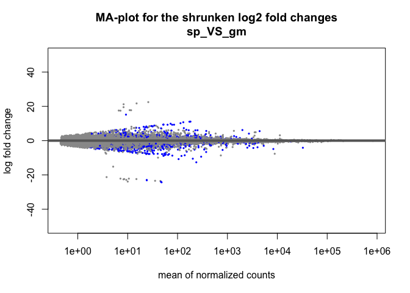<!-- -->

``` r
# Volcano plot
pCutoff = 0.05
FCcutoff = 1.0
EnhancedVolcano(data.frame(sp_VS_gm), lab = rownames(data.frame(sp_VS_gm)), x = 'log2FoldChange', y = 'padj',
                xlab = bquote(~Log[2]~ 'fold change'), ylab = bquote(~-Log[10]~adjusted~italic(P)),
                pCutoff = pCutoff, FCcutoff = FCcutoff, pointSize = 1.0, labSize = 2.0,
                title = "Volcano plot", subtitle = "Contrast between sp and gm",
                caption = paste0('log2 FC cutoff: ', FCcutoff, '; p-value cutoff: ', pCutoff, '\nTotal = ', nrow(sp_VS_gm), ' variables'),
                legendLabels=c('NS','Log2 FC','Adjusted p-value', 'Adjusted p-value & Log2 FC'),
                legendPosition = 'bottom', legendLabSize = 14, legendIconSize = 5.0)
```

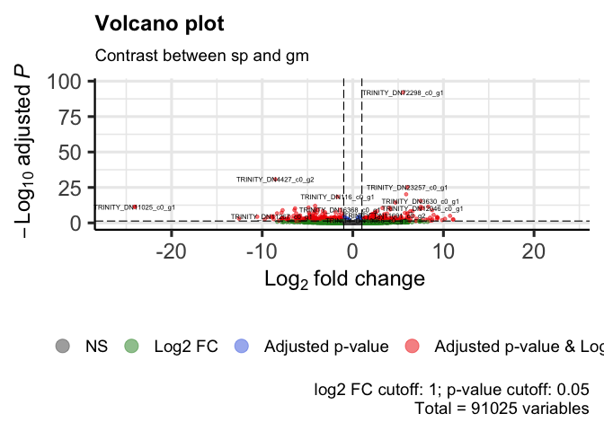<!-- -->

``` r
# Results ext VS amb

#MA-plot
DESeq2::plotMA(amb_VS_ext,ylim=c(-50,50),main="MA-plot for the shrunken log2 fold changes\namb_VS_ext")
```

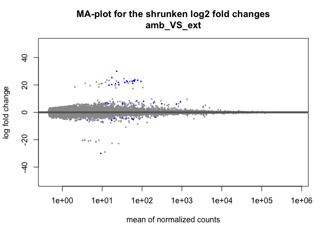<!-- -->

``` r
# Volcano plot
EnhancedVolcano(data.frame(amb_VS_ext), lab = rownames(data.frame(amb_VS_ext)), x = 'log2FoldChange', y = 'padj',
                xlab = bquote(~Log[2]~ 'fold change'), ylab = bquote(~-Log[10]~adjusted~italic(P)),
                pCutoff = pCutoff, FCcutoff = FCcutoff, pointSize = 1.0, labSize = 2.0,
                title = "Volcano plot", subtitle = "Contrast between ext and amb",
                caption = paste0('log2 FC cutoff: ', FCcutoff, '; p-value cutoff: ', pCutoff, '\nTotal = ', nrow(amb_VS_ext), ' variables'),
                legendLabels=c('NS','Log2 FC','Adjusted p-value', 'Adjusted p-value & Log2 FC'),
                legendPosition = 'bottom', legendLabSize = 14, legendIconSize = 5.0)
```

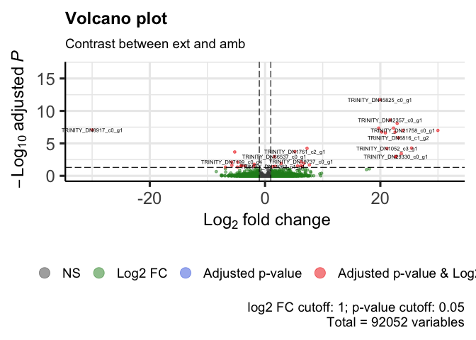<!-- -->

``` r
# Results low VS amb

#MA-plot
DESeq2::plotMA(amb_VS_low,ylim=c(-50,50),main="MA-plot for the shrunken log2 fold changes\namb_VS_low")
```

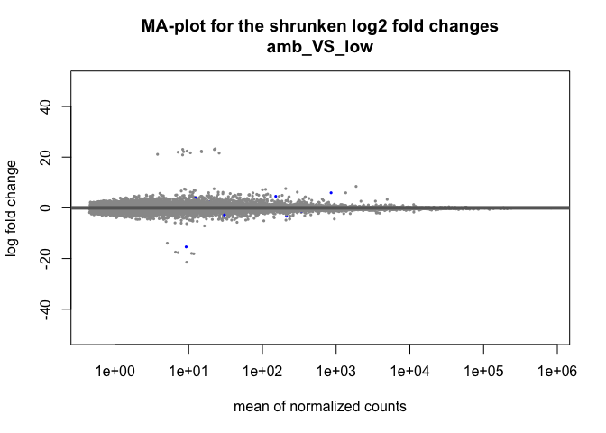<!-- -->

``` r
# Volcano plot
EnhancedVolcano(data.frame(amb_VS_low), lab = rownames(data.frame(amb_VS_low)), x = 'log2FoldChange', y = 'padj',
                xlab = bquote(~Log[2]~ 'fold change'), ylab = bquote(~-Log[10]~adjusted~italic(P)),
                pCutoff = pCutoff, FCcutoff = FCcutoff, pointSize = 1.0, labSize = 2.0,
                title = "Volcano plot", subtitle = "Contrast between low and amb",
                caption = paste0('log2 FC cutoff: ', FCcutoff, '; p-value cutoff: ', pCutoff, '\nTotal = ', nrow(amb_VS_low), ' variables'),
                legendLabels=c('NS','Log2 FC','Adjusted p-value', 'Adjusted p-value & Log2 FC'),
                legendPosition = 'bottom', legendLabSize = 14, legendIconSize = 5.0)
```

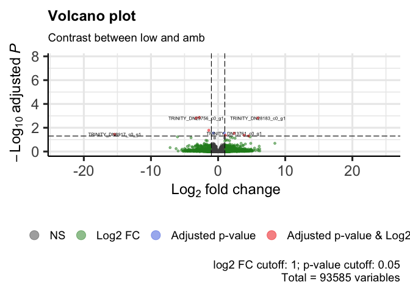<!-- -->

``` r
# Results low VS ext

#MA-plot
DESeq2::plotMA(low_VS_ext,ylim=c(-50,50),main="MA-plot for the shrunken log2 fold changes\nlow_VS_ext")
```

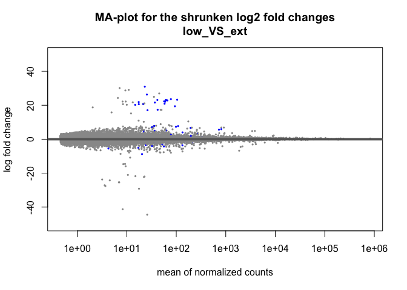<!-- -->

``` r
# Volcano plot
EnhancedVolcano(data.frame(low_VS_ext), lab = rownames(data.frame(low_VS_ext)), x = 'log2FoldChange', y = 'padj',
                xlab = bquote(~Log[2]~ 'fold change'), ylab = bquote(~-Log[10]~adjusted~italic(P)),
                pCutoff = pCutoff, FCcutoff = FCcutoff, pointSize = 1.0, labSize = 2.0,
                title = "Volcano plot", subtitle = "Contrast between low and ext",
                caption = paste0('log2 FC cutoff: ', FCcutoff, '; p-value cutoff: ', pCutoff, '\nTotal = ', nrow(low_VS_ext), ' variables'),
                legendLabels=c('NS','Log2 FC','Adjusted p-value', 'Adjusted p-value & Log2 FC'),
                legendPosition = 'bottom', legendLabSize = 14, legendIconSize = 5.0)
```

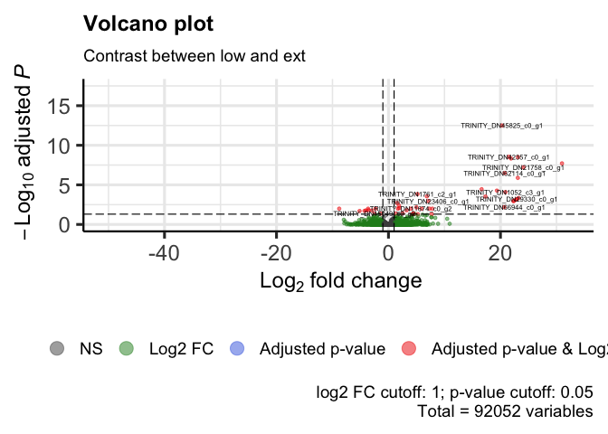<!-- -->

``` r
# Results natural simulation

#MA-plot
DESeq2::plotMA(sp_amb_VS_gm_low_natSim,ylim=c(-50,50),main="MA-plot for the shrunken log2 fold changes\nsp_amb_VS_gm_low")
```

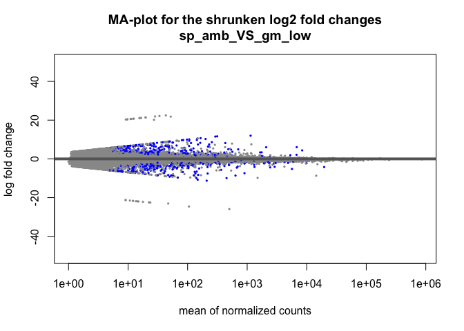<!-- -->

``` r
# Volcano plot
EnhancedVolcano(data.frame(sp_amb_VS_gm_low_natSim), lab = rownames(data.frame(sp_amb_VS_gm_low_natSim)), x = 'log2FoldChange', y = 'padj',
                xlab = bquote(~Log[2]~ 'fold change'), ylab = bquote(~-Log[10]~adjusted~italic(P)),
                pCutoff = pCutoff, FCcutoff = FCcutoff, pointSize = 1.0, labSize = 2.0,
                title = "Volcano plot", subtitle = "Contrast between sp_amb and gm_low",
                caption = paste0('log2 FC cutoff: ', FCcutoff, '; p-value cutoff: ', pCutoff, '\nTotal = ', nrow(sp_amb_VS_gm_low_natSim), ' variables'),
                legendLabels=c('NS','Log2 FC','Adjusted p-value', 'Adjusted p-value & Log2 FC'),
                legendPosition = 'bottom', legendLabSize = 14, legendIconSize = 5.0)
```

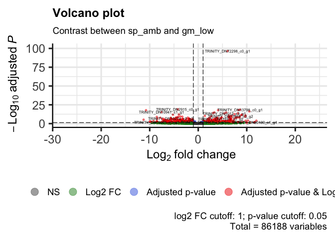<!-- -->

``` r
# Principal Component Analysis
vsd = vst(dds3,blind=T)

pcaData = plotPCA(vsd, intgroup="site_pH", 
                  returnData=TRUE)
percentVar = round(100 * attr(pcaData, "percentVar"))

pcaData$site_pH = factor(pcaData$site_pH, levels=c("GM_extreme_low","GM_low","GM_ambient","SP_low","SP_ambient"))

ggplot(pcaData, aes(PC1, PC2, fill = site_pH)) + 
  geom_point(color="black",pch=21, size=5) + theme_bw() +
  scale_fill_manual(values = c("#D55E00","#E69F00","#FFFF00","#0072B2","#56B4E9")) +
  #ggtitle("Principal Component Analysis of adult corals", subtitle = "may2018 dataset") +
  theme(text = element_text(size=14), legend.position = 'bottom') +
  theme(legend.title=element_blank()) +
  xlab(paste0("PC1: ",percentVar[1],"% variance")) +
  ylab(paste0("PC2: ",percentVar[2],"% variance")) 
```

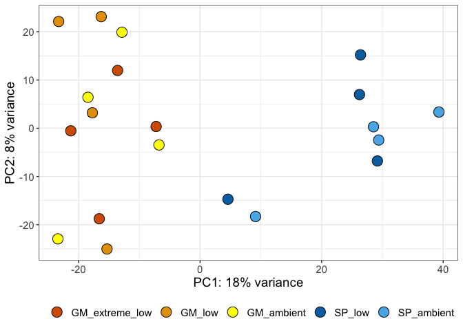<!-- -->

``` r
vsdNatSim = vst(ddsNatSim,blind=T)

pcaData = plotPCA(vsdNatSim, intgroup="site_pH", 
                  returnData=TRUE)
percentVar = round(100 * attr(pcaData, "percentVar"))

ggplot(pcaData, aes(PC1, PC2, colour = site_pH)) + 
  geom_point(size = 5) + theme_bw() + 
  scale_color_manual(values = c("#ff4040","#6495ED")) +
  geom_point() +
  ggtitle("Principal Component Analysis of juvenile corals", subtitle = "Juvenile dataset - Natural conditions simulation") +
  theme(text = element_text(size=14),legend.text = element_text(size=12), legend.position = 'bottom') +
  xlab(paste0("PC1: ",percentVar[1],"% variance")) +
  ylab(paste0("PC2: ",percentVar[2],"% variance")) 
```

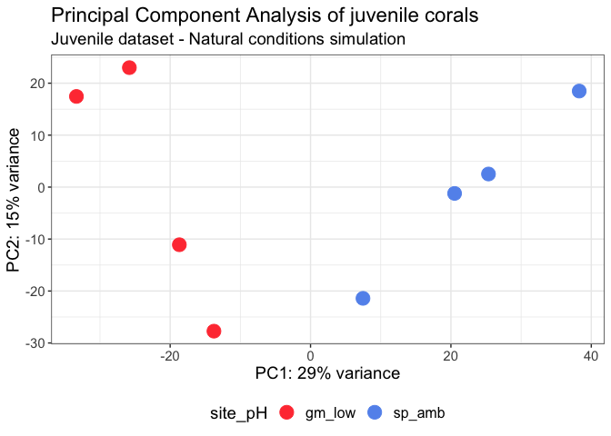<!-- -->

``` r
# Venn diagramm 
resOrdered_sp_VS_gm <- sp_VS_gm_global[order(sp_VS_gm_global$padj),]
resOrderedDF_sp_VS_gm <- as.data.frame(resOrdered_sp_VS_gm)
resOrderedDF_sp_VS_gm_venn <- filter(resOrderedDF_sp_VS_gm,padj < 0.05)
resOrderedDF_sp_VS_gm_venn <- list(rownames(resOrderedDF_sp_VS_gm_venn))
resOrderedDF_sp_VS_gm_venn <- unlist(resOrderedDF_sp_VS_gm_venn)

resOrdered_amb_VS_ext <- amb_VS_ext[order(amb_VS_ext$padj),]
resOrderedDF_amb_VS_ext <- as.data.frame(resOrdered_amb_VS_ext)
resOrderedDF_amb_VS_ext_venn <- filter(resOrderedDF_amb_VS_ext,padj < 0.05)
resOrderedDF_amb_VS_ext_venn <- list(rownames(resOrderedDF_amb_VS_ext_venn))
resOrderedDF_amb_VS_ext_venn <- unlist(resOrderedDF_amb_VS_ext_venn)

resOrdered_amb_VS_low <- amb_VS_low[order(amb_VS_low$padj),]
resOrderedDF_amb_VS_low <- as.data.frame(resOrdered_amb_VS_low)
resOrderedDF_amb_VS_low_venn <- filter(resOrderedDF_amb_VS_low,padj < 0.05)
resOrderedDF_amb_VS_low_venn <- list(rownames(resOrderedDF_amb_VS_low_venn))
resOrderedDF_amb_VS_low_venn <- unlist(resOrderedDF_amb_VS_low_venn)

resOrdered_low_VS_ext <- low_VS_ext[order(low_VS_ext$padj),]
resOrderedDF_low_VS_ext <- as.data.frame(resOrdered_low_VS_ext)
resOrderedDF_low_VS_ext_venn <- filter(resOrderedDF_low_VS_ext,padj < 0.05)
resOrderedDF_low_VS_ext_venn <- list(rownames(resOrderedDF_low_VS_ext_venn))
resOrderedDF_low_VS_ext_venn <- unlist(resOrderedDF_low_VS_ext_venn)

x = list('sp VS gm' = resOrderedDF_sp_VS_gm_venn, 'amb VS ext' = resOrderedDF_amb_VS_ext_venn,
         'amb VS low' = resOrderedDF_amb_VS_low_venn, 'low VS ext' = resOrderedDF_low_VS_ext_venn)

ggvenn(
  x, 
  fill_color = c("#0073C2FF", "#EFC000FF", "#868686FF","#009E73"),
  stroke_size = 0.4, set_name_size = 4
)
```

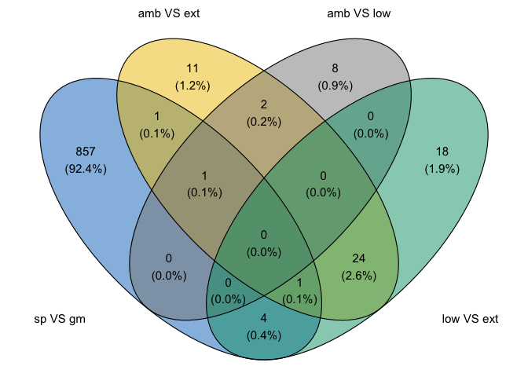<!-- -->

``` r
resOrdered_sp_VS_gm <- sp_VS_gm[order(sp_VS_gm$padj),]
resOrderedDF_sp_VS_gm <- as.data.frame(resOrdered_sp_VS_gm)
resOrderedDF_sp_VS_gm_venn <- filter(resOrderedDF_sp_VS_gm,padj < 0.05)
resOrderedDF_sp_VS_gm_venn <- list(rownames(resOrderedDF_sp_VS_gm_venn))
resOrderedDF_sp_VS_gm_venn <- unlist(resOrderedDF_sp_VS_gm_venn)

x = list('SP VS GM' = resOrderedDF_sp_VS_gm_venn,'ambient VS low' = resOrderedDF_amb_VS_low_venn)

ggvenn(
  x, 
  fill_color = c("#8E8E8E", "#E0E0E0"),
  stroke_size = 0.4, set_name_size = 4
)
```

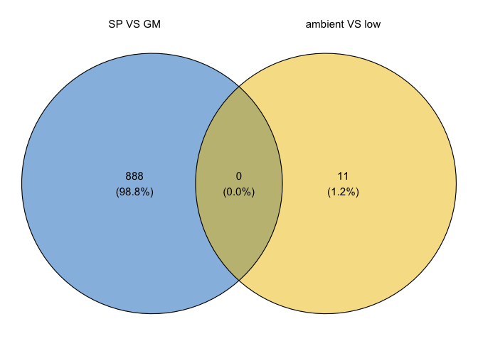<!-- -->

``` r
resOrdered_gm_amb_VS_gm_low <- gm_amb_VS_gm_low[order(gm_amb_VS_gm_low$padj),]
resOrderedDF_gm_amb_VS_gm_low <- as.data.frame(resOrdered_gm_amb_VS_gm_low)
resOrderedDF_gm_amb_VS_gm_low_venn <- filter(resOrderedDF_gm_amb_VS_gm_low,padj < 0.05)
resOrderedDF_gm_amb_VS_gm_low_venn <- list(rownames(resOrderedDF_gm_amb_VS_gm_low_venn))
resOrderedDF_gm_amb_VS_gm_low_venn <- unlist(resOrderedDF_gm_amb_VS_gm_low_venn)

resOrdered_gm_amb_VS_gm_ext <- gm_amb_VS_gm_ext[order(gm_amb_VS_gm_ext$padj),]
resOrderedDF_gm_amb_VS_gm_ext <- as.data.frame(resOrdered_gm_amb_VS_gm_ext)
resOrderedDF_gm_amb_VS_gm_ext_venn <- filter(resOrderedDF_gm_amb_VS_gm_ext,padj < 0.05)
resOrderedDF_gm_amb_VS_gm_ext_venn <- list(rownames(resOrderedDF_gm_amb_VS_gm_ext_venn))
resOrderedDF_gm_amb_VS_gm_ext_venn <- unlist(resOrderedDF_gm_amb_VS_gm_ext_venn)

resOrdered_gm_low_VS_gm_ext <- gm_low_VS_gm_ext[order(gm_low_VS_gm_ext$padj),]
resOrderedDF_gm_low_VS_gm_ext <- as.data.frame(resOrdered_gm_low_VS_gm_ext)
resOrderedDF_gm_low_VS_gm_ext_venn <- filter(resOrderedDF_gm_low_VS_gm_ext,padj < 0.05)
resOrderedDF_gm_low_VS_gm_ext_venn <- list(rownames(resOrderedDF_gm_low_VS_gm_ext_venn))
resOrderedDF_gm_low_VS_gm_ext_venn <- unlist(resOrderedDF_gm_low_VS_gm_ext_venn)

resOrdered_sp_amb_VS_sp_low <- sp_amb_VS_sp_low[order(sp_amb_VS_sp_low$padj),]
resOrderedDF_sp_amb_VS_sp_low <- as.data.frame(resOrdered_sp_amb_VS_sp_low)
resOrderedDF_sp_amb_VS_sp_low_venn <- filter(resOrderedDF_sp_amb_VS_sp_low,padj < 0.05)
resOrderedDF_sp_amb_VS_sp_low_venn <- list(rownames(resOrderedDF_sp_amb_VS_sp_low_venn))
resOrderedDF_sp_amb_VS_sp_low_venn <- unlist(resOrderedDF_sp_amb_VS_sp_low_venn)

resOrdered_gm_low_VS_sp_low <- gm_low_VS_sp_low[order(gm_low_VS_sp_low$padj),]
resOrderedDF_gm_low_VS_sp_low <- as.data.frame(resOrdered_gm_low_VS_sp_low)
resOrderedDF_gm_low_VS_sp_low_venn <- filter(resOrderedDF_gm_low_VS_sp_low,padj < 0.05)
resOrderedDF_gm_low_VS_sp_low_venn <- list(rownames(resOrderedDF_gm_low_VS_sp_low_venn))
resOrderedDF_gm_low_VS_sp_low_venn <- unlist(resOrderedDF_gm_low_VS_sp_low_venn)

resOrdered_gm_amb_VS_sp_amb <- gm_amb_VS_sp_amb[order(gm_amb_VS_sp_amb$padj),]
resOrderedDF_gm_amb_VS_sp_amb <- as.data.frame(resOrdered_gm_amb_VS_sp_amb)
resOrderedDF_gm_amb_VS_sp_amb_venn <- filter(resOrderedDF_gm_amb_VS_sp_amb,padj < 0.05)
resOrderedDF_gm_amb_VS_sp_amb_venn <- list(rownames(resOrderedDF_gm_amb_VS_sp_amb_venn))
resOrderedDF_gm_amb_VS_sp_amb_venn <- unlist(resOrderedDF_gm_amb_VS_sp_amb_venn)

x = list('GM ambient VS GM low' = resOrderedDF_gm_amb_VS_gm_low_venn,'SP ambient VS SP low' = resOrderedDF_sp_amb_VS_sp_low_venn)

ggvenn(
  x, 
  fill_color = c("#EE4000", "#5CACEE"),
  stroke_size = 0.4, set_name_size = 4
)
```

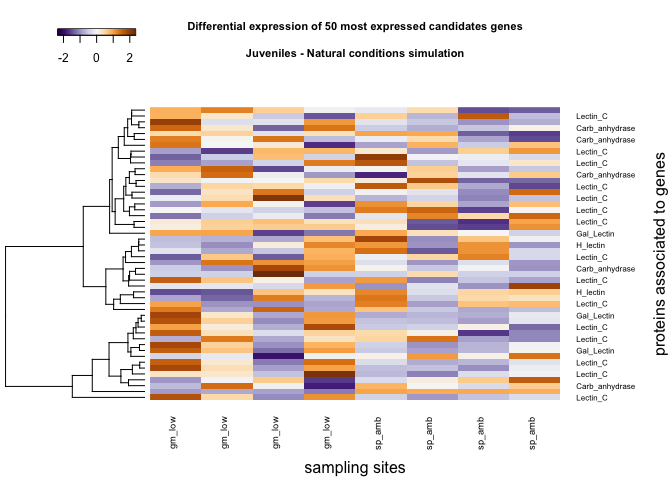<!-- -->

``` r
x = list('GM ambient VS SP ambient' = resOrderedDF_gm_amb_VS_sp_amb_venn,'GM low VS SP low' = resOrderedDF_gm_low_VS_sp_low_venn)

ggvenn(
  x, 
  fill_color = c("#0073C2FF", "#EFC000FF"),
  stroke_size = 0.4, set_name_size = 4
)
```

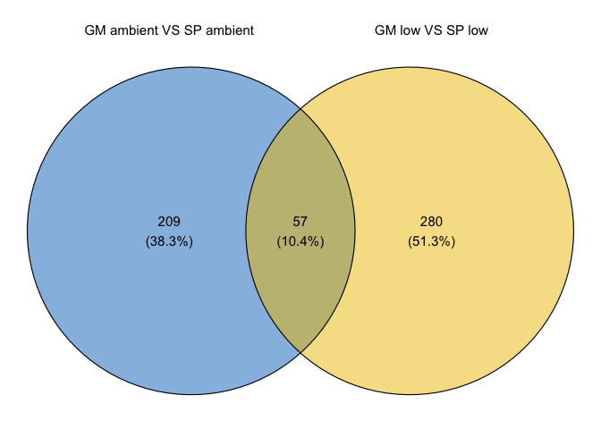<!-- -->

``` r
x = list('GM ambient VS GM extreme low' = resOrderedDF_gm_amb_VS_gm_ext_venn,'GM low VS GM extreme low' = resOrderedDF_gm_low_VS_gm_ext_venn)

ggvenn(
  x, 
  fill_color = c("#0073C2FF", "#EFC000FF"),
  stroke_size = 0.4, set_name_size = 4
)
```

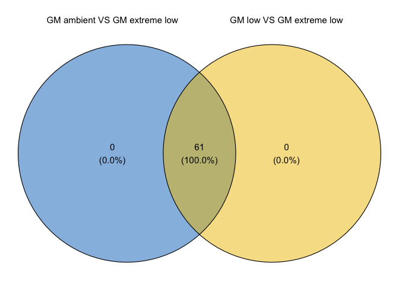<!-- -->

``` r
# Candidate genes heatmap

# Global
listGenes <- candidateGenes$genes
listGenes2 <- which(rownames(vsd) %in% listGenes)
index <- which(listGenes %in% rownames(vsd))
candidateGenes2 <- candidateGenes[index, ] 
listProt <- candidateGenes2$pfam_annotation
listGenes3 <- candidateGenes2$genes

vsdCandidate <- vsd[listGenes3, ]

labColName <- c('gm_amb','gm_amb','gm_amb','gm_amb','gm_low','gm_low','gm_low','gm_low','gm_ext','gm_ext','gm_ext',
                'gm_ext','sp_amb','sp_amb','sp_amb','sp_amb','sp_low','sp_low','sp_low','sp_low')

colnames(vsdCandidate) <- labColName
rownames(vsdCandidate) <- listProt

topVarGenesVsd <- head(order(rowVars(assay(vsdCandidate)), decreasing=TRUE), 50 )
heatmap.2(assay(vsdCandidate)[topVarGenesVsd,], trace="none",scale="row",keysize=1.15,key.xlab = "",key.title = "",
          col=colorRampPalette(rev(brewer.pal(11,"PuOr")))(255), cexRow=0.6, cexCol=0.7,density.info="none",
          xlab="sampling sites",ylab="proteins associated to genes",Colv=NA,margins = c(5, 7))
```

    ## Warning in heatmap.2(assay(vsdCandidate)[topVarGenesVsd, ], trace = "none", :
    ## Discrepancy: Colv is FALSE, while dendrogram is `both'. Omitting column
    ## dendogram.

``` r
main='Differential expression of 50 most expressed candidates genes\n\nJuveniles'
title(main, cex.main = 0.7)
```

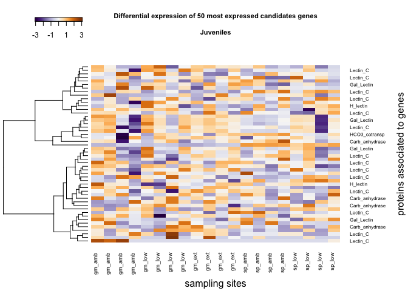<!-- -->

``` r
# Natural conditions simulation
listGenes <- candidateGenes$genes
listGenes2 <- which(rownames(vsdNatSim) %in% listGenes)
index <- which(listGenes %in% rownames(vsdNatSim))
candidateGenes2 <- candidateGenes[index, ] 
listProt <- candidateGenes2$pfam_annotation
listGenes3 <- candidateGenes2$genes

vsdCandidate <- vsdNatSim[listGenes3, ]

labColName <- c('gm_low','gm_low','gm_low','gm_low','sp_amb','sp_amb','sp_amb','sp_amb')

colnames(vsdCandidate) <- labColName
rownames(vsdCandidate) <- listProt

topVarGenesVsd <- head(order(rowVars(assay(vsdCandidate)), decreasing=TRUE), 50 )
heatmap.2(assay(vsdCandidate)[topVarGenesVsd,], trace="none",scale="row",keysize=1.15,key.xlab = "",key.title = "",
          col=colorRampPalette(rev(brewer.pal(11,"PuOr")))(255), cexRow=0.6, cexCol=0.7,density.info="none",
          xlab="sampling sites",ylab="proteins associated to genes",Colv=NA,margins = c(5, 7))
```

    ## Warning in heatmap.2(assay(vsdCandidate)[topVarGenesVsd, ], trace = "none", :
    ## Discrepancy: Colv is FALSE, while dendrogram is `both'. Omitting column
    ## dendogram.

``` r
main='Differential expression of 50 most expressed candidates genes\n\nJuveniles - Natural conditions simulation'
title(main, cex.main = 0.7)
```

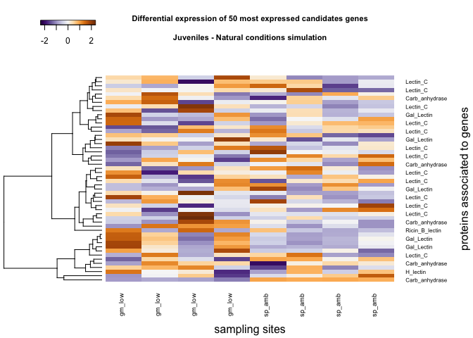<!-- -->

``` r
# Inferences statistics

vsd = vst(dds,blind=T)

count_tab_assay <- assay(vsd)
dist_tab_assay <- dist(t(count_tab_assay),method="euclidian")
adonis(data=samples,dist_tab_assay ~ site + pH, method="euclidian")
```

    ## 'adonis' will be deprecated: use 'adonis2' instead

    ## $aov.tab
    ## Permutation: free
    ## Number of permutations: 999
    ## 
    ## Terms added sequentially (first to last)
    ## 
    ##           Df SumsOfSqs MeanSqs F.Model      R2 Pr(>F)    
    ## site       1     44036   44036 2.03845 0.10218  0.001 ***
    ## pH         2     41307   20653 0.95604 0.09584  0.660    
    ## Residuals 16    345647   21603         0.80198           
    ## Total     19    430990                 1.00000           
    ## ---
    ## Signif. codes:  0 '***' 0.001 '**' 0.01 '*' 0.05 '.' 0.1 ' ' 1
    ## 
    ## $call
    ## adonis(formula = dist_tab_assay ~ site + pH, data = samples, 
    ##     method = "euclidian")
    ## 
    ## $coefficients
    ## NULL
    ## 
    ## $coef.sites
    ##                   [,1]      [,2]      [,3]      [,4]       [,5]       [,6]
    ## (Intercept) 198.926574 206.65351 217.17743 215.89223 208.497039 226.552910
    ## site1       -14.875529 -16.19649 -14.29933 -13.88738 -16.503874 -18.791841
    ## pH1         -17.847062 -18.44533 -23.75706 -23.70299  10.722198   9.084261
    ## pH2           9.660025  12.22078  15.95454  13.48571   8.907993  15.085698
    ##                   [,7]       [,8]      [,9]     [,10]      [,11]       [,12]
    ## (Intercept) 209.041641 200.659696 190.45973 190.90378 192.302731 191.6141029
    ## site1       -13.953126 -14.249823  -3.75992  -2.79110  -3.555046  -0.8715483
    ## pH1           3.918304   4.908729  19.74227  19.32897  15.286502  19.7871656
    ## pH2          13.925765   8.758262 -36.95400 -39.08578 -35.416450 -38.5806951
    ##                 [,13]      [,14]      [,15]      [,16]      [,17]     [,18]
    ## (Intercept) 199.40723 191.710004 190.125549 194.501774 193.924116 191.42982
    ## site1        23.59396  18.025028  23.340389  25.043283  16.894388  22.69844
    ## pH1         -12.96658 -11.998993 -11.739353 -11.018634  14.205110  12.24341
    ## pH2          -2.99271  -4.314813  -6.098658  -4.202575  -5.802678  -6.20212
    ##                  [,19]      [,20]
    ## (Intercept) 205.838803 198.552622
    ## site1        20.951255  22.920305
    ## pH1          11.047348  11.531995
    ## pH2          -2.831826  -3.958747
    ## 
    ## $f.perms
    ##              [,1]      [,2]
    ##    [1,] 0.9490322 0.9784675
    ##    [2,] 0.9560669 0.9367761
    ##    [3,] 1.1348822 0.9693645
    ##    [4,] 1.0443915 0.9340917
    ##    [5,] 1.0714351 0.9251005
    ##    [6,] 0.8975647 1.0989479
    ##    [7,] 0.9905282 0.8758177
    ##    [8,] 1.1248224 1.3330809
    ##    [9,] 1.0593938 0.9750511
    ##   [10,] 0.8876939 0.9244338
    ##   [11,] 0.9653416 0.9156310
    ##   [12,] 1.0617798 0.9372935
    ##   [13,] 0.9132881 0.9859381
    ##   [14,] 0.9120735 1.0084208
    ##   [15,] 1.0096896 0.9917483
    ##   [16,] 1.0195059 1.0106304
    ##   [17,] 1.1980549 1.2449335
    ##   [18,] 0.9356521 1.0894474
    ##   [19,] 1.0906860 0.9150167
    ##   [20,] 0.9385431 0.9227770
    ##   [21,] 0.9255762 0.9953865
    ##   [22,] 1.0157911 0.9258947
    ##   [23,] 1.1651880 1.0911542
    ##   [24,] 1.0091381 0.9843760
    ##   [25,] 1.0962393 1.1379861
    ##   [26,] 0.8222424 0.8944748
    ##   [27,] 1.0455389 0.9633587
    ##   [28,] 1.0887593 0.9665902
    ##   [29,] 0.9648510 1.0223624
    ##   [30,] 0.9071012 1.0332158
    ##   [31,] 0.8723593 0.9978169
    ##   [32,] 0.8590380 0.8723040
    ##   [33,] 1.0168799 0.9206358
    ##   [34,] 0.8913646 0.8874865
    ##   [35,] 0.9454991 0.9632875
    ##   [36,] 0.9321126 1.0481586
    ##   [37,] 0.8451929 0.9452859
    ##   [38,] 0.9929088 0.8610015
    ##   [39,] 1.0273610 0.9944225
    ##   [40,] 0.9723011 0.9520364
    ##   [41,] 0.9394527 0.9243902
    ##   [42,] 1.0100782 1.0117731
    ##   [43,] 1.0386623 0.8989779
    ##   [44,] 0.8736834 1.0056208
    ##   [45,] 0.9049214 0.8900893
    ##   [46,] 0.9287717 0.9949203
    ##   [47,] 1.0100490 0.9345495
    ##   [48,] 0.9741183 0.9745425
    ##   [49,] 0.9356332 0.9177546
    ##   [50,] 0.9980250 0.9893940
    ##   [51,] 1.2063279 1.0802144
    ##   [52,] 1.0506685 1.0081780
    ##   [53,] 1.0309454 1.1278226
    ##   [54,] 0.9532749 1.0465610
    ##   [55,] 0.9974579 1.0129481
    ##   [56,] 1.0499533 1.0194675
    ##   [57,] 1.0016734 1.0293072
    ##   [58,] 0.9567165 1.0288644
    ##   [59,] 0.8752711 0.9628695
    ##   [60,] 0.8790444 0.9673169
    ##   [61,] 1.0608220 0.8734989
    ##   [62,] 1.1338188 0.9699511
    ##   [63,] 0.9269215 1.0974066
    ##   [64,] 0.9867806 0.9443904
    ##   [65,] 0.9408830 0.9794278
    ##   [66,] 1.0355329 0.9884707
    ##   [67,] 0.9287278 1.0940285
    ##   [68,] 0.9196285 0.8946075
    ##   [69,] 0.9114480 0.9988425
    ##   [70,] 0.9878196 1.0517636
    ##   [71,] 0.8906226 0.9887295
    ##   [72,] 0.8918645 0.9645008
    ##   [73,] 0.9698134 0.9524844
    ##   [74,] 1.0170147 1.0914619
    ##   [75,] 0.8314387 0.9641170
    ##   [76,] 0.9409965 1.0510061
    ##   [77,] 1.1099258 0.9374957
    ##   [78,] 1.0738108 1.0204172
    ##   [79,] 1.0614848 1.0908816
    ##   [80,] 0.8490080 1.0406256
    ##   [81,] 0.8541621 1.0618138
    ##   [82,] 0.9272585 1.1180970
    ##   [83,] 1.2054639 0.9829411
    ##   [84,] 0.8923769 0.9782779
    ##   [85,] 1.0393404 1.1885951
    ##   [86,] 1.0423356 0.9489355
    ##   [87,] 0.9162194 0.9045072
    ##   [88,] 1.0367989 1.0857396
    ##   [89,] 0.8778671 1.0767170
    ##   [90,] 0.9589496 1.0945685
    ##   [91,] 1.1143758 0.9606270
    ##   [92,] 1.5534378 1.0759608
    ##   [93,] 1.0012717 0.9450287
    ##   [94,] 0.8378369 0.9520972
    ##   [95,] 0.9930034 1.0041608
    ##   [96,] 0.9353694 0.8944901
    ##   [97,] 1.0367310 0.9237770
    ##   [98,] 0.9699172 1.0664892
    ##   [99,] 1.0275385 0.9308704
    ##  [100,] 0.8496924 0.9986760
    ##  [101,] 0.9599810 0.9330431
    ##  [102,] 0.9350880 1.0206630
    ##  [103,] 0.8794590 0.9813833
    ##  [104,] 0.9528023 0.9430919
    ##  [105,] 0.8533583 1.0035067
    ##  [106,] 0.9031253 0.9777739
    ##  [107,] 0.9843738 1.1757147
    ##  [108,] 0.9403759 0.9025407
    ##  [109,] 1.0264336 0.9374563
    ##  [110,] 0.8840430 0.8857276
    ##  [111,] 0.9827503 0.9141849
    ##  [112,] 0.9732893 1.0424996
    ##  [113,] 0.7493827 1.0405718
    ##  [114,] 1.1761043 0.8724722
    ##  [115,] 1.0664185 0.9580810
    ##  [116,] 0.8531480 0.8796513
    ##  [117,] 0.8720686 1.1245749
    ##  [118,] 0.9111739 1.0366819
    ##  [119,] 1.1918948 1.0257846
    ##  [120,] 1.1003708 0.9277251
    ##  [121,] 0.9080916 0.9900008
    ##  [122,] 1.2285474 1.0118922
    ##  [123,] 0.9991577 1.0404950
    ##  [124,] 0.9437109 0.9797758
    ##  [125,] 1.1123290 0.8703598
    ##  [126,] 0.9835992 0.9310550
    ##  [127,] 1.3240348 0.9082147
    ##  [128,] 1.0506806 0.9888384
    ##  [129,] 1.1253952 0.9163723
    ##  [130,] 1.0418182 0.9757281
    ##  [131,] 0.9087188 0.9649191
    ##  [132,] 0.9544327 1.1542974
    ##  [133,] 1.0436420 1.1519756
    ##  [134,] 0.9201836 1.0493873
    ##  [135,] 0.9392132 0.9068724
    ##  [136,] 1.1270899 1.0629939
    ##  [137,] 0.8322408 0.9534701
    ##  [138,] 1.0904644 0.8695861
    ##  [139,] 0.9399888 0.9393549
    ##  [140,] 1.2547776 1.0236503
    ##  [141,] 0.9812532 0.9591478
    ##  [142,] 1.1505854 1.0369977
    ##  [143,] 0.8819680 1.0239621
    ##  [144,] 1.1912419 0.8866047
    ##  [145,] 0.9371164 0.9851089
    ##  [146,] 1.1069449 1.1088654
    ##  [147,] 1.1291885 1.0144270
    ##  [148,] 0.9282020 0.8964088
    ##  [149,] 0.9310723 0.9523126
    ##  [150,] 1.0293125 1.1603399
    ##  [151,] 1.0728721 1.0701580
    ##  [152,] 0.9048167 0.9162062
    ##  [153,] 0.8800200 1.0815535
    ##  [154,] 0.9306519 1.1233552
    ##  [155,] 0.9558717 0.9972636
    ##  [156,] 0.9034963 0.9031775
    ##  [157,] 0.9816633 0.9622784
    ##  [158,] 1.5257959 1.0716212
    ##  [159,] 1.0610518 0.8518690
    ##  [160,] 0.9907716 0.9964894
    ##  [161,] 0.9899532 0.9597841
    ##  [162,] 0.8632885 1.0027597
    ##  [163,] 0.9869425 1.1191350
    ##  [164,] 1.0015826 1.0670975
    ##  [165,] 1.0212099 0.9781930
    ##  [166,] 1.0265493 0.8544421
    ##  [167,] 0.9967153 0.9042906
    ##  [168,] 0.9012153 0.9771680
    ##  [169,] 0.9915346 0.9827653
    ##  [170,] 1.1055709 1.0452768
    ##  [171,] 1.0670232 0.9920893
    ##  [172,] 1.0057489 0.9940691
    ##  [173,] 0.9681780 0.8878014
    ##  [174,] 1.0437603 1.0728570
    ##  [175,] 0.9177842 1.0139235
    ##  [176,] 0.9905392 1.0612504
    ##  [177,] 1.1891647 1.3082494
    ##  [178,] 1.0661334 1.0932596
    ##  [179,] 0.9162452 1.0349237
    ##  [180,] 1.0604951 1.0132101
    ##  [181,] 1.0521841 1.0012708
    ##  [182,] 1.2356897 1.0335227
    ##  [183,] 1.2236480 1.0518030
    ##  [184,] 1.0404183 0.9716345
    ##  [185,] 1.0165458 0.9497671
    ##  [186,] 0.9568118 1.0378631
    ##  [187,] 0.9513093 0.9668605
    ##  [188,] 0.8723556 0.9404359
    ##  [189,] 1.0449501 1.0497552
    ##  [190,] 1.1733860 0.9831332
    ##  [191,] 1.0795512 1.0005941
    ##  [192,] 0.9058353 0.9683869
    ##  [193,] 0.9095990 1.0391312
    ##  [194,] 1.0982879 1.0175112
    ##  [195,] 0.8878667 0.9632391
    ##  [196,] 0.8654816 1.0052866
    ##  [197,] 0.9233202 1.0021181
    ##  [198,] 1.0017360 0.9686777
    ##  [199,] 0.9305304 1.2284989
    ##  [200,] 0.8862967 0.9021315
    ##  [201,] 1.0487912 0.9994931
    ##  [202,] 0.9266188 0.9463599
    ##  [203,] 1.0747925 1.1266738
    ##  [204,] 0.9680874 1.0843432
    ##  [205,] 0.9037063 0.9485241
    ##  [206,] 1.2953316 1.0560228
    ##  [207,] 0.9374194 0.8808330
    ##  [208,] 1.0333168 1.2861750
    ##  [209,] 0.8591300 0.9567887
    ##  [210,] 0.8951988 0.9039127
    ##  [211,] 0.8404146 0.9750431
    ##  [212,] 1.3544312 0.9960531
    ##  [213,] 1.2678787 1.1989393
    ##  [214,] 0.9923358 1.0077543
    ##  [215,] 0.8413686 1.0466647
    ##  [216,] 0.8519025 1.0628114
    ##  [217,] 0.9438036 1.0088670
    ##  [218,] 1.1084236 0.9528583
    ##  [219,] 0.9236032 0.9825436
    ##  [220,] 0.8995153 0.9156174
    ##  [221,] 1.0109088 0.9404502
    ##  [222,] 1.0096072 0.9618298
    ##  [223,] 0.9258709 1.0021001
    ##  [224,] 1.0267807 1.0415408
    ##  [225,] 0.9944905 1.0853543
    ##  [226,] 0.9378602 0.9916947
    ##  [227,] 1.0434038 1.0707412
    ##  [228,] 0.9399099 1.1354064
    ##  [229,] 0.9190217 0.9375323
    ##  [230,] 1.1085252 0.9594054
    ##  [231,] 0.8770582 1.1884321
    ##  [232,] 0.9390667 1.1597255
    ##  [233,] 0.8980872 1.0563277
    ##  [234,] 1.1926197 0.9188048
    ##  [235,] 1.1120237 0.9685423
    ##  [236,] 0.8684423 0.9326259
    ##  [237,] 1.0636170 1.2106326
    ##  [238,] 0.9337630 1.0244494
    ##  [239,] 0.9657681 0.9166572
    ##  [240,] 0.9493913 1.0776373
    ##  [241,] 0.9579685 0.9492743
    ##  [242,] 0.9771230 0.9098915
    ##  [243,] 0.9633360 1.0571404
    ##  [244,] 0.9106454 1.0820971
    ##  [245,] 0.8949768 0.9222135
    ##  [246,] 0.9860835 1.0881536
    ##  [247,] 0.9506702 1.0298265
    ##  [248,] 1.0302047 1.0728694
    ##  [249,] 0.9640688 0.9982762
    ##  [250,] 0.9858360 0.9537086
    ##  [251,] 1.0241530 0.9571661
    ##  [252,] 0.9988122 0.8921383
    ##  [253,] 0.9439017 0.8897849
    ##  [254,] 0.9050149 1.0043843
    ##  [255,] 0.9212160 0.8511238
    ##  [256,] 1.3453532 1.0634377
    ##  [257,] 1.0172918 0.9238006
    ##  [258,] 0.8928064 1.1345623
    ##  [259,] 1.4435862 1.0797547
    ##  [260,] 0.8913033 1.0147136
    ##  [261,] 1.2145183 1.1113012
    ##  [262,] 0.9234443 0.9619141
    ##  [263,] 1.0303655 1.0399309
    ##  [264,] 0.9489729 1.0858878
    ##  [265,] 0.8529900 0.8929739
    ##  [266,] 1.2001632 0.9037541
    ##  [267,] 1.0259205 0.9914486
    ##  [268,] 1.0952151 0.9771106
    ##  [269,] 1.0075960 0.8558000
    ##  [270,] 0.9264650 1.1249707
    ##  [271,] 1.0214103 0.8843787
    ##  [272,] 0.9476557 0.9578940
    ##  [273,] 0.9688840 0.9341373
    ##  [274,] 1.1525805 1.0034026
    ##  [275,] 1.1740938 0.9432533
    ##  [276,] 0.9213514 0.9342398
    ##  [277,] 0.9159778 0.9871393
    ##  [278,] 0.8800266 0.9141077
    ##  [279,] 1.1271662 1.1054020
    ##  [280,] 0.9357108 1.2179700
    ##  [281,] 1.1754512 0.9578320
    ##  [282,] 1.1253617 0.9761871
    ##  [283,] 1.0018494 0.9124106
    ##  [284,] 0.8804504 0.8715606
    ##  [285,] 0.9792988 0.9353368
    ##  [286,] 1.3971995 0.9731380
    ##  [287,] 1.0778568 0.9779738
    ##  [288,] 1.0489770 1.0220861
    ##  [289,] 0.9611468 0.9649045
    ##  [290,] 0.9977761 0.9474301
    ##  [291,] 0.8594319 0.9548207
    ##  [292,] 0.8384994 1.0162744
    ##  [293,] 0.9130100 0.9918131
    ##  [294,] 0.8816149 0.9604967
    ##  [295,] 1.0098648 0.9547720
    ##  [296,] 1.0468196 0.9455855
    ##  [297,] 1.0108896 1.0541463
    ##  [298,] 0.9767865 1.0151723
    ##  [299,] 1.1490665 0.9970063
    ##  [300,] 0.9329108 1.2010748
    ##  [301,] 0.9453120 0.9080266
    ##  [302,] 1.0053733 0.8954715
    ##  [303,] 0.9191581 0.8797760
    ##  [304,] 0.8498884 0.9162823
    ##  [305,] 1.0899326 1.0124984
    ##  [306,] 0.8967274 0.9157555
    ##  [307,] 0.9655791 0.9103067
    ##  [308,] 0.9254721 0.8983668
    ##  [309,] 0.9289968 1.0171164
    ##  [310,] 0.8803797 0.9713662
    ##  [311,] 1.0573140 0.9266290
    ##  [312,] 0.8717567 1.0541928
    ##  [313,] 1.1070155 1.0559879
    ##  [314,] 1.0570648 1.0242292
    ##  [315,] 0.9036219 0.9311683
    ##  [316,] 1.0297448 1.0218080
    ##  [317,] 1.0434204 0.9658941
    ##  [318,] 0.9588849 0.9842519
    ##  [319,] 0.9181261 0.9516569
    ##  [320,] 0.9090466 0.9604152
    ##  [321,] 0.9766353 1.1060725
    ##  [322,] 0.9562165 1.0578173
    ##  [323,] 1.1553048 0.9151935
    ##  [324,] 0.9073352 0.9091921
    ##  [325,] 1.0023628 0.9642215
    ##  [326,] 0.9651451 1.1946473
    ##  [327,] 1.1201458 0.9721431
    ##  [328,] 0.9250370 1.1188511
    ##  [329,] 0.9214991 0.9227378
    ##  [330,] 0.9356440 0.9135426
    ##  [331,] 0.9399073 0.8509953
    ##  [332,] 0.9533912 0.9154122
    ##  [333,] 0.9009689 1.0822209
    ##  [334,] 0.9742610 0.9987419
    ##  [335,] 1.1090919 1.0198405
    ##  [336,] 0.9648089 1.0722709
    ##  [337,] 1.0675161 1.0599310
    ##  [338,] 1.0080313 1.1863750
    ##  [339,] 1.0991292 0.9323484
    ##  [340,] 0.9504188 1.0894969
    ##  [341,] 0.9774589 0.9870781
    ##  [342,] 1.0618555 1.1131042
    ##  [343,] 0.9007781 1.0417301
    ##  [344,] 1.1256531 1.0207341
    ##  [345,] 1.1069561 0.8607431
    ##  [346,] 0.9557656 0.9449560
    ##  [347,] 0.9619557 1.0521300
    ##  [348,] 0.9096613 1.0973449
    ##  [349,] 0.8704694 0.9291235
    ##  [350,] 1.1270315 1.0377943
    ##  [351,] 1.0101013 0.9000192
    ##  [352,] 0.8922380 0.9845525
    ##  [353,] 0.9455561 0.9656926
    ##  [354,] 1.2943779 1.0810206
    ##  [355,] 0.8902600 1.1042495
    ##  [356,] 0.9002199 0.9599125
    ##  [357,] 0.9467195 0.9906906
    ##  [358,] 1.2462398 1.0110682
    ##  [359,] 1.1532473 0.9110506
    ##  [360,] 1.2078822 0.9832055
    ##  [361,] 1.0220612 1.0856954
    ##  [362,] 1.0274592 0.9456912
    ##  [363,] 0.8708046 0.9935518
    ##  [364,] 0.8696851 0.9631488
    ##  [365,] 1.0461545 0.9811351
    ##  [366,] 1.0888264 0.9411035
    ##  [367,] 1.0701164 1.0849403
    ##  [368,] 1.3702217 0.9713588
    ##  [369,] 0.9960191 0.9731349
    ##  [370,] 0.9583317 1.2277611
    ##  [371,] 1.1968861 1.0601629
    ##  [372,] 1.0030865 0.9917508
    ##  [373,] 0.9602652 0.9478490
    ##  [374,] 1.2291276 0.9311207
    ##  [375,] 0.9983695 0.8869743
    ##  [376,] 1.0075154 0.9513281
    ##  [377,] 1.0540743 0.9710912
    ##  [378,] 0.9298299 0.8929883
    ##  [379,] 0.8276786 0.9119914
    ##  [380,] 0.8813509 0.9290664
    ##  [381,] 0.9110727 0.9627480
    ##  [382,] 0.9668147 0.9292363
    ##  [383,] 0.9084445 1.0527871
    ##  [384,] 0.9000598 0.9213606
    ##  [385,] 1.0945042 0.9923181
    ##  [386,] 1.0025533 0.9530334
    ##  [387,] 0.9556648 1.0022574
    ##  [388,] 0.8193878 1.1096097
    ##  [389,] 0.9381806 0.9978583
    ##  [390,] 0.9492934 0.9258339
    ##  [391,] 1.0937088 1.1438324
    ##  [392,] 0.9155521 1.1745234
    ##  [393,] 1.0399535 1.1401071
    ##  [394,] 0.9979508 0.9008368
    ##  [395,] 0.9552737 1.1463256
    ##  [396,] 0.9246544 0.9848985
    ##  [397,] 0.9317519 0.9180507
    ##  [398,] 0.9310979 1.1080607
    ##  [399,] 0.8739135 0.8681140
    ##  [400,] 0.9237505 1.0984963
    ##  [401,] 0.9966430 1.0177277
    ##  [402,] 1.1376358 1.1059944
    ##  [403,] 0.8558395 0.9861812
    ##  [404,] 1.0659550 1.0521566
    ##  [405,] 0.8737246 1.0715077
    ##  [406,] 0.8809878 1.0700615
    ##  [407,] 0.9123757 0.9426156
    ##  [408,] 0.9727624 0.8886817
    ##  [409,] 0.9293394 0.9423262
    ##  [410,] 0.9895351 0.9752688
    ##  [411,] 0.9843251 0.9538384
    ##  [412,] 0.8935118 1.0256647
    ##  [413,] 0.9823618 1.0024038
    ##  [414,] 0.9219148 0.9832351
    ##  [415,] 0.9134185 0.9456264
    ##  [416,] 1.0389778 1.2450389
    ##  [417,] 1.2103349 0.9641976
    ##  [418,] 0.9107737 0.9007211
    ##  [419,] 1.0419859 0.9354518
    ##  [420,] 1.1031364 1.0956442
    ##  [421,] 1.0253480 1.1116674
    ##  [422,] 0.9461819 1.0921001
    ##  [423,] 1.2571860 0.9408226
    ##  [424,] 0.8708944 0.9747129
    ##  [425,] 1.1382588 1.0536736
    ##  [426,] 0.9602449 0.9154589
    ##  [427,] 0.8425316 0.9575042
    ##  [428,] 1.0067116 0.9640592
    ##  [429,] 1.0092584 0.9537133
    ##  [430,] 0.9115133 0.9367300
    ##  [431,] 1.0889912 1.1799789
    ##  [432,] 1.1090022 1.0182870
    ##  [433,] 0.9340845 1.0532839
    ##  [434,] 0.9438233 0.9444344
    ##  [435,] 0.9227135 1.0975669
    ##  [436,] 0.9623822 1.0540704
    ##  [437,] 1.0132961 1.0565724
    ##  [438,] 1.0357239 1.0558221
    ##  [439,] 1.3865395 0.9719952
    ##  [440,] 1.1487255 1.0089631
    ##  [441,] 0.9388677 1.0106834
    ##  [442,] 0.9372516 1.0303692
    ##  [443,] 0.9495892 1.0207044
    ##  [444,] 0.9667731 0.9267171
    ##  [445,] 0.8347418 0.9541692
    ##  [446,] 0.9651930 0.9532431
    ##  [447,] 1.0393985 0.8794527
    ##  [448,] 1.1264559 0.9395884
    ##  [449,] 1.0094020 0.9474370
    ##  [450,] 0.8837858 0.9933442
    ##  [451,] 0.9726712 0.9918468
    ##  [452,] 1.4264584 1.0049049
    ##  [453,] 0.9676600 1.1459756
    ##  [454,] 1.0521973 0.9846544
    ##  [455,] 0.9320031 0.9826427
    ##  [456,] 0.9260274 1.0296716
    ##  [457,] 1.2386109 0.9351876
    ##  [458,] 0.8452281 1.0428366
    ##  [459,] 1.3757553 1.0036513
    ##  [460,] 0.9667731 0.9521959
    ##  [461,] 1.0782947 0.8889802
    ##  [462,] 1.0292001 0.9656826
    ##  [463,] 1.0340308 1.1275737
    ##  [464,] 0.9724548 0.9961680
    ##  [465,] 1.1461725 0.9877240
    ##  [466,] 0.9802544 1.0488666
    ##  [467,] 0.9286116 1.0108844
    ##  [468,] 1.0612648 1.0090236
    ##  [469,] 0.9659226 1.1177275
    ##  [470,] 1.0528658 1.1708032
    ##  [471,] 0.8687204 1.0868134
    ##  [472,] 0.9783595 1.0223688
    ##  [473,] 1.1090252 1.0498627
    ##  [474,] 0.8713272 0.9351991
    ##  [475,] 0.8397999 0.9725388
    ##  [476,] 0.8829783 0.9970956
    ##  [477,] 1.0114019 0.9301029
    ##  [478,] 0.8411497 1.0420055
    ##  [479,] 0.8486854 1.0240001
    ##  [480,] 0.9329273 1.0949427
    ##  [481,] 1.0437872 0.9717351
    ##  [482,] 1.2785865 1.0583677
    ##  [483,] 0.9336933 0.9005419
    ##  [484,] 1.0416671 0.8514606
    ##  [485,] 1.3319827 0.9378308
    ##  [486,] 1.2012743 1.0468106
    ##  [487,] 1.0786174 1.1140471
    ##  [488,] 0.8590153 0.8922722
    ##  [489,] 1.1088558 0.9073181
    ##  [490,] 1.0036391 1.0791227
    ##  [491,] 1.0038191 1.0183527
    ##  [492,] 0.9415021 1.0775289
    ##  [493,] 0.8507384 1.0087914
    ##  [494,] 0.9063360 1.0589329
    ##  [495,] 1.0017658 0.9399379
    ##  [496,] 0.9955610 0.9093781
    ##  [497,] 0.8894492 1.0359680
    ##  [498,] 0.9090880 1.0371169
    ##  [499,] 1.2982021 1.0812888
    ##  [500,] 0.9465177 0.9493067
    ##  [501,] 0.9282687 1.0067767
    ##  [502,] 0.9031887 0.9003447
    ##  [503,] 0.9734842 0.8682526
    ##  [504,] 1.0181311 1.0590041
    ##  [505,] 1.0883015 1.0555544
    ##  [506,] 0.9002288 1.0718087
    ##  [507,] 0.8955067 1.0556053
    ##  [508,] 0.9996081 0.9389444
    ##  [509,] 1.0713340 1.1444038
    ##  [510,] 0.9399693 1.0724093
    ##  [511,] 1.0385655 0.8786607
    ##  [512,] 0.8432186 0.9132525
    ##  [513,] 0.8456106 0.9505327
    ##  [514,] 1.0346307 1.0668797
    ##  [515,] 1.0819465 0.8983210
    ##  [516,] 0.9392056 1.0196897
    ##  [517,] 0.9199296 1.0772243
    ##  [518,] 0.9654508 1.0006223
    ##  [519,] 1.0550424 1.0452228
    ##  [520,] 1.1090219 0.9434159
    ##  [521,] 1.0317917 1.0362537
    ##  [522,] 0.9820925 1.0245200
    ##  [523,] 0.9926047 0.9778634
    ##  [524,] 0.9613616 0.9936942
    ##  [525,] 0.9874256 1.0599575
    ##  [526,] 0.8612566 0.9464493
    ##  [527,] 1.0348821 1.0574346
    ##  [528,] 0.9116028 0.9500063
    ##  [529,] 1.0650582 0.9732771
    ##  [530,] 0.9607374 0.8800276
    ##  [531,] 0.9815346 0.8891817
    ##  [532,] 0.9229442 1.0165765
    ##  [533,] 1.0789222 0.9321533
    ##  [534,] 0.8963810 1.0696005
    ##  [535,] 0.9995548 1.1180918
    ##  [536,] 1.0825540 0.9595567
    ##  [537,] 1.0117804 1.0443431
    ##  [538,] 0.9532022 0.9961690
    ##  [539,] 0.9593004 0.9333065
    ##  [540,] 0.9553539 1.0777055
    ##  [541,] 0.9674912 0.8842327
    ##  [542,] 0.9184638 0.9406694
    ##  [543,] 0.8678547 0.9064695
    ##  [544,] 1.0446409 0.9636525
    ##  [545,] 1.0086388 1.0810874
    ##  [546,] 0.8474858 0.9513700
    ##  [547,] 0.8365454 1.0887515
    ##  [548,] 1.0679198 1.0579154
    ##  [549,] 0.9417800 1.1691633
    ##  [550,] 1.1912587 0.9587763
    ##  [551,] 0.9932681 1.0619808
    ##  [552,] 1.0786909 1.2002624
    ##  [553,] 1.4526173 1.0434452
    ##  [554,] 0.9366649 0.9663640
    ##  [555,] 0.9933625 0.9161751
    ##  [556,] 0.9824983 0.9898314
    ##  [557,] 0.8822803 0.9293029
    ##  [558,] 0.9291524 1.0415506
    ##  [559,] 0.9025400 0.9790737
    ##  [560,] 0.9299796 0.9618253
    ##  [561,] 0.9141566 1.0188458
    ##  [562,] 1.0096355 0.9774921
    ##  [563,] 0.9030833 0.9498585
    ##  [564,] 0.9481306 0.9688239
    ##  [565,] 0.9361487 1.0535784
    ##  [566,] 0.9480922 1.0744484
    ##  [567,] 1.0232845 1.0190145
    ##  [568,] 0.8970439 1.0037903
    ##  [569,] 0.9395849 0.9844612
    ##  [570,] 0.8992067 1.0677422
    ##  [571,] 0.8984388 1.0264784
    ##  [572,] 0.9862105 0.9077287
    ##  [573,] 1.1483892 1.0026062
    ##  [574,] 0.8697514 0.9792442
    ##  [575,] 0.8506897 1.0061097
    ##  [576,] 0.8640759 0.9049983
    ##  [577,] 1.0603978 0.9429769
    ##  [578,] 0.9441502 1.4228520
    ##  [579,] 1.1696940 1.2136738
    ##  [580,] 0.9169237 1.0551523
    ##  [581,] 0.9579078 1.0224381
    ##  [582,] 1.3315311 1.1168190
    ##  [583,] 0.9236943 1.0279477
    ##  [584,] 0.9453538 0.9347629
    ##  [585,] 0.9476738 1.0791228
    ##  [586,] 1.1134291 0.9348806
    ##  [587,] 1.0806009 1.1181857
    ##  [588,] 1.0077662 0.9949450
    ##  [589,] 0.8569798 0.8873567
    ##  [590,] 1.1497355 0.9449756
    ##  [591,] 0.8683655 0.9834876
    ##  [592,] 0.9865405 1.0591976
    ##  [593,] 1.0110764 0.9694708
    ##  [594,] 1.1266436 1.1498447
    ##  [595,] 1.0266689 0.9390214
    ##  [596,] 0.8753140 0.9193400
    ##  [597,] 0.8755321 0.9205444
    ##  [598,] 0.8713424 0.9929258
    ##  [599,] 0.9699895 0.8310629
    ##  [600,] 0.9398272 1.0383745
    ##  [601,] 0.9745342 0.9769763
    ##  [602,] 0.9273502 1.0411973
    ##  [603,] 0.9704079 0.8644410
    ##  [604,] 1.0738892 0.9374430
    ##  [605,] 0.9315330 0.9761076
    ##  [606,] 1.0280145 0.9552409
    ##  [607,] 0.9485276 0.9978971
    ##  [608,] 0.9016833 1.0082945
    ##  [609,] 1.0275519 0.8972787
    ##  [610,] 0.9642541 0.9589883
    ##  [611,] 1.1604464 0.9603831
    ##  [612,] 0.9298898 0.8847732
    ##  [613,] 1.1469661 0.9184691
    ##  [614,] 0.8825882 0.8827141
    ##  [615,] 0.8973926 0.9425546
    ##  [616,] 1.1553734 0.9471197
    ##  [617,] 0.9968265 1.0685933
    ##  [618,] 1.0042488 0.9397044
    ##  [619,] 1.0161946 0.9767559
    ##  [620,] 0.8638697 0.9565063
    ##  [621,] 1.1004754 1.1332152
    ##  [622,] 0.9648780 0.9504871
    ##  [623,] 0.7926131 0.9474466
    ##  [624,] 1.0174983 1.0280306
    ##  [625,] 1.0672436 0.9883133
    ##  [626,] 0.8924560 0.9861340
    ##  [627,] 1.2459975 0.9936548
    ##  [628,] 1.1605504 0.9290528
    ##  [629,] 0.9259602 1.0321989
    ##  [630,] 1.0348170 1.0724465
    ##  [631,] 1.0253455 1.0466181
    ##  [632,] 0.9320152 0.9133251
    ##  [633,] 0.9468195 1.0687245
    ##  [634,] 0.9723473 0.8393243
    ##  [635,] 1.0556629 1.0407629
    ##  [636,] 1.1063218 0.9267343
    ##  [637,] 0.9410431 1.0137777
    ##  [638,] 1.4929159 1.0680475
    ##  [639,] 0.8603654 0.9995321
    ##  [640,] 0.9919714 0.9526596
    ##  [641,] 0.8408137 0.9957838
    ##  [642,] 1.2811220 0.9543825
    ##  [643,] 0.9860407 1.0554679
    ##  [644,] 0.9025303 0.9358129
    ##  [645,] 1.0673605 0.9743458
    ##  [646,] 0.9612495 0.9977872
    ##  [647,] 0.8927550 0.9018164
    ##  [648,] 0.9966191 0.9096468
    ##  [649,] 0.9816572 1.0208182
    ##  [650,] 0.9024430 0.8767955
    ##  [651,] 0.9210456 0.9146992
    ##  [652,] 0.8798879 0.8959364
    ##  [653,] 1.1212725 0.9546983
    ##  [654,] 0.9650514 1.0833454
    ##  [655,] 0.8960377 0.9205153
    ##  [656,] 1.1276137 0.9273461
    ##  [657,] 0.8192116 1.0044171
    ##  [658,] 1.0499304 1.0494842
    ##  [659,] 1.0535263 1.0825162
    ##  [660,] 0.9648048 1.1669986
    ##  [661,] 0.8746505 1.0731315
    ##  [662,] 0.9079578 0.9745558
    ##  [663,] 0.9961259 0.9596367
    ##  [664,] 1.0028423 0.8447044
    ##  [665,] 1.0734911 0.9342374
    ##  [666,] 0.8796563 0.8817945
    ##  [667,] 1.0428277 0.8877960
    ##  [668,] 0.9718319 1.0228463
    ##  [669,] 1.0125053 0.9563164
    ##  [670,] 0.9184981 1.0937849
    ##  [671,] 0.9563248 0.9777247
    ##  [672,] 1.0101708 1.0358977
    ##  [673,] 0.8755414 0.9775875
    ##  [674,] 1.1951443 1.0020242
    ##  [675,] 0.9943513 1.0801243
    ##  [676,] 0.8731705 0.9158566
    ##  [677,] 1.0092247 0.9491267
    ##  [678,] 1.0444846 0.9934686
    ##  [679,] 1.1293046 0.9880456
    ##  [680,] 1.0418803 0.9929387
    ##  [681,] 1.2888455 0.9134527
    ##  [682,] 0.9616487 0.8992437
    ##  [683,] 1.0193981 0.9333386
    ##  [684,] 0.9993530 0.9590893
    ##  [685,] 0.9650733 0.9018357
    ##  [686,] 0.9687236 0.8989875
    ##  [687,] 1.0096393 1.1713008
    ##  [688,] 0.9924886 1.1189334
    ##  [689,] 0.9224225 1.0428338
    ##  [690,] 0.9132171 0.9799182
    ##  [691,] 0.9061249 1.0811464
    ##  [692,] 0.9319296 1.0435330
    ##  [693,] 0.9628989 1.0594146
    ##  [694,] 1.2665678 1.1279294
    ##  [695,] 0.8931006 1.0108696
    ##  [696,] 0.8740159 1.0481825
    ##  [697,] 0.8912748 1.1604707
    ##  [698,] 1.0079642 1.0704421
    ##  [699,] 1.0557257 0.9250378
    ##  [700,] 0.8048226 0.9991619
    ##  [701,] 0.8934311 1.0625280
    ##  [702,] 1.0556560 0.9812117
    ##  [703,] 1.0030554 0.9631132
    ##  [704,] 0.8656376 0.9502706
    ##  [705,] 0.8979467 0.8972709
    ##  [706,] 1.1474442 0.9858846
    ##  [707,] 0.9237785 1.0087588
    ##  [708,] 1.3123914 0.8923484
    ##  [709,] 0.9994223 0.9391781
    ##  [710,] 0.9150206 0.9086994
    ##  [711,] 0.9270754 1.0086148
    ##  [712,] 0.9090478 0.9435315
    ##  [713,] 1.1532642 0.9531667
    ##  [714,] 1.0779584 1.0030883
    ##  [715,] 0.8729734 1.0483487
    ##  [716,] 0.9878420 0.9913347
    ##  [717,] 0.9841196 0.9554142
    ##  [718,] 0.9659390 0.9490811
    ##  [719,] 0.8842129 0.9323546
    ##  [720,] 0.9173917 0.9258396
    ##  [721,] 1.0499993 0.9053975
    ##  [722,] 0.9880835 0.9477788
    ##  [723,] 1.1017144 0.8817473
    ##  [724,] 1.1145144 0.9194512
    ##  [725,] 1.2929442 0.9666319
    ##  [726,] 0.8920533 1.1240814
    ##  [727,] 0.9653093 0.9097530
    ##  [728,] 0.9100314 0.9910455
    ##  [729,] 1.1430460 1.0039410
    ##  [730,] 1.0595464 1.0732492
    ##  [731,] 1.0607482 1.0441737
    ##  [732,] 0.8714829 0.8393460
    ##  [733,] 0.9880458 0.9085309
    ##  [734,] 1.1295337 1.0346102
    ##  [735,] 0.9886268 0.9917118
    ##  [736,] 0.8924659 0.8729127
    ##  [737,] 0.8975469 0.9279412
    ##  [738,] 1.0675095 1.0554309
    ##  [739,] 1.0507302 1.0891147
    ##  [740,] 1.0339324 0.9868821
    ##  [741,] 1.2065435 0.9980155
    ##  [742,] 0.9319644 1.0637551
    ##  [743,] 1.0423462 0.9622593
    ##  [744,] 0.8016617 1.0281722
    ##  [745,] 0.9644696 1.0165293
    ##  [746,] 0.8739474 1.1284737
    ##  [747,] 1.2343517 0.9904400
    ##  [748,] 0.9801049 1.1618027
    ##  [749,] 0.9666231 0.9572258
    ##  [750,] 0.9470343 1.1002539
    ##  [751,] 1.0065871 1.0973945
    ##  [752,] 0.8749244 0.9493149
    ##  [753,] 0.9908069 1.1248843
    ##  [754,] 0.8294347 1.0069780
    ##  [755,] 0.8628368 0.9761054
    ##  [756,] 1.0014061 0.9996030
    ##  [757,] 1.0210458 1.0302906
    ##  [758,] 1.1250105 1.0864923
    ##  [759,] 1.1828036 1.0391987
    ##  [760,] 0.9111875 0.8739139
    ##  [761,] 0.8930315 0.9613585
    ##  [762,] 1.5183525 0.9812140
    ##  [763,] 1.0982700 0.9544951
    ##  [764,] 0.8382673 1.0764680
    ##  [765,] 0.8802962 1.0713871
    ##  [766,] 0.9406197 0.9662674
    ##  [767,] 0.9067953 0.9776293
    ##  [768,] 1.0586206 1.0567671
    ##  [769,] 1.2129735 0.8763335
    ##  [770,] 1.0050300 0.9563757
    ##  [771,] 0.9041101 0.9724595
    ##  [772,] 0.9908595 0.9358680
    ##  [773,] 0.9815426 0.9616911
    ##  [774,] 0.8473380 0.8491563
    ##  [775,] 0.9177990 1.0612853
    ##  [776,] 1.1658373 1.0085879
    ##  [777,] 1.0240388 1.0276547
    ##  [778,] 1.0379871 0.9965448
    ##  [779,] 1.0090080 0.9207321
    ##  [780,] 1.0550648 1.0302753
    ##  [781,] 0.8422815 1.0164222
    ##  [782,] 1.0123094 0.9482366
    ##  [783,] 0.9085400 1.0294998
    ##  [784,] 1.0600721 0.8418773
    ##  [785,] 1.1041613 1.0061115
    ##  [786,] 1.0865333 0.9978324
    ##  [787,] 1.0540516 0.9559867
    ##  [788,] 1.0088958 0.9438595
    ##  [789,] 0.9740408 0.9502705
    ##  [790,] 0.9598590 0.8920121
    ##  [791,] 1.0224822 0.9416489
    ##  [792,] 0.8982748 1.0111154
    ##  [793,] 1.0214683 1.0832740
    ##  [794,] 0.8954380 0.9618902
    ##  [795,] 1.1467324 1.0692464
    ##  [796,] 1.1088756 0.9169102
    ##  [797,] 0.9423345 1.0993617
    ##  [798,] 1.0888268 1.0492669
    ##  [799,] 0.8481352 1.0101267
    ##  [800,] 0.8267700 1.0222479
    ##  [801,] 0.8895302 0.9676225
    ##  [802,] 1.0441920 1.0612975
    ##  [803,] 1.0458599 1.2468475
    ##  [804,] 0.9853658 1.0783884
    ##  [805,] 1.0713014 1.0351883
    ##  [806,] 0.9583631 0.8983621
    ##  [807,] 0.9337227 1.0030172
    ##  [808,] 1.1627373 1.1630316
    ##  [809,] 1.0677036 0.9259426
    ##  [810,] 0.8993456 0.9532028
    ##  [811,] 0.8700325 0.9219126
    ##  [812,] 1.0225610 0.9875193
    ##  [813,] 1.1995866 0.9706053
    ##  [814,] 1.0326578 0.9064440
    ##  [815,] 1.1114366 1.0843553
    ##  [816,] 0.9128255 0.9348178
    ##  [817,] 1.1246511 1.0454922
    ##  [818,] 0.9149433 0.9154422
    ##  [819,] 0.9600789 0.8672368
    ##  [820,] 1.0271838 1.0838906
    ##  [821,] 0.9093160 0.9939000
    ##  [822,] 0.8645130 1.0914977
    ##  [823,] 1.1920143 0.9071362
    ##  [824,] 1.0605087 0.9604778
    ##  [825,] 0.9293046 1.0136931
    ##  [826,] 1.0220124 0.9852477
    ##  [827,] 0.8984458 1.0651205
    ##  [828,] 0.9260087 0.9616819
    ##  [829,] 1.0755276 1.4323410
    ##  [830,] 0.9286453 1.0744419
    ##  [831,] 0.9373363 0.8928039
    ##  [832,] 1.0282856 0.9308852
    ##  [833,] 0.9422114 0.8725288
    ##  [834,] 0.9341172 0.9885893
    ##  [835,] 0.8594940 0.9240691
    ##  [836,] 0.8940522 0.9433367
    ##  [837,] 1.0186532 0.9321553
    ##  [838,] 0.9845420 1.0675218
    ##  [839,] 1.0459752 1.0179127
    ##  [840,] 1.2114579 0.9637952
    ##  [841,] 0.9441354 0.8829653
    ##  [842,] 1.0364275 1.1859300
    ##  [843,] 1.2635512 1.0202812
    ##  [844,] 0.9158070 1.1163316
    ##  [845,] 1.0202681 0.9384929
    ##  [846,] 1.0915350 1.1879730
    ##  [847,] 0.9246845 1.0243586
    ##  [848,] 1.1167210 0.9624612
    ##  [849,] 1.2375517 0.9941590
    ##  [850,] 0.8389335 0.9434975
    ##  [851,] 0.9860564 0.9906566
    ##  [852,] 0.9019344 0.9365019
    ##  [853,] 1.2185953 1.0664552
    ##  [854,] 1.1529008 1.0573738
    ##  [855,] 1.0902072 0.9737284
    ##  [856,] 1.0327723 0.9833117
    ##  [857,] 0.9880196 1.0808795
    ##  [858,] 0.9732251 0.8928632
    ##  [859,] 0.9664802 0.9035057
    ##  [860,] 1.0880264 0.9295612
    ##  [861,] 1.0113755 0.9225849
    ##  [862,] 1.0071349 1.1422538
    ##  [863,] 0.8927802 1.0233218
    ##  [864,] 1.0027511 1.0166057
    ##  [865,] 1.0576355 0.9566295
    ##  [866,] 0.9562730 1.0138244
    ##  [867,] 0.9197965 0.8764933
    ##  [868,] 0.9617466 0.9581300
    ##  [869,] 1.1121598 1.0701011
    ##  [870,] 0.9571265 1.1256883
    ##  [871,] 1.0391139 0.9888539
    ##  [872,] 1.3557536 0.9840058
    ##  [873,] 0.9032007 0.9151990
    ##  [874,] 0.8443760 0.9575569
    ##  [875,] 1.1626144 1.0427085
    ##  [876,] 0.8946916 1.0861566
    ##  [877,] 0.9922546 1.0030665
    ##  [878,] 0.9527536 0.9256620
    ##  [879,] 0.8770304 1.0931573
    ##  [880,] 0.9631662 1.0847412
    ##  [881,] 0.9875906 0.9320193
    ##  [882,] 0.9969762 0.9940348
    ##  [883,] 0.8731437 1.1406948
    ##  [884,] 1.0082405 0.9069915
    ##  [885,] 0.9837152 1.0253812
    ##  [886,] 1.0560911 1.0408579
    ##  [887,] 0.9709306 1.0377618
    ##  [888,] 0.9946963 0.9367553
    ##  [889,] 0.9014212 0.9212806
    ##  [890,] 0.9341793 0.9314712
    ##  [891,] 1.0133231 1.0674453
    ##  [892,] 1.3678181 1.0227796
    ##  [893,] 1.0306219 1.0126811
    ##  [894,] 1.0956133 0.9220599
    ##  [895,] 0.8937487 0.9733830
    ##  [896,] 1.4515325 1.0416708
    ##  [897,] 1.1394801 0.9364556
    ##  [898,] 0.8689089 0.9689584
    ##  [899,] 0.8634640 0.8933834
    ##  [900,] 1.0853718 1.0142053
    ##  [901,] 0.9260216 0.9995749
    ##  [902,] 1.0459670 0.8971881
    ##  [903,] 0.9696483 1.0611139
    ##  [904,] 0.9117559 0.9595157
    ##  [905,] 0.9206437 1.0263493
    ##  [906,] 0.9433931 1.0054960
    ##  [907,] 0.9444455 0.9092481
    ##  [908,] 0.9544010 0.9607621
    ##  [909,] 1.0438936 1.2006303
    ##  [910,] 0.9783127 1.1628494
    ##  [911,] 0.9054341 0.9447864
    ##  [912,] 0.8633673 0.9057676
    ##  [913,] 0.9372113 0.9224474
    ##  [914,] 1.1712421 0.9459959
    ##  [915,] 1.0704640 0.9939007
    ##  [916,] 1.2288340 1.0957861
    ##  [917,] 0.9460445 1.1716697
    ##  [918,] 0.9950027 1.0263823
    ##  [919,] 1.1422115 0.9903315
    ##  [920,] 1.2243224 0.9133856
    ##  [921,] 1.1549961 1.0670722
    ##  [922,] 1.0165859 0.9701522
    ##  [923,] 0.8999063 0.9443314
    ##  [924,] 0.9297599 0.9473731
    ##  [925,] 0.9685662 0.9298912
    ##  [926,] 1.1331361 0.9695940
    ##  [927,] 0.9617401 1.0422583
    ##  [928,] 1.0079258 1.0949469
    ##  [929,] 0.9201969 0.9766449
    ##  [930,] 1.1502651 1.0404306
    ##  [931,] 0.9203244 0.9442689
    ##  [932,] 1.1264324 1.0433538
    ##  [933,] 0.9416566 0.9424263
    ##  [934,] 0.8329339 0.9909455
    ##  [935,] 0.8911984 0.9841046
    ##  [936,] 0.9045626 1.0746453
    ##  [937,] 1.0038596 1.0172168
    ##  [938,] 0.9532699 0.9455730
    ##  [939,] 0.9495096 0.9976563
    ##  [940,] 1.0338313 0.9004789
    ##  [941,] 0.9464492 0.9989616
    ##  [942,] 0.8986116 1.0211596
    ##  [943,] 1.0394795 1.0214937
    ##  [944,] 0.9706518 0.9748466
    ##  [945,] 0.8859641 0.9697965
    ##  [946,] 1.0646059 0.9455097
    ##  [947,] 0.8927447 1.0823991
    ##  [948,] 1.0959040 1.0842819
    ##  [949,] 1.0192389 0.9332854
    ##  [950,] 0.9451456 0.9214771
    ##  [951,] 0.9206435 1.0060740
    ##  [952,] 0.9449911 1.0173400
    ##  [953,] 1.1672197 1.0527256
    ##  [954,] 1.3020767 0.9924639
    ##  [955,] 0.8712366 0.8881291
    ##  [956,] 0.9747307 1.1066352
    ##  [957,] 0.9975517 1.1765871
    ##  [958,] 0.9798953 1.0820610
    ##  [959,] 0.9101783 0.9777911
    ##  [960,] 1.1550394 0.9316576
    ##  [961,] 0.8888956 0.8755902
    ##  [962,] 1.0129083 1.0814913
    ##  [963,] 0.8738254 0.9174076
    ##  [964,] 1.0679355 1.0212213
    ##  [965,] 0.9052367 0.9588427
    ##  [966,] 0.9066164 1.1403587
    ##  [967,] 0.8294064 0.9935747
    ##  [968,] 0.8959734 1.0705829
    ##  [969,] 0.9872735 0.9360629
    ##  [970,] 1.0009766 0.9695774
    ##  [971,] 0.9187639 0.9257916
    ##  [972,] 0.9202050 1.0108274
    ##  [973,] 1.0021464 0.9626276
    ##  [974,] 1.0698247 0.9221188
    ##  [975,] 0.9534270 1.2570964
    ##  [976,] 0.9177072 0.9768522
    ##  [977,] 1.1995612 0.8987205
    ##  [978,] 0.8953103 0.9976117
    ##  [979,] 0.9972031 1.0261779
    ##  [980,] 0.9056559 0.9597716
    ##  [981,] 1.0709415 1.0655052
    ##  [982,] 1.1953544 1.0695461
    ##  [983,] 1.1212542 0.9036822
    ##  [984,] 1.0135113 1.0339049
    ##  [985,] 1.1359069 1.0509064
    ##  [986,] 1.0438127 0.8891404
    ##  [987,] 0.8832164 0.9442481
    ##  [988,] 0.9920039 0.8949558
    ##  [989,] 0.9106641 0.9061598
    ##  [990,] 1.0830478 0.8985300
    ##  [991,] 0.9546639 1.1635137
    ##  [992,] 1.0388392 1.1342532
    ##  [993,] 0.9664929 0.8746477
    ##  [994,] 0.9930287 0.9508348
    ##  [995,] 0.9893541 1.1771491
    ##  [996,] 0.9363539 0.9030211
    ##  [997,] 0.9947678 1.0542973
    ##  [998,] 0.9108952 1.0809537
    ##  [999,] 1.0163654 1.0472552
    ## 
    ## $model.matrix
    ##    (Intercept) site1 pH1 pH2
    ## 1            1     1   1   0
    ## 2            1     1   1   0
    ## 3            1     1   1   0
    ## 4            1     1   1   0
    ## 5            1     1  -1  -1
    ## 6            1     1  -1  -1
    ## 7            1     1  -1  -1
    ## 8            1     1  -1  -1
    ## 9            1     1   0   1
    ## 10           1     1   0   1
    ## 11           1     1   0   1
    ## 12           1     1   0   1
    ## 13           1    -1   1   0
    ## 14           1    -1   1   0
    ## 15           1    -1   1   0
    ## 16           1    -1   1   0
    ## 17           1    -1  -1  -1
    ## 18           1    -1  -1  -1
    ## 19           1    -1  -1  -1
    ## 20           1    -1  -1  -1
    ## 
    ## $terms
    ## dist_tab_assay ~ site + pH
    ## attr(,"variables")
    ## list(dist_tab_assay, site, pH)
    ## attr(,"factors")
    ##                site pH
    ## dist_tab_assay    0  0
    ## site              1  0
    ## pH                0  1
    ## attr(,"term.labels")
    ## [1] "site" "pH"  
    ## attr(,"order")
    ## [1] 1 1
    ## attr(,"intercept")
    ## [1] 1
    ## attr(,"response")
    ## [1] 1
    ## attr(,".Environment")
    ## <environment: R_GlobalEnv>
    ## 
    ## attr(,"class")
    ## [1] "adonis"

``` r
anova(betadisper(dist_tab_assay,samples$site))
```

    ## Analysis of Variance Table
    ## 
    ## Response: Distances
    ##           Df  Sum Sq Mean Sq F value  Pr(>F)  
    ## Groups     1  402.36  402.36  3.2462 0.08836 .
    ## Residuals 18 2231.02  123.95                  
    ## ---
    ## Signif. codes:  0 '***' 0.001 '**' 0.01 '*' 0.05 '.' 0.1 ' ' 1

``` r
anova(betadisper(dist_tab_assay,samples$pH))
```

    ## Analysis of Variance Table
    ## 
    ## Response: Distances
    ##           Df Sum Sq Mean Sq F value   Pr(>F)   
    ## Groups     2 1219.4  609.70  6.6626 0.007303 **
    ## Residuals 17 1555.7   91.51                    
    ## ---
    ## Signif. codes:  0 '***' 0.001 '**' 0.01 '*' 0.05 '.' 0.1 ' ' 1

``` r
count_tab_assay <- assay(vsdNatSim)
dist_tab_assay <- dist(t(count_tab_assay),method="euclidian")
adonis(data=samplesNatSim,dist_tab_assay ~ site_pH, method="euclidian")
```

    ## 'adonis' will be deprecated: use 'adonis2' instead

    ## $aov.tab
    ## Permutation: free
    ## Number of permutations: 999
    ## 
    ## Terms added sequentially (first to last)
    ## 
    ##           Df SumsOfSqs MeanSqs F.Model      R2 Pr(>F)  
    ## site_pH    1     28338   28338  1.5518 0.20549  0.038 *
    ## Residuals  6    109566   18261         0.79451         
    ## Total      7    137904                 1.00000         
    ## ---
    ## Signif. codes:  0 '***' 0.001 '**' 0.01 '*' 0.05 '.' 0.1 ' ' 1
    ## 
    ## $call
    ## adonis(formula = dist_tab_assay ~ site_pH, data = samplesNatSim, 
    ##     method = "euclidian")
    ## 
    ## $coefficients
    ## NULL
    ## 
    ## $coef.sites
    ##                  [,1]     [,2]      [,3]      [,4]     [,5]      [,6]      [,7]
    ## (Intercept) 174.40097 188.2578 174.91784 170.54814 173.6810 167.39969 166.81613
    ## site_pH1    -29.13536 -33.0374 -22.50114 -21.23729  35.3239  29.84631  35.52947
    ##                  [,8]
    ## (Intercept) 169.89554
    ## site_pH1     35.54383
    ## 
    ## $f.perms
    ##              [,1]
    ##    [1,] 0.9107817
    ##    [2,] 1.0440420
    ##    [3,] 1.1486690
    ##    [4,] 1.0735319
    ##    [5,] 0.9593707
    ##    [6,] 1.3379525
    ##    [7,] 1.0008314
    ##    [8,] 1.0252180
    ##    [9,] 0.9390040
    ##   [10,] 0.8759996
    ##   [11,] 0.8968552
    ##   [12,] 0.8080195
    ##   [13,] 0.8804854
    ##   [14,] 1.1372653
    ##   [15,] 0.8646186
    ##   [16,] 1.0014790
    ##   [17,] 0.8386694
    ##   [18,] 1.0735319
    ##   [19,] 1.0008314
    ##   [20,] 0.9593707
    ##   [21,] 0.8001891
    ##   [22,] 0.8080195
    ##   [23,] 1.5518528
    ##   [24,] 0.8080195
    ##   [25,] 0.8804854
    ##   [26,] 1.1233072
    ##   [27,] 0.9390040
    ##   [28,] 1.0252180
    ##   [29,] 0.9121887
    ##   [30,] 0.8386694
    ##   [31,] 1.0440420
    ##   [32,] 1.0014790
    ##   [33,] 0.8856563
    ##   [34,] 0.9390040
    ##   [35,] 0.9121887
    ##   [36,] 1.0008314
    ##   [37,] 0.8759996
    ##   [38,] 0.8646186
    ##   [39,] 1.1233072
    ##   [40,] 1.2768584
    ##   [41,] 1.0440420
    ##   [42,] 1.0748758
    ##   [43,] 1.1641895
    ##   [44,] 1.1002390
    ##   [45,] 1.0008314
    ##   [46,] 0.9390040
    ##   [47,] 0.8901779
    ##   [48,] 1.0498496
    ##   [49,] 0.8949477
    ##   [50,] 1.3379525
    ##   [51,] 0.9121887
    ##   [52,] 0.8804854
    ##   [53,] 1.1372653
    ##   [54,] 0.9349355
    ##   [55,] 1.5518528
    ##   [56,] 1.0735319
    ##   [57,] 0.9390040
    ##   [58,] 1.1641895
    ##   [59,] 0.9349355
    ##   [60,] 1.1233072
    ##   [61,] 0.9593707
    ##   [62,] 0.8001891
    ##   [63,] 0.8968552
    ##   [64,] 0.8499509
    ##   [65,] 0.8759996
    ##   [66,] 0.8313592
    ##   [67,] 0.9107817
    ##   [68,] 0.8646186
    ##   [69,] 1.1372653
    ##   [70,] 0.8804854
    ##   [71,] 0.8595390
    ##   [72,] 0.8499509
    ##   [73,] 1.2768584
    ##   [74,] 0.8386694
    ##   [75,] 1.3379525
    ##   [76,] 1.1233072
    ##   [77,] 0.8856563
    ##   [78,] 1.3379525
    ##   [79,] 0.8080195
    ##   [80,] 1.0440420
    ##   [81,] 1.3379525
    ##   [82,] 0.8759996
    ##   [83,] 1.2167857
    ##   [84,] 0.8080195
    ##   [85,] 0.9390040
    ##   [86,] 0.8646186
    ##   [87,] 0.8001891
    ##   [88,] 1.1372653
    ##   [89,] 1.5518528
    ##   [90,] 1.2167857
    ##   [91,] 0.8313592
    ##   [92,] 0.8386694
    ##   [93,] 0.8001891
    ##   [94,] 0.8646186
    ##   [95,] 1.0498496
    ##   [96,] 0.9390040
    ##   [97,] 1.2167857
    ##   [98,] 0.8313592
    ##   [99,] 0.8595390
    ##  [100,] 0.9390040
    ##  [101,] 1.0008314
    ##  [102,] 0.9121887
    ##  [103,] 0.8080195
    ##  [104,] 0.8804854
    ##  [105,] 0.9593707
    ##  [106,] 0.8646186
    ##  [107,] 0.9390040
    ##  [108,] 0.8499509
    ##  [109,] 1.0252180
    ##  [110,] 1.2768584
    ##  [111,] 1.1641895
    ##  [112,] 0.8386694
    ##  [113,] 1.0014790
    ##  [114,] 0.8386694
    ##  [115,] 1.3379525
    ##  [116,] 1.1372653
    ##  [117,] 0.9121887
    ##  [118,] 0.8001891
    ##  [119,] 0.9121887
    ##  [120,] 0.8386694
    ##  [121,] 1.0008314
    ##  [122,] 1.0498496
    ##  [123,] 1.0014790
    ##  [124,] 0.9107817
    ##  [125,] 1.2167857
    ##  [126,] 1.1233072
    ##  [127,] 0.8759996
    ##  [128,] 0.9349355
    ##  [129,] 0.8499509
    ##  [130,] 1.0008314
    ##  [131,] 0.8313592
    ##  [132,] 0.9593707
    ##  [133,] 0.9390040
    ##  [134,] 1.2768584
    ##  [135,] 1.0498496
    ##  [136,] 0.9390040
    ##  [137,] 0.9715200
    ##  [138,] 0.9121887
    ##  [139,] 0.8804854
    ##  [140,] 0.8386694
    ##  [141,] 1.5518528
    ##  [142,] 1.0440420
    ##  [143,] 1.2768584
    ##  [144,] 0.9715200
    ##  [145,] 1.1486690
    ##  [146,] 1.2768584
    ##  [147,] 0.8901779
    ##  [148,] 1.1002390
    ##  [149,] 1.0440420
    ##  [150,] 0.8646186
    ##  [151,] 1.0008314
    ##  [152,] 0.8759996
    ##  [153,] 1.2167857
    ##  [154,] 1.2167857
    ##  [155,] 1.1002390
    ##  [156,] 1.0008314
    ##  [157,] 0.8313592
    ##  [158,] 0.8804854
    ##  [159,] 1.1641895
    ##  [160,] 1.0498496
    ##  [161,] 1.0008314
    ##  [162,] 0.8968552
    ##  [163,] 0.9107817
    ##  [164,] 0.9349355
    ##  [165,] 1.0252180
    ##  [166,] 1.0498496
    ##  [167,] 0.9715200
    ##  [168,] 1.1486690
    ##  [169,] 1.0440420
    ##  [170,] 0.8499509
    ##  [171,] 1.0014790
    ##  [172,] 0.8646186
    ##  [173,] 1.0008314
    ##  [174,] 0.8595390
    ##  [175,] 0.9715200
    ##  [176,] 1.2768584
    ##  [177,] 1.5518528
    ##  [178,] 1.2167857
    ##  [179,] 0.8386694
    ##  [180,] 1.0014790
    ##  [181,] 0.8386694
    ##  [182,] 1.0748758
    ##  [183,] 0.8759996
    ##  [184,] 0.8759996
    ##  [185,] 0.9593707
    ##  [186,] 1.0748758
    ##  [187,] 0.9121887
    ##  [188,] 0.9715200
    ##  [189,] 1.0252180
    ##  [190,] 0.8646186
    ##  [191,] 1.0252180
    ##  [192,] 1.0008314
    ##  [193,] 1.0440420
    ##  [194,] 1.0498496
    ##  [195,] 1.0014790
    ##  [196,] 0.9107817
    ##  [197,] 1.1641895
    ##  [198,] 0.9390040
    ##  [199,] 0.8595390
    ##  [200,] 1.0735319
    ##  [201,] 0.9107817
    ##  [202,] 1.1372653
    ##  [203,] 0.8313592
    ##  [204,] 0.8759996
    ##  [205,] 1.0735319
    ##  [206,] 1.5518528
    ##  [207,] 0.8386694
    ##  [208,] 0.9107817
    ##  [209,] 1.0014790
    ##  [210,] 0.8901779
    ##  [211,] 0.8386694
    ##  [212,] 1.0498496
    ##  [213,] 1.2167857
    ##  [214,] 0.8499509
    ##  [215,] 0.8901779
    ##  [216,] 0.8759996
    ##  [217,] 1.0014790
    ##  [218,] 0.8646186
    ##  [219,] 0.8759996
    ##  [220,] 1.0008314
    ##  [221,] 0.8804854
    ##  [222,] 0.8968552
    ##  [223,] 1.1233072
    ##  [224,] 1.0748758
    ##  [225,] 0.8856563
    ##  [226,] 0.8901779
    ##  [227,] 1.1486690
    ##  [228,] 0.8949477
    ##  [229,] 0.8901779
    ##  [230,] 1.0735319
    ##  [231,] 1.3379525
    ##  [232,] 0.9593707
    ##  [233,] 0.9715200
    ##  [234,] 0.8595390
    ##  [235,] 0.8759996
    ##  [236,] 0.8313592
    ##  [237,] 0.9121887
    ##  [238,] 1.0008314
    ##  [239,] 1.0252180
    ##  [240,] 1.0498496
    ##  [241,] 1.0735319
    ##  [242,] 1.1372653
    ##  [243,] 0.8595390
    ##  [244,] 1.0014790
    ##  [245,] 0.9107817
    ##  [246,] 1.2768584
    ##  [247,] 0.9349355
    ##  [248,] 0.8949477
    ##  [249,] 1.1002390
    ##  [250,] 1.0498496
    ##  [251,] 1.0498496
    ##  [252,] 0.8901779
    ##  [253,] 1.0440420
    ##  [254,] 0.8313592
    ##  [255,] 1.0440420
    ##  [256,] 0.8759996
    ##  [257,] 0.8080195
    ##  [258,] 1.0748758
    ##  [259,] 1.3379525
    ##  [260,] 1.0014790
    ##  [261,] 0.9593707
    ##  [262,] 1.0440420
    ##  [263,] 1.2768584
    ##  [264,] 1.3379525
    ##  [265,] 1.0735319
    ##  [266,] 1.1641895
    ##  [267,] 1.2167857
    ##  [268,] 0.8646186
    ##  [269,] 1.1641895
    ##  [270,] 0.8001891
    ##  [271,] 0.9390040
    ##  [272,] 1.0748758
    ##  [273,] 0.8386694
    ##  [274,] 0.8949477
    ##  [275,] 0.8968552
    ##  [276,] 0.8595390
    ##  [277,] 1.5518528
    ##  [278,] 0.9715200
    ##  [279,] 0.9121887
    ##  [280,] 0.8759996
    ##  [281,] 1.1372653
    ##  [282,] 0.8968552
    ##  [283,] 1.5518528
    ##  [284,] 0.9390040
    ##  [285,] 0.9349355
    ##  [286,] 1.2167857
    ##  [287,] 1.5518528
    ##  [288,] 1.1641895
    ##  [289,] 1.1233072
    ##  [290,] 1.1002390
    ##  [291,] 1.1002390
    ##  [292,] 0.8759996
    ##  [293,] 1.0252180
    ##  [294,] 0.9349355
    ##  [295,] 1.1002390
    ##  [296,] 0.8646186
    ##  [297,] 0.8646186
    ##  [298,] 0.8646186
    ##  [299,] 0.9715200
    ##  [300,] 0.9715200
    ##  [301,] 1.0498496
    ##  [302,] 1.1641895
    ##  [303,] 0.9715200
    ##  [304,] 1.0014790
    ##  [305,] 1.2768584
    ##  [306,] 0.9349355
    ##  [307,] 1.1486690
    ##  [308,] 1.0735319
    ##  [309,] 0.8804854
    ##  [310,] 1.3379525
    ##  [311,] 1.1486690
    ##  [312,] 1.1233072
    ##  [313,] 1.3379525
    ##  [314,] 1.1372653
    ##  [315,] 0.8901779
    ##  [316,] 1.1372653
    ##  [317,] 0.8949477
    ##  [318,] 1.0440420
    ##  [319,] 0.8968552
    ##  [320,] 0.8386694
    ##  [321,] 0.8646186
    ##  [322,] 0.8499509
    ##  [323,] 1.0252180
    ##  [324,] 0.9349355
    ##  [325,] 1.0498496
    ##  [326,] 0.9593707
    ##  [327,] 0.8080195
    ##  [328,] 0.8804854
    ##  [329,] 0.8759996
    ##  [330,] 1.0008314
    ##  [331,] 1.1372653
    ##  [332,] 0.8595390
    ##  [333,] 1.0498496
    ##  [334,] 1.1002390
    ##  [335,] 1.5518528
    ##  [336,] 0.8968552
    ##  [337,] 0.8001891
    ##  [338,] 0.9349355
    ##  [339,] 1.0440420
    ##  [340,] 0.8949477
    ##  [341,] 1.0748758
    ##  [342,] 0.8313592
    ##  [343,] 0.9390040
    ##  [344,] 0.8968552
    ##  [345,] 1.1372653
    ##  [346,] 1.2167857
    ##  [347,] 1.5518528
    ##  [348,] 1.1641895
    ##  [349,] 0.8804854
    ##  [350,] 1.1372653
    ##  [351,] 0.8001891
    ##  [352,] 0.8949477
    ##  [353,] 0.9349355
    ##  [354,] 1.1641895
    ##  [355,] 0.8968552
    ##  [356,] 1.0735319
    ##  [357,] 0.8386694
    ##  [358,] 0.8968552
    ##  [359,] 1.1486690
    ##  [360,] 0.8595390
    ##  [361,] 1.2768584
    ##  [362,] 0.9390040
    ##  [363,] 0.8595390
    ##  [364,] 1.5518528
    ##  [365,] 0.8856563
    ##  [366,] 0.8968552
    ##  [367,] 1.3379525
    ##  [368,] 0.8804854
    ##  [369,] 0.9121887
    ##  [370,] 1.3379525
    ##  [371,] 0.8856563
    ##  [372,] 0.8856563
    ##  [373,] 0.8759996
    ##  [374,] 0.9593707
    ##  [375,] 1.5518528
    ##  [376,] 1.1002390
    ##  [377,] 0.8949477
    ##  [378,] 0.8001891
    ##  [379,] 0.9107817
    ##  [380,] 1.2768584
    ##  [381,] 0.8499509
    ##  [382,] 0.8313592
    ##  [383,] 0.8001891
    ##  [384,] 1.5518528
    ##  [385,] 0.8595390
    ##  [386,] 0.8313592
    ##  [387,] 1.5518528
    ##  [388,] 1.3379525
    ##  [389,] 1.5518528
    ##  [390,] 1.1486690
    ##  [391,] 0.8499509
    ##  [392,] 1.0252180
    ##  [393,] 0.9349355
    ##  [394,] 1.2768584
    ##  [395,] 1.1372653
    ##  [396,] 1.0748758
    ##  [397,] 1.0014790
    ##  [398,] 1.2768584
    ##  [399,] 0.8949477
    ##  [400,] 0.8968552
    ##  [401,] 0.8901779
    ##  [402,] 1.1372653
    ##  [403,] 0.8759996
    ##  [404,] 1.1486690
    ##  [405,] 1.5518528
    ##  [406,] 0.8949477
    ##  [407,] 0.8499509
    ##  [408,] 1.2167857
    ##  [409,] 1.2167857
    ##  [410,] 1.5518528
    ##  [411,] 0.9715200
    ##  [412,] 1.1641895
    ##  [413,] 0.8949477
    ##  [414,] 1.1641895
    ##  [415,] 1.1641895
    ##  [416,] 0.9390040
    ##  [417,] 1.5518528
    ##  [418,] 1.2167857
    ##  [419,] 1.0440420
    ##  [420,] 0.8901779
    ##  [421,] 0.8080195
    ##  [422,] 1.1372653
    ##  [423,] 1.0735319
    ##  [424,] 0.9349355
    ##  [425,] 0.9107817
    ##  [426,] 0.8804854
    ##  [427,] 0.9593707
    ##  [428,] 1.0748758
    ##  [429,] 0.8313592
    ##  [430,] 0.8499509
    ##  [431,] 0.8968552
    ##  [432,] 0.8968552
    ##  [433,] 0.8080195
    ##  [434,] 1.0440420
    ##  [435,] 0.9593707
    ##  [436,] 1.0440420
    ##  [437,] 0.8856563
    ##  [438,] 0.9349355
    ##  [439,] 0.9107817
    ##  [440,] 0.8595390
    ##  [441,] 0.9349355
    ##  [442,] 0.8804854
    ##  [443,] 0.8313592
    ##  [444,] 0.8804854
    ##  [445,] 1.0748758
    ##  [446,] 0.8804854
    ##  [447,] 0.8080195
    ##  [448,] 1.0748758
    ##  [449,] 1.0498496
    ##  [450,] 0.8949477
    ##  [451,] 1.3379525
    ##  [452,] 1.0748758
    ##  [453,] 0.8313592
    ##  [454,] 1.0014790
    ##  [455,] 1.0748758
    ##  [456,] 1.0014790
    ##  [457,] 1.2167857
    ##  [458,] 0.8901779
    ##  [459,] 0.8949477
    ##  [460,] 0.8856563
    ##  [461,] 0.8499509
    ##  [462,] 1.0735319
    ##  [463,] 0.8646186
    ##  [464,] 0.9593707
    ##  [465,] 1.0748758
    ##  [466,] 0.8080195
    ##  [467,] 1.0498496
    ##  [468,] 0.9593707
    ##  [469,] 1.2768584
    ##  [470,] 0.9715200
    ##  [471,] 0.8949477
    ##  [472,] 0.8968552
    ##  [473,] 0.9715200
    ##  [474,] 1.1002390
    ##  [475,] 0.9593707
    ##  [476,] 0.8499509
    ##  [477,] 0.8386694
    ##  [478,] 1.0014790
    ##  [479,] 0.8595390
    ##  [480,] 1.0735319
    ##  [481,] 0.9593707
    ##  [482,] 0.8080195
    ##  [483,] 1.0014790
    ##  [484,] 0.8968552
    ##  [485,] 0.8759996
    ##  [486,] 0.8901779
    ##  [487,] 1.2167857
    ##  [488,] 1.3379525
    ##  [489,] 1.5518528
    ##  [490,] 1.2167857
    ##  [491,] 1.0735319
    ##  [492,] 0.8001891
    ##  [493,] 0.8499509
    ##  [494,] 1.0440420
    ##  [495,] 0.9349355
    ##  [496,] 0.8080195
    ##  [497,] 1.0735319
    ##  [498,] 1.0735319
    ##  [499,] 1.1641895
    ##  [500,] 1.1486690
    ##  [501,] 1.0252180
    ##  [502,] 1.0735319
    ##  [503,] 0.9715200
    ##  [504,] 1.0440420
    ##  [505,] 0.8646186
    ##  [506,] 0.8968552
    ##  [507,] 1.0008314
    ##  [508,] 1.1233072
    ##  [509,] 0.8901779
    ##  [510,] 0.8759996
    ##  [511,] 1.3379525
    ##  [512,] 1.3379525
    ##  [513,] 0.8499509
    ##  [514,] 1.2768584
    ##  [515,] 0.8313592
    ##  [516,] 1.1372653
    ##  [517,] 0.8499509
    ##  [518,] 1.0008314
    ##  [519,] 0.8001891
    ##  [520,] 0.8595390
    ##  [521,] 0.9715200
    ##  [522,] 0.9349355
    ##  [523,] 1.5518528
    ##  [524,] 1.1486690
    ##  [525,] 0.8499509
    ##  [526,] 0.9107817
    ##  [527,] 0.9390040
    ##  [528,] 1.1233072
    ##  [529,] 1.0735319
    ##  [530,] 0.8856563
    ##  [531,] 0.8386694
    ##  [532,] 0.8080195
    ##  [533,] 1.0014790
    ##  [534,] 0.8968552
    ##  [535,] 1.2768584
    ##  [536,] 0.8386694
    ##  [537,] 0.8949477
    ##  [538,] 0.9390040
    ##  [539,] 1.2768584
    ##  [540,] 0.8080195
    ##  [541,] 1.1641895
    ##  [542,] 0.8499509
    ##  [543,] 0.8080195
    ##  [544,] 1.0498496
    ##  [545,] 1.5518528
    ##  [546,] 1.1002390
    ##  [547,] 1.0735319
    ##  [548,] 0.8804854
    ##  [549,] 0.8499509
    ##  [550,] 0.8804854
    ##  [551,] 1.1002390
    ##  [552,] 0.8856563
    ##  [553,] 0.8949477
    ##  [554,] 0.9715200
    ##  [555,] 0.8313592
    ##  [556,] 1.0735319
    ##  [557,] 1.3379525
    ##  [558,] 0.9107817
    ##  [559,] 0.8949477
    ##  [560,] 0.8949477
    ##  [561,] 0.8968552
    ##  [562,] 1.1486690
    ##  [563,] 1.1372653
    ##  [564,] 0.8080195
    ##  [565,] 0.8968552
    ##  [566,] 1.0735319
    ##  [567,] 0.8499509
    ##  [568,] 1.2768584
    ##  [569,] 0.9715200
    ##  [570,] 0.8949477
    ##  [571,] 0.9715200
    ##  [572,] 0.8804854
    ##  [573,] 1.5518528
    ##  [574,] 1.0252180
    ##  [575,] 1.1641895
    ##  [576,] 1.1002390
    ##  [577,] 1.2167857
    ##  [578,] 1.0014790
    ##  [579,] 0.8080195
    ##  [580,] 1.0498496
    ##  [581,] 0.8499509
    ##  [582,] 1.1002390
    ##  [583,] 1.1486690
    ##  [584,] 0.8001891
    ##  [585,] 1.2768584
    ##  [586,] 1.2768584
    ##  [587,] 0.8949477
    ##  [588,] 1.0008314
    ##  [589,] 0.9107817
    ##  [590,] 1.0252180
    ##  [591,] 0.8595390
    ##  [592,] 0.8968552
    ##  [593,] 1.1372653
    ##  [594,] 1.0440420
    ##  [595,] 0.8856563
    ##  [596,] 1.0008314
    ##  [597,] 0.8856563
    ##  [598,] 1.0498496
    ##  [599,] 0.8804854
    ##  [600,] 0.9593707
    ##  [601,] 0.9107817
    ##  [602,] 0.8968552
    ##  [603,] 0.8856563
    ##  [604,] 0.8856563
    ##  [605,] 1.1641895
    ##  [606,] 1.0748758
    ##  [607,] 0.8595390
    ##  [608,] 0.8949477
    ##  [609,] 0.8001891
    ##  [610,] 0.9715200
    ##  [611,] 1.0498496
    ##  [612,] 0.8968552
    ##  [613,] 1.0014790
    ##  [614,] 1.1486690
    ##  [615,] 0.8646186
    ##  [616,] 0.8313592
    ##  [617,] 0.9107817
    ##  [618,] 0.8759996
    ##  [619,] 0.8080195
    ##  [620,] 0.9349355
    ##  [621,] 0.8804854
    ##  [622,] 1.0008314
    ##  [623,] 1.0014790
    ##  [624,] 1.2768584
    ##  [625,] 1.1641895
    ##  [626,] 0.9121887
    ##  [627,] 1.3379525
    ##  [628,] 0.9349355
    ##  [629,] 1.0008314
    ##  [630,] 0.8901779
    ##  [631,] 0.8001891
    ##  [632,] 1.1002390
    ##  [633,] 0.8856563
    ##  [634,] 0.8080195
    ##  [635,] 1.3379525
    ##  [636,] 0.9593707
    ##  [637,] 0.8901779
    ##  [638,] 0.8901779
    ##  [639,] 0.8001891
    ##  [640,] 0.9349355
    ##  [641,] 0.8001891
    ##  [642,] 1.1641895
    ##  [643,] 0.8386694
    ##  [644,] 1.1641895
    ##  [645,] 0.9593707
    ##  [646,] 0.9349355
    ##  [647,] 0.8759996
    ##  [648,] 0.9349355
    ##  [649,] 1.1372653
    ##  [650,] 0.9593707
    ##  [651,] 0.8949477
    ##  [652,] 0.8080195
    ##  [653,] 0.8804854
    ##  [654,] 0.9121887
    ##  [655,] 1.0252180
    ##  [656,] 0.8001891
    ##  [657,] 0.9715200
    ##  [658,] 1.1641895
    ##  [659,] 1.1372653
    ##  [660,] 0.8386694
    ##  [661,] 1.1002390
    ##  [662,] 0.8646186
    ##  [663,] 0.8646186
    ##  [664,] 1.0014790
    ##  [665,] 1.2167857
    ##  [666,] 0.8949477
    ##  [667,] 1.0008314
    ##  [668,] 1.1641895
    ##  [669,] 0.8386694
    ##  [670,] 1.1233072
    ##  [671,] 1.0735319
    ##  [672,] 0.8080195
    ##  [673,] 1.1372653
    ##  [674,] 0.8080195
    ##  [675,] 1.3379525
    ##  [676,] 0.9390040
    ##  [677,] 1.1486690
    ##  [678,] 0.9349355
    ##  [679,] 1.0014790
    ##  [680,] 0.8968552
    ##  [681,] 0.8968552
    ##  [682,] 0.8499509
    ##  [683,] 1.0748758
    ##  [684,] 1.3379525
    ##  [685,] 0.9715200
    ##  [686,] 1.1641895
    ##  [687,] 1.1641895
    ##  [688,] 0.8949477
    ##  [689,] 1.1372653
    ##  [690,] 1.1486690
    ##  [691,] 0.8901779
    ##  [692,] 1.0440420
    ##  [693,] 1.1486690
    ##  [694,] 1.0014790
    ##  [695,] 0.8759996
    ##  [696,] 1.0252180
    ##  [697,] 0.8001891
    ##  [698,] 0.8080195
    ##  [699,] 0.9390040
    ##  [700,] 1.2167857
    ##  [701,] 1.0748758
    ##  [702,] 0.8386694
    ##  [703,] 1.1372653
    ##  [704,] 0.9593707
    ##  [705,] 0.8901779
    ##  [706,] 0.8759996
    ##  [707,] 0.8080195
    ##  [708,] 0.8313592
    ##  [709,] 0.8313592
    ##  [710,] 1.0735319
    ##  [711,] 0.8080195
    ##  [712,] 0.8646186
    ##  [713,] 0.8001891
    ##  [714,] 1.2768584
    ##  [715,] 1.0748758
    ##  [716,] 0.9349355
    ##  [717,] 1.0252180
    ##  [718,] 1.0014790
    ##  [719,] 0.9593707
    ##  [720,] 1.1002390
    ##  [721,] 0.8595390
    ##  [722,] 1.2167857
    ##  [723,] 0.8804854
    ##  [724,] 0.8968552
    ##  [725,] 1.2768584
    ##  [726,] 0.9715200
    ##  [727,] 0.8646186
    ##  [728,] 0.9390040
    ##  [729,] 0.8499509
    ##  [730,] 0.8804854
    ##  [731,] 1.1486690
    ##  [732,] 0.9121887
    ##  [733,] 1.5518528
    ##  [734,] 0.9593707
    ##  [735,] 1.0252180
    ##  [736,] 1.5518528
    ##  [737,] 1.1486690
    ##  [738,] 0.8968552
    ##  [739,] 1.0498496
    ##  [740,] 1.0735319
    ##  [741,] 1.3379525
    ##  [742,] 1.1233072
    ##  [743,] 1.1002390
    ##  [744,] 0.8901779
    ##  [745,] 0.8804854
    ##  [746,] 0.9121887
    ##  [747,] 0.8901779
    ##  [748,] 1.3379525
    ##  [749,] 1.0735319
    ##  [750,] 0.8856563
    ##  [751,] 1.1641895
    ##  [752,] 0.9390040
    ##  [753,] 0.8001891
    ##  [754,] 0.9107817
    ##  [755,] 0.8313592
    ##  [756,] 1.0440420
    ##  [757,] 0.8968552
    ##  [758,] 1.5518528
    ##  [759,] 0.9390040
    ##  [760,] 1.1002390
    ##  [761,] 0.8595390
    ##  [762,] 1.1233072
    ##  [763,] 1.0748758
    ##  [764,] 1.0440420
    ##  [765,] 0.8313592
    ##  [766,] 0.8313592
    ##  [767,] 0.8949477
    ##  [768,] 1.0735319
    ##  [769,] 1.3379525
    ##  [770,] 0.8386694
    ##  [771,] 1.0748758
    ##  [772,] 1.0748758
    ##  [773,] 1.0252180
    ##  [774,] 0.8386694
    ##  [775,] 1.0252180
    ##  [776,] 0.9390040
    ##  [777,] 0.8386694
    ##  [778,] 0.9390040
    ##  [779,] 1.0440420
    ##  [780,] 0.8949477
    ##  [781,] 0.9349355
    ##  [782,] 1.0748758
    ##  [783,] 1.0735319
    ##  [784,] 1.0735319
    ##  [785,] 0.9593707
    ##  [786,] 1.2768584
    ##  [787,] 1.0748758
    ##  [788,] 0.8646186
    ##  [789,] 1.0498496
    ##  [790,] 1.0735319
    ##  [791,] 1.5518528
    ##  [792,] 1.1641895
    ##  [793,] 1.2167857
    ##  [794,] 0.9593707
    ##  [795,] 0.9593707
    ##  [796,] 1.0252180
    ##  [797,] 0.8001891
    ##  [798,] 0.9390040
    ##  [799,] 1.2768584
    ##  [800,] 1.0014790
    ##  [801,] 1.5518528
    ##  [802,] 1.0014790
    ##  [803,] 1.1486690
    ##  [804,] 1.0498496
    ##  [805,] 1.1372653
    ##  [806,] 1.2768584
    ##  [807,] 0.8080195
    ##  [808,] 0.8901779
    ##  [809,] 1.2768584
    ##  [810,] 1.1233072
    ##  [811,] 0.8759996
    ##  [812,] 0.9390040
    ##  [813,] 0.8856563
    ##  [814,] 0.9349355
    ##  [815,] 0.8386694
    ##  [816,] 0.8080195
    ##  [817,] 0.8001891
    ##  [818,] 0.8901779
    ##  [819,] 1.2167857
    ##  [820,] 1.0252180
    ##  [821,] 0.8968552
    ##  [822,] 1.0498496
    ##  [823,] 1.0498496
    ##  [824,] 1.0008314
    ##  [825,] 0.9121887
    ##  [826,] 1.3379525
    ##  [827,] 0.8080195
    ##  [828,] 1.0014790
    ##  [829,] 1.2167857
    ##  [830,] 0.9107817
    ##  [831,] 0.8080195
    ##  [832,] 0.9121887
    ##  [833,] 1.0252180
    ##  [834,] 0.8901779
    ##  [835,] 0.8001891
    ##  [836,] 1.1002390
    ##  [837,] 0.8313592
    ##  [838,] 1.2768584
    ##  [839,] 0.8804854
    ##  [840,] 0.9390040
    ##  [841,] 1.5518528
    ##  [842,] 1.0014790
    ##  [843,] 0.8499509
    ##  [844,] 0.8949477
    ##  [845,] 0.9107817
    ##  [846,] 1.0498496
    ##  [847,] 1.1372653
    ##  [848,] 0.8646186
    ##  [849,] 1.1486690
    ##  [850,] 1.0440420
    ##  [851,] 0.9121887
    ##  [852,] 1.2768584
    ##  [853,] 1.0748758
    ##  [854,] 0.8001891
    ##  [855,] 0.8386694
    ##  [856,] 0.8901779
    ##  [857,] 1.0748758
    ##  [858,] 1.2768584
    ##  [859,] 0.8901779
    ##  [860,] 1.0498496
    ##  [861,] 0.9593707
    ##  [862,] 1.0498496
    ##  [863,] 0.9107817
    ##  [864,] 0.8386694
    ##  [865,] 0.8001891
    ##  [866,] 0.8499509
    ##  [867,] 0.8759996
    ##  [868,] 0.8759996
    ##  [869,] 1.0252180
    ##  [870,] 1.0748758
    ##  [871,] 0.8313592
    ##  [872,] 1.1372653
    ##  [873,] 0.9107817
    ##  [874,] 1.5518528
    ##  [875,] 0.9349355
    ##  [876,] 1.1641895
    ##  [877,] 0.8499509
    ##  [878,] 0.8080195
    ##  [879,] 1.0014790
    ##  [880,] 0.8595390
    ##  [881,] 1.0748758
    ##  [882,] 0.9121887
    ##  [883,] 1.2167857
    ##  [884,] 0.8001891
    ##  [885,] 1.1372653
    ##  [886,] 0.8968552
    ##  [887,] 1.3379525
    ##  [888,] 1.5518528
    ##  [889,] 0.8080195
    ##  [890,] 0.8080195
    ##  [891,] 1.1002390
    ##  [892,] 1.0014790
    ##  [893,] 1.5518528
    ##  [894,] 0.9349355
    ##  [895,] 1.3379525
    ##  [896,] 1.0440420
    ##  [897,] 0.8001891
    ##  [898,] 1.1641895
    ##  [899,] 1.3379525
    ##  [900,] 0.8499509
    ##  [901,] 0.8901779
    ##  [902,] 0.8968552
    ##  [903,] 0.8856563
    ##  [904,] 0.9593707
    ##  [905,] 0.8646186
    ##  [906,] 0.8901779
    ##  [907,] 1.1002390
    ##  [908,] 1.2167857
    ##  [909,] 0.8080195
    ##  [910,] 0.8804854
    ##  [911,] 1.0014790
    ##  [912,] 1.1372653
    ##  [913,] 0.8499509
    ##  [914,] 0.8949477
    ##  [915,] 1.5518528
    ##  [916,] 0.8804854
    ##  [917,] 0.8949477
    ##  [918,] 0.8080195
    ##  [919,] 1.1372653
    ##  [920,] 1.0014790
    ##  [921,] 0.9349355
    ##  [922,] 0.9349355
    ##  [923,] 1.0498496
    ##  [924,] 1.1372653
    ##  [925,] 0.8804854
    ##  [926,] 0.8646186
    ##  [927,] 1.1486690
    ##  [928,] 1.0735319
    ##  [929,] 1.2167857
    ##  [930,] 0.8001891
    ##  [931,] 1.0008314
    ##  [932,] 0.8968552
    ##  [933,] 1.5518528
    ##  [934,] 1.0008314
    ##  [935,] 1.0748758
    ##  [936,] 0.8804854
    ##  [937,] 0.9349355
    ##  [938,] 1.2167857
    ##  [939,] 1.1641895
    ##  [940,] 1.1486690
    ##  [941,] 1.5518528
    ##  [942,] 0.8080195
    ##  [943,] 0.8080195
    ##  [944,] 1.0252180
    ##  [945,] 1.1372653
    ##  [946,] 1.0498496
    ##  [947,] 1.5518528
    ##  [948,] 0.8499509
    ##  [949,] 1.1372653
    ##  [950,] 0.8856563
    ##  [951,] 0.9390040
    ##  [952,] 0.8313592
    ##  [953,] 0.9349355
    ##  [954,] 1.0008314
    ##  [955,] 0.9107817
    ##  [956,] 1.5518528
    ##  [957,] 0.8646186
    ##  [958,] 0.8901779
    ##  [959,] 1.3379525
    ##  [960,] 1.1641895
    ##  [961,] 0.9715200
    ##  [962,] 1.2167857
    ##  [963,] 1.1233072
    ##  [964,] 1.1486690
    ##  [965,] 1.1486690
    ##  [966,] 0.9107817
    ##  [967,] 1.0748758
    ##  [968,] 0.8804854
    ##  [969,] 0.8856563
    ##  [970,] 0.9349355
    ##  [971,] 0.8499509
    ##  [972,] 1.0014790
    ##  [973,] 1.0014790
    ##  [974,] 1.0735319
    ##  [975,] 0.9107817
    ##  [976,] 0.8646186
    ##  [977,] 0.8646186
    ##  [978,] 1.0014790
    ##  [979,] 1.0008314
    ##  [980,] 1.1002390
    ##  [981,] 1.0008314
    ##  [982,] 0.9390040
    ##  [983,] 1.0440420
    ##  [984,] 0.9121887
    ##  [985,] 1.0014790
    ##  [986,] 0.9107817
    ##  [987,] 1.0498496
    ##  [988,] 1.2167857
    ##  [989,] 1.3379525
    ##  [990,] 0.8901779
    ##  [991,] 0.9349355
    ##  [992,] 0.9121887
    ##  [993,] 1.0735319
    ##  [994,] 0.8313592
    ##  [995,] 0.8313592
    ##  [996,] 0.8901779
    ##  [997,] 0.8968552
    ##  [998,] 0.8646186
    ##  [999,] 0.9107817
    ## 
    ## $model.matrix
    ##   (Intercept) site_pH1
    ## 1           1        1
    ## 2           1        1
    ## 3           1        1
    ## 4           1        1
    ## 5           1       -1
    ## 6           1       -1
    ## 7           1       -1
    ## 8           1       -1
    ## 
    ## $terms
    ## dist_tab_assay ~ site_pH
    ## attr(,"variables")
    ## list(dist_tab_assay, site_pH)
    ## attr(,"factors")
    ##                site_pH
    ## dist_tab_assay       0
    ## site_pH              1
    ## attr(,"term.labels")
    ## [1] "site_pH"
    ## attr(,"order")
    ## [1] 1
    ## attr(,"intercept")
    ## [1] 1
    ## attr(,"response")
    ## [1] 1
    ## attr(,".Environment")
    ## <environment: R_GlobalEnv>
    ## 
    ## attr(,"class")
    ## [1] "adonis"

``` r
anova(betadisper(dist_tab_assay,samplesNatSim$site_pH))
```

    ## Analysis of Variance Table
    ## 
    ## Response: Distances
    ##           Df Sum Sq Mean Sq F value Pr(>F)
    ## Groups     1 306.92 306.921  3.5658 0.1079
    ## Residuals  6 516.45  86.074

``` r
# Exporting results
resOrdered_sp_amb_VS_gm_low_natSim <- sp_amb_VS_gm_low_natSim[order(sp_amb_VS_gm_low_natSim$padj),]
resOrderedDF_sp_amb_VS_gm_low_natSim <- as.data.frame(resOrdered_sp_amb_VS_gm_low_natSim)

write.csv(resOrderedDF_sp_VS_gm, file = paste(scriptPath,'/data/net/7_deseq2/adultTranscriptome/juvenile/DESeq2_results_juvenile_sp_VS_gm.csv',sep=''))
write.csv(resOrderedDF_amb_VS_ext, file = paste(scriptPath,'/data/net/7_deseq2/adultTranscriptome/juvenile/DESeq2_results_juvenile_amb_VS_ext.csv',sep=''))
write.csv(resOrderedDF_amb_VS_low, file = paste(scriptPath,'/data/net/7_deseq2/adultTranscriptome/juvenile/DESeq2_results_juvenile_amb_VS_low.csv',sep=''))
write.csv(resOrderedDF_low_VS_ext, file = paste(scriptPath,'/data/net/7_deseq2/adultTranscriptome/juvenile/DESeq2_results_juvenile_low_VS_ext.csv',sep=''))
write.csv(resOrderedDF_sp_amb_VS_gm_low_natSim, file = paste(scriptPath,'/data/net/7_deseq2/adultTranscriptome/juvenile/DESeq2_results_juvenile_sp_amb_VS_gm_low_natSim.csv',sep=''))

sessionInfo()
```

    ## R version 4.1.2 (2021-11-01)
    ## Platform: x86_64-apple-darwin17.0 (64-bit)
    ## Running under: macOS Big Sur 10.16
    ## 
    ## Matrix products: default
    ## BLAS:   /Library/Frameworks/R.framework/Versions/4.1/Resources/lib/libRblas.0.dylib
    ## LAPACK: /Library/Frameworks/R.framework/Versions/4.1/Resources/lib/libRlapack.dylib
    ## 
    ## locale:
    ## [1] fr_FR.UTF-8/fr_FR.UTF-8/fr_FR.UTF-8/C/fr_FR.UTF-8/fr_FR.UTF-8
    ## 
    ## attached base packages:
    ## [1] grid      stats4    stats     graphics  grDevices utils     datasets 
    ## [8] methods   base     
    ## 
    ## other attached packages:
    ##  [1] limma_3.50.3                EnhancedVolcano_1.12.0     
    ##  [3] ashr_2.2-54                 apeglm_1.16.0              
    ##  [5] tximport_1.22.0             ggvenn_0.1.9               
    ##  [7] dplyr_1.0.9                 vegan_2.6-2                
    ##  [9] lattice_0.20-45             permute_0.9-7              
    ## [11] gplots_3.1.3                genefilter_1.76.0          
    ## [13] RColorBrewer_1.1-3          markdown_1.1               
    ## [15] ggrepel_0.9.1               ggplot2_3.3.6              
    ## [17] BiocManager_1.30.18         devtools_2.4.3             
    ## [19] usethis_2.1.6               DESeq2_1.34.0              
    ## [21] SummarizedExperiment_1.24.0 Biobase_2.54.0             
    ## [23] MatrixGenerics_1.6.0        matrixStats_0.62.0         
    ## [25] GenomicRanges_1.46.1        GenomeInfoDb_1.30.1        
    ## [27] IRanges_2.28.0              S4Vectors_0.32.4           
    ## [29] BiocGenerics_0.40.0        
    ## 
    ## loaded via a namespace (and not attached):
    ##   [1] plyr_1.8.7             splines_4.1.2          BiocParallel_1.28.3   
    ##   [4] digest_0.6.29          invgamma_1.1           htmltools_0.5.2       
    ##   [7] SQUAREM_2021.1         fansi_1.0.3            magrittr_2.0.3        
    ##  [10] memoise_2.0.1          cluster_2.1.3          tzdb_0.3.0            
    ##  [13] remotes_2.4.2          Biostrings_2.62.0      readr_2.1.2           
    ##  [16] annotate_1.72.0        extrafont_0.18         vroom_1.5.7           
    ##  [19] extrafontdb_1.0        bdsmatrix_1.3-6        prettyunits_1.1.1     
    ##  [22] colorspace_2.0-3       blob_1.2.3             xfun_0.31             
    ##  [25] callr_3.7.0            crayon_1.5.1           RCurl_1.98-1.6        
    ##  [28] survival_3.3-1         glue_1.6.2             gtable_0.3.0          
    ##  [31] zlibbioc_1.40.0        XVector_0.34.0         DelayedArray_0.20.0   
    ##  [34] proj4_1.0-11           pkgbuild_1.3.1         Rttf2pt1_1.3.10       
    ##  [37] maps_3.4.0             scales_1.2.0           mvtnorm_1.1-3         
    ##  [40] DBI_1.1.2              Rcpp_1.0.8.3           xtable_1.8-4          
    ##  [43] emdbook_1.3.12         bit_4.0.4              truncnorm_1.0-8       
    ##  [46] httr_1.4.3             ellipsis_0.3.2         farver_2.1.0          
    ##  [49] pkgconfig_2.0.3        XML_3.99-0.9           locfit_1.5-9.5        
    ##  [52] utf8_1.2.2             labeling_0.4.2         tidyselect_1.1.2      
    ##  [55] rlang_1.0.2            AnnotationDbi_1.56.2   munsell_0.5.0         
    ##  [58] tools_4.1.2            cachem_1.0.6           cli_3.3.0             
    ##  [61] generics_0.1.2         RSQLite_2.2.14         evaluate_0.15         
    ##  [64] stringr_1.4.0          fastmap_1.1.0          yaml_2.3.5            
    ##  [67] processx_3.5.3         knitr_1.39             bit64_4.0.5           
    ##  [70] fs_1.5.2               caTools_1.18.2         purrr_0.3.4           
    ##  [73] KEGGREST_1.34.0        nlme_3.1-157           ash_1.0-15            
    ##  [76] ggrastr_1.0.1          brio_1.1.3             compiler_4.1.2        
    ##  [79] rstudioapi_0.13        beeswarm_0.4.0         curl_4.3.2            
    ##  [82] png_0.1-7              testthat_3.1.4         tibble_3.1.7          
    ##  [85] geneplotter_1.72.0     stringi_1.7.6          ps_1.7.0              
    ##  [88] desc_1.4.1             ggalt_0.4.0            Matrix_1.4-1          
    ##  [91] vctrs_0.4.1            pillar_1.7.0           lifecycle_1.0.1       
    ##  [94] bitops_1.0-7           irlba_2.3.5            R6_2.5.1              
    ##  [97] KernSmooth_2.23-20     vipor_0.4.5            sessioninfo_1.2.2     
    ## [100] MASS_7.3-57            gtools_3.9.2.1         assertthat_0.2.1      
    ## [103] pkgload_1.2.4          rprojroot_2.0.3        withr_2.5.0           
    ## [106] GenomeInfoDbData_1.2.7 mgcv_1.8-40            parallel_4.1.2        
    ## [109] hms_1.1.1              coda_0.19-4            rmarkdown_2.14        
    ## [112] mixsqp_0.3-43          bbmle_1.0.25           numDeriv_2016.8-1.1   
    ## [115] ggbeeswarm_0.6.0
